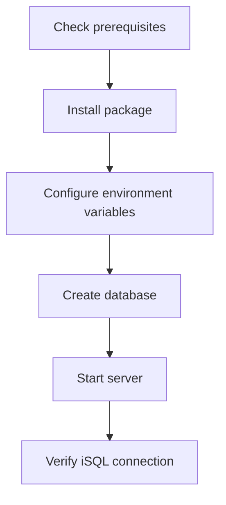

# 01. Getting Started and Installation

## Applicable Versions

- 7.1: Altibase 7.1 installation and startup procedures.
- 7.3: Altibase 7.3 installation and startup procedures.
- 8.1: Altibase 8.1 verified source installation and startup procedures.

## Questions This File Can Answer

- What should be prepared before installing Altibase?
- How should environment variables be configured after installation?
- What are the database creation, startup, and shutdown procedures?
- Which basic commands confirm that installation succeeded?

## Source Documents

- 7.1: Altibase 7.1 Getting Started Guide; Altibase 7.1 Installation Guide.
- 7.3: Altibase 7.3 Getting Started Guide; Altibase 7.3 Installation Guide.
- 8.1: Altibase 8.1 verified source Getting Started Guide; Installation Guide.

## Core Guidance

- Installation answers should follow the order OS, package, account, environment variables, database creation, and startup verification.
- If the customer does not specify a version, answer from the 8.1 baseline and tell 7.1 or 7.3 customers to confirm the package name for their version.

## Mermaid Conversion Candidate

## Version Differences

- 7.1: Keep installation package names, OS requirements, and startup commands scoped to 7.1 when the customer names 7.1.
- 7.3: Include 7.3 package, OS, and startup differences when they affect the procedure.
- 8.1: Use Altibase 8.1 verified source for default installation and first-run guidance.

## Conversion TODO

- Convert installation procedure images to Mermaid flowcharts.
- Decompose OS-specific requirement tables into itemized lists.
- Confirm version differences for database creation, startup, and shutdown commands, then organize them as examples.
