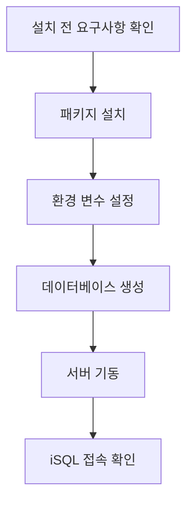

# 01. 시작하기와 설치

## 적용 버전

- 7.1: Altibase 7.1 설치/시작 절차
- 7.3: Altibase 7.3 설치/시작 절차
- 8.1: Altibase 8.1 검증본 설치/시작 절차

## 이 문서로 답할 수 있는 질문

- Altibase 설치 전 준비 사항은 무엇인가?
- 설치 후 환경 변수는 어떻게 설정하는가?
- 데이터베이스 생성, 기동, 종료 절차를 알려줘.
- 설치가 정상인지 확인하는 기본 명령은 무엇인가?

## 원천 문서

- 7.1: `Manuals/Altibase_7.1/kor/Getting Started Guide.md`, `Manuals/Altibase_7.1/kor/Installation Guide.md`
- 7.3: `Manuals/Altibase_7.3/kor/Getting Started Guide.md`, `Manuals/Altibase_7.3/kor/Installation Guide.md`
- 8.1 검증본: `Getting Started Guide.md`, `Installation Guide.md`

## 핵심 정리

- 설치 답변은 OS/패키지/계정/환경 변수/DB 생성/기동 확인 순서로 답한다.
- 고객이 버전을 말하지 않으면 8.1 기준으로 안내하고, 7.1/7.3 고객은 자기 버전 패키지명을 확인하도록 한다.

## Mermaid 변환 후보

## 변환 TODO

- 설치 절차 이미지를 Mermaid 절차도로 바꾼다.
- OS별 요구사항 표를 항목형 목록으로 분해한다.
- DB 생성/기동/종료 명령은 버전별 차이를 확인한 뒤 예제로 정리한다.
