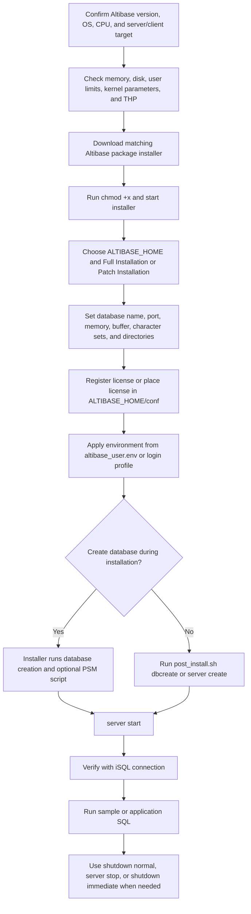

# 01. Getting Started and Installation

## Applicable Versions

- 7.1: Based on Altibase 7.1 Getting Started Guide, Installation Guide, release notes, and supported platform guidance.
- 7.3: Based on Altibase 7.3 Getting Started Guide, Installation Guide, release notes, and supported platform guidance.
- 8.1: Based on Altibase 8.1 release notes and Altibase 8.1 verified source Getting Started Guide and Installation Guide.

## Questions This File Can Answer

- What should be checked before installing Altibase?
- How do I install Altibase Server or Altibase Client from the package installer?
- Which files and environment variables are created during installation?
- How do I create the first database, start the server, connect with iSQL, and shut down safely?
- What version-specific installation differences matter for 7.1, 7.3, and 8.1?

## Source Documents

- 7.1: Altibase 7.1 Getting Started Guide; Altibase 7.1 Installation Guide; Altibase 7.1 Release Notes; Supported Platforms.
- 7.3: Altibase 7.3 Getting Started Guide; Altibase 7.3 Installation Guide; Altibase 7.3 Release Notes; Supported Platforms.
- 8.1: Altibase 8.1 Release Notes; Altibase 8.1 verified source Getting Started Guide; Altibase 8.1 verified source Installation Guide.

## Answering Rules

- If the customer does not specify a version, answer from the 8.1 baseline and say that 7.1 or 7.3 package names, supported operating systems, and patch prerequisites can differ.
- Keep commands, paths, file names, property names, user names, and error codes literal even when answering in another language.
- Do not invent a package name. Ask for the exact version, operating system, and CPU architecture, or use a placeholder such as `altibase-server-<version>-<OS>-<CPU>-64bit-release.run`.
- Installation answers should follow this order: platform check, OS account and limits, package installer, properties, license, environment, database creation, startup, iSQL verification, shutdown.

## Installation Flow



## Pre-Installation Checklist

Item: target package
Use the package that matches the requested Altibase version, operating system, and CPU architecture. Altibase Server and Altibase Client are distributed as separate package installers, but the server package includes the client package.

Item: 64-bit support
Altibase 7.1, 7.3, and 8.1 server and client packages are 64-bit. Windows is client-only for 7.1, 7.3, and 8.1 according to the supported platform and release-note sources.

Item: 8.1 platform baseline
Altibase 8.1.0.0.1 supports Linux x86-64 on Red Hat Enterprise Linux 7, 8, and 9 for server and client. Windows 2008 and Windows 10 are client-only. Altibase 8.1 requires JDK 1.8 or higher when Java components are used.

Item: memory and disk
The installation guide baseline is at least 1 GB memory on 64-bit systems, with 2 GB recommended. Reserve disk space for the software, tablespaces, transaction logs, archive logs if used, and operational growth. The guide recommends at least 12 GB free disk for smooth database operation.

Item: operating system account
Install and operate Altibase with the account that owns the Altibase installation. Startup and shutdown commands should be run by that installation account. Kernel parameters require `root`.

Item: user resource limits
Check user limits with `ulimit`. For Unix-like systems, the manuals recommend setting the Altibase account resource limits to `unlimited`, except that core file size should be handled carefully because a crash dump can be very large.

Item: kernel parameters
Configure shared memory, semaphore, file-cache, and related OS settings before running Altibase. The installer shows recommended values, and `$ALTIBASE_HOME/install/pre_install.sh` contains the post-installation reference for minimum kernel settings.

Item: Linux THP
For Linux, set Transparent Huge Pages to `never` for optimized Altibase operation. Verify with `/sys/kernel/mm/transparent_hugepage/enabled` or `/sys/kernel/mm/redhat_transparent_hugepage/enabled`.

Item: disk layout
Place redo logs and data files on separate physical disks when possible. This reduces disk I/O contention.

Item: license
Have the license ready during installation, or place the license file later as `$ALTIBASE_HOME/conf/license`. If the license is missing or expired, Altibase services will not start.

## Package Installer Procedure

Use this pattern for a server package:

```bash
chmod +x altibase-server-<version>-<OS>-<CPU>-64bit-release.run
./altibase-server-<version>-<OS>-<CPU>-64bit-release.run
```

Use this pattern for a client-only package:

```bash
chmod +x altibase-client-<version>-<OS>-<CPU>-64bit-release.run
./altibase-client-<version>-<OS>-<CPU>-64bit-release.run
```

The package installer runs in interactive command-line mode when `DISPLAY` is not set, and in GUI mode when `DISPLAY` is set. For remote GUI mode, set `DISPLAY` and allow X access from the display host.

During server installation, collect these values:

- `ALTIBASE_HOME`: installation directory containing `bin`, `conf`, `lib`, packages, and scripts.
- Installation type: `Full Installation` for a new install, `Patch Installation` for a patch over an existing base installation.
- Database name.
- Connection port number. The default example in the manuals is `20300`.
- Maximum memory database size.
- Buffer area size for disk database pages.
- Whether to create a database creation script.
- Initial database size.
- Archive logging mode: `archivelog` or `noarchivelog`.
- Database character set.
- National character set.
- Disk database directory.
- Memory database directory.
- Archive log directory.
- Transaction log directory.
- Log anchor file directories.

## Files Created or Updated by Installation

Item: `$ALTIBASE_HOME/conf/altibase.properties`
The installer writes selected property values here. To change properties after installation, edit this file and apply the operational procedure required for the changed property.

Item: `$ALTIBASE_HOME/conf/altibase_user.env`
For a server installation, the installer creates this environment file and adds a command to source it from the account profile such as `.bashrc`, `.bash_profile`, or `.profile`.

Typical server environment entries:

```bash
ALTIBASE_HOME=/path/to/altibase; export ALTIBASE_HOME
PATH=${ALTIBASE_HOME}/bin:${PATH}; export PATH
LD_LIBRARY_PATH=${ALTIBASE_HOME}/lib:${LD_LIBRARY_PATH}; export LD_LIBRARY_PATH
CLASSPATH=${ALTIBASE_HOME}/lib/Altibase.jar:${CLASSPATH}; export CLASSPATH
```

Item: login shell refresh
After installation, apply the profile change by logging out and logging in again, or by running one of these commands:

```bash
. ~/.bash_profile
source ~/.bash_profile
```

Item: client environment
For a client-only installation, `altibase_user.env` is not created. The installer adds client environment variables directly to the login shell profile. Client profiles commonly include `ALTIBASE_HOME`, `ALTIBASE_PORT_NO`, `PATH`, `LD_LIBRARY_PATH`, and `CLASSPATH`.

Item: `$ALTIBASE_HOME/install/pre_install.sh`
This file describes minimum kernel parameter settings and recommended commands. Run or apply it with the required OS privilege before starting Altibase.

Item: `$ALTIBASE_HOME/install/post_install.sh`
This file performs post-installation configuration and can create the database when database creation properties were selected during installation.

Item: `$ALTIBASE_HOME/packages/catproc.sql`
This script installs scripts required for PSM use when they were not run during installation.

Item: `$ALTIBASE_HOME/APatch`
This directory stores patch metadata, uninstall scripts such as `uninstall-base`, and rollback material for patch packages. Data files and log files are not backed up by the package rollback mechanism.

## First Database Creation

If database creation properties were selected during installation, create the database with:

```bash
cd "$ALTIBASE_HOME/install"
sh post_install.sh dbcreate
```

If database creation properties were not selected, create the database with the `server` script:

```bash
server create utf8 utf8
```

The general form is:

```bash
server create [DB Character Set] [National Character Set]
```

Choose the database character set before creating the database. The Getting Started Guide examples use values such as `UTF8`, `KSC5601`, and `UTF16`. The database character set affects client conversion, identifiers, stored SQL text, replication compatibility, and possible data loss from character conversion.

For multilingual clients, set the client character set with `ALTIBASE_NLS_USE` as needed:

```bash
export ALTIBASE_NLS_USE=UTF8
```

If NCHAR literals must be sent without client-side conversion, set:

```bash
export ALTIBASE_NLS_NCHAR_LITERAL_REPLACE=1
```

## PSM Setup

If the PSM setup was not run during installation, run `catproc.sql` after creating the database and starting the server:

```bash
isql -s 127.0.0.1 -u sys -p manager -silent -f ${ALTIBASE_HOME}/packages/catproc.sql
```

The manuals use `sys` and `manager` in examples. Replace the password with the site-specific `SYS` password if it was changed.

## Startup Procedure

Altibase can be started through iSQL in `SYSDBA` mode:

```bash
isql -u sys -p manager -sysdba
```

Then run:

```sql
startup
```

A successful startup reaches `SERVICE` phase and reports `STARTUP Process SUCCESS`.

The simpler operational command is:

```bash
server start
```

During startup, Altibase reads properties, checks system memory, initializes system data, signal handling, database memory space, the query processor, and service threads, then starts listeners such as TCP on the configured port and UNIX domain connection where supported.

## First Connection Verification

Connect locally with iSQL:

```bash
isql -s 127.0.0.1 -u sys -p manager
```

The installation quick guide also shows:

```bash
isql -s localhost -u sys -p manager
```

Treat connection success as the minimum first-run verification. For a more complete smoke test, verify these items:

- `server start` completes without license, kernel, memory, or listener errors.
- iSQL connects to the expected host and port.
- The iSQL prompt accepts SQL.
- `$ALTIBASE_HOME/trc` does not show startup failure messages.
- Application users can connect through the required client protocol after network and firewall rules are opened.

To load the sample schema supplied with the server package:

```bash
isql -s localhost -u sys -p manager -f $ALTIBASE_HOME/sample/APRE/schema/schema.sql
```

## Shutdown Procedure

Use normal shutdown when possible:

```sql
shutdown normal;
```

`shutdown normal` waits until clients disconnect before shutting down.

Use immediate shutdown when connected sessions must be disconnected and current transactions rolled back:

```sql
shutdown immediate
```

The server script equivalent for operational shutdown is:

```bash
server stop
```

Use abort or kill only when required for emergency termination:

```sql
shutdown abort
```

```bash
server kill
```

Abort and kill terminate the server forcibly. The next startup may need database recovery because the database may not have closed cleanly.

## Client-Only Installation

Use a client package when the host only needs command-line tools, libraries, JDBC, or application connectivity and will not run an Altibase server.

Client installation collects the target `ALTIBASE_HOME`, installation type, and client connection port. It updates the login shell profile with environment variables such as:

```bash
export ALTIBASE_HOME=/path/to/altibase-client
export ALTIBASE_PORT_NO=20300
export PATH=$ALTIBASE_HOME/bin:$PATH
export LD_LIBRARY_PATH=${ALTIBASE_HOME}/lib:${LD_LIBRARY_PATH}
export CLASSPATH=${ALTIBASE_HOME}/lib/Altibase.jar:${CLASSPATH}
```

After client installation, refresh the login shell and test:

```bash
isql -s <server-host> -u <user> -p <password>
```

## Patch Installation and Rollback Notes

Use `Patch Installation` only over a compatible installed base version. The installer stores patch metadata and rollback material under `$ALTIBASE_HOME/APatch`.

Patch rollback covers files installed by the package installer. It does not back up data files or log files. Back up database data and logs separately before applying a patch.

On HP-UX, the package uninstaller can uninstall the full product but does not support patch rollback. Back up the existing product manually before patching.

For meta downgrade tasks, shut down the server first:

```bash
server stop
```

If a meta downgrade is attempted while the server is running, the documented error text is:

```text
you must shutdown first before server downgrade
```

## Troubleshooting First-Run Failures

Symptom: installer aborts before installation
Check that the package file matches the host operating system, 64-bit mode, and CPU architecture.

Symptom: server does not start after installation
Check that `$ALTIBASE_HOME/conf/license` exists and is valid, kernel parameters are applied, user limits are sufficient, and the Altibase account sourced the environment profile.

Symptom: command not found for `server` or `isql`
Source the profile that sets `ALTIBASE_HOME` and updates `PATH`, or run the command by absolute path under `$ALTIBASE_HOME/bin`.

Symptom: listener or connection failure
Confirm the configured port number, `ALTIBASE_PORT_NO` for client-only profiles, host firewall rules, and whether iSQL is connecting to `127.0.0.1`, `localhost`, or a remote host.

Symptom: Linux performance is poor immediately after startup
Verify THP is disabled and check whether data and redo logs are competing on the same physical disk.

Symptom: PSM objects are missing
Run `${ALTIBASE_HOME}/packages/catproc.sql` with iSQL after the database is created and started.

## Version Differences

7.1:
Use the 7.1 installer and supported platform matrix for OS and package selection. 7.1 supports server and client on supported Unix/Linux platforms, and client-only on supported Windows platforms. Some newer operating systems require minimum 7.1 patch levels.

7.3:
Use the 7.3 installer and supported platform matrix. 7.3 expands supported Linux distributions and architectures compared with older 7.1 baselines. Some operating systems require minimum 7.3 patch levels.

8.1:
Use Altibase 8.1 release notes for supported platform, package, and compatibility guidance, and Altibase 8.1 verified source for installation workflow. Altibase 8.1.0.0.1 supports Linux x86-64 server and client on Red Hat Enterprise Linux 7, 8, and 9, supports Windows 2008 and Windows 10 client-only, supports 64-bit packages only, and requires JDK 1.8 or higher for Java components.

Upgrade caution for 8.1:
Altibase 8.1 changes database binary and metadata compatibility. Databases prior to 8.1 are not binary-compatible with 8.1, and migration or metadata rebuild planning is required for upgrades. Do not present an in-place package patch as a complete 7.x to 8.1 upgrade procedure.

## Minimal First-Run Command Sequence

Use this only after OS prerequisites and license handling are complete:

```bash
chmod +x altibase-server-<version>-<OS>-<CPU>-64bit-release.run
./altibase-server-<version>-<OS>-<CPU>-64bit-release.run
. ~/.bash_profile
cd "$ALTIBASE_HOME/install"
sh post_install.sh dbcreate
server start
isql -s 127.0.0.1 -u sys -p manager
server stop
```
