# 02. Administration and Operations

## Applicable Versions

- 7.1: Based on Altibase 7.1 Administrator's Manual.
- 7.3: Based on Altibase 7.3 Administrator's Manual.
- 8.1: Based on Altibase 8.1 verified source Administrator's Manual.

## Questions This File Can Answer

- How do I start up, shut down, back up, recover, or inspect an Altibase database?
- How are users, roles, system privileges, and object privileges managed?
- How are disk, memory, volatile, temporary, and undo tablespaces created, resized, backed up, recovered, and dropped?
- What checks should be run before and after operational SQL?
- What differs between memory tablespaces, disk tablespaces, volatile tablespaces, archive log mode, and noarchive log mode?

## Source Documents

- 7.1: Altibase 7.1 Administrator's Manual.
- 7.3: Altibase 7.3 Administrator's Manual.
- 8.1: Altibase 8.1 verified source Administrator's Manual.
- SQL Reference: datafile rename phase wording for 7.1, 7.3, and Altibase 8.1 verified source.

## Altibase Hybrid Architecture
- Altibase supports memory, disk, and volatile tablespaces in one database engine. Treat this as an operational storage choice, not a blanket performance guarantee.
- Choose memory tablespaces for persistent data that should remain memory-resident within configured limits, disk tablespaces for larger persistent data that fits disk-backed administration and recovery, and volatile tablespaces only when data loss at shutdown is acceptable.
- Do not make latency or cache-tier claims unless the answer has workload-specific evidence and an accepted Altibase source.

## Response Rules

- Answer explanatory text in the user's language.
- Keep SQL object names, function names, error codes, property names, commands, and file paths literal.
- Use English canonical names for Altibase concepts unless the user asks for localized explanation.
- For operational requests, ask for the Altibase version, database mode, startup phase, target tablespace or file, and backup status if they are not provided and the operation is destructive or recovery-related.
- Do not invent host paths. Use placeholders such as `/backup/altibase/full`, `/data/altibase/dbs/app01.dbf`, and `$ALTIBASE_HOME/dbs`.
- Do not recommend direct DML against `SYSTEM_.SYS_*` meta tables. Query meta tables and performance views with `SELECT`.
- For destructive actions such as `DROP TABLESPACE`, `ALTER TABLESPACE ... DISCARD`, incomplete recovery, or `RESETLOGS`, state the impact and the required backup follow-up.

## Operations Pattern

Use this order for most DBA answers:

1. Identify version, startup phase, database mode, and target object.
2. Check current state with performance views, dictionary views, and filesystem free space.
3. Confirm a backup or state why the operation itself is the recovery path.
4. Execute the SQL statement or OS command.
5. Verify state after the change.
6. State rollback or recovery limits.

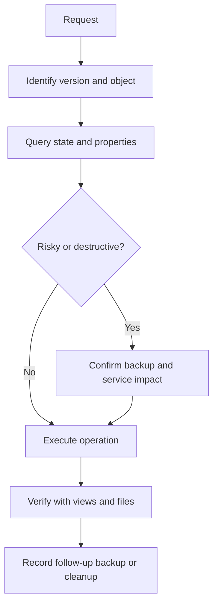

## Server Request Path

Use this diagram when explaining how a client request moves through Altibase server process components.

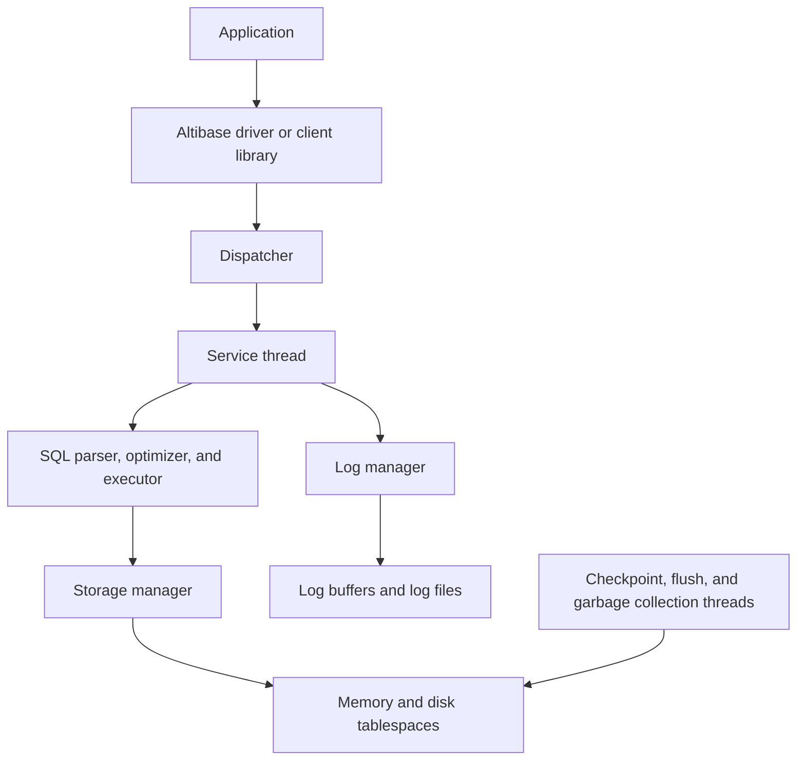

Component detail:

1. The dispatcher routes client work to service threads.
2. The storage manager works with memory tablespace pages and the buffer manager for disk tablespace data files.
3. The log manager writes to the log buffer, online log files, and archive log files when `ARCHIVELOG` is enabled.
4. Checkpoint, buffer flush, and garbage collection threads maintain stable data images, dirty-buffer flushing, log anchors, and memory cleanup.

## Core Connection and Phase Commands

Connect as `SYSDBA` for startup, shutdown, backup, recovery, and most database-level maintenance:

```bash
isql -u sys -p manager -sysdba
```

`manager` is an example password from the manuals. Use the site-specific `SYS` password, and do not embed production passwords in reusable scripts.

Startup phases move forward only:

```sql
STARTUP PROCESS;
STARTUP CONTROL;
STARTUP META;
STARTUP SERVICE;
```

Equivalent database startup clauses:

```sql
ALTER DATABASE mydb CONTROL;
ALTER DATABASE mydb META;
ALTER DATABASE mydb SERVICE;
```

Phase block: `PROCESS`

- Purpose: early phase used for database creation, database drop, limited performance views, property changes, and preparing for `CONTROL`.
- Normal user connections are not available.

Phase block: `CONTROL`

- Purpose: media recovery, changing `ARCHIVELOG` or `NOARCHIVELOG`, creating replacement data files, renaming data file references, and discarding unusable tablespaces.
- `ALTER DATABASE RECOVER DATABASE` must be executed here.

Phase block: `META`

- Purpose: load metadata and proceed toward service. After incomplete recovery, use `ALTER DATABASE mydb META RESETLOGS`.
- Some metadata upgrade tasks also occur in this phase.

Phase block: `SERVICE`

- Purpose: normal service. Users other than `SYS` can connect.
- `SHUTDOWN NORMAL` and `SHUTDOWN IMMEDIATE` are service-phase shutdown choices.
- `SHUTDOWN ABORT` can be executed in any startup phase, but it is emergency-only because restart recovery is expected.

Shutdown choices:

```sql
SHUTDOWN NORMAL;
SHUTDOWN IMMEDIATE;
SHUTDOWN ABORT;
```

Command block: `SHUTDOWN NORMAL`

- Waits for connected clients to disconnect.
- Use for planned maintenance when waiting is acceptable.

Command block: `SHUTDOWN IMMEDIATE`

- Disconnects active sessions, rolls back pending transactions, and shuts down normally.
- The `server stop` script also performs an immediate-style shutdown.

Command block: `SHUTDOWN ABORT`

- Forcibly terminates the server.
- Restart recovery is expected on the next startup. Use only when normal or immediate shutdown is not possible.
- Do not present `SHUTDOWN ABORT` as a normal service-phase alternative for planned maintenance.

## Key Operational Views

Use these first for DBA checks:

```sql
SELECT server_status,
       archivelog_mode,
       begin_chkpt_file_no,
       begin_chkpt_file_offset,
       end_chkpt_file_no,
       end_chkpt_file_offset,
       oldest_logfile_no,
       oldest_logfile_offset,
       transaction_segment_count
FROM V$LOG;
```

8.1-only checkpoint-scale check:

```sql
-- Use this only after confirming the target version or column availability.
SELECT table_name, column_name
FROM V$ALLCOLUMN
WHERE table_name = 'V$LOG'
  AND column_name = 'CHECKPOINT_SCALE';

SELECT checkpoint_scale
FROM V$LOG;
```

```sql
SELECT lfg_id,
       archive_mode,
       archive_thr_running,
       archive_dest,
       nextlogfile_to_arch,
       oldest_active_logfile,
       current_logfile
FROM V$ARCHIVE
ORDER BY lfg_id;

SELECT id,
       name,
       type,
       state,
       datafile_count,
       total_page_count,
       allocated_page_count,
       page_size
FROM V$TABLESPACES
ORDER BY id;

SELECT d.id,
       d.name,
       d.spaceid,
       t.name AS tablespace_name,
       t.page_size,
       d.currsize AS currsize_pages,
       d.currsize * t.page_size AS currsize_bytes,
       d.currsize * t.page_size / 1048576 AS currsize_mb,
       d.autoextend,
       d.opened,
       d.modified,
       d.state
FROM V$DATAFILES d,
     V$TABLESPACES t
WHERE d.spaceid = t.id
ORDER BY d.spaceid, d.id;

SELECT space_id,
       space_name,
       space_status,
       autoextend_mode,
       autoextend_nextsize,
       maxsize,
       current_size,
       alloc_page_count,
       free_page_count,
       current_db
FROM V$MEM_TABLESPACES
ORDER BY space_id;

SELECT space_name,
       current_size,
       autoextend_mode,
       next_size,
       max_size
FROM V$VOL_TABLESPACES
ORDER BY space_name;
```

For version-sensitive views, check availability first:

```sql
SELECT name, columncount
FROM V$TABLE
WHERE name IN ('V$MEM_STABLE', 'V$STABLE_MEM_DATAFILES', 'V$BACKUP_INFO',
               'V$OBSOLETE_BACKUP_INFO');
```

## Users, Roles, and Privileges

Only `SYSTEM_` and `SYS` exist immediately after database creation. `SYSTEM_` owns metadata. `SYS` is the DBA account and can perform system-level operations. These built-in users cannot be modified or dropped with ordinary user DDL.

User operation block: create user

```sql
CREATE USER app_user IDENTIFIED BY app_password
DEFAULT TABLESPACE app_data
TEMPORARY TABLESPACE app_temp
ACCESS app_data ON
LIMIT (
    FAILED_LOGIN_ATTEMPTS 5,
    PASSWORD_LOCK_TIME 1,
    PASSWORD_LIFE_TIME 90,
    PASSWORD_GRACE_TIME 7
);
```

Checklist:

1. Confirm the default and temporary tablespaces exist and are online.
2. Confirm the creator has `CREATE USER`.
3. Set `DEFAULT TABLESPACE`, `TEMPORARY TABLESPACE`, and explicit `ACCESS tablespace_name ON` for every tablespace the user will use.
4. Grant only the required system and object privileges, preferably through roles for repeatable operational grants.
5. Verify login, default tablespace behavior, roles, and grants.

User operation block: alter user

```sql
ALTER USER app_user IDENTIFIED BY new_password;
ALTER USER app_user DEFAULT TABLESPACE app_data2;
ALTER USER app_user TEMPORARY TABLESPACE app_temp2;
ALTER USER app_user ACCESS app_archive ON;
ALTER USER app_user ACCOUNT LOCK;
ALTER USER app_user ACCOUNT UNLOCK;
```

`ALTER USER ... LIMIT (...)` can be executed only by `SYS`. When a password policy is changed, policy items omitted from the new `LIMIT` clause are initialized. An individual user can change their own password without `ALTER USER` system privilege, but changing other users requires `ALTER USER`.

For SSL or IPC-only accounts, `SYS` can restrict ordinary TCP connections:

```sql
ALTER USER app_user DISABLE TCP;
ALTER USER app_user ENABLE TCP;
```

When changing the `SYS` password with `ALTER USER`, also run `altipasswd` so `$ALTIBASE_HOME/conf/syspassword` matches, and update scripts that embed the old password.

User operation block: drop user

```sql
DROP USER app_user;
DROP USER app_user CASCADE;
```

Use `CASCADE` only when the user's schema objects should also be removed.

Role operation block:

Executor prerequisites: run role and grant examples as `SYS`, or as an account with the needed authority. Role creation requires `CREATE ROLE`; system privilege grants require `GRANT ANY PRIVILEGES`; role grants require `GRANT ANY ROLE`; object grants require the object owner or object privilege `WITH GRANT OPTION`.

```sql
CREATE ROLE app_runtime_role;
GRANT SELECT, INSERT, UPDATE, DELETE ON app_owner.orders TO app_runtime_role;
GRANT app_runtime_role TO app_user;
DROP ROLE app_runtime_role;
```

Role rules:

- A role is created empty; grant system privileges or object privileges to the role, then grant the role to users.
- A user must reconnect before privileges newly granted through a role are enabled.
- A role cannot be granted to another role or to `PUBLIC`.
- A user can have at most 126 granted roles.
- Use `DROP ROLE` only after checking users that currently depend on the role.

Privilege block: system privileges

- Database: `ALTER SYSTEM`, `ALTER DATABASE`, `DROP DATABASE`.
- Tablespace: `CREATE TABLESPACE`, `ALTER TABLESPACE`, `DROP TABLESPACE`. `MANAGE TABLESPACE` is documented as SYS-only; do not grant it or recommend it in customer grant scripts.
- User: `CREATE USER`, `ALTER USER`, `DROP USER`.
- Table: `CREATE TABLE`, `CREATE ANY TABLE`, `ALTER ANY TABLE`, `DROP ANY TABLE`, `SELECT ANY TABLE`, `INSERT ANY TABLE`, `UPDATE ANY TABLE`, `DELETE ANY TABLE`, `LOCK ANY TABLE`.
- Session: `CREATE SESSION`, `ALTER SESSION`.
- Other common families: index, sequence, procedure, view, role, synonym, materialized view, trigger, directory, database link, library, and job privileges.

Object privilege support blocks:

- Table: `ALTER`, `DELETE`, `INDEX`, `INSERT`, `REFERENCES`, `SELECT`, `UPDATE`.
- Sequence: `ALTER`, `SELECT`.
- Stored procedure, stored function, package, and external procedure: `EXECUTE`.
- View: `SELECT`.
- Directory: `READ`, `WRITE`.
- External library: `EXECUTE`.

Privilege operation block: grant and revoke

Executor prerequisites are the same as for the role operation block. Confirm the grantor authority before running operational grant scripts.

```sql
CREATE ROLE app_dba_role;
GRANT CREATE TABLESPACE, ALTER TABLESPACE TO app_dba_role;
GRANT app_dba_role TO app_dba_user;

CREATE ROLE app_runtime_role;
GRANT SELECT, INSERT, UPDATE ON app_owner.orders TO app_runtime_role;
GRANT app_runtime_role TO app_user;

REVOKE ALTER TABLESPACE FROM app_dba_role;
REVOKE UPDATE ON app_owner.orders FROM app_runtime_role;
```

Object grants require `SYS`, the object owner, or a user that already has the relevant object privilege `WITH GRANT OPTION`. Do not add `WITH GRANT OPTION` for ordinary application users. Do not use it when granting object privileges to a role.

Revocation rules:

- The `SYS` user or the original grantor can revoke privileges.
- Revoke the exact system privilege, object privilege, or role that was granted.
- Use `CASCADE CONSTRAINTS` when revoking `REFERENCES` or `ALL` must also drop dependent referential constraints.
- Review dependent sessions and application behavior before revoking a role used by active users.

When a general user is created, Altibase automatically grants baseline privileges such as `CREATE SESSION`, `CREATE TABLE`, `CREATE SEQUENCE`, `CREATE PROCEDURE`, `CREATE VIEW`, `CREATE TRIGGER`, `CREATE SYNONYM`, `CREATE MATERIALIZED VIEW`, `CREATE DATABASE LINK`, and `CREATE LIBRARY`. Still state explicit grants in operational answers so the final privilege model is auditable. For a strict runtime account, audit the automatically granted baseline privileges and revoke unused DDL privileges such as `CREATE TABLE`, `CREATE SEQUENCE`, `CREATE PROCEDURE`, `CREATE VIEW`, `CREATE TRIGGER`, `CREATE SYNONYM`, `CREATE MATERIALIZED VIEW`, `CREATE DATABASE LINK`, and `CREATE LIBRARY`.

Least-privilege notes:

- Prefer object privileges on named objects over `ANY` system privileges.
- Prefer a small role per operational duty, such as `app_runtime_role`, `app_readonly_role`, or `app_dba_role`, over direct grants scattered across users.
- Avoid `ALL PRIVILEGES`, `TO PUBLIC`, `GRANT ANY PRIVILEGES`, and broad `ANY` privileges unless the request is explicitly administrative.
- Separate schema owner accounts from runtime application accounts. Runtime users normally need `CREATE SESSION` plus object privileges only.
- Do not grant metadata-modifying privileges such as `CREATE USER`, `DROP USER`, `CREATE TABLESPACE`, or `ALTER SYSTEM` to application runtime users.

Audit users, roles, and grants:

```sql
SELECT u.user_name, u.user_type, u.account_lock, u.disable_tcp,
       dt.name AS default_tablespace,
       tt.name AS temporary_tablespace
FROM SYSTEM_.SYS_USERS_ u, V$TABLESPACES dt, V$TABLESPACES tt
WHERE u.default_tbs_id = dt.id
  AND u.temp_tbs_id = tt.id
ORDER BY u.user_type, u.user_name;

SELECT grantee.user_name AS grantee_name,
       role_user.user_name AS role_name
FROM SYSTEM_.SYS_USER_ROLES_ r,
     SYSTEM_.SYS_USERS_ grantee,
     SYSTEM_.SYS_USERS_ role_user
WHERE r.grantee_id = grantee.user_id
  AND r.role_id = role_user.user_id
ORDER BY grantee.user_name, role_user.user_name;

SELECT grantee.user_name AS grantee_name,
       p.priv_name
FROM SYSTEM_.SYS_GRANT_SYSTEM_ g,
     SYSTEM_.SYS_USERS_ grantee,
     SYSTEM_.SYS_PRIVILEGES_ p
WHERE g.grantee_id = grantee.user_id
  AND g.priv_id = p.priv_id
ORDER BY grantee.user_name, p.priv_name;

SELECT grantee.user_name AS grantee_name,
       p.priv_name,
       owner.user_name AS object_owner,
       t.table_name AS object_name,
       g.obj_type,
       g.with_grant_option
FROM SYSTEM_.SYS_GRANT_OBJECT_ g,
     SYSTEM_.SYS_USERS_ grantee,
     SYSTEM_.SYS_USERS_ owner,
     SYSTEM_.SYS_PRIVILEGES_ p,
     SYSTEM_.SYS_TABLES_ t
WHERE g.grantee_id = grantee.user_id
  AND g.user_id = owner.user_id
  AND g.priv_id = p.priv_id
  AND g.user_id = t.user_id
  AND g.obj_id = t.table_id
ORDER BY grantee.user_name, owner.user_name, t.table_name, p.priv_name;
```

Audit broad or public grants:

```sql
SELECT grantee.user_name AS grantee_name, p.priv_name
FROM SYSTEM_.SYS_GRANT_SYSTEM_ g,
     SYSTEM_.SYS_USERS_ grantee,
     SYSTEM_.SYS_PRIVILEGES_ p
WHERE g.grantee_id = grantee.user_id
  AND g.priv_id = p.priv_id
  AND p.priv_name IN (
      'CREATE TABLE', 'CREATE SEQUENCE', 'CREATE PROCEDURE',
      'CREATE VIEW', 'CREATE TRIGGER', 'CREATE SYNONYM',
      'CREATE MATERIALIZED VIEW', 'CREATE DATABASE LINK',
      'CREATE LIBRARY'
  )
ORDER BY grantee.user_name, p.priv_name;

SELECT grantee.user_name AS grantee_name, p.priv_name
FROM SYSTEM_.SYS_GRANT_SYSTEM_ g,
     SYSTEM_.SYS_USERS_ grantee,
     SYSTEM_.SYS_PRIVILEGES_ p
WHERE g.grantee_id = grantee.user_id
  AND g.priv_id = p.priv_id
  AND (p.priv_name = 'ALL' OR p.priv_name LIKE '% ANY %')
ORDER BY grantee.user_name, p.priv_name;

SELECT p.priv_name,
       owner.user_name AS object_owner,
       t.table_name AS object_name,
       g.obj_type,
       g.with_grant_option
FROM SYSTEM_.SYS_GRANT_OBJECT_ g,
     SYSTEM_.SYS_USERS_ owner,
     SYSTEM_.SYS_PRIVILEGES_ p,
     SYSTEM_.SYS_TABLES_ t
WHERE g.grantee_id = 0
  AND g.user_id = owner.user_id
  AND g.priv_id = p.priv_id
  AND g.user_id = t.user_id
  AND g.obj_id = t.table_id
ORDER BY owner.user_name, t.table_name, p.priv_name;
```

## Tablespace Concepts

Tablespaces store tables, indexes, and related database objects. System tablespaces are created during `CREATE DATABASE`; DBAs create user-defined tablespaces as needed.

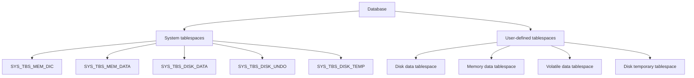

Physical and logical storage relationship:

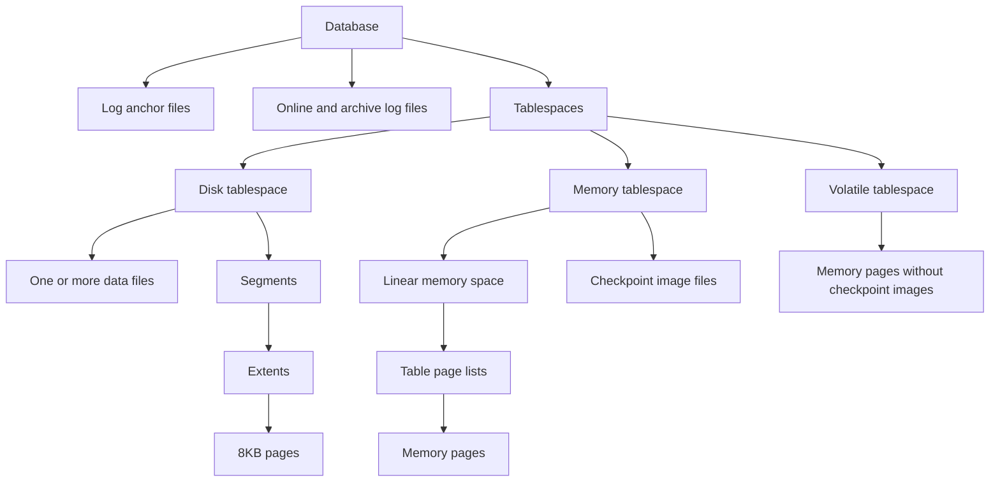

Disk tablespace structure:

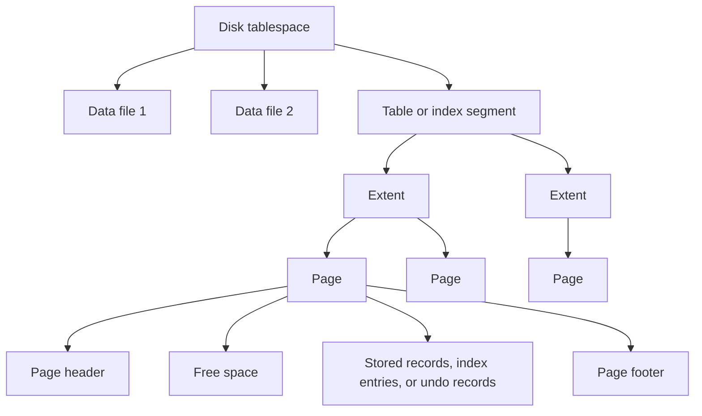

Memory tablespace checkpoint structure:

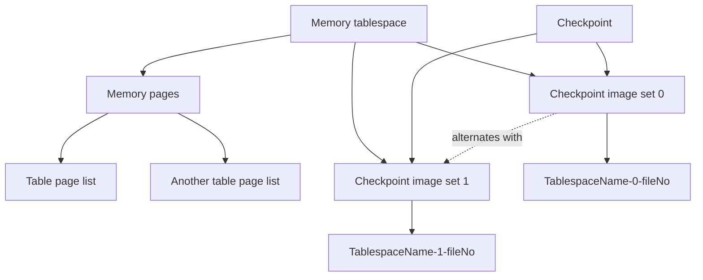

Tablespace type block: disk data tablespace

- Stores permanent disk tables and indexes.
- Physically consists of one or more data files.
- Logically consists of segments, extents, and pages.
- Best for large data volumes and data where disk I/O is acceptable.
- Page size is 8KB.

Tablespace type block: memory data tablespace

- Stores table data in memory.
- Uses checkpoint image files on disk for restart, backup, and recovery.
- Tables use page lists; memory table indexes are rebuilt on restart.
- Best for frequently accessed data that fits in memory.
- Size and autoextend increments must align with `EXPAND_CHUNK_PAGE_COUNT * 32KB`.

Tablespace type block: volatile data tablespace

- Stores data in memory without checkpoint image files.
- No disk logging or checkpointing for volatile data.
- Data is lost when the server shuts down.
- Best for temporary high-speed processing where persistence is not required.

Tablespace type block: temporary tablespace

- Disk-based working space for temporary query results.
- Temporary result data is not persistent user data and is discarded when the session or statement no longer needs it.
- Disk temporary tablespaces cannot be backed up with online tablespace backup. Offline physical backup plans should still account for discovered temporary files unless the site recovery plan intentionally recreates them.
- `ONLINE`, `OFFLINE`, and `DISCARD` state changes do not apply to temporary tablespaces.

Tablespace type block: undo tablespace

- Stores undo records for disk-object updates.
- Supports rollback, recovery, and read consistency.
- Only one undo tablespace exists: `SYS_TBS_DISK_UNDO`.
- Automatically managed by the system, but DBAs can add, drop, resize, and back up its data files.
- It cannot be taken offline or discarded.

System tablespace block:

- `SYS_TBS_MEM_DIC`: memory dictionary tablespace for metadata.
- `SYS_TBS_MEM_DATA`: system memory default data tablespace.
- `SYS_TBS_DISK_DATA`: system disk default data tablespace.
- `SYS_TBS_DISK_UNDO`: system undo tablespace.
- `SYS_TBS_DISK_TEMP`: system disk temporary tablespace.

## Tablespace State Blocks

State block: `ONLINE`

- Objects in the tablespace are available.
- DML and DDL can run normally.
- This is the normal service state.

State block: `OFFLINE`

- Objects in the tablespace are unavailable.
- Only limited tablespace DDL such as `DROP TABLESPACE`, `ALTER TABLESPACE ... DISCARD`, and `ALTER TABLESPACE ... ONLINE` can be executed.
- User-defined disk and memory tablespaces can be moved between `ONLINE` and `OFFLINE`.
- Volatile and temporary tablespaces cannot be changed to `OFFLINE`.
- Tablespaces containing replicated tables cannot have their state changed.

State block: `DISCARD`

- Used when a damaged disk or memory tablespace prevents startup and media recovery is not possible.
- Can be executed only in the `CONTROL` phase.
- The discarded tablespace cannot be brought online; the only follow-up operation is `DROP TABLESPACE`.
- Use with care because objects in the tablespace become inaccessible.

State operation block:

```sql
ALTER TABLESPACE app_data OFFLINE;
ALTER TABLESPACE app_data ONLINE;
ALTER TABLESPACE app_data DISCARD;
```

## Tablespace DDL Syntax

Version rule: `IF NOT EXISTS` is available for tablespace creation in the Altibase 8.1 verified source. Omit it for 7.1 and 7.3.

Disk data tablespace:

```text
create_if_not_exists ::=
  IF NOT EXISTS        -- 8.1 verified source only

disk_tablespace ::=
  CREATE [DISK] [DATA] TABLESPACE [create_if_not_exists] tablespace_name
  DATAFILE file_spec [, file_spec ...]
  [EXTENTSIZE size]
  [SEGMENT MANAGEMENT {AUTO | MANUAL}]

file_spec ::=
  'absolute_file_path' [SIZE size] [REUSE]
  [AUTOEXTEND {ON [NEXT size] [MAXSIZE {size | UNLIMITED}] | OFF}]
```

Memory data tablespace:

```text
memory_tablespace ::=
  CREATE MEMORY [DATA] TABLESPACE [create_if_not_exists] tablespace_name
  SIZE size
  [AUTOEXTEND {ON [NEXT size] [MAXSIZE {size | UNLIMITED}] | OFF}]
  [CHECKPOINT PATH 'directory' [, 'directory' ...]]
  [SPLIT EACH size]
  [ONLINE | OFFLINE]
```

Volatile data tablespace:

```text
volatile_tablespace ::=
  CREATE VOLATILE [DATA] TABLESPACE [create_if_not_exists] tablespace_name
  SIZE size
  [AUTOEXTEND {ON [NEXT size] [MAXSIZE {size | UNLIMITED}] | OFF}]
```

Temporary tablespace:

```text
temporary_tablespace ::=
  CREATE TEMPORARY TABLESPACE [create_if_not_exists] tablespace_name
  TEMPFILE tempfile_spec [, tempfile_spec ...]
  [EXTENTSIZE size]

tempfile_spec ::=
  'absolute_file_path' [SIZE size] [REUSE]
  [AUTOEXTEND {ON [NEXT size] [MAXSIZE {size | UNLIMITED}] | OFF}]
```

Drop tablespace:

```text
drop_if_exists ::=
  IF EXISTS           -- 8.1 verified source only; omit for 7.1 and 7.3

disk_or_memory_drop_tablespace ::=
  DROP TABLESPACE [drop_if_exists] tablespace_name
  [INCLUDING CONTENTS [AND DATAFILES] [CASCADE CONSTRAINTS]]

volatile_drop_tablespace ::=
  DROP TABLESPACE [drop_if_exists] tablespace_name
  [INCLUDING CONTENTS [CASCADE CONSTRAINTS]]
```

Version rule: `DROP TABLESPACE IF EXISTS` is available only in the Altibase 8.1 verified source. For 7.1 and 7.3, omit `IF EXISTS`; make idempotent drop scripts use a metadata pre-check plus script-side conditional execution before running ordinary `DROP TABLESPACE`.

Type rule: Use `AND DATAFILES` only for disk or memory tablespaces. It removes disk data files for disk tablespaces and checkpoint image files for memory tablespaces. Volatile tablespace drops must omit `AND DATAFILES`.

Alter tablespace:

```text
alter_tablespace ::=
  ALTER TABLESPACE tablespace_name
    ADD DATAFILE file_spec
  | ALTER TABLESPACE tablespace_name
    DROP DATAFILE 'absolute_file_path'
  | ALTER TABLESPACE tablespace_name
    ALTER DATAFILE 'absolute_file_path'
      {SIZE size | AUTOEXTEND {ON [NEXT size] [MAXSIZE {size | UNLIMITED}] | OFF}}
  | ALTER TABLESPACE tablespace_name
    RENAME DATAFILE 'old_absolute_file_path' TO 'new_absolute_file_path'
  | ALTER TABLESPACE tablespace_name
    ADD TEMPFILE tempfile_spec
  | ALTER TABLESPACE tablespace_name
    DROP TEMPFILE 'absolute_file_path'
  | ALTER TABLESPACE tablespace_name
    ALTER TEMPFILE 'absolute_file_path'
      {SIZE size | AUTOEXTEND {ON [NEXT size] [MAXSIZE {size | UNLIMITED}] | OFF}}
  | ALTER TABLESPACE tablespace_name
    RENAME TEMPFILE 'old_absolute_file_path' TO 'new_absolute_file_path'
  | ALTER TABLESPACE tablespace_name
    ADD CHECKPOINT PATH 'directory'
  | ALTER TABLESPACE tablespace_name
    DROP CHECKPOINT PATH 'directory'
  | ALTER TABLESPACE tablespace_name
    RENAME CHECKPOINT PATH 'old_directory' TO 'new_directory'
  | ALTER TABLESPACE tablespace_name
    ALTER {SIZE size | AUTOEXTEND {ON [NEXT size] [MAXSIZE {size | UNLIMITED}] | OFF}}
  | ALTER TABLESPACE tablespace_name
    {ONLINE | OFFLINE | DISCARD}
  | ALTER TABLESPACE tablespace_name
    {BEGIN BACKUP | END BACKUP}
```

DDL rules:

- `AUTOEXTEND OFF` is the default for disk files, temporary files, memory tablespaces, and volatile tablespaces.
- For disk data files, emit explicit `SIZE`, `NEXT`, and `MAXSIZE`; when reviewing omitted-value scripts, inspect file-size properties such as `USER_DATA_FILE_INIT_SIZE`, `USER_DATA_FILE_NEXT_SIZE`, and `USER_DATA_FILE_MAX_SIZE` for the target version.
- Disk temporary file defaults are controlled by `USER_TEMP_FILE_INIT_SIZE`, `USER_TEMP_FILE_NEXT_SIZE`, and `USER_TEMP_FILE_MAX_SIZE`.
- Memory and volatile `SIZE` and `AUTOEXTEND NEXT` must be multiples of `EXPAND_CHUNK_PAGE_COUNT * 32KB`.
- Memory growth is bounded by `MEM_MAX_DB_SIZE`; volatile growth is bounded by `VOLATILE_MAX_DB_SIZE`.
- `CHECKPOINT PATH` operations apply only to memory tablespaces and require the DBA to create, move, or remove the underlying OS directories and checkpoint image files.
- Temporary tablespaces are disk work space. `GLOBAL TEMPORARY TABLE` storage is specified with a volatile tablespace in the table `TABLESPACE` clause.

## Tablespace Operation Runbooks

Runbook: preflight checks before creating or altering tablespaces

```sql
SELECT product_version, meta_version
FROM V$VERSION;

SELECT name, value1
FROM V$PROPERTY
WHERE name IN (
  'DEFAULT_SEGMENT_MANAGEMENT_TYPE',
  'USER_DATA_FILE_INIT_SIZE',
  'USER_DATA_FILE_NEXT_SIZE',
  'USER_DATA_FILE_MAX_SIZE',
  'USER_TEMP_FILE_INIT_SIZE',
  'USER_TEMP_FILE_NEXT_SIZE',
  'USER_TEMP_FILE_MAX_SIZE',
  'EXPAND_CHUNK_PAGE_COUNT',
  'MEM_MAX_DB_SIZE',
  'VOLATILE_MAX_DB_SIZE',
  'MEM_DB_DIR'
)
ORDER BY name;

SELECT id,
       name,
       type,
       state,
       datafile_count,
       total_page_count * page_size AS total_bytes,
       allocated_page_count * page_size AS allocated_bytes
FROM V$TABLESPACES
ORDER BY id;
```

Preflight notes:

- For 8.1, decide whether `IF NOT EXISTS` is appropriate. It suppresses a duplicate-name error but does not prove that the existing tablespace has the requested files, size, or autoextend settings.
- For disk and temporary files, confirm filesystem free space and Altibase OS user permissions before running DDL.
- For memory tablespaces, calculate the allocation unit from `EXPAND_CHUNK_PAGE_COUNT * 32KB` and choose `SIZE`, `AUTOEXTEND NEXT`, and `SPLIT EACH` values accordingly.
- For volatile tablespaces, calculate the allocation unit from `EXPAND_CHUNK_PAGE_COUNT * 32KB` and choose `SIZE` and `AUTOEXTEND NEXT` values accordingly.

Runbook: create disk data tablespace

```sql
CREATE DISK DATA TABLESPACE app_disk_tbs
DATAFILE '/data/altibase/dbs/app_disk01.dbf' SIZE 1G
AUTOEXTEND ON NEXT 256M MAXSIZE 20G
EXTENTSIZE 512K
SEGMENT MANAGEMENT AUTO;

SELECT t.name AS tablespace_name,
       d.name AS datafile_name,
       t.page_size,
       d.currsize AS currsize_pages,
       d.currsize * t.page_size AS currsize_bytes,
       d.currsize * t.page_size / 1048576 AS currsize_mb,
       d.maxsize AS maxsize_pages,
       d.maxsize * t.page_size AS maxsize_bytes,
       d.maxsize * t.page_size / 1048576 AS maxsize_mb,
       d.autoextend,
       d.state
FROM V$TABLESPACES t, V$DATAFILES d
WHERE t.id = d.spaceid
  AND t.name = 'APP_DISK_TBS';
```

Before running:

- Confirm filesystem free space for the initial size, autoextend next size, and max size.
- Confirm the operating system user that starts Altibase can create the data file.
- Decide whether the tablespace should use automatic or manual segment management according to the local standard.

Runbook: add or resize disk datafile

```sql
ALTER TABLESPACE app_disk_tbs
ADD DATAFILE '/data/altibase/dbs/app_disk02.dbf' SIZE 1G
AUTOEXTEND ON NEXT 256M MAXSIZE 20G;

ALTER TABLESPACE app_disk_tbs
ALTER DATAFILE '/data/altibase/dbs/app_disk01.dbf'
SIZE 2G;

ALTER TABLESPACE app_disk_tbs
ALTER DATAFILE '/data/altibase/dbs/app_disk01.dbf'
AUTOEXTEND ON NEXT 256M MAXSIZE 30G;
```

Rules:

- A data file can be dropped only when no extents are allocated to it.
- A data file size or max size must remain greater than currently used space.
- Autoextension can make active work wait while the file grows; leave enough headroom.

Runbook: recovery or strict-policy disk datafile move in `CONTROL`

Use this as the copy-ready default for media recovery, failed storage, or any local runbook that must follow the stricter SQL Reference phase rule. The target file in `TO` must already exist and must be an absolute path.

```sql
SELECT t.name AS tablespace_name,
       d.name AS datafile_name,
       t.page_size,
       d.currsize AS currsize_pages,
       d.currsize * t.page_size AS currsize_bytes,
       d.currsize * t.page_size / 1048576 AS currsize_mb,
       d.maxsize AS maxsize_pages,
       d.maxsize * t.page_size AS maxsize_bytes,
       d.maxsize * t.page_size / 1048576 AS maxsize_mb,
       d.autoextend,
       d.opened,
       d.state
FROM V$TABLESPACES t, V$DATAFILES d
WHERE t.id = d.spaceid
  AND d.name = '/data/altibase/dbs/app_disk01.dbf';
```

```bash
server stop
SYS_PASSWORD='replace_with_site_sys_password'
isql -u sys -p "$SYS_PASSWORD" -sysdba
```

```sql
STARTUP CONTROL;
```

```bash
SOURCE_DATAFILE=/backup/altibase/app_disk01.dbf
TARGET_DATAFILE=/data2/altibase/dbs/app_disk01.dbf
# For a planned strict-policy move while the old disk is healthy, use:
# SOURCE_DATAFILE=/data/altibase/dbs/app_disk01.dbf

mkdir -p "$(dirname "$TARGET_DATAFILE")"
cp -p "$SOURCE_DATAFILE" "$TARGET_DATAFILE"
# Use mv instead of cp only after the service window and rollback plan are approved.
# Change these variables if Altibase runs under a different OS account.
ALTIBASE_OS_USER=altibase
ALTIBASE_OS_GROUP=altibase
chown "${ALTIBASE_OS_USER}:${ALTIBASE_OS_GROUP}" "$TARGET_DATAFILE"
chmod --reference="$SOURCE_DATAFILE" "$TARGET_DATAFILE"
stat -c '%U %G %A %n' "$SOURCE_DATAFILE" "$TARGET_DATAFILE"
test -r "$TARGET_DATAFILE" && test -w "$TARGET_DATAFILE"
```

```sql
ALTER DATABASE RENAME DATAFILE
'/data/altibase/dbs/app_disk01.dbf'
TO
'/data2/altibase/dbs/app_disk01.dbf';

SELECT t.name AS tablespace_name,
       d.name AS datafile_name,
       d.opened,
       d.state
FROM V$TABLESPACES t, V$DATAFILES d
WHERE t.id = d.spaceid
  AND d.name = '/data2/altibase/dbs/app_disk01.dbf';

-- Recovery case only. For a planned strict-policy move with no media failure, omit this statement.
ALTER DATABASE RECOVER DATABASE;
STARTUP SERVICE;
```

Runbook: planned service/offline disk datafile move

Use this only when site source policy explicitly accepts the Administrator's Manual wording for service-phase rename of an offline tablespace. Do not use it for system tablespaces, temporary or volatile tablespaces, replicated tablespaces that cannot be taken offline, or media recovery.

```sql
SELECT t.name AS tablespace_name,
       t.state AS tablespace_state,
       d.name AS datafile_name,
       d.opened,
       d.state AS datafile_state
FROM V$TABLESPACES t, V$DATAFILES d
WHERE t.id = d.spaceid
  AND t.name = 'APP_DISK_TBS';

ALTER TABLESPACE app_disk_tbs OFFLINE;
```

```bash
mkdir -p /data2/altibase/dbs
cp -p /data/altibase/dbs/app_disk01.dbf /data2/altibase/dbs/app_disk01.dbf
# Use mv instead of cp only after rollback requirements are clear.
ALTIBASE_OS_USER=altibase
ALTIBASE_OS_GROUP=altibase
chown "${ALTIBASE_OS_USER}:${ALTIBASE_OS_GROUP}" /data2/altibase/dbs/app_disk01.dbf
chmod --reference=/data/altibase/dbs/app_disk01.dbf /data2/altibase/dbs/app_disk01.dbf
stat -c '%U %G %A %n' /data/altibase/dbs/app_disk01.dbf /data2/altibase/dbs/app_disk01.dbf
test -r /data2/altibase/dbs/app_disk01.dbf && test -w /data2/altibase/dbs/app_disk01.dbf
```

```sql
ALTER TABLESPACE app_disk_tbs
RENAME DATAFILE '/data/altibase/dbs/app_disk01.dbf'
TO '/data2/altibase/dbs/app_disk01.dbf';

SELECT t.name AS tablespace_name,
       t.state AS tablespace_state,
       d.name AS datafile_name,
       d.opened,
       d.state AS datafile_state
FROM V$TABLESPACES t, V$DATAFILES d
WHERE t.id = d.spaceid
  AND t.name = 'APP_DISK_TBS'
  AND d.name = '/data2/altibase/dbs/app_disk01.dbf';

ALTER TABLESPACE app_disk_tbs ONLINE;
```

Source-audit note:

- The Administrator's Manual says `ALTER TABLESPACE ... RENAME DATAFILE` can change a datafile location in any startup phase, but in `SERVICE` only for an offline tablespace.
- The SQL Reference says `RENAME DATAFILE` is available only in `CONTROL`.
- For customer answers, prefer the `CONTROL` runbook unless the customer's version, maintenance policy, and test result explicitly accept the Administrator's Manual service/offline wording.

Runbook: create memory tablespace

```sql
CREATE MEMORY DATA TABLESPACE app_mem_tbs
SIZE 500M
AUTOEXTEND ON NEXT 100M MAXSIZE 4000M
CHECKPOINT PATH '/data/altibase/chkpt01', '/data/altibase/chkpt02'
SPLIT EACH 500M;

SELECT space_name,
       space_status,
       current_size,
       autoextend_mode,
       autoextend_nextsize,
       maxsize,
       free_page_count,
       current_db
FROM V$MEM_TABLESPACES
WHERE space_name = 'APP_MEM_TBS';

SELECT p.checkpoint_path
FROM V$MEM_TABLESPACES m,
     V$MEM_TABLESPACE_CHECKPOINT_PATHS p
WHERE m.space_id = p.space_id
  AND m.space_name = 'APP_MEM_TBS'
ORDER BY p.checkpoint_path;
```

Rules:

- `SIZE`, `AUTOEXTEND NEXT`, and `SPLIT EACH` must be multiples of `EXPAND_CHUNK_PAGE_COUNT * 32KB`. The examples use 100M-aligned values, which match the documented default allocation unit; recalculate if the database was created with a different value.
- If `CHECKPOINT PATH` is omitted, paths from `MEM_DB_DIR` are used.
- The DBA must create checkpoint directories and grant write and execute permissions to the Altibase OS user before creating or changing the tablespace.
- Relative checkpoint paths are interpreted relative to `$ALTIBASE_HOME`.

Runbook: modify memory checkpoint paths

```sql
STARTUP PROCESS;
STARTUP CONTROL;

ALTER TABLESPACE app_mem_tbs
ADD CHECKPOINT PATH '/data2/altibase/chkpt03';

ALTER TABLESPACE app_mem_tbs
RENAME CHECKPOINT PATH '/data/altibase/chkpt01'
TO '/data2/altibase/chkpt01';

ALTER TABLESPACE app_mem_tbs
DROP CHECKPOINT PATH '/data/altibase/chkpt02';
```

Operational notes:

- Memory checkpoint path add, drop, and rename operations are performed in the `CONTROL` startup phase.
- Plan a maintenance window and stop service traffic before changing checkpoint paths.
- Pre-create destination directories and set ownership and permissions for the Altibase OS account before `STARTUP CONTROL`.
- Altibase does not move existing checkpoint image files for you. Move or copy the affected files at the OS level after the metadata change.
- For rename operations, move or copy the existing checkpoint image files to the new directory before returning to service.
- In the `CONTROL` phase, use `V$TABLESPACES` to check tablespace state and `V$MEM_TABLESPACE_CHECKPOINT_PATHS` to verify checkpoint path entries, then continue to `STARTUP SERVICE`.
- A memory tablespace must retain at least one checkpoint path.

Runbook: change memory or volatile autoextend

```sql
ALTER TABLESPACE app_mem_tbs
ALTER AUTOEXTEND ON NEXT 100M MAXSIZE 4000M;

ALTER TABLESPACE app_mem_tbs
ALTER AUTOEXTEND OFF;

ALTER TABLESPACE app_vol_tbs
ALTER AUTOEXTEND ON NEXT 100M MAXSIZE 1000M;
```

Rules:

- Memory tablespace max size is constrained by available memory and `MEM_MAX_DB_SIZE`.
- Volatile tablespace max size is constrained by available memory and `VOLATILE_MAX_DB_SIZE`.
- Too-small `NEXT` sizes can cause frequent extension checks and performance overhead.

Runbook: create volatile tablespace

```sql
CREATE VOLATILE DATA TABLESPACE app_vol_tbs
SIZE 500M
AUTOEXTEND ON NEXT 100M MAXSIZE 1000M;

SELECT space_name,
       space_status,
       init_size,
       current_size,
       autoextend_mode,
       next_size,
       max_size,
       alloc_page_count,
       free_page_count
FROM V$VOL_TABLESPACES
WHERE space_name = 'APP_VOL_TBS';
```

Use volatile tablespaces only when data loss at shutdown is acceptable.

Runbook: create temporary tablespace

```sql
CREATE TEMPORARY TABLESPACE app_temp_tbs
TEMPFILE '/data/altibase/dbs/app_temp01.tmp' SIZE 512M
AUTOEXTEND ON NEXT 128M MAXSIZE 8G
EXTENTSIZE 256K;

SELECT t.name AS tablespace_name,
       d.name AS tempfile_name,
       t.page_size,
       d.initsize AS initsize_pages,
       d.initsize * t.page_size AS initsize_bytes,
       d.initsize * t.page_size / 1048576 AS initsize_mb,
       d.currsize AS currsize_pages,
       d.currsize * t.page_size AS currsize_bytes,
       d.currsize * t.page_size / 1048576 AS currsize_mb,
       d.nextsize AS nextsize_pages,
       d.nextsize * t.page_size AS nextsize_bytes,
       d.nextsize * t.page_size / 1048576 AS nextsize_mb,
       d.maxsize AS maxsize_pages,
       d.maxsize * t.page_size AS maxsize_bytes,
       d.maxsize * t.page_size / 1048576 AS maxsize_mb,
       d.autoextend,
       d.state
FROM V$TABLESPACES t,
     V$DATAFILES d
WHERE t.id = d.spaceid
  AND t.name = 'APP_TEMP_TBS';
```

Rules:

- Temporary tablespaces store temporary query results.
- They cannot be backed up by online tablespace backup; in media or incremental recovery, missing temporary files may need to be recreated.
- For offline physical backup, include the discovered temporary data files unless the local recovery plan intentionally recreates them.
- Use `ALTER USER ... TEMPORARY TABLESPACE app_temp_tbs` to assign a user's temporary tablespace.

Runbook: add or resize temporary file

```sql
ALTER TABLESPACE app_temp_tbs
ADD TEMPFILE '/data/altibase/dbs/app_temp02.tmp' SIZE 512M
AUTOEXTEND ON NEXT 128M MAXSIZE 8G;

ALTER TABLESPACE app_temp_tbs
ALTER TEMPFILE '/data/altibase/dbs/app_temp01.tmp'
AUTOEXTEND ON NEXT 256M MAXSIZE 12G;
```

Rules:

- A temporary file can be dropped only when it is not in use and no extents are allocated to it.
- State changes such as `ONLINE`, `OFFLINE`, and `DISCARD` do not apply to temporary tablespaces.

Runbook: drop tablespace

For 8.1-only idempotent drops:

```sql
DROP TABLESPACE IF EXISTS app_data;
```

For 7.1 and 7.3 idempotent scripts, use a metadata pre-check and run `DROP TABLESPACE` only when the target exists:

```sql
SELECT name
FROM v$tablespaces
WHERE name = 'APP_DATA';
```

```sql
-- Empty user-defined tablespace:
DROP TABLESPACE app_data;

-- Non-empty disk, memory, or volatile tablespace when files are kept:
DROP TABLESPACE app_data INCLUDING CONTENTS;

-- Disk data tablespace: drop objects and physical data files:
DROP TABLESPACE app_data
INCLUDING CONTENTS AND DATAFILES;

-- Memory tablespace: drop objects and checkpoint image files:
DROP TABLESPACE app_mem_tbs
INCLUDING CONTENTS AND DATAFILES
CASCADE CONSTRAINTS;

-- Volatile tablespace: drop objects; do not specify AND DATAFILES:
DROP TABLESPACE app_vol_tbs
INCLUDING CONTENTS;

-- Volatile tablespace with blocking external referential constraints:
DROP TABLESPACE app_vol_tbs
INCLUDING CONTENTS CASCADE CONSTRAINTS;
```

Rules:

- Without `INCLUDING CONTENTS`, the tablespace must contain no objects.
- `INCLUDING CONTENTS` drops objects in the tablespace but does not remove physical data files or checkpoint image files.
- For disk tablespaces, `INCLUDING CONTENTS AND DATAFILES` removes disk data files.
- For memory tablespaces, `INCLUDING CONTENTS AND DATAFILES` removes checkpoint image files; checkpoint path directories remain an operating-system cleanup item.
- For volatile tablespaces, omit `AND DATAFILES`; there are no data files or checkpoint image files to remove.
- Keep temporary tablespace handling separate from volatile tablespace handling. Temporary tablespaces are disk work space, and temporary files must pass the in-use and extent checks before file-level changes.
- `CASCADE CONSTRAINTS` removes external referential constraints that block the drop.
- Do not generate `DROP TABLESPACE` for system tablespaces, including `SYS_TBS_DISK_TEMP`.

Runbook: discard unrecoverable tablespace

```sql
STARTUP CONTROL;

ALTER TABLESPACE app_data DISCARD;

STARTUP SERVICE;

DROP TABLESPACE app_data
INCLUDING CONTENTS AND DATAFILES;
```

Use only when:

- The missing or corrupt data file or checkpoint image prevents startup.
- Archive logs or backups are not sufficient for media recovery.
- The business accepts losing the objects in that tablespace.

## Tablespace Backup and Recovery Notes

Online tablespace backup:

```sql
ALTER DATABASE BACKUP TABLESPACE app_data TO '/backup/altibase/app_data';
```

DBA-driven online tablespace backup:

```sql
ALTER TABLESPACE app_data BEGIN BACKUP;
-- copy the tablespace data files or stable memory checkpoint image files
ALTER TABLESPACE app_data END BACKUP;

ALTER SYSTEM SWITCH LOGFILE;
```

Rules:

- Online backup requires `ARCHIVELOG` mode.
- `BEGIN BACKUP` and `END BACKUP` do not block transactions from accessing the tablespace.
- Execute `END BACKUP` immediately after copying files.
- For manual online backup, execute `ALTER SYSTEM SWITCH LOGFILE` at the end so backup-related logs are archived.
- Disk temporary tablespaces cannot be backed up online.
- Memory tablespace backup must copy stable checkpoint image files.

Tablespace recovery:

```sql
STARTUP CONTROL;

ALTER DATABASE RECOVER DATABASE;

STARTUP SERVICE;
```

Rules:

- Media recovery is offline and runs in `CONTROL`.
- Restore the affected data files or checkpoint image files from backup before recovery.
- The SQL Reference restore grammar also supports `ALTER DATABASE RESTORE TABLESPACE tablespace_name [, tablespace_name ...]` for source-audited complete tablespace restoration. Use it only when the backup type and recovery plan call for SQL-driven tablespace restore; do not invent `RECOVER TABLESPACE`.
- Do not restore log anchor files from backup unless the recovery scenario requires historical metadata, such as accidental tablespace drop or incomplete recovery.
- After tablespace add, drop, or rename, back up `SYS_TBS_MEM_DIC`, the changed tablespace, and log anchors, or perform a full database backup.

## Backup Strategy

Backup method block: logical backup with `iLoader`

- Scope: user tables.
- Backup operation: `iLoader` `formout` then `out`.
- Restore operation: `iLoader` `in`.
- Service impact: can be done online.
- Best use: table-level export, migration, or logical rescue.

```text
iLoader> formout -T table_name -f table_name.fmt
iLoader> out -d table_name.dat -f table_name.fmt
iLoader> in -d table_name.dat -f table_name.fmt
```

Backup method block: offline physical backup

- Scope: entire database.
- Requires normal database shutdown.
- Backup manifest: copy the exact `$ALTIBASE_HOME/conf/altibase.properties` used at backup time, all memory checkpoint directories from `MEM_DB_DIR`, all log anchor files from `LOGANCHOR_DIR`, all log files needed for the backup strategy, and all disk tablespace data files.
- Works in `NOARCHIVELOG` mode.
- Restores only to the backup point.

Preflight discovery:

```sql
SELECT name,
       storedcount,
       value1, value2, value3, value4,
       value5, value6, value7, value8
FROM V$PROPERTY
WHERE name IN ('MEM_DB_DIR', 'LOGANCHOR_DIR', 'LOG_DIR')
ORDER BY name;

SELECT spaceid, id, name
FROM V$DATAFILES
ORDER BY spaceid, id;
```

The copy commands below are placeholders. Expand them to every discovered path and create a manifest or file-count check after the copy.

```bash
server stop
server status
# Proceed only after the status check confirms the server is stopped.

# Placeholder examples; replace with paths discovered from V$PROPERTY and V$DATAFILES.
cp $ALTIBASE_HOME/conf/altibase.properties /backup/altibase/offline/
cp -r $ALTIBASE_HOME/dbs0 /backup/altibase/offline/
cp -r $ALTIBASE_HOME/dbs1 /backup/altibase/offline/
cp -r $ALTIBASE_HOME/logs /backup/altibase/offline/
cp -r $ALTIBASE_HOME/dbs/*.dbf /backup/altibase/offline/
find /backup/altibase/offline -type f | sort > /backup/altibase/offline_manifest.txt
```

Backup method block: online full database backup

- Scope: all memory and disk tablespaces plus log anchors.
- Requires `ARCHIVELOG` mode.
- Runs while service continues.
- Use when complete media recovery to current point is required.

```sql
ALTER DATABASE BACKUP DATABASE TO '/backup/altibase/full';
ALTER SYSTEM SWITCH LOGFILE;
```

Backup method block: online tablespace backup

- Scope: one memory or disk tablespace.
- Requires `ARCHIVELOG` mode.
- Can be database-driven with `ALTER DATABASE BACKUP TABLESPACE ... TO ...`.
- Can be DBA-driven with `ALTER TABLESPACE ... BEGIN BACKUP`, OS copy, and `ALTER TABLESPACE ... END BACKUP`.

```sql
ALTER DATABASE BACKUP TABLESPACE app_data TO '/backup/altibase/app_data';
ALTER SYSTEM SWITCH LOGFILE;
```

Backup method block: log anchor backup

- Scope: log anchor files.
- Requires `ARCHIVELOG` mode when performed online.

```sql
ALTER DATABASE BACKUP LOGANCHOR TO '/backup/altibase/loganchor';
```

Backup method block: snapshot for `iLoader`

- Scope: a consistent SCN for logical export.
- Requires `SYSDBA`.
- Use for consistent table exports with foreign keys or triggers during service.

```sql
ALTER DATABASE BEGIN SNAPSHOT;
-- run iLoader exports
ALTER DATABASE END SNAPSHOT;
```

Cautions:

- Snapshot SCN can retain old data versions. Avoid long snapshots on heavy DML systems.
- The snapshot can stop if `SNAPSHOT_MEM_THRESHOLD` or `SNAPSHOT_DISK_UNDO_THRESHOLD` is exceeded.
- Do not set a snapshot while `iLoader` export is already running.

## Archive Log Mode

Archive log mode block: `ARCHIVELOG`

- Filled online log files are copied to the archive directory.
- The archive directory is set by `ARCHIVE_DIR`.
- Online backup and media recovery are supported.
- The DBA must provision and monitor archive storage.

Archive log mode block: `NOARCHIVELOG`

- Online logs are automatically removed after checkpointing.
- Online backup and ordinary media recovery are not supported.
- Recovery is limited to offline backup restore, except for special cases such as recreating temporary tablespace files.

Runbook: change database archive log mode

1. Check the current mode and archive destinations while service is still available:

```sql
SELECT archivelog_mode
FROM V$LOG;

SELECT lfg_id,
       archive_mode,
       archive_thr_running,
       archive_dest,
       current_logfile,
       oldest_active_logfile
FROM V$ARCHIVE
ORDER BY lfg_id;
```

2. Plan downtime. Changing between `ARCHIVELOG` and `NOARCHIVELOG` requires the `CONTROL` startup phase, so normal application service is unavailable during the stop, mode change, verification, and return to `SERVICE`.
3. Before enabling `ARCHIVELOG`, confirm every `ARCHIVE_DEST` directory exists, is writable by the Altibase OS account, and has enough filesystem capacity for expected log generation plus the site's archive-log backup and retention window. Before disabling `ARCHIVELOG`, confirm the business accepts losing online backup and ordinary media recovery capability.
4. Stop the database cleanly. Use the planned-maintenance shutdown path; do not use abort unless normal shutdown is impossible.

```bash
server stop
```

5. Connect as `SYSDBA`:

```bash
isql -u sys -p <SYS_password> -sysdba
```

6. Start to `CONTROL`, change the mode, and verify the new setting before opening service:

```sql
STARTUP CONTROL;

ALTER DATABASE ARCHIVELOG;
-- or
ALTER DATABASE NOARCHIVELOG;

SELECT archivelog_mode
FROM V$LOG;

SELECT lfg_id,
       archive_mode,
       archive_thr_running,
       archive_dest,
       current_logfile,
       oldest_active_logfile
FROM V$ARCHIVE
ORDER BY lfg_id;
```

7. Return to service:

```sql
STARTUP SERVICE;
```

8. After service opens, repeat the mode check and confirm `archive_thr_running`, `archive_dest`, `current_logfile`, and `oldest_active_logfile` in `V$ARCHIVE`. When enabling `ARCHIVELOG`, monitor the archive destination as log files switch so capacity problems are caught before they affect service.

9. Follow-up backup guidance:

- After enabling `ARCHIVELOG`, take a fresh full baseline backup before relying on media recovery, and make archive-log backup, capacity monitoring, and retention part of the operations schedule.
- After disabling `ARCHIVELOG`, take a fresh offline backup for the new operating mode and do not promise online backup or ordinary media recovery for later failures.

Compatibility block:

- `NOARCHIVELOG`: offline backup; full database restore to backup time.
- `ARCHIVELOG`: online backup and complete media recovery; incomplete recovery with `UNTIL TIME` or `UNTIL CANCEL`.
- Either mode: logical backup and restore with `iLoader`.

Tablespace state compatibility block:

- `ONLINE`: online backup yes; media recovery yes.
- `OFFLINE`: online backup yes; media recovery yes.
- `DISCARDED`: online backup no; media recovery no.
- `DROPPED`: online backup no; media recovery no.
- `BACKUP`: already in backup state; do not start another online backup.

## Online Backup Cautions

- Online backup and checkpointing are mutually exclusive. If one is active, the other waits.
- Memory tablespaces are backed up before disk tablespaces during database-level backup.
- Checkpointing cannot run on memory tablespaces while they are being backed up.
- During disk tablespace backup, memory tablespaces can checkpoint, but disk tablespaces being backed up cannot.
- For manual backups, keep `BEGIN BACKUP` to `END BACKUP` as short as possible.
- After online backup, force log archival with `ALTER SYSTEM SWITCH LOGFILE`.
- Monitor archive destination capacity before and during backup.

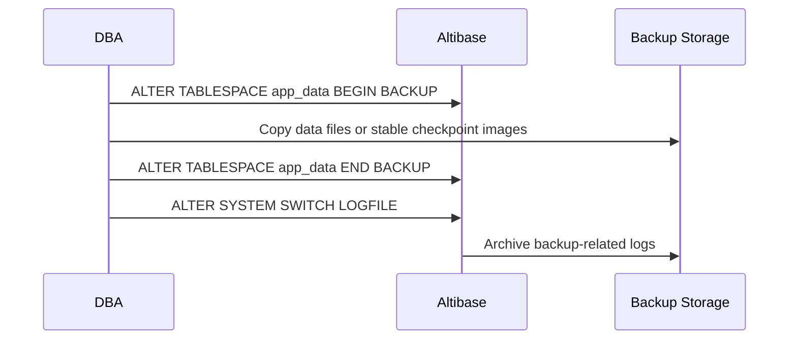

Hot-backup media recovery concept:

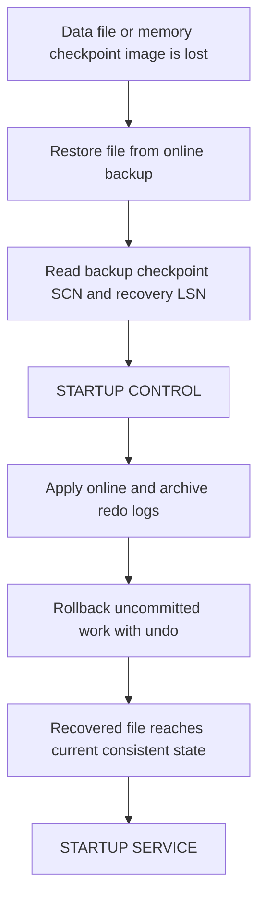

## Incremental Backup

Incremental backup block: prerequisites

- Incremental backups are physical online backups of changed pages.
- A level 0 incremental backup is required before level 1 backups.
- Page change tracking must be enabled.
- `changeTracking` and `backupInfo` files are created in `$ALTIBASE_HOME/dbs`.
- If `backupInfo` is lost, previously created incremental backup files cannot be used.
- Before incremental restore, verify that `$ALTIBASE_HOME/dbs/changeTracking` and `$ALTIBASE_HOME/dbs/backupInfo` exist.
- If startup in `CONTROL` fails because these files are missing, start `PROCESS`, disable incremental chunk change tracking if needed, restore `backupInfo` from the latest incremental backup tag directory, then continue to `CONTROL`.

Enable and configure:

```sql
ALTER DATABASE ENABLE INCREMENTAL CHUNK CHANGE TRACKING;
ALTER DATABASE CHANGE BACKUP DIRECTORY '/backup/altibase/incremental';
```

Disable:

```sql
ALTER DATABASE DISABLE INCREMENTAL CHUNK CHANGE TRACKING;
```

Level 0 examples:

```sql
ALTER DATABASE BACKUP INCREMENTAL LEVEL 0 DATABASE;
ALTER DATABASE BACKUP INCREMENTAL LEVEL 0 DATABASE WITH TAG 'MONDAY';
ALTER DATABASE BACKUP INCREMENTAL LEVEL 0 TABLESPACE app_data WITH TAG 'APP_DATA_L0';
```

Level 1 examples:

```sql
ALTER DATABASE BACKUP INCREMENTAL LEVEL 1 DATABASE;
ALTER DATABASE BACKUP INCREMENTAL LEVEL 1 CUMULATIVE DATABASE;
ALTER DATABASE BACKUP INCREMENTAL LEVEL 1 TABLESPACE app_data WITH TAG 'APP_DATA_L1';
```

Backup file management:

```sql
ALTER DATABASE MOVE BACKUP FILE TO '/backup/altibase/incremental2';
ALTER DATABASE MOVE BACKUP FILE TO '/backup/altibase/incremental2' WITH CONTENTS;
ALTER DATABASE DELETE OBSOLETE BACKUP FILES;
```

Rules:

- Differential level 1 backs up pages changed after the most recent level 0 or level 1 backup.
- Cumulative level 1 backs up pages changed after the most recent level 0 backup.
- `INCREMENTAL_BACKUP_CHUNK_SIZE` controls the incremental chunk size used by page change tracking.
- If change tracking is lost or invalid, disable and re-enable tracking, then run a new level 0 backup before relying on level 1 backups.

## Recovery Strategy

Recovery type block: logical restore

- Use `iLoader` `in` to reload table data from a logical backup.
- Does not restore database files, log anchors, or tablespace state.

Recovery type block: restart recovery

- Automatic after abnormal server termination.
- Runs during startup.
- No manual `ALTER DATABASE RECOVER DATABASE` is needed unless media is missing or corrupt.

Recovery type block: complete media recovery

- Restores data files to the current point when required online and archive logs are available.
- Requires `CONTROL` phase.

```sql
STARTUP CONTROL;
ALTER DATABASE RECOVER DATABASE;
STARTUP SERVICE;
```

Recovery type block: incomplete media recovery to time

- Rewinds the database to a specified past time.
- Requires `CONTROL` phase.
- Requires `META RESETLOGS` before returning to service.
- Requires a full backup after `RESETLOGS`.

```sql
STARTUP CONTROL;
ALTER DATABASE RECOVER DATABASE UNTIL TIME '2026-05-13:17:55:00';
ALTER DATABASE mydb META RESETLOGS;
ALTER DATABASE mydb SERVICE;
ALTER DATABASE BACKUP DATABASE TO '/backup/altibase/after_resetlogs';
```

Recovery type block: incomplete media recovery until cancel

- Recovers only to the point before missing or corrupt log files.
- Requires `META RESETLOGS`.
- Requires a full backup after `RESETLOGS`.

```sql
STARTUP CONTROL;
ALTER DATABASE RECOVER DATABASE UNTIL CANCEL;
ALTER DATABASE mydb META RESETLOGS;
ALTER DATABASE mydb SERVICE;
ALTER DATABASE BACKUP DATABASE TO '/backup/altibase/after_resetlogs';
```

Recovery type block: incremental restore and recovery

Metadata repair before incremental restore:

1. Confirm that the selected incremental backup directory contains the needed backup files, `backupInfo`, and any saved `loganchor*` files for the recovery point.
2. For ordinary complete recovery, use the current `loganchor*` files whenever possible.
3. If `$ALTIBASE_HOME/dbs/changeTracking` or `$ALTIBASE_HOME/dbs/backupInfo` is missing and the server cannot enter `CONTROL`, start only to `PROCESS`, disable invalid page change tracking, restore `backupInfo` from the latest usable incremental backup tag directory, then continue to `CONTROL`.
4. For planned incomplete recovery to a past tag, time, or cancel point, restore the historical `loganchor*` and matching `backupInfo` from the backup tag directory for the point being recovered to. After historical `loganchor*` files are restored, page change tracking is invalid; disable incremental chunk change tracking in `PROCESS` before continuing.
5. After disabling or losing page change tracking, do not resume level 1 incremental backups until change tracking is re-enabled and a new level 0 incremental backup is taken.

```sql
STARTUP PROCESS;
ALTER DATABASE DISABLE INCREMENTAL CHUNK CHANGE TRACKING;
STARTUP CONTROL;
```

```bash
cp /backup/altibase/incremental/SUNDAY/backupInfo $ALTIBASE_HOME/dbs/backupInfo
cp /backup/altibase/incremental/WEDNESDAY/loganchor* $ALTIBASE_HOME/logs/
cp /backup/altibase/incremental/WEDNESDAY/backupInfo $ALTIBASE_HOME/dbs/backupInfo
```

Runbook: incremental complete recovery to current point

Use this when the latest usable incremental backup chain and all required archive or online logs are available.

1. Keep the current `loganchor*` files in place unless a source-backed recovery plan requires historical metadata.
2. Repair `changeTracking` or `backupInfo` in `PROCESS` only if startup to `CONTROL` fails because those files are missing or invalid.
3. In `CONTROL`, restore the latest incremental chain.
4. Apply archive and online logs to the current point.
5. Recreate missing system temporary tablespace files because incremental restore does not preserve temporary files.
6. Start service and verify the database.

```sql
STARTUP CONTROL;
ALTER DATABASE RESTORE DATABASE;
ALTER DATABASE RECOVER DATABASE;
ALTER DATABASE CREATE DATAFILE '/data/altibase/dbs/temp001.dbf';
ALTER DATABASE mydb SERVICE;
```

Runbook: incremental incomplete recovery by backup tag

Use this when the target recovery point is an incremental backup tag, not the current point.

1. Stop service and preserve a copy of the current `loganchor*`, `backupInfo`, and log files before replacing any files.
2. Restore the historical `loganchor*` and `backupInfo` from the tag directory for the target point.
3. Start `PROCESS` and disable incremental chunk change tracking because the restored historical `loganchor*` makes the existing `changeTracking` file invalid.
4. Continue to `CONTROL`.
5. Restore and recover with the same tag name. Do not restore from one tag and recover from another tag; tag mismatch fails.
6. Recreate missing temporary data files before returning to service.
7. Execute `META RESETLOGS`, start service, and take a full backup immediately because the database has been rewound.

```bash
cp /backup/altibase/incremental/WEDNESDAY/loganchor* $ALTIBASE_HOME/logs/
cp /backup/altibase/incremental/WEDNESDAY/backupInfo $ALTIBASE_HOME/dbs/backupInfo
```

```sql
STARTUP PROCESS;
ALTER DATABASE DISABLE INCREMENTAL CHUNK CHANGE TRACKING;
STARTUP CONTROL;
ALTER DATABASE RESTORE DATABASE FROM TAG 'WEDNESDAY';
ALTER DATABASE RECOVER DATABASE FROM TAG 'WEDNESDAY';
ALTER DATABASE CREATE DATAFILE '/data/altibase/dbs/temp001.dbf';
ALTER DATABASE mydb META RESETLOGS;
ALTER DATABASE mydb SERVICE;
ALTER DATABASE BACKUP DATABASE TO '/backup/altibase/after_resetlogs';
```

Runbook: incremental incomplete recovery with `UNTIL TIME` or `UNTIL CANCEL`

Use this when the database must be recovered to a past time or to the last valid log before a missing or corrupt log. This runbook can start from the latest incremental chain or from a selected tag and then recover to a later point with logs.

1. Stop service and preserve current recovery files.
2. Restore the historical `loganchor*` and matching `backupInfo` for the intended past recovery point.
3. Start `PROCESS`, disable incremental chunk change tracking, then continue to `CONTROL`.
4. Restore the database from the selected incremental backup chain. Use `RESTORE DATABASE FROM TAG '<tag>'` if the recovery plan starts from a specific tag.
5. Recover with exactly one incomplete recovery target: `UNTIL TIME '<yyyy-mm-dd:hh24:mi:ss>'` or `UNTIL CANCEL`.
6. Recreate missing temporary data files.
7. Execute `META RESETLOGS`, start service, and take a full backup immediately.

```sql
STARTUP PROCESS;
ALTER DATABASE DISABLE INCREMENTAL CHUNK CHANGE TRACKING;
STARTUP CONTROL;
ALTER DATABASE RESTORE DATABASE FROM TAG 'TUESDAY';
ALTER DATABASE RECOVER DATABASE UNTIL TIME '2026-05-13:17:55:00';
ALTER DATABASE CREATE DATAFILE '/data/altibase/dbs/temp001.dbf';
ALTER DATABASE mydb META RESETLOGS;
ALTER DATABASE mydb SERVICE;
ALTER DATABASE BACKUP DATABASE TO '/backup/altibase/after_resetlogs';
```

```sql
STARTUP PROCESS;
ALTER DATABASE DISABLE INCREMENTAL CHUNK CHANGE TRACKING;
STARTUP CONTROL;
ALTER DATABASE RESTORE DATABASE;
ALTER DATABASE RECOVER DATABASE UNTIL CANCEL;
ALTER DATABASE CREATE DATAFILE '/data/altibase/dbs/temp001.dbf';
ALTER DATABASE mydb META RESETLOGS;
ALTER DATABASE mydb SERVICE;
ALTER DATABASE BACKUP DATABASE TO '/backup/altibase/after_resetlogs';
```

Rules:

- `ALTER DATABASE RESTORE DATABASE` restores data files from incremental backup files.
- `ALTER DATABASE RECOVER DATABASE` applies archive logs after restoration.
- For tag-based incomplete restoration and recovery, the `RESTORE DATABASE FROM TAG` and `RECOVER DATABASE FROM TAG` values must match.
- If restoring from a tag and recovering beyond that tag with logs, restore from the tag and then use `RECOVER DATABASE UNTIL TIME` or `RECOVER DATABASE UNTIL CANCEL`.
- `ALTER DATABASE RESTORE DATABASE UNTIL CANCEL` is not supported for incremental backup restoration.
- After any incomplete recovery and `META RESETLOGS`, take a full backup before relying on later media recovery.

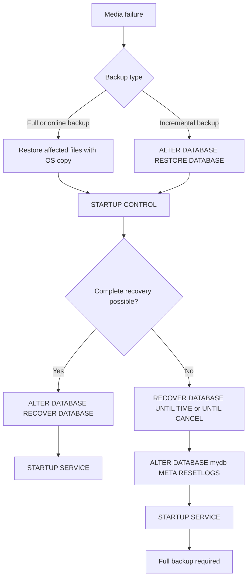

## Media Recovery Runbooks

Runbook: lost disk data file with online backup

1. Stop service or keep the database stopped after startup failure.
2. Copy the backup data file to the original location, or to a new healthy filesystem.
3. If the file location changed, update the data file reference in `CONTROL`.
4. Run complete recovery.
5. Start service and verify.

```bash
cp /backup/altibase/app_data/app_disk01.dbf /data/altibase/dbs/
```

```sql
STARTUP CONTROL;

ALTER DATABASE RENAME DATAFILE
'/old_disk/altibase/dbs/app_disk01.dbf'
TO
'/data/altibase/dbs/app_disk01.dbf';

ALTER DATABASE RECOVER DATABASE;
STARTUP SERVICE;
```

Runbook: lost disk data file with no backup copy but available logs

```sql
STARTUP CONTROL;
ALTER DATABASE CREATE DATAFILE '/data/altibase/dbs/app_disk01.dbf';
ALTER DATABASE RECOVER DATABASE;
STARTUP SERVICE;
```

Rules:

- The file path must be absolute.
- Required archive and online logs must be available from the data file creation LSN onward.
- This approach does not apply to memory checkpoint image files; use memory-specific recovery.

Runbook: lost temporary tablespace data file

```sql
STARTUP CONTROL;
ALTER DATABASE CREATE DATAFILE '/data/altibase/dbs/temp001.dbf';
STARTUP SERVICE;
```

For media or incremental recovery, recreate missing temporary tablespace files because temporary data does not need media recovery. Offline physical backup plans may copy temporary files or explicitly document that they will be recreated.

Runbook: lost memory checkpoint image file

Option A, create missing checkpoint image from log anchor and recover:

```sql
STARTUP CONTROL;
ALTER DATABASE CREATE CHECKPOINT IMAGE 'APP_MEM_TBS-1-0';
ALTER DATABASE RECOVER DATABASE;
STARTUP SERVICE;
```

Option B, restore stable backup checkpoint image and recover:

```bash
cp /backup/altibase/app_mem/APP_MEM_TBS-0-0 $ALTIBASE_HOME/dbs/
```

```sql
STARTUP CONTROL;
ALTER DATABASE RECOVER DATABASE;
STARTUP SERVICE;
```

Rules:

- For memory tablespaces, use stable checkpoint image files.
- In 7.1 and 7.3, check the stable ping pong number with `dumpla` `Stable Checkpoint Image Num.` or `V$STABLE_MEM_DATAFILES` when available.
- In 8.1, use `V$LOG.CHECKPOINT_SCALE`; if it is `PAIR`, check the stable ping pong number from `V$MEM_TABLESPACES.CURRENT_DB`, `V$MEM_STABLE`, or `dumpla` `Stable Checkpoint Image Num.`. If it is `SINGLE`, one stable checkpoint image is maintained, and `V$MEM_STABLE` or `dumpla` `Stable Single Checkpoint Image Num.` can be used when validation is needed.

8.1 stable checkpoint check:

```sql
SELECT checkpoint_scale
FROM V$LOG;

SELECT space_id,
       space_name,
       current_db
FROM V$MEM_TABLESPACES
WHERE space_name = 'APP_MEM_TBS';

SELECT space_id,
       space_name,
       file_num,
       current_db
FROM V$MEM_STABLE
WHERE space_name = 'APP_MEM_TBS'
ORDER BY file_num;
```

Runbook: accidental table or tablespace drop requiring past-time recovery

1. Restore database data files and memory checkpoint images from a backup before the accidental drop.
2. Restore the matching historical log anchor files when needed because current log anchors no longer contain the dropped tablespace metadata.
3. Copy required archive logs into the archive or log directory according to the recovery plan.
4. Recover until a time before the drop.
5. Execute `META RESETLOGS`.
6. Start service.
7. Immediately take a full backup.

```sql
STARTUP CONTROL;
ALTER DATABASE RECOVER DATABASE UNTIL TIME '2026-05-13:14:30:00';
ALTER DATABASE mydb META RESETLOGS;
ALTER DATABASE mydb SERVICE;
ALTER DATABASE BACKUP DATABASE TO '/backup/altibase/after_resetlogs';
```

Runbook: missing or corrupt online log requiring `UNTIL CANCEL`

```sql
STARTUP CONTROL;
ALTER DATABASE RECOVER DATABASE UNTIL CANCEL;
ALTER DATABASE mydb META RESETLOGS;
ALTER DATABASE mydb SERVICE;
ALTER DATABASE BACKUP DATABASE TO '/backup/altibase/after_resetlogs';
```

## Media Recovery Cautions

- Use current log anchor files whenever possible.
- Restore only affected data files from backup copies for ordinary complete recovery.
- Restore historical log anchors only for scenarios where current metadata no longer contains required objects or when performing planned incomplete recovery.
- Keep all required archive log files and online log files available. Missing logs force incomplete recovery.
- After incomplete recovery and `RESETLOGS`, take a full backup immediately.
- If replication is active, stop automatic sender start with `REPLICATION_SENDER_AUTO_START = 0` before recovery when appropriate, then reset or recreate replication after recovery according to the replication plan.
- When a tablespace is added, dropped, or renamed, back up `SYS_TBS_MEM_DIC`, the changed tablespace, and log anchors, or take a full database backup.

## Partition Operation Diagrams

Use these diagrams for the operational effect of partition maintenance. Keep exact syntax in SQL Reference answers when the user asks for grammar.

Partition routing with a default partition:

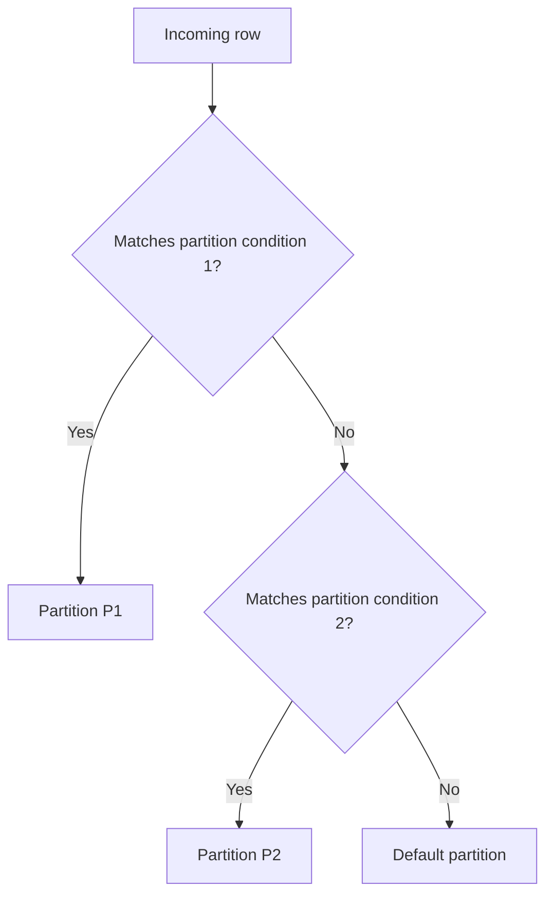

`SPLIT PARTITION` effect:

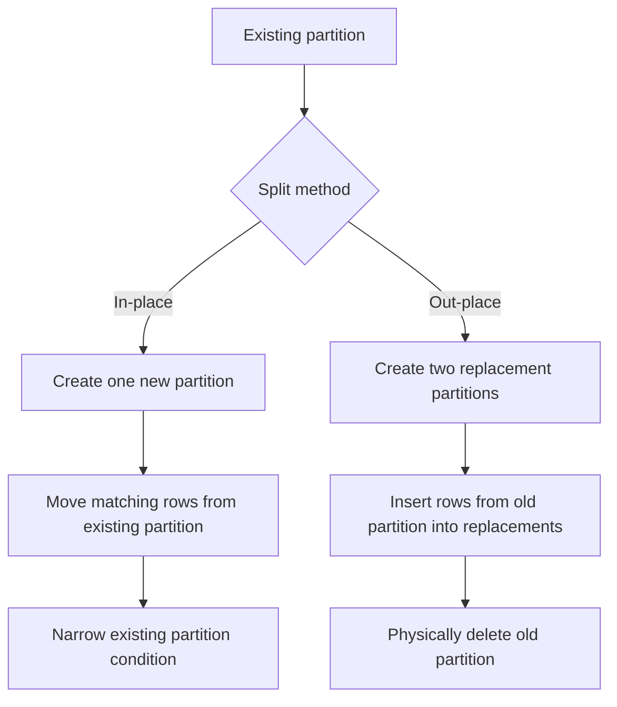

`DROP PARTITION` and `MERGE PARTITION` effects:

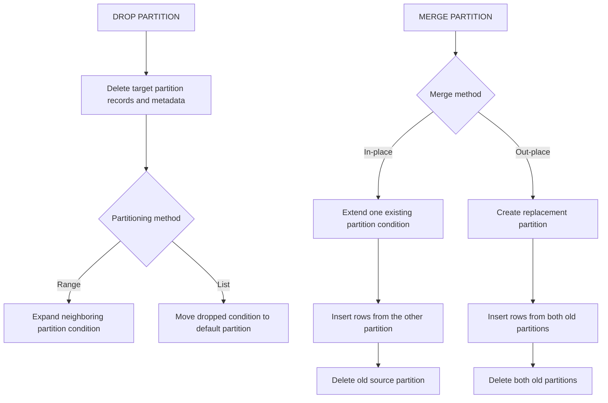

## Space Management

Undo space block:

- Default undo file is `undo001.dbf`, autoextend enabled.
- Undo stores before images for rollback, recovery, and read consistency.
- Long update transactions can consume large undo space.
- If undo space is insufficient, add an undo data file or increase existing file size.

```sql
ALTER TABLESPACE SYS_TBS_DISK_UNDO
ADD DATAFILE '/data/altibase/dbs/undo002.dbf'
AUTOEXTEND ON NEXT 128M MAXSIZE 20G;
```

Undo sizing formula:

```text
undo_tablespace_size =
  long_transaction_seconds
  * (undo_pages_allocated_per_second + tss_pages_allocated_per_second)
  * 8KB
```

Disk table space block:

- `PCTFREE` reserves free page space for updates.
- `PCTUSED` controls when a page becomes eligible for new inserts again.
- Use higher `PCTFREE` for update-heavy tables where rows grow.
- Use lower `PCTFREE` for insert-heavy or read-mostly tables where rows do not grow.
- Row chaining and row migration add disk I/O and can degrade DML performance.

Memory table space block:

- Data size is based on data type sizes, padding, and row count.
- Memory index size is approximately row count multiplied by pointer size, excluding small overheads.
- Memory tablespace capacity must include data, index memory, page headers, free page management, and growth margin.

Tablespace layout rule:

- Group objects by business purpose, recovery priority, and backup schedule.
- Avoid mixing short-retention scratch objects with high-value recovery-critical objects in the same permanent tablespace.
- Consider backup duration and restore priority when deciding tablespace boundaries.

## Checkpointing and Durability

Manual checkpoint:

```sql
ALTER SYSTEM CHECKPOINT;
```

Archive current log file:

```sql
ALTER SYSTEM SWITCH LOGFILE;
```

Checkpoint lifecycle:

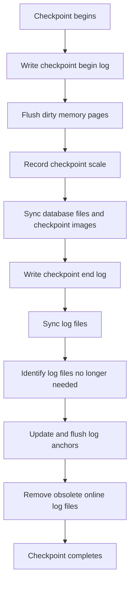

8.1 checkpoint scale:

```sql
STARTUP CONTROL;
ALTER DATABASE CHECKPOINT SCALE PAIR;
ALTER DATABASE CHECKPOINT SCALE SINGLE;
```

Version note:

- 7.1 and 7.3 use ping pong checkpoint image files for memory tablespaces and identify the stable file by ping pong number.
- 8.1 adds documented checkpoint scale handling. `PAIR` keeps paired checkpoint image behavior; `SINGLE` maintains a single stable checkpoint image file while using internal mechanisms to preserve durability.
- For 8.1 memory backup and recovery answers, check `V$LOG.CHECKPOINT_SCALE` before explaining stable checkpoint image selection.

## Troubleshooting Entry Points

General troubleshooting flow:

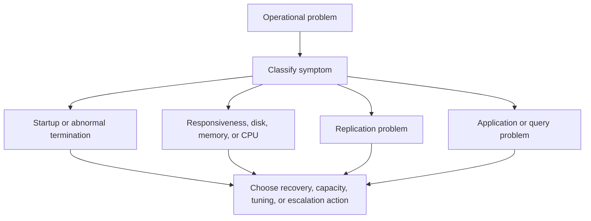

Symptom routing:

1. Startup failure or abnormal termination: check `ALTIBASE_HOME/trc` administrator logs before choosing recovery or escalation.
2. Poor responsiveness: check sessions, statements, waits, and performance views.
3. Excessive disk usage: check data files, archive logs, temp files, and filesystem capacity.
4. Excessive memory usage: check memory views, memory tables, buffer pool, and OS memory.
5. Excessive CPU usage: check active SQL, service threads, and OS CPU usage.
6. Replication problem: check `V$REPSENDER` and `V$REPRECEIVER`.
7. Application or query problem: check application errors, SQL text, plans, and trace logs.

Problem block: startup failure after missing data file or checkpoint image

1. Read `altibase_boot.log` and `altibase_sm.log`.
2. Identify the missing file and tablespace.
3. Prefer media recovery if archive logs and backups exist.
4. Use `ALTER TABLESPACE ... DISCARD` only if recovery is impossible and losing that tablespace is acceptable.

Problem block: archive destination full

1. Check `V$ARCHIVE.ARCHIVE_DEST`, `NEXTLOGFILE_TO_ARCH`, and `CURRENT_LOGFILE`.
2. Free archive storage or move old archive logs to managed backup storage.
3. Confirm archive log thread state.
4. Resume backup or service operation only after capacity is stable.

Problem block: datafile autoextend stalls

1. Check filesystem free space.
2. Check `V$DATAFILES.AUTOEXTEND`, `NEXTSIZE`, and `MAXSIZE` as page counts; multiply by `V$TABLESPACES.PAGE_SIZE` for bytes.
3. Increase file size ahead of demand or add another data file.
4. Avoid tiny autoextend increments on active tablespaces.

Problem block: memory tablespace full

1. Check `V$MEM_TABLESPACES.CURRENT_SIZE`, `FREE_PAGE_COUNT`, `AUTOEXTEND_MODE`, and `MAXSIZE`.
2. Check `MEM_MAX_DB_SIZE` and available system memory.
3. Increase `MAXSIZE`, enable autoextend, or take unused memory tablespaces offline.
4. Confirm checkpoint paths have sufficient disk space for checkpoint images.

Problem block: undo tablespace pressure

1. Check long-running transactions and disk update workload.
2. Check undo tablespace data files and autoextend settings.
3. Add or resize undo data files.
4. Review long transaction behavior after capacity is stabilized.

## Version Differences

- 7.1: Use the 7.1 Administrator's Manual behavior for startup phases, tablespace states, online backup, media recovery, and incremental backup.
- 7.3: Same operational model as 7.1 for the covered backup, recovery, and tablespace operations. Use 7.3 source wording when answering exact 7.3 behavior.
- 8.1: Use Altibase 8.1 verified source. In memory checkpoint answers, account for `CHECKPOINT_SCALE`, `V$MEM_STABLE`, and `SINGLE` versus `PAIR` stable checkpoint image behavior.
- Cross-version: `ARCHIVELOG` is required for online backup and ordinary media recovery. `NOARCHIVELOG` recovery is limited to offline backups and special temporary-file recreation cases.

## Attachment Cross-References

- Use `03_sql_ddl_generation.md` for exact DDL syntax when an operation creates, alters, drops, moves, or partitions database objects.
- Use `06_data_dictionary_performance_views.md` for validation SQL against users, roles, tablespaces, files, sessions, and backup or archive state.
- Use `07_error_messages_troubleshooting.md` when an operational request starts from a reported Altibase error code or log message.
- Use `08_performance_tuning_monitoring.md` when the same symptom is primarily slow SQL, lock wait, checkpoint delay, memory pressure, or plan behavior.
- Use `14_utilities_operation_tools.md` for operational tools such as `aexport`, `altierr`, `altiAudit`, `altiProfile`, and dump-family diagnostics.

## Answer Templates

Template: create or resize tablespace

1. State assumptions: version, target tablespace name, storage type, paths, and service window.
2. Provide pre-check SQL for `V$TABLESPACES`, `V$DATAFILES`, `V$MEM_TABLESPACES`, `V$VOL_TABLESPACES`, and relevant properties.
3. Provide DDL.
4. Provide verification SQL.
5. Mention backup follow-up if structure changed.

Template: create or change users and privileges

1. State assumptions: version, account purpose, owner schema, tablespaces, and whether the account is schema-owner, runtime, read-only, or DBA-like.
2. Create or alter the user with explicit `DEFAULT TABLESPACE`, `TEMPORARY TABLESPACE`, `ACCESS`, account lock, TCP access, and password policy choices when relevant.
3. Grant through small roles when the same privilege set is reusable; otherwise grant only named object privileges.
4. Avoid `ALL PRIVILEGES`, `TO PUBLIC`, and `ANY` privileges unless the request is explicitly administrative.
5. Include audit SQL for `SYSTEM_.SYS_USERS_`, `SYSTEM_.SYS_USER_ROLES_`, `SYSTEM_.SYS_GRANT_SYSTEM_`, and `SYSTEM_.SYS_GRANT_OBJECT_`.

Template: online backup

1. Confirm `ARCHIVELOG` mode and archive destination capacity.
2. Choose database-level, tablespace-level, or DBA-driven backup.
3. Run backup SQL.
4. Run `ALTER SYSTEM SWITCH LOGFILE`.
5. Verify files in backup storage and archive logs.

Template: media recovery

1. Identify failure: lost disk data file, lost memory checkpoint image, lost temp file, lost log, accidental object drop, or tablespace corruption.
2. Decide complete versus incomplete recovery.
3. Restore the required files.
4. Start `CONTROL`.
5. Run `ALTER DATABASE RECOVER DATABASE`, `UNTIL TIME`, or `UNTIL CANCEL`.
6. Use `META RESETLOGS` only after incomplete recovery.
7. Start `SERVICE`.
8. Take a full backup after `RESETLOGS`.

Template: discard tablespace

1. State that discard is irreversible for the tablespace and should be used only when recovery is impossible or rejected.
2. Start `CONTROL`.
3. Run `ALTER TABLESPACE tablespace_name DISCARD`.
4. Start `SERVICE`.
5. Drop the discarded tablespace with `INCLUDING CONTENTS` and usually `AND DATAFILES`.
6. Recreate objects from logical backup or application deployment if required.

## Residual Scope

- This attachment covers core administration and recovery runbooks. For unusual media failure, patch-specific recovery behavior, or site-specific storage layout, verify the target-version manuals and the customer's backup evidence before issuing production commands.
