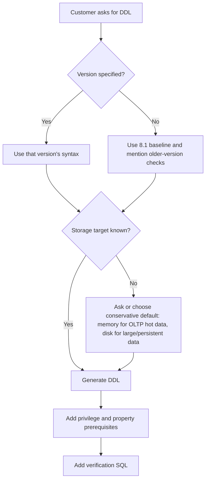

# 03. SQL DDL Generation

## Applicable Versions

- 7.1: Based on Altibase 7.1 SQL Reference and General Reference.
- 7.3: Based on Altibase 7.3 SQL Reference and General Reference.
- 8.1: Based on Altibase 8.1 verified source SQL Reference, General Reference, and Altibase 8.1 Release Notes.

## Questions This File Can Answer

- Generate tablespace DDL for disk, memory, volatile, and temporary storage.
- Generate table DDL for memory tables, disk tables, LOB columns, temporary tables, partitioned tables, and 8.1 JSON columns.
- Generate SQL for indexes, constraints, users, privileges, sequences, and replication objects.
- Convert Oracle-style DDL into Altibase DDL while preserving object names and checking Altibase-specific storage clauses.
- Generate post-DDL verification SQL for meta tables, performance views, and properties.

## Source Documents

- 7.1: Altibase 7.1 SQL Reference; General Reference 1 and 2.
- 7.3: Altibase 7.3 SQL Reference; General Reference 1 and 2.
- 8.1: Altibase 8.1 verified source SQL Reference; General Reference 1 and 2; Altibase 8.1 Release Notes.

## Core Guidance

- Answer in the user's language, but keep SQL object names, function names, error codes, property names, commands, and file paths literal.
- If the customer specifies a version, generate SQL for that version. If the customer does not specify a version, use the 8.1 baseline and state when a feature might not exist in 7.1 or 7.3.
- Always identify the storage target before generating DDL: memory data, disk data, volatile data, or temporary disk space.
- Prefer complete runnable examples with follow-up verification SQL. Do not provide DDL without owner, tablespace, and privilege assumptions when those affect execution.
- For broad compatibility with 7.1 and 7.3, omit `IF NOT EXISTS` unless the customer targets 8.1 verified source or explicitly requests idempotent DDL.
- Do not claim Oracle DDL can run unchanged. Convert Oracle storage, tablespace, LOB, sequence, and replication assumptions into Altibase syntax.

## DDL Generation Flow



## Compact Syntax Patterns

These patterns are generation guides, not a replacement for the full SQL Reference grammar.

### Tablespace Syntax

```text
create_if_not_exists ::=
  IF NOT EXISTS        -- 8.1 verified source only; omit for 7.1 and 7.3

disk_tablespace ::=
  CREATE [DISK] [DATA] TABLESPACE [create_if_not_exists] tablespace_name
  DATAFILE file_spec [, file_spec ...]
  [EXTENTSIZE size]
  [SEGMENT MANAGEMENT {AUTO | MANUAL}]

file_spec ::=
  'absolute_file_path' [SIZE size] [REUSE]
  [AUTOEXTEND {ON [NEXT size] [MAXSIZE {size | UNLIMITED}] | OFF}]

memory_tablespace ::=
  CREATE MEMORY [DATA] TABLESPACE [create_if_not_exists] tablespace_name
  SIZE size
  [AUTOEXTEND {ON [NEXT size] [MAXSIZE {size | UNLIMITED}] | OFF}]
  [CHECKPOINT PATH 'directory' [, 'directory' ...]]
  [SPLIT EACH size]
  [ONLINE | OFFLINE]

volatile_tablespace ::=
  CREATE VOLATILE [DATA] TABLESPACE [create_if_not_exists] tablespace_name
  SIZE size
  [AUTOEXTEND {ON [NEXT size] [MAXSIZE {size | UNLIMITED}] | OFF}]

temporary_tablespace ::=
  CREATE TEMPORARY TABLESPACE [create_if_not_exists] tablespace_name
  TEMPFILE tempfile_spec [, tempfile_spec ...]
  [EXTENTSIZE size]

tempfile_spec ::=
  'absolute_file_path' [SIZE size] [REUSE]
  [AUTOEXTEND {ON [NEXT size] [MAXSIZE {size | UNLIMITED}] | OFF}]
```

Generation notes:

- `IF NOT EXISTS` is available for tablespace creation in the Altibase 8.1 verified source. Do not generate it for 7.1 or 7.3.
- Only `SYS` or a user with `CREATE TABLESPACE` can create these tablespaces. `ALTER TABLESPACE` and `DROP TABLESPACE` require the matching system privilege.
- Disk tablespaces store permanent disk tables and disk indexes. If `DISK` and `DATA` are omitted, the ordinary permanent form is still a disk data tablespace.
- Disk `DATAFILE` and temporary `TEMPFILE` paths should be absolute paths. Use `REUSE` only when overwriting the existing file is intentional.
- If disk `SIZE`, `NEXT`, or `MAXSIZE` is omitted, Altibase derives defaults from `USER_DATA_FILE_INIT_SIZE`, `USER_DATA_FILE_NEXT_SIZE`, and `USER_DATA_FILE_MAX_SIZE`. If temporary file values are omitted, check `USER_TEMP_FILE_INIT_SIZE`, `USER_TEMP_FILE_NEXT_SIZE`, and `USER_TEMP_FILE_MAX_SIZE`.
- Disk `EXTENTSIZE` must align with the disk page size. `SEGMENT MANAGEMENT` defaults from `DEFAULT_SEGMENT_MANAGEMENT_TYPE` when omitted.
- Memory tablespace `SIZE`, `AUTOEXTEND NEXT`, and `SPLIT EACH` must be multiples of `EXPAND_CHUNK_PAGE_COUNT * 32KB`. `AUTOEXTEND OFF` is the default.
- Memory `MAXSIZE UNLIMITED` is still bounded by available memory and `MEM_MAX_DB_SIZE`. If `CHECKPOINT PATH` is omitted, Altibase uses `MEM_DB_DIR`.
- A memory tablespace can be created `OFFLINE` and later made available with `ALTER TABLESPACE ... ONLINE`.
- Volatile tablespaces exist in memory, have no checkpoint image files, and lose data at shutdown. Their `SIZE` and `AUTOEXTEND NEXT` use the same allocation-unit rule as memory tablespaces, but their total growth is bounded by `VOLATILE_MAX_DB_SIZE`.
- `CREATE TEMPORARY TABLESPACE` creates disk working space for temporary query results and user `TEMPORARY TABLESPACE` assignment. `GLOBAL TEMPORARY TABLE` objects use a volatile tablespace in the table `TABLESPACE` clause.
- User-defined disk and memory tablespaces can move between `ONLINE` and `OFFLINE`; volatile and temporary tablespaces cannot use state changes. `DISCARD` is for damaged disk or memory tablespaces during `CONTROL` startup.

Tablespace generation checklist:

- Version: if target is 7.1 or 7.3, omit `IF NOT EXISTS`; if target is 8.1, `IF NOT EXISTS` is allowed but still does not validate that an existing tablespace has the intended attributes.
- Storage target: use disk for persistent large tables and disk indexes, memory for persistent hot data, volatile for restart-discardable high-speed data and `GLOBAL TEMPORARY TABLE` storage, and temporary for disk work space.
- Size units: keep explicit units (`K`, `M`, `G`) in generated SQL. For memory and volatile tablespaces, choose values that are multiples of the allocation unit.
- Filesystem: use absolute `DATAFILE` and `TEMPFILE` paths, confirm free space for initial size plus autoextend growth, and confirm the Altibase OS user can create or reuse the files.
- Checkpoint paths: for memory tablespaces, confirm checkpoint directories exist and are writable before `CREATE MEMORY TABLESPACE` or checkpoint path `ALTER TABLESPACE`.
- User assignment: after creating application tablespaces, set `DEFAULT TABLESPACE`, `TEMPORARY TABLESPACE`, and `ACCESS tablespace_name ON` with `CREATE USER` or `ALTER USER`.

Preflight check SQL:

```sql
SELECT product_version, meta_version
FROM V$VERSION;

SELECT name, value1
FROM V$PROPERTY
WHERE name IN (
    'DEFAULT_SEGMENT_MANAGEMENT_TYPE',
    'USER_DATA_FILE_INIT_SIZE',
    'USER_DATA_FILE_NEXT_SIZE',
    'USER_DATA_FILE_MAX_SIZE',
    'USER_TEMP_FILE_INIT_SIZE',
    'USER_TEMP_FILE_NEXT_SIZE',
    'USER_TEMP_FILE_MAX_SIZE',
    'EXPAND_CHUNK_PAGE_COUNT',
    'MEM_MAX_DB_SIZE',
    'VOLATILE_MAX_DB_SIZE',
    'MEM_DB_DIR'
)
ORDER BY name;

SELECT name, columncount
FROM V$TABLE
WHERE name IN (
    'V$TABLESPACES',
    'V$DATAFILES',
    'V$MEM_TABLESPACES',
    'V$VOL_TABLESPACES',
    'V$MEM_TABLESPACE_CHECKPOINT_PATHS'
)
ORDER BY name;
```

Post-DDL check SQL:

```sql
SELECT id,
       name,
       type,
       state,
       extent_management,
       segment_management,
       datafile_count,
       total_page_count * page_size AS total_bytes,
       allocated_page_count * page_size AS allocated_bytes
FROM V$TABLESPACES
WHERE name IN ('APP_DISK_TBS', 'APP_MEM_TBS', 'APP_VOL_TBS', 'APP_TEMP_TBS')
ORDER BY id;

SELECT t.name AS tablespace_name,
       d.name AS file_name,
       d.initsize,
       d.currsize,
       d.nextsize,
       d.maxsize,
       d.autoextend,
       d.state
FROM V$TABLESPACES t,
     V$DATAFILES d
WHERE t.id = d.spaceid
  AND t.name IN ('APP_DISK_TBS', 'APP_TEMP_TBS')
ORDER BY t.name, d.id;

SELECT space_name,
       space_status,
       current_size,
       autoextend_mode,
       autoextend_nextsize,
       maxsize,
       alloc_page_count,
       free_page_count,
       current_db
FROM V$MEM_TABLESPACES
WHERE space_name = 'APP_MEM_TBS';

SELECT p.checkpoint_path
FROM V$MEM_TABLESPACES m,
     V$MEM_TABLESPACE_CHECKPOINT_PATHS p
WHERE m.space_id = p.space_id
  AND m.space_name = 'APP_MEM_TBS'
ORDER BY p.checkpoint_path;

SELECT space_name,
       space_status,
       init_size,
       current_size,
       autoextend_mode,
       next_size,
       max_size,
       alloc_page_count,
       free_page_count
FROM V$VOL_TABLESPACES
WHERE space_name = 'APP_VOL_TBS';
```

### Table Syntax

```text
table ::=
  CREATE [[GLOBAL] TEMPORARY] TABLE [owner.]table_name
  ( column_definition [, column_definition ...]
    [, table_constraint ...] )
  [ON COMMIT {DELETE ROWS | PRESERVE ROWS}]
  [MAXROWS integer]
  [TABLESPACE tablespace_name]
  [LOB (lob_column) STORE AS (TABLESPACE tablespace_name)]
  [PARTITION BY {RANGE | HASH | LIST} (...)]
  [AS SELECT ...]

column_definition ::=
  column_name data_type
  [DEFAULT expression]
  [NOT NULL]
  [PRIMARY KEY | UNIQUE | CHECK (condition)]
  [REFERENCES [owner.]table_name [(column_name)] [ON DELETE {NO ACTION | CASCADE | SET NULL}]]
```

Generation notes:

- If `TABLESPACE` is omitted, Altibase uses the creating user's `DEFAULT TABLESPACE`; if that is not set, the system memory default tablespace is used.
- For `PRIMARY KEY`, `UNIQUE`, and `LOCALUNIQUE`, Altibase creates supporting indexes. The supporting index uses the table's tablespace unless a `USING INDEX` clause specifies otherwise.
- `MAXROWS` limits the number of records and is not supported with partitioned tables.
- LOB columns in disk tables can be stored in a separate LOB tablespace; LOB columns in memory tables cannot be stored separately from the table.
- Temporary tables can use `ON COMMIT DELETE ROWS` for transaction-specific data or `ON COMMIT PRESERVE ROWS` for session-specific data.
- For `GLOBAL TEMPORARY TABLE`, specify a volatile tablespace in the table `TABLESPACE` clause, not a disk temporary tablespace.

### Index Syntax

```text
index ::=
  CREATE [UNIQUE | LOCALUNIQUE] INDEX [owner.]index_name
  ON [owner.]table_name ( index_expr [ASC | DESC] [, index_expr [ASC | DESC] ...] )
  [INDEXTYPE IS {BTREE | RTREE}]
  [DIRECTKEY [MAXSIZE integer]]
  [LOCAL [(PARTITION index_partition_name ON table_partition_name [TABLESPACE tablespace_name], ...)]]
  [TABLESPACE tablespace_name]
  [LOGGING | NOLOGGING [FORCE | NOFORCE]]
  [PARALLEL integer]
```

Generation notes:

- `BTREE` is the default index type. `RTREE` is for multidimensional data such as spatial use cases.
- A function-based index can use built-in functions or user-defined functions. User-defined functions used in the expression must be `DETERMINISTIC`.
- An index cannot be created on a LOB column.
- For memory tables, a `TABLESPACE` clause on an index is ignored because memory indexes are not stored in tablespaces.
- For disk-table indexes, `NOLOGGING` can improve build speed but may require dropping and rebuilding the index after a system or media fault if the index becomes inconsistent.

### User and Privilege Syntax

```text
user ::=
  CREATE USER user_name IDENTIFIED BY password
  [DEFAULT TABLESPACE tablespace_name]
  [TEMPORARY TABLESPACE tablespace_name]
  [ACCESS tablespace_name {ON | OFF}]
  [LIMIT (password_parameter [, password_parameter ...])]
  [ENABLE | DISABLE]

grant_system ::=
  GRANT system_privilege [, system_privilege ...] TO {user_name | role_name | PUBLIC}

grant_object ::=
  GRANT object_privilege [, object_privilege ...]
  ON [owner.]object_name
  TO {user_name | role_name | PUBLIC}
  [WITH GRANT OPTION]
```

Generation notes:

- `CREATE SESSION` is required for a normal application user to connect.
- New application schemas usually need only specific DDL privileges, such as `CREATE TABLE`, `CREATE SEQUENCE`, and object privileges on required tables.
- To allow additional tablespace access after user creation, generate `ALTER USER user_name ACCESS tablespace_name ON`.
- Use least privilege. Avoid `ALL PRIVILEGES` or `ANY` privileges unless the customer explicitly needs administrative scope.
- The owner of an object, or a user with object privilege `WITH GRANT OPTION`, can grant object privileges.

### Sequence Syntax

```text
sequence ::=
  CREATE SEQUENCE [owner.]sequence_name
  [START WITH integer]
  [INCREMENT BY integer]
  [MINVALUE integer | NOMINVALUE]
  [MAXVALUE integer | NOMAXVALUE]
  [CYCLE | NOCYCLE]
  [CACHE integer | NOCACHE]
  [ENABLE SYNC TABLE | DISABLE SYNC TABLE]
```

Generation notes:

- `NEXTVAL` must be called before `CURRVAL` can be read for a newly created sequence.
- The default `INCREMENT BY` is `1`; the default `CACHE` value is `20`.
- `ENABLE SYNC TABLE` creates a custom table named `[sequence name]$seq` for sequence replication. The sequence name must be 36 bytes or shorter for this option.

### Replication Syntax

```text
replication ::=
  CREATE REPLICATION replication_name
  [AS MASTER | AS SLAVE]
  [FOR ANALYSIS | FOR ANALYSIS PROPAGATION | FOR PROPAGABLE LOGGING | FOR PROPAGATION]
  [OPTIONS option_list]
  WITH 'remote_host_ip', remote_replication_port [USING {TCP | IB ib_latency}]
  FROM [owner.]local_table TO [owner.]remote_table
  [, FROM [owner.]local_table TO [owner.]remote_table ...]

replication_ssl_8_1 ::=
  CREATE REPLICATION replication_name
  WITH 'remote_host_ip', remote_ssl_replication_port USING SSL
  FROM [owner.]local_table TO [owner.]remote_table

alter_replication_control ::=
  ALTER REPLICATION replication_name {SYNC | SYNC ONLY | START | QUICKSTART | STOP | RESET | FLUSH}
```

Generation notes:

- Only `SYS` can execute replication-related statements.
- The replication object name must be the same on both servers.
- The port in `WITH 'host', port` is the remote server's replication receiver port. For ordinary replication, check `REPLICATION_PORT_NO` on the remote server.
- In 8.1, SSL replication uses `USING SSL` and the remote server's `REPLICATION_SSL_PORT_NO`. SSL configuration must already be completed on each replication target server.

## Complete DDL Examples

### Tablespace Examples

For 7.1 and 7.3, generate tablespace DDL without `IF NOT EXISTS`:

```sql
CREATE DISK DATA TABLESPACE app_disk_tbs
DATAFILE '/data/altibase/dbs/app_disk01.dbf' SIZE 1G
AUTOEXTEND ON NEXT 256M MAXSIZE 20G
EXTENTSIZE 512K
SEGMENT MANAGEMENT AUTO;

CREATE MEMORY DATA TABLESPACE app_mem_tbs
SIZE 512M
AUTOEXTEND ON NEXT 128M MAXSIZE 4G
CHECKPOINT PATH '/data/altibase/chkpt01', '/data/altibase/chkpt02'
SPLIT EACH 512M;

CREATE VOLATILE DATA TABLESPACE app_vol_tbs
SIZE 256M
AUTOEXTEND ON NEXT 64M MAXSIZE 1G;

CREATE TEMPORARY TABLESPACE app_temp_tbs
TEMPFILE '/data/altibase/dbs/app_temp01.tmp' SIZE 512M
AUTOEXTEND ON NEXT 128M MAXSIZE 8G
EXTENTSIZE 256K;
```

For an 8.1 verified source target, `IF NOT EXISTS` can be added after `TABLESPACE`:

```sql
CREATE DISK DATA TABLESPACE IF NOT EXISTS app_disk_tbs
DATAFILE '/data/altibase/dbs/app_disk01.dbf' SIZE 1G
AUTOEXTEND ON NEXT 256M MAXSIZE 20G
SEGMENT MANAGEMENT AUTO;

CREATE MEMORY DATA TABLESPACE IF NOT EXISTS app_mem_tbs
SIZE 512M
AUTOEXTEND ON NEXT 128M MAXSIZE 4G
CHECKPOINT PATH '/data/altibase/chkpt01', '/data/altibase/chkpt02'
SPLIT EACH 512M;

CREATE VOLATILE DATA TABLESPACE IF NOT EXISTS app_vol_tbs
SIZE 256M
AUTOEXTEND ON NEXT 64M MAXSIZE 1G;

CREATE TEMPORARY TABLESPACE IF NOT EXISTS app_temp_tbs
TEMPFILE '/data/altibase/dbs/app_temp01.tmp' SIZE 512M
AUTOEXTEND ON NEXT 128M MAXSIZE 8G;
```

Alter disk and temporary files:

```sql
ALTER TABLESPACE app_disk_tbs
ADD DATAFILE '/data/altibase/dbs/app_disk02.dbf' SIZE 1G
AUTOEXTEND ON NEXT 256M MAXSIZE 20G;

ALTER TABLESPACE app_disk_tbs
ALTER DATAFILE '/data/altibase/dbs/app_disk01.dbf'
AUTOEXTEND ON NEXT 512M MAXSIZE 30G;

ALTER TABLESPACE app_temp_tbs
ADD TEMPFILE '/data/altibase/dbs/app_temp02.tmp' SIZE 512M
AUTOEXTEND ON NEXT 128M MAXSIZE 8G;

ALTER TABLESPACE app_temp_tbs
ALTER TEMPFILE '/data/altibase/dbs/app_temp01.tmp'
SIZE 1G;
```

Alter memory and volatile growth, and manage memory checkpoint paths:

```sql
ALTER TABLESPACE app_mem_tbs
ALTER AUTOEXTEND ON NEXT 256M MAXSIZE 8G;

ALTER TABLESPACE app_vol_tbs
ALTER AUTOEXTEND ON NEXT 128M MAXSIZE 2G;

STARTUP PROCESS;
STARTUP CONTROL;

ALTER TABLESPACE app_mem_tbs
ADD CHECKPOINT PATH '/data3/altibase/chkpt03';
```

Assign tablespaces to an application user:

```sql
CREATE USER app IDENTIFIED BY app_password
DEFAULT TABLESPACE app_mem_tbs
TEMPORARY TABLESPACE app_temp_tbs
ACCESS app_disk_tbs ON;

ALTER USER app ACCESS app_mem_tbs ON;
ALTER USER app ACCESS app_vol_tbs ON;
```

Verify tablespaces and relevant properties:

```sql
SELECT id,
       name,
       type,
       state,
       datafile_count,
       total_page_count * page_size AS total_bytes
FROM V$TABLESPACES
WHERE name IN ('APP_DISK_TBS', 'APP_MEM_TBS', 'APP_VOL_TBS', 'APP_TEMP_TBS')
ORDER BY id;

SELECT space_name, current_size, autoextend_mode, autoextend_nextsize, maxsize
FROM V$MEM_TABLESPACES
WHERE space_name = 'APP_MEM_TBS';

SELECT space_name, current_size, autoextend_mode, next_size, max_size
FROM V$VOL_TABLESPACES
WHERE space_name = 'APP_VOL_TBS';

SELECT t.name AS tablespace_name, d.name AS datafile_name,
       d.initsize, d.currsize, d.nextsize, d.maxsize, d.autoextend
FROM V$TABLESPACES t, V$DATAFILES d
WHERE t.id = d.spaceid
  AND t.name IN ('APP_DISK_TBS', 'APP_TEMP_TBS');

SELECT name, value1
FROM V$PROPERTY
WHERE name IN (
    'DEFAULT_SEGMENT_MANAGEMENT_TYPE',
    'USER_DATA_FILE_INIT_SIZE',
    'USER_DATA_FILE_NEXT_SIZE',
    'USER_DATA_FILE_MAX_SIZE',
    'USER_TEMP_FILE_INIT_SIZE',
    'USER_TEMP_FILE_NEXT_SIZE',
    'USER_TEMP_FILE_MAX_SIZE',
    'EXPAND_CHUNK_PAGE_COUNT',
    'MEM_MAX_DB_SIZE',
    'VOLATILE_MAX_DB_SIZE'
)
ORDER BY name;
```

### User and Privilege Examples

Create an application schema, assign default storage, and grant only required privileges:

```sql
CREATE USER app IDENTIFIED BY app_password
DEFAULT TABLESPACE app_mem_tbs
TEMPORARY TABLESPACE app_temp_tbs
ACCESS app_disk_tbs ON
LIMIT (
    FAILED_LOGIN_ATTEMPTS 5,
    PASSWORD_LOCK_TIME 1,
    PASSWORD_LIFE_TIME 90,
    PASSWORD_GRACE_TIME 7
);

GRANT CREATE SESSION TO app;
GRANT CREATE TABLE TO app;
GRANT CREATE SEQUENCE TO app;

ALTER USER app ACCESS app_mem_tbs ON;
```

Grant object privileges to a separate runtime user:

```sql
CREATE USER app_runtime IDENTIFIED BY runtime_password
DEFAULT TABLESPACE app_mem_tbs
TEMPORARY TABLESPACE app_temp_tbs
ACCESS app_disk_tbs ON;

GRANT CREATE SESSION TO app_runtime;
ALTER USER app_runtime ACCESS app_mem_tbs ON;
GRANT SELECT, INSERT, UPDATE, DELETE ON app.app_user TO app_runtime;
GRANT SELECT ON app.app_document TO app_runtime;
GRANT SELECT ON app.seq_app_user TO app_runtime;
```

Verify users and grants:

```sql
SELECT u.user_name, u.account_lock, u.disable_tcp,
       dt.name AS default_tablespace,
       tt.name AS temporary_tablespace
FROM SYSTEM_.SYS_USERS_ u, V$TABLESPACES dt, V$TABLESPACES tt
WHERE u.default_tbs_id = dt.id
  AND u.temp_tbs_id = tt.id
  AND u.user_name IN ('APP', 'APP_RUNTIME');

SELECT p.priv_name, grantee.user_name AS grantee_name
FROM SYSTEM_.SYS_GRANT_SYSTEM_ g,
     SYSTEM_.SYS_PRIVILEGES_ p,
     SYSTEM_.SYS_USERS_ grantee
WHERE g.priv_id = p.priv_id
  AND g.grantee_id = grantee.user_id
  AND grantee.user_name IN ('APP', 'APP_RUNTIME');

SELECT p.priv_name, grantee.user_name AS grantee_name,
       owner.user_name AS object_owner, t.table_name
FROM SYSTEM_.SYS_GRANT_OBJECT_ g,
     SYSTEM_.SYS_PRIVILEGES_ p,
     SYSTEM_.SYS_USERS_ grantee,
     SYSTEM_.SYS_USERS_ owner,
     SYSTEM_.SYS_TABLES_ t
WHERE g.priv_id = p.priv_id
  AND g.grantee_id = grantee.user_id
  AND g.user_id = owner.user_id
  AND g.obj_id = t.table_id
  AND grantee.user_name = 'APP_RUNTIME';
```

### Table Examples

Create a memory table with constraints:

```sql
CREATE TABLE app.app_user (
    user_id     INTEGER NOT NULL,
    user_name   VARCHAR(80) NOT NULL,
    status      CHAR(1) DEFAULT 'A' CHECK (status IN ('A', 'I')),
    created_at  DATE DEFAULT SYSDATE,
    CONSTRAINT pk_app_user PRIMARY KEY (user_id),
    CONSTRAINT uk_app_user_name UNIQUE (user_name)
) MAXROWS 1000000
TABLESPACE app_mem_tbs;
```

Create a disk table with LOB storage separated from the table tablespace:

```sql
CREATE TABLE app.app_document (
    doc_id      BIGINT NOT NULL,
    user_id     INTEGER NOT NULL,
    title       VARCHAR(200) NOT NULL,
    body        CLOB,
    created_at  DATE DEFAULT SYSDATE,
    CONSTRAINT pk_app_document PRIMARY KEY (doc_id),
    CONSTRAINT fk_app_document_user
        FOREIGN KEY (user_id)
        REFERENCES app.app_user (user_id)
        ON DELETE CASCADE
) TABLESPACE app_disk_tbs
LOB (body) STORE AS (TABLESPACE app_disk_tbs);
```

Create transaction-specific and session-specific temporary tables:

```sql
CREATE GLOBAL TEMPORARY TABLE app.tmp_order_stage (
    order_id    BIGINT,
    line_no     INTEGER,
    item_code   VARCHAR(40),
    quantity    INTEGER
) ON COMMIT DELETE ROWS
TABLESPACE app_vol_tbs;

CREATE GLOBAL TEMPORARY TABLE app.tmp_report_cache (
    report_key  VARCHAR(80),
    payload     CLOB
) ON COMMIT PRESERVE ROWS
TABLESPACE app_vol_tbs
LOB (payload) STORE AS (TABLESPACE app_vol_tbs);
```

Create a range-partitioned disk table:

```sql
CREATE TABLE app.order_history (
    order_id    BIGINT NOT NULL,
    order_date  DATE NOT NULL,
    user_id     INTEGER NOT NULL,
    amount      NUMBER(12, 2),
    CONSTRAINT pk_order_history PRIMARY KEY (order_id, order_date)
)
PARTITION BY RANGE (order_date)
(
    PARTITION p_2025 VALUES LESS THAN ('01-JAN-2026') TABLESPACE app_disk_tbs,
    PARTITION p_default VALUES DEFAULT TABLESPACE app_disk_tbs
)
TABLESPACE app_disk_tbs;
```

8.1 JSON table example:

```sql
CREATE TABLE app.app_event (
    event_id    BIGINT NOT NULL,
    user_id     INTEGER,
    payload     JSON,
    created_at  DATE DEFAULT SYSDATE,
    CONSTRAINT pk_app_event PRIMARY KEY (event_id)
) TABLESPACE app_disk_tbs;
```

8.1 JSON cautions:

- Treat `JSON` as an 8.1 baseline feature.
- JSON processing uses Temporary LOB internally; check `TEMPORARY_LOB_ENABLE` when a JSON workload fails or when memory use is being reviewed.
- Avoid generating the `JSON` column type for 7.1 or 7.3 unless the customer provides version-specific confirmation.

Verify table definitions:

```sql
SELECT u.user_name, t.table_name, t.table_type, t.tbs_name,
       t.maxrow, t.temporary, t.is_partitioned, t.created
FROM SYSTEM_.SYS_TABLES_ t, SYSTEM_.SYS_USERS_ u
WHERE t.user_id = u.user_id
  AND u.user_name = 'APP'
  AND t.table_name IN (
      'APP_USER',
      'APP_DOCUMENT',
      'TMP_ORDER_STAGE',
      'TMP_REPORT_CACHE',
      'ORDER_HISTORY',
      'APP_EVENT'
  );

SELECT u.user_name, t.table_name, c.column_name,
       c.data_type, c.precision, c.scale,
       c.is_nullable, c.default_val, c.store_type, c.in_row_size
FROM SYSTEM_.SYS_COLUMNS_ c,
     SYSTEM_.SYS_TABLES_ t,
     SYSTEM_.SYS_USERS_ u
WHERE c.table_id = t.table_id
  AND c.user_id = u.user_id
  AND t.user_id = u.user_id
  AND u.user_name = 'APP'
  AND t.table_name = 'APP_DOCUMENT'
ORDER BY c.column_order;

SELECT t.table_name, m.mem_page_cnt, m.mem_slot_size, m.fixed_used_mem, m.var_used_mem
FROM SYSTEM_.SYS_TABLES_ t, V$MEMTBL_INFO m
WHERE t.table_oid = m.table_oid
  AND t.table_name = 'APP_USER';

SELECT name, value1
FROM V$PROPERTY
WHERE name = 'TEMPORARY_LOB_ENABLE';

-- 8.1 Temporary LOB check for JSON or Temporary LOB workloads.
SELECT type, open_count
FROM V$TEMPORARY_LOBS;
```

### Index Examples

Create ordinary, unique, disk, local, function-based, and direct key indexes:

```sql
CREATE INDEX app.idx_app_user_created
ON app.app_user (created_at DESC);

CREATE UNIQUE INDEX app.uk_app_document_title
ON app.app_document (title ASC)
TABLESPACE app_disk_tbs;

CREATE INDEX app.idx_order_history_user
ON app.order_history (user_id, order_date)
LOCAL;

CREATE INDEX app.idx_order_history_amount
ON app.order_history (amount)
TABLESPACE app_disk_tbs
NOLOGGING FORCE
PARALLEL 4;

CREATE INDEX app.idx_app_user_name_upper
ON app.app_user (UPPER(user_name));

CREATE INDEX app.idx_app_user_direct
ON app.app_user (user_id)
DIRECTKEY;
```

Function-based index with a user-defined function:

```sql
CREATE OR REPLACE FUNCTION app.get_name_key(p_name IN VARCHAR(80))
RETURN VARCHAR(80)
DETERMINISTIC
AS
BEGIN
    RETURN UPPER(p_name);
END;
/

CREATE INDEX app.idx_app_user_name_key
ON app.app_user (app.get_name_key(user_name));
```

Verify indexes:

```sql
SELECT u.user_name, t.table_name, i.index_name,
       i.index_type, i.is_unique, i.is_directkey,
       i.is_partitioned, i.tbs_id, i.created
FROM SYSTEM_.SYS_INDICES_ i,
     SYSTEM_.SYS_TABLES_ t,
     SYSTEM_.SYS_USERS_ u
WHERE i.table_id = t.table_id
  AND i.user_id = u.user_id
  AND t.user_id = u.user_id
  AND u.user_name = 'APP'
  AND t.table_name IN ('APP_USER', 'APP_DOCUMENT', 'ORDER_HISTORY')
ORDER BY t.table_name, i.index_name;

SELECT i.index_name, c.column_name, ic.index_col_order, ic.sort_order
FROM SYSTEM_.SYS_INDICES_ i,
     SYSTEM_.SYS_INDEX_COLUMNS_ ic,
     SYSTEM_.SYS_COLUMNS_ c
WHERE i.index_id = ic.index_id
  AND i.table_id = ic.table_id
  AND ic.column_id = c.column_id
  AND ic.table_id = c.table_id
  AND i.index_name = 'IDX_ORDER_HISTORY_USER'
ORDER BY ic.index_col_order;
```

### Sequence Examples

Create a primary-key sequence:

```sql
CREATE SEQUENCE app.seq_app_user
START WITH 1
INCREMENT BY 1
MINVALUE 1
NOMAXVALUE
NOCYCLE
CACHE 100;
```

Use the sequence:

```sql
INSERT INTO app.app_user (user_id, user_name, status, created_at)
VALUES (app.seq_app_user.NEXTVAL, 'alice', 'A', SYSDATE);
```

Create a sequence prepared for sequence replication:

```sql
CREATE SEQUENCE app.seq_order_history
START WITH 1000000
INCREMENT BY 1
CACHE 1000
ENABLE SYNC TABLE;
```

Verify sequences:

```sql
SELECT u.user_name, t.table_name AS sequence_name,
       s.current_seq, s.start_seq, s.increment_seq,
       s.cache_size, s.min_seq, s.max_seq, s.is_cycle
FROM SYSTEM_.SYS_TABLES_ t,
     SYSTEM_.SYS_USERS_ u,
     V$SEQ s
WHERE t.user_id = u.user_id
  AND t.table_oid = s.seq_oid
  AND t.table_type = 'S'
  AND u.user_name = 'APP';
```

### Replication Examples

Create the same ordinary replication object on both servers. Replace host names, ports, owners, and table names with the customer's environment.

Local server `192.168.10.10`, remote server `192.168.10.20`:

```sql
CREATE REPLICATION rep_app_user
WITH '192.168.10.20', 35524
FROM app.app_user TO app.app_user,
FROM app.app_document TO app.app_document;

ALTER REPLICATION rep_app_user SYNC;
```

Remote server `192.168.10.20`, local server `192.168.10.10`:

```sql
CREATE REPLICATION rep_app_user
WITH '192.168.10.10', 25524
FROM app.app_user TO app.app_user,
FROM app.app_document TO app.app_document;

ALTER REPLICATION rep_app_user SYNC;
```

8.1 SSL replication example:

```sql
CREATE REPLICATION rep_app_user_ssl
WITH '192.168.10.20', 45524 USING SSL
FROM app.app_user TO app.app_user;

ALTER REPLICATION rep_app_user_ssl SYNC;
```

Replication cautions:

- Run corresponding `CREATE REPLICATION` statements on both servers.
- Use `ALTER REPLICATION ... SYNC` when existing table data must be copied and replication should be started in one operation.
- Use `ALTER REPLICATION ... START` when replication should resume from the previous restart SN.
- Use `ALTER REPLICATION ... QUICKSTART` only when the customer accepts starting from the current log position.
- For 8.1 SSL replication, query `REPLICATION_SSL_PORT_NO` and confirm SSL/TLS server configuration first.

Verify replication:

```sql
SELECT name, value1
FROM V$PROPERTY
WHERE name IN ('REPLICATION_PORT_NO', 'REPLICATION_SSL_PORT_NO');

SELECT replication_name, is_started, item_count, host_count,
       conflict_resolution, repl_mode, role, options, xsn, remote_xsn
FROM SYSTEM_.SYS_REPLICATIONS_
WHERE replication_name IN ('REP_APP_USER', 'REP_APP_USER_SSL');

SELECT replication_name, host_ip, port_no, conn_type
FROM SYSTEM_.SYS_REPL_HOSTS_
WHERE replication_name IN ('REP_APP_USER', 'REP_APP_USER_SSL');

SELECT replication_name,
       local_user_name, local_table_name, local_partition_name,
       remote_user_name, remote_table_name, remote_partition_name
FROM SYSTEM_.SYS_REPL_ITEMS_
WHERE replication_name IN ('REP_APP_USER', 'REP_APP_USER_SSL');

SELECT *
FROM V$REPSENDER
WHERE rep_name IN ('REP_APP_USER', 'REP_APP_USER_SSL');

SELECT *
FROM V$REPRECEIVER
WHERE rep_name IN ('REP_APP_USER', 'REP_APP_USER_SSL');
```

## Oracle DDL Conversion Rules

- Tablespaces: Convert Oracle datafile and autoextend clauses into Altibase disk, memory, volatile, or temporary tablespace DDL. Oracle does not imply Altibase memory storage.
- Tables: Keep ordinary column and constraint definitions when compatible, but rewrite tablespace, LOB storage, temporary table, partitioning, and `MAXROWS` clauses for Altibase.
- Data types: Use `05_data_types_properties.md` for exact type mapping. Do not map Oracle `CLOB`, `BLOB`, `NUMBER`, or `VARCHAR2` blindly without checking Altibase limits and semantics.
- Indexes: Convert function-based indexes only when all expressions are supported. User-defined functions must be `DETERMINISTIC`.
- Users: Convert Oracle profile and quota assumptions into Altibase `DEFAULT TABLESPACE`, `TEMPORARY TABLESPACE`, `ACCESS`, `LIMIT`, and explicit `GRANT` statements.
- Sequences: Convert Oracle sequence clauses into Altibase `START WITH`, `INCREMENT BY`, `MINVALUE`, `MAXVALUE`, `CYCLE`, and `CACHE`. Use `ENABLE SYNC TABLE` only for sequence replication requirements.
- Replication: Oracle replication syntax is not portable. Generate Altibase `CREATE REPLICATION` and `ALTER REPLICATION` statements instead.

## Version Differences

- 7.1: Use 7.1 SQL Reference syntax. Avoid `IF NOT EXISTS`, native `JSON`, Temporary LOB checks, and `USING SSL` replication unless the customer provides version-specific confirmation.
- 7.3: Use 7.3 SQL Reference syntax. Treat ordinary DDL patterns as close to 7.1, but check 7.3-specific SQL, Spatial, and Replication improvements when relevant.
- 8.1: Use Altibase 8.1 verified source for `IF NOT EXISTS` in supported `CREATE` statements, native `JSON`, Temporary LOB, `TEMPORARY_LOB_ENABLE`, `V$TEMPORARY_LOBS`, `USING SSL` replication, and `REPLICATION_SSL_PORT_NO`.

## DDL Response Checklist

- State the assumed Altibase version.
- State the assumed owner/schema, tablespaces, file paths, host names, and ports.
- Include prerequisite privileges or `SYS` requirements for tablespace and replication DDL.
- Generate DDL in execution order: tablespaces, users, grants, tables, indexes, sequences, replication.
- Include verification SQL using `V$PROPERTY`, `V$TABLESPACES`, `V$MEM_TABLESPACES`, `V$DATAFILES`, `SYSTEM_.SYS_USERS_`, `SYSTEM_.SYS_TABLES_`, `SYSTEM_.SYS_COLUMNS_`, `SYSTEM_.SYS_INDICES_`, `V$SEQ`, `V$TEMPORARY_LOBS`, and replication meta tables/views as applicable.
- Keep examples free of internal source labels and local repository paths.
