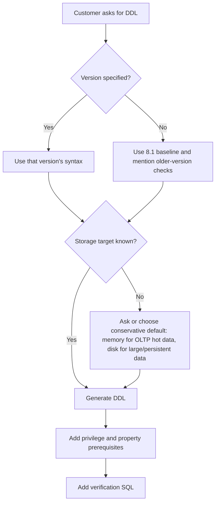
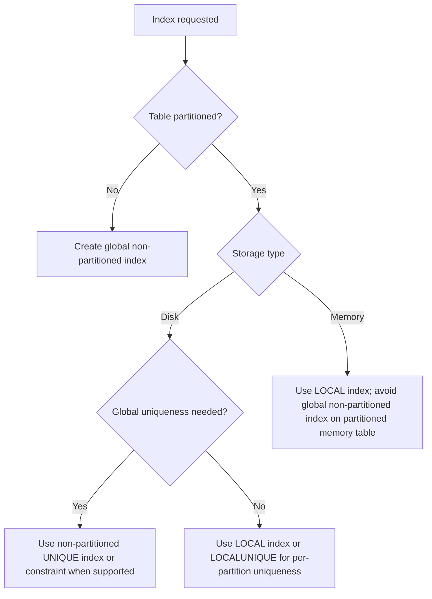

# 03. SQL DDL Generation

## Applicable Versions

- 7.1: Based on Altibase 7.1 SQL Reference and General Reference.
- 7.3: Based on Altibase 7.3 SQL Reference and General Reference.
- 8.1: Based on Altibase 8.1 verified source SQL Reference, General Reference, and Altibase 8.1 Release Notes.

## Questions This File Can Answer

- Generate tablespace DDL for disk, memory, volatile, and temporary storage.
- Generate table DDL for memory tables, disk tables, LOB columns, temporary tables, partitioned tables, and 8.1 JSON columns.
- Generate queue DDL and minimal queue usage checks.
- Generate SQL for indexes, constraints, users, privileges, sequences, and replication objects.
- Generate SQL to inspect properties, change dynamic properties, and verify related performance views.
- Convert Oracle-style DDL into Altibase DDL while preserving object names and checking Altibase-specific storage clauses.
- Generate post-DDL verification SQL for meta tables, performance views, and properties.

## Source Documents

- 7.1: Altibase 7.1 SQL Reference; General Reference 1 and 2.
- 7.3: Altibase 7.3 SQL Reference; General Reference 1 and 2.
- 8.1: Altibase 8.1 verified source SQL Reference; General Reference 1 and 2; Altibase 8.1 Release Notes.

## Core Guidance

- Answer in the user's language, but keep SQL object names, function names, error codes, property names, commands, and file paths literal.
- If the customer specifies a version, generate SQL for that version. If the customer does not specify a version, use the 8.1 baseline and state when a feature might not exist in 7.1 or 7.3.
- Always identify the storage target before generating DDL: memory data, disk data, volatile data, or temporary disk space.
- Prefer complete runnable examples with follow-up verification SQL. Do not provide DDL without owner, tablespace, and privilege assumptions when those affect execution.
- For broad compatibility with 7.1 and 7.3, omit `IF NOT EXISTS` and `IF EXISTS`. If a 7.1 or 7.3 customer requests idempotent DDL, use metadata pre-check SQL plus script-side conditional execution instead of SQL-level `IF EXISTS` or `IF NOT EXISTS`. Use those clauses only when the customer targets Altibase 8.1 verified source syntax.
- DDL and administrative SQL run as their own transactions and can commit prior uncommitted DML in the session. State that rollback expectations change before generating destructive database, tablespace, file, `DROP`, `PURGE`, `TRUNCATE`, backup, restore, or recovery SQL.
- For property changes, show `V$PROPERTY` before and after the change, use `ALTER SYSTEM` or `ALTER SESSION` only for documented dynamic properties, and add the related performance-view check when one exists.
- Do not claim Oracle DDL can run unchanged. Convert Oracle storage, tablespace, LOB, sequence, and replication assumptions into Altibase syntax.

## DDL Generation Flow



## Compact Syntax Patterns

These patterns are generation guides, not a replacement for the full SQL Reference grammar.

Syntax notation used in this attachment:

- `[ ... ]` means optional syntax.
- `{ A | B }` means choose exactly one alternative.
- `item [, item ...]` means one or more comma-separated items.
- `...` after a clause means the clause may repeat.
- Lowercase names such as `table_name`, `expr`, and `subquery` are placeholders to replace with customer objects or expressions.

Exact-token generation anchors:

- Tablespaces and files: preserve `CREATE TABLESPACE`, `CREATE DISK TABLESPACE`, `CREATE MEMORY TABLESPACE`, `CREATE VOLATILE TABLESPACE`, `CREATE TEMPORARY TABLESPACE`, `DATAFILE`, `TEMPFILE`, `SIZE`, `REUSE`, `AUTOEXTEND ON`, `NEXT`, `MAXSIZE`, `UNLIMITED`, `CHECKPOINT PATH`, `SPLIT EACH`, `EXPAND_CHUNK_PAGE_COUNT`, `MEM_MAX_DB_SIZE`, `VOLATILE_MAX_DB_SIZE`, and `MEM_DB_DIR` when those facts drive the answer.
- Table, partition, and LOB DDL: preserve `GLOBAL TEMPORARY`, `ON COMMIT DELETE ROWS`, `ON COMMIT PRESERVE ROWS`, `ALTER TABLE`, `DROP TABLE`, `CREATE INDEX`, `TIMESTAMP`, `8-byte`, `INSERT`, `UPDATE`, `PARTITION BY RANGE`, `VALUES LESS THAN`, `DEFAULT`, `NULL`, `ALTER TABLE ADD PARTITION`, `PARTITION BY HASH`, `PARTITION BY LIST`, `ROW MOVEMENT`, `DISABLE ROW MOVEMENT`, `1000`, `CREATE TABLE AS SELECT`, `alias`, `table_compression_clause`, `PRIMARY KEY`, `UNIQUE`, `BLOB`, `CLOB`, `LOB`, `STORE AS`, `TABLESPACE`, and `LOB(column_name)`.
- Index and destructive-DDL safety: preserve `PARALLEL`, `INDEX_BUILD_THREAD_COUNT`, `LOGGING`, `NOLOGGING`, `FORCE`, `NOFORCE`, `V$DISK_BTREE_HEADER`, `DROP TABLESPACE`, `INCLUDING CONTENTS`, `AND DATAFILES`, `CASCADE CONSTRAINTS`, and `PURGE TABLE` when generating operational or cleanup SQL.

### Tablespace Syntax

```text
create_if_not_exists ::=
  IF NOT EXISTS        -- 8.1 verified source only; omit for 7.1 and 7.3

disk_tablespace ::=
  CREATE [DISK] [DATA] TABLESPACE [create_if_not_exists] tablespace_name
  DATAFILE file_spec [, file_spec ...]
  [EXTENTSIZE size]
  [SEGMENT MANAGEMENT {AUTO | MANUAL}]

file_spec ::=
  'absolute_file_path' [SIZE size] [REUSE] [autoextend_clause]

memory_tablespace ::=
  CREATE MEMORY [DATA] TABLESPACE [create_if_not_exists] tablespace_name
  SIZE size
  [autoextend_clause]
  [CHECKPOINT PATH 'directory' [, 'directory' ...]]
  [SPLIT EACH size]
  [ONLINE | OFFLINE]

volatile_tablespace ::=
  CREATE VOLATILE [DATA] TABLESPACE [create_if_not_exists] tablespace_name
  SIZE size
  [autoextend_clause]

temporary_tablespace ::=
  CREATE TEMPORARY TABLESPACE [create_if_not_exists] tablespace_name
  TEMPFILE tempfile_spec [, tempfile_spec ...]
  [EXTENTSIZE size]

tempfile_spec ::=
  'absolute_file_path' [SIZE size] [REUSE] [autoextend_clause]

drop_if_exists ::=
  IF EXISTS           -- 8.1 verified source only; omit for 7.1 and 7.3

drop_tablespace ::=
  DROP TABLESPACE [drop_if_exists] tablespace_name
  [INCLUDING CONTENTS [AND DATAFILES] [CASCADE CONSTRAINTS]]

alter_tablespace ::=
  ALTER TABLESPACE tablespace_name
  { datafile_tempfile_clause
  | checkpoint_path_clause
  | status_clause
  | tablespace_backup_clause }

datafile_tempfile_clause ::=
  ADD {DATAFILE | TEMPFILE} file_spec [, file_spec ...]
| DROP {DATAFILE | TEMPFILE} 'absolute_file_path' [, 'absolute_file_path' ...]
| RENAME {DATAFILE | TEMPFILE}
    'old_absolute_file_path' [, 'old_absolute_file_path' ...]
    TO 'new_absolute_file_path' [, 'new_absolute_file_path' ...]
| ALTER {DATAFILE | TEMPFILE} 'absolute_file_path' {SIZE size | autoextend_clause}

checkpoint_path_clause ::=
  ADD CHECKPOINT PATH 'directory'
| DROP CHECKPOINT PATH 'directory'
| RENAME CHECKPOINT PATH 'old_directory' TO 'new_directory'

status_clause ::=
  ONLINE | OFFLINE | DISCARD

tablespace_backup_clause ::=
  {BEGIN | END} BACKUP

autoextend_clause ::=
  AUTOEXTEND {OFF | ON [NEXT size] [MAXSIZE {size | UNLIMITED}]}

size ::=
  integer [K | M | G]
```

Generation notes:

- `IF NOT EXISTS` is available for tablespace creation in the Altibase 8.1 verified source. Do not generate it for 7.1 or 7.3.
- `DROP TABLESPACE IF EXISTS` is available only in the Altibase 8.1 verified source. For 7.1 and 7.3, use a metadata pre-check and ordinary `DROP TABLESPACE`.
- Only `SYS` or a user with `CREATE TABLESPACE` can create these tablespaces. `ALTER TABLESPACE` and `DROP TABLESPACE` require the matching system privilege.
- Disk tablespaces store permanent disk tables and disk indexes. If `DISK` and `DATA` are omitted, the ordinary permanent form is still a disk data tablespace.
- Disk `DATAFILE` and temporary `TEMPFILE` paths should be absolute paths. Use `REUSE` only when overwriting the existing file is intentional.
- Always generate explicit disk datafile `SIZE`, `NEXT`, and `MAXSIZE` values instead of relying on omitted-size defaults. If temporary file values are omitted, check `USER_TEMP_FILE_INIT_SIZE`, `USER_TEMP_FILE_NEXT_SIZE`, and `USER_TEMP_FILE_MAX_SIZE`.
- `ADD DATAFILE`, `ADD TEMPFILE`, `DROP DATAFILE`, and `DROP TEMPFILE` can take comma-separated file lists. For `RENAME DATAFILE` or `RENAME TEMPFILE`, provide the same number of old and new absolute paths, and match them positionally.
- Disk `EXTENTSIZE` must align with the disk page size. `SEGMENT MANAGEMENT` defaults from `DEFAULT_SEGMENT_MANAGEMENT_TYPE` when omitted.
- Memory tablespace `SIZE`, `AUTOEXTEND NEXT`, and `SPLIT EACH` must be multiples of `EXPAND_CHUNK_PAGE_COUNT * 32KB`. `AUTOEXTEND OFF` is the default.
- Memory `MAXSIZE UNLIMITED` is still bounded by available memory and `MEM_MAX_DB_SIZE`. If `CHECKPOINT PATH` is omitted, Altibase uses `MEM_DB_DIR`.
- A memory tablespace can be created `OFFLINE` and later made available with `ALTER TABLESPACE ... ONLINE`.
- Volatile tablespaces exist in memory, have no checkpoint image files, and lose data at shutdown. Their `SIZE` and `AUTOEXTEND NEXT` use the same allocation-unit rule as memory tablespaces. For `CREATE VOLATILE TABLESPACE ... MAXSIZE UNLIMITED`, preserve the SQL Reference caveat that growth is limited when the combined memory and volatile total reaches `MEM_MAX_DB_SIZE`; also check `VOLATILE_MAX_DB_SIZE`, which the General Reference defines as the maximum total volatile tablespace size.
- `CREATE TEMPORARY TABLESPACE` creates disk working space for temporary query results and user `TEMPORARY TABLESPACE` assignment. `GLOBAL TEMPORARY TABLE` objects use a volatile tablespace in the table `TABLESPACE` clause.
- User-defined disk and memory tablespaces can move between `ONLINE` and `OFFLINE`; volatile and temporary tablespaces cannot use state changes. `DISCARD` is for damaged disk or memory tablespaces during `CONTROL` startup.
- `AND DATAFILES` in `DROP TABLESPACE` applies to disk data files or memory checkpoint image files. Omit `AND DATAFILES` for volatile tablespaces.
- `BEGIN BACKUP` and `END BACKUP` are tablespace online-backup state changes; use them only inside a documented backup procedure and end backup state as soon as copied files are complete.

Tablespace exact-answer blocks:

- Disk data: `CREATE DISK TABLESPACE` and `CREATE TABLESPACE` both target an ordinary disk data tablespace; `CREATE DISK DATA TABLESPACE` is the explicit expanded form. Include `DATAFILE`, quoted absolute file paths, `SIZE`, optional `REUSE`, `AUTOEXTEND ON`, `NEXT`, `MAXSIZE {size | UNLIMITED}`, and the `SYS` or `CREATE TABLESPACE` privilege caveat. `REUSE` can destroy existing file contents; ask for confirmation of the exact path and backup state before using it.
- Memory data: `CREATE MEMORY TABLESPACE` or `CREATE MEMORY DATA TABLESPACE` requires `SIZE`. When generating `AUTOEXTEND ON`, include `NEXT` and either `MAXSIZE size` or `MAXSIZE UNLIMITED`; ensure `SIZE`, `NEXT`, and `SPLIT EACH` are multiples of `EXPAND_CHUNK_PAGE_COUNT * 32KB`. Include `CHECKPOINT PATH` when the customer requires explicit checkpoint image placement; otherwise state that `MEM_DB_DIR` is used. `MAXSIZE UNLIMITED` is still constrained by `MEM_MAX_DB_SIZE`.
- Volatile data: `CREATE VOLATILE TABLESPACE` or `CREATE VOLATILE DATA TABLESPACE` uses `SIZE` and optional `AUTOEXTEND`; do not add `CHECKPOINT PATH`, `SPLIT EACH`, `ONLINE`, or `OFFLINE`. Preserve `UNLIMITED`, `EXPAND_CHUNK_PAGE_COUNT`, `MEM_MAX_DB_SIZE`, and `VOLATILE_MAX_DB_SIZE` checks when explaining growth. Volatile data is restart-discardable.
- Temporary disk work space: `CREATE TEMPORARY TABLESPACE` uses `TEMPFILE`, not `DATAFILE`. Use it for disk temporary query work space and user `TEMPORARY TABLESPACE` assignment. Do not use it as the `TABLESPACE` for `GLOBAL TEMPORARY TABLE`; use a volatile tablespace there.
- Destructive drops: `DROP TABLESPACE ... INCLUDING CONTENTS` is required when objects remain in the tablespace. Add `AND DATAFILES` only when intentionally removing disk data files or memory checkpoint image files. Add `CASCADE CONSTRAINTS` only when dropping referential constraints in other tablespaces is accepted. Never generate `DROP TABLESPACE` for `SYS_TBS_MEM_DIC`, `SYS_TBS_MEM_DATA`, `SYS_TBS_DISK_DATA`, `SYS_TBS_DISK_UNDO`, or `SYS_TBS_DISK_TEMP`.

Tablespace generation checklist:

- Version: if target is 7.1 or 7.3, omit `IF NOT EXISTS`; if target is 8.1, `IF NOT EXISTS` is allowed but still does not validate that an existing tablespace has the intended attributes.
- Storage target: use disk for persistent large tables and disk indexes, memory for persistent hot data, volatile for restart-discardable high-speed data and `GLOBAL TEMPORARY TABLE` storage, and temporary for disk work space.
- Size units: keep explicit units (`K`, `M`, `G`) in generated SQL. For memory and volatile tablespaces, query `EXPAND_CHUNK_PAGE_COUNT` and choose `SIZE`, `AUTOEXTEND NEXT`, and memory `SPLIT EACH` values that are multiples of `EXPAND_CHUNK_PAGE_COUNT * 32KB`. The examples below use 100M-aligned values, which match the documented default allocation unit; recalculate if the database was created with a different value.
- Filesystem: use absolute `DATAFILE` and `TEMPFILE` paths, confirm free space for initial size plus autoextend growth, and confirm the Altibase OS user can create or reuse the files.
- Checkpoint paths: for memory tablespaces, confirm checkpoint directories exist and are writable before `CREATE MEMORY TABLESPACE` or checkpoint path `ALTER TABLESPACE`.
- User assignment: after creating application tablespaces, set `DEFAULT TABLESPACE`, `TEMPORARY TABLESPACE`, and `ACCESS tablespace_name ON` with `CREATE USER` or `ALTER USER`.

Preflight check SQL:

```sql
SELECT product_version, meta_version
FROM V$VERSION;

SELECT name, value1
FROM V$PROPERTY
WHERE name IN (
    'DEFAULT_SEGMENT_MANAGEMENT_TYPE',
    'USER_DATA_FILE_INIT_SIZE',
    'USER_DATA_FILE_NEXT_SIZE',
    'USER_DATA_FILE_MAX_SIZE',
    'USER_TEMP_FILE_INIT_SIZE',
    'USER_TEMP_FILE_NEXT_SIZE',
    'USER_TEMP_FILE_MAX_SIZE',
    'EXPAND_CHUNK_PAGE_COUNT',
    'MEM_MAX_DB_SIZE',
    'VOLATILE_MAX_DB_SIZE',
    'MEM_DB_DIR'
)
ORDER BY name;

SELECT name, columncount
FROM V$TABLE
WHERE name IN (
    'V$TABLESPACES',
    'V$DATAFILES',
    'V$MEM_TABLESPACES',
    'V$VOL_TABLESPACES',
    'V$MEM_TABLESPACE_CHECKPOINT_PATHS'
)
ORDER BY name;
```

Post-DDL check SQL:

```sql
SELECT id,
       name,
       type,
       state,
       extent_management,
       segment_management,
       datafile_count,
       total_page_count * page_size AS total_bytes,
       allocated_page_count * page_size AS allocated_bytes
FROM V$TABLESPACES
WHERE name IN ('APP_DISK_TBS', 'APP_MEM_TBS', 'APP_VOL_TBS', 'APP_TEMP_TBS')
ORDER BY id;

SELECT t.name AS tablespace_name,
       d.name AS file_name,
       t.page_size,
       d.initsize AS initsize_pages,
       d.initsize * t.page_size AS initsize_bytes,
       d.initsize * t.page_size / 1048576 AS initsize_mb,
       d.currsize AS currsize_pages,
       d.currsize * t.page_size AS currsize_bytes,
       d.currsize * t.page_size / 1048576 AS currsize_mb,
       d.nextsize AS nextsize_pages,
       d.nextsize * t.page_size AS nextsize_bytes,
       d.nextsize * t.page_size / 1048576 AS nextsize_mb,
       d.maxsize AS maxsize_pages,
       d.maxsize * t.page_size AS maxsize_bytes,
       d.maxsize * t.page_size / 1048576 AS maxsize_mb,
       d.autoextend,
       d.state
FROM V$TABLESPACES t,
     V$DATAFILES d
WHERE t.id = d.spaceid
  AND t.name IN ('APP_DISK_TBS', 'APP_TEMP_TBS')
ORDER BY t.name, d.id;

SELECT space_name,
       space_status,
       current_size,
       autoextend_mode,
       autoextend_nextsize,
       maxsize,
       alloc_page_count,
       free_page_count,
       current_db
FROM V$MEM_TABLESPACES
WHERE space_name = 'APP_MEM_TBS';

SELECT p.checkpoint_path
FROM V$MEM_TABLESPACES m,
     V$MEM_TABLESPACE_CHECKPOINT_PATHS p
WHERE m.space_id = p.space_id
  AND m.space_name = 'APP_MEM_TBS'
ORDER BY p.checkpoint_path;

SELECT space_name,
       space_status,
       init_size,
       current_size,
       autoextend_mode,
       next_size,
       max_size,
       alloc_page_count,
       free_page_count
FROM V$VOL_TABLESPACES
WHERE space_name = 'APP_VOL_TBS';
```

### Table Syntax

#### Table Create and Drop Syntax

```text
drop_if_exists ::=
  IF EXISTS           -- 8.1 verified source only; omit for 7.1 and 7.3

table ::=
  CREATE [[GLOBAL] TEMPORARY] TABLE [create_if_not_exists] [owner.]table_name
  ( column_definition [, column_definition ...]
    [, table_constraint ...] )
  [ON COMMIT {DELETE ROWS | PRESERVE ROWS}]
  [ACCESS {READ ONLY | READ WRITE | READ APPEND}]
  [MAXROWS integer]
  [TABLESPACE tablespace_name]
  [LOB (lob_column) STORE AS (TABLESPACE tablespace_name)]
  [PARTITION BY {RANGE | HASH | LIST} (...)]
  [ENABLE ROW MOVEMENT | DISABLE ROW MOVEMENT]
  [PCTFREE integer] [PCTUSED integer] [INITRANS integer] [MAXTRANS integer]
  [STORAGE (storage_attribute ...)]
  [LOGGING | NOLOGGING]
  [PARALLEL integer | NOPARALLEL]
  [AS SELECT ...]

drop_table ::=
  DROP TABLE [drop_if_exists] [owner.]table_name
  [CASCADE | CASCADE CONSTRAINTS]
```

#### Column and Constraint Syntax

```text
column_definition ::=
  column_name data_type
  [DEFAULT expression]
  [NOT NULL]
  [PRIMARY KEY | UNIQUE | CHECK (condition)]
  [REFERENCES [owner.]table_name [(column_name)] [ON DELETE {NO ACTION | CASCADE | SET NULL}]]

constraint_definition ::=
  [CONSTRAINT constraint_name]
  { PRIMARY KEY (column_name [, ...]) [constraint_index_options]
  | UNIQUE (column_name [, ...]) [constraint_index_options]
  | LOCALUNIQUE (column_name [, ...]) [constraint_index_options]
  | FOREIGN KEY (column_name [, ...])
      REFERENCES [owner.]table_name [(column_name [, ...])]
      [ON DELETE {NO ACTION | CASCADE | SET NULL}]
  | CHECK (condition) }

constraint_index_options ::=
  [DIRECTKEY [MAXSIZE integer]]
  [USING INDEX
    [TABLESPACE tablespace_name]
    [LOCAL [(PARTITION index_partition_name ON table_partition_name [TABLESPACE tablespace_name], ...)]]
    [LOGGING | NOLOGGING [FORCE | NOFORCE]]
    [PARALLEL integer]]
```

#### Alter Table Core Syntax

```text
alter_table_core ::=
  ALTER TABLE [owner.]table_name
  { ADD COLUMN (column_definition [, column_definition ...])
  | ALTER [COLUMN] (column_name {SET DEFAULT expression | DROP DEFAULT | [NOT] NULL})
  | ALTER [COLUMN] LOB (lob_column [, lob_column ...]) STORE AS (lob_attributes)
  | ALTER [COLUMN] PARTITION partition_name LOB (lob_column [, lob_column ...]) STORE AS (lob_attributes)
  | MODIFY COLUMN (modify_column_spec [, modify_column_spec ...])
  | DROP COLUMN {column_name | (column_name [, column_name ...])}
  | RENAME COLUMN old_column_name TO new_column_name
  | REORGANIZE [COLUMN] (column_name [, column_name ...])
  | ADD constraint_definition
  | MODIFY CONSTRAINT constraint_name [ENABLE] [{VALIDATE | NOVALIDATE}]
  | RENAME CONSTRAINT old_constraint_name TO new_constraint_name
  | DROP {CONSTRAINT constraint_name | PRIMARY KEY | UNIQUE (column_name [, ...]) | LOCALUNIQUE (column_name [, ...])}
  | RENAME TO new_table_name
  | MAXROWS integer
  | ALL INDEX {ENABLE | DISABLE}
  | ACCESS {READ ONLY | READ WRITE | READ APPEND}
  | ENABLE ROW MOVEMENT
  | DISABLE ROW MOVEMENT
  | ALTER TABLESPACE tablespace_name [INDEX (index_name TABLESPACE tablespace_name [, ...])] [LOB (lob_column TABLESPACE tablespace_name [, ...])]
  | ALLOCATE EXTENT (SIZE size)
  | COMPACT
  | TOUCH }

modify_column_spec ::=
  column_name [data_type [FIXED | VARIABLE] [TOLERATE DATA LOSS]]
  [DEFAULT expression]
  [[NOT] NULL]
  [SRID integer]

lob_attributes ::=
  [LOGGING | NOLOGGING] [BUFFER | NOBUFFER]
```

#### Table Partitioning Syntax

```text
table_partitioning_clause ::=
  partition_by_range
| partition_by_list
| partition_by_hash
| range_partitioning_using_hash

partition_by_range ::=
  PARTITION BY RANGE (partition_key [, partition_key ...])
  ( PARTITION partition_name VALUES LESS THAN (value [, value ...]) [TABLESPACE tablespace_name] [LOB (...)] [, ...]
    [, PARTITION partition_name VALUES DEFAULT [TABLESPACE tablespace_name] [LOB (...)] ] )

partition_by_list ::=
  PARTITION BY LIST (partition_key)
  ( PARTITION partition_name VALUES (value [, value ...]) [TABLESPACE tablespace_name] [, ...]
    , PARTITION partition_name VALUES DEFAULT [TABLESPACE tablespace_name] )

partition_by_hash ::=
  PARTITION BY HASH (partition_key [, partition_key ...])
  ( PARTITION partition_name [TABLESPACE tablespace_name] [, ...] )

range_partitioning_using_hash ::=
  PARTITION BY RANGE_USING_HASH (single_partition_key)
  ( PARTITION partition_name VALUES LESS THAN (hash_mod_1000_value) [TABLESPACE tablespace_name] [, ...]
    , PARTITION partition_name VALUES DEFAULT [TABLESPACE tablespace_name] )
```

#### Alter Table Partition Syntax

```text
alter_table_partition ::=
  ALTER TABLE [owner.]table_name
  { ADD PARTITION partition_name [VALUES LESS THAN (value [, ...])] [TABLESPACE tablespace_name] [INDEX (...)]
  | COALESCE PARTITION
  | DROP PARTITION partition_name
  | MERGE PARTITIONS partition_name, partition_name INTO PARTITION new_partition_name [TABLESPACE tablespace_name] [INDEX (...)] [LOB (...)]
  | RENAME PARTITION old_partition_name TO new_partition_name
  | SPLIT PARTITION partition_name {AT (value [, ...]) | VALUES (value [, ...])} INTO (partition_description, partition_description)
  | TRUNCATE PARTITION partition_name
  | ALTER PARTITION partition_name TABLESPACE tablespace_name [INDEX (...)] [LOB (...)]
  | ACCESS PARTITION partition_name {READ ONLY | READ WRITE | READ APPEND} }
```

Generation notes:

- `GLOBAL TEMPORARY` table answers must state both row-scope choices: `ON COMMIT DELETE ROWS` for transaction scope and `ON COMMIT PRESERVE ROWS` for session scope. Include the DDL binding caveat before generating follow-up `ALTER TABLE`, `DROP TABLE`, or `CREATE INDEX`: session-scoped temporary table DDL is allowed only when the session is not bound to the table; transaction-scoped temporary table DDL is allowed but Altibase commits before DDL, so transaction-level rows disappear.
- `IF NOT EXISTS` for `CREATE TABLE` and `IF EXISTS` for `DROP TABLE` are available in the Altibase 8.1 verified source. Omit both for 7.1 and 7.3.
- Required privilege: `SYS`, `CREATE TABLE` or `CREATE ANY TABLE` for the target schema when creating tables; `SYS`, owner, `ALTER` object privilege, or `ALTER ANY TABLE` for `ALTER TABLE`; `SYS`, owner, or `DROP ANY TABLE` for `DROP TABLE`.
- If `TABLESPACE` is omitted, Altibase uses the creating user's `DEFAULT TABLESPACE`; if that is not set, the system memory default tablespace is used.
- Use memory tablespaces for persistent hot data, disk tablespaces for large persistent data, volatile tablespaces for restart-discardable data and `GLOBAL TEMPORARY TABLE` rows, and disk temporary tablespaces for sort/work space rather than ordinary table storage.
- `DROP TABLE CASCADE` or `DROP TABLE CASCADE CONSTRAINTS` also drops referential constraints in other tables that reference the dropped table's primary or unique key. If `RECYCLEBIN_ENABLE=1`, ordinary `DROP TABLE` moves the table to the recycle bin instead of immediately removing it.
- For `PRIMARY KEY`, `UNIQUE`, and `LOCALUNIQUE`, Altibase creates supporting indexes. The supporting index uses the table's tablespace unless a `USING INDEX` clause specifies otherwise.
- `MAXROWS` limits the number of records and is not supported with partitioned tables.
- `ALTER TABLE ... ADD COLUMN` initializes existing rows to `NULL` when no default is supplied. A new `NOT NULL` column must have a default value.
- `ALTER (column_name SET DEFAULT expression)` changes a column default. `ALTER (column_name DROP DEFAULT)` removes it. Do not change or drop the default for a `TIMESTAMP` column because Altibase supplies the system time.
- `MODIFY COLUMN` can change supported data types, `FIXED`/`VARIABLE` storage, default, nullability, or `SRID`. Use `TOLERATE DATA LOSS` only when the source type conversion matrix allows it and the customer accepts possible non-null data loss. For character-to-date conversion, align input values with `DEFAULT_DATE_FORMAT` before modifying the column.
- A column involved in a foreign key, or referenced by a foreign key through a primary or unique key, cannot have its data type changed. Validate referential metadata before generating column-type DDL.
- Column add/drop cannot leave the table with zero columns and cannot exceed the source-backed maximum of `1024` columns. Tables using `VARIABLE ... IN ROW` can have a lower practical maximum depending on the `IN ROW` size.
- A table can have only one `PRIMARY KEY`; primary and unique constraints can use up to 32 columns.
- A `PRIMARY KEY` is equivalent to `UNIQUE` plus `NOT NULL`; all primary-key columns must be non-null.
- Do not define `PRIMARY KEY` and `UNIQUE` on the same column list in the same table. Use one named constraint for the intended rule.
- A `FOREIGN KEY` must reference a parent `PRIMARY KEY` or `UNIQUE` key. If the referenced column list is omitted, Altibase uses the parent table's primary key.
- Before generating a `FOREIGN KEY`, verify that child key columns and referenced key columns have the same count and matching corresponding data types. If the referenced column list is omitted, verify the parent primary-key column list and types.
- `ON DELETE NO ACTION` is the default foreign-key action. `ON DELETE SET NULL` requires nullable child columns.
- A `TIMESTAMP` column is generated internally and only one `TIMESTAMP` column can be created in one table. Do not specify an explicit `DEFAULT` for it.
- `CHECK` constraints cannot contain subqueries, sequences, pseudo columns such as `LEVEL` or `ROWNUM`, non-deterministic functions such as `SYSDATE` or `USER_ID`, the `PRIOR` operator, or LOB data.
- A column-level `CHECK` condition can reference only that column. Use a table-level `CHECK` constraint for cross-column rules.
- Multiple `CHECK` constraints may be defined on one column, but Altibase does not guarantee their evaluation order or prove that they are mutually compatible.
- Be explicit with full date literals in `CHECK` constraints. If the year or month is omitted in a `DATE` constant, Altibase can derive it from the current date.
- `MODIFY CONSTRAINT constraint_name ENABLE VALIDATE` enforces and validates a constraint. `ENABLE NOVALIDATE` enables future enforcement without validating existing rows. Use `RENAME CONSTRAINT old_name TO new_name` when only the constraint name changes.
- A `TIMESTAMP` constraint cannot be added to or dropped from an existing column through `ADD CONSTRAINT` or `DROP CONSTRAINT`.
- For `ALTER TABLE` planning, the SQL Reference caution says a table can have at most `64` indexes, and the combined number of primary-key and unique-key constraints in one table cannot exceed `64`. The `CREATE TABLE` caution also states that the combined count of indexes, primary keys, and unique keys cannot exceed `1024`; when a numeric limit is the main answer, quote the target SQL Reference section and installed version.
- LOB columns in disk tables can be stored in a separate disk LOB tablespace. LOB columns in memory tables cannot be stored separately from the table; memory LOB `IN ROW` sizing belongs in the data type definition.
- LOB type columns cannot be used in volatile tables or disk temporary tablespaces, cannot be partition keys, cannot be indexed, and should not normally be declared `NOT NULL`.
- `ALTER TABLE ... ALTER LOB (...) STORE AS (...)` changes LOB column storage attributes. `ALTER TABLE ... ALTER TABLESPACE ... LOB (lob_column TABLESPACE lob_tablespace)` moves disk-table LOB storage; use only disk LOB tablespaces for separate LOB placement.
- For disk-table LOB placement answers, preserve both the readable grammar and the compact placeholder token: `LOB(column_name)` means the actual SQL form `LOB (column_name) STORE AS (TABLESPACE lob_tablespace)`. Do not copy Oracle `SECUREFILE`, `BASICFILE`, `RETENTION`, or `CACHE` options into Altibase LOB syntax.
- Temporary tables can use `ON COMMIT DELETE ROWS` for transaction-specific data or `ON COMMIT PRESERVE ROWS` for session-specific data.
- For `GLOBAL TEMPORARY TABLE`, specify a volatile tablespace in the table `TABLESPACE` clause, not a disk temporary tablespace.
- Temporary table definitions are shared metadata, but rows are private to the session that inserts them. Session-specific temporary table DDL is allowed only when the session is not bound to the table; transaction-specific temporary table DDL causes the internal DDL commit behavior to remove transaction-level rows.
- Temporary tables cannot be partitioned, cannot have foreign keys, and do not support distributed transactions. Do not generate `FOREIGN KEY` clauses for them.
- For 7.1 range partitioned tables, include a `DEFAULT` partition. For 7.3 and Altibase 8.1 verified source, range partitioning may omit `DEFAULT`; only default-less range tables can be extended with range `ADD PARTITION`.
- List partitioned tables require a `DEFAULT` partition. Range and hash partition keys can use up to 32 columns; list partitioning uses a single partition key column.
- `ENABLE ROW MOVEMENT` allows updates that move rows between partitions when partition key values change. If omitted, `DISABLE ROW MOVEMENT` is the default.
- `ALTER TABLE ADD PARTITION` is for hash partitioning, and for 7.3 or Altibase 8.1 verified source default-less `PARTITION BY RANGE` tables when appending the last range with `VALUES LESS THAN (...)`. Do not use `ALTER TABLE ADD PARTITION` to add a range `DEFAULT` partition or insert a middle range; use `SPLIT PARTITION` for middle/default range changes. `COALESCE PARTITION` is for hash partitioning. `DROP PARTITION`, `MERGE PARTITIONS`, and `SPLIT PARTITION` are not for hash partitioning.
- In a `PARTITION BY RANGE` table with a `DEFAULT` partition, values outside explicit ranges and `NULL` go to the `DEFAULT` partition. In a default-less range table, the SQL Reference example shows an extra metadata range row whose `PARTITION_NAME` displays blank; treat that as a `NULL`/unnamed partition indicator in validation SQL.
- For `PARTITION BY RANGE_USING_HASH`, preserve the fixed hash modulus `1000` in the answer. The partition key is a single column, and the partition bounds are `VALUES LESS THAN (hash_mod_1000_value)` plus `DEFAULT`.
- `ACCESS PARTITION partition_name READ ONLY|READ WRITE|READ APPEND` changes one partition's access mode. Table-level or partition-level read-only/read-append mode still permits replication changes, `TRUNCATE`, and LOB column changes documented by the SQL Reference.
- Moving a non-partitioned table with `ALTER TABLE ... ALTER TABLESPACE` moves records. Moving a partitioned table's table-level tablespace does not move existing partition records; use partition-level clauses to move partition data.
- Changing a non-partitioned table from a disk tablespace to memory or volatile can implicitly change eligible columns to `VARIABLE`; changing from memory or volatile to disk changes columns to `FIXED`. Temporary tables cannot be moved with `ALTER TABLE ... ALTER TABLESPACE`.
- `ALL INDEX DISABLE` and `ALL INDEX ENABLE` can reduce bulk-load cost when a table has many indexes. Re-enable and verify indexes before returning the table to normal application traffic.
- `COMPACT` returns empty pages for memory and volatile tables without moving data. `AGING` physically removes old versions of logically deleted records. Both can be run for a named partition where the syntax permits.
- Do not generate ad hoc `ALTER TABLE` for replication targets. For replication-target DDL, use the standard remove/re-add flow or the documented DDL synchronization procedure in `09_replication_ha_cdc.md`.
- `CREATE TABLE ... AS SELECT` copies column attributes and data from the query. Do not specify a different number of columns, explicit target data types, or `CHECK` constraints; expression columns need aliases. If CTAS output needs validation, review existing rows and then use `ALTER TABLE ... ADD CONSTRAINT ... CHECK (...)`.
- `table_compression_clause` is not compatible with `CREATE TABLE AS SELECT` in one statement. Compression answers must also state that `PRIMARY KEY`, `UNIQUE`, and `TIMESTAMP` columns are not compressible.
- `PCTFREE` and `PCTUSED` are meaningful for disk-based table pages. Do not copy Oracle storage clauses without checking Altibase syntax and storage target.
- `JSON` columns are an 8.1 baseline feature. Use `JSON [IN ROW size]` when needed, ensure `TEMPORARY_LOB_ENABLE=1`, and avoid JSON columns for 7.1 or 7.3 unless a later Altibase source for the exact target version and patch explicitly documents native `JSON` support.

Table DDL item blocks:

- Memory table: persistent memory storage; can use `MAXROWS`; indexes are memory indexes and index `TABLESPACE` is ignored. Use for hot OLTP data that must survive restart.
- Disk table: persistent disk storage; supports disk physical attributes, separate disk LOB tablespaces, and disk index tablespaces. Use for large tables, history, and LOB-heavy data.
- Volatile table: stored in volatile tablespace and lost at shutdown. Use for non-LOB restart-discardable data and `GLOBAL TEMPORARY TABLE` row storage.
- Temporary table: metadata persists, rows are session-specific or transaction-specific. Use `ON COMMIT DELETE ROWS` or `ON COMMIT PRESERVE ROWS`; do not use partitioning or foreign keys.
- LOB column: use `BLOB` or `CLOB`; keep separate `LOB (...) STORE AS (TABLESPACE ...)` clauses only for disk tables. For transient large values in 8.1, distinguish Temporary LOB execution memory from table LOB columns.
- JSON column: use only for 8.1. JSON follows broad LOB restrictions, uses Temporary LOB internally, and cannot be used with `SELECT FOR UPDATE`.
- Partitioned table: choose range for time/range pruning, list for discrete values, hash for distribution. Name partitions explicitly and specify partition tablespaces when placement matters.
- Queue table: use `CREATE QUEUE`, not `CREATE TABLE`, when the object must support `ENQUEUE` and `DEQUEUE`.
- Primary key: one per table; supports referential integrity and creates an internal unique index.
- Unique key: enforces global duplicate prevention for the key scope that the supporting index can validate; allows `NULL` values.
- Local unique key: use `LOCALUNIQUE` for partitioned tables when uniqueness is required within each local index partition rather than across the whole table.
- Foreign key: references a parent primary or unique key and should normally have an index on the child key when parent deletes or updates are frequent.
- Check constraint: enforce simple deterministic row rules; avoid incomplete date constants and unsupported expressions.

### Queue Syntax

```text
queue ::=
  CREATE QUEUE [create_if_not_exists] [owner.]queue_name
  ( {message_size [{FIXED | VARIABLE}]
    | queue_column_definition [, queue_column_definition ...]} )
  [MAXROWS integer]
  [DELETE {ON | OFF}]
  [TABLESPACE tablespace_name]

queue_column_definition ::=
  column_name data_type

alter_queue ::=
  ALTER QUEUE [owner.]queue_name {COMPACT | MSGID RESET | DELETE {ON | OFF}}

drop_queue ::=
  DROP QUEUE [drop_if_exists] [owner.]queue_name

enqueue_usage ::=
  ENQUEUE INTO [owner.]queue_name (queue_column [, queue_column ...])
  VALUES (value [, value ...])

dequeue_usage ::=
  DEQUEUE queue_column [, queue_column ...]
  FROM [owner.]queue_name
  [WHERE condition]
  [{FIFO | LIFO}]
  [{WAIT integer [time_unit] | NOWAIT}]

time_unit ::=
  SEC | MSEC | USEC
```

Generation notes:

- `IF NOT EXISTS` for `CREATE QUEUE` and `IF EXISTS` for `DROP QUEUE` are available in the Altibase 8.1 verified source. Omit both for 7.1 and 7.3.
- Required privilege for `CREATE QUEUE` follows table creation privilege rules: `SYS`, `CREATE TABLE` or `CREATE ANY TABLE` in the user's schema, or `CREATE ANY TABLE` in another schema.
- `DROP QUEUE` requires `SYS`, the owner, or `DROP ANY TABLE`.
- `queue_name` can be up to 28 bytes. Creating a queue also creates an internal object named `queue_name || '_NEXT_MSG_ID'`; avoid names that collide with that generated object.
- The message-size form accepts a byte size from `1` through `32000`.
- The column-definition form uses `CREATE TABLE` column definitions but does not support column constraints, encryption clauses, or `TIMESTAMP`.
- `MAXROWS` ranges from `1` through `4294967295`; the default is `4294967295`.
- `FIXED` uses fixed-length message storage. `VARIABLE` uses variable-length queue storage.
- `DELETE ON` or `DELETE OFF` controls whether ordinary `DELETE` is allowed on the queue table. This clause is source-backed in the selected 7.1, 7.3, and 8.1 SQL Reference manuals. If omitted, `CREATE QUEUE` uses `DELETE ON`.
- `DELETE OFF` can improve parallel `DEQUEUE` performance by disallowing ordinary `DELETE`; verify it with `V$QUEUE_DELETE_OFF`.
- Use `TABLESPACE tablespace_name` when queue placement matters; otherwise Altibase uses the creator's default tablespace.
- `ALTER QUEUE ... COMPACT` returns empty pages to the queue tablespace without moving queue data. `ALTER QUEUE ... MSGID RESET` resets the queue message id. `ALTER QUEUE ... DELETE ON|OFF` changes ordinary `DELETE` permission for the queue table.
- `DROP QUEUE` removes the queue table, its index, and the sequence used for `MSGID` values.
- `DEQUEUE` reads and removes the matching message. `FIFO` is the default; `LIFO` reads the newest matching message. `WAIT integer` waits in seconds unless `SEC`, `MSEC`, or `USEC` is specified; omitted wait time means indefinite wait. `NOWAIT` returns immediately when no matching message is available.
- `DEQUEUE` can reference only one queue table, and a `DEQUEUE` `WHERE` clause cannot contain a subquery.

### Index Syntax

```text
index ::=
  CREATE [UNIQUE | LOCALUNIQUE] INDEX [IF NOT EXISTS] [owner.]index_name
  ON [owner.]table_name ( index_expr [ASC | DESC] [, index_expr [ASC | DESC] ...] )
  [INDEXTYPE IS {BTREE | RTREE}]
  [DIRECTKEY [MAXSIZE integer]]
  [LOCAL [(PARTITION index_partition_name ON table_partition_name [TABLESPACE tablespace_name], ...)]]
  [TABLESPACE tablespace_name]
  [LOGGING | NOLOGGING [FORCE | NOFORCE]]
  [PARALLEL integer]

alter_index ::=
  ALTER INDEX [owner.]index_name
  { REBUILD [PARTITION index_partition_name [TABLESPACE tablespace_name]]
  | DIRECTKEY [MAXSIZE integer]
  | DIRECTKEY OFF
  | RENAME TO new_index_name
  | AGING
  | REORGANIZATION
  | ALLOCATE EXTENT (SIZE size)
  | STORAGE (storage_attribute ...) }

drop_index ::=
  DROP INDEX [IF EXISTS] [owner.]index_name
```

Generation notes:

- `BTREE` is the default index type. `RTREE` is for multidimensional data such as spatial use cases.
- A `LOCAL` partitioned index creates one index partition for each table partition. If partition names are omitted, Altibase generates them automatically.
- Altibase supports local partitioned indexes and global non-partitioned indexes. Global partitioned indexes are not supported.
- Disk partitioned tables can use local partitioned indexes or global non-partitioned indexes. Partitioned memory tables can use local partitioned indexes but not global non-partitioned indexes.
- A local index can only be a B+tree index. Do not generate `INDEXTYPE IS RTREE` for local partitioned indexes.
- For partitioned indexes, specify tablespaces at index-partition level with `LOCAL (...)`; do not use a whole-index `TABLESPACE` clause for the partitioned index.
- `LOCALUNIQUE` enforces uniqueness within each local index partition. Use ordinary `UNIQUE` only when the requested uniqueness must be global and the target table/storage type supports the required non-partitioned index.
- A function-based index can use built-in functions or user-defined functions. User-defined functions used in the expression must be `DETERMINISTIC`.
- A function-based index can be chosen by the optimizer only when `QUERY_REWRITE_ENABLE = 1`.
- A function-based index expression can include target-table columns, constants, deterministic built-in SQL functions, and deterministic user-defined functions. Do not qualify expression columns with schema or table names.
- Do not generate function-based index expressions that contain aggregate functions such as `SUM`, non-deterministic functions such as `SYSDATE`, subqueries, sequences, pseudo columns, `PRIOR`, or LOB data. Always write parentheses for functions, even when the function has no arguments.
- An index cannot be created on a LOB column.
- A direct key index stores the direct key with the index entry. It can reduce index scan cost, but cannot be created on disk-resident indexes, compressed columns, or encrypted columns. For composite direct key indexes, the first column is the direct key.
- Direct key `MAXSIZE` defaults to `8` when omitted. Use direct key indexes only for source-supported scalar type families; unsupported full-key direct key definitions fail, while partial-key type families store only the configured prefix.
- For memory tables, a `TABLESPACE` clause on an index is ignored because memory indexes are not stored in tablespaces.
- For disk-table indexes, `NOLOGGING` can improve build speed but may require dropping and rebuilding the index after a system or media fault if the index becomes inconsistent.
- `PARALLEL integer` is an index-build hint. Valid generation range is `0` through `512`; omitted or `0` lets Altibase derive the thread count from `INDEX_BUILD_THREAD_COUNT` or the host CPU count.
- Before generating performance-oriented `CREATE INDEX` SQL, preserve the full decision line: use `TABLESPACE` only for disk-table indexes or local index partitions, choose one of `LOGGING` or `NOLOGGING [FORCE | NOFORCE]`, use `PARALLEL integer` only as a build hint, and check `INDEX_BUILD_THREAD_COUNT` when `PARALLEL` is omitted or `0`.
- After `NOLOGGING [FORCE | NOFORCE]` disk-index builds, verify `V$DISK_BTREE_HEADER`. If a system or media fault leaves an index inconsistent, drop and rebuild the affected index. Do not rebuild blindly without the target index name, table, and maintenance window.
- `LOB` columns cannot be index keys. If a requested index expression, function-based index, partition key, join condition, or uniqueness design depends on `BLOB`, `CLOB`, or JSON/LOB-like data, stop and ask for a different scalar key or generated column design backed by the target version.
- Use `ALTER INDEX ... REBUILD` for inconsistent disk B-tree indexes or after changing direct-key attributes. `AGING` is for disk indexes; `REORGANIZATION` is for memory B-tree index space cleanup.
- `ALTER INDEX ... STORAGE (INITEXTENTS ...)` ignores `INITEXTENTS`; do not present it as an effective change. Use `NEXTEXTENTS`, `MINEXTENTS`, or `MAXEXTENTS` only when disk index segment management is the real target.
- `IF NOT EXISTS` for `CREATE INDEX` and `IF EXISTS` for `DROP INDEX` are Altibase 8.1 verified source syntax. Omit both for 7.1 and 7.3.
- For a partitioned index, describe whether the design is prefixed or non-prefixed. A prefixed index has the same leftmost partition-key column and leftmost index column; otherwise it is non-prefixed.

Index type selection flow:



### User and Privilege Syntax

#### User Account Syntax

```text
create_user ::=
  CREATE USER [IF NOT EXISTS] user_name IDENTIFIED BY password create_user_option ...

create_user_option ::=
    DEFAULT TABLESPACE tablespace_name
  | TEMPORARY TABLESPACE tablespace_name
  | ACCESS tablespace_name {ON | OFF}
  | LIMIT (password_parameter [, password_parameter ...])
  | {ENABLE TCP | DISABLE TCP}

password_parameter ::=
    {FAILED_LOGIN_ATTEMPTS | PASSWORD_LIFE_TIME | PASSWORD_REUSE_TIME |
     PASSWORD_REUSE_MAX | PASSWORD_LOCK_TIME | PASSWORD_GRACE_TIME}
    {value | UNLIMITED | DEFAULT}
  | PASSWORD_VERIFY_FUNCTION {function_name | NULL | DEFAULT}

alter_user ::=
  ALTER USER user_name alter_user_option ...

alter_user_option ::=
    IDENTIFIED BY password
  | DEFAULT TABLESPACE tablespace_name
  | TEMPORARY TABLESPACE tablespace_name
  | ACCESS tablespace_name {ON | OFF}
  | LIMIT (password_parameter [, password_parameter ...])
  | ACCOUNT {LOCK | UNLOCK}
  | {ENABLE TCP | DISABLE TCP}

drop_user ::=
  DROP USER [IF EXISTS] user_name [CASCADE]
```

#### Role Syntax

```text
role_ddl ::=
  CREATE ROLE role_name
  DROP ROLE role_name
```

#### Grant and Revoke Syntax

```text
grant_system ::=
  GRANT {system_privilege | role_name | ALL PRIVILEGES}
        [, {system_privilege | role_name | ALL PRIVILEGES} ...]
  TO {user_name | role_name | PUBLIC} [, {user_name | role_name | PUBLIC} ...]

grant_object ::=
  GRANT {object_privilege [, object_privilege ...] | ALL [PRIVILEGES]}
  ON {[owner.]object_name | DIRECTORY directory_name}
  TO {user_name | role_name | PUBLIC} [, {user_name | role_name | PUBLIC} ...]
  [WITH GRANT OPTION]

revoke_system ::=
  REVOKE {system_privilege | role_name | ALL PRIVILEGES}
         [, {system_privilege | role_name | ALL PRIVILEGES} ...]
  FROM {user_name | role_name | PUBLIC} [, {user_name | role_name | PUBLIC} ...]

revoke_object ::=
  REVOKE {object_privilege [, object_privilege ...] | ALL [PRIVILEGES]}
  ON {[owner.]object_name | DIRECTORY directory_name}
  FROM {user_name | role_name | PUBLIC} [, {user_name | role_name | PUBLIC} ...]
  [CASCADE CONSTRAINTS]
```

Generation notes:

- `IF NOT EXISTS` on `CREATE USER` and `IF EXISTS` on `DROP USER` are available in the Altibase 8.1 verified source. Omit them for 7.1 and 7.3.
- `CREATE SESSION` is required for a normal application user to connect.
- User passwords are password-authentication tokens, not schema object names. Source manuals state a maximum password length of `40` bytes. By default lowercase passwords are treated as uppercase; set `CASE_SENSITIVE_PASSWORD = 1` and quote the password only when case-sensitive lowercase or mixed-case passwords are required.
- If `DEFAULT TABLESPACE` is omitted, the user's default is the system memory default tablespace. If `TEMPORARY TABLESPACE` is omitted, the user's default temporary tablespace is the system temporary tablespace. One user can have multiple data tablespace access grants but only one default temporary tablespace.
- New application schemas usually need only specific DDL privileges, such as `CREATE TABLE`, `CREATE SEQUENCE`, `CREATE VIEW`, and object privileges on required tables.
- Runtime accounts normally need `CREATE SESSION` plus object privileges such as `SELECT`, `INSERT`, `UPDATE`, `DELETE`, `EXECUTE`, or `SELECT` on a sequence. Do not grant schema DDL privileges to runtime accounts unless the application really creates objects.
- To allow additional tablespace access after user creation, generate `ALTER USER user_name ACCESS tablespace_name ON`.
- New general users are source-documented as receiving baseline creation privileges, including `CREATE SESSION`, `CREATE TABLE`, `CREATE SEQUENCE`, `CREATE PROCEDURE`, `CREATE VIEW`, `CREATE TRIGGER`, `CREATE SYNONYM`, `CREATE MATERIALIZED VIEW`, `CREATE DATABASE LINK`, and `CREATE LIBRARY`; audit and revoke unused DDL privileges for runtime accounts.
- Use least privilege. Avoid `ALL PRIVILEGES`, `TO PUBLIC`, and `ANY` privileges such as `SELECT ANY TABLE` unless the customer explicitly needs administrative scope and accepts the blast radius.
- `CREATE ROLE` creates an empty role. Grant system or object privileges to the role, then grant the role to users. A user must reconnect before privileges newly granted through a role are enabled.
- A role cannot be granted to another role or to `PUBLIC`. A user can have at most 126 granted roles.
- `WITH GRANT OPTION` lets the grantee re-grant object privileges. Do not use it for ordinary application users, and do not use it when granting object privileges to a role.
- If only one of `PASSWORD_REUSE_MAX` or `PASSWORD_REUSE_TIME` is specified, the same password cannot be reused under the documented password policy behavior.
- `ALTER USER ... LIMIT (...)` can be executed only by `SYS`; when a password policy is changed, policy items omitted from the new `LIMIT` clause are initialized.
- `ALTER USER ... ACCOUNT LOCK|UNLOCK` explicitly controls account lock state. `ALTER USER ... DISABLE TCP` restricts ordinary TCP connections for that user; SSL or IPC can still be used where configured.
- When changing the `SYS` password with `ALTER USER`, also update the `syspassword` file with `altipasswd` and update scripts that embed the old password.
- The owner of an object, or a user with object privilege `WITH GRANT OPTION`, can grant object privileges.
- The `SYS` user or the original grantor can revoke privileges. Use `CASCADE CONSTRAINTS` when revoking `REFERENCES` or `ALL` must also drop dependent referential constraints.

### Sequence Syntax

```text
sequence ::=
  CREATE SEQUENCE [IF NOT EXISTS] [owner.]sequence_name
  [START WITH integer]
  [INCREMENT BY integer]
  [MINVALUE integer | NOMINVALUE]
  [MAXVALUE integer | NOMAXVALUE]
  [CYCLE | NOCYCLE]
  [CACHE integer | NOCACHE]
  [ENABLE SYNC TABLE | DISABLE SYNC TABLE]
| ALTER SEQUENCE [owner.]sequence_name sequence_alter_option ...
| DROP SEQUENCE [IF EXISTS] [owner.]sequence_name

sequence_alter_option ::=
    INCREMENT BY integer
  | MINVALUE integer | NOMINVALUE
  | MAXVALUE integer | NOMAXVALUE
  | CYCLE | NOCYCLE
  | CACHE integer | NOCACHE
  | FLUSH CACHE
  | ENABLE SYNC TABLE | DISABLE SYNC TABLE
  | RESTART [WITH integer | START WITH integer]
```

Generation notes:

- `IF NOT EXISTS` on `CREATE SEQUENCE` and `IF EXISTS` on `DROP SEQUENCE` are available in the Altibase 8.1 verified source. Omit them for 7.1 and 7.3.
- Required privilege: `SYS` or `CREATE SEQUENCE`; use `CREATE ANY SEQUENCE` for another user's schema. `ALTER SEQUENCE` requires `SYS`, sequence ownership, or `ALTER ANY SEQUENCE`. `DROP SEQUENCE` requires `SYS`, ownership, or `DROP ANY SEQUENCE`.
- `NEXTVAL` must be called before `CURRVAL` can be read for a newly created sequence.
- The default `INCREMENT BY` is `1`; the default `CACHE` value is `20`.
- `ENABLE SYNC TABLE` creates a custom table named `[sequence name]$seq` for sequence replication. The sequence name must be 36 bytes or shorter for this option.
- `ALTER SEQUENCE ... FLUSH CACHE` discards currently cached sequence values. `ALTER SEQUENCE ... RESTART`, `RESTART WITH n`, or `RESTART START WITH n` restarts the sequence from the source-defined boundary or explicit value.

### Replication Syntax

#### Ordinary Replication Syntax

```text
replication_table_non_ssl ::=
  CREATE [LAZY | EAGER] REPLICATION [IF NOT EXISTS] replication_name
  [AS MASTER | AS SLAVE]
  [OPTIONS option_list]
  WITH 'remote_host_ip_or_name', remote_replication_port [USING TCP | USING IB ib_latency]
       [...]
  FROM [owner.]local_table [PARTITION local_partition]
  TO   [owner.]remote_table [PARTITION remote_partition]
  [, FROM ... TO ...]
```

#### Replication Option Syntax

```text
option_list ::=
  replication_option [replication_option ...]

replication_option ::=
    RECOVERY
  | OFFLINE 'log_dir' [, 'log_dir' ...]
  | GROUPING
  | PARALLEL receiver_applier_count [buffer_size]
  | GAPLESS
  | RECEIVE_ONLY
  | META_LOGGING
```

#### Log Analyzer CDC Replication Syntax

```text
replication_log_analyzer_cdc ::=
  CREATE REPLICATION replication_name
  { FOR ANALYSIS | FOR ANALYSIS PROPAGATION }
  [OPTIONS option_list]
  { WITH 'xlog_collector_host_ip_or_name', xlog_collector_port_no
         [...]
  | WITH UNIX_DOMAIN }
  FROM [owner.]local_table
  TO   [owner.]local_table
  [, FROM ... TO ...]
```

#### Propagation Replication Syntax

```text
replication_propagation ::=
  CREATE [LAZY | EAGER] REPLICATION [IF NOT EXISTS] replication_name
  { FOR PROPAGABLE LOGGING | FOR PROPAGATION }
  [AS MASTER | AS SLAVE]
  [OPTIONS option_list]
  WITH 'remote_host_ip_or_name', remote_replication_port [USING TCP | USING SSL | USING IB ib_latency]
       [...]
  FROM [owner.]local_table [PARTITION local_partition]
  TO   [owner.]remote_table [PARTITION remote_partition]
  [, FROM ... TO ...]
```

#### SSL Replication Syntax

```text
replication_ssl_8_1 ::=
  CREATE [LAZY | EAGER] REPLICATION [IF NOT EXISTS] replication_name
  [FOR PROPAGABLE LOGGING | FOR PROPAGATION]
  [AS MASTER | AS SLAVE]
  [OPTIONS option_list]
  WITH 'remote_host_ip_or_name', remote_ssl_replication_port USING SSL
       [...]
  FROM [owner.]local_table [PARTITION local_partition]
  TO   [owner.]remote_table [PARTITION remote_partition]
  [, FROM ... TO ...]
```

#### Alter and Drop Replication Syntax

```text
alter_replication ::=
  ALTER REPLICATION replication_name SYNC [PARALLEL parallel_factor]
    [TABLE [owner.]table_name [PARTITION partition_name], ...]
| ALTER REPLICATION replication_name SYNC ONLY [PARALLEL parallel_factor]
    [TABLE [owner.]table_name [PARTITION partition_name], ...]
| ALTER REPLICATION replication_name START [RETRY]
| ALTER REPLICATION replication_name START AT SN (xlog_sender_start_sn)
| ALTER REPLICATION replication_name QUICKSTART [RETRY]
| ALTER REPLICATION replication_name STOP
| ALTER REPLICATION replication_name RESET
| ALTER REPLICATION replication_name ADD TABLE
    FROM [owner.]local_table [PARTITION local_partition]
    TO   [owner.]remote_table [PARTITION remote_partition]
| ALTER REPLICATION replication_name DROP TABLE
    FROM [owner.]local_table [PARTITION local_partition]
    TO   [owner.]remote_table [PARTITION remote_partition]
| ALTER REPLICATION replication_name ADD HOST
    'remote_host_ip_or_name', remote_replication_port [USING conn_type [ib_latency]]
| ALTER REPLICATION replication_name DROP HOST
    { 'remote_host_ip_or_name', remote_replication_port [USING conn_type [ib_latency]] | ALL }
| ALTER REPLICATION replication_name SET HOST
    'remote_host_ip_or_name', remote_replication_port
| ALTER REPLICATION replication_name SET
    { RECOVERY | GAPLESS | GROUPING | PROPAGABLE LOGGING } {ENABLE | DISABLE}
| ALTER REPLICATION replication_name SET PARALLEL receiver_applier_count [buffer_size]
| ALTER REPLICATION replication_name SET RECEIVE_ONLY
    { ON | OFF WITH 'remote_host_ip_or_name', remote_replication_port [USING conn_type [ib_latency]] }
| ALTER REPLICATION replication_name FLUSH [ALL] [WAIT timeout_sec]
| ALTER REPLICATION replication_name SET OFFLINE ENABLE WITH 'log_dir' [, 'log_dir' ...]
| ALTER REPLICATION replication_name SET OFFLINE DISABLE
| ALTER REPLICATION replication_name BUILD OFFLINE META [AT SN(sn)]
| ALTER REPLICATION replication_name START WITH OFFLINE
| ALTER REPLICATION replication_name RESET OFFLINE META

drop_replication ::=
  DROP REPLICATION [IF EXISTS] replication_name
```

Generation notes:

- Only `SYS` can execute replication-related statements.
- `IF NOT EXISTS` for `CREATE REPLICATION` and `IF EXISTS` for `DROP REPLICATION` are available in Altibase 8.1 verified source. Omit them for 7.1 and 7.3; `CREATE REPLICATION IF NOT EXISTS` also does not verify that an existing replication object has the desired endpoints or target items.
- The replication object name must be the same on both servers.
- `option_list` can include source-backed replication options such as `RECOVERY`, `OFFLINE`, `GROUPING`, `PARALLEL`, `GAPLESS`, `RECEIVE_ONLY`, and `META_LOGGING`. Do not combine options blindly; for example, `RECOVERY` and `OFFLINE` are mutually exclusive, `RECEIVE_ONLY` excludes EAGER mode and DDL replication, and `GAPLESS`, `GROUPING`, and `PARALLEL` are LAZY-oriented features.
- The port in `WITH 'host', port` is the remote server's replication receiver port. For ordinary replication, check `REPLICATION_PORT_NO` on the remote server.
- Non-SSL replication and SSL replication are separate generation cases. Do not mix ordinary TCP ports and SSL replication ports in the same example.
- If `USING` is omitted, ordinary TCP replication is used. `USING TCP` can be shown for clarity, but it is not required.
- `USING IB ib_latency` is only for InfiniBand environments. Use the peer `REPLICATION_IB_PORT_NO`, and verify `IB_ENABLE`.
- In Altibase 8.1 verified source, SSL replication uses `USING SSL` and the remote server's `REPLICATION_SSL_PORT_NO`. SSL configuration must already be completed on each replication target server.
- `FOR ANALYSIS` and `FOR ANALYSIS PROPAGATION` are Log Analyzer CDC XLog Sender syntax. Do not combine those Log Analyzer forms with `EAGER`, `USING SSL`, or `USING IB`.
- For Log Analyzer TCP, the `WITH` endpoint is the XLog Collector IP address or host name and port. The XLog Collector must already be listening before `ALTER REPLICATION ... START`.
- `ALTER REPLICATION ... START AT SN (...)` is Log Analyzer XLog Sender syntax, not ordinary table-to-table replication start syntax. It requires Archivelog mode and `REPLICATION_LOG_BUFFER_SIZE = 0`.
- `FOR PROPAGABLE LOGGING` and `FOR PROPAGATION` are propagation roles, not Log Analyzer CDC forms. Use the ordinary replication connection rules for their `WITH` clause; for 8.1 SSL replication, use the peer `REPLICATION_SSL_PORT_NO` with `USING SSL`.
- For Log Analyzer `WITH UNIX_DOMAIN`, the XLog Sender and XLog Collector must run on the same UNIX or Linux host. `$ALTIBASE_HOME` must be the same for Sender and Collector, and the generated socket path is `$ALTIBASE_HOME/trc/rp-replication_name`.
- `START RETRY` and `QUICKSTART RETRY` are not supported for EAGER mode. If the replication mode is unknown, verify it before adding `RETRY`.
- `SYNC` copies current target data and then starts replication. `SYNC ONLY` copies current target data without creating a Sender thread. `START` resumes from the latest restart point. `QUICKSTART` starts from the current log position and can skip unsent historical changes.
- `ADD HOST`, `DROP HOST`, and `SET HOST` are host-list operations. Stop ordinary replication before host-list changes; for Log Analyzer, host changes apply only to TCP/IP XLog Collector endpoints, not `WITH UNIX_DOMAIN`.
- `SET RECEIVE_ONLY ON` requires first removing all host information with `DROP HOST ALL` and resetting restart information with `RESET`; when turning receive-only off, supply the peer host again with `SET RECEIVE_ONLY OFF WITH ...`.
- Offline replication clauses are recovery operations for applying unsent Active-server logs from copied log paths. Generate them only after confirming `META_LOGGING`, source log availability, SQL Apply requirements, and the Active/Standby role.

### Property SQL Syntax

```text
property_profile_query ::=
  SELECT name, storedcount, attr, min, max, value1, ..., value8
  FROM V$PROPERTY
  WHERE name {= property_name | IN (property_name [, ...])}

alter_system_property ::=
  ALTER SYSTEM SET property_name = property_value

alter_session_property ::=
  ALTER SESSION SET property_name = property_value

property_view_availability_query ::=
  SELECT name, columncount
  FROM V$TABLE
  WHERE name IN (view_name [, ...])
```

Generation notes:

- `ALTER SYSTEM` changes a documented system-level dynamic property for the running server. The user must be `SYS` or have `ALTER SYSTEM` privilege.
- `ALTER SESSION` changes a documented session-level dynamic property for the current session only.
- For properties documented as `NONE`, read-only, database-creation-only, or restart-required, do not generate `ALTER SYSTEM` or `ALTER SESSION`; generate `V$PROPERTY` checks and the static configuration procedure instead.
- Quote string values such as `TIME_ZONE`, `DEFAULT_DATE_FORMAT`, and `NLS_NUMERIC_CHARACTERS`; keep numeric values explicit and state the unit.
- If a related performance view exists, verify the runtime effect with that view. Examples: `SQL_PLAN_CACHE_SIZE` with `V$SQL_PLAN_CACHE`, `TIME_ZONE` with `V$TIME_ZONE_NAMES`, Temporary LOB properties with `V$TEMPORARY_LOBS`, and replication port properties with `V$REPEXEC` or replication runtime views.

### Additional SQL Reference DDL and DCL Syntax

Use these compact conversions when the SQL Reference syntax diagram is broader than the common generation patterns above. They keep the railroad-diagram content readable without images.

#### CREATE and DROP DATABASE Syntax

```text
create_database_7x ::=
  CREATE DATABASE database_name INITSIZE = integer [M | G]
  {ARCHIVELOG | NOARCHIVELOG}
  CHARACTER SET charset
  NATIONAL CHARACTER SET charset

create_database_8_1 ::=
  CREATE DATABASE database_name INITSIZE = integer [M | G]
  {ARCHIVELOG | NOARCHIVELOG}
  CHARACTER SET charset
  NATIONAL CHARACTER SET charset
  [CHECKPOINT SCALE {PAIR | SINGLE}]

drop_database ::=
  DROP DATABASE database_name
```

Database generation notes:

- `CREATE DATABASE` and `DROP DATABASE` can be executed only by `SYS` in `-sysdba` administrator mode during `PROCESS`.
- `database_name` must match the `DB_NAME` property. Ask for the target `DB_NAME`, character set, national character set, archive-log mode, and initial memory database size before generating executable `CREATE DATABASE`.
- `CREATE DATABASE` creates the system dictionary, undo, temporary, and system data tablespaces with defaults read from `altibase.properties`; create user-defined tablespaces after database creation.
- For 7.1 and 7.3, omit `CHECKPOINT SCALE`. `CHECKPOINT SCALE {PAIR | SINGLE}` is Altibase 8.1 verified source syntax and `PAIR` is the documented default when omitted.
- `DROP DATABASE` deletes database data files, log files, and log anchor files. Treat it as destructive and require an explicit backup and shutdown plan before providing a runnable command.

#### ALTER DATABASE Lifecycle Syntax

```text
alter_database ::=
  ALTER DATABASE
  { database_name startup_clause
  | rename_datafile_clause
  | create_datafile_clause
  | create_checkpoint_image_clause
  | database_name session_clause
  | {ARCHIVELOG | NOARCHIVELOG}
  | backup_clause
  | incremental_backup_clause
  | recover_clause
  | restore_clause
  | change_backup_directory_clause
  | move_backup_clause
  | delete_backup_clause
  | backup_info_repair_clause
  | change_tracking_clause
  | snapshot_clause
  | checkpoint_scale_clause }

startup_clause ::=
  { CONTROL
  | SERVICE
  | META [UPGRADE | RESETLOGS | RESETUNDO]
  | SHUTDOWN [NORMAL | IMMEDIATE | EXIT] }

rename_datafile_clause ::=
  RENAME DATAFILE 'old_absolute_file_path' TO 'new_absolute_file_path'

create_datafile_clause ::=
  CREATE DATAFILE 'absolute_file_path'

create_checkpoint_image_clause ::=
  CREATE CHECKPOINT IMAGE 'checkpoint_image_file'

session_clause ::=
  SESSION CLOSE {session_id | USER user_name | ALL}

snapshot_clause ::=
  {BEGIN | END} SNAPSHOT

checkpoint_scale_clause ::=
  CHECKPOINT SCALE {PAIR | SINGLE}    -- Altibase 8.1 verified source only
```

#### ALTER DATABASE Backup and Recovery Syntax

```text
backup_clause ::=
  BACKUP {LOGANCHOR | DATABASE | TABLESPACE tablespace_name} TO 'backup_dir'

incremental_backup_clause ::=
  BACKUP INCREMENTAL LEVEL {0 | 1 [CUMULATIVE]}
  {DATABASE | TABLESPACE tablespace_name [, tablespace_name ...]}
  [WITH TAG 'tag_name']

recover_clause ::=
  RECOVER DATABASE [from_tag_clause | until_option]

restore_clause ::=
  RESTORE {restore_database_clause | restore_tablespace_clause}

restore_database_clause ::=
  DATABASE [from_tag_clause | UNTIL TIME 'YYYY-MM-DD:HH:MM:SS']

restore_tablespace_clause ::=
  TABLESPACE tablespace_name [, tablespace_name ...]

from_tag_clause ::=
  FROM TAG 'tag_name'

until_option ::=
  UNTIL {CANCEL | TIME 'YYYY-MM-DD:HH:MM:SS'}

change_backup_directory_clause ::=
  CHANGE BACKUP DIRECTORY 'directory'

move_backup_clause ::=
  MOVE BACKUP FILE TO 'directory' [WITH CONTENTS]

delete_backup_clause ::=
  DELETE OBSOLETE BACKUP FILES

backup_info_repair_clause ::=
  REMOVE BACKUP INFO FILE

change_tracking_clause ::=
  {ENABLE | DISABLE} INCREMENTAL CHUNK CHANGE TRACKING
```

Backup and recovery generation notes:

- Most `ALTER DATABASE` forms require `SYSDBA` before `SERVICE`; `SESSION CLOSE` is the exception documented by the SQL Reference. Recovery, restore, datafile recreation, and archive-log mode changes are operational procedures, not isolated SQL snippets.
- `ALTER DATABASE ARCHIVELOG` and `ALTER DATABASE NOARCHIVELOG` change media-recovery capability and require a controlled service outage. Use attachment 02 for the runbook and `V$LOG`/`V$ARCHIVE` checks.
- `ALTER DATABASE BACKUP TABLESPACE` backs up one tablespace per statement. Use repeated statements for multiple tablespaces unless the exact target manual proves a list form for that version.
- For level 1 incremental backup, omitting `CUMULATIVE` is the differential form; do not generate a `DIFFERENTIAL` keyword.
- `RESTORE TABLESPACE tablespace_name [, ...]` is source-audited for 7.1, 7.3, and the Altibase 8.1 verified source. It is the restore grammar only; do not invent `RECOVER TABLESPACE`. After restore or OS-level file copy, use the documented `RECOVER DATABASE` procedure when media recovery is required.
- `RESTORE DATABASE UNTIL CANCEL` is not supported for incremental backup restoration. Restore with no target, `FROM TAG`, or `UNTIL TIME`, then recover with `UNTIL CANCEL` only when the recovery plan and required logs support that path.
- If the customer gives a tag-based restore and recovery plan, use the same `FROM TAG` value for `RESTORE DATABASE` and `RECOVER DATABASE` unless they explicitly intend to restore from a tag and recover beyond it with `UNTIL TIME` or `UNTIL CANCEL`.
- `REMOVE BACKUP INFO FILE` is an incremental-backup repair operation for invalid or discarded `backupInfo`, source-backed in Altibase 7.3 and the Altibase 8.1 verified source. It is run in `PROCESS` as `SYSDBA`; do not generate it for Altibase 7.1 unless the exact target manual or runtime support is confirmed, and do not generate it for any version unless the recovery plan intentionally abandons the existing incremental backup catalog and evidence has been preserved.

#### Directory DDL Syntax

```text
directory_ddl ::=
  CREATE [OR REPLACE] DIRECTORY [IF NOT EXISTS] directory_name AS 'path_name'
| DROP DIRECTORY [IF EXISTS] directory_name
```

#### Synonym DDL Syntax

```text
synonym_ddl ::=
  CREATE [OR REPLACE] [PUBLIC] SYNONYM [IF NOT EXISTS] [owner.]synonym_name
  FOR [owner.]object_name
| DROP [PUBLIC] SYNONYM [IF EXISTS] [owner.]synonym_name
```

#### View DDL Syntax

```text
view_ddl ::=
  CREATE [OR REPLACE] [FORCE | NO FORCE] VIEW [IF NOT EXISTS] [owner.]view_name
  [(alias_name [, alias_name ...])]
  AS subquery
  [WITH READ ONLY]
| ALTER VIEW [owner.]view_name COMPILE
| DROP VIEW [IF EXISTS] [owner.]view_name
```

#### Materialized View DDL Syntax

```text
materialized_view_ddl ::=
  CREATE MATERIALIZED VIEW [IF NOT EXISTS] [owner.]mview_name
  [(column_alias [, column_alias ...])]
  [MAXROWS integer]
  [table_partitioning_clause]
  [TABLESPACE tablespace_name]
  [physical_attributes_clause]
  [LOGGING | NOLOGGING]
  [LOB (lob_column) STORE AS (TABLESPACE tablespace_name)]
  [{BUILD IMMEDIATE | BUILD DEFERRED}]
  [{REFRESH {COMPLETE | FAST | FORCE} {ON DEMAND | ON COMMIT} | NEVER REFRESH}]
  AS subquery
| ALTER MATERIALIZED VIEW [owner.]mview_name
  REFRESH [{COMPLETE | FAST | FORCE}] [{ON DEMAND | ON COMMIT}]
| DROP MATERIALIZED VIEW [IF EXISTS] [owner.]mview_name
```

#### Trigger DDL Syntax

```text
trigger_ddl ::=
  CREATE [OR REPLACE] TRIGGER [IF NOT EXISTS] [owner.]trigger_name
  { simple_dml_trigger | instead_of_dml_trigger }
| ALTER TRIGGER [owner.]trigger_name {ENABLE | DISABLE | COMPILE}
| DROP TRIGGER [IF EXISTS] [owner.]trigger_name

simple_dml_trigger ::=
  {BEFORE | AFTER} trigger_event ON [owner.]table_name
  [referencing_clause]
  FOR EACH {ROW [{ENABLE | DISABLE}] [WHEN (search_condition)] | STATEMENT [{ENABLE | DISABLE}]}
  psm_body

instead_of_dml_trigger ::=
  INSTEAD OF {INSERT | DELETE | UPDATE} ON [owner.]view_name
  [referencing_clause]
  FOR EACH ROW [{ENABLE | DISABLE}]
  psm_body

trigger_event ::=
  INSERT | DELETE | UPDATE [OF column_name [, column_name ...]]
  [OR trigger_event ...]

referencing_clause ::=
  REFERENCING {OLD [ROW] [AS] alias_name | NEW [ROW] [AS] alias_name}
              [, {OLD [ROW] [AS] alias_name | NEW [ROW] [AS] alias_name} ...]
```

#### Comment DDL Syntax

```text
comment_ddl ::=
  COMMENT ON { TABLE [owner.]table_name
             | COLUMN [owner.]table_name.column_name
             | TABLE [owner.]view_name
             | COLUMN [owner.]view_name.column_name }
  IS 'comment'
```

#### Job DDL Syntax

```text
job_ddl ::=
  CREATE JOB job_name execute_procedure_statement
  [START start_time] [END end_time]
  [INTERVAL interval_expr]
  [{ENABLE | DISABLE}]
  [COMMENT text]
| ALTER JOB job_name SET
  { execute_procedure_statement
  | START start_time
  | END end_time
  | INTERVAL number {YEAR | MONTH | DAY | HOUR | MINUTE}
  | ENABLE
  | DISABLE
  | COMMENT text }
| DROP JOB job_name
```

Schema object generation notes:

- `IF NOT EXISTS` on `CREATE DIRECTORY`, `CREATE SYNONYM`, `CREATE VIEW`, `CREATE MATERIALIZED VIEW`, and `CREATE TRIGGER`, plus `IF EXISTS` on the corresponding `DROP` statements, are Altibase 8.1 verified source syntax. Omit them for 7.1 and 7.3.
- `CREATE DIRECTORY` and `DROP DIRECTORY` change only the database directory object recorded in `SYSTEM_.SYS_DIRECTORIES_`; they do not create or delete an operating-system directory. A directory object is always owned by `SYS`. The creator receives read/write privileges with `WITH GRANT OPTION`.
- `CREATE SYNONYM` can target a table, view, sequence, stored procedure, stored function, or another synonym. The target object does not need to exist and the creator does not need target-object privileges at synonym creation time. Privileges are checked on the underlying object when DML or DCL uses the synonym.
- Name resolution checks schema objects before synonyms. Private synonyms are searched before public synonyms. A qualified reference such as `owner.name` searches only that owner's object and private synonym namespace; it does not fall back to public synonyms.
- `CREATE VIEW ... FORCE` can create an invalid view when base objects or privileges are missing. After using `FORCE`, validate with a test `SELECT` or `SYSTEM_.SYS_VIEWS_`; use `ALTER VIEW ... COMPILE` only to recompile, not to change the view definition. Use `CREATE OR REPLACE VIEW` to redefine a view.
- `CREATE MATERIALIZED VIEW` creates the materialized view plus internal maintenance table/view objects in the same schema. Altibase materialized views are read-only. `FAST`, `ON COMMIT`, and `NEVER REFRESH` are source-listed but currently unsupported; `FORCE` behaves like complete refresh because fast refresh is not supported. Use `REFRESH_MATERIALIZED_VIEW` for manual refresh.
- `CREATE TRIGGER` can define ordinary DML triggers on tables or `INSTEAD OF` row triggers on views. Replication receiver-applied changes do not fire triggers. A trigger body cannot use transaction control, session-control statements, schema DDL such as `CREATE TABLE`, stored procedure calls, or recursive trigger-event operations.
- For LOB tables, the source permits creating `BEFORE INSERT ... FOR EACH ROW` or `BEFORE UPDATE ... FOR EACH ROW` triggers, but the DML that fires them can error; avoid those trigger designs unless the customer has verified exact behavior in the target version.
- `CREATE JOB`, `ALTER JOB`, and `DROP JOB` are `SYS`-only. A job is disabled by default unless `ENABLE` is specified, and the scheduler must have `JOB_SCHEDULER_ENABLE = 1` plus `JOB_THREAD_COUNT > 0`. Job procedures cannot have `OUT` or `INOUT` parameters. Errors and `SYSTEM_.PRINTLN` output go to `JOB_MSGLOG_FILE`.

#### Table Maintenance Syntax

```text
table_maintenance_ddl ::=
  RENAME [owner.]old_table_name TO new_table_name
| TRUNCATE TABLE [owner.]table_name
| PURGE TABLE [owner.]table_name
| FLASHBACK TABLE [owner.]table_name TO BEFORE DROP [RENAME TO new_table_name]
| LOCK TABLE [owner.]table_name [PARTITION (partition_name)]
    IN {ROW SHARE | SHARE UPDATE | ROW EXCLUSIVE | SHARE ROW EXCLUSIVE | SHARE | EXCLUSIVE} MODE
    [{WAIT integer | NOWAIT}]
| CONJOIN TABLE table_name PARTITION BY
    { RANGE (column_name [, column_name ...]) (range_table_to_partition_clause [, ...])
    | LIST (column_name) (list_table_to_partition_clause [, ...]) }
    [row_movement_clause] [tablespace_clause] [physical_attributes_clause] [logging_clause] [lob_column_properties]
| DISJOIN TABLE table_name (partition_to_table_clause [, partition_to_table_clause ...])

range_table_to_partition_clause ::=
  TABLE table_name TO PARTITION partition_name VALUES {LESS THAN (value [, value ...]) | DEFAULT}

list_table_to_partition_clause ::=
  TABLE table_name TO PARTITION partition_name VALUES {(value [, value ...]) | DEFAULT}

partition_to_table_clause ::=
  PARTITION partition_name TO TABLE table_name
```

Table maintenance generation notes:

- `TRUNCATE TABLE` is DDL. After successful completion, deleted rows cannot be rolled back. If the target is a queue table, `TRUNCATE TABLE queue_name` removes enqueued messages.
- `PURGE TABLE` permanently removes a recycle-bin table. `FLASHBACK TABLE ... TO BEFORE DROP` restores a table from the recycle bin; when multiple dropped tables share the same original name, Altibase restores or purges the first dropped matching object. Use `RENAME TO` when the original name is already in use.
- `LOCK TABLE` holds the requested table or partition lock until the transaction commits or rolls back. Use `WAIT n` or `NOWAIT` explicitly when producing operational SQL for a live system.
- `CONJOIN TABLE` converts one or more non-partitioned tables into a new range- or list-partitioned table; the source tables are removed and data is moved into the new partitions. Do not qualify the source or target table names with owners.
- `DISJOIN TABLE` converts partitions of a partitioned table into non-partitioned tables; the partitioned table is removed and data is moved into the new tables. Do not qualify the source or target table names with owners.
- `CONJOIN TABLE` and `DISJOIN TABLE` do not support hash partitioning or range tables that omit the default partition. Check dependent PSM objects, packages, views, triggers, hidden/security/compressed columns, schema equality, column order, data types, `IN ROW`, compressed logging, `CHECK`, and `NOT NULL` compatibility before generating them.

#### Session and System Control Syntax

```text
session_system_control ::=
  ALTER SESSION SET property_name = property_value
| ALTER SESSION SET FREE TEMPORARY LOB
| ALTER SESSION SET REPLICATION = {DEFAULT | NONE}
| ALTER SESSION CLOSE DATABASE LINK {ALL | database_link_name}
| ALTER SYSTEM SET property_name = property_value

alter_system_control ::=
  ALTER SYSTEM CHECKPOINT
| ALTER SYSTEM MEMORY COMPACT
| ALTER SYSTEM {START | STOP} FLUSHER flusher_id
| ALTER SYSTEM ARCHIVE LOG {START | STOP}
| ALTER SYSTEM SWITCH LOGFILE
| ALTER SYSTEM SET property_name = property_value
| ALTER SYSTEM FLUSH BUFFER_POOL
| ALTER SYSTEM {COMPACT | RESET} SQL_PLAN_CACHE
| ALTER SYSTEM {START | STOP | RELOAD} AUDIT
| ALTER SYSTEM RELOAD ACCESS LIST
```

Session and system control generation notes:

- `ALTER SESSION SET REPLICATION = DEFAULT` restores the replication mode chosen when the replication object was created. `ALTER SESSION SET REPLICATION = NONE` excludes DDL, DML, and DCL executed in the session from replication. Do not generate an arbitrary `LAZY` or `EAGER` token in this clause.
- `ALTER SESSION SET FREE TEMPORARY LOB` is Altibase 8.1 verified source syntax. It frees Temporary LOBs created in the current session. Use it only for sessions using Temporary LOB or 8.1 native JSON workflows, and verify with `V$TEMPORARY_LOBS` when available.
- `ALTER SESSION CLOSE DATABASE LINK {ALL | database_link_name}` closes database-link sessions associated with the current session; use attachment 16 for DB Link setup and linker operations.
- `ALTER SYSTEM` requires `SYS` or `ALTER SYSTEM` privilege. `SWITCH LOGFILE`, `FLUSH BUFFER_POOL`, and `RELOAD ACCESS LIST` require administrator-mode caution according to the SQL Reference text.
- `ALTER SYSTEM MEMORY COMPACT` is documented as useful only on IBM AIX. Do not generate it as a generic memory-tuning step.
- `ALTER SYSTEM ARCHIVE LOG START` and `STOP` are valid only when the database is running in Archivelog mode. Check `V$LOG` or `V$ARCHIVE` before generating an archive-log thread change.
- `ALTER SYSTEM START AUDIT`, `STOP AUDIT`, and `RELOAD AUDIT` control runtime audit application. New or removed audit conditions from `AUDIT`, `NOAUDIT`, or `DELAUDIT` are not applied until audit is restarted or reloaded.

#### Transaction Control Syntax

```text
transaction_control ::=
  COMMIT [WORK] [FORCE global_tx_id]
| ROLLBACK [WORK] [TO SAVEPOINT savepoint_name | FORCE global_tx_id]
| SAVEPOINT savepoint_name
| SET TRANSACTION {READ ONLY | READ WRITE}
| SET TRANSACTION ISOLATION LEVEL {READ COMMITTED | REPEATABLE READ | SERIALIZABLE}
```

Transaction control generation notes:

- `COMMIT`, `ROLLBACK`, `SAVEPOINT`, and `SET TRANSACTION` are for sessions with `AUTOCOMMIT` off. Do not suggest them as useful statements in autocommit mode.
- `SET TRANSACTION` affects only the current transaction and cannot be used while another transaction is already active in the session.
- `COMMIT FORCE global_tx_id` and `ROLLBACK FORCE global_tx_id` are XA in-doubt transaction operations. Ask for the exact global transaction ID and recovery context before generating them.
- `ROLLBACK TO SAVEPOINT savepoint_name` rolls back only to a previously created savepoint; it does not undo DDL that was executed as its own transaction.

#### Audit Control Syntax

```text
audit_control ::=
  AUDIT {audit_operation_clause | audit_object_clause | audit_ddl_clause}
  [WHENEVER [NOT] SUCCESSFUL]
| NOAUDIT {noaudit_operation_clause | noaudit_object_clause | audit_ddl_clause}
  [WHENEVER [NOT] SUCCESSFUL]
| DELAUDIT {BY user_name | ALL | ON [owner.]object_name}

audit_operation_clause ::=
  {ALL | sql_statement_type [, sql_statement_type ...]}
  [BY user_name]
  [BY {ACCESS | SESSION}]

audit_object_clause ::=
  {ALL | sql_operation [, sql_operation ...]}
  ON [owner.]object_name
  [BY {ACCESS | SESSION}]

audit_ddl_clause ::=
  DDL [BY user_name]

noaudit_operation_clause ::=
  {ALL | sql_statement_type [, sql_statement_type ...]}
  [BY user_name]

noaudit_object_clause ::=
  {ALL | sql_operation [, sql_operation ...]}
  ON [owner.]object_name
```

Generation notes:

- `IF NOT EXISTS` and `IF EXISTS` forms shown in these additional patterns are 8.1 verified source syntax. Omit them for 7.1 and 7.3 unless a later Altibase source for the exact target version and patch explicitly documents support.
- Use `view_ddl` for read-only views. Do not generate unsupported Oracle view clauses such as `WITH CHECK OPTION` unless the customer has verified support.
- For materialized views, choose `BUILD IMMEDIATE` when the customer expects data at creation time; choose `BUILD DEFERRED` only when the first refresh is scheduled separately.
- `simple_dml_trigger` is for table DML. `instead_of_dml_trigger` is for view DML. Keep the `psm_body` in Altibase PSM syntax and use attachment 10 for full stored procedure syntax.
- `ALTER DATABASE` backup, recovery, restore, checkpoint, and archive operations are administrative SQL. Include preflight checks and prefer attachment 02 for operational procedure details.
- `AUDIT`, `NOAUDIT`, and `DELAUDIT` are security/audit control statements. Use attachment 18 for security policy context and keep generated audit clauses minimal.

## Complete DDL Examples

### Property SQL Examples

Change a dynamic timeout for the current session:

```sql
SELECT name, value1, min, max
FROM V$PROPERTY
WHERE name = 'QUERY_TIMEOUT';

ALTER SESSION SET QUERY_TIMEOUT = 120;

SELECT name, value1
FROM V$PROPERTY
WHERE name = 'QUERY_TIMEOUT';
```

Change a dynamic timeout for the running server:

```sql
SELECT name, value1, min, max
FROM V$PROPERTY
WHERE name = 'QUERY_TIMEOUT';

ALTER SYSTEM SET QUERY_TIMEOUT = 300;

SELECT name, value1
FROM V$PROPERTY
WHERE name = 'QUERY_TIMEOUT';
```

Change SQL plan cache size and verify the related system view:

```sql
SELECT name, value1, min, max
FROM V$PROPERTY
WHERE name = 'SQL_PLAN_CACHE_SIZE';

SELECT max_cache_size,
       current_cache_size,
       current_cache_obj_count,
       cache_hit_count,
       cache_miss_count
FROM V$SQL_PLAN_CACHE;

ALTER SYSTEM SET SQL_PLAN_CACHE_SIZE = 134217728;

SELECT name, value1
FROM V$PROPERTY
WHERE name = 'SQL_PLAN_CACHE_SIZE';

SELECT max_cache_size,
       current_cache_size,
       current_cache_obj_count
FROM V$SQL_PLAN_CACHE;
```

Check a static property before DDL planning:

```sql
SELECT name, value1, min, max
FROM V$PROPERTY
WHERE name IN ('LOG_FILE_SIZE', 'PORT_NO', 'MAX_CLIENT')
ORDER BY name;
```

For these static examples, explain the file, restart, or database recreation path instead of emitting a dynamic `ALTER` statement.

### Administrative Control SQL Examples

Use these only after confirming privilege, server mode, and service impact.

Checkpoint and log-switch examples:

```sql
-- Check current logging and archive context first.
SELECT *
FROM V$LOG;

SELECT *
FROM V$ARCHIVE;

ALTER SYSTEM CHECKPOINT;

-- SYSDBA/admin-mode operation: force the current log file to close and continue in the next log file.
ALTER SYSTEM SWITCH LOGFILE;
```

Flusher and buffer examples:

```sql
SELECT *
FROM V$FLUSHER;

ALTER SYSTEM STOP FLUSHER 1;
ALTER SYSTEM START FLUSHER 1;

-- High-impact diagnostic operation; do not use as routine tuning.
ALTER SYSTEM FLUSH BUFFER_POOL;
```

Plan cache and audit runtime examples:

```sql
ALTER SYSTEM COMPACT SQL_PLAN_CACHE;
ALTER SYSTEM RESET SQL_PLAN_CACHE;

AUDIT INSERT, UPDATE, DELETE ON app.orders BY ACCESS WHENEVER NOT SUCCESSFUL;
ALTER SYSTEM RELOAD AUDIT;

SELECT *
FROM SYSTEM_.SYS_AUDIT_OPTS_
WHERE object_name = 'ORDERS';

NOAUDIT INSERT, UPDATE, DELETE ON app.orders WHENEVER NOT SUCCESSFUL;
ALTER SYSTEM RELOAD AUDIT;
```

Session control and transaction examples:

```sql
ALTER SESSION SET REPLICATION = DEFAULT;
ALTER SESSION SET REPLICATION = NONE;

ALTER SESSION SET FREE TEMPORARY LOB;

ALTER SESSION CLOSE DATABASE LINK ALL;

SET TRANSACTION ISOLATION LEVEL READ COMMITTED;
SAVEPOINT before_batch_step;
ROLLBACK TO SAVEPOINT before_batch_step;
COMMIT;
```

### Database, Archive, Backup, and Recovery SQL Examples

Create an initial database in 7.1 or 7.3 syntax:

```sql
STARTUP PROCESS;

CREATE DATABASE mydb INITSIZE = 1024M
ARCHIVELOG
CHARACTER SET UTF8
NATIONAL CHARACTER SET UTF16;
```

For an Altibase 8.1 verified source target, `CHECKPOINT SCALE` can be specified during database creation:

```sql
STARTUP PROCESS;

CREATE DATABASE mydb INITSIZE = 1024M
ARCHIVELOG
CHARACTER SET UTF8
NATIONAL CHARACTER SET UTF16
CHECKPOINT SCALE SINGLE;
```

Change archive-log mode during a planned outage:

```sql
STARTUP CONTROL;

ALTER DATABASE ARCHIVELOG;
-- or
ALTER DATABASE NOARCHIVELOG;

SELECT server_status, archivelog_mode
FROM V$LOG;

SELECT lfg_id,
       archive_mode,
       archive_thr_running,
       archive_dest,
       current_logfile,
       oldest_active_logfile
FROM V$ARCHIVE
ORDER BY lfg_id;
```

Run online backup SQL only after confirming `ARCHIVELOG` mode and writable backup storage:

```sql
ALTER DATABASE BACKUP DATABASE TO '/backup/altibase/full';
ALTER DATABASE BACKUP LOGANCHOR TO '/backup/altibase/loganchor';
ALTER DATABASE BACKUP TABLESPACE app_data TO '/backup/altibase/app_data';
ALTER SYSTEM SWITCH LOGFILE;
```

Configure and run incremental backups:

```sql
ALTER DATABASE ENABLE INCREMENTAL CHUNK CHANGE TRACKING;
ALTER DATABASE CHANGE BACKUP DIRECTORY '/backup/altibase/incremental';

ALTER DATABASE BACKUP INCREMENTAL LEVEL 0 DATABASE WITH TAG 'MONDAY';
ALTER DATABASE BACKUP INCREMENTAL LEVEL 1 DATABASE WITH TAG 'TUESDAY';
ALTER DATABASE BACKUP INCREMENTAL LEVEL 1 CUMULATIVE DATABASE WITH TAG 'SATURDAY';
ALTER DATABASE BACKUP INCREMENTAL LEVEL 1 TABLESPACE app_data WITH TAG 'APP_DATA_L1';

SELECT begin_backup_time,
       end_backup_time,
       backup_level,
       backup_type,
       backup_target,
       tablespace_id,
       file_id,
       backup_tag,
       backup_file
FROM V$BACKUP_INFO
ORDER BY begin_backup_time, backup_file;
```

Restore and recover from an incremental backup in `CONTROL`:

```sql
STARTUP CONTROL;

ALTER DATABASE RESTORE DATABASE FROM TAG 'TUESDAY';
ALTER DATABASE RECOVER DATABASE FROM TAG 'TUESDAY';

STARTUP SERVICE;
```

Restore selected tablespaces from source-audited restore grammar, then run recovery according to the media-recovery plan:

```sql
STARTUP CONTROL;

ALTER DATABASE RESTORE TABLESPACE app_data, app_index;
ALTER DATABASE RECOVER DATABASE;

STARTUP SERVICE;
```

For incomplete recovery, use one target and reset logs before service:

```sql
STARTUP CONTROL;

ALTER DATABASE RECOVER DATABASE UNTIL TIME '2026-05-13:17:55:00';
ALTER DATABASE mydb META RESETLOGS;
ALTER DATABASE mydb SERVICE;
ALTER DATABASE BACKUP DATABASE TO '/backup/altibase/after_resetlogs';
```

Recreate a missing disk data file or memory checkpoint image from log anchor metadata before complete recovery. Run only the file-type command that matches the failure:

```sql
STARTUP CONTROL;

-- For a missing disk or temporary data file:
ALTER DATABASE CREATE DATAFILE '/data/altibase/dbs/app_disk01.dbf';

-- For a missing memory checkpoint image file:
ALTER DATABASE CREATE CHECKPOINT IMAGE 'APP_MEM_TBS-1-0';

ALTER DATABASE RECOVER DATABASE;

STARTUP SERVICE;
```

Manage incremental backup files:

```sql
ALTER DATABASE MOVE BACKUP FILE TO '/backup/altibase/incremental2';
ALTER DATABASE MOVE BACKUP FILE TO '/backup/altibase/incremental2' WITH CONTENTS;
ALTER DATABASE DELETE OBSOLETE BACKUP FILES;
ALTER DATABASE DISABLE INCREMENTAL CHUNK CHANGE TRACKING;
```

Database and recovery example cautions:

- Replace every database name, path, backup tag, tablespace, and file name with values from the target environment.
- Do not run `DROP DATABASE` or incomplete recovery from a generated answer unless the customer confirms the exact version, target database, backup set, recovery target, log availability, and outage plan.
- Do not use `RESTORE TABLESPACE` as a replacement for ordinary online tablespace backup restore procedures that require OS file copy plus `RECOVER DATABASE`; choose the procedure based on the backup type and source-backed runbook in attachment 02.

### Tablespace Examples

For 7.1 and 7.3, generate tablespace DDL without `IF NOT EXISTS`:

```sql
CREATE DISK DATA TABLESPACE app_disk_tbs
DATAFILE '/data/altibase/dbs/app_disk01.dbf' SIZE 1G
AUTOEXTEND ON NEXT 256M MAXSIZE 20G
EXTENTSIZE 512K
SEGMENT MANAGEMENT AUTO;

CREATE MEMORY DATA TABLESPACE app_mem_tbs
SIZE 500M
AUTOEXTEND ON NEXT 100M MAXSIZE 4000M
CHECKPOINT PATH '/data/altibase/chkpt01', '/data/altibase/chkpt02'
SPLIT EACH 500M;

CREATE VOLATILE DATA TABLESPACE app_vol_tbs
SIZE 500M
AUTOEXTEND ON NEXT 100M MAXSIZE 1000M;

CREATE TEMPORARY TABLESPACE app_temp_tbs
TEMPFILE '/data/altibase/dbs/app_temp01.tmp' SIZE 512M
AUTOEXTEND ON NEXT 128M MAXSIZE 8G
EXTENTSIZE 256K;
```

For an 8.1 verified source target, `IF NOT EXISTS` can be added after `TABLESPACE`:

```sql
CREATE DISK DATA TABLESPACE IF NOT EXISTS app_disk_tbs
DATAFILE '/data/altibase/dbs/app_disk01.dbf' SIZE 1G
AUTOEXTEND ON NEXT 256M MAXSIZE 20G
SEGMENT MANAGEMENT AUTO;

CREATE MEMORY DATA TABLESPACE IF NOT EXISTS app_mem_tbs
SIZE 500M
AUTOEXTEND ON NEXT 100M MAXSIZE 4000M
CHECKPOINT PATH '/data/altibase/chkpt01', '/data/altibase/chkpt02'
SPLIT EACH 500M;

CREATE VOLATILE DATA TABLESPACE IF NOT EXISTS app_vol_tbs
SIZE 500M
AUTOEXTEND ON NEXT 100M MAXSIZE 1000M;

CREATE TEMPORARY TABLESPACE IF NOT EXISTS app_temp_tbs
TEMPFILE '/data/altibase/dbs/app_temp01.tmp' SIZE 512M
AUTOEXTEND ON NEXT 128M MAXSIZE 8G;
```

Use these equivalent shorthand forms when the customer or test asks for the exact source tokens `CREATE DISK TABLESPACE` or `CREATE VOLATILE TABLESPACE`:

```sql
CREATE DISK TABLESPACE app_disk_tbs_short
DATAFILE '/data/altibase/dbs/app_disk_short01.dbf' SIZE 1G REUSE
AUTOEXTEND ON NEXT 256M MAXSIZE UNLIMITED;

CREATE VOLATILE TABLESPACE app_vol_tbs_short
SIZE 500M
AUTOEXTEND ON NEXT 100M MAXSIZE UNLIMITED;
```

Safety for these shorthand forms:

- `REUSE` is destructive if the named file already exists. Use it only after the customer confirms the exact path, that the existing file can be overwritten, and that required backup or recovery evidence is available.
- `MAXSIZE UNLIMITED` does not mean unlimited physical capacity. For disk files, growth is limited by operating-system and filesystem free space. For memory and volatile tablespaces, check `MEM_MAX_DB_SIZE`, `VOLATILE_MAX_DB_SIZE`, and available OS memory.

Alter disk and temporary files:

```sql
ALTER TABLESPACE app_disk_tbs
ADD DATAFILE '/data/altibase/dbs/app_disk02.dbf' SIZE 1G
AUTOEXTEND ON NEXT 256M MAXSIZE 20G;

ALTER TABLESPACE app_disk_tbs
ALTER DATAFILE '/data/altibase/dbs/app_disk01.dbf'
AUTOEXTEND ON NEXT 512M MAXSIZE 30G;

ALTER TABLESPACE app_temp_tbs
ADD TEMPFILE '/data/altibase/dbs/app_temp02.tmp' SIZE 512M
AUTOEXTEND ON NEXT 128M MAXSIZE 8G;

ALTER TABLESPACE app_temp_tbs
ALTER TEMPFILE '/data/altibase/dbs/app_temp01.tmp'
SIZE 1G;
```

Alter memory and volatile growth, and manage memory checkpoint paths:

```sql
ALTER TABLESPACE app_mem_tbs
ALTER AUTOEXTEND ON NEXT 100M MAXSIZE 8000M;

ALTER TABLESPACE app_vol_tbs
ALTER AUTOEXTEND ON NEXT 100M MAXSIZE 2000M;

STARTUP PROCESS;
STARTUP CONTROL;

ALTER TABLESPACE app_mem_tbs
ADD CHECKPOINT PATH '/data3/altibase/chkpt03';
```

Assign tablespaces to an application user:

```sql
CREATE USER app IDENTIFIED BY app_password
DEFAULT TABLESPACE app_mem_tbs
TEMPORARY TABLESPACE app_temp_tbs
ACCESS app_disk_tbs ON;

ALTER USER app ACCESS app_mem_tbs ON;
ALTER USER app ACCESS app_vol_tbs ON;
```

Verify tablespaces and relevant properties:

```sql
SELECT id,
       name,
       type,
       state,
       datafile_count,
       total_page_count * page_size AS total_bytes
FROM V$TABLESPACES
WHERE name IN ('APP_DISK_TBS', 'APP_MEM_TBS', 'APP_VOL_TBS', 'APP_TEMP_TBS')
ORDER BY id;

SELECT space_name, current_size, autoextend_mode, autoextend_nextsize, maxsize
FROM V$MEM_TABLESPACES
WHERE space_name = 'APP_MEM_TBS';

SELECT space_name, current_size, autoextend_mode, next_size, max_size
FROM V$VOL_TABLESPACES
WHERE space_name = 'APP_VOL_TBS';

SELECT t.name AS tablespace_name, d.name AS datafile_name,
       t.page_size,
       d.initsize AS initsize_pages,
       d.initsize * t.page_size AS initsize_bytes,
       d.initsize * t.page_size / 1048576 AS initsize_mb,
       d.currsize AS currsize_pages,
       d.currsize * t.page_size AS currsize_bytes,
       d.currsize * t.page_size / 1048576 AS currsize_mb,
       d.nextsize AS nextsize_pages,
       d.nextsize * t.page_size AS nextsize_bytes,
       d.nextsize * t.page_size / 1048576 AS nextsize_mb,
       d.maxsize AS maxsize_pages,
       d.maxsize * t.page_size AS maxsize_bytes,
       d.maxsize * t.page_size / 1048576 AS maxsize_mb,
       d.autoextend
FROM V$TABLESPACES t, V$DATAFILES d
WHERE t.id = d.spaceid
  AND t.name IN ('APP_DISK_TBS', 'APP_TEMP_TBS');

SELECT name, value1
FROM V$PROPERTY
WHERE name IN (
    'DEFAULT_SEGMENT_MANAGEMENT_TYPE',
    'USER_DATA_FILE_INIT_SIZE',
    'USER_DATA_FILE_NEXT_SIZE',
    'USER_DATA_FILE_MAX_SIZE',
    'USER_TEMP_FILE_INIT_SIZE',
    'USER_TEMP_FILE_NEXT_SIZE',
    'USER_TEMP_FILE_MAX_SIZE',
    'EXPAND_CHUNK_PAGE_COUNT',
    'MEM_MAX_DB_SIZE',
    'VOLATILE_MAX_DB_SIZE'
)
ORDER BY name;
```

### User and Privilege Examples

Create an application schema, assign default storage, and grant only required DDL privileges through a role:

Password case note: unquoted lowercase passwords are uppercased by default. Case-sensitive lowercase or mixed-case passwords require `CASE_SENSITIVE_PASSWORD = 1` and a quoted password in `CREATE USER` or `ALTER USER`.

Executor prerequisites: run these user, role, and grant examples as `SYS`, or as an account with `CREATE USER`, `CREATE ROLE`, `GRANT ANY PRIVILEGES`, `GRANT ANY ROLE`, and object-owner or object privilege `WITH GRANT OPTION` authority for the named object grants.

```sql
CREATE USER app IDENTIFIED BY app_password
DEFAULT TABLESPACE app_mem_tbs
TEMPORARY TABLESPACE app_temp_tbs
ACCESS app_disk_tbs ON
LIMIT (
    FAILED_LOGIN_ATTEMPTS 5,
    PASSWORD_LOCK_TIME 1,
    PASSWORD_LIFE_TIME 90,
    PASSWORD_GRACE_TIME 7
);

CREATE ROLE app_schema_ddl_role;
GRANT CREATE SESSION, CREATE TABLE, CREATE SEQUENCE, CREATE VIEW TO app_schema_ddl_role;
GRANT app_schema_ddl_role TO app;

ALTER USER app ACCESS app_mem_tbs ON;
```

Grant object privileges to a separate runtime user through a role. The runtime user should reconnect after the role is granted:

```sql
CREATE USER app_runtime IDENTIFIED BY runtime_password
DEFAULT TABLESPACE app_mem_tbs
TEMPORARY TABLESPACE app_temp_tbs
ACCESS app_disk_tbs ON;

GRANT CREATE SESSION TO app_runtime;
ALTER USER app_runtime ACCESS app_mem_tbs ON;

CREATE ROLE app_runtime_dml_role;
GRANT SELECT, INSERT, UPDATE, DELETE ON app.app_user TO app_runtime_dml_role;
GRANT SELECT ON app.app_document TO app_runtime_dml_role;
GRANT SELECT ON app.seq_app_user TO app_runtime_dml_role;
GRANT app_runtime_dml_role TO app_runtime;
```

For a strict runtime account, audit the automatically granted baseline privileges and revoke unused DDL privileges:

```sql
REVOKE CREATE TABLE, CREATE SEQUENCE, CREATE PROCEDURE, CREATE VIEW,
       CREATE TRIGGER, CREATE SYNONYM, CREATE MATERIALIZED VIEW,
       CREATE DATABASE LINK, CREATE LIBRARY
FROM app_runtime;
```

Altibase automatically grants new general users `CREATE SESSION`, `CREATE TABLE`, `CREATE SEQUENCE`, `CREATE PROCEDURE`, `CREATE VIEW`, `CREATE TRIGGER`, `CREATE SYNONYM`, `CREATE MATERIALIZED VIEW`, `CREATE DATABASE LINK`, and `CREATE LIBRARY`. For runtime accounts, keep `CREATE SESSION` only when possible and revoke unused DDL privileges.

Verify users and grants:

```sql
SELECT u.user_name, u.user_type, u.account_lock, u.disable_tcp,
       dt.name AS default_tablespace,
       tt.name AS temporary_tablespace
FROM SYSTEM_.SYS_USERS_ u, V$TABLESPACES dt, V$TABLESPACES tt
WHERE u.default_tbs_id = dt.id
  AND u.temp_tbs_id = tt.id
  AND u.user_name IN ('APP', 'APP_RUNTIME', 'APP_SCHEMA_DDL_ROLE',
                      'APP_RUNTIME_DML_ROLE');

SELECT p.priv_name, grantee.user_name AS grantee_name
FROM SYSTEM_.SYS_GRANT_SYSTEM_ g,
     SYSTEM_.SYS_PRIVILEGES_ p,
     SYSTEM_.SYS_USERS_ grantee
WHERE g.priv_id = p.priv_id
  AND g.grantee_id = grantee.user_id
  AND grantee.user_name IN ('APP', 'APP_RUNTIME', 'APP_SCHEMA_DDL_ROLE',
                            'APP_RUNTIME_DML_ROLE')
ORDER BY grantee.user_name, p.priv_name;

SELECT grantee.user_name AS grantee_name,
       role_user.user_name AS role_name
FROM SYSTEM_.SYS_USER_ROLES_ r,
     SYSTEM_.SYS_USERS_ grantee,
     SYSTEM_.SYS_USERS_ role_user
WHERE r.grantee_id = grantee.user_id
  AND r.role_id = role_user.user_id
  AND grantee.user_name IN ('APP', 'APP_RUNTIME')
ORDER BY grantee.user_name, role_user.user_name;

SELECT p.priv_name, grantee.user_name AS grantee_name,
       owner.user_name AS object_owner, t.table_name, g.with_grant_option
FROM SYSTEM_.SYS_GRANT_OBJECT_ g,
     SYSTEM_.SYS_PRIVILEGES_ p,
     SYSTEM_.SYS_USERS_ grantee,
     SYSTEM_.SYS_USERS_ owner,
     SYSTEM_.SYS_TABLES_ t
WHERE g.priv_id = p.priv_id
  AND g.grantee_id = grantee.user_id
  AND g.user_id = owner.user_id
  AND g.obj_id = t.table_id
  AND grantee.user_name = 'APP_RUNTIME_DML_ROLE'
ORDER BY t.table_name, p.priv_name;
```

Least-privilege review queries:

```sql
SELECT grantee.user_name AS grantee_name, p.priv_name
FROM SYSTEM_.SYS_GRANT_SYSTEM_ g,
     SYSTEM_.SYS_USERS_ grantee,
     SYSTEM_.SYS_PRIVILEGES_ p
WHERE g.grantee_id = grantee.user_id
  AND g.priv_id = p.priv_id
  AND grantee.user_name = 'APP_RUNTIME'
  AND p.priv_name IN (
      'CREATE TABLE', 'CREATE SEQUENCE', 'CREATE PROCEDURE',
      'CREATE VIEW', 'CREATE TRIGGER', 'CREATE SYNONYM',
      'CREATE MATERIALIZED VIEW', 'CREATE DATABASE LINK',
      'CREATE LIBRARY'
  )
ORDER BY p.priv_name;

SELECT grantee.user_name AS grantee_name, p.priv_name
FROM SYSTEM_.SYS_GRANT_SYSTEM_ g,
     SYSTEM_.SYS_USERS_ grantee,
     SYSTEM_.SYS_PRIVILEGES_ p
WHERE g.grantee_id = grantee.user_id
  AND g.priv_id = p.priv_id
  AND (p.priv_name = 'ALL' OR p.priv_name LIKE '% ANY %')
ORDER BY grantee.user_name, p.priv_name;

SELECT p.priv_name,
       owner.user_name AS object_owner,
       t.table_name AS object_name,
       g.with_grant_option
FROM SYSTEM_.SYS_GRANT_OBJECT_ g,
     SYSTEM_.SYS_PRIVILEGES_ p,
     SYSTEM_.SYS_USERS_ owner,
     SYSTEM_.SYS_TABLES_ t
WHERE g.grantee_id = 0
  AND g.user_id = owner.user_id
  AND g.priv_id = p.priv_id
  AND g.user_id = t.user_id
  AND g.obj_id = t.table_id
ORDER BY owner.user_name, t.table_name, p.priv_name;
```

### Table Examples

Create a memory table with constraints:

```sql
CREATE TABLE app.app_user (
    user_id     INTEGER NOT NULL,
    user_name   VARCHAR(80) NOT NULL,
    status      CHAR(1) DEFAULT 'A' CHECK (status IN ('A', 'I')),
    created_at  DATE DEFAULT SYSDATE,
    CONSTRAINT pk_app_user PRIMARY KEY (user_id),
    CONSTRAINT uk_app_user_name UNIQUE (user_name)
) MAXROWS 1000000
TABLESPACE app_mem_tbs;
```

Create a disk table with LOB storage separated from the table tablespace:

```sql
CREATE TABLE app.app_document (
    doc_id      BIGINT NOT NULL,
    user_id     INTEGER NOT NULL,
    title       VARCHAR(200) NOT NULL,
    body        CLOB,
    created_at  DATE DEFAULT SYSDATE,
    CONSTRAINT pk_app_document PRIMARY KEY (doc_id),
    CONSTRAINT fk_app_document_user
        FOREIGN KEY (user_id)
        REFERENCES app.app_user (user_id)
        ON DELETE CASCADE
) TABLESPACE app_disk_tbs
LOB (body) STORE AS (TABLESPACE app_disk_tbs);
```

The compact placeholder `LOB(column_name)` in generated-answer checklists maps to the actual Altibase syntax `LOB (column_name) STORE AS (TABLESPACE lob_tablespace)`. Replace `column_name` with the concrete `BLOB` or `CLOB` column and keep the LOB tablespace a disk tablespace.

Create transaction-specific and session-specific temporary tables:

```sql
CREATE GLOBAL TEMPORARY TABLE app.tmp_order_stage (
    order_id    BIGINT,
    line_no     INTEGER,
    item_code   VARCHAR(40),
    quantity    INTEGER
) ON COMMIT DELETE ROWS
TABLESPACE app_vol_tbs;

CREATE GLOBAL TEMPORARY TABLE app.tmp_report_cache (
    report_key  VARCHAR(80),
    payload     VARCHAR(4000)
) ON COMMIT PRESERVE ROWS
TABLESPACE app_vol_tbs;
```

Do not put ordinary `BLOB` or `CLOB` columns in volatile temporary-table storage. For transient large text or binary values, use a permanent disk table with LOB storage, application-side staging, or 8.1 Temporary LOB processing as appropriate.

Create a range-partitioned disk table:

```sql
CREATE TABLE app.order_history (
    order_id    BIGINT NOT NULL,
    order_date  DATE NOT NULL,
    user_id     INTEGER NOT NULL,
    amount      NUMBER(12, 2),
    CONSTRAINT pk_order_history PRIMARY KEY (order_id, order_date)
)
PARTITION BY RANGE (order_date)
(
    PARTITION p_2025 VALUES LESS THAN (TO_DATE('2026-01-01', 'YYYY-MM-DD')) TABLESPACE app_disk_tbs,
    PARTITION p_default VALUES DEFAULT TABLESPACE app_disk_tbs
)
TABLESPACE app_disk_tbs;
```

Create a default-less range-partitioned table only when future high-end range append is expected, then use `ALTER TABLE ADD PARTITION` for the next last range:

```sql
CREATE TABLE app.order_history_open (
    order_id    BIGINT NOT NULL,
    order_date  DATE NOT NULL,
    amount      NUMBER(12, 2)
)
PARTITION BY RANGE (order_date)
(
    PARTITION p_2025 VALUES LESS THAN (TO_DATE('2026-01-01', 'YYYY-MM-DD')) TABLESPACE app_disk_tbs
)
TABLESPACE app_disk_tbs;

ALTER TABLE app.order_history_open
ADD PARTITION p_2026
VALUES LESS THAN (TO_DATE('2027-01-01', 'YYYY-MM-DD'))
TABLESPACE app_disk_tbs;
```

For default-less range validation, inspect `SYSTEM_.SYS_TABLE_PARTITIONS_`; the source example displays an extra range row with a blank `PARTITION_NAME`, which should be treated as `NULL`/unnamed metadata rather than as a user-created `DEFAULT` partition.

Create list and hash partitioned disk tables:

```sql
CREATE TABLE app.customer_region (
    customer_id  BIGINT NOT NULL,
    region_code  VARCHAR(20) NOT NULL,
    status       CHAR(1) DEFAULT 'A',
    CONSTRAINT pk_customer_region PRIMARY KEY (customer_id, region_code)
)
PARTITION BY LIST (region_code)
(
    PARTITION p_kr VALUES ('KR') TABLESPACE app_disk_tbs,
    PARTITION p_us VALUES ('US') TABLESPACE app_disk_tbs,
    PARTITION p_other VALUES DEFAULT TABLESPACE app_disk_tbs
)
ENABLE ROW MOVEMENT
TABLESPACE app_disk_tbs;

CREATE TABLE app.event_bucket (
    event_id    BIGINT NOT NULL,
    created_at  DATE DEFAULT SYSDATE,
    payload     VARCHAR(4000),
    CONSTRAINT pk_event_bucket PRIMARY KEY (event_id)
)
PARTITION BY HASH (event_id)
(
    PARTITION p01 TABLESPACE app_disk_tbs,
    PARTITION p02 TABLESPACE app_disk_tbs,
    PARTITION p03 TABLESPACE app_disk_tbs,
    PARTITION p04 TABLESPACE app_disk_tbs
)
TABLESPACE app_disk_tbs;
```

8.1 JSON table example:

```sql
CREATE TABLE app.app_event (
    event_id    BIGINT NOT NULL,
    user_id     INTEGER,
    payload     JSON IN ROW 2048,
    created_at  DATE DEFAULT SYSDATE,
    CONSTRAINT pk_app_event PRIMARY KEY (event_id)
) TABLESPACE app_disk_tbs;
```

8.1 JSON cautions:

- Treat `JSON` as an 8.1 baseline feature.
- JSON processing uses Temporary LOB internally; check `TEMPORARY_LOB_ENABLE` when a JSON workload fails or when memory use is being reviewed.
- Avoid generating the `JSON` column type for 7.1 or 7.3 unless a later Altibase source for the exact target version and patch explicitly documents native `JSON` support.
- Do not create partition keys or indexes on JSON columns. Treat JSON columns as LOB-like for DDL restrictions.

`TIMESTAMP` and `CREATE TABLE AS SELECT` generation examples:

```sql
CREATE TABLE app.audit_marker (
    marker_id  INTEGER PRIMARY KEY,
    row_stamp  TIMESTAMP,
    note       VARCHAR(200)
) TABLESPACE app_mem_tbs;

INSERT INTO app.audit_marker (marker_id, note)
VALUES (1, 'created by INSERT');

UPDATE app.audit_marker
SET row_stamp = DEFAULT,
    note = 'updated by UPDATE'
WHERE marker_id = 1;

CREATE TABLE app.order_amounts AS
SELECT order_id,
       amount AS amount_value
FROM app.order_history;
```

Generation notes for these examples:

- `TIMESTAMP` is an internally generated `8-byte` column. Use at most one `TIMESTAMP` column per table, do not specify an explicit `DEFAULT` in `CREATE TABLE`, and use `DEFAULT` in `UPDATE` only when the intended value is the current system time.
- `CREATE TABLE AS SELECT` must not specify explicit target data types or `CHECK` constraints. If the select list contains expressions, each expression needs an `alias` that becomes the target column name.

Alter table examples:

```sql
ALTER TABLE app.app_document
ADD COLUMN (updated_at DATE DEFAULT SYSDATE);

ALTER TABLE app.app_document
ALTER (title SET DEFAULT 'untitled');

ALTER TABLE app.app_document
MODIFY COLUMN (title VARCHAR(240));

ALTER TABLE app.app_document
RENAME COLUMN updated_at TO modified_at;

ALTER TABLE app.app_document
ALTER TABLESPACE app_disk_tbs
LOB (body TABLESPACE app_disk_tbs);

ALTER TABLE app.order_history
ENABLE ROW MOVEMENT;

ALTER TABLE app.order_history
SPLIT PARTITION p_default
AT (TO_DATE('2027-01-01', 'YYYY-MM-DD'))
INTO (
    PARTITION p_2026 TABLESPACE app_disk_tbs,
    PARTITION p_future TABLESPACE app_disk_tbs
);

ALTER TABLE app.event_bucket
ADD PARTITION p05;

ALTER TABLE app.event_bucket
COALESCE PARTITION;
```

Queue DDL and minimal usage examples:

```sql
CREATE QUEUE app.app_event_q (
    event_id    BIGINT,
    payload     VARCHAR(4000),
    corrid      INTEGER
) MAXROWS 1000000;

CREATE QUEUE app.app_audit_q (32000 VARIABLE)
DELETE OFF
TABLESPACE app_mem_tbs;

ENQUEUE INTO app.app_event_q (event_id, payload, corrid)
VALUES (1001, '{"type":"signup"}', 10);

DEQUEUE event_id, payload, corrid
FROM app.app_event_q
WHERE corrid = 10
FIFO
WAIT 5;

ALTER QUEUE app.app_event_q COMPACT;
ALTER QUEUE app.app_event_q MSGID RESET;
ALTER QUEUE app.app_audit_q DELETE ON;
```

For an 8.1 verified source target, idempotent queue DDL can be generated:

```sql
CREATE QUEUE IF NOT EXISTS app.app_event_q (
    event_id    BIGINT,
    payload     VARCHAR(4000),
    corrid      INTEGER
) MAXROWS 1000000;

DROP QUEUE IF EXISTS app.app_event_q;
```

Table maintenance examples:

```sql
LOCK TABLE app.order_history PARTITION (p_2025)
IN SHARE MODE WAIT 5;

TRUNCATE TABLE app.tmp_order_stage;

RENAME app.app_document TO app_document_archive;

-- Use after RECYCLEBIN_ENABLE=1 and DROP TABLE moved the table to the recycle bin.
FLASHBACK TABLE app_document_old TO BEFORE DROP
RENAME TO app_document_restored;

-- Use instead when the recycle-bin table must be permanently removed.
PURGE TABLE app_document_old;
```

Verify table definitions:

```sql
SELECT u.user_name, t.table_name, t.table_type, t.tbs_name,
       t.maxrow, t.temporary, t.is_partitioned, t.created
FROM SYSTEM_.SYS_TABLES_ t, SYSTEM_.SYS_USERS_ u
WHERE t.user_id = u.user_id
  AND u.user_name = 'APP'
  AND t.table_name IN (
      'APP_USER',
      'APP_DOCUMENT',
      'TMP_ORDER_STAGE',
      'TMP_REPORT_CACHE',
      'ORDER_HISTORY',
      'CUSTOMER_REGION',
      'EVENT_BUCKET',
      'APP_EVENT_Q',
      'APP_EVENT'
  );

SELECT u.user_name, t.table_name, c.column_name,
       c.data_type, c.precision, c.scale,
       c.is_nullable, c.default_val, c.store_type, c.in_row_size
FROM SYSTEM_.SYS_COLUMNS_ c,
     SYSTEM_.SYS_TABLES_ t,
     SYSTEM_.SYS_USERS_ u
WHERE c.table_id = t.table_id
  AND c.user_id = u.user_id
  AND t.user_id = u.user_id
  AND u.user_name = 'APP'
  AND t.table_name = 'APP_DOCUMENT'
ORDER BY c.column_order;

SELECT t.table_name, m.mem_page_cnt, m.mem_slot_size, m.fixed_used_mem, m.var_used_mem
FROM SYSTEM_.SYS_TABLES_ t, V$MEMTBL_INFO m
WHERE t.table_oid = m.table_oid
  AND t.table_name = 'APP_USER';

SELECT p.partition_name,
       CASE WHEN p.partition_name IS NULL THEN 'Y' ELSE 'N' END AS partition_name_is_null,
       p.partition_min_value,
       p.partition_max_value,
       p.partition_order,
       p.tbs_id,
       p.partition_access
FROM SYSTEM_.SYS_TABLE_PARTITIONS_ p,
     SYSTEM_.SYS_TABLES_ t,
     SYSTEM_.SYS_USERS_ u
WHERE p.user_id = t.user_id
  AND p.table_id = t.table_id
  AND t.user_id = u.user_id
  AND u.user_name = 'APP'
  AND t.table_name IN ('ORDER_HISTORY', 'CUSTOMER_REGION', 'EVENT_BUCKET')
ORDER BY t.table_name, p.partition_order, p.partition_name;

SELECT u.user_name,
       t.table_name AS queue_name,
       t.table_type,
       t.maxrow,
       t.column_count
FROM SYSTEM_.SYS_TABLES_ t,
     SYSTEM_.SYS_USERS_ u
WHERE t.user_id = u.user_id
  AND u.user_name = 'APP'
  AND t.table_name = 'APP_EVENT_Q'
  AND t.table_type = 'Q';

SELECT name, value1
FROM V$PROPERTY
WHERE name = 'TEMPORARY_LOB_ENABLE';

-- 8.1 Temporary LOB check for JSON or Temporary LOB workloads.
SELECT type, open_count
FROM V$TEMPORARY_LOBS;

SELECT u.user_name, t.table_name AS delete_off_queue_name, q.table_oid
FROM V$QUEUE_DELETE_OFF q,
     SYSTEM_.SYS_TABLES_ t,
     SYSTEM_.SYS_USERS_ u
WHERE q.table_oid = t.table_oid
  AND t.user_id = u.user_id
  AND u.user_name = 'APP'
  AND t.table_name = 'APP_AUDIT_Q';
```

### Constraint Examples

Create named primary-key, unique, check, and foreign-key constraints:

```sql
CREATE TABLE app.department (
    dept_id    INTEGER NOT NULL,
    dept_code  VARCHAR(20) NOT NULL,
    dept_name  VARCHAR(80) NOT NULL,
    status     CHAR(1) DEFAULT 'A',
    CONSTRAINT pk_department PRIMARY KEY (dept_id)
        USING INDEX TABLESPACE app_disk_tbs,
    CONSTRAINT uk_department_code UNIQUE (dept_code)
        USING INDEX TABLESPACE app_disk_tbs,
    CONSTRAINT ck_department_status CHECK (status IN ('A', 'I'))
) TABLESPACE app_disk_tbs;

CREATE TABLE app.employee (
    emp_id   BIGINT NOT NULL,
    dept_id  INTEGER,
    email    VARCHAR(160),
    status   CHAR(1) DEFAULT 'A',
    CONSTRAINT pk_employee PRIMARY KEY (emp_id)
        USING INDEX TABLESPACE app_disk_tbs,
    CONSTRAINT uk_employee_email UNIQUE (email)
        USING INDEX TABLESPACE app_disk_tbs,
    CONSTRAINT fk_employee_department
        FOREIGN KEY (dept_id)
        REFERENCES app.department (dept_id)
        ON DELETE SET NULL,
    CONSTRAINT ck_employee_status CHECK (status IN ('A', 'I', 'L'))
) TABLESPACE app_disk_tbs;
```

Add constraints after loading data:

```sql
ALTER TABLE app.app_document
ADD CONSTRAINT uk_app_document_user_title
UNIQUE (user_id, title)
USING INDEX TABLESPACE app_disk_tbs;

ALTER TABLE app.app_document
ADD CONSTRAINT ck_app_document_title
CHECK (LENGTH(title) > 0);

ALTER TABLE app.order_history
ADD CONSTRAINT fk_order_history_user
FOREIGN KEY (user_id)
REFERENCES app.app_user (user_id)
ON DELETE NO ACTION;
```

Add a local unique constraint to a partitioned table and name the local index partitions:

```sql
ALTER TABLE app.order_history
ADD CONSTRAINT luk_order_history_user_order
LOCALUNIQUE (user_id, order_date, order_id)
USING INDEX LOCAL
(
    PARTITION luk_oh_2025 ON p_2025 TABLESPACE app_disk_tbs,
    PARTITION luk_oh_default ON p_default TABLESPACE app_disk_tbs
);
```

Drop constraints explicitly:

```sql
ALTER TABLE app.employee
DROP CONSTRAINT fk_employee_department;

ALTER TABLE app.employee
DROP UNIQUE (email);

ALTER TABLE app.employee
DROP PRIMARY KEY;

ALTER TABLE app.order_history
DROP LOCALUNIQUE (user_id, order_date, order_id);
```

Verify constraints:

```sql
SELECT u.user_name,
       t.table_name,
       c.constraint_name,
       c.constraint_type,
       c.index_id,
       c.column_cnt,
       c.referenced_table_id,
       c.referenced_index_id,
       c.delete_rule,
       c.check_condition,
       c.validated
FROM SYSTEM_.SYS_CONSTRAINTS_ c,
     SYSTEM_.SYS_TABLES_ t,
     SYSTEM_.SYS_USERS_ u
WHERE c.user_id = u.user_id
  AND c.table_id = t.table_id
  AND t.user_id = u.user_id
  AND u.user_name = 'APP'
  AND t.table_name IN ('DEPARTMENT', 'EMPLOYEE', 'APP_DOCUMENT', 'ORDER_HISTORY')
ORDER BY t.table_name, c.constraint_type, c.constraint_name;

SELECT c.constraint_name,
       cc.constraint_col_order,
       col.column_name
FROM SYSTEM_.SYS_CONSTRAINTS_ c,
     SYSTEM_.SYS_CONSTRAINT_COLUMNS_ cc,
     SYSTEM_.SYS_COLUMNS_ col,
     SYSTEM_.SYS_TABLES_ t,
     SYSTEM_.SYS_USERS_ u
WHERE c.user_id = cc.user_id
  AND c.table_id = cc.table_id
  AND c.constraint_id = cc.constraint_id
  AND cc.user_id = col.user_id
  AND cc.table_id = col.table_id
  AND cc.column_id = col.column_id
  AND c.user_id = u.user_id
  AND c.table_id = t.table_id
  AND t.user_id = u.user_id
  AND u.user_name = 'APP'
  AND t.table_name IN ('DEPARTMENT', 'EMPLOYEE', 'APP_DOCUMENT', 'ORDER_HISTORY')
ORDER BY c.constraint_name, cc.constraint_col_order;

SELECT child.table_name AS child_table,
       c.constraint_name AS foreign_key_name,
       c.delete_rule,
       parent.table_name AS parent_table,
       pc.constraint_name AS referenced_key_name
FROM SYSTEM_.SYS_CONSTRAINTS_ c,
     SYSTEM_.SYS_TABLES_ child,
     SYSTEM_.SYS_TABLES_ parent,
     SYSTEM_.SYS_CONSTRAINTS_ pc,
     SYSTEM_.SYS_USERS_ u
WHERE c.user_id = u.user_id
  AND child.user_id = u.user_id
  AND c.table_id = child.table_id
  AND c.referenced_table_id = parent.table_id
  AND c.referenced_index_id = pc.constraint_id
  AND parent.user_id = u.user_id
  AND pc.user_id = u.user_id
  AND pc.table_id = parent.table_id
  AND c.constraint_type = 0
  AND u.user_name = 'APP'
ORDER BY child.table_name, c.constraint_name;
```

Constraint type codes in `SYSTEM_.SYS_CONSTRAINTS_`: `0` = `FOREIGN KEY`, `1` = `NOT NULL`, `2` = `UNIQUE`, `3` = `PRIMARY KEY`, `5` = `TIMESTAMP`, `6` = `LOCAL UNIQUE`, `7` = `CHECK`. `DELETE_RULE` codes are `0` = `NO ACTION`, `1` = `CASCADE`, and `2` = `SET NULL`.

### Index Examples

Create ordinary, unique, disk, local, function-based, and direct key indexes:

```sql
CREATE INDEX app.idx_app_user_created
ON app.app_user (created_at DESC);

CREATE UNIQUE INDEX app.uk_app_document_title
ON app.app_document (title ASC)
TABLESPACE app_disk_tbs;

CREATE INDEX app.idx_order_history_user
ON app.order_history (user_id, order_date)
LOCAL;

CREATE INDEX app.idx_order_history_date_user
ON app.order_history (order_date, user_id)
LOCAL
(
    PARTITION idx_oh_date_2025 ON p_2025 TABLESPACE app_disk_tbs,
    PARTITION idx_oh_date_default ON p_default TABLESPACE app_disk_tbs
);

CREATE LOCALUNIQUE INDEX app.lidx_order_history_amount_order
ON app.order_history (amount, order_id, order_date)
LOCAL;

CREATE INDEX app.idx_order_history_amount
ON app.order_history (amount)
TABLESPACE app_disk_tbs
NOLOGGING FORCE
PARALLEL 4;

CREATE INDEX app.idx_app_user_name_upper
ON app.app_user (UPPER(user_name));

CREATE INDEX app.idx_app_user_status_direct
ON app.app_user (status)
DIRECTKEY MAXSIZE 4;
```

Function-based index with a user-defined function:

```sql
CREATE OR REPLACE FUNCTION app.get_name_key(p_name IN VARCHAR(80))
RETURN VARCHAR(80)
DETERMINISTIC
AS
BEGIN
    RETURN UPPER(p_name);
END;
/

CREATE INDEX app.idx_app_user_name_key
ON app.app_user (app.get_name_key(user_name));
```

Index maintenance examples:

```sql
ALTER INDEX app.idx_order_history_amount REBUILD;

ALTER INDEX app.idx_order_history_date_user
REBUILD PARTITION idx_oh_date_2025 TABLESPACE app_disk_tbs;

ALTER INDEX app.idx_app_user_status_direct DIRECTKEY OFF;

ALTER INDEX app.idx_app_user_status_direct
RENAME TO idx_app_user_status;

DROP INDEX app.idx_app_user_status;
```

Verify indexes:

```sql
SELECT u.user_name, t.table_name, i.index_name,
       i.index_type, i.is_unique, i.is_directkey,
       i.is_partitioned, i.tbs_id, i.created
FROM SYSTEM_.SYS_INDICES_ i,
     SYSTEM_.SYS_TABLES_ t,
     SYSTEM_.SYS_USERS_ u
WHERE i.table_id = t.table_id
  AND i.user_id = u.user_id
  AND t.user_id = u.user_id
  AND u.user_name = 'APP'
  AND t.table_name IN ('APP_USER', 'APP_DOCUMENT', 'ORDER_HISTORY')
ORDER BY t.table_name, i.index_name;

SELECT i.index_name, c.column_name, ic.index_col_order, ic.sort_order
FROM SYSTEM_.SYS_INDICES_ i,
     SYSTEM_.SYS_INDEX_COLUMNS_ ic,
     SYSTEM_.SYS_COLUMNS_ c
WHERE i.index_id = ic.index_id
  AND i.table_id = ic.table_id
  AND i.user_id = ic.user_id
  AND ic.column_id = c.column_id
  AND ic.table_id = c.table_id
  AND ic.user_id = c.user_id
  AND i.index_name = 'IDX_ORDER_HISTORY_USER'
ORDER BY ic.index_col_order;

SELECT i.index_name,
       pi.partition_type,
       pi.is_local_unique
FROM SYSTEM_.SYS_INDICES_ i,
     SYSTEM_.SYS_PART_INDICES_ pi,
     SYSTEM_.SYS_TABLES_ t,
     SYSTEM_.SYS_USERS_ u
WHERE i.user_id = pi.user_id
  AND i.table_id = pi.table_id
  AND i.index_id = pi.index_id
  AND i.table_id = t.table_id
  AND i.user_id = u.user_id
  AND t.user_id = u.user_id
  AND u.user_name = 'APP'
  AND t.table_name = 'ORDER_HISTORY'
ORDER BY i.index_name;

SELECT i.index_name,
       ip.index_partition_name,
       tp.partition_name AS table_partition_name,
       ip.tbs_id,
       ip.created,
       ip.last_ddl_time
FROM SYSTEM_.SYS_INDEX_PARTITIONS_ ip,
     SYSTEM_.SYS_INDICES_ i,
     SYSTEM_.SYS_TABLE_PARTITIONS_ tp,
     SYSTEM_.SYS_TABLES_ t,
     SYSTEM_.SYS_USERS_ u
WHERE ip.user_id = i.user_id
  AND ip.table_id = i.table_id
  AND ip.index_id = i.index_id
  AND ip.user_id = tp.user_id
  AND ip.table_id = tp.table_id
  AND ip.table_partition_id = tp.partition_id
  AND i.table_id = t.table_id
  AND i.user_id = u.user_id
  AND t.user_id = u.user_id
  AND u.user_name = 'APP'
  AND t.table_name = 'ORDER_HISTORY'
ORDER BY i.index_name, tp.partition_order;

SELECT name, value1
FROM V$PROPERTY
WHERE name IN ('QUERY_REWRITE_ENABLE', 'INDEX_BUILD_THREAD_COUNT')
ORDER BY name;

SELECT index_name,
       index_status,
       index_tbs_id,
       table_tbs_id,
       is_unique,
       is_consistent,
       is_created_with_logging,
       is_created_with_force
FROM V$DISK_BTREE_HEADER
WHERE index_name IN (
    'IDX_ORDER_HISTORY_AMOUNT',
    'IDX_ORDER_HISTORY_USER',
    'IDX_ORDER_HISTORY_DATE_USER',
    'UK_APP_DOCUMENT_TITLE'
)
ORDER BY index_name;
```

### Sequence Examples

Create a primary-key sequence:

```sql
CREATE SEQUENCE app.seq_app_user
START WITH 1
INCREMENT BY 1
MINVALUE 1
NOMAXVALUE
NOCYCLE
CACHE 100;
```

Use the sequence:

```sql
INSERT INTO app.app_user (user_id, user_name, status, created_at)
VALUES (app.seq_app_user.NEXTVAL, 'alice', 'A', SYSDATE);
```

Create a sequence prepared for sequence replication:

```sql
CREATE SEQUENCE app.seq_order_history
START WITH 1000000
INCREMENT BY 1
CACHE 1000
ENABLE SYNC TABLE;
```

Verify sequences:

```sql
SELECT u.user_name, t.table_name AS sequence_name,
       s.current_seq, s.start_seq, s.increment_seq,
       s.cache_size, s.min_seq, s.max_seq, s.is_cycle
FROM SYSTEM_.SYS_TABLES_ t,
     SYSTEM_.SYS_USERS_ u,
     V$SEQ s
WHERE t.user_id = u.user_id
  AND t.table_oid = s.seq_oid
  AND t.table_type = 'S'
  AND u.user_name = 'APP';
```

Alter and drop sequences:

```sql
ALTER SEQUENCE app.seq_app_user CACHE 200 FLUSH CACHE;
ALTER SEQUENCE app.seq_app_user RESTART WITH 1;
DROP SEQUENCE app.seq_order_history;
```

### Schema Object Examples

Create a directory object for PSM file access, then grant directory object privileges. Create the operating-system directory separately before PSM code uses it:

```sql
CREATE OR REPLACE DIRECTORY app_dump_dir AS '/data/altibase/app_dump';
GRANT READ, WRITE ON DIRECTORY app_dump_dir TO app;

SELECT directory_name, directory_path, created, last_ddl_time
FROM SYSTEM_.SYS_DIRECTORIES_
WHERE directory_name = 'APP_DUMP_DIR';
```

Create a private synonym and verify that privileges are still privileges on the underlying object:

```sql
CREATE OR REPLACE SYNONYM app_runtime.app_user FOR app.app_user;
GRANT SELECT, INSERT, UPDATE, DELETE ON app.app_user TO app_runtime_dml_role;

SELECT owner.user_name AS synonym_owner,
       s.synonym_name,
       s.object_owner_name,
       s.object_name
FROM SYSTEM_.SYS_SYNONYMS_ s,
     SYSTEM_.SYS_USERS_ owner
WHERE s.synonym_owner_id = owner.user_id
  AND owner.user_name = 'APP_RUNTIME'
  AND s.synonym_name = 'APP_USER';
```

Create and validate a read-only view:

```sql
CREATE OR REPLACE VIEW app.v_active_user (user_id, user_name, created_at)
AS
SELECT user_id, user_name, created_at
FROM app.app_user
WHERE status = 'A'
WITH READ ONLY;

ALTER VIEW app.v_active_user COMPILE;

SELECT u.user_name, t.table_name AS view_name, v.status, v.read_only
FROM SYSTEM_.SYS_VIEWS_ v,
     SYSTEM_.SYS_TABLES_ t,
     SYSTEM_.SYS_USERS_ u
WHERE v.user_id = t.user_id
  AND v.view_id = t.table_id
  AND t.user_id = u.user_id
  AND u.user_name = 'APP'
  AND t.table_name = 'V_ACTIVE_USER';
```

Create a materialized view only when the owner has the required base-table `SELECT` privileges and object-creation privileges for the internal maintenance objects:

```sql
CREATE MATERIALIZED VIEW app.mv_user_status
BUILD IMMEDIATE
REFRESH COMPLETE ON DEMAND
AS
SELECT status, COUNT(*) AS user_count
FROM app.app_user
GROUP BY status;

EXEC REFRESH_MATERIALIZED_VIEW('APP', 'MV_USER_STATUS');

SELECT u.user_name, m.mview_name, m.refresh_type, m.refresh_time,
       m.last_refresh_time
FROM SYSTEM_.SYS_MATERIALIZED_VIEWS_ m,
     SYSTEM_.SYS_USERS_ u
WHERE m.user_id = u.user_id
  AND u.user_name = 'APP'
  AND m.mview_name = 'MV_USER_STATUS';
```

Create, compile, and inspect a DML trigger. Use this pattern only for ordinary table DML, not for changes applied by a replication receiver:

```sql
CREATE TABLE app.app_user_audit (
    user_id     INTEGER,
    old_status  CHAR(1),
    new_status  CHAR(1),
    changed_at  DATE
);

CREATE OR REPLACE TRIGGER app.trg_app_user_status
AFTER UPDATE OF status ON app.app_user
REFERENCING OLD ROW old_row NEW ROW new_row
FOR EACH ROW
WHEN (old_row.status <> new_row.status)
AS BEGIN
    INSERT INTO app.app_user_audit
    VALUES (old_row.user_id, old_row.status, new_row.status, SYSDATE);
END;
/

ALTER TRIGGER app.trg_app_user_status COMPILE;

SELECT tr.user_name, t.table_name, tr.trigger_name,
       tr.is_enable, tr.event_time, tr.event_type, tr.granularity
FROM SYSTEM_.SYS_TRIGGERS_ tr,
     SYSTEM_.SYS_TABLES_ t
WHERE tr.table_id = t.table_id
  AND tr.user_name = 'APP'
  AND tr.trigger_name = 'TRG_APP_USER_STATUS';
```

Create and inspect a scheduler job. Run job DDL as `SYS`, enable the scheduler properties before expecting execution, and avoid `OUT` or `INOUT` procedure parameters:

```sql
SELECT name, value1
FROM V$PROPERTY
WHERE name IN ('JOB_SCHEDULER_ENABLE', 'JOB_THREAD_COUNT', 'JOB_MSGLOG_FILE');

CREATE JOB app_daily_rollup_job
EXEC app.proc_daily_rollup
START SYSDATE
INTERVAL 1 DAY
DISABLE
COMMENT 'daily application rollup';

ALTER JOB app_daily_rollup_job SET ENABLE;

SELECT job_name, exec_query, start_time, interval, interval_type,
       state, is_enable, error_code, last_exec_time
FROM SYSTEM_.SYS_JOBS_
WHERE job_name = 'APP_DAILY_ROLLUP_JOB';
```

### Replication Examples

Use this section only after confirming that the target tables and primary keys already exist on both nodes. Replace host names, ports, owners, and table names with the customer's environment.

Non-SSL TCP replication example:

Local server `192.168.10.10`, remote server `192.168.10.20`:

```sql
-- Query this on 192.168.10.20 and use the result as the port below.
SELECT name, value1
FROM V$PROPERTY
WHERE name = 'REPLICATION_PORT_NO';

CREATE REPLICATION rep_app_user
WITH '192.168.10.20', 35524
FROM app.app_user TO app.app_user,
FROM app.app_document TO app.app_document;
```

Remote server `192.168.10.20`, local server `192.168.10.10`:

```sql
-- Query this on 192.168.10.10 and use the result as the port below.
SELECT name, value1
FROM V$PROPERTY
WHERE name = 'REPLICATION_PORT_NO';

CREATE REPLICATION rep_app_user
WITH '192.168.10.10', 25524
FROM app.app_user TO app.app_user,
FROM app.app_document TO app.app_document;
```

After both matching replication objects exist, run synchronization or start from the chosen source direction only:

```sql
-- Choose the source node based on Active-Standby role, Active-Active ownership, and existing data.
ALTER REPLICATION rep_app_user SYNC;
```

Altibase 8.1 verified source SSL replication example:

```sql
-- Node A: 192.168.10.10, SSL replication receiver port 45514.
-- Node B: 192.168.10.20, SSL replication receiver port 45524.
-- Ordinary SSL/TLS server setup must already be complete on both nodes.

-- On Node A, create the object using Node B's REPLICATION_SSL_PORT_NO.
CREATE REPLICATION rep_app_user_ssl
WITH '192.168.10.20', 45524 USING SSL
FROM app.app_user TO app.app_user,
FROM app.app_document TO app.app_document;

-- On Node B, create the object using Node A's REPLICATION_SSL_PORT_NO.
CREATE REPLICATION rep_app_user_ssl
WITH '192.168.10.10', 45514 USING SSL
FROM app.app_user TO app.app_user,
FROM app.app_document TO app.app_document;

-- After both matching objects exist, run from the chosen source direction only.
ALTER REPLICATION rep_app_user_ssl SYNC;
```

Log Analyzer XLog Sender example:

```sql
-- The XLog Collector must already be listening on collector.example.com:35300.
CREATE REPLICATION log_analysis FOR ANALYSIS
WITH 'collector.example.com', 35300
FROM app.app_user TO app.app_user;

ALTER REPLICATION log_analysis START;

-- Alternative Log Analyzer-only start form. Confirm Archivelog mode and REPLICATION_LOG_BUFFER_SIZE = 0 first.
ALTER REPLICATION log_analysis START AT SN (123456789);

ALTER REPLICATION log_analysis FLUSH WAIT 10;
```

Replication option and maintenance examples:

```sql
-- Add a TCP backup host after stopping replication.
ALTER REPLICATION rep_app_user STOP;
ALTER REPLICATION rep_app_user ADD HOST '192.168.10.30', 35524 USING TCP;
ALTER REPLICATION rep_app_user SET HOST '192.168.10.30', 35524;
ALTER REPLICATION rep_app_user START;

-- Enable receive-only mode only after removing hosts and resetting restart metadata.
ALTER REPLICATION rep_app_user STOP;
ALTER REPLICATION rep_app_user DROP HOST ALL;
ALTER REPLICATION rep_app_user RESET;
ALTER REPLICATION rep_app_user SET RECEIVE_ONLY ON;

-- Turn receive-only off by supplying the peer endpoint again.
ALTER REPLICATION rep_app_user SET RECEIVE_ONLY OFF WITH '192.168.10.20', 35524 USING TCP;

-- Offline replication sequence. Confirm META_LOGGING files, source log paths, and SQL Apply requirements first.
ALTER REPLICATION rep_app_user SET OFFLINE ENABLE WITH '/active_server/altibase_home/logs';
ALTER REPLICATION rep_app_user BUILD OFFLINE META;
ALTER REPLICATION rep_app_user START WITH OFFLINE;
ALTER REPLICATION rep_app_user RESET OFFLINE META;
ALTER REPLICATION rep_app_user SET OFFLINE DISABLE;
```

Replication cautions:

- Run corresponding `CREATE REPLICATION` statements on both servers.
- Use `ALTER REPLICATION ... SYNC` when existing table data must be copied and replication should be started in one operation.
- Use `ALTER REPLICATION ... SYNC ONLY` when table data should be copied but Sender creation should be delayed.
- Use `ALTER REPLICATION ... START` when replication should resume from the previous restart SN.
- Use `ALTER REPLICATION ... QUICKSTART` only when the customer accepts starting from the current log position.
- Use `ALTER REPLICATION ... FLUSH [ALL] [WAIT timeout_sec]` before planned DDL, maintenance, or failover validation.
- To add or drop a replication target, run `ALTER REPLICATION ... STOP`, apply `ADD TABLE` or `DROP TABLE` on both nodes with the intended mapping, then restart or resynchronize.
- For Altibase 8.1 SSL replication, query `REPLICATION_SSL_PORT_NO` on the peer node and confirm SSL/TLS server configuration first.
- Do not combine Log Analyzer `FOR ANALYSIS` with `USING SSL` or `USING IB`; use TCP or `WITH UNIX_DOMAIN` according to the Log Analyzer manual.
- For offline replication, do not proceed from SQL snippets alone. Confirm active-server log access, `META_LOGGING` evidence, replication object state, and whether `REPLICATION_SQL_APPLY_ENABLE` must be enabled for the recovery path.

Verify replication:

```sql
SELECT name, value1
FROM V$PROPERTY
WHERE name IN ('REPLICATION_PORT_NO', 'REPLICATION_SSL_PORT_NO');

SELECT replication_name, is_started, item_count, host_count,
       conflict_resolution, repl_mode, role, options, xsn, remote_xsn
FROM SYSTEM_.SYS_REPLICATIONS_
WHERE replication_name IN ('REP_APP_USER', 'REP_APP_USER_SSL');

SELECT replication_name, host_ip, port_no, conn_type
FROM SYSTEM_.SYS_REPL_HOSTS_
WHERE replication_name IN ('REP_APP_USER', 'REP_APP_USER_SSL');

SELECT replication_name,
       local_user_name, local_table_name, local_partition_name,
       remote_user_name, remote_table_name, remote_partition_name
FROM SYSTEM_.SYS_REPL_ITEMS_
WHERE replication_name IN ('REP_APP_USER', 'REP_APP_USER_SSL');

SELECT *
FROM V$REPSENDER
WHERE rep_name IN ('REP_APP_USER', 'REP_APP_USER_SSL');

SELECT *
FROM V$REPRECEIVER
WHERE rep_name IN ('REP_APP_USER', 'REP_APP_USER_SSL');
```

## Oracle DDL Conversion Rules

- Tablespaces: Convert Oracle datafile and autoextend clauses into Altibase disk, memory, volatile, or temporary tablespace DDL. Oracle does not imply Altibase memory storage.
- Tables: Keep ordinary column and constraint definitions when compatible, but rewrite tablespace, LOB storage, temporary table, partitioning, and `MAXROWS` clauses for Altibase.
- Memory vs disk: Oracle heap tables do not map automatically to Altibase memory tables. Choose `TABLESPACE app_mem_tbs` only when memory persistence and sizing are intentional; otherwise use a disk tablespace.
- Temporary tables: Oracle `GLOBAL TEMPORARY TABLE` syntax is similar only at a high level. In Altibase, temporary table rows are stored in a volatile tablespace, temporary tables cannot be partitioned, foreign keys are not allowed, and ordinary LOB columns should not be placed in the volatile temporary-table design.
- LOB storage: Oracle `LOB (...) STORE AS` clauses must be rewritten. In Altibase, separate LOB tablespace placement is for disk tables. Do not copy Oracle `SECUREFILE`, `BASICFILE`, `RETENTION`, `CACHE`, or similar LOB storage attributes as Altibase syntax.
- JSON: Oracle JSON constraints and JSON column designs are not portable. Use Altibase native `JSON` only for 8.1 and check `TEMPORARY_LOB_ENABLE`; for 7.1 and 7.3, use `VARCHAR` or `CLOB` plus application validation or plan an upgrade.
- Partitioning: Oracle range/list/hash clauses need Altibase checks. Altibase 7.1 range tables and all list tables require a `DEFAULT` partition; 7.3 and Altibase 8.1 verified source range tables may omit `DEFAULT` only when that design is intentional. List partitioning uses one key column, LOB columns cannot be partition keys, and `MAXROWS` cannot be used with partitioned tables.
- Physical attributes: Oracle storage, compression, segment, and organization clauses are not drop-in compatible. In Altibase, `PCTFREE` and `PCTUSED` are disk-page tuning knobs; `STORAGE (INITEXTENTS ... NEXTEXTENTS ... MINEXTENTS ... MAXEXTENTS ...)` uses Altibase extent semantics.
- Queues: Oracle Advanced Queuing package and queue-table DDL are not portable. Generate Altibase `CREATE QUEUE`, `ALTER QUEUE`, `DROP QUEUE`, `ENQUEUE`, and `DEQUEUE` syntax instead.
- Data types: Use `05_data_types_properties.md` for exact type mapping. Do not map Oracle `CLOB`, `BLOB`, `NUMBER`, or `VARCHAR2` blindly without checking Altibase limits and semantics.
- Indexes: Convert function-based indexes only when all expressions are supported. User-defined functions must be `DETERMINISTIC`.
- Users: Convert Oracle profile and quota assumptions into Altibase `DEFAULT TABLESPACE`, `TEMPORARY TABLESPACE`, `ACCESS`, `LIMIT`, and explicit `GRANT` statements.
- Sequences: Convert Oracle sequence clauses into Altibase `START WITH`, `INCREMENT BY`, `MINVALUE`, `MAXVALUE`, `CYCLE`, and `CACHE`. Use `ENABLE SYNC TABLE` only for sequence replication requirements.
- Replication: Oracle replication syntax is not portable. Generate Altibase `CREATE REPLICATION` and `ALTER REPLICATION` statements instead.

## Version Differences

- 7.1: Use 7.1 SQL Reference syntax. Avoid `IF NOT EXISTS`, `IF EXISTS`, native `JSON`, Temporary LOB checks, and `USING SSL` replication unless a later Altibase source for the exact 7.1 target patch explicitly documents support.
- 7.3: Use 7.3 SQL Reference syntax. Treat ordinary DDL patterns as close to 7.1, but check 7.3-specific SQL, Spatial, and Replication improvements when relevant; apply 8.1-only syntax or features only when a later Altibase source for the exact 7.3 target patch explicitly documents support.
- 8.1: Use Altibase 8.1 verified source for `IF NOT EXISTS` in supported `CREATE` statements, `IF EXISTS` in supported `DROP` statements, native `JSON`, Temporary LOB, `TEMPORARY_LOB_ENABLE`, `V$TEMPORARY_LOBS`, `USING SSL` replication, and `REPLICATION_SSL_PORT_NO`.

## Attachment Cross-References

- Use `02_administration_operations.md` for operational runbooks, tablespace lifecycle, backup, recovery, and service-phase context around generated DDL.
- Use `05_data_types_properties.md` for exact data type limits, storage modifiers, property names, and version-sensitive JSON or Temporary LOB behavior.
- Use `06_data_dictionary_performance_views.md` for metadata checks that verify generated users, objects, columns, constraints, indexes, partitions, and replication objects.
- Use `09_replication_ha_cdc.md` when DDL creates or changes replication objects, replicated tables, sequence replication, or CDC XLog Sender setup.
- Use `18_security_ssl_tls.md` for security policy context around users, grants, audit statements, passwords, TCP access, and SSL/TLS-related DDL choices.

## DDL Response Checklist

- State the assumed Altibase version.
- State the assumed owner/schema, tablespaces, file paths, host names, and ports.
- Include prerequisite privileges or `SYS` requirements for tablespace, user, role, table, queue, and replication DDL.
- Generate DDL in execution order: tablespaces, users, grants, tables, constraints, queues, indexes, sequences, schema objects, jobs, replication.
- For users and grants, include least-privilege notes and verification SQL for roles, system privileges, object privileges, and broad grants.
- For synonyms, views, materialized views, directories, triggers, and jobs, include the required owner/`SYS` prerequisite plus dictionary verification SQL.
- For Oracle conversion requests, explicitly state table-level differences for storage target, temporary tables, LOB storage, JSON, partitions, and queues.
- For administrative control SQL, state required privilege, server mode, current transaction/autocommit context, and whether the statement affects only the session, the running server, audit runtime, logging, or replication routing.
- Include verification SQL using `V$PROPERTY`, `V$TABLESPACES`, `V$MEM_TABLESPACES`, `V$DATAFILES`, `SYSTEM_.SYS_USERS_`, `SYSTEM_.SYS_GRANT_SYSTEM_`, `SYSTEM_.SYS_GRANT_OBJECT_`, `SYSTEM_.SYS_USER_ROLES_`, `SYSTEM_.SYS_TABLES_`, `SYSTEM_.SYS_COLUMNS_`, `SYSTEM_.SYS_CONSTRAINTS_`, `SYSTEM_.SYS_CONSTRAINT_COLUMNS_`, `SYSTEM_.SYS_TABLE_PARTITIONS_`, `SYSTEM_.SYS_INDICES_`, `SYSTEM_.SYS_INDEX_COLUMNS_`, `SYSTEM_.SYS_PART_INDICES_`, `SYSTEM_.SYS_INDEX_PARTITIONS_`, `SYSTEM_.SYS_SYNONYMS_`, `SYSTEM_.SYS_VIEWS_`, `SYSTEM_.SYS_VIEW_PARSE_`, `SYSTEM_.SYS_VIEW_RELATED_`, `SYSTEM_.SYS_MATERIALIZED_VIEWS_`, `SYSTEM_.SYS_DIRECTORIES_`, `SYSTEM_.SYS_TRIGGERS_`, `SYSTEM_.SYS_TRIGGER_STRINGS_`, `SYSTEM_.SYS_TRIGGER_DML_TABLES_`, `SYSTEM_.SYS_TRIGGER_UPDATE_COLUMNS_`, `SYSTEM_.SYS_JOBS_`, `V$DISK_BTREE_HEADER`, `V$SEQ`, `V$TEMPORARY_LOBS`, and replication meta tables/views as applicable.
- Keep examples free of internal source labels and local repository paths.

## Residual Scope

- Compact syntax patterns are for common DDL generation. For uncommon clauses, patch-specific grammar, or object-family options not shown here, verify the exact target-version SQL reference before producing executable DDL.
