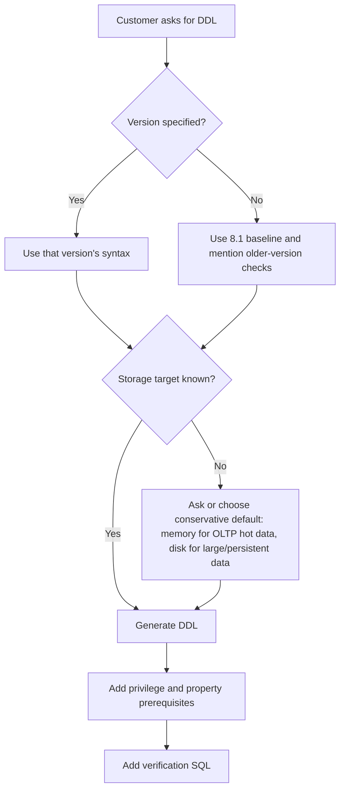
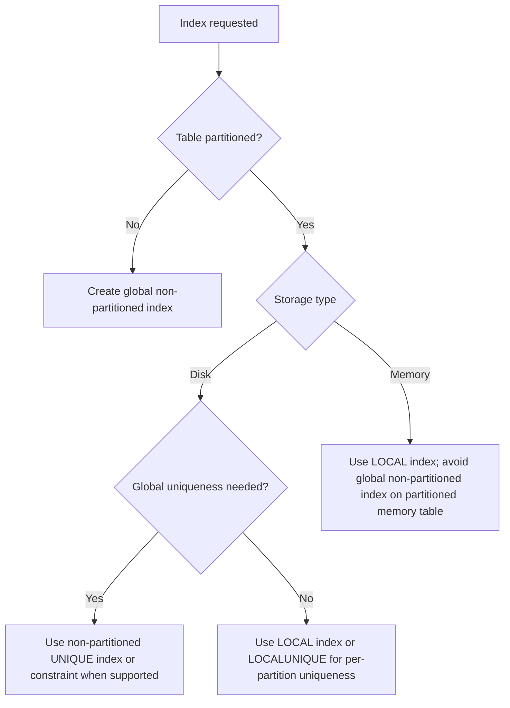

# 03. SQL DDL Generation

## Applicable Versions

- 7.1: Based on Altibase 7.1 SQL Reference and General Reference.
- 7.3: Based on Altibase 7.3 SQL Reference and General Reference.
- 8.1: Based on Altibase 8.1 verified source SQL Reference, General Reference, and Altibase 8.1 Release Notes.

## Questions This File Can Answer

- Generate tablespace DDL for disk, memory, volatile, and temporary storage.
- Generate table DDL for memory tables, disk tables, LOB columns, temporary tables, partitioned tables, and 8.1 JSON columns.
- Generate queue DDL and minimal queue usage checks.
- Generate SQL for indexes, constraints, users, privileges, sequences, and replication objects.
- Convert Oracle-style DDL into Altibase DDL while preserving object names and checking Altibase-specific storage clauses.
- Generate post-DDL verification SQL for meta tables, performance views, and properties.

## Source Documents

- 7.1: Altibase 7.1 SQL Reference; General Reference 1 and 2.
- 7.3: Altibase 7.3 SQL Reference; General Reference 1 and 2.
- 8.1: Altibase 8.1 verified source SQL Reference; General Reference 1 and 2; Altibase 8.1 Release Notes.

## Core Guidance

- Answer in the user's language, but keep SQL object names, function names, error codes, property names, commands, and file paths literal.
- If the customer specifies a version, generate SQL for that version. If the customer does not specify a version, use the 8.1 baseline and state when a feature might not exist in 7.1 or 7.3.
- Always identify the storage target before generating DDL: memory data, disk data, volatile data, or temporary disk space.
- Prefer complete runnable examples with follow-up verification SQL. Do not provide DDL without owner, tablespace, and privilege assumptions when those affect execution.
- For broad compatibility with 7.1 and 7.3, omit `IF NOT EXISTS` and `IF EXISTS` unless the customer targets 8.1 verified source or explicitly requests idempotent DDL.
- Do not claim Oracle DDL can run unchanged. Convert Oracle storage, tablespace, LOB, sequence, and replication assumptions into Altibase syntax.

## DDL Generation Flow



## Compact Syntax Patterns

These patterns are generation guides, not a replacement for the full SQL Reference grammar.

### Tablespace Syntax

```text
create_if_not_exists ::=
  IF NOT EXISTS        -- 8.1 verified source only; omit for 7.1 and 7.3

disk_tablespace ::=
  CREATE [DISK] [DATA] TABLESPACE [create_if_not_exists] tablespace_name
  DATAFILE file_spec [, file_spec ...]
  [EXTENTSIZE size]
  [SEGMENT MANAGEMENT {AUTO | MANUAL}]

file_spec ::=
  'absolute_file_path' [SIZE size] [REUSE]
  [AUTOEXTEND {ON [NEXT size] [MAXSIZE {size | UNLIMITED}] | OFF}]

memory_tablespace ::=
  CREATE MEMORY [DATA] TABLESPACE [create_if_not_exists] tablespace_name
  SIZE size
  [AUTOEXTEND {ON [NEXT size] [MAXSIZE {size | UNLIMITED}] | OFF}]
  [CHECKPOINT PATH 'directory' [, 'directory' ...]]
  [SPLIT EACH size]
  [ONLINE | OFFLINE]

volatile_tablespace ::=
  CREATE VOLATILE [DATA] TABLESPACE [create_if_not_exists] tablespace_name
  SIZE size
  [AUTOEXTEND {ON [NEXT size] [MAXSIZE {size | UNLIMITED}] | OFF}]

temporary_tablespace ::=
  CREATE TEMPORARY TABLESPACE [create_if_not_exists] tablespace_name
  TEMPFILE tempfile_spec [, tempfile_spec ...]
  [EXTENTSIZE size]

tempfile_spec ::=
  'absolute_file_path' [SIZE size] [REUSE]
  [AUTOEXTEND {ON [NEXT size] [MAXSIZE {size | UNLIMITED}] | OFF}]
```

Generation notes:

- `IF NOT EXISTS` is available for tablespace creation in the Altibase 8.1 verified source. Do not generate it for 7.1 or 7.3.
- Only `SYS` or a user with `CREATE TABLESPACE` can create these tablespaces. `ALTER TABLESPACE` and `DROP TABLESPACE` require the matching system privilege.
- Disk tablespaces store permanent disk tables and disk indexes. If `DISK` and `DATA` are omitted, the ordinary permanent form is still a disk data tablespace.
- Disk `DATAFILE` and temporary `TEMPFILE` paths should be absolute paths. Use `REUSE` only when overwriting the existing file is intentional.
- If disk `SIZE`, `NEXT`, or `MAXSIZE` is omitted, Altibase derives defaults from `USER_DATA_FILE_INIT_SIZE`, `USER_DATA_FILE_NEXT_SIZE`, and `USER_DATA_FILE_MAX_SIZE`. If temporary file values are omitted, check `USER_TEMP_FILE_INIT_SIZE`, `USER_TEMP_FILE_NEXT_SIZE`, and `USER_TEMP_FILE_MAX_SIZE`.
- Disk `EXTENTSIZE` must align with the disk page size. `SEGMENT MANAGEMENT` defaults from `DEFAULT_SEGMENT_MANAGEMENT_TYPE` when omitted.
- Memory tablespace `SIZE`, `AUTOEXTEND NEXT`, and `SPLIT EACH` must be multiples of `EXPAND_CHUNK_PAGE_COUNT * 32KB`. `AUTOEXTEND OFF` is the default.
- Memory `MAXSIZE UNLIMITED` is still bounded by available memory and `MEM_MAX_DB_SIZE`. If `CHECKPOINT PATH` is omitted, Altibase uses `MEM_DB_DIR`.
- A memory tablespace can be created `OFFLINE` and later made available with `ALTER TABLESPACE ... ONLINE`.
- Volatile tablespaces exist in memory, have no checkpoint image files, and lose data at shutdown. Their `SIZE` and `AUTOEXTEND NEXT` use the same allocation-unit rule as memory tablespaces, but their total growth is bounded by `VOLATILE_MAX_DB_SIZE`.
- `CREATE TEMPORARY TABLESPACE` creates disk working space for temporary query results and user `TEMPORARY TABLESPACE` assignment. `GLOBAL TEMPORARY TABLE` objects use a volatile tablespace in the table `TABLESPACE` clause.
- User-defined disk and memory tablespaces can move between `ONLINE` and `OFFLINE`; volatile and temporary tablespaces cannot use state changes. `DISCARD` is for damaged disk or memory tablespaces during `CONTROL` startup.

Tablespace generation checklist:

- Version: if target is 7.1 or 7.3, omit `IF NOT EXISTS`; if target is 8.1, `IF NOT EXISTS` is allowed but still does not validate that an existing tablespace has the intended attributes.
- Storage target: use disk for persistent large tables and disk indexes, memory for persistent hot data, volatile for restart-discardable high-speed data and `GLOBAL TEMPORARY TABLE` storage, and temporary for disk work space.
- Size units: keep explicit units (`K`, `M`, `G`) in generated SQL. For memory and volatile tablespaces, choose values that are multiples of the allocation unit.
- Filesystem: use absolute `DATAFILE` and `TEMPFILE` paths, confirm free space for initial size plus autoextend growth, and confirm the Altibase OS user can create or reuse the files.
- Checkpoint paths: for memory tablespaces, confirm checkpoint directories exist and are writable before `CREATE MEMORY TABLESPACE` or checkpoint path `ALTER TABLESPACE`.
- User assignment: after creating application tablespaces, set `DEFAULT TABLESPACE`, `TEMPORARY TABLESPACE`, and `ACCESS tablespace_name ON` with `CREATE USER` or `ALTER USER`.

Preflight check SQL:

```sql
SELECT product_version, meta_version
FROM V$VERSION;

SELECT name, value1
FROM V$PROPERTY
WHERE name IN (
    'DEFAULT_SEGMENT_MANAGEMENT_TYPE',
    'USER_DATA_FILE_INIT_SIZE',
    'USER_DATA_FILE_NEXT_SIZE',
    'USER_DATA_FILE_MAX_SIZE',
    'USER_TEMP_FILE_INIT_SIZE',
    'USER_TEMP_FILE_NEXT_SIZE',
    'USER_TEMP_FILE_MAX_SIZE',
    'EXPAND_CHUNK_PAGE_COUNT',
    'MEM_MAX_DB_SIZE',
    'VOLATILE_MAX_DB_SIZE',
    'MEM_DB_DIR'
)
ORDER BY name;

SELECT name, columncount
FROM V$TABLE
WHERE name IN (
    'V$TABLESPACES',
    'V$DATAFILES',
    'V$MEM_TABLESPACES',
    'V$VOL_TABLESPACES',
    'V$MEM_TABLESPACE_CHECKPOINT_PATHS'
)
ORDER BY name;
```

Post-DDL check SQL:

```sql
SELECT id,
       name,
       type,
       state,
       extent_management,
       segment_management,
       datafile_count,
       total_page_count * page_size AS total_bytes,
       allocated_page_count * page_size AS allocated_bytes
FROM V$TABLESPACES
WHERE name IN ('APP_DISK_TBS', 'APP_MEM_TBS', 'APP_VOL_TBS', 'APP_TEMP_TBS')
ORDER BY id;

SELECT t.name AS tablespace_name,
       d.name AS file_name,
       d.initsize,
       d.currsize,
       d.nextsize,
       d.maxsize,
       d.autoextend,
       d.state
FROM V$TABLESPACES t,
     V$DATAFILES d
WHERE t.id = d.spaceid
  AND t.name IN ('APP_DISK_TBS', 'APP_TEMP_TBS')
ORDER BY t.name, d.id;

SELECT space_name,
       space_status,
       current_size,
       autoextend_mode,
       autoextend_nextsize,
       maxsize,
       alloc_page_count,
       free_page_count,
       current_db
FROM V$MEM_TABLESPACES
WHERE space_name = 'APP_MEM_TBS';

SELECT p.checkpoint_path
FROM V$MEM_TABLESPACES m,
     V$MEM_TABLESPACE_CHECKPOINT_PATHS p
WHERE m.space_id = p.space_id
  AND m.space_name = 'APP_MEM_TBS'
ORDER BY p.checkpoint_path;

SELECT space_name,
       space_status,
       init_size,
       current_size,
       autoextend_mode,
       next_size,
       max_size,
       alloc_page_count,
       free_page_count
FROM V$VOL_TABLESPACES
WHERE space_name = 'APP_VOL_TBS';
```

### Table Syntax

```text
drop_if_exists ::=
  IF EXISTS           -- 8.1 verified source only; omit for 7.1 and 7.3

table ::=
  CREATE [[GLOBAL] TEMPORARY] TABLE [create_if_not_exists] [owner.]table_name
  ( column_definition [, column_definition ...]
    [, table_constraint ...] )
  [ON COMMIT {DELETE ROWS | PRESERVE ROWS}]
  [ACCESS {READ ONLY | READ WRITE | READ APPEND}]
  [MAXROWS integer]
  [TABLESPACE tablespace_name]
  [LOB (lob_column) STORE AS (TABLESPACE tablespace_name)]
  [PARTITION BY {RANGE | HASH | LIST} (...)]
  [ENABLE ROW MOVEMENT | DISABLE ROW MOVEMENT]
  [PCTFREE integer] [PCTUSED integer] [INITRANS integer] [MAXTRANS integer]
  [STORAGE (storage_attribute ...)]
  [LOGGING | NOLOGGING]
  [PARALLEL integer | NOPARALLEL]
  [AS SELECT ...]

column_definition ::=
  column_name data_type
  [DEFAULT expression]
  [NOT NULL]
  [PRIMARY KEY | UNIQUE | CHECK (condition)]
  [REFERENCES [owner.]table_name [(column_name)] [ON DELETE {NO ACTION | CASCADE | SET NULL}]]

constraint_definition ::=
  [CONSTRAINT constraint_name]
  { PRIMARY KEY (column_name [, ...]) [constraint_index_options]
  | UNIQUE (column_name [, ...]) [constraint_index_options]
  | LOCALUNIQUE (column_name [, ...]) [constraint_index_options]
  | FOREIGN KEY (column_name [, ...])
      REFERENCES [owner.]table_name [(column_name [, ...])]
      [ON DELETE {NO ACTION | CASCADE | SET NULL}]
  | CHECK (condition) }

constraint_index_options ::=
  [DIRECTKEY [MAXSIZE integer]]
  [USING INDEX
    [TABLESPACE tablespace_name]
    [LOCAL [(PARTITION index_partition_name ON table_partition_name [TABLESPACE tablespace_name], ...)]]
    [LOGGING | NOLOGGING [FORCE | NOFORCE]]
    [PARALLEL integer]]

drop_table ::=
  DROP TABLE [drop_if_exists] [owner.]table_name

alter_table_core ::=
  ALTER TABLE [owner.]table_name
  { ADD COLUMN (column_definition [, column_definition ...])
  | DROP COLUMN {column_name | (column_name [, column_name ...])}
  | RENAME COLUMN old_column_name TO new_column_name
  | ADD CONSTRAINT constraint_definition
  | DROP {CONSTRAINT constraint_name | PRIMARY KEY | UNIQUE (column_name [, ...]) | LOCALUNIQUE (column_name [, ...])}
  | RENAME TO new_table_name
  | MAXROWS integer
  | ACCESS {READ ONLY | READ WRITE | READ APPEND}
  | ENABLE ROW MOVEMENT
  | DISABLE ROW MOVEMENT
  | ALTER TABLESPACE tablespace_name [INDEX (...)] [LOB (...)]
  | ALLOCATE EXTENT (SIZE size)
  | COMPACT
  | TOUCH }

partition_by_range ::=
  PARTITION BY RANGE (partition_key [, partition_key ...])
  ( PARTITION partition_name VALUES LESS THAN (value [, value ...]) [TABLESPACE tablespace_name] [LOB (...)] [, ...]
    , PARTITION partition_name VALUES DEFAULT [TABLESPACE tablespace_name] [LOB (...)] )

partition_by_list ::=
  PARTITION BY LIST (partition_key)
  ( PARTITION partition_name VALUES (value [, value ...]) [TABLESPACE tablespace_name] [, ...]
    , PARTITION partition_name VALUES DEFAULT [TABLESPACE tablespace_name] )

partition_by_hash ::=
  PARTITION BY HASH (partition_key [, partition_key ...])
  ( PARTITION partition_name [TABLESPACE tablespace_name] [, ...] )

alter_table_partition ::=
  ALTER TABLE [owner.]table_name
  { ADD PARTITION partition_name [INDEX (...)]
  | COALESCE PARTITION
  | DROP PARTITION partition_name
  | MERGE PARTITIONS partition_name, partition_name INTO PARTITION new_partition_name [TABLESPACE tablespace_name] [INDEX (...)] [LOB (...)]
  | RENAME PARTITION old_partition_name TO new_partition_name
  | SPLIT PARTITION partition_name {AT (value [, ...]) | VALUES (value [, ...])} INTO (partition_description, partition_description)
  | TRUNCATE PARTITION partition_name
  | ALTER PARTITION partition_name TABLESPACE tablespace_name [INDEX (...)] [LOB (...)] }
```

Generation notes:

- `IF NOT EXISTS` for `CREATE TABLE` and `IF EXISTS` for `DROP TABLE` are available in the Altibase 8.1 verified source. Omit both for 7.1 and 7.3.
- Required privilege: `SYS`, `CREATE TABLE` or `CREATE ANY TABLE` for the target schema when creating tables; `SYS`, owner, `ALTER` object privilege, or `ALTER ANY TABLE` for `ALTER TABLE`; `SYS`, owner, or `DROP ANY TABLE` for `DROP TABLE`.
- If `TABLESPACE` is omitted, Altibase uses the creating user's `DEFAULT TABLESPACE`; if that is not set, the system memory default tablespace is used.
- Use memory tablespaces for persistent hot data, disk tablespaces for large persistent data, volatile tablespaces for restart-discardable data and `GLOBAL TEMPORARY TABLE` rows, and disk temporary tablespaces for sort/work space rather than ordinary table storage.
- For `PRIMARY KEY`, `UNIQUE`, and `LOCALUNIQUE`, Altibase creates supporting indexes. The supporting index uses the table's tablespace unless a `USING INDEX` clause specifies otherwise.
- `MAXROWS` limits the number of records and is not supported with partitioned tables.
- A table can have only one `PRIMARY KEY`; primary and unique constraints can use up to 32 columns.
- A `PRIMARY KEY` is equivalent to `UNIQUE` plus `NOT NULL`; all primary-key columns must be non-null.
- Do not define `PRIMARY KEY` and `UNIQUE` on the same column list in the same table. Use one named constraint for the intended rule.
- A `FOREIGN KEY` must reference a parent `PRIMARY KEY` or `UNIQUE` key. If the referenced column list is omitted, Altibase uses the parent table's primary key.
- `ON DELETE NO ACTION` is the default foreign-key action. `ON DELETE SET NULL` requires nullable child columns.
- A `TIMESTAMP` column is generated internally and only one `TIMESTAMP` column can be created in one table. Do not specify an explicit `DEFAULT` for it.
- `CHECK` constraints cannot contain subqueries, sequences, pseudo columns such as `LEVEL` or `ROWNUM`, non-deterministic functions such as `SYSDATE` or `USER_ID`, the `PRIOR` operator, or LOB data.
- Multiple `CHECK` constraints may be defined on one column, but Altibase does not guarantee their evaluation order or prove that they are mutually compatible.
- Be explicit with full date literals in `CHECK` constraints. If the year or month is omitted in a `DATE` constant, Altibase can derive it from the current date.
- LOB columns in disk tables can be stored in a separate disk LOB tablespace. LOB columns in memory tables cannot be stored separately from the table; memory LOB `IN ROW` sizing belongs in the data type definition.
- LOB type columns cannot be used in volatile tables or disk temporary tablespaces, cannot be partition keys, cannot be indexed, and should not normally be declared `NOT NULL`.
- Temporary tables can use `ON COMMIT DELETE ROWS` for transaction-specific data or `ON COMMIT PRESERVE ROWS` for session-specific data.
- For `GLOBAL TEMPORARY TABLE`, specify a volatile tablespace in the table `TABLESPACE` clause, not a disk temporary tablespace.
- Temporary table definitions are shared metadata, but rows are private to the session that inserts them. Session-specific temporary table DDL is allowed only when the session is not bound to the table; transaction-specific temporary table DDL causes the internal DDL commit behavior to remove transaction-level rows.
- Temporary tables cannot be partitioned, cannot have foreign keys, and do not support distributed transactions. Do not generate `FOREIGN KEY` clauses for them.
- Range and list partitioned tables require a `DEFAULT` partition. Range and hash partition keys can use up to 32 columns; list partitioning uses a single partition key column.
- `ENABLE ROW MOVEMENT` allows updates that move rows between partitions when partition key values change. If omitted, `DISABLE ROW MOVEMENT` is the default.
- `ADD PARTITION` and `COALESCE PARTITION` are for hash partitioning. `DROP PARTITION`, `MERGE PARTITIONS`, and `SPLIT PARTITION` are not for hash partitioning.
- Moving a non-partitioned table with `ALTER TABLE ... ALTER TABLESPACE` moves records. Moving a partitioned table's table-level tablespace does not move existing partition records; use partition-level clauses to move partition data.
- When a table is a replication target, do not generate `ALTER TABLE` that changes the table definition.
- `CREATE TABLE ... AS SELECT` copies column attributes and data from the query. Do not specify a different number of columns or explicit target data types; expression columns need aliases.
- `PCTFREE` and `PCTUSED` are meaningful for disk-based table pages. Do not copy Oracle storage clauses without checking Altibase syntax and storage target.
- `JSON` columns are an 8.1 baseline feature. Use `JSON [IN ROW size]` when needed, ensure `TEMPORARY_LOB_ENABLE=1`, and avoid JSON columns for 7.1 or 7.3 unless the customer confirms support.

Table DDL item blocks:

- Memory table: persistent memory storage; can use `MAXROWS`; indexes are memory indexes and index `TABLESPACE` is ignored. Use for hot OLTP data that must survive restart.
- Disk table: persistent disk storage; supports disk physical attributes, separate disk LOB tablespaces, and disk index tablespaces. Use for large tables, history, and LOB-heavy data.
- Volatile table: stored in volatile tablespace and lost at shutdown. Use for non-LOB restart-discardable data and `GLOBAL TEMPORARY TABLE` row storage.
- Temporary table: metadata persists, rows are session-specific or transaction-specific. Use `ON COMMIT DELETE ROWS` or `ON COMMIT PRESERVE ROWS`; do not use partitioning or foreign keys.
- LOB column: use `BLOB` or `CLOB`; keep separate `LOB (...) STORE AS (TABLESPACE ...)` clauses only for disk tables. For transient large values in 8.1, distinguish Temporary LOB execution memory from table LOB columns.
- JSON column: use only for 8.1. JSON follows broad LOB restrictions, uses Temporary LOB internally, and cannot be used with `SELECT FOR UPDATE`.
- Partitioned table: choose range for time/range pruning, list for discrete values, hash for distribution. Name partitions explicitly and specify partition tablespaces when placement matters.
- Queue table: use `CREATE QUEUE`, not `CREATE TABLE`, when the object must support `ENQUEUE` and `DEQUEUE`.
- Primary key: one per table; supports referential integrity and creates an internal unique index.
- Unique key: enforces global duplicate prevention for the key scope that the supporting index can validate; allows `NULL` values.
- Local unique key: use `LOCALUNIQUE` for partitioned tables when uniqueness is required within each local index partition rather than across the whole table.
- Foreign key: references a parent primary or unique key and should normally have an index on the child key when parent deletes or updates are frequent.
- Check constraint: enforce simple deterministic row rules; avoid incomplete date constants and unsupported expressions.

### Queue Syntax

```text
queue ::=
  CREATE QUEUE [create_if_not_exists] [owner.]queue_name
  ( {message_size | queue_column_definition [, queue_column_definition ...]} )
  [MAXROWS integer]

queue_column_definition ::=
  column_name data_type

alter_queue ::=
  ALTER QUEUE [owner.]queue_name {COMPACT | MSGID RESET}

drop_queue ::=
  DROP QUEUE [drop_if_exists] [owner.]queue_name

enqueue_usage ::=
  ENQUEUE INTO [owner.]queue_name (queue_column [, queue_column ...])
  VALUES (value [, value ...])

dequeue_usage ::=
  DEQUEUE queue_column [, queue_column ...]
  FROM [owner.]queue_name
  [WHERE condition]
  [{FIFO | LIFO}]
  [WAIT integer [time_unit]]

time_unit ::=
  SEC | MSEC | USEC
```

Generation notes:

- `IF NOT EXISTS` for `CREATE QUEUE` and `IF EXISTS` for `DROP QUEUE` are available in the Altibase 8.1 verified source. Omit both for 7.1 and 7.3.
- Required privilege for `CREATE QUEUE` follows table creation privilege rules: `SYS`, `CREATE TABLE` or `CREATE ANY TABLE` in the user's schema, or `CREATE ANY TABLE` in another schema.
- `DROP QUEUE` requires `SYS`, the owner, or `DROP ANY TABLE`.
- `queue_name` can be up to 28 bytes. Creating a queue also creates an internal object named `queue_name || '_NEXT_MSG_ID'`; avoid names that collide with that generated object.
- The message-size form accepts a byte size from `1` through `32000`.
- The column-definition form uses `CREATE TABLE` column definitions but does not support column constraints, encryption clauses, or `TIMESTAMP`.
- `MAXROWS` ranges from `1` through `4294967295`; the default is `4294967295`.
- `ALTER QUEUE ... COMPACT` returns empty pages to the queue tablespace without moving queue data. `ALTER QUEUE ... MSGID RESET` resets the queue message id.
- `DROP QUEUE` removes the queue table, its index, and the sequence used for `MSGID` values.
- `DEQUEUE` reads and removes the matching message. `FIFO` is the default; `LIFO` reads the newest matching message. `DEQUEUE` can reference only one queue table, and a `DEQUEUE` `WHERE` clause cannot contain a subquery.

### Index Syntax

```text
index ::=
  CREATE [UNIQUE | LOCALUNIQUE] INDEX [owner.]index_name
  ON [owner.]table_name ( index_expr [ASC | DESC] [, index_expr [ASC | DESC] ...] )
  [INDEXTYPE IS {BTREE | RTREE}]
  [DIRECTKEY [MAXSIZE integer]]
  [LOCAL [(PARTITION index_partition_name ON table_partition_name [TABLESPACE tablespace_name], ...)]]
  [TABLESPACE tablespace_name]
  [LOGGING | NOLOGGING [FORCE | NOFORCE]]
  [PARALLEL integer]

alter_index ::=
  ALTER INDEX [owner.]index_name
  { REBUILD [PARTITION index_partition_name [TABLESPACE tablespace_name]]
  | DIRECTKEY [MAXSIZE integer]
  | DIRECTKEY OFF
  | RENAME TO new_index_name
  | AGING
  | REORGANIZATION
  | ALLOCATE EXTENT (SIZE size)
  | STORAGE (storage_attribute ...) }

drop_index ::=
  DROP INDEX [owner.]index_name
```

Generation notes:

- `BTREE` is the default index type. `RTREE` is for multidimensional data such as spatial use cases.
- A `LOCAL` partitioned index creates one index partition for each table partition. If partition names are omitted, Altibase generates them automatically.
- Altibase supports local partitioned indexes and global non-partitioned indexes. Global partitioned indexes are not supported.
- Disk partitioned tables can use local partitioned indexes or global non-partitioned indexes. Partitioned memory tables can use local partitioned indexes but not global non-partitioned indexes.
- A local index can only be a B+tree index. Do not generate `INDEXTYPE IS RTREE` for local partitioned indexes.
- For partitioned indexes, specify tablespaces at index-partition level with `LOCAL (...)`; do not use a whole-index `TABLESPACE` clause for the partitioned index.
- `LOCALUNIQUE` enforces uniqueness within each local index partition. Use ordinary `UNIQUE` only when the requested uniqueness must be global and the target table/storage type supports the required non-partitioned index.
- A function-based index can use built-in functions or user-defined functions. User-defined functions used in the expression must be `DETERMINISTIC`.
- A function-based index can be chosen by the optimizer only when `QUERY_REWRITE_ENABLE = 1`.
- An index cannot be created on a LOB column.
- A direct key index stores the direct key with the index entry. It can reduce index scan cost, but cannot be created on disk-resident indexes, compressed columns, or encrypted columns. For composite direct key indexes, the first column is the direct key.
- For memory tables, a `TABLESPACE` clause on an index is ignored because memory indexes are not stored in tablespaces.
- For disk-table indexes, `NOLOGGING` can improve build speed but may require dropping and rebuilding the index after a system or media fault if the index becomes inconsistent.
- `PARALLEL integer` is an index-build hint. Valid generation range is `0` through `512`; omitted or `0` lets Altibase derive the thread count from `INDEX_BUILD_THREAD_COUNT` or the host CPU count.
- Use `ALTER INDEX ... REBUILD` for inconsistent disk B-tree indexes or after changing direct-key attributes. `AGING` is for disk indexes; `REORGANIZATION` is for memory B-tree index space cleanup.

Index type selection flow:



### User and Privilege Syntax

```text
create_user ::=
  CREATE USER [IF NOT EXISTS] user_name IDENTIFIED BY password create_user_option ...

create_user_option ::=
    DEFAULT TABLESPACE tablespace_name
  | TEMPORARY TABLESPACE tablespace_name
  | ACCESS tablespace_name {ON | OFF}
  | LIMIT (password_parameter [, password_parameter ...])
  | {ENABLE TCP | DISABLE TCP}

password_parameter ::=
    {FAILED_LOGIN_ATTEMPTS | PASSWORD_LIFE_TIME | PASSWORD_REUSE_TIME |
     PASSWORD_REUSE_MAX | PASSWORD_LOCK_TIME | PASSWORD_GRACE_TIME}
    {value | UNLIMITED | DEFAULT}
  | PASSWORD_VERIFY_FUNCTION {function_name | NULL | DEFAULT}

alter_user ::=
  ALTER USER user_name alter_user_option ...

alter_user_option ::=
    IDENTIFIED BY password
  | DEFAULT TABLESPACE tablespace_name
  | TEMPORARY TABLESPACE tablespace_name
  | ACCESS tablespace_name {ON | OFF}
  | LIMIT (password_parameter [, password_parameter ...])
  | ACCOUNT {LOCK | UNLOCK}
  | {ENABLE TCP | DISABLE TCP}

drop_user ::=
  DROP USER [IF EXISTS] user_name [CASCADE]

role_ddl ::=
  CREATE ROLE role_name
  DROP ROLE role_name

grant_system ::=
  GRANT {system_privilege | role_name | ALL PRIVILEGES}
        [, {system_privilege | role_name | ALL PRIVILEGES} ...]
  TO {user_name | role_name | PUBLIC} [, {user_name | role_name | PUBLIC} ...]

grant_object ::=
  GRANT {object_privilege [, object_privilege ...] | ALL [PRIVILEGES]}
  ON {[owner.]object_name | DIRECTORY directory_name}
  TO {user_name | role_name | PUBLIC} [, {user_name | role_name | PUBLIC} ...]
  [WITH GRANT OPTION]

revoke_system ::=
  REVOKE {system_privilege | role_name | ALL PRIVILEGES}
         [, {system_privilege | role_name | ALL PRIVILEGES} ...]
  FROM {user_name | role_name | PUBLIC} [, {user_name | role_name | PUBLIC} ...]

revoke_object ::=
  REVOKE {object_privilege [, object_privilege ...] | ALL [PRIVILEGES]}
  ON {[owner.]object_name | DIRECTORY directory_name}
  FROM {user_name | role_name | PUBLIC} [, {user_name | role_name | PUBLIC} ...]
  [CASCADE CONSTRAINTS]
```

Generation notes:

- `IF NOT EXISTS` on `CREATE USER` and `IF EXISTS` on `DROP USER` are available in the Altibase 8.1 verified source. Omit them for 7.1 and 7.3.
- `CREATE SESSION` is required for a normal application user to connect.
- New application schemas usually need only specific DDL privileges, such as `CREATE TABLE`, `CREATE SEQUENCE`, `CREATE VIEW`, and object privileges on required tables.
- Runtime accounts normally need `CREATE SESSION` plus object privileges such as `SELECT`, `INSERT`, `UPDATE`, `DELETE`, `EXECUTE`, or `SELECT` on a sequence. Do not grant schema DDL privileges to runtime accounts unless the application really creates objects.
- To allow additional tablespace access after user creation, generate `ALTER USER user_name ACCESS tablespace_name ON`.
- Use least privilege. Avoid `ALL PRIVILEGES`, `TO PUBLIC`, and `ANY` privileges such as `SELECT ANY TABLE` unless the customer explicitly needs administrative scope and accepts the blast radius.
- `CREATE ROLE` creates an empty role. Grant system or object privileges to the role, then grant the role to users. A user must reconnect before privileges newly granted through a role are enabled.
- A role cannot be granted to another role or to `PUBLIC`. A user can have at most 126 granted roles.
- `WITH GRANT OPTION` lets the grantee re-grant object privileges. Do not use it for ordinary application users, and do not use it when granting object privileges to a role.
- `ALTER USER ... LIMIT (...)` can be executed only by `SYS`; when a password policy is changed, policy items omitted from the new `LIMIT` clause are initialized.
- `ALTER USER ... ACCOUNT LOCK|UNLOCK` explicitly controls account lock state. `ALTER USER ... DISABLE TCP` restricts ordinary TCP connections for that user; SSL or IPC can still be used where configured.
- When changing the `SYS` password with `ALTER USER`, also update the `syspassword` file with `altipasswd` and update scripts that embed the old password.
- The owner of an object, or a user with object privilege `WITH GRANT OPTION`, can grant object privileges.
- The `SYS` user or the original grantor can revoke privileges. Use `CASCADE CONSTRAINTS` when revoking `REFERENCES` or `ALL` must also drop dependent referential constraints.

### Sequence Syntax

```text
sequence ::=
  CREATE SEQUENCE [owner.]sequence_name
  [START WITH integer]
  [INCREMENT BY integer]
  [MINVALUE integer | NOMINVALUE]
  [MAXVALUE integer | NOMAXVALUE]
  [CYCLE | NOCYCLE]
  [CACHE integer | NOCACHE]
  [ENABLE SYNC TABLE | DISABLE SYNC TABLE]
```

Generation notes:

- `NEXTVAL` must be called before `CURRVAL` can be read for a newly created sequence.
- The default `INCREMENT BY` is `1`; the default `CACHE` value is `20`.
- `ENABLE SYNC TABLE` creates a custom table named `[sequence name]$seq` for sequence replication. The sequence name must be 36 bytes or shorter for this option.

### Replication Syntax

```text
replication_non_ssl ::=
  CREATE [LAZY | EAGER] REPLICATION [IF NOT EXISTS] replication_name
  [FOR ANALYSIS | FOR ANALYSIS PROPAGATION | FOR PROPAGABLE LOGGING | FOR PROPAGATION]
  [AS MASTER | AS SLAVE]
  [OPTIONS option_list]
  WITH 'remote_host_ip_or_name', remote_replication_port [USING TCP | USING IB ib_latency]
       [...]
  FROM [owner.]local_table [PARTITION local_partition]
  TO   [owner.]remote_table [PARTITION remote_partition]
  [, FROM ... TO ...]

replication_ssl_8_1 ::=
  CREATE [LAZY | EAGER] REPLICATION [IF NOT EXISTS] replication_name
  [AS MASTER | AS SLAVE]
  [OPTIONS option_list]
  WITH 'remote_host_ip_or_name', remote_ssl_replication_port USING SSL
       [...]
  FROM [owner.]local_table [PARTITION local_partition]
  TO   [owner.]remote_table [PARTITION remote_partition]
  [, FROM ... TO ...]

alter_replication ::=
  ALTER REPLICATION replication_name SYNC [PARALLEL parallel_factor]
    [TABLE [owner.]table_name [PARTITION partition_name], ...]
| ALTER REPLICATION replication_name SYNC ONLY [PARALLEL parallel_factor]
    [TABLE [owner.]table_name [PARTITION partition_name], ...]
| ALTER REPLICATION replication_name START [RETRY]
| ALTER REPLICATION replication_name QUICKSTART [RETRY]
| ALTER REPLICATION replication_name STOP
| ALTER REPLICATION replication_name RESET
| ALTER REPLICATION replication_name ADD TABLE
    FROM [owner.]local_table [PARTITION local_partition]
    TO   [owner.]remote_table [PARTITION remote_partition]
| ALTER REPLICATION replication_name DROP TABLE
    FROM [owner.]local_table [PARTITION local_partition]
    TO   [owner.]remote_table [PARTITION remote_partition]
| ALTER REPLICATION replication_name FLUSH [ALL] [WAIT timeout_sec]
```

Generation notes:

- Only `SYS` can execute replication-related statements.
- `IF NOT EXISTS` is available for `CREATE REPLICATION` in Altibase 8.1 verified source. Omit it for 7.1 and 7.3; it also does not verify that an existing replication object has the desired endpoints or target items.
- The replication object name must be the same on both servers.
- The port in `WITH 'host', port` is the remote server's replication receiver port. For ordinary replication, check `REPLICATION_PORT_NO` on the remote server.
- Non-SSL replication and SSL replication are separate generation cases. Do not mix ordinary TCP ports and SSL replication ports in the same example.
- If `USING` is omitted, ordinary TCP replication is used. `USING TCP` can be shown for clarity, but it is not required.
- `USING IB ib_latency` is only for InfiniBand environments. Use the peer `REPLICATION_IB_PORT_NO`, and verify `IB_ENABLE`.
- In Altibase 8.1 verified source, SSL replication uses `USING SSL` and the remote server's `REPLICATION_SSL_PORT_NO`. SSL configuration must already be completed on each replication target server.
- Do not combine `FOR ANALYSIS` Log Analyzer replication with `USING SSL`.
- `SYNC` copies current target data and then starts replication. `SYNC ONLY` copies current target data without creating a Sender thread. `START` resumes from the latest restart point. `QUICKSTART` starts from the current log position and can skip unsent historical changes.

## Complete DDL Examples

### Tablespace Examples

For 7.1 and 7.3, generate tablespace DDL without `IF NOT EXISTS`:

```sql
CREATE DISK DATA TABLESPACE app_disk_tbs
DATAFILE '/data/altibase/dbs/app_disk01.dbf' SIZE 1G
AUTOEXTEND ON NEXT 256M MAXSIZE 20G
EXTENTSIZE 512K
SEGMENT MANAGEMENT AUTO;

CREATE MEMORY DATA TABLESPACE app_mem_tbs
SIZE 512M
AUTOEXTEND ON NEXT 128M MAXSIZE 4G
CHECKPOINT PATH '/data/altibase/chkpt01', '/data/altibase/chkpt02'
SPLIT EACH 512M;

CREATE VOLATILE DATA TABLESPACE app_vol_tbs
SIZE 256M
AUTOEXTEND ON NEXT 64M MAXSIZE 1G;

CREATE TEMPORARY TABLESPACE app_temp_tbs
TEMPFILE '/data/altibase/dbs/app_temp01.tmp' SIZE 512M
AUTOEXTEND ON NEXT 128M MAXSIZE 8G
EXTENTSIZE 256K;
```

For an 8.1 verified source target, `IF NOT EXISTS` can be added after `TABLESPACE`:

```sql
CREATE DISK DATA TABLESPACE IF NOT EXISTS app_disk_tbs
DATAFILE '/data/altibase/dbs/app_disk01.dbf' SIZE 1G
AUTOEXTEND ON NEXT 256M MAXSIZE 20G
SEGMENT MANAGEMENT AUTO;

CREATE MEMORY DATA TABLESPACE IF NOT EXISTS app_mem_tbs
SIZE 512M
AUTOEXTEND ON NEXT 128M MAXSIZE 4G
CHECKPOINT PATH '/data/altibase/chkpt01', '/data/altibase/chkpt02'
SPLIT EACH 512M;

CREATE VOLATILE DATA TABLESPACE IF NOT EXISTS app_vol_tbs
SIZE 256M
AUTOEXTEND ON NEXT 64M MAXSIZE 1G;

CREATE TEMPORARY TABLESPACE IF NOT EXISTS app_temp_tbs
TEMPFILE '/data/altibase/dbs/app_temp01.tmp' SIZE 512M
AUTOEXTEND ON NEXT 128M MAXSIZE 8G;
```

Alter disk and temporary files:

```sql
ALTER TABLESPACE app_disk_tbs
ADD DATAFILE '/data/altibase/dbs/app_disk02.dbf' SIZE 1G
AUTOEXTEND ON NEXT 256M MAXSIZE 20G;

ALTER TABLESPACE app_disk_tbs
ALTER DATAFILE '/data/altibase/dbs/app_disk01.dbf'
AUTOEXTEND ON NEXT 512M MAXSIZE 30G;

ALTER TABLESPACE app_temp_tbs
ADD TEMPFILE '/data/altibase/dbs/app_temp02.tmp' SIZE 512M
AUTOEXTEND ON NEXT 128M MAXSIZE 8G;

ALTER TABLESPACE app_temp_tbs
ALTER TEMPFILE '/data/altibase/dbs/app_temp01.tmp'
SIZE 1G;
```

Alter memory and volatile growth, and manage memory checkpoint paths:

```sql
ALTER TABLESPACE app_mem_tbs
ALTER AUTOEXTEND ON NEXT 256M MAXSIZE 8G;

ALTER TABLESPACE app_vol_tbs
ALTER AUTOEXTEND ON NEXT 128M MAXSIZE 2G;

STARTUP PROCESS;
STARTUP CONTROL;

ALTER TABLESPACE app_mem_tbs
ADD CHECKPOINT PATH '/data3/altibase/chkpt03';
```

Assign tablespaces to an application user:

```sql
CREATE USER app IDENTIFIED BY app_password
DEFAULT TABLESPACE app_mem_tbs
TEMPORARY TABLESPACE app_temp_tbs
ACCESS app_disk_tbs ON;

ALTER USER app ACCESS app_mem_tbs ON;
ALTER USER app ACCESS app_vol_tbs ON;
```

Verify tablespaces and relevant properties:

```sql
SELECT id,
       name,
       type,
       state,
       datafile_count,
       total_page_count * page_size AS total_bytes
FROM V$TABLESPACES
WHERE name IN ('APP_DISK_TBS', 'APP_MEM_TBS', 'APP_VOL_TBS', 'APP_TEMP_TBS')
ORDER BY id;

SELECT space_name, current_size, autoextend_mode, autoextend_nextsize, maxsize
FROM V$MEM_TABLESPACES
WHERE space_name = 'APP_MEM_TBS';

SELECT space_name, current_size, autoextend_mode, next_size, max_size
FROM V$VOL_TABLESPACES
WHERE space_name = 'APP_VOL_TBS';

SELECT t.name AS tablespace_name, d.name AS datafile_name,
       d.initsize, d.currsize, d.nextsize, d.maxsize, d.autoextend
FROM V$TABLESPACES t, V$DATAFILES d
WHERE t.id = d.spaceid
  AND t.name IN ('APP_DISK_TBS', 'APP_TEMP_TBS');

SELECT name, value1
FROM V$PROPERTY
WHERE name IN (
    'DEFAULT_SEGMENT_MANAGEMENT_TYPE',
    'USER_DATA_FILE_INIT_SIZE',
    'USER_DATA_FILE_NEXT_SIZE',
    'USER_DATA_FILE_MAX_SIZE',
    'USER_TEMP_FILE_INIT_SIZE',
    'USER_TEMP_FILE_NEXT_SIZE',
    'USER_TEMP_FILE_MAX_SIZE',
    'EXPAND_CHUNK_PAGE_COUNT',
    'MEM_MAX_DB_SIZE',
    'VOLATILE_MAX_DB_SIZE'
)
ORDER BY name;
```

### User and Privilege Examples

Create an application schema, assign default storage, and grant only required DDL privileges through a role:

```sql
CREATE USER app IDENTIFIED BY app_password
DEFAULT TABLESPACE app_mem_tbs
TEMPORARY TABLESPACE app_temp_tbs
ACCESS app_disk_tbs ON
LIMIT (
    FAILED_LOGIN_ATTEMPTS 5,
    PASSWORD_LOCK_TIME 1,
    PASSWORD_LIFE_TIME 90,
    PASSWORD_GRACE_TIME 7
);

CREATE ROLE app_schema_ddl_role;
GRANT CREATE SESSION, CREATE TABLE, CREATE SEQUENCE, CREATE VIEW TO app_schema_ddl_role;
GRANT app_schema_ddl_role TO app;

ALTER USER app ACCESS app_mem_tbs ON;
```

Grant object privileges to a separate runtime user through a role. The runtime user should reconnect after the role is granted:

```sql
CREATE USER app_runtime IDENTIFIED BY runtime_password
DEFAULT TABLESPACE app_mem_tbs
TEMPORARY TABLESPACE app_temp_tbs
ACCESS app_disk_tbs ON;

GRANT CREATE SESSION TO app_runtime;
ALTER USER app_runtime ACCESS app_mem_tbs ON;

CREATE ROLE app_runtime_dml_role;
GRANT SELECT, INSERT, UPDATE, DELETE ON app.app_user TO app_runtime_dml_role;
GRANT SELECT ON app.app_document TO app_runtime_dml_role;
GRANT SELECT ON app.seq_app_user TO app_runtime_dml_role;
GRANT app_runtime_dml_role TO app_runtime;
```

For a strict runtime account, audit the automatically granted baseline privileges and revoke unused DDL privileges:

```sql
REVOKE CREATE TABLE, CREATE SEQUENCE, CREATE PROCEDURE, CREATE VIEW,
       CREATE TRIGGER, CREATE SYNONYM, CREATE MATERIALIZED VIEW,
       CREATE LIBRARY
FROM app_runtime;
```

Verify users and grants:

```sql
SELECT u.user_name, u.user_type, u.account_lock, u.disable_tcp,
       dt.name AS default_tablespace,
       tt.name AS temporary_tablespace
FROM SYSTEM_.SYS_USERS_ u, V$TABLESPACES dt, V$TABLESPACES tt
WHERE u.default_tbs_id = dt.id
  AND u.temp_tbs_id = tt.id
  AND u.user_name IN ('APP', 'APP_RUNTIME', 'APP_SCHEMA_DDL_ROLE',
                      'APP_RUNTIME_DML_ROLE');

SELECT p.priv_name, grantee.user_name AS grantee_name
FROM SYSTEM_.SYS_GRANT_SYSTEM_ g,
     SYSTEM_.SYS_PRIVILEGES_ p,
     SYSTEM_.SYS_USERS_ grantee
WHERE g.priv_id = p.priv_id
  AND g.grantee_id = grantee.user_id
  AND grantee.user_name IN ('APP', 'APP_RUNTIME', 'APP_SCHEMA_DDL_ROLE',
                            'APP_RUNTIME_DML_ROLE')
ORDER BY grantee.user_name, p.priv_name;

SELECT grantee.user_name AS grantee_name,
       role_user.user_name AS role_name
FROM SYSTEM_.SYS_USER_ROLES_ r,
     SYSTEM_.SYS_USERS_ grantee,
     SYSTEM_.SYS_USERS_ role_user
WHERE r.grantee_id = grantee.user_id
  AND r.role_id = role_user.user_id
  AND grantee.user_name IN ('APP', 'APP_RUNTIME')
ORDER BY grantee.user_name, role_user.user_name;

SELECT p.priv_name, grantee.user_name AS grantee_name,
       owner.user_name AS object_owner, t.table_name, g.with_grant_option
FROM SYSTEM_.SYS_GRANT_OBJECT_ g,
     SYSTEM_.SYS_PRIVILEGES_ p,
     SYSTEM_.SYS_USERS_ grantee,
     SYSTEM_.SYS_USERS_ owner,
     SYSTEM_.SYS_TABLES_ t
WHERE g.priv_id = p.priv_id
  AND g.grantee_id = grantee.user_id
  AND g.user_id = owner.user_id
  AND g.obj_id = t.table_id
  AND grantee.user_name = 'APP_RUNTIME_DML_ROLE'
ORDER BY t.table_name, p.priv_name;
```

Least-privilege review queries:

```sql
SELECT grantee.user_name AS grantee_name, p.priv_name
FROM SYSTEM_.SYS_GRANT_SYSTEM_ g,
     SYSTEM_.SYS_USERS_ grantee,
     SYSTEM_.SYS_PRIVILEGES_ p
WHERE g.grantee_id = grantee.user_id
  AND g.priv_id = p.priv_id
  AND (p.priv_name = 'ALL' OR p.priv_name LIKE '% ANY %')
ORDER BY grantee.user_name, p.priv_name;

SELECT p.priv_name,
       owner.user_name AS object_owner,
       t.table_name AS object_name,
       g.with_grant_option
FROM SYSTEM_.SYS_GRANT_OBJECT_ g,
     SYSTEM_.SYS_PRIVILEGES_ p,
     SYSTEM_.SYS_USERS_ owner,
     SYSTEM_.SYS_TABLES_ t
WHERE g.grantee_id = 0
  AND g.user_id = owner.user_id
  AND g.priv_id = p.priv_id
  AND g.user_id = t.user_id
  AND g.obj_id = t.table_id
ORDER BY owner.user_name, t.table_name, p.priv_name;
```

### Table Examples

Create a memory table with constraints:

```sql
CREATE TABLE app.app_user (
    user_id     INTEGER NOT NULL,
    user_name   VARCHAR(80) NOT NULL,
    status      CHAR(1) DEFAULT 'A' CHECK (status IN ('A', 'I')),
    created_at  DATE DEFAULT SYSDATE,
    CONSTRAINT pk_app_user PRIMARY KEY (user_id),
    CONSTRAINT uk_app_user_name UNIQUE (user_name)
) MAXROWS 1000000
TABLESPACE app_mem_tbs;
```

Create a disk table with LOB storage separated from the table tablespace:

```sql
CREATE TABLE app.app_document (
    doc_id      BIGINT NOT NULL,
    user_id     INTEGER NOT NULL,
    title       VARCHAR(200) NOT NULL,
    body        CLOB,
    created_at  DATE DEFAULT SYSDATE,
    CONSTRAINT pk_app_document PRIMARY KEY (doc_id),
    CONSTRAINT fk_app_document_user
        FOREIGN KEY (user_id)
        REFERENCES app.app_user (user_id)
        ON DELETE CASCADE
) TABLESPACE app_disk_tbs
LOB (body) STORE AS (TABLESPACE app_disk_tbs);
```

Create transaction-specific and session-specific temporary tables:

```sql
CREATE GLOBAL TEMPORARY TABLE app.tmp_order_stage (
    order_id    BIGINT,
    line_no     INTEGER,
    item_code   VARCHAR(40),
    quantity    INTEGER
) ON COMMIT DELETE ROWS
TABLESPACE app_vol_tbs;

CREATE GLOBAL TEMPORARY TABLE app.tmp_report_cache (
    report_key  VARCHAR(80),
    payload     VARCHAR(4000)
) ON COMMIT PRESERVE ROWS
TABLESPACE app_vol_tbs;
```

Do not put ordinary `BLOB` or `CLOB` columns in volatile temporary-table storage. For transient large text or binary values, use a permanent disk table with LOB storage, application-side staging, or 8.1 Temporary LOB processing as appropriate.

Create a range-partitioned disk table:

```sql
CREATE TABLE app.order_history (
    order_id    BIGINT NOT NULL,
    order_date  DATE NOT NULL,
    user_id     INTEGER NOT NULL,
    amount      NUMBER(12, 2),
    CONSTRAINT pk_order_history PRIMARY KEY (order_id, order_date)
)
PARTITION BY RANGE (order_date)
(
    PARTITION p_2025 VALUES LESS THAN ('01-JAN-2026') TABLESPACE app_disk_tbs,
    PARTITION p_default VALUES DEFAULT TABLESPACE app_disk_tbs
)
TABLESPACE app_disk_tbs;
```

Create list and hash partitioned disk tables:

```sql
CREATE TABLE app.customer_region (
    customer_id  BIGINT NOT NULL,
    region_code  VARCHAR(20) NOT NULL,
    status       CHAR(1) DEFAULT 'A',
    CONSTRAINT pk_customer_region PRIMARY KEY (customer_id, region_code)
)
PARTITION BY LIST (region_code)
(
    PARTITION p_kr VALUES ('KR') TABLESPACE app_disk_tbs,
    PARTITION p_us VALUES ('US') TABLESPACE app_disk_tbs,
    PARTITION p_other VALUES DEFAULT TABLESPACE app_disk_tbs
)
ENABLE ROW MOVEMENT
TABLESPACE app_disk_tbs;

CREATE TABLE app.event_bucket (
    event_id    BIGINT NOT NULL,
    created_at  DATE DEFAULT SYSDATE,
    payload     VARCHAR(4000),
    CONSTRAINT pk_event_bucket PRIMARY KEY (event_id)
)
PARTITION BY HASH (event_id)
(
    PARTITION p01 TABLESPACE app_disk_tbs,
    PARTITION p02 TABLESPACE app_disk_tbs,
    PARTITION p03 TABLESPACE app_disk_tbs,
    PARTITION p04 TABLESPACE app_disk_tbs
)
TABLESPACE app_disk_tbs;
```

8.1 JSON table example:

```sql
CREATE TABLE app.app_event (
    event_id    BIGINT NOT NULL,
    user_id     INTEGER,
    payload     JSON IN ROW 2048,
    created_at  DATE DEFAULT SYSDATE,
    CONSTRAINT pk_app_event PRIMARY KEY (event_id)
) TABLESPACE app_disk_tbs;
```

8.1 JSON cautions:

- Treat `JSON` as an 8.1 baseline feature.
- JSON processing uses Temporary LOB internally; check `TEMPORARY_LOB_ENABLE` when a JSON workload fails or when memory use is being reviewed.
- Avoid generating the `JSON` column type for 7.1 or 7.3 unless the customer provides version-specific confirmation.
- Do not create partition keys or indexes on JSON columns. Treat JSON columns as LOB-like for DDL restrictions.

Alter table examples:

```sql
ALTER TABLE app.app_document
ADD COLUMN (updated_at DATE DEFAULT SYSDATE);

ALTER TABLE app.app_document
ALTER TABLESPACE app_disk_tbs
LOB (body TABLESPACE app_disk_tbs);

ALTER TABLE app.order_history
ENABLE ROW MOVEMENT;

ALTER TABLE app.order_history
SPLIT PARTITION p_default
AT ('01-JAN-2027')
INTO (
    PARTITION p_2026 TABLESPACE app_disk_tbs,
    PARTITION p_future TABLESPACE app_disk_tbs
);

ALTER TABLE app.event_bucket
ADD PARTITION p05;

ALTER TABLE app.event_bucket
COALESCE PARTITION;
```

Queue DDL and minimal usage examples:

```sql
CREATE QUEUE app.app_event_q (
    event_id    BIGINT,
    payload     VARCHAR(4000),
    corrid      INTEGER
) MAXROWS 1000000;

ENQUEUE INTO app.app_event_q (event_id, payload, corrid)
VALUES (1001, '{"type":"signup"}', 10);

DEQUEUE event_id, payload, corrid
FROM app.app_event_q
WHERE corrid = 10
FIFO
WAIT 5;

ALTER QUEUE app.app_event_q COMPACT;
ALTER QUEUE app.app_event_q MSGID RESET;
```

For an 8.1 verified source target, idempotent queue DDL can be generated:

```sql
CREATE QUEUE IF NOT EXISTS app.app_event_q (
    event_id    BIGINT,
    payload     VARCHAR(4000),
    corrid      INTEGER
) MAXROWS 1000000;

DROP QUEUE IF EXISTS app.app_event_q;
```

Verify table definitions:

```sql
SELECT u.user_name, t.table_name, t.table_type, t.tbs_name,
       t.maxrow, t.temporary, t.is_partitioned, t.created
FROM SYSTEM_.SYS_TABLES_ t, SYSTEM_.SYS_USERS_ u
WHERE t.user_id = u.user_id
  AND u.user_name = 'APP'
  AND t.table_name IN (
      'APP_USER',
      'APP_DOCUMENT',
      'TMP_ORDER_STAGE',
      'TMP_REPORT_CACHE',
      'ORDER_HISTORY',
      'CUSTOMER_REGION',
      'EVENT_BUCKET',
      'APP_EVENT_Q',
      'APP_EVENT'
  );

SELECT u.user_name, t.table_name, c.column_name,
       c.data_type, c.precision, c.scale,
       c.is_nullable, c.default_val, c.store_type, c.in_row_size
FROM SYSTEM_.SYS_COLUMNS_ c,
     SYSTEM_.SYS_TABLES_ t,
     SYSTEM_.SYS_USERS_ u
WHERE c.table_id = t.table_id
  AND c.user_id = u.user_id
  AND t.user_id = u.user_id
  AND u.user_name = 'APP'
  AND t.table_name = 'APP_DOCUMENT'
ORDER BY c.column_order;

SELECT t.table_name, m.mem_page_cnt, m.mem_slot_size, m.fixed_used_mem, m.var_used_mem
FROM SYSTEM_.SYS_TABLES_ t, V$MEMTBL_INFO m
WHERE t.table_oid = m.table_oid
  AND t.table_name = 'APP_USER';

SELECT p.partition_name,
       p.partition_min_value,
       p.partition_max_value,
       p.partition_order,
       p.tbs_id,
       p.partition_access
FROM SYSTEM_.SYS_TABLE_PARTITIONS_ p,
     SYSTEM_.SYS_TABLES_ t,
     SYSTEM_.SYS_USERS_ u
WHERE p.user_id = t.user_id
  AND p.table_id = t.table_id
  AND t.user_id = u.user_id
  AND u.user_name = 'APP'
  AND t.table_name IN ('ORDER_HISTORY', 'CUSTOMER_REGION', 'EVENT_BUCKET')
ORDER BY t.table_name, p.partition_order, p.partition_name;

SELECT u.user_name,
       t.table_name AS queue_name,
       t.table_type,
       t.maxrow,
       t.column_count
FROM SYSTEM_.SYS_TABLES_ t,
     SYSTEM_.SYS_USERS_ u
WHERE t.user_id = u.user_id
  AND u.user_name = 'APP'
  AND t.table_name = 'APP_EVENT_Q'
  AND t.table_type = 'Q';

SELECT name, value1
FROM V$PROPERTY
WHERE name = 'TEMPORARY_LOB_ENABLE';

-- 8.1 Temporary LOB check for JSON or Temporary LOB workloads.
SELECT type, open_count
FROM V$TEMPORARY_LOBS;
```

### Constraint Examples

Create named primary-key, unique, check, and foreign-key constraints:

```sql
CREATE TABLE app.department (
    dept_id    INTEGER NOT NULL,
    dept_code  VARCHAR(20) NOT NULL,
    dept_name  VARCHAR(80) NOT NULL,
    status     CHAR(1) DEFAULT 'A',
    CONSTRAINT pk_department PRIMARY KEY (dept_id)
        USING INDEX TABLESPACE app_disk_tbs,
    CONSTRAINT uk_department_code UNIQUE (dept_code)
        USING INDEX TABLESPACE app_disk_tbs,
    CONSTRAINT ck_department_status CHECK (status IN ('A', 'I'))
) TABLESPACE app_disk_tbs;

CREATE TABLE app.employee (
    emp_id   BIGINT NOT NULL,
    dept_id  INTEGER,
    email    VARCHAR(160),
    status   CHAR(1) DEFAULT 'A',
    CONSTRAINT pk_employee PRIMARY KEY (emp_id)
        USING INDEX TABLESPACE app_disk_tbs,
    CONSTRAINT uk_employee_email UNIQUE (email)
        USING INDEX TABLESPACE app_disk_tbs,
    CONSTRAINT fk_employee_department
        FOREIGN KEY (dept_id)
        REFERENCES app.department (dept_id)
        ON DELETE SET NULL,
    CONSTRAINT ck_employee_status CHECK (status IN ('A', 'I', 'L'))
) TABLESPACE app_disk_tbs;
```

Add constraints after loading data:

```sql
ALTER TABLE app.app_document
ADD CONSTRAINT uk_app_document_user_title
UNIQUE (user_id, title)
USING INDEX TABLESPACE app_disk_tbs;

ALTER TABLE app.app_document
ADD CONSTRAINT ck_app_document_title
CHECK (LENGTH(title) > 0);

ALTER TABLE app.order_history
ADD CONSTRAINT fk_order_history_user
FOREIGN KEY (user_id)
REFERENCES app.app_user (user_id)
ON DELETE NO ACTION;
```

Add a local unique constraint to a partitioned table and name the local index partitions:

```sql
ALTER TABLE app.order_history
ADD CONSTRAINT luk_order_history_user_order
LOCALUNIQUE (user_id, order_date, order_id)
USING INDEX LOCAL
(
    PARTITION luk_oh_2025 ON p_2025 TABLESPACE app_disk_tbs,
    PARTITION luk_oh_default ON p_default TABLESPACE app_disk_tbs
);
```

Drop constraints explicitly:

```sql
ALTER TABLE app.employee
DROP CONSTRAINT fk_employee_department;

ALTER TABLE app.employee
DROP UNIQUE (email);

ALTER TABLE app.employee
DROP PRIMARY KEY;

ALTER TABLE app.order_history
DROP LOCALUNIQUE (user_id, order_date, order_id);
```

Verify constraints:

```sql
SELECT u.user_name,
       t.table_name,
       c.constraint_name,
       c.constraint_type,
       c.index_id,
       c.column_cnt,
       c.referenced_table_id,
       c.referenced_index_id,
       c.delete_rule,
       c.check_condition,
       c.validated
FROM SYSTEM_.SYS_CONSTRAINTS_ c,
     SYSTEM_.SYS_TABLES_ t,
     SYSTEM_.SYS_USERS_ u
WHERE c.user_id = u.user_id
  AND c.table_id = t.table_id
  AND t.user_id = u.user_id
  AND u.user_name = 'APP'
  AND t.table_name IN ('DEPARTMENT', 'EMPLOYEE', 'APP_DOCUMENT', 'ORDER_HISTORY')
ORDER BY t.table_name, c.constraint_type, c.constraint_name;

SELECT c.constraint_name,
       cc.constraint_col_order,
       col.column_name
FROM SYSTEM_.SYS_CONSTRAINTS_ c,
     SYSTEM_.SYS_CONSTRAINT_COLUMNS_ cc,
     SYSTEM_.SYS_COLUMNS_ col,
     SYSTEM_.SYS_TABLES_ t,
     SYSTEM_.SYS_USERS_ u
WHERE c.user_id = cc.user_id
  AND c.table_id = cc.table_id
  AND c.constraint_id = cc.constraint_id
  AND cc.user_id = col.user_id
  AND cc.table_id = col.table_id
  AND cc.column_id = col.column_id
  AND c.user_id = u.user_id
  AND c.table_id = t.table_id
  AND t.user_id = u.user_id
  AND u.user_name = 'APP'
  AND t.table_name IN ('DEPARTMENT', 'EMPLOYEE', 'APP_DOCUMENT', 'ORDER_HISTORY')
ORDER BY c.constraint_name, cc.constraint_col_order;

SELECT child.table_name AS child_table,
       c.constraint_name AS foreign_key_name,
       c.delete_rule,
       parent.table_name AS parent_table,
       pc.constraint_name AS referenced_key_name
FROM SYSTEM_.SYS_CONSTRAINTS_ c,
     SYSTEM_.SYS_TABLES_ child,
     SYSTEM_.SYS_TABLES_ parent,
     SYSTEM_.SYS_CONSTRAINTS_ pc,
     SYSTEM_.SYS_USERS_ u
WHERE c.user_id = u.user_id
  AND child.user_id = u.user_id
  AND c.table_id = child.table_id
  AND c.referenced_table_id = parent.table_id
  AND c.referenced_index_id = pc.constraint_id
  AND parent.user_id = u.user_id
  AND pc.user_id = u.user_id
  AND pc.table_id = parent.table_id
  AND c.constraint_type = 0
  AND u.user_name = 'APP'
ORDER BY child.table_name, c.constraint_name;
```

Constraint type codes in `SYSTEM_.SYS_CONSTRAINTS_`: `0` = `FOREIGN KEY`, `1` = `NOT NULL`, `2` = `UNIQUE`, `3` = `PRIMARY KEY`, `5` = `TIMESTAMP`, `6` = `LOCAL UNIQUE`, `7` = `CHECK`. `DELETE_RULE` codes are `0` = `NO ACTION`, `1` = `CASCADE`, and `2` = `SET NULL`.

### Index Examples

Create ordinary, unique, disk, local, function-based, and direct key indexes:

```sql
CREATE INDEX app.idx_app_user_created
ON app.app_user (created_at DESC);

CREATE UNIQUE INDEX app.uk_app_document_title
ON app.app_document (title ASC)
TABLESPACE app_disk_tbs;

CREATE INDEX app.idx_order_history_user
ON app.order_history (user_id, order_date)
LOCAL;

CREATE INDEX app.idx_order_history_date_user
ON app.order_history (order_date, user_id)
LOCAL
(
    PARTITION idx_oh_date_2025 ON p_2025 TABLESPACE app_disk_tbs,
    PARTITION idx_oh_date_default ON p_default TABLESPACE app_disk_tbs
);

CREATE LOCALUNIQUE INDEX app.lidx_order_history_amount_order
ON app.order_history (amount, order_id, order_date)
LOCAL;

CREATE INDEX app.idx_order_history_amount
ON app.order_history (amount)
TABLESPACE app_disk_tbs
NOLOGGING FORCE
PARALLEL 4;

CREATE INDEX app.idx_app_user_name_upper
ON app.app_user (UPPER(user_name));

CREATE INDEX app.idx_app_user_status_direct
ON app.app_user (status)
DIRECTKEY MAXSIZE 4;
```

Function-based index with a user-defined function:

```sql
CREATE OR REPLACE FUNCTION app.get_name_key(p_name IN VARCHAR(80))
RETURN VARCHAR(80)
DETERMINISTIC
AS
BEGIN
    RETURN UPPER(p_name);
END;
/

CREATE INDEX app.idx_app_user_name_key
ON app.app_user (app.get_name_key(user_name));
```

Index maintenance examples:

```sql
ALTER INDEX app.idx_order_history_amount REBUILD;

ALTER INDEX app.idx_order_history_date_user
REBUILD PARTITION idx_oh_date_2025 TABLESPACE app_disk_tbs;

ALTER INDEX app.idx_app_user_status_direct DIRECTKEY OFF;

ALTER INDEX app.idx_app_user_status_direct
RENAME TO idx_app_user_status;

DROP INDEX app.idx_app_user_status;
```

Verify indexes:

```sql
SELECT u.user_name, t.table_name, i.index_name,
       i.index_type, i.is_unique, i.is_directkey,
       i.is_partitioned, i.tbs_id, i.created
FROM SYSTEM_.SYS_INDICES_ i,
     SYSTEM_.SYS_TABLES_ t,
     SYSTEM_.SYS_USERS_ u
WHERE i.table_id = t.table_id
  AND i.user_id = u.user_id
  AND t.user_id = u.user_id
  AND u.user_name = 'APP'
  AND t.table_name IN ('APP_USER', 'APP_DOCUMENT', 'ORDER_HISTORY')
ORDER BY t.table_name, i.index_name;

SELECT i.index_name, c.column_name, ic.index_col_order, ic.sort_order
FROM SYSTEM_.SYS_INDICES_ i,
     SYSTEM_.SYS_INDEX_COLUMNS_ ic,
     SYSTEM_.SYS_COLUMNS_ c
WHERE i.index_id = ic.index_id
  AND i.table_id = ic.table_id
  AND ic.column_id = c.column_id
  AND ic.table_id = c.table_id
  AND i.index_name = 'IDX_ORDER_HISTORY_USER'
ORDER BY ic.index_col_order;

SELECT i.index_name,
       pi.partition_type,
       pi.is_local_unique
FROM SYSTEM_.SYS_INDICES_ i,
     SYSTEM_.SYS_PART_INDICES_ pi,
     SYSTEM_.SYS_TABLES_ t,
     SYSTEM_.SYS_USERS_ u
WHERE i.user_id = pi.user_id
  AND i.table_id = pi.table_id
  AND i.index_id = pi.index_id
  AND i.table_id = t.table_id
  AND i.user_id = u.user_id
  AND t.user_id = u.user_id
  AND u.user_name = 'APP'
  AND t.table_name = 'ORDER_HISTORY'
ORDER BY i.index_name;

SELECT i.index_name,
       ip.index_partition_name,
       tp.partition_name AS table_partition_name,
       ip.tbs_id,
       ip.created,
       ip.last_ddl_time
FROM SYSTEM_.SYS_INDEX_PARTITIONS_ ip,
     SYSTEM_.SYS_INDICES_ i,
     SYSTEM_.SYS_TABLE_PARTITIONS_ tp,
     SYSTEM_.SYS_TABLES_ t,
     SYSTEM_.SYS_USERS_ u
WHERE ip.user_id = i.user_id
  AND ip.table_id = i.table_id
  AND ip.index_id = i.index_id
  AND ip.user_id = tp.user_id
  AND ip.table_id = tp.table_id
  AND ip.table_partition_id = tp.partition_id
  AND i.table_id = t.table_id
  AND i.user_id = u.user_id
  AND t.user_id = u.user_id
  AND u.user_name = 'APP'
  AND t.table_name = 'ORDER_HISTORY'
ORDER BY i.index_name, tp.partition_order;

SELECT name, value1
FROM V$PROPERTY
WHERE name IN ('QUERY_REWRITE_ENABLE', 'INDEX_BUILD_THREAD_COUNT')
ORDER BY name;

SELECT index_name,
       index_status,
       index_tbs_id,
       table_tbs_id,
       is_unique,
       is_consistent,
       is_created_with_logging,
       is_created_with_force
FROM V$DISK_BTREE_HEADER
WHERE index_name IN (
    'IDX_ORDER_HISTORY_AMOUNT',
    'IDX_ORDER_HISTORY_USER',
    'IDX_ORDER_HISTORY_DATE_USER',
    'UK_APP_DOCUMENT_TITLE'
)
ORDER BY index_name;
```

### Sequence Examples

Create a primary-key sequence:

```sql
CREATE SEQUENCE app.seq_app_user
START WITH 1
INCREMENT BY 1
MINVALUE 1
NOMAXVALUE
NOCYCLE
CACHE 100;
```

Use the sequence:

```sql
INSERT INTO app.app_user (user_id, user_name, status, created_at)
VALUES (app.seq_app_user.NEXTVAL, 'alice', 'A', SYSDATE);
```

Create a sequence prepared for sequence replication:

```sql
CREATE SEQUENCE app.seq_order_history
START WITH 1000000
INCREMENT BY 1
CACHE 1000
ENABLE SYNC TABLE;
```

Verify sequences:

```sql
SELECT u.user_name, t.table_name AS sequence_name,
       s.current_seq, s.start_seq, s.increment_seq,
       s.cache_size, s.min_seq, s.max_seq, s.is_cycle
FROM SYSTEM_.SYS_TABLES_ t,
     SYSTEM_.SYS_USERS_ u,
     V$SEQ s
WHERE t.user_id = u.user_id
  AND t.table_oid = s.seq_oid
  AND t.table_type = 'S'
  AND u.user_name = 'APP';
```

### Replication Examples

Use this section only after confirming that the target tables and primary keys already exist on both nodes. Replace host names, ports, owners, and table names with the customer's environment.

Non-SSL TCP replication example:

Local server `192.168.10.10`, remote server `192.168.10.20`:

```sql
-- Query this on 192.168.10.20 and use the result as the port below.
SELECT name, value1
FROM V$PROPERTY
WHERE name = 'REPLICATION_PORT_NO';

CREATE REPLICATION rep_app_user
WITH '192.168.10.20', 35524
FROM app.app_user TO app.app_user,
FROM app.app_document TO app.app_document;

ALTER REPLICATION rep_app_user SYNC;
```

Remote server `192.168.10.20`, local server `192.168.10.10`:

```sql
-- Query this on 192.168.10.10 and use the result as the port below.
SELECT name, value1
FROM V$PROPERTY
WHERE name = 'REPLICATION_PORT_NO';

CREATE REPLICATION rep_app_user
WITH '192.168.10.10', 25524
FROM app.app_user TO app.app_user,
FROM app.app_document TO app.app_document;

ALTER REPLICATION rep_app_user SYNC;
```

Altibase 8.1 verified source SSL replication example:

```sql
-- Node A: 192.168.10.10, SSL replication receiver port 45514.
-- Node B: 192.168.10.20, SSL replication receiver port 45524.
-- Ordinary SSL/TLS server setup must already be complete on both nodes.

-- On Node A, create the object using Node B's REPLICATION_SSL_PORT_NO.
CREATE REPLICATION rep_app_user_ssl
WITH '192.168.10.20', 45524 USING SSL
FROM app.app_user TO app.app_user,
FROM app.app_document TO app.app_document;

ALTER REPLICATION rep_app_user_ssl SYNC;

-- On Node B, create the object using Node A's REPLICATION_SSL_PORT_NO.
CREATE REPLICATION rep_app_user_ssl
WITH '192.168.10.10', 45514 USING SSL
FROM app.app_user TO app.app_user,
FROM app.app_document TO app.app_document;

ALTER REPLICATION rep_app_user_ssl SYNC;
```

Replication cautions:

- Run corresponding `CREATE REPLICATION` statements on both servers.
- Use `ALTER REPLICATION ... SYNC` when existing table data must be copied and replication should be started in one operation.
- Use `ALTER REPLICATION ... SYNC ONLY` when table data should be copied but Sender creation should be delayed.
- Use `ALTER REPLICATION ... START` when replication should resume from the previous restart SN.
- Use `ALTER REPLICATION ... QUICKSTART` only when the customer accepts starting from the current log position.
- Use `ALTER REPLICATION ... FLUSH [ALL] [WAIT timeout_sec]` before planned DDL, maintenance, or failover validation.
- To add or drop a replication target, run `ALTER REPLICATION ... STOP`, apply `ADD TABLE` or `DROP TABLE` on both nodes with the intended mapping, then restart or resynchronize.
- For Altibase 8.1 SSL replication, query `REPLICATION_SSL_PORT_NO` on the peer node and confirm SSL/TLS server configuration first.

Verify replication:

```sql
SELECT name, value1
FROM V$PROPERTY
WHERE name IN ('REPLICATION_PORT_NO', 'REPLICATION_SSL_PORT_NO');

SELECT replication_name, is_started, item_count, host_count,
       conflict_resolution, repl_mode, role, options, xsn, remote_xsn
FROM SYSTEM_.SYS_REPLICATIONS_
WHERE replication_name IN ('REP_APP_USER', 'REP_APP_USER_SSL');

SELECT replication_name, host_ip, port_no, conn_type
FROM SYSTEM_.SYS_REPL_HOSTS_
WHERE replication_name IN ('REP_APP_USER', 'REP_APP_USER_SSL');

SELECT replication_name,
       local_user_name, local_table_name, local_partition_name,
       remote_user_name, remote_table_name, remote_partition_name
FROM SYSTEM_.SYS_REPL_ITEMS_
WHERE replication_name IN ('REP_APP_USER', 'REP_APP_USER_SSL');

SELECT *
FROM V$REPSENDER
WHERE rep_name IN ('REP_APP_USER', 'REP_APP_USER_SSL');

SELECT *
FROM V$REPRECEIVER
WHERE rep_name IN ('REP_APP_USER', 'REP_APP_USER_SSL');
```

## Oracle DDL Conversion Rules

- Tablespaces: Convert Oracle datafile and autoextend clauses into Altibase disk, memory, volatile, or temporary tablespace DDL. Oracle does not imply Altibase memory storage.
- Tables: Keep ordinary column and constraint definitions when compatible, but rewrite tablespace, LOB storage, temporary table, partitioning, and `MAXROWS` clauses for Altibase.
- Memory vs disk: Oracle heap tables do not map automatically to Altibase memory tables. Choose `TABLESPACE app_mem_tbs` only when memory persistence and sizing are intentional; otherwise use a disk tablespace.
- Temporary tables: Oracle `GLOBAL TEMPORARY TABLE` syntax is similar only at a high level. In Altibase, temporary table rows are stored in a volatile tablespace, temporary tables cannot be partitioned, foreign keys are not allowed, and ordinary LOB columns should not be placed in the volatile temporary-table design.
- LOB storage: Oracle `LOB (...) STORE AS` clauses must be rewritten. In Altibase, separate LOB tablespace placement is for disk tables. Do not copy Oracle `SECUREFILE`, `BASICFILE`, `RETENTION`, `CACHE`, or similar LOB storage attributes as Altibase syntax.
- JSON: Oracle JSON constraints and JSON column designs are not portable. Use Altibase native `JSON` only for 8.1 and check `TEMPORARY_LOB_ENABLE`; for 7.1 and 7.3, use `VARCHAR` or `CLOB` plus application validation or plan an upgrade.
- Partitioning: Oracle range/list/hash clauses need Altibase checks. Altibase range and list tables require a `DEFAULT` partition, list partitioning uses one key column, LOB columns cannot be partition keys, and `MAXROWS` cannot be used with partitioned tables.
- Physical attributes: Oracle storage, compression, segment, and organization clauses are not drop-in compatible. In Altibase, `PCTFREE` and `PCTUSED` are disk-page tuning knobs; `STORAGE (INITEXTENTS ... NEXTEXTENTS ... MINEXTENTS ... MAXEXTENTS ...)` uses Altibase extent semantics.
- Queues: Oracle Advanced Queuing package and queue-table DDL are not portable. Generate Altibase `CREATE QUEUE`, `ALTER QUEUE`, `DROP QUEUE`, `ENQUEUE`, and `DEQUEUE` syntax instead.
- Data types: Use `05_data_types_properties.md` for exact type mapping. Do not map Oracle `CLOB`, `BLOB`, `NUMBER`, or `VARCHAR2` blindly without checking Altibase limits and semantics.
- Indexes: Convert function-based indexes only when all expressions are supported. User-defined functions must be `DETERMINISTIC`.
- Users: Convert Oracle profile and quota assumptions into Altibase `DEFAULT TABLESPACE`, `TEMPORARY TABLESPACE`, `ACCESS`, `LIMIT`, and explicit `GRANT` statements.
- Sequences: Convert Oracle sequence clauses into Altibase `START WITH`, `INCREMENT BY`, `MINVALUE`, `MAXVALUE`, `CYCLE`, and `CACHE`. Use `ENABLE SYNC TABLE` only for sequence replication requirements.
- Replication: Oracle replication syntax is not portable. Generate Altibase `CREATE REPLICATION` and `ALTER REPLICATION` statements instead.

## Version Differences

- 7.1: Use 7.1 SQL Reference syntax. Avoid `IF NOT EXISTS`, `IF EXISTS`, native `JSON`, Temporary LOB checks, and `USING SSL` replication unless the customer provides version-specific confirmation.
- 7.3: Use 7.3 SQL Reference syntax. Treat ordinary DDL patterns as close to 7.1, but check 7.3-specific SQL, Spatial, and Replication improvements when relevant.
- 8.1: Use Altibase 8.1 verified source for `IF NOT EXISTS` in supported `CREATE` statements, `IF EXISTS` in supported `DROP` statements, native `JSON`, Temporary LOB, `TEMPORARY_LOB_ENABLE`, `V$TEMPORARY_LOBS`, `USING SSL` replication, and `REPLICATION_SSL_PORT_NO`.

## DDL Response Checklist

- State the assumed Altibase version.
- State the assumed owner/schema, tablespaces, file paths, host names, and ports.
- Include prerequisite privileges or `SYS` requirements for tablespace, user, role, table, queue, and replication DDL.
- Generate DDL in execution order: tablespaces, users, grants, tables, constraints, queues, indexes, sequences, replication.
- For users and grants, include least-privilege notes and verification SQL for roles, system privileges, object privileges, and broad grants.
- For Oracle conversion requests, explicitly state table-level differences for storage target, temporary tables, LOB storage, JSON, partitions, and queues.
- Include verification SQL using `V$PROPERTY`, `V$TABLESPACES`, `V$MEM_TABLESPACES`, `V$DATAFILES`, `SYSTEM_.SYS_USERS_`, `SYSTEM_.SYS_TABLES_`, `SYSTEM_.SYS_COLUMNS_`, `SYSTEM_.SYS_CONSTRAINTS_`, `SYSTEM_.SYS_CONSTRAINT_COLUMNS_`, `SYSTEM_.SYS_TABLE_PARTITIONS_`, `SYSTEM_.SYS_INDICES_`, `SYSTEM_.SYS_INDEX_COLUMNS_`, `SYSTEM_.SYS_PART_INDICES_`, `SYSTEM_.SYS_INDEX_PARTITIONS_`, `V$DISK_BTREE_HEADER`, `V$SEQ`, `V$TEMPORARY_LOBS`, and replication meta tables/views as applicable.
- Keep examples free of internal source labels and local repository paths.
