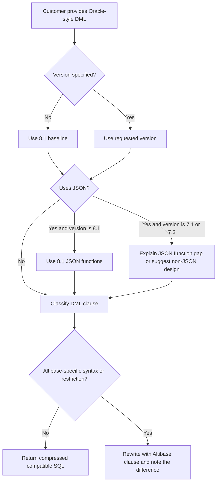

# 04. SQL DML and Oracle Compatibility

## Applicable Versions

- 7.1: Based on Altibase 7.1 SQL Reference.
- 7.3: Based on Altibase 7.3 SQL Reference.
- 8.1: Based on Altibase 8.1 verified source SQL Reference, including verified 8.1 JSON function and `IS JSON` coverage.

## Questions This File Can Answer

- Can ordinary Oracle `SELECT`, `INSERT`, `UPDATE`, `DELETE`, or `MERGE` SQL run in Altibase?
- Which DML clauses need Altibase syntax instead of Oracle syntax?
- How should row limiting, joins, hierarchical queries, hints, DML `RETURN`, and transaction clauses be generated?
- Which Oracle-style functions are available, and which Altibase function differences should be checked?
- How should 8.1 JSON functions such as `JSON_VALUE` and `JSON_QUERY` be used?

## Source Documents

- 7.1: Altibase 7.1 SQL Reference; General Reference 1 for `REGEXP_MODE`.
- 7.3: Altibase 7.3 SQL Reference; General Reference 1 for `REGEXP_MODE`.
- 8.1: Altibase 8.1 verified source SQL Reference; General Reference 1 for `REGEXP_MODE`.

## Core Guidance

- Answer in the user's language, but keep SQL object names, function names, error codes, property names, commands, and file paths literal.
- Do not answer "Oracle SQL is fully compatible." Say that common DML is intentionally similar, then check Altibase-specific syntax, data types, functions, limits, and object privileges.
- Compress generic Oracle SQL into short guidance. Expand only clauses where Altibase behavior differs or where the SQL Reference lists restrictions.
- If no version is specified, use the 8.1 baseline and mention that JSON functions and `IS JSON` require 8.1.
- For DML on customer tables, confirm whether the target is a table, view, partition, queue table, memory table, disk table, LOB column, or JSON column when that affects syntax or restrictions.
- For DDL, data type definitions, properties, and migration tooling, use the companion attachments rather than repeating them here.

## Oracle Compatibility Classifier

Use this classifier before rewriting an Oracle query.

| Category | Guidance |
| --- | --- |
| Usually usable with small or no changes | Basic `SELECT`, `INSERT`, `UPDATE`, `DELETE`, ANSI joins, Oracle-style outer join `(+)`, subqueries, `GROUP BY`, `HAVING`, `ORDER BY`, `UNION`, `UNION ALL`, `INTERSECT`, `MINUS`, `DECODE`, `NVL`, `NVL2`, `COALESCE`, `NULLIF`, `CASE`, `TO_CHAR`, `TO_DATE`, `TO_NUMBER`, `SYSDATE`, sequence `NEXTVAL` and `CURRVAL`. |
| Check Altibase syntax | Row limiting (`TOP (n)` or `LIMIT`), DML `RETURN`, multi-table `DELETE`, `MERGE WHEN NO ROWS`, direct-path `INSERT /*+ APPEND */`, `LOCK TABLE`, `FOR UPDATE WAIT/NOWAIT`, `LATERAL`, `APPLY`, `PIVOT`, `UNPIVOT`, queue `ENQUEUE` and `DEQUEUE`. |
| Check semantic differences | `NVL` type compatibility, implicit type conversion, date format masks, regular expression support, LOB restrictions, partition row movement, recursive `WITH`, hierarchical query restrictions, ORDER BY placement, set operator ordering, hints, and NULL sort order. |
| Do not assume Oracle feature parity | Oracle-specific packages, unsupported Oracle hints, Oracle `ROWID` assumptions, PL/SQL-only constructs in plain SQL, and Oracle JSON syntax on 7.1 or 7.3. |

## DML Decision Flow



## Compact DML Syntax Patterns

These patterns are generation guides, not full grammar.

Syntax notation used in this attachment:

- `[ ... ]` means optional syntax.
- `{ A | B }` means choose exactly one alternative.
- `item [, item ...]` means one or more comma-separated items.
- `...` after a clause means the clause may repeat.
- Lowercase names such as `table_name`, `expr`, and `subquery` are placeholders to replace with customer objects or expressions.

### SELECT Pattern

```text
select ::=
  [WITH query_name [(column_alias, ...)] AS (subquery) [, ...]]
  SELECT [hint] [ALL | DISTINCT] [TOP (integer_expr)] select_list
  [FROM table_reference [, table_reference ...]]
  [WHERE condition]
  [START WITH condition CONNECT BY [NOCYCLE] condition [IGNORE LOOP]]
  [GROUP BY grouping_expr [, ...] [ROLLUP | CUBE | GROUPING SETS]]
  [HAVING condition]
  [{UNION | UNION ALL | INTERSECT | MINUS} subquery ...]
  [{ORDER BY | ORDER SIBLINGS BY} expr_or_position [ASC | DESC] [NULLS FIRST | NULLS LAST] [, ...]]
  [LIMIT [row_offset,] row_count]
  [FOR UPDATE [{WAIT integer [SEC | MSEC | USEC] | NOWAIT}]]
```

Generation notes:

- `FROM` can be omitted when the select list contains only constants or expressions.
- `DUAL` is available and is used in examples for sequence and scalar-expression queries.
- A `FROM` clause can reference at most 32 tables or views. Aliases in the same `FROM` clause must be unique.
- `ORDER BY` cannot be used in a subquery. With set operators, `ORDER BY` can use only output positions or aliases.
- `LIMIT` can be used in top-level queries and subqueries. Use `TOP (n)` only when a leading row-count expression fits the request.
- `FOR UPDATE` is only for the main query. It cannot be combined with `DISTINCT`, `GROUP BY`, aggregate functions, or set operators.

### SELECT Subclause Syntax

```text
table_reference ::=
  single_table
| joined_table
| TABLE (function_name([expr [, expr ...]]))

single_table ::=
  LATERAL (subquery)
| [owner.]table_name [PARTITION (partition_name)] [pivot_clause | unpivot_clause] [[AS] alias_name]

joined_table ::=
  table_reference [join_type] JOIN table_reference ON condition
| table_reference [apply_type] APPLY single_table

join_type ::=
  INNER | LEFT [OUTER] | RIGHT [OUTER] | FULL [OUTER]

apply_type ::=
  CROSS | OUTER

pivot_clause ::=
  PIVOT (aggregate_function(expr) [[AS] alias] [, aggregate_function(expr) [[AS] alias] ...]
         pivot_for_clause pivot_in_clause)

pivot_for_clause ::=
  FOR {column_name | (column_name [, column_name ...])}

pivot_in_clause ::=
  IN ({expr | (expr [, expr ...])} [[AS] alias] [, {expr | (expr [, expr ...])} [[AS] alias] ...])

unpivot_clause ::=
  UNPIVOT [{INCLUDE | EXCLUDE} NULLS]
  ({column_name | (column_name [, column_name ...])}
   pivot_for_clause unpivot_in_clause)

unpivot_in_clause ::=
  IN ({column_name | (column_name [, column_name ...])}
      [[AS] {alias_name | (alias_name [, alias_name ...])}]
      [, {column_name | (column_name [, column_name ...])}
         [[AS] {alias_name | (alias_name [, alias_name ...])}] ...])

hierarchical_query_clause ::=
  CONNECT BY [NOCYCLE] condition [IGNORE LOOP] [START WITH condition]
| START WITH condition CONNECT BY [NOCYCLE] condition [IGNORE LOOP]

group_by_clause ::=
  GROUP BY {expr | ROLLUP grouping_expression_list | CUBE grouping_expression_list | grouping_sets_clause}
           [, {expr | ROLLUP grouping_expression_list | CUBE grouping_expression_list | grouping_sets_clause} ...]
  [HAVING condition]

grouping_sets_clause ::=
  GROUPING SETS ({grouping_expression_list | ROLLUP grouping_expression_list | CUBE grouping_expression_list}
                 [, {grouping_expression_list | ROLLUP grouping_expression_list | CUBE grouping_expression_list} ...])
```

Generation notes:

- `LATERAL (subquery)` lets the subquery reference preceding `FROM` items.
- `APPLY` joins a table reference to a single-table expression. Use `CROSS APPLY` for inner-apply behavior and `OUTER APPLY` when unmatched left rows must be retained.
- `PIVOT` and `UNPIVOT` are not generic Oracle pass-through clauses. Preserve their Altibase syntax and test aliases, null handling, and expression lists.
- `ORDER SIBLINGS BY` is for hierarchical queries; do not use it as a replacement for top-level `ORDER BY`.

### INSERT Pattern

```text
insert ::=
  INSERT [hint] {single_table_insert | multi_table_insert} [wait_clause]

single_table_insert ::=
  INTO [owner.]table_or_view_name [PARTITION (partition_name)]
  [(column_name [, ...])]
  {VALUES (expr [, ...]) [, (expr [, ...]) ...]
   | DEFAULT VALUES
   | subquery}
  [{RETURN | RETURNING} expr [, ...] INTO variable [, ...]]

multi_table_insert ::=
  ALL
    INTO table_name [(column_name, ...)] VALUES (expr, ...)
    [INTO table_name [(column_name, ...)] VALUES (expr, ...)] ...
  subquery

wait_clause ::=
  {WAIT integer [SEC | MSEC | USEC] | NOWAIT}
```

Generation notes:

- Column count and value count must match, and corresponding data types must be compatible.
- If omitted columns have no default, Altibase inserts `NULL`; for a `TIMESTAMP` column, the default system time is inserted.
- `DEFAULT` inserts the column default. `DEFAULT VALUES` inserts defaults for all columns.
- `INSERT ... SELECT` requires the inserted column count to match the selected column count.
- `INSERT /*+ APPEND */ INTO target SELECT ...` requests direct-path insert. The target must be a disk table and cannot have LOB columns, indexes, triggers, referential constraints, replication target status, or `CHECK` constraints.
- If an expression in a multi-table insert source query must be referenced in a `VALUES` clause, give it an alias in the source `SELECT`.

### UPDATE Pattern

```text
update ::=
  UPDATE [hint] {[owner.]table_or_view_name | view_name | (subquery)}
         [PARTITION (partition_name)] [[AS] table_alias]
  SET column_name = {expr | DEFAULT | subquery}
      [, (column_name [, ...]) = (subquery)] ...
  [WHERE condition]
  [LIMIT [row_offset,] row_count]
  [{RETURN | RETURNING} expr [, ...] INTO variable [, ...]]
```

Generation notes:

- A column cannot appear more than once in the same `SET` clause.
- A subquery in `SET` must return one row for each updated row. If it returns no row, Altibase updates the target column to `NULL`.
- Updating a partition key so the row moves to another partition requires `ENABLE ROW MOVEMENT`.
- Updating a `TIMESTAMP` column with no explicit value, or with `DEFAULT`, stores the system time.
- `UPDATE` can fail on `NOT NULL` or `CHECK` constraints.

### DELETE Pattern

```text
delete ::=
  DELETE [hint] FROM [owner.]table_or_view_name [PARTITION (partition_name)]
  [WHERE condition]
  [LIMIT [row_offset,] row_count]
  [{RETURN | RETURNING} expr [, ...] INTO variable [, ...]]

multiple_delete ::=
  DELETE table_alias [, table_alias ...]
  FROM table_reference [, table_reference ...]
  WHERE join_condition [AND condition ...]
```

Generation notes:

- Omitting `WHERE` deletes all rows from the target. Use `TRUNCATE TABLE` only when DDL semantics and non-rollback behavior are acceptable.
- Multiple-table `DELETE` can delete rows from aliases listed after `DELETE`. It cannot use `LIMIT`, cannot use `RETURN`, cannot use dictionary tables, and cannot use full outer join.
- `DELETE FROM table PARTITION (partition_name)` deletes only rows in the named partition.

### MOVE Pattern

```text
move ::=
  MOVE [hint] INTO [owner.]target_table [PARTITION (partition_name)]
       [(column_name [, column_name ...])]
  FROM [owner.]source_table [(expr [, expr ...])]
  [WHERE condition]
  [LIMIT [row_offset,] row_count]
```

Generation notes:

- `MOVE` inserts selected source rows into the target table and deletes the moved rows from the source table as one statement.
- Required privileges are `INSERT` on the target table and `DELETE` on the source table.
- Column and expression counts must match. Use explicit target columns when source and target definitions differ.
- Use `WHERE` and `LIMIT` to bound the move. Omit them only when moving all rows is intentional.

### MERGE Pattern

```text
merge ::=
  MERGE [hint] INTO [owner.]target_table [target_alias]
  USING {[owner.]source_table | [owner.]source_view | subquery} [source_alias]
  ON (match_condition)
  [WHEN MATCHED THEN UPDATE SET column = expr [, ...] [LIMIT [row_offset,] row_count]]
  [WHEN NOT MATCHED THEN INSERT [(column [, ...])] VALUES (expr [, ...]) [WHERE condition]]
  [WHEN NO ROWS THEN INSERT [(column [, ...])] VALUES (expr [, ...])]
```

Generation notes:

- `INTO` must name a table, not a view.
- The user needs `INSERT` and `UPDATE` on the target table and `SELECT` on the source.
- A column referenced in the `ON` condition cannot be updated by the `WHEN MATCHED` update clause.
- Each of `WHEN MATCHED`, `WHEN NOT MATCHED`, and `WHEN NO ROWS` can appear once and can be ordered flexibly.
- `WHEN NO ROWS` is an Altibase extension for inserting when the source has no row.

### LOCK and Transaction Pattern

```text
lock_table ::=
  LOCK TABLE [owner.]table_name [PARTITION (partition_name)]
  IN {ROW SHARE | SHARE UPDATE | ROW EXCLUSIVE | SHARE ROW EXCLUSIVE | SHARE | EXCLUSIVE} MODE
  [{WAIT integer | NOWAIT}]

transaction_control ::=
  COMMIT [WORK] [FORCE global_tx_id]
  ROLLBACK [WORK] [TO SAVEPOINT savepoint_name] [FORCE global_tx_id]
  SAVEPOINT savepoint_name
  SET TRANSACTION {READ ONLY | READ WRITE | ISOLATION LEVEL {READ COMMITTED | REPEATABLE READ | SERIALIZABLE}}
```

Generation notes:

- `COMMIT`, `ROLLBACK`, `SAVEPOINT`, and `SET TRANSACTION` are for non-autocommit work. `COMMIT` and `ROLLBACK` cannot be executed in `AUTOCOMMIT` mode.
- `READ COMMITTED` is the default Altibase transaction isolation level.
- `SET TRANSACTION` cannot be used in `AUTOCOMMIT` mode and cannot be used after a transaction is already active.

## DML Privilege Blocks

### SELECT Privilege

- Required for table reads.
- Allowed for `SYS`, the table owner, users with `SELECT ANY TABLE`, and users with `SELECT` object privilege.
- Updatable view or join-view access also depends on base-table privileges.

### INSERT Privilege

- Required for inserting into a table or updatable view.
- Allowed for `SYS`, the table owner, users with `INSERT ANY TABLE`, and users with `INSERT` object privilege.
- Multi-table `INSERT` still requires privilege on every target table.

### UPDATE Privilege

- Required for updating a table or updatable view.
- Allowed for `SYS`, the table owner, users with `UPDATE ANY TABLE`, and users with `UPDATE` object privilege.
- `MERGE` update branches require `UPDATE` on the target table.

### DELETE Privilege

- Required for deleting from a table or updatable view.
- Allowed for `SYS`, the table owner, users with `DELETE ANY TABLE`, and users with `DELETE` object privilege.
- `MOVE` requires `DELETE` privilege on the source table and `INSERT` privilege on the target table.

## SELECT Differences and Checks

### SELECT Item: Row Limiting

- Oracle prompts using `ROWNUM` can often be kept because Altibase supports `ROWNUM`.
- Prefer Altibase `LIMIT row_count` or `LIMIT offset, row_count` when generating new SQL.
- `TOP (n)` appears after `SELECT` and before the select list.

Example:

```sql
SELECT e_firstname, e_lastname
FROM employees
ORDER BY eno
LIMIT 10;
```

### SELECT Item: Joins

- Altibase supports cross join, inner join, left outer join, right outer join, full outer join, semi join, and anti join patterns.
- ANSI outer join syntax is supported.
- Oracle-style outer join marker `(+)` is also shown in the SQL Reference examples.
- LOB columns cannot be used as join conditions.

Example:

```sql
SELECT d.dno, e.e_lastname
FROM departments d LEFT OUTER JOIN employees e ON d.dno = e.dno;

SELECT d.dno, e.e_lastname
FROM departments d, employees e
WHERE d.dno = e.dno(+);
```

### SELECT Item: LATERAL and APPLY

- `LATERAL` allows an inline view to reference tables on its left side.
- `CROSS APPLY` behaves like an inner join between the left object and a lateral view.
- `OUTER APPLY` behaves like a left outer join between the left object and a lateral view.
- Restrictions: a lateral view cannot reference fixed tables, cannot contain `PIVOT` or `UNPIVOT`, cannot reference an object on its right side, cannot combine with right/full outer join for the referenced object, and cannot use both `LATERAL` and `APPLY` together.

Example:

```sql
SELECT d.dname, lv.sum_salary, lv.avg_salary
FROM departments d,
     LATERAL (
       SELECT SUM(salary) sum_salary, AVG(salary) avg_salary
       FROM employees e
       WHERE e.dno = d.dno
     ) lv;
```

### SELECT Item: Hierarchical Query

- Altibase supports Oracle-style hierarchical query clauses: `START WITH`, `CONNECT BY`, `PRIOR`, `LEVEL`, `CONNECT_BY_ROOT`, `CONNECT_BY_ISLEAF`, and `ORDER SIBLINGS BY`.
- `START WITH` identifies root rows. If omitted, Altibase treats every row as a root row.
- `CONNECT BY` defines parent-child relationships. It cannot include subqueries and cannot be used with a join.
- `ROWNUM` cannot be used in `START WITH`.
- `IGNORE LOOP` removes loop-forming rows from the result instead of raising an error.

Example:

```sql
SELECT id, parent, LEVEL
FROM hier_order
START WITH id = 0
CONNECT BY PRIOR id = parent
ORDER SIBLINGS BY id;
```

### SELECT Item: Recursive WITH

- Only one `WITH` clause can be specified for each SQL statement.
- Recursive `WITH` requires column aliases after the query name.
- In the recursive member, aggregate functions, `DISTINCT`, and `GROUP BY` cannot be used.
- A recursive query can output up to the value of `RECURSION_LEVEL_MAXIMUM`; the default value is `1000`.

Example:

```sql
WITH q1 (id, parent, lvl) AS
(
  SELECT id, parent, 1
  FROM hier_order
  WHERE id = 0
  UNION ALL
  SELECT h.id, h.parent, q1.lvl + 1
  FROM hier_order h, q1
  WHERE h.parent = q1.id
)
SELECT *
FROM q1
LIMIT 100;
```

### SELECT Item: Grouping Extensions

- `ROLLUP`, `CUBE`, and `GROUPING SETS` are supported.
- Only one of these extensions can be specified in a `GROUP BY` clause.
- They cannot be used with window functions.
- `CUBE` supports a maximum of 15 expressions.
- `GROUPING SETS` and nested aggregate functions cannot be used together.

### SELECT Item: PIVOT and UNPIVOT

- `PIVOT` performs aggregation and rotates row values into columns.
- `UNPIVOT` rotates columns into rows.
- `UNPIVOT` supports `INCLUDE NULLS` and `EXCLUDE NULLS`; omission defaults to `EXCLUDE NULLS`.
- The number of columns in `PIVOT FOR` or `UNPIVOT IN` must match the number of aliases where aliases are specified.

Example:

```sql
SELECT *
FROM (
  SELECT d.dname, e.sex
  FROM departments d, employees e
  WHERE d.dno = e.dno
)
PIVOT (COUNT(*) FOR sex IN ('M', 'F'))
ORDER BY dname;
```

### SELECT Item: Set Operators

- Supported set operators are `UNION`, `UNION ALL`, `INTERSECT`, and `MINUS`.
- Both query operands must return the same number of columns and compatible data types.
- Output column names come from the first query's select list.
- With set operators, `ORDER BY` can use only output positions or aliases.

## DML RETURN Clause

Altibase documentation describes a returning clause. Examples commonly use `RETURN`, and the SQL Reference syntax diagram also accepts `RETURNING`.

```text
return_clause ::= {RETURN | RETURNING} expr [, ...] INTO variable [, ...]
```

Use this clause when DML must return affected-row values to host variables or PSM variables.

Restrictions:

- Supported with `INSERT`, `UPDATE`, and `DELETE` on tables.
- Aggregate functions are not allowed in returned expressions.
- LOB types cannot be returned with this clause.
- Aliases, subqueries, and sequences are not allowed in returned expressions.
- The number of variables must match the number of returned expressions unless a record type variable is used.
- In iSQL, prefix host variables with `:`.
- Multiple rows can be returned as collection variables with `BULK COLLECT` inside PSM.

Example:

```sql
VAR v_eno OUTPUT INTEGER;
VAR v_ename OUTPUT VARCHAR(30);

PREPARE UPDATE employees
SET ename = 'rachel'
WHERE eno = 3
RETURN eno, ename INTO :v_eno, :v_ename;
```

## INSERT Differences and Checks

### INSERT Item: Multi-Row VALUES

Altibase supports multiple row value lists in one statement.

```sql
INSERT INTO goods VALUES
  ('Y111100001', 'YY-300', 'AC0001', 1000, 78000),
  ('Y111100002', 'YY-310', 'DD0001', 100, 98000);
```

### INSERT Item: Insert From Query

```sql
INSERT INTO delayed_processing (cno, order_date)
SELECT cno, order_date
FROM orders
WHERE processing = 'D';
```

### INSERT Item: Multi-Table INSERT

```sql
INSERT ALL
INTO sal_history VALUES (emp_id, join_date, salary)
INTO dno_history VALUES (emp_id, dept_id, SYSDATE)
SELECT eno emp_id, join_date, salary, dno dept_id
FROM employees;
```

### INSERT Item: Partition Target

```sql
INSERT INTO t1 PARTITION (p1) VALUES (123, 456);
```

If values do not satisfy the partition condition, the insert fails.

## UPDATE Differences and Checks

### UPDATE Item: SET Subquery

```sql
UPDATE bonuses
SET (bonus, commission) =
    (SELECT 1.1 * AVG(bonus), 1.5 * AVG(commission) FROM bonuses)
WHERE eno IN (SELECT eno FROM orders WHERE qty >= 10000);
```

If a subquery in `WHERE` returns no rows, no rows are affected. If a subquery in `SET` returns no rows, Altibase updates the target column to `NULL`.

### UPDATE Item: DEFAULT

```sql
UPDATE employees
SET salary = DEFAULT
WHERE emp_job = 'manager';
```

For `TIMESTAMP`, `DEFAULT` means the system time.

### UPDATE Item: Partitioned Table

```sql
UPDATE t1 PARTITION (p1)
SET i1 = 200;
```

If the update changes a partition key so the row belongs in another partition, row movement must be enabled.

## DELETE Differences and Checks

### DELETE Item: All Rows

```sql
DELETE FROM orders;
```

This deletes rows but does not return empty pages to the database as `TRUNCATE TABLE` does. `TRUNCATE TABLE` is DDL and cannot be rolled back after successful execution.

### DELETE Item: Partition

```sql
DELETE FROM t1 PARTITION (p2);
```

### DELETE Item: Multi-Table DELETE

```sql
DELETE e, d
FROM employees e, departments d
WHERE e.dno = d.dno
  AND d.dname = 'MARKETING DEPT';
```

Use this only when the request really needs rows deleted from more than one target alias.

## MERGE Differences and Checks

### MERGE Item: Basic Upsert

```sql
MERGE INTO test_merge old_t
USING (
  SELECT 1 empno, 'KANG' lastname FROM dual UNION ALL
  SELECT 7 empno, 'SON' lastname FROM dual UNION ALL
  SELECT 9 empno, 'CHEON' lastname FROM dual
) new_t
ON old_t.empno = new_t.empno
WHEN MATCHED THEN
  UPDATE SET old_t.lastname = new_t.lastname
WHEN NOT MATCHED THEN
  INSERT (old_t.empno, old_t.lastname)
  VALUES (new_t.empno, new_t.lastname);
```

### MERGE Item: WHEN NO ROWS

```sql
MERGE INTO test_merge old_t
USING test_merge2 new_t
ON new_t.empno = old_t.empno AND new_t.empno = 10
WHEN MATCHED THEN
  UPDATE SET lastname = 'MATCHED'
WHEN NOT MATCHED THEN
  INSERT VALUES (10, 'NOTMATCHED')
WHEN NO ROWS THEN
  INSERT VALUES (10, 'NO ROWS');
```

Use `WHEN NO ROWS` only for Altibase-target SQL. It is not generic Oracle syntax.

## Hints

Altibase hints can be specified after `SELECT`, `UPDATE`, `DELETE`, and `INSERT` keywords. For `MERGE`, hints can be specified after `MERGE` and apply to the generated insert or update work.

Common hint categories:

- Access path: `FULL SCAN`, `INDEX`, `INDEX_ASC`, `INDEX_DESC`, `NO_INDEX`.
- Join order: `ORDERED`, `LEADING`.
- Join method: `USE_NL`, `USE_HASH`, `USE_SORT`, `USE_MERGE`, and semi/anti join variants such as `NL_SJ`, `HASH_AJ`.
- Optimizer and transformation: `RULE`, `COST`, `CNF`, `DNF`, `NO_MERGE`, `UNNEST`, `NO_UNNEST`.
- Result and plan behavior: `RESULT_CACHE`, `TOP_RESULT_CACHE`, `KEEP_PLAN`, `NO_PLAN_CACHE`, `PLAN_CACHE_KEEP`.
- Temporary work area: `TEMP_TBS_DISK`, `TEMP_TBS_MEMORY`.
- Direct path insert: `APPEND`.

Do not carry Oracle hints across blindly. Keep only hints listed in Altibase guidance or replace them with Altibase hint names.

## SQL Conditions

### Condition Item: Logical Operators

Supported logical operators are `AND`, `OR`, and `NOT`. Altibase condition precedence is comparison operators, then `NOT`, then `AND`, then `OR`. Use parentheses when preserving Oracle behavior matters.

### Condition Item: Comparison

Altibase supports simple comparisons and group comparisons. For multi-column comparison, only equality comparison is valid, and the number of expressions on both sides must match.

Supported group comparison keywords:

- `ANY`
- `SOME`
- `ALL`

### Condition Item: Other Conditions

Supported conditions include:

- `BETWEEN`
- `EXISTS`
- `IN`
- `INLIST`
- `IS NULL`
- `LIKE`
- `REGEXP_LIKE`
- `UNIQUE`
- `IS JSON` in 8.1

### Condition Syntax Diagram Conversions

```text
logical_condition ::=
  condition AND condition
| condition OR condition
| NOT condition
| (condition)

simple_comparison_condition ::=
  {expr | (subquery)}
  {= | != | <> | > | < | >= | <=}
  {expr | (subquery)}
| ({expr [, expr ...]} | (subquery))
  {= | != | <>}
  ({expr [, expr ...]} | (subquery))

group_comparison_condition ::=
  expr {= | != | <> | > | < | >= | <=} {ANY | SOME | ALL}
  ({expr [, expr ...]} | (subquery))
| (expr [, expr ...]) {= | != | <>} {ANY | SOME | ALL}
  ((expr [, expr ...]) [, (expr [, expr ...]) ...] | (subquery))

between_condition ::=
  expr [NOT] BETWEEN expr AND expr

exists_condition ::=
  EXISTS (subquery)

in_condition ::=
  expr [NOT] IN ({expr [, expr ...]} | (subquery))
| (expr [, expr ...]) [NOT] IN
  ((expr [, expr ...]) [, (expr [, expr ...]) ...] | (subquery))

inlist_condition ::=
  [NOT] INLIST(expr, 'comma_separated_values')

is_null_condition ::=
  expr IS [NOT] NULL

like_condition ::=
  expr [NOT] LIKE expr [ESCAPE 'escape_character']

regexp_like_condition ::=
  [NOT] REGEXP_LIKE(source_expr, pattern_expr)

unique_condition ::=
  UNIQUE (subquery)
```

Generation notes:

- For row-value comparison, Altibase supports only equality and inequality operators; do not generate row-value `>`, `<`, `>=`, or `<=`.
- `ANY` and `SOME` are equivalent.
- `NOT IN` and `!= ALL` can behave unexpectedly when the right side contains `NULL`; prefer `NOT EXISTS` when null-safe anti-join behavior is required.
- `INLIST` is Altibase-specific and takes a single ASCII comma-separated string, not a normal SQL list.
- `ESCAPE` in `LIKE` takes a single-character string used to escape literal `%` and `_`.

### Condition Item: INLIST

`INLIST (expr, 'comma,separated,values')` is Altibase-specific. Each comma-separated value must be an ASCII-only string; values are converted to the type of `expr` for comparison.

```sql
SELECT dno, e_firstname, e_lastname
FROM employees
WHERE INLIST(dno, '1003,4001');
```

### Condition Item: LIKE and REGEXP_LIKE

- `LIKE` uses `%` for any string and `_` for a single character. Use `ESCAPE` to search literal `%` or `_`.
- `LIKE` pattern strings can be up to 4000 bytes.
- `REGEXP_LIKE` performs regular expression matching. Pattern expressions are commonly strings up to 1024 bytes.
- Default `REGEXP_MODE=0` uses Altibase regular expression mode with partial POSIX BRE/ERE support. In this mode, multibyte characters, backreferences, lookaheads, lookbehinds, and conditional regular expressions are not supported.
- `REGEXP_MODE=1` selects PCRE2-compatible mode. For Altibase 7.1, PCRE2-compatible mode requires 7.1.0.7.7 or later; for earlier or unknown 7.1 patch levels, keep default `REGEXP_MODE=0` syntax or verify the exact patch before using PCRE2-only regex. Use PCRE2-compatible mode only when the Altibase server character set is `US7ASCII` or `UTF-8`, and do not assume patterns are interchangeable with default Altibase regular expression syntax.
- To enable PCRE2-compatible mode for new system connections or the current session:

```sql
ALTER SYSTEM SET REGEXP_MODE=1;
ALTER SESSION SET REGEXP_MODE=1;
```

- For the property definition and permanent configuration path, see `05_data_types_properties.md` (`REGEXP_MODE`). For PCRE2 character-set and runtime errors, see `07_error_messages_troubleshooting.md`.

## SQL Function Compatibility

### Function Syntax Diagram Conversions

```text
ordered_set_distribution ::=
  {CUME_DIST | PERCENT_RANK | RANK} (expr [, expr ...])
  WITHIN GROUP (window_order_clause)

first_last_keep ::=
  aggregate_function KEEP
  (DENSE_RANK {FIRST | LAST}
   ORDER BY expr [ASC | DESC] [NULLS FIRST | NULLS LAST] [, ...])
  [OVER (PARTITION BY expr [, expr ...])]

stats_one_way_anova ::=
  STATS_ONE_WAY_ANOVA(
    expr1,
    expr2
    [, {'SIG' | 'F_RATIO' | 'MEAN_SQUARES_WITHIN' | 'MEAN_SQUARES_BETWEEN' |
        'DF_WITHIN' | 'DF_BETWEEN' | 'SUM_SQUARES_WITHIN' | 'SUM_SQUARES_BETWEEN'}]
  )

window_function_call ::=
  window_function([arg_expr [, arg_expr ...]]) [IGNORE NULLS]
  OVER (window_specification)

window_specification ::=
  [PARTITION BY expr [, expr ...]]
  [ORDER BY expr [ASC | DESC] [NULLS FIRST | NULLS LAST] [, ...]]
  [window_frame_clause]

window_frame_clause ::=
  {ROWS | RANGE}
  { BETWEEN frame_bound AND frame_bound
  | UNBOUNDED PRECEDING
  | CURRENT ROW
  | value PRECEDING }

frame_bound ::=
  UNBOUNDED PRECEDING
| UNBOUNDED FOLLOWING
| CURRENT ROW
| value PRECEDING
| value FOLLOWING

listagg ::=
  LISTAGG(expr [, 'separator'])
  WITHIN GROUP (order_by_clause)
  [OVER (PARTITION BY expr [, expr ...])]

percentile_cont_disc ::=
  {PERCENTILE_CONT | PERCENTILE_DISC}(percentile_expr)
  WITHIN GROUP (ORDER BY expr [ASC | DESC])
  [OVER (PARTITION BY expr [, expr ...])]

ntile ::=
  NTILE(expr)
  OVER ([PARTITION BY expr [, expr ...]] order_by_clause)

ratio_to_report ::=
  RATIO_TO_REPORT(expr)
  OVER ([PARTITION BY expr [, expr ...]])

case_expr ::=
  CASE {simple_case_expr | searched_case_expr} [ELSE else_expr] END

simple_case_expr ::=
  expr WHEN comparison_expr THEN return_expr
       [WHEN comparison_expr THEN return_expr ...]

searched_case_expr ::=
  WHEN condition THEN return_expr
  [WHEN condition THEN return_expr ...]
```

Generation notes:

- Analytic functions can appear in a `SELECT` list or `ORDER BY` clause. Do not generate them directly in `WHERE`.
- Ranking functions require `ORDER BY` in the `OVER` clause. Aggregate window functions may omit `ORDER BY`.
- If `ROWS` or `RANGE` is omitted for a window function that supports frames, the SQL Reference default is `RANGE BETWEEN UNBOUNDED PRECEDING AND CURRENT ROW`.
- `PERCENTILE_CONT`, `PERCENTILE_DISC`, `LISTAGG`, and ordered-set distribution functions use `WITHIN GROUP`; add `OVER (...)` only when generating analytic form.
- In `CASE`, all `return_expr` branches should be type-compatible.

### Function Item: Oracle-Familiar Functions

These functions are commonly useful when converting Oracle DML:

- NULL and conditional: `NVL`, `NVL2`, `NULLIF`, `COALESCE`, `DECODE`, `CASE WHEN`, `LNNVL`, `GREATEST`, `LEAST`.
- Character: `CHR`, `CONCAT`, `INITCAP`, `LOWER`, `LPAD`, `LTRIM`, `NCHR`, `REGEXP_COUNT`, `REGEXP_INSTR`, `REGEXP_REPLACE`, `REGEXP_SUBSTR`, `REPLACE2`, `RPAD`, `RTRIM`, `SUBSTR`, `SUBSTRB`, `SUBSTRING`, `TRANSLATE`, `TRIM`, `UPPER`.
- Numeric: `ABS`, `ACOS`, `ASIN`, `ATAN`, `ATAN2`, `CEIL`, `COS`, `EXP`, `FLOOR`, `LN`, `LOG`, `MOD`, `POWER`, `ROUND`, `SIGN`, `SIN`, `SQRT`, `TAN`, `TRUNC`.
- Datetime: `ADD_MONTHS`, `LAST_DAY`, `MONTHS_BETWEEN`, `NEXT_DAY`, `SYSDATE`, `SYSTIMESTAMP`, `CURRENT_DATE`, `CURRENT_TIMESTAMP`, `EXTRACT`.
- Conversion: `TO_CHAR`, `TO_DATE`, `TO_NUMBER`, `TO_NCHAR`, `TO_RAW`, `TO_INTERVAL`, `ASCIISTR`, `UNISTR`.
- Aggregate and analytic: `AVG`, `COUNT`, `MAX`, `MIN`, `SUM`, `STDDEV`, `VARIANCE`, `LISTAGG`, `RANK`, `DENSE_RANK`, `ROW_NUMBER`, `LAG`, `LEAD`, `NTILE`, `FIRST_VALUE`, `LAST_VALUE`, `NTH_VALUE`, `RATIO_TO_REPORT`.
- Hierarchical query: `SYS_CONNECT_BY_PATH`, `LEVEL`, `CONNECT_BY_ROOT`, `CONNECT_BY_ISLEAF`.

### Function Item: Important Differences

- `NVL (expr1, expr2)` supports `DATE`, `CHAR`, and `NUMBER`; `expr2` must be the same data type as `expr1`.
- `DECODE` compares `expr` to each comparison expression in order and returns the first matching return expression; if no match and no default exist, it returns `NULL`. The SQL Reference example shows `DECODE(i, NULL, 'NULL', ...)`.
- `ROWNUM` returns a pseudo row number as `BIGINT`. Row numbers are assigned in table or view appearance order, and can be reordered by `ORDER BY`, `GROUP BY`, or `HAVING`.
- `NEXTVAL` must be accessed before `CURRVAL` can be read for a newly created sequence.
- `CURRVAL` and `NEXTVAL` cannot be used in the `SELECT` statement that defines a view.
- Altibase attempts implicit conversion for many function arguments, but conversion edge cases should be checked rather than assuming Oracle behavior.

### Function Item: Altibase-Specific or Non-Oracle-Exact Functions

Use these only when targeting Altibase or when replacing Oracle-specific logic:

- String aggregation and text helpers: `GROUP_CONCAT`, `DIGITS`, `RANDOM_STRING`, `REPLICATE`, `REVERSE_STR`, `STUFF`, `SIZEOF`.
- Date/time alternatives: `DATEADD`, `DATEDIFF`, `DATENAME`, `DATEPART`, `SESSION_TIMEZONE`, `DB_TIMEZONE`, `CONV_TIMEZONE`, `UNIX_DATE`, `UNIX_TIMESTAMP`, `DATE_TO_UNIX`, `UNIX_TO_DATE`.
- Bit and numeric helpers: `NUMAND`, `NUMOR`, `NUMXOR`, `NUMSHIFT`, `BITAND`, `BITOR`, `BITXOR`, `BITNOT`, `ISNUMERIC`.
- System and session helpers: `USER_ID`, `USER_NAME`, `SESSION_ID`, `SYS_CONTEXT`, `SYS_GUID_STR`, `HOST_NAME`.
- Queue/message helpers: `MSG_CREATE_QUEUE`, `MSG_DROP_QUEUE`, `MSG_SND_QUEUE`, `MSG_RCV_QUEUE`, `SENDMSG`.
- Raw and encoding helpers: `RAW_CONCAT`, `RAW_SIZEOF`, `SUBRAW`, `BASE64_ENCODE`, `BASE64_DECODE`, `QUOTE_PRINTABLE_ENCODE`, `QUOTE_PRINTABLE_DECODE`.

## 8.1 JSON Functions

JSON functions are 8.1 baseline features. Do not use them for 7.1 or 7.3 unless the customer confirms an equivalent custom implementation.

### JSON Item: Function Groups

- JSON generation: `JSON_ARRAY`, `JSON_OBJECT`.
- JSON search: `JSON_EXISTS`, `JSON_QUERY`, `JSON_VALUE`.
- JSON validation: `JSON_VALID`.
- JSON condition: `IS JSON`, `IS NOT JSON`.

### JSON Item: Native JSON Column DML Cautions

- Native `JSON` columns are 8.1 baseline features. For 7.1 or 7.3, do not generate native `JSON` column DML unless the customer provides version-specific confirmation.
- JSON processing uses Temporary LOB internally, so check `TEMPORARY_LOB_ENABLE` when a JSON workload fails or when memory use is being reviewed.
- Treat JSON columns as LOB-like for DML and object restrictions; check the data type guidance before assuming they can be used like ordinary scalar columns.
- Do not generate `SELECT FOR UPDATE` against `JSON` columns.
- JSON path operands for `JSON_EXISTS`, `JSON_QUERY`, and `JSON_VALUE` must be string-form path expressions. Use literal path strings in generated examples, and do not use bind variables, `NULL`, table columns, SQL functions, or user-defined functions as the path operand unless a later exact target source confirms support.
- For full JSON type, path-expression, storage, and property details, use `05_data_types_properties.md`.

### JSON Item: JSON_ARRAY

Purpose: create a JSON array from JSON values, SQL scalars, `BOOLEAN`, or `NULL`.

```text
JSON_ARRAY(value [, value ...]
  [{NULL ON NULL | ABSENT ON NULL}]
  [RETURNING {CHAR[(n)] | VARCHAR[(n)] | JSON | CLOB}])
```

Defaults:

- `ABSENT ON NULL` if the null clause is omitted.
- Return type is `VARCHAR` with precision automatically calculated from input size if `RETURNING` is omitted.
- If `CHAR` or `VARCHAR` is specified without precision, precision defaults to `1`.

Example:

```sql
SELECT JSON_ARRAY(1, 'altibase', JSON_ARRAY(1, 2, 3), NULL NULL ON NULL RETURNING JSON) jarray
FROM dual;
```

### JSON Item: JSON_OBJECT

Purpose: create a JSON object from key-value pairs. Keys must be character values and cannot be `NULL`.

```text
JSON_OBJECT(key, value [, key, value ...]
  [{NULL ON NULL | ABSENT ON NULL}]
  [RETURNING {CHAR[(n)] | VARCHAR[(n)] | JSON | CLOB}])
```

Defaults:

- `NULL ON NULL` if the null clause is omitted.
- Return type is `VARCHAR` with precision automatically calculated from input size if `RETURNING` is omitted.
- If `CHAR` or `VARCHAR` is specified without precision, precision defaults to `1`.

Example:

```sql
SELECT JSON_OBJECT('ID', 'AA000001', 'NAME', 'HONG GILDONG', 'NATION', NULL ABSENT ON NULL) j_obj
FROM dual;
```

### JSON Item: JSON_EXISTS

Purpose: return whether a JSON path expression exists or matches in JSON data.

```text
JSON_EXISTS(json_data, json_path
  [{ERROR ON ERROR | FALSE ON ERROR | TRUE ON ERROR}]
  [{ERROR ON EMPTY | FALSE ON EMPTY | TRUE ON EMPTY}])
```

Defaults:

- `FALSE ON ERROR` if the error clause is omitted.
- `FALSE ON EMPTY` if the empty clause is omitted.

Example:

```sql
SELECT 1 AS result
FROM dual
WHERE JSON_EXISTS(
  '{"ID":"AA000001","NAME":"HONG GILDONG","NATION":"KOREA"}',
  '$.NATION?(@=="KOREA")'
);
```

### JSON Item: JSON_QUERY

Purpose: return a JSON value found by a JSON path expression.

```text
JSON_QUERY(json_data, json_path
  [RETURNING {CHAR[(n)] | VARCHAR[(n)] | JSON | CLOB}]
  [{WITH [UNCONDITIONAL] [ARRAY] WRAPPER
    | WITH CONDITIONAL [ARRAY] WRAPPER
    | WITHOUT [ARRAY] WRAPPER}]
  [{NULL ON ERROR | ERROR ON ERROR}]
  [{NULL ON EMPTY | ERROR ON EMPTY}])
```

Defaults:

- Return type is `VARCHAR` with precision automatically calculated from input size if `RETURNING` is omitted.
- `WITHOUT WRAPPER` if the wrapper clause is omitted.
- `NULL ON ERROR` if the error clause is omitted.
- `NULL ON EMPTY` if the empty clause is omitted.
- If the path returns two or more values, use `WITH WRAPPER`.

Example:

```sql
SELECT JSON_QUERY(
  '{"ID":"AA000001","NAME":"HONG GILDONG","ORDER_ID":[3123,2412,5286]}',
  '$.*' WITH WRAPPER ERROR ON ERROR
) AS jdata
FROM dual;
```

### JSON Item: JSON_VALUE

Purpose: return a scalar value found by a JSON path expression.

```text
JSON_VALUE(json_data, json_path
  [RETURNING {CHAR[(n)] | VARCHAR[(n)] | CLOB | SMALLINT | INT | BIGINT | FLOAT | DOUBLE | DECIMAL | NUMBER | NUMERIC}]
  [{NULL ON ERROR | ERROR ON ERROR | DEFAULT expr ON ERROR}]
  [{NULL ON EMPTY | ERROR ON EMPTY | DEFAULT expr ON EMPTY}])
```

Defaults:

- Return type is `VARCHAR` with precision automatically calculated from input size if `RETURNING` is omitted.
- `NULL ON ERROR` if the error clause is omitted.
- `NULL ON EMPTY` if the empty clause is omitted.
- A `DEFAULT expr` value must fit in the declared return type and precision.

Example:

```sql
SELECT JSON_VALUE(
  '{"ID":"AA000001","NAME":"HONG GILDONG","NATION":"KOREA"}',
  '$.NAME'
) AS name
FROM dual;
```

### JSON Item: JSON_VALID

Purpose: return `1` when input JSON text is valid JSON, otherwise `0`.

```sql
SELECT JSON_VALID('{"ID":"AA000001","NAME":"HONG GILDONG","NATION":"KOREA"}') AS valid
FROM dual;
```

### JSON Item: IS JSON

Purpose: test whether an expression is valid JSON.

```sql
SELECT 1 AS result
FROM dual
WHERE '{"ID":"AA000001","NAME":"HONG GILDONG","NATION":"KOREA"}' IS JSON;

SELECT 1 AS result
FROM dual
WHERE 'invalid_json' IS NOT JSON;
```

## Queue DML

### Queue Item: ENQUEUE

`ENQUEUE` inserts a message into a queue table and is similar to `INSERT`.

```sql
ENQUEUE INTO q1(message, corrid)
VALUES ('This is a message', 237);
```

### Queue Item: DEQUEUE

`DEQUEUE` retrieves a message that satisfies the condition and deletes it.

```sql
DEQUEUE message, corrid
FROM q1
WHERE corrid = 237;
```

Checks:

- Only one queue table can appear in the `FROM` clause of `DEQUEUE`.
- A subquery cannot be used in a `DEQUEUE` `WHERE` clause.
- `FIFO` retrieves the oldest matching message. `LIFO` retrieves the newest matching message.
- `WAIT integer` waits for a message when no matching message exists.

## Version Differences

| Version | Guidance |
| --- | --- |
| 7.1 | Treat ordinary DML, joins, set operators, hierarchical queries, DML `RETURN`, multi-table insert/delete, `MERGE`, `PIVOT`, `UNPIVOT`, `LATERAL`, and `APPLY` as available according to the 7.1 SQL Reference. Do not use 8.1 JSON functions. |
| 7.3 | Use the same core DML baseline as 7.1 and prefer 7.3 wording for generated SQL and restrictions. Do not use 8.1 JSON functions. |
| 8.1 | Use the 8.1 verified source baseline. JSON functions and `IS JSON` are available as verified 8.1 features. |

## Answer Templates

### Template: Can This Oracle SELECT Run?

Say:

```text
This query uses ordinary Oracle-style DML that Altibase generally supports: SELECT, joins, WHERE, GROUP BY, HAVING, ORDER BY, and set operators. I would still check row limiting, functions, date formats, LOB columns, and any hints before treating it as production Altibase SQL.
```

Then provide the Altibase SQL, changing only the clauses that need Altibase syntax.

### Template: Rewrite Oracle Row Limiting

```sql
SELECT column_list
FROM table_name
WHERE condition
ORDER BY sort_key
LIMIT 10;
```

### Template: Rewrite Oracle Upsert

```sql
MERGE INTO target_table t
USING source_table s
ON (t.key_col = s.key_col)
WHEN MATCHED THEN
  UPDATE SET t.value_col = s.value_col
WHEN NOT MATCHED THEN
  INSERT (key_col, value_col)
  VALUES (s.key_col, s.value_col);
```

### Template: Explain JSON Version Boundary

Say:

```text
`JSON_ARRAY`, `JSON_OBJECT`, `JSON_EXISTS`, `JSON_QUERY`, `JSON_VALUE`, `JSON_VALID`, and `IS JSON` are Altibase 8.1 features in the Altibase 8.1 verified source. For 7.1 or 7.3, do not generate these functions unless the customer has a custom compatibility layer.
```

## Residual Scope

- This attachment emphasizes Altibase-specific DML and Oracle-compatibility differences. It is not a complete Oracle SQL reference; for generic Oracle behavior, answer only after tying the behavior to an Altibase-supported construct or source-backed compatibility rule.
