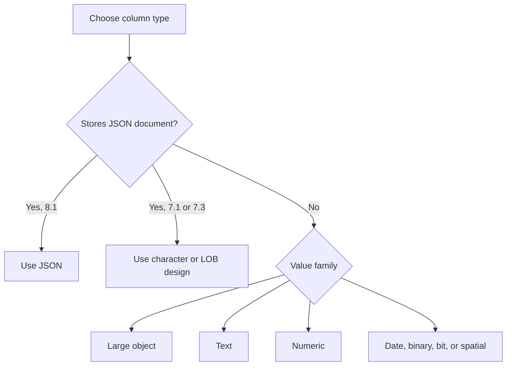
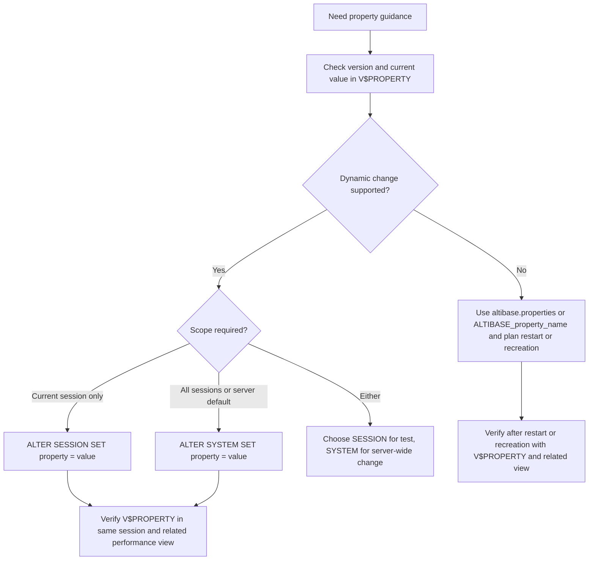

# 05. Data Types and Properties

## Applicable Versions

- 7.1: Based on Altibase 7.1 General Reference 1.
- 7.3: Based on Altibase 7.3 General Reference 1.
- 8.1: Based on Altibase 8.1 verified source General Reference 1 and Altibase 8.1 Release Notes.

## Questions This File Can Answer

- Which Altibase data type should be used for character, numeric, date/time, binary, LOB, spatial, or JSON data?
- What are the practical differences between Altibase data types and familiar Oracle data types?
- How do `FIXED`, `VARIABLE`, and `IN ROW` affect column storage?
- What are the 8.1 `JSON` data type and Temporary LOB features?
- Which LOB, JSON, Temporary LOB, PSM default-precision, VARRAY, and object-size properties should be checked?
- Where are Altibase server properties checked, and how are static and dynamic property changes applied?
- Which SQL should be used to inspect a property, change a dynamic property, and verify the related system view?
- What do properties such as `LOG_FILE_SIZE`, `TEMPORARY_LOB_ENABLE`, `MEMORY_TEMPLOB_MAX_ALLOC_SIZE`, and `REPLICATION_SSL_PORT_NO` mean?

## Source Documents

- 7.1: Altibase 7.1 General Reference 1.
- 7.3: Altibase 7.3 General Reference 1.
- 8.1: Altibase 8.1 verified source General Reference 1; Altibase 8.1 Release Notes.

## Core Guidance

- Answer in the user's language, but keep SQL object names, data type names, function names, error codes, property names, commands, and file paths literal.
- If the customer specifies a version, use that version's data types and property definitions. If no version is specified, use the 8.1 baseline and call out features that do not exist in 7.1 or 7.3.
- For data type questions, identify the data shape, maximum size, storage target, and whether Oracle compatibility matters.
- For property questions, answer with `Meaning`, `Default`, `Dynamic Change Support`, `Range`, and `Check SQL`.
- For property change questions, include pre-change SQL, the correct `ALTER SYSTEM` or `ALTER SESSION` form only when the property supports it, post-change SQL, and any restart or recreation requirement.
- Do not expose internal source labels. Refer to the 8.1 source family as `Altibase 8.1 verified source`.
- Do not keep large source tables as-is. Convert them into searchable data type or property item blocks.

## Version Differences

- 7.1 and 7.3: Core data types are character, numeric, `DATE`, binary, `BLOB`, `CLOB`, and `GEOMETRY`. Native `JSON` and Temporary LOB are not part of these baselines.
- 8.1: Adds native `JSON`, JSON path-expression support, JSON generation/search/validation functions, and Temporary LOB support.
- 8.1: Adds or documents new properties including `CHECKPOINT_SCALE_SINGLE_DW_BUFFER_SIZE`, `MEMORY_TEMPLOB_MAX_ALLOC_SIZE`, `MEMORY_TEMPLOB_PIECE_SIZE`, `REPLICATION_SSL_PORT_NO`, `TEMPORARY_LOB_ENABLE`, `TRCLOG_EXPLAIN_TYPE`, and `TRCLOG_JSON_PLAN_INDENT_DEPTH`.
- Cross-version property caution: `PSM_CASE_SENSITIVE_MODE` and `REGEXP_MODE` are documented in Altibase 7.x and 8.1 source documents. Do not label them as 8.1-only unless the customer asks about a target build where the installed documentation proves a narrower scope.
- 8.1: Release notes record changed defaults or ranges for `CHECKPOINT_INTERVAL_IN_LOG`, `FAST_START_LOGFILE_TARGET`, `LOG_CREATE_METHOD`, `LOG_FILE_SIZE`, `MEMORY_INDEX_BUILD_RUN_SIZE`, `MEMORY_INDEX_BUILD_VALUE_LENGTH_THRESHOLD`, and `OPTIMIZER_FEATURE_ENABLE`.
- 8.1: Release notes list `INSPECTION_LARGE_HEAP_THRESHOLD` as removed.

## Data Type Selection Flow



Selection details:

1. Use `JSON` for native JSON documents on 8.1 and enable Temporary LOB behavior when the JSON workflow requires it.
2. Use character or LOB design, not native `JSON`, for JSON-like data on 7.1 or 7.3.
3. Use `CLOB` or `BLOB` for large text or binary objects.
4. Use `CHAR`, `VARCHAR`, `NCHAR`, or `NVARCHAR` for ordinary text.
5. Use exact numeric types such as `NUMERIC`, `DECIMAL`, `NUMBER(p,s)`, `INTEGER`, `BIGINT`, or `SMALLINT` when exact scale matters.
6. Use approximate numeric types such as `FLOAT`, `DOUBLE`, `REAL`, or `NUMBER` without precision when approximate values are acceptable.
7. Use `DATE` for date/time values, `BYTE`, `VARBYTE`, `NIBBLE`, `BIT`, or `VARBIT` for binary or bit strings, and `GEOMETRY` for spatial values.

## Compact Data Type Syntax

These patterns are generation guides, not a replacement for the full SQL Reference grammar.

```text
character_type ::=
  CHAR[(size)] [FIXED | VARIABLE [IN ROW size]]
  | VARCHAR[(size)] [FIXED | VARIABLE [IN ROW size]]
  | NCHAR[(size)] [FIXED | VARIABLE [IN ROW size]]
  | NVARCHAR[(size)] [FIXED | VARIABLE [IN ROW size]]

numeric_type ::=
  BIGINT
  | INTEGER
  | SMALLINT
  | DOUBLE
  | REAL
  | FLOAT[(precision)]
  | NUMERIC[(precision[, scale])]
  | DECIMAL[(precision[, scale])]
  | NUMBER[(precision[, scale])]

date_type ::= DATE

binary_type ::=
  BYTE[(size)] [[FIXED |] VARIABLE (IN ROW size)]
  | VARBYTE[(size)] [[FIXED |] VARIABLE (IN ROW size)]
  | NIBBLE[(size)] [[FIXED |] VARIABLE (IN ROW size)]
  | BIT[(size)] [[FIXED |] VARIABLE (IN ROW size)]
  | VARBIT[(size)] [[FIXED |] VARIABLE (IN ROW size)]

lob_type ::=
  BLOB [IN ROW size]
  | CLOB [IN ROW size]

json_type_8_1 ::=
  JSON [IN ROW size]
```

## Storage Modifiers

### Modifier Item: `FIXED`

Purpose: keep the column data in the fixed area of a record when the table is in a memory tablespace.

Use when: the column is short and predictable, or when avoiding variable-area lookup is more important than saving memory.

Notes:

- For disk tables, user-specified `FIXED` or `VARIABLE` is ignored and columns are treated as fixed.
- LOB column data is treated as variable storage behavior, but do not write `VARIABLE` in `BLOB` or `CLOB` type syntax; control small LOB placement with `IN ROW`.

### Modifier Item: `VARIABLE`

Purpose: store column payload separately from the fixed part of a record, while the fixed part stores length and pointer information.

Use when: values vary widely or can be large.

Supported types: `CHAR`, `VARCHAR`, `NCHAR`, `NVARCHAR`, `BYTE`, `VARBYTE`, `NIBBLE`, `BIT`, and `VARBIT`.

### Modifier Item: `IN ROW`

Purpose: keep small variable or LOB values in the fixed area when their stored size is less than or equal to the `IN ROW` threshold.

Use when: many rows contain small values, but occasional rows contain larger values.

Default-related properties:

- `MEMORY_VARIABLE_COLUMN_IN_ROW_SIZE`: default threshold for non-LOB variable columns in memory tables.
- `MEMORY_LOB_COLUMN_IN_ROW_SIZE`: default threshold for LOB columns in memory tables.
- `DISK_LOB_COLUMN_IN_ROW_SIZE`: default threshold for LOB columns in disk tables.

## Data Type Item Blocks

### Type Item: `CHAR`

Purpose: fixed-length character data in the database character set.

Syntax:

```sql
CHAR[(size)] [FIXED | VARIABLE [IN ROW size]]
```

Limits and storage:

- Default size is `1` byte.
- Maximum size is `32000` bytes.
- Values shorter than the declared size are padded with blanks.

Use when: the value has a stable fixed length, such as fixed-format codes.

### Type Item: `VARCHAR`

Purpose: variable-length character data in the database character set.

Syntax:

```sql
VARCHAR[(size)] [FIXED | VARIABLE [IN ROW size]]
```

Limits and storage:

- Default size is `1` byte.
- Maximum size is `32000` bytes.
- Stores only the actual input length plus length metadata, unless fixed-area storage applies.

Use when: ordinary text length varies and does not require the national character set.

Oracle mapping note: Oracle `VARCHAR2` commonly maps to Altibase `VARCHAR`, after checking the 32000-byte limit and character set.

### Type Item: `NCHAR`

Purpose: fixed-length Unicode character data in the national character set.

Syntax:

```sql
NCHAR[(size)] [FIXED | VARIABLE [IN ROW size]]
```

Limits and storage:

- Maximum length is `16000` characters for UTF16 national character set.
- Maximum length is `10666` characters for UTF8 national character set.
- UTF16 uses 2 bytes per character; UTF8 varies from 1 to 3 bytes per character.

Use when: fixed-length national character data is required.

### Type Item: `NVARCHAR`

Purpose: variable-length Unicode character data in the national character set.

Syntax:

```sql
NVARCHAR[(size)] [FIXED | VARIABLE [IN ROW size]]
```

Limits and storage:

- Maximum length is `16000` characters for UTF16 national character set.
- Maximum length is `10666` characters for UTF8 national character set.
- Like `VARCHAR`, it stores the actual input length plus metadata unless fixed-area storage applies.

Use when: variable-length Unicode text is required.

Oracle mapping note: Oracle `NVARCHAR2` commonly maps to Altibase `NVARCHAR`.

### Type Item: `BIGINT`

Purpose: 8-byte integer.

Syntax:

```sql
BIGINT
```

Range: `-9223372036854775807` through `9223372036854775807`.

Use when: exact integer values exceed the `INTEGER` range.

### Type Item: `INTEGER`

Purpose: 4-byte integer.

Syntax:

```sql
INTEGER
```

Range: `-2147483647` through `2147483647`.

Use when: ordinary exact integer values fit in 4 bytes.

### Type Item: `SMALLINT`

Purpose: 2-byte integer.

Syntax:

```sql
SMALLINT
```

Range: `-32767` through `32767`.

Use when: compact small integer storage is sufficient.

### Type Item: `NUMERIC`

Purpose: exact fixed decimal.

Syntax:

```sql
NUMERIC[(precision[, scale])]
```

Limits and defaults:

- `precision`: `1` through `38`.
- `scale`: `-84` through `128`.
- If precision is omitted, default precision is `38`.
- If scale is omitted, default scale is `0`.

Use when: exact decimal semantics are required, such as financial values.

### Type Item: `DECIMAL`

Purpose: exact fixed decimal.

Syntax:

```sql
DECIMAL[(precision[, scale])]
```

Behavior: same as `NUMERIC`.

Use when: source DDL uses `DECIMAL` and exact fixed decimal semantics are required.

### Type Item: `NUMBER`

Purpose: Oracle-familiar numeric declaration with Altibase-specific behavior.

Syntax:

```sql
NUMBER[(precision[, scale])]
```

Behavior:

- `NUMBER(p,s)` behaves like exact fixed decimal `NUMERIC(p,s)`.
- `NUMBER` with no precision and scale behaves like `FLOAT`.

Migration caution: do not map Oracle `NUMBER` blindly. Decide whether the source column is exact integer, exact decimal, or approximate numeric.

### Type Item: `FLOAT`

Purpose: non-native floating-point numeric with decimal precision.

Syntax:

```sql
FLOAT[(precision)]
```

Limits and defaults:

- Precision is `1` through `38`.
- Default precision is `38`.
- Value range for 7.1, 7.3, and 8.1 is approximately `-1E-120` through `1E+120`.

Use when: approximate numeric behavior is acceptable.

### Type Item: `DOUBLE`

Purpose: 8-byte native floating-point value.

Syntax:

```sql
DOUBLE
```

Use when: C `double`-like approximate numeric storage is desired.

### Type Item: `REAL`

Purpose: 4-byte native floating-point value.

Syntax:

```sql
REAL
```

Use when: C `float`-like approximate numeric storage is sufficient.

### Type Item: `DATE`

Purpose: date and time information.

Syntax:

```sql
DATE
```

Limits and storage:

- Stored in 8 bytes.
- Typical supported date range is `0001/01/01` through `9999/12/31`, subject to system behavior.
- Display and input formatting are controlled by date format strings and `DEFAULT_DATE_FORMAT`.

Oracle mapping note: Oracle `DATE` maps naturally to Altibase `DATE` for date and time values, but confirm fractional-second and timezone requirements before migration.

### Type Item: `BYTE`

Purpose: fixed-length hexadecimal byte data.

Syntax:

```sql
BYTE[(size)] [[FIXED |] VARIABLE (IN ROW size)]
```

Limits and storage:

- Default size is `1` byte.
- Maximum size is `32000` bytes.
- Two hexadecimal characters represent one byte.
- Values shorter than the declared size are padded on the right with `0`.

Use when: fixed-length binary values are needed.

### Type Item: `VARBYTE`

Purpose: variable-length hexadecimal byte data.

Syntax:

```sql
VARBYTE[(size)] [[FIXED |] VARIABLE (IN ROW size)]
```

Limits and storage:

- Default size is `1` byte.
- Maximum size is `32000` bytes.
- Two hexadecimal characters represent one byte.

Use when: Oracle `RAW`-like values vary in length and fit the Altibase limit.

### Type Item: `NIBBLE`

Purpose: hexadecimal data where each character is one nibble.

Syntax:

```sql
NIBBLE[(size)] [[FIXED |] VARIABLE (IN ROW size)]
```

Limits and storage:

- Maximum size is `254` nibbles.
- Allowed characters are `0` through `9` and `A` through `F`; lower-case `a` through `f` are stored as upper-case.

Use when: nibble-level hexadecimal storage is required.

### Type Item: `BIT`

Purpose: fixed-length bit string.

Syntax:

```sql
BIT[(size)] [[FIXED |] VARIABLE (IN ROW size)]
```

Limits and storage:

- Default size is `1` bit.
- Maximum size is `64000` bits.
- Allowed characters are `0` and `1`.
- Values shorter than the declared size are padded on the right with `0`.

### Type Item: `VARBIT`

Purpose: variable-length bit string.

Syntax:

```sql
VARBIT[(size)] [[FIXED |] VARIABLE (IN ROW size)]
```

Limits and storage:

- Default size is `1` bit.
- Maximum size is `64000` bits.
- Allowed characters are `0` and `1`.

### Type Item: `BLOB`

Purpose: large binary object.

Syntax:

```sql
BLOB [IN ROW size]
```

Limits and storage:

- Maximum size is `4GB - 1 byte`.
- Disk table LOB data can be stored in a separate disk LOB tablespace.
- Memory table LOB data stays in the same tablespace as the table.
- Small LOB values can use `IN ROW` behavior.

Restrictions:

- LOB columns cannot be used in volatile tables or disk temporary tablespaces.
- LOB columns cannot be used in cursors.
- LOB columns cannot be partition key columns.
- Indexes cannot be created on LOB columns.
- Avoid `NOT NULL` on LOB columns unless the application and driver behavior are tested.

Related properties and checks:

- `DISK_LOB_COLUMN_IN_ROW_SIZE`: default disk-table LOB `IN ROW` threshold.
- `MEMORY_LOB_COLUMN_IN_ROW_SIZE`: default memory-table LOB `IN ROW` threshold.
- `LOB_OBJECT_BUFFER_SIZE`: maximum LOB object buffer used for LOB parameters, variables, or return values in PSM and triggers.
- `LOB_CACHE_THRESHOLD`: maximum client LOB cache size for small LOB values.
- Check `SYSTEM_.SYS_COLUMNS_` for column storage metadata and `V$PROPERTY` for property values before changing DDL or LOB client behavior.
- For table DDL, use `03_sql_ddl_generation.md` to generate `LOB (lob_column) STORE AS (TABLESPACE lob_tablespace)`, partition-level LOB storage, `ALTER TABLE ... ALTER LOB (...)`, and `ALTER TABLE ... ALTER TABLESPACE ... LOB (...)` storage changes. Separate LOB tablespace placement is for disk-table LOB storage.

### Type Item: `CLOB`

Purpose: large character object.

Syntax:

```sql
CLOB [IN ROW size]
```

Limits, storage, and restrictions: same general LOB rules as `BLOB`.

Use when: text can exceed ordinary `VARCHAR` or `NVARCHAR` limits.

### Type Item: Temporary LOB

Version: Altibase 8.1 verified source feature. It is not part of the selected 7.1 or 7.3 baselines.

Purpose: transient LOB created in memory at execution time for large text or binary processing.

Enablement:

- `TEMPORARY_LOB_ENABLE=1` enables Temporary LOB.
- Temporary LOB information is exposed through `V$TEMPORARY_LOBS`.

Lifecycle types:

- Transaction Temporary LOB: exists for a transaction and is removed when the transaction ends.
- Session Temporary LOB: exists for a session and is removed when the session ends, or when `ALTER SESSION SET FREE TEMPORARY LOB` is executed.

Common creation cases:

- `TO_CLOB`.
- `TO_BLOB`.
- `SUBSTR` with a `CLOB` argument.
- `CONCAT` with a `CLOB` argument.
- LOB-type PSM variables.
- PSM `ASSOCIATIVE ARRAY`, `VARRAY`, and package variables that use LOB types can be session Temporary LOB cases.

Memory controls:

- `MEMORY_TEMPLOB_MAX_ALLOC_SIZE`: total memory allocation limit for Temporary LOB.
- `MEMORY_TEMPLOB_PIECE_SIZE`: memory piece size used to split and store Temporary LOB data.
- Temporary LOB memory is separate from `MEM_MAX_DB_SIZE`.
- JSON processing uses Temporary LOB, so JSON failures or memory reviews should include these properties.

Check SQL:

```sql
SELECT name, value1, min, max
FROM V$PROPERTY
WHERE name IN (
  'TEMPORARY_LOB_ENABLE',
  'MEMORY_TEMPLOB_MAX_ALLOC_SIZE',
  'MEMORY_TEMPLOB_PIECE_SIZE'
)
ORDER BY name;

SELECT type, id, alloced_size, open_count
FROM V$TEMPORARY_LOBS;
```

Cleanup SQL for session Temporary LOB:

```sql
ALTER SESSION SET FREE TEMPORARY LOB;
```

### Type Item: `GEOMETRY`

Purpose: spatial data type supported by Altibase SQL.

Supported subtypes:

- `Point`
- `LineString`
- `Polygon`
- `GeomCollection`
- `MultiPolygon`
- `MultiLineString`
- `MultiPoint`

Limits and storage:

- Length range is `8` through `104857600`.
- Stored size is length plus geometry header overhead.

Use the spatial attachment for spatial functions, indexes, and geometry operators.

### Type Item: `JSON`

Version: Altibase 8.1 verified source feature. It is not part of the selected 7.1 or 7.3 baselines.

Purpose: store and retrieve JSON documents natively.

Syntax:

```sql
JSON [IN ROW size]
```

Limits and standards:

- Maximum JSON document size is `2GB`.
- JSON definition follows RFC 8259.
- JSON path expressions and JSON functions follow ISO/IEC 19075-6:2021.
- Maximum JSON document depth is `256`.

Restrictions and prerequisites:

- JSON columns follow the same broad restrictions as LOB columns.
- JSON processing uses Temporary LOB, so `TEMPORARY_LOB_ENABLE` must be `1`.
- `JSON` cannot be used with `SELECT FOR UPDATE`.
- Before generating dynamic JSON path-expression SQL, verify the path operand form in the target 8.1 SQL Reference. If the exact grammar is not confirmed, use literal JSON path expressions in examples and avoid claiming support for bind variables, table columns, SQL functions, or user-defined functions as JSON path operands.

JSON function family:

- JSON generation: `JSON_ARRAY`, `JSON_OBJECT`.
- JSON search: `JSON_EXISTS`, `JSON_QUERY`, `JSON_VALUE`.
- JSON validation: `JSON_VALID`.
- JSON condition: `IS JSON`, `IS NOT JSON`.

JSON path elements:

- `$`: root node.
- `@`: current node.
- `.`: object key access.
- `[]`: array element access.
- `*`: wildcard.
- `?(logical-expr)`: filter expression.

Example:

```sql
CREATE TABLE app_event (
  event_id BIGINT,
  payload JSON
);

SELECT JSON_VALUE(payload, '$.customer.id') AS customer_id
FROM app_event
WHERE JSON_EXISTS(payload, '$.customer');
```

Property and view checks:

```sql
SELECT name, value1, min, max
FROM V$PROPERTY
WHERE name IN (
  'TEMPORARY_LOB_ENABLE',
  'MEMORY_TEMPLOB_MAX_ALLOC_SIZE',
  'MEMORY_TEMPLOB_PIECE_SIZE'
)
ORDER BY name;

SELECT type, id, alloced_size, open_count
FROM V$TEMPORARY_LOBS;
```

Version caution: do not use native `JSON`, JSON functions, `IS JSON`, or `V$TEMPORARY_LOBS` in generated 7.1 or 7.3 answers unless the customer provides a target-version source proving equivalent support.

## Oracle Data Type Conversion Guidance

- Oracle `VARCHAR2` -> Altibase `VARCHAR`, after checking byte length and character set.
- Oracle `CHAR` -> Altibase `CHAR`, after checking blank-padding behavior.
- Oracle `NCHAR` -> Altibase `NCHAR`; Oracle `NVARCHAR2` -> Altibase `NVARCHAR`.
- Oracle `NUMBER(p,s)` -> Altibase `NUMBER(p,s)` or `NUMERIC(p,s)` when exact decimal behavior is required.
- Oracle unconstrained `NUMBER` -> choose Altibase `NUMBER`, `FLOAT`, `BIGINT`, `INTEGER`, or `NUMERIC` based on actual data semantics.
- Oracle `DATE` -> Altibase `DATE` for date/time values.
- Oracle `BLOB` -> Altibase `BLOB`; Oracle `CLOB` -> Altibase `CLOB`.
- Oracle `RAW` -> Altibase `BYTE` or `VARBYTE`.
- Oracle JSON features -> Altibase native `JSON` only for 8.1. For 7.1 or 7.3, design around `VARCHAR`, `CLOB`, application validation, or upgrade planning.

## Property Configuration Model

Altibase properties are stored in `altibase.properties` under the server configuration directory.

Property setting methods:

- Static file setting: edit `altibase.properties`; restart is required.
- Dynamic server setting: use `ALTER SYSTEM` when the property supports server-level dynamic changes.
- Dynamic session setting: use `ALTER SESSION` when the property supports session-level dynamic changes.
- Environment variable setting: set `ALTIBASE_property_name`; restart is required.

Precedence:

1. Environment variable.
2. `altibase.properties`.
3. Default system value.

Attribute interpretation:

- `Read-Only`: treat as static unless the manual explicitly says otherwise. Many require restart or database recreation.
- `Read-Write`: can be changed dynamically with `ALTER SYSTEM`, `ALTER SESSION`, or both, depending on the property.
- `Single Value`: one configured value.
- `Multiple Values`: multiple configured values are accepted.

Alter level interpretation:

- `SESSION`: use `ALTER SESSION` for the current session only.
- `SYSTEM`: use `ALTER SYSTEM` for the running server.
- `BOTH`: either `ALTER SESSION` or `ALTER SYSTEM` is valid; choose scope deliberately.
- `NONE`: do not generate dynamic SQL. Use `altibase.properties`, an `ALTIBASE_property_name` environment variable, restart, or database recreation as documented for that property.

Do not infer alter level from the `V$PROPERTY.ATTR` number alone. Use the property's documented dynamic-change support and verify the installed version.

## Property Change Decision Flow



## Compact Property SQL Syntax

These patterns replace SQL syntax diagrams for property operations.

```text
property_profile_query ::=
  SELECT name, storedcount, attr, min, max, value1, ..., value8
  FROM V$PROPERTY
  WHERE name {= property_name | IN (property_name [, ...])}

alter_system_property ::=
  ALTER SYSTEM SET property_name = property_value

alter_session_property ::=
  ALTER SESSION SET property_name = property_value

free_session_temporary_lob_8_1 ::=
  ALTER SESSION SET FREE TEMPORARY LOB
```

Property SQL rules:

- Use exact property names, for example `QUERY_TIMEOUT`, not a translated property label.
- Quote string values such as date formats and time zone names.
- Keep numeric values explicit. If the property unit is seconds or bytes, state that unit.
- For `ALTER SYSTEM`, the user must be `SYS` or have `ALTER SYSTEM` privilege.
- For `ALTER SESSION`, the change affects only the current session.
- For persistent operations policy, also maintain `altibase.properties` when the site requires restart-stable configuration; do not assume a dynamic statement replaces file configuration unless the target version documentation confirms it.

## Property Check SQL

Use exact property names in `V$PROPERTY`. `V$PROPERTY` exposes `NAME`, `STOREDCOUNT`, `ATTR`, `MIN`, `MAX`, and `VALUE1` through `VALUE8`; multi-value properties use multiple `VALUE` columns.

```sql
SELECT name,
       storedcount,
       attr,
       min,
       max,
       value1,
       value2,
       value3,
       value4,
       value5,
       value6,
       value7,
       value8
FROM V$PROPERTY
WHERE name = '<PROPERTY_NAME>';

SELECT name, storedcount, value1, value2, value3, value4, value5, value6, value7, value8
FROM V$PROPERTY
WHERE name IN ('MEM_DB_DIR', 'LOGANCHOR_DIR')
ORDER BY name;

SELECT name, value1
FROM V$PROPERTY
WHERE name = 'LOG_FILE_SIZE';

SELECT name, value1
FROM V$PROPERTY
WHERE name IN (
  'TEMPORARY_LOB_ENABLE',
  'MEMORY_TEMPLOB_MAX_ALLOC_SIZE',
  'MEMORY_TEMPLOB_PIECE_SIZE'
);

SELECT name, value1
FROM V$PROPERTY
WHERE name LIKE 'REPLICATION%PORT%';

SELECT name, storedcount,
       value1, value2, value3, value4,
       value5, value6, value7, value8
FROM V$PROPERTY
WHERE name IN (
  'DEFAULT_DISK_DB_DIR',
  'MEM_DB_DIR',
  'LOG_DIR',
  'LOGANCHOR_DIR',
  'DOUBLE_WRITE_DIRECTORY'
)
ORDER BY name;

SELECT name, value1, min, max
FROM V$PROPERTY
WHERE name IN (
  'DEFAULT_MEM_DB_FILE_SIZE',
  'SYS_DATA_FILE_INIT_SIZE',
  'SYS_DATA_FILE_MAX_SIZE',
  'SYS_DATA_FILE_NEXT_SIZE',
  'USER_DATA_FILE_INIT_SIZE',
  'USER_DATA_FILE_MAX_SIZE',
  'USER_DATA_FILE_NEXT_SIZE',
  'MEM_MAX_DB_SIZE',
  'DISK_MAX_DB_SIZE',
  'VOLATILE_MAX_DB_SIZE'
)
ORDER BY name;
```

Use property-specific performance views when available:

```sql
SELECT *
FROM V$TEMPORARY_LOBS;

SELECT max_cache_size
FROM V$SQL_PLAN_CACHE;

SELECT name, utc_offset
FROM V$TIME_ZONE_NAMES
WHERE name = 'Asia/Seoul';
```

## Property Change Examples

System-level timeout change:

```sql
SELECT name, value1, min, max
FROM V$PROPERTY
WHERE name = 'QUERY_TIMEOUT';

ALTER SYSTEM SET QUERY_TIMEOUT = 300;

SELECT name, value1
FROM V$PROPERTY
WHERE name = 'QUERY_TIMEOUT';

SELECT query_time_limit
FROM V$SESSION
WHERE id = SESSION_ID();
```

Session-level timeout test:

```sql
SELECT name, value1, min, max
FROM V$PROPERTY
WHERE name = 'QUERY_TIMEOUT';

ALTER SESSION SET QUERY_TIMEOUT = 120;

SELECT name, value1
FROM V$PROPERTY
WHERE name = 'QUERY_TIMEOUT';
```

Session time zone change with value validation:

```sql
SELECT name, utc_offset
FROM V$TIME_ZONE_NAMES
WHERE name = 'Asia/Seoul';

ALTER SESSION SET TIME_ZONE = 'Asia/Seoul';

SELECT name, value1
FROM V$PROPERTY
WHERE name = 'TIME_ZONE';

SELECT time_zone
FROM V$SESSION
WHERE id = SESSION_ID();
```

SQL plan cache size change and related system view check:

```sql
SELECT name, value1, min, max
FROM V$PROPERTY
WHERE name = 'SQL_PLAN_CACHE_SIZE';

SELECT max_cache_size,
       current_cache_size,
       current_cache_obj_count,
       cache_hit_count,
       cache_miss_count
FROM V$SQL_PLAN_CACHE;

ALTER SYSTEM SET SQL_PLAN_CACHE_SIZE = 134217728;

SELECT name, value1
FROM V$PROPERTY
WHERE name = 'SQL_PLAN_CACHE_SIZE';

SELECT max_cache_size,
       current_cache_size,
       current_cache_obj_count
FROM V$SQL_PLAN_CACHE;
```

Static or read-only property answer pattern:

```sql
SELECT name, value1, min, max
FROM V$PROPERTY
WHERE name IN ('LOG_FILE_SIZE', 'PORT_NO', 'MAX_CLIENT');
```

Do not generate `ALTER SYSTEM` or `ALTER SESSION` for these examples unless the target version documentation explicitly says the property is dynamically changeable. Explain the required restart or database recreation path instead.

## Property Categories

### Property Category: Database Initialization

Use for database identity, file locations, tablespace defaults, memory/disk/volatile database size limits, log file size, and default `IN ROW` behavior.

Representative properties:

- `DB_NAME`
- `DEFAULT_DISK_DB_DIR`
- `DEFAULT_MEM_DB_FILE_SIZE`
- `MEM_DB_DIR`
- `LOG_DIR`
- `LOGANCHOR_DIR`
- `DOUBLE_WRITE_DIRECTORY`
- `DOUBLE_WRITE_DIRECTORY_COUNT`
- `LOG_FILE_SIZE`
- `MEM_MAX_DB_SIZE`
- `DISK_MAX_DB_SIZE`
- `VOLATILE_MAX_DB_SIZE`
- `SYS_DATA_FILE_INIT_SIZE`
- `SYS_DATA_FILE_MAX_SIZE`
- `SYS_DATA_FILE_NEXT_SIZE`
- `SYS_TEMP_FILE_INIT_SIZE`
- `SYS_TEMP_FILE_MAX_SIZE`
- `SYS_TEMP_FILE_NEXT_SIZE`
- `SYS_UNDO_FILE_INIT_SIZE`
- `SYS_UNDO_FILE_MAX_SIZE`
- `SYS_UNDO_FILE_NEXT_SIZE`
- `USER_DATA_FILE_INIT_SIZE`
- `USER_DATA_FILE_MAX_SIZE`
- `USER_DATA_FILE_NEXT_SIZE`
- `DISK_LOB_COLUMN_IN_ROW_SIZE`
- `MEMORY_LOB_COLUMN_IN_ROW_SIZE`
- `MEMORY_VARIABLE_COLUMN_IN_ROW_SIZE`

### Property Category: Performance

Use for sort/hash memory, checkpoint behavior, optimizer behavior, SQL plan cache, result cache, locking behavior, and execution memory limits.

Representative properties:

- `HASH_AREA_SIZE`
- `SORT_AREA_SIZE`
- `TOTAL_WA_SIZE`
- `INIT_TOTAL_WA_SIZE`
- `EXECUTE_STMT_MEMORY_MAXIMUM`
- `PREPARE_STMT_MEMORY_MAXIMUM`
- `BUFFER_AREA_SIZE`
- `BUFFER_VICTIM_SEARCH_INTERVAL`
- `CHECKPOINT_BULK_WRITE_PAGE_COUNT`
- `SQL_PLAN_CACHE_SIZE`
- `SQL_PLAN_CACHE_BUCKET_CNT`
- `OPTIMIZER_FEATURE_ENABLE`
- `OPTIMIZER_MODE`
- `OPTIMIZER_AUTO_STATS`
- `NORMALFORM_MAXIMUM`
- `RESULT_CACHE_ENABLE`
- `CHECKPOINT_INTERVAL_IN_LOG`
- `FAST_START_LOGFILE_TARGET`
- `CHECKPOINT_SCALE_SINGLE_DW_BUFFER_SIZE`

### Property Category: Session and Timeout

Use for client session defaults, locale behavior, date formatting, transaction mode, statement limits, and timeout behavior.

Representative properties:

- `AUTO_COMMIT`
- `ISOLATION_LEVEL`
- `DEFAULT_DATE_FORMAT`
- `TIME_ZONE`
- `NLS_NUMERIC_CHARACTERS`
- `MAX_STATEMENTS_PER_SESSION`
- `QUERY_TIMEOUT`
- `FETCH_TIMEOUT`
- `IDLE_TIMEOUT`
- `LOGIN_TIMEOUT`
- `DDL_TIMEOUT`
- `DDL_LOCK_TIMEOUT`
- `UTRANS_TIMEOUT`

### Property Category: Replication, Network, and Security

Use for ordinary client ports, replication ports, SSL/TLS ports, SSL certificate paths, and replication connection behavior.

Representative properties:

- `PORT_NO`
- `MAX_CLIENT`
- `REPLICATION_PORT_NO`
- `REPLICATION_SSL_PORT_NO`
- `REPLICATION_CONNECT_TIMEOUT`
- `REPLICATION_RECEIVE_TIMEOUT`
- `SSL_ENABLE`
- `SSL_PORT_NO`
- `SSL_CA`
- `SSL_CERT`
- `SSL_KEY`
- `SSL_CIPHER_LIST`
- `TCP_ENABLE`

### Property Category: 8.1 JSON and Temporary LOB

Use for native JSON processing, Temporary LOB memory management, and JSON-formatted execution-plan output.

Representative properties and views:

- `TEMPORARY_LOB_ENABLE`
- `MEMORY_TEMPLOB_MAX_ALLOC_SIZE`
- `MEMORY_TEMPLOB_PIECE_SIZE`
- `TRCLOG_EXPLAIN_TYPE`
- `TRCLOG_JSON_PLAN_INDENT_DEPTH`
- `V$TEMPORARY_LOBS`

## Property Inventory Baseline

Scope: Korean General Reference 1 detailed property headings were inventoried for Altibase 7.1, Altibase 7.3, and Altibase 8.1 verified source. A property name listed here is a source-backed name/availability entry, not a complete default, range, or dynamic-change block.

Inventory counts:

- `484` distinct property names are documented across the selected General Reference 1 sources.
- `444` names are documented in 7.1, 7.3, and Altibase 8.1 verified source.
- `5` names are documented only in the selected 7.1 source.
- `2` names are documented in 7.1 and 7.3 but not in Altibase 8.1 verified source.
- `28` names are documented in 7.3 and Altibase 8.1 verified source but not in 7.1.
- `5` names are documented only in Altibase 8.1 verified source.

Interpretation rules:

- Name availability does not prove identical defaults, ranges, units, or dynamic-change behavior across versions.
- Before generating `ALTER SYSTEM` or `ALTER SESSION`, use a decomposed property block below or verify the target version manual and `V$PROPERTY`.
- If a customer asks about a property name listed here but not decomposed below, state the source-backed version availability, ask for the exact installed version when runtime behavior matters, and give `V$PROPERTY` as the safest next check.
- `PARALLEL_QUERY_THREAD_MAX` and `PARALLEL_QUERY_QUEUE_SIZE` are documented in more than one source category; use the exact property name and target version first, then route to performance or other-operation context as needed.

### Property Inventory: Version Deltas

7.1 only in selected General Reference 1 sources:

- `LOCK_MGR_DETECTDEADLOCK_INTERVAL`, `LOCK_MGR_MAX_SLEEP`, `LOCK_MGR_MIN_SLEEP`, `LOCK_MGR_SPIN_COUNT`, `LOCK_MGR_TYPE`

7.1 and 7.3 detailed property blocks in the selected General Reference 1 sources:

- `REPLICATION_META_ITEM_COUNT_DIFF_ENABLE`, `REPLICATION_UPDATE_REPLACE`

8.1 source-drift note: `REPLICATION_UPDATE_REPLACE` is still mentioned by the
Altibase 8.1 verified source Replication Manual and the Altibase 8.1 verified source
General Reference alter-level summary, but the Altibase 8.1 verified source detailed
General Reference property block is absent. `REPLICATION_META_ITEM_COUNT_DIFF_ENABLE`
is listed by the 8.1 Replication Manual environment-property list, but the Altibase 8.1
verified source detailed General Reference property block is absent. For either
property on 8.1, ask for the exact installed version and verify `V$PROPERTY` before
giving default, range, or dynamic change SQL.

7.3 and Altibase 8.1 verified source, not 7.1:

- `CM_MSGLOG_COUNT`, `CM_MSGLOG_FILE`, `CM_MSGLOG_FLAG`, `CM_MSGLOG_SIZE`, `DISK_INDEX_BUILD_SORT_AREA_SIZE`, `DK_MSGLOG_RESERVE_SIZE`
- `DUMP_MSGLOG_RESERVE_SIZE`, `ERROR_MSGLOG_RESERVE_SIZE`, `MM_MSGLOG_FLAG`, `MM_MSGLOG_RESERVE_SIZE`, `NETWORK_ERROR_LOG_FILE`, `PSM_MAX_DDL_REFERENCE_DEPTH`
- `QP_MSGLOG_RESERVE_SIZE`, `REPLICATION_RECEIVER_APPLIER_YIELD_COUNT`, `RP_CONFLICT_MSGLOG_RESERVE_SIZE`, `RP_MSGLOG_RESERVE_SIZE`, `SERVER_MSGLOG_RESERVE_SIZE`, `SERVICE_THREAD_RECV_TIMEOUT`
- `SM_MSGLOG_RESERVE_SIZE`, `SSL_CIPHER_SUITES`, `SSL_LOAD_CONFIG`, `ST_MSGLOG_COUNT`, `ST_MSGLOG_FILE`, `ST_MSGLOG_FLAG`
- `ST_MSGLOG_SIZE`, `TRC_MSGLOG_RESERVE_SIZE`, `VARRAY_MEMORY_MAXIMUM`, `XA_MSGLOG_RESERVE_SIZE`

Altibase 8.1 verified source only:

- `CHECKPOINT_SCALE_SINGLE_DW_BUFFER_SIZE`, `MEMORY_TEMPLOB_MAX_ALLOC_SIZE`, `MEMORY_TEMPLOB_PIECE_SIZE`, `REPLICATION_SSL_PORT_NO`, `TEMPORARY_LOB_ENABLE`

### Property Inventory: Common 7.1, 7.3, And 8.1 Names

#### `D` Database initialization

- `BUFFER_AREA_CHUNK_SIZE`, `BUFFER_AREA_SIZE`, `BUFFER_CHECKPOINT_LIST_CNT`, `BUFFER_FLUSHER_CNT`, `BUFFER_FLUSH_LIST_CNT`, `BUFFER_HASH_BUCKET_DENSITY`, `BUFFER_HASH_CHAIN_LATCH_DENSITY`
- `BUFFER_LRU_LIST_CNT`, `BUFFER_PREPARE_LIST_CNT`, `BULKIO_PAGE_COUNT_FOR_DIRECT_PATH_INSERT`, `COMPRESSION_RESOURCE_GC_SECOND`, `DB_NAME`, `DDL_SUPPLEMENTAL_LOG_ENABLE`, `DEFAULT_DISK_DB_DIR`
- `DEFAULT_MEM_DB_FILE_SIZE`, `DEFAULT_SEGMENT_MANAGEMENT_TYPE`, `DEFAULT_SEGMENT_STORAGE_INITEXTENTS`, `DEFAULT_SEGMENT_STORAGE_MAXEXTENTS`, `DEFAULT_SEGMENT_STORAGE_MINEXTENTS`, `DEFAULT_SEGMENT_STORAGE_NEXTEXTENTS`, `DIRECT_PATH_BUFFER_PAGE_COUNT`
- `DISK_INDEX_UNBALANCED_SPLIT_RATE`, `DISK_LOB_COLUMN_IN_ROW_SIZE`, `DISK_MAX_DB_SIZE`, `DOUBLE_WRITE_DIRECTORY`, `DOUBLE_WRITE_DIRECTORY_COUNT`, `DRDB_FD_MAX_COUNT_PER_DATAFILE`, `EXPAND_CHUNK_PAGE_COUNT`
- `LOB_OBJECT_BUFFER_SIZE`, `LOCK_MGR_CACHE_NODE`, `LOCK_NODE_CACHE_COUNT`, `LOGANCHOR_DIR`, `LOG_DIR`, `LOG_FILE_SIZE`, `MAX_CLIENT`
- `MEMORY_INDEX_BUILD_RUN_SIZE`, `MEMORY_INDEX_BUILD_VALUE_LENGTH_THRESHOLD`, `MEMORY_INDEX_UNBALANCED_SPLIT_RATE`, `MEMORY_LOB_COLUMN_IN_ROW_SIZE`, `MEMORY_VARIABLE_COLUMN_IN_ROW_SIZE`, `MEM_DB_DIR`, `MEM_MAX_DB_SIZE`
- `MEM_SIZE_CLASS_COUNT`, `MIN_COMPRESSION_RESOURCE_COUNT`, `MIN_LOG_RECORD_SIZE_FOR_COMPRESS`, `MIN_PAGES_ON_DB_FREE_LIST`, `MIN_PAGES_ON_TABLE_FREE_LIST`, `MIN_TASK_COUNT_FOR_THREAD_LIVE`, `PCTFREE`
- `PCTUSED`, `QP_MEMORY_CHUNK_SIZE`, `RECYCLEBIN_DISK_MAX_SIZE`, `RECYCLEBIN_ENABLE`, `RECYCLEBIN_MEM_MAX_SIZE`, `REDUCE_TEMP_MEMORY_ENABLE`, `SECURITY_ECC_POLICY_NAME`
- `SECURITY_MODULE_LIBRARY`, `SECURITY_MODULE_NAME`, `SERVICE_THREAD_INITIAL_LIFESPAN`, `SMALL_TABLE_THRESHOLD`, `ST_OBJECT_BUFFER_SIZE`, `SYS_DATA_FILE_INIT_SIZE`, `SYS_DATA_FILE_MAX_SIZE`
- `SYS_DATA_FILE_NEXT_SIZE`, `SYS_DATA_TBS_EXTENT_SIZE`, `SYS_TEMP_FILE_INIT_SIZE`, `SYS_TEMP_FILE_MAX_SIZE`, `SYS_TEMP_FILE_NEXT_SIZE`, `SYS_TEMP_TBS_EXTENT_SIZE`, `SYS_UNDO_FILE_INIT_SIZE`
- `SYS_UNDO_FILE_MAX_SIZE`, `SYS_UNDO_FILE_NEXT_SIZE`, `SYS_UNDO_TBS_EXTENT_SIZE`, `TABLE_BACKUP_FILE_BUFFER_SIZE`, `TABLE_COMPACT_AT_SHUTDOWN`, `TEMP_HASH_BUCKET_DENSITY`, `TEMP_PAGE_CHUNK_COUNT`
- `USER_DATA_FILE_INIT_SIZE`, `USER_DATA_FILE_MAX_SIZE`, `USER_DATA_FILE_NEXT_SIZE`, `USER_DATA_TBS_EXTENT_SIZE`, `USER_TEMP_FILE_INIT_SIZE`, `USER_TEMP_FILE_MAX_SIZE`, `USER_TEMP_FILE_NEXT_SIZE`
- `USER_TEMP_TBS_EXTENT_SIZE`, `VOLATILE_MAX_DB_SIZE`

#### `P` Performance

- `AGER_WAIT_MAXIMUM`, `AGER_WAIT_MINIMUM`, `BUFFER_VICTIM_SEARCH_INTERVAL`, `BUFFER_VICTIM_SEARCH_PCT`, `CHECKPOINT_BULK_SYNC_PAGE_COUNT`, `CHECKPOINT_BULK_WRITE_PAGE_COUNT`, `CHECKPOINT_BULK_WRITE_SLEEP_SEC`
- `CHECKPOINT_BULK_WRITE_SLEEP_USEC`, `CHECKPOINT_FLUSH_COUNT`, `CHECKPOINT_FLUSH_MAX_GAP`, `CHECKPOINT_FLUSH_MAX_WAIT_SEC`, `CM_BUFFER_MAX_PENDING_LIST`, `CM_DISPATCHER_SOCK_POLL_TYPE`, `DATABASE_IO_TYPE`
- `DATAFILE_WRITE_UNIT_SIZE`, `DB_FILE_MULTIPAGE_READ_COUNT`, `DEDICATED_THREAD_CHECK_INTERVAL`, `DEDICATED_THREAD_INIT_COUNT`, `DEDICATED_THREAD_MAX_COUNT`, `DEDICATED_THREAD_MODE`, `DEFAULT_FLUSHER_WAIT_SEC`
- `DELAYED_FLUSH_LIST_PCT`, `DELAYED_FLUSH_PROTECTION_TIME_MSEC`, `DIRECT_IO_ENABLED`, `DISK_INDEX_BUILD_MERGE_PAGE_COUNT`, `EXECUTE_STMT_MEMORY_MAXIMUM`, `EXECUTOR_FAST_SIMPLE_QUERY`, `FAST_START_IO_TARGET`
- `FAST_START_LOGFILE_TARGET`, `FAST_UNLOCK_LOG_ALLOC_MUTEX`, `HASH_AREA_SIZE`, `HASH_JOIN_MEM_TEMP_AUTO_BUCKET_COUNT_DISABLE`, `HASH_JOIN_MEM_TEMP_PARTITIONING_DISABLE`, `HIGH_FLUSH_PCT`, `HOT_LIST_PCT`
- `HOT_TOUCH_CNT`, `INDEX_BUILD_THREAD_COUNT`, `INDEX_INITRANS`, `INDEX_MAXTRANS`, `INIT_TOTAL_WA_SIZE`, `LFG_GROUP_COMMIT_INTERVAL_USEC`, `LFG_GROUP_COMMIT_RETRY_USEC`
- `LFG_GROUP_COMMIT_UPDATE_TX_COUNT`, `LOB_CACHE_THRESHOLD`, `LOCK_ESCALATION_MEMORY_SIZE`, `LOG_CREATE_METHOD`, `LOG_IO_TYPE`, `LOW_FLUSH_PCT`, `LOW_PREPARE_PCT`
- `MATHEMATICS_TEMP_MEMORY_MAXIMUM`, `MAX_FLUSHER_WAIT_SEC`, `MEM_INDEX_KEY_REDISTRIBUTION`, `MEM_INDEX_KEY_REDISTRIBUTION_STANDARD_RATE`, `MULTIPLEXING_CHECK_INTERVAL`, `MULTIPLEXING_MAX_THREAD_COUNT`, `MULTIPLEXING_THREAD_COUNT`
- `NORMALFORM_MAXIMUM`, `OPTIMIZER_AUTO_STATS`, `OPTIMIZER_DELAYED_EXECUTION`, `OPTIMIZER_FEATURE_ENABLE`, `OPTIMIZER_MODE`, `OPTIMIZER_PERFORMANCE_VIEW`, `OPTIMIZER_UNNEST_AGGREGATION_SUBQUERY`
- `OPTIMIZER_UNNEST_COMPLEX_SUBQUERY`, `OPTIMIZER_UNNEST_SUBQUERY`, `OUTER_JOIN_OPERATOR_TRANSFORM_ENABLE`, `PARALLEL_LOAD_FACTOR`, `PARALLEL_QUERY_QUEUE_SIZE`, `PARALLEL_QUERY_THREAD_MAX`, `PREPARE_STMT_MEMORY_MAXIMUM`
- `QUERY_REWRITE_ENABLE`, `REFINE_PAGE_COUNT`, `RESULT_CACHE_ENABLE`, `RESULT_CACHE_MEMORY_MAXIMUM`, `SECONDARY_BUFFER_ENABLE`, `SECONDARY_BUFFER_FILE_DIRECTORY`, `SECONDARY_BUFFER_FLUSHER_CNT`
- `SECONDARY_BUFFER_SIZE`, `SECONDARY_BUFFER_TYPE`, `SERIAL_EXECUTE_MODE`, `SORT_AREA_SIZE`, `SQL_PLAN_CACHE_BUCKET_CNT`, `SQL_PLAN_CACHE_HOT_REGION_LRU_RATIO`, `SQL_PLAN_CACHE_PREPARED_EXECUTION_CONTEXT_CNT`
- `SQL_PLAN_CACHE_SIZE`, `STATEMENT_LIST_PARTIAL_SCAN_COUNT`, `TABLESPACE_LOCK_ENABLE`, `TABLE_INITRANS`, `TABLE_LOCK_ENABLE`, `TABLE_LOCK_MODE`, `TABLE_MAXTRANS`
- `TEMP_STATS_WATCH_TIME`, `THREAD_CPU_AFFINITY`, `THREAD_REUSE_ENABLE`, `TIMED_STATISTICS`, `TIMER_RUNNING_LEVEL`, `TIMER_THREAD_RESOLUTION`, `TOP_RESULT_CACHE_MODE`
- `TOTAL_WA_SIZE`, `TOUCH_TIME_INTERVAL`, `TRANSACTION_SEGMENT_COUNT`, `TRX_UPDATE_MAX_LOGSIZE`

#### `S` Session

- `CM_DISCONN_DETECT_TIME`, `CONCURRENT_EXEC_DEGREE_DEFAULT`, `CONCURRENT_EXEC_DEGREE_MAX`, `CONCURRENT_EXEC_WAIT_INTERVAL`, `DEFAULT_THREAD_STACK_SIZE`, `IPCDA_CHANNEL_COUNT`, `IPCDA_DATABLOCK_SIZE`
- `IPCDA_FILEPATH`, `IPCDA_SEM_KEY`, `IPCDA_SHM_KEY`, `IPC_CHANNEL_COUNT`, `IPC_FILEPATH`, `IPC_SEM_KEY`, `IPC_SHM_KEY`
- `MAX_LISTEN`, `MAX_STATEMENTS_PER_SESSION`, `NET_CONN_IP_STACK`, `NLS_COMP`, `NLS_CURRENCY`, `NLS_ISO_CURRENCY`, `NLS_NCHAR_CONV_EXCP`
- `NLS_NCHAR_LITERAL_REPLACE`, `NLS_NUMERIC_CHARACTERS`, `NLS_TERRITORY`, `PORT_NO`, `PSM_CURSOR_OPEN_LIMIT`, `PSM_FILE_OPEN_LIMIT`, `TIME_ZONE`
- `UNIXDOMAIN_FILEPATH`, `USER_LOCK_POOL_INIT_SIZE`, `USER_LOCK_REQUEST_CHECK_INTERVAL`, `USER_LOCK_REQUEST_LIMIT`, `USER_LOCK_REQUEST_TIMEOUT`, `USE_MEMORY_POOL`, `XA_HEURISTIC_COMPLETE`

#### `TO` Time-out

- `BLOCK_ALL_TX_TIME_OUT`, `DDL_LOCK_TIMEOUT`, `DDL_TIMEOUT`, `FETCH_TIMEOUT`, `IDLE_TIMEOUT`, `LOGIN_TIMEOUT`, `MULTIPLEXING_POLL_TIMEOUT`
- `QUERY_TIMEOUT`, `SHUTDOWN_IMMEDIATE_TIMEOUT`, `UTRANS_TIMEOUT`, `XA_INDOUBT_TX_TIMEOUT`

#### `T` Transaction

- `AUTO_COMMIT`, `ISOLATION_LEVEL`, `TRANSACTION_TABLE_SIZE`

#### `B` Backup and recovery

- `ARCHIVE_DIR`, `ARCHIVE_FULL_ACTION`, `ARCHIVE_MULTIPLEX_COUNT`, `ARCHIVE_MULTIPLEX_DIR`, `ARCHIVE_THREAD_AUTOSTART`, `CHECKPOINT_ENABLED`, `CHECKPOINT_INTERVAL_IN_LOG`
- `CHECKPOINT_INTERVAL_IN_SEC`, `COMMIT_WRITE_WAIT_MODE`, `INCREMENTAL_BACKUP_CHUNK_SIZE`, `INCREMENTAL_BACKUP_INFO_RETENTION_PERIOD`, `LOG_BUFFER_TYPE`, `LOG_MULTIPLEX_COUNT`, `LOG_MULTIPLEX_DIR`
- `PREPARE_LOG_FILE_COUNT`, `SNAPSHOT_DISK_UNDO_THRESHOLD`, `SNAPSHOT_MEM_THRESHOLD`

#### `R` Replication

- `REPLICATION_ACK_XLOG_COUNT`, `REPLICATION_ALLOW_DUPLICATE_HOSTS`, `REPLICATION_BEFORE_IMAGE_LOG_ENABLE`, `REPLICATION_COMMIT_WRITE_WAIT_MODE`, `REPLICATION_CONNECT_RECEIVE_TIMEOUT`, `REPLICATION_CONNECT_TIMEOUT`, `REPLICATION_DDL_ENABLE`
- `REPLICATION_DDL_ENABLE_LEVEL`, `REPLICATION_DDL_SYNC`, `REPLICATION_DDL_SYNC_TIMEOUT`, `REPLICATION_EAGER_PARALLEL_FACTOR`, `REPLICATION_EAGER_RECEIVER_MAX_ERROR_COUNT`, `REPLICATION_FAILBACK_INCREMENTAL_SYNC`, `REPLICATION_GAPLESS_ALLOW_TIME`
- `REPLICATION_GAPLESS_MAX_WAIT_TIME`, `REPLICATION_GAP_UNIT`, `REPLICATION_GROUPING_AHEAD_READ_NEXT_LOG_FILE`, `REPLICATION_GROUPING_TRANSACTION_MAX_COUNT`, `REPLICATION_HBT_DETECT_HIGHWATER_MARK`, `REPLICATION_HBT_DETECT_TIME`, `REPLICATION_IB_LATENCY`
- `REPLICATION_IB_PORT_NO`, `REPLICATION_INSERT_REPLACE`, `REPLICATION_KEEP_ALIVE_CNT`, `REPLICATION_LOCK_TIMEOUT`, `REPLICATION_LOG_BUFFER_SIZE`, `REPLICATION_MAX_COUNT`, `REPLICATION_MAX_LISTEN`
- `REPLICATION_MAX_LOGFILE`, `REPLICATION_POOL_ELEMENT_COUNT`, `REPLICATION_POOL_ELEMENT_SIZE`, `REPLICATION_PORT_NO`, `REPLICATION_PREFETCH_LOGFILE_COUNT`, `REPLICATION_RECEIVER_APPLIER_ASSIGN_MODE`, `REPLICATION_RECEIVER_APPLIER_QUEUE_SIZE`
- `REPLICATION_RECEIVE_TIMEOUT`, `REPLICATION_RECOVERY_MAX_LOGFILE`, `REPLICATION_RECOVERY_MAX_TIME`, `REPLICATION_SENDER_AUTO_START`, `REPLICATION_SENDER_COMPRESS_XLOG`, `REPLICATION_SENDER_ENCRYPT_XLOG`, `REPLICATION_SENDER_IP`
- `REPLICATION_SENDER_SEND_TIMEOUT`, `REPLICATION_SENDER_SLEEP_TIME`, `REPLICATION_SENDER_SLEEP_TIMEOUT`, `REPLICATION_SENDER_START_AFTER_GIVING_UP`, `REPLICATION_SERVER_FAILBACK_MAX_TIME`, `REPLICATION_SQL_APPLY_ENABLE`, `REPLICATION_SYNC_APPLY_METHOD`
- `REPLICATION_SYNC_LOCK_TIMEOUT`, `REPLICATION_SYNC_LOG`, `REPLICATION_SYNC_TUPLE_COUNT`, `REPLICATION_TIMESTAMP_RESOLUTION`, `REPLICATION_TRANSACTION_POOL_SIZE`

#### `NM` Network and security

- `IB_CONCHKSPIN`, `IB_ENABLE`, `IB_LATENCY`, `IB_LISTENER_DISABLE`, `IB_MAX_LISTEN`, `IB_PORT_NO`, `SNMP_ALARM_FETCH_TIMEOUT`
- `SNMP_ALARM_QUERY_TIMEOUT`, `SNMP_ALARM_SESSION_FAILURE_COUNT`, `SNMP_ALARM_UTRANS_TIMEOUT`, `SNMP_ENABLE`, `SNMP_MSGLOG_FLAG`, `SNMP_PORT_NO`, `SNMP_RECV_TIMEOUT`
- `SNMP_SEND_TIMEOUT`, `SNMP_TRAP_PORT_NO`, `SSL_CA`, `SSL_CAPATH`, `SSL_CERT`, `SSL_CIPHER_LIST`, `SSL_CLIENT_AUTHENTICATION`
- `SSL_ENABLE`, `SSL_KEY`, `SSL_MAX_LISTEN`, `SSL_PORT_NO`, `TCP_ENABLE`

#### `M` Message logging

- `ALL_MSGLOG_FLUSH`, `COLLECT_DUMP_INFO`, `DK_MSGLOG_COUNT`, `DK_MSGLOG_FILE`, `DK_MSGLOG_FLAG`, `DK_MSGLOG_SIZE`, `DUMP_MSGLOG_COUNT`
- `DUMP_MSGLOG_FILE`, `DUMP_MSGLOG_SIZE`, `ERROR_MSGLOG_COUNT`, `ERROR_MSGLOG_FILE`, `ERROR_MSGLOG_SIZE`, `JOB_MSGLOG_COUNT`, `JOB_MSGLOG_FILE`
- `JOB_MSGLOG_FLAG`, `JOB_MSGLOG_SIZE`, `LB_MSGLOG_COUNT`, `LB_MSGLOG_FILE`, `LB_MSGLOG_FLAG`, `LB_MSGLOG_SIZE`, `MM_MSGLOG_COUNT`
- `MM_MSGLOG_FILE`, `MM_MSGLOG_SIZE`, `MM_SESSION_LOGGING`, `NETWORK_ERROR_LOG`, `QP_MSGLOG_COUNT`, `QP_MSGLOG_FILE`, `QP_MSGLOG_FLAG`
- `QP_MSGLOG_SIZE`, `QUERY_PROF_FLAG`, `QUERY_PROF_LOG_DIR`, `RP_CONFLICT_MSGLOG_COUNT`, `RP_CONFLICT_MSGLOG_DIR`, `RP_CONFLICT_MSGLOG_ENABLE`, `RP_CONFLICT_MSGLOG_FILE`
- `RP_CONFLICT_MSGLOG_FLAG`, `RP_CONFLICT_MSGLOG_SIZE`, `RP_MSGLOG_COUNT`, `RP_MSGLOG_FILE`, `RP_MSGLOG_FLAG`, `RP_MSGLOG_SIZE`, `SERVER_MSGLOG_COUNT`
- `SERVER_MSGLOG_DIR`, `SERVER_MSGLOG_FILE`, `SERVER_MSGLOG_FLAG`, `SERVER_MSGLOG_SIZE`, `SM_MSGLOG_COUNT`, `SM_MSGLOG_FILE`, `SM_MSGLOG_FLAG`
- `SM_MSGLOG_SIZE`, `TRCLOG_DETAIL_PREDICATE`, `XA_MSGLOG_COUNT`, `XA_MSGLOG_FILE`, `XA_MSGLOG_FLAG`, `XA_MSGLOG_SIZE`

#### `L` Database link

- `DBLINK_ALTILINKER_CONNECT_TIMEOUT`, `DBLINK_DATA_BUFFER_ALLOC_RATIO`, `DBLINK_DATA_BUFFER_BLOCK_COUNT`, `DBLINK_DATA_BUFFER_BLOCK_SIZE`, `DBLINK_ENABLE`, `DBLINK_GLOBAL_TRANSACTION_LEVEL`, `DBLINK_RECOVERY_MAX_LOGFILE`
- `DBLINK_REMOTE_STATEMENT_AUTOCOMMIT`, `DBLINK_REMOTE_TABLE_BUFFER_SIZE`

#### `U` Auditing

- `AUDIT_FILE_SIZE`, `AUDIT_LOG_DIR`, `AUDIT_OUTPUT_METHOD`, `AUDIT_TAG_NAME_IN_SYSLOG`

#### `A` C/C++ external procedure agent

- `EXTPROC_AGENT_CALL_RETRY_COUNT`, `EXTPROC_AGENT_CONNECT_TIMEOUT`, `EXTPROC_AGENT_IDLE_TIMEOUT`, `EXTPROC_AGENT_SOCKET_FILEPATH`

#### `AS` Account security

- `CASE_SENSITIVE_PASSWORD`, `FAILED_LOGIN_ATTEMPTS`, `PASSWORD_GRACE_TIME`, `PASSWORD_LIFE_TIME`, `PASSWORD_LOCK_TIME`, `PASSWORD_REUSE_MAX`, `PASSWORD_REUSE_TIME`
- `PASSWORD_VERIFY_FUNCTION`

#### `E` Other

- `ACCESS_LIST`, `ACCESS_LIST_FILE`, `ADMIN_MODE`, `ARITHMETIC_OPERATION_MODE`, `CHECK_MUTEX_DURATION_TIME_ENABLE`, `COERCE_HOST_VAR_IN_SELECT_LIST_TO_VARCHAR`, `DEFAULT_DATE_FORMAT`
- `EXEC_DDL_DISABLE`, `GROUP_CONCAT_PRECISION`, `JOB_SCHEDULER_ENABLE`, `JOB_THREAD_COUNT`, `JOB_THREAD_QUEUE_SIZE`, `LISTAGG_PRECISION`, `MSG_QUEUE_PERMISSION`
- `PSM_CASE_SENSITIVE_MODE`, `PSM_CHAR_DEFAULT_PRECISION`, `PSM_IGNORE_NO_DATA_FOUND_ERROR`, `PSM_NCHAR_UTF16_DEFAULT_PRECISION`, `PSM_NCHAR_UTF8_DEFAULT_PRECISION`, `PSM_NVARCHAR_UTF16_DEFAULT_PRECISION`, `PSM_NVARCHAR_UTF8_DEFAULT_PRECISION`
- `PSM_PARAM_AND_RETURN_WITHOUT_PRECISION_ENABLE`, `PSM_VARCHAR_DEFAULT_PRECISION`, `QUERY_STACK_SIZE`, `RECURSION_LEVEL_MAXIMUM`, `REGEXP_MODE`, `REMOTE_SYSDBA_ENABLE`, `SELECT_HEADER_DISPLAY`
- `SYS_CONNECT_BY_PATH_PRECISION`, `TRC_ACCESS_PERMISSION`

## Decomposed Property Blocks

Unless a property block states a narrower scope, the block is documented for Altibase 7.1, Altibase 7.3, and Altibase 8.1 verified source. Version-specific General Reference sources are the basis for defaults, ranges, attributes, and change methods. For static initialization and storage properties, prefer `V$PROPERTY` checks plus restart or database-creation planning over generated `ALTER SYSTEM` SQL.

### Property Item: `DB_NAME`

Meaning: database name used when creating the database.

Default: `mydb`.

Dynamic Change Support: read-only. Create a new database to change it.

Range: no explicit range.

Check SQL:

```sql
SELECT name, value1
FROM V$PROPERTY
WHERE name = 'DB_NAME';
```

### Property Item: `DDL_SUPPLEMENTAL_LOG_ENABLE`

Meaning: controls whether DDL operations write supplemental log records.

Default: `0`.

Dynamic Change Support: read-write; can be changed with `ALTER SYSTEM`.

Range: `[0, 1]`.

Values:

- `0`: disabled; do not write supplemental DDL logs.
- `1`: enabled; write supplemental DDL logs.

Check SQL:

```sql
SELECT name, value1
FROM V$PROPERTY
WHERE name = 'DDL_SUPPLEMENTAL_LOG_ENABLE';
```

### Property Item: `DEFAULT_DISK_DB_DIR`

Meaning: default directory for disk database files.

Default: `$ALTIBASE_HOME/dbs`.

Dynamic Change Support: read-only; restart and file-layout planning are required.

Range: directory path.

Important note: this path must be configured even when disk database features are not used.

Check SQL:

```sql
SELECT name, value1
FROM V$PROPERTY
WHERE name = 'DEFAULT_DISK_DB_DIR';
```

### Property Item: `DEFAULT_MEM_DB_FILE_SIZE`

Meaning: default size, in bytes, of checkpoint image files for memory tablespaces.

Default: `1073741824` bytes (`1G`).

Dynamic Change Support: read-only; set before database creation or recreate/replan the database file layout.

Range: `[4194304, 2^64 - 1]`.

Check SQL:

```sql
SELECT name, value1, min, max
FROM V$PROPERTY
WHERE name = 'DEFAULT_MEM_DB_FILE_SIZE';
```

### Property Item: `DEFAULT_SEGMENT_MANAGEMENT_TYPE`

Meaning: default segment space-management method when a disk tablespace is created.

Default: `1`.

Dynamic Change Support: read-only default for new disk tablespace creation.

Values:

- `0`: `MANUAL`; create segments that manage free space with freelists.
- `1`: `AUTO`; create segments that manage free space with bitmap index based management.

Check SQL:

```sql
SELECT name, value1
FROM V$PROPERTY
WHERE name = 'DEFAULT_SEGMENT_MANAGEMENT_TYPE';
```

### Property Item Group: `DEFAULT_SEGMENT_STORAGE_*`

Meaning: default extent-count values used when a segment is created without explicit storage extent clauses.

Dynamic Change Support: read-only defaults; use explicit storage clauses in DDL when a specific object needs different values.

Properties:

- `DEFAULT_SEGMENT_STORAGE_INITEXTENTS`: initial extent count; default `1`; range `[1, 2^32 - 1]`.
- `DEFAULT_SEGMENT_STORAGE_MINEXTENTS`: minimum extent count; default `1`; range `[1, 2^32 - 1]`.
- `DEFAULT_SEGMENT_STORAGE_MAXEXTENTS`: maximum extent count; default `2^32 - 1`; range `[1, 2^32 - 1]`.
- `DEFAULT_SEGMENT_STORAGE_NEXTEXTENTS`: next extension extent count; default `1`; range `[1, 2^32 - 1]`.

Check SQL:

```sql
SELECT name, value1, min, max
FROM V$PROPERTY
WHERE name IN (
  'DEFAULT_SEGMENT_STORAGE_INITEXTENTS',
  'DEFAULT_SEGMENT_STORAGE_MINEXTENTS',
  'DEFAULT_SEGMENT_STORAGE_MAXEXTENTS',
  'DEFAULT_SEGMENT_STORAGE_NEXTEXTENTS'
)
ORDER BY name;
```

### Property Item: `MEM_DB_DIR`

Meaning: directory paths for memory database files.

Default: `$ALTIBASE_HOME/dbs`.

Dynamic Change Support: read-only; restart and storage planning are required.

Range: one to eight actual paths.

Behavior: when more than one path is configured, memory database files are distributed across the paths. The documented default path count is two, and both default entries use `$ALTIBASE_HOME/dbs`.

Check SQL:

```sql
SELECT name, storedcount,
       value1, value2, value3, value4,
       value5, value6, value7, value8
FROM V$PROPERTY
WHERE name = 'MEM_DB_DIR';
```

### Property Item: `LOG_DIR`

Meaning: path for log files.

Default: `$ALTIBASE_HOME/logs`.

Dynamic Change Support: read-only.

Range: path value; multiple values can be configured where supported.

Check SQL:

```sql
SELECT name, storedcount,
       value1, value2, value3, value4,
       value5, value6, value7, value8
FROM V$PROPERTY
WHERE name = 'LOG_DIR';
```

### Property Item: `LOGANCHOR_DIR`

Meaning: pathnames for log anchor files.

Default: `$ALTIBASE_HOME/logs`.

Dynamic Change Support: read-only.

Range: three log anchor file paths are required.

Check SQL:

```sql
SELECT name, storedcount,
       value1, value2, value3, value4,
       value5, value6, value7, value8
FROM V$PROPERTY
WHERE name = 'LOGANCHOR_DIR';
```

### Property Item: `LOG_FILE_SIZE`

Meaning: size in bytes of each log file. When an active log file fills, writing continues in a new log file.

Default: 7.1 uses `10 * 1024 * 1024`; 7.3 and the 8.1 baseline use `100 * 1024 * 1024`. The 8.1 release notes record this default as changed from `10485760` to `104857600`.

Dynamic Change Support: read-only. Set only at database creation; create a new database to change it.

Range: 7.1 `[1024 * 1024, 2^64 - 1]`; 7.3 and the 8.1 baseline `[64 * 1024, 2^32 - 1]`. The 8.1 release notes record the maximum as changed to `4294967295`.

Important note: for offline replication, set this property identically on local and remote servers.

Check SQL:

```sql
SELECT name, value1
FROM V$PROPERTY
WHERE name = 'LOG_FILE_SIZE';
```

### Property Item Group: Log compression storage properties

Meaning: configure the minimum compression resource pool and the log-record size threshold for log compression.

Properties:

- `MIN_COMPRESSION_RESOURCE_COUNT`: minimum number of buffer chunks used by the log manager for log compression; default `16`; range `[1, 16384]`; read-only. One compression buffer chunk is about `16KB`.
- `MIN_LOG_RECORD_SIZE_FOR_COMPRESS`: log size threshold for compression; default `512` bytes; range `[0, 2^32 - 1]`; read-write with `ALTER SYSTEM`. `0` disables log compression, and records larger than the configured value are compressed.

Check SQL:

```sql
SELECT name, value1, min, max
FROM V$PROPERTY
WHERE name IN (
  'MIN_COMPRESSION_RESOURCE_COUNT',
  'MIN_LOG_RECORD_SIZE_FOR_COMPRESS'
)
ORDER BY name;
```

### Property Item: `MEM_MAX_DB_SIZE`

Meaning: maximum memory database size in bytes.

Default: `2^31` bytes.

Dynamic Change Support: read-only.

Range: `32-bit [2097152, 2^32 + 1]`; `64-bit [2097152, 2^64]`.

Behavior: if the memory database expands beyond this value, the offending transaction errors, and later non-`SELECT` SQL also errors until the condition is resolved.

Check SQL:

```sql
SELECT name, value1
FROM V$PROPERTY
WHERE name = 'MEM_MAX_DB_SIZE';
```

### Property Item: `EXPAND_CHUNK_PAGE_COUNT`

Meaning: number of pages in one expand chunk, the allocation unit used when the memory database expands.

Default: `128`.

Dynamic Change Support: read-only. Set during database creation; recreate the database to change the page count.

Range: `[64, 2^32 - 1]`.

Check SQL:

```sql
SELECT name, value1, min, max
FROM V$PROPERTY
WHERE name = 'EXPAND_CHUNK_PAGE_COUNT';
```

### Property Item: `MEM_SIZE_CLASS_COUNT`

Meaning: number of free-space classes used to classify memory pages.

Default: `4`.

Dynamic Change Support: read-only.

Range: `[1, 4]`.

Check SQL:

```sql
SELECT name, value1, min, max
FROM V$PROPERTY
WHERE name = 'MEM_SIZE_CLASS_COUNT';
```

### Property Item: `DISK_MAX_DB_SIZE`

Meaning: maximum disk database size in bytes.

Default: `2^64 - 1`.

Dynamic Change Support: read-only.

Range: 64-bit `[2097152, 2^64]`.

Behavior: when the disk database exceeds the limit, the executing transaction fails and later non-`SELECT` SQL can fail.

Check SQL:

```sql
SELECT name, value1
FROM V$PROPERTY
WHERE name = 'DISK_MAX_DB_SIZE';
```

### Property Item Group: `DOUBLE_WRITE_DIRECTORY` and `DOUBLE_WRITE_DIRECTORY_COUNT`

Meaning: configure where double write files are stored and how many double write directories are used.

Defaults:

- `DOUBLE_WRITE_DIRECTORY`: none.
- `DOUBLE_WRITE_DIRECTORY_COUNT`: `2`.

Dynamic Change Support: read-only; plan directory placement before startup and database storage rollout.

Range or values:

- `DOUBLE_WRITE_DIRECTORY`: directory path values; multiple values can be specified according to `DOUBLE_WRITE_DIRECTORY_COUNT`.
- `DOUBLE_WRITE_DIRECTORY_COUNT`: `[1, 16]`.

Behavior: double write files can be placed on different disks. Because each flusher uses a separate double write file, distributing directories across disks can improve flush performance.

Check SQL:

```sql
SELECT name, storedcount,
       value1, value2, value3, value4,
       value5, value6, value7, value8
FROM V$PROPERTY
WHERE name IN ('DOUBLE_WRITE_DIRECTORY', 'DOUBLE_WRITE_DIRECTORY_COUNT')
ORDER BY name;
```

### Property Item: `DRDB_FD_MAX_COUNT_PER_DATAFILE`

Meaning: maximum number of file descriptors that can be opened for I/O on one disk data file.

Default: `8`.

Dynamic Change Support: read-write; can be changed with `ALTER SYSTEM`.

Range: `[1, 1024]`.

Behavior: if file descriptors for a data file are already open up to this limit, later I/O waits until another I/O completes.

Check SQL:

```sql
SELECT name, value1, min, max
FROM V$PROPERTY
WHERE name = 'DRDB_FD_MAX_COUNT_PER_DATAFILE';
```

### Property Item: `VOLATILE_MAX_DB_SIZE`

Meaning: maximum total size of all volatile tablespaces.

Default: `2^32 + 1`.

Dynamic Change Support: read-only.

Range: `32-bit [2097152, 2^32 + 1]`; `64-bit [2097152, 2^64]`.

Caution: the configured volatile tablespace total cannot exceed memory capacity available from the operating system.

Check SQL:

```sql
SELECT name, value1
FROM V$PROPERTY
WHERE name = 'VOLATILE_MAX_DB_SIZE';
```

### Property Item: `DISK_LOB_COLUMN_IN_ROW_SIZE`

Version: documented in 7.1, 7.3, and Altibase 8.1 verified source.

Meaning: default `IN ROW` threshold, in bytes, for LOB data stored directly in disk table segments.

Default: `4000`.

Dynamic Change Support: read-only; do not change with `ALTER SYSTEM` or `ALTER SESSION`.

Change method: treat as a database-initialization property. Verify the target database value before relying on default LOB placement.

Range: `[0, 4000]`.

Behavior: if the LOB data length is less than or equal to this value, the disk-table LOB value is saved in the table segment; otherwise it is saved in a LOB segment.

Related items: `BLOB`, `CLOB`, `LOB (...) STORE AS`, `MEMORY_LOB_COLUMN_IN_ROW_SIZE`, and `03_sql_ddl_generation.md` for disk LOB tablespace clauses.

Caution: this property applies to disk-table LOB storage. Memory tables use `MEMORY_LOB_COLUMN_IN_ROW_SIZE` instead.

Check SQL:

```sql
SELECT name, value1, min, max
FROM V$PROPERTY
WHERE name = 'DISK_LOB_COLUMN_IN_ROW_SIZE';
```

### Property Item: `MEMORY_LOB_COLUMN_IN_ROW_SIZE`

Version: documented in 7.1, 7.3, and Altibase 8.1 verified source.

Meaning: default `IN ROW` threshold, in bytes, for LOB data stored directly in memory table rows.

Default: `64`.

Dynamic Change Support: read-only; do not change with `ALTER SYSTEM` or `ALTER SESSION`.

Change method: treat as a database-initialization property. Verify the target database value before relying on default memory LOB placement.

Range: `[0, 4000]`.

Behavior: if the LOB data length is less than or equal to this value, it is saved in the fixed area; otherwise it is saved in the variable area.

Related items: `BLOB`, `CLOB`, `DISK_LOB_COLUMN_IN_ROW_SIZE`, and `MEMORY_VARIABLE_COLUMN_IN_ROW_SIZE`.

Caution: this property applies to memory-table LOB storage. Disk tables use `DISK_LOB_COLUMN_IN_ROW_SIZE` instead.

Check SQL:

```sql
SELECT name, value1, min, max
FROM V$PROPERTY
WHERE name = 'MEMORY_LOB_COLUMN_IN_ROW_SIZE';
```

### Property Item: `MEMORY_VARIABLE_COLUMN_IN_ROW_SIZE`

Version: documented in 7.1, 7.3, and Altibase 8.1 verified source.

Meaning: default `IN ROW` threshold, in bytes, for non-LOB variable columns in memory tables.

Default: `32`.

Dynamic Change Support: read-only; do not change with `ALTER SYSTEM` or `ALTER SESSION`.

Change method: treat as a database-initialization property. Verify the target database value before relying on default variable-column placement.

Range: `[0, 4000]`.

Behavior: variable column data at or below the threshold is stored in the fixed area; larger data is stored in the variable area.

Related items: `CHAR`, `VARCHAR`, `NCHAR`, `NVARCHAR`, `BYTE`, `VARBYTE`, `NIBBLE`, `BIT`, `VARBIT`, and `MEMORY_LOB_COLUMN_IN_ROW_SIZE`.

Check SQL:

```sql
SELECT name, value1, min, max
FROM V$PROPERTY
WHERE name = 'MEMORY_VARIABLE_COLUMN_IN_ROW_SIZE';
```

### Property Item: `LOB_OBJECT_BUFFER_SIZE`

Version: documented in 7.1, 7.3, and Altibase 8.1 verified source.

Meaning: maximum internal LOB data size, in bytes, used by the server while executing stored procedures, stored functions, or triggers whose parameters, internal variables, or return values are declared as LOB types.

Default: `32000`.

Dynamic Change Support: read-only; do not change with `ALTER SYSTEM` or `ALTER SESSION`.

Change method: configure statically before startup when the target version and workload require it, then verify with `V$PROPERTY`.

Range: `[32000, 104857600]`.

Related items: `BLOB`, `CLOB`, PSM LOB variables, trigger LOB variables, `TEMPORARY_LOB_ENABLE`, and `10_psm_stored_external_procedures.md`.

Caution: this property limits server-side PSM or trigger LOB processing. It does not change ordinary table LOB column maximum size or client LOB API limits.

Check SQL:

```sql
SELECT name, value1, min, max
FROM V$PROPERTY
WHERE name = 'LOB_OBJECT_BUFFER_SIZE';
```

### Property Item: `LOB_CACHE_THRESHOLD`

Version: documented in 7.1, 7.3, and Altibase 8.1 verified source.

Meaning: maximum LOB data size, in bytes, that can be stored in the client LOB cache.

Default: `8192`.

Dynamic Change Support: read-write; can be changed with `ALTER SYSTEM` or `ALTER SESSION`.

Change method: use `ALTER SESSION` for a session-level bulk-select test, or `ALTER SYSTEM` for a server-level default after testing the memory and fetch impact.

Range: `[0, 524288]`.

Values:

- `0`: do not temporarily store LOB data in the client LOB cache.
- Positive value: LOB data at or below the threshold can be cached on the client side.

Behavior: raising the threshold can improve bulk-select speed when many fetched LOB values fit under the cache limit.

Related items: client LOB fetch behavior, `V$SESSION.LOB_CACHE_THRESHOLD`, `12_c_cli_odbc_precompiler.md`, and `11_java_jdbc_spring.md`.

Caution: tune from measured LOB fetch workload and client memory behavior; do not raise the value only because table LOB columns are large.

Check SQL:

```sql
SELECT name, value1, min, max
FROM V$PROPERTY
WHERE name = 'LOB_CACHE_THRESHOLD';

SELECT id, lob_cache_threshold
FROM V$SESSION
WHERE id = SESSION_ID();
```

### Property Item: `ST_OBJECT_BUFFER_SIZE`

Version: documented in 7.1, 7.3, and Altibase 8.1 verified source.

Meaning: maximum size, in bytes, of a single spatial `Geometry Object`.

Default: `32000` (`32KByte`).

Dynamic Change Support: read-write; can be changed with `ALTER SYSTEM`.

Change method: change only after confirming spatial object size requirements and memory impact.

Range: `[32000, 104857600]`.

Related items: `GEOMETRY`, spatial functions, `19_spatial_nifi_tableau_misc.md`.

Caution: this property is an object-size limit for spatial geometry, not a LOB or JSON property. Include it when a customer asks about object-size limits across `LOB_OBJECT_BUFFER_SIZE`, `ST_OBJECT_BUFFER_SIZE`, or spatial data.

Check SQL:

```sql
SELECT name, value1, min, max
FROM V$PROPERTY
WHERE name = 'ST_OBJECT_BUFFER_SIZE';
```

### Property Item Group: Free-page and memory-allocation thresholds

Meaning: configure storage-manager thresholds used when memory pages, table free lists, and query-processor memory chunks are allocated.

Properties:

- `MIN_PAGES_ON_DB_FREE_LIST`: minimum free pages to retain on each database free-page list when pages are distributed; default `16`; range `[1, 2^32 - 1]`; read-only.
- `MIN_PAGES_ON_TABLE_FREE_LIST`: minimum free pages retained for each table free-list operation; default `1`; range `[1, 2^32 - 1]`; read-write with `ALTER SYSTEM`.
- `QP_MEMORY_CHUNK_SIZE`: memory allocation extension unit for the query processor; default `65536` bytes; range `[1024, 2^64 - 1]`; read-only.

Check SQL:

```sql
SELECT name, value1, min, max
FROM V$PROPERTY
WHERE name IN (
  'MIN_PAGES_ON_DB_FREE_LIST',
  'MIN_PAGES_ON_TABLE_FREE_LIST',
  'QP_MEMORY_CHUNK_SIZE'
)
ORDER BY name;
```

### Property Item Group: `RECYCLEBIN_*`

Meaning: configure whether dropped tables are moved to the recycle bin and how much disk or memory table data the recycle bin can hold.

Properties:

- `RECYCLEBIN_ENABLE`: default `0`; range `[0, 1]`; read-write; the documented change method is `ALTER SESSION`. `0` drops tables directly from the database system; `1` moves dropped tables to the recycle bin.
- `RECYCLEBIN_DISK_MAX_SIZE`: disk-table recycle bin size in bytes; default `2^64 - 1`; range `[0, 2^64 - 1]`; read-write with `ALTER SYSTEM`.
- `RECYCLEBIN_MEM_MAX_SIZE`: memory-table recycle bin size in bytes; default `4GB`; range `[0, 2^64 - 1]`; read-write with `ALTER SYSTEM`.

Behavior: tables in the recycle bin are renamed and marked as type `R`; DDL and `INSERT`/`UPDATE`/`DELETE` are not allowed on them, but `SELECT`, `FLASHBACK`, and `PURGE` handling remain possible. If the recycle bin already contains tables, changing `RECYCLEBIN_ENABLE` to `0` does not prevent querying, recovering, or purging those existing recycle-bin tables.

Check SQL:

```sql
SELECT name, value1, min, max
FROM V$PROPERTY
WHERE name IN (
  'RECYCLEBIN_ENABLE',
  'RECYCLEBIN_DISK_MAX_SIZE',
  'RECYCLEBIN_MEM_MAX_SIZE'
)
ORDER BY name;
```

### Property Item: `REDUCE_TEMP_MEMORY_ENABLE`

Meaning: controls whether variable-length column data temporarily stored in a memory tablespace uses the defined column length or only the actual data length.

Default: `0`.

Dynamic Change Support: read-write; can be changed with `ALTER SYSTEM`.

Range: `[0, 1]`.

Values:

- `0`: use temporary storage according to the defined variable-column length.
- `1`: use temporary storage according to the actual variable-column data length.

Caution: setting `1` can reduce memory use for temporary intermediate results in memory tablespaces, but query processing can become slower. Disk temporary tablespace remains the default intermediate-result location for disk tables or views unless a supported memory temporary tablespace hint is used.

Check SQL:

```sql
SELECT name, value1, min, max
FROM V$PROPERTY
WHERE name = 'REDUCE_TEMP_MEMORY_ENABLE';
```

### Property Item Group: System disk data tablespace file defaults

Meaning: defaults used when `SYS_TBS_DISK_DATA` is created and when data files are added without explicit size clauses.

Properties:

- `SYS_DATA_FILE_INIT_SIZE`: initial size of `system001.dbf` and default initial size for later added data files; default `100 * 1024 * 1024`; range `[8 * 8KB, 32GB]`; read-only.
- `SYS_DATA_FILE_MAX_SIZE`: maximum size of the allocated data file; default `2 * 1024 * 1024 * 1024`; range `[8 * 8KB, 32GB]`; read-only; must be at least `SYS_DATA_FILE_INIT_SIZE`, with documented minimum `64KB`.
- `SYS_DATA_FILE_NEXT_SIZE`: autoextend increment when `SYS_TBS_DISK_DATA` data files need more space; default `1 * 1024 * 1024`; range `[8 * 8KB, 32GB]`; read-only.
- `SYS_DATA_TBS_EXTENT_SIZE`: extent size when `SYS_TBS_DISK_DATA` is created; default `512 * 1024`; range `[40KB, 32GB]`; read-only.

Caution: if a data file reaches `SYS_DATA_FILE_MAX_SIZE` and other data files do not have at least `SYS_DATA_FILE_NEXT_SIZE` of available space, a tablespace-space error can occur. Extent size is decided at creation and cannot be changed afterward.

Check SQL:

```sql
SELECT name, value1, min, max
FROM V$PROPERTY
WHERE name IN (
  'SYS_DATA_FILE_INIT_SIZE',
  'SYS_DATA_FILE_MAX_SIZE',
  'SYS_DATA_FILE_NEXT_SIZE',
  'SYS_DATA_TBS_EXTENT_SIZE'
)
ORDER BY name;
```

### Property Item Group: System disk temporary tablespace file defaults

Meaning: defaults used when `SYS_TBS_DISK_TEMP` is created and when temporary data files are added without explicit size clauses.

Properties:

- `SYS_TEMP_FILE_INIT_SIZE`: initial size of `temp001.dbf` and default initial size for later added temporary data files; default `100 * 1024 * 1024`; range `[8 * 8KB, 32GB]`; read-only.
- `SYS_TEMP_FILE_MAX_SIZE`: maximum size of `temp001.dbf` or later temporary data files when no maximum is specified; default `2 * 1024 * 1024 * 1024`; range `[8 * 8KB, 32GB]`; read-only; must be at least `SYS_TEMP_FILE_INIT_SIZE`, with documented minimum `64KB`.
- `SYS_TEMP_FILE_NEXT_SIZE`: increment used when a `SYS_TBS_DISK_TEMP` data file lacks space; default `1 * 1024 * 1024`; range `[8 * 8KB, 32GB]`; read-only.
- `SYS_TEMP_TBS_EXTENT_SIZE`: extent size when `SYS_TBS_DISK_TEMP` is created; default `512 * 1024` in the authoritative source; range `[40KB, 32GB]`; read-only.

Caution: use the installed server's `V$PROPERTY` when a customer environment or extraction aid shows a different `SYS_TEMP_TBS_EXTENT_SIZE` default.

Check SQL:

```sql
SELECT name, value1, min, max
FROM V$PROPERTY
WHERE name IN (
  'SYS_TEMP_FILE_INIT_SIZE',
  'SYS_TEMP_FILE_MAX_SIZE',
  'SYS_TEMP_FILE_NEXT_SIZE',
  'SYS_TEMP_TBS_EXTENT_SIZE'
)
ORDER BY name;
```

### Property Item Group: System disk undo tablespace file defaults

Meaning: defaults used when `SYS_TBS_DISK_UNDO` is created and when undo data files are added without explicit size clauses.

Properties:

- `SYS_UNDO_FILE_INIT_SIZE`: initial size of `undo001.dbf` and default initial size for later added undo data files; default `100 * 1024 * 1024`; range `[32 * 8KB, 32GB]`; read-only.
- `SYS_UNDO_FILE_MAX_SIZE`: maximum size of `undo001.dbf` or later undo data files when no maximum is specified; default `2 * 1024 * 1024 * 1024`; range `[32 * 8KB, 32GB]`; read-only; must be at least `SYS_UNDO_FILE_INIT_SIZE`, with documented minimum `256KB`.
- `SYS_UNDO_FILE_NEXT_SIZE`: increment used when a `SYS_TBS_DISK_UNDO` data file lacks space; default `1 * 1024 * 1024`; range `[8 * 8KB, 32GB]`; read-only.
- `SYS_UNDO_TBS_EXTENT_SIZE`: extent size when `SYS_TBS_DISK_UNDO` is created; default `256 * 1024`; range `[40KB, 32GB]`; read-only.

Caution: `SYS_TBS_DISK_UNDO` is the single system disk undo tablespace used only for undo information. Users cannot create or delete tables, indexes, or other objects in this tablespace.

Check SQL:

```sql
SELECT name, value1, min, max
FROM V$PROPERTY
WHERE name IN (
  'SYS_UNDO_FILE_INIT_SIZE',
  'SYS_UNDO_FILE_MAX_SIZE',
  'SYS_UNDO_FILE_NEXT_SIZE',
  'SYS_UNDO_TBS_EXTENT_SIZE'
)
ORDER BY name;
```

### Property Item Group: User disk data tablespace file defaults

Meaning: defaults used when user disk data tablespace files are created or added without explicit size or extent clauses.

Properties:

- `USER_DATA_FILE_INIT_SIZE`: initial size of a user-defined data file; default `100 * 1024 * 1024`; range `[8 * 8KB, 32GB]`; read-only.
- `USER_DATA_FILE_MAX_SIZE`: maximum size of a user-defined data file when no maximum is specified; default `2 * 1024 * 1024 * 1024`; range `[8 * 8KB, 32GB]`; read-only; must be at least `USER_DATA_FILE_INIT_SIZE`, with documented minimum `64KB`.
- `USER_DATA_FILE_NEXT_SIZE`: increment used when a user disk data tablespace data file lacks space; default `1 * 1024 * 1024`; range `[8 * 8KB, 32GB]`; read-only.
- `USER_DATA_TBS_EXTENT_SIZE`: extent size when a user disk data tablespace is created; default `512 * 1024`; range `[2 * 8KB, 2^64 - 1]`; read-only.

Check SQL:

```sql
SELECT name, value1, min, max
FROM V$PROPERTY
WHERE name IN (
  'USER_DATA_FILE_INIT_SIZE',
  'USER_DATA_FILE_MAX_SIZE',
  'USER_DATA_FILE_NEXT_SIZE',
  'USER_DATA_TBS_EXTENT_SIZE'
)
ORDER BY name;
```

### Property Item Group: User temporary tablespace file defaults

Meaning: defaults used when user temporary tablespace files are created or added without explicit size or extent clauses.

Properties:

- `USER_TEMP_FILE_INIT_SIZE`: initial size of a user-defined temporary data file; default `100 * 1024 * 1024`; range `[8 * 8KB, 32GB]`; read-only.
- `USER_TEMP_FILE_MAX_SIZE`: maximum size of a user-defined temporary data file when no maximum is specified; default `2 * 1024 * 1024 * 1024`; range `[8 * 8KB, 32GB]`; read-only; selected sources state that it must be at least `USER_DATA_FILE_INIT_SIZE`, with documented minimum `64KB`.
- `USER_TEMP_FILE_NEXT_SIZE`: increment used when a user temporary data file lacks space; default `1 * 1024 * 1024`; range `[8 * 8KB, 32GB]`; read-only.
- `USER_TEMP_TBS_EXTENT_SIZE`: extent size when a user temporary tablespace is created; default `512 * 1024` in the authoritative source; range `[5 * 8KB, 2^64 - 1]`; read-only.

Caution: selected sources state a minimum of two pages for `USER_TEMP_TBS_EXTENT_SIZE` in the description while the value range is `[5 * 8KB, 2^64 - 1]`; ask for the exact installed version and check `V$PROPERTY` before resolving a boundary-size dispute.

Check SQL:

```sql
SELECT name, value1, min, max
FROM V$PROPERTY
WHERE name IN (
  'USER_TEMP_FILE_INIT_SIZE',
  'USER_TEMP_FILE_MAX_SIZE',
  'USER_TEMP_FILE_NEXT_SIZE',
  'USER_TEMP_TBS_EXTENT_SIZE'
)
ORDER BY name;
```

### Property Item: `TABLE_BACKUP_FILE_BUFFER_SIZE`

Meaning: I/O buffer size, in bytes, for table backup files used when adding or dropping columns in memory tables.

Default: `1024`.

Dynamic Change Support: read-only.

Range: `[0, 1048576]`.

Check SQL:

```sql
SELECT name, value1, min, max
FROM V$PROPERTY
WHERE name = 'TABLE_BACKUP_FILE_BUFFER_SIZE';
```

### Property Item: `TABLE_COMPACT_AT_SHUTDOWN`

Meaning: controls whether tables are compacted when the database shuts down.

Default: `1`.

Dynamic Change Support: read-write; can be changed with `ALTER SYSTEM`.

Range: `[0, 1]`.

Caution: the manuals recommend `1` to reduce memory waste for tables after database restart.

Check SQL:

```sql
SELECT name, value1, min, max
FROM V$PROPERTY
WHERE name = 'TABLE_COMPACT_AT_SHUTDOWN';
```

### Property Item Group: Temporary page storage defaults

Meaning: configure hash bucket density and allocation chunk size for temporary data pages.

Properties:

- `TEMP_HASH_BUCKET_DENSITY`: percentage controlling how many temporary table page frames one hash bucket manages; default `1`; range `[1, 100]` in the authoritative sources; read-only. Larger values reduce the number of buckets and memory use, but increase per-bucket operation cost.
- `TEMP_PAGE_CHUNK_COUNT`: number of temporary data pages allocated at one time; default `128`; range `[1, 2^32 - 1]`; read-only.

Check SQL:

```sql
SELECT name, value1, min, max
FROM V$PROPERTY
WHERE name IN ('TEMP_HASH_BUCKET_DENSITY', 'TEMP_PAGE_CHUNK_COUNT')
ORDER BY name;
```

### Property Item: `TEMPORARY_LOB_ENABLE`

Version: Altibase 8.1 verified source property. It is not part of the selected 7.1 or 7.3 baselines.

Meaning: enables or disables Temporary LOB use. Native `JSON` processing requires Temporary LOB support.

Default: `1`.

Dynamic Change Support: read-only; do not change with `ALTER SYSTEM` or `ALTER SESSION`.

Change method: configure statically before startup if the site has a verified reason to disable Temporary LOB; verify the installed 8.1 server before changing a JSON workload.

Range: `[0, 1]`.

Values:

- `0`: do not use Temporary LOB.
- `1`: use Temporary LOB.

Related items: `JSON`, `V$TEMPORARY_LOBS`, `MEMORY_TEMPLOB_MAX_ALLOC_SIZE`, `MEMORY_TEMPLOB_PIECE_SIZE`, and `ALTER SESSION SET FREE TEMPORARY LOB`.

Caution: `JSON` type processing uses Temporary LOB, so disabling this property can make native JSON workflows fail.

Check SQL:

```sql
SELECT name, value1, min, max
FROM V$PROPERTY
WHERE name = 'TEMPORARY_LOB_ENABLE';

SELECT type, id, alloced_size, open_count
FROM V$TEMPORARY_LOBS;
```

### Property Item: `MEMORY_TEMPLOB_MAX_ALLOC_SIZE`

Version: Altibase 8.1 verified source property. It is not part of the selected 7.1 or 7.3 baselines.

Meaning: maximum total memory, in bytes, that Temporary LOB can allocate.

Default: `2147483648` (`2G`).

Dynamic Change Support: read-write; can be changed with `ALTER SYSTEM`.

Change method: use `ALTER SYSTEM` only after estimating Temporary LOB and JSON workload memory. Keep a rollback value and verify runtime use with `V$TEMPORARY_LOBS`.

Range: `[16777216, 2^64]`.

Behavior: if a Temporary LOB allocation request exceeds this limit, memory allocation fails and the transaction is treated as an error.

Important note: Temporary LOB uses memory separate from `MEM_MAX_DB_SIZE`; size both limits deliberately.

Related items: `TEMPORARY_LOB_ENABLE`, `MEMORY_TEMPLOB_PIECE_SIZE`, `V$TEMPORARY_LOBS`, `JSON`, PSM LOB variables, and `10_psm_stored_external_procedures.md`.

Check SQL:

```sql
SELECT name, value1, min, max
FROM V$PROPERTY
WHERE name = 'MEMORY_TEMPLOB_MAX_ALLOC_SIZE';

SELECT type, id, alloced_size, open_count
FROM V$TEMPORARY_LOBS
ORDER BY type, id;
```

### Property Item: `MEMORY_TEMPLOB_PIECE_SIZE`

Version: Altibase 8.1 verified source property. It is not part of the selected 7.1 or 7.3 baselines.

Meaning: memory piece size, in bytes, used to split and store Temporary LOB data.

Default: `1048576` (`1M`).

Dynamic Change Support: read-only; do not change with `ALTER SYSTEM` or `ALTER SESSION`.

Change method: configure statically before startup when the Temporary LOB workload requires a different piece size.

Range: `[32768, 1048576]`.

Tuning note: larger values can improve large Temporary LOB processing speed but can waste memory for many small Temporary LOB values. Smaller values can improve memory efficiency for many small Temporary LOB values.

Related items: `TEMPORARY_LOB_ENABLE`, `MEMORY_TEMPLOB_MAX_ALLOC_SIZE`, `V$TEMPORARY_LOBS`, `JSON`, and PSM LOB variables.

Check SQL:

```sql
SELECT name, value1, min, max
FROM V$PROPERTY
WHERE name = 'MEMORY_TEMPLOB_PIECE_SIZE';
```

### Property Item: `PCTFREE`

Meaning: minimum percentage of page space reserved for future updates when disk tables are created without an explicit `PCTFREE`.

Default: `10`.

Dynamic Change Support: read-only property default.

Range: `[0, 99]`.

Check SQL:

```sql
SELECT name, value1
FROM V$PROPERTY
WHERE name = 'PCTFREE';
```

### Property Item: `PCTUSED`

Meaning: threshold percentage below which a disk page can return from update-only state to insert-eligible state.

Default: `40`.

Dynamic Change Support: read-only property default.

Range: `[0, 99]`.

Check SQL:

```sql
SELECT name, value1
FROM V$PROPERTY
WHERE name = 'PCTUSED';
```

### Property Item Group: Buffer pool sizing and static buffer lists

Version scope: Altibase 7.1, Altibase 7.3, and Altibase 8.1 verified source.

Meaning: configure disk-buffer memory and internal buffer-pool lists used for disk table pages.

Properties:

- `BUFFER_AREA_CHUNK_SIZE`: buffer-area growth unit; default `33554432` (`32M`); range `[8192, 2^64 - 1]`; read-only. `BUFFER_AREA_SIZE` is rounded to the nearest multiple of this value.
- `BUFFER_AREA_SIZE`: total memory used by the Altibase buffer pool; default `134217728` (`128M`); range `[8 * 1024 * 10, 2^64 - 1]`; read-write with `ALTER SYSTEM`.
- `BUFFER_CHECKPOINT_LIST_CNT`: checkpoint-list count; default `4`; range `[1, 64]`; read-only. More lists reduce transaction contention on checkpoint lists.
- `BUFFER_FLUSH_LIST_CNT`: flush-list count; default `1`; range `[1, 64]`; read-only. More lists reduce transaction contention on flush lists.
- `BUFFER_FLUSHER_CNT`: buffer flusher count; default `2`; range `[1, 16]`; read-only after startup.
- `BUFFER_HASH_BUCKET_DENSITY`: BCBs per hash bucket density; default `1`; range `[1, 100]`; read-only. Larger values use fewer buckets and less memory, but increase per-bucket work.
- `BUFFER_HASH_CHAIN_LATCH_DENSITY`: hash-chain latch density; default `1`; range `[1, 100]`; read-only. More latches reduce hash-chain latch contention.
- `BUFFER_LRU_LIST_CNT`: LRU-list count; default `7`; range `[1, 64]`; read-only. More lists reduce transaction contention on LRU lists.
- `BUFFER_PREPARE_LIST_CNT`: prepare-list count; default `7`; range `[1, 64]`; read-only. More lists reduce transaction contention on prepare lists.

Caution: when changing page-count properties such as `DISK_INDEX_BUILD_MERGE_PAGE_COUNT`, verify that `BUFFER_AREA_SIZE` is still large enough for the page size and concurrent transaction load.

Check SQL:

```sql
SELECT name, value1, min, max
FROM V$PROPERTY
WHERE name IN (
  'BUFFER_AREA_CHUNK_SIZE',
  'BUFFER_AREA_SIZE',
  'BUFFER_CHECKPOINT_LIST_CNT',
  'BUFFER_FLUSH_LIST_CNT',
  'BUFFER_FLUSHER_CNT',
  'BUFFER_HASH_BUCKET_DENSITY',
  'BUFFER_HASH_CHAIN_LATCH_DENSITY',
  'BUFFER_LRU_LIST_CNT',
  'BUFFER_PREPARE_LIST_CNT'
)
ORDER BY name;
```

Related diagnostic view: `V$BUFFPOOL_STAT`.

### Property Item Group: Buffer replacement and flusher thresholds

Version scope: Altibase 7.1, Altibase 7.3, and Altibase 8.1 verified source.

Meaning: tune when flusher activity, replacement searches, hot-buffer promotion, or prepare-list pressure dominates disk-buffer behavior.

Properties:

- `BUFFER_VICTIM_SEARCH_INTERVAL`: flusher wait after failing to find a replacement victim; default `3000` milliseconds; range `[0, 86400000]`; read-write with `ALTER SYSTEM`. If no victim is found after waiting, `V$BUFFPOOL_STAT.VICTIM_SEARCH_WARP` increases.
- `BUFFER_VICTIM_SEARCH_PCT`: percentage of an LRU list searched from LRU Cold last when looking for a replacement victim; default `5`; range `[0, 100]`; read-write with `ALTER SYSTEM`.
- `DEFAULT_FLUSHER_WAIT_SEC`: minimum flusher wait time; default `1` second; range `[1, 2^32 - 1]`; read-write with `ALTER SYSTEM`.
- `MAX_FLUSHER_WAIT_SEC`: maximum flusher wait time; default `10` seconds; range `[1, 2^32 - 1]`; read-write with `ALTER SYSTEM`.
- `DELAYED_FLUSH_LIST_PCT`: maximum delayed-flush-list percentage; default `30`; range `[0, 100]`; read-write with `ALTER SYSTEM`.
- `DELAYED_FLUSH_PROTECTION_TIME_MSEC`: time window for treating a page as recently used; default `100` milliseconds; range `[0, 100000]`; read-write with `ALTER SYSTEM`.
- `HIGH_FLUSH_PCT`: if the flush-list length reaches this percentage of the whole buffer when the flusher wakes, replacement flush runs continuously; default `5`; range `[0, 100]`; read-write with `ALTER SYSTEM`.
- `LOW_FLUSH_PCT`: flush-list threshold for replacement flush; default `1`; range `[0, 100]`; read-write with `ALTER SYSTEM`.
- `LOW_PREPARE_PCT`: prepare-list threshold below which replacement flush runs; default `1`; range `[0, 100]`; read-write with `ALTER SYSTEM`.
- `HOT_LIST_PCT`: hot-region percentage inside the LRU list; default `0`; range `[0, 100]`; read-write with `ALTER SYSTEM`.
- `HOT_TOUCH_CNT`: access-count threshold for treating a buffer as hot; default `2`; range `[1, 2^32 - 1]`; read-write with `ALTER SYSTEM`.
- `TOUCH_TIME_INTERVAL`: minimum seconds between counted buffer accesses; default `3`; range `[0, 100]`; read-write with `ALTER SYSTEM`.

Safe tuning pattern: compare `V$BUFFPOOL_STAT` deltas first, change only one property at a time, keep the previous value, and recheck `READ_PAGES`, `VICTIM_FAILS`, `PREPARE_AGAIN_VICTIMS`, and `VICTIM_SEARCH_WARP`.

Check SQL:

```sql
SELECT name, value1, min, max
FROM V$PROPERTY
WHERE name IN (
  'BUFFER_VICTIM_SEARCH_INTERVAL',
  'BUFFER_VICTIM_SEARCH_PCT',
  'DEFAULT_FLUSHER_WAIT_SEC',
  'MAX_FLUSHER_WAIT_SEC',
  'DELAYED_FLUSH_LIST_PCT',
  'DELAYED_FLUSH_PROTECTION_TIME_MSEC',
  'HIGH_FLUSH_PCT',
  'LOW_FLUSH_PCT',
  'LOW_PREPARE_PCT',
  'HOT_LIST_PCT',
  'HOT_TOUCH_CNT',
  'TOUCH_TIME_INTERVAL'
)
ORDER BY name;
```

### Property Item Group: Checkpoint request, recovery target, and bulk flush

Version scope: Altibase 7.1, Altibase 7.3, and Altibase 8.1 verified source unless noted.

Meaning: control checkpoint scheduling, dirty-page flushing, restart recovery targets, and 8.1 single-checkpoint double-write buffer sizing.

Properties:

- `CHECKPOINT_ENABLED`: checkpoint thread enable flag; default `1`; range `[0, 1]`; read-only. `0` stops interval-driven checkpoint thread operation, but explicit checkpoints can still run.
- `CHECKPOINT_INTERVAL_IN_LOG`: checkpoint request interval by generated log files; default 7.1 `100`, 7.3 and 8.1 `10`; range `[1, 2^32 - 1]`; read-write with `ALTER SYSTEM`. If a checkpoint is already running when the interval requests one, the new request can be canceled.
- `CHECKPOINT_INTERVAL_IN_SEC`: checkpoint request interval in seconds; default `6000`; range `[3, 2592000]`; read-write with `ALTER SYSTEM`.
- `FAST_START_IO_TARGET`: target redo page count for restart recovery; default `10000`; range `[1, 2^64 - 1]`; read-write with `ALTER SYSTEM`. Lower values can reduce restart recovery time by flushing more dirty pages during runtime.
- `FAST_START_LOGFILE_TARGET`: target log-file count for restart recovery; default 7.1 `100`, 7.3 and 8.1 `10`; range `[1, 2^32 - 1]`; read-write with `ALTER SYSTEM`.
- `CHECKPOINT_BULK_SYNC_PAGE_COUNT`: page count synced at once when aligning memory and disk during checkpoint; default `3200`; range `[0, 2^32 - 1]`; read-write with `ALTER SYSTEM`.
- `CHECKPOINT_BULK_WRITE_PAGE_COUNT`: dirty pages written per batch during checkpoint; default `0`; range `[0, 2^32 - 1]`; read-write with `ALTER SYSTEM`. `0` writes all dirty pages at once.
- `CHECKPOINT_BULK_WRITE_SLEEP_SEC`: seconds to sleep after each checkpoint bulk write when `CHECKPOINT_BULK_WRITE_PAGE_COUNT` is not `0`; default `0`; range `[0, 2592000]`; read-write with `ALTER SYSTEM`.
- `CHECKPOINT_BULK_WRITE_SLEEP_USEC`: microseconds to sleep after each checkpoint bulk write when `CHECKPOINT_BULK_WRITE_PAGE_COUNT` is not `0`; default `0`; range `[0, 60000000]`; read-write with `ALTER SYSTEM`.
- `CHECKPOINT_FLUSH_COUNT`: buffer pages flushed by a flusher in one checkpoint-flush cycle; default `64`; range `[1, 2^64 - 1]`; read-write with `ALTER SYSTEM`.
- `CHECKPOINT_FLUSH_MAX_GAP`: log-file gap that can trigger checkpoint flush; default `10`; range `[0, 2^32 - 1]`; read-write with `ALTER SYSTEM`. Larger values can reduce checkpoint flush frequency but increase restart recovery time.
- `CHECKPOINT_FLUSH_MAX_WAIT_SEC`: seconds since the last flush that can trigger checkpoint flush; default `10`; range `[0, 2^32 - 1]`; read-write with `ALTER SYSTEM`.
- `CHECKPOINT_SCALE_SINGLE_DW_BUFFER_SIZE`: Altibase 8.1 verified source property for double-write buffer and image file size when checkpoint scale is `SINGLE`; default `524288000` (`500M`); range `[1M, 2G]`; read-write with `ALTER SYSTEM`. The manual says to set it to half the largest checkpoint image file size.

Check SQL:

```sql
SELECT name, value1, min, max
FROM V$PROPERTY
WHERE name IN (
  'CHECKPOINT_ENABLED',
  'CHECKPOINT_INTERVAL_IN_LOG',
  'CHECKPOINT_INTERVAL_IN_SEC',
  'FAST_START_IO_TARGET',
  'FAST_START_LOGFILE_TARGET',
  'CHECKPOINT_BULK_SYNC_PAGE_COUNT',
  'CHECKPOINT_BULK_WRITE_PAGE_COUNT',
  'CHECKPOINT_BULK_WRITE_SLEEP_SEC',
  'CHECKPOINT_BULK_WRITE_SLEEP_USEC',
  'CHECKPOINT_FLUSH_COUNT',
  'CHECKPOINT_FLUSH_MAX_GAP',
  'CHECKPOINT_FLUSH_MAX_WAIT_SEC',
  'CHECKPOINT_SCALE_SINGLE_DW_BUFFER_SIZE'
)
ORDER BY name;
```

Operational caution: tune checkpoint properties from checkpoint trace timing, OS I/O latency, and buffer-flush evidence. Do not lower recovery targets in production without checking runtime flush pressure and rollback values.

### Property Item: `LOG_CREATE_METHOD`

Meaning: system call method used to create log files.

Default: `1` on Linux in the 8.1 baseline; release notes record the default as changed from `0` to `1`.

Dynamic Change Support: read-only.

Range: `[0, 1]`.

Values:

- `0`: `write()` system call.
- `1`: `fallocate()` system call on Linux.

Check SQL:

```sql
SELECT name, value1
FROM V$PROPERTY
WHERE name = 'LOG_CREATE_METHOD';
```

### Property Item Group: Work-area, hash, sort, and statement memory

Version scope: Altibase 7.1, Altibase 7.3, and Altibase 8.1 verified source unless noted.

Meaning: limit memory for statement prepare/execute, sort and hash temporary work, analytic-function temporary work, and disk-index build sort work.

Properties:

- `HASH_AREA_SIZE`: memory size of each temporary table used for hash operations; default `4MB`; range `[3M, 2^64 - 1]`; read-write with `ALTER SYSTEM`.
- `SORT_AREA_SIZE`: memory size of each temporary table used for sort operations; default `1048576`; range `[512, 2^64 - 1]`; read-write with `ALTER SYSTEM`.
- `TOTAL_WA_SIZE`: maximum memory available for sort or hash work areas; default `128MB`; range `[0, 2^64 - 1]`; read-write with `ALTER SYSTEM`.
- `INIT_TOTAL_WA_SIZE`: memory preallocated for sort or hash work areas; default `2^64 - 1`; range `[0, 2^64 - 1]`; read-write with `ALTER SYSTEM`. If greater than `TOTAL_WA_SIZE`, only `TOTAL_WA_SIZE` is created.
- `EXECUTE_STMT_MEMORY_MAXIMUM`: maximum memory for executing one statement; default 7.1 `1073741824` (`1G`), 7.3 and 8.1 `2147483648` (`2G`); range `[1024 * 1024, 2^64 - 1]`; read-write with `ALTER SYSTEM`.
- `PREPARE_STMT_MEMORY_MAXIMUM`: maximum memory for preparing one statement; default `200M`; range `[1024 * 1024, 2^64 - 1]`; read-write with `ALTER SYSTEM`.
- `MATHEMATICS_TEMP_MEMORY_MAXIMUM`: system-wide memory limit for `MATHEMATICS TEMP` used by analytic functions such as `LISTAGG`, `PERCENTILE_CONT`, and `PERCENTILE_DISC`; default `0`; range `[0, 2^64 - 1]`; read-write with `ALTER SYSTEM`. `0` means memory use is not checked.
- `DISK_INDEX_BUILD_SORT_AREA_SIZE`: Altibase 7.3 and Altibase 8.1 verified source property for maximum memory used to sort disk-index keys during `CREATE INDEX` or `ALTER INDEX ... REBUILD`; default 7.3 `10MB`, 8.1 `physical core count * 20MB`; range `[512K, 2^64 - 1]`; read-write with `ALTER SYSTEM`. The manual recommends `INDEX_BUILD_THREAD_COUNT * 20MB`.
- `DISK_INDEX_BUILD_MERGE_PAGE_COUNT`: page count used for external sorting when disk-index keys cannot be sorted in memory; default `128`; range `[2, 2^32 - 1]`; read-write with `ALTER SYSTEM`. Keep it at or below `10%` of `BUFFER_AREA_SIZE`.

Related views and properties: use `V$MEMSTAT` category `Storage_Disk_Index` while disk indexes are being built, and check `INDEX_BUILD_THREAD_COUNT` before increasing disk-index sort memory.

Check SQL:

```sql
SELECT name, value1, min, max
FROM V$PROPERTY
WHERE name IN (
  'HASH_AREA_SIZE',
  'SORT_AREA_SIZE',
  'TOTAL_WA_SIZE',
  'INIT_TOTAL_WA_SIZE',
  'EXECUTE_STMT_MEMORY_MAXIMUM',
  'PREPARE_STMT_MEMORY_MAXIMUM',
  'MATHEMATICS_TEMP_MEMORY_MAXIMUM',
  'DISK_INDEX_BUILD_SORT_AREA_SIZE',
  'DISK_INDEX_BUILD_MERGE_PAGE_COUNT',
  'INDEX_BUILD_THREAD_COUNT'
)
ORDER BY name;
```

Caution: larger work areas can improve sort, hash, or index-build elapsed time only when memory is the bottleneck. They can also increase process memory pressure, so compare the plan, elapsed time, and memory views before and after the change.

### Property Item Group: Hash join memory temporary behavior

Version scope: Altibase 7.1, Altibase 7.3, and Altibase 8.1 verified source.

Meaning: control memory hash temporary table bucket and record-placement behavior used by hash joins.

Properties:

- `HASH_JOIN_MEM_TEMP_AUTO_BUCKET_COUNT_DISABLE`: default `0`; range `[0, 1]`; read-write with `ALTER SYSTEM`. `0` uses the actual inserted-record count, with the `/*+ HASH BUCKET COUNT () */` hint available for HSDS nodes processed by distinct hashing. `1` uses the optimizer-estimated bucket count or the hint-specified bucket count.
- `HASH_JOIN_MEM_TEMP_PARTITIONING_DISABLE`: default `0`; range `[0, 1]`; read-write with `ALTER SYSTEM`. `0` uses partitioning by actual record count; `1` uses bucket-list storage. Partitioning can require more memory but can be more effective for large databases.

Check SQL:

```sql
SELECT name, value1, min, max
FROM V$PROPERTY
WHERE name IN (
  'HASH_JOIN_MEM_TEMP_AUTO_BUCKET_COUNT_DISABLE',
  'HASH_JOIN_MEM_TEMP_PARTITIONING_DISABLE'
)
ORDER BY name;
```

### Property Item Group: SQL plan cache properties

Version scope: Altibase 7.1, Altibase 7.3, and Altibase 8.1 verified source.

Meaning: size and shape the shared SQL plan cache used to reuse execution plans.

Properties:

- `SQL_PLAN_CACHE_BUCKET_CNT`: number of buckets in the SQL plan cache hash table; default `127`; range `[5, 4096]`; read-only.
- `SQL_PLAN_CACHE_HOT_REGION_LRU_RATIO`: percentage of the LRU list reserved as hot area for frequently referenced plans; default `50`; range `[10, 100]`; read-write with `ALTER SYSTEM`.
- `SQL_PLAN_CACHE_PREPARED_EXECUTION_CONTEXT_CNT`: initial execution contexts created when a plan is generated; default `1`; range `[0, 1024]`; read-write with `ALTER SYSTEM`. Raising it can help when one plan is executed concurrently, but otherwise mostly increases plan size.
- `SQL_PLAN_CACHE_SIZE`: maximum SQL plan cache size; default `64M`; range `[0, 2^64 - 1]`; read-write with `ALTER SYSTEM`. `0` disables SQL plan cache.

Related views and statements: `V$SQL_PLAN_CACHE`, `V$SQL_PLAN_CACHE_PCO`, `V$SQL_PLAN_CACHE_SQLTEXT`, `ALTER SYSTEM COMPACT SQL_PLAN_CACHE`, and `ALTER SYSTEM RESET SQL_PLAN_CACHE`.

Check SQL:

```sql
SELECT name, value1, min, max
FROM V$PROPERTY
WHERE name IN (
  'SQL_PLAN_CACHE_BUCKET_CNT',
  'SQL_PLAN_CACHE_HOT_REGION_LRU_RATIO',
  'SQL_PLAN_CACHE_PREPARED_EXECUTION_CONTEXT_CNT',
  'SQL_PLAN_CACHE_SIZE'
)
ORDER BY name;

SELECT max_cache_size,
       current_cache_size,
       current_cache_obj_count,
       cache_hit_count,
       cache_miss_count
FROM V$SQL_PLAN_CACHE;
```

### Property Item Group: Optimizer behavior and query transformation

Version scope: Altibase 7.1, Altibase 7.3, and Altibase 8.1 verified source unless noted.

Meaning: control optimizer mode, query rewrite, predicate normalization, subquery unnesting, auto statistics, delayed execution, and simple filter/query optimizations.

Properties:

- `OPTIMIZER_FEATURE_ENABLE`: controls a bundle of optimizer-related behavior using version-like compatibility values; default is the Altibase server version, with 8.1 release notes recording default `8.1.0.0.1`; read-write with `ALTER SYSTEM` for supported values. Supported values vary by version, so check the target manual and `V$PROPERTY` before setting it.
- `OPTIMIZER_MODE`: optimizer mode; default `0`; range `[0, 1]`; read-write with `ALTER SYSTEM` or `ALTER SESSION`. `0` means cost-based optimization; `1` means rule-based optimization.
- `OPTIMIZER_AUTO_STATS`: automatic statistics collection when usable optimizer statistics do not exist; default `0`; range `[0, 10]`; read-write with `ALTER SYSTEM` or `ALTER SESSION`. `0` is off; `1` through `10` sample from `32` pages up to `ALL`.
- `OPTIMIZER_DELAYED_EXECUTION`: delays hierarchy, sorting, windowing, grouping, set, and distinct execution from execute time to the first fetch; default `0`; range `[0, 1]`; read-write with `ALTER SESSION`.
- `OPTIMIZER_PERFORMANCE_VIEW`: memory-bound performance-view optimization; default `1`; range `[0, 1]`; read-only. If enabled, a performance-view query can fail when it exceeds `EXECUTE_STMT_MEMORY_MAXIMUM`.
- `OPTIMIZER_UNNEST_SUBQUERY`: subquery unnesting control; default `1`; range `[0, 1]`; read-write with `ALTER SYSTEM`.
- `OPTIMIZER_UNNEST_COMPLEX_SUBQUERY`: complex subquery unnesting control; default `1`; range `[0, 1]`; read-write with `ALTER SYSTEM`.
- `OPTIMIZER_UNNEST_AGGREGATION_SUBQUERY`: aggregate nested subquery unnesting control; default `1`; range `[0, 1]`; read-write with `ALTER SYSTEM`.
- `QUERY_REWRITE_ENABLE`: query rewrite for applying function-based indexes; default `0`; range `[0, 1]`; read-write with `ALTER SYSTEM` or `ALTER SESSION`.
- `NORMALFORM_MAXIMUM`: maximum normal-form nodes used when normalizing complex `WHERE` or `ON` predicates; default `2048`; range `[1, 2^32 - 1]`; read-write with `ALTER SYSTEM` or `ALTER SESSION`.
- `OUTER_JOIN_OPERATOR_TRANSFORM_ENABLE`: Oracle outer join operator handling; default `1`; range `[0, 1]`. The source description and alter-level summary support `ALTER SYSTEM`, but the detailed attribute line says read-only; verify on the target server before generating an online change. `0` uses ANSI/ISO outer join processing and raises an error for Oracle `(+)` syntax; `1` enables the Oracle outer join operator.
- `EXECUTOR_FAST_SIMPLE_QUERY`: simple DML or nested-loop execution-plan optimization; default 7.1 and 7.3 `0`, 8.1 `2`; range `[0, 2]`. The detailed source says changeable, but the alter-level summary does not list a dynamic level; verify on the target server before generating an online change.
- `SERIAL_EXECUTE_MODE`: simple `FILTER` optimization inside `SCAN PLAN`; default `1`; range `[0, 1]`; read-write with `ALTER SYSTEM` or `ALTER SESSION`.

Caution: do not change optimizer properties as a first response to a slow SQL case. First compare SQL text, bind values, table type, statistics age, indexes, and `EXPLAIN PLAN`; then test the smallest scoped property or hint change and keep a rollback value.

Check SQL:

```sql
SELECT name, value1, min, max
FROM V$PROPERTY
WHERE name IN (
  'OPTIMIZER_FEATURE_ENABLE',
  'OPTIMIZER_MODE',
  'OPTIMIZER_AUTO_STATS',
  'OPTIMIZER_DELAYED_EXECUTION',
  'OPTIMIZER_PERFORMANCE_VIEW',
  'OPTIMIZER_UNNEST_SUBQUERY',
  'OPTIMIZER_UNNEST_COMPLEX_SUBQUERY',
  'OPTIMIZER_UNNEST_AGGREGATION_SUBQUERY',
  'QUERY_REWRITE_ENABLE',
  'NORMALFORM_MAXIMUM',
  'OUTER_JOIN_OPERATOR_TRANSFORM_ENABLE',
  'EXECUTOR_FAST_SIMPLE_QUERY',
  'SERIAL_EXECUTE_MODE'
)
ORDER BY name;
```

### Property Item Group: Parallel query execution controls

Version scope: Altibase 7.1, Altibase 7.3, and Altibase 8.1 verified source.

Meaning: control parallel query worker capacity and `PARALLEL-QUEUE` temporary queue size.

Properties:

- `PARALLEL_QUERY_THREAD_MAX`: maximum worker threads for parallel query; default is the logical core count; range `[1, 1024]`; read-write with `ALTER SYSTEM`.
- `PARALLEL_QUERY_QUEUE_SIZE`: queue size used by the `PARALLEL-QUEUE` (`PRLQ`) node; default `1024`; range `[4, 1048576]`; read-write with `ALTER SYSTEM`.

Check SQL:

```sql
SELECT name, value1, min, max
FROM V$PROPERTY
WHERE name IN (
  'PARALLEL_QUERY_THREAD_MAX',
  'PARALLEL_QUERY_QUEUE_SIZE'
)
ORDER BY name;
```

### Property Item: `TRCLOG_EXPLAIN_TYPE`

Version: 8.1 release-note property.

Meaning: related to JSON-formatted execution plan output in trace logging.

Default: verify on the installed server with `V$PROPERTY`; the verified manual source does not provide a value definition.

Dynamic Change Support: verify on the installed server and version-specific property output; do not infer values.

Range: verify on the installed server; do not invent values from the release-note-only entry.

Check SQL:

```sql
SELECT name, value1
FROM V$PROPERTY
WHERE name = 'TRCLOG_EXPLAIN_TYPE';
```

### Property Item: `TRCLOG_JSON_PLAN_INDENT_DEPTH`

Version: 8.1 release-note property.

Meaning: related to indentation depth for JSON-formatted execution plan output.

Default: verify on the installed server with `V$PROPERTY`; the verified manual source does not provide a value definition.

Dynamic Change Support: verify on the installed server and version-specific property output; do not infer values.

Range: verify on the installed server; do not invent values from the release-note-only entry.

Check SQL:

```sql
SELECT name, value1
FROM V$PROPERTY
WHERE name = 'TRCLOG_JSON_PLAN_INDENT_DEPTH';
```

### Property Item: `AUTO_COMMIT`

Meaning: controls whether each SQL statement is handled as a separate transaction and committed automatically.

Default: `1`.

Dynamic Change Support: read-write; can be changed with `ALTER SYSTEM`, and sessions can set autocommit behavior.

Range: `[0, 1]`.

Values:

- `0`: non-autocommit mode.
- `1`: autocommit mode.

Check SQL:

```sql
SELECT name, value1
FROM V$PROPERTY
WHERE name = 'AUTO_COMMIT';
```

### Property Item: `ISOLATION_LEVEL`

Meaning: default transaction isolation level.

Default: `0`.

Dynamic Change Support: read-only property default.

Range: `[0, 2]`.

Values:

- `0`: committed read.
- `1`: repeatable read.
- `2`: no phantom.

Check SQL:

```sql
SELECT name, value1
FROM V$PROPERTY
WHERE name = 'ISOLATION_LEVEL';
```

### Property Item: `DEFAULT_DATE_FORMAT`

Meaning: default input and output format for `DATE` values.

Default: `DD-MON-RRRR`.

Dynamic Change Support: read-only property default.

Range: date format string.

Check SQL:

```sql
SELECT name, value1
FROM V$PROPERTY
WHERE name = 'DEFAULT_DATE_FORMAT';
```

### Property Item: `TIME_ZONE`

Meaning: session time zone. Region names, abbreviations, or UTC offset strings such as `+09:00` can be used.

Default: `OS_TZ`.

Dynamic Change Support: read-write; can be changed with `ALTER SESSION`.

Range: values listed in `V$TIME_ZONE_NAMES`, or accepted UTC offset strings.

Check SQL:

```sql
SELECT name, value1
FROM V$PROPERTY
WHERE name = 'TIME_ZONE';

SELECT name, utc_offset
FROM V$TIME_ZONE_NAMES
WHERE name = 'Asia/Seoul';

SELECT time_zone
FROM V$SESSION
WHERE id = SESSION_ID();
```

### Property Item: `NLS_NUMERIC_CHARACTERS`

Meaning: decimal character and group separator for numeric display and parsing.

Default: determined by `NLS_TERRITORY`.

Dynamic Change Support: read-write; can be changed with `ALTER SESSION`.

Range: first two characters of the configured string are used as decimal character and group separator.

Example:

```sql
ALTER SESSION SET NLS_NUMERIC_CHARACTERS='.,';
```

Check SQL:

```sql
SELECT name, value1
FROM V$PROPERTY
WHERE name = 'NLS_NUMERIC_CHARACTERS';
```

### Property Item: `QUERY_TIMEOUT`

Meaning: maximum query execution time in seconds before the transaction is partially rolled back.

Default: `600`.

Dynamic Change Support: read-write; can be changed with `ALTER SYSTEM` or `ALTER SESSION`.

Range: `[0, 2^32 - 1]`.

Check SQL:

```sql
SELECT name, value1
FROM V$PROPERTY
WHERE name = 'QUERY_TIMEOUT';
```

### Property Item: `FETCH_TIMEOUT`

Meaning: timeout in seconds for excessive fetch duration by client `SELECT` processing. On timeout, the session is disconnected and the transaction rolls back.

Default: `60`.

Dynamic Change Support: read-write; can be changed with `ALTER SYSTEM` or `ALTER SESSION`.

Range: `[0, 2^32 - 1]`.

Check SQL:

```sql
SELECT name, value1
FROM V$PROPERTY
WHERE name = 'FETCH_TIMEOUT';
```

### Property Item: `IDLE_TIMEOUT`

Meaning: maximum idle session time in seconds before session disconnect and transaction rollback.

Default: `0`.

Dynamic Change Support: read-write; can be changed with `ALTER SYSTEM` or `ALTER SESSION`.

Range: `[0, 2^32 - 1]`.

Check SQL:

```sql
SELECT name, value1
FROM V$PROPERTY
WHERE name = 'IDLE_TIMEOUT';
```

### Property Item: `LOGIN_TIMEOUT`

Meaning: permitted time in seconds for authorization to complete after connecting to an Altibase port.

Default: `0`.

Dynamic Change Support: read-write property.

Range: `[0, 2^32 - 1]`.

Check SQL:

```sql
SELECT name, value1
FROM V$PROPERTY
WHERE name = 'LOGIN_TIMEOUT';
```

### Property Item: `DDL_LOCK_TIMEOUT`

Meaning: wait time in seconds to obtain a lock for DDL when the target table is locked.

Default: `0`.

Dynamic Change Support: read-write; can be changed with `ALTER SYSTEM`.

Range: `[-1, 65535]`.

Values:

- `-1`: wait indefinitely.
- `0`: return an error immediately if the lock cannot be obtained.
- Positive value: wait that many seconds.

Check SQL:

```sql
SELECT name, value1
FROM V$PROPERTY
WHERE name = 'DDL_LOCK_TIMEOUT';
```

### Property Item: `DDL_TIMEOUT`

Meaning: maximum DDL execution time in seconds.

Default: `0`, meaning wait indefinitely.

Dynamic Change Support: read-write; can be changed with `ALTER SYSTEM` or `ALTER SESSION`.

Range: `[0, 2^32 - 1]`.

Check SQL:

```sql
SELECT name, value1
FROM V$PROPERTY
WHERE name = 'DDL_TIMEOUT';
```

### Property Item: `UTRANS_TIMEOUT`

Meaning: timeout in seconds for long write transactions, used to prevent abnormal log file growth.

Default: `3600`.

Dynamic Change Support: read-write; can be changed with `ALTER SYSTEM` or `ALTER SESSION`.

Range: `[0, 2^32 - 1]`.

Check SQL:

```sql
SELECT name, value1
FROM V$PROPERTY
WHERE name = 'UTRANS_TIMEOUT';
```

### Property Item: `PORT_NO`

Meaning: TCP/IP client-server listener port.

Default: `20300`.

Dynamic Change Support: read-only.

Range: `[1024, 65535]`.

Check SQL:

```sql
SELECT name, value1
FROM V$PROPERTY
WHERE name = 'PORT_NO';
```

### Property Item: `MAX_CLIENT`

Meaning: maximum number of client connections.

Default: `1000`.

Dynamic Change Support: read-only.

Range: `[0, 65535]`, with an effective upper bound reduced by `JOB_THREAD_COUNT` when job threads are configured.

Check SQL:

```sql
SELECT name, value1
FROM V$PROPERTY
WHERE name = 'MAX_CLIENT';
```

### Property Item: `REPLICATION_PORT_NO`

Meaning: local ordinary replication port.

Default: `0`.

Dynamic Change Support: read-only.

Range: `[0, 65535]`.

Behavior: `0` disables ordinary replication listener use for this property.

Check SQL:

```sql
SELECT name, value1
FROM V$PROPERTY
WHERE name = 'REPLICATION_PORT_NO';
```

### Property Item: `REPLICATION_SSL_PORT_NO`

Version: Altibase 8.1 verified source only in the selected General Reference 1 detailed property sections.

Meaning: local SSL replication port used when replication connects with SSL.

Default: `0`.

Dynamic Change Support: read-only.

Range: `[0, 65535]`.

Behavior: `0` means SSL replication cannot be connected through this property. Before using SSL replication, complete SSL configuration on each replication target server.

Check SQL:

```sql
SELECT name, value1
FROM V$PROPERTY
WHERE name = 'REPLICATION_SSL_PORT_NO';
```

### Property Item: `SSL_ENABLE`

Meaning: enables or disables SSL/TLS for Altibase client/server communication.

Default: `0`.

Dynamic Change Support: read-only.

Range: `[0, 1]`.

Values:

- `0`: disable SSL/TLS.
- `1`: enable SSL/TLS.

Check SQL:

```sql
SELECT name, value1
FROM V$PROPERTY
WHERE name = 'SSL_ENABLE';
```

### Property Item: `SSL_PORT_NO`

Meaning: SSL/TLS listener port for client/server communication.

Default: `20443`.

Dynamic Change Support: read-write; can be changed with `ALTER SYSTEM`. After changing it, verify SSL/TLS listener and client connection behavior.

Range: `[1024, 65535]`.

Check SQL:

```sql
SELECT name, value1
FROM V$PROPERTY
WHERE name = 'SSL_PORT_NO';
```

### Property Item: `SSL_CA`

Meaning: path to CA certificate file used to verify received certificates.

Default: none.

Dynamic Change Support: read-only.

Range: path value.

Check SQL:

```sql
SELECT name, value1
FROM V$PROPERTY
WHERE name = 'SSL_CA';
```

### Property Item: `SSL_CERT`

Meaning: path to the Altibase server certificate.

Default: none.

Dynamic Change Support: read-only.

Range: path value.

Check SQL:

```sql
SELECT name, value1
FROM V$PROPERTY
WHERE name = 'SSL_CERT';
```

### Property Item: `SSL_KEY`

Meaning: path to the server private key.

Default: none.

Dynamic Change Support: read-only.

Range: path value.

Check SQL:

```sql
SELECT name, value1
FROM V$PROPERTY
WHERE name = 'SSL_KEY';
```

### Property Item Group: Session client, IPC, and NLS properties

Version scope: Altibase 7.1, Altibase 7.3, and Altibase 8.1 verified source unless noted.

Meaning: control client/server session housekeeping, DBMS concurrent execution defaults, TCP/IP and local IPC connection resources, NLS display/conversion behavior, user lock wait behavior, and XA heuristic completion defaults.

Properties:

- `CM_DISCONN_DETECT_TIME`: client disconnect detector interval in seconds; default `3`; range `[1, 2^32 - 1]`; read-only. Use when a client process dies while the server is doing long internal work and the orphaned session must eventually be detected and rolled back.
- `CONCURRENT_EXEC_DEGREE_DEFAULT`: default procedure count for `DBMS_CONCURRENT_EXEC` when the package `INITIALIZE` call does not specify a degree; default `4`; range `[2, 1024]`; read-write with `ALTER SYSTEM`. It cannot exceed `CONCURRENT_EXEC_DEGREE_MAX`.
- `CONCURRENT_EXEC_DEGREE_MAX`: maximum parallel procedure count for `DBMS_CONCURRENT_EXEC`; default is the logical core count; range `[0, 1024]`; read-only. `0` disables `DBMS_CONCURRENT_EXEC` package operation.
- `CONCURRENT_EXEC_WAIT_INTERVAL`: interval used by `DBMS_CONCURRENT_EXEC` `REQUEST` and `WAIT_REQ` checks; default `100`; range `[10, 1000000]`; read-write with `ALTER SYSTEM`.
- `DEFAULT_THREAD_STACK_SIZE`: stack size for all threads, in bytes; default `10485760` (`10MB`); range `[1048576, 134217728]`; read-only.
- `IPC_CHANNEL_COUNT`: maximum IPC communication channels between client and server; default `0`; range `[0, 65535]`; read-only. Shared memory and semaphores are allocated in proportion to this count.
- `IPC_FILEPATH`: UNIX IPC socket path; default `$ALTIBASE_HOME/trc/cm-ipc`; read-only. Do not delete the socket file created under `$ALTIBASE_HOME/trc`.
- `IPC_SEM_KEY`: IPC semaphore key base; default `0`; range `[0, 4294967294]`; read-only. `0` derives keys from the server PID; nonzero values allocate a continuous key range based on `IPC_CHANNEL_COUNT + 1`.
- `IPC_SHM_KEY`: IPC shared-memory key; default `0`; range `[0, 4294967294]`; read-only. Check `altibase_boot.log` and OS `errno` if startup fails while creating shared memory.
- `IPCDA_CHANNEL_COUNT`: maximum IPCDA communication channels; default `0`; range `[0, 65535]`; read-only. The source recommends about half the CPU core count as an optimized channel count.
- `IPCDA_DATABLOCK_SIZE`: shared-memory size for one IPCDA communication channel, in KB; default `20480`; range `[32, 102400]`; read-only. Total memory use is approximately `IPCDA_CHANNEL_COUNT * IPCDA_DATABLOCK_SIZE`.
- `IPCDA_FILEPATH`: UNIX IPCDA socket path; default `$ALTIBASE_HOME/trc/cm-ipcda`; read-only, multiple value. Do not delete the generated socket file.
- `IPCDA_SEM_KEY`: IPCDA semaphore key base; default `0`; range `[0, 4294967294]`; read-only. Nonzero values allocate continuous semaphore keys using `IPCDA_SEM_KEY`.
- `IPCDA_SHM_KEY`: IPCDA shared-memory key base; default `0`; range `[0, 4294967294]`; read-only. Nonzero values use consecutive keys, such as `10000` and `10001` when `IPCDA_SHM_KEY=10000`.
- `MAX_LISTEN`: TCP/IP or UNIX domain socket listen queue size for ordinary client communication; default `128`; range `[0, 16384]`; read-only.
- `MAX_STATEMENTS_PER_SESSION`: maximum executable statements per session; default `1024`; range `[1, 65535]`; read-write with `ALTER SYSTEM` or `ALTER SESSION`.
- `NET_CONN_IP_STACK`: server-side socket IP stack; default `0`; values `0` IPv4 only, `1` dual IPv4/IPv6 stack, `2` IPv6 only; read-only.
- `NLS_COMP`: character comparison mode; default `0`; range `[0, 1]`; read-only. `1` compares in dictionary order for supported Korean character sets; `0` compares by binary character value.
- `NLS_CURRENCY`: local currency symbol used by the `L` number format; default follows `NLS_TERRITORY`; maximum `10` bytes; read-write with `ALTER SESSION`. Values must not start with `+`, `-`, `<`, or `>`.
- `NLS_ISO_CURRENCY`: ISO currency territory used by the `C` number format; default follows `NLS_TERRITORY`; value must exist in `V$NLS_TERRITORY`; read-write with `ALTER SESSION`.
- `NLS_NCHAR_CONV_EXCP`: server-side NCHAR conversion loss handling; default `0`; range `[0, 1]`; read-write with `ALTER SESSION`. `0` continues conversion, `1` raises an error when server-side NCHAR conversion can lose data.
- `NLS_NCHAR_LITERAL_REPLACE`: client query-string conversion exception for literals prefixed with `N`; default `0`; range `[0, 1]`; read-write with `ALTER SESSION`. `1` can cost client resources because every string literal is checked for the `N` prefix.
- `NLS_TERRITORY`: territory name; default `KOREA`; value must exist in `V$NLS_TERRITORY`; read-write with `ALTER SESSION`. It changes dependent defaults such as `NLS_NUMERIC_CHARACTERS`, `NLS_CURRENCY`, and `NLS_ISO_CURRENCY`.
- `UNIXDOMAIN_FILEPATH`: UNIX domain socket path; default `$ALTIBASE_HOME/trc/cm-unix`; read-only. Do not delete the socket file created under `$ALTIBASE_HOME/trc`.
- `USE_MEMORY_POOL`: preallocated server memory pool use; default `1`; range `[0, 1]`; read-only. `1` uses memory pooling and can increase preallocated memory use.
- `USER_LOCK_POOL_INIT_SIZE`: initial user-lock pool size; default `128`; range `[128, 10000]`; read-only. Exceeding it is possible but can degrade performance, and released user locks are reused rather than removed.
- `USER_LOCK_REQUEST_CHECK_INTERVAL`: user-lock availability check interval in microseconds; default `10000`; range `[10, 999999]`; read-write with `ALTER SYSTEM`.
- `USER_LOCK_REQUEST_LIMIT`: number of user locks one session can request; default `10`; range `[0, 10000]`; read-write with `ALTER SYSTEM`.
- `USER_LOCK_REQUEST_TIMEOUT`: maximum wait in seconds to obtain a requested user lock; default `10`; range `[0, 2^32 - 1]`; read-write with `ALTER SYSTEM`.
- `XA_HEURISTIC_COMPLETE`: action for long `PREPARE` or `IN_DOUBT` global transactions after `XA_INDOUBT_TX_TIMEOUT`; default `0`; range `[0, 2]`; read-only. `0` takes no heuristic action, `1` commits, and `2` rolls back.

Related individual blocks: `TIME_ZONE`, `NLS_NUMERIC_CHARACTERS`, `AUTO_COMMIT`, `ISOLATION_LEVEL`, `PSM_CURSOR_OPEN_LIMIT`, and `PSM_FILE_OPEN_LIMIT`.

Check SQL:

```sql
SELECT name, attr, value1, min, max
FROM V$PROPERTY
WHERE name IN (
  'CM_DISCONN_DETECT_TIME',
  'CONCURRENT_EXEC_DEGREE_DEFAULT',
  'CONCURRENT_EXEC_DEGREE_MAX',
  'CONCURRENT_EXEC_WAIT_INTERVAL',
  'DEFAULT_THREAD_STACK_SIZE',
  'IPC_CHANNEL_COUNT',
  'IPC_FILEPATH',
  'IPC_SEM_KEY',
  'IPC_SHM_KEY',
  'IPCDA_CHANNEL_COUNT',
  'IPCDA_DATABLOCK_SIZE',
  'IPCDA_FILEPATH',
  'IPCDA_SEM_KEY',
  'IPCDA_SHM_KEY',
  'MAX_LISTEN',
  'MAX_STATEMENTS_PER_SESSION',
  'NET_CONN_IP_STACK',
  'NLS_COMP',
  'NLS_CURRENCY',
  'NLS_ISO_CURRENCY',
  'NLS_NCHAR_CONV_EXCP',
  'NLS_NCHAR_LITERAL_REPLACE',
  'NLS_TERRITORY',
  'UNIXDOMAIN_FILEPATH',
  'USE_MEMORY_POOL',
  'USER_LOCK_POOL_INIT_SIZE',
  'USER_LOCK_REQUEST_CHECK_INTERVAL',
  'USER_LOCK_REQUEST_LIMIT',
  'USER_LOCK_REQUEST_TIMEOUT',
  'XA_HEURISTIC_COMPLETE'
)
ORDER BY name;

SELECT *
FROM V$NLS_TERRITORY
ORDER BY 1;
```

### Property Item Group: Timeout and XA guard properties

Version scope: Altibase 7.1, Altibase 7.3, and Altibase 8.1 verified source unless noted.

Meaning: limit waits for buffer-manager resizing, DDL locks and execution, long fetch/query/write transactions, idle/login sessions, multiplexed service-thread polling, malformed client packets, shutdown rollback, and XA in-doubt transactions.

Properties:

- `BLOCK_ALL_TX_TIME_OUT`: wait in seconds while buffer-manager hash-table resizing blocks transaction access; default `3`; range `[0, 2^32 - 1]`; read-write with `ALTER SYSTEM`. `0` means error handling without waiting.
- `DDL_LOCK_TIMEOUT`: DDL lock wait in seconds when the target table is already locked; default `0`; range `[-1, 65535]`; read-write with `ALTER SYSTEM`. `-1` waits indefinitely, `0` returns an immediate error, positive values wait that many seconds.
- `DDL_TIMEOUT`: maximum DDL execution time in seconds; default `0`; range `[0, 2^32 - 1]`; read-write with `ALTER SYSTEM` or `ALTER SESSION`. `0` means wait indefinitely.
- `FETCH_TIMEOUT`: excessive client `SELECT` fetch duration in seconds; default `60`; range `[0, 2^32 - 1]`; read-write with `ALTER SYSTEM` or `ALTER SESSION`. On timeout, the session is disconnected and the current transaction is rolled back.
- `IDLE_TIMEOUT`: idle session lifetime in seconds; default `0`; range `[0, 2^32 - 1]`; read-write with `ALTER SYSTEM` or `ALTER SESSION`. On timeout, the session is disconnected and related transactions roll back.
- `LOGIN_TIMEOUT`: time allowed after port connection for authorization to complete; default `0`; range `[0, 2^32 - 1]`; read-write property. On timeout, the server disconnects.
- `MULTIPLEXING_POLL_TIMEOUT`: session-detection interval for multiplexed service threads, in microseconds; default `10000`; range `[1000, 1000000]`; read-write property.
- `QUERY_TIMEOUT`: query execution time in seconds before partial transaction rollback; default `600`; range `[0, 2^32 - 1]`; read-write with `ALTER SYSTEM` or `ALTER SESSION`.
- `SERVICE_THREAD_RECV_TIMEOUT`: malformed-packet receive timeout in seconds; documented in 7.3 and Altibase 8.1 verified source, not in the selected 7.1 General Reference 1 inventory; default `60`; range `[0, 3600]`; read-only. `0` means wait indefinitely.
- `SHUTDOWN_IMMEDIATE_TIMEOUT`: wait in seconds for uncommitted transactions to roll back during `SHUTDOWN IMMEDIATE`; default `60`; range `[0, 2^32 - 1]`; read-write property. `0` waits until every transaction has rolled back.
- `UTRANS_TIMEOUT`: long write-transaction timeout in seconds for `UPDATE`, `INSERT`, and `DELETE`; default `3600`; range `[0, 2^32 - 1]`; read-write with `ALTER SYSTEM` or `ALTER SESSION`. On timeout, the session disconnects and the current transaction rolls back.
- `XA_INDOUBT_TX_TIMEOUT`: timeout in seconds for long `IN_DOUBT` global transactions under two-phase commit; default `60`; range `[0, 2^32 - 1]`; read-only. Pair with `XA_HEURISTIC_COMPLETE`.

Caution: when a customer reports a timeout, ask for exact property values, session id, SQL text or operation, client driver/tool, and relevant log excerpt. Do not raise timeouts as a first response to lock, network, or SQL-plan problems.

Check SQL:

```sql
SELECT name, attr, value1, min, max
FROM V$PROPERTY
WHERE name IN (
  'BLOCK_ALL_TX_TIME_OUT',
  'DDL_LOCK_TIMEOUT',
  'DDL_TIMEOUT',
  'FETCH_TIMEOUT',
  'IDLE_TIMEOUT',
  'LOGIN_TIMEOUT',
  'MULTIPLEXING_POLL_TIMEOUT',
  'QUERY_TIMEOUT',
  'SERVICE_THREAD_RECV_TIMEOUT',
  'SHUTDOWN_IMMEDIATE_TIMEOUT',
  'UTRANS_TIMEOUT',
  'XA_INDOUBT_TX_TIMEOUT'
)
ORDER BY name;
```

### Property Item Group: Replication connection and transport properties

Version scope: Altibase 7.1, Altibase 7.3, and Altibase 8.1 verified source unless noted. `REPLICATION_SSL_PORT_NO` is Altibase 8.1 verified source only in the selected detailed property sections.

Meaning: configure local replication ports, peer connection wait behavior, heartbeat failure detection, sender bind addresses, packet compression/encryption, ordinary TCP, InfiniBand, and SSL replication transport boundaries.

Properties:

- `REPLICATION_PORT_NO`: local ordinary replication port; default `0`; range `[0, 65535]`; read-only. `0` disables ordinary replication listener use for this property.
- `REPLICATION_SSL_PORT_NO`: local SSL replication port; default `0`; range `[0, 65535]`; read-only. `0` means SSL replication cannot connect through this property; configure SSL/TLS on each replication target before using `CREATE REPLICATION ... USING SSL`.
- `REPLICATION_IB_PORT_NO`: local InfiniBand replication port; default `0`; range `[0, 65535]`; read-only. `0` means InfiniBand replication cannot connect through this property, and `IB_ENABLE=1` is required for InfiniBand use.
- `REPLICATION_CONNECT_TIMEOUT`: connection attempt timeout for a target host, in seconds; default `10`; range `[0, 2^32 - 1]`; read-write with `ALTER SYSTEM`.
- `REPLICATION_CONNECT_RECEIVE_TIMEOUT`: wait after attempting connection to a replication target host, in seconds; default `60`; range `[0, 2^32 - 1]`; read-write with `ALTER SYSTEM`.
- `REPLICATION_RECEIVE_TIMEOUT`: maximum wait for a sender or receiver thread to receive a message, in seconds; default `7200`; range `[0, 2^32 - 1]`; read-write with `ALTER SYSTEM`. Sender reconnect behavior also depends on `REPLICATION_SENDER_SLEEP_TIMEOUT`.
- `REPLICATION_SENDER_SEND_TIMEOUT`: maximum sender wait while sending packets to a remote server, in seconds; default `7200`; range `[0, 2^32 - 1]`; read-write with `ALTER SYSTEM`. The source recommends using the same value as `REPLICATION_RECEIVE_TIMEOUT`; `0` uses a blocking socket.
- `REPLICATION_SENDER_SLEEP_TIME`: sender sleep interval in microseconds when no more logs are available; default `10000`; range `[0, 2^32 - 1]`; read-write property. Used with `REPLICATION_KEEP_ALIVE_CNT`.
- `REPLICATION_SENDER_SLEEP_TIMEOUT`: sender sleep time in error situations, in seconds; default `60`; range `[0, 2592000]`; read-write with `ALTER SYSTEM`.
- `REPLICATION_KEEP_ALIVE_CNT`: keep-alive packet trigger after `REPLICATION_SENDER_SLEEP_TIME * REPLICATION_KEEP_ALIVE_CNT`; default `600`; range `[0, 2^32 - 1]`; read-only.
- `REPLICATION_HBT_DETECT_TIME`: heartbeat check interval in seconds; default `6`; range `[0, 2592000]`; read-write with `ALTER SYSTEM`.
- `REPLICATION_HBT_DETECT_HIGHWATER_MARK`: heartbeat miss count before failure detection; default `5`; range `[0, 2^32 - 1]`; read-write with `ALTER SYSTEM`. Failure-detection time is approximately `REPLICATION_HBT_DETECT_TIME * REPLICATION_HBT_DETECT_HIGHWATER_MARK`.
- `REPLICATION_MAX_LISTEN`: listen queue size for TCP/IP communication between Altibase servers that manage sender and receiver threads; default `32`; range `[0, 512]`; read-only.
- `REPLICATION_SENDER_IP`: sender IP bind selection; default `ANY`; read-only, multiple value. `ANY` lets all local IP addresses used by the replication object participate; an explicit IP restricts communication to that address.
- `REPLICATION_SENDER_COMPRESS_XLOG`: compress XLog packets before network transmission; default `0`; range `[0, 1]`; read-write with `ALTER SYSTEM`.
- `REPLICATION_SENDER_ENCRYPT_XLOG`: encrypt sender XLog transmission; default `0`; range `[0, 1]`; read-write property. Keep this separate from ordinary client/server TLS and from 8.1 SSL replication.
- `REPLICATION_IB_LATENCY`: rsocket `RDMA_LATENCY` option for replication InfiniBand; default `0`; range `[0, 1]`; read-only. `1` lowers latency at the cost of more CPU use.

Check SQL:

```sql
SELECT name, attr, value1, min, max
FROM V$PROPERTY
WHERE name IN (
  'REPLICATION_PORT_NO',
  'REPLICATION_SSL_PORT_NO',
  'REPLICATION_IB_PORT_NO',
  'REPLICATION_CONNECT_TIMEOUT',
  'REPLICATION_CONNECT_RECEIVE_TIMEOUT',
  'REPLICATION_RECEIVE_TIMEOUT',
  'REPLICATION_SENDER_SEND_TIMEOUT',
  'REPLICATION_SENDER_SLEEP_TIME',
  'REPLICATION_SENDER_SLEEP_TIMEOUT',
  'REPLICATION_KEEP_ALIVE_CNT',
  'REPLICATION_HBT_DETECT_TIME',
  'REPLICATION_HBT_DETECT_HIGHWATER_MARK',
  'REPLICATION_MAX_LISTEN',
  'REPLICATION_SENDER_IP',
  'REPLICATION_SENDER_COMPRESS_XLOG',
  'REPLICATION_SENDER_ENCRYPT_XLOG',
  'REPLICATION_IB_LATENCY'
)
ORDER BY name;
```

### Property Item Group: Replication apply, conflict, synchronization, and recovery properties

Version scope: Altibase 7.1, Altibase 7.3, and Altibase 8.1 verified source unless noted.

Meaning: tune replication ACK behavior, DDL replication, gap and gapless behavior, eager-mode failback, receiver applier queues, conflict handling, synchronization locking, recovery log retention, and transaction pools.

Properties:

- `REPLICATION_ACK_XLOG_COUNT`: receiver ACK interval measured in applied XLogs; default `100`; range `[0, 2^32 - 1]`; read-write property. Too small can add ACK overhead; too large can delay sender progress while waiting for ACK.
- `REPLICATION_ALLOW_DUPLICATE_HOSTS`: permits identical remote server IP address and port settings across replication objects; default `0`; range `[0, 1]`; read-write property.
- `REPLICATION_BEFORE_IMAGE_LOG_ENABLE`: logs receiver before-image values for conflict diagnosis; default `0`; range `[0, 1]`; read-write with `ALTER SYSTEM`.
- `REPLICATION_COMMIT_WRITE_WAIT_MODE`: receiver waits for replicated transaction data to be reflected on disk after executing received XLogs; default `0`; range `[0, 1]`; read-write property.
- `REPLICATION_DDL_ENABLE`: allows DDL on replication target tables; default `0`; range `[0, 1]`; read-write with `ALTER SYSTEM`. When enabled, set the session replication property to a value other than `NONE` before DDL so the sender can detect it.
- `REPLICATION_DDL_ENABLE_LEVEL`: controls the scope of DDL statements allowed on replication target tables; default `0`; range `[0, 1]`; read-write with `ALTER SYSTEM`; requires `REPLICATION_DDL_ENABLE=1`.
- `REPLICATION_DDL_SYNC`: DDL replication during replication; default `0`; range `[0, 1]`; read-write with `ALTER SYSTEM` or `ALTER SESSION`. `0` performs DDL only on the local server; `1` replicates DDL to the remote server.
- `REPLICATION_DDL_SYNC_TIMEOUT`: timeout for replicated DDL in seconds; default `7200`; range `[0, 2^32 - 1]`; read-write property. DDL lock retry behavior interacts with `DDL_LOCK_TIMEOUT`; DDL execution time also depends on `DDL_TIMEOUT`.
- `REPLICATION_EAGER_PARALLEL_FACTOR`: number of sender threads for EAGER-mode parallel work; default is the smaller of logical core count divided by `2` and `512`; range `[2, 512]`; read-only. Increasing it can improve throughput but does not guarantee transaction order.
- `REPLICATION_EAGER_RECEIVER_MAX_ERROR_COUNT`: EAGER receiver retry count for XLog replication errors; default `5`; range `[0, 2^32 - 1]`; read-write property. `0` retries until success; exhausting a positive count can force server termination.
- `REPLICATION_FAILBACK_INCREMENTAL_SYNC`: enables incremental synchronization after one EAGER-mode server fails and restarts; default `1`; range `[0, 1]`; read-only. Both participating servers must use the same setting.
- `REPLICATION_GAP_UNIT`: divisor used to display `REP_GAP` from `V$REPGAP.REP_GAP_SIZE`; default `1048576` (`1MB`); range `[1, 2^64 - 1]`; read-write property.
- `REPLICATION_GAPLESS_ALLOW_TIME`: allowed replication gap time in microseconds before gapless sender behavior can delay service transaction commit; default `2000`; range `[0, 2^32 - 1]`; read-write property.
- `REPLICATION_GAPLESS_MAX_WAIT_TIME`: maximum commit-delay time in microseconds while a gapless sender resolves replication gap; default `10000000`; range `[0, 2^32 - 1]`; read-write with `ALTER SYSTEM`. `0` delays commit until the gap is resolved.
- `REPLICATION_GROUPING_AHEAD_READ_NEXT_LOG_FILE`: how far ahead the Ahead Analyzer reads beyond the sender's current log file number; default `2`; range `[1, 2^32 - 1]`. The detailed attribute line is read-only, while the source description mentions `ALTER SYSTEM`; verify the installed server before generating change SQL.
- `REPLICATION_GROUPING_TRANSACTION_MAX_COUNT`: maximum transactions grouped and sent by the Ahead Analyzer; default `5`; range `[1, 1000]`. The detailed attribute line is read-only, while the source description mentions `ALTER SYSTEM`; verify the installed server before generating change SQL.
- `REPLICATION_INSERT_REPLACE`: whether to keep an inserted row when an INSERT conflict occurs; default `0`; range `[0, 1]`; read-write with `ALTER SYSTEM`. `0` treats the conflict as an error; `1` ignores the conflict and commits the INSERT.
- `REPLICATION_LOCK_TIMEOUT`: receiver lock wait for replication deadlock prevention, in seconds; default `5`; range `[0, 3600]`; read-write property.
- `REPLICATION_LOG_BUFFER_SIZE`: replication-only log buffer size in MB; default `0`; range `[0, 2^12 - 1]`; read-only.
- `REPLICATION_MAX_COUNT`: maximum replication objects; default `32`; range `[0, 10240]`; read-only.
- `REPLICATION_MAX_LOGFILE`: maximum log files retained after restart redo point for replication; default `0`; range `[0, 65535]`; read-write property.
- `REPLICATION_POOL_ELEMENT_COUNT`: preallocated memory element count used by sender log analysis and column-value copy; default `10`; range `[1, 1024]`; read-write with `ALTER SYSTEM`.
- `REPLICATION_POOL_ELEMENT_SIZE`: memory element size in bytes for sender log analysis and column-value copy; default `256`; range `[128, 65536]`; read-write with `ALTER SYSTEM`.
- `REPLICATION_PREFETCH_LOGFILE_COUNT`: number of log files to prefetch for each log file group; default `3`; range `[0, 1024]`; read-write property.
- `REPLICATION_RECEIVER_APPLIER_ASSIGN_MODE`: mode used by a receiver to assign XLogs to appliers; default `0`; range `[0, 1]`; read-write with `ALTER SYSTEM`. `0` is transaction-count mode; `1` is XLog-count mode.
- `REPLICATION_RECEIVER_APPLIER_QUEUE_SIZE`: maximum XLogs queued from receiver to applier threads; default `20`; range `[2, 2^32 - 1]`; read-write with `ALTER SYSTEM`. The source recommends about twice the applier count; larger values use more memory.
- `REPLICATION_RECEIVER_APPLIER_YIELD_COUNT`: yield-call count before an applier uses timed wait while waiting for another applier's transaction; documented in 7.3 and Altibase 8.1 verified source, not in selected 7.1; default `20000`; range `[0, 2^32 - 1]`; read-write property.
- `REPLICATION_RECOVERY_MAX_LOGFILE`: maximum log files retained after restart redo point for replication-based data recovery; default `0`; range `[0, 2^32 - 1]`; read-write property.
- `REPLICATION_RECOVERY_MAX_TIME`: maximum time before replication recovery stops and service proceeds with recovered state; default `2^32 - 1`; range `[0, 2^32 - 1]`; read-only. `0` skips replication-based recovery.
- `REPLICATION_SENDER_AUTO_START`: automatically starts replication objects that were not stopped before server shutdown; default `1`; range `[0, 1]`; read-only.
- `REPLICATION_SENDER_START_AFTER_GIVING_UP`: behavior after replication pauses because log files before restart redo point exceed `REPLICATION_MAX_LOGFILE`; default `1`; range `[0, 1]`; read-write property. `0` resets restart SN to `-1` and stops replication; `1` restarts from the current last SN.
- `REPLICATION_SERVER_FAILBACK_MAX_TIME`: maximum failback synchronization time for EAGER mode after an abnormal server restart; default `2^32 - 1`; range `[0, 2^32 - 1]`; read-only.
- `REPLICATION_SQL_APPLY_ENABLE`: SQL Apply fallback when Lazy Active/Standby replication table metadata differs in documented ways; default `0`; range `[0, 1]`; read-write property. `0` uses XLog and raises handshaking errors on metadata mismatch; `1` can convert XLog to SQL for supported column, constraint, and index mismatch cases.
- `REPLICATION_SYNC_APPLY_METHOD`: synchronization method for mismatched data between local and remote servers; default `0`; range `[0, 1]`; read-write with `ALTER SYSTEM`. `0` means Normal Insert; `1` means Direct-Path Insert and can leave indexes inconsistent if synchronization fails midstream.
- `REPLICATION_SYNC_LOCK_TIMEOUT`: sender wait for an `S Lock` on synchronization target tables, in seconds; default `30`; range `[0, 2^32 - 1]`; read-write with `ALTER SYSTEM`. `0` skips acquiring the target table lock and can allow data conflicts.
- `REPLICATION_SYNC_LOG`: sender sends only disk-flushed logs during replication; default `0`; range `[0, 1]`; read-only.
- `REPLICATION_SYNC_TUPLE_COUNT`: maximum records a sender thread reads and processes at once during parallel synchronization; default `500000`; range `[0, 2^64 - 1]`; read-write with `ALTER SYSTEM`.
- `REPLICATION_TIMESTAMP_RESOLUTION`: Active-Active conflict resolution using timestamp columns; default `1`; range `[0, 1]`; read-write with `ALTER SYSTEM`. `1` uses Timestamp-based Scheme when the replication target table has a `TIMESTAMP` column; `0` uses the configured Conflict Resolution Scheme.
- `REPLICATION_TRANSACTION_POOL_SIZE`: receiver transaction pool size; default `2`; range `[0, 2^32 - 1]`; read-write with `ALTER SYSTEM`, but receiver threads initialize transaction pools when created, so restart replication for the changed value to apply. Effective maximum is bounded by `TRANSACTION_TABLE_SIZE`.
- `REPLICATION_UPDATE_REPLACE`: selected 7.1 and 7.3 detailed property sections define default `0`, range `[0, 1]`, and read-write `ALTER SYSTEM` support. It controls UPDATE conflict handling: `0` treats the conflict as an error; `1` ignores the conflict and commits the update. Altibase 8.1 verified source Replication Manual content also describes the property as the update-conflict policy, and the Altibase 8.1 verified source General Reference alter-level summary lists it as `SYSTEM`, but the Altibase 8.1 verified source detailed property block is absent; verify `V$PROPERTY` on the installed 8.1 server before stating default, range, or change SQL.
- `REPLICATION_META_ITEM_COUNT_DIFF_ENABLE`: selected 7.1 and 7.3 detailed property sections define default `0`, range `[0, 1]`, and read-write `ALTER SYSTEM` support. It permits Lazy replication `START` when Active and Standby partition meta item counts differ after `SPLIT PARTITION`, `MERGE PARTITION`, or `DROP PARTITION`. Altibase 8.1 verified source Replication Manual content lists the property in the replication-environment property set, but the Altibase 8.1 verified source detailed property block is absent; verify `V$PROPERTY` on the installed 8.1 server before stating default, range, or change SQL.

Caution: replication properties can change data-consistency, failover, log-retention, or conflict-resolution behavior. Before recommending a change, ask for exact Altibase versions and patch levels on both peers, replication mode, object definition, current `V$REPGAP` or sender/receiver state, related log excerpt, and whether the customer can restart replication.

Check SQL:

```sql
SELECT name, attr, value1, min, max
FROM V$PROPERTY
WHERE name LIKE 'REPLICATION%'
ORDER BY name;

SELECT *
FROM V$REPGAP;
```

### Property Item Group: Network, SNMP, SSL/TLS, and listener security properties

Version scope: Altibase 7.1, Altibase 7.3, and Altibase 8.1 verified source unless noted. `SSL_CIPHER_SUITES` and `SSL_LOAD_CONFIG` are documented in 7.3 and Altibase 8.1 verified source, not in selected 7.1.

Meaning: configure ordinary TCP/IP listener availability, InfiniBand listener behavior, SNMP alarm and subagent communication, and server-side SSL/TLS certificate, cipher, mutual-authentication, FIPS, listen queue, and port properties.

Properties:

- `TCP_ENABLE`: ordinary TCP/IP protocol availability; default `1`; range `[0, 1]`; read-only. `0` disables TCP/IP; `1` enables TCP/IP.
- `IB_ENABLE`: InfiniBand use; default `0`; range `[0, 1]`; read-only. InfiniBand is documented as Linux-only; `0` disables IB and `1` enables IB.
- `IB_PORT_NO`: InfiniBand communication port; default `20300`; range `[1024, 65535]`; read-only.
- `IB_MAX_LISTEN`: maximum concurrent InfiniBand clients; default `128`; range `[0, 1024]`; read-only.
- `IB_LISTENER_DISABLE`: whether the InfiniBand listener starts during Altibase startup; default `0`; range `[0, 1]`; read-only. `0` starts the listener; `1` does not start it.
- `IB_CONCHKSPIN`: rsocket `RDMA_CONCHKSPIN` connection-check option; default `0`; range `[0, 2147483]`; read-only. `0` uses the rsocket default and requires Altibase `rdma-core`.
- `IB_LATENCY`: rsocket `RDMA_LATENCY` option; default `0`; range `[0, 1]`; read-only. `1` reduces latency at additional CPU cost and requires Altibase `rdma-core`.
- `SNMP_ENABLE`: SNMP service switch; default `0`; range `[0, 1]`; read-only. The source description says set `1` to enable and default `0` disables SNMP; verify with the SNMP Agent Guide and installed configuration before changing because the selected manuals contain inconsistent value prose.
- `SNMP_PORT_NO`: UDP port for communication between Altibase and `altisnmpd`; default `20400`; range `[1024, 65535]`; read-only.
- `SNMP_TRAP_PORT_NO`: UDP port for traps between Altibase and `altisnmpd`; default `20400`; range `[1024, 65535]`; read-only.
- `SNMP_RECV_TIMEOUT`: receive wait for Altibase to `altisnmpd` communication, in milliseconds; default `1000`; range `[1, 2^32 - 1]`; read-only.
- `SNMP_SEND_TIMEOUT`: send wait for Altibase to `altisnmpd` communication, in milliseconds; default `100`; range `[1, 2^32 - 1]`; read-only.
- `SNMP_ALARM_QUERY_TIMEOUT`: send a trap when session `QUERY_TIMEOUT` occurs; default `1`; range `[0, 1]`; read-only.
- `SNMP_ALARM_FETCH_TIMEOUT`: send a trap when `FETCH_TIMEOUT` occurs; default `1`; range `[0, 1]`; read-only.
- `SNMP_ALARM_UTRANS_TIMEOUT`: send a trap when `UTRANS_TIMEOUT` occurs; default `1`; range `[0, 1]`; read-only. `0` suppresses the trap; `1` raises the trap.
- `SNMP_ALARM_SESSION_FAILURE_COUNT`: consecutive session error count before sending a trap; default `3`; range `[0, 2^32 - 1]`; read-only. `0` suppresses the trap.
- `SNMP_MSGLOG_FLAG`: SNMP log output level bit-sum; default `3` (`1 + 2`); range `[3, 12]`; read-write property.
- `SSL_ENABLE`: server-side client/server SSL/TLS switch; default `0`; range `[0, 1]`; read-only. `0` disables SSL/TLS; `1` enables SSL/TLS.
- `SSL_PORT_NO`: SSL/TLS client/server listener port; default `20443`; range `[1024, 65535]`; read-write property.
- `SSL_MAX_LISTEN`: listen queue size for concurrent SSL/TLS connections; default `128`; range `[0, 16384]`; read-only. Larger values require more memory.
- `SSL_CA`: CA certificate file path used to verify received certificates; default none; read-only.
- `SSL_CAPATH`: CA directory path in X.509 directory format; default none; read-only.
- `SSL_CERT`: Altibase server certificate file path, such as `$ALTIBASE_HOME/cert/server-cert.pem`; default none; read-only.
- `SSL_KEY`: server private key file path, such as `$ALTIBASE_HOME/cert/server-key.pem`; default none; read-only.
- `SSL_CIPHER_LIST`: pre-TLS-1.3 cipher candidate list negotiated between client and server; default none; maximum length `255`; read-only. Use colon-separated OpenSSL cipher names and check candidates with `openssl ciphers`.
- `SSL_CIPHER_SUITES`: TLS 1.3 cipher suite candidate list; default none; read-only. Use colon-separated candidates; if unset, OpenSSL can use all available TLS 1.3 cipher candidates.
- `SSL_CLIENT_AUTHENTICATION`: whether the server requests a client certificate during SSL handshake; default `0`; range `[0, 1]`; read-only. `0` authenticates the server only; `1` requests mutual server/client authentication.
- `SSL_LOAD_CONFIG`: OpenSSL `openssl.cnf` loading switch; default `0`; range `[0, 1]`; read-only. Set `1` when the OpenSSL FIPS module must be loaded.

Caution: ordinary client/server SSL/TLS properties are not the same as `REPLICATION_SSL_PORT_NO` and `CREATE REPLICATION ... USING SSL`. For production TLS answers, ask for Altibase version, client interface, OpenSSL or Java runtime, certificate mode, trust model, target port, and whether this is ordinary client/server TLS or replication SSL.

Check SQL:

```sql
SELECT name, attr, value1, min, max
FROM V$PROPERTY
WHERE name IN (
  'TCP_ENABLE',
  'IB_ENABLE',
  'IB_PORT_NO',
  'IB_MAX_LISTEN',
  'IB_LISTENER_DISABLE',
  'IB_CONCHKSPIN',
  'IB_LATENCY',
  'SNMP_ENABLE',
  'SNMP_PORT_NO',
  'SNMP_TRAP_PORT_NO',
  'SNMP_RECV_TIMEOUT',
  'SNMP_SEND_TIMEOUT',
  'SNMP_ALARM_QUERY_TIMEOUT',
  'SNMP_ALARM_FETCH_TIMEOUT',
  'SNMP_ALARM_UTRANS_TIMEOUT',
  'SNMP_ALARM_SESSION_FAILURE_COUNT',
  'SNMP_MSGLOG_FLAG',
  'SSL_ENABLE',
  'SSL_PORT_NO',
  'SSL_MAX_LISTEN',
  'SSL_CA',
  'SSL_CAPATH',
  'SSL_CERT',
  'SSL_KEY',
  'SSL_CIPHER_LIST',
  'SSL_CIPHER_SUITES',
  'SSL_CLIENT_AUTHENTICATION',
  'SSL_LOAD_CONFIG'
)
ORDER BY name;
```

### Property Item: `PSM_CASE_SENSITIVE_MODE`

Version: documented in 7.1, 7.3, and Altibase 8.1 verified source.

Meaning: controls case sensitivity when PSM refers to `RECORD` and `ROWTYPE` column names or label names.

Default: 7.1 `0`; 7.3 and 8.1 `1`.

Dynamic Change Support: read-write; can be changed with `ALTER SYSTEM`.

Range: `[0, 1]`.

Values:

- `0`: case-insensitive behavior.
- `1`: case-sensitive behavior.

Check SQL:

```sql
SELECT name, value1, min, max
FROM V$PROPERTY
WHERE name = 'PSM_CASE_SENSITIVE_MODE';
```

### Property Item: `PSM_CURSOR_OPEN_LIMIT`

Version: documented in 7.1, 7.3, and Altibase 8.1 verified source.

Meaning: maximum number of cursors that one session can open by using the `DBMS_SQL` package.

Default: `32`.

Dynamic Change Support: source-sensitive. The detailed Korean property section says read-only, while the property alter-level summary lists `SYSTEM`; verify the installed target version before generating dynamic change SQL.

Range: `[1, 1024]`.

Related items: `DBMS_SQL`, dynamic SQL in PSM, `10_psm_stored_external_procedures.md`.

Caution: if the customer hits cursor-limit errors in PSM, ask for Altibase version, current `V$PROPERTY` output, package code pattern, and open-cursor cleanup before recommending a value change.

Check SQL:

```sql
SELECT name, attr, value1, min, max
FROM V$PROPERTY
WHERE name = 'PSM_CURSOR_OPEN_LIMIT';
```

### Property Item: `PSM_FILE_OPEN_LIMIT`

Version: documented in 7.1, 7.3, and Altibase 8.1 verified source.

Meaning: maximum number of stored-procedure file handles that can be open per session.

Default: `16`.

Dynamic Change Support: read-write; selected source summary lists `SYSTEM`.

Change method: use `ALTER SYSTEM` only after verifying the installed version and file-handle workload.

Range: `[0, 128]`.

Related items: PSM file operations and `10_psm_stored_external_procedures.md`.

Check SQL:

```sql
SELECT name, value1, min, max
FROM V$PROPERTY
WHERE name = 'PSM_FILE_OPEN_LIMIT';
```

### Property Item: `PSM_IGNORE_NO_DATA_FOUND_ERROR`

Version: documented in 7.1, 7.3, and Altibase 8.1 verified source.

Meaning: controls whether a stored function suppresses the system-defined `NO_DATA_FOUND` exception when a PSM `SELECT ... INTO` statement returns no row.

Default: `0`.

Dynamic Change Support: read-write; can be changed with `ALTER SYSTEM`.

Range: `[0, 1]`.

Values:

- `0`: raise `NO_DATA_FOUND` when the result set has no row.
- `1`: do not raise `NO_DATA_FOUND` for stored functions in that case.

Related items: PSM exception handlers, `SQLCODE`, `SQLERRM`, `10_psm_stored_external_procedures.md`.

Caution: do not use this property to hide unexpected missing-data bugs. Ask for the stored function body and expected result cardinality before recommending `1`.

Check SQL:

```sql
SELECT name, value1, min, max
FROM V$PROPERTY
WHERE name = 'PSM_IGNORE_NO_DATA_FOUND_ERROR';
```

### Property Item: `PSM_MAX_DDL_REFERENCE_DEPTH`

Version: documented in 7.3 and Altibase 8.1 verified source; not found in the selected 7.1 General Reference 1 inventory.

Meaning: limits the recursive call or reference depth used while compiling PSM. If the configured depth is exceeded, compilation fails with an error.

Default: `128`.

Dynamic Change Support: read-write property in the detailed source; verify the installed target version before changing.

Range: `[64, 2^32 - 1]`.

Related items: nested PSM dependencies, recursive PSM calls, package compile order, `10_psm_stored_external_procedures.md`.

Caution: when a compile error depends on object dependency depth, ask for Altibase version, full compile error, object dependency chain, and current property value before recommending a higher limit.

Check SQL:

```sql
SELECT name, value1, min, max
FROM V$PROPERTY
WHERE name = 'PSM_MAX_DDL_REFERENCE_DEPTH';
```

### Property Item Group: PSM character default-precision properties

Version: documented in 7.1, 7.3, and Altibase 8.1 verified source.

Meaning: controls the precision assigned when PSM procedure parameters, function parameters, or function return values use `CHAR`, `VARCHAR`, `NCHAR`, or `NVARCHAR` without an explicit size.

Properties:

- `PSM_PARAM_AND_RETURN_WITHOUT_PRECISION_ENABLE`: default `1`; range `[0, 1]`; read-only. `1` uses the default-precision properties below; `0` makes the omitted size `1`.
- `PSM_CHAR_DEFAULT_PRECISION`: read-only; range `[1, 65534]`; default 7.1 `32767`, 7.3 and 8.1 `32000`.
- `PSM_VARCHAR_DEFAULT_PRECISION`: read-only; range `[1, 65534]`; default 7.1 `32767`, 7.3 and 8.1 `32000`.
- `PSM_NCHAR_UTF16_DEFAULT_PRECISION`: read-only; range `[1, 32766]`; default 7.1 `16383`, 7.3 and 8.1 `16000`.
- `PSM_NCHAR_UTF8_DEFAULT_PRECISION`: read-only; range `[1, 21843]`; default 7.1 `10921`, 7.3 and 8.1 `10666`.
- `PSM_NVARCHAR_UTF16_DEFAULT_PRECISION`: read-only; range `[1, 32766]`; default 7.1 `16383`, 7.3 and 8.1 `16000`.
- `PSM_NVARCHAR_UTF8_DEFAULT_PRECISION`: read-only; range `[1, 21843]`; default 7.1 `10921`, 7.3 and 8.1 `10666`.

Use when: a PSM procedure or function declares character parameters or return values without precision and the customer asks why inferred size differs by version or character set.

Related items: `CHAR`, `VARCHAR`, `NCHAR`, `NVARCHAR`, PSM data type limits, and `10_psm_stored_external_procedures.md`.

Caution: prefer explicit sizes in generated PSM signatures. Do not rely on these defaults when migrating Oracle PL/SQL or when a function return value is consumed by client code.

Check SQL:

```sql
SELECT name, value1, min, max
FROM V$PROPERTY
WHERE name IN (
  'PSM_PARAM_AND_RETURN_WITHOUT_PRECISION_ENABLE',
  'PSM_CHAR_DEFAULT_PRECISION',
  'PSM_VARCHAR_DEFAULT_PRECISION',
  'PSM_NCHAR_UTF16_DEFAULT_PRECISION',
  'PSM_NCHAR_UTF8_DEFAULT_PRECISION',
  'PSM_NVARCHAR_UTF16_DEFAULT_PRECISION',
  'PSM_NVARCHAR_UTF8_DEFAULT_PRECISION'
)
ORDER BY name;
```

### Property Item: `LISTAGG_PRECISION`

Version: documented in 7.1, 7.3, and Altibase 8.1 verified source.

Meaning: size of the `VARCHAR` returned by `LISTAGG`.

Default: `4000`.

Dynamic Change Support: read-write; can be changed with `ALTER SYSTEM`.

Range: 7.1 `[0, 32000]`; 7.3 and 8.1 `[1, 32000]`.

Related items: `LISTAGG`, aggregate SQL, `04_sql_dml_oracle_compatibility.md`.

Caution: for 7.1, verify the installed version when `0` is proposed because 7.3 and 8.1 sources use `[1, 32000]`.

Check SQL:

```sql
SELECT name, value1, min, max
FROM V$PROPERTY
WHERE name = 'LISTAGG_PRECISION';
```

### Property Item: `REGEXP_MODE`

Version: 7.1, 7.3, and 8.1 documented property where PCRE2 regular expression processing is available; verify exact behavior against the installed build.

Meaning: selects regular expression syntax mode.

Default: `0`.

Dynamic Change Support: read-write.

Range: `[0, 1]`.

Values:

- `0`: Altibase regular expression mode with partial POSIX BRE and ERE support.
- `1`: PCRE2-compatible mode; available when the server character set is `US7ASCII` or `UTF-8`.

Check SQL:

```sql
SELECT name, value1
FROM V$PROPERTY
WHERE name = 'REGEXP_MODE';
```

### Property Item: `VARRAY_MEMORY_MAXIMUM`

Version: documented in 7.3 and Altibase 8.1 verified source. It is not part of the selected 7.1 General Reference 1 inventory.

Meaning: maximum memory, in bytes, allowed for one `VARRAY` variable.

Default: `209715200` (`200M`).

Dynamic Change Support: read-write; can be changed with `ALTER SYSTEM`.

Range: `[1048576, 2^64 - 1]`.

Behavior: if a `VARRAY` expansion exceeds this limit, an error occurs.

Related items: PSM `VARRAY`, `BULK COLLECT`, `10_psm_stored_external_procedures.md`, and `MEMORY_TEMPLOB_MAX_ALLOC_SIZE` when the `VARRAY` stores LOB values in 8.1 Temporary LOB workflows.

Caution: for 7.1 answers, do not suggest PSM `VARRAY` or this property unless the customer provides a target build source proving support.

Check SQL:

```sql
SELECT name, value1, min, max
FROM V$PROPERTY
WHERE name = 'VARRAY_MEMORY_MAXIMUM';
```

## Attachment Cross-References

- Use `03_sql_ddl_generation.md` when a type or property answer must become executable table, index, user, replication, or `ALTER SYSTEM` syntax.
- Use `04_sql_dml_oracle_compatibility.md` for DML, condition, function, and Oracle-conversion behavior affected by data type semantics.
- Use `06_data_dictionary_performance_views.md` for `V$PROPERTY`, object-column, Temporary LOB, and version-availability verification SQL.
- Use `08_performance_tuning_monitoring.md` when a property affects optimizer behavior, memory use, plan cache, result cache, statistics, or server tuning.
- Use `09_replication_ha_cdc.md` when `REPLICATION_*`, replication SSL, conflict-policy, synchronization, receiver, sender, or gapless-replication properties affect operational decisions.
- Use `10_psm_stored_external_procedures.md` when PSM default precision, `DBMS_SQL`, `NO_DATA_FOUND`, `VARRAY`, or Temporary LOB behavior appears inside stored code.
- Use `12_c_cli_odbc_precompiler.md` for CLI, ODBC, Altibase C Interface, and APRE type conversion and LOB handling questions.
- Use `16_dblink_external_connectors.md` when `DBLINK_*` properties, linker behavior, Hadoop Connector, or external connector setup affects the answer.
- Use `18_security_ssl_tls.md` for SSL/TLS property names, ports, certificate paths, and security-facing property checks.
- Use `19_spatial_nifi_tableau_misc.md` for `ST_OBJECT_BUFFER_SIZE`, `GEOMETRY`, and spatial object-size questions.

## Property Answer Checklist

- State the Altibase version used as the baseline.
- Use exact property name capitalization.
- State whether the property is read-only or read-write.
- State whether the change can use `ALTER SYSTEM`, `ALTER SESSION`, restart, or database recreation.
- Include `V$PROPERTY` check SQL.
- For 8.1 JSON or Temporary LOB issues, also include `V$TEMPORARY_LOBS`.
- For PSM signature-size questions, prefer explicit `CHAR`, `VARCHAR`, `NCHAR`, or `NVARCHAR` precision over relying on default-precision properties.
- For VARRAY questions, include the target version because `VARRAY_MEMORY_MAXIMUM` is documented in 7.3 and Altibase 8.1 verified source, not in the selected 7.1 inventory.
- For SSL replication, distinguish `REPLICATION_SSL_PORT_NO` from ordinary `REPLICATION_PORT_NO` and ordinary client `SSL_PORT_NO`.
- If the verified source does not define values, say to verify with `V$PROPERTY` instead of inventing defaults or ranges.

## Residual Scope

- Data type and property blocks focus on high-retrieval items and version-sensitive differences. When a property, default, range, or dynamic-change rule is not listed here, verify it with the installed target version and `V$PROPERTY` instead of extrapolating from adjacent properties.
- The property inventory baseline includes all `484` source-inventoried property names, and every decomposed property section or group carries a dynamic-change, restart, recreation, or installed-version verification cue.
- Some lower-retrieval properties are inventoried by name but not decomposed into full default/range/change-method blocks here; verify those details with the installed target version and `V$PROPERTY`.
