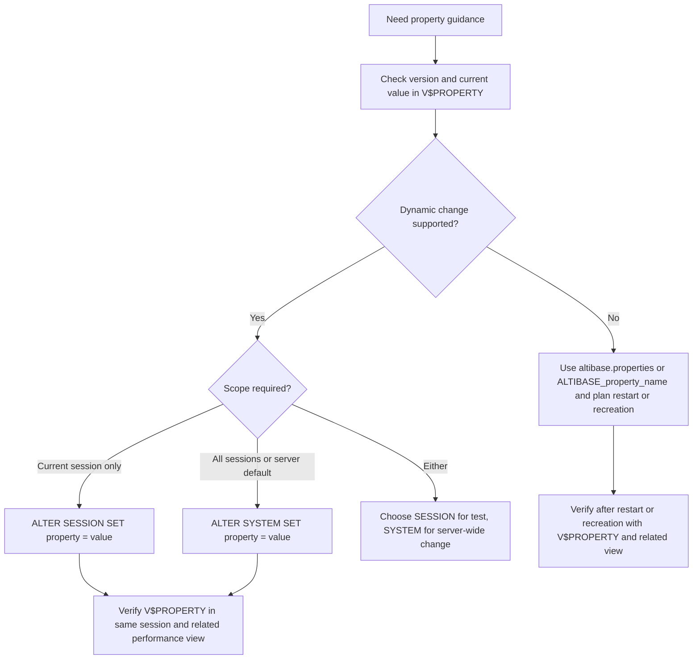

# 05. Data Types and Properties

## Applicable Versions

- 7.1: Based on Altibase 7.1 General Reference 1.
- 7.3: Based on Altibase 7.3 General Reference 1.
- 8.1: Based on Altibase 8.1 verified source General Reference 1 and Altibase 8.1 Release Notes.

## Questions This File Can Answer

- Which Altibase data type should be used for character, numeric, date/time, binary, LOB, spatial, or JSON data?
- What are the practical differences between Altibase data types and familiar Oracle data types?
- How do `FIXED`, `VARIABLE`, and `IN ROW` affect column storage?
- What are the 8.1 `JSON` data type and Temporary LOB features?
- Where are Altibase server properties checked, and how are static and dynamic property changes applied?
- Which SQL should be used to inspect a property, change a dynamic property, and verify the related system view?
- What do properties such as `LOG_FILE_SIZE`, `TEMPORARY_LOB_ENABLE`, `MEMORY_TEMPLOB_MAX_ALLOC_SIZE`, and `REPLICATION_SSL_PORT_NO` mean?

## Source Documents

- 7.1: Altibase 7.1 General Reference 1.
- 7.3: Altibase 7.3 General Reference 1.
- 8.1: Altibase 8.1 verified source General Reference 1; Altibase 8.1 Release Notes.

## Core Guidance

- Answer in the user's language, but keep SQL object names, data type names, function names, error codes, property names, commands, and file paths literal.
- If the customer specifies a version, use that version's data types and property definitions. If no version is specified, use the 8.1 baseline and call out features that do not exist in 7.1 or 7.3.
- For data type questions, identify the data shape, maximum size, storage target, and whether Oracle compatibility matters.
- For property questions, answer with `Meaning`, `Default`, `Dynamic Change Support`, `Range`, and `Check SQL`.
- For property change questions, include pre-change SQL, the correct `ALTER SYSTEM` or `ALTER SESSION` form only when the property supports it, post-change SQL, and any restart or recreation requirement.
- Do not expose internal source labels. Refer to the 8.1 source family as `Altibase 8.1 verified source`.
- Do not keep large source tables as-is. Convert them into searchable data type or property item blocks.

## Version Differences

- 7.1 and 7.3: Core data types are character, numeric, `DATE`, binary, `BLOB`, `CLOB`, and `GEOMETRY`. Native `JSON` and Temporary LOB are not part of these baselines.
- 8.1: Adds native `JSON`, JSON path-expression support, JSON generation/search/validation functions, and Temporary LOB support.
- 8.1: Adds or documents new properties including `CHECKPOINT_SCALE_SINGLE_DW_BUFFER_SIZE`, `MEMORY_TEMPLOB_MAX_ALLOC_SIZE`, `MEMORY_TEMPLOB_PIECE_SIZE`, `REPLICATION_SSL_PORT_NO`, `TEMPORARY_LOB_ENABLE`, `TRCLOG_EXPLAIN_TYPE`, and `TRCLOG_JSON_PLAN_INDENT_DEPTH`.
- Cross-version property caution: `PSM_CASE_SENSITIVE_MODE` and `REGEXP_MODE` are documented in Altibase 7.x and 8.1 source documents. Do not label them as 8.1-only unless the customer asks about a target build where the installed documentation proves a narrower scope.
- 8.1: Release notes record changed defaults or ranges for `CHECKPOINT_INTERVAL_IN_LOG`, `FAST_START_LOGFILE_TARGET`, `LOG_CREATE_METHOD`, `LOG_FILE_SIZE`, `MEMORY_INDEX_BUILD_RUN_SIZE`, `MEMORY_INDEX_BUILD_VALUE_LENGTH_THRESHOLD`, and `OPTIMIZER_FEATURE_ENABLE`.
- 8.1: Release notes list `INSPECTION_LARGE_HEAP_THRESHOLD` as removed.

## Data Type Selection Flow

```mermaid
flowchart TD
  A[Choose column type] --> B{Stores JSON document?}
  B -->|Yes, 8.1| C[Use JSON and enable Temporary LOB]
  B -->|Yes, 7.1 or 7.3| D[Use character or LOB design, not native JSON]
  B -->|No| E{Large text or binary object?}
  E -->|Yes| F[Use CLOB or BLOB]
  E -->|No| G{Text?}
  G -->|Yes| H[Use CHAR, VARCHAR, NCHAR, or NVARCHAR]
  G -->|No| I{Exact numeric?}
  I -->|Yes| J[Use NUMERIC, DECIMAL, NUMBER(p,s), INTEGER, BIGINT, or SMALLINT]
  I -->|No| K{Approximate numeric?}
  K -->|Yes| L[Use FLOAT, DOUBLE, REAL, or NUMBER without precision]
  K -->|No| M{Date/time?}
  M -->|Yes| N[Use DATE]
  M -->|No| O{Binary or bit string?}
  O -->|Yes| P[Use BYTE, VARBYTE, NIBBLE, BIT, or VARBIT]
  O -->|No| Q{Spatial?}
  Q -->|Yes| R[Use GEOMETRY]
```

## Compact Data Type Syntax

These patterns are generation guides, not a replacement for the full SQL Reference grammar.

```text
character_type ::=
  CHAR[(size)] [FIXED | VARIABLE [IN ROW size]]
  | VARCHAR[(size)] [FIXED | VARIABLE [IN ROW size]]
  | NCHAR[(size)] [FIXED | VARIABLE [IN ROW size]]
  | NVARCHAR[(size)] [FIXED | VARIABLE [IN ROW size]]

numeric_type ::=
  BIGINT
  | INTEGER
  | SMALLINT
  | DOUBLE
  | REAL
  | FLOAT[(precision)]
  | NUMERIC[(precision[, scale])]
  | DECIMAL[(precision[, scale])]
  | NUMBER[(precision[, scale])]

date_type ::= DATE

binary_type ::=
  BYTE[(size)] [[FIXED |] VARIABLE (IN ROW size)]
  | VARBYTE[(size)] [[FIXED |] VARIABLE (IN ROW size)]
  | NIBBLE[(size)] [[FIXED |] VARIABLE (IN ROW size)]
  | BIT[(size)] [[FIXED |] VARIABLE (IN ROW size)]
  | VARBIT[(size)] [[FIXED |] VARIABLE (IN ROW size)]

lob_type_7_1_7_3 ::=
  BLOB [VARIABLE (IN ROW size)]
  | CLOB [VARIABLE (IN ROW size)]

lob_type_8_1_verified ::=
  BLOB [IN ROW size]
  | CLOB [IN ROW size]

json_type_8_1 ::=
  JSON [IN ROW size]
```

## Storage Modifiers

### Modifier Item: `FIXED`

Purpose: keep the column data in the fixed area of a record when the table is in a memory tablespace.

Use when: the column is short and predictable, or when avoiding variable-area lookup is more important than saving memory.

Notes:

- For disk tables, user-specified `FIXED` or `VARIABLE` is ignored and columns are treated as fixed.
- LOB columns are always treated as variable in the broader sense, with small values controlled by `IN ROW`.

### Modifier Item: `VARIABLE`

Purpose: store column payload separately from the fixed part of a record, while the fixed part stores length and pointer information.

Use when: values vary widely or can be large.

Supported types: `CHAR`, `VARCHAR`, `NCHAR`, `NVARCHAR`, `BYTE`, `VARBYTE`, `NIBBLE`, `BIT`, `VARBIT`, `BLOB`, and `CLOB`.

### Modifier Item: `IN ROW`

Purpose: keep small variable or LOB values in the fixed area when their stored size is less than or equal to the `IN ROW` threshold.

Use when: many rows contain small values, but occasional rows contain larger values.

Default-related properties:

- `MEMORY_VARIABLE_COLUMN_IN_ROW_SIZE`: default threshold for non-LOB variable columns in memory tables.
- `MEMORY_LOB_COLUMN_IN_ROW_SIZE`: default threshold for LOB columns in memory tables.
- `DISK_LOB_COLUMN_IN_ROW_SIZE`: default threshold for LOB columns in disk tables.

## Data Type Item Blocks

### Type Item: `CHAR`

Purpose: fixed-length character data in the database character set.

Syntax:

```sql
CHAR[(size)] [FIXED | VARIABLE [IN ROW size]]
```

Limits and storage:

- Default size is `1` byte.
- Maximum size is `32000` bytes.
- Values shorter than the declared size are padded with blanks.

Use when: the value has a stable fixed length, such as fixed-format codes.

### Type Item: `VARCHAR`

Purpose: variable-length character data in the database character set.

Syntax:

```sql
VARCHAR[(size)] [FIXED | VARIABLE [IN ROW size]]
```

Limits and storage:

- Default size is `1` byte.
- Maximum size is `32000` bytes.
- Stores only the actual input length plus length metadata, unless fixed-area storage applies.

Use when: ordinary text length varies and does not require the national character set.

Oracle mapping note: Oracle `VARCHAR2` commonly maps to Altibase `VARCHAR`, after checking the 32000-byte limit and character set.

### Type Item: `NCHAR`

Purpose: fixed-length Unicode character data in the national character set.

Syntax:

```sql
NCHAR[(size)] [FIXED | VARIABLE [IN ROW size]]
```

Limits and storage:

- Maximum length is `16000` characters for UTF16 national character set.
- Maximum length is `10666` characters for UTF8 national character set.
- UTF16 uses 2 bytes per character; UTF8 varies from 1 to 3 bytes per character.

Use when: fixed-length national character data is required.

### Type Item: `NVARCHAR`

Purpose: variable-length Unicode character data in the national character set.

Syntax:

```sql
NVARCHAR[(size)] [FIXED | VARIABLE [IN ROW size]]
```

Limits and storage:

- Maximum length is `16000` characters for UTF16 national character set.
- Maximum length is `10666` characters for UTF8 national character set.
- Like `VARCHAR`, it stores the actual input length plus metadata unless fixed-area storage applies.

Use when: variable-length Unicode text is required.

Oracle mapping note: Oracle `NVARCHAR2` commonly maps to Altibase `NVARCHAR`.

### Type Item: `BIGINT`

Purpose: 8-byte integer.

Syntax:

```sql
BIGINT
```

Range: `-9223372036854775807` through `9223372036854775807`.

Use when: exact integer values exceed the `INTEGER` range.

### Type Item: `INTEGER`

Purpose: 4-byte integer.

Syntax:

```sql
INTEGER
```

Range: `-2147483647` through `2147483647`.

Use when: ordinary exact integer values fit in 4 bytes.

### Type Item: `SMALLINT`

Purpose: 2-byte integer.

Syntax:

```sql
SMALLINT
```

Range: `-32767` through `32767`.

Use when: compact small integer storage is sufficient.

### Type Item: `NUMERIC`

Purpose: exact fixed decimal.

Syntax:

```sql
NUMERIC[(precision[, scale])]
```

Limits and defaults:

- `precision`: `1` through `38`.
- `scale`: `-84` through `128`.
- If precision is omitted, default precision is `38`.
- If scale is omitted, default scale is `0`.

Use when: exact decimal semantics are required, such as financial values.

### Type Item: `DECIMAL`

Purpose: exact fixed decimal.

Syntax:

```sql
DECIMAL[(precision[, scale])]
```

Behavior: same as `NUMERIC`.

Use when: source DDL uses `DECIMAL` and exact fixed decimal semantics are required.

### Type Item: `NUMBER`

Purpose: Oracle-familiar numeric declaration with Altibase-specific behavior.

Syntax:

```sql
NUMBER[(precision[, scale])]
```

Behavior:

- `NUMBER(p,s)` behaves like exact fixed decimal `NUMERIC(p,s)`.
- `NUMBER` with no precision and scale behaves like `FLOAT`.

Migration caution: do not map Oracle `NUMBER` blindly. Decide whether the source column is exact integer, exact decimal, or approximate numeric.

### Type Item: `FLOAT`

Purpose: non-native floating-point numeric with decimal precision.

Syntax:

```sql
FLOAT[(precision)]
```

Limits and defaults:

- Precision is `1` through `38`.
- Default precision is `38`.
- Value range is approximately `-1E+120` through `1E+120`.

Use when: approximate numeric behavior is acceptable.

### Type Item: `DOUBLE`

Purpose: 8-byte native floating-point value.

Syntax:

```sql
DOUBLE
```

Use when: C `double`-like approximate numeric storage is desired.

### Type Item: `REAL`

Purpose: 4-byte native floating-point value.

Syntax:

```sql
REAL
```

Use when: C `float`-like approximate numeric storage is sufficient.

### Type Item: `DATE`

Purpose: date and time information.

Syntax:

```sql
DATE
```

Limits and storage:

- Stored in 8 bytes.
- Typical supported date range is `0001/01/01` through `9999/12/31`, subject to system behavior.
- Display and input formatting are controlled by date format strings and `DEFAULT_DATE_FORMAT`.

Oracle mapping note: Oracle `DATE` maps naturally to Altibase `DATE` for date and time values, but confirm fractional-second and timezone requirements before migration.

### Type Item: `BYTE`

Purpose: fixed-length hexadecimal byte data.

Syntax:

```sql
BYTE[(size)] [[FIXED |] VARIABLE (IN ROW size)]
```

Limits and storage:

- Default size is `1` byte.
- Maximum size is `32000` bytes.
- Two hexadecimal characters represent one byte.
- Values shorter than the declared size are padded on the right with `0`.

Use when: fixed-length binary values are needed.

### Type Item: `VARBYTE`

Purpose: variable-length hexadecimal byte data.

Syntax:

```sql
VARBYTE[(size)] [[FIXED |] VARIABLE (IN ROW size)]
```

Limits and storage:

- Default size is `1` byte.
- Maximum size is `32000` bytes.
- Two hexadecimal characters represent one byte.

Use when: Oracle `RAW`-like values vary in length and fit the Altibase limit.

### Type Item: `NIBBLE`

Purpose: hexadecimal data where each character is one nibble.

Syntax:

```sql
NIBBLE[(size)] [[FIXED |] VARIABLE (IN ROW size)]
```

Limits and storage:

- Maximum size is `254` nibbles.
- Allowed characters are `0` through `9` and `A` through `F`; lower-case `a` through `f` are stored as upper-case.

Use when: nibble-level hexadecimal storage is required.

### Type Item: `BIT`

Purpose: fixed-length bit string.

Syntax:

```sql
BIT[(size)] [[FIXED |] VARIABLE (IN ROW size)]
```

Limits and storage:

- Default size is `1` bit.
- Maximum size is `64000` bits.
- Allowed characters are `0` and `1`.
- Values shorter than the declared size are padded on the right with `0`.

### Type Item: `VARBIT`

Purpose: variable-length bit string.

Syntax:

```sql
VARBIT[(size)] [[FIXED |] VARIABLE (IN ROW size)]
```

Limits and storage:

- Default size is `1` bit.
- Maximum size is `64000` bits.
- Allowed characters are `0` and `1`.

### Type Item: `BLOB`

Purpose: large binary object.

Syntax:

```sql
-- 7.1 and 7.3 source syntax
BLOB [VARIABLE (IN ROW size)]

-- Altibase 8.1 verified source syntax
BLOB [IN ROW size]
```

Limits and storage:

- Maximum size is `4GB - 1 byte`.
- Disk table LOB data can be stored in a separate disk LOB tablespace.
- Memory table LOB data stays in the same tablespace as the table.
- Small LOB values can use `IN ROW` behavior.

Restrictions:

- LOB columns cannot be used in volatile tables or disk temporary tablespaces.
- LOB columns cannot be partition key columns.
- Indexes cannot be created on LOB columns.
- Avoid `NOT NULL` on LOB columns unless the application and driver behavior are tested.

### Type Item: `CLOB`

Purpose: large character object.

Syntax:

```sql
-- 7.1 and 7.3 source syntax
CLOB [VARIABLE (IN ROW size)]

-- Altibase 8.1 verified source syntax
CLOB [IN ROW size]
```

Limits, storage, and restrictions: same general LOB rules as `BLOB`.

Use when: text can exceed ordinary `VARCHAR` or `NVARCHAR` limits.

### Type Item: Temporary LOB

Version: 8.1 baseline feature.

Purpose: transient LOB created in memory at execution time for large text or binary processing.

Enablement:

- `TEMPORARY_LOB_ENABLE=1` enables Temporary LOB.
- Temporary LOB information is exposed through `V$TEMPORARY_LOBS`.

Lifecycle types:

- Transaction Temporary LOB: exists for a transaction and is removed when the transaction ends.
- Session Temporary LOB: exists for a session and is removed when the session ends, or when `ALTER SESSION SET FREE TEMPORARY LOB` is executed.

Common creation cases:

- `TO_CLOB`.
- `TO_BLOB`.
- `SUBSTR` with a `CLOB` argument.
- `CONCAT` with a `CLOB` argument.
- LOB-type PSM variables.
- PSM `ASSOCIATIVE ARRAY`, `VARRAY`, and package variables that use LOB types can be session Temporary LOB cases.

Check SQL:

```sql
SELECT type, id, alloced_size, open_count
FROM V$TEMPORARY_LOBS;
```

Cleanup SQL for session Temporary LOB:

```sql
ALTER SESSION SET FREE TEMPORARY LOB;
```

### Type Item: `GEOMETRY`

Purpose: spatial data type supported by Altibase SQL.

Supported subtypes:

- `Point`
- `LineString`
- `Polygon`
- `GeomCollection`
- `MultiPolygon`
- `MultiLineString`
- `MultiPoint`

Limits and storage:

- Length range is `8` through `104857600`.
- Stored size is length plus geometry header overhead.

Use the spatial attachment for spatial functions, indexes, and geometry operators.

### Type Item: `JSON`

Version: 8.1 baseline feature.

Purpose: store and retrieve JSON documents natively.

Syntax:

```sql
JSON [IN ROW size]
```

Limits and standards:

- Maximum JSON document size is `2GB`.
- JSON definition follows RFC 8259.
- JSON path expressions and JSON functions follow ISO/IEC 19075-6:2021.
- Maximum JSON document depth is `256`.

Restrictions and prerequisites:

- JSON columns follow the same broad restrictions as LOB columns.
- JSON processing uses Temporary LOB, so `TEMPORARY_LOB_ENABLE` must be `1`.
- `JSON` cannot be used with `SELECT FOR UPDATE`.
- Before generating dynamic JSON path-expression SQL, verify the path operand form in the target 8.1 SQL Reference. If the exact grammar is not confirmed, use literal JSON path expressions in examples and avoid claiming support for bind variables, table columns, SQL functions, or user-defined functions as JSON path operands.

JSON function family:

- JSON generation: `JSON_ARRAY`, `JSON_OBJECT`.
- JSON search: `JSON_EXISTS`, `JSON_QUERY`, `JSON_VALUE`.
- JSON validation: `JSON_VALID`.
- JSON condition: `IS JSON`, `IS NOT JSON`.

JSON path elements:

- `$`: root node.
- `@`: current node.
- `.`: object key access.
- `[]`: array element access.
- `*`: wildcard.
- `?(logical-expr)`: filter expression.

Example:

```sql
CREATE TABLE app_event (
  event_id BIGINT,
  payload JSON
);

SELECT JSON_VALUE(payload, '$.customer.id') AS customer_id
FROM app_event
WHERE JSON_EXISTS(payload, '$.customer');
```

## Oracle Data Type Conversion Guidance

- Oracle `VARCHAR2` -> Altibase `VARCHAR`, after checking byte length and character set.
- Oracle `CHAR` -> Altibase `CHAR`, after checking blank-padding behavior.
- Oracle `NCHAR` -> Altibase `NCHAR`; Oracle `NVARCHAR2` -> Altibase `NVARCHAR`.
- Oracle `NUMBER(p,s)` -> Altibase `NUMBER(p,s)` or `NUMERIC(p,s)` when exact decimal behavior is required.
- Oracle unconstrained `NUMBER` -> choose Altibase `NUMBER`, `FLOAT`, `BIGINT`, `INTEGER`, or `NUMERIC` based on actual data semantics.
- Oracle `DATE` -> Altibase `DATE` for date/time values.
- Oracle `BLOB` -> Altibase `BLOB`; Oracle `CLOB` -> Altibase `CLOB`.
- Oracle `RAW` -> Altibase `BYTE` or `VARBYTE`.
- Oracle JSON features -> Altibase native `JSON` only for 8.1. For 7.1 or 7.3, design around `VARCHAR`, `CLOB`, application validation, or upgrade planning.

## Property Configuration Model

Altibase properties are stored in `altibase.properties` under the server configuration directory.

Property setting methods:

- Static file setting: edit `altibase.properties`; restart is required.
- Dynamic server setting: use `ALTER SYSTEM` when the property supports server-level dynamic changes.
- Dynamic session setting: use `ALTER SESSION` when the property supports session-level dynamic changes.
- Environment variable setting: set `ALTIBASE_property_name`; restart is required.

Precedence:

1. Environment variable.
2. `altibase.properties`.
3. Default system value.

Attribute interpretation:

- `Read-Only`: treat as static unless the manual explicitly says otherwise. Many require restart or database recreation.
- `Read-Write`: can be changed dynamically with `ALTER SYSTEM`, `ALTER SESSION`, or both, depending on the property.
- `Single Value`: one configured value.
- `Multiple Values`: multiple configured values are accepted.

Alter level interpretation:

- `SESSION`: use `ALTER SESSION` for the current session only.
- `SYSTEM`: use `ALTER SYSTEM` for the running server.
- `BOTH`: either `ALTER SESSION` or `ALTER SYSTEM` is valid; choose scope deliberately.
- `NONE`: do not generate dynamic SQL. Use `altibase.properties`, an `ALTIBASE_property_name` environment variable, restart, or database recreation as documented for that property.

Do not infer alter level from the `V$PROPERTY.ATTR` number alone. Use the property's documented dynamic-change support and verify the installed version.

## Property Change Decision Flow



## Compact Property SQL Syntax

These patterns replace SQL syntax diagrams for property operations.

```text
property_profile_query ::=
  SELECT name, storedcount, attr, min, max, value1, ..., value8
  FROM V$PROPERTY
  WHERE name {= property_name | IN (property_name [, ...])}

alter_system_property ::=
  ALTER SYSTEM SET property_name = property_value

alter_session_property ::=
  ALTER SESSION SET property_name = property_value

free_session_temporary_lob_8_1 ::=
  ALTER SESSION SET FREE TEMPORARY LOB
```

Property SQL rules:

- Use exact property names, for example `QUERY_TIMEOUT`, not a translated property label.
- Quote string values such as date formats and time zone names.
- Keep numeric values explicit. If the property unit is seconds or bytes, state that unit.
- For `ALTER SYSTEM`, the user must be `SYS` or have `ALTER SYSTEM` privilege.
- For `ALTER SESSION`, the change affects only the current session.
- For persistent operations policy, also maintain `altibase.properties` when the site requires restart-stable configuration; do not assume a dynamic statement replaces file configuration unless the target version documentation confirms it.

## Property Check SQL

Use exact property names in `V$PROPERTY`. `V$PROPERTY` exposes `NAME`, `STOREDCOUNT`, `ATTR`, `MIN`, `MAX`, and `VALUE1` through `VALUE8`; multi-value properties use multiple `VALUE` columns.

```sql
SELECT name,
       storedcount,
       attr,
       min,
       max,
       value1,
       value2,
       value3,
       value4,
       value5,
       value6,
       value7,
       value8
FROM V$PROPERTY
WHERE name = '<PROPERTY_NAME>';

SELECT name, storedcount, value1, value2, value3, value4, value5, value6, value7, value8
FROM V$PROPERTY
WHERE name IN ('MEM_DB_DIR', 'LOGANCHOR_DIR')
ORDER BY name;

SELECT name, value1
FROM V$PROPERTY
WHERE name = 'LOG_FILE_SIZE';

SELECT name, value1
FROM V$PROPERTY
WHERE name IN (
  'TEMPORARY_LOB_ENABLE',
  'MEMORY_TEMPLOB_MAX_ALLOC_SIZE',
  'MEMORY_TEMPLOB_PIECE_SIZE'
);

SELECT name, value1
FROM V$PROPERTY
WHERE name LIKE 'REPLICATION%PORT%';
```

Use property-specific performance views when available:

```sql
SELECT *
FROM V$TEMPORARY_LOBS;

SELECT max_cache_size
FROM V$SQL_PLAN_CACHE;

SELECT name, utc_offset
FROM V$TIME_ZONE_NAMES
WHERE name = 'Asia/Seoul';
```

## Property Change Examples

System-level timeout change:

```sql
SELECT name, value1, min, max
FROM V$PROPERTY
WHERE name = 'QUERY_TIMEOUT';

ALTER SYSTEM SET QUERY_TIMEOUT = 300;

SELECT name, value1
FROM V$PROPERTY
WHERE name = 'QUERY_TIMEOUT';

SELECT query_time_limit
FROM V$SESSION
WHERE id = SESSION_ID();
```

Session-level timeout test:

```sql
SELECT name, value1, min, max
FROM V$PROPERTY
WHERE name = 'QUERY_TIMEOUT';

ALTER SESSION SET QUERY_TIMEOUT = 120;

SELECT name, value1
FROM V$PROPERTY
WHERE name = 'QUERY_TIMEOUT';
```

Session time zone change with value validation:

```sql
SELECT name, utc_offset
FROM V$TIME_ZONE_NAMES
WHERE name = 'Asia/Seoul';

ALTER SESSION SET TIME_ZONE = 'Asia/Seoul';

SELECT name, value1
FROM V$PROPERTY
WHERE name = 'TIME_ZONE';

SELECT time_zone
FROM V$SESSION
WHERE id = SESSION_ID();
```

SQL plan cache size change and related system view check:

```sql
SELECT name, value1, min, max
FROM V$PROPERTY
WHERE name = 'SQL_PLAN_CACHE_SIZE';

SELECT max_cache_size,
       current_cache_size,
       current_cache_obj_count,
       cache_hit_count,
       cache_miss_count
FROM V$SQL_PLAN_CACHE;

ALTER SYSTEM SET SQL_PLAN_CACHE_SIZE = 134217728;

SELECT name, value1
FROM V$PROPERTY
WHERE name = 'SQL_PLAN_CACHE_SIZE';

SELECT max_cache_size,
       current_cache_size,
       current_cache_obj_count
FROM V$SQL_PLAN_CACHE;
```

Static or read-only property answer pattern:

```sql
SELECT name, value1, min, max
FROM V$PROPERTY
WHERE name IN ('LOG_FILE_SIZE', 'PORT_NO', 'MAX_CLIENT');
```

Do not generate `ALTER SYSTEM` or `ALTER SESSION` for these examples unless the target version documentation explicitly says the property is dynamically changeable. Explain the required restart or database recreation path instead.

## Property Categories

### Property Category: Database Initialization

Use for database identity, file locations, tablespace defaults, memory/disk/volatile database size limits, log file size, and default `IN ROW` behavior.

Representative properties:

- `DB_NAME`
- `DEFAULT_DISK_DB_DIR`
- `MEM_DB_DIR`
- `LOG_DIR`
- `LOGANCHOR_DIR`
- `LOG_FILE_SIZE`
- `MEM_MAX_DB_SIZE`
- `DISK_MAX_DB_SIZE`
- `VOLATILE_MAX_DB_SIZE`
- `DISK_LOB_COLUMN_IN_ROW_SIZE`
- `MEMORY_LOB_COLUMN_IN_ROW_SIZE`
- `MEMORY_VARIABLE_COLUMN_IN_ROW_SIZE`

### Property Category: Performance

Use for sort/hash memory, checkpoint behavior, optimizer behavior, SQL plan cache, result cache, locking behavior, and execution memory limits.

Representative properties:

- `HASH_AREA_SIZE`
- `SORT_AREA_SIZE`
- `EXECUTE_STMT_MEMORY_MAXIMUM`
- `PREPARE_STMT_MEMORY_MAXIMUM`
- `SQL_PLAN_CACHE_SIZE`
- `OPTIMIZER_FEATURE_ENABLE`
- `OPTIMIZER_MODE`
- `RESULT_CACHE_ENABLE`
- `CHECKPOINT_INTERVAL_IN_LOG`
- `FAST_START_LOGFILE_TARGET`
- `CHECKPOINT_SCALE_SINGLE_DW_BUFFER_SIZE`

### Property Category: Session and Timeout

Use for client session defaults, locale behavior, date formatting, transaction mode, statement limits, and timeout behavior.

Representative properties:

- `AUTO_COMMIT`
- `ISOLATION_LEVEL`
- `DEFAULT_DATE_FORMAT`
- `TIME_ZONE`
- `NLS_NUMERIC_CHARACTERS`
- `MAX_STATEMENTS_PER_SESSION`
- `QUERY_TIMEOUT`
- `FETCH_TIMEOUT`
- `IDLE_TIMEOUT`
- `LOGIN_TIMEOUT`
- `DDL_TIMEOUT`
- `DDL_LOCK_TIMEOUT`
- `UTRANS_TIMEOUT`

### Property Category: Replication, Network, and Security

Use for ordinary client ports, replication ports, SSL/TLS ports, SSL certificate paths, and replication connection behavior.

Representative properties:

- `PORT_NO`
- `MAX_CLIENT`
- `REPLICATION_PORT_NO`
- `REPLICATION_SSL_PORT_NO`
- `REPLICATION_CONNECT_TIMEOUT`
- `REPLICATION_RECEIVE_TIMEOUT`
- `SSL_ENABLE`
- `SSL_PORT_NO`
- `SSL_CA`
- `SSL_CERT`
- `SSL_KEY`
- `SSL_CIPHER_LIST`
- `TCP_ENABLE`

### Property Category: 8.1 JSON and Temporary LOB

Use for native JSON processing, Temporary LOB memory management, and JSON-formatted execution-plan output.

Representative properties and views:

- `TEMPORARY_LOB_ENABLE`
- `MEMORY_TEMPLOB_MAX_ALLOC_SIZE`
- `MEMORY_TEMPLOB_PIECE_SIZE`
- `TRCLOG_EXPLAIN_TYPE`
- `TRCLOG_JSON_PLAN_INDENT_DEPTH`
- `V$TEMPORARY_LOBS`

## Decomposed Property Blocks

### Property Item: `DB_NAME`

Meaning: database name used when creating the database.

Default: `mydb`.

Dynamic Change Support: read-only. Create a new database to change it.

Range: no explicit range.

Check SQL:

```sql
SELECT name, value1
FROM V$PROPERTY
WHERE name = 'DB_NAME';
```

### Property Item: `DEFAULT_DISK_DB_DIR`

Meaning: default directory for disk database files.

Default: `$ALTIBASE_HOME/dbs`.

Dynamic Change Support: read-only; restart and file-layout planning are required.

Range: directory path.

Check SQL:

```sql
SELECT name, value1
FROM V$PROPERTY
WHERE name = 'DEFAULT_DISK_DB_DIR';
```

### Property Item: `MEM_DB_DIR`

Meaning: directory paths for memory database files.

Default: `$ALTIBASE_HOME/dbs`.

Dynamic Change Support: read-only; restart and storage planning are required.

Range: one to eight actual paths.

Check SQL:

```sql
SELECT name, storedcount,
       value1, value2, value3, value4,
       value5, value6, value7, value8
FROM V$PROPERTY
WHERE name = 'MEM_DB_DIR';
```

### Property Item: `LOG_DIR`

Meaning: path for log files.

Default: `$ALTIBASE_HOME/logs`.

Dynamic Change Support: read-only.

Range: path value; multiple values can be configured where supported.

Check SQL:

```sql
SELECT name, storedcount,
       value1, value2, value3, value4,
       value5, value6, value7, value8
FROM V$PROPERTY
WHERE name = 'LOG_DIR';
```

### Property Item: `LOGANCHOR_DIR`

Meaning: pathnames for log anchor files.

Default: `$ALTIBASE_HOME/logs`.

Dynamic Change Support: read-only.

Range: three log anchor file paths are required.

Check SQL:

```sql
SELECT name, storedcount,
       value1, value2, value3, value4,
       value5, value6, value7, value8
FROM V$PROPERTY
WHERE name = 'LOGANCHOR_DIR';
```

### Property Item: `LOG_FILE_SIZE`

Meaning: size in bytes of each log file. When an active log file fills, writing continues in a new log file.

Default: `100 * 1024 * 1024` bytes in the 8.1 baseline. The 8.1 release notes record this default as changed from `10485760` to `104857600`.

Dynamic Change Support: read-only. Set only at database creation; create a new database to change it.

Range: `[64 * 1024, 2^32 - 1]` in the 8.1 baseline. The 8.1 release notes record the maximum as changed to `4294967295`.

Important note: for offline replication, set this property identically on local and remote servers.

Check SQL:

```sql
SELECT name, value1
FROM V$PROPERTY
WHERE name = 'LOG_FILE_SIZE';
```

### Property Item: `MEM_MAX_DB_SIZE`

Meaning: maximum memory database size in bytes.

Default: `2^31` bytes.

Dynamic Change Support: read-only.

Range: `32-bit [2097152, 2^32 + 1]`; `64-bit [2097152, 2^64]`.

Behavior: if the memory database expands beyond this value, the offending transaction errors, and later non-`SELECT` SQL also errors until the condition is resolved.

Check SQL:

```sql
SELECT name, value1
FROM V$PROPERTY
WHERE name = 'MEM_MAX_DB_SIZE';
```

### Property Item: `DISK_MAX_DB_SIZE`

Meaning: maximum disk database size in bytes.

Default: `2^64 - 1`.

Dynamic Change Support: read-only.

Range: 64-bit `[2097152, 2^64]`.

Behavior: when the disk database exceeds the limit, the executing transaction fails and later non-`SELECT` SQL can fail.

Check SQL:

```sql
SELECT name, value1
FROM V$PROPERTY
WHERE name = 'DISK_MAX_DB_SIZE';
```

### Property Item: `VOLATILE_MAX_DB_SIZE`

Meaning: maximum size of volatile tablespaces.

Default: `2^32 + 1`.

Dynamic Change Support: read-only.

Range: `32-bit [2097152, 2^32 + 1]`; `64-bit [2097152, 2^64]`.

Check SQL:

```sql
SELECT name, value1
FROM V$PROPERTY
WHERE name = 'VOLATILE_MAX_DB_SIZE';
```

### Property Item: `DISK_LOB_COLUMN_IN_ROW_SIZE`

Meaning: default `IN ROW` threshold, in bytes, for LOB data stored directly in disk table segments.

Default: `4000`.

Dynamic Change Support: read-only.

Range: `[0, 4000]`.

Behavior: if the LOB data length is less than or equal to this value, it is saved in the table segment; otherwise it is saved in a LOB segment.

Check SQL:

```sql
SELECT name, value1
FROM V$PROPERTY
WHERE name = 'DISK_LOB_COLUMN_IN_ROW_SIZE';
```

### Property Item: `MEMORY_LOB_COLUMN_IN_ROW_SIZE`

Meaning: default `IN ROW` threshold, in bytes, for LOB data stored directly in memory table rows.

Default: `64`.

Dynamic Change Support: read-only.

Range: `[0, 4000]`.

Behavior: if the LOB data length is less than or equal to this value, it is saved in the fixed area; otherwise it is saved in the variable area.

Check SQL:

```sql
SELECT name, value1
FROM V$PROPERTY
WHERE name = 'MEMORY_LOB_COLUMN_IN_ROW_SIZE';
```

### Property Item: `MEMORY_VARIABLE_COLUMN_IN_ROW_SIZE`

Meaning: default `IN ROW` threshold, in bytes, for non-LOB variable columns in memory tables.

Default: `32`.

Dynamic Change Support: read-write; can be changed while Altibase is running.

Range: `[0, 4000]`.

Behavior: variable column data at or below the threshold is stored in the fixed area; larger data is stored in the variable area.

Check SQL:

```sql
SELECT name, value1
FROM V$PROPERTY
WHERE name = 'MEMORY_VARIABLE_COLUMN_IN_ROW_SIZE';
```

### Property Item: `LOB_OBJECT_BUFFER_SIZE`

Meaning: maximum internal LOB buffer size used by the server to process LOB values in PSM or triggers.

Default: `32000`.

Dynamic Change Support: read-only.

Range: `[32000, 104857600]`.

Check SQL:

```sql
SELECT name, value1
FROM V$PROPERTY
WHERE name = 'LOB_OBJECT_BUFFER_SIZE';
```

### Property Item: `TEMPORARY_LOB_ENABLE`

Version: 8.1 baseline property.

Meaning: enables or disables Temporary LOB use. Native `JSON` processing requires Temporary LOB support.

Default: `1`.

Dynamic Change Support: read-only.

Range: `[0, 1]`.

Values:

- `0`: do not use Temporary LOB.
- `1`: use Temporary LOB.

Check SQL:

```sql
SELECT name, value1
FROM V$PROPERTY
WHERE name = 'TEMPORARY_LOB_ENABLE';
```

### Property Item: `MEMORY_TEMPLOB_MAX_ALLOC_SIZE`

Version: 8.1 baseline property.

Meaning: maximum total memory, in bytes, that Temporary LOB can allocate.

Default: `2147483648` (`2G`).

Dynamic Change Support: read-write; can be changed with `ALTER SYSTEM`.

Range: `[16777216, 2^64]`.

Behavior: if a Temporary LOB allocation request exceeds this limit, memory allocation fails and the transaction is treated as an error.

Important note: Temporary LOB uses memory separate from `MEM_MAX_DB_SIZE`; size both limits deliberately.

Check SQL:

```sql
SELECT name, value1
FROM V$PROPERTY
WHERE name = 'MEMORY_TEMPLOB_MAX_ALLOC_SIZE';
```

### Property Item: `MEMORY_TEMPLOB_PIECE_SIZE`

Version: 8.1 baseline property.

Meaning: memory piece size, in bytes, used to split and store Temporary LOB data.

Default: `1048576` (`1M`).

Dynamic Change Support: read-only.

Range: `[32768, 1048576]`.

Tuning note: larger values can improve large Temporary LOB processing speed but can waste memory for many small Temporary LOB values. Smaller values can improve memory efficiency for many small Temporary LOB values.

Check SQL:

```sql
SELECT name, value1
FROM V$PROPERTY
WHERE name = 'MEMORY_TEMPLOB_PIECE_SIZE';
```

### Property Item: `PCTFREE`

Meaning: minimum percentage of page space reserved for future updates when disk tables are created without an explicit `PCTFREE`.

Default: `10`.

Dynamic Change Support: read-only property default.

Range: `[0, 99]`.

Check SQL:

```sql
SELECT name, value1
FROM V$PROPERTY
WHERE name = 'PCTFREE';
```

### Property Item: `PCTUSED`

Meaning: threshold percentage below which a disk page can return from update-only state to insert-eligible state.

Default: `40`.

Dynamic Change Support: read-only property default.

Range: `[0, 99]`.

Check SQL:

```sql
SELECT name, value1
FROM V$PROPERTY
WHERE name = 'PCTUSED';
```

### Property Item: `HASH_AREA_SIZE`

Meaning: memory size, in bytes, of each temporary table used for hash operations.

Default: `4MB`.

Dynamic Change Support: read-write; can be changed with `ALTER SYSTEM`.

Range: `[3M, 2^64 - 1]`.

Check SQL:

```sql
SELECT name, value1
FROM V$PROPERTY
WHERE name = 'HASH_AREA_SIZE';
```

### Property Item: `SORT_AREA_SIZE`

Meaning: memory size, in bytes, of each temporary table used for sort operations.

Default: `1048576`.

Dynamic Change Support: read-write; can be changed with `ALTER SYSTEM`.

Range: `[512, 2^64 - 1]`.

Check SQL:

```sql
SELECT name, value1
FROM V$PROPERTY
WHERE name = 'SORT_AREA_SIZE';
```

### Property Item: `EXECUTE_STMT_MEMORY_MAXIMUM`

Meaning: maximum memory, in bytes, available to execute a single query statement.

Default: `1G`.

Dynamic Change Support: read-write; can be changed with `ALTER SYSTEM`.

Range: `[1024 * 1024, 2^64 - 1]`.

Check SQL:

```sql
SELECT name, value1
FROM V$PROPERTY
WHERE name = 'EXECUTE_STMT_MEMORY_MAXIMUM';
```

### Property Item: `PREPARE_STMT_MEMORY_MAXIMUM`

Meaning: maximum memory, in bytes, available to prepare a query statement.

Default: `100M`.

Dynamic Change Support: read-write; can be changed with `ALTER SYSTEM`.

Range: `[1024 * 1024, 2^64 - 1]`.

Check SQL:

```sql
SELECT name, value1
FROM V$PROPERTY
WHERE name = 'PREPARE_STMT_MEMORY_MAXIMUM';
```

### Property Item: `SQL_PLAN_CACHE_SIZE`

Meaning: maximum SQL plan cache size in bytes.

Default: `64M`.

Dynamic Change Support: read-write; can be changed with `ALTER SYSTEM`.

Range: `[0, 2^64 - 1]`.

Behavior: `0` disables SQL plan cache.

Check SQL:

```sql
SELECT name, value1
FROM V$PROPERTY
WHERE name = 'SQL_PLAN_CACHE_SIZE';

SELECT max_cache_size
FROM V$SQL_PLAN_CACHE;
```

### Property Item: `OPTIMIZER_FEATURE_ENABLE`

Meaning: controls a set of optimizer-related behavior using a version-like compatibility value.

Default: Altibase server version. In 8.1, release notes record the default as changed to `8.1.0.0.1`.

Dynamic Change Support: read-write for supported values with `ALTER SYSTEM`.

Range: supported optimizer compatibility values vary by version; check the installed `V$PROPERTY` value and the version-specific manual.

Check SQL:

```sql
SELECT name, value1
FROM V$PROPERTY
WHERE name = 'OPTIMIZER_FEATURE_ENABLE';
```

### Property Item: `CHECKPOINT_INTERVAL_IN_LOG`

Meaning: checkpoint request interval based on the number of log file replacements.

Default: `10` in the 8.1 baseline. The 8.1 release notes record this default as changed from `100` to `10`.

Dynamic Change Support: read-write; can be changed with `ALTER SYSTEM`.

Range: `[1, 2^32 - 1]`.

Check SQL:

```sql
SELECT name, value1
FROM V$PROPERTY
WHERE name = 'CHECKPOINT_INTERVAL_IN_LOG';
```

### Property Item: `FAST_START_LOGFILE_TARGET`

Meaning: target number of log files read during recovery after restart; lower values can reduce recovery time at the cost of more page flushing during runtime.

Default: `10` in the 8.1 baseline. The 8.1 release notes record this default as changed from `100` to `10`.

Dynamic Change Support: read-write; can be changed with `ALTER SYSTEM`.

Range: `[1, 2^32 - 1]`.

Check SQL:

```sql
SELECT name, value1
FROM V$PROPERTY
WHERE name = 'FAST_START_LOGFILE_TARGET';
```

### Property Item: `LOG_CREATE_METHOD`

Meaning: system call method used to create log files.

Default: `1` on Linux in the 8.1 baseline; release notes record the default as changed from `0` to `1`.

Dynamic Change Support: read-only.

Range: `[0, 1]`.

Values:

- `0`: `write()` system call.
- `1`: `fallocate()` system call on Linux.

Check SQL:

```sql
SELECT name, value1
FROM V$PROPERTY
WHERE name = 'LOG_CREATE_METHOD';
```

### Property Item: `CHECKPOINT_SCALE_SINGLE_DW_BUFFER_SIZE`

Version: 8.1 baseline property.

Meaning: size of the double write buffer and image file used when checkpoint scale is `SINGLE`.

Default: `524288000` (`500M`).

Dynamic Change Support: read-write.

Range: `[1M, 2G]`.

Tuning note: set to half the largest checkpoint image file size.

Check SQL:

```sql
SELECT name, value1
FROM V$PROPERTY
WHERE name = 'CHECKPOINT_SCALE_SINGLE_DW_BUFFER_SIZE';
```

### Property Item: `TRCLOG_EXPLAIN_TYPE`

Version: 8.1 release-note property.

Meaning: related to JSON-formatted execution plan output in trace logging.

Default: verify on the installed server with `V$PROPERTY`; the verified manual source does not provide a value definition.

Dynamic Change Support: verify on the installed server and version-specific property output; do not infer values.

Range: verify on the installed server; do not invent values from the release-note-only entry.

Check SQL:

```sql
SELECT name, value1
FROM V$PROPERTY
WHERE name = 'TRCLOG_EXPLAIN_TYPE';
```

### Property Item: `TRCLOG_JSON_PLAN_INDENT_DEPTH`

Version: 8.1 release-note property.

Meaning: related to indentation depth for JSON-formatted execution plan output.

Default: verify on the installed server with `V$PROPERTY`; the verified manual source does not provide a value definition.

Dynamic Change Support: verify on the installed server and version-specific property output; do not infer values.

Range: verify on the installed server; do not invent values from the release-note-only entry.

Check SQL:

```sql
SELECT name, value1
FROM V$PROPERTY
WHERE name = 'TRCLOG_JSON_PLAN_INDENT_DEPTH';
```

### Property Item: `AUTO_COMMIT`

Meaning: controls whether each SQL statement is handled as a separate transaction and committed automatically.

Default: `1`.

Dynamic Change Support: read-write; can be changed with `ALTER SYSTEM`, and sessions can set autocommit behavior.

Range: `[0, 1]`.

Values:

- `0`: non-autocommit mode.
- `1`: autocommit mode.

Check SQL:

```sql
SELECT name, value1
FROM V$PROPERTY
WHERE name = 'AUTO_COMMIT';
```

### Property Item: `ISOLATION_LEVEL`

Meaning: default transaction isolation level.

Default: `0`.

Dynamic Change Support: read-only property default.

Range: `[0, 3]`.

Values:

- `0`: committed read.
- `1`: repeatable read.
- `2`: no phantom.

Check SQL:

```sql
SELECT name, value1
FROM V$PROPERTY
WHERE name = 'ISOLATION_LEVEL';
```

### Property Item: `DEFAULT_DATE_FORMAT`

Meaning: default input and output format for `DATE` values.

Default: `DD-MON-RRRR`.

Dynamic Change Support: read-only property default.

Range: date format string.

Check SQL:

```sql
SELECT name, value1
FROM V$PROPERTY
WHERE name = 'DEFAULT_DATE_FORMAT';
```

### Property Item: `TIME_ZONE`

Meaning: session time zone. Region names, abbreviations, or UTC offset strings such as `+09:00` can be used.

Default: `OS_TZ`.

Dynamic Change Support: read-write; can be changed with `ALTER SESSION`.

Range: values listed in `V$TIME_ZONE_NAMES`, or accepted UTC offset strings.

Check SQL:

```sql
SELECT name, value1
FROM V$PROPERTY
WHERE name = 'TIME_ZONE';

SELECT name, utc_offset
FROM V$TIME_ZONE_NAMES
WHERE name = 'Asia/Seoul';

SELECT time_zone
FROM V$SESSION
WHERE id = SESSION_ID();
```

### Property Item: `NLS_NUMERIC_CHARACTERS`

Meaning: decimal character and group separator for numeric display and parsing.

Default: determined by `NLS_TERRITORY`.

Dynamic Change Support: read-write; can be changed with `ALTER SESSION`.

Range: first two characters of the configured string are used as decimal character and group separator.

Example:

```sql
ALTER SESSION SET NLS_NUMERIC_CHARACTERS='.,';
```

Check SQL:

```sql
SELECT name, value1
FROM V$PROPERTY
WHERE name = 'NLS_NUMERIC_CHARACTERS';
```

### Property Item: `QUERY_TIMEOUT`

Meaning: maximum query execution time in seconds before the transaction is partially rolled back.

Default: `600`.

Dynamic Change Support: read-write; can be changed with `ALTER SYSTEM` or `ALTER SESSION`.

Range: `[0, 2^32 - 1]`.

Check SQL:

```sql
SELECT name, value1
FROM V$PROPERTY
WHERE name = 'QUERY_TIMEOUT';
```

### Property Item: `FETCH_TIMEOUT`

Meaning: timeout in seconds for excessive fetch duration by client `SELECT` processing. On timeout, the session is disconnected and the transaction rolls back.

Default: `60`.

Dynamic Change Support: read-write; can be changed with `ALTER SYSTEM` or `ALTER SESSION`.

Range: `[0, 2^32 - 1]`.

Check SQL:

```sql
SELECT name, value1
FROM V$PROPERTY
WHERE name = 'FETCH_TIMEOUT';
```

### Property Item: `IDLE_TIMEOUT`

Meaning: maximum idle session time in seconds before session disconnect and transaction rollback.

Default: `0`.

Dynamic Change Support: read-write; can be changed with `ALTER SYSTEM` or `ALTER SESSION`.

Range: `[0, 2^32 - 1]`.

Check SQL:

```sql
SELECT name, value1
FROM V$PROPERTY
WHERE name = 'IDLE_TIMEOUT';
```

### Property Item: `LOGIN_TIMEOUT`

Meaning: permitted time in seconds for authorization to complete after connecting to an Altibase port.

Default: `0`.

Dynamic Change Support: read-write property.

Range: `[0, 2^32 - 1]`.

Check SQL:

```sql
SELECT name, value1
FROM V$PROPERTY
WHERE name = 'LOGIN_TIMEOUT';
```

### Property Item: `DDL_LOCK_TIMEOUT`

Meaning: wait time in seconds to obtain a lock for DDL when the target table is locked.

Default: `0`.

Dynamic Change Support: read-write; can be changed with `ALTER SYSTEM`.

Range: `[-1, 65535]`.

Values:

- `-1`: wait indefinitely.
- `0`: return an error immediately if the lock cannot be obtained.
- Positive value: wait that many seconds.

Check SQL:

```sql
SELECT name, value1
FROM V$PROPERTY
WHERE name = 'DDL_LOCK_TIMEOUT';
```

### Property Item: `DDL_TIMEOUT`

Meaning: maximum DDL execution time in seconds.

Default: `0`, meaning wait indefinitely.

Dynamic Change Support: read-write; can be changed with `ALTER SYSTEM` or `ALTER SESSION`.

Range: `[0, 2^32 - 1]`.

Check SQL:

```sql
SELECT name, value1
FROM V$PROPERTY
WHERE name = 'DDL_TIMEOUT';
```

### Property Item: `UTRANS_TIMEOUT`

Meaning: timeout in seconds for long write transactions, used to prevent abnormal log file growth.

Default: `3600`.

Dynamic Change Support: read-write; can be changed with `ALTER SYSTEM` or `ALTER SESSION`.

Range: `[0, 2^32 - 1]`.

Check SQL:

```sql
SELECT name, value1
FROM V$PROPERTY
WHERE name = 'UTRANS_TIMEOUT';
```

### Property Item: `PORT_NO`

Meaning: TCP/IP client-server listener port.

Default: `20300`.

Dynamic Change Support: read-only.

Range: `[1024, 65535]`.

Check SQL:

```sql
SELECT name, value1
FROM V$PROPERTY
WHERE name = 'PORT_NO';
```

### Property Item: `MAX_CLIENT`

Meaning: maximum number of client connections.

Default: `1000`.

Dynamic Change Support: read-only.

Range: `[0, 65535]`, with an effective upper bound reduced by `JOB_THREAD_COUNT` when job threads are configured.

Check SQL:

```sql
SELECT name, value1
FROM V$PROPERTY
WHERE name = 'MAX_CLIENT';
```

### Property Item: `REPLICATION_PORT_NO`

Meaning: local ordinary replication port.

Default: `0`.

Dynamic Change Support: read-only.

Range: `[0, 65535]`.

Behavior: `0` disables ordinary replication listener use for this property.

Check SQL:

```sql
SELECT name, value1
FROM V$PROPERTY
WHERE name = 'REPLICATION_PORT_NO';
```

### Property Item: `REPLICATION_SSL_PORT_NO`

Version: 8.1 baseline property.

Meaning: local SSL replication port used when replication connects with SSL.

Default: `0`.

Dynamic Change Support: read-only.

Range: `[0, 65535]`.

Behavior: `0` means SSL replication cannot be connected through this property. Before using SSL replication, complete SSL configuration on each replication target server.

Check SQL:

```sql
SELECT name, value1
FROM V$PROPERTY
WHERE name = 'REPLICATION_SSL_PORT_NO';
```

### Property Item: `SSL_ENABLE`

Meaning: enables or disables SSL/TLS for Altibase client/server communication.

Default: `0`.

Dynamic Change Support: read-only.

Range: `[0, 1]`.

Values:

- `0`: disable SSL/TLS.
- `1`: enable SSL/TLS.

Check SQL:

```sql
SELECT name, value1
FROM V$PROPERTY
WHERE name = 'SSL_ENABLE';
```

### Property Item: `SSL_PORT_NO`

Meaning: SSL/TLS listener port for client/server communication.

Default: `20443`.

Dynamic Change Support: read-only.

Range: `[1024, 65535]`.

Check SQL:

```sql
SELECT name, value1
FROM V$PROPERTY
WHERE name = 'SSL_PORT_NO';
```

### Property Item: `SSL_CA`

Meaning: path to CA certificate file used to verify received certificates.

Default: none.

Dynamic Change Support: read-only.

Range: path value.

Check SQL:

```sql
SELECT name, value1
FROM V$PROPERTY
WHERE name = 'SSL_CA';
```

### Property Item: `SSL_CERT`

Meaning: path to the Altibase server certificate.

Default: none.

Dynamic Change Support: read-only.

Range: path value.

Check SQL:

```sql
SELECT name, value1
FROM V$PROPERTY
WHERE name = 'SSL_CERT';
```

### Property Item: `SSL_KEY`

Meaning: path to the server private key.

Default: none.

Dynamic Change Support: read-only.

Range: path value.

Check SQL:

```sql
SELECT name, value1
FROM V$PROPERTY
WHERE name = 'SSL_KEY';
```

### Property Item: `PSM_CASE_SENSITIVE_MODE`

Version: 7.1, 7.3, and 8.1 documented property; verify exact behavior against the installed build before treating it as newly introduced.

Meaning: controls case sensitivity when PSM refers to `RECORD` and `ROWTYPE` column names or label names.

Default: `1`.

Dynamic Change Support: read-write; can be changed with `ALTER SYSTEM`.

Range: `[0, 1]`.

Values:

- `0`: case-insensitive behavior.
- `1`: case-sensitive behavior.

Check SQL:

```sql
SELECT name, value1
FROM V$PROPERTY
WHERE name = 'PSM_CASE_SENSITIVE_MODE';
```

### Property Item: `LISTAGG_PRECISION`

Version: documented in Altibase 7.3 supplemental source and Altibase 8.1 verified source; verify exact availability against the installed build for 7.1 or patch-specific 7.3 environments.

Meaning: size of the `VARCHAR` returned by `LISTAGG`.

Default: `4000`.

Dynamic Change Support: read-write; can be changed with `ALTER SYSTEM`.

Range: `[1, 32000]`.

Check SQL:

```sql
SELECT name, value1
FROM V$PROPERTY
WHERE name = 'LISTAGG_PRECISION';
```

### Property Item: `REGEXP_MODE`

Version: 7.1, 7.3, and 8.1 documented property where PCRE2 regular expression processing is available; verify exact behavior against the installed build.

Meaning: selects regular expression syntax mode.

Default: `0`.

Dynamic Change Support: read-write.

Range: `[0, 1]`.

Values:

- `0`: Altibase regular expression mode with partial POSIX BRE and ERE support.
- `1`: PCRE2-compatible mode; available when the server character set is `US7ASCII` or `UTF-8`.

Check SQL:

```sql
SELECT name, value1
FROM V$PROPERTY
WHERE name = 'REGEXP_MODE';
```

### Property Item: `VARRAY_MEMORY_MAXIMUM`

Version: documented in Altibase 7.3 supplemental source and Altibase 8.1 verified source; verify exact availability against the installed build for 7.1 or patch-specific 7.3 environments.

Meaning: maximum memory, in bytes, allowed for one `VARRAY` variable.

Default: `209715200` (`200M`).

Dynamic Change Support: read-write; can be changed with `ALTER SYSTEM`.

Range: `[1048576, 2^64 - 1]`.

Behavior: if a `VARRAY` expansion exceeds this limit, an error occurs.

Check SQL:

```sql
SELECT name, value1
FROM V$PROPERTY
WHERE name = 'VARRAY_MEMORY_MAXIMUM';
```

## Property Answer Checklist

- State the Altibase version used as the baseline.
- Use exact property name capitalization.
- State whether the property is read-only or read-write.
- State whether the change can use `ALTER SYSTEM`, `ALTER SESSION`, restart, or database recreation.
- Include `V$PROPERTY` check SQL.
- For 8.1 JSON or Temporary LOB issues, also include `V$TEMPORARY_LOBS`.
- For SSL replication, distinguish `REPLICATION_SSL_PORT_NO` from ordinary `REPLICATION_PORT_NO` and ordinary client `SSL_PORT_NO`.
- If the verified source does not define values, say to verify with `V$PROPERTY` instead of inventing defaults or ranges.
