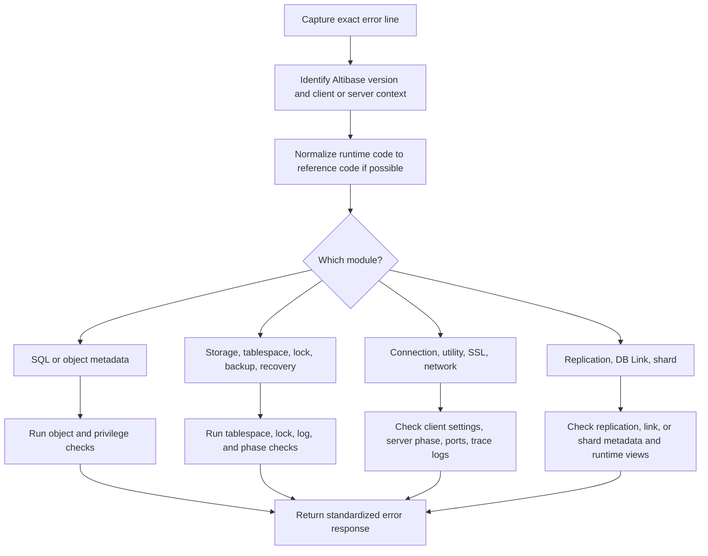

# 07. Error Messages and Troubleshooting

## Applicable Versions

- 7.1: Based on Altibase 7.1 Error Message Reference.
- 7.3: Based on Altibase 7.3 Error Message Reference.
- 8.1: Based on Altibase 8.1 verified source Error Message Reference.

## Questions This File Can Answer

- What are the cause and action for covered/common Altibase error codes?
- How should a GPT answer when the user provides only `ERR-xxxxx`, an error message, or a trace log excerpt?
- Which log files, SQL checks, and commands should be requested for startup, SQL execution, connection, replication, SSL, LOB, JSON, regular expression, tablespace, and lock errors?
- Which errors are version-sensitive in 7.1, 7.3, and 8.1?
- How should an error response be formatted so the answer is consistent in any user language?

## Source Documents

- 7.1: Altibase 7.1 Error Message Reference.
- 7.3: Altibase 7.3 Error Message Reference.
- 8.1: Altibase 8.1 verified source Error Message Reference.

## Response Rules

- Answer explanations in the user's language.
- Keep SQL object names, function names, error codes, reference symbols, property names, commands, file paths, and environment variables literal.
- Preserve the exact error code and message the user provided. Do not translate or rewrite `ERR-31363`, `0x31363`, `qpERR_ABORT_QDB_TEMPORARY_TABLE_DDL_DISABLE`, `TEMPORARY_LOB_ENABLE`, `REGEXP_MODE`, `ALTIBASE_SSL_PORT_NO`, or similar tokens.
- If the user gives only an error code, ask for the full error line, Altibase version, SQL or command, and relevant trace log excerpt before making a final diagnosis.
- If the user gives an uncovered or not covered specific Altibase error code, preserve the supplied code and message, state that the exact cause/action is not covered here, set cause/action beyond the user's evidence to `Unknown from the supplied message`, and ask for the Altibase version, full error line, SQL or command, and relevant trace log excerpt. Do not infer cause, action, `SQLSTATE`, module, or severity from the prefix or code family alone.
- Runtime messages often appear as `[ERR-31363 : Cannot execute DDL when a temporary table is in use.]`. The Error Message Reference may list the same code as `0x31363 (201571)` with a reference symbol. Keep both forms when known.
- Treat placeholders such as `<0%s>`, `<1%d>`, and `<0%lu>` as values that Altibase substitutes at runtime. Do not ask users to type placeholders literally.
- If the reference action says to contact support, first collect version, exact command, SQL text, timestamp, trace log excerpts, OS error number if present, and reproduction steps.
- Do not expose internal source labels. Use `Altibase 8.1 verified source` for 8.1 material.

## Standard Error Response Format

Use this format for every customer-facing error explanation:

```text
Error Code:
Reference Symbol:
Module / Severity:
Message:
Applies To:
Symptom:
Primary Causes:
Immediate Action:
Check SQL or Command:
Version Cautions:
Escalation:
Related Document:
```

If one field is unknown, say `Unknown from the supplied message` instead of inventing it.

Short answers may compress the fields, but preserve the same order:

```text
Symptom -> Cause -> Action -> Check SQL or Command -> Version Cautions -> Escalation
```

## Error Code Normalization

When a runtime message uses `ERR-xxxxx`, normalize it without changing the user's literal code:

```text
Runtime form:   ERR-31363
Reference form: 0x31363 (201571)
Symbol:         qpERR_ABORT_QDB_TEMPORARY_TABLE_DDL_DISABLE
Message:        Cannot execute DDL when a temporary table is in use.
```

Rules:

- `ERR-31363` usually corresponds to reference code `0x31363`.
- Keep leading zeroes in runtime codes such as `ERR-00000`.
- Do not convert a decimal value unless the reference entry explicitly provides it.
- Search by message text when a utility wraps the original server error.
- If the user supplies `SQLSTATE`, keep it in the answer, but do not infer `SQLSTATE` from an Altibase error code unless the driver reported it.

## Module and Severity Map

| Reference area | Typical prefix | Use this diagnosis lane |
| --- | --- | --- |
| ID Error Code | `idERR_*` | Infrastructure, OS calls, shared memory, semaphores, sockets, files, properties |
| SM Error Code | `smERR_*` | Storage manager, transactions, locks, log files, data files, tablespaces, backup, recovery |
| MT Error Code | `mtERR_*` | Data types, conversion, literals, date format, time zone, regular expression, JSON type support |
| RP Error Code | `rpERR_*` | Replication definition, sender, receiver, socket, handshake, sync, replication metadata |
| QP Error Code | `qpERR_*` | SQL parser, DDL, DML, metadata, objects, privileges, PSM, query execution |
| SD Error Code | `sdERR_*` | Sharding metadata, shard nodes, shard keys, shard SQL restrictions |
| ST Error Code | `stERR_*` | Spatial SQL and geometry operations |
| MM Error Code | `mmERR_*` | Main module, sessions, startup, shutdown, access mode, protocol checks |
| ODBC / CLI Error Code | `ulERR_*` | CLI, ODBC, client connection, fetch, bind, LOB, SSL client settings |
| APRE Error Code | `ulpERR_*` | Precompiler and embedded SQL |
| Utilities Error Code | `utERR_*` | `isql`, `iloader`, utilities, display, file, communication, LOB utility behavior |
| CM Error Code | `cmERR_*` | Communication module, SSL/TLS context, certificates, socket I/O |
| Database Link Error Code | `dkERR_*` | DB Link, AltiLinker, remote transaction, `dblink.conf` |
| Log Analyzer Error Code | `ulaERR_*` | Log Analyzer network and CDC-related processing |

Severity handling:

| Severity | Meaning for answer |
| --- | --- |
| `FATAL` | Treat as high risk. Collect trace logs, OS error numbers, startup phase, and version. Restart or recovery guidance must be careful and state impact. |
| `ABORT` | The current operation failed. Explain the cause, corrective action, and retry conditions. |
| `RETRY` | The reference expects retry after a condition clears. Explain what condition to verify before retrying. |
| `IGNORE` | Usually informational or non-fatal. Explain when it can be ignored and when to collect logs. |

## Triage Workflow



## Evidence to Request

Ask for this information when the error cannot be answered directly:

- Altibase version: `altibase -v` output, or `V$VERSION`.
- Exact command or SQL statement that failed.
- Exact error line and any preceding error lines.
- Whether the error came from server startup, `isql`, CLI/ODBC/JDBC, replication, DB Link, utility, or application code.
- Startup phase: `PROCESS`, `CONTROL`, `META`, or `SERVICE`, if the error is operational.
- Relevant trace logs around the timestamp, especially `altibase_boot.log`, `altibase_rp.log`, utility output, and the module trace log named in the error context.

Useful OS commands:

```bash
altibase -v
ls -ltr "$ALTIBASE_HOME/trc"
tail -200 "$ALTIBASE_HOME/trc/altibase_boot.log"
tail -200 "$ALTIBASE_HOME/trc/altibase_rp.log"
```

Use `altibase_rp.log` when the error prefix is `rpERR_*` or the message mentions replication sender, receiver, handshake, sync, or replication socket.

## Common Check SQL

Check version:

```sql
SELECT product_version,
       meta_version,
       protocol_version,
       repl_protocol_version
FROM V$VERSION;
```

Check properties used by troubleshooting answers:

```sql
SELECT name, value1, min, max
FROM V$PROPERTY
WHERE name IN (
  'PORT_NO',
  'REPLICATION_PORT_NO',
  'REPLICATION_RECEIVE_TIMEOUT',
  'LOCK_TIMEOUT',
  'QUERY_TIMEOUT',
  'REGEXP_MODE',
  'TEMPORARY_LOB_ENABLE',
  'MEMORY_TEMPLOB_MAX_ALLOC_SIZE',
  'MEMORY_TEMPLOB_PIECE_SIZE',
  'MEM_MAX_DB_SIZE',
  'VOLATILE_MAX_DB_SIZE',
  'TABLESPACE_LOCK_ENABLE'
)
ORDER BY name;
```

Check object existence:

```sql
SELECT u.user_name,
       t.table_id,
       t.table_name,
       t.table_type,
       t.tbs_name,
       t.is_partitioned,
       t.temporary,
       t.access
FROM SYSTEM_.SYS_TABLES_ t,
     SYSTEM_.SYS_USERS_ u
WHERE t.user_id = u.user_id
  AND u.user_name = '<OWNER_NAME>'
  AND t.table_name = '<OBJECT_NAME>';
```

Check columns:

```sql
SELECT c.column_order,
       c.column_name,
       c.data_type,
       c.precision,
       c.scale,
       c.is_nullable,
       c.store_type
FROM SYSTEM_.SYS_COLUMNS_ c,
     SYSTEM_.SYS_TABLES_ t,
     SYSTEM_.SYS_USERS_ u
WHERE c.user_id = t.user_id
  AND c.table_id = t.table_id
  AND t.user_id = u.user_id
  AND u.user_name = '<OWNER_NAME>'
  AND t.table_name = '<TABLE_NAME>'
ORDER BY c.column_order;
```

Check constraints:

```sql
SELECT cs.constraint_name,
       cs.constraint_type,
       cs.index_id,
       cs.column_cnt,
       cs.referenced_table_id,
       cs.delete_rule,
       cs.check_condition,
       cs.validated
FROM SYSTEM_.SYS_CONSTRAINTS_ cs,
     SYSTEM_.SYS_TABLES_ t,
     SYSTEM_.SYS_USERS_ u
WHERE cs.user_id = t.user_id
  AND cs.table_id = t.table_id
  AND t.user_id = u.user_id
  AND u.user_name = '<OWNER_NAME>'
  AND t.table_name = '<TABLE_NAME>'
ORDER BY cs.constraint_name;
```

Check tablespaces and data files:

```sql
SELECT id,
       name,
       type,
       state,
       datafile_count,
       total_page_count,
       allocated_page_count,
       page_size
FROM V$TABLESPACES
ORDER BY id;

SELECT id,
       name,
       spaceid,
       currsize,
       autoextend,
       opened,
       modified,
       state
FROM V$DATAFILES
ORDER BY spaceid, id;
```

Check locks and long-running statements:

```sql
SELECT *
FROM V$LOCK_WAIT;

SELECT session_id,
       id,
       execute_flag,
       query_start_time,
       query
FROM V$STATEMENT
WHERE execute_flag = 1
ORDER BY query_start_time;
```

Check replication:

```sql
SELECT rep_name,
       status,
       sender_ip,
       sender_port,
       peer_ip,
       peer_port,
       net_error_flag
FROM V$REPSENDER
ORDER BY rep_name;

SELECT rep_name,
       my_ip,
       my_port,
       peer_ip,
       peer_port,
       apply_xsn,
       insert_failure_count,
       update_failure_count,
       delete_failure_count
FROM V$REPRECEIVER
ORDER BY rep_name;

SELECT rep_name,
       rep_gap,
       rep_gap_size
FROM V$REPGAP
ORDER BY rep_name;
```

Check whether version-sensitive views exist before using them:

```sql
SELECT name, columncount
FROM V$TABLE
WHERE name IN ('V$TEMPORARY_LOBS', 'V$MEM_STABLE', 'V$LOCK_TABLE_STATS')
ORDER BY name;
```

## Searchable Error Blocks

### Error Block: Startup Connected to Idle Instance

Error Code: `0x910FB (594171)`; runtime messages can also show `[ERR-00000 : Connected to idle instance]`.

Reference Symbol: `utERR_ABORT_Connected_Idle_Instance_Error`.

Module / Severity: Utilities / `ABORT` in the reference, but the message itself is a notification.

Message: `Connected to idle instance`.

Applies To: `isql -sysdba` connections before the server reaches service phase.

Symptom: The user connects as `SYSDBA` and sees that the instance is idle.

Primary Causes: No error occurred. The utility connected to an idle Altibase instance.

Immediate Action: Start the database to the required phase, or continue with startup, recovery, or creation work if idle state is expected.

Check SQL or Command:

```sql
STARTUP PROCESS;
STARTUP CONTROL;
STARTUP META;
STARTUP SERVICE;
```

Version Cautions: Applies across 7.1, 7.3, and 8.1.

Related Document: Administration and Operations.

### Error Block: Communication Failure

Error Code: `ERR-91015` / `0x91015 (593941)`.

Reference Symbol: `utERR_ABORT_Comm_Failure_Error`.

Module / Severity: Utilities / `ABORT`.

Message: `Communication failure.`

Applies To: `isql`, utilities, client/server communication.

Symptom: The client loses communication with the DBMS server.

Primary Causes: The network connection was closed, the server is not running, the server is in the wrong phase, a port is wrong, or the client was disconnected.

Immediate Action: Check server status and startup phase. Verify host, port, listener availability, and `altibase_boot.log`.

Check SQL or Command:

```bash
ps -ef | grep altibase
tail -200 "$ALTIBASE_HOME/trc/altibase_boot.log"
```

```sql
SELECT product_version FROM V$VERSION;
```

Version Cautions: Applies across 7.1, 7.3, and 8.1. For SSL connections, also check the SSL-specific blocks below.

Related Document: Getting Started and Installation; Administration and Operations.

### Error Block: INET Socket Bind Failure

Error Code: `0x0001F (31)`.

Reference Symbol: `idERR_FATAL_idc_SVC_INET_BIND_ERROR`.

Module / Severity: ID / `FATAL`.

Message: `Unable to bind the INET socket.(<0%d>)`.

Applies To: Server startup and listener binding.

Symptom: Altibase cannot bind the configured TCP listener port.

Primary Causes: The port is already in use by another process, not yet released, or the configured port is wrong.

Immediate Action: Find the process using the port, stop it if appropriate, or change the Altibase port property.

Check SQL or Command:

```bash
netstat -an | grep '<PORT_NO>'
lsof -i :<PORT_NO>
tail -200 "$ALTIBASE_HOME/trc/altibase_boot.log"
```

Version Cautions: Applies across 7.1, 7.3, and 8.1. On systems without `lsof`, use the OS-native socket inspection command.

Related Document: Getting Started and Installation; Administration and Operations.

### Error Block: Insufficient Memory for Query Processor

Error Code: `0x311D6 (201174)`.

Reference Symbol: `qpERR_ABORT_MEMORY_ALLOCATION`.

Module / Severity: QP / `ABORT`.

Message: `Insufficient memory for Query Processor`.

Applies To: SQL parsing, optimization, execution, PSM, and memory-heavy statements.

Symptom: A SQL statement fails because the query processor cannot allocate enough memory.

Primary Causes: System memory pressure, too many concurrent memory-heavy statements, or memory-related properties that are too small for the workload.

Immediate Action: Check system memory, reduce concurrent workload, simplify the query if possible, and review memory properties.

Check SQL or Command:

```sql
SELECT name, value1
FROM V$PROPERTY
WHERE name LIKE '%MEMORY%'
   OR name LIKE '%MEM%';
```

Version Cautions: Applies across 7.1, 7.3, and 8.1. Do not recommend a property change without the exact version and workload context.

Related Document: Performance Tuning and Monitoring; Data Types and Properties.

### Error Block: Deadlock Detected

Error Code: `0x11041 (69697)`.

Reference Symbol: `smERR_ABORT_Aborted`.

Module / Severity: SM / `ABORT`.

Message: `A deadlock situation has been detected.`

Applies To: Concurrent transactions.

Symptom: One transaction is selected as the deadlock victim and rolled back.

Primary Causes: Two or more transactions lock resources in conflicting order.

Immediate Action: Re-execute the rolled-back transaction. For recurring cases, standardize update order and reduce transaction duration.

Check SQL or Command:

```sql
SELECT *
FROM V$LOCK_WAIT;

SELECT session_id,
       id AS stmt_id,
       tx_id,
       state,
       lock_item_type,
       table_oid,
       lock_desc,
       lock_cnt,
       is_grant,
       query
FROM V$LOCK_STATEMENT
ORDER BY is_grant, session_id, id;
```

Version Cautions: Applies across 7.1, 7.3, and 8.1.

Related Document: Administration and Operations; Performance Tuning and Monitoring.

### Error Block: Lock Timeout

Error Code: `0x11075 (69749)`.

Reference Symbol: `smERR_ABORT_smcExceedLockTimeWait`.

Module / Severity: SM / `ABORT`.

Message: `The transaction has exceeded the lock timeout specified by the user.`

Applies To: SQL waiting for row, table, or tablespace locks.

Symptom: A transaction cannot acquire a lock before timeout.

Primary Causes: A long-running transaction holds the required lock, or `LOCK_TIMEOUT` is too short for the workload.

Immediate Action: Identify the blocking transaction. Increase lock timeout only when it is operationally acceptable.

Check SQL or Command:

```sql
SELECT *
FROM V$LOCK_WAIT;

SELECT name, value1
FROM V$PROPERTY
WHERE name = 'LOCK_TIMEOUT';
```

Version Cautions: Applies across 7.1, 7.3, and 8.1.

Related Document: Administration and Operations; Data Dictionary and Performance Views.

### Error Block: Tablespace Does Not Have Enough Free Space

Error Code: `0x11123 (69923)`.

Reference Symbol: `smERR_ABORT_NOT_ENOUGH_SPACE`.

Module / Severity: SM / `ABORT`.

Message: `The tablespace does not have enough free space ( TBS Name :<0%s> ).`

Applies To: DML, index creation, DDL, and allocation in disk or memory tablespaces.

Symptom: A statement cannot allocate space in the target tablespace.

Primary Causes: The tablespace is full, no data file can extend, `AUTOEXTEND` is off, `MAXSIZE` is reached, or memory tablespace limits are reached.

Immediate Action: Add a data file, enable or adjust autoextend where appropriate, free space, or increase the relevant maximum size property after impact review.

Check SQL or Command:

```sql
SELECT id, name, type, state, total_page_count, allocated_page_count, page_size
FROM V$TABLESPACES
ORDER BY id;

SELECT name, spaceid, currsize, autoextend, state
FROM V$DATAFILES
ORDER BY spaceid, name;
```

Version Cautions: Memory, volatile, disk, undo, and temporary tablespaces have different remedies. Ask for tablespace type before giving DDL.

Related Document: Administration and Operations; SQL DDL Generation.

### Error Block: Tablespace Autoextend Is Off

Error Code: `0x110EF (69871)`.

Reference Symbol: `smERR_ABORT_UNABLE_TO_EXTEND_CHUNK_WHEN_AUTO_EXTEND_OFF`.

Module / Severity: SM / `ABORT`.

Message: `Unable to extend the tablespace(<0%s>) when AUTOEXTEND mode is OFF`.

Applies To: Tablespace allocation.

Symptom: The tablespace reaches its allocated size and cannot extend.

Primary Causes: `AUTOEXTEND` is disabled for the relevant data file or tablespace.

Immediate Action: Use documented `ALTER TABLESPACE ... AUTOEXTEND ON` syntax for the tablespace type, add a data file, or free space.

Check SQL or Command:

```sql
SELECT name, spaceid, currsize, autoextend, state
FROM V$DATAFILES
ORDER BY spaceid, name;
```

Version Cautions: Confirm disk versus memory or volatile tablespace before generating the exact DDL.

Related Document: Administration and Operations; SQL DDL Generation.

### Error Block: Tablespace Not Found

Error Code: `0x311D8 (201176)`.

Reference Symbol: `qpERR_ABORT_QDT_NOT_EXIST_TBS`.

Module / Severity: QP / `ABORT`.

Message: `Tablespace not found. The name of the specified tablespace was not found in the database.`

Applies To: DDL that names a tablespace.

Symptom: A DDL statement fails because the named tablespace cannot be resolved.

Primary Causes: Misspelled tablespace name, wrong owner assumptions, dropped tablespace, or version-specific DDL copied from another environment.

Immediate Action: Verify the tablespace exists and use the exact stored name.

Check SQL or Command:

```sql
SELECT id, name, type, state
FROM V$TABLESPACES
WHERE name = '<TABLESPACE_NAME>';
```

Version Cautions: Applies across 7.1, 7.3, and 8.1.

Related Document: Administration and Operations; Data Dictionary and Performance Views.

### Error Block: Tablespace Has Objects

Error Code: `0x311DD (201181)`.

Reference Symbol: `qpERR_ABORT_QDT_OBJECT_EXIST`.

Module / Severity: QP / `ABORT`.

Message: `The tablespace has objects.`

Applies To: `DROP TABLESPACE`.

Symptom: A tablespace cannot be dropped because objects still exist in it.

Primary Causes: Tables, indexes, LOB segments, or dependent objects remain in the tablespace.

Immediate Action: Identify and drop or move objects explicitly, or use the documented `DROP TABLESPACE ... INCLUDING CONTENTS` form only after confirming impact and backup status.

Check SQL or Command:

```sql
SELECT u.user_name,
       t.table_name,
       t.table_type,
       t.tbs_name
FROM SYSTEM_.SYS_TABLES_ t,
     SYSTEM_.SYS_USERS_ u
WHERE t.user_id = u.user_id
  AND t.tbs_name = '<TABLESPACE_NAME>'
ORDER BY u.user_name, t.table_name;
```

Version Cautions: Do not drop system, undo, or temporary tablespaces. State destructive impact before providing `DROP TABLESPACE`.

Related Document: Administration and Operations.

### Error Block: SQL Syntax Error

Error Code: `ERR-31001` / `0x31001 (200705)`.

Reference Symbol: `qpERR_ABORT_QCP_SYNTAX`.

Module / Severity: QP / `ABORT`.

Message: `SQL syntax error <0%s>`.

Applies To: SQL parser.

Symptom: Altibase rejects a SQL statement before execution.

Primary Causes: Unsupported delimiter, reserved word misuse, invalid grammar, misplaced clause, or syntax copied from another DBMS.

Immediate Action: Check Altibase SQL Reference for the target version and simplify the statement until the failing clause is isolated.

Check SQL or Command:

```sql
-- Check object and column names separately before blaming syntax.
SELECT u.user_name, t.table_name, t.table_type
FROM SYSTEM_.SYS_TABLES_ t, SYSTEM_.SYS_USERS_ u
WHERE t.user_id = u.user_id
  AND u.user_name = '<OWNER_NAME>'
  AND t.table_name = '<TABLE_NAME>';
```

Version Cautions: Confirm 7.1, 7.3, or 8.1 before using newer syntax.

Related Document: SQL DDL Generation; SQL DML and Oracle Compatibility.

### Error Block: Unsupported Syntax

Error Code: `ERR-31003` / `0x31003 (200707)`.

Reference Symbol: `qpERR_ABORT_QCP_NOT_SUPPORTED_SYNTAX`.

Module / Severity: QP / `ABORT`.

Message: `Unsupported syntax`.

Applies To: SQL parser.

Symptom: The statement is valid in another SQL dialect or later Altibase version but not supported in the current context.

Primary Causes: Oracle-specific syntax, feature not available in the target Altibase version, or unsupported option in the statement.

Immediate Action: Rewrite using supported Altibase syntax and state the version-specific alternative.

Check SQL or Command:

```sql
SELECT product_version, meta_version
FROM V$VERSION;
```

Version Cautions: Some SQL features differ between 7.1, 7.3, and 8.1. JSON SQL is 8.1-specific in this attachment set.

Related Document: SQL DDL Generation; SQL DML and Oracle Compatibility.

### Error Block: Object Name Already Exists

Error Code: `ERR-31022` / `0x31022 (200738)`.

Reference Symbol: `qpERR_ABORT_QDB_EXIST_OBJECT_NAME`.

Module / Severity: QP / `ABORT`.

Message: `The name is already used by an existing object.`

Applies To: `CREATE TABLE`, `CREATE VIEW`, `CREATE SEQUENCE`, and other object creation statements.

Symptom: A DDL statement tries to create an object with a name already used by that user.

Primary Causes: Existing table, view, sequence, queue, or synonym-like object with the same name.

Immediate Action: Use a unique name, drop or rename the existing object after impact review, or generate idempotent deployment logic outside Altibase if needed.

Check SQL or Command:

```sql
SELECT u.user_name,
       t.table_name,
       t.table_type,
       t.created,
       t.last_ddl_time
FROM SYSTEM_.SYS_TABLES_ t,
     SYSTEM_.SYS_USERS_ u
WHERE t.user_id = u.user_id
  AND u.user_name = '<OWNER_NAME>'
  AND t.table_name = '<OBJECT_NAME>';
```

Version Cautions: Use exact stored case for quoted identifiers.

Related Document: SQL DDL Generation; Data Dictionary and Performance Views.

### Error Block: User, Table, Column, Sequence, Index, or Replication Not Found

Error Code: `ERR-31010`, `ERR-31011`, `ERR-31012`, `ERR-31013`, `ERR-31014`, `ERR-31017`.

Reference Symbol: `qpERR_ABORT_QCM_NOT_EXIST_USER`, `qpERR_ABORT_QCM_NOT_EXIST_TABLE`, `qpERR_ABORT_QCM_NOT_EXIST_COLUMN`, `qpERR_ABORT_QCM_NOT_EXIST_SEQUENCE`, `qpERR_ABORT_QCM_NOT_EXISTS_INDEX`, `qpERR_ABORT_QCM_REPL_NOT_FOUND`.

Module / Severity: QP / `ABORT`.

Message: `User not found`, `Table not found`, `Column not found`, `Sequence not found`, `Index not found`, or `Replication not found`.

Applies To: DDL, DML, replication DDL, and dictionary-dependent SQL.

Symptom: Altibase cannot resolve an object referenced by the SQL statement.

Primary Causes: Wrong owner, typo, missing object, quoted identifier case mismatch, or running against the wrong database.

Immediate Action: Verify the owner-qualified object name and the current connection user.

Check SQL or Command:

```sql
-- User check.
SELECT user_name
FROM SYSTEM_.SYS_USERS_
WHERE user_name = '<OWNER_NAME>';

-- Table, view, queue, or sequence-style object check.
SELECT u.user_name, t.table_name, t.table_type
FROM SYSTEM_.SYS_TABLES_ t,
     SYSTEM_.SYS_USERS_ u
WHERE t.user_id = u.user_id
  AND u.user_name = '<OWNER_NAME>'
  AND t.table_name = '<OBJECT_NAME>';

-- Column check.
SELECT u.user_name, t.table_name, c.column_name
FROM SYSTEM_.SYS_USERS_ u,
     SYSTEM_.SYS_TABLES_ t,
     SYSTEM_.SYS_COLUMNS_ c
WHERE u.user_id = t.user_id
  AND t.user_id = c.user_id
  AND t.table_id = c.table_id
  AND u.user_name = '<OWNER_NAME>'
  AND t.table_name = '<TABLE_NAME>'
  AND c.column_name = '<COLUMN_NAME>';

-- Index check.
SELECT u.user_name, t.table_name, i.index_name
FROM SYSTEM_.SYS_USERS_ u,
     SYSTEM_.SYS_TABLES_ t,
     SYSTEM_.SYS_INDICES_ i
WHERE u.user_id = t.user_id
  AND t.table_id = i.table_id
  AND u.user_name = '<OWNER_NAME>'
  AND t.table_name = '<TABLE_NAME>'
  AND i.index_name = '<INDEX_NAME>';

-- Replication definition and host checks.
SELECT replication_name, is_started, repl_mode, role
FROM SYSTEM_.SYS_REPLICATIONS_
WHERE replication_name = '<REPLICATION_NAME>';

SELECT replication_name, host_ip, port_no, conn_type
FROM SYSTEM_.SYS_REPL_HOSTS_
WHERE replication_name = '<REPLICATION_NAME>';
```

Version Cautions: Applies across 7.1, 7.3, and 8.1.

Related Document: Data Dictionary and Performance Views.

### Error Block: Insufficient Privileges

Error Code: `0x311B1 (201137)`, `0x31293 (201363)`, `0x4107C (266364)`.

Reference Symbol: `qpERR_ABORT_QDP_INSUFFICIENT_PRIVILEGES`, `qpERR_ABORT_QCI_NotPermittedUser`, `mmERR_ABORT_INSUFFICIENT_PRIV`.

Module / Severity: QP or MM / `ABORT`.

Message: `The user must have <0%s> privilege(s) to execute this statement.`, `Unauthorized user.`, or `Insufficient privileges. The user has to connect as SYSDBA.`

Applies To: DDL, DBA operations, startup, shutdown, backup, recovery, and administrative SQL.

Symptom: The statement is rejected because the connected user lacks the required system, object, or `SYSDBA` privilege.

Primary Causes: Wrong user, missing grant, attempting `SYSDBA` work without `-sysdba`, or operation restricted to `SYS` or `SYSTEM_`.

Immediate Action: Connect with the correct user or ask a DBA to grant the required privilege. Do not suggest direct DML on meta tables.

Check SQL or Command:

```bash
isql -u sys -p '<password>' -sysdba
```

```sql
SELECT user_name
FROM SYSTEM_.SYS_USERS_
WHERE user_name = '<USER_NAME>';
```

Version Cautions: Applies across 7.1, 7.3, and 8.1. Explain least-privilege alternatives for application users.

Related Document: Administration and Operations; SQL DDL Generation.

### Error Block: Unique Constraint or Unique Index Violation

Error Code: `0x11058 (69720)`.

Reference Symbol: `smERR_ABORT_smnUniqueViolation`.

Module / Severity: SM / `ABORT`.

Message: `The row already exists in a unique index.`

Applies To: `INSERT`, `UPDATE`, `MERGE`, replication apply, and unique index maintenance.

Symptom: A row cannot be inserted or updated because the target unique key already exists.

Primary Causes: Duplicate key values, wrong sequence value, application retry without idempotency, or replication conflict.

Immediate Action: Check the unique index or constraint columns, then correct the input data or resolve the duplicate row.

Check SQL or Command:

```sql
SELECT cs.constraint_name,
       cs.constraint_type,
       cs.index_id,
       cs.column_cnt
FROM SYSTEM_.SYS_CONSTRAINTS_ cs,
     SYSTEM_.SYS_TABLES_ t,
     SYSTEM_.SYS_USERS_ u
WHERE cs.user_id = t.user_id
  AND cs.table_id = t.table_id
  AND t.user_id = u.user_id
  AND u.user_name = '<OWNER_NAME>'
  AND t.table_name = '<TABLE_NAME>'
  AND cs.constraint_type IN (2, 3, 6)
ORDER BY cs.constraint_name;
```

Version Cautions: Replication conflicts require replication-specific investigation before changing data.

Related Document: SQL DDL Generation; Replication HA CDC.

### Error Block: Check or Referential Constraint Violation

Error Code: `0x31392 (201618)`, `0x31076 (200822)`, `0x31077 (200823)`.

Reference Symbol: `qpERR_ABORT_QDN_VIOLATE_CHECK_CONSTRAINT`, `qpERR_ABORT_QMX_CHILD_EXIST`, `qpERR_ABORT_QMX_NOT_FOUND_PARENT_ROW`.

Module / Severity: QP / `ABORT`.

Message: `Check constraint <0%s> violated`, `Unable to modify records that have child records`, or `The parent record was not found`.

Applies To: `INSERT`, `UPDATE`, `DELETE`, and DDL touching constrained columns.

Symptom: DML violates a `CHECK`, `FOREIGN KEY`, or parent-child relationship.

Primary Causes: Input rows do not meet check conditions, deleting parent rows with child rows, or inserting child rows without parent rows.

Immediate Action: Query the related constraints, inspect offending data, and fix DML order or data values.

Check SQL or Command:

```sql
SELECT cs.constraint_name,
       cs.constraint_type,
       cs.referenced_table_id,
       cs.delete_rule,
       cs.check_condition
FROM SYSTEM_.SYS_CONSTRAINTS_ cs,
     SYSTEM_.SYS_TABLES_ t,
     SYSTEM_.SYS_USERS_ u
WHERE cs.user_id = t.user_id
  AND cs.table_id = t.table_id
  AND t.user_id = u.user_id
  AND u.user_name = '<OWNER_NAME>'
  AND t.table_name = '<TABLE_NAME>'
ORDER BY cs.constraint_name;
```

Version Cautions: Constraint metadata is available across 7.1, 7.3, and 8.1.

Related Document: Data Dictionary and Performance Views; SQL DML and Oracle Compatibility.

### Error Block: Conversion, Invalid Literal, or Value Overflow

Error Code: `0x2100C (135180)`, `0x21010 (135184)`, `0x21011 (135185)`, `0x21048 (135240)`.

Reference Symbol: `mtERR_ABORT_CONVERSION_NOT_APPLICABLE`, `mtERR_ABORT_VALUE_OVERFLOW`, `mtERR_ABORT_INVALID_LITERAL`, `mtERR_ABORT_OVERFLOW`.

Module / Severity: MT / `ABORT`.

Message: `Conversion not applicable.`, `Value overflow`, `Invalid literal`, or `Out of range of value supported by the type`.

Applies To: casts, implicit conversion, `INSERT`, `UPDATE`, function arguments, and bind values.

Symptom: Altibase cannot convert a value to the target type or the value exceeds the target type range.

Primary Causes: Wrong literal format, incompatible source and target types, precision or scale too small, or application bind type mismatch.

Immediate Action: Check source value, target column type, precision, scale, and bind type. Use explicit casts only when supported and safe.

Check SQL or Command:

```sql
SELECT c.column_name,
       c.data_type,
       c.precision,
       c.scale,
       c.is_nullable
FROM SYSTEM_.SYS_COLUMNS_ c,
     SYSTEM_.SYS_TABLES_ t,
     SYSTEM_.SYS_USERS_ u
WHERE c.user_id = t.user_id
  AND c.table_id = t.table_id
  AND t.user_id = u.user_id
  AND u.user_name = '<OWNER_NAME>'
  AND t.table_name = '<TABLE_NAME>'
ORDER BY c.column_order;
```

Version Cautions: JSON and Temporary LOB conversion errors are 8.1-sensitive; use JSON blocks below for JSON-specific messages.

Related Document: Data Types and Properties; SQL DML and Oracle Compatibility.

### Error Block: Date Format or Date Literal Error

Error Code: `0x21032 (135218)`, `0x21039 (135225)`, `0x2103A (135226)`.

Reference Symbol: `mtERR_ABORT_DATE_NOT_ENOUGH_INPUT`, `mtERR_ABORT_DATE_NOT_RECOGNIZED_FORMAT`, `mtERR_ABORT_DATE_NON_NUMERIC_INPUT`.

Module / Severity: MT / `ABORT`.

Message: Date literal is too short, date format was not recognized, or non-numeric input appeared where numeric input was expected.

Applies To: date conversion functions, date literals, application bind strings.

Symptom: A date or timestamp value cannot be parsed.

Primary Causes: Input value does not match the format model, invalid format token, missing digits, or non-numeric character in a numeric date field.

Immediate Action: Make the input string and format model match exactly. Validate year, month, day, hour, minute, second, and fractional second ranges.

Check SQL or Command:

```sql
-- Reproduce with one literal at a time.
SELECT TO_DATE('<DATE_TEXT>', '<FORMAT_MODEL>')
FROM DUAL;
```

Version Cautions: Date format support can vary. Confirm the target version before recommending format tokens.

Related Document: Data Types and Properties; SQL DML and Oracle Compatibility.

### Error Block: Regular Expression PCRE2 Character Set Error

Error Code: `0x2106B (135275)`, `0x2106C (135276)`.

Reference Symbol: `mtERR_ABORT_PCRE2_NOT_SUPPORTED_ENCODING`, `mtERR_ABORT_PCRE2_UNEXPECTED_ERROR`.

Module / Severity: MT / `ABORT`.

Message: `Unsupported character set by PCRE2 library` or `error: <1%s> (occurred in <0%s>)`.

Applies To: regular expression functions when `REGEXP_MODE` is `1`.

Symptom: A regular expression statement fails because the server character set is not supported by PCRE2, or PCRE2 reports an unexpected error.

Primary Causes: `REGEXP_MODE=1` with an unsupported Altibase server character set, invalid pattern, or PCRE2 runtime error.

Immediate Action: Branch by error code. For `0x2106B`, check `REGEXP_MODE`, server character set, and pattern; if the character set is unsupported, set `REGEXP_MODE` to `0` or plan a database recreation with a supported character set. For `0x2106C`, collect the PCRE2 detail text, Altibase version, SQL text, `REGEXP_MODE`, server character set, and trace context before escalating to Altibase Support.

Check SQL or Command:

```sql
SELECT name, value1
FROM V$PROPERTY
WHERE name = 'REGEXP_MODE';
```

Version Cautions: Applies to versions whose Error Message Reference includes PCRE2 regular expression processing. Ask for version and character set before recommending database recreation.

Related Document: SQL DML and Oracle Compatibility; Data Types and Properties.

### Error Block: DDL Blocked by Temporary Table in Use

Error Code: `ERR-31363` / `0x31363 (201571)`.

Reference Symbol: `qpERR_ABORT_QDB_TEMPORARY_TABLE_DDL_DISABLE`.

Module / Severity: QP / `ABORT`.

Message: `Cannot execute DDL when a temporary table is in use.`

Applies To: DDL on an object that has active temporary table usage.

Symptom: DDL fails while one or more related temporary tables are in use.

Primary Causes: Temporary tables based on the target table are active in a session.

Immediate Action: Identify the related temporary table usage. The primary source action is to truncate all temporary tables based on the target table and retry. Ending a session or transaction is an operational fallback only after owner/session confirmation and impact review.

Check SQL or Command:

```sql
SELECT u.user_name,
       t.table_name,
       t.temporary,
       t.tbs_name
FROM SYSTEM_.SYS_TABLES_ t,
     SYSTEM_.SYS_USERS_ u
WHERE t.user_id = u.user_id
  AND u.user_name = '<OWNER_NAME>'
  AND t.table_name = '<TABLE_NAME>';
```

Version Cautions: The same runtime code appears in 7.1, 7.3, and 8.1.

Diagnostic caution: Do not invent a session-kill query for this error unless the target version source provides a supported way to identify the temporary table and owning session.

Escalation: If the blocking session or temporary table cannot be identified from dictionary checks and trace logs, collect the exact DDL, owner and object name, active session list, and version before escalating.

Related Document: Administration and Operations; SQL DDL Generation.

### Error Block: LOB Operation in Autocommit Mode

Error Code: `0x314B4 (201908)`, `0x5112C (332076)`, `0x91101 (594177)`.

Reference Symbol: `qpERR_ABORT_QMX_LOB_AUTOCOMMIT_MODE`, `ulERR_ABORT_LOB_AUTOCOMMIT_MODE_ERR`, `utERR_ABORT_LOB_AUTOCOMMIT_MODE_ERR`.

Module / Severity: QP, CLI/ODBC, or Utilities / `ABORT`.

Message: `The connection is in autocommit mode. The operation cannot operate on LOB data in autocommit mode.`

Applies To: SQL LOB operations, CLI/ODBC LOB APIs, and utility LOB processing.

Symptom: LOB read/write fails while autocommit is enabled.

Primary Causes: LOB locators require transaction scope. Autocommit ends the transaction too early for the LOB operation.

Immediate Action: Turn off autocommit, perform the LOB operation inside an explicit transaction, then `COMMIT` or `ROLLBACK`.

Check SQL or Command:

```sql
AUTOCOMMIT OFF;
-- Execute LOB read or write operation here.
COMMIT;
```

Version Cautions: LOB autocommit errors appear in 7.3 and 8.1 sources. For 8.1 JSON and Temporary LOB, also check `TEMPORARY_LOB_ENABLE`.

Related Document: Data Types and Properties; C CLI ODBC Precompiler; Utilities Operation Tools.

### Error Block: JSON Type Cannot Be Used Because Temporary LOB Is Disabled

Error Code: `0x2106D (135277)`.

Reference Symbol: `mtERR_ABORT_JSON_WITHOUT_TEMPLOB`.

Module / Severity: MT / `ABORT`.

Message: `JSON type cannot be used when the TEMPORARY_LOB_ENABLE property is disabled.`

Applies To: Altibase 8.1 JSON usage.

Symptom: JSON SQL or JSON type handling fails immediately.

Primary Causes: `TEMPORARY_LOB_ENABLE` is disabled.

Immediate Action: Check whether `TEMPORARY_LOB_ENABLE` is enabled and apply the documented property change procedure for the target environment.

Check SQL or Command:

```sql
SELECT name, value1, min, max
FROM V$PROPERTY
WHERE name IN (
  'TEMPORARY_LOB_ENABLE',
  'MEMORY_TEMPLOB_MAX_ALLOC_SIZE',
  'MEMORY_TEMPLOB_PIECE_SIZE'
)
ORDER BY name;
```

Version Cautions: Treat this as 8.1-specific unless the user proves the same feature exists in their target version.

Related Document: Data Types and Properties; SQL DML and Oracle Compatibility.

### Error Block: JSON Function Return or Path Error

Error Code: `0x314BC` through `0x314CA`.

Reference Symbol: `qpERR_ABORT_JSON_INVALID_TYPE`, `qpERR_ABORT_JSON_NUMBER_OVERFLOW`, `qpERR_ABORT_JSON_EXCEEDED_OBJECT_MAX_DEPTH`, `qpERR_ABORT_JSON_EMPTY_RESULTS`, `qpERR_ABORT_JSON_WRAPPER_IS_NEEDED`, `qpERR_ABORT_JSON_DEFAULT_VALUE_TOO_LONG`, `qpERR_ABORT_JSON_INVALID_KEY_TYPE`, `qpERR_ABORT_JSON_OBJECT_INCOMPLETE`, `qpERR_ABORT_JSON_TEXT_OVERFLOW`, `qpERR_ABORT_JSON_INVALID_JSON_PATH`, `qpERR_ABORT_JSON_INVALID_JSON_DATA`, `qpERR_ABORT_JSON_INAPPROPRIATE_JSON_PATH_VALUE`, `qpERR_ABORT_JSON_MULTIPLE_RESULTS`, `qpERR_ABORT_JSON_FAILED_TO_CONVERT_NUMERIC`, `qpERR_ABORT_JSON_RETURNS_NON_SCALAR_VALUE`.

Module / Severity: QP / `ABORT`.

Message: JSON function returned an unsupported type, overflowed, exceeded maximum object depth, found no result, required an array wrapper, received invalid JSON data, received an invalid JSON path, returned multiple results, failed numeric conversion, or returned non-scalar values.

Applies To: Altibase 8.1 JSON functions and JSON path processing.

Symptom: JSON SQL fails during return value processing, path evaluation, or JSON data validation.

Primary Causes: Invalid JSON data, invalid JSON path expression, multiple path matches without wrapper, wrong `RETURNING` type, returned value too long, numeric overflow, non-scalar result, or invalid `JSON_OBJECT` key-value arguments.

Immediate Action: Validate the JSON data, path expression, `RETURNING` clause, wrapper option, and default value. For numeric returns, verify range and format.

Check SQL or Command:

```sql
-- Keep JSON path expressions literal and test one expression at a time.
SELECT name, value1
FROM V$PROPERTY
WHERE name = 'TEMPORARY_LOB_ENABLE';
```

Version Cautions: These JSON error blocks are based on Altibase 8.1 verified source. Do not apply them to 7.1 or 7.3 unless the user confirms equivalent JSON support.

Related Document: SQL DML and Oracle Compatibility; Data Types and Properties.

### Error Block: Replication Socket Read or Write Failure

Error Code: `0x61003 (397315)`, `0x61004 (397316)`.

Reference Symbol: `rpERR_ABORT_RP_READ_SOCKET`, `rpERR_ABORT_RP_WRITE_SOCKET`.

Module / Severity: RP / `ABORT`.

Message: `Unable to read from a socket` or `Unable to write to a socket`.

Applies To: replication sender and receiver network I/O.

Symptom: Replication disconnects or fails to transfer data.

Primary Causes: Network error, peer server down, timeout, firewall, wrong port, or remote replication process failure.

Immediate Action: Check local and remote `altibase_rp.log`, network connectivity, peer server status, replication timeout properties, and replication gap.

Check SQL or Command:

```bash
tail -200 "$ALTIBASE_HOME/trc/altibase_rp.log"
```

```sql
SELECT rep_name,
       status,
       sender_ip,
       sender_port,
       peer_ip,
       peer_port,
       net_error_flag
FROM V$REPSENDER
ORDER BY rep_name;

SELECT rep_name,
       my_ip,
       my_port,
       peer_ip,
       peer_port,
       apply_xsn,
       insert_failure_count,
       update_failure_count,
       delete_failure_count
FROM V$REPRECEIVER
ORDER BY rep_name;
```

Version Cautions: Applies across 7.1, 7.3, and 8.1. For 8.1 replication SSL, also check SSL blocks and replication SSL settings.

Related Document: Replication HA CDC; Security SSL TLS.

### Error Block: Replication Handshake or Sender Start Failure

Error Code: `0x6100D (397325)`, `0x61010 (397328)`, `0x6102D (397357)`.

Reference Symbol: `rpERR_ABORT_RP_SENDER_HANDSHAKE`, `rpERR_ABORT_RP_SENDER_START`, `rpERR_ABORT_LISTEN`.

Module / Severity: RP / `ABORT`.

Message: `[Sender] Failed to handshake with the peer server`, `[Sender] Failed to start the sender thread`, or `[Receiver] Failed to listen to a replication socket`.

Applies To: replication startup, sender/receiver connection, and replication socket listener.

Symptom: Replication cannot start or cannot connect to the peer.

Primary Causes: Network or server error, mismatched replication definitions, peer database down, `REPLICATION_PORT_NO` occupied, or wrong IP and port.

Immediate Action: Verify both replication definitions, peer server status, `REPLICATION_PORT_NO`, and whether another process uses the port.

Check SQL or Command:

```sql
SELECT name, value1
FROM V$PROPERTY
WHERE name IN ('REPLICATION_PORT_NO', 'REPLICATION_RECEIVE_TIMEOUT');

SELECT rep_name,
       status,
       sender_ip,
       sender_port,
       peer_ip,
       peer_port,
       net_error_flag
FROM V$REPSENDER
ORDER BY rep_name;
```

Version Cautions: For SSL replication in 8.1, verify SSL configuration on both peers.

Related Document: Replication HA CDC; Security SSL TLS.

### Error Block: Duplicate Replication Name or Endpoint

Error Code: `0x61100 (397568)`.

Reference Symbol: `rpERR_ABORT_RPC_DUPLICATE_REPLICATION`.

Module / Severity: RP / `ABORT`.

Message: `Duplicate replication names. The replication name already exists in the database.`

Applies To: `CREATE REPLICATION`.

Symptom: A replication definition cannot be created.

Primary Causes: The replication name already exists, or the IP address and port number are not unique.

Immediate Action: Use a different replication name or remove the existing definition after impact review.

Check SQL or Command:

```sql
-- Primary check: replication definitions, including stopped or not-yet-started objects.
SELECT replication_name, is_started, repl_mode, role
FROM SYSTEM_.SYS_REPLICATIONS_
WHERE replication_name = '<REPLICATION_NAME>'
ORDER BY replication_name;

SELECT replication_name, host_ip, port_no, conn_type
FROM SYSTEM_.SYS_REPL_HOSTS_
WHERE replication_name = '<REPLICATION_NAME>'
   OR (host_ip = '<PEER_HOST>' AND port_no = <PEER_PORT>)
ORDER BY replication_name, host_ip, port_no;

-- Secondary runtime check after a definition is known to exist.
SELECT rep_name, status, sender_ip, sender_port, peer_ip, peer_port, net_error_flag
FROM V$REPSENDER
WHERE rep_name = '<REPLICATION_NAME>'
ORDER BY rep_name;

SELECT rep_name, rep_gap, rep_gap_size
FROM V$REPGAP
WHERE rep_name = '<REPLICATION_NAME>'
ORDER BY rep_name;
```

Version Cautions: Applies across 7.1, 7.3, and 8.1.

Related Document: Replication HA CDC; SQL DDL Generation.

### Error Block: Client SSL Configuration Failure

Error Code: `0x5120C (332300)`, `0x5120D (332301)`, `0x5120E (332302)`, `0x5121D (332317)`, `0x5121E (332318)`.

Reference Symbol: `ulERR_ABORT_SSL_OPERATION_FAILURE`, `ulERR_ABORT_SSL_LIBRARY_ERROR`, `ulERR_ABORT_SSL_LINK_FAILURE`, `ulERR_ABORT_INVALID_ALTIBASE_SSL_PORT_NO`, `ulERR_ABORT_PORT_NO_ALTIBASE_SSL_PORT_NO_NOT_SET`.

Module / Severity: CLI/ODBC / `ABORT`.

Message: SSL operation failure, failed to load OpenSSL library, SSL link failure, invalid `ALTIBASE_SSL_PORT_NO`, or missing SSL port.

Applies To: CLI, ODBC, and client connection strings using SSL.

Symptom: Client cannot establish SSL connection.

Primary Causes: OpenSSL library not installed or not found, SSL operation failure, SSL port omitted, invalid `ALTIBASE_SSL_PORT_NO`, or connection string missing `PORT_NO`.

Immediate Action: Set `PORT_NO` in the connection string or set `ALTIBASE_SSL_PORT_NO`, verify OpenSSL library installation, and check detailed client error text.

Check SQL or Command:

```bash
echo "$ALTIBASE_SSL_PORT_NO"
altibase -v
```

Version Cautions: 7.1, 7.3, and 8.1 sources include SSL client errors. Confirm client library version matches server expectations.

Escalation: If the client library, OpenSSL library, `PORT_NO`, and `ALTIBASE_SSL_PORT_NO` are correct but the connection still fails, collect the client trace, detailed OpenSSL error text, server version, client version, and connection string with secrets removed.

Related Document: Security SSL TLS; C CLI ODBC Precompiler.

### Error Block: Server SSL Certificate or Handshake Failure

Error Code: `0x710A0` through `0x710AB`.

Reference Symbol: `cmERR_ABORT_INVALID_CERTIFICATE`, `cmERR_ABORT_INVALID_PRIVATE_KEY`, `cmERR_ABORT_PRIVATE_KEY_VERIFICATION`, `cmERR_ABORT_SSL_HANDSHAKE`, `cmERR_ABORT_SSL_READ`, `cmERR_ABORT_SSL_WRITE`, `cmERR_ABORT_SSL_SHUTDOWN`, `cmERR_ABORT_INVALID_VERIFY_LOCATION`, `cmERR_ABORT_INVALID_CA_LIST_FILE`, `cmERR_ABORT_SSL_CONNECT`, `cmERR_ABORT_VERIFY_PEER_CERITIFICATE`, `cmERR_ABORT_SSL_OPERATION`.

Module / Severity: CM / `ABORT`.

Message: SSL certificate, private key, CA, peer certificate, handshake, read, write, connect, shutdown, or operation failure.

Applies To: server-side SSL/TLS and communication module.

Symptom: SSL listener or SSL connection fails.

Primary Causes: Invalid certificate path, invalid private key path, private key does not match certificate, invalid CA path, peer certificate verification failure, or SSL handshake failure.

Immediate Action: Verify certificate, private key, CA file, CA path, and peer certificate. Check `altibase_boot.log` for detailed SSL error text.

Check SQL or Command:

```bash
tail -200 "$ALTIBASE_HOME/trc/altibase_boot.log"
```

Version Cautions: In 8.1 replication SSL cases, check both server SSL settings and replication SSL settings.

Related Document: Security SSL TLS; Replication HA CDC.

### Error Block: Unsupported OpenSSL Version

Error Code: `0x710CB (463051)`.

Reference Symbol: `cmERR_ABORT_UNSUPPORTED_OPENSSL_VERSION`.

Module / Severity: CM / `ABORT`.

Message: `Unsupported OpenSSL version (<0%s>)`.

Applies To: SSL/TLS startup or connection.

Symptom: SSL initialization fails because the OpenSSL version is unsupported.

Primary Causes: OpenSSL version does not match the supported library version for the Altibase build.

Immediate Action: Check the installed OpenSSL version and align it with the version required by the target Altibase release.

Check SQL or Command:

```bash
openssl version
altibase -v
tail -200 "$ALTIBASE_HOME/trc/altibase_boot.log"
```

Version Cautions: Check the exact Altibase patch level and platform guidance before changing OpenSSL libraries.

Related Document: Security SSL TLS; Version Release Platform.

### Error Block: Shard Metadata or Shard Object Not Found

Error Code: `0xE1001 (921601)`, `0xE1003 (921603)`, `0xE1004 (921604)`, `0xE1065 (921701)`.

Reference Symbol: `sdERR_ABORT_SDM_SHARD_META_NOT_CREATED`, `sdERR_ABORT_SDM_SHARD_NODE_NOT_EXIST`, `sdERR_ABORT_SDM_SHARD_TABLE_NOT_EXIST`, `sdERR_ABORT_SDA_NOT_SUPPORTED_SQLTEXT_FOR_SHARD`.

Module / Severity: SD / `ABORT`.

Message: Shard metadata not created, shard data node not found, shard object not found, or SQL statement not supported in Altibase sharding.

Applies To: Altibase sharding metadata and shard SQL routing.

Symptom: Shard DDL or SQL fails because metadata, shard node, shard object, shard key, or supported SQL shape is missing or invalid.

Primary Causes: Shard metadata not initialized, wrong shard node name, wrong shard object name, unsupported statement for sharding, or invalid shard key condition.

Immediate Action: Verify shard metadata, shard node, object name, and whether the SQL statement is supported for sharding.

Check SQL or Command:

```bash
altibase -v
```

```sql
SELECT product_version, meta_version
FROM V$VERSION;
```

Version Cautions: Confirm the deployed sharding feature set for the exact Altibase version before generating shard DDL.

Related Document: SQL DDL Generation; Data Dictionary and Performance Views.

### Error Block: DB Link Configuration or Global Transaction Failure

Error Code: `0xC1005 (790533)`, `0xC1006 (790534)`, `0xC1007 (790535)`, `0xC1009 (790537)`, `0xC1030 (790576)`.

Reference Symbol: `dkERR_ABORT_DK_PARSING_DBLINK_CONF_FAILED`, `dkERR_ABORT_DK_OPEN_DBLINK_CONF_FAILED`, `dkERR_ABORT_DK_NO_HOME_DIRECTORY`, `dkERR_ABORT_DKM_GTX_PREPARE_PHASE_FAILED`, `dkERR_ABORT_DKT_GLOBAL_TX_NOT_PREPARED`.

Module / Severity: Database Link / `ABORT`.

Message: Cannot parse or open `dblink.conf`, `ALTIBASE_HOME` is not set, remote atomic transaction prepare failed, or global transaction not prepared to commit.

Applies To: DB Link and AltiLinker operations.

Symptom: DB Link setup, remote execution, or remote transaction processing fails.

Primary Causes: Invalid `dblink.conf`, missing `ALTIBASE_HOME`, network problem, protocol version inconsistency between Altibase and AltiLinker, or global transaction failure.

Immediate Action: Check `ALTIBASE_HOME`, `dblink.conf`, AltiLinker status, product versions, network, and trace log details.

Check SQL or Command:

```bash
echo "$ALTIBASE_HOME"
altibase -v
```

Version Cautions: DB Link behavior and supported remote features can vary by version and connector setup.

Related Document: DB Link and External Connectors.

## Topic Response Patterns

### Startup and Shutdown Errors

Use this order:

1. Identify exact error and startup phase.
2. Check `altibase_boot.log`.
3. Confirm `ALTIBASE_HOME`, ports, shared memory, semaphore, and file permissions.
4. For `FATAL` errors, avoid destructive recovery advice until backup and phase are known.
5. Return the standardized error block.

### SQL Execution Errors

Use this order:

1. Normalize error code.
2. Identify object names, owner, SQL type, and version.
3. Run object, column, constraint, privilege, and type checks.
4. Explain the corrected SQL or next diagnostic step.
5. Keep SQL identifiers literal in any answer language.

### Replication Errors

Use this order:

1. Identify local and remote Altibase versions.
2. Check `altibase_rp.log` on both nodes.
3. Check sender, receiver, and gap views.
4. Verify IP, port, replication name, table definitions, constraints, and SSL settings when applicable.
5. Avoid advising rebuild or reset until the replication mode and data consistency target are known.

### SSL Errors

Use this order:

1. Distinguish client SSL errors (`ulERR_*`) from server or communication module SSL errors (`cmERR_*`).
2. Check `PORT_NO`, `ALTIBASE_SSL_PORT_NO`, certificate paths, private key paths, CA file, CA path, and OpenSSL version.
3. For replication SSL, check both peer servers and the replication definition.
4. Include the detailed OpenSSL error text when present.

### JSON, Temporary LOB, and LOB Errors

Use this order:

1. Confirm version. JSON blocks in this attachment are 8.1-specific.
2. Check `TEMPORARY_LOB_ENABLE` for JSON and Temporary LOB behavior.
3. For LOB locator errors, check autocommit and transaction boundaries.
4. For JSON path errors, validate JSON data, JSON path expression, wrapper option, and `RETURNING` clause.

## Version Differences

- 7.1: Use 7.1 Error Message Reference wording when the customer reports a 7.1 system. Do not assume 8.1 JSON behavior.
- 7.3: Use 7.3 Error Message Reference wording when the customer reports a 7.3 system. SSL, regular expression, replication, and LOB errors should be checked against 7.3 wording.
- 8.1: Use Altibase 8.1 verified source for JSON, Temporary LOB, replication SSL, sharding, and current SSL/TLS behavior. JSON-specific error blocks such as `mtERR_ABORT_JSON_WITHOUT_TEMPLOB` and `qpERR_ABORT_JSON_*` are 8.1-sensitive.

## Residual Scope

- Add future error blocks only after source-backed review, and keep the standardized error format above.
