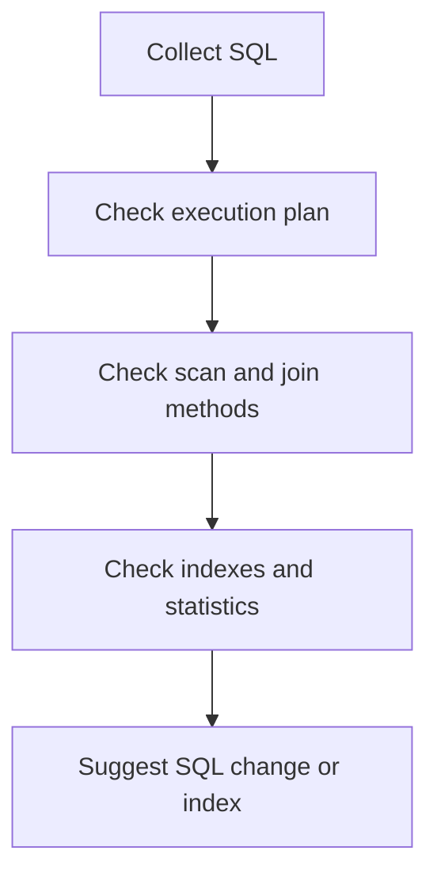

# 08. Performance Tuning and Monitoring

## Applicable Versions

- 7.1: Based on Altibase 7.1 Performance Tuning Guide.
- 7.3: Based on Altibase 7.3 Performance Tuning Guide.
- 8.1: Based on Altibase 8.1 verified source Performance Tuning Guide.

## Questions This File Can Answer

- How should execution plans be interpreted?
- What criteria guide index, join, and scan method choices?
- Which performance views should be checked to diagnose slow SQL?
- What is the 8.1 JSON-format execution plan?

## Source Documents

- 7.1: Altibase 7.1 Performance Tuning Guide; Monitoring API Developer's Guide; SNMP Agent Guide.
- 7.3: Altibase 7.3 Performance Tuning Guide; Monitoring API Developer's Guide; SNMP Agent Guide.
- 8.1: Altibase 8.1 verified source Performance Tuning Guide; Monitoring API Developer's Guide; SNMP Agent Guide.

## Core Guidance

- Tuning answers should consider the execution plan, index presence, statistics, join method, and whether tables are memory or disk based.
- Convert image-based plan trees to Mermaid or indented text.

## Version Differences

- 7.1: Use 7.1 execution plan and performance view behavior for 7.1 tuning answers.
- 7.3: Include 7.3 tuning, monitoring, or SNMP changes when they affect diagnostics.
- 8.1: Use Altibase 8.1 verified source for JSON-format plans and 8.1 performance view changes.

## Mermaid Conversion Candidate

## Conversion TODO

- Convert execution plan node images to Mermaid trees.
- Cross-reference major performance views with `06_data_dictionary_performance_views.md`.
- Cross-check the 8.1 JSON plan explanation against the release notes.
