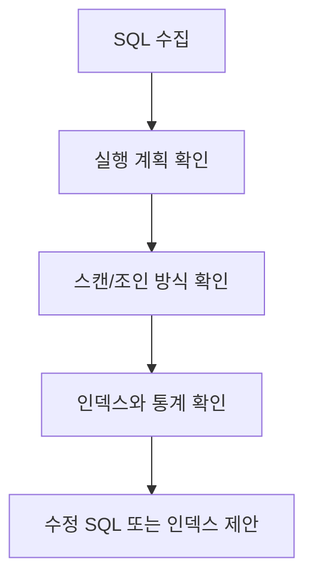

# 08. 성능 튜닝과 모니터링

## 적용 버전

- 7.1: Altibase 7.1 Performance Tuning 기준
- 7.3: Altibase 7.3 Performance Tuning 기준
- 8.1: Altibase 8.1 검증본 Performance Tuning 기준

## 이 문서로 답할 수 있는 질문

- 실행 계획을 어떻게 해석하는가?
- 인덱스, 조인, 스캔 방식 선택 기준은?
- 느린 SQL을 진단하려면 어떤 성능 뷰를 봐야 하는가?
- 8.1 JSON 형식 실행 계획은 무엇인가?

## 원천 문서

- 7.1: `Manuals/Altibase_7.1/kor/Performance Tuning Guide.md`, `Manuals/Altibase_7.1/kor/Monitoring API Developer's Guide.md`, `Manuals/Altibase_7.1/kor/SNMP Agent Guide.md`
- 7.3: `Manuals/Altibase_7.3/kor/Performance Tuning Guide.md`, `Manuals/Altibase_7.3/kor/Monitoring API Developer's Guide.md`, `Manuals/Altibase_7.3/kor/SNMP Agent Guide.md`
- 8.1 검증본: `Performance Tuning Guide.md`, `Monitoring API Developer's Guide.md`, `SNMP Agent Guide.md`

## 핵심 정리

- 튜닝 답변은 실행 계획, 인덱스 유무, 통계, 조인 방식, 메모리/디스크 테이블 여부를 함께 본다.
- 이미지 기반 plan tree는 Mermaid 또는 들여쓰기 텍스트로 변환한다.

## Mermaid 변환 후보

## 변환 TODO

- 실행 계획 노드 이미지를 Mermaid tree로 변환한다.
- 주요 성능 뷰는 `06_data_dictionary_performance_views.md`와 교차 참조한다.
- 8.1 JSON plan 설명을 릴리스 노트와 대조한다.
