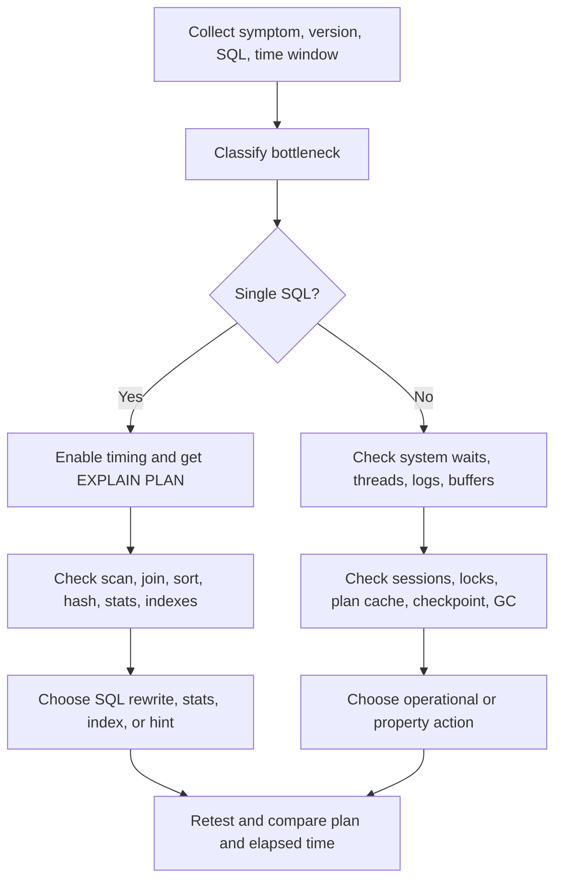
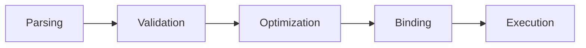
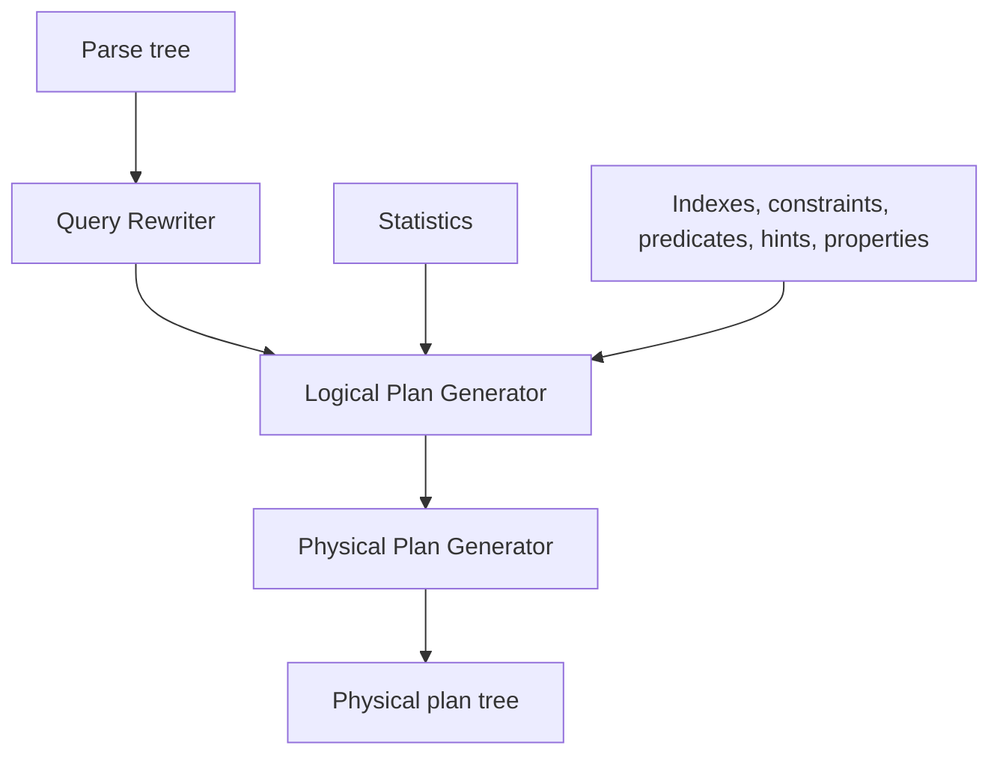
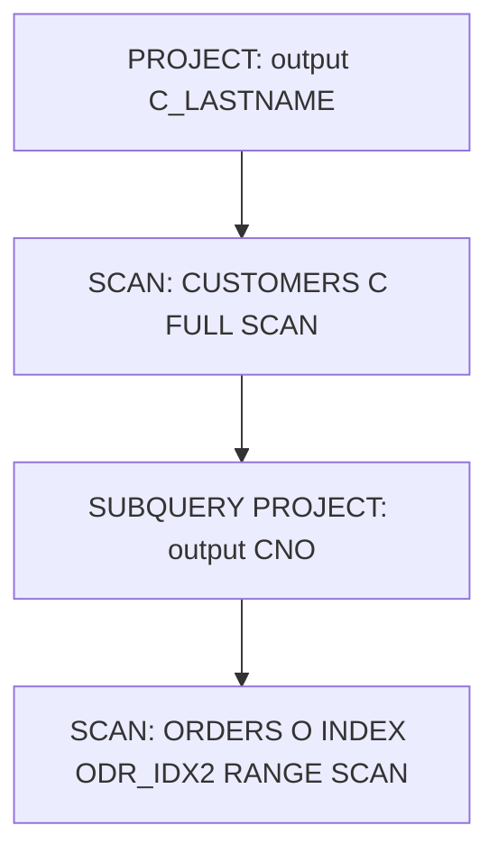
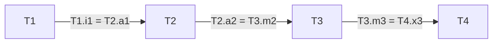
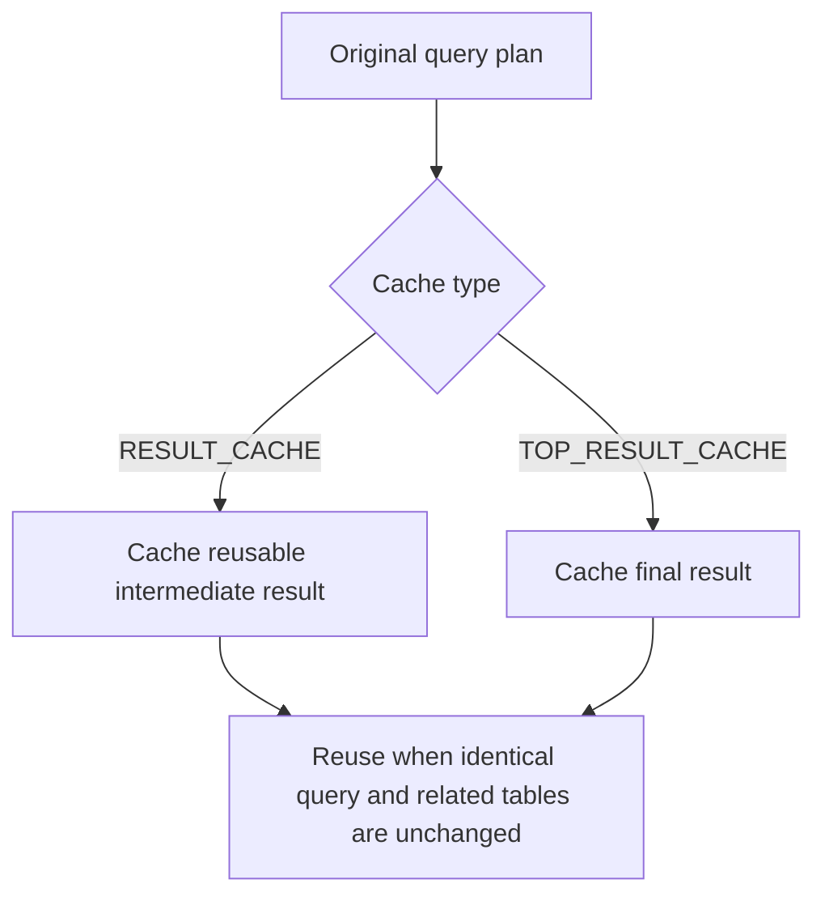
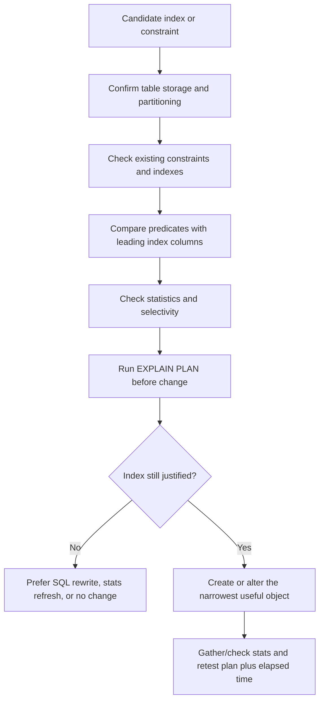
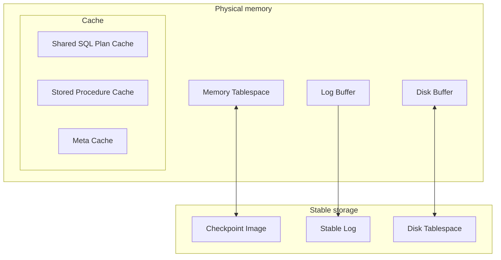
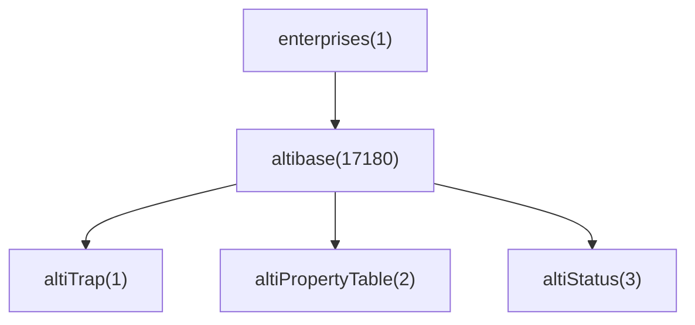
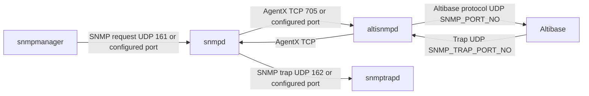

# 08. Performance Tuning and Monitoring

## Applicable Versions

- 7.1: Based on Altibase 7.1 Performance Tuning Guide, Stored Procedures Manual, General Reference data dictionary manual, Monitoring API Developer's Guide, and SNMP Agent Guide.
- 7.3: Based on Altibase 7.3 Performance Tuning Guide, Stored Procedures Manual, General Reference data dictionary manual, Monitoring API Developer's Guide, and SNMP Agent Guide.
- 8.1: Based on Altibase 8.1 verified source Performance Tuning Guide, Stored Procedures Manual, General Reference data dictionary manual, Monitoring API Developer's Guide, SNMP Agent Guide, and release notes.

## Questions This File Can Answer

- How should a GPT diagnose slow SQL, high CPU, disk I/O, waits, lock waits, checkpoint stalls, plan-cache misses, or MVCC garbage-collection pressure?
- How do I enable and read Altibase execution plan trees?
- Which plan nodes, scan methods, join methods, statistics, hints, and properties matter for tuning?
- Which performance views and SQL checks should be used before recommending an index, hint, SQL rewrite, or property change?
- How should primary keys, unique keys, foreign keys, local unique constraints, and partitioned indexes be evaluated for performance and integrity?
- How should Monitoring API functions be mapped to performance views?
- How should SNMP, `ALTIBASE-MIB`, `altiPropertyTable`, `altiStatus`, and `altiTrap` be explained?
- What is safe to say about the Altibase 8.1 JSON-format execution plan?

## Source Documents

- 7.1: Altibase 7.1 Performance Tuning Guide; Stored Procedures Manual; General Reference data dictionary manual; Monitoring API Developer's Guide; SNMP Agent Guide.
- 7.3: Altibase 7.3 Performance Tuning Guide; Stored Procedures Manual; General Reference data dictionary manual; Monitoring API Developer's Guide; SNMP Agent Guide.
- 8.1: Altibase 8.1 verified source Performance Tuning Guide; Stored Procedures Manual; General Reference data dictionary manual; Monitoring API Developer's Guide; SNMP Agent Guide; Altibase 8.1 release notes.

## Response Rules

- Answer explanatory text in the user's language.
- Keep SQL object names, plan node names, function names, property names, error codes, commands, command options, file paths, MIB names, OIDs, and API names literal.
- Do not expose internal source labels. For 8.1, say `Altibase 8.1 verified source`.
- Do not recommend an index, hint, or property change without first asking for or showing checks for execution plan, data volume, table storage type, relevant indexes, statistics age, and the bottleneck metric.
- Treat hints as last-mile controls for critical SQL. Prefer correct statistics, predicates, data types, indexes, and query shape before hard-coding hints.
- For destructive operational actions or production property changes, include service impact, rollback limits, and a verification query.
- For version-sensitive properties or views, check availability with `V$TABLE`, `V$ALLCOLUMN`, or `V$PROPERTY` before relying on them.
- Do not invent the schema of the 8.1 JSON execution plan. The verified source supports only the existence of JSON-format plan output and the property names `TRCLOG_EXPLAIN_TYPE` and `TRCLOG_JSON_PLAN_INDENT_DEPTH`.

## Fast Tuning Workflow

Use this sequence when the user reports "slow SQL", "high CPU", "high I/O", "hang", "lock wait", "checkpoint delay", "plan changed", or "Altibase is slow".



Minimum evidence to request:

- Altibase version from `V$VERSION` or `altibase -v`.
- Full SQL text, bind values or value patterns, and whether the application uses direct execution or prepare/execute.
- `ALTER SESSION SET EXPLAIN PLAN = ON` output, or `ONLY` output when the query is too expensive to execute.
- `SET TIMING ON` elapsed time from iSQL or application-side elapsed time.
- Table type: memory table, disk table, volatile table, temporary table, or partitioned table.
- Table row counts, relevant indexes, and statistics collection time when available.
- Current symptoms: CPU, disk I/O, waits, lock wait, log-file wait, checkpoint delay, SQL plan cache miss, or memory growth.

## Core SQL Checks

Check version and object availability:

```sql
SELECT product_version,
       meta_version,
       protocol_version,
       repl_protocol_version
FROM V$VERSION;

SELECT name, columncount
FROM V$TABLE
WHERE name IN (
  'V$SESSION',
  'V$STATEMENT',
  'V$SQLTEXT',
  'V$SESSION_WAIT',
  'V$SESSION_EVENT',
  'V$SYSTEM_EVENT',
  'V$LOCK_WAIT',
  'V$SQL_PLAN_CACHE',
  'V$SQL_PLAN_CACHE_PCO',
  'V$SQL_PLAN_CACHE_SQLTEXT',
  'V$DBMS_STATS'
)
ORDER BY name;
```

Check active sessions and current SQL:

```sql
SELECT id,
       db_username,
       session_state,
       task_state,
       active_flag,
       current_stmt_id,
       opened_stmt_count,
       query_time_limit,
       fetch_time_limit,
       utrans_time_limit,
       login_time
FROM V$SESSION
ORDER BY active_flag DESC, id;

SELECT session_id,
       id AS statement_id,
       execute_flag,
       total_time,
       execute_time,
       fetch_time,
       tx_id,
       query
FROM V$STATEMENT
WHERE execute_flag = 1
ORDER BY total_time DESC;
```

Check wait events and locks:

```sql
SELECT wait_class,
       event,
       total_waits,
       time_waited,
       average_wait,
       time_waited_micro
FROM V$SYSTEM_EVENT
ORDER BY time_waited_micro DESC;

SELECT sid,
       event,
       wait_class,
       wait_class_id,
       wait_time,
       second_in_wait,
       p1,
       p2,
       p3
FROM V$SESSION_WAIT
ORDER BY second_in_wait DESC;

SELECT *
FROM V$LOCK_WAIT;
```

Check properties that commonly affect tuning:

```sql
SELECT name, value1, min, max
FROM V$PROPERTY
WHERE name IN (
  'OPTIMIZER_MODE',
  'OPTIMIZER_FEATURE_ENABLE',
  'QUERY_REWRITE_ENABLE',
  'NORMALFORM_MAXIMUM',
  'TRCLOG_DETAIL_PREDICATE',
  'TRCLOG_DETAIL_INFORMATION',
  'SQL_PLAN_CACHE_SIZE',
  'SQL_PLAN_CACHE_BUCKET_CNT',
  'SQL_PLAN_CACHE_HOT_REGION_LRU_RATIO',
  'SQL_PLAN_CACHE_PREPARED_EXECUTION_CONTEXT_CNT',
  'HASH_AREA_SIZE',
  'SORT_AREA_SIZE',
  'PARALLEL_QUERY_THREAD_MAX',
  'PARALLEL_QUERY_QUEUE_SIZE',
  'BUFFER_AREA_SIZE',
  'PREPARE_LOG_FILE_COUNT',
  'AGER_WAIT_MINIMUM',
  'AGER_WAIT_MAXIMUM',
  'TIMED_STATISTICS'
)
ORDER BY name;
```

For 8.1 JSON-format plan support, check the release-note-backed properties before describing usage details:

```sql
SELECT name, value1, min, max
FROM V$PROPERTY
WHERE name IN (
  'TRCLOG_EXPLAIN_TYPE',
  'TRCLOG_JSON_PLAN_INDENT_DEPTH'
)
ORDER BY name;
```

## Query Processing Model

Altibase query processing follows this order:



Step block: `Parsing`

- Checks SQL syntax.
- Creates a parse tree.

Step block: `Validation`

- Checks semantic validity.
- Expands the parse tree with metadata.

Step block: `Optimization`

- Creates an execution plan from statistics, access costs, and transformed query structure.

Step block: `Binding`

- Binds host variables to the execution plan.

Step block: `Execution`

- Executes the SQL according to the execution plan tree.

The optimizer itself can be represented as:



Optimizer input block: `Query Rewriter`

- Rewrites the parse tree into an equivalent form that is easier to optimize.
- Common transformations include common subexpression elimination, constant filter precedence, view merging, subquery unnesting, predicate pushdown, transitive predicate generation, and view materialization.

Optimizer input block: `Logical Plan Generator`

- Uses rewritten SQL and statistics.
- Estimates selectivity, cardinality, and cost.
- Chooses access method, join order, and join method.

Optimizer input block: `Physical Plan Generator`

- Converts the optimized logical plan into executable plan nodes such as `PROJECT`, `SCAN`, `JOIN`, `SORT`, `HASH`, and `GROUP-AGGREGATION`.

Factors that can change the plan:

- SQL statement and predicate form.
- Indexes and constraints.
- Statistics.
- SQL hints.
- Optimizer-related properties.

## Memory Tables and Disk Tables

Memory and disk tables use different cost priorities.

Item block: `Memory table`

- Main cost target: CPU.
- Object identifier: pointer.
- Buffer management: not applicable.
- Join behavior: one-pass algorithms are typical because there is no disk-buffer limit.
- Access method tendency: index scans are usually better than full scans because they reduce record access.
- Cost inputs: row count `T(R)`, column cardinality `V(R.a)`, minimum and maximum values, and related statistics.

Item block: `Disk table`

- Main cost target: disk I/O.
- Object identifier: `OID` or `RID` that must be converted to a disk address.
- Buffer management: limited buffer; buffer misses can cause replacement and disk I/O.
- Join behavior: one-pass or multi-pass algorithms depending on temporary-space and buffer limits.
- Access method tendency: index scan is not always better. A full scan can cost less when an index scan causes irregular disk page access.
- Additional cost inputs: disk pages `B(R)` and available memory buffers `M`.

Practical rule:

- For memory tables, an index that reduces record access usually improves SQL performance.
- For disk tables, create or force an index only when selectivity is low enough to avoid excessive random I/O. The Performance Tuning Guide recommends disk-table indexes mainly when the search returns a very small number of rows, or less than about 10% of table rows.

## EXPLAIN PLAN

Compact syntax:

```text
ALTER SESSION SET EXPLAIN PLAN = { ON | ONLY | OFF };
```

Option block: `ON`

- Executes the `SELECT` statement and prints result rows plus the plan tree.
- Runtime-derived fields such as `ACCESS` are populated.

Option block: `ONLY`

- Prepares the `SELECT` statement and prints the plan without executing the query.
- Use for expensive queries or host-variable cases where only the plan is needed.
- Runtime-derived fields such as `ACCESS` appear as `??`.

Option block: `OFF`

- Executes the `SELECT` statement without plan output.

Predicate detail:

```sql
ALTER SYSTEM SET TRCLOG_DETAIL_PREDICATE = 1;
```

- Shows how predicates are processed, such as fixed key range, variable key range, and filter processing.
- Useful when a query has complex `WHERE` clauses and the user needs to know which predicates are handled by index access.
- Predicate detail may not appear when the optimizer has transformed the query.

Example plan with predicate detail:

```text
PROJECT ( COLUMN_COUNT: 1, TUPLE_SIZE: 4, COST: 0.00 )
 SCAN ( TABLE: T1, INDEX: IDX1, RANGE SCAN, ACCESS: 1, COST: 0.00 )
  [ FIXED KEY ]
  AND
   OR
    I1 = 1
```

Plan-reading rules:

- Each plan node is one row.
- A child node is indented farther right than its parent.
- Lower nodes are executed earlier than higher nodes.
- For nodes at the same indentation level, the earlier row is the left child.
- The request path is top-down; records are returned bottom-up.
- Subqueries appear between `::SUB-QUERY BEGIN` and `::SUB-QUERY END`.
- `ACCESS` is the number of times records or stored intermediate rows were accessed.
- `COST` is the estimated cost chosen by the optimizer.
- `DISK_PAGE_COUNT` is shown for disk-related plan nodes and is not available for memory-only cases.
- `TID` appears for parallel-query nodes.

## Transformed Plan Trees

The source plan-tree images are converted here into searchable text and compact Mermaid.

Subquery plan example:

```text
4 PROJECT (final output column)
3  SCAN CUSTOMERS C by FULL SCAN
    ::SUB-QUERY BEGIN
2   PROJECT (subquery CNO)
1    SCAN ORDERS O by ODR_IDX2 RANGE SCAN
    ::SUB-QUERY END
```



Join relationship example:

```text
Query relationships:
T1.i1 = T2.a1
T2.a2 = T3.m2
T3.m3 = T4.x3

Join graph:
T1 -- T2 -- T3 -- T4
```



Join relationship order is not always the final physical join order:

```text
Relationship order by selectivity:
JOIN
 JOIN
  JOIN
   T1
   T2
  T3
 T4

Physical order after join-method selection:
JOIN
 JOIN
  T3
  JOIN
   T1
   T2
 T4
```

Full outer join plan pattern:

```text
PROJECT
 CONCATENATION
  LEFT-OUTER-JOIN
   SCAN left table
   SCAN right table by index
  ANTI-OUTER-JOIN
   SCAN right table
   SCAN left table by index
```

Parallel partition scan pattern:

```text
PROJECT
 GROUP-AGGREGATION
  PARTITION-COORDINATOR (TABLE: T1, PARALLEL, PARTITION: 2/3)
   PARALLEL-QUEUE (TID: 1)
   PARALLEL-QUEUE (TID: 2)
   SCAN (PARTITION: P1, TID: 1)
   SCAN (PARTITION: P2, TID: 2)
```

Result Cache and Top Result Cache plan concepts:



Image-derived plan pattern catalog:

Pattern block: `General join tree and fetch path`

```text
PROJECT
 JOIN (METHOD: INDEX_NL)
  JOIN (METHOD: INDEX_NL)
   SCAN (TABLE: T1, FULL SCAN)
   SCAN (TABLE: T2, INDEX: IDX2, RANGE SCAN)
  SCAN (TABLE: T3, INDEX: IDX3, RANGE SCAN)
```

- The request path starts at `PROJECT` and moves downward through child nodes.
- The record-return path starts at leaf `SCAN` nodes and moves upward to `PROJECT`.
- In same-depth siblings, the earlier row in the plan output is the left child.

Pattern block: `AGGREGATION using sort order`

```text
PROJECT
 AGGREGATION
  GROUPING
   SCAN (TABLE: T1, INDEX: IDX3, FULL SCAN)
```

Pattern block: `GROUP-AGGREGATION`

```text
PROJECT
 GROUP-AGGREGATION
  SCAN (TABLE: T1, FULL SCAN)
```

Pattern block: `FILTER over grouped result`

```text
PROJECT
 FILTER
  [FILTER]
  <predicate, such as I2 < 2>
  GROUP-AGGREGATION
   SCAN (TABLE: T1, FULL SCAN)
```

Pattern block: `COUNT`

```text
PROJECT
 COUNT (TABLE: T1, INDEX: IDX1)
```

Pattern block: `DISTINCT`

```text
PROJECT
 DISTINCT
  SCAN (TABLE: T1, FULL SCAN)
```

Pattern block: `DISTINCT plus ORDER BY materialization`

```text
PROJECT
 SORT (memory temporary table, or disk temporary table with DISK_PAGE_COUNT)
  DISTINCT (memory temporary table, or disk temporary table with DISK_PAGE_COUNT)
   SCAN (TABLE: <source table>, FULL SCAN)
```

Pattern block: `DISTINCT with UNION`

```text
PROJECT
 DISTINCT
  VIEW
   BAG-UNION
    PROJECT
     SCAN (TABLE: T1, FULL SCAN)
    PROJECT
     SCAN (TABLE: T2, FULL SCAN)
```

Pattern block: `DISTINCT used for subquery key range`

```text
PROJECT
 SCAN (TABLE: T1, INDEX: IDX1, RANGE SCAN)
 ::SUB-QUERY BEGIN
 PROJECT
  DISTINCT
   VIEW
    PROJECT
     SCAN (TABLE: T2, FULL SCAN)
 ::SUB-QUERY END
```

Pattern block: `DISTINCT by sort order`

```text
PROJECT
 GROUPING
  SCAN (TABLE: T1, INDEX: IDX3, FULL SCAN)
```

Pattern block: `COUNT(DISTINCT ...) by sort order`

```text
PROJECT
 GROUP-AGGREGATION
  GROUPING
   SCAN (TABLE: T1, INDEX: IDX2, FULL SCAN)
```

Pattern block: `BAG-UNION for UNION ALL`

```text
PROJECT
 VIEW
  BAG-UNION
   PROJECT
    GROUP-AGGREGATION
     SCAN (TABLE: T1, FULL SCAN)
   PROJECT
    GROUP-AGGREGATION
     SCAN (TABLE: T2, FULL SCAN)
```

Pattern block: `CONCATENATION for OR or DNF`

```text
PROJECT
 GROUP-AGGREGATION
  CONCATENATION
   SCAN (TABLE: T1, INDEX: IDX1, RANGE SCAN)
   FILTER
    SCAN (TABLE: T1, INDEX: IDX2, RANGE SCAN)
```

Pattern block: `CONNECT BY`

```text
PROJECT
 GROUP-AGGREGATION
  CONNECT BY
   MATERIALIZATION
    VIEW
     PROJECT
      SCAN (TABLE: T1, FULL SCAN)
```

Pattern block: `FULL-OUTER-JOIN using sort`

```text
PROJECT
 GROUP-AGGREGATION
  FILTER
   FULL-OUTER-JOIN (METHOD: SORT)
    SCAN (TABLE: T1, FULL SCAN)
    SORT
     SCAN (TABLE: T2, FULL SCAN)
```

Pattern block: `FULL OUTER JOIN decomposed with indexes`

```text
PROJECT
 GROUP-AGGREGATION
  FILTER
   CONCATENATION
    LEFT-OUTER-JOIN (METHOD: INDEX_NL)
     SCAN (TABLE: T1, FULL SCAN)
     SCAN (TABLE: T2, INDEX: IDX1, RANGE SCAN)
    ANTI-OUTER-JOIN (METHOD: ANTI_COST)
     SCAN (TABLE: T2, FULL SCAN)
     SCAN (TABLE: T1, INDEX: IDX1, RANGE SCAN)
```

Pattern block: `LEFT-OUTER-JOIN`

```text
PROJECT
 GROUP-AGGREGATION
  FILTER
   LEFT-OUTER-JOIN (METHOD: NL)
    SCAN (TABLE: T1, FULL SCAN)
    SCAN (TABLE: T2, INDEX: IDX1, RANGE SCAN)
```

Pattern block: `MERGE-JOIN using index order`

```text
PROJECT
 GROUP-AGGREGATION
  MERGE-JOIN (METHOD: MERGE)
   SCAN (TABLE: T1, INDEX: IDX1, RANGE SCAN)
   SCAN (TABLE: T2, INDEX: IDX1, RANGE SCAN)
```

Pattern block: `MERGE-JOIN using SORT`

```text
PROJECT
 GROUP-AGGREGATION
  MERGE-JOIN (METHOD: MERGE)
   SORT
    SCAN (TABLE: T1, FULL SCAN)
   SORT
    SCAN (TABLE: T2, FULL SCAN)
```

Pattern block: `LIMIT-SORT for ORDER BY ... LIMIT`

```text
PROJECT
 LIMIT-SORT
  SCAN (TABLE: T1, FULL SCAN)
```

Pattern block: `LIMIT-SORT in subquery search`

```text
PROJECT
 SCAN (TABLE: T1, FULL SCAN)
 ::SUB-QUERY BEGIN
 PROJECT
  LIMIT-SORT
   VIEW
    PROJECT
     SCAN (TABLE: T2, FULL SCAN)
 ::SUB-QUERY END
```

Pattern block: `SET-DIFFERENCE for MINUS`

```text
PROJECT
 VIEW
  SET-DIFFERENCE
   PROJECT
    SCAN (TABLE: T1, FULL SCAN)
   PROJECT
    SCAN (TABLE: T2, FULL SCAN)
```

Pattern block: `SET-INTERSECT`

```text
PROJECT
 VIEW
  SET-INTERSECT
   PROJECT
    SCAN (TABLE: T1, FULL SCAN)
   PROJECT
    SCAN (TABLE: T2, FULL SCAN)
```

Pattern block: `SORT for ORDER BY`

```text
PROJECT
 SORT
  AGGREGATION
   GROUPING
    SCAN (TABLE: T1, INDEX: IDX3, FULL SCAN)
```

Pattern block: `SORT for GROUP BY`

```text
PROJECT
 AGGREGATION
  GROUPING
   SORT
    SCAN (TABLE: T1, FULL SCAN)
```

Pattern block: `SORT for DISTINCT`

```text
PROJECT
 GROUPING
  SORT
   SCAN (TABLE: T1, FULL SCAN)
```

Pattern block: `SORT join`

```text
PROJECT
 GROUP-AGGREGATION
  JOIN (METHOD: SORT)
   SCAN (TABLE: T1, FULL SCAN)
   SORT
    SCAN (TABLE: T2, FULL SCAN)
```

Pattern block: `STORE nested-loop join`

```text
PROJECT
 JOIN (METHOD: STORE_NL)
  SCAN (TABLE: T2, FULL SCAN)
  STORE
   SCAN (TABLE: T1, INDEX: IDX1)
```

Pattern block: `VIEW`

```text
PROJECT
 VIEW
  PROJECT
   AGGREGATION
    GROUPING
     SCAN (TABLE: T1, INDEX: IDX3, FULL SCAN)
```

Pattern block: `VIEW-SCAN with materialized view result`

```text
PROJECT
 JOIN (METHOD: SORT)
  VIEW-SCAN (VIEW: V1)
   MATERIALIZATION
    VIEW
     PROJECT
      GROUP-AGGREGATION
       SCAN (TABLE: T1, FULL SCAN)
  PROJECT
   SORT
    SCAN (TABLE: T1, FULL SCAN)
```

Pattern block: `VIEW-SCAN filter diagram`

```text
PROJECT
 FILTER
  VIEW-SCAN (VIEW: V1)
   MATERIALIZATION
    VIEW
     <view child plan>
  PROJECT
   <subquery child plan>
    VIEW-SCAN (VIEW: V1)
```

Pattern block: `Memory table SCAN versus disk table SCAN`

```text
PROJECT
 SCAN (TABLE: M1, FULL SCAN, ACCESS: <n>, COST: <n>)

PROJECT
 SCAN (TABLE: D1, FULL SCAN, ACCESS: <n>, DISK_PAGE_COUNT: <n>, COST: <n>)
```

Pattern block: `SCAN predicate detail`

```text
PROJECT
 SCAN (TABLE: T1, INDEX: IDX1, RANGE SCAN)
  [FIXED KEY]
  AND
   OR
    I1 = 1000
  [FILTER]
  I2 = 0
```

Pattern block: `Partition coordinator`

```text
PROJECT
 GROUP-AGGREGATION
  PARTITION-COORDINATOR (TABLE: <partitioned table>, PARTITION: selected/total)
   SCAN (PARTITION: P1, FULL SCAN)
   SCAN (PARTITION: P2, FULL SCAN)
```

Pattern block: `Parallel scan coordinator`

```text
PROJECT
 SORT
  GROUP-AGGREGATION
   PARALLEL-SCAN-COORDINATOR (TABLE: <table>)
    PARALLEL-QUEUE (TID: 1)
     SCAN (TABLE: <table>, TID: 1)
    PARALLEL-QUEUE (TID: 2)
     SCAN (TABLE: <table>, TID: 2)
```

Pattern block: `Result Cache`

```text
PROJECT
 SORT  <-- cacheable intermediate result
  SCAN
```

Pattern block: `Top Result Cache`

```text
PROJECT
 MATERIALIZATION  <-- cacheable final result
  VIEW
   PROJECT
    SCAN
```

## Access Methods

Access method block: `FULL SCAN`

- Reads all rows in the table and filters rows that do not satisfy the condition.
- Common when no useful index exists or a large portion of the table must be read.
- Related hint: `FULL SCAN(table)`.
- Plan signal: `SCAN ( TABLE: <table>, FULL SCAN, ACCESS: <n>, COST: <n> )`.

Access method block: `INDEX RANGE SCAN`

- Traverses the index from root to leaf and scans only the needed leaf range.
- Most useful when the leading index column appears in predicates such as `c1 = value`, `c1 < value`, or `c1 > value`.
- Can avoid extra sort work when `ORDER BY` or `GROUP BY` matches index column order.
- Related hints: `INDEX`, `INDEX ASC`, `INDEX DESC`, `NO INDEX`.
- Plan signal: `SCAN ( TABLE: <table>, INDEX: <index>, RANGE SCAN, ACCESS: <n>, COST: <n> )`.

Access method block: `INDEX FULL SCAN`

- Scans index leaves from top to bottom rather than a bounded range.
- Can be chosen when no optimal range index exists but index order can reduce sorting or table page access.
- Benefit is mainly for disk tables because memory table indexes do not store key values in the same way.
- Plan signal: `SCAN ( TABLE: <table>, INDEX: <index>, FULL SCAN, ACCESS: <n>, DISK_PAGE_COUNT: <n>, COST: <n> )`.

Access method block: `FILTER`

- Applies predicates that cannot be handled by index range access.
- If multiple filters exist, the optimizer can order them by estimated cost.
- Use `TRCLOG_DETAIL_PREDICATE = 1` to see predicate processing detail.

Index design checklist:

- Confirm the predicate can use the leading column of the index.
- Prefer composite indexes when multiple predicates can be processed as key ranges.
- Avoid excess indexes on write-heavy tables because `INSERT`, `UPDATE`, and `DELETE` must maintain indexes.
- For disk tables, check selectivity and disk I/O before adding an index.
- Verify application bind data types match column data types. Implicit conversion can prevent index scans even if an iSQL literal plan looks good.
- Recheck statistics after large data changes.

Cost concepts:

```text
Full scan access cost: T(R)
Index scan access cost: log(T(R)) + T(R) * MAX(1 / V(Index), selectivity)

Full scan disk I/O cost: B(R)
Index scan disk I/O cost with buffer miss:
  [T(R) / V(R.a)] * (1 - M / B(R))
```

Where:

- `T(R)` is the number of records in table `R`.
- `V(R.a)` is the number of distinct values in column `R.a`.
- `B(R)` is the number of disk pages for table `R`.
- `M` is the number of available memory buffer pages.

Data type conversion path tuning rule:

- Same-type comparison is preferred because it avoids conversion cost.
- Indexes are available for `CHAR` and `VARCHAR` comparisons, and for comparisons inside integer, real-number, and non-native numeric type groups.
- Numeric comparisons can convert across `SMALLINT`, `INTEGER`, `BIGINT`, `REAL`, `DOUBLE`, `NUMERIC`, `DECIMAL`, `NUMBER`, and `FLOAT` families. When the index-column value is converted, an index scan can still work but becomes slower than a scan with matching data types.
- Character-to-numeric comparisons use a conversion path through character and numeric families. Do not rely on implicit conversion for production predicates; bind values and literals should match the target column type.
- `DATE`, `INTERVAL`, `CHAR`, and `VARCHAR` conversions should be treated as potential index and CPU-cost risks until the plan confirms the intended `INDEX RANGE SCAN`.

Searchable conversion checks:

```text
Preferred: bigint_col = BIGINT'1'
Riskier:   bigint_col = NUMERIC'1'
Preferred: varchar_col = VARCHAR'abc'
Allowed:   char_col = VARCHAR'abc'
Allowed:   varchar_col = CHAR'abc'
```

## Index and Constraint Tuning

Use this section when the proposed fix is `CREATE INDEX`, `CREATE UNIQUE INDEX`, `LOCALUNIQUE`, `PRIMARY KEY`, `FOREIGN KEY`, `CHECK`, a function-based index, or a partitioned index.

Decision flow:



Metadata checks before recommending a new index:

```sql
SELECT u.user_name,
       t.table_name,
       t.table_type,
       t.tbs_name,
       t.is_partitioned,
       t.temporary,
       t.column_count
FROM SYSTEM_.SYS_TABLES_ t,
     SYSTEM_.SYS_USERS_ u
WHERE t.user_id = u.user_id
  AND u.user_name = 'APP'
  AND t.table_name = 'ORDER_HISTORY';

SELECT i.index_name,
       i.index_type,
       i.is_unique,
       i.is_range,
       i.is_directkey,
       i.is_partitioned,
       i.column_cnt,
       i.tbs_id
FROM SYSTEM_.SYS_INDICES_ i,
     SYSTEM_.SYS_TABLES_ t,
     SYSTEM_.SYS_USERS_ u
WHERE i.table_id = t.table_id
  AND i.user_id = u.user_id
  AND t.user_id = u.user_id
  AND u.user_name = 'APP'
  AND t.table_name = 'ORDER_HISTORY'
ORDER BY i.index_name;

SELECT i.index_name,
       ic.index_col_order,
       col.column_name,
       ic.sort_order
FROM SYSTEM_.SYS_INDICES_ i,
     SYSTEM_.SYS_INDEX_COLUMNS_ ic,
     SYSTEM_.SYS_COLUMNS_ col,
     SYSTEM_.SYS_TABLES_ t,
     SYSTEM_.SYS_USERS_ u
WHERE i.index_id = ic.index_id
  AND i.table_id = ic.table_id
  AND ic.table_id = col.table_id
  AND ic.column_id = col.column_id
  AND i.table_id = t.table_id
  AND i.user_id = u.user_id
  AND t.user_id = u.user_id
  AND u.user_name = 'APP'
  AND t.table_name = 'ORDER_HISTORY'
ORDER BY i.index_name, ic.index_col_order;

SELECT c.constraint_name,
       c.constraint_type,
       c.index_id,
       c.column_cnt,
       c.referenced_table_id,
       c.referenced_index_id,
       c.delete_rule,
       c.check_condition,
       c.validated
FROM SYSTEM_.SYS_CONSTRAINTS_ c,
     SYSTEM_.SYS_TABLES_ t,
     SYSTEM_.SYS_USERS_ u
WHERE c.table_id = t.table_id
  AND c.user_id = u.user_id
  AND t.user_id = u.user_id
  AND u.user_name = 'APP'
  AND t.table_name = 'ORDER_HISTORY'
ORDER BY c.constraint_type, c.constraint_name;
```

Constraint type codes in `SYSTEM_.SYS_CONSTRAINTS_`: `0` = `FOREIGN KEY`, `1` = `NOT NULL`, `2` = `UNIQUE`, `3` = `PRIMARY KEY`, `5` = `TIMESTAMP`, `6` = `LOCAL UNIQUE`, `7` = `CHECK`.

Composite index rules:

- Put equality predicates on leading columns before range predicates when that matches the workload.
- Key range processing follows the index column order and stops at the first missing leading column or inequality range that prevents later columns from narrowing the range.
- For `WHERE i1 = 1 AND i2 > 0 AND i3 = 1` on index `(i1, i2, i3)`, `i1` and `i2` can drive the key range and `i3` becomes a filter or key filter.
- For `WHERE i1 = 1 AND i3 = 1` on index `(i1, i2, i3)`, only `i1` can drive the key range because `i2` is missing.
- If the frequent predicate is `WHERE i1 > 0 AND i2 = 1`, prefer `(i2, i1)` over `(i1, i2)` when both predicates should be processed by key range.
- Match `ORDER BY` and `GROUP BY` direction only after the predicate access pattern is correct.

Constraint tuning notes:

- `PRIMARY KEY` and `UNIQUE` constraints create supporting unique indexes and provide reliable uniqueness rules. Do not add a second index with the same key columns.
- `FOREIGN KEY` constraints protect referential integrity but do not remove the need to tune child-table lookups. If parent deletes, cascading deletes, or child joins are slow, check whether the child foreign-key columns have an index.
- `ON DELETE SET NULL` requires nullable child columns. If child columns are `NOT NULL`, use `NO ACTION` or redesign the delete rule.
- `CHECK` constraints are validation rules, not access paths. They can prevent bad data but should not be recommended as a performance fix.
- On replicated tables, changing constraints or unique indexes can affect replication compatibility. Verify replication design before recommending DDL.

Partitioned index notes:

- Local indexes align index partitions with table partitions, which reduces maintenance scope for partition operations and helps partition-level access.
- `LOCALUNIQUE` enforces uniqueness within each local index partition, not necessarily across all table partitions.
- Disk partitioned tables can use local partitioned indexes or global non-partitioned indexes. Use a global non-partitioned unique index only when global uniqueness is required and the operational cost is acceptable.
- Partitioned memory tables cannot use global non-partitioned indexes; prefer local index designs and include the partition key in uniqueness rules when global validation is not available.
- Global partitioned indexes are not supported. Do not recommend them.
- For local indexes, check `SYSTEM_.SYS_PART_INDICES_` and `SYSTEM_.SYS_INDEX_PARTITIONS_` before assuming partition names, tablespaces, or local uniqueness.

Partitioned index verification:

```sql
SELECT i.index_name,
       pi.partition_type,
       pi.is_local_unique
FROM SYSTEM_.SYS_INDICES_ i,
     SYSTEM_.SYS_PART_INDICES_ pi,
     SYSTEM_.SYS_TABLES_ t,
     SYSTEM_.SYS_USERS_ u
WHERE i.user_id = pi.user_id
  AND i.table_id = pi.table_id
  AND i.index_id = pi.index_id
  AND i.table_id = t.table_id
  AND i.user_id = u.user_id
  AND t.user_id = u.user_id
  AND u.user_name = 'APP'
  AND t.table_name = 'ORDER_HISTORY'
ORDER BY i.index_name;

SELECT i.index_name,
       ip.index_partition_name,
       tp.partition_name AS table_partition_name,
       tp.partition_order,
       ip.tbs_id
FROM SYSTEM_.SYS_INDEX_PARTITIONS_ ip,
     SYSTEM_.SYS_INDICES_ i,
     SYSTEM_.SYS_TABLE_PARTITIONS_ tp,
     SYSTEM_.SYS_TABLES_ t,
     SYSTEM_.SYS_USERS_ u
WHERE ip.user_id = i.user_id
  AND ip.table_id = i.table_id
  AND ip.index_id = i.index_id
  AND ip.user_id = tp.user_id
  AND ip.table_id = tp.table_id
  AND ip.table_partition_id = tp.partition_id
  AND i.table_id = t.table_id
  AND i.user_id = u.user_id
  AND t.user_id = u.user_id
  AND u.user_name = 'APP'
  AND t.table_name = 'ORDER_HISTORY'
ORDER BY i.index_name, tp.partition_order;
```

Function-based and direct key index notes:

- A function-based index is useful only when the query predicate uses the same expression and `QUERY_REWRITE_ENABLE = 1`.
- User-defined functions in function-based indexes must be `DETERMINISTIC`; cross-schema functions also require `EXECUTE` privilege.
- Do not use non-deterministic functions, subqueries, sequences, pseudo columns, `PRIOR`, aggregate functions, or LOB data in function-based index expressions.
- A direct key index can reduce index scan cost for supported memory-resident indexes. It cannot be created on disk-resident indexes, compressed columns, or encrypted columns.
- In a composite direct key index, the first column is the direct key. Put the intended direct key first.

Property and disk-index consistency checks:

```sql
SELECT name, value1, min, max
FROM V$PROPERTY
WHERE name IN (
  'QUERY_REWRITE_ENABLE',
  'INDEX_BUILD_THREAD_COUNT'
)
ORDER BY name;

SELECT index_name,
       index_status,
       index_tbs_id,
       table_tbs_id,
       is_unique,
       is_consistent,
       is_created_with_logging,
       is_created_with_force
FROM V$DISK_BTREE_HEADER
WHERE index_name IN ('IDX_ORDER_HISTORY_AMOUNT', 'UK_APP_DOCUMENT_TITLE')
ORDER BY index_name;
```

Plan and retest pattern:

```sql
ALTER SESSION SET EXPLAIN PLAN = ONLY;

SELECT order_id, order_date, user_id, amount
FROM app.order_history
WHERE user_id = 1001
  AND order_date >= TO_DATE('2026-01-01', 'YYYY-MM-DD')
  AND order_date <  TO_DATE('2026-02-01', 'YYYY-MM-DD')
ORDER BY order_date;

ALTER SESSION SET EXPLAIN PLAN = OFF;

SELECT *
FROM V$DBMS_STATS;
```

Accept the index change only when the retest shows the intended `INDEX RANGE SCAN`, partition pruning where applicable, lower elapsed time or lower bottleneck metric, and no unacceptable write-path cost.

## Join Tuning

Join-order process:

1. Group tables by join condition.
2. Configure join relationships within each group.
3. Sort relationships by efficiency using join selectivity.
4. Choose join method and direction by cost.
5. Join groups to one another.

Join selectivity concept:

```text
T(R) * T(S) / MAX(V(R.a), V(S.a)) / (T(R) + T(S))
```

Join category block: `Nested Loop`

- Methods: full nested loop, full store nested loop, index nested loop, anti outer nested loop, inverse index nested loop.
- Typical use: small outer row set with an index on the inner table, Cartesian products, or full outer join cases with appropriate indexes.
- Related hint family: `USE_NL`, `USE_FULL_NL`, `USE_FULL_STORE_NL`, `USE_INDEX_NL`.
- Plan signal: `JOIN ( METHOD: INDEX_NL, COST: <n> )` or related `JOIN` methods.

Join category block: `Sort-based`

- Methods: one-pass sort join, two-pass sort join, inverse sort join.
- Typical use: inequality join conditions or cases without usable indexes.
- One-pass is possible when the inner result fits in temporary space; two-pass handles larger results to reduce disk I/O.
- Related hint family: `USE_SORT`, `USE_ONE_PASS_SORT`, `USE_TWO_PASS_SORT`, `SORT_SJ`, `SORT_AJ`.

Join category block: `Hash-based`

- Methods: one-pass hash join, two-pass hash join, inverse hash join.
- Typical use: equality joins without usable indexes.
- One-pass is possible when the inner result fits in temporary space; two-pass partitions data when it does not.
- Related hint family: `USE_HASH`, `USE_ONE_PASS_HASH`, `USE_TWO_PASS_HASH`, `HASH_SJ`, `HASH_AJ`.

Join category block: `Merge`

- Methods: index merge join, sort merge join.
- Typical use: both inputs are already ordered or can be efficiently ordered by the join key.
- Related hint: `USE_MERGE`.

Join method plan-pattern blocks:

```text
Full nested loop:
PROJECT
 GROUP-AGGREGATION
  JOIN (METHOD: NL)
   SCAN (TABLE: T1, FULL SCAN)
   SCAN (TABLE: T2, FULL SCAN)

Full store nested loop:
PROJECT
 GROUP-AGGREGATION
  JOIN (METHOD: STORE_NL)
   SCAN (TABLE: T1, INDEX: IDX3, RANGE SCAN)
   STORE
    SCAN (TABLE: T2, FULL SCAN)

Index nested loop:
PROJECT
 GROUP-AGGREGATION
  JOIN (METHOD: INDEX_NL)
   SCAN (TABLE: T1, INDEX: IDX3)
   SCAN (TABLE: T2, INDEX: IDX1)

Inverse index nested loop:
PROJECT
 GROUP-AGGREGATION
  SEMI-JOIN INVERSE (METHOD: INDEX_NL)
   HASH
    SCAN (TABLE: T2, VIEW SCAN)
   SCAN (TABLE: T1, INDEX: IDX3, RANGE SCAN)

One-pass sort join:
PROJECT
 GROUP-AGGREGATION
  JOIN (METHOD: SORT)
   SCAN (TABLE: T1, INDEX: IDX3, RANGE SCAN)
   SORT
    SCAN (TABLE: T2, FULL SCAN)

Two-pass sort join:
PROJECT
 GROUP-AGGREGATION
  JOIN (METHOD: SORT)
   SORT
    SCAN (TABLE: T1, INDEX: IDX3, RANGE SCAN)
   SORT
    SCAN (TABLE: T2, FULL SCAN)

Inverse sort join:
PROJECT
 GROUP-AGGREGATION
  SEMI-JOIN INVERSE (METHOD: SORT)
   SCAN (TABLE: T1, VIEW SCAN)
   SORT
    SCAN (TABLE: T2, FULL SCAN)

One-pass hash join:
PROJECT
 GROUP-AGGREGATION
  JOIN (METHOD: HASH)
   SCAN (TABLE: T1, INDEX: IDX3, RANGE SCAN)
   HASH
    SCAN (TABLE: T2, FULL SCAN)

Two-pass hash join:
PROJECT
 GROUP-AGGREGATION
  JOIN (METHOD: HASH)
   HASH
    SCAN (TABLE: T1, INDEX: IDX3, RANGE SCAN)
   HASH
    SCAN (TABLE: T2, FULL SCAN)

Inverse hash join:
PROJECT
 GROUP-AGGREGATION
  SEMI-JOIN INVERSE (METHOD: HASH)
   SCAN (TABLE: T1, VIEW SCAN)
   HASH
    SCAN (TABLE: T2, FULL SCAN)
```

Join type symbols used in source tables:

- `C`: Cartesian product.
- `I`: Inner join.
- `S`: Semi join.
- `A`: Anti join.
- `L`: Left outer join.
- `R`: Right outer join.
- `F`: Full outer join.

Join tuning checks:

- Does the plan show the expected driving table on the left and driven table on the right?
- Is the inner table indexed for an index nested loop?
- Does the join condition use matching data types?
- Is a hash join using equality predicates?
- Is a sort join or merge join creating unnecessary `SORT` nodes?
- Are stale statistics causing an unexpectedly large or small estimated cost?

## Plan Node Reference

Use these blocks to explain plan-node output. Keep node names literal.

Plan node block: `PROJECT`

- Purpose: returns the final projected columns.
- Key fields: `COLUMN_COUNT`, `TUPLE_SIZE`, `COST`.
- Tuning signal: often the root node; look below it for the real access, join, sort, and hash cost.

Plan node block: `SCAN`

- Purpose: directly accesses a table, index, or partition.
- Key fields: `TABLE`, `INDEX`, scan method, `ACCESS`, `DISK_PAGE_COUNT`, `TID`, `COST`.
- Tuning signal: check `FULL SCAN` versus `RANGE SCAN`, index choice, access count, disk page count, and parallel thread `TID`.

Plan node block: `JOIN`

- Purpose: normal join operation with two child nodes.
- Key fields: `METHOD`, `COST`.
- Tuning signal: identifies the chosen join method. The left child is the outer or driving table after join method selection.

Plan node block: `LEFT-OUTER-JOIN`

- Purpose: left outer join operation.
- Key fields: `METHOD`, optional `SKIP RIGHT COUNT`, `COST`.
- Tuning signal: confirm the outer side and inner side match the desired query semantics and access method.

Plan node block: `FULL-OUTER-JOIN`

- Purpose: full outer join operation.
- Key fields: `METHOD`, `COST`.
- Tuning signal: may require storage or multiple join branches; check whether indexes allow cheaper full outer join handling.

Plan node block: `ANTI-OUTER-JOIN`

- Purpose: supports full outer join processing when indexes exist on join columns.
- Key fields: `METHOD`, `COST`.
- Tuning signal: usually appears under `CONCATENATION` with `LEFT-OUTER-JOIN`.

Plan node block: `MERGE-JOIN`

- Purpose: joins ordered inputs.
- Key fields: `METHOD`, `COST`.
- Tuning signal: useful when indexes or sorting provide join-key order; check child `SCAN` or `SORT` nodes.

Plan node block: `SORT`

- Purpose: sorts rows for `ORDER BY`, `GROUP BY`, `DISTINCT`, or joins.
- Key fields: `ITEM_SIZE`, `ITEM_COUNT`, `DISK_PAGE_COUNT`, `ACCESS`, `COST`.
- Tuning signal: large `ITEM_COUNT` or disk temporary use can indicate expensive sort work.

Plan node block: `LIMIT-SORT`

- Purpose: limited sort for `ORDER BY ... LIMIT` or subquery search.
- Key fields: `ITEM_SIZE`, `ITEM_COUNT`, `STORE_COUNT`, `ACCESS`, `COST`.
- Tuning signal: `STORE_COUNT` shows how many rows are retained for the limited result.

Plan node block: `HASH`

- Purpose: stores rows in a hash structure for joins or subquery comparison.
- Key fields: `ITEM_SIZE`, `ITEM_COUNT`, `BUCKET_COUNT` or `DISK_PAGE_COUNT`, `ACCESS`, `COST`.
- Tuning signal: check bucket count, temporary disk use, and whether equality join predicates exist.

Plan node block: `GROUP-AGGREGATION`

- Purpose: performs grouped aggregate operations using hashing.
- Key fields: `ITEM_SIZE`, `GROUP_COUNT`, `BUCKET_COUNT` or `DISK_PAGE_COUNT`, `ACCESS`, `COST`.
- Tuning signal: large group count or disk temporary use can indicate expensive aggregate processing.

Plan node block: `AGGREGATION`

- Purpose: performs aggregate operations on records in the same group.
- Key fields: `ITEM_SIZE`, `GROUP_COUNT`, `COST`.
- Tuning signal: can appear with `GROUPING` when sort order allows aggregate work without additional storage.

Plan node block: `GROUPING`

- Purpose: checks duplicates or groups using sort order.
- Key fields: node name plus child context.
- Tuning signal: often indicates a sort-order optimization for `GROUP BY`, `DISTINCT`, or `COUNT(DISTINCT ...)`.

Plan node block: `DISTINCT`

- Purpose: removes duplicates using hashing and temporary storage.
- Key fields: `ITEM_SIZE`, `ITEM_COUNT`, `BUCKET_COUNT` or `DISK_PAGE_COUNT`, `ACCESS`, `COST`.
- Tuning signal: large duplicate-removal work may be reduced by index order, predicate selectivity, or SQL rewrite.

Plan node block: `FILTER`

- Purpose: applies selection predicates without direct table access.
- Key fields: normally only the node name unless predicate detail is enabled.
- Tuning signal: enable `TRCLOG_DETAIL_PREDICATE` to see filter conditions; excessive filtering after full scan may need index or predicate rewrite.

Plan node block: `COUNT`

- Purpose: executes `COUNT(*)` without `GROUP BY`.
- Key fields: `TABLE`, optional `INDEX`, `ACCESS`, `DISK_PAGE_COUNT`, `COST`.
- Tuning signal: index access can count without accessing full data rows.

Plan node block: `CONCATENATION`

- Purpose: concatenates multiple child results.
- Key fields: node name and child nodes.
- Tuning signal: appears for DNF processing and full outer join decomposition; check duplicate-removal filters.

Plan node block: `BAG-UNION`

- Purpose: implements `UNION ALL`.
- Key fields: child plans.
- Tuning signal: usually no duplicate removal; check each branch independently.

Plan node block: `SET-DIFFERENCE`

- Purpose: implements `MINUS`.
- Key fields: `ITEM_SIZE`, `ITEM_COUNT`, `BUCKET_COUNT` or `DISK_PAGE_COUNT`, `ACCESS`, `COST`.
- Tuning signal: stores and compares intermediate results; large inputs can be expensive.

Plan node block: `SET-INTERSECT`

- Purpose: implements `INTERSECT`.
- Key fields: `ITEM_SIZE`, `ITEM_COUNT`, `BUCKET_COUNT` or `DISK_PAGE_COUNT`, `ACCESS`, `COST`.
- Tuning signal: stores intermediate results; reduce input size before set operations where possible.

Plan node block: `VIEW`

- Purpose: represents a user-defined view or set-operation result as a virtual table.
- Key fields: view name when present, `ACCESS`, `COST`.
- Tuning signal: child nodes show the query that builds the view; check whether view merging or predicate pushdown occurred.

Plan node block: `VIEW-SCAN`

- Purpose: scans a temporarily stored view.
- Key fields: `VIEW`, `ACCESS`, `COST`.
- Tuning signal: may have a hidden `MATERIALIZATION` child; indicates reuse of a materialized view result.

Plan node block: `MATERIALIZATION`

- Purpose: stores intermediate results for reuse by parent nodes.
- Key fields: child context and storage details when output.
- Tuning signal: useful when repeated access is cheaper than recomputation; expensive when intermediate results are large.

Plan node block: `STORE`

- Purpose: temporarily stores query results.
- Key fields: `ITEM_SIZE`, `ITEM_COUNT`, `DISK_PAGE_COUNT`, `ACCESS`, `COST`.
- Tuning signal: often appears for joins such as Cartesian products; check missing join predicates.

Plan node block: `CONNECT BY`

- Purpose: executes hierarchical queries.
- Key fields: `ACCESS`, optional `INDEX`, `COST`.
- Tuning signal: child is always a materialization node; check hierarchy predicates and indexes.

Plan node block: `PARTITION-COORDINATOR`

- Purpose: manages scans over partitions and applies partition filtering.
- Key fields: `TABLE`, optional `PARALLEL`, `PARTITION`, `ACCESS`, `COST`.
- Tuning signal: confirm `PARTITION: selected/total`; poor pruning means predicates may not match partition keys.

Plan node block: `PARALLEL-QUEUE`

- Purpose: runs child nodes in parallel worker threads and passes rows upward.
- Key fields: `TID`.
- Tuning signal: verify parallel work distribution and thread count.

Plan node block: `PARALLEL-SCAN-COORDINATOR`

- Purpose: collects several parallel `SCAN` results and transfers them to the parent.
- Key fields: `TABLE`, `ACCESS`.
- Tuning signal: check whether parallel scan improves elapsed time enough to justify thread overhead.

## Statistics

Statistics types used by the optimizer:

Item block: `Table statistics`

- Number of records.
- Number of pages.
- Average record length.

Item block: `Column statistics`

- Number of distinct values.
- Number of `NULL` values.
- Average column length.

Item block: `Index statistics`

- Average number of slots per leaf node.
- Depth from root to leaf.
- Clustering factor.
- Maximum and minimum index values.

Item block: `Database system statistics`

- Average time to read one page.
- Average time to read multiple pages.
- Average time spent hashing.
- Average time spent comparing.

Statistics management procedures:

- `GATHER_SYSTEM_STATS`
- `GATHER_DATABASE_STATS`
- `GATHER_TABLE_STATS`
- `GATHER_INDEX_STATS`
- `SET_SYSTEM_STATS`
- `SET_TABLE_STATS`
- `SET_INDEX_STATS`
- `SET_COLUMN_STATS`
- `LOCK_TABLE_STATS`
- `UNLOCK_TABLE_STATS`

Statistics guidance:

- Gather object statistics after large data changes.
- The Performance Tuning Guide recommends collecting table statistics periodically, such as monthly, when data changes heavily.
- Gather system statistics only after the server has started and has a representative load; otherwise some values may not be measured correctly.
- `V$DBMS_STATS` stores collected statistics.

```sql
SELECT *
FROM V$DBMS_STATS;
```

## Hints

Compact syntax:

```text
SELECT /*+ hint [hint ...] */ ...
UPDATE /*+ hint [hint ...] */ ...
DELETE /*+ hint [hint ...] */ ...
INSERT /*+ hint [hint ...] */ ...
```

Hint processing rules:

- If hint syntax is valid and Altibase can obey it, the hint is followed.
- If hint syntax is invalid or impossible to execute, the hint is ignored.
- The plus sign must immediately follow `/*` with no intervening space: `/*+`.
- Hints can be specified in simple `SELECT`, `UPDATE`, `DELETE`, and `INSERT` statements.
- In compound statements, use hints in the main query, subquery, or first query combined by set operators as appropriate.

Hint family block: `Optimization strategy`

- `RULE`
- `COST`
- `FIRST_ROWS(n)`

Hint family block: `Normalization`

- `CNF`
- `DNF`
- `NO_EXPAND`
- `USE_CONCAT`

Hint family block: `Join order`

- `LEADING`
- `ORDERED`

Hint family block: `Join method`

- `USE_NL`, `USE_FULL_NL`, `USE_FULL_STORE_NL`, `USE_INDEX_NL`
- `USE_SORT`, `USE_ONE_PASS_SORT`, `USE_TWO_PASS_SORT`
- `USE_HASH`, `USE_ONE_PASS_HASH`, `USE_TWO_PASS_HASH`
- `USE_MERGE`
- `USE_ANTI`
- `NO_USE_HASH`, `NO_USE_MERGE`, `NO_USE_NL`, `NO_USE_SORT`

Hint family block: `Temporary result storage`

- `TEMP_TBS_MEMORY`
- `TEMP_TBS_DISK`

Hint family block: `Hash bucket count`

- `HASH BUCKET COUNT(n)`
- `GROUP BUCKET COUNT(n)`
- `SET BUCKET COUNT(n)`

Hint family block: `Group and duplicate processing`

- `GROUP_HASH`
- `GROUP_SORT`
- `DISTINCT_HASH`
- `DISTINCT_SORT`

Hint family block: `View and subquery conversion`

- `NO_PUSH_SELECT_VIEW(table)`
- `PUSH_SELECT_VIEW(table)`
- `PUSH_PRED`
- `UNNEST`
- `NO_UNNEST`
- `NL_SJ`, `HASH_SJ`, `SORT_SJ`, `MERGE_SJ`
- `NL_AJ`, `HASH_AJ`, `SORT_AJ`, `MERGE_AJ`

Hint family block: `Access method`

- `FULL SCAN(table)`
- `INDEX(table, index1, index2, ...)`
- `INDEX ASC(table, index1, index2, ...)`
- `INDEX_ASC(table, index1, index2, ...)`
- `INDEX DESC(table, index1, index2, ...)`
- `INDEX_DESC(table, index1, index2, ...)`
- `NO INDEX(table, index1, index2, ...)`
- `NO_INDEX(table, index1, index2, ...)`

Hint family block: `Plan cache and result cache`

- `NO_PLAN_CACHE`
- `KEEP_PLAN`
- `PLAN_CACHE_KEEP`
- `RESULT_CACHE`
- `TOP_RESULT_CACHE`

Hint family block: `Other execution controls`

- `APPEND`
- `EXEC_FAST`
- `NO_EXEC_FAST`
- `NOPARALLEL`
- `PARALLEL integer`
- `NO_PARALLEL`
- `HIGH_PRECISION`
- `NO DELAY`
- `DELAY`

Access-method hint conflict rules:

- If access-method hints contradict each other, the first hint is applied and later contradictory hints are ignored.
- If access-method hints do not contradict each other, the cheapest specified access method is selected.
- Access-method hints and join-method hints are processed separately.

## SQL Plan Cache

Purpose:

- Shares SQL execution plans across sessions.
- Reduces parse and prepare cost.
- Reduces prepare memory in prepared execution environments.

Shared cache areas:

- `Shared SQL Plan Cache`: stores SQL execution plans.
- `Stored Procedure Cache`: stores stored procedure execution plans.
- `Meta Cache`: stores metadata for quick access.

Version-aware plan pinning:

- Selected 7.1, 7.3, and Altibase 8.1 verified source manuals document `DBMS_SQL_PLAN_CACHE.KEEP_PLAN(sql_text_id)` and `DBMS_SQL_PLAN_CACHE.UNKEEP_PLAN(sql_text_id)` for keeping or releasing a specific cached execution plan.
- Treat plan-cache pinning as target-server verified operational guidance: before using it, verify that the installed server supports the package and exposes `V$SQL_PLAN_CACHE_SQLTEXT.PLAN_CACHE_KEEP` and `V$SQL_PLAN_CACHE_PCO.PLAN_CACHE_KEEP`.
- After `KEEP_PLAN` or `UNKEEP_PLAN`, confirm the target server's keep state with those `PLAN_CACHE_KEEP` columns; do not assume the column names or values if the target build differs.

SQL Plan Cache architecture:



Key properties:

- `SQL_PLAN_CACHE_BUCKET_CNT`: number of buckets in the SQL plan cache hash table.
- `SQL_PLAN_CACHE_HOT_REGION_LRU_RATIO`: percentage of hot area in the LRU list for frequently referenced plans.
- `SQL_PLAN_CACHE_PREPARED_EXECUTION_CONTEXT_CNT`: initial execution contexts created when plans are generated.
- `SQL_PLAN_CACHE_SIZE`: maximum SQL plan cache size. The source default is 64 MB.

Management statements:

```sql
ALTER SYSTEM COMPACT SQL_PLAN_CACHE;
ALTER SYSTEM RESET SQL_PLAN_CACHE;
```

- `COMPACT SQL_PLAN_CACHE` deletes unused execution plans.
- `RESET SQL_PLAN_CACHE` deletes unused execution plans and initializes statistics.

Statements that can use the SQL plan cache:

- `SELECT`, including `SELECT FOR UPDATE`.
- `INSERT`, including `INSERT SELECT`.
- `UPDATE`.
- `DELETE`.
- `MOVE`.
- `ENQUEUE`.
- `DEQUEUE`.

Plan reuse rule:

- SQL text and parameter values must be identical for direct SQL.
- For reuse, use bind variables where possible.

```sql
-- Poor for plan reuse because literals differ.
INSERT INTO T1 VALUES(1, 2);
INSERT INTO T1 VALUES(2, 3);

-- Better for plan reuse.
INSERT INTO T1 VALUES(?, ?);
```

Plan cache checks:

```sql
SELECT max_cache_size,
       cache_hit_count,
       cache_miss_count
FROM V$SQL_PLAN_CACHE;

SELECT create_reason, count(*)
FROM V$SQL_PLAN_CACHE_PCO
GROUP BY create_reason
ORDER BY count(*) DESC;

SELECT a.sql_text,
       a.child_pco_count,
       b.hit_count,
       b.rebuild_count
FROM V$SQL_PLAN_CACHE_SQLTEXT a,
     V$SQL_PLAN_CACHE_PCO b
WHERE a.sql_text_id = b.sql_text_id
ORDER BY a.child_pco_count DESC;
```

Interpretation:

- High `CACHE_MISS_COUNT`: consider larger `SQL_PLAN_CACHE_SIZE`, more bind-variable use, or prepare/execute application flow.
- High `CREATED_BY_CACHE_MISS`: SQL plan cache may be too small or literal SQL may be overused.
- High `CREATED_BY_PLAN_INVALIDATION`: referenced objects such as tables or indexes may be changing frequently.
- High `CHILD_PCO_COUNT`: check whether SQL text is the same but object owners differ, or whether referenced objects are frequently changed.

## Result Cache

Result Cache purpose:

- Reuses intermediate results from an initially executed query when an identical query is executed again and related tables are unchanged.

Top Result Cache purpose:

- Reuses final query results.

Supported result-cache plan areas include:

- `SORT`: `ORDER BY`, join, `GROUP BY`.
- `DISTINCT`: duplicate removal.
- `MATERIALIZATION`: view and `CONNECT BY`.
- `GROUP-AGGREGATION`: group aggregation.
- `GROUP-CUBE`: `GROUP BY CUBE`.
- `GROUP-ROLLUP`: `GROUP BY ROLLUP`.
- `HASH`: join.
- `SET-DIFFERENCE`: `MINUS`.
- `SET-INTERSECT`: `INTERSECT`.
- `WINDOW-SORT`: `OVER` clause.
- `LIMIT-SORT`: `LIMIT`.

Hints:

```sql
SELECT /*+ RESULT_CACHE */ *
FROM T1
ORDER BY i1;

SELECT /*+ TOP_RESULT_CACHE */ *
FROM T1
ORDER BY i1;
```

Properties:

- `RESULT_CACHE_ENABLE`: enables Result Cache.
- `RESULT_CACHE_MEMORY_MAXIMUM`: maximum memory for Result Cache and Top Result Cache.
- `TOP_RESULT_CACHE_MODE`: controls final-result cache use.

Restrictions:

- Cannot be used with non-deterministic functions such as `RANDOM`, `RANDOM_STRING`, `SYS_GUID`, `SYS_GUID_STR`, `SYSDATE`, `SYSTIMESTAMP`, `UNIX_DATE`, or `UNIX_TIMESTAMP`.
- Cannot be used with temporary tables, fixed tables, disk temporary tables, dump tables, or remote tables used in DB Link.
- Cannot be used with `_PROWID`.
- Cannot be used for disk tables with `NO_PUSH_PROJECTION`.
- Cannot be used after activating `REDUCE_TEMP_MEMORY`.
- Cannot be used for encrypted columns.
- Cannot be used with `PRIOR` columns or `LOB` columns.
- Cannot be used when a disk partitioned table column value is used in a temporary table.

Commit-mode note:

- `AUTO COMMIT ON` in both sessions can reuse cache.
- `AUTO COMMIT OFF` in both sessions can reuse cache within identical transactions.
- Mixed `AUTO COMMIT ON` and `AUTO COMMIT OFF` sessions cannot reuse cache without clearing or re-executing under the correct transaction state.

## Server Tuning Checks

Server issue block: `Log file wait`

- Symptom: Transactions wait while Altibase prepares additional log files.
- Primary Causes: `PREPARE_LOG_FILE_COUNT` is too low for the burst write rate, log disk latency is high, or sustained transaction volume is consuming prepared log files faster than they are replenished.
- Check SQL or Command:

```sql
SELECT lf_prepare_wait_count
FROM V$LFG;
```

- Immediate Action: Compare two snapshots in the same workload window. If `LF_PREPARE_WAIT_COUNT` rises and log disk I/O is not already saturated, consider a small increase to `PREPARE_LOG_FILE_COUNT`; keep the prior value and avoid excessive settings because server memory usage increases.
- Verification: Re-run the `V$LFG` snapshot after the workload or change. The wait-count increase should slow or stop, and transaction latency during log-heavy work should improve.
- Version Cautions: Check that `V$LFG.LF_PREPARE_WAIT_COUNT` and `PREPARE_LOG_FILE_COUNT` are available on the target server before relying on them.
- Escalation: If waits continue after bounded tuning or log I/O is saturated, collect Altibase version, two `V$LFG` snapshots, log file layout, OS I/O samples, property values, and trace log excerpts before escalating.

Server issue block: `Checkpoint I/O`

- Symptom: Checkpoint trace messages stay long at `[CHECKPOINT-step3] Flush Dirty Page(s)` or `[CHECKPOINT-step4] sync Database File`, often with elevated storage latency.
- Primary Causes: Data files and log files share saturated storage, the dirty-page flush backlog is high, or checkpoint bulk write and sleep settings are not aligned with the storage capacity.
- Check SQL or Command:

```text
sar
iostat
```

Use platform-equivalent OS I/O tools when `sar` or `iostat` is unavailable, and compare the output with checkpoint trace timestamps.

- Immediate Action: If OS I/O confirms a bottleneck, reduce competing storage load or place log files and data files on separate disks. Change `CHECKPOINT_BULK_WRITE_PAGE_COUNT`, `CHECKPOINT_BULK_WRITE_SLEEP_SEC`, `CHECKPOINT_BULK_WRITE_SLEEP_USEC`, or `CHECKPOINT_BULK_SYNC_PAGE_COUNT` only one at a time and keep the previous value for rollback.
- Verification: Compare checkpoint trace duration and OS I/O latency before and after the change in the same workload window.
- Version Cautions: Verify the checkpoint property names in `V$PROPERTY` on the target server, and use OS commands appropriate to the platform.
- Escalation: If checkpoint delays persist or storage latency remains high, collect Altibase version, checkpoint trace excerpts, property values, storage layout, and OS I/O samples before further property changes.

Server issue block: `Disk buffer pressure`

- Symptom: Disk-table queries show low buffer hit ratio, rising disk reads, or increasing victim search work.
- Primary Causes: The disk buffer is smaller than the active working set, SQL is doing avoidable full scans, predicates or indexes are inefficient, or page replacement work is increasing under load.
- Check SQL or Command:

```sql
SELECT hit_ratio AS "HIT_RATIO(%)",
       victim_search_warp
FROM V$BUFFPOOL_STAT;
```

- Immediate Action: First tune SQL that reads many disk pages and reduce avoidable full scans. Consider increasing `BUFFER_AREA_SIZE` only after time-window snapshots show persistent buffer pressure; keep the previous value and confirm service impact before changing it.
- Verification: Repeat the `V$BUFFPOOL_STAT` snapshot over the same interval. `HIT_RATIO` should improve or stabilize, victim search work should not continue rising at the same rate, and the affected SQL should show lower elapsed time or disk-read pressure.
- Version Cautions: `V$BUFFPOOL_STAT` values are cumulative since server start; compare deltas over a time window and verify column availability on the target server before interpreting the metrics.
- Escalation: If buffer pressure remains after SQL tuning and a bounded buffer-size review, collect Altibase version, before/after `V$BUFFPOOL_STAT` snapshots, top disk-read SQL, execution plans, OS I/O samples, and current buffer property values.

Server issue block: `Service thread overload`

- Symptom: Many clients connect concurrently and queries wait while service threads are created or shared.
- Primary Causes: Concurrent session load exceeds the configured service-thread capacity, long-running SQL occupies service threads, or multiplexing/shared thread settings are too low for the workload.
- Check SQL or Command:

```sql
SELECT RPAD(type, 30) AS thread_type, COUNT(*) AS thread_count
FROM V$SERVICE_THREAD
GROUP BY type
UNION ALL
SELECT RPAD(name, 30), value1
FROM V$PROPERTY
WHERE name LIKE 'MULTIPLEXING%_THREAD_COUNT';
```

- Immediate Action: Tune or cancel long-running SQL before changing thread properties. If the thread count evidence still shows service-thread saturation, consider a bounded increase to `MULTIPLEXING_THREAD_COUNT` after confirming service impact and retaining the previous value.
- Verification: Repeat the `V$SERVICE_THREAD` and `V$PROPERTY` check during a comparable workload window. Thread growth and user-visible waits should stabilize after the SQL or property action.
- Version Cautions: `V$SERVICE_THREAD` type values and multiplexing properties can vary by server version and configuration; verify the view and property names on the target server.
- Escalation: If waits continue after SQL tuning and bounded thread review, collect Altibase version, session count, `V$SERVICE_THREAD` snapshots, `MULTIPLEXING%_THREAD_COUNT` values, active statement evidence, and trace log excerpts.

Server issue block: `MVCC garbage collector pressure`

- Symptom: Memory table size, undo tablespace usage, or log file usage grows because old row versions cannot be reclaimed.
- Primary Causes: Long uncommitted transactions, excessive concurrent transactions, bulk updates, or too many obsolete versions are delaying garbage collection.
- Check SQL or Command:

```sql
SELECT gc_name,
       add_oid_cnt,
       gc_oid_cnt,
       add_oid_cnt - gc_oid_cnt AS gcgap
FROM V$MEMGC;

SELECT session_id,
       total_time,
       execute_time,
       tx_id,
       query
FROM V$STATEMENT
WHERE tx_id IN (
  SELECT id
  FROM V$TRANSACTION
  WHERE memory_view_scn = (
    SELECT minmemscnintxs FROM V$MEMGC LIMIT 1
  )
)
AND execute_flag = 1
ORDER BY total_time DESC;
```

- Immediate Action: Tune or end the long transaction that holds the oldest memory view SCN, review bulk-update batching, and consider `AGER_WAIT_MINIMUM` or `AGER_WAIT_MAXIMUM` only after confirming the transaction pattern. Keep previous property values for rollback.
- Verification: Re-run the `V$MEMGC` and active-statement checks. `GCGAP` should narrow or stabilize, the same long transaction should no longer hold the oldest memory view SCN, and memory, undo, or log growth should stop accelerating.
- Version Cautions: Verify `V$MEMGC`, `V$STATEMENT`, and `V$TRANSACTION` column availability on the target server before relying on this exact query.
- Escalation: If GC pressure continues after resolving long transactions or if the blocking transaction cannot be safely ended, collect Altibase version, `V$MEMGC` snapshots, blocker SQL, transaction age, memory/undo/log growth evidence, and trace log excerpts.

Server issue block: `High CPU by server thread`

- Symptom: The Altibase process has high CPU usage, or one server thread consumes CPU for a sustained interval.
- Primary Causes: Expensive SQL, inefficient execution plans, excessive concurrency, latch or wait contention, or an internal server condition that requires stack evidence.
- Check SQL or Command:

Check OS thread CPU by platform:

| OS | Command |
| --- | --- |
| AIX | `ps -mo THREAD -p <altibase_pid>` |
| HP-UX | `glance +s +G` |
| Linux | `ps -Lfm -p <altibase_pid>` |

- Stack check commands:

| OS | Command |
| --- | --- |
| HP-UX, Linux | `pstack <altibase_pid>` |
| AIX | `procstack <altibase_pid>` |

- Immediate Action: Pair OS thread evidence with `V$SESSION`, `V$STATEMENT`, and wait views before recommending SQL or property changes. Prefer SQL tuning, concurrency reduction, or plan correction when the hot thread maps to an active statement.
- Verification: Repeat the OS thread CPU check and the relevant Altibase views after the action. CPU usage should fall in the same workload window, and the mapped SQL or wait condition should improve.
- Version Cautions: Thread inspection commands are platform-specific, and view columns can vary by server version; verify the exact OS tool and view schema on the target server.
- Escalation: If the hot thread cannot be mapped to SQL or waits, or CPU remains high after a bounded SQL/concurrency action, collect Altibase version, OS thread samples, `pstack` or `procstack` output, active session and statement snapshots, wait evidence, and trace log excerpts.

## Monitoring API

Purpose:

- Altibase Monitoring API lets a local application monitor Altibase.
- It is intended for remote monitoring tool developers and can retrieve data also available through performance views.

Important constraints:

- The Monitoring API application connects to Altibase through a Unix domain socket. The application and Altibase must run on the same server.
- Memory allocated internally by Monitoring API functions is shared by the library and is not thread-safe.
- If multiple threads call the API, synchronize calls with a mutex.
- Do not allocate or free result-structure memory directly. Declare a pointer, pass its address to the API, and read only the returned row count.

Build essentials:

- Header: `altibaseMonitor.h` under `$ALTIBASE_HOME/include`.
- Libraries: `libaltibaseMonitor.a` or `libaltibaseMonitor_sl.so`, plus `libodbccli`.
- Library path: `$ALTIBASE_HOME/lib`.

Example compile pattern:

```bash
gcc -c -I"$ALTIBASE_HOME/include" -o sample.o sample.c
g++ -o sample sample.o -L"$ALTIBASE_HOME/lib" -laltibaseMonitor -lodbccli -ldl -lpthread -lcrypt -lrt
```

Initialization pattern:

```c
int rc;

rc = ABISetProperty(ABI_USER, "<MONITOR_USER>");
rc = ABISetProperty(ABI_PASSWD, "<MONITOR_PASSWORD>");
rc = ABISetProperty(ABI_LOGFILE, "altibaseMonitor.log");
rc = ABIInitialize();

/* monitoring calls */

rc = ABIFinalize();
```

Result pointer pattern:

```c
ABIVSession *session = NULL;
int row_count;

row_count = ABIGetVSession(&session, 0);
if (row_count > 0)
{
    /* read session[0] through session[row_count - 1] */
}
```

Monitoring API function block: lifecycle

- `ABIInitialize`: initializes Monitoring API and connection state.
- `ABIFinalize`: frees allocated memory and disconnects.
- `ABISetProperty`: sets `ABI_USER`, `ABI_PASSWD`, or `ABI_LOGFILE`; defaults are `SYS`, `MANAGER`, and `altibaseMonitor.log`.
- `ABICheckConnection`: returns `0` when the connection is normal, otherwise `-1`.
- `ABIGetErrorMessage`: returns the Monitoring API error message for an error code.

Monitoring API function block: sessions and statements

- `ABIGetVSession`: selects `V$SESSION`; `aExecutingOnly = 0` returns all sessions and `1` returns active sessions only.
- `ABIGetVSessionBySID`: selects one `V$SESSION` row by session ID.
- `ABIGetSqlText`: returns SQL text, session ID, statement ID, query start time, execution flag, parse time, soft prepare time, execute time, fetch time, total time, validation time, and optimization time. If `aStmtID` is `0`, it returns currently active statement information.
- `ABIGetSessionCount`: returns total or active session count depending on `aExecutingOnly`.
- `ABIGetMaxClientCount`: returns the maximum number of clients allowed by the `MAX_CLIENT` property.

Monitoring API function block: statistics and waits

- `ABIGetVSysstat`: selects `V$SYSSTAT`.
- `ABIGetVSesstat`: selects `V$SESSTAT`.
- `ABIGetVSesstatBySID`: selects `V$SESSTAT` for one session.
- `ABIGetStatName`: selects fixed statistic names from `V$SYSSTAT` or `V$SESSTAT`.
- `ABIGetVSystemEvent`: selects `V$SYSTEM_EVENT`.
- `ABIGetVSessionEvent`: selects `V$SESSION_EVENT`.
- `ABIGetVSessionEventBySID`: selects `V$SESSION_EVENT` for one session.
- `ABIGetEventName`: selects event name and wait-class metadata from `V$SYSTEM_EVENT` or `V$SESSION_EVENT`.
- `ABIGetVSessionWait`: selects `V$SESSION_WAIT`.
- `ABIGetVSessionWaitBySID`: selects `V$SESSION_WAIT` for one session.

Monitoring API function block: locks, database, I/O, and replication

- `ABIGetLockPairBetweenSessions`: returns holder session ID, waiter session ID, and lock mode.
- `ABIGetLockWaitSessionCount`: returns the count of sessions waiting for locks.
- `ABIGetDBInfo`: returns database name and version.
- `ABIGetReadCount`: returns logical and physical read counts.
- `ABIGetRepGap`: reads replication gap from `V$REPGAP`.
- `ABIGetRepSentLogCount`: reads sent log counts by DML type from `V$REPSENDER_SENT_LOG_COUNT`.

Monitoring API data structure block:

- `ABIVSession`: maps to `V$SESSION`.
- `ABIVSysstat`: maps to `V$SYSSTAT`.
- `ABIVSesstat`: maps to `V$SESSTAT`.
- `ABIStatName`: maps statistic names from `V$SYSSTAT` or `V$SESSTAT`.
- `ABIVSystemEvent`: maps to `V$SYSTEM_EVENT`.
- `ABIVSessionEvent`: maps to `V$SESSION_EVENT`.
- `ABIEventName`: maps event names from `V$SYSTEM_EVENT` or `V$SESSION_EVENT`.
- `ABIVSessionWait`: maps to `V$SESSION_WAIT`.
- `ABISqlText`: maps SQL text and timing data for statements.
- `ABILockPair`: maps lock holder and waiter sessions.
- `ABIDBInfo`: maps database name and version.
- `ABIReadCount`: maps logical and physical read counts.
- `ABIRepGap`: maps replication gap.
- `ABIRepSentLogCount`: maps replication sender log counts.

## SNMP Monitoring

Purpose:

- Altibase SNMP uses `ALTIBASE-MIB` to expose Altibase status, property controls, and traps through net-snmp.
- Altibase has the IANA enterprise OID `altibase(17180)` under `enterprises(1)`.
- `ALTIBASE-MIB` is classified into `altiTrap`, `altiPropertyTable`, and `altiStatus`.

MIB hierarchy:



SNMP request and trap model:



SNMP properties in `altibase.properties`:

- `SNMP_ENABLE`
- `SNMP_PORT_NO`
- `SNMP_TRAP_PORT_NO`
- `SNMP_RECV_TIMEOUT`
- `SNMP_SEND_TIMEOUT`
- `SNMP_MSGLOG_FLAG`
- `SNMP_ALARM_QUERY_TIMEOUT`
- `SNMP_ALARM_FETCH_TIMEOUT`
- `SNMP_ALARM_UTRANS_TIMEOUT`
- `SNMP_ALARM_SESSION_FAILURE_COUNT`

Check SNMP properties:

```sql
SELECT name, value1, min, max
FROM V$PROPERTY
WHERE name IN (
  'SNMP_ENABLE',
  'SNMP_PORT_NO',
  'SNMP_TRAP_PORT_NO',
  'SNMP_RECV_TIMEOUT',
  'SNMP_SEND_TIMEOUT',
  'SNMP_MSGLOG_FLAG',
  'SNMP_ALARM_QUERY_TIMEOUT',
  'SNMP_ALARM_FETCH_TIMEOUT',
  'SNMP_ALARM_UTRANS_TIMEOUT',
  'SNMP_ALARM_SESSION_FAILURE_COUNT'
)
ORDER BY name;
```

SNMP configuration file patterns:

```text
# snmpd.conf
rocommunity <readonly-community>
rwcommunity <readwrite-community>
trap2sink <trap-host> <trap-community> <trap-port>
master agentx
# Restrict SNMP ACLs and do not use default community strings in production.
```

```text
# altisnmpd.conf
# ALTIBASE PORT_NO SNMP_PORT_NO
altibase <ALTIBASE_PORT_NO> <SNMP_PORT_NO>

# ALTIBASE_TRAP SNMP_TRAP_PORT_NO
altibase_trap <SNMP_TRAP_PORT_NO>
```

Run-pattern examples:

```bash
snmpd -f -L -c "$ALTISNMPCONF/snmpd.conf" -C -x localhost:<agentx-port> udp:localhost:<snmp-port>
snmptrapd -f -P udp:localhost:<trap-listen-port>
altisnmpd -f -L -c "$ALTISNMPCONF/altisnmpd.conf" -x localhost:<agentx-port>
snmpwalk -v 2c -c private udp:localhost:<snmp-port> altibase
```

SNMP command block:

- `snmpget`: retrieves one OID value.
- `snmpwalk`: walks a subtree by repeatedly retrieving the next OID.
- `snmpset`: changes a writable OID value.
- `snmptrapd`: receives traps.

`altiPropertyTable` blocks:

- `altiPropertyIndex`: identifies each Altibase server managed by the subagent.
- `altiPropertyAlarmQueryTimeout`: controls whether a trap is raised for query timeout. `0` disables the trap; the initial value is set by `SNMP_ALARM_QUERY_TIMEOUT`; source default is `1`.
- `altiPropertyAlarmFetchTimeout`: controls whether a trap is raised for fetch timeout. `0` disables the trap; the initial value is set by `SNMP_ALARM_FETCH_TIMEOUT`; source default is `1`.
- `altiPropertyAlarmUtransTimeout`: controls whether a trap is raised for update transaction timeout. `0` disables the trap; the initial value is set by `SNMP_ALARM_UTRANS_TIMEOUT`; source default is `1`.
- `altiPropertyAlarmSessionFailureCount`: controls the continuous session failure count threshold; source default is `3`.

`altiStatus` blocks:

- `altiStatusIndex`: identifies status entries.
- `altiStatusDBName`: displays the Altibase database name.
- `altiStatusDBVersion`: displays the Altibase version.
- `altiStatusRunningTime`: displays the Altibase process run time in days, hours, minutes, and seconds.
- `altiStatusProcessID`: displays the Altibase process ID.
- `altiStatusSessionCount`: displays the current number of connected Altibase sessions.

`altiTrap` field blocks:

- `altiTrapAddress`: Altibase port number that identifies the Altibase instance that raised the trap.
- `altiTrapLevel`: trap priority. Source levels are `1`, `2`, and `3`.
- `altiTrapCode`: trap code.
- `altiTrapMessage`: trap description.
- `altiTrapMoreInfo`: additional trap information.

Trap code blocks:

- `10000001`: Altibase is running. Level `3`.
- `10000002`: Altibase is not running. Level `1`.
- `10000003`: `altisnmpd` is running. Level `3`.
- `10000004`: `altisnmpd` is not running. Level `1`.
- `10000101`: query timeout when `altiPropertyAlarmQueryTimeout` is enabled. Level `2`.
- `10000102`: fetch timeout when `altiPropertyAlarmFetchTimeout` is enabled. Level `2`.
- `10000103`: update transaction timeout when `altiPropertyAlarmUtransTimeout` is enabled. Level `2`.
- Continuous session failure trap code: sampled SNMP sources conflict between a `10000201` section label and `10000103` example output. Do not hard-code one value in generated alert rules until the target-version `snmptrapd` output is validated. Level `2`.

SNMP troubleshooting checklist:

- Confirm `SNMP_ENABLE`, `SNMP_PORT_NO`, and `SNMP_TRAP_PORT_NO`.
- Confirm `altisnmpd.conf` uses the same `SNMP_PORT_NO` and `SNMP_TRAP_PORT_NO` as Altibase.
- Confirm `snmpd` has `master agentx` and that `altisnmpd` uses the same AgentX address and port.
- Confirm `ALTIBASE-MIB.txt` is registered, for example with `mibs +ALTIBASE-MIB`.
- Use `snmpwalk` against `altibase` and verify `altiProperty*` and `altiStatus*` rows.
- Use `snmptrapd` logs to verify traps from startup, shutdown, timeout, and session failure events.

## Version Notes

7.1 and 7.3:

- Use the target version's Performance Tuning Guide, Monitoring API Developer's Guide, and SNMP Agent Guide for exact property, view, and API availability.
- The core plan-tree interpretation, optimizer process, scan methods, join methods, statistics, hints, Monitoring API functions, and SNMP MIB concepts are consistent enough for shared guidance, but always verify the exact view columns and properties on the target server.

8.1:

- Use `Altibase 8.1 verified source` wording in customer-facing answers.
- Altibase 8.1 release notes confirm JSON-format execution plan output.
- The release notes list `TRCLOG_EXPLAIN_TYPE` and `TRCLOG_JSON_PLAN_INDENT_DEPTH`.
- Do not describe JSON plan field names, property values, or example JSON output unless a later verified source provides those details.

Portable version checks:

```sql
SELECT name, columncount
FROM V$TABLE
WHERE name IN (
  'V$SQL_PLAN_CACHE',
  'V$SQL_PLAN_CACHE_PCO',
  'V$SQL_PLAN_CACHE_SQLTEXT',
  'V$DBMS_STATS',
  'V$MEMGC',
  'V$SERVICE_THREAD',
  'V$BUFFPOOL_STAT',
  'V$REPGAP',
  'V$REPSENDER_SENT_LOG_COUNT'
)
ORDER BY name;

SELECT tablename, colname
FROM V$ALLCOLUMN
WHERE tablename IN (
  'V$SESSION',
  'V$STATEMENT',
  'V$SESSION_WAIT',
  'V$SQL_PLAN_CACHE',
  'V$SQL_PLAN_CACHE_PCO'
)
ORDER BY tablename, colname;
```

## Answer Patterns

Slow SQL answer pattern:

```text
1. Confirm version, SQL text, bind values, storage type, and elapsed time.
2. Get EXPLAIN PLAN with ON or ONLY.
3. Identify SCAN method, ACCESS count, COST, join order, join method, SORT, HASH, DISTINCT, and temporary-table nodes.
4. Check table/index/statistics state.
5. Recommend one primary change: SQL rewrite, statistics collection, index change, hint, property change, or application bind/data-type fix.
6. Retest with SET TIMING ON and compare the old and new plan.
```

System bottleneck answer pattern:

```text
1. Confirm time window and symptom.
2. Check wait views and active statements.
3. Check the subsystem view: V$LFG, V$BUFFPOOL_STAT, V$SERVICE_THREAD, V$MEMGC, V$SQL_PLAN_CACHE, or OS thread tools.
4. Tie the metric to SQL, transaction, or configuration cause.
5. Recommend a bounded change and a verification query.
```

Monitoring API answer pattern:

```text
1. State that the API runs locally through Unix domain socket.
2. Initialize with ABISetProperty and ABIInitialize.
3. Use the API function that maps to the required performance view.
4. Read only the returned row count and result array.
5. Use a mutex if multiple threads call Monitoring API.
6. Call ABIFinalize.
```

SNMP answer pattern:

```text
1. Confirm SNMP properties in Altibase.
2. Confirm snmpd, snmptrapd, and altisnmpd ports and AgentX configuration.
3. Register ALTIBASE-MIB.txt.
4. Test with snmpwalk against altibase.
5. Check altiStatus for status and altiPropertyTable for alarm settings.
6. Check altiTrap fields and trap code for asynchronous events.
```
