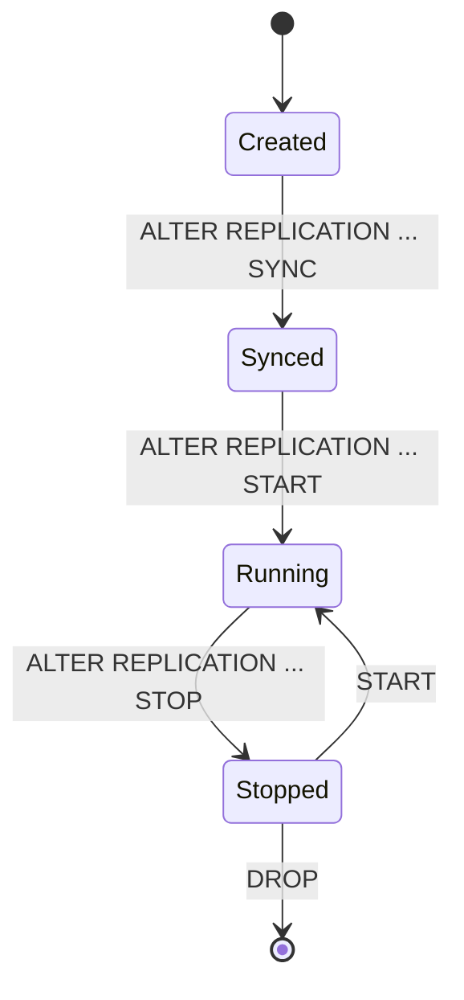

# 09. Replication, HA, and CDC

## Applicable Versions

- 7.1: Based on Altibase 7.1 Replication Manual.
- 7.3: Based on Altibase 7.3 Replication Manual.
- 8.1: Based on Altibase 8.1 verified source Replication Manual and Altibase 8.1 Release Notes.

## Questions This File Can Answer

- Generate SQL to create, start, and stop replication objects.
- Explain the Active-Standby configuration procedure.
- When should XLog or Log Analyzer be used?
- How is 8.1 replication SSL configured?
- How is replication compatibility across versions checked?

## Source Documents

- 7.1: Altibase 7.1 Replication Manual; Log Analyzer User's Manual.
- 7.3: Altibase 7.3 Replication Manual; Log Analyzer User's Manual.
- 8.1: Altibase 8.1 verified source Replication Manual; Log Analyzer User's Manual; Replication Compatibility; Replication Network Check.

## Core Guidance

- Replication answers must mention whether required objects exist on both servers.
- Distinguish `ALTER REPLICATION ... SYNC`, `START`, `STOP`, and `FLUSH`.
- For 8.1 SSL replication, explain both `USING SSL` and `REPLICATION_SSL_PORT_NO`.

## Version Differences

- 7.1: Use 7.1 replication SQL, state, and compatibility behavior for 7.1 systems.
- 7.3: Include 7.3 replication or Log Analyzer changes when they affect HA or CDC guidance.
- 8.1: Use Altibase 8.1 verified source for replication SSL and 8.1 compatibility checks.

## State Flow Candidate

## Conversion TODO

- Organize replication create, start, stop, and sync procedures by version.
- Decompose Replication Compatibility into explanatory version matrix entries.
- Convert network check guidance into commands, symptoms, and decision criteria.
