# 09. Replication, HA, and CDC

## Applicable Versions

- 7.1: Based on Altibase 7.1 Replication Manual, Log Analyzer User's Manual, and Replication Manager tool documentation.
- 7.3: Based on Altibase 7.3 Replication Manual, Log Analyzer User's Manual, and Replication Manager tool documentation.
- 8.1: Based on Altibase 8.1 verified source Replication Manual, Log Analyzer User's Manual, Replication Manager User's Manual, and release notes.

## Questions This File Can Answer

- How should a GPT create, start, stop, synchronize, flush, and drop replication objects?
- How should a GPT explain LAZY mode, EAGER mode, Active-Standby HA, Active-Active risks, failover callbacks, and offline replication?
- Which prerequisites must be checked before recommending replication, sequence replication, replication DDL, or Log Analyzer CDC?
- How should `USING SSL` and `REPLICATION_SSL_PORT_NO` be explained for Altibase 8.1?
- How should XLog Sender, XLog Collector, Log Analysis API, and ODBC C conversion be explained?
- How should Replication Manager be used for GUI-based replication object inspection and operations?
- How should replication compatibility, protocol version, network diagnostics, and replication gaps be checked?
- Which target objects, columns, storage combinations, topology states, and mode/option combinations are eligible for replication?

## Source Documents

- 7.1: Altibase 7.1 Replication Manual; Altibase 7.1 Log Analyzer User's Manual; Replication Manager User's Manual and release notes.
- 7.3: Altibase 7.3 Replication Manual; Altibase 7.3 Log Analyzer User's Manual; Replication Manager User's Manual and release notes.
- 8.1: Altibase 8.1 verified source Replication Manual; Altibase 8.1 verified source Log Analyzer User's Manual; Replication Manager User's Manual; Altibase 8.1 release notes.
- Supplemental compatibility and network-check documents: Replication Compatibility; Replication Network Check.

## Altibase Replication and Scope Overview
- **Active-Active Replication**: Altibase supports replication topologies through XLog-based Sender and Receiver processing. Active-Active use requires explicit write ownership, conflict avoidance or conflict policy design, replication gap monitoring, and failover/failback planning. Do not promise fixed latency or automatic conflict-free behavior.
- **Scale-out scope**: Sharding and `ShardManager` setup are outside this attachment's selected replication, HA, CDC, Log Analyzer, and replication SSL source family. Do not generate sharding configuration procedures from this file; use a dedicated sharding source audit if a user asks for scale-out setup.

## Response Rules

- Answer explanatory text in the user's language.
- Keep SQL object names, function names, error codes, property names, command names, file paths, environment variables, and view names literal.
- For 8.1-specific statements, say `Altibase 8.1 verified source`.
- Do not expose internal source labels or source-tree paths in customer answers.
- For production replication actions, include prerequisites, service impact, rollback limits, and verification SQL.
- Before suggesting DDL, failover, offline replication, or cross-version replication, ask for the exact Altibase version from `V$VERSION`, replication mode, topology, replication object names, and whether a replication gap exists.
- Do not present replication as automatic schema synchronization. DML changes are log-replayed; DDL requires explicit operational handling.
- Replication object names, replicated user names, table names, partition names, and sequence names must be checked on both nodes.

## Fast Decision Map

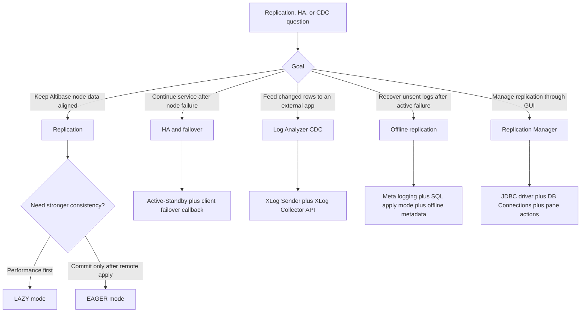

## Core Concepts

Altibase replication is log replay. The local server reads redo log changes for replication target objects, converts those changes into XLogs, sends them through a Sender thread, and the remote server applies them through a Receiver or parallel Applier threads.

Terminology block: local and remote

- `Local Server`: the node on which the current operation is executed, regardless of whether that node is Active, Standby, Sender, or Receiver for the current task.
- `Remote Server`: the peer replication node; within one replication pair, local and remote servers have a one-to-one relationship.
- `Active Server`: the node currently serving change transactions.
- `Standby Server`: the node that normally receives replicated changes and may serve read-only queries.

Terminology block: runtime threads and log positions

- `Sender`: converts logs generated by DML on replication target tables into XLog records and sends those XLogs to the remote server.
- `Receiver`: receives XLogs from the peer and applies them to local replication target objects itself, or passes them to Applier threads when appliers are used.
- `Applier`: applies XLogs to storage when the parallel receiver applier option is used; if no parallel Applier is created, the Receiver performs the apply role.
- `XLog`: the logical log record transmitted for replication and CDC.
- `XSN`: `XLog Sequence Number`, the identifier of an XLog. Do not confuse XSN with redo-log SN.
- `Restart SN`: redo-log SN, not an XSN; it is the restart point used when replication resumes.
- `Replication Gap`: the distance between the latest redo log identifier and the redo log corresponding to the currently sent XLog.

Terminology block: metadata and targets

- `Replication Object`: object created by `CREATE REPLICATION`.
- `Replication Pair`: matching replication objects with the same name on two nodes.
- `Replication Target Table`: table selected in `CREATE REPLICATION` or `ALTER REPLICATION ... ADD TABLE`.
- `Replication Target Partition`: partition selected in replication syntax.
- `Replication Target Column`: a same-named column in the corresponding local and remote target tables.

Terminology block: conflict, apply, and compatibility

- `Primary Transaction`: the service transaction that changes a replication target on the local server.
- `Replication Transaction`: the transaction generated by the Receiver while applying an XLog on the peer.
- `Data Conflict`: a case where the replication transaction cannot apply the primary transaction because of a primary-key, before-image, lock, or constraint condition.
- `Conflict Resolution`: source-backed handling for conflicts; it is not a promise of automatic Active-Active consistency.
- `SQL Apply Mode`: Receiver-side mode that converts XLogs to SQL statements when target metadata differs, especially for controlled DDL workflows. It has performance cost and does not support EAGER mode or encrypted-column targets.
- `Replication Backward Compatibility`: a one-way lower-version Sender to higher-version Receiver rule for LAZY mode when the selected sources and replication protocol versions support it. Do not invert the direction unless a source explicitly supports that pair.

## Core Replication Topology Diagram

Use this topology when explaining ordinary table-to-table or partition-to-partition replication. A `Sender` reads redo logs for local replication targets, creates XLogs, connects to the peer Receiver port, and the peer `Receiver` applies the XLogs to matching targets.

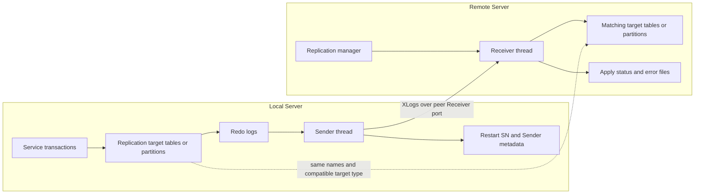

## Replication State Diagram

Use this state model when explaining `CREATE REPLICATION`, `ALTER REPLICATION ... SYNC`, `ALTER REPLICATION ... SYNC ONLY`, `START`, `QUICKSTART`, `STOP`, `RESET`, and `DROP REPLICATION`.

```mermaid
stateDiagram-v2
  [*] --> NotCreated
  NotCreated --> Created: CREATE REPLICATION on both nodes
  Created --> SyncingToStart: ALTER REPLICATION ... SYNC
  SyncingToStart --> Running: SYNC completes and Sender starts
  Created --> SyncingOnly: ALTER REPLICATION ... SYNC ONLY
  SyncingOnly --> Created: data aligned; START still required
  Created --> Running: ALTER REPLICATION ... START
  Created --> RunningCurrent: ALTER REPLICATION ... QUICKSTART
  RunningCurrent --> Running: current log position selected
  Running --> Flushing: ALTER REPLICATION ... FLUSH
  Flushing --> Running: sent through requested log point
  Running --> Stopped: ALTER REPLICATION ... STOP
  SyncingToStart --> Stopped: STOP during SYNC
  SyncingOnly --> Stopped: STOP during SYNC ONLY
  Stopped --> Running: START
  Stopped --> RunningCurrent: QUICKSTART
  Stopped --> Created: RESET
  Stopped --> NotCreated: DROP REPLICATION
```

Use this state model when explaining recovery behavior after server, communication, or service-line failure.

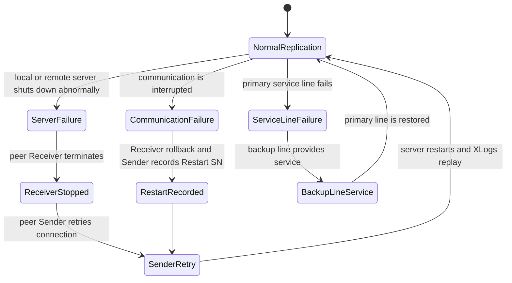

## Exact Topology, State, and SQL Answer Blocks

Use these compact blocks when the question asks for replication topology, state transitions, control SQL, gap handling, compatibility, or unsafe-operation guardrails. They preserve the exact terms an Altibase answer must keep for both new operators and advanced users.

Answer block: basic topology terms

- `Local Server`: current operation node; it can be Active, Standby, Sender, or Receiver depending on the task.
- `Remote Server`: peer node in the replication pair; local and remote are a one-to-one pair for the object.
- `Sender`: converts logs generated by DML on replication targets into `XLog` records and sends them.
- `Receiver`: receives `XLog` records and applies them directly or passes them to `Applier` threads.
- `Applier`: applies received `XLog` records to storage when parallel apply is used; without parallel appliers, Receiver performs the apply role.
- `XSN`: XLog identifier. `Restart SN` is redo-log SN, not XSN.
- `Replication Gap`: distance between the latest redo log identifier and the redo log corresponding to the currently sent XLog.

Answer block: `LAZY` versus `EAGER`

- `LAZY`: default if `CREATE REPLICATION` omits `LAZY` or `EAGER`. It prioritizes performance because the local primary transaction can commit without waiting for remote commit confirmation. A `Replication Gap` can exist.
- `EAGER`: prioritizes consistency by committing locally after the related logs are normally applied on the remote server; the remote replication transaction commits at the same time.
- `REPLICATION_EAGER_PARALLEL_FACTOR` controls the number of parallel threads for EAGER replication.
- Runtime checks must include `V$REPSENDER.REPL_MODE` and `V$REPSENDER.ACT_REPL_MODE`. If an EAGER object has a gap after failure, `ACT_REPL_MODE` can be `LAZY` even when `REPL_MODE` is `EAGER`.

```sql
SELECT rep_name,
       repl_mode,
       act_repl_mode,
       status,
       start_flag,
       net_error_flag
FROM V$REPSENDER
ORDER BY rep_name;
```

Answer block: Active-Active conflict guardrails

- In `Active-Active` replication, keep each node's write data set separate whenever possible.
- A `Conflict` occurs when the replication transaction cannot reproduce the primary transaction because of primary-key, before-image, lock, or constraint conditions.
- Altibase provides `User-Oriented Scheme`, `Master-Slave Scheme`, and `Timestamp-based Scheme`, but deferred replication has no complete automatic conflict-prevention method.
- `INSERT`, `UPDATE`, and `DELETE` conflicts can be logged in `altibase_rp.log` according to the configured scheme and properties.
- `LOB` columns are excluded from conflict resolution because previous images are not logged and primary or unique keys cannot be assigned to LOB columns for conflict detection.

Answer block: definition metadata before state advice

```sql
SELECT replication_name,
       host_count,
       is_started,
       xsn,
       item_count,
       conflict_resolution,
       repl_mode,
       role,
       options,
       remote_fault_detect_time
FROM SYSTEM_.SYS_REPLICATIONS_
ORDER BY replication_name;

SELECT replication_name,
       host_no,
       host_ip,
       port_no,
       conn_type,
       ib_latency
FROM SYSTEM_.SYS_REPL_HOSTS_
ORDER BY replication_name, host_no;

SELECT replication_name,
       local_user_name,
       local_table_name,
       local_partition_name,
       remote_user_name,
       remote_table_name,
       remote_partition_name,
       replication_unit
FROM SYSTEM_.SYS_REPL_ITEMS_
ORDER BY replication_name, local_user_name, local_table_name, local_partition_name;
```

Decode `CONFLICT_RESOLUTION` as `0` default, `1` Master Server, and `2` Slave Server. Decode `REPL_MODE` as `0` LAZY MODE and `2` EAGER MODE. Decode `ROLE` as ordinary replication, `FOR ANALYSIS`, `FOR PROPAGABLE LOGGING`, `FOR PROPAGATION`, or `FOR ANALYSIS PROPAGATION`. Treat `OPTIONS` as a decimal bit flag; include recovery, offline, gapless, parallel applier, grouping, meta logging, and receive-only only when the target version exposes the relevant flag.

Answer block: `CREATE REPLICATION` SQL prerequisites

- Only `SYS` can create a replication object.
- `CREATE REPLICATION` creates a local-to-remote replication connection.
- The same `replication_name` must exist on both nodes.
- Replication is table-to-table or partition-to-partition one-to-one mapping.
- `AS MASTER` and `AS SLAVE` select the Master-Slave conflict-resolution scheme; use the Replication Manual for conflict details.
- `replication_host_ip` is the remote server IP address or host name.
- `replication_host_port_no` is the remote Receiver thread port for the chosen transport: `REPLICATION_PORT_NO` for `TCP`, `REPLICATION_SSL_PORT_NO` for Altibase 8.1 verified source `SSL`, and `REPLICATION_IB_PORT_NO` for `IB`.
- If `USING` is omitted, `TCP` is used.
- In 7.3, `FOR ANALYSIS` creates a Log Analyzer replication object; Log Analyzer does not support `IB` communication.

Answer block: control SQL state changes

```sql
ALTER REPLICATION replication_name START [RETRY];
ALTER REPLICATION replication_name QUICKSTART [RETRY];
ALTER REPLICATION replication_name STOP;
ALTER REPLICATION replication_name RESET;
ALTER REPLICATION replication_name ADD TABLE
  FROM user_name.table_name [PARTITION partition_name]
  TO   user_name.table_name [PARTITION partition_name];
ALTER REPLICATION replication_name DROP TABLE
  FROM user_name.table_name [PARTITION partition_name]
  TO   user_name.table_name [PARTITION partition_name];
ALTER REPLICATION replication_name FLUSH [ALL] [WAIT timeout_sec];
```

- `START` begins from the most recent replication point. `QUICKSTART` starts from the current log position and can skip unsent historical changes.
- `START RETRY` or `QUICKSTART RETRY` creates a local Sender thread even if the first Handshaking attempt fails. Because iSQL can show success after the first failure, verify with trace logs and `V$REPSENDER.START_FLAG`, `V$REPSENDER.NET_ERROR_FLAG`, and `V$REPSENDER.STATUS`.
- `RESET` resets restart information such as `Restart SN`; use it only while replication is stopped.
- `DROP TABLE` removes a table or partition from the replication object. If primary transaction logs or table metadata logs for that target remain inside the replication gap, Altibase can give up the gap and data mismatch can result.
- `FLUSH` waits up to `timeout_sec` for the Sender to transmit changes through the log point at command execution. `FLUSH ALL` waits through the latest log, not only the current log point.

Answer block: `SYNC` and `SYNC ONLY`

```sql
ALTER REPLICATION replication_name SYNC [PARALLEL parallel_factor]
  [TABLE user_name.table_name [PARTITION partition_name], ...];

ALTER REPLICATION replication_name SYNC ONLY [PARALLEL parallel_factor]
  [TABLE user_name.table_name [PARTITION partition_name], ...];

ALTER REPLICATION replication_name START;
```

- `SYNC` sends all records from local replication target tables to the corresponding remote target tables and then starts replication from the current log.
- `SYNC ONLY` transfers records like `SYNC` but does not start replication afterward; run `ALTER REPLICATION ... START` explicitly when replication should resume.
- `PARALLEL parallel_factor` defaults to `1` when omitted. Values above `CPU count * 2` are capped to `CPU count * 2`; `0` or negative values are errors.
- If `STOP` interrupts `SYNC`, Altibase does not guarantee all rows were sent. Delete or otherwise safely clear affected remote target rows or partitions before rerunning `SYNC`.
- Use `V$REPSYNC.REP_NAME`, `V$REPSYNC.SYNC_TABLE`, `V$REPSYNC.SYNC_PARTITION`, and `V$REPSYNC.SYNC_RECORD_COUNT`; `SYNC_RECORD_COUNT` becomes `-1` after synchronization completes.
- Include `REPLICATION_SYNC_LOCK_TIMEOUT` when explaining how long synchronization waits for target locks.

Answer block: gap reduction and parallel apply

- `GAPLESS` is LAZY-only. It delays transaction commit when the Sender predicts the `Replication Gap` cannot be resolved within `REPLICATION_GAPLESS_ALLOW_TIME`.
- `REPLICATION_GAPLESS_MAX_WAIT_TIME` limits the maximum commit delay. `0` means wait until the gap is resolved.
- `GAPLESS` can degrade service performance because it intentionally delays commits.
- `PARALLEL` applier is also LAZY-only. It creates multiple Applier threads and distributes received XLogs by transaction.
- `receiver_applier_count` is `0` through `512`; `0` creates no parallel Appliers, so the Receiver performs the apply role.
- `REPLICATION_RECEIVER_APPLIER_QUEUE_SIZE` is the maximum number of XLogs the Receiver can pass to Applier waiting queues; larger values can use more memory.

Answer block: host-list failover and transport

```sql
CREATE REPLICATION rep1
WITH 'standby_ip_1', standby_port
     'standby_ip_2', standby_port
FROM sys.t1 TO sys.t1;

ALTER REPLICATION rep1 STOP;
ALTER REPLICATION rep1 ADD HOST 'standby_ip_3', standby_port USING TCP;
ALTER REPLICATION rep1 DROP HOST 'standby_ip_3', standby_port USING TCP;
ALTER REPLICATION rep1 DROP HOST ALL;
ALTER REPLICATION rep1 SET HOST 'standby_ip_2', standby_port;
```

- Multiple hosts in `WITH` are listed without comma separators between host entries. Multiple `FROM ... TO ...` table entries use comma separators.
- `ADD HOST`, `DROP HOST`, `DROP HOST ALL`, and `SET HOST` require the replication object to be stopped.
- `DROP HOST ALL` removes all hosts. Replication cannot start again until host information is added or the object is intentionally converted to receive-only.
- If `USING conn_type` is omitted, `TCP` is used. `IB` requires `IB_ENABLE = 1`, can include `ib_latency`, and does not detect physical network failures.

Answer block: offline replication recovery

```sql
CREATE REPLICATION rep1 OPTIONS OFFLINE '/active_server/altibase_home/logs'
WITH 'active_ip', active_port
FROM sys.t1 TO sys.t1;

ALTER REPLICATION rep1 SET OFFLINE ENABLE WITH '/active_server/altibase_home/logs';
ALTER REPLICATION rep1 BUILD OFFLINE META [AT SN(sn)];
ALTER SYSTEM SET REPLICATION_SQL_APPLY_ENABLE = 1;
ALTER REPLICATION rep1 START WITH OFFLINE;
ALTER SYSTEM SET REPLICATION_SQL_APPLY_ENABLE = 0;
ALTER REPLICATION rep1 RESET OFFLINE META;
ALTER REPLICATION rep1 SET OFFLINE DISABLE;
```

- Offline replication applies unsent logs from the Active server on the replication server where the Receiver thread runs.
- Preconditions: the Active server previously started replication, `META_LOGGING` was enabled on the Active server replication object, and Active server log files plus Sender meta files are accessible.
- `OPTIONS OFFLINE`, `SET OFFLINE ENABLE`, `BUILD OFFLINE META`, `START WITH OFFLINE`, `RESET OFFLINE META`, and `SET OFFLINE DISABLE` are the source-backed lifecycle tokens.
- Enable SQL apply mode before `START WITH OFFLINE`; disable it afterward. Offline replication is one-time, and Sender/Receiver threads terminate automatically after unsent logs are applied.
- Offline replication is LAZY-only, cannot be used with compressed-table replication objects or `RECOVERY`, and requires the offline server and Active server to have the same OS, CPU type, CPU bit count, three-part binary database version, and `LOG_FILE_SIZE`.
- Check `V$REPOFFLINE_STATUS.REP_NAME`, `STATUS`, and `SUCCESS_TIME`; `STATUS` values are `0` not started, `1` started, `2` ended, and `3` failed.

Answer block: `META_LOGGING` forms

```sql
CREATE REPLICATION replication_name OPTIONS META_LOGGING
WITH 'standby_ip', standby_port
FROM sys.t1 TO sys.t1;

CREATE REPLICATION replication_name FOR ANALYSIS OPTIONS META_LOGGING
WITH 'collector_ip', collector_port
FROM sys.t1 TO sys.t1;
```

- In Altibase 8.1 verified source, `META_LOGGING` was expanded from adapter-oriented use to ordinary replication as well.
- Ordinary replication stores Sender meta information and `Restart SN` information under `repl_meta_files` in the log file path.
- Log Analyzer role replication stores Sender meta information and `Restart SN` information under `ala_meta_files`.
- Offline replication uses the saved files to obtain Active server metadata; configure `META_LOGGING` on the Active server replication object before the failure path depends on it.

Answer block: DDL replication guardrails

- DDL replication requires `REPLICATION_DDL_SYNC = 1` on each node.
- Each node must set `REPLICATION_DDL_ENABLE = 1` and must use the same `REPLICATION_DDL_ENABLE_LEVEL`.
- Participating replication objects must be running, and local/remote table names, table partition names, and replicated user names must match.
- Perform DDL replication from only one node at a time.
- DDL replication is not allowed when the `propagation` option is used.
- `REPLICATION_DDL_ENABLE_LEVEL` works only after `REPLICATION_DDL_ENABLE` is `1`; check current values through `V$PROPERTY`.
- The DDL-executing session must not use `ALTER SESSION SET REPLICATION = NONE`, because `NONE` excludes session DDL, DML, and DCL from replication. Use `ALTER SESSION SET REPLICATION = DEFAULT` when the DDL should follow the replication object's mode.
- 7.1.0.1.4 `BUG-45946` introduced DDL synchronization controls, including `REPLICATION_DDL_SYNC_TIMEOUT`; that timeout can be changed with `ALTER SYSTEM` or `ALTER SESSION`, and all node timeouts use the Active node's timeout value for the DDL operation.
- 7.1.0.6.5 `BUG-49398` applies when `REPLICATION_DDL_SYNC = 1` and `REPLICATION_DDL_ENABLE = 1`. It retries temporary DDL failures from table-lock acquisition failure or deadlock during `REPLICATION_DDL_SYNC_TIMEOUT`; if the timeout expires, DDL replication stops.
- DDL replication requires all three `replication protocol version` digits to match. 7.1.0.6.5 changed the protocol patch version from `7.4.6` to `7.4.7`; do not use DDL replication between 7.1.0.6.4-or-lower and 7.1.0.6.5-or-higher servers. The documented mismatch error includes `ERR-61186` and `Different replication protocols`.

Answer block: cross-version compatibility

- Version 6 and later selected sources guarantee replication backward compatibility as lower-version-to-higher-version data transmission when the first two digits of the `replication protocol version` match.
- This rule is for `LAZY` replication. `EAGER` mode and `offline replication` are exceptions and require same-version support.
- For 7.3, the compatibility document lists `7.1`, `6.5.1`, `6.3.1`, and `6.1.1` Senders to a `7.3` Receiver as LAZY-compatible, but a `7.3` Sender to a `6.1.1` Receiver is incompatible.
- For 7.1, it lists LAZY compatibility with `6.5.1` and `6.3.1` in both shown directions, but a `7.1` Sender to a `6.1.1` Receiver is incompatible.
- Protocol anchors: `7.3.0.0.1` and later use `7.4.9`; `7.1.0.6.5` and later use `7.4.7`.
- Before answering compatibility, ask for Sender/Receiver direction, `product_version`, `meta_version`, `repl_protocol_version`, mode, option list, and whether DDL replication, offline replication, receive-only, SSL, or EAGER is involved.

Answer block: `BUG-46940` after sender-side database rebuild

- For `BUG-46940` in `7.1.0.2.4`, the scenario is: replication was configured, the Sender sent XLogs so the Receiver `restartXSN` increased, the Sender-side database was rebuilt so Sender `XSN` reset, and the Receiver-side replication object was not dropped so old metadata remained.
- Because the Receiver sends old `restartXSN` to the Sender and current Sender `XSN` is smaller than that `restartXSN`, the Sender treats the logs as already sent and does not send `XLog`.
- The fix makes a newly created Sender-side replication object transmit a flag so the Receiver initializes metadata and sends a reset `restartXSN`.
- Documented workaround: when one side rebuilds the database, run `DROP REPLICATION` and `CREATE REPLICATION` on both sides, not only on the rebuilt Sender side.
- Patch note protocol tokens: `7.4.4` changed to `7.4.5`, with backward compatibility guaranteed for that patch note.

## Replication Mode Guide

Mode block: `LAZY`

- Purpose: prioritize performance.
- Commit behavior: the local master transaction can commit without waiting for remote apply.
- Risk: a replication gap can occur when the system is busy or the network is slow.
- Useful options: `GAPLESS`, `PARALLEL`, `GROUPING`, `OFFLINE`, and Log Analyzer role are LAZY-oriented features.
- Caution: if failover occurs while a gap remains, the standby may not have all committed data.

Mode block: `EAGER`

- Purpose: prioritize data consistency.
- Commit behavior: the local transaction commits only after remote apply confirmation.
- Benefit: avoids delayed replication backlog and supports parallel replication.
- Important property: `REPLICATION_EAGER_PARALLEL_FACTOR`.
- Cautions:
  - Both local and remote replication objects must use EAGER mode for synchronization.
  - EAGER mode is not recommended for three or more nodes.
  - Network failure can still create split-brain style inconsistency if both sides continue accepting updates.
  - A table should participate in only one EAGER-mode replication object; using the same table in multiple EAGER replications can cause data mismatch and incremental sync failure after a fault.
  - Node time must be synchronized.
  - If abnormal termination occurs before committed logs are flushed to disk, data can be lost unless the documented recovery option or commit-write properties such as `COMMIT_WRITE_WAIT_MODE`, `REPLICATION_COMMIT_WRITE_WAIT_MODE`, and `REPLICATION_SYNC_LOG` are considered.
  - `REPLICATION_SQL_APPLY_ENABLE` is not available in EAGER mode.
  - Offline replication and cross-version compatibility rules that apply to LAZY mode do not make EAGER safe across different versions.

## Mode And Feature Compatibility Map

Compatibility block: ordinary `LAZY`

- Default mode when `CREATE REPLICATION` omits `LAZY` or `EAGER`.
- Highest performance mode, but a replication gap can exist.
- The selected compatibility sources use LAZY mode for lower-version Sender to higher-version Receiver backward compatibility.
- Before using cross-version LAZY replication, compare `product_version`, `meta_version`, and `repl_protocol_version` from both nodes and verify that the planned direction is source-supported.

Compatibility block: `EAGER`

- Use only when both sides are designed for EAGER and both matching replication objects are EAGER.
- Do not use EAGER as a cross-version compatibility feature; selected sources do not guarantee EAGER backward compatibility.
- Do not recommend `START RETRY`, `QUICKSTART RETRY`, `REPLICATION_SQL_APPLY_ENABLE`, receive-only, or offline replication with EAGER mode.
- Avoid three-or-more-node EAGER designs unless a dedicated source-backed design review proves the topology.

Compatibility block: DDL replication and SQL Apply Mode

- DDL replication is separate from normal DML replication and should be used only for documented DDL categories.
- Backward compatibility for DDL replication is source-backed only when all three components of `repl_protocol_version` match.
- SQL Apply Mode is Receiver-side and can preserve replication while metadata differs, but it can be much slower.
- SQL Apply Mode does not support EAGER mode or targets with encrypted columns.
- Do not use the DDL synchronization procedure for `RECOVERY`, `FOR PROPAGATION`, `RECEIVE_ONLY`, or partitioned-table-with-global-non-partitioned-index cases.

Compatibility block: optional features

- Offline replication, EAGER mode, and other replication optional features are not covered by the lower-version-to-higher-version LAZY compatibility rule.
- Offline replication additionally requires same OS, CPU type, CPU bit count, three-part binary database version, and `LOG_FILE_SIZE`, and it cannot include compressed-table replication objects.
- Receive-only is 7.3 and Altibase 8.1 verified source material; on 7.1, treat it as 7.1.0.8.5 patch-level material and verify `meta_version` before use.
- Log Analyzer requires protocol compatibility between the Log Analysis API and the Altibase database, supports only LAZY mode, and does not support SSL or InfiniBand communication.
- Altibase 8.1 replication SSL is a transport feature selected by `USING SSL` and `REPLICATION_SSL_PORT_NO`; it is not a cross-version compatibility guarantee.

## Topology Guide

Topology block: Active-Standby

- Recommended for most HA answers.
- One Active node receives application DML; one Standby node receives replicated XLogs.
- Failover should be paired with application-side callback validation because LAZY replication may leave a gap.
- Sequence replication is recommended in Active-Standby, not Active-Active.

Topology block: Active-Active

- Both nodes can serve writes, but conflict risk is higher.
- Primary keys must not be updated.
- Conflicts during `INSERT`, `UPDATE`, or `DELETE` are skipped and logged to error files according to conflict rules.
- If both nodes update the same row differently, data mismatch can occur.
- Use only after explaining conflict resolution, routing rules, and application ownership of rows.

Topology block: multi-IP replication

- A replication object can contain multiple remote host address and port pairs.
- The Sender starts with the first host and can reconnect through another host after a line failure.
- In `CREATE REPLICATION`, multiple `WITH 'remote_host', remote_port [USING conn_type [ib_latency]]` host entries are listed without comma separators between host entries; `FROM ... TO ...` table entries use comma separators.
- `ALTER REPLICATION ... ADD HOST`, `DROP HOST`, and `SET HOST` require the replication object to be stopped.
- `ALTER REPLICATION replication_name DROP HOST ALL` removes all hosts. After `DROP HOST ALL`, replication cannot be started again until host information is added.
- After `SET HOST`, the selected host is used when replication is restarted.
- If `USING conn_type` is omitted, ordinary `TCP` is used. `USING IB [ib_latency]` requires `IB_ENABLE=1`; InfiniBand use does not detect physical network failures, so do not treat it as a full network-failure detector.

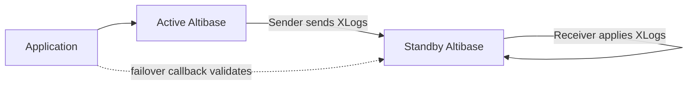

Use this diagram when explaining why Active-Active replication needs write ownership rules and conflict planning.

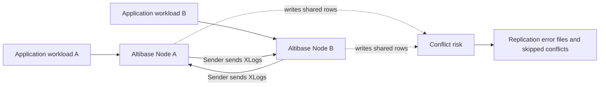

Use this topology for a replication object with multiple remote host address and port pairs.

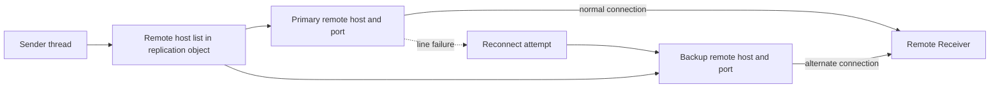

Use this partition topology when explaining that table targets map to tables and partition targets map to matching partitions.

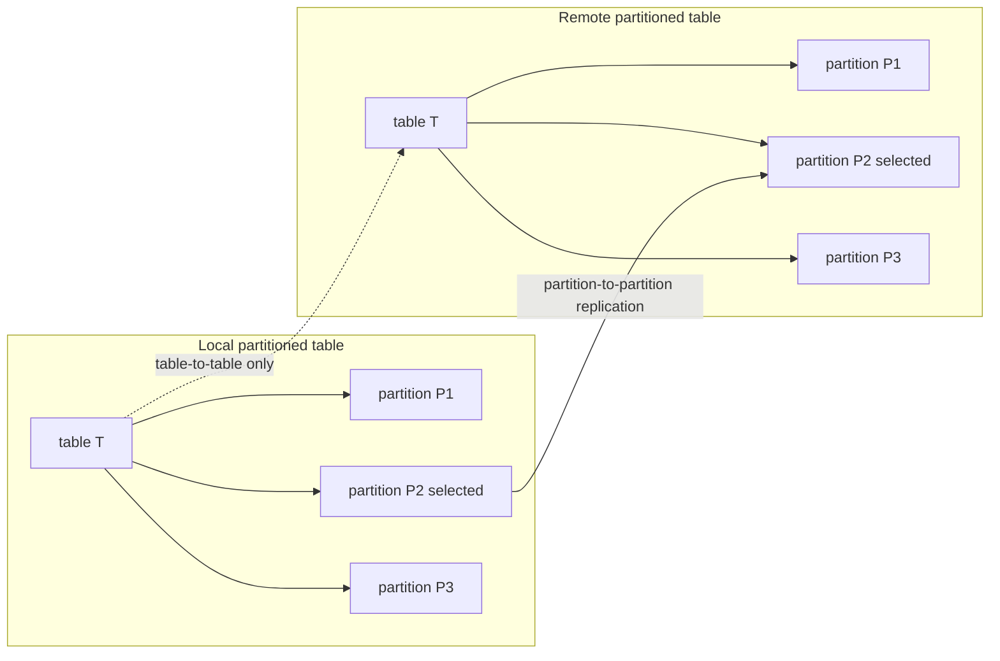

## Active-Active Conflict Guardrails

Use these blocks when a customer asks whether an Active-Active topology is safe, how conflicts are handled, or why the standby has different rows after bidirectional writes.

Conflict block: why conflicts occur

- `INSERT` conflict: the replicated insert finds an existing primary key, finds a duplicate value for a unique constraint, or cannot acquire the needed lock before timeout.
- `UPDATE` conflict: the replicated update cannot find the primary key, the row's before-image differs from the primary transaction's before-image, or the update creates a duplicate key.
- `DELETE` conflict: the replicated delete cannot find the primary key or cannot acquire the needed lock before timeout.
- Deferred LAZY replication does not provide a complete automatic conflict-prevention scheme. The safest design is to keep each node's write data set separate.
- LOB columns are excluded from conflict resolution because they do not log before-images and cannot define primary or unique keys.

Conflict block: user-oriented properties

- `REPLICATION_INSERT_REPLACE = 0`: default insert-conflict behavior; do not delete/insert and log a conflict error.
- `REPLICATION_INSERT_REPLACE = 1`: for same-primary-key insert conflicts, delete the existing record and insert the replicated record.
- `REPLICATION_UPDATE_REPLACE = 0`: default update-conflict behavior; do not update and log a conflict error.
- `REPLICATION_UPDATE_REPLACE = 1`: update the target row for supported before-image or missing-primary-key update conflicts.
- These properties are policy choices, not generic repair advice. Ask for the table definition, conflict message, current property values, and whether the topology is Active-Active before recommending a setting change.

Conflict block: `AS MASTER` and `AS SLAVE`

- `AS MASTER` and `AS SLAVE` provide role-based conflict behavior during handshaking.
- Valid handshakes are not-set with not-set, master with slave, and slave with master.
- Invalid role pairings fail the Sender/Receiver handshake.
- When omitted, conflict behavior follows `REPLICATION_INSERT_REPLACE` and `REPLICATION_UPDATE_REPLACE`.

Conflict block: timestamp-based scheme

- Use only when every intended table has a `TIMESTAMP` column and `REPLICATION_TIMESTAMP_RESOLUTION = 1`.
- It applies to `INSERT` and `UPDATE`, not to every possible conflict.
- For `INSERT`, the after-image `TIMESTAMP` is compared with the existing row; if the incoming timestamp is equal or newer, the existing row is replaced.
- For `UPDATE`, the after-image `TIMESTAMP` is compared with the target row; if the incoming timestamp is equal or newer, the target row is updated and the incoming timestamp is preserved.
- Adding a `TIMESTAMP` column adds storage per row, and tables without the timestamp-based conditions continue to use the ordinary conflict-resolution scheme.

## Prerequisite Checklist

Object and schema prerequisites:

- The same replication object name must exist on both nodes.
- The source and target object names in `FROM ... TO ...` must be intentional and checked on both nodes.
- The database character set and national character set must match on both nodes. Check `V$NLS_PARAMETERS`.
- Replication target tables must have primary keys.
- Primary-key columns on target tables must not be updated.
- Replication target item types must match: table to table, partition to partition. Table-to-partition crossover is not supported.
- When removing a replication target, use the same table or partition granularity that was used when the target was added; partitions added individually must be removed individually.
- For partition replication, partitioning method and partition constraints must match. Hash partition counts must match.

Operational prerequisites:

- Only `SYS` can run replication-related SQL.
- `REPLICATION_MAX_COUNT` limits the number of replication connections from one Altibase database.
- Before DDL or topology changes, check replication gap and stop/migrate service when required.
- For network-sensitive operations, capture evidence from both Sender and Receiver sides.

Verification SQL:

```sql
SELECT product_version,
       meta_version,
       protocol_version,
       repl_protocol_version
FROM V$VERSION;

SELECT parameter, value
FROM V$NLS_PARAMETERS
WHERE parameter IN ('NLS_CHARACTERSET', 'NLS_NCHAR_CHARACTERSET')
ORDER BY parameter;

SELECT name, value1
FROM V$PROPERTY
WHERE name IN (
  'REPLICATION_MAX_COUNT',
  'REPLICATION_PORT_NO',
  'REPLICATION_IB_PORT_NO',
  'REPLICATION_SSL_PORT_NO',
  'REPLICATION_SYNC_LOCK_TIMEOUT',
  'REPLICATION_SQL_APPLY_ENABLE',
  'REPLICATION_DDL_ENABLE',
  'REPLICATION_DDL_ENABLE_LEVEL',
  'REPLICATION_DDL_SYNC',
  'REPLICATION_EAGER_PARALLEL_FACTOR',
  'REPLICATION_SENDER_AUTO_START'
)
ORDER BY name;
```

## Object Eligibility And Target Compatibility

Target matching block: object and column identity

- Altibase chooses replication targets by object name. Check owner, table, partition, and sequence-sync table names explicitly on both nodes.
- Supported target units are table-to-table and partition-to-partition. Table-to-partition and partition-to-table mappings are not supported.
- Only columns with the same name on the local and remote target are replicated. Columns with different names or columns that exist on only one side are not replicated.
- Use `V$REPRECEIVER_COLUMN` to confirm the effective target columns and apply mode after the Receiver has target metadata.

Target matching block: mandatory data rules

- Every ordinary replication target table must have a primary key.
- Do not update primary-key columns on replication target tables.
- During a replicated `INSERT`, non-target columns receive `NULL`; verify `NOT NULL`, default, check, and unique constraints before allowing schema drift.
- If column type, `NOT NULL`, check constraint, unique-key index, or function-based index definitions differ between peers and `REPLICATION_SQL_APPLY_ENABLE = 1`, the Receiver can switch to SQL Apply Mode and replication performance can drop.
- If a unique-key index or function-based index uses both replication target columns and non-target columns, SQL Apply Mode can be used. Confirm that this is intentional before a DDL or schema-drift answer.

Target matching block: partitioned tables

- Local and remote partitioning methods must match.
- Range and list partition conditions must match. If only some partitions are replicated, the replicated partitions' conditions must match; this also applies to default partitions.
- Hash partition counts must match.
- When dropping a target item, use the same granularity used to add it. A partition added individually must be dropped individually.

Target matching block: storage and platform combinations

- Ordinary replication between memory and disk tables is source-supported, but the object names, primary keys, column mapping, and constraints still need the usual checks.
- Ordinary replication between different server kinds is source-supported. Altibase handles byte ordering, structure alignment, endian, and bit-count differences in Sender/Receiver buffers.
- If byte ordering differs between servers, conversion work can reduce replication performance.
- Offline replication is stricter than ordinary replication: do not apply the heterogeneous-platform allowance to offline replication.

Target validation SQL:

```sql
SELECT r.replication_name,
       r.repl_mode,
       r.role,
       r.options,
       i.local_user_name,
       i.local_table_name,
       i.local_partition_name,
       i.remote_user_name,
       i.remote_table_name,
       i.remote_partition_name,
       i.replication_unit
FROM system_.sys_replications_ r,
     system_.sys_repl_items_ i
WHERE r.replication_name = i.replication_name
ORDER BY r.replication_name, i.local_user_name, i.local_table_name, i.local_partition_name;

SELECT rep_name,
       user_name,
       table_name,
       partition_name,
       column_name,
       apply_mode
FROM V$REPRECEIVER_COLUMN
ORDER BY rep_name, user_name, table_name, partition_name, column_name;
```

## CREATE REPLICATION Syntax

Use this compact BNF-like form for customer answers.

```text
ordinary_table_replication ::=
  CREATE [LAZY | EAGER] REPLICATION [IF NOT EXISTS] replication_name
    [AS MASTER | AS SLAVE]
    [OPTIONS option_name [option_name ...]]
    WITH 'remote_host_ip_or_name', remote_host_port_no [USING conn_type [ib_latency]]
         [...]
    FROM user_name.table_name [PARTITION partition_name]
    TO   user_name.table_name [PARTITION partition_name]
    [, FROM ... TO ...];

log_analyzer_cdc_replication ::=
  CREATE REPLICATION replication_name
    { FOR ANALYSIS | FOR ANALYSIS PROPAGATION }
    [OPTIONS option_name [option_name ...]]
    { WITH 'xlog_collector_host_ip_or_name', xlog_collector_port_no
           [...]
    | WITH UNIX_DOMAIN }
    FROM user_name.table_name
    TO   user_name.table_name
    [, FROM ... TO ...];

propagation_replication ::=
  CREATE [LAZY | EAGER] REPLICATION [IF NOT EXISTS] replication_name
    { FOR PROPAGABLE LOGGING | FOR PROPAGATION }
    [AS MASTER | AS SLAVE]
    [OPTIONS option_name [option_name ...]]
    WITH 'remote_host_ip_or_name', remote_host_port_no [USING conn_type [ib_latency]]
         [...]
    FROM user_name.table_name [PARTITION partition_name]
    TO   user_name.table_name [PARTITION partition_name]
    [, FROM ... TO ...];

receive_only_replication ::=
  CREATE REPLICATION replication_name OPTIONS RECEIVE_ONLY
    FROM user_name.table_name [PARTITION partition_name]
    TO   user_name.table_name [PARTITION partition_name]
    [, FROM ... TO ...];

replication_option_list ::=
  OPTIONS replication_option [replication_option ...]

replication_option ::=
    RECOVERY
  | OFFLINE 'log_dir' [, 'log_dir' ...]
  | GROUPING
  | PARALLEL receiver_applier_count [buffer_size]
  | GAPLESS
  | RECEIVE_ONLY
  | META_LOGGING
```

Syntax notes:

- If `LAZY` or `EAGER` is omitted, LAZY mode is used.
- `IF NOT EXISTS` is available for `CREATE REPLICATION` in Altibase 8.1 verified source. Omit it for 7.1 and 7.3.
- `IF EXISTS` is available for `DROP REPLICATION` in Altibase 8.1 verified source. Omit it for 7.1 and 7.3.
- `replication_name` must be the same on both nodes.
- `remote_host_port_no` is the peer Receiver port, not an arbitrary client port.
- If the `USING` clause is omitted, ordinary TCP replication is used.
- In non-SSL TCP replication, use the peer `REPLICATION_PORT_NO`. This is the ordinary replication port, not the database service port and not `SSL_PORT_NO`.
- In Altibase 8.1 verified source SSL replication, use the peer `REPLICATION_SSL_PORT_NO` with `USING SSL`.
- For InfiniBand, use `USING IB [ib_latency]` and the peer `REPLICATION_IB_PORT_NO`.
- `FOR ANALYSIS` and `FOR ANALYSIS PROPAGATION` create a Log Analyzer XLog Sender and are not ordinary table-to-table apply syntax. Do not combine those Log Analyzer forms with `EAGER`, `USING SSL`, or `USING IB`; Log Analyzer CDC is LAZY/TCP or UNIX-domain-socket scoped.
- For Log Analyzer TCP, the `WITH` endpoint is the XLog Collector IP address or host name and port. The XLog Collector must already be listening before `ALTER REPLICATION ... START`.
- `FOR PROPAGABLE LOGGING` and `FOR PROPAGATION` are propagation roles, not Log Analyzer CDC forms. Use the ordinary replication connection rules for their `WITH` clause; for 8.1 SSL replication, use the peer `REPLICATION_SSL_PORT_NO` with `USING SSL`.
- For Log Analyzer `WITH UNIX_DOMAIN`, the XLog Sender and XLog Collector must run on the same UNIX or Linux host. `$ALTIBASE_HOME` must be the same for Sender and Collector, and the generated socket path is `$ALTIBASE_HOME/trc/rp-replication_name`.
- `AS MASTER` and `AS SLAVE` affect handshaking. Valid pairings are not-set with not-set, master with slave, and slave with master.
- `OPTIONS RECEIVE_ONLY` uses a receive-only creation form without a peer host list. When receive-only mode is later turned off, supply the peer host again with `SET RECEIVE_ONLY OFF WITH ...`.
- `RECOVERY`, `OFFLINE`, `GROUPING`, `PARALLEL`, `GAPLESS`, `RECEIVE_ONLY`, and `META_LOGGING` are replication options with different restrictions. Before generating an option list, confirm replication mode, role, whether DDL replication is needed, and whether the option is mutually exclusive with the chosen recovery or receive-only behavior.

## CREATE REPLICATION Examples: Non-SSL TCP

Use this case for ordinary replication over TCP in 7.1, 7.3, and 8.1 when the customer did not request replication SSL.

Non-SSL prerequisites:

- Target tables and primary keys already exist on both nodes.
- Both nodes use the same database character set and national character set.
- The peer port used in `WITH 'host', port` is the peer node's `REPLICATION_PORT_NO`.
- The same `replication_name` and target item list are created on both nodes, with the peer endpoint reversed.
- The same table-to-table or partition-to-partition mapping is intended on both nodes.

Preflight:

```sql
SELECT name, value1
FROM V$PROPERTY
WHERE name IN ('REPLICATION_PORT_NO', 'REPLICATION_MAX_COUNT')
ORDER BY name;
```

Example topology:

- Node A: `192.168.1.60`, `REPLICATION_PORT_NO = 25524`
- Node B: `192.168.1.12`, `REPLICATION_PORT_NO = 35524`
- Replication object: `rep1`
- Replication targets: `sys.employees`, `sys.departments`

```sql
-- Node A: use Node B's ordinary replication port.
CREATE REPLICATION rep1
WITH '192.168.1.12', 35524
FROM sys.employees TO sys.employees,
FROM sys.departments TO sys.departments;

-- Node B: use Node A's ordinary replication port.
CREATE REPLICATION rep1
WITH '192.168.1.60', 25524
FROM sys.employees TO sys.employees,
FROM sys.departments TO sys.departments;
```

Initial start choices:

```sql
-- Copy current target rows from the local node to the peer, then start Sender.
ALTER REPLICATION rep1 SYNC;

-- If data was already aligned and restart metadata is valid, resume from the latest restart point.
ALTER REPLICATION rep1 START;

-- Use only when old unsent changes may be skipped intentionally.
ALTER REPLICATION rep1 QUICKSTART;
```

## CREATE REPLICATION Examples: Altibase 8.1 SSL

Use this case only for Altibase 8.1 verified source replication SSL. Keep it separate from ordinary client/server SSL/TLS. The ordinary client/server SSL listener uses `SSL_PORT_NO`; replication SSL uses `REPLICATION_SSL_PORT_NO`.

SSL prerequisites:

- Both nodes are Altibase 8.1 when using this verified 8.1 guidance.
- Ordinary SSL/TLS setup has already been completed on each replication target server.
- Each node has a nonzero `REPLICATION_SSL_PORT_NO`.
- Firewalls allow each peer to connect to the other peer's `REPLICATION_SSL_PORT_NO`.
- `USING SSL` is specified in both matching `CREATE REPLICATION` statements.
- Keep the ordinary TCP replication port `REPLICATION_PORT_NO` in the answer as the contrast point: TCP uses `REPLICATION_PORT_NO`; SSL replication uses `REPLICATION_SSL_PORT_NO`; ordinary client/server SSL/TLS uses `SSL_PORT_NO`.
- `FOR ANALYSIS` Log Analyzer replication is not combined with SSL, because Log Analyzer does not support SSL or InfiniBand communication in the verified source guidance.

Preflight:

```sql
SELECT name, value1
FROM V$PROPERTY
WHERE name IN (
  'SSL_ENABLE',
  'SSL_PORT_NO',
  'REPLICATION_PORT_NO',
  'REPLICATION_SSL_PORT_NO',
  'REPLICATION_MAX_COUNT'
)
ORDER BY name;
```

Example topology:

- Node A: `192.168.1.60`, `REPLICATION_SSL_PORT_NO = 35524`
- Node B: `192.168.1.12`, `REPLICATION_SSL_PORT_NO = 45524`
- Replication object: `rep1_ssl`
- Replication targets: `sys.employees`, `sys.departments`

```sql
-- Node A: use Node B's SSL replication port.
CREATE REPLICATION rep1_ssl
WITH '192.168.1.12', 45524 USING SSL
FROM sys.employees TO sys.employees,
FROM sys.departments TO sys.departments;

-- Node B: use Node A's SSL replication port.
CREATE REPLICATION rep1_ssl
WITH '192.168.1.60', 35524 USING SSL
FROM sys.employees TO sys.employees,
FROM sys.departments TO sys.departments;
```

Start SSL replication the same way as non-SSL replication:

```sql
-- Initial copy and start.
ALTER REPLICATION rep1_ssl SYNC;

-- Normal restart after a controlled stop.
ALTER REPLICATION rep1_ssl START;

-- Planned maintenance validation before service movement.
ALTER REPLICATION rep1_ssl FLUSH ALL WAIT 60;
```

Altibase 8.1 SSL cautions:

- Altibase 8.1 supports SSL/TLS encryption for replication communication.
- `USING SSL` is specified in `CREATE REPLICATION`.
- `REPLICATION_SSL_PORT_NO` is an `Unsigned Integer`, read-only, single value property. It configures the local SSL replication Receiver port. If this property is `0`, SSL replication cannot connect to that node.
- General SSL/TLS server setup must be completed before using SSL replication.
- `REPLICATION_PORT_NO`, `SSL_PORT_NO`, and `REPLICATION_SSL_PORT_NO` are different ports.
- Log Analyzer does not support SSL or InfiniBand communication; do not combine `FOR ANALYSIS` with `USING SSL`.

Non-SSL multi-IP example:

```sql
CREATE REPLICATION rep1
WITH 'standby_ip_1', standby_port 'standby_ip_2', standby_port
FROM sys.employees TO sys.employees,
FROM sys.departments TO sys.departments;

ALTER REPLICATION rep1 STOP;
ALTER REPLICATION rep1 ADD HOST 'standby_ip_3', standby_port;
ALTER REPLICATION rep1 SET HOST 'standby_ip_2', standby_port;
ALTER REPLICATION rep1 START;
```

## ALTER REPLICATION Operations

Syntax block:

```text
ALTER REPLICATION replication_name SYNC [PARALLEL parallel_factor]
  [TABLE user_name.table_name [PARTITION partition_name], ...];

ALTER REPLICATION replication_name SYNC ONLY [PARALLEL parallel_factor]
  [TABLE user_name.table_name [PARTITION partition_name], ...];

ALTER REPLICATION replication_name START [RETRY];
ALTER REPLICATION replication_name QUICKSTART [RETRY];
ALTER REPLICATION replication_name STOP;
ALTER REPLICATION replication_name RESET;
ALTER REPLICATION replication_name DROP HOST ALL;
ALTER REPLICATION replication_name SET RECEIVE_ONLY
  { ON | OFF WITH 'remote_host_ip_or_name', remote_host_port_no [USING conn_type [ib_latency]] };
ALTER REPLICATION replication_name SET
  { RECOVERY | GAPLESS | GROUPING | PROPAGABLE LOGGING } {ENABLE | DISABLE};
ALTER REPLICATION replication_name SET PARALLEL receiver_applier_count [buffer_size];
ALTER REPLICATION replication_name SET OFFLINE ENABLE WITH 'log_dir' [, 'log_dir' ...];
ALTER REPLICATION replication_name SET OFFLINE DISABLE;
ALTER REPLICATION replication_name BUILD OFFLINE META [AT SN(sn)];
ALTER REPLICATION replication_name START WITH OFFLINE;
ALTER REPLICATION replication_name RESET OFFLINE META;

ALTER REPLICATION replication_name ADD TABLE
  FROM user_name.table_name [PARTITION partition_name]
  TO   user_name.table_name [PARTITION partition_name];

ALTER REPLICATION replication_name DROP TABLE
  FROM user_name.table_name [PARTITION partition_name]
  TO   user_name.table_name [PARTITION partition_name];

ALTER REPLICATION replication_name FLUSH [ALL] [WAIT timeout_sec];
```

Operation block: `SYNC`

- Sends all records in replication target tables from the local server to the remote server, then starts replication from the chosen log position.
- Briefly obtains an `S Lock` on the synchronization target to determine the start log point.
- Waits up to `REPLICATION_SYNC_LOCK_TIMEOUT` if another transaction is updating the table.
- Resolves duplicate primary-key conflicts according to conflict resolution rules.
- Can target specific tables or partitions.
- `PARALLEL parallel_factor` uses 1 when omitted; the practical maximum is `CPU count * 2`.
- For disk-table synchronization, a `PARALLEL` value at least as large as the number of disk tables can improve throughput, but values greater than `CPU count * 2` do not create more than that practical thread count.

Operation block: `SYNC ONLY`

- Sends all target records to the remote server without creating a Sender thread.
- Useful for initial data alignment before a separate start decision.
- Conflict rules apply when matching primary keys already exist on the remote server.

Operation block: `START`

- Starts replication from the most recent replication restart point.
- Use after normal stop/restart or after initial `SYNC`.

Operation block: `QUICKSTART`

- Starts from the current log position.
- Does not send earlier unsent changes; use only when skipping old gap data is intentional.

Operation block: `START RETRY` and `QUICKSTART RETRY`

- Creates a Sender thread even when the first handshake fails.
- iSQL can show success even when the initial handshake failed.
- `RETRY` is not supported for EAGER-mode replication. Verify the replication mode before recommending `START RETRY` or `QUICKSTART RETRY`.
- Verify with trace logs and `V$REPSENDER`.

Operation block: `STOP`

- Stops replication.
- If `STOP` interrupts `SYNC`, full transmission is not guaranteed.
- To retry an interrupted `SYNC`, delete rows from all target tables that were part of the synchronization plan before running `SYNC` again.

Operation block: `RESET`

- Resets replication metadata such as restart SN.
- Can be executed only while replication is stopped.
- Can avoid a full `DROP REPLICATION` and `CREATE REPLICATION` cycle when the object definition remains valid.

Operation block: `ADD TABLE`

- Adds a table or partition to an existing replication object.
- Can be executed only while replication is stopped.
- The target item type and names must match the intended mapping.

Operation block: `DROP TABLE`

- Removes a table or partition from a replication object.
- Specify the same table or partition form that was used when the target was added; do not remove individually registered partitions by specifying only the whole table.
- If the target table's primary transaction log or metadata log is inside a replication gap, the gap can be skipped and data inconsistency can result.

Operation block: `FLUSH`

- Waits until the Sender has sent logs through the log point at the time `FLUSH` was executed.
- `FLUSH ALL` waits through the most recent log instead of only the log point at command execution.
- `WAIT timeout_sec` bounds the wait.
- Use before DDL, failover validation, maintenance, or application cutover.

Lifecycle examples:

```sql
-- Initial alignment for all targets in the replication object.
ALTER REPLICATION rep1 SYNC;

-- Align selected targets only, then start later from the restart point.
ALTER REPLICATION rep1 SYNC ONLY TABLE sys.employees, sys.departments;
ALTER REPLICATION rep1 START;

-- Stop before changing target membership.
ALTER REPLICATION rep1 STOP;
ALTER REPLICATION rep1 ADD TABLE
FROM sys.projects TO sys.projects;
ALTER REPLICATION rep1 SYNC TABLE sys.projects;

-- Remove a target only after confirming no unsafe replication gap remains.
ALTER REPLICATION rep1 STOP;
ALTER REPLICATION rep1 DROP TABLE
FROM sys.projects TO sys.projects;

-- Planned cutover or maintenance check.
ALTER REPLICATION rep1 FLUSH ALL WAIT 60;

-- Reset restart metadata only while stopped and only when the object definition remains valid.
ALTER REPLICATION rep1 STOP;
ALTER REPLICATION rep1 RESET;
```

Verification after start:

```sql
SELECT rep_name,
       status,
       net_error_flag,
       sender_ip,
       sender_port,
       peer_ip,
       peer_port
FROM V$REPSENDER
ORDER BY rep_name;

SELECT rep_name,
       my_ip,
       my_port,
       peer_ip,
       peer_port
FROM V$REPRECEIVER
ORDER BY rep_name;
```

## Synchronization And Failback Workflows

Synchronization block: initial alignment

1. Verify that the same `replication_name`, target tables or partitions, primary keys, character sets, and peer ports are correct on both nodes.
2. Prefer `ALTER REPLICATION replication_name SYNC` when the local node should copy current target rows to the peer and then start the Sender.
3. Use `ALTER REPLICATION replication_name SYNC ONLY` when the goal is data alignment only; follow with an explicit `START` only after the service plan allows it.
4. For selected targets, include `TABLE user_name.table_name [PARTITION partition_name]` so the answer does not imply every target in the replication object will be copied.
5. While synchronization is running, monitor `V$REPSYNC.SYNC_TABLE`, `V$REPSYNC.SYNC_PARTITION`, and `V$REPSYNC.SYNC_RECORD_COUNT`; after completion, check `V$REPSENDER`, `V$REPRECEIVER`, and `V$REPGAP`.

Synchronization block: interrupted `SYNC`

- If `STOP` interrupts `SYNC`, Altibase does not guarantee that all synchronization rows reached the remote server.
- Before retrying the same `SYNC`, remove the partially synchronized rows from every affected remote target table or partition, then run `SYNC` again.
- Do not hide this as a harmless retry. Ask for the target list, service-write state, and whether remote target rows can be truncated or otherwise safely removed.

Synchronization block: existing remote rows or insert conflicts

- During `SYNC`, only insert-style conflicts are expected because local rows are being sent to the remote target.
- The safest source-backed remediation is to clear the remote target rows and rerun `SYNC`.
- If the customer cannot clear the remote rows, require a deliberate conflict policy review before suggesting `REPLICATION_SYNC_TUPLE_COUNT = 1`.
- With `REPLICATION_SYNC_TUPLE_COUNT = 1`, synchronization follows the configured conflict-resolution policy, can be slower, and can still leave source and target data different when the policy keeps the existing remote row.
- For data mismatch cleanup after a risky synchronization, route comparison and repair work to `altiComp` guidance in `14_utilities_operation_tools.md`.

EAGER failback synchronization block:

- EAGER failback requires both sides' matching replication objects to be EAGER and running in the recovery environment.
- Incremental Sync handles a case where a node failed after writing a commit log locally but before the peer received the commit log. The recovered node can have data that differs from the peer that continued service.
- Altibase determines master and slave roles from `SYSTEM_.SYS_REPLICATIONS_.REMOTE_FAULT_DETECT_TIME`; the node with the later fault-detect time becomes master.
- The slave Sender analyzes from Restart SN to find rows that may differ from the master and fetches those rows from the master. Both Sender sides must be available; if either side is stopped, incremental sync cannot complete.
- Control incremental sync with `REPLICATION_FAILBACK_INCREMENTAL_SYNC`, and set it consistently on both nodes.
- After incremental sync completes or is skipped, Normal Sync sends transactions that the active peer could not send during the failure. During this catch-up, replication temporarily behaves like LAZY mode; when the gap is gone, it returns to EAGER mode.
- Do not promise EAGER failback can repair every application-level inconsistency. Ask for exact versions, replication object names, `V$REPGAP`, `V$REPSENDER`, `V$REPRECEIVER`, `REMOTE_FAULT_DETECT_TIME`, and the current `REPLICATION_FAILBACK_INCREMENTAL_SYNC` value before advising failback.

Failback evidence SQL:

```sql
SELECT replication_name,
       remote_fault_detect_time,
       repl_mode,
       is_started
FROM system_.sys_replications_
ORDER BY replication_name;

SELECT name, value1
FROM V$PROPERTY
WHERE name IN (
  'REPLICATION_FAILBACK_INCREMENTAL_SYNC',
  'REPLICATION_SYNC_LOCK_TIMEOUT',
  'REPLICATION_SYNC_TUPLE_COUNT'
)
ORDER BY name;

SELECT rep_name, rep_gap, rep_gap_size
FROM V$REPGAP
ORDER BY rep_name;
```

## DROP REPLICATION

Syntax:

```sql
DROP REPLICATION [IF EXISTS] replication_name;
```

Rules:

- `IF EXISTS` is Altibase 8.1 verified source syntax only. Omit it for 7.1 and 7.3.
- Stop replication first with `ALTER REPLICATION replication_name STOP`.
- After `DROP REPLICATION`, `ALTER REPLICATION ... START` cannot be used for that object.
- Recreate matching objects on both nodes if replication is needed again.

Example:

```sql
ALTER REPLICATION rep1 STOP;
DROP REPLICATION rep1;
```

## Replication Options

Option block: `RECOVERY`

- Syntax:

```sql
CREATE REPLICATION rep1 OPTIONS RECOVERY
WITH 'standby_ip', standby_port
FROM sys.t1 TO sys.t1;

ALTER REPLICATION rep1 SET RECOVERY ENABLE;
ALTER REPLICATION rep1 SET RECOVERY DISABLE;
```

- Purpose: helps recover consistency after abnormal server termination during replication.
- Useful when commit-related properties do not force logs to disk.
- Restriction: cannot be used with the offline option.
- Operational rule: cannot be changed while replication is processing.

Option block: `GAPLESS`

- Syntax:

```sql
CREATE REPLICATION rep1 OPTIONS GAPLESS
WITH 'standby_ip', standby_port
FROM sys.t1 TO sys.t1;

ALTER REPLICATION rep1 SET GAPLESS ENABLE;
ALTER REPLICATION rep1 SET GAPLESS DISABLE;
```

- Purpose: delays commits to help dissolve replication gaps.
- Key properties: `REPLICATION_GAPLESS_ALLOW_TIME`, `REPLICATION_GAPLESS_MAX_WAIT_TIME`.
- Restriction: LAZY mode only.
- Caution: delaying transaction commits can reduce service performance.

Option block: `PARALLEL`

- Syntax:

```sql
CREATE REPLICATION rep1 OPTIONS PARALLEL receiver_applier_count [buffer_size]
WITH 'standby_ip', standby_port
FROM sys.t1 TO sys.t1;

ALTER REPLICATION rep1 SET PARALLEL receiver_applier_count [buffer_size];
```

- Purpose: creates multiple appliers on the Receiver side.
- Range: `receiver_applier_count` can be `0` through `512`; `0` means the Receiver performs apply work.
- Queue sizing property: `REPLICATION_RECEIVER_APPLIER_QUEUE_SIZE`.
- Good fit: long-running transactions with enough concurrency.
- Poor fit: many short transactions where commit synchronization overhead dominates.
- Restriction: LAZY mode only.

Option block: `GROUPING`

- Syntax:

```sql
CREATE REPLICATION rep1 OPTIONS GROUPING
WITH 'standby_ip', standby_port
FROM sys.t1 TO sys.t1;

ALTER REPLICATION rep1 SET GROUPING ENABLE;
ALTER REPLICATION rep1 SET GROUPING DISABLE;
```

- Purpose: groups multiple transactions into a smaller number of replication transactions when a gap occurs.
- Related thread: Ahead Analyzer.
- Key properties: `REPLICATION_GROUPING_AHEAD_READ_NEXT_LOG_FILE`, `REPLICATION_GROUPING_TRANSACTION_MAX_COUNT`.
- Restriction: LAZY mode only.

Option block: `RECEIVE_ONLY`

- Version scope: supported in 7.3 and Altibase 8.1 verified source. For 7.1, treat it as 7.1.0.8.5 patch-level material and confirm the exact patch/meta version before recommending it.
- 7.1 patch evidence: the 7.1.0.8.5 patch note adds `RECEIVE_ONLY` and changes `meta_version` from `8.10.1` to `8.11.1`. Do not decode or generate 7.1 receive-only guidance from a generic 7.1 label alone.
- Syntax:

```sql
CREATE REPLICATION rep1 OPTIONS RECEIVE_ONLY
FROM sys.t1 TO sys.t1;

ALTER REPLICATION rep1 DROP HOST ALL;
ALTER REPLICATION rep1 RESET;
ALTER REPLICATION rep1 SET RECEIVE_ONLY ON;
ALTER REPLICATION rep1 SET RECEIVE_ONLY OFF WITH 'standby_ip', standby_port;
```

- Purpose: configure a replication object so the local node receives changes but does not send its own change data to another node.
- Operational behavior: receive-only replication does not read local logs for sending; host information is removed when receive-only mode is enabled and must be supplied again when it is disabled.
- Pre-steps for changing an existing replication object to receive-only:
  - Stop the replication object if it is running.
  - Remove all configured host information with `ALTER REPLICATION replication_name DROP HOST ALL`.
  - Reset restart information with `ALTER REPLICATION replication_name RESET`.
  - Enable receive-only with `ALTER REPLICATION replication_name SET RECEIVE_ONLY ON`.
- To disable receive-only mode, use `ALTER REPLICATION replication_name SET RECEIVE_ONLY OFF WITH 'remote_host', remote_port [USING conn_type [ib_latency]]`.
- Restrictions:
  - Cannot be combined with `RECOVERY`, `GAPLESS`, `GROUPING`, or `META_LOGGING`.
  - Cannot be used with DDL replication.
  - Cannot be used in EAGER mode.
  - Cannot be used by replication objects with non-default replication roles.
- Check SQL:

```sql
SELECT product_version,
       meta_version,
       repl_protocol_version
FROM V$VERSION;

SELECT replication_name,
       is_started,
       repl_mode,
       role,
       options
FROM system_.sys_replications_
WHERE replication_name = '<REPLICATION_NAME>';
```

- Answer pattern: if the customer says "Altibase 7.1 receive-only" without an exact patch or `V$VERSION` output, ask for `product_version`, `meta_version`, and the current `OPTIONS` value. Explain that `OPTIONS` can expose receive-only as `512` only on versions that support it, and that earlier 7.1 metadata must not be assumed to support the flag.

Option block: `META_LOGGING`

- Syntax:

```sql
CREATE REPLICATION rep1 OPTIONS META_LOGGING
WITH 'standby_ip', standby_port
FROM sys.t1 TO sys.t1;

CREATE REPLICATION ala1 FOR ANALYSIS OPTIONS META_LOGGING
WITH 'collector_ip', collector_port
FROM sys.t1 TO sys.t1;
```

- Purpose: saves Sender metadata and restart SN information to files.
- Ordinary replication metadata path: `repl_meta_files` under the log file path.
- Log Analyzer metadata path: `ala_meta_files` under the log file path.
- Required for offline replication from unsent Active-server logs.

Option block: `OFFLINE`

- Syntax:

```sql
CREATE REPLICATION rep1 OPTIONS OFFLINE '/active_server/altibase_home/logs'
WITH 'active_ip', active_port
FROM sys.t1 TO sys.t1;

ALTER REPLICATION rep1 SET OFFLINE ENABLE WITH '/active_server/altibase_home/logs';
ALTER REPLICATION rep1 BUILD OFFLINE META [AT SN(sn)];
ALTER REPLICATION rep1 START WITH OFFLINE;
ALTER REPLICATION rep1 RESET OFFLINE META;
ALTER REPLICATION rep1 SET OFFLINE DISABLE;
```

- Purpose: retrieves untransmitted logs from the failed Active server and applies the change transactions on the Standby server.
- Execution location: the replication server where the Receiver thread is active.
- Preconditions:
  - The Active server previously started replication to the remote server.
  - `META_LOGGING` was set on the Active server's replication object.
  - The Active server log files and Sender metadata files are accessible.
- Required operational setting: enable `REPLICATION_SQL_APPLY_ENABLE` before `START WITH OFFLINE`; disable it afterward.
- Behavior: offline replication is a one-time operation; Sender and Receiver threads are automatically stopped, so normal replication must be restarted afterward.
- Restrictions:
  - LAZY mode only.
  - Not available for compressed-table replication objects.
  - Cannot be combined with `RECOVERY`.
  - The offline replication server and Active server must have the same OS, CPU type, CPU bit architecture, three-part binary database version, and `LOG_FILE_SIZE`.
  - Do not rename, copy to another system, delete, or manually edit the source log files or Sender metadata files.

Offline replication procedure:

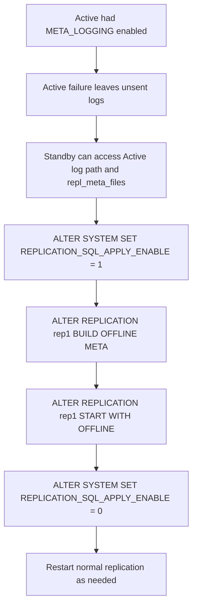

Use this state model when explaining the `OFFLINE` option lifecycle. Offline replication is one-time; normal replication must be restarted separately when needed.

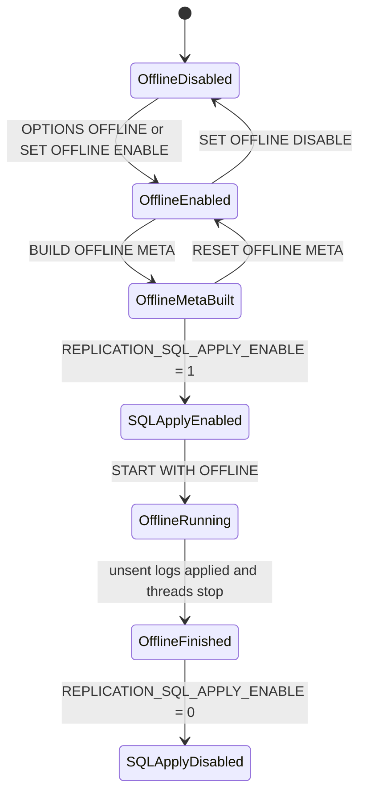

## Replication DDL Guidance

Core rule:

- Replication transfers DML-related transaction logs. DDL changes metadata and are not handled like normal replicated DML.
- A safe DDL answer must either remove the target from replication and perform DDL on both nodes, or follow the documented DDL execution/synchronization procedure.

Properties:

- `REPLICATION_DDL_ENABLE`: enables DDL execution on replication targets when set to `1`.
- `REPLICATION_DDL_ENABLE_LEVEL`: controls which DDL categories are allowed.
- `REPLICATION_DDL_SYNC`: enables DDL synchronization from the local server executing the DDL to the remote server.
- `REPLICATION_SQL_APPLY_ENABLE`: enables SQL apply mode on the Receiver side.

DDL Level 0 examples:

- Add a column without constraints.
- Drop a non-primary-key column without constraints and not used in function-based indexes.
- Set or drop a default value.
- Change table or partition tablespace.
- `TRUNCATE TABLE` or `TRUNCATE PARTITION`, except compressed-column cases.
- Create or drop non-unique indexes, with restrictions.

DDL Level 1 examples:

- Add or modify `NOT NULL`, `UNIQUE`, or `LOCALUNIQUE` columns.
- Drop constrained columns except primary-key and compressed columns.
- Split, merge, or drop partitions.
- Add, rename, or drop table constraints.
- Create or drop unique key indexes and function-based indexes.
- Requires `REPLICATION_SQL_APPLY_ENABLE = 1`.

DDL restrictions:

- Do not use the DDL synchronization procedure for EAGER-mode replication objects, `RECOVERY`-enabled replication objects, `FOR PROPAGATION` replication objects, `RECEIVE_ONLY` replication objects, or partitioned tables with global non-partitioned indexes.
- Do not use the DDL synchronization procedure for index partition rebuilds, grants/revokes, or trigger create/drop.
- Do not enable SQL apply mode for replication target tables that include encrypted columns; check target column definitions before recommending `REPLICATION_SQL_APPLY_ENABLE`.
- For unsupported replication objects or DDL types, remove the target from replication and perform DDL on both nodes, drop and recreate replication where required, or use a source-specific documented procedure.
- Clear replication gaps before DDL.
- DDL locks the target table; a primary transaction during the lock can block receiver apply.
- If increasing a column range, execute DDL first on the node not generating primary transactions.
- If decreasing a column range, execute DDL first on the node generating primary transactions.

Standard DDL procedure without SQL apply mode:

```sql
-- 1. Schedule a maintenance window, stop service traffic or enter the documented admin flow.
SELECT COUNT(*) FROM V$SESSION WHERE ID <> SESSION_ID();

-- 2. Flush replication and verify no remaining gap before DDL.
ALTER REPLICATION rep1 FLUSH ALL WAIT 60;
SELECT rep_name, rep_gap, rep_gap_size
FROM V$REPGAP
WHERE rep_name = 'REP1';

-- 3. Stop replication and remove the target tables from every affected replication object.
ALTER REPLICATION rep1 STOP;
ALTER REPLICATION rep1 DROP TABLE FROM app.t1 TO app.t1;

-- 4. Execute the DDL on every node with identical object names and compatible storage choices.
-- ALTER TABLE app.t1 ...;

-- 5. Add targets back, then resynchronize or start according to the topology and data ownership.
ALTER REPLICATION rep1 ADD TABLE FROM app.t1 TO app.t1;
ALTER REPLICATION rep1 SYNC;
```

DDL synchronization procedure with SQL apply mode:

```sql
-- 1. Use this only for documented DDL synchronization cases, not for EAGER targets or RECOVERY-enabled objects.
--    Replication must already be started on both servers, protocol versions must match,
--    and the replication target owner and name must match on both servers.

-- 2. On the local server that will execute the DDL, enable DDL execution and session DDL sync.
ALTER SYSTEM SET REPLICATION_DDL_ENABLE = 1;
ALTER SYSTEM SET REPLICATION_DDL_ENABLE_LEVEL = 1;
ALTER SESSION SET REPLICATION_DDL_SYNC = 1;

-- 3. On the remote server, enable DDL execution, DDL sync, and SQL apply support.
ALTER SYSTEM SET REPLICATION_DDL_ENABLE = 1;
ALTER SYSTEM SET REPLICATION_DDL_ENABLE_LEVEL = 1;
ALTER SYSTEM SET REPLICATION_DDL_SYNC = 1;
ALTER SYSTEM SET REPLICATION_SQL_APPLY_ENABLE = 1;

-- 4. On the local server, use the replication mode defined by the replication object.
ALTER SESSION SET REPLICATION = DEFAULT;

-- 5. On both the local and remote servers, flush before executing the DDL.
-- Local server:
ALTER REPLICATION rep1 FLUSH;
-- Remote server:
ALTER REPLICATION rep1 FLUSH;

-- 6. Execute the DDL one time on the local server only.
-- ALTER TABLE app.t1 ...;

-- 7. Verify apply completion, then restore every changed property immediately.
SELECT rep_name, sql_apply_table_count
FROM V$REPRECEIVER
WHERE rep_name = 'REP1';

-- 8. On the local server, reset local DDL properties and the session DDL sync flag.
ALTER SYSTEM SET REPLICATION_DDL_ENABLE = 0;
ALTER SYSTEM SET REPLICATION_DDL_ENABLE_LEVEL = 0;
ALTER SESSION SET REPLICATION_DDL_SYNC = 0;

-- 9. On the remote server, reset remote DDL sync and SQL apply properties.
ALTER SYSTEM SET REPLICATION_DDL_ENABLE = 0;
ALTER SYSTEM SET REPLICATION_DDL_ENABLE_LEVEL = 0;
ALTER SYSTEM SET REPLICATION_DDL_SYNC = 0;
ALTER SYSTEM SET REPLICATION_SQL_APPLY_ENABLE = 0;
```

Partition DDL note:

- Stop replication on both local and remote servers before partition DDL when the procedure requires it.
- Partition names in the DDL must be identical on both nodes.

## HA and Failover

Failover terms:

- `CTF`: Connection Time Fail-Over. The client connects to another node when connection to the first node fails.
- `STF`: Service Time Fail-Over. The client reconnects after failure during an established session, restores session properties, and may need to reexecute work.
- `Fail-Over Callback`: application callback used to decide whether failover should continue and to validate database state.

Failover rule:

- In a replicated Altibase environment, use a failover callback for validation because replication can lag, especially in LAZY mode.
- Callback validation should confirm the target node has the data needed for the application to continue.

JDBC callback constants:

- `FO_BEGIN`: failover start notification.
- `FO_END`: failover success notification.
- `FO_ABORT`: failover failure notification.
- `FO_GO`: callback tells the client library to continue failover.
- `FO_QUIT`: callback tells the client library failover should stop.

Failover flow:

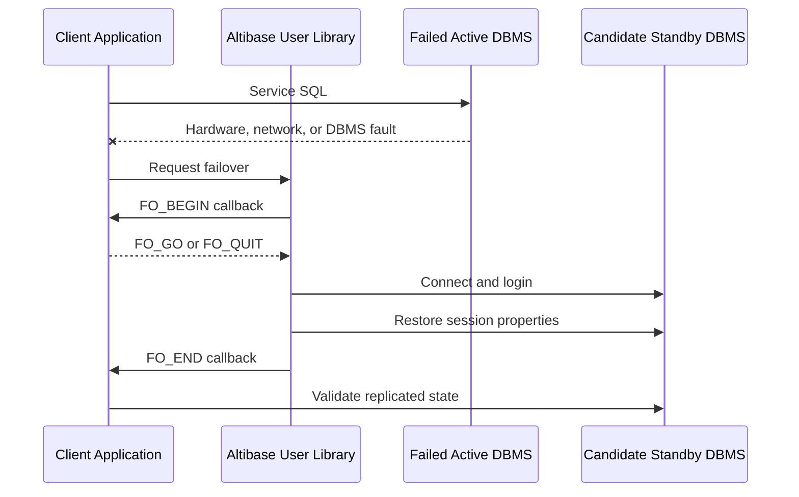

HA answer checklist:

- Ask whether the topology is Active-Standby or Active-Active.
- Ask whether mode is LAZY or EAGER.
- Check `V$REPGAP`, `V$REPSENDER`, and `V$REPRECEIVER` before failover.
- Use `ALTER REPLICATION ... FLUSH [ALL] [WAIT n]` before planned switchover when possible.
- For unplanned Active failure with unsent logs, evaluate offline replication only if `META_LOGGING` and log access requirements are met.
- Make clear that STF may require reexecution of business logic.

## Sequence Replication

Purpose:

- Sequence replication lets local and remote servers use an identical sequence in failover scenarios.
- Altibase internally creates a table for sequence replication because ordinary replication supports tables.

Prerequisites:

```text
REPLICATION_TIMESTAMP_RESOLUTION=1
```

Sequence options that should be identical on local and remote servers:

- `START WITH`
- `INCREMENT BY`
- `MAXVALUE`
- `MINVALUE`
- `CACHE`
- `FLUSH CACHE`
- `CYCLE`

Syntax:

```sql
CREATE SEQUENCE user_name.seq_name
START WITH 1
CACHE 100
ENABLE SYNC TABLE;

CREATE REPLICATION repl_name
WITH 'remote_host_ip', remote_host_port_no
FROM user_name.seq_name$seq TO user_name.seq_name$seq;

ALTER REPLICATION repl_name START;
ALTER REPLICATION repl_name STOP;

ALTER REPLICATION repl_name DROP TABLE
FROM user_name.seq_name$seq TO user_name.seq_name$seq;

ALTER SEQUENCE user_name.seq_name DISABLE SYNC TABLE;
```

Cautions:

- Recommended for Active-Standby.
- Active-Active sequence replication can produce duplicate values when a replication gap exists.
- Cache size should usually be at least `100`.
- Change the cache size before the sequence synchronization table is created.
- Before `DISABLE SYNC TABLE`, remove `user_name.seq_name$seq` from every replication object on each server that includes it, or drop those replication objects.
- Replication recreation, sequence recreation, and sequence modification must be applied equivalently on all servers.
- After failover, gaps in generated key values can occur because the peer begins from the next cache range.

## Replication Roles and Propagation

Role block: no role

- Normal 1:1 bidirectional replication between Altibase servers.
- The role value is `0` in replication metadata.

Role block: `FOR ANALYSIS`

- Creates a Log Analyzer XLog Sender.
- Used for CDC and external change processing.
- Can be combined with propagation as `FOR ANALYSIS PROPAGATION`.

Role block: `FOR PROPAGABLE LOGGING`

- The Receiver logs received transactions in a way that allows later propagation to other nodes.
- Adds extra logging overhead, including primary-key-related information.

Role block: `FOR PROPAGATION`

- A Sender reads both local replication target logs and logs generated by propagable logging, then sends them to another node.

Propagation cautions:

- Configure propagation in one direction only.
- Avoid cycles; cycles can infinitely reapply changes.
- Do not use propagation casually with `RECOVERY`; the design becomes complex.
- Expect lower Receiver-side transaction performance when `PROPAGABLE LOGGING` is enabled.

## Compatibility Guidance

Core compatibility rule:

- Altibase version 6 and later provide documented lower-version replication compatibility for LAZY mode.
- Lower-to-higher replication means a lower version Sender can send data to a higher version Receiver, but support must be checked against the compatibility matrix, release notes, and the actual `repl_protocol_version`.
- The lower-version-to-higher-version rule is one-way. Do not infer that a higher version Sender can send to an older Receiver unless the selected source explicitly says so for that pair.
- EAGER mode, offline replication, and optional replication features are excluded from the LAZY backward-compatibility rule; use them only when the source-backed version, topology, and option restrictions are satisfied.
- DDL replication backward compatibility requires all three digits of `repl_protocol_version` to match.
- Always check `repl_protocol_version` in `V$VERSION` on both nodes.

Compatibility block: Altibase 7.3 receiver

- 7.1 Sender to 7.3 Receiver, LAZY: compatible.
- 6.5.1 Sender to 7.3 Receiver, LAZY: compatible.
- 6.3.1 Sender to 7.3 Receiver, LAZY: compatible.
- 6.1.1 Sender to 7.3 Receiver, LAZY: compatible.
- 7.3 Sender to 7.3 Receiver, LAZY: compatible.
- 7.3 Sender to 7.1 Receiver, LAZY: compatible.
- 7.3 Sender to 6.5.1 Receiver, LAZY: compatible.
- 7.3 Sender to 6.3.1 Receiver, LAZY: compatible.
- 7.3 Sender to 6.1.1 Receiver, LAZY: not compatible.
- Protocol reference: Altibase 7.3.0.0.1 and later use replication protocol `7.4.9`.

Compatibility block: Altibase 7.1 receiver

- 6.5.1 Sender to 7.1 Receiver, LAZY: compatible.
- 6.3.1 Sender to 7.1 Receiver, LAZY: compatible.
- 6.1.1 Sender to 7.1 Receiver, LAZY: compatible.
- 7.1 Sender to 7.1 Receiver, LAZY: compatible.
- 7.1 Sender to 6.5.1 Receiver, LAZY: compatible.
- 7.1 Sender to 6.3.1 Receiver, LAZY: compatible.
- 7.1 Sender to 6.1.1 Receiver, LAZY: not compatible.
- Protocol references:
  - 7.1.0.6.5 and later: `7.4.7`.
  - 7.1.0.4.0 through 7.1.0.6.4: `7.4.6`.
  - 7.1.0.2.4 through 7.1.0.3.9: `7.4.5`.
  - 7.1.0.1.8 through 7.1.0.2.3: `7.4.4`.
  - 7.1.0.1.4 through 7.1.0.1.7: `7.4.3`.
  - 7.1.0.1.2 through 7.1.0.1.3: `7.4.2`.

Compatibility block: Altibase 8.1

- Use Altibase 8.1 verified source for 8.1 answers.
- 8.1 adds SSL/TLS support for replication communication through `USING SSL` and `REPLICATION_SSL_PORT_NO`.
- 8.1 release notes list `8.1.0.0.1` with replication protocol `7.4.9`, and list `7.3.0.0.1` and `7.3.0.1.5` with replication protocol `7.4.9`.
- The 8.1 release-note compatibility rule says LAZY backward compatibility is lower-version-to-higher-version and is limited to LAZY mode. Use it for a lower-version Sender to an 8.1 Receiver only after checking the actual `V$VERSION` values.
- The same 8.1 release-note rule says EAGER mode does not guarantee backward compatibility, optional features including offline replication do not guarantee backward compatibility, and DDL replication requires all three `repl_protocol_version` digits to match.
- Do not declare 8.1 Sender to older Receiver compatibility from the 7.1/7.3 matrix or protocol prefix alone; require an 8.1-specific compatibility matrix, release note, or vendor/source confirmation for that direction.
- Treat 8.1 SSL support as a separate transport feature, not as a cross-version compatibility guarantee.
- When planning 8.1 with older nodes, request the exact `product_version`, `meta_version`, `repl_protocol_version`, Sender/Receiver direction, replication mode, and option list before giving a compatibility answer.

Compatibility SQL:

```sql
SELECT product_version,
       meta_version,
       protocol_version,
       repl_protocol_version
FROM V$VERSION;
```

## Monitoring and Health Checks

Replication metadata views:

- `SYSTEM_.SYS_REPLICATIONS_`: replication definitions.
- `SYSTEM_.SYS_REPL_HOSTS_`: host endpoints.
- `SYSTEM_.SYS_REPL_ITEMS_`: replicated table or partition items.

Replication runtime views:

- `V$REPEXEC`
- `V$REPGAP`
- `V$REPGAP_PARALLEL`
- `V$REPLOGBUFFER`
- `V$REPOFFLINE_STATUS`
- `V$REPRECEIVER`
- `V$REPRECEIVER_COLUMN`
- `V$REPRECEIVER_PARALLEL`
- `V$REPRECEIVER_STATISTICS`
- `V$REPRECEIVER_TRANSTBL`
- `V$REPRECEIVER_TRANSTBL_PARALLEL`
- `V$REPRECOVERY`
- `V$REPSENDER`
- `V$REPSENDER_PARALLEL`
- `V$REPSENDER_STATISTICS`
- `V$REPSENDER_TRANSTBL`
- `V$REPSENDER_TRANSTBL_PARALLEL`
- `V$REPSYNC`

Health query block: definitions

```sql
SELECT replication_name,
       host_count,
       is_started,
       xsn,
       item_count,
       conflict_resolution,
       repl_mode,
       role,
       options,
       remote_fault_detect_time
FROM system_.sys_replications_
ORDER BY replication_name;

SELECT replication_name,
       host_no,
       host_ip,
       port_no,
       conn_type,
       ib_latency
FROM system_.sys_repl_hosts_
ORDER BY replication_name, host_no;

SELECT replication_name,
       local_user_name,
       local_table_name,
       local_partition_name,
       remote_user_name,
       remote_table_name,
       remote_partition_name,
       replication_unit
FROM system_.sys_repl_items_
ORDER BY replication_name, local_user_name, local_table_name, local_partition_name;
```

Health query block: gap and sender

```sql
SELECT *
FROM V$REPGAP
ORDER BY rep_name;

SELECT rep_name,
       start_flag,
       status,
       net_error_flag,
       xsn,
       commit_xsn,
       repl_mode,
       act_repl_mode,
       sender_ip,
       sender_port,
       peer_ip,
       peer_port
FROM V$REPSENDER
ORDER BY rep_name;
```

Health query block: synchronization progress

```sql
SELECT rep_name,
       sync_table,
       sync_partition,
       sync_record_count
FROM V$REPSYNC
ORDER BY rep_name, sync_table, sync_partition;
```

Use `V$REPSYNC` while `SYNC` or `SYNC ONLY` is running. `SYNC_RECORD_COUNT` shows synchronized records during synchronization and `-1` after synchronization completes.

Health query block: receiver and target columns

```sql
SELECT rep_name,
       my_ip,
       my_port,
       peer_ip,
       peer_port,
       apply_xsn,
       insert_success_count,
       update_success_count,
       delete_success_count,
       sql_apply_table_count
FROM V$REPRECEIVER
ORDER BY rep_name;

SELECT rep_name,
       user_name,
       table_name,
       partition_name,
       column_name,
       apply_mode
FROM V$REPRECEIVER_COLUMN
ORDER BY rep_name, user_name, table_name, partition_name, column_name;
```

## Replication Network and Transport Diagnostics

Use this section when replication does not start, a gap grows while the database is otherwise healthy, or packet loss is suspected between Sender and Receiver hosts.

Transport separation block:

- Ordinary TCP replication uses the peer `REPLICATION_PORT_NO`.
- Altibase 8.1 verified source SSL replication uses the peer `REPLICATION_SSL_PORT_NO` and `USING SSL`.
- InfiniBand replication uses the peer `REPLICATION_IB_PORT_NO` and `USING IB [ib_latency]`.
- Ordinary database service ports, ordinary client/server `SSL_PORT_NO`, JDBC `port`, and `ALTIBASE_SSL_PORT_NO` are not replication Receiver ports.
- `FOR ANALYSIS` and `FOR ANALYSIS PROPAGATION` are Log Analyzer CDC forms. Do not combine them with `USING SSL` or `USING IB`.

Endpoint evidence SQL:

```sql
SELECT replication_name,
       host_no,
       host_ip,
       port_no,
       conn_type
FROM system_.sys_repl_hosts_
ORDER BY replication_name, host_no;

SELECT name, value1
FROM V$PROPERTY
WHERE name IN (
  'REPLICATION_PORT_NO',
  'REPLICATION_SSL_PORT_NO',
  'REPLICATION_IB_PORT_NO',
  'REPLICATION_HBT_DETECT_TIME',
  'REPLICATION_RECEIVE_TIMEOUT',
  'REPLICATION_SENDER_SEND_TIMEOUT',
  'REPLICATION_SENDER_START_AFTER_GIVING_UP'
)
ORDER BY name;
```

Transport mismatch triage:

1. Compare `SYSTEM_.SYS_REPL_HOSTS_.PORT_NO` with the peer node's relevant property value. For TCP, compare to the peer `REPLICATION_PORT_NO`; for SSL, compare to the peer `REPLICATION_SSL_PORT_NO`; for IB, compare to the peer `REPLICATION_IB_PORT_NO`.
2. Compare `SYSTEM_.SYS_REPL_HOSTS_.CONN_TYPE` with the intended transport. If `USING` was omitted, treat it as ordinary TCP.
3. For Altibase 8.1 SSL replication, confirm that each node's local `REPLICATION_SSL_PORT_NO` is nonzero and that ordinary SSL/TLS setup is complete on both replication target servers.
4. If a host list contains multiple IP/port pairs, check every host row in order. A backup line can hide that the primary endpoint is wrong or blocked.
5. Do not repair a wrong endpoint with `QUICKSTART` unless skipping unsent logs is intentional. Correct the endpoint, start or synchronize according to the gap state, and verify Sender/Receiver views.

Network evidence collection block:

- Capture evidence from both sides of the connection. A Sender-side trace alone cannot prove whether packets reached the Receiver host.
- On the Standby or receiving side, check whether `V$REPRECEIVER.INSERT_SUCCESS_COUNT`, `UPDATE_SUCCESS_COUNT`, or `DELETE_SUCCESS_COUNT` continues to increase during normal replication or `SYNC`.
- Capture Sender and Receiver thread states with platform tools such as `pstack` where available. Network-check guidance identifies Receiver waits around `recvXlog... select` and Sender waits around `sendCmBlock... write` as useful stack evidence.
- Use `netstat` to inspect send queue, receive queue, retransmission behavior, routing, gateway, subnet mask, and interface.
- Capture packets on both Sender and Receiver hosts in binary format, then inspect them with Wireshark or an equivalent packet analyzer.
- During packet tests, if heartbeat socket churn makes analysis difficult, record the current `REPLICATION_HBT_DETECT_TIME`, temporarily raise it for the test window, and restore it afterward.

## Troubleshooting Playbooks

Playbook block: replication does not start

1. Confirm both nodes have a replication object with the same `replication_name`.
2. Confirm the peer host and port use the correct property: `REPLICATION_PORT_NO`, `REPLICATION_SSL_PORT_NO`, or `REPLICATION_IB_PORT_NO`.
3. Confirm object owners, table names, partitions, and primary keys exist on both nodes.
4. Check character sets in `V$NLS_PARAMETERS`.
5. Check `V$REPSENDER`, `V$REPRECEIVER`, trace logs, and `rpERR_*` errors.
6. If `START RETRY` was used, do not trust the iSQL success line alone; verify the Sender status.

Playbook block: replication gap grows

1. Check `V$REPGAP` and `V$REPSENDER`.
2. Check Receiver apply counters in `V$REPRECEIVER`.
3. Identify whether the bottleneck is network send, Receiver apply, disk I/O, or conflicts.
4. Consider `FLUSH [ALL] [WAIT n]` only when the system can tolerate waiting.
5. For LAZY mode, consider whether `GAPLESS`, `PARALLEL`, or `GROUPING` fits the workload.
6. For HA cutover, do not fail over until the gap impact is understood.

Playbook block: network issue suspected

1. On Standby, check whether `V$REPRECEIVER.INSERT_SUCCESS_COUNT` increases during replication or `SYNC`.
2. Capture Sender and Receiver thread states with platform stack tools such as `pstack` where available.
3. Use `netstat` to inspect send queue, receive queue, retransmission behavior, routing, gateway, subnet mask, and interface.
4. Capture packets on both Sender and Receiver hosts, in binary capture format.
5. Increase `REPLICATION_HBT_DETECT_TIME` temporarily before packet tests if heartbeat socket churn makes analysis difficult.
6. Inspect captures in Wireshark or an equivalent packet analyzer for retransmission, duplicate ACK, missing segment, and one-way packet-loss patterns.

Network command examples:

```sh
netstat -nrv

# AIX example
tcpdump -i interface_name -vv -w repl_capture.pcap

# HP-UX example
nettl -start
nettl -traceon all -e all -f repl_capture
nettl -stop
```

Playbook block: DDL was run incorrectly

1. Stop further writes to the affected target if possible.
2. Check schema differences on both nodes.
3. Check `V$REPGAP`, `V$REPRECEIVER.SQL_APPLY_TABLE_COUNT`, and replication error files.
4. Do not run `QUICKSTART` unless skipping unsent changes is intentional.
5. Decide whether to re-run the same DDL on the peer, remove and re-add the replication target, run full `SYNC`, or rebuild the object.

Playbook block: failover validation

1. Confirm whether the failure is planned or unplanned.
2. For planned cutover, run `ALTER REPLICATION rep1 FLUSH ALL WAIT timeout_sec`.
3. Confirm Sender and Receiver status.
4. Validate business-critical tables with row counts, max commit markers, application sequence tables, or checksums appropriate to the application.
5. If the Active server failed with unsent logs, evaluate offline replication prerequisites before promoting the Standby for writes.

## Replication Manager

Use Replication Manager when the user wants GUI-based replication object management across multiple Altibase connections. It helps inspect replication topology, states, DDL, and relationships, but it does not replace replication design checks, SQL privilege checks, backup planning, or command-line verification through `V$REPSENDER`, `V$REPRECEIVER`, `V$REPGAP`, and replication error files.

Version and runtime block:

- Replication Manager is a replication-management GUI tool, not a Log Analyzer CDC client and not a generic schema migration tool.
- Tool packages are provided for Microsoft Windows and Linux. Confirm the downloaded package, operating system, graphic system, and Java runtime before building a runbook.
- The documented Java requirement is JDK or JRE 6 or later. Some packages include a JRE and some require the user to provide Java; Replication Manager 1.4 release notes record a packaged JRE update from 6 to 8. Verify the exact tool release in use.
- Replication Manager is documented for Altibase 4.3.9 or later. Because one tool can connect to multiple Altibase server versions, import a JDBC driver file that matches each target Altibase server version.
- Replication Manager 1.2 release notes add multi-IP database support. Replication Manager 1.3 release notes add easier `Create Full-mesh Replications`, `Join to Full-mesh`, and external help-link behavior.

JDBC driver workflow:

1. Obtain the JDBC driver from the Altibase server version that Replication Manager will connect to.
2. If multiple server versions are managed, give each JDBC driver file a version-distinguishing name such as `Altibase_4.3.9.100.jar` or `Altibase_5.3.3.33.jar`.
3. Open `JDBC driver manager`, add the driver file, assign the name Replication Manager should use, and close the manager. The driver can also be imported while adding a DB connection.
4. When creating a DB connection, select the JDBC driver that matches the target server. Do not reuse a convenient driver across mixed-version servers without checking compatibility.

DB connection workflow:

1. Create a connection from `New DB Connection`.
2. Fill the connection fields:
   - `Connection Name`: unique, maximum 10 characters, starts with an alphabetic character, and uses alphabetic characters and numbers.
   - `Password`: password for the database `SYS` user in the manual workflow. Treat this as a privileged secret.
   - `DB Address`: IP address of the host where the database is installed.
   - `DB Port`: connection port for the target database.
   - `DB Name`: database name.
   - `JDBC driver`: version-matched JDBC driver.
   - `IP Address Type`: IPv4 or IPv6 when selection is needed.
   - `NLS for Client`: set for Altibase 5.1.1 or earlier; it is not normally required for Altibase 5.3.1 or later.
3. Use `Connection Test` before saving the connection.
4. Use `Connect` to connect, `Disconnect` when work is complete, `Edit` only when the DB connection is not connected, and `Remove` only when the saved connection is no longer needed.

`Extra Host IP` block:

- If an Altibase host has multiple IP addresses and another Altibase uses one of those addresses as `Remote Host IP` in a replication object, that address must be either the DB connection `DB Address` or an `Extra Host IP`.
- Manage this from `Manage Extra Host IP` on the DB connection. Without the extra address, the relationship between the database and replication object can be displayed incorrectly in `Map`.

Pane and object model:

- `DB Connections`: database-centered tree for connected databases, replication objects, and replication target tables.
- `Replication Pairs`: logical pair view for same-named replication objects that correspond across two databases.
- `Map`: physical placement, status, relationship, and replication-gap oriented view.
- `Properties`: selected-object properties.
- Shared object types are `Replication Object`, `Replication Target Table`, `DB Connections`, `DB Connection`, `Replication Pairs`, and `Replication Pair`. Some actions appear in one pane but not another, so answer from the selected pane and object rather than assuming every action is globally available.

Action map:

- `DB Connections` parent: `Connect all`, `Disconnect all`, `Start all`, `Stop all`, `Quick Start all`, `New DB Connection`, and tree expand/collapse actions.
- `DB Connection`: `Connect`, `Disconnect`, `Edit`, `Manage Extra Host IP`, `Remove`, `Start all`, `Stop all`, `Quick Start all`, `Create Replication`, `Create Full-mesh Replications`, `Join to Full-mesh`, `Create Replication Pair`, and `Drop Replications`.
- `Replication Object`: `Start`, `Stop`, `Quick Start`, `Sync`, `Sync Only`, `Drop`, `Edit Table List`, `Monitor`, `Show DDL`, and `Compare DDL`.
- `Replication Pair`: pair-level `Start all`, `Stop all`, `Quick Start all`, and `Drop`; the `Replication Pairs` parent can also create replication pairs and full-mesh replications.
- `Map`: use for status and relationship-oriented operations; it exposes connection-level start/stop/quick-start actions and replication-object `Start`, `Stop`, `Quick Start`, `Sync`, `Sync Only`, `Drop`, `Monitor`, `Show DDL`, and `Compare DDL`.

Replication Manager guardrails:

- Treat `Quick Start` and `Quick Start all` as high-risk. The manual warns that these actions can lose replication work that has not been sent between nodes. Use them only when intentionally skipping unsent changes is the chosen recovery action.
- `Sync` is equivalent to `ALTER REPLICATION replication_name SYNC`; `Sync Only` is equivalent to `ALTER REPLICATION replication_name SYNC ONLY`. Treat both as data movement operations and verify replication state and gaps before and after use.
- `Drop Replications`, pair-level `Drop`, and object-level `Drop` require the affected replication objects to be stopped first.
- `Create Full-mesh Replications` creates same-named replication objects for the selected DB connections. The manual's four-connection example creates 16 same-named replication objects, so count the intended topology before running it.
- `Join to Full-mesh` adds selected DB connections to an existing full-mesh set. Validate DB connection names, target addresses, `Extra Host IP`, and replication naming before use.
- Use `Monitor` for replication-object monitoring, `Show DDL` to inspect a replication object and dependent objects such as tables and indexes, and `Compare DDL` to compare two replication-object DDL definitions before corrective action.
- Replication Manager can make replication operations easier to trigger. For production answers, still include the same prerequisites required for SQL-based replication operations: version, topology, object names, gap state, write ownership, backup status, maintenance window, and rollback limits.

Replication Manager workflow: inspect before changing

1. Import the JDBC driver that matches each target Altibase server and test every DB connection.
2. If the host has multiple IP addresses, add every address used by peer replication definitions as `Extra Host IP`.
3. Use `DB Connections`, `Replication Pairs`, or `Map` according to the operator's current pane, then inspect `Properties`.
4. Use `Show DDL` to capture the replication object and dependent object DDL, and use `Compare DDL` before changing a mismatched pair.
5. Cross-check the GUI view with SQL evidence from `SYSTEM_.SYS_REPLICATIONS_`, `SYSTEM_.SYS_REPL_HOSTS_`, `SYSTEM_.SYS_REPL_ITEMS_`, `V$REPSENDER`, `V$REPRECEIVER`, and `V$REPGAP`.

Replication Manager workflow: create or extend topology

1. Confirm the intended topology, object names, peer IP and port pairs, table or partition list, write ownership, and whether the objects should be ordinary pair replication or full-mesh.
2. For a two-node pair, use `Create Replication Pair` only after confirming both DB connections and version-matched drivers.
3. For a full-mesh operation, count the objects first. The manual's four-connection example creates 16 same-named replication objects, so the action can multiply operational impact quickly.
4. For `Join to Full-mesh`, validate DB connection names, `Extra Host IP`, target addresses, replication names, and the table list before applying the join.
5. After creation, run the same SQL verification used for hand-written `CREATE REPLICATION`, then choose `Sync`, `Sync Only`, or `Start` from the production data-alignment plan.

Replication Manager workflow: edit, synchronize, or drop

- `Edit Table List`, `Drop`, `Drop Replications`, and pair-level `Drop` require stopped replication objects. Stop first and verify the stopped state before applying the action.
- When editing a table list, preserve the same table or partition granularity used by the SQL replication definition, then run a targeted `Sync` for newly added targets when data must be copied.
- Before `Sync` or `Sync Only`, check whether remote target rows already exist and whether the operation can tolerate conflicts, locks, and the `REPLICATION_SYNC_LOCK_TIMEOUT` wait.
- Before any `Quick Start` action, obtain explicit confirmation that skipping unsent XLogs is intentional and accepted.
- After any GUI operation, recheck SQL metadata and runtime views; do not rely only on the GUI status color or success dialog.

## Log Analyzer CDC

Use Log Analyzer when the goal is CDC-style external consumption of changes rather than direct table-to-table replication. The XLog Sender is inside Altibase; the XLog Collector is inside a client application and receives XLogs and metadata through the Log Analysis API.

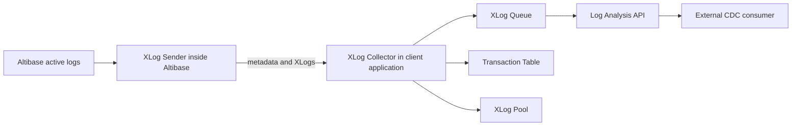

Log Analyzer terms:

- `XLog`: logical change log for DML and control events.
- `XLog Sender`: analyzes active logs and sends XLogs to the collector.
- `XLog Collector`: receives metadata and XLogs, stores them in queues and pools, and exposes them through the API.
- `Log Analysis API`: API used by a client application to receive, inspect, convert, acknowledge, and free XLogs.
- `Handshake`: checks protocol version, metadata, role, and other prerequisites before XLog transfer.
- `Restart SN`: active-log SN from which XLog Sender restarts.

Log Analyzer limitations:

- Only `SYS` can manage the XLog Sender.
- Basic analysis unit is a table.
- An analyzed table must have a primary key.
- Primary-key column values cannot be updated.
- DDL cannot be executed on an analyzed table.
- Total XLog Senders plus Replication Senders in one Altibase database cannot exceed `32`.
- Replication protocol version used by the Log Analysis API must match the protocol version of the Altibase databases involved.
- Only LAZY mode is supported.
- Log Analyzer can analyze tables with foreign keys, unlike ordinary replication restrictions.
- Log Analyzer supports TCP and UNIX domain socket transmission; UNIX domain sockets require the XLog Sender and XLog Collector on the same UNIX or Linux host.
- Log Analyzer does not support SSL or InfiniBand communication.

## Log Analyzer API Workflow

Basic API flow:

```mermaid
sequenceDiagram
  participant App as CDC Application
  participant API as Log Analysis API
  participant Collector as XLog Collector
  participant Sender as XLog Sender
  App->>API: ALA_InitializeAPI
  App->>API: ALA_CreateXLogCollector
  App->>API: ALA_AddAuthInfo
  App->>API: ALA_Handshake
  API->>Sender: Wait for Sender connection
  Sender-->>Collector: Metadata and XLogs
  loop Receive changes
    App->>API: ALA_ReceiveXLog
    App->>API: ALA_GetXLog
    App->>API: ALA_GetXLogHeader / PrimaryKey / Column / LOB
    App->>API: ALA_SendACK when required
    App->>API: ALA_FreeXLog
  end
  App->>API: ALA_DestroyXLogCollector
  App->>API: ALA_DestroyAPI
```

Required files:

- Header: `alaAPI.h`, which includes `alaTypes.h`.
- Header: `alaTypes.h`, which defines data types and macros for client programs.
- Shared library: `libala_sl.x`, with platform-specific extension.
- Static library: `libala.x`, with platform-specific extension.

API function blocks:

- Environment: `ALA_InitializeAPI`, `ALA_DestroyAPI`.
- Logging: `ALA_EnableLogging`, `ALA_DisableLogging`.
- Collector setup: `ALA_CreateXLogCollector`, `ALA_AddAuthInfo`, `ALA_RemoveAuthInfo`, `ALA_SetHandshakeTimeout`, `ALA_SetReceiveXLogTimeout`, `ALA_SetXLogPoolSize`.
- Receive and acknowledge: `ALA_Handshake`, `ALA_ReceiveXLog`, `ALA_GetXLog`, `ALA_SendACK`, `ALA_FreeXLog`, `ALA_DestroyXLogCollector`.
- Monitoring: `ALA_GetXLogCollectorStatus`.
- XLog inspection: `ALA_GetXLogHeader`, `ALA_GetXLogPrimaryKey`, `ALA_GetXLogColumn`, `ALA_GetXLogSavepoint`, `ALA_GetXLogLOB`.
- Metadata: `ALA_GetProtocolVersion`, `ALA_GetReplicationInfo`, `ALA_GetTableInfo`, `ALA_GetTableInfoByName`, `ALA_GetColumnInfo`, `ALA_GetIndexInfo`, `ALA_IsHiddenColumn`.
- Conversion: `ALA_GetInternalNumericInfo`, `ALA_GetAltibaseText`, `ALA_GetAltibaseSQL`, `ALA_GetODBCCValue`.
- Error handling: `ALA_ClearErrorMgr`, `ALA_GetErrorCode`, `ALA_GetErrorLevel`, `ALA_GetErrorMessage`.

XLog Collector runtime options:

- `ALA_CreateXLogCollector()` binds the collector to an XLog Sender name, socket information, `aXLogPoolSize`, `aUseCommittedTxBuffer`, and `aACKPerXLogCount`.
- For TCP collectors, the socket information string uses values such as `SOCKET=TCP`, optional `IP_STACK`, `PEER_IP` for XLog Sender authentication, and `MY_PORT` for the port where the collector waits for the Sender. The listen port cannot already be in use.
- For UNIX-domain collectors, the socket type is `UNIX`, the socket path is generated under `$ALTIBASE_HOME/trc/rp-replication_name`, and the XLog Sender database and collector process must use the same `$ALTIBASE_HOME`.
- `aXLogPoolSize` is the maximum number of XLogs in the XLog Pool. `ALA_ReceiveXLog()` obtains XLog memory from this pool; if the pool is exhausted, `ALA_ReceiveXLog()` can fail with XLog Pool empty behavior. Increase the pool with `ALA_SetXLogPoolSize()` only when needed, and prefer freeing processed XLogs promptly.
- `aUseCommittedTxBuffer` requests transaction XLogs in commit order. In that mode, transaction XLogs remain in the Transaction Table until the `COMMIT` XLog arrives; savepoint-related XLogs are not provided and rolled-back transaction XLogs are not returned. Size the XLog Pool for larger memory pressure and expect extra latency, especially for batch-style transactions.
- `aACKPerXLogCount` is the threshold for actual ACK transmission. Calling `ALA_SendACK()` does not always send an ACK immediately when this value is greater than `1`; ACK is sent after enough successful `ALA_GetXLog()` calls, or when a `KEEP_ALIVE` or `REPL_STOP` XLog has been received.
- ACK messages include `Restart SN`. That value is derived from active transaction XLog positions, the last obtained XLog when no transaction is active, or the minimum uncommitted transaction XLog SN held in the Transaction Table when committed-transaction buffering is used.
- Send ACKs regularly. If the XLog Sender does not receive ACK within `REPLICATION_RECEIVE_TIMEOUT`, it can terminate the network connection; long ACK delays can also change restart behavior after the Sender gives up and restarts.
- Process all XLogs obtained by `ALA_GetXLog()` before sending an ACK that may advance the Sender's `Restart SN`.
- Call `ALA_FreeXLog()` after processing each obtained XLog. Until `ALA_FreeXLog()` is called, the application owns that XLog and can exhaust the XLog Pool; after `ALA_FreeXLog()`, do not use that XLog or its related data.

API cautions:

- The caller creates and retains `ALA_ErrorMgr`.
- `ALA_ErrorMgr` contains only the most recent error.
- Use `ALA_GetErrorCode()` instead of reading `mErrorCode` directly.
- `ALA_ERROR_FATAL` means destroy the XLog Collector with `ALA_DestroyXLogCollector()`.
- `ALA_ERROR_ABORT` means perform `ALA_Handshake()` again.
- `ALA_ERROR_INFO` requires action based on the specific code.
- If applying XLogs to a database through ODBC, set `AUTOCOMMIT` to `OFF`.
- `ALA_ReceiveXLog()` and `ALA_GetXLog()` do not have to be called by the same thread.
- After `ALA_FreeXLog()`, the XLog and related data must no longer be used.

CDC restart and status workflow:

1. Create the collector with a socket string that matches the XLog Sender definition, then complete `ALA_Handshake()` before expecting XLogs.
2. Start the SQL-side XLog Sender only after the collector is waiting; otherwise `START` can fail or retry according to the chosen SQL operation.
3. In the receive loop, call `ALA_ReceiveXLog()`, obtain queued XLogs with `ALA_GetXLog()`, inspect or convert the payload, process the change, call `ALA_SendACK()` at the designed interval, and free each XLog with `ALA_FreeXLog()`.
4. Use `ALA_GetXLogCollectorStatus()` to inspect `mMyIP`, `mMyPort`, `mPeerIP`, `mPeerPort`, `mSocketFile`, `mXLogCountInPool`, `mLastArrivedSN`, `mLastProcessedSN`, and `mNetworkValid`.
5. If `mXLogCountInPool` keeps shrinking or `ALA_ReceiveXLog()` returns pool-empty behavior, free processed XLogs faster or increase the pool with `ALA_SetXLogPoolSize()` after confirming application memory capacity.
6. If `mNetworkValid` is false or an `ALA_ERROR_ABORT` network/protocol condition occurs, correct the cause and perform `ALA_Handshake()` again; after a successful handshake, the Sender resumes from the Restart SN established by ACK behavior.

CDC control XLog handling:

- `XLOG_TYPE_KEEP_ALIVE` means the connection is still alive when there is no data XLog to send.
- `XLOG_TYPE_REPL_STOP` means the XLog Sender is stopping normally. Send ACK, finish or roll back any in-progress external apply unit as appropriate, then allow the connection to close and release collector resources cleanly.
- `XLOG_TYPE_CHANGE_META` means DDL changed metadata for an analyzed table. The Sender sends the metadata-change event, then sends `REPL_STOP` so the application can refresh metadata and reconnect.
- After `CHANGE_META`, do not continue applying with stale cached column or table metadata. Refresh replication/table/column metadata through the API, reconnect or handshake as required, and restart from the source-backed Restart SN path.
- ACK messages can advance Sender restart metadata. Process every XLog obtained by `ALA_GetXLog()` before calling `ALA_SendACK()` when the ACK could acknowledge that XLog.
- If the application does not send ACK within `REPLICATION_RECEIVE_TIMEOUT`, the Sender can terminate the network connection. Long ACK delays can also cause the Sender to give up and restart from a later recorded log SN.

## XLog Sender SQL

Create an XLog Sender:

```sql
CREATE REPLICATION log_analysis FOR ANALYSIS
WITH 'collector_ip', collector_port
FROM sys.t1 TO sys.t1;
```

Create an XLog Sender using UNIX domain socket:

```sql
CREATE REPLICATION log_analysis FOR ANALYSIS
WITH UNIX_DOMAIN
FROM sys.t1 TO sys.t1;
```

Start an XLog Sender:

```sql
ALTER REPLICATION log_analysis START;
ALTER REPLICATION log_analysis START AT SN (xlog_sender_start_sn);
ALTER REPLICATION log_analysis QUICKSTART;
```

Stop and drop an XLog Sender:

```sql
ALTER REPLICATION log_analysis STOP;
DROP REPLICATION log_analysis;
```

Modify XLog Sender targets or TCP/IP collector hosts:

The host statements below apply only to TCP/IP XLog Collector endpoints, not to an XLog Sender created with `WITH UNIX_DOMAIN`.

```sql
ALTER REPLICATION log_analysis ADD TABLE
FROM sys.t2 TO sys.t2;

ALTER REPLICATION log_analysis DROP TABLE
FROM sys.t2 TO sys.t2;

ALTER REPLICATION log_analysis ADD HOST 'collector_ip', collector_port;
ALTER REPLICATION log_analysis DROP HOST 'collector_ip', collector_port;
ALTER REPLICATION log_analysis SET HOST 'collector_ip', collector_port;

ALTER REPLICATION log_analysis FLUSH WAIT 10;
```

XLog Sender cautions:

- The XLog Collector must be online and waiting before XLog Sender start.
- `START AT SN` requires Archivelog mode and `REPLICATION_LOG_BUFFER_SIZE = 0`.
- With UNIX domain sockets, `$ALTIBASE_HOME` must be the same for Sender and Collector, and the generated socket path is `$ALTIBASE_HOME/trc/rp-replication_name`.
- A UNIX-domain XLog Sender cannot add hosts.
- `ADD HOST`, `DROP HOST`, and `SET HOST` are only for TCP/IP XLog Collector endpoints.
- `SET HOST` takes effect after the XLog Sender is restarted.
- `FLUSH` can time out if the XLog Collector does not send ACK.

## XLog Types

Transaction-related XLog types:

- `XLOG_TYPE_COMMIT = 2`: transaction commit.
- `XLOG_TYPE_ABORT = 3`: transaction rollback.
- `XLOG_TYPE_INSERT = 4`: DML insert.
- `XLOG_TYPE_UPDATE = 5`: DML update.
- `XLOG_TYPE_DELETE = 6`: DML delete.
- `XLOG_TYPE_SP_SET = 8`: savepoint set.
- `XLOG_TYPE_SP_ABORT = 9`: abort to savepoint.
- `XLOG_TYPE_LOB_CURSOR_OPEN = 14`: LOB cursor open.
- `XLOG_TYPE_LOB_CURSOR_CLOSE = 15`: LOB cursor close.
- `XLOG_TYPE_LOB_PREPARE4WRITE = 16`: LOB prepare for write.
- `XLOG_TYPE_LOB_PARTIAL_WRITE = 17`: LOB partial write.
- `XLOG_TYPE_LOB_FINISH2WRITE = 18`: LOB finish write.
- `XLOG_TYPE_LOB_TRIM = 35`: LOB trim.

Control-related XLog types:

- `XLOG_TYPE_KEEP_ALIVE = 19`: network keep-alive when no XLog is available.
- `XLOG_TYPE_REPL_STOP = 21`: XLog Sender normal shutdown; connection terminates after `ALA_SendACK()`.
- `XLOG_TYPE_CHANGE_META = 25`: metadata changed by DDL; the Sender sends new metadata and then `XLOG_TYPE_REPL_STOP` so the application can process the change.

LOB sequence:

```text
XLOG_TYPE_LOB_CURSOR_OPEN
  XLOG_TYPE_LOB_PREPARE4WRITE
    XLOG_TYPE_LOB_PARTIAL_WRITE ...
  XLOG_TYPE_LOB_FINISH2WRITE
  or
  XLOG_TYPE_LOB_TRIM
XLOG_TYPE_LOB_CURSOR_CLOSE
```

## ODBC C Conversion Blocks

Function:

```c
ALA_RC ALA_GetODBCCValue(
        ALA_Column   * aColumn,
        ALA_Value    * aAltibaseValue,
        SInt           aODBCCTypeID,
        UInt           aODBCCValueBufferSize,
        void         * aOutODBCCValueBuffer,
        ALA_BOOL     * aOutIsNull,
        UInt         * aOutODBCCValueSize,
        ALA_ErrorMgr * aOutErrorMgr);
```

Conversion block: numeric Altibase values

- Altibase types: `FLOAT`, `NUMERIC`, `DOUBLE`, `REAL`, `BIGINT`, `INTEGER`, `SMALLINT`.
- Supported ODBC C targets: `SQL_C_CHAR`, `SQL_C_NUMERIC`, `SQL_C_BIT`, `SQL_C_STINYINT`, `SQL_C_UTINYINT`, `SQL_C_SSHORT`, `SQL_C_USHORT`, `SQL_C_SLONG`, `SQL_C_ULONG`, `SQL_C_SBIGINT`, `SQL_C_UBIGINT`, `SQL_C_FLOAT`, `SQL_C_DOUBLE`, `SQL_C_BINARY`.

Conversion block: date value

- Altibase type: `DATE`.
- Supported ODBC C targets: `SQL_C_CHAR`, `SQL_C_BINARY`, `SQL_C_TYPE_DATE`, `SQL_C_TYPE_TIME`, `SQL_C_TYPE_TIMESTAMP`.

Conversion block: character values

- Altibase types: `CHAR`, `VARCHAR`, `NCHAR`, `NVARCHAR`.
- Supported ODBC C targets: `SQL_C_CHAR`, `SQL_C_NUMERIC`, `SQL_C_BIT`, integer C types, `SQL_C_FLOAT`, `SQL_C_DOUBLE`, `SQL_C_BINARY`, `SQL_C_TYPE_DATE`, `SQL_C_TYPE_TIME`, `SQL_C_TYPE_TIMESTAMP`.

Conversion block: byte values

- Altibase types: `BYTE`, `NIBBLE`.
- Supported ODBC C targets: `SQL_C_CHAR`, `SQL_C_BINARY`.

Conversion block: bit values

- Altibase types: `BIT`, `VARBIT`.
- Supported ODBC C targets: `SQL_C_CHAR`, `SQL_C_NUMERIC`, `SQL_C_BIT`, integer C types, `SQL_C_FLOAT`, `SQL_C_DOUBLE`, `SQL_C_BINARY`.

Conversion exclusions:

- `BLOB`, `CLOB`, and `GEOMETRY` cannot be converted with `ALA_GetODBCCValue()`.
- `ALA_GetAltibaseText()`, `ALA_GetAltibaseSQL()`, and `ALA_GetODBCCValue()` cannot be used with `BLOB` or `CLOB`.
- `ALA_GetAltibaseText()`, `ALA_GetAltibaseSQL()`, and `ALA_GetODBCCValue()` cannot be used with `GEOMETRY`.

## Log Analyzer Error Blocks

Error level block: `ALA_ERROR_FATAL`

- Required action: call `ALA_DestroyXLogCollector()` for the affected collector.
- Codes:
  - `0x50008`: transaction already active; returned by `ALA_ReceiveXLog`, `ALA_GetXLog`.
  - `0x5000A`: failed to initialize a mutex; returned by `ALA_CreateXLogCollector`, `ALA_Handshake`.
  - `0x5000B`: failed to remove a mutex; returned by `ALA_Handshake`, `ALA_DestroyXLogCollector`.
  - `0x5000C`: failed to lock a mutex; returned by collector, handshake, receive, get, ACK, free, destroy, and status APIs.
  - `0x5000D`: failed to unlock a mutex; returned by collector, handshake, receive, get, ACK, free, destroy, and status APIs.

Error level block: `ALA_ERROR_ABORT`

- Required action: call `ALA_Handshake()` again for the collector after correcting the cause.
- Memory codes:
  - `0x51006`: failed to allocate memory; all Log Analysis API functions.
  - `0x5101E`: failed to allocate memory in pool; `ALA_ReceiveXLog`.
  - `0x5101F`: failed to free memory in pool; `ALA_Handshake`, `ALA_ReceiveXLog`, `ALA_FreeXLog`, `ALA_DestroyXLogCollector`.
  - `0x51020`: failed to initialize memory pool; `ALA_CreateXLogCollector`.
  - `0x51021`: failed to remove memory pool; `ALA_DestroyXLogCollector`.
- Network codes:
  - `0x51013`: failed to initialize network environment; `ALA_Handshake`, `ALA_ReceiveXLog`, `ALA_SendACK`.
  - `0x51019`: failed to remove a network protocol; `ALA_Handshake`, `ALA_ReceiveXLog`, `ALA_SendACK`.
  - `0x5101A`: failed to finalize network environment; `ALA_Handshake`, `ALA_ReceiveXLog`, `ALA_SendACK`.
  - `0x51017`: network session already terminated; `ALA_ReceiveXLog`, `ALA_SendACK`.
  - `0x51018`: unfamiliar network protocol; `ALA_Handshake`, `ALA_ReceiveXLog`.
  - `0x51016`: failed to read from network; `ALA_Handshake`, `ALA_ReceiveXLog`.
  - `0x5101B`: failed to write to network; `ALA_Handshake`, `ALA_SendACK`.
  - `0x5101C`: failed to flush network; `ALA_Handshake`, `ALA_SendACK`.
  - `0x51015`: network timeout and probable network error; `ALA_Handshake`.
  - `0x5102C`: failed to add a network session; `ALA_Handshake`.
- Handshake, protocol, and metadata codes:
  - `0x51024`: protocol versions are mismatched; `ALA_Handshake`.
  - `0x51027`: failed to allocate a link; `ALA_Handshake`.
  - `0x51028`: failed to listen for a link; `ALA_Handshake`.
  - `0x51029`: failed to wait for a link; `ALA_Handshake`.
  - `0x5102A`: failed to accept a link; `ALA_Handshake`.
  - `0x5102B`: failed to set a link; `ALA_Handshake`.
  - `0x51022`: failed to shut down a link; `ALA_Handshake`, `ALA_DestroyXLogCollector`.
  - `0x51023`: failed to free a link; `ALA_Handshake`, `ALA_DestroyXLogCollector`.
  - `0x51012`: metadata does not exist; `ALA_Handshake`, `ALA_GetXLog`, `ALA_GetReplicationInfo`, `ALA_GetTableInfo`, `ALA_GetTableInfoByName`.
  - `0x5103F`: table information does not exist; `ALA_GetXLog`.
  - `0x51040`: column information does not exist; `ALA_GetXLog`.

Error level block: `ALA_ERROR_INFO`

- Logging and environment codes:
  - `0x52034`: Log Analysis API environment create failed; `ALA_InitializeAPI`.
  - `0x52035`: Log Analysis API environment remove failed; `ALA_DestroyAPI`.
  - `0x52000`: Log Manager initialization failure; `ALA_EnableLogging`.
  - `0x52001`: log file open failure; `ALA_EnableLogging`.
  - `0x52004`: Log Manager lock failure; all Log Analysis API functions.
  - `0x52005`: Log Manager unlock failure; all Log Analysis API functions.
  - `0x52003`: Log Manager remove failure; `ALA_DisableLogging`.
  - `0x52002`: log file close failure; `ALA_DisableLogging`.
- XLog and queue codes:
  - `0x52009`: not an active transaction; `ALA_GetXLog`.
  - `0x5200E`: linked list is not empty; `ALA_Handshake`, `ALA_DestroyXLogCollector`.
  - `0x52033`: XLog Pool is empty; `ALA_ReceiveXLog`.
  - `0x52014`: retryable network timeout; `ALA_ReceiveXLog`.
- Parameter, socket, role, and auth codes:
  - `0x5200F`: NULL parameter; all Log Analysis API functions.
  - `0x5201D`: invalid parameter; all Log Analysis API functions.
  - `0x52026`: unsupported socket type; `ALA_Handshake`.
  - `0x52025`: unsupported socket type; `ALA_Handshake`.
  - `0x5202F`: socket type does not support the API; `ALA_AddAuthInfo`, `ALA_RemoveAuthInfo`.
  - `0x5202D`: XLog Sender name is different; `ALA_Handshake`.
  - `0x52030`: only one piece of authentication information is available; `ALA_RemoveAuthInfo`.
  - `0x52031`: no more authentication information can be added; `ALA_AddAuthInfo`.
  - `0x52032`: no authentication information available for a peer; `ALA_Handshake`.
  - `0x52010`: invalid role; `ALA_Handshake`.
  - `0x52011`: invalid replication flags; `ALA_Handshake`.
- Conversion and metadata codes:
  - `0x52007`: geometry endian conversion failure; `ALA_GetXLog`.
  - `0x52036`: unable to obtain the MTD module; `ALA_GetXLog`, `ALA_GetAltibaseText`, `ALA_GetAltibaseSQL`.
  - `0x52037`: failed to create text with the MTD module; `ALA_GetAltibaseText`.
  - `0x52038`: CMT initialization failure; `ALA_GetODBCCValue`.
  - `0x52039`: CMT end failure; `ALA_GetODBCCValue`.
  - `0x5203A`: analysis header create failed for ODBC conversion; `ALA_GetODBCCValue`.
  - `0x5203B`: analysis header remove failure for ODBC conversion; `ALA_GetODBCCValue`.
  - `0x5203C`: failed to convert from MT to CMT; `ALA_GetODBCCValue`.
  - `0x5203D`: failed to convert from CMT to `ulnColumn`; `ALA_GetODBCCValue`.
  - `0x5203E`: failed to convert from `ulnColumn` to ODBC C; `ALA_GetODBCCValue`.

## Attachment Cross-References

- Use `03_sql_ddl_generation.md` for `CREATE REPLICATION`, `ALTER REPLICATION`, replicated table, sequence, and privilege DDL generation.
- Use `06_data_dictionary_performance_views.md` for replication and Log Analyzer CDC metadata/runtime checks against `SYSTEM_.SYS_REPLICATIONS_`, `SYSTEM_.SYS_REPL_HOSTS_`, `SYSTEM_.SYS_REPL_ITEMS_`, `V$REPGAP`, `V$REPSYNC`, `V$REPSENDER`, `V$REPSENDER_TRANSTBL`, `V$REPLOGBUFFER`, and `V$REPRECEIVER`.
- Use `07_error_messages_troubleshooting.md` when a replication, Log Analyzer, network, or SSL issue starts from an Altibase error code.
- Use `08_performance_tuning_monitoring.md` when replication lag or apply delay may be caused by slow SQL, waits, log pressure, or server bottlenecks.
- Use `12_c_cli_odbc_precompiler.md` for ODBC C conversion, LOB, and client-buffer handling when consuming Log Analyzer XLogs.
- Use `18_security_ssl_tls.md` for Altibase 8.1 replication SSL setup, certificate requirements, and SSL/TLS troubleshooting.

## Customer Answer Templates

Template: answer a topology or mode question

```text
Define `Local Server`, `Remote Server`, `Sender`, `Receiver`, `Applier`, `XLog`, `XSN`, `Restart SN`, and `Replication Gap` explicitly. For mode comparison, say `LAZY` can commit without remote commit confirmation and can have a `Replication Gap`; say `EAGER` commits locally after the remote replication transaction is normally applied and committed. Always verify runtime mode through `V$REPSENDER.REPL_MODE` and `V$REPSENDER.ACT_REPL_MODE` before saying how the object is actually behaving.
```

Template: create and start replication

```text
1. Ask for exact version, Sender/Receiver direction, topology, replication mode, target owners/tables/partitions, and peer receiver ports.
2. State that only `SYS` can create replication objects; `CREATE REPLICATION` creates a local-to-remote connection and table or partition mapping is one-to-one.
3. Create the same `replication_name` on both nodes with reversed `replication_host_ip` and `replication_host_port_no`; use the peer `REPLICATION_PORT_NO` for TCP, `REPLICATION_SSL_PORT_NO` for 8.1 SSL, or `REPLICATION_IB_PORT_NO` for IB.
4. Run `ALTER REPLICATION replication_name SYNC` for initial alignment, or `ALTER REPLICATION replication_name START` only if data is already aligned and restart metadata is valid.
5. Verify `SYSTEM_.SYS_REPLICATIONS_`, `SYSTEM_.SYS_REPL_HOSTS_`, `SYSTEM_.SYS_REPL_ITEMS_`, `V$REPSENDER`, `V$REPRECEIVER`, `V$REPGAP`, and `V$REPSYNC` when synchronization is running.
6. For production, document `LAZY`/`EAGER`, `Active-Active` write ownership, conflict scheme, failover behavior, `Replication Gap`, and rollback limits before enabling writes.
```

Template: answer a protected control-SQL question

```text
Before `START`, `QUICKSTART`, `RETRY`, `STOP`, `RESET`, `DROP TABLE`, `ADD TABLE`, or `FLUSH`, request the current `replication_name`, mode, object state, gap, service-write state, and intended consistency outcome. `START` resumes from the latest restart point; `QUICKSTART` starts from the current log position and may skip unsent changes. `START RETRY` and `QUICKSTART RETRY` require trace-log and `V$REPSENDER.START_FLAG`, `NET_ERROR_FLAG`, and `STATUS` checks because iSQL can show success after the first Handshaking failure. Do not recommend `RESET`, `DROP TABLE`, or `QUICKSTART` as a generic repair.
```

Template: answer an 8.1 SSL replication question

```text
In Altibase 8.1 verified source, SSL/TLS replication is configured with `USING SSL` in `CREATE REPLICATION`, and the peer port must be the peer node's `REPLICATION_SSL_PORT_NO`. This is separate from ordinary TCP replication using `REPLICATION_PORT_NO`. Complete the general SSL/TLS setup first, then create matching replication objects on both nodes with reversed peer endpoints.
```

Template: answer a CDC question

```text
Use Log Analyzer when an external application needs changed-row events. Create `CREATE REPLICATION ... FOR ANALYSIS` for the XLog Sender, start an XLog Collector in the application through the Log Analysis API, perform `ALA_Handshake()`, then receive, inspect, acknowledge, and free XLogs. For SQL-side evidence, verify `SYSTEM_.SYS_REPLICATIONS_.ROLE IN (1, 4)`, check `SYSTEM_.SYS_REPL_HOSTS_` and `SYSTEM_.SYS_REPL_ITEMS_`, then use `V$REPSENDER`, `V$REPSENDER_TRANSTBL`, and `V$REPGAP`. Do not describe this as direct table-to-table replication.
```

Template: answer a CDC restart or metadata-change question

```text
For Log Analyzer, treat ACK and Restart SN as part of recovery. Process all XLogs already obtained with `ALA_GetXLog()` before sending an ACK that may advance the Sender's restart point. If `XLOG_TYPE_CHANGE_META` appears, refresh metadata because the Sender will send `REPL_STOP` and reconnect. If the API reports an abort-level network or protocol condition, correct the cause and run `ALA_Handshake()` again; after handshake, the Sender resumes from the Restart SN path.
```

Template: answer a Replication Manager question

```text
Use Replication Manager for GUI-based replication object management after importing the JDBC driver that matches each target Altibase server and creating tested DB connections. Use `DB Connections`, `Replication Pairs`, `Map`, and `Properties` according to the task, and keep high-risk actions such as `Quick Start`, `Drop`, full-mesh creation, and `Sync` behind the same production checks used for SQL-based replication operations.
```

Template: answer a failed or interrupted synchronization question

```text
First determine whether `SYNC` or `SYNC ONLY` was interrupted or failed because remote target rows already existed. `SYNC ONLY` copies records but does not start replication; use `ALTER REPLICATION ... START` explicitly afterward when the plan allows it. If `STOP` interrupted `SYNC`, Altibase does not guarantee that all rows were sent; clear the affected remote target rows or partitions before retrying. If duplicate rows caused conflict during `SYNC`, the safest path is also to clear the remote rows and rerun `SYNC`. Monitor `V$REPSYNC.SYNC_RECORD_COUNT`; it becomes `-1` after synchronization completes. Use `REPLICATION_SYNC_TUPLE_COUNT = 1` only after reviewing the chosen conflict policy and accepting possible performance cost and remaining data mismatch.
```

Template: answer a failover question

```text
For planned failover, first verify replication health and clear the gap with `ALTER REPLICATION replication_name FLUSH ALL WAIT n` if the service can wait. For unplanned failure, check whether the standby has all required changes. If the active node had unsent logs and `META_LOGGING` was enabled, evaluate offline replication before accepting writes on the standby. Use failover callbacks to validate application-specific consistency.
```

Template: answer an offline replication question

```text
Say that offline replication applies unsent Active-server logs on the server where the Receiver thread runs. Require prior Active-side replication start history, Active-side `META_LOGGING`, access to Active log files and `repl_meta_files`, matching OS/CPU/bitness/three-part binary database version/`LOG_FILE_SIZE`, and LAZY mode. Preserve `OPTIONS OFFLINE`, `SET OFFLINE ENABLE`, `BUILD OFFLINE META`, `START WITH OFFLINE`, `RESET OFFLINE META`, `SET OFFLINE DISABLE`, `SQL apply mode`, and `V$REPOFFLINE_STATUS`. Enable `REPLICATION_SQL_APPLY_ENABLE` before `START WITH OFFLINE` and disable it afterward; offline replication is one-time and Sender/Receiver threads terminate automatically.
```

Template: answer a DDL replication question

```text
Require `REPLICATION_DDL_SYNC = 1` on each node, `REPLICATION_DDL_ENABLE = 1` on each node, identical `REPLICATION_DDL_ENABLE_LEVEL`, running replication objects, matching local/remote table names, partition names, and replicated user names, and one-node-at-a-time execution. DDL replication is not allowed with `propagation`. The DDL session must not use `NONE`; use `ALTER SESSION SET REPLICATION = DEFAULT` when the DDL should replicate. Check `V$PROPERTY`, `V$VERSION.repl_protocol_version`, and the Replication Manual; all three replication protocol version digits must match for DDL replication.
```

Template: answer a cross-version compatibility question

```text
First identify the Sender and Receiver direction, exact `product_version`, `meta_version`, and `repl_protocol_version` from both nodes, plus the replication mode and options. The selected sources support lower-version Sender to higher-version Receiver backward compatibility only for LAZY mode when the first two digits of the `replication protocol version` match and the matrix supports the pair. Preserve protocol anchors such as `7.3.0.0.1` with `7.4.9` and `7.1.0.6.5` with `7.4.7`. Do not extend that rule to EAGER mode, offline replication, receive-only, DDL replication without identical three-part `repl_protocol_version`, 8.1 SSL transport, or an 8.1 Sender to an older Receiver unless a selected compatibility source or vendor confirmation covers that exact case.
```

## Residual Scope

- Sharding, `ShardManager`, and full scale-out design are outside this attachment. For those topics, require a dedicated source-backed review instead of extending replication or Log Analyzer guidance by analogy.
