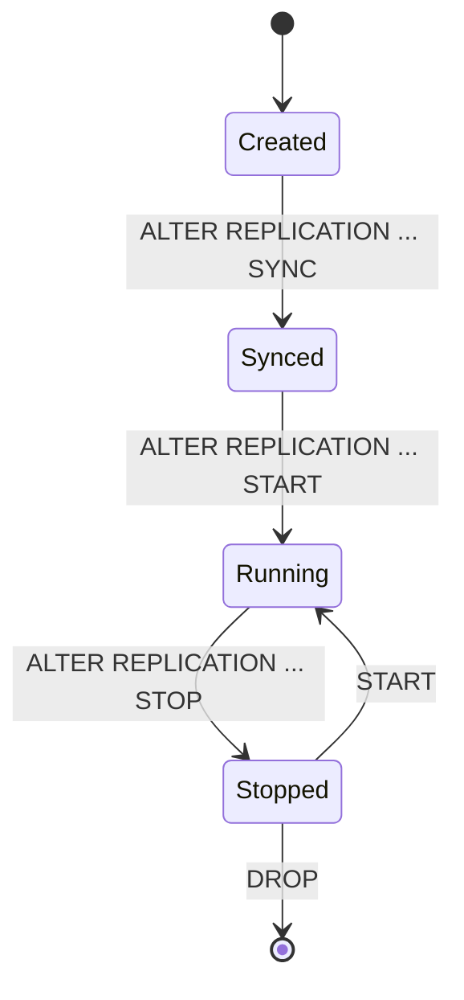

# 09. 이중화, HA, CDC

## 적용 버전

- 7.1: Altibase 7.1 Replication 기준
- 7.3: Altibase 7.3 Replication 기준
- 8.1: Altibase 8.1 검증본 Replication과 8.1 릴리스 노트 기준

## 이 문서로 답할 수 있는 질문

- 이중화 객체 생성, 시작, 중지 SQL을 만들어줘.
- Active-Standby 구성 절차를 알려줘.
- XLog/Log Analyzer는 어떤 경우에 쓰는가?
- 8.1 replication SSL 설정 방법은?
- 버전 간 이중화 호환성은 어떻게 확인하는가?

## 원천 문서

- 7.1: `Manuals/Altibase_7.1/kor/Replication Manual.md`, `Manuals/Altibase_7.1/kor/Log Analyzer User's Manual.md`
- 7.3: `Manuals/Altibase_7.3/kor/Replication Manual.md`, `Manuals/Altibase_7.3/kor/Log Analyzer User's Manual.md`
- 8.1 검증본: `Replication Manual.md`, `Log Analyzer User's Manual.md`, `Technical Documents/kor/ReplicationCompatibility.md`, `Technical Documents/kor/Replication network check.md`

## 핵심 정리

- 이중화 답변은 양쪽 서버에 필요한 객체 생성 여부를 반드시 언급한다.
- `ALTER REPLICATION ... SYNC`, `START`, `STOP`, `FLUSH`의 차이를 구분한다.
- 8.1 SSL 이중화는 `USING SSL`과 `REPLICATION_SSL_PORT_NO`를 함께 설명한다.

## 상태 흐름 후보

## 변환 TODO

- 이중화 생성/시작/중지/동기화 절차를 버전별로 정리한다.
- ReplicationCompatibility를 버전 매트릭스 설명으로 분해한다.
- 네트워크 점검 문서는 명령/증상/판단 기준으로 바꾼다.
