# 09. Replication, HA, and CDC

## Applicable Versions

- 7.1: Based on Altibase 7.1 Replication Manual and Log Analyzer User's Manual.
- 7.3: Based on Altibase 7.3 Replication Manual and Log Analyzer User's Manual.
- 8.1: Based on Altibase 8.1 verified source Replication Manual, Log Analyzer User's Manual, and release notes.

## Questions This File Can Answer

- How should a GPT create, start, stop, synchronize, flush, and drop replication objects?
- How should a GPT explain LAZY mode, EAGER mode, Active-Standby HA, Active-Active risks, failover callbacks, and offline replication?
- Which prerequisites must be checked before recommending replication, sequence replication, replication DDL, or Log Analyzer CDC?
- How should `USING SSL` and `REPLICATION_SSL_PORT_NO` be explained for Altibase 8.1?
- How should XLog Sender, XLog Collector, Log Analysis API, and ODBC C conversion be explained?
- How should replication compatibility, protocol version, network diagnostics, and replication gaps be checked?

## Source Documents

- 7.1: Altibase 7.1 Replication Manual; Altibase 7.1 Log Analyzer User's Manual; Replication Manager User's Manual.
- 7.3: Altibase 7.3 Replication Manual; Altibase 7.3 Log Analyzer User's Manual; Replication Manager User's Manual.
- 8.1: Altibase 8.1 verified source Replication Manual; Altibase 8.1 verified source Log Analyzer User's Manual; Altibase 8.1 release notes.
- Supplemental compatibility and network-check documents: Replication Compatibility; Replication Network Check.

## Altibase Replication and Scope Overview
- **Active-Active Replication**: Altibase supports replication topologies through XLog-based Sender and Receiver processing. Active-Active use requires explicit write ownership, conflict avoidance or conflict policy design, replication gap monitoring, and failover/failback planning. Do not promise fixed latency or automatic conflict-free behavior.
- **Scale-out scope**: Sharding and `ShardManager` setup are outside this attachment's selected replication, HA, CDC, Log Analyzer, and replication SSL source family. Do not generate sharding configuration procedures from this file; use a dedicated sharding source audit if a user asks for scale-out setup.

## Response Rules

- Answer explanatory text in the user's language.
- Keep SQL object names, function names, error codes, property names, command names, file paths, environment variables, and view names literal.
- For 8.1-specific statements, say `Altibase 8.1 verified source`.
- Do not expose internal source labels or source-tree paths in customer answers.
- For production replication actions, include prerequisites, service impact, rollback limits, and verification SQL.
- Before suggesting DDL, failover, offline replication, or cross-version replication, ask for the exact Altibase version from `V$VERSION`, replication mode, topology, replication object names, and whether a replication gap exists.
- Do not present replication as automatic schema synchronization. DML changes are log-replayed; DDL requires explicit operational handling.
- Replication object names, replicated user names, table names, partition names, and sequence names must be checked on both nodes.

## Fast Decision Map

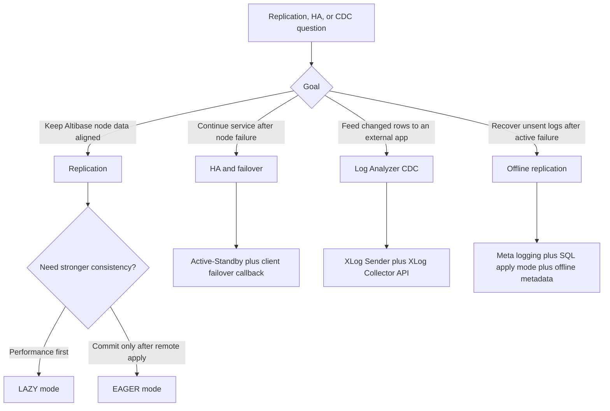

## Core Concepts

Altibase replication is log replay. The local server reads redo log changes for replication target objects, converts those changes into XLogs, sends them through a Sender thread, and the remote server applies them through a Receiver or parallel Applier threads.

Terminology block: local and remote

- `Local Server`: the node on which the current operation is executed.
- `Remote Server`: the peer node in the replication pair.
- `Active Server`: the node currently serving change transactions.
- `Standby Server`: the node that normally receives replicated changes and may serve read-only queries.

Terminology block: runtime threads and log positions

- `Sender`: sends XLogs generated from DML changes on replication targets.
- `Receiver`: receives XLogs from the peer and applies them when no separate applier is used.
- `Applier`: applies XLogs to storage when the parallel receiver applier option is used.
- `XLog`: the logical log record transmitted for replication and CDC.
- `XSN`: `XLog Sequence Number`.
- `Restart SN`: redo-log sequence number used as the restart point after replication resumes.
- `Replication Gap`: the distance between the most recent redo log and the redo log whose corresponding XLog is being sent.

Terminology block: metadata and targets

- `Replication Object`: object created by `CREATE REPLICATION`.
- `Replication Pair`: matching replication objects with the same name on two nodes.
- `Replication Target Table`: table selected in `CREATE REPLICATION` or `ALTER REPLICATION ... ADD TABLE`.
- `Replication Target Partition`: partition selected in replication syntax.
- `Replication Target Column`: a same-named column in the corresponding local and remote target tables.

## Core Replication Topology Diagram

Use this topology when explaining ordinary table-to-table or partition-to-partition replication. A `Sender` reads redo logs for local replication targets, creates XLogs, connects to the peer Receiver port, and the peer `Receiver` applies the XLogs to matching targets.

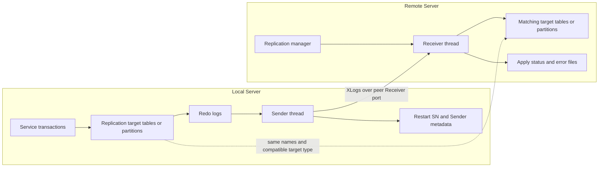

## Replication State Diagram

Use this state model when explaining `CREATE REPLICATION`, `ALTER REPLICATION ... SYNC`, `START`, `QUICKSTART`, `STOP`, `RESET`, and `DROP REPLICATION`.

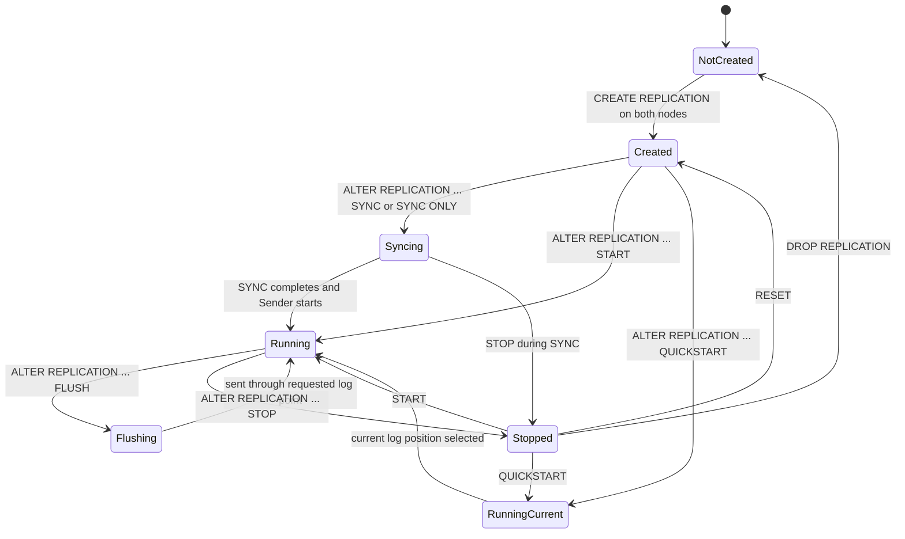

Use this state model when explaining recovery behavior after server, communication, or service-line failure.

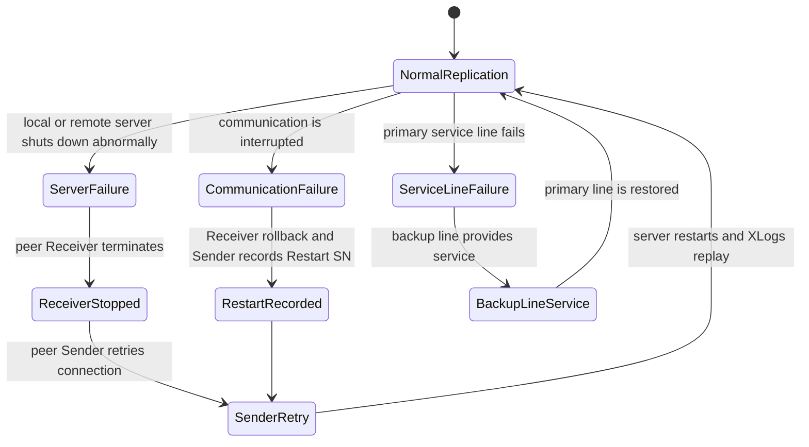

## Replication Mode Guide

Mode block: `LAZY`

- Purpose: prioritize performance.
- Commit behavior: the local master transaction can commit without waiting for remote apply.
- Risk: a replication gap can occur when the system is busy or the network is slow.
- Useful options: `GAPLESS`, `PARALLEL`, `GROUPING`, `OFFLINE`, and Log Analyzer role are LAZY-oriented features.
- Caution: if failover occurs while a gap remains, the standby may not have all committed data.

Mode block: `EAGER`

- Purpose: prioritize data consistency.
- Commit behavior: the local transaction commits only after remote apply confirmation.
- Benefit: avoids delayed replication backlog and supports parallel replication.
- Important property: `REPLICATION_EAGER_PARALLEL_FACTOR`.
- Cautions:
  - Both local and remote replication objects must use EAGER mode for synchronization.
  - EAGER mode is not recommended for more than three nodes.
  - Network failure can still create split-brain style inconsistency if both sides continue accepting updates.
  - Node time must be synchronized.
  - `REPLICATION_SQL_APPLY_ENABLE` is not available in EAGER mode.
  - Offline replication and cross-version compatibility rules that apply to LAZY mode do not make EAGER safe across different versions.

## Topology Guide

Topology block: Active-Standby

- Recommended for most HA answers.
- One Active node receives application DML; one Standby node receives replicated XLogs.
- Failover should be paired with application-side callback validation because LAZY replication may leave a gap.
- Sequence replication is recommended in Active-Standby, not Active-Active.

Topology block: Active-Active

- Both nodes can serve writes, but conflict risk is higher.
- Primary keys must not be updated.
- Conflicts during `INSERT`, `UPDATE`, or `DELETE` are skipped and logged to error files according to conflict rules.
- If both nodes update the same row differently, data mismatch can occur.
- Use only after explaining conflict resolution, routing rules, and application ownership of rows.

Topology block: multi-IP replication

- A replication object can contain multiple remote host address and port pairs.
- The Sender starts with the first host and can reconnect through another host after a line failure.
- `ALTER REPLICATION ... ADD HOST`, `DROP HOST`, and `SET HOST` require the replication object to be stopped.
- After `SET HOST`, the selected host is used when replication is restarted.

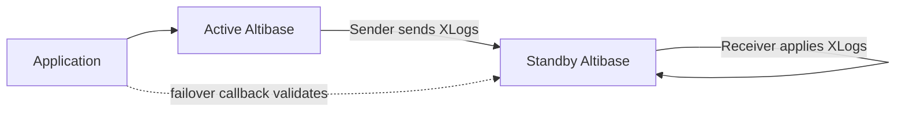

Use this diagram when explaining why Active-Active replication needs write ownership rules and conflict planning.

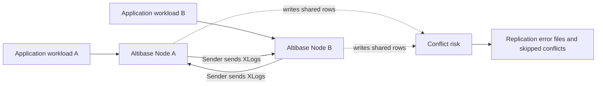

Use this topology for a replication object with multiple remote host address and port pairs.

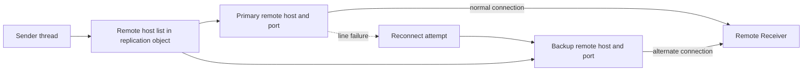

Use this partition topology when explaining that table targets map to tables and partition targets map to matching partitions.

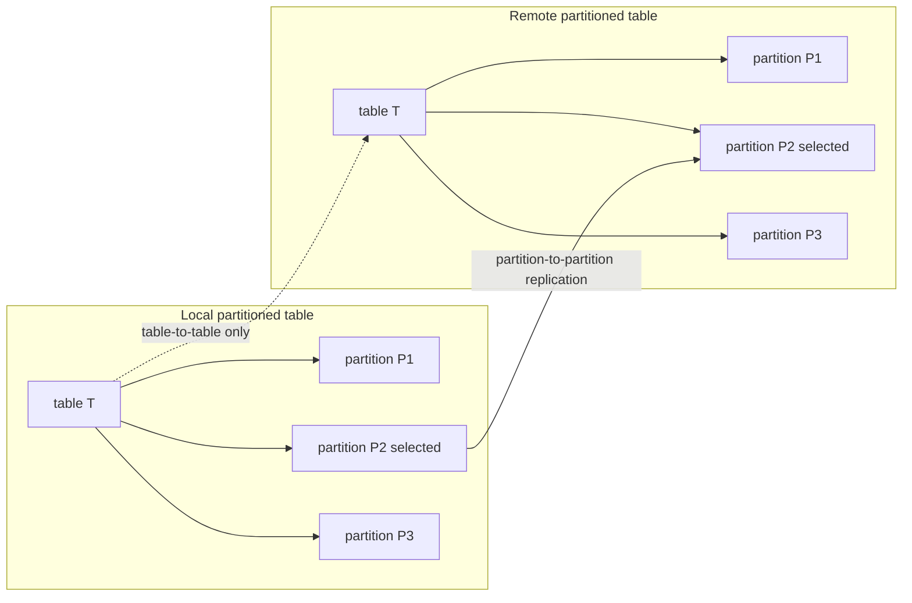

## Prerequisite Checklist

Object and schema prerequisites:

- The same replication object name must exist on both nodes.
- The source and target object names in `FROM ... TO ...` must be intentional and checked on both nodes.
- The database character set and national character set must match on both nodes. Check `V$NLS_PARAMETERS`.
- Replication target tables must have primary keys.
- Primary-key columns on target tables must not be updated.
- Replication target item types must match: table to table, partition to partition. Table-to-partition crossover is not supported.
- For partition replication, partitioning method and partition constraints must match. Hash partition counts must match.

Operational prerequisites:

- Only `SYS` can run replication-related SQL.
- `REPLICATION_MAX_COUNT` limits the number of replication connections from one Altibase database.
- Before DDL or topology changes, check replication gap and stop/migrate service when required.
- For network-sensitive operations, capture evidence from both Sender and Receiver sides.

Verification SQL:

```sql
SELECT product_version,
       meta_version,
       protocol_version,
       repl_protocol_version
FROM V$VERSION;

SELECT parameter, value
FROM V$NLS_PARAMETERS
WHERE parameter IN ('NLS_CHARACTERSET', 'NLS_NCHAR_CHARACTERSET')
ORDER BY parameter;

SELECT name, value1
FROM V$PROPERTY
WHERE name IN (
  'REPLICATION_MAX_COUNT',
  'REPLICATION_PORT_NO',
  'REPLICATION_IB_PORT_NO',
  'REPLICATION_SSL_PORT_NO',
  'REPLICATION_SYNC_LOCK_TIMEOUT',
  'REPLICATION_SQL_APPLY_ENABLE',
  'REPLICATION_DDL_ENABLE',
  'REPLICATION_DDL_ENABLE_LEVEL',
  'REPLICATION_DDL_SYNC',
  'REPLICATION_EAGER_PARALLEL_FACTOR',
  'REPLICATION_SENDER_AUTO_START'
)
ORDER BY name;
```

## CREATE REPLICATION Syntax

Use this compact BNF-like form for customer answers.

```text
ordinary_table_replication ::=
  CREATE [LAZY | EAGER] REPLICATION [IF NOT EXISTS] replication_name
    [AS MASTER | AS SLAVE]
    [OPTIONS option_name [option_name ...]]
    WITH 'remote_host_ip_or_name', remote_host_port_no [USING conn_type [ib_latency]]
         [...]
    FROM user_name.table_name [PARTITION partition_name]
    TO   user_name.table_name [PARTITION partition_name]
    [, FROM ... TO ...];

log_analyzer_cdc_replication ::=
  CREATE REPLICATION replication_name
    { FOR ANALYSIS | FOR PROPAGABLE LOGGING | FOR PROPAGATION | FOR ANALYSIS PROPAGATION }
    [OPTIONS option_name [option_name ...]]
    { WITH 'xlog_sender_host_ip_or_name', xlog_sender_port_no
           [...]
    | WITH UNIX_DOMAIN }
    FROM user_name.table_name
    TO   user_name.table_name
    [, FROM ... TO ...];
```

Syntax notes:

- If `LAZY` or `EAGER` is omitted, LAZY mode is used.
- `IF NOT EXISTS` is available for `CREATE REPLICATION` in Altibase 8.1 verified source. Omit it for 7.1 and 7.3.
- `replication_name` must be the same on both nodes.
- `remote_host_port_no` is the peer Receiver port.
- If the `USING` clause is omitted, ordinary TCP replication is used.
- In non-SSL TCP replication, use the peer `REPLICATION_PORT_NO`. This is the ordinary replication port, not the database service port and not `SSL_PORT_NO`.
- In Altibase 8.1 verified source SSL replication, use the peer `REPLICATION_SSL_PORT_NO` with `USING SSL`.
- For InfiniBand, use `USING IB [ib_latency]` and the peer `REPLICATION_IB_PORT_NO`.
- `FOR ANALYSIS` and related Log Analyzer CDC forms create an XLog Sender and are not ordinary table-to-table apply syntax. Do not combine them with `EAGER`, `USING SSL`, or `USING IB`; Log Analyzer CDC is LAZY/TCP or UNIX-domain-socket scoped.
- For Log Analyzer `WITH UNIX_DOMAIN`, the XLog Sender and XLog Collector must run on the same UNIX or Linux host. `$ALTIBASE_HOME` must be the same for Sender and Collector, and the generated socket path is `$ALTIBASE_HOME/trc/rp-replication_name`.
- `AS MASTER` and `AS SLAVE` affect handshaking. Valid pairings are not-set with not-set, master with slave, and slave with master.

## CREATE REPLICATION Examples: Non-SSL TCP

Use this case for ordinary replication over TCP in 7.1, 7.3, and 8.1 when the customer did not request replication SSL.

Non-SSL prerequisites:

- Target tables and primary keys already exist on both nodes.
- Both nodes use the same database character set and national character set.
- The peer port used in `WITH 'host', port` is the peer node's `REPLICATION_PORT_NO`.
- The same `replication_name` and target item list are created on both nodes, with the peer endpoint reversed.
- The same table-to-table or partition-to-partition mapping is intended on both nodes.

Preflight:

```sql
SELECT name, value1
FROM V$PROPERTY
WHERE name IN ('REPLICATION_PORT_NO', 'REPLICATION_MAX_COUNT')
ORDER BY name;
```

Example topology:

- Node A: `192.168.1.60`, `REPLICATION_PORT_NO = 25524`
- Node B: `192.168.1.12`, `REPLICATION_PORT_NO = 35524`
- Replication object: `rep1`
- Replication targets: `sys.employees`, `sys.departments`

```sql
-- Node A: use Node B's ordinary replication port.
CREATE REPLICATION rep1
WITH '192.168.1.12', 35524
FROM sys.employees TO sys.employees,
FROM sys.departments TO sys.departments;

-- Node B: use Node A's ordinary replication port.
CREATE REPLICATION rep1
WITH '192.168.1.60', 25524
FROM sys.employees TO sys.employees,
FROM sys.departments TO sys.departments;
```

Initial start choices:

```sql
-- Copy current target rows from the local node to the peer, then start Sender.
ALTER REPLICATION rep1 SYNC;

-- If data was already aligned and restart metadata is valid, resume from the latest restart point.
ALTER REPLICATION rep1 START;

-- Use only when old unsent changes may be skipped intentionally.
ALTER REPLICATION rep1 QUICKSTART;
```

## CREATE REPLICATION Examples: Altibase 8.1 SSL

Use this case only for Altibase 8.1 verified source replication SSL. Keep it separate from ordinary client/server SSL/TLS. The ordinary client/server SSL listener uses `SSL_PORT_NO`; replication SSL uses `REPLICATION_SSL_PORT_NO`.

SSL prerequisites:

- Both nodes are Altibase 8.1 when using this verified 8.1 guidance.
- Ordinary SSL/TLS setup has already been completed on each replication target server.
- Each node has a nonzero `REPLICATION_SSL_PORT_NO`.
- Firewalls allow each peer to connect to the other peer's `REPLICATION_SSL_PORT_NO`.
- `USING SSL` is specified in both matching `CREATE REPLICATION` statements.
- `FOR ANALYSIS` Log Analyzer replication is not combined with SSL, because Log Analyzer does not support SSL or InfiniBand communication in the verified source guidance.

Preflight:

```sql
SELECT name, value1
FROM V$PROPERTY
WHERE name IN (
  'SSL_ENABLE',
  'SSL_PORT_NO',
  'REPLICATION_SSL_PORT_NO',
  'REPLICATION_MAX_COUNT'
)
ORDER BY name;
```

Example topology:

- Node A: `192.168.1.60`, `REPLICATION_SSL_PORT_NO = 35524`
- Node B: `192.168.1.12`, `REPLICATION_SSL_PORT_NO = 45524`
- Replication object: `rep1_ssl`
- Replication targets: `sys.employees`, `sys.departments`

```sql
-- Node A: use Node B's SSL replication port.
CREATE REPLICATION rep1_ssl
WITH '192.168.1.12', 45524 USING SSL
FROM sys.employees TO sys.employees,
FROM sys.departments TO sys.departments;

-- Node B: use Node A's SSL replication port.
CREATE REPLICATION rep1_ssl
WITH '192.168.1.60', 35524 USING SSL
FROM sys.employees TO sys.employees,
FROM sys.departments TO sys.departments;
```

Start SSL replication the same way as non-SSL replication:

```sql
-- Initial copy and start.
ALTER REPLICATION rep1_ssl SYNC;

-- Normal restart after a controlled stop.
ALTER REPLICATION rep1_ssl START;

-- Planned maintenance validation before service movement.
ALTER REPLICATION rep1_ssl FLUSH ALL WAIT 60;
```

Altibase 8.1 SSL cautions:

- Altibase 8.1 supports SSL/TLS encryption for replication communication.
- `USING SSL` is specified in `CREATE REPLICATION`.
- `REPLICATION_SSL_PORT_NO` configures the local SSL replication Receiver port. If this property is `0`, SSL replication cannot connect to that node.
- General SSL/TLS server setup must be completed before using SSL replication.
- `SSL_PORT_NO` and `REPLICATION_SSL_PORT_NO` are different ports.
- Log Analyzer does not support SSL or InfiniBand communication; do not combine `FOR ANALYSIS` with `USING SSL`.

Non-SSL multi-IP example:

```sql
CREATE REPLICATION rep1
WITH 'standby_ip_1', standby_port 'standby_ip_2', standby_port
FROM sys.employees TO sys.employees,
FROM sys.departments TO sys.departments;

ALTER REPLICATION rep1 STOP;
ALTER REPLICATION rep1 ADD HOST 'standby_ip_3', standby_port;
ALTER REPLICATION rep1 SET HOST 'standby_ip_2', standby_port;
ALTER REPLICATION rep1 START;
```

## ALTER REPLICATION Operations

Syntax block:

```text
ALTER REPLICATION replication_name SYNC [PARALLEL parallel_factor]
  [TABLE user_name.table_name [PARTITION partition_name], ...];

ALTER REPLICATION replication_name SYNC ONLY [PARALLEL parallel_factor]
  [TABLE user_name.table_name [PARTITION partition_name], ...];

ALTER REPLICATION replication_name START [RETRY];
ALTER REPLICATION replication_name QUICKSTART [RETRY];
ALTER REPLICATION replication_name STOP;
ALTER REPLICATION replication_name RESET;

ALTER REPLICATION replication_name ADD TABLE
  FROM user_name.table_name [PARTITION partition_name]
  TO   user_name.table_name [PARTITION partition_name];

ALTER REPLICATION replication_name DROP TABLE
  FROM user_name.table_name [PARTITION partition_name]
  TO   user_name.table_name [PARTITION partition_name];

ALTER REPLICATION replication_name FLUSH [ALL] [WAIT timeout_sec];
```

Operation block: `SYNC`

- Sends all records in replication target tables from the local server to the remote server, then starts replication from the chosen log position.
- Briefly obtains an `S Lock` on the synchronization target to determine the start log point.
- Waits up to `REPLICATION_SYNC_LOCK_TIMEOUT` if another transaction is updating the table.
- Resolves duplicate primary-key conflicts according to conflict resolution rules.
- Can target specific tables or partitions.
- `PARALLEL parallel_factor` uses 1 when omitted; the practical maximum is `CPU count * 2`.

Operation block: `SYNC ONLY`

- Sends all target records to the remote server without creating a Sender thread.
- Useful for initial data alignment before a separate start decision.
- Conflict rules apply when matching primary keys already exist on the remote server.

Operation block: `START`

- Starts replication from the most recent replication restart point.
- Use after normal stop/restart or after initial `SYNC`.

Operation block: `QUICKSTART`

- Starts from the current log position.
- Does not send earlier unsent changes; use only when skipping old gap data is intentional.

Operation block: `START RETRY` and `QUICKSTART RETRY`

- Creates a Sender thread even when the first handshake fails.
- iSQL can show success even when the initial handshake failed.
- `RETRY` is not supported for EAGER-mode replication. Verify the replication mode before recommending `START RETRY` or `QUICKSTART RETRY`.
- Verify with trace logs and `V$REPSENDER`.

Operation block: `STOP`

- Stops replication.
- If `STOP` interrupts `SYNC`, full transmission is not guaranteed.
- To retry an interrupted `SYNC`, delete rows from all target tables that were part of the synchronization plan before running `SYNC` again.

Operation block: `RESET`

- Resets replication metadata such as restart SN.
- Can be executed only while replication is stopped.
- Can avoid a full `DROP REPLICATION` and `CREATE REPLICATION` cycle when the object definition remains valid.

Operation block: `ADD TABLE`

- Adds a table or partition to an existing replication object.
- Can be executed only while replication is stopped.
- The target item type and names must match the intended mapping.

Operation block: `DROP TABLE`

- Removes a table or partition from a replication object.
- If the target table's primary transaction log or metadata log is inside a replication gap, the gap can be skipped and data inconsistency can result.

Operation block: `FLUSH`

- Waits until the Sender has sent logs through the log point at the time `FLUSH` was executed.
- `FLUSH ALL` waits through the most recent log instead of only the log point at command execution.
- `WAIT timeout_sec` bounds the wait.
- Use before DDL, failover validation, maintenance, or application cutover.

Lifecycle examples:

```sql
-- Initial alignment for all targets in the replication object.
ALTER REPLICATION rep1 SYNC;

-- Align selected targets only, then start later from the restart point.
ALTER REPLICATION rep1 SYNC ONLY TABLE sys.employees, sys.departments;
ALTER REPLICATION rep1 START;

-- Stop before changing target membership.
ALTER REPLICATION rep1 STOP;
ALTER REPLICATION rep1 ADD TABLE
FROM sys.projects TO sys.projects;
ALTER REPLICATION rep1 SYNC TABLE sys.projects;

-- Remove a target only after confirming no unsafe replication gap remains.
ALTER REPLICATION rep1 STOP;
ALTER REPLICATION rep1 DROP TABLE
FROM sys.projects TO sys.projects;

-- Planned cutover or maintenance check.
ALTER REPLICATION rep1 FLUSH ALL WAIT 60;

-- Reset restart metadata only while stopped and only when the object definition remains valid.
ALTER REPLICATION rep1 STOP;
ALTER REPLICATION rep1 RESET;
```

Verification after start:

```sql
SELECT rep_name,
       status,
       net_error_flag,
       sender_ip,
       sender_port,
       peer_ip,
       peer_port
FROM V$REPSENDER
ORDER BY rep_name;

SELECT rep_name,
       my_ip,
       my_port,
       peer_ip,
       peer_port
FROM V$REPRECEIVER
ORDER BY rep_name;
```

## DROP REPLICATION

Syntax:

```sql
DROP REPLICATION replication_name;
```

Rules:

- Stop replication first with `ALTER REPLICATION replication_name STOP`.
- After `DROP REPLICATION`, `ALTER REPLICATION ... START` cannot be used for that object.
- Recreate matching objects on both nodes if replication is needed again.

Example:

```sql
ALTER REPLICATION rep1 STOP;
DROP REPLICATION rep1;
```

## Replication Options

Option block: `RECOVERY`

- Syntax:

```sql
CREATE REPLICATION rep1 OPTIONS RECOVERY
WITH 'standby_ip', standby_port
FROM sys.t1 TO sys.t1;

ALTER REPLICATION rep1 SET RECOVERY ENABLE;
ALTER REPLICATION rep1 SET RECOVERY DISABLE;
```

- Purpose: helps recover consistency after abnormal server termination during replication.
- Useful when commit-related properties do not force logs to disk.
- Restriction: cannot be used with the offline option.
- Operational rule: cannot be changed while replication is processing.

Option block: `GAPLESS`

- Syntax:

```sql
CREATE REPLICATION rep1 OPTIONS GAPLESS
WITH 'standby_ip', standby_port
FROM sys.t1 TO sys.t1;

ALTER REPLICATION rep1 SET GAPLESS ENABLE;
ALTER REPLICATION rep1 SET GAPLESS DISABLE;
```

- Purpose: delays commits to help dissolve replication gaps.
- Key properties: `REPLICATION_GAPLESS_ALLOW_TIME`, `REPLICATION_GAPLESS_MAX_WAIT_TIME`.
- Restriction: LAZY mode only.
- Caution: delaying transaction commits can reduce service performance.

Option block: `PARALLEL`

- Syntax:

```sql
CREATE REPLICATION rep1 OPTIONS PARALLEL receiver_applier_count [buffer_size]
WITH 'standby_ip', standby_port
FROM sys.t1 TO sys.t1;

ALTER REPLICATION rep1 SET PARALLEL receiver_applier_count [buffer_size];
```

- Purpose: creates multiple appliers on the Receiver side.
- Range: `receiver_applier_count` can be `0` through `512`; `0` means the Receiver performs apply work.
- Queue sizing property: `REPLICATION_RECEIVER_APPLIER_QUEUE_SIZE`.
- Good fit: long-running transactions with enough concurrency.
- Poor fit: many short transactions where commit synchronization overhead dominates.
- Restriction: LAZY mode only.

Option block: `GROUPING`

- Syntax:

```sql
CREATE REPLICATION rep1 OPTIONS GROUPING
WITH 'standby_ip', standby_port
FROM sys.t1 TO sys.t1;

ALTER REPLICATION rep1 SET GROUPING ENABLE;
ALTER REPLICATION rep1 SET GROUPING DISABLE;
```

- Purpose: groups multiple transactions into a smaller number of replication transactions when a gap occurs.
- Related thread: Ahead Analyzer.
- Key properties: `REPLICATION_GROUPING_AHEAD_READ_NEXT_LOG_FILE`, `REPLICATION_GROUPING_TRANSACTION_MAX_COUNT`.
- Restriction: LAZY mode only.

Option block: `META_LOGGING`

- Syntax:

```sql
CREATE REPLICATION rep1 OPTIONS META_LOGGING
WITH 'standby_ip', standby_port
FROM sys.t1 TO sys.t1;

CREATE REPLICATION ala1 FOR ANALYSIS OPTIONS META_LOGGING
WITH 'collector_ip', collector_port
FROM sys.t1 TO sys.t1;
```

- Purpose: saves Sender metadata and restart SN information to files.
- Ordinary replication metadata path: `repl_meta_files` under the log file path.
- Log Analyzer metadata path: `ala_meta_files` under the log file path.
- Required for offline replication from unsent Active-server logs.

Option block: `OFFLINE`

- Syntax:

```sql
CREATE REPLICATION rep1 OPTIONS OFFLINE '/active_server/altibase_home/logs'
WITH 'active_ip', active_port
FROM sys.t1 TO sys.t1;

ALTER REPLICATION rep1 SET OFFLINE ENABLE WITH '/active_server/altibase_home/logs';
ALTER REPLICATION rep1 BUILD OFFLINE META [AT SN(sn)];
ALTER REPLICATION rep1 START WITH OFFLINE;
ALTER REPLICATION rep1 RESET OFFLINE META;
ALTER REPLICATION rep1 SET OFFLINE DISABLE;
```

- Purpose: retrieves untransmitted logs from the failed Active server and applies the change transactions on the Standby server.
- Execution location: the replication server where the Receiver thread is active.
- Preconditions:
  - The Active server previously started replication to the remote server.
  - `META_LOGGING` was set on the Active server's replication object.
  - The Active server log files and Sender metadata files are accessible.
- Required operational setting: enable `REPLICATION_SQL_APPLY_ENABLE` before `START WITH OFFLINE`; disable it afterward.
- Behavior: offline replication is a one-time operation; Sender and Receiver threads are automatically stopped, so normal replication must be restarted afterward.
- Restrictions:
  - LAZY mode only.
  - Not available for compressed-table replication objects.
  - Cannot be combined with `RECOVERY`.
  - The offline replication server and Active server must have the same OS, CPU type, CPU bit architecture, three-part binary database version, and `LOG_FILE_SIZE`.
  - Do not rename, copy to another system, delete, or manually edit the source log files or Sender metadata files.

Offline replication procedure:

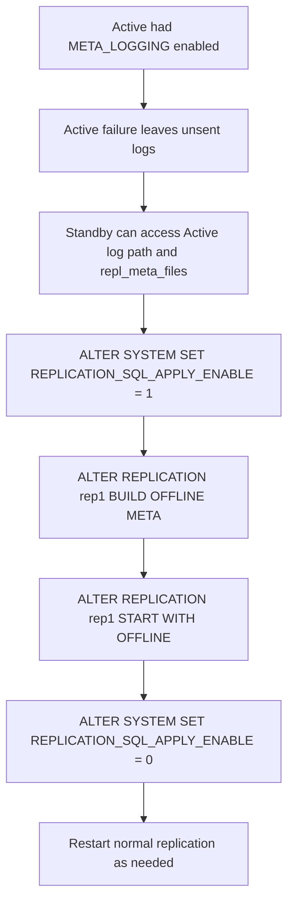

Use this state model when explaining the `OFFLINE` option lifecycle. Offline replication is one-time; normal replication must be restarted separately when needed.

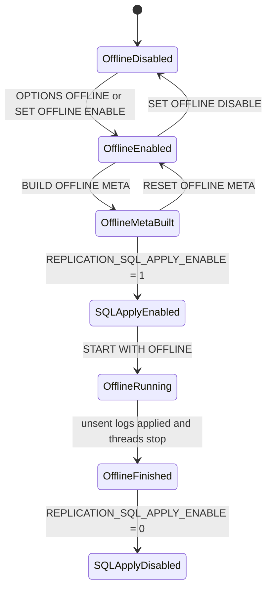

## Replication DDL Guidance

Core rule:

- Replication transfers DML-related transaction logs. DDL changes metadata and are not handled like normal replicated DML.
- A safe DDL answer must either remove the target from replication and perform DDL on both nodes, or follow the documented DDL execution/synchronization procedure.

Properties:

- `REPLICATION_DDL_ENABLE`: enables DDL execution on replication targets when set to `1`.
- `REPLICATION_DDL_ENABLE_LEVEL`: controls which DDL categories are allowed.
- `REPLICATION_DDL_SYNC`: enables DDL synchronization from the local server executing the DDL to the remote server.
- `REPLICATION_SQL_APPLY_ENABLE`: enables SQL apply mode on the Receiver side.

DDL Level 0 examples:

- Add a column without constraints.
- Drop a non-primary-key column without constraints and not used in function-based indexes.
- Set or drop a default value.
- Change table or partition tablespace.
- `TRUNCATE TABLE` or `TRUNCATE PARTITION`, except compressed-column cases.
- Create or drop non-unique indexes, with restrictions.

DDL Level 1 examples:

- Add or modify `NOT NULL`, `UNIQUE`, or `LOCALUNIQUE` columns.
- Drop constrained columns except primary-key and compressed columns.
- Split, merge, or drop partitions.
- Add, rename, or drop table constraints.
- Create or drop unique key indexes and function-based indexes.
- Requires `REPLICATION_SQL_APPLY_ENABLE = 1`.

DDL restrictions:

- DDL on replication objects with `RECOVERY` enabled is not supported by this procedure; delete and recreate replication instead.
- DDL on EAGER-mode replication targets requires the standard DDL procedure rather than SQL apply mode.
- Clear replication gaps before DDL.
- DDL locks the target table; a primary transaction during the lock can block receiver apply.
- If increasing a column range, execute DDL first on the node not generating primary transactions.
- If decreasing a column range, execute DDL first on the node generating primary transactions.

Standard DDL procedure without SQL apply mode:

```sql
-- 1. Schedule a maintenance window, stop service traffic or enter the documented admin flow.
SELECT COUNT(*) FROM V$SESSION WHERE ID <> SESSION_ID();

-- 2. Flush replication and verify no remaining gap before DDL.
ALTER REPLICATION rep1 FLUSH ALL WAIT 60;
SELECT rep_name, rep_gap, rep_gap_size
FROM V$REPGAP
WHERE rep_name = 'REP1';

-- 3. Stop replication and remove the target tables from every affected replication object.
ALTER REPLICATION rep1 STOP;
ALTER REPLICATION rep1 DROP TABLE FROM app.t1 TO app.t1;

-- 4. Execute the DDL on every node with identical object names and compatible storage choices.
-- ALTER TABLE app.t1 ...;

-- 5. Add targets back, then resynchronize or start according to the topology and data ownership.
ALTER REPLICATION rep1 ADD TABLE FROM app.t1 TO app.t1;
ALTER REPLICATION rep1 SYNC;
```

DDL synchronization procedure with SQL apply mode:

```sql
-- 1. Use this only for documented DDL synchronization cases, not for EAGER targets or RECOVERY-enabled objects.
--    Replication must already be started on both servers, protocol versions must match,
--    and the replication target owner and name must match on both servers.

-- 2. On the local server that will execute the DDL, enable DDL execution and session DDL sync.
ALTER SYSTEM SET REPLICATION_DDL_ENABLE = 1;
ALTER SYSTEM SET REPLICATION_DDL_ENABLE_LEVEL = 1;
ALTER SESSION SET REPLICATION_DDL_SYNC = 1;

-- 3. On the remote server, enable DDL execution, DDL sync, and SQL apply support.
ALTER SYSTEM SET REPLICATION_DDL_ENABLE = 1;
ALTER SYSTEM SET REPLICATION_DDL_ENABLE_LEVEL = 1;
ALTER SYSTEM SET REPLICATION_DDL_SYNC = 1;
ALTER SYSTEM SET REPLICATION_SQL_APPLY_ENABLE = 1;

-- 4. On the local server, use the replication mode defined by the replication object.
ALTER SESSION SET REPLICATION = DEFAULT;

-- 5. On both the local and remote servers, flush before executing the DDL.
-- Local server:
ALTER REPLICATION rep1 FLUSH;
-- Remote server:
ALTER REPLICATION rep1 FLUSH;

-- 6. Execute the DDL one time on the local server only.
-- ALTER TABLE app.t1 ...;

-- 7. Verify apply completion, then restore every changed property immediately.
SELECT rep_name, sql_apply_table_count
FROM V$REPRECEIVER
WHERE rep_name = 'REP1';

-- 8. On the local server, reset local DDL properties and the session DDL sync flag.
ALTER SYSTEM SET REPLICATION_DDL_ENABLE = 0;
ALTER SYSTEM SET REPLICATION_DDL_ENABLE_LEVEL = 0;
ALTER SESSION SET REPLICATION_DDL_SYNC = 0;

-- 9. On the remote server, reset remote DDL sync and SQL apply properties.
ALTER SYSTEM SET REPLICATION_DDL_ENABLE = 0;
ALTER SYSTEM SET REPLICATION_DDL_ENABLE_LEVEL = 0;
ALTER SYSTEM SET REPLICATION_DDL_SYNC = 0;
ALTER SYSTEM SET REPLICATION_SQL_APPLY_ENABLE = 0;
```

Partition DDL note:

- Stop replication on both local and remote servers before partition DDL when the procedure requires it.
- Partition names in the DDL must be identical on both nodes.

## HA and Failover

Failover terms:

- `CTF`: Connection Time Fail-Over. The client connects to another node when connection to the first node fails.
- `STF`: Service Time Fail-Over. The client reconnects after failure during an established session, restores session properties, and may need to reexecute work.
- `Fail-Over Callback`: application callback used to decide whether failover should continue and to validate database state.

Failover rule:

- In a replicated Altibase environment, use a failover callback for validation because replication can lag, especially in LAZY mode.
- Callback validation should confirm the target node has the data needed for the application to continue.

JDBC callback constants:

- `FO_BEGIN`: failover start notification.
- `FO_END`: failover success notification.
- `FO_ABORT`: failover failure notification.
- `FO_GO`: callback tells the client library to continue failover.
- `FO_QUIT`: callback tells the client library failover should stop.

Failover flow:

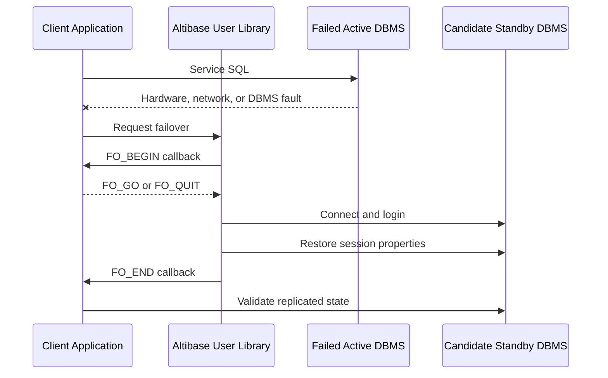

HA answer checklist:

- Ask whether the topology is Active-Standby or Active-Active.
- Ask whether mode is LAZY or EAGER.
- Check `V$REPGAP`, `V$REPSENDER`, and `V$REPRECEIVER` before failover.
- Use `ALTER REPLICATION ... FLUSH [ALL] [WAIT n]` before planned switchover when possible.
- For unplanned Active failure with unsent logs, evaluate offline replication only if `META_LOGGING` and log access requirements are met.
- Make clear that STF may require reexecution of business logic.

## Sequence Replication

Purpose:

- Sequence replication lets local and remote servers use an identical sequence in failover scenarios.
- Altibase internally creates a table for sequence replication because ordinary replication supports tables.

Prerequisites:

```text
REPLICATION_TIMESTAMP_RESOLUTION=1
```

Sequence options that should be identical on local and remote servers:

- `START WITH`
- `INCREMENT BY`
- `MAXVALUE`
- `MINVALUE`
- `CACHE`
- `FLUSH CACHE`
- `CYCLE`

Syntax:

```sql
CREATE SEQUENCE user_name.seq_name
START WITH 1
CACHE 100
ENABLE SYNC TABLE;

CREATE REPLICATION repl_name
WITH 'remote_host_ip', remote_host_port_no
FROM user_name.seq_name$seq TO user_name.seq_name$seq;

ALTER REPLICATION repl_name START;
ALTER REPLICATION repl_name STOP;

ALTER SEQUENCE user_name.seq_name DISABLE SYNC TABLE;
```

Cautions:

- Recommended for Active-Standby.
- Active-Active sequence replication can produce duplicate values when a replication gap exists.
- Cache size should usually be at least `100`.
- Change the cache size before the sequence synchronization table is created.
- Replication recreation, sequence recreation, and sequence modification must be applied equivalently on all servers.
- After failover, gaps in generated key values can occur because the peer begins from the next cache range.

## Replication Roles and Propagation

Role block: no role

- Normal 1:1 bidirectional replication between Altibase servers.
- The role value is `0` in replication metadata.

Role block: `FOR ANALYSIS`

- Creates a Log Analyzer XLog Sender.
- Used for CDC and external change processing.
- Can be combined with propagation as `FOR ANALYSIS PROPAGATION`.

Role block: `FOR PROPAGABLE LOGGING`

- The Receiver logs received transactions in a way that allows later propagation to other nodes.
- Adds extra logging overhead, including primary-key-related information.

Role block: `FOR PROPAGATION`

- A Sender reads both local replication target logs and logs generated by propagable logging, then sends them to another node.

Propagation cautions:

- Configure propagation in one direction only.
- Avoid cycles; cycles can infinitely reapply changes.
- Do not use propagation casually with `RECOVERY`; the design becomes complex.
- Expect lower Receiver-side transaction performance when `PROPAGABLE LOGGING` is enabled.

## Compatibility Guidance

Core compatibility rule:

- Altibase version 6 and later provide documented lower-version replication compatibility for LAZY mode.
- Lower-to-higher replication means a lower version can send data to a higher version, but support must be checked against the compatibility matrix and the actual `repl_protocol_version`.
- EAGER mode and offline replication are excluded from this cross-version compatibility rule; use them only when both server versions match.
- Always check `repl_protocol_version` in `V$VERSION` on both nodes.

Compatibility block: Altibase 7.3 receiver

- 7.1 Sender to 7.3 Receiver, LAZY: compatible.
- 6.5.1 Sender to 7.3 Receiver, LAZY: compatible.
- 6.3.1 Sender to 7.3 Receiver, LAZY: compatible.
- 6.1.1 Sender to 7.3 Receiver, LAZY: compatible.
- 7.3 Sender to 7.3 Receiver, LAZY: compatible.
- 7.3 Sender to 7.1 Receiver, LAZY: compatible.
- 7.3 Sender to 6.5.1 Receiver, LAZY: compatible.
- 7.3 Sender to 6.3.1 Receiver, LAZY: compatible.
- 7.3 Sender to 6.1.1 Receiver, LAZY: not compatible.
- Protocol reference: Altibase 7.3.0.0.1 and later use replication protocol `7.4.9`.

Compatibility block: Altibase 7.1 receiver

- 6.5.1 Sender to 7.1 Receiver, LAZY: compatible.
- 6.3.1 Sender to 7.1 Receiver, LAZY: compatible.
- 6.1.1 Sender to 7.1 Receiver, LAZY: compatible.
- 7.1 Sender to 7.1 Receiver, LAZY: compatible.
- 7.1 Sender to 6.5.1 Receiver, LAZY: compatible.
- 7.1 Sender to 6.3.1 Receiver, LAZY: compatible.
- 7.1 Sender to 6.1.1 Receiver, LAZY: not compatible.
- Protocol references:
  - 7.1.0.6.5 and later: `7.4.7`.
  - 7.1.0.4.0 through 7.1.0.6.4: `7.4.6`.
  - 7.1.0.2.4 through 7.1.0.3.9: `7.4.5`.
  - 7.1.0.1.8 through 7.1.0.2.3: `7.4.4`.
  - 7.1.0.1.4 through 7.1.0.1.7: `7.4.3`.
  - 7.1.0.1.2 through 7.1.0.1.3: `7.4.2`.

Compatibility block: Altibase 8.1

- Use Altibase 8.1 verified source for 8.1 answers.
- 8.1 adds SSL/TLS support for replication communication through `USING SSL` and `REPLICATION_SSL_PORT_NO`.
- Do not infer EAGER or offline compatibility from LAZY compatibility statements.
- When planning 8.1 with older nodes, request the exact `product_version` and `repl_protocol_version` from both nodes before giving a compatibility answer.

Compatibility SQL:

```sql
SELECT product_version,
       protocol_version,
       repl_protocol_version
FROM V$VERSION;
```

## Monitoring and Health Checks

Replication metadata views:

- `SYSTEM_.SYS_REPLICATIONS_`: replication definitions.
- `SYSTEM_.SYS_REPL_HOSTS_`: host endpoints.
- `SYSTEM_.SYS_REPL_ITEMS_`: replicated table or partition items.

Replication runtime views:

- `V$REPEXEC`
- `V$REPGAP`
- `V$REPGAP_PARALLEL`
- `V$REPLOGBUFFER`
- `V$REPOFFLINE_STATUS`
- `V$REPRECEIVER`
- `V$REPRECEIVER_COLUMN`
- `V$REPRECEIVER_PARALLEL`
- `V$REPRECEIVER_STATISTICS`
- `V$REPRECEIVER_TRANSTBL`
- `V$REPRECEIVER_TRANSTBL_PARALLEL`
- `V$REPRECOVERY`
- `V$REPSENDER`
- `V$REPSENDER_PARALLEL`
- `V$REPSENDER_STATISTICS`
- `V$REPSENDER_TRANSTBL`
- `V$REPSENDER_TRANSTBL_PARALLEL`

Health query block: definitions

```sql
SELECT replication_name,
       is_started,
       xsn,
       item_count,
       repl_mode,
       role,
       options
FROM system_.sys_replications_
ORDER BY replication_name;

SELECT replication_name,
       host_ip,
       port_no
FROM system_.sys_repl_hosts_
ORDER BY replication_name, host_no;

SELECT replication_name,
       local_user_name,
       local_table_name,
       remote_user_name,
       remote_table_name
FROM system_.sys_repl_items_
ORDER BY replication_name, local_user_name, local_table_name;
```

Health query block: gap and sender

```sql
SELECT *
FROM V$REPGAP
ORDER BY rep_name;

SELECT rep_name,
       status,
       net_error_flag,
       sender_ip,
       sender_port,
       peer_ip,
       peer_port,
       commit_xsn
FROM V$REPSENDER
ORDER BY rep_name;
```

Health query block: receiver and target columns

```sql
SELECT rep_name,
       my_ip,
       my_port,
       peer_ip,
       peer_port,
       apply_xsn,
       insert_success_count,
       update_success_count,
       delete_success_count,
       sql_apply_table_count
FROM V$REPRECEIVER
ORDER BY rep_name;

SELECT rep_name,
       local_user_name,
       local_table_name,
       local_column_name,
       remote_user_name,
       remote_table_name,
       remote_column_name
FROM V$REPRECEIVER_COLUMN
ORDER BY rep_name, local_user_name, local_table_name, local_column_name;
```

## Troubleshooting Playbooks

Playbook block: replication does not start

1. Confirm both nodes have a replication object with the same `replication_name`.
2. Confirm the peer host and port use the correct property: `REPLICATION_PORT_NO`, `REPLICATION_SSL_PORT_NO`, or `REPLICATION_IB_PORT_NO`.
3. Confirm object owners, table names, partitions, and primary keys exist on both nodes.
4. Check character sets in `V$NLS_PARAMETERS`.
5. Check `V$REPSENDER`, `V$REPRECEIVER`, trace logs, and `rpERR_*` errors.
6. If `START RETRY` was used, do not trust the iSQL success line alone; verify the Sender status.

Playbook block: replication gap grows

1. Check `V$REPGAP` and `V$REPSENDER`.
2. Check Receiver apply counters in `V$REPRECEIVER`.
3. Identify whether the bottleneck is network send, Receiver apply, disk I/O, or conflicts.
4. Consider `FLUSH [ALL] [WAIT n]` only when the system can tolerate waiting.
5. For LAZY mode, consider whether `GAPLESS`, `PARALLEL`, or `GROUPING` fits the workload.
6. For HA cutover, do not fail over until the gap impact is understood.

Playbook block: network issue suspected

1. On Standby, check whether `V$REPRECEIVER.INSERT_SUCCESS_COUNT` increases during replication or `SYNC`.
2. Capture Sender and Receiver thread states with platform stack tools such as `pstack` where available.
3. Use `netstat` to inspect send queue, receive queue, retransmission behavior, routing, gateway, subnet mask, and interface.
4. Capture packets on both Sender and Receiver hosts, in binary capture format.
5. Increase `REPLICATION_HBT_DETECT_TIME` temporarily before packet tests if heartbeat socket churn makes analysis difficult.
6. Inspect captures in Wireshark or an equivalent packet analyzer for retransmission, duplicate ACK, missing segment, and one-way packet-loss patterns.

Network command examples:

```sh
netstat -nrv

# AIX example
tcpdump -i interface_name -vv -w repl_capture.pcap

# HP-UX example
nettl -start
nettl -traceon all -e all -f repl_capture
nettl -stop
```

Playbook block: DDL was run incorrectly

1. Stop further writes to the affected target if possible.
2. Check schema differences on both nodes.
3. Check `V$REPGAP`, `V$REPRECEIVER.SQL_APPLY_TABLE_COUNT`, and replication error files.
4. Do not run `QUICKSTART` unless skipping unsent changes is intentional.
5. Decide whether to re-run the same DDL on the peer, remove and re-add the replication target, run full `SYNC`, or rebuild the object.

Playbook block: failover validation

1. Confirm whether the failure is planned or unplanned.
2. For planned cutover, run `ALTER REPLICATION rep1 FLUSH ALL WAIT timeout_sec`.
3. Confirm Sender and Receiver status.
4. Validate business-critical tables with row counts, max commit markers, application sequence tables, or checksums appropriate to the application.
5. If the Active server failed with unsent logs, evaluate offline replication prerequisites before promoting the Standby for writes.

## Log Analyzer CDC

Use Log Analyzer when the goal is CDC-style external consumption of changes rather than direct table-to-table replication. The XLog Sender is inside Altibase; the XLog Collector is inside a client application and receives XLogs and metadata through the Log Analysis API.

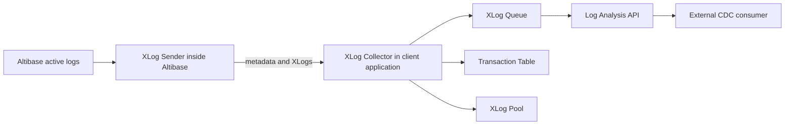

Log Analyzer terms:

- `XLog`: logical change log for DML and control events.
- `XLog Sender`: analyzes active logs and sends XLogs to the collector.
- `XLog Collector`: receives metadata and XLogs, stores them in queues and pools, and exposes them through the API.
- `Log Analysis API`: API used by a client application to receive, inspect, convert, acknowledge, and free XLogs.
- `Handshake`: checks protocol version, metadata, role, and other prerequisites before XLog transfer.
- `Restart SN`: active-log SN from which XLog Sender restarts.

Log Analyzer limitations:

- Only `SYS` can manage the XLog Sender.
- Basic analysis unit is a table.
- An analyzed table must have a primary key.
- Primary-key column values cannot be updated.
- DDL cannot be executed on an analyzed table.
- Total XLog Senders plus Replication Senders in one Altibase database cannot exceed `32`.
- Replication protocol version used by the Log Analysis API must match the protocol version of the Altibase databases involved.
- Only LAZY mode is supported.
- Log Analyzer can analyze tables with foreign keys, unlike ordinary replication restrictions.
- Log Analyzer supports TCP and UNIX domain socket transmission; UNIX domain sockets require the XLog Sender and XLog Collector on the same UNIX or Linux host.
- Log Analyzer does not support SSL or InfiniBand communication.

## Log Analyzer API Workflow

Basic API flow:

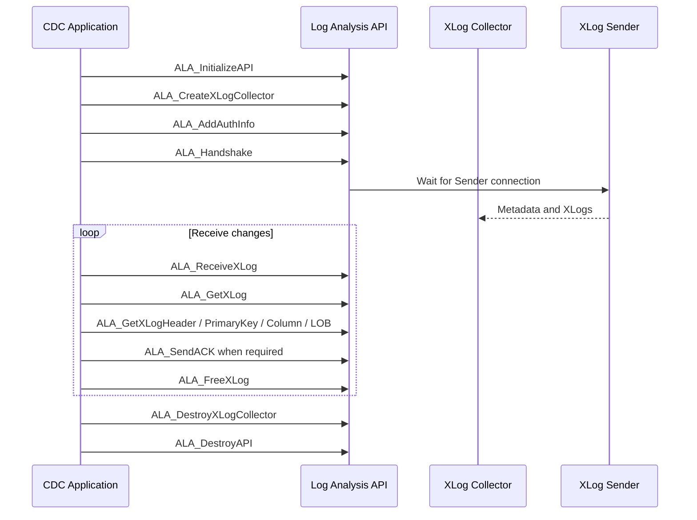

Required files:

- Header: `alaAPI.h`, which includes `alaTypes.h`.
- Header: `alaTypes.h`, which defines data types and macros for client programs.
- Shared library: `libala_sl.x`, with platform-specific extension.
- Static library: `libala.x`, with platform-specific extension.

API function blocks:

- Environment: `ALA_InitializeAPI`, `ALA_DestroyAPI`.
- Logging: `ALA_EnableLogging`, `ALA_DisableLogging`.
- Collector setup: `ALA_CreateXLogCollector`, `ALA_AddAuthInfo`, `ALA_RemoveAuthInfo`, `ALA_SetHandshakeTimeout`, `ALA_SetReceiveXLogTimeout`, `ALA_SetXLogPoolSize`.
- Receive and acknowledge: `ALA_Handshake`, `ALA_ReceiveXLog`, `ALA_GetXLog`, `ALA_SendACK`, `ALA_FreeXLog`, `ALA_DestroyXLogCollector`.
- Monitoring: `ALA_GetXLogCollectorStatus`.
- XLog inspection: `ALA_GetXLogHeader`, `ALA_GetXLogPrimaryKey`, `ALA_GetXLogColumn`, `ALA_GetXLogSavepoint`, `ALA_GetXLogLOB`.
- Metadata: `ALA_GetProtocolVersion`, `ALA_GetReplicationInfo`, `ALA_GetTableInfo`, `ALA_GetTableInfoByName`, `ALA_GetColumnInfo`, `ALA_GetIndexInfo`, `ALA_IsHiddenColumn`.
- Conversion: `ALA_GetInternalNumericInfo`, `ALA_GetAltibaseText`, `ALA_GetAltibaseSQL`, `ALA_GetODBCCValue`.
- Error handling: `ALA_ClearErrorMgr`, `ALA_GetErrorCode`, `ALA_GetErrorLevel`, `ALA_GetErrorMessage`.

API cautions:

- The caller creates and retains `ALA_ErrorMgr`.
- `ALA_ErrorMgr` contains only the most recent error.
- Use `ALA_GetErrorCode()` instead of reading `mErrorCode` directly.
- `ALA_ERROR_FATAL` means destroy the XLog Collector with `ALA_DestroyXLogCollector()`.
- `ALA_ERROR_ABORT` means perform `ALA_Handshake()` again.
- `ALA_ERROR_INFO` requires action based on the specific code.
- If applying XLogs to a database through ODBC, set `AUTOCOMMIT` to `OFF`.
- `ALA_ReceiveXLog()` and `ALA_GetXLog()` do not have to be called by the same thread.
- After `ALA_FreeXLog()`, the XLog and related data must no longer be used.

## XLog Sender SQL

Create an XLog Sender:

```sql
CREATE REPLICATION log_analysis FOR ANALYSIS
WITH 'collector_ip', collector_port
FROM sys.t1 TO sys.t1;
```

Create an XLog Sender using UNIX domain socket:

```sql
CREATE REPLICATION log_analysis FOR ANALYSIS
WITH UNIX_DOMAIN
FROM sys.t1 TO sys.t1;
```

Start an XLog Sender:

```sql
ALTER REPLICATION log_analysis START;
ALTER REPLICATION log_analysis START AT SN (xlog_sender_start_sn);
ALTER REPLICATION log_analysis QUICKSTART;
```

Stop and drop an XLog Sender:

```sql
ALTER REPLICATION log_analysis STOP;
DROP REPLICATION log_analysis;
```

Modify XLog Sender targets or TCP/IP collector hosts:

The host statements below apply only to TCP/IP XLog Collector endpoints, not to an XLog Sender created with `WITH UNIX_DOMAIN`.

```sql
ALTER REPLICATION log_analysis ADD TABLE
FROM sys.t2 TO sys.t2;

ALTER REPLICATION log_analysis DROP TABLE
FROM sys.t2 TO sys.t2;

ALTER REPLICATION log_analysis ADD HOST 'collector_ip', collector_port;
ALTER REPLICATION log_analysis DROP HOST 'collector_ip', collector_port;
ALTER REPLICATION log_analysis SET HOST 'collector_ip', collector_port;

ALTER REPLICATION log_analysis FLUSH WAIT 10;
```

XLog Sender cautions:

- The XLog Collector must be online and waiting before XLog Sender start.
- `START AT SN` requires Archivelog mode and `REPLICATION_LOG_BUFFER_SIZE = 0`.
- With UNIX domain sockets, `$ALTIBASE_HOME` must be the same for Sender and Collector, and the generated socket path is `$ALTIBASE_HOME/trc/rp-replication_name`.
- A UNIX-domain XLog Sender cannot add hosts.
- `ADD HOST`, `DROP HOST`, and `SET HOST` are only for TCP/IP XLog Collector endpoints.
- `SET HOST` takes effect after the XLog Sender is restarted.
- `FLUSH` can time out if the XLog Collector does not send ACK.

## XLog Types

Transaction-related XLog types:

- `XLOG_TYPE_COMMIT = 2`: transaction commit.
- `XLOG_TYPE_ABORT = 3`: transaction rollback.
- `XLOG_TYPE_INSERT = 4`: DML insert.
- `XLOG_TYPE_UPDATE = 5`: DML update.
- `XLOG_TYPE_DELETE = 6`: DML delete.
- `XLOG_TYPE_SP_SET = 8`: savepoint set.
- `XLOG_TYPE_SP_ABORT = 9`: abort to savepoint.
- `XLOG_TYPE_LOB_CURSOR_OPEN = 14`: LOB cursor open.
- `XLOG_TYPE_LOB_CURSOR_CLOSE = 15`: LOB cursor close.
- `XLOG_TYPE_LOB_PREPARE4WRITE = 16`: LOB prepare for write.
- `XLOG_TYPE_LOB_PARTIAL_WRITE = 17`: LOB partial write.
- `XLOG_TYPE_LOB_FINISH2WRITE = 18`: LOB finish write.
- `XLOG_TYPE_LOB_TRIM = 35`: LOB trim.

Control-related XLog types:

- `XLOG_TYPE_KEEP_ALIVE = 19`: network keep-alive when no XLog is available.
- `XLOG_TYPE_REPL_STOP = 21`: XLog Sender normal shutdown; connection terminates after `ALA_SendACK()`.
- `XLOG_TYPE_CHANGE_META = 25`: metadata changed by DDL; the Sender sends new metadata and then `XLOG_TYPE_REPL_STOP` so the application can process the change.

LOB sequence:

```text
XLOG_TYPE_LOB_CURSOR_OPEN
  XLOG_TYPE_LOB_PREPARE4WRITE
    XLOG_TYPE_LOB_PARTIAL_WRITE ...
  XLOG_TYPE_LOB_FINISH2WRITE
  or
  XLOG_TYPE_LOB_TRIM
XLOG_TYPE_LOB_CURSOR_CLOSE
```

## ODBC C Conversion Blocks

Function:

```c
ALA_RC ALA_GetODBCCValue(
        ALA_Column   * aColumn,
        ALA_Value    * aAltibaseValue,
        SInt           aODBCCTypeID,
        UInt           aODBCCValueBufferSize,
        void         * aOutODBCCValueBuffer,
        ALA_BOOL     * aOutIsNull,
        UInt         * aOutODBCCValueSize,
        ALA_ErrorMgr * aOutErrorMgr);
```

Conversion block: numeric Altibase values

- Altibase types: `FLOAT`, `NUMERIC`, `DOUBLE`, `REAL`, `BIGINT`, `INTEGER`, `SMALLINT`.
- Supported ODBC C targets: `SQL_C_CHAR`, `SQL_C_NUMERIC`, `SQL_C_BIT`, `SQL_C_STINYINT`, `SQL_C_UTINYINT`, `SQL_C_SSHORT`, `SQL_C_USHORT`, `SQL_C_SLONG`, `SQL_C_ULONG`, `SQL_C_SBIGINT`, `SQL_C_UBIGINT`, `SQL_C_FLOAT`, `SQL_C_DOUBLE`, `SQL_C_BINARY`.

Conversion block: date value

- Altibase type: `DATE`.
- Supported ODBC C targets: `SQL_C_CHAR`, `SQL_C_BINARY`, `SQL_C_TYPE_DATE`, `SQL_C_TYPE_TIME`, `SQL_C_TYPE_TIMESTAMP`.

Conversion block: character values

- Altibase types: `CHAR`, `VARCHAR`, `NCHAR`, `NVARCHAR`.
- Supported ODBC C targets: `SQL_C_CHAR`, `SQL_C_NUMERIC`, `SQL_C_BIT`, integer C types, `SQL_C_FLOAT`, `SQL_C_DOUBLE`, `SQL_C_BINARY`, `SQL_C_TYPE_DATE`, `SQL_C_TYPE_TIME`, `SQL_C_TYPE_TIMESTAMP`.

Conversion block: byte values

- Altibase types: `BYTE`, `NIBBLE`.
- Supported ODBC C targets: `SQL_C_CHAR`, `SQL_C_BINARY`.

Conversion block: bit values

- Altibase types: `BIT`, `VARBIT`.
- Supported ODBC C targets: `SQL_C_CHAR`, `SQL_C_NUMERIC`, `SQL_C_BIT`, integer C types, `SQL_C_FLOAT`, `SQL_C_DOUBLE`, `SQL_C_BINARY`.

Conversion exclusions:

- `BLOB`, `CLOB`, and `GEOMETRY` cannot be converted with `ALA_GetODBCCValue()`.
- `ALA_GetAltibaseText()`, `ALA_GetAltibaseSQL()`, and `ALA_GetODBCCValue()` cannot be used with `BLOB` or `CLOB`.
- `ALA_GetAltibaseText()`, `ALA_GetAltibaseSQL()`, and `ALA_GetODBCCValue()` cannot be used with `GEOMETRY`.

## Log Analyzer Error Blocks

Error level block: `ALA_ERROR_FATAL`

- Required action: call `ALA_DestroyXLogCollector()` for the affected collector.
- Codes:
  - `0x50008`: transaction already active; returned by `ALA_ReceiveXLog`, `ALA_GetXLog`.
  - `0x5000A`: failed to initialize a mutex; returned by `ALA_CreateXLogCollector`, `ALA_Handshake`.
  - `0x5000B`: failed to remove a mutex; returned by `ALA_Handshake`, `ALA_DestroyXLogCollector`.
  - `0x5000C`: failed to lock a mutex; returned by collector, handshake, receive, get, ACK, free, destroy, and status APIs.
  - `0x5000D`: failed to unlock a mutex; returned by collector, handshake, receive, get, ACK, free, destroy, and status APIs.

Error level block: `ALA_ERROR_ABORT`

- Required action: call `ALA_Handshake()` again for the collector after correcting the cause.
- Memory codes:
  - `0x51006`: failed to allocate memory; all Log Analysis API functions.
  - `0x5101E`: failed to allocate memory in pool; `ALA_ReceiveXLog`.
  - `0x5101F`: failed to free memory in pool; `ALA_Handshake`, `ALA_ReceiveXLog`, `ALA_FreeXLog`, `ALA_DestroyXLogCollector`.
  - `0x51020`: failed to initialize memory pool; `ALA_CreateXLogCollector`.
  - `0x51021`: failed to remove memory pool; `ALA_DestroyXLogCollector`.
- Network codes:
  - `0x51013`: failed to initialize network environment; `ALA_Handshake`, `ALA_ReceiveXLog`, `ALA_SendACK`.
  - `0x51019`: failed to remove a network protocol; `ALA_Handshake`, `ALA_ReceiveXLog`, `ALA_SendACK`.
  - `0x5101A`: failed to finalize network environment; `ALA_Handshake`, `ALA_ReceiveXLog`, `ALA_SendACK`.
  - `0x51017`: network session already terminated; `ALA_ReceiveXLog`, `ALA_SendACK`.
  - `0x51018`: unfamiliar network protocol; `ALA_Handshake`, `ALA_ReceiveXLog`.
  - `0x51016`: failed to read from network; `ALA_Handshake`, `ALA_ReceiveXLog`.
  - `0x5101B`: failed to write to network; `ALA_Handshake`, `ALA_SendACK`.
  - `0x5101C`: failed to flush network; `ALA_Handshake`, `ALA_SendACK`.
  - `0x51015`: network timeout and probable network error; `ALA_Handshake`.
  - `0x5102C`: failed to add a network session; `ALA_Handshake`.
- Handshake, protocol, and metadata codes:
  - `0x51024`: protocol versions are mismatched; `ALA_Handshake`.
  - `0x51027`: failed to allocate a link; `ALA_Handshake`.
  - `0x51028`: failed to listen for a link; `ALA_Handshake`.
  - `0x51029`: failed to wait for a link; `ALA_Handshake`.
  - `0x5102A`: failed to accept a link; `ALA_Handshake`.
  - `0x5102B`: failed to set a link; `ALA_Handshake`.
  - `0x51022`: failed to shut down a link; `ALA_Handshake`, `ALA_DestroyXLogCollector`.
  - `0x51023`: failed to free a link; `ALA_Handshake`, `ALA_DestroyXLogCollector`.
  - `0x51012`: metadata does not exist; `ALA_Handshake`, `ALA_GetXLog`, `ALA_GetReplicationInfo`, `ALA_GetTableInfo`, `ALA_GetTableInfoByName`.
  - `0x5103F`: table information does not exist; `ALA_GetXLog`.
  - `0x51040`: column information does not exist; `ALA_GetXLog`.

Error level block: `ALA_ERROR_INFO`

- Logging and environment codes:
  - `0x52034`: Log Analysis API environment create failed; `ALA_InitializeAPI`.
  - `0x52035`: Log Analysis API environment remove failed; `ALA_DestroyAPI`.
  - `0x52000`: Log Manager initialization failure; `ALA_EnableLogging`.
  - `0x52001`: log file open failure; `ALA_EnableLogging`.
  - `0x52004`: Log Manager lock failure; all Log Analysis API functions.
  - `0x52005`: Log Manager unlock failure; all Log Analysis API functions.
  - `0x52003`: Log Manager remove failure; `ALA_DisableLogging`.
  - `0x52002`: log file close failure; `ALA_DisableLogging`.
- XLog and queue codes:
  - `0x52009`: not an active transaction; `ALA_GetXLog`.
  - `0x5200E`: linked list is not empty; `ALA_Handshake`, `ALA_DestroyXLogCollector`.
  - `0x52033`: XLog Pool is empty; `ALA_ReceiveXLog`.
  - `0x52014`: retryable network timeout; `ALA_ReceiveXLog`.
- Parameter, socket, role, and auth codes:
  - `0x5200F`: NULL parameter; all Log Analysis API functions.
  - `0x5201D`: invalid parameter; all Log Analysis API functions.
  - `0x52026`: unsupported socket type; `ALA_Handshake`.
  - `0x52025`: unsupported socket type; `ALA_Handshake`.
  - `0x5202F`: socket type does not support the API; `ALA_AddAuthInfo`, `ALA_RemoveAuthInfo`.
  - `0x5202D`: XLog Sender name is different; `ALA_Handshake`.
  - `0x52030`: only one piece of authentication information is available; `ALA_RemoveAuthInfo`.
  - `0x52031`: no more authentication information can be added; `ALA_AddAuthInfo`.
  - `0x52032`: no authentication information available for a peer; `ALA_Handshake`.
  - `0x52010`: invalid role; `ALA_Handshake`.
  - `0x52011`: invalid replication flags; `ALA_Handshake`.
- Conversion and metadata codes:
  - `0x52007`: geometry endian conversion failure; `ALA_GetXLog`.
  - `0x52036`: unable to obtain the MTD module; `ALA_GetXLog`, `ALA_GetAltibaseText`, `ALA_GetAltibaseSQL`.
  - `0x52037`: failed to create text with the MTD module; `ALA_GetAltibaseText`.
  - `0x52038`: CMT initialization failure; `ALA_GetODBCCValue`.
  - `0x52039`: CMT end failure; `ALA_GetODBCCValue`.
  - `0x5203A`: analysis header create failed for ODBC conversion; `ALA_GetODBCCValue`.
  - `0x5203B`: analysis header remove failure for ODBC conversion; `ALA_GetODBCCValue`.
  - `0x5203C`: failed to convert from MT to CMT; `ALA_GetODBCCValue`.
  - `0x5203D`: failed to convert from CMT to `ulnColumn`; `ALA_GetODBCCValue`.
  - `0x5203E`: failed to convert from `ulnColumn` to ODBC C; `ALA_GetODBCCValue`.

## Attachment Cross-References

- Use `03_sql_ddl_generation.md` for `CREATE REPLICATION`, `ALTER REPLICATION`, replicated table, sequence, and privilege DDL generation.
- Use `06_data_dictionary_performance_views.md` for replication metadata and runtime checks against `SYSTEM_.SYS_REPLICATIONS_`, `V$REPGAP`, `V$REPSENDER`, and `V$REPRECEIVER`.
- Use `07_error_messages_troubleshooting.md` when a replication, Log Analyzer, network, or SSL issue starts from an Altibase error code.
- Use `08_performance_tuning_monitoring.md` when replication lag or apply delay may be caused by slow SQL, waits, log pressure, or server bottlenecks.
- Use `12_c_cli_odbc_precompiler.md` for ODBC C conversion, LOB, and client-buffer handling when consuming Log Analyzer XLogs.
- Use `18_security_ssl_tls.md` for Altibase 8.1 replication SSL setup, certificate requirements, and SSL/TLS troubleshooting.

## Customer Answer Templates

Template: create and start replication

```text
1. Verify both nodes have matching character sets, primary keys, and target tables.
2. Create the same `replication_name` on both nodes with reversed peer host and port.
3. Run `ALTER REPLICATION replication_name SYNC` for initial alignment, or `START` only if data is already aligned.
4. Verify `V$REPSENDER`, `V$REPRECEIVER`, and `V$REPGAP`.
5. For production, document mode, failover behavior, and conflict handling before enabling writes.
```

Template: answer an 8.1 SSL replication question

```text
In Altibase 8.1 verified source, SSL/TLS replication is configured with `USING SSL` in `CREATE REPLICATION`, and the peer port must be the peer node's `REPLICATION_SSL_PORT_NO`. This is separate from ordinary TCP replication using `REPLICATION_PORT_NO`. Complete the general SSL/TLS setup first, then create matching replication objects on both nodes with reversed peer endpoints.
```

Template: answer a CDC question

```text
Use Log Analyzer when an external application needs changed-row events. Create `CREATE REPLICATION ... FOR ANALYSIS` for the XLog Sender, start an XLog Collector in the application through the Log Analysis API, perform `ALA_Handshake()`, then receive, inspect, acknowledge, and free XLogs. Do not describe this as direct table-to-table replication.
```

Template: answer a failover question

```text
For planned failover, first verify replication health and clear the gap with `ALTER REPLICATION replication_name FLUSH ALL WAIT n` if the service can wait. For unplanned failure, check whether the standby has all required changes. If the active node had unsent logs and `META_LOGGING` was enabled, evaluate offline replication before accepting writes on the standby. Use failover callbacks to validate application-specific consistency.
```

## Residual Scope

- Sharding, `ShardManager`, and full scale-out design are outside this attachment. For those topics, require a dedicated source-backed review instead of extending replication or Log Analyzer guidance by analogy.
