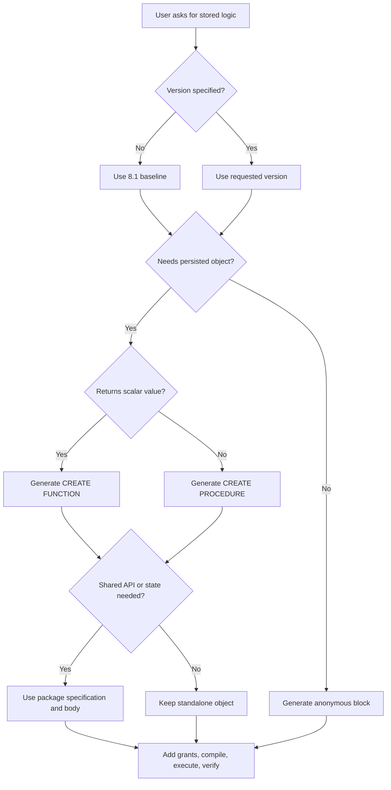
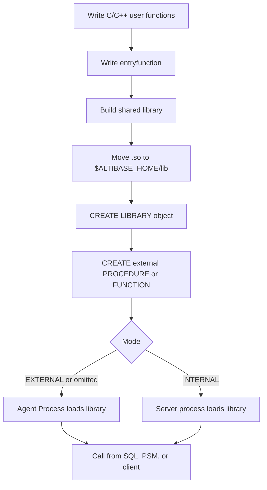

# 10. PSM, Stored Procedures, and External Procedures

## Applicable Versions

- 7.1: Based on Altibase 7.1 Stored Procedures Manual and External Procedures Manual.
- 7.3: Based on Altibase 7.3 Stored Procedures Manual, External Procedures Manual, and release-note coverage for VARRAY.
- 8.1: Based on Altibase 8.1 verified source Stored Procedures Manual, External Procedures Manual, General Reference, and release-note coverage for Temporary LOB.

## Questions This File Can Answer

- How should Altibase PSM procedures, functions, anonymous blocks, and packages be written?
- Which Oracle PL/SQL constructs are similar, and where must code be changed?
- How are `%TYPE`, `%ROWTYPE`, `RECORD`, `ASSOCIATIVE ARRAY`, `VARRAY`, `REF CURSOR`, and `TYPESET` used?
- How are cursors, dynamic SQL, exceptions, pragmas, and package initialization handled?
- How should C/C++ external procedures and external functions be registered and called?
- How do 8.1 Temporary LOB rules affect PSM variables and collections?

## Source Documents

- 7.1: Altibase 7.1 Stored Procedures Manual; External Procedures Manual.
- 7.3: Altibase 7.3 Stored Procedures Manual; External Procedures Manual; Altibase 7.3 Release Notes for VARRAY.
- 8.1: Altibase 8.1 verified source Stored Procedures Manual; External Procedures Manual; General Reference; Altibase 8.1 Release Notes.

## Core Guidance

- Answer in the user's language, but keep SQL object names, function names, error codes, property names, commands, and file paths literal.
- Treat Altibase PSM as PL/SQL-like, not fully Oracle PL/SQL compatible. Confirm syntax, data types, package availability, and side effects.
- If no version is specified, use the 8.1 baseline and call out older-version checks for `IF EXISTS`, `IF NOT EXISTS`, VARRAY, Temporary LOB, and PSM case-sensitivity behavior.
- For broad 7.1 and 7.3 compatibility, avoid `IF EXISTS` and `IF NOT EXISTS` in PSM DDL unless the target version is 8.1 verified source.
- Do not generate external procedures unless the user accepts native code deployment into `$ALTIBASE_HOME/lib` and the operational risk of the selected external procedure mode.
- Prefer examples that compile in iSQL: end PSM object creation with `END;` and then `/` on the next line.

## Version Differences

| Area | 7.1 | 7.3 | 8.1 verified source |
| --- | --- | --- | --- |
| Core PSM | Procedures, functions, anonymous blocks, cursors, exceptions, packages, typesets, dynamic SQL, and external procedures are covered. Anonymous block support is documented from 7.1.0.2.3. | Same core PSM model. | Same core model plus verified 8.1 property and Temporary LOB guidance. |
| Idempotent DDL | Do not assume `IF EXISTS` or `IF NOT EXISTS` for PSM objects. | Do not assume `IF EXISTS` or `IF NOT EXISTS` for PSM objects. | PSM object DDL includes `IF NOT EXISTS` for `CREATE PROCEDURE`, `CREATE FUNCTION`, `CREATE TYPESET`, `CREATE PACKAGE`, and `CREATE PACKAGE BODY`; `IF EXISTS` for related `DROP` statements where documented. External library DDL includes `CREATE LIBRARY IF NOT EXISTS` and `DROP LIBRARY IF EXISTS`. |
| VARRAY | Not part of the 7.1 baseline. | Release notes add PSM `VARRAY` as a user-defined type and `VARRAY_MEMORY_MAXIMUM`. | Treat VARRAY as supported in the Altibase 8.1 verified source; use the 7.3+ VARRAY rules below. |
| External procedure mode | External and internal modes are described, but the 7.1 external procedure syntax does not document explicit `EXTERNAL` or `INTERNAL` in `call_spec`. | `call_spec` documents `EXTERNAL` or `INTERNAL`; omitted mode defaults to external mode. | Same explicit mode guidance as 7.3. |
| Temporary LOB | Not part of the 7.1 baseline. | Not part of the 7.3 baseline. | Temporary LOB is supported. PSM LOB variables and LOB collections can create transaction or session Temporary LOBs. |
| PSM case sensitivity | Use documented 7.1 behavior. | Use documented 7.3 behavior. | `PSM_CASE_SENSITIVE_MODE` controls case sensitivity for `RECORD` and `%ROWTYPE` field names and label names. Default is `1`. |
| Open cursor with rollback | 7.1 guidance warns that `ROLLBACK` while a cursor is open and not committed closes the cursor. | 7.3 source states `COMMIT` and `ROLLBACK` can execute while a cursor is open. | Use the verified source behavior for 8.1. |

## PSM Generation Flow



## External Procedure Flow



## Compact PSM Syntax Patterns

These patterns are generation guides converted from source syntax diagrams. They are not a replacement for the full grammar.

### Procedure

```text
create_procedure ::=
  CREATE [OR REPLACE] PROCEDURE [IF NOT EXISTS] [user_name.]procedure_name
  [(parameter_declaration [, ...])]
  [AUTHID {CURRENT_USER | DEFINER}]
  {AS | IS}
  [declaration_section]
  BEGIN
    statement...
  [EXCEPTION
    exception_handler...]
  END [procedure_name];

parameter_declaration ::=
  parameter_name [IN | OUT | IN OUT] [NOCOPY] data_type
  [{DEFAULT | :=} expression]
```

Generation notes:

- `IN` is the default parameter mode.
- `IN` parameters are constants inside the procedure and cannot be assigned to or used as `SELECT ... INTO` targets.
- `OUT` and `IN OUT` parameters cannot have default values.
- `NOCOPY` is for supported collection cases; use it deliberately because it passes by reference-like behavior.
- `AUTHID DEFINER` executes using the creator's privileges; `AUTHID CURRENT_USER` resolves referenced objects using the invoking user.
- A procedure has no return value and cannot be used as an expression in SQL.

### Function

```text
create_function ::=
  CREATE [OR REPLACE] FUNCTION [IF NOT EXISTS] [user_name.]function_name
  [(parameter_declaration [, ...])]
  RETURN data_type
  [DETERMINISTIC]
  [AUTHID {CURRENT_USER | DEFINER}]
  {AS | IS}
  [declaration_section]
  BEGIN
    statement...
  [EXCEPTION
    exception_handler...]
  END [function_name];
```

Generation notes:

- A function must return one value using `RETURN expression`.
- Use `DETERMINISTIC` only when identical input always returns identical output. This matters for function-based indexes and check constraints.
- A stored function called from a `SELECT` statement cannot contain `INSERT`, `UPDATE`, or `DELETE`.
- A stored function called from `SELECT`, `INSERT`, `UPDATE`, or `DELETE` cannot contain transaction control statements.
- Do not redefine a function used in constraints or function-based indexes as if that were harmless; dependent DML can fail if invoked functions change or disappear.

### Object Management

```text
alter_procedure ::= ALTER PROCEDURE [user_name.]procedure_name COMPILE;
alter_function  ::= ALTER FUNCTION  [user_name.]function_name  COMPILE;
drop_procedure  ::= DROP PROCEDURE [IF EXISTS] [user_name.]procedure_name;
drop_function   ::= DROP FUNCTION  [IF EXISTS] [user_name.]function_name;

execute_procedure ::=
  EXEC[UTE] [[user_name.]package_name.]procedure_name
  [(parameter_notation [, ...])];

execute_function ::=
  EXEC[UTE] variable := [[user_name.]package_name.]function_name
  [(parameter_notation [, ...])];

parameter_notation ::=
  expression
  | parameter_name => expression
```

Generation notes:

- Positional parameters can be mixed with named parameters only when all positional parameters come first.
- `ALTER ... COMPILE` explicitly recompiles invalid objects after referenced objects change.
- Dropping a referenced procedure or function can succeed, but later callers fail when they attempt to execute missing code.

### Anonymous Block

```text
anonymous_block ::=
  [<<label_name>>]
  [DECLARE declaration_section]
  BEGIN
    statement...
  [EXCEPTION
    exception_handler...]
  END [label_name];
```

Generation notes:

- Anonymous blocks do not create stored database objects.
- Anonymous blocks do not return a `RETURN` value.
- Anonymous blocks can use iSQL bind variables for `INPUT`, `OUTPUT`, and `INOUTPUT`.

### Block and Variable Declarations

```text
block ::=
  [<<label_name>>]
  [DECLARE declaration_section]
  BEGIN statement... [EXCEPTION exception_handler...] END [label_name];

variable_declaration ::=
  variable_name [CONSTANT] data_type [NOCOPY] [{DEFAULT | :=} expression];

type_reference ::=
  scalar_sql_type
  | BOOLEAN
  | FILE_TYPE
  | table_or_cursor_name%ROWTYPE
  | table_or_column_or_variable%TYPE
  | user_defined_type
```

Generation notes:

- `DECLARE`, `BEGIN`, and `EXCEPTION` do not take semicolons; `END` and normal statements do.
- If a PSM variable and a table column have the same name inside SQL, Altibase resolves the name as the column. Use a block label such as `block_label.variable_name` to remove ambiguity.
- `BOOLEAN` is a PSM-only type with `TRUE`, `FALSE`, or `NULL`. It cannot be stored in a table column, fetched from a table column, returned by a SQL-callable function in a SQL statement, or passed to output procedures such as `PRINT`.

### PSM Data Type Limits

| Type | SQL statement maximum | PSM maximum |
| --- | --- | --- |
| `CHAR(M)` | `32000` | `65534` |
| `VARCHAR(M)` | `32000` | `65534` |
| `NCHAR(M)` | `16000` for UTF-16, `10666` for UTF-8 | `32766` for UTF-16, `21843` for UTF-8 |
| `NVARCHAR(M)` | `16000` for UTF-16, `10666` for UTF-8 | `32766` for UTF-16, `21843` for UTF-8 |
| `BLOB` | `2GB - 1` | `100MB`, controlled by `LOB_OBJECT_BUFFER_SIZE` |
| `CLOB` | `2GB - 1` | `100MB`, controlled by `LOB_OBJECT_BUFFER_SIZE` |

Default precision properties for PSM character parameters and return values include `PSM_CHAR_DEFAULT_PRECISION`, `PSM_VARCHAR_DEFAULT_PRECISION`, `PSM_NCHAR_UTF8_DEFAULT_PRECISION`, `PSM_NCHAR_UTF16_DEFAULT_PRECISION`, `PSM_NVARCHAR_UTF8_DEFAULT_PRECISION`, and `PSM_NVARCHAR_UTF16_DEFAULT_PRECISION`.

### SQL Inside PSM

```text
select_into ::=
  SELECT select_list
  INTO {variable_name [, ...] | record_name}
  rest_of_select_statement;

bulk_collect ::=
  SELECT select_list
  BULK COLLECT INTO {array_variable [, ...] | array_record}
  rest_of_select_statement;

returning_into ::=
  {INSERT | UPDATE | DELETE} ...
  RETURNING expr [, ...]
  INTO {variable_name [, ...] | record_name | BULK COLLECT INTO array_target};

assignment ::=
  variable_name := expression;
  | SET variable_name = expression;
```

Generation notes:

- A `SELECT` in PSM must use `INTO`.
- Ordinary `SELECT ... INTO` must return exactly one row. `NO_DATA_FOUND` is raised for zero rows and `TOO_MANY_ROWS` is raised for more than one row.
- `BULK COLLECT` returns all rows into associative array or VARRAY targets and is preferred over row-by-row loops when the result size is appropriate.
- `RETURNING INTO` stores values affected by `INSERT`, `UPDATE`, or `DELETE`.
- PSM has record extensions for `INSERT INTO table VALUES record_variable` and `UPDATE table SET ROW = record_variable` style operations. Column count and compatible order must match the target table.

## Control Flow

```text
if_statement ::=
  IF condition THEN statement...
  [ELSIF condition THEN statement...]...
  [ELSE statement...]
  END IF;

case_statement ::=
  CASE
    WHEN condition THEN statement...
    ...
    [ELSE statement...]
  END CASE;
  | CASE case_variable
      WHEN value THEN statement...
      ...
      [ELSE statement...]
    END CASE;

loop_statement ::=
  LOOP statement... END LOOP [label_name];
  | WHILE condition LOOP statement... END LOOP [label_name];
  | FOR counter IN [REVERSE] lower_bound .. upper_bound [STEP step_size]
      LOOP statement... END LOOP [label_name];

loop_control ::=
  EXIT [label_name] [WHEN condition];
  | CONTINUE [WHEN condition];
  | GOTO label_name;
  | NULL;
```

Generation notes:

- `IF` and `CASE` conditions can use SQL-style conditions, but subqueries in conditions are restricted except `EXISTS (subquery)` and `NOT EXISTS (subquery)`.
- `FOR` loop bounds are evaluated once before loop entry. A non-integer bound is rounded to the nearest integer.
- `STEP` must be at least `1`.
- `EXIT` can target a labeled outer loop when the label is placed immediately before that loop.
- `GOTO` cannot transfer into an inner block, between alternative branches of `IF` or `CASE`, or from an exception handler to another location in the same block.

## Cursors and Result Sets

```text
cursor_declaration ::=
  CURSOR cursor_name [(cursor_parameter [, ...])] IS select_statement;

open_cursor ::= OPEN cursor_name [(argument [, ...])];
fetch_cursor ::= FETCH cursor_name INTO {variable [, ...] | record_name};
fetch_bulk ::= FETCH cursor_name BULK COLLECT INTO array_target [LIMIT integer];
close_cursor ::= CLOSE cursor_name;

cursor_for_loop ::=
  FOR record_name IN cursor_name [(argument [, ...])] LOOP
    statement...
  END LOOP;

ref_cursor_type ::= TYPE type_name IS REF CURSOR;
open_for ::= OPEN cursor_variable FOR {select_statement | dynamic_select_string} [USING bind_value [, ...]];
```

Generation notes:

- Cursor parameters can be used only inside the cursor's `SELECT`.
- Cursor parameters cannot be `OUT` or `IN OUT`; `%ROWTYPE` is not supported for cursor parameters.
- `FETCH` into a `RECORD` target must use a single record variable that matches all selected columns.
- `CLOSE` frees cursor resources. If a cursor declared in a block is not explicitly closed, it is closed when the block exits, but explicit close is preferred.
- Cursor attributes are `%FOUND`, `%NOTFOUND`, `%ISOPEN`, and `%ROWCOUNT`. Use `SQL%FOUND`, `SQL%NOTFOUND`, and `SQL%ROWCOUNT` for implicit cursors from DML or single-row `SELECT INTO`.
- `REF CURSOR` can be passed as `OUT` or `IN OUT` procedure parameters and can be returned to ODBC or JDBC clients. It cannot be returned by a function `RETURN` clause.
- When returning a `REF CURSOR` to a client, the cursor must still be open.

## User-Defined Types

```text
type_definition ::=
  TYPE type_name IS record_type_spec;
  | TYPE type_name IS associative_array_type_spec;
  | TYPE type_name IS ref_cursor_type_spec;
  | TYPE type_name IS varray_type_spec;

record_type_spec ::=
  RECORD (column_name data_type [, column_name data_type ...])

associative_array_type_spec ::=
  TABLE OF data_type [INDEX BY {INTEGER | VARCHAR(size)}]

ref_cursor_type_spec ::=
  REF CURSOR

varray_type_spec ::=
  VARRAY(size) OF data_type
```

### Type Item: `RECORD`

Purpose: groups heterogeneous fields into one local logical row type.

Usage notes:

- A `RECORD` type defined inside a block is local to that block.
- `%ROWTYPE` variables behave like record variables whose fields match a table or cursor row.
- Assignment between two named `RECORD` types requires the same type name. Identical internal structure alone is not enough.
- Assignment between `RECORD` and `%ROWTYPE` is compatible when field count and data types match.

### Type Item: `ASSOCIATIVE ARRAY`

Purpose: key-value collection indexed by `INTEGER` or `VARCHAR`.

Access patterns:

```text
array_variable[index]
array_variable(index)
```

Methods:

- `COUNT()` returns the number of elements.
- `DELETE()`, `DELETE(n)`, and `DELETE(m, n)` remove all, one, or a range of elements.
- `EXISTS(n)` returns `TRUE` when the element exists.
- `FIRST()` and `LAST()` return the lowest and highest index or key.
- `NEXT(n)` and `PRIOR(n)` return adjacent indexes or keys.

### Type Item: `VARRAY`

Version: 7.3 and later guidance; not part of the 7.1 baseline.

Purpose: ordered collection of elements of the same type with an integer index starting at `1`.

Syntax:

```text
TYPE type_name IS VARRAY(size) OF data_type;
variable_name type_name;
variable_name := type_name();
variable_name := type_name(initial_value1, initial_value2, ...);
```

Usage notes:

- `size` is the maximum number of elements. The documented upper limit is `2,147,483,647`, subject to memory limits.
- A VARRAY variable must normally be initialized with its constructor before use.
- Extend it before assigning new positions, for example `ret := variable_name.EXTEND();`.
- In `BULK COLLECT`, VARRAY targets can be populated without manual initialization and extension.
- Middle elements cannot be removed individually. Use `TRIM` from the end or `DELETE()` to remove all elements.
- Memory per VARRAY variable is limited by `VARRAY_MEMORY_MAXIMUM`.

Methods:

- `COUNT()` returns current element count.
- `DELETE()` removes all elements.
- `LIMIT()` returns the maximum element count declared by the type.
- `EXTEND()`, `EXTEND(n)`, and `EXTEND(m, n)` extend by one, by `n`, or by copying the `n`th element while extending by `m`.
- `TRIM()` and `TRIM(n)` remove elements from the end.
- `EXISTS(n)`, `FIRST()`, `LAST()`, `NEXT(n)`, and `PRIOR(n)` inspect element presence and position.

### Type Item: `TYPESET`

```text
create_typeset ::=
  CREATE [OR REPLACE] TYPESET [IF NOT EXISTS] [user_name.]typeset_name
  {AS | IS}
    type_declaration...
  END;

drop_typeset ::=
  DROP TYPESET [IF EXISTS] [user_name.]typeset_name;
```

Purpose: database object that stores user-defined types for reuse across procedures and functions.

Usage notes:

- Types from a typeset can be used as procedure parameters and function return values.
- A result set can be passed to a client through a `REF CURSOR` type defined in a typeset.
- Dropping a typeset invalidates procedures or functions that depend on it.

## Dynamic SQL

```text
execute_immediate ::=
  EXECUTE IMMEDIATE dynamic_string
  [INTO variable [, ...] | BULK COLLECT INTO array_target]
  [USING bind_value [, ...]];

open_for_dynamic ::=
  OPEN ref_cursor_variable FOR dynamic_select_string
  [USING bind_value [, ...]];
```

Generation notes:

- `EXECUTE IMMEDIATE` can dynamically execute supported DDL, DCL, DML, and a `SELECT` returning one row.
- The dynamic SQL string uses `?` placeholders, bound in order by the `USING` clause.
- Supported dynamic SQL includes `SELECT`, `INSERT`, `UPDATE`, `DELETE`, `MOVE`, `MERGE`, `LOCK TABLE`, `ENQUEUE`, `DEQUEUE`, `CREATE`, `ALTER`, `DROP`, `ALTER SYSTEM`, `ALTER SESSION`, `COMMIT`, and `ROLLBACK`.
- iSQL-only commands such as `DESC`, `SET TIMING`, `SET AUTOCOMMIT`, `CONNECT`, and `DISCONNECT` are not dynamic SQL targets.
- Use `OPEN ... FOR` when the dynamic query returns multiple rows through a `REF CURSOR`.

Example:

```sql
CREATE OR REPLACE PROCEDURE fire_emp(v_emp_id INTEGER) AS
BEGIN
  EXECUTE IMMEDIATE
    'DELETE FROM employees WHERE eno = ?'
    USING v_emp_id;
END;
/
```

## Exceptions and Error Handling

```text
exception_declaration ::= exception_name EXCEPTION;

raise_statement ::=
  RAISE [exception_name];

raise_application_error ::=
  RAISE_APPLICATION_ERROR(errcode INTEGER, errmsg VARCHAR(2047));

exception_handler ::=
  WHEN exception_name [OR exception_name ...] THEN statement...
  | WHEN OTHERS THEN statement...
```

System-defined exception item blocks:

- `CURSOR_ALREADY_OPEN`: raised when opening an already open cursor.
- `DUP_VAL_ON_INDEX`: raised on duplicate value for a unique index.
- `INVALID_CURSOR`: raised when cursor state is invalid for the requested operation.
- `NO_DATA_FOUND`: raised when a single-row `SELECT INTO` returns no row.
- `TOO_MANY_ROWS`: raised when a single-row `SELECT INTO` returns multiple rows.

File-control exception item blocks:

- `INVALID_PATH`
- `INVALID_MODE`
- `INVALID_FILEHANDLE`
- `INVALID_OPERATION`
- `READ_ERROR`
- `WRITE_ERROR`
- `ACCESS_DENIED`
- `DELETE_FAILED`
- `RENAME_FAILED`

Generation notes:

- User-defined exceptions must be declared in the declaration section.
- A user-defined exception with the same name as a system-defined exception takes precedence in its scope.
- `RAISE` without an exception name is allowed only inside an exception handler; it reraises the current exception.
- `RAISE_APPLICATION_ERROR` supports user-defined error codes from `990000` through `991000`.
- `SQLCODE` and `SQLERRM` are used in exception handlers to inspect the current Altibase error number and message. Assign them to variables before using their values in SQL statements.
- If no handler is found through the current block and outer blocks, execution stops with an unhandled exception.

Common error codes:

| Exception | Decimal code | Hex code |
| --- | --- | --- |
| User-defined exception | `201232` | `31210` |
| `CURSOR_ALREADY_OPEN` | `201062` | `31166` |
| `DUP_VAL_ON_INDEX` | `201063` | `31167` |
| `INVALID_CURSOR` | `201064` | `31168` |
| `NO_DATA_FOUND` | `201066` | `3116A` |
| `TOO_MANY_ROWS` | `201070` | `3116E` |
| `VALUE_ERROR` example | `201071` | version-specific display can use the mapped `ERR-` form |

Example:

```sql
CREATE OR REPLACE PROCEDURE raise_if_empty AS
  v_count INTEGER;
BEGIN
  SELECT COUNT(*) INTO v_count FROM employees;
  IF v_count = 0 THEN
    RAISE_APPLICATION_ERROR(990000, 'employees is empty');
  END IF;
EXCEPTION
  WHEN OTHERS THEN
    PRINTLN('SQLCODE: ' || SQLCODE);
    PRINTLN('SQLERRM: ' || SQLERRM);
    RAISE;
END;
/
```

## Pragmas

```text
pragma_declaration ::=
  PRAGMA AUTONOMOUS_TRANSACTION;
  | PRAGMA EXCEPTION_INIT(exception_name, error_code);
```

### Pragma Item: `AUTONOMOUS_TRANSACTION`

Purpose: makes the top-level PSM object or trigger body execute with an independent transaction.

Allowed locations:

- Top-level stored procedures.
- Top-level stored functions.
- Top-level package subprograms.
- Trigger `psm_body`.

Operational notes:

- The autonomous transaction does not share locks, savepoints, commit dependency, or rollback dependency with the caller.
- If the caller rolls back, committed work from the autonomous transaction is not rolled back.
- A deadlock can occur if the autonomous transaction accesses objects already referenced by the main transaction.
- Explicitly `COMMIT` or `ROLLBACK` inside autonomous routines.

### Pragma Item: `EXCEPTION_INIT`

Purpose: maps a user-declared exception variable to an Altibase error code.

Allowed locations:

- Declaration section of a procedure.
- Declaration section of a function.
- Declaration section of a package.
- Declaration section of a package subprogram.

Example:

```sql
CREATE OR REPLACE PROCEDURE catch_many_rows AS
  e_many_rows EXCEPTION;
  PRAGMA EXCEPTION_INIT(e_many_rows, 201070);
BEGIN
  NULL;
EXCEPTION
  WHEN e_many_rows THEN
    PRINTLN('Too many rows');
END;
/
```

## Packages

```text
create_package ::=
  CREATE [OR REPLACE] PACKAGE [IF NOT EXISTS] [user_name.]package_name
  [AUTHID {CURRENT_USER | DEFINER}]
  {AS | IS}
    declare_section
  END [package_name];

create_package_body ::=
  CREATE [OR REPLACE] PACKAGE BODY [IF NOT EXISTS] [user_name.]package_name
  {AS | IS}
    declare_section
    [BEGIN initialize_statement... [EXCEPTION exception_handler...]]
  END [package_name];

alter_package ::=
  ALTER PACKAGE [user_name.]package_name COMPILE [SPECIFICATION | BODY | PACKAGE];

drop_package ::=
  DROP PACKAGE [IF EXISTS] [BODY] [user_name.]package_name;
```

Generation notes:

- A package has a specification and, when needed, a body.
- The specification is the public API: types, variables, constants, cursors, exceptions, procedures, and functions declared there can be referenced from outside.
- The body defines package cursors and subprograms and can include private declarations.
- Package body initialization runs once per session on first package use.
- Package subprograms can be overloaded by parameter signature.
- The package body cannot be created before the package specification.
- Every subprogram declared in the package specification must be defined in the package body.
- A cursor defined inside a package remains open while subprograms execute and is implicitly closed when subprogram execution completes.

Example:

```sql
CREATE OR REPLACE PACKAGE emp_api AS
  PROCEDURE set_salary(p_eno IN INTEGER, p_salary IN NUMBER);
  FUNCTION get_salary(p_eno IN INTEGER) RETURN NUMBER;
END emp_api;
/

CREATE OR REPLACE PACKAGE BODY emp_api AS
  PROCEDURE set_salary(p_eno IN INTEGER, p_salary IN NUMBER) AS
  BEGIN
    UPDATE employees SET salary = p_salary WHERE eno = p_eno;
  END;

  FUNCTION get_salary(p_eno IN INTEGER) RETURN NUMBER AS
    v_salary NUMBER;
  BEGIN
    SELECT salary INTO v_salary FROM employees WHERE eno = p_eno;
    RETURN v_salary;
  END;
END emp_api;
/
```

## Built-In PSM Facilities

### Output

- `PRINT(value)` outputs text without appending a newline.
- `PRINTLN(value)` outputs text and appends a newline.
- Both are owned by `SYSTEM_`; public synonyms allow calls such as `PRINTLN('ok')`.

### File Control

File control uses `FILE_TYPE` and directory objects. The physical directory must exist in the operating system and have suitable permissions; `CREATE DIRECTORY` records a database object and does not create the physical directory.

Procedure and function item blocks:

- `FOPEN(location, filename, open_mode)`: opens a file and returns `FILE_TYPE`; `open_mode` is `r`, `w`, or `a`.
- `FCLOSE(file)`: closes one file handle.
- `FCLOSE_ALL`: closes all file handles opened in the current session.
- `FCOPY(location, filename, dest_dir, dest_file, start_line, end_line)`: copies file lines.
- `FFLUSH(file)`: flushes buffered output.
- `FREMOVE(location, filename)`: deletes a file.
- `FRENAME(location, filename, dest_dir, dest_file, overwrite)`: renames or moves a file.
- `GET_LINE(file, buffer, len)`: reads one line.
- `IS_OPEN(file)`: returns `BOOLEAN`.
- `NEW_LINE(file, lines)`: writes newline sequences.
- `PUT(file, buffer)`: writes a string.
- `PUT_LINE(file, buffer, autoflush)`: writes a line and newline sequence.

Important file-control limits:

- Directory object names passed to file procedures should be uppercase.
- One text line cannot exceed `32767` bytes.
- `FILE_TYPE` values cannot be read or modified directly by users.

### System-Defined Packages

Common package item blocks:

- `STANDARD`: defines basic PSM types usable without extra declarations.
- `DBMS_STANDARD`: provides default subprograms.
- `DBMS_OUTPUT`: prints buffered character strings to the client.
- `DBMS_SQL`: dynamic SQL cursor API, including `OPEN_CURSOR`, `PARSE`, `BIND_VARIABLE`, `EXECUTE_CURSOR`, `DEFINE_COLUMN`, `FETCH_ROWS`, `COLUMN_VALUE`, `CLOSE_CURSOR`, and `LAST_ERROR_POSITION`.
- `DBMS_APPLICATION_INFO`: sets or reads client application information in `V$SESSION`.
- `DBMS_ALERT`: notifies users of database events.
- `DBMS_CONCURRENT_EXEC`: executes procedures concurrently.
- `DBMS_LOCK`: user lock and unlock interface.
- `DBMS_METADATA`: extracts object DDL or grant DDL from the dictionary.
- `DBMS_RANDOM`: generates random values.
- `DBMS_RECYCLEBIN`: purges objects managed in the recycle bin.
- `DBMS_SQL_PLAN_CACHE`: keeps or removes execution plans in the SQL plan cache.
- `DBMS_STATS`: reads and changes optimizer statistics.
- `DBMS_UTILITY`: utility subprograms.
- `SYS_SPATIAL`: GEOMETRY-related subprograms.
- `UTL_FILE`: reads and writes operating-system text files.
- `UTL_RAW`: converts or manipulates RAW/VARBYTE data.
- `UTL_SMTP`: sends email through SMTP.
- `UTL_TCP`: controls TCP access in PSM.

Do not assume Oracle package parity. Match requested Oracle packages to the Altibase package list and verify procedure signatures.

## 8.1 Temporary LOB in PSM

Temporary LOB is an 8.1 feature for transient `CLOB` and `BLOB` values created in memory at execution time.

Temporary LOB categories:

- Transaction Temporary LOB: exists for a transaction and is removed when the transaction ends.
- Session Temporary LOB: exists for a session and is removed when the session ends or when `ALTER SESSION SET FREE TEMPORARY LOB` is executed.

PSM cases:

- `TO_CLOB`, `TO_BLOB`, `SUBSTR` with a `CLOB` argument, and `CONCAT` with a `CLOB` argument can create transaction Temporary LOBs.
- LOB-type variables in PSM execution can create transaction Temporary LOBs unless they fall into a session Temporary LOB case.
- LOB values used as `ASSOCIATIVE ARRAY`, `VARRAY`, or package variables are session Temporary LOB cases.

Required checks:

```sql
SELECT name, value1
FROM V$PROPERTY
WHERE name IN (
  'TEMPORARY_LOB_ENABLE',
  'MEMORY_TEMPLOB_MAX_ALLOC_SIZE',
  'MEMORY_TEMPLOB_PIECE_SIZE'
);

SELECT type, id, alloced_size, open_count
FROM V$TEMPORARY_LOBS;
```

Cleanup SQL:

```sql
ALTER SESSION SET FREE TEMPORARY LOB;
```

Operational notes:

- `TEMPORARY_LOB_ENABLE=1` enables Temporary LOB.
- `MEMORY_TEMPLOB_MAX_ALLOC_SIZE` limits total Temporary LOB memory allocation; requests beyond the limit fail and the transaction is treated as an error.
- Temporary LOB memory is separate from `MEM_MAX_DB_SIZE`; size both deliberately.
- `MEMORY_TEMPLOB_PIECE_SIZE` controls the memory piece size used for splitting and storing Temporary LOB data.

## External Procedures and Functions

External procedures expose C/C++ functions through Altibase procedure or function objects.

Use external mode unless there is a specific, tested reason to use internal mode:

- `EXTERNAL` mode starts an Agent Process. The Agent Process loads the dynamic library and calls the user function. Native-code failure is isolated from the Altibase server process.
- `INTERNAL` mode loads and calls the dynamic library directly in the Altibase server process. Defective native code can crash the server or leak memory in the server process.

### External Library

```text
create_library ::=
  CREATE [OR REPLACE] LIBRARY [IF NOT EXISTS] [user_name.]library_name
  {AS | IS} 'file_name';

alter_library ::=
  ALTER LIBRARY [user_name.]library_name COMPILE;

drop_library ::=
  DROP LIBRARY [IF EXISTS] [user_name.]library_name;
```

Generation notes:

- The shared library file must be located in `$ALTIBASE_HOME/lib`.
- `CREATE LIBRARY` can succeed even if the file does not exist. File existence is checked when the external procedure executes; the object can become `INVALID`.
- `DROP LIBRARY` drops only the database library object. It does not delete the operating-system file.
- `ALTER LIBRARY ... COMPILE` is reserved for future language support and has no server-side effect for C/C++.

### External Procedure and Function

```text
external_procedure ::=
  CREATE [OR REPLACE] PROCEDURE [user_name.]procedure_name
  [(argument_declaration [, ...])]
  AS call_spec;

external_function ::=
  CREATE [OR REPLACE] FUNCTION [user_name.]function_name
  [(argument_declaration [, ...])]
  RETURN return_type
  AS call_spec;

argument_declaration ::=
  argument_name [IN | OUT | IN OUT] data_type

call_spec ::=
  LANGUAGE [EXTERNAL | INTERNAL] C
  {NAME "func_name" | LIBRARY library_name}...
  [PARAMETERS(parameter_declaration [, ...])]

parameter_declaration ::=
  parameter_name [INDICATOR | LENGTH | MAXLEN]
  | RETURN [INDICATOR | LENGTH | MAXLEN]
```

Generation notes:

- In 7.3 and 8.1 syntax, omitting `EXTERNAL` or `INTERNAL` defaults to external mode.
- `NAME` and `LIBRARY` can appear in any order, but each should appear only once.
- `PARAMETERS` maps SQL arguments and argument properties to the C/C++ function arguments.
- For external functions, `RETURN` in the `PARAMETERS` list must be last. Omitting return property parameters is equivalent to not specifying `RETURN` in that list.
- Dropping an external procedure or function that is currently executing raises an error instead of dropping it.

Example:

```sql
CREATE OR REPLACE LIBRARY lib1 AS 'shlib.so';

CREATE OR REPLACE PROCEDURE str_uppercase_proc(
  a1 IN CHAR(30),
  a2 OUT CHAR(30)
)
AS
LANGUAGE C
LIBRARY lib1
NAME "str_uppercase"
PARAMETERS(a1, a1 LENGTH, a2);
/
```

The mapped C prototype is:

```cpp
extern "C" void str_uppercase(char* str1, long long str1_len, char* str2);
```

### Entry Function Contract

Every dynamic library must include the standard entry function:

```cpp
extern "C" void entryfunction(
    char* func_name,
    int arg_count,
    void** args,
    void** returnArg);
```

Entry function notes:

- Do not change the entry function name or argument types.
- The entry function dispatches by `func_name` and calls the appropriate user-defined C/C++ function.
- `args` must be interpreted in the same order as the external procedure `PARAMETERS` clause.
- `returnArg` is `NULL` for external procedures with no return value.
- For external functions, check `returnArg` before assigning the return value and cast according to return type.
- Use `extern "C"` for user-defined functions and `entryfunction` to avoid C++ name mangling.

### External Parameter Properties

| Property | IN C type | OUT, IN OUT, or RETURN C type | Meaning |
| --- | --- | --- | --- |
| `INDICATOR` | `short` | `short *` | NULL indicator: `ALTIBASE_EXTPROC_IND_NULL` or `ALTIBASE_EXTPROC_IND_NOTNULL`. |
| `LENGTH` | `long long` | `long long *` | Value length in bytes. For strings, this is byte length, not character count. |
| `MAXLEN` | not allowed | `long long` | Buffer size for OUT, IN OUT, or RETURN values. |

### External Data Type Mapping

| PSM type | IN C/C++ type | OUT or IN OUT C/C++ type | RETURN C/C++ type | Notes |
| --- | --- | --- | --- | --- |
| `BIGINT` | `long long` | `long long *` | `long long` |  |
| `BOOLEAN` | `char` | `char *` | `char` | `0` is `FALSE`; `1` is `TRUE`. |
| `SMALLINT`, `INTEGER` | `int` | `int *` | `int` |  |
| `REAL` | `float` | `float *` | `float` |  |
| `DOUBLE` | `double` | `double *` | `double` |  |
| `CHAR`, `VARCHAR`, `NCHAR`, `NVARCHAR` | `char *` | `char *` | `char *` | Add `LENGTH` and `MAXLEN` parameters where needed. |
| `NUMERIC`, `DECIMAL`, `NUMBER`, `FLOAT` | `double` | `double *` | `double` | Precision can be lost when high-precision values are converted to `double`. |
| `DATE`, `INTERVAL` | `SQL_TIMESTAMP_STRUCT` | `SQL_TIMESTAMP_STRUCT *` | `SQL_TIMESTAMP_STRUCT` |  |

### External Build Checklist

1. Write user-defined C/C++ functions with `extern "C"`.
2. Write `entryfunction` and dispatch by `func_name`.
3. Compile with position-independent shared library options, for example:

```sh
g++ -g -fPIC -shared -o shlib.so extproc.cpp
```

4. Move the shared library to `$ALTIBASE_HOME/lib`.
5. Create or replace the Altibase library object.
6. Create or replace the external procedure or external function.
7. Call it through `EXEC`, SQL, PSM, or a client program.
8. Inspect `SYS_LIBRARIES_`, `V$EXTPROC_AGENT`, `V$LIBRARY`, and `V$PROCINFO` when troubleshooting.

Related properties for external mode agent operation:

- `EXTPROC_AGENT_CONNECT_TIMEOUT`
- `EXTPROC_AGENT_CALL_RETRY_COUNT`
- `EXTPROC_AGENT_IDLE_TIMEOUT`
- `EXTPROC_AGENT_SOCKET_FILEPATH`

These properties do not affect internal mode, because internal mode does not create an Agent Process.

## Oracle PL/SQL Compatibility Notes

### Usually Similar

- `CREATE PROCEDURE`, `CREATE FUNCTION`, `CREATE PACKAGE`, and `CREATE PACKAGE BODY`.
- `IN`, `OUT`, and `IN OUT` parameters.
- `AUTHID CURRENT_USER` and `AUTHID DEFINER`.
- `%TYPE` and `%ROWTYPE`.
- `IF`, `CASE`, `LOOP`, `WHILE`, `FOR`, `EXIT`, `CONTINUE`, `GOTO`, and `NULL`.
- Explicit cursors, cursor FOR loops, and cursor attributes.
- `RECORD`, associative-array-like collections, and `REF CURSOR`.
- `BULK COLLECT`, `RETURNING INTO`, and dynamic SQL through `EXECUTE IMMEDIATE`.
- Exception declarations, `RAISE`, `WHEN OTHERS`, `SQLCODE`, `SQLERRM`, `RAISE_APPLICATION_ERROR`, `PRAGMA AUTONOMOUS_TRANSACTION`, and `PRAGMA EXCEPTION_INIT`.

### Needs Altibase-Specific Handling

- Dynamic SQL bind placeholders in `EXECUTE IMMEDIATE` use `?`, not Oracle-style named bind markers in the SQL string.
- `RAISE_APPLICATION_ERROR` uses Altibase user-defined error codes `990000` through `991000`, not Oracle's negative application-error range.
- `SQLCODE` and `SQLERRM` are used as PSM status values in handlers; do not assume Oracle function signatures.
- `BOOLEAN` is PSM-only and cannot be used as a SQL column type or SQL-callable function return in a SQL statement.
- Altibase stored functions called from SQL have DML and transaction-control restrictions.
- Oracle packages are not automatically available. Map to Altibase packages such as `DBMS_SQL`, `DBMS_OUTPUT`, `DBMS_STATS`, `UTL_FILE`, `UTL_RAW`, `UTL_SMTP`, and `UTL_TCP`, and verify signatures.
- Oracle collection code may need conversion to Altibase `ASSOCIATIVE ARRAY`, `VARRAY` in 7.3+, or `TYPESET`.
- For 8.1, PSM field and label case sensitivity can depend on `PSM_CASE_SENSITIVE_MODE`.
- For external native code, Altibase requires `LANGUAGE C`, a library object, `entryfunction`, and deployment to `$ALTIBASE_HOME/lib`.

### Needs Alternative Design or Explicit Review

- Oracle object types, nested tables, pipelined table functions, and Oracle-specific package APIs should not be assumed to exist.
- Oracle Java stored procedures are not equivalent to Altibase C/C++ external procedures.
- Oracle autonomous transaction code should be reviewed for Altibase lock and deadlock behavior.
- Oracle LOB code that stores large temporary values in PSM should be reviewed for 8.1 Temporary LOB memory properties or redesigned for 7.1/7.3.

## Minimal Examples

### Procedure with Parameters

```sql
CREATE OR REPLACE PROCEDURE give_raise(
  p_eno IN INTEGER,
  p_amount IN NUMBER,
  p_new_salary OUT NUMBER
)
AS
BEGIN
  UPDATE employees
  SET salary = salary + p_amount
  WHERE eno = p_eno
  RETURNING salary INTO p_new_salary;
END;
/
```

### Function

```sql
CREATE OR REPLACE FUNCTION get_salary(p_eno IN INTEGER)
RETURN NUMBER
AS
  v_salary NUMBER;
BEGIN
  SELECT salary INTO v_salary
  FROM employees
  WHERE eno = p_eno;

  RETURN v_salary;
END;
/
```

### Cursor Loop

```sql
CREATE OR REPLACE PROCEDURE print_employee_names AS
  CURSOR c_emp IS
    SELECT eno, e_lastname
    FROM employees
    ORDER BY eno;
BEGIN
  FOR r IN c_emp LOOP
    PRINTLN(r.eno || ': ' || r.e_lastname);
  END LOOP;
END;
/
```

### VARRAY in 7.3+

```sql
CREATE OR REPLACE PROCEDURE collect_names AS
  TYPE name_array IS VARRAY(20) OF VARCHAR(20);
  v_names name_array;
BEGIN
  SELECT e_lastname
  BULK COLLECT INTO v_names
  FROM employees
  WHERE eno BETWEEN 1 AND 20;

  FOR i IN v_names.FIRST() .. v_names.LAST() LOOP
    PRINTLN(v_names[i]);
  END LOOP;
END;
/
```

### Ref Cursor Result Set

```sql
CREATE TYPESET emp_types AS
  TYPE emp_cur IS REF CURSOR;
END;
/

CREATE OR REPLACE PROCEDURE open_emps(
  p_job IN VARCHAR(20),
  p_result OUT emp_types.emp_cur
)
AS
BEGIN
  OPEN p_result FOR
    'SELECT eno, e_lastname, salary FROM employees WHERE emp_job = ?'
    USING p_job;
END;
/
```

## Troubleshooting Checklist

- Compilation error: check missing `/`, missing semicolon after `END`, parameter mode/default combinations, unsupported data type, ambiguous variable/column names, and package specification/body mismatch.
- Runtime `NO_DATA_FOUND` or `TOO_MANY_ROWS`: review each single-row `SELECT INTO`; use exception handling or `BULK COLLECT` where appropriate.
- Runtime cursor error: check open/close state and cursor attributes; avoid fetching from closed cursors.
- Function called from SQL fails: check for DML or transaction control inside the function.
- Dynamic SQL fails: check `?` placeholder count and `USING` order.
- Package call surprises: remember package initialization runs once per session and package state persists in that session.
- External procedure fails: verify `.so` location under `$ALTIBASE_HOME/lib`, `CREATE LIBRARY`, `entryfunction`, `PARAMETERS` order, `LENGTH` and `MAXLEN`, external mode agent properties, and `V$EXTPROC_AGENT`.
- 8.1 Temporary LOB memory issue: check `TEMPORARY_LOB_ENABLE`, `MEMORY_TEMPLOB_MAX_ALLOC_SIZE`, `MEMORY_TEMPLOB_PIECE_SIZE`, and `V$TEMPORARY_LOBS`.

## Residual Scope

- This attachment covers core PSM generation and external procedure patterns. It is not a complete built-in package or PL/SQL compatibility catalog; use target-version PSM sources when an answer depends on an unlisted built-in, pragma, or external-procedure edge case.
