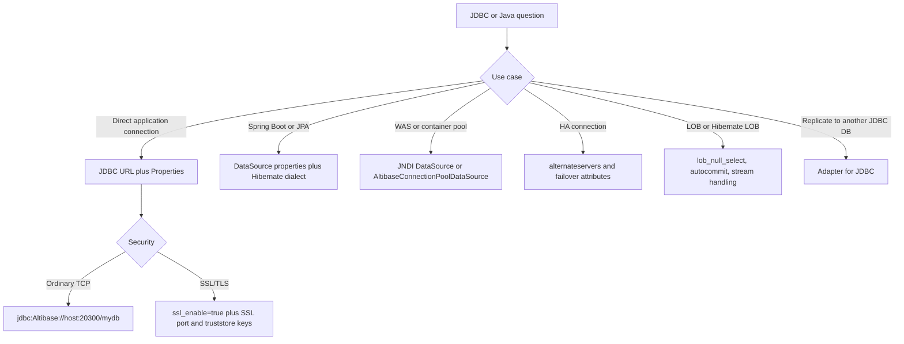
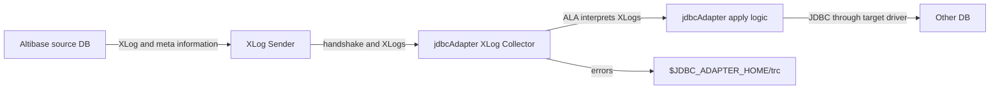

# 11. Java, JDBC, and Spring

## Applicable Versions

- 7.1: Based on Altibase 7.1 JDBC, Adapter for JDBC, Spring Data JPA, Hibernate, and Java compatibility guidance.
- 7.3: Based on Altibase 7.3 JDBC, Adapter for JDBC, Spring Data JPA, Hibernate 6.4, and Java compatibility guidance.
- 8.1: Based on Altibase 8.1 verified source JDBC, Adapter for JDBC, release note, Spring Data JPA, Hibernate 6.4, and Java compatibility guidance.

## Questions This File Can Answer

- How should an Altibase JDBC URL be written for ordinary, IPv6, SSL/TLS, failover, or DataSource-based connections?
- Which driver class, JAR file, Maven dependency, and Spring Boot properties should be used?
- How should Hibernate 6.4 or older Hibernate versions be configured for Altibase?
- Which JDBC connection attributes control login, timeouts, LOB behavior, fetch performance, failover, SSL/TLS, and statement caching?
- What Java versions are supported for Altibase JDBC driver and Adapter for JDBC?
- How should JDBC applications handle `BLOB`, `CLOB`, `NCHAR`, `NVARCHAR`, `GEOMETRY`, Java 8 time classes, and JDBC 4.2 APIs?
- How is Adapter for JDBC installed, configured, started, stopped, and constrained?
- How should common JDBC SQLSTATE values be interpreted during troubleshooting?

## Source Documents

- 7.1: Altibase 7.1 JDBC User's Manual; Adapter for JDBC User's Manual; Spring Data JPA guide; Spring Data JPA with Hibernate 6.4 guide; Java compatibility note.
- 7.3: Altibase 7.3 JDBC User's Manual; Adapter for JDBC User's Manual; Spring Data JPA guide; Spring Data JPA with Hibernate 6.4 guide; Java compatibility note.
- 8.1: Altibase 8.1 verified source JDBC User's Manual; Adapter for JDBC User's Manual; release note; Spring Data JPA guide; Spring Data JPA with Hibernate 6.4 guide; Java compatibility note.

## Response Rules

- Answer explanatory text in the user's language.
- Keep `jdbc:Altibase://...`, SQL object names, class names, method names, package names, property names, error codes, commands, file paths, and version numbers literal.
- For 8.1-specific statements, say `Altibase 8.1 verified source`.
- Do not expose internal source labels, repository names, or workstation paths in customer answers.
- For production connection design, ask for Altibase version, JDBC driver patch version, Java version, framework version, server host, service port, SSL/TLS requirement, failover topology, character set, and connection pool before giving a final configuration.
- If a question is about SSL/TLS certificates, truststores, ciphers, or replication SSL, use this attachment for the JDBC URL keys and the SSL/TLS attachment for the full security procedure.

## Fast Decision Map



## Version Differences

Version block: 7.1

- Driver class: `Altibase.jdbc.driver.AltibaseDriver`.
- Local driver file: `$ALTIBASE_HOME/lib/Altibase.jar`.
- Logging and non-logging JARs: `Altibase.jar` supports logging; `Altibase_t.jar` does not support logging.
- JDBC 3.0 driver baseline: `Altibase.jar` is a Type 4 pure Java driver and operates on JDK 1.5 or later according to the 7.1 JDBC guide.
- JDBC 4.2 support: `Altibase42.jar` supports JDBC 4.2 APIs and Java 8 time conversion.
- Maven Central availability: from Altibase 7.1.0.9.0; the Spring Hibernate 6.4 guide uses `com.altibase:altibase-jdbc:7.1.0.9.2` as the 7.1 example.
- Hibernate LOB caution: in 7.1, set `lob_null_select=off` when Hibernate LOB features are used, because the 7.1 default is `on`.
- `socket_immediate_close`: supported by Altibase JDBC driver 7.1.0.9.8 and later.
- Java compatibility note: `Altibase.jar` is listed as compatible from Java 5 through Java 17-21; `Altibase42.jar` is listed from Java 8 through Java 17-21. Java 11 or later support for the JDBC 3.0 driver starts from Altibase 7.1.0.2.6.
- Adapter for JDBC Java compatibility: 7.1 Adapter for JDBC is listed from Java 7 through Java 17-21; Java 11 or later support starts from Altibase 7.1.0.2.6.

Version block: 7.3

- Driver class and URL format remain `Altibase.jdbc.driver.AltibaseDriver` and `jdbc:Altibase://host:port/database`.
- Maven Central availability: from Altibase 7.3.0.0.2; the Spring Hibernate 6.4 guide uses `com.altibase:altibase-jdbc:7.3.0.0.2` as the 7.3 example.
- Hibernate LOB behavior: `lob_null_select` default is `off`, so 7.3 users normally do not need to add `lob_null_select=off` for Hibernate.
- `socket_immediate_close`: supported by Altibase JDBC driver 7.3.0.0.7 and later.
- Java compatibility note: 7.3 `Altibase.jar` and Adapter for JDBC are listed as tested from Java 8 through Java 17-21, and not supported on Java 5, Java 6, or Java 7.

Version block: 8.1

- Use Altibase 8.1 verified source for JDBC and Adapter for JDBC behavior.
- Altibase 8.1 release notes state that Altibase 8.1 is compatible with JDK 1.8 and higher.
- Altibase 8.1 verified source includes `stmt_cache_enable`, `stmt_cache_size`, and `stmt_cache_sql_limit` for JDBC statement caching.
- Altibase 8.1 verified source keeps the 7.3-and-later Hibernate LOB guidance: `lob_null_select` default is `off`.
- Altibase 8.1 adds a native `JSON` data type, JSON path support, and JSON functions such as `JSON_ARRAY`, `JSON_OBJECT`, `JSON_EXISTS`, `JSON_QUERY`, `JSON_VALUE`, and `JSON_VALID`. JDBC-specific JSON binding details are not expanded in the English JDBC guide; answer JSON/JDBC binding questions conservatively and ask for the exact driver version.
- Altibase 8.1 adds Temporary LOB support and `V$TEMPORARY_LOBS`; do not assume older JDBC LOB sections cover Temporary LOB behavior unless the answer is limited to ordinary `BLOB` and `CLOB` handling.
- Altibase 8.1 verified source adds improved JDBC behavior for Empty LOB values, meaning `BLOB` or `CLOB` data with length 0. Do not apply older 7.1/7.3 zero-length LOB guidance to 8.1 Empty LOB behavior without checking the target 8.1 driver.

## Core JDBC Cookbook

Driver and classpath checklist:

1. Install the Altibase package or obtain the matching Altibase JDBC driver for the target Altibase server version.
2. Use the driver class `Altibase.jdbc.driver.AltibaseDriver`.
3. For file-based setup, add `$ALTIBASE_HOME/lib/Altibase.jar` to `CLASSPATH`.
4. If asynchronous prefetch auto-tuning is used, add `$ALTIBASE_HOME/lib` to `LD_LIBRARY_PATH` so the JNI module `libaltijext.so` can be loaded.
5. Check the driver version with:

```sh
java -jar $ALTIBASE_HOME/lib/Altibase.jar
```

Basic URL syntax:

```text
jdbc:Altibase://server_ip:server_port/dbname
```

Basic Java connection:

```java
String url = "jdbc:Altibase://localhost:20300/mydb";
Properties props = new Properties();
props.put("user", "SYS");
props.put("password", "MANAGER");

Class.forName("Altibase.jdbc.driver.AltibaseDriver");
Connection conn = DriverManager.getConnection(url, props);
```

URL attribute syntax:

```text
jdbc:Altibase://localhost:20300/mydb?fetch_enough=30&time_zone=DB_TZ
```

Rules:

- Add `?key=value` after the database name.
- Add additional keys with `&`.
- The same attributes can be set in a Java `Properties` object.
- If the same property is present in a DataSource file and in the URL, the URL value takes precedence.

Common URL examples:

```text
# Ordinary TCP
jdbc:Altibase://db1.example.com:20300/mydb

# Login timeout
jdbc:Altibase://db1.example.com:20300/mydb?login_timeout=10

# Query and fetch tuning
jdbc:Altibase://db1.example.com:20300/mydb?fetch_enough=1000&query_timeout=600

# 7.1 Hibernate LOB compatibility
jdbc:Altibase://db1.example.com:20300/mydb?lob_null_select=off

# SSL/TLS client connection
jdbc:Altibase://db1.example.com:20443/mydb?ssl_enable=true&verify_server_certificate=true

# IPv6 literal
jdbc:Altibase://[::1]:20300/mydb
```

Connection attribute block: `server`

- Purpose: Altibase server IP address or host name.
- Default: `localhost`.
- Required: yes.
- IPv6: enclose an IPv6 literal in square brackets, for example `jdbc:Altibase://[::1]:20300/mydb`.

Connection attribute block: `port`

- Purpose: server port.
- Default: `20300` for non-SSL connections; `20443` when `ssl_enable=true`.
- Range: `0` through `65535`.

Connection attribute block: `database`

- Purpose: database name.
- Default: `mydb`.

Connection attribute block: `user`, `password`

- Purpose: database user ID and password.
- Required: yes.
- Spring equivalents: `spring.datasource.username` and `spring.datasource.password`.

Connection attribute block: `privilege`

- Purpose: connection mode.
- Values: `normal`, `sysdba`.
- Use `sysdba` only for administrative connections that require that mode.

Connection attribute block: `login_timeout`, `response_timeout`

- `login_timeout`: maximum wait time for login.
- `response_timeout`: maximum wait time for a server response.
- Unit: seconds.
- Use when: network, firewall, or failover behavior needs bounded waits.

Connection attribute block: `query_timeout`, `fetch_timeout`, `ddl_timeout`, `utrans_timeout`, `idle_timeout`

- `query_timeout`: default `600`; maximum query execution time in seconds; `0` means infinity.
- `fetch_timeout`: default `60`; maximum SELECT execution time in seconds; `0` means infinity.
- `ddl_timeout`: maximum DDL execution time in seconds; `0` means infinity.
- `utrans_timeout`: default `3600`; maximum UPDATE execution time in seconds; `0` means infinity.
- `idle_timeout`: maximum idle connection time in seconds; `0` means infinity.

Connection attribute block: `auto_commit`, `clientside_auto_commit`

- `auto_commit`: values `true` or `false`; default `true`.
- `clientside_auto_commit`: values `on` or `off`; default `off`; used only when `auto_commit=true` or omitted.
- For LOB workflows, prefer `Connection.setAutoCommit(false)` and explicit `commit()` or set `clientside_auto_commit=on` only when the driver-controlled autocommit model is intended.

Connection attribute block: `time_zone`, `date_format`

- `time_zone`: sets session time zone; default behavior is `DB_TZ`.
- `date_format`: sets the DATE input/output format; if client input does not match, the driver returns an error instead of treating the value as DATE.

Connection attribute block: `fetch_enough`, `fetch_async`, `fetch_auto_tuning`

- `fetch_enough`: session fetch size; default `0`, which fetches the maximum data that fits in one network packet.
- `fetch_async`: values `off` or `preferred`; asynchronous prefetch can improve fetch performance, but only one statement per connection is performed asynchronously.
- `fetch_auto_tuning`: values `on` or `off`; Linux default is `on`, non-Linux default is `off`; requires the JNI module for auto-tuning.

Connection attribute block: `lob_cache_threshold`, `lob_null_select`, `batch_setbytes_use_lob`

- `lob_cache_threshold`: client-side LOB cache threshold; default `8192`; range `0` through `524288`.
- `lob_null_select`: controls whether `ResultSet.getBlob()` and `ResultSet.getClob()` return a LOB object for a NULL LOB value.
- `lob_null_select=off`: return `null`.
- `lob_null_select=on`: return a LOB object.
- 7.1 default: `on`; use `lob_null_select=off` for Hibernate LOB compatibility.
- 7.3 and 8.1 verified source default: `off`.
- `batch_setbytes_use_lob`: default `true`; use `true` when `PreparedStatement.setBytes()` with `executeBatch()` targets `BLOB` columns and data can exceed `65534` bytes.

Connection attribute block: `ssl_enable`, `port`, `verify_server_certificate`, `truststore_url`

- `ssl_enable=true`: connect over SSL/TLS.
- `port`: set to the server SSL/TLS port, commonly `20443`.
- `verify_server_certificate=true`: authenticate the server certificate.
- Truststore keys: `truststore_url`, `truststore_type`, `truststore_password`.
- Mutual authentication keys: `keystore_url`, `keystore_type`, `keystore_password`.
- Cipher/protocol keys: `ciphersuite_list`, `ssl_protocols`.
- Use the SSL/TLS attachment for certificate preparation and server-side SSL/TLS properties.

Connection attribute block: `stmt_cache_enable`, `stmt_cache_size`, `stmt_cache_sql_limit`

- Version: Altibase 8.1 verified source.
- Purpose: caches and reuses `PreparedStatement` and `CallableStatement` objects at the connection level.
- `stmt_cache_enable`: default `false`; set `true` to enable statement caching.
- `stmt_cache_size`: default `25`; maximum cached statement count.
- `stmt_cache_sql_limit`: default `1024`; SQL text length limit for cached statements.
- Exclusions: `Statement` objects are not cached.
- Cautions: do not combine statement caching with `defer_prepares`; avoid duplicate caching with DBCP `poolPreparedStatements`; DDL on cached database objects can lead to errors; tune Java heap and cache limits.

Statement caching example:

```java
Properties props = new Properties();
props.put("user", "SYS");
props.put("password", "MANAGER");
props.put("stmt_cache_enable", "true");
props.put("stmt_cache_size", "50");
props.put("stmt_cache_sql_limit", "2048");

Connection conn = DriverManager.getConnection(
    "jdbc:Altibase://localhost:20300/mydb", props);
```

Connection validation query:

```sql
/* PING */ SELECT 1
```

Use this lightweight ping pattern for connection-pool validation when the pool supports `validationQuery`, `poolPingQuery`, or an equivalent setting.

## Failover Cookbook

Failover modes:

- `CTF`: Connection Time Failover. The driver tries another server when initial connection fails.
- `STF`: Session Time Failover. The driver reconnects and raises failover events when an established connection fails before a server response is received.

CTF properties example:

```java
Properties props = new Properties();
props.put("user", "APP_USER");
props.put("password", "secret");
props.put("alternateservers", "(db1.example.com:20300, db2.example.com:20300)");
props.put("connectionretrycount", "5");
props.put("connectionretrydelay", "2");
props.put("sessionfailover", "off");
```

STF property change:

```java
props.put("sessionfailover", "on");
```

Failover attribute block: `alternateservers`

- Purpose: server list used for connection failover.
- Format: `(host_name:port_number[/dbname], host_name:port_number[/dbname])`.
- Limit: up to two alternate servers.

Failover attribute block: `connectionretrycount`, `connectionretrydelay`

- `connectionretrycount`: number of alternate connection retries.
- `connectionretrydelay`: wait time between retry attempts.
- Unit for `connectionretrydelay`: seconds.

Failover callback API:

```java
public interface AltibaseFailoverCallback {
    int failoverCallback(Connection connection,
                         Object appContext,
                         int failoverEvent);
}
```

Callback event constants:

- `AltibaseFailoverCallback.Event.BEGIN`: session failover started.
- `AltibaseFailoverCallback.Event.COMPLETED`: session failover succeeded.
- `AltibaseFailoverCallback.Event.ABORT`: session failover failed.

Callback result constants:

- `AltibaseFailoverCallback.Result.GO`: continue the STF process.
- `AltibaseFailoverCallback.Result.QUIT`: terminate the STF process.

Registration pattern:

```java
((AltibaseConnection) conn).registerFailoverCallback(callback, appContext);
...
((AltibaseConnection) conn).deregisterFailoverCallback();
```

## DataSource And Connection Pool Cookbook

`altibase_cli.ini` DataSource file:

```ini
# comment

[appdb]
Server=localhost
Port=20300
User=sys
Password=manager
```

Search order for `altibase_cli.ini`:

1. `/altibase_cli.ini`
2. `$HOME/altibase_cli.ini`
3. `$ALTIBASE_HOME/conf/altibase_cli.ini`

DataSource URL examples:

```text
jdbc:Altibase://appdb
jdbc:Altibase://appdb:20301
jdbc:Altibase://appdb:20301?user=app_user&password=secret
```

`AltibaseConnectionPoolDataSource` properties:

- `databaseName`: database name.
- `dataSourceName`: DataSource name.
- `loginTimeout`: maximum wait time for login.
- `logWriter`: log writer.
- `password`: database password.
- `portNumber`: database port number.
- `serverName`: database server name.
- `URL`: connection string information. The property name is uppercase.
- `user`: database user ID.

Tomcat JNDI `Context` example:

```xml
<Context>
  <Resource name="jdbc/altihdb"
            auth="Container"
            type="javax.sql.DataSource"
            driverClassName="Altibase.jdbc.driver.AltibaseDriver"
            url="jdbc:Altibase://localhost:20300/mydb"
            username="SYS"
            password="MANAGER"
            maxTotal="100"
            maxIdle="30"
            maxWaitMillis="10000" />
</Context>
```

Tomcat `web.xml` reference:

```xml
<resource-ref>
  <description>Altibase Datasource example</description>
  <res-ref-name>jdbc/altihdb</res-ref-name>
  <res-type>javax.sql.DataSource</res-type>
  <res-auth>Container</res-auth>
</resource-ref>
```

JNDI lookup:

```java
Context initContext = new InitialContext();
Context envContext = (Context) initContext.lookup("java:/comp/env");
DataSource ds = (DataSource) envContext.lookup("jdbc/altihdb");
Connection conn = ds.getConnection();
```

WebLogic configuration values:

- Database type: `Other`.
- Driver class name: `Altibase.jdbc.driver.AltibaseDriver`.
- URL: `jdbc:Altibase://localhost:20300/mydb`.

JEUS data source class:

```text
Altibase.jdbc.driver.AltibaseConnectionPoolDataSource
```

JEUS core property names:

- `PortNumber`
- `Password`
- `ServerName`
- `ConnectionAttributes`
- `DatabaseName`
- `User`

## Spring Boot And Hibernate Cookbook

Spring Boot 3.2 / Hibernate 6.4 dependency block:

```xml
<dependency>
    <groupId>org.hibernate.orm</groupId>
    <artifactId>hibernate-community-dialects</artifactId>
    <version>6.4.1.Final</version>
</dependency>
```

Altibase JDBC Maven dependency for 7.3:

```xml
<dependency>
    <groupId>com.altibase</groupId>
    <artifactId>altibase-jdbc</artifactId>
    <version>7.3.0.0.2</version>
</dependency>
```

Altibase JDBC Maven dependency for 7.1:

```xml
<dependency>
    <groupId>com.altibase</groupId>
    <artifactId>altibase-jdbc</artifactId>
    <version>7.1.0.9.2</version>
</dependency>
```

Spring Boot 3.2 / Hibernate 6.4 `application.properties`:

```properties
spring.datasource.driver-class-name=Altibase.jdbc.driver.AltibaseDriver
spring.datasource.url=jdbc:Altibase://localhost:20300/mydb
spring.datasource.username=sys
spring.datasource.password=manager

spring.jpa.properties.hibernate.jdbc.lob.non_contextual_creation=true
```

Why `spring.jpa.properties.hibernate.jdbc.lob.non_contextual_creation=true` is used:

- Hibernate can call `Connection.createNClob()` while checking NCLOB support.
- Altibase does not support `NCLOB`.
- The property suppresses the related `java.sql.SQLFeatureNotSupportedException`; the exception can be ignored for that capability check.

Spring Boot example properties for automatic table creation during a sample test:

```properties
spring.datasource.driver-class-name=Altibase.jdbc.driver.AltibaseDriver
spring.datasource.url=jdbc:Altibase://localhost:20300/mydb
spring.datasource.username=sys
spring.datasource.password=manager

spring.jpa.properties.hibernate.jdbc.lob.non_contextual_creation=true
spring.jpa.hibernate.ddl-auto=create
spring.jpa.show-sql=true
```

Spring Boot 2.7 / older Hibernate properties:

```properties
spring.datasource.driver-class-name=Altibase.jdbc.driver.AltibaseDriver
spring.datasource.url=jdbc:Altibase://172.16.135.35:20300/mydb
spring.datasource.username=sys
spring.datasource.password=manager

spring.datasource.hikari.connection-test-query=select 1 from dual

spring.jpa.database-platform=org.hibernate.dialect.AltibaseDialect
spring.jpa.hibernate.ddl-auto=create
spring.jpa.show-sql=true
```

Hibernate 6.4 and later:

- `AltibaseDialect` is provided through `hibernate-community-dialects`.
- Add `org.hibernate.orm:hibernate-community-dialects` with Hibernate version `6.4` or later.
- Configure the Altibase JDBC driver dependency separately.

Hibernate before 6.4:

- `AltibaseDialect` is not bundled.
- Compile and add the Altibase dialect source files that match the Hibernate version.
- Dialect source file names used by the guide:
  - `AltibaseDialect.java`
  - `AltibaseLimitHandler.java`
  - `SequenceInformationExtractorAltibaseDatabaseImpl.java`
- After compiling, the class files are under packages including:
  - `org.hibernate.dialect.AltibaseDialect`
  - `org.hibernate.dialect.pagination.AltibaseLimitHandler`
  - `org.hibernate.tool.schema.extract.internal.SequenceInformationExtractorAltibaseDatabaseImpl`

Hibernate LOB URL rules:

```properties
# Required for Altibase 7.1 when Hibernate LOB behavior is used
spring.datasource.url=jdbc:Altibase://127.0.0.1:20300/mydb?lob_null_select=off
```

- 7.1: set `lob_null_select=off` explicitly for Hibernate LOB behavior.
- 7.3 and 8.1 verified source: default is already `off`; the URL attribute is usually unnecessary.

Connection success evidence:

```text
Added connection Altibase.jdbc.driver.AltibaseConnection
```

## JDBC Data Type And API Cookbook

Basic data type mapping blocks:

- `CHAR`, `VARCHAR`, `LONGVARCHAR`: Java `String`.
- `NUMERIC`, `DECIMAL`: Java `BigDecimal`.
- `BIT`: Altibase `VARBIT`; Java `BitSet`.
- `TINYINT`, `SMALLINT`: Altibase `SMALLINT`; Java `Short`.
- `INTEGER`: Java `Integer`.
- `BIGINT`: Java `Long`.
- `REAL`: Java `Float`.
- `FLOAT`: Java `BigDecimal`.
- `DOUBLE`: Java `Double`.
- `BINARY`: Altibase `BYTE`; Java `byte[]`.
- `VARBINARY`, `LONGVARBINARY`: Altibase `BLOB`; Java `Blob`.
- `DATE`, `TIME`, `TIMESTAMP`: Altibase `DATE`; Java `Timestamp`.
- `CLOB`: Java `Clob`.
- `BLOB`: Java `Blob`.
- `GEOMETRY`: Java `byte[]`; use `AltibaseTypes.GEOMETRY` when binding through `setObject`.
- Unsupported or unmapped JDBC types include `BOOLEAN`, `ARRAY`, `DISTINCT`, `STRUCT`, `REF`, `DATALINK`, and `JAVA_OBJECT`.

Java 8 time mapping with JDBC 4.2:

- `java.time.LocalDate`: converted to `java.sql.Date`.
- `java.time.LocalTime`: converted to `java.sql.Time`.
- `java.time.LocalDateTime`: converted to `java.sql.Timestamp`.
- `java.time.OffsetTime`: not supported.
- `java.time.OffsetDateTime`: not supported.

JDBC 4.2 API support highlights:

- `PreparedStatement.setObject(int, Object, SQLType)` is supported.
- `PreparedStatement.setObject(int, Object, SQLType, int)` is supported.
- `CallableStatement.getObject(int, Class<T>)` is supported.
- `CallableStatement.getObject(String, Class<T>)` is supported.
- `CallableStatement.setObject(String, Object, SQLType)` is supported.
- `CallableStatement.setObject(String, Object, SQLType, int)` is supported.
- `ResultSet.getObject(int, Class<T>)` is supported.
- `ResultSet.getObject(String, Class<T>)` is supported.
- `Connection.createBlob()`, `Connection.createClob()`, and `Connection.createNClob()` are not supported.
- `NCLOB` and N-character stream APIs that require `NCLOB` return `SQLFeatureNotSupportedException`.

National character set:

- `NCHAR` and `NVARCHAR` data can be retrieved and altered like `CHAR` and `VARCHAR`.
- Use ordinary string methods such as `getString` and `setString`.
- Use `ncharliteralreplace` when the client must check and replace NCHAR string literals in SQL statements.

`GEOMETRY` binding:

```java
sPstmt.setObject(1, geometryData, AltibaseTypes.GEOMETRY);
```

`BIT` and `VARBIT` binding:

- Java `BitSet` can be used.
- Use `AltibaseBitSet` when a bit value ending in `0` must preserve the specified bit length.

LOB handling rules:

- Altibase ordinary LOB data types are `BLOB` and `CLOB`.
- For ordinary LOB work, disable autocommit with `Connection.setAutoCommit(false)` and control transactions explicitly, or set `clientside_auto_commit=on` when that driver-controlled model is intended.
- Prefer `InputStream` or `OutputStream` for `BLOB`.
- Prefer `Reader` or `Writer` for `CLOB`.
- If the LOB size is equal to or less than `8192` bytes, tune `lob_cache_threshold` appropriately.
- Explicitly free many obtained LOB objects; commit alone is not a substitute for freeing client-side LOB resources.

Altibase 8.1 Empty LOB note:

- Altibase 8.1 verified source improves JDBC Empty LOB processing for LOB data with length 0.
- Treat this as 8.1-specific behavior. Older 7.1/7.3 zero-length LOB guidance, especially tool guidance that stores zero-length LOB data like `NULL`, should not be assumed for 8.1 JDBC Empty LOB answers.
- If the distinction between `NULL` and Empty LOB affects application logic, ask for the exact server and JDBC driver version before giving code-level behavior claims.

Freeing LOB resources:

```java
Blob blob = rs.getBlob(1);
((Altibase.jdbc.driver.AltibaseLob) blob).free();

Clob clob = rs.getClob(1);
((Altibase.jdbc.driver.AltibaseLob) clob).free();
```

LOB restriction block:

- If a LOB value retrieved from an open `ResultSet` is used by another `Statement.executeUpdate()` before the cursor is closed, later fetches from that cursor can fail because the LOB locator is freed.
- For that pattern, call `setAutoCommit(false)` before the workflow and close or consume the cursor in a controlled order.

Atomic Batch:

- Atomic Batch guarantees atomicity for batch operations and supports fast bulk INSERT.
- Use `AltibasePreparedStatement.setAtomicBatch(boolean)`.
- Check with `AltibasePreparedStatement.getAtomicBatch()`.
- Restrictions: simple INSERT only; complex INSERT, UPDATE, and DELETE are not covered; statement-level triggers fire once; `SYSDATE` is evaluated once.

## JDBC SQLSTATE Troubleshooting Blocks

SQLSTATE structure:

- First two characters: class.
- Last three characters: subclass.

SQLSTATE block: class `08` connection exception

- `08S01`: communication link failure.
- `08F01`: failover completed.
- `08F02`: invalid format for alternate servers.
- `08U01`: invalid connection URL.
- `08H01`: unknown host.
- `08D01`: no available DataSource configurations.
- `08K01` through `08K08`: SSL/TLS keystore, algorithm, or key-management errors.
- `08M01`: mandatory properties supported by the client version are not supported by the server version.

SQLSTATE block: class `07` dynamic SQL error

- `07R01`: statement returns result sets.
- `07Q01`: invalid query string.
- `07S01`: statement has not been executed yet.

SQLSTATE block: class `01` warning

- `01S00`: invalid connection string attribute.
- `01B00`: batch update exception.
- `01B01`: no batch jobs.
- `01B02`: existing batch jobs.
- `01B03`: query cannot be executed while batch jobs are executing.
- `01B04`: binding cannot be performed while batch jobs are executing.
- `01B05`: fetch cannot be executed during batch update.
- `01C01`: statement already closed.
- `01C02`: result set already closed.
- `01C03`: stream already closed.
- `01R02`: too many rows requested in one fetch operation.

SQLSTATE block: class `0A` feature not supported

- `0A000`: feature not supported.
- Common causes: `NCLOB` APIs, `createBlob()`, `createClob()`, `createNClob()`, unsupported ResultSet mode, or JDBC specification violation.

SQLSTATE block: class `22` data exception

- `22000`: data exception.
- `22004`: null value not allowed.
- `22023`: invalid parameter value.
- `22P01`: insufficient number of parameters.
- `22P02`: `IN` type parameter needed.
- `22P03`: `OUT` type parameter needed.
- `22L01`: actual LOB data length differs from written LOB data length.

SQLSTATE block: class `HY` general error

- `HY000`: too many allocated statements.
- `HY007`: associated statement is not prepared.
- `HY011`: attribute cannot be set now.
- `HY090`: invalid string or buffer length.
- `HY109`: invalid cursor position.
- `HYT00`: timeout expired.

## Adapter For JDBC

Adapter for JDBC, also called `jdbcAdapter`, applies changed data from Altibase to another database that supports JDBC. It combines Altibase Log Analysis API with JDBC.

Adapter architecture:



Adapter prerequisites:

- OS: Linux x86-64bit.
- Source Altibase version: 6.3.1 or later according to the Adapter for JDBC guide.
- Target database: a database reachable through a compatible JDBC driver.
- Install the target database JDBC driver on the host where `jdbcAdapter` runs.
- Install a JRE compatible with both `jdbcAdapter` and the target JDBC driver.
- Configure `JAVA_HOME`, `CLASSPATH`, `PATH`, and `LD_LIBRARY_PATH` for the JRE.
- Configure `JDBC_ADAPTER_HOME` and `ALTIBASE_NLS_USE`.
- Install `jdbcAdapter` under a different OS user from the source Altibase server account when possible.
- Use a `jdbcAdapter` version that matches the Altibase version it runs with.

Required directory layout under `$JDBC_ADAPTER_HOME`:

- `bin`: `jdbcAdapter`, `oaUtility`, and internal executable files.
- `conf`: `jdbcAdapter.conf`.
- `msg`: message files.
- `trc`: trace log files.

`jdbcAdapter.conf` property groups:

- ALA properties.
- Constraint-check properties for the source Altibase connection.
- Other database JDBC properties.
- DML behavior properties.

ALA property block:

- `ALA_SENDER_IP`: source Altibase server IP; default `127.0.0.1`.
- `ALA_RECEIVER_PORT`: port on which `jdbcAdapter` listens for XLogs; range `1024` through `65535`.
- `ALA_SENDER_REPLICATION_PORT`: sender port connection mode; `0` waits for the ALA replication sender, `1` or higher lets the adapter connect to the sender port.
- `ALA_RECEIVE_XLOG_TIMEOUT`: wait time for XLog receipt; default `300` seconds.
- `ALA_REPLICATION_NAME`: replication object name created in Altibase.
- `ALA_SOCKET_TYPE`: `TCP` or `UNIX`; `UNIX` requires Altibase and `jdbcAdapter` on the same host.
- `ALA_XLOG_POOL_SIZE`: maximum XLog pool size; default `100000`; must be larger than `REPLICATION_SYNC_TUPLE_COUNT` for sync workloads that require it.
- `ALA_LOGGING_ACTIVE`: `0` disables ALA trace logging; `1` enables it; default `1`.

Source Altibase property block:

- `ALTIBASE_USER`: source Altibase user for constraint checks.
- `ALTIBASE_PASSWORD`: source Altibase password.
- `ALTIBASE_IP`: source Altibase server IP; default `127.0.0.1`.
- `ALTIBASE_PORT`: source Altibase service port; range `1024` through `65535`.
- `ADAPTER_ERROR_RESTART_COUNT`: adapter restart attempts after errors; `0` terminates on error.
- `ADAPTER_ERROR_RESTART_INTERVAL`: interval between adapter restart attempts.
- `ADAPTER_LOB_TYPE_SUPPORT`: `0` disables LOB support; `1` enables LOB support.

Target database JDBC property block:

- `OTHER_DATABASE_USER`: target database user.
- `OTHER_DATABASE_PASSWORD`: target database password.
- `OTHER_DATABASE_JDBC_MAX_HEAP_SIZE`: JVM maximum heap in MB; default `2048`; `0` lets the JVM choose automatically.
- `OTHER_DATABASE_JDBC_DRIVER_PATH`: target JDBC driver path.
- `OTHER_DATABASE_JDBC_DRIVER_CLASS`: target JDBC driver class name.
- `OTHER_DATABASE_JDBC_CONNECTION_URL`: target database JDBC URL.

DML property block:

- `OTHER_DATABASE_GROUP_COMMIT`: default `1`; groups commits for performance; can increase individual transaction response time.
- `OTHER_DATABASE_BATCH_DML_MAX_SIZE`: default `10`; range `1` through `32767`; set `1` to disable Batch DML; affects INSERT and DELETE; LOB interface updates do not use Batch DML.
- `OTHER_DATABASE_ERROR_RETRY_COUNT`: retry count for record apply errors; default `0`; LOB XLogs are excluded from retry.
- `OTHER_DATABASE_ERROR_RETRY_INTERVAL`: retry interval in seconds; default `0`.
- `OTHER_DATABASE_SKIP_ERROR`: default `1`; controls whether failed records are discarded after retry; LOB-related XLog errors terminate the adapter instead of being skipped.
- `OTHER_DATABASE_SKIP_INSERT`: `1` skips INSERT reflection; default `0`.
- `OTHER_DATABASE_SKIP_UPDATE`: `1` skips UPDATE reflection; default `0`.
- `OTHER_DATABASE_SKIP_DELETE`: `1` skips DELETE reflection; default `0`.
- `OTHER_DATABASE_SET_USER_TO_TABLE`: `1` uses the XLog Sender user as the target table user; default `0`.

Property format rule:

- Spaces or tabs cannot be used in property values.
- Use double quotation marks when a value contains special characters.
- Restart `jdbcAdapter` after changing environment variables or properties.

Startup sequence:

```sql
CREATE REPLICATION ala FOR ANALYSIS WITH '127.0.0.1', 25090
FROM sys.t1 TO user1.t2;
```

```sh
cd $JDBC_ADAPTER_HOME/bin
./jdbcAdapter
```

```sql
ALTER REPLICATION ala START;
```

Shutdown sequence:

```sql
ALTER REPLICATION ala STOP;
```

Utility commands:

```sh
oaUtility start
oaUtility stop
oaUtility status
oaUtility check
```

Adapter constraints:

- Replicated tables require a primary key.
- The primary key of a replicated table cannot be modified.
- Source and target tables must have the same column order and primary key constraints.
- The maximum number of XLog senders and replicated connections depends on `REPLICATION_MAX_COUNT`.
- Replication can be slower than source service workload speed.
- Some target conflicts can cancel or skip operations depending on error settings.

Adapter DDL rule:

- In general, executing DDL on a replication target table terminates `jdbcAdapter` after preceding changes are reflected.
- To continue, execute the same DDL on the target database so schemas match, then restart `jdbcAdapter`.

Adapter LOB rules:

- LOB support starts from Adapter for JDBC 7.1.0.7.0.
- Set `ADAPTER_LOB_TYPE_SUPPORT=1` to replicate `CLOB` or `BLOB`.
- Tables containing LOB columns are constrained by `OTHER_DATABASE_ERROR_RETRY_COUNT`, `OTHER_DATABASE_SKIP_ERROR`, and `OTHER_DATABASE_BATCH_DML_MAX_SIZE`.
- When LOB data is modified through `SELECT FOR UPDATE` on the source Altibase server, commit the transaction before relying on replication.

Adapter supported Altibase data type groups:

- Numeric: `NUMERIC`, `FLOAT`, `DOUBLE`, `REAL`, `BIGINT`, `INTEGER`, `SMALLINT`.
- Date: `DATE`.
- Character and LOB: `CHAR`, `VARCHAR`, `NCHAR`, `NVARCHAR`, `CLOB`, `BLOB`.

Offline Adapter syntax:

```sql
CREATE REPLICATION ala_replication_name FOR ANALYSIS OPTIONS META_LOGGING
    WITH 'remote_host_ip', remote_host_port_no
    FROM user_name.table_name TO user_name.table_name;

ALTER REPLICATION ala_replication_name SET OFFLINE ENABLE WITH 'log_dir';
ALTER REPLICATION ala_replication_name SET OFFLINE DISABLE;
ALTER REPLICATION ala_replication_name BUILD OFFLINE META [AT SN(sn)];
ALTER REPLICATION ala_replication_name RESET OFFLINE META;
ALTER REPLICATION ala_replication_name START WITH OFFLINE;
```

Offline Adapter constraints:

- The ALA object name on the offline `jdbcAdapter` server must match the ALA object name on the active server.
- Offline `jdbcAdapter` does not support ALA objects with compressed tables as replication targets.
- Active and standby servers must have the same log file size, SM version, OS, and OS bit size.
- If the standby server restarts after `BUILD OFFLINE META`, execute `BUILD OFFLINE META` again.
- If offline replication stops because DDL logs are included in the gap, execute the DDL on the target side as needed, restart `jdbcAdapter`, and rerun offline replication. Do not blindly run `RESET OFFLINE META`, because it can cause the DDL logs to be read again.

## Quick Answer Templates

Template: basic JDBC URL

Use `Altibase.jdbc.driver.AltibaseDriver` and `jdbc:Altibase://host:port/database`. For example, `jdbc:Altibase://db1.example.com:20300/mydb`. Put credentials in a `Properties` object with `user` and `password`, or in Spring Boot with `spring.datasource.username` and `spring.datasource.password`.

Template: Spring Boot with Hibernate 6.4

Add `org.hibernate.orm:hibernate-community-dialects` version `6.4` or later and the matching `com.altibase:altibase-jdbc` dependency. Set `spring.datasource.driver-class-name=Altibase.jdbc.driver.AltibaseDriver`, set `spring.datasource.url=jdbc:Altibase://host:20300/mydb`, and add `spring.jpa.properties.hibernate.jdbc.lob.non_contextual_creation=true`.

Template: Hibernate LOB on Altibase 7.1

For Altibase 7.1, add `lob_null_select=off` to the JDBC URL when Hibernate LOB behavior is used: `jdbc:Altibase://host:20300/mydb?lob_null_select=off`. For Altibase 7.3 and Altibase 8.1 verified source, the default is already `off`.

Template: JDBC failover URL properties

Use `alternateservers`, `connectionretrycount`, and `connectionretrydelay` for CTF. Add `sessionfailover=on` only when STF behavior and callback handling are intentionally designed.

Template: Adapter for JDBC setup

Install `jdbcAdapter` on Linux x86-64bit with a compatible JRE and target database JDBC driver. Configure `JDBC_ADAPTER_HOME`, `ALTIBASE_NLS_USE`, `jdbcAdapter.conf`, `ALA_*` properties, source `ALTIBASE_*` properties, target `OTHER_DATABASE_JDBC_*` properties, and DML behavior properties. Create `CREATE REPLICATION ... FOR ANALYSIS`, start `jdbcAdapter`, then run `ALTER REPLICATION ... START`.
