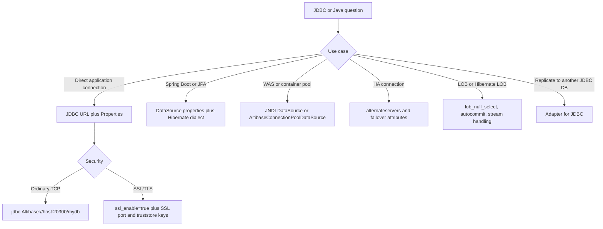
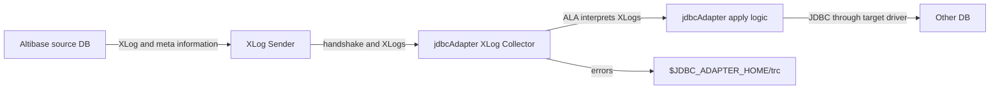

# 11. Java, JDBC, and Spring

## Applicable Versions

- 7.1: Based on Altibase 7.1 JDBC and Adapter for JDBC manuals. Treat Spring/Hibernate Maven examples and Java compatibility ranges as driver-patch examples that require verification against the target 7.1 driver or Adapter patch.
- 7.3: Based on Altibase 7.3 JDBC, Adapter for JDBC, Spring Data JPA, Hibernate 6.4, and Java compatibility guidance.
- 8.1: Based on Altibase 8.1 verified source JDBC, Adapter for JDBC, release note, Spring Data JPA, Hibernate 6.4, and Java compatibility guidance.

## Questions This File Can Answer

- How should an Altibase JDBC URL be written for ordinary, IPv6, SSL/TLS, failover, or DataSource-based connections?
- Which driver class, JAR file, Maven dependency, and Spring Boot properties should be used?
- How should Hibernate 6.4 or older Hibernate versions be configured for Altibase?
- Which JDBC connection attributes control login, timeouts, LOB behavior, fetch performance, failover, SSL/TLS, and statement caching?
- What Java versions are supported for Altibase JDBC driver and Adapter for JDBC?
- How should JDBC applications handle `BLOB`, `CLOB`, `NCHAR`, `NVARCHAR`, `GEOMETRY`, Java 8 time classes, and JDBC 4.2 APIs?
- How is Adapter for JDBC installed, configured, started, stopped, and constrained?
- How should common JDBC SQLSTATE values be interpreted during troubleshooting?

## Retrieval Alias Index

Use this compact index before scanning JDBC, Spring, Hibernate, and Adapter sections. It is intentionally redundant with later headings so lexical retrieval can land on the exact URL, driver, connection attribute, Java version, API, or framework block.

- Aliases and customer wording: JDBC URL, driver class, Altibase.jar, Altibase42.jar, Maven dependency, Spring Boot, Hibernate dialect, connection pool, failover, SSL JDBC, truststore, LOB handling, generated keys, Java compatibility, Adapter for JDBC, SQLSTATE troubleshooting.
- Exact-token anchors: `jdbc:Altibase://host:port/database`, `Altibase.jdbc.driver.AltibaseDriver`, `Altibase.jar`, `Altibase42.jar`, `AltibaseDialect`, `hibernate-community-dialects`, `lob_null_select=off`, `fetch_enough=0`, `time_zone=DB_TZ`, `failover`, `(database1:20300, database2:20300)`, `Connection.isValid()`, `AltibaseJDBCType`, `reuse_resultset`, `stmt_cache_enable`, `Oracle OpenJDK`, `Oracle JDK`, `IBM SDK`, `x`, `●`, `-`, `Altibase Support`.
- Focused routing anchors: URL-attribute questions route to `Exact block: JDBC URL attributes` and must keep `jdbc:Altibase://localhost:20300/mydb?fetch_enough=0&time_zone=DB_TZ`, `?`, and `&`; failover questions route to `Exact block: alternateservers and failover assumptions`; Hibernate LOB and Spring/Hibernate 6.4 questions route to `Exact block: Spring Boot and Hibernate 6.4 dependency tokens` and must keep `com.altibase`, `altibase-jdbc`, `spring.datasource.driver-class-name`, `spring.datasource.url`, `jdbc:Altibase://localhost:20300/mydb`, and `jdbc:Altibase://127.0.0.1:20300/mydb?lob_null_select=off`.
- Answer route: use this file for JDBC and Java framework configuration; use `18_security_ssl_tls.md` for certificate and cipher procedure; use `16_dblink_external_connectors.md` for connector workflows that happen to use JDBC; use `05_data_types_properties.md` for server-side property semantics.
- Missing-input trigger: before production Java guidance, ask for Altibase server version, JDBC driver patch, Java version, framework version, host, port, database name, SSL/TLS requirement, failover topology, and connection pool.

## Source Documents

- 7.1: Altibase 7.1 JDBC User's Manual; Adapter for JDBC User's Manual.
- 7.3: Altibase 7.3 JDBC User's Manual; Adapter for JDBC User's Manual; Spring Data JPA guide; Spring Data JPA with Hibernate 6.4 guide.
- 8.1: Altibase 8.1 verified source JDBC User's Manual; Adapter for JDBC User's Manual; release note; Spring Data JPA guide; Spring Data JPA with Hibernate 6.4 guide.
- Supplemental Java compatibility note: use for driver-patch compatibility examples, and verify the exact target JDBC driver or Adapter for JDBC patch before giving production Java runtime guidance.

## Response Rules

- Answer explanatory text in the user's language.
- Keep `jdbc:Altibase://...`, SQL object names, class names, method names, package names, property names, error codes, commands, file paths, and version numbers literal.
- For 8.1-specific statements, say `Altibase 8.1 verified source`.
- Do not expose internal source labels, repository names, or workstation paths in customer answers.
- For production connection design, ask for Altibase version, JDBC driver patch version, Java version, framework version, server host, service port, SSL/TLS requirement, failover topology, character set, and connection pool before giving a final configuration.
- If a question is about SSL/TLS certificates, truststores, ciphers, or replication SSL, use this attachment for the JDBC URL keys and the SSL/TLS attachment for the full security procedure.

## Fast Decision Map



## J017 Java Exact Answer Blocks

Use these blocks when a customer question needs literal JDBC, Spring, Hibernate, or
driver API tokens instead of a short conceptual answer.

Exact block: JDBC URL attributes

- Version scope: 7.1, 7.3, and Altibase 8.1 verified source JDBC guides.
- Purpose: append connection attributes after the database name in an Altibase JDBC
  URL.
- Literal example: `jdbc:Altibase://localhost:20300/mydb?fetch_enough=0&time_zone=DB_TZ`.
- Rule: the first URL attribute starts with `?`; each additional attribute is joined
  with `&`, for example `?fetch_enough=0&time_zone=DB_TZ`.
- Preserve attribute names exactly: `fetch_enough`, `time_zone`, `login_timeout`,
  `query_timeout`, `lob_null_select`, `ssl_enable`, and other documented connection
  attributes are JDBC driver connection attributes, not server properties changed with
  `ALTER SYSTEM`.
- Production check: ask for the target Altibase version, JDBC driver patch, Java
  version, and connection-pool product before finalizing a URL.

Exact block: `alternateservers` and failover assumptions

- Version scope: 7.1, 7.3, and Altibase 8.1 verified source JDBC guides; examples
  differ by version/driver patch, so test with the exact driver.
- Attribute: `alternateservers`.
- Documented `Properties` example shape in the 7.1 and Altibase 8.1 verified source
  guides:

```java
Properties sProps = new Properties();
sProps.put("alternateservers", "(database1:20300, database2:20300)");
```

- Do not infer load balancing, replication health checking, or automatic data
  consistency from `alternateservers` alone.
- Separate decisions: `loadbalance`, `connectionretrycount`, `connectionretrydelay`,
  `sessionfailover`, `AltibaseFailoverCallback`, and the actual replication or HA
  topology must be reviewed independently.

Exact block: JDBC SSL/TLS attributes

- Version scope: 7.1, 7.3, and Altibase 8.1 verified source JDBC guides; full
  certificate and server-side TLS setup is in the SSL/TLS attachment.
- Minimal client-side URL key: `ssl_enable=true`.
- Server certificate verification key: `verify_server_certificate=true`.
- Truststore keys: `truststore_url`, `truststore_type`, and `truststore_password`.
- Mutual-authentication keys: `keystore_url`, `keystore_type`, and
  `keystore_password`.
- When using a private CA, configure a JVM default truststore or explicit
  `truststore_url` and `truststore_password`; do not say certificate verification is
  enabled only by setting the port.

Exact block: JDBC statement caching

- Version scope: Altibase 8.1 verified source for statement caching properties; API
  support rows are present in the JDBC guides.
- Properties: `stmt_cache_enable`, `stmt_cache_size`, and `stmt_cache_sql_limit`.
- Default and enablement: `stmt_cache_enable` defaults to `false`; statement caching
  must be explicitly enabled, for example `stmt_cache_enable=true`.
- Cached object families: `PreparedStatement` and `CallableStatement` can be cached at
  the connection level. Ordinary `Statement` objects are not cached.
- Per-statement control: use `Statement.setPoolable(false)` to keep a specific
  statement from being cached and `Statement.setPoolable(true)` to make it cacheable
  when the cache is enabled. If `stmt_cache_enable=false`, `setPoolable(true)` does not
  make the statement cache active.
- Cautions: do not combine JDBC statement caching with `defer_prepares`; avoid duplicate
  caching with DBCP `poolPreparedStatements`; size Java heap and cache limits deliberately
  because cached statement metadata and objects consume memory.

Exact block: Spring Boot and Hibernate 6.4 dependency tokens

- Version scope: source-backed examples from the Spring Data JPA and Hibernate 6.4
  guides; verify the exact driver patch before production use.
- Maven Central availability examples: Altibase 7.1 driver artifacts are documented
  from Altibase 7.1.0.9.0; Altibase 7.3 driver artifacts are documented from Altibase
  7.3.0.0.2.
- Maven coordinates for the Altibase JDBC driver use groupId `com.altibase` and
  artifactId `altibase-jdbc`.
- Hibernate 6.4 dependency: `org.hibernate.orm:hibernate-community-dialects`.
- Driver class: `Altibase.jdbc.driver.AltibaseDriver`.
- Spring property names: `spring.datasource.driver-class-name`,
  `spring.datasource.url`, `spring.datasource.username`, `spring.datasource.password`,
  and `spring.jpa.properties.hibernate.jdbc.lob.non_contextual_creation`.
- For Hibernate LOB behavior on Altibase 7.1, add `lob_null_select=off` to the JDBC URL.
  For 7.3 and Altibase 8.1 verified source, `lob_null_select` defaults to `off`.

Exact block: Java runtime boundary for 7.3 JDBC and Adapter for JDBC

- Version scope: 7.3 JDBC guide and Java compatibility material.
- 7.3 `Altibase.jar` runs on `JRE 1.8` or later.
- The 7.3 JDBC driver and Adapter for JDBC are listed as tested from Java 8 through
  Java 17-21 in the supplemental compatibility material.
- Do not plan Java 5, Java 6, or Java 7 for Altibase 7.3 JDBC or Adapter for JDBC.
- For Adapter for JDBC, verify both the Adapter version and the target database JDBC
  driver runtime requirement before committing to Java 17-21.

Exact block: Java compatibility table legend and support boundary

- Version scope: supplemental Java compatibility material for Java-based Altibase libraries and utilities; use it as compatibility evidence only for the listed product family, version, and patch boundary.
- Compatibility test basis: Altibase Java compatibility testing is performed against `Oracle OpenJDK`.
- Vendor boundary: the source treats `Oracle JDK`, `Oracle OpenJDK`, and `IBM SDK` as binary compatible for the tested Java versions, so the table records Java version compatibility rather than every vendor binary.
- Symbol `x`: unsupported Java version. Do not recommend it for production use.
- Symbol `●`: compatibility testing completed for that Java version.
- Symbol `-`: compatibility testing was not performed; compatibility follows the JDK backward-compatibility policy, but if Altibase compatibility-test evidence is required, escalate to `Altibase Support` instead of claiming the runtime is tested.
- Customer-answer rule: never convert a `-` cell into tested support. Ask for the exact Altibase patch, driver or tool version, `java -version` output, and vendor runtime before giving production Java runtime guidance.

## Version Differences

Version block: 7.1

- Driver class: `Altibase.jdbc.driver.AltibaseDriver`.
- Local driver file: `$ALTIBASE_HOME/lib/Altibase.jar`.
- Logging and non-logging JARs: `Altibase.jar` is the ordinary driver; `Altibase_t.jar` is the logging driver for the JDBC 3.0 driver path. The 7.1 JDBC guide does not provide a logging driver for the JDBC 4.2 partial-support driver.
- JDBC 3.0 driver baseline: `Altibase.jar` is a Type 4 pure Java driver and operates on JDK 1.5 or later according to the 7.1 JDBC guide.
- JDBC 4.2 support: `Altibase42.jar` supports JDBC 4.2 APIs and Java 8 time conversion.
- Multi-version 7.1 driver jars: `Altibase7_1.jar` and `Altibase42_7_1.jar` use `Altibase7_1.jdbc.driver.AltibaseDriver` so one Java application can distinguish the 7.1 driver from another Altibase driver version on the same classpath.
- Maven Central driver-patch example: the Spring/Hibernate guide uses `com.altibase:altibase-jdbc:7.1.0.9.2` as a 7.1 example. Verify Maven Central availability and support against the exact target 7.1 JDBC driver patch before recommending this dependency.
- Hibernate LOB caution: in 7.1, set `lob_null_select=off` when Hibernate LOB features are used, because the 7.1 default is `on`.
- `socket_immediate_close`: supported by Altibase JDBC driver 7.1.0.9.8 and later.
- Java compatibility driver-patch examples: supplemental compatibility material lists `Altibase.jar` from Java 5 through Java 17-21 and `Altibase42.jar` from Java 8 through Java 17-21, with Java 11 or later support for the JDBC 3.0 driver starting from Altibase 7.1.0.2.6. Verify the exact 7.1 driver patch and target Java runtime before treating these ranges as supported.
- Adapter for JDBC Java compatibility example: supplemental compatibility material lists 7.1 Adapter for JDBC from Java 7 through Java 17-21, with Java 11 or later support starting from Altibase 7.1.0.2.6. Verify the target Adapter for JDBC patch before committing to a Java runtime.
- Adapter for JDBC source boundary: the 7.1 Adapter guide assumes an Altibase source server 6.3.1 or later; the target database must support JDBC v4.1 or lower and use DML syntax compatible with Altibase.

Version block: 7.3

- Driver class and URL format remain `Altibase.jdbc.driver.AltibaseDriver` and `jdbc:Altibase://host:port/database`.
- The 7.3 JDBC guide describes `Altibase.jar` as a Type 4 pure Java JDBC driver that complies with JDBC 4.2 except for documented unsupported features and runs on JRE 1.8 or later.
- `Altibase_t.jar` is the logging driver option shipped with the 7.3 package.
- Maven Central availability: from Altibase 7.3.0.0.2; the Spring Hibernate 6.4 guide uses `com.altibase:altibase-jdbc:7.3.0.0.2` as the 7.3 example.
- Hibernate LOB behavior: `lob_null_select` default is `off`, so 7.3 users normally do not need to add `lob_null_select=off` for Hibernate.
- `socket_immediate_close`: supported by Altibase JDBC driver 7.3.0.0.7 and later.
- Java compatibility note: 7.3 `Altibase.jar` and Adapter for JDBC are listed as tested from Java 8 through Java 17-21, and not supported on Java 5, Java 6, or Java 7.
- Adapter for JDBC source boundary: the 7.3 Adapter guide assumes an Altibase source server 6.5.1 or later; the target database must support JDBC v4.2 or lower and use DML syntax compatible with Altibase.

Version block: 8.1

- Use Altibase 8.1 verified source for JDBC and Adapter for JDBC behavior.
- Altibase 8.1 release notes state that Altibase 8.1 is compatible with JDK 1.8 and higher.
- The Altibase 8.1 verified source JDBC guide keeps the 7.3-style JDBC 4.2 driver model and JRE 1.8-or-later baseline unless a target 8.1 driver package states otherwise.
- Altibase 8.1 verified source includes `stmt_cache_enable`, `stmt_cache_size`, and `stmt_cache_sql_limit` for JDBC statement caching.
- Altibase 8.1 verified source keeps the 7.3-and-later Hibernate LOB guidance: `lob_null_select` default is `off`.
- Altibase 8.1 adds a native `JSON` data type, JSON path support, and JSON functions such as `JSON_ARRAY`, `JSON_OBJECT`, `JSON_EXISTS`, `JSON_QUERY`, `JSON_VALUE`, and `JSON_VALID`. JDBC-specific JSON binding details are not expanded in the English JDBC guide; answer JSON/JDBC binding questions conservatively and ask for the exact driver version.
- Altibase 8.1 adds Temporary LOB support and `V$TEMPORARY_LOBS`; do not assume older JDBC LOB sections cover Temporary LOB behavior unless the answer is limited to ordinary `BLOB` and `CLOB` handling.
- Altibase 8.1 verified source adds improved JDBC behavior for Empty LOB values, meaning `BLOB` or `CLOB` data with length 0. Do not apply older 7.1/7.3 zero-length LOB guidance to 8.1 Empty LOB behavior without checking the target 8.1 driver.
- Adapter for JDBC source boundary: the Altibase 8.1 verified source Adapter guide assumes an Altibase source server 6.5.1 or later; the target database must support JDBC v4.2 or lower and use DML syntax compatible with Altibase.

## Core JDBC Cookbook

Driver and classpath checklist:

1. Install the Altibase package or obtain the matching Altibase JDBC driver for the target Altibase server version.
2. Use the driver class `Altibase.jdbc.driver.AltibaseDriver`.
3. For file-based setup, add `$ALTIBASE_HOME/lib/Altibase.jar` to `CLASSPATH`.
4. If asynchronous prefetch auto-tuning is used, add `$ALTIBASE_HOME/lib` to `LD_LIBRARY_PATH` so the JNI module `libaltijext.so` can be loaded.
5. Check the driver version with:

```sh
java -jar $ALTIBASE_HOME/lib/Altibase.jar
```

Driver jar selection block:

- `Altibase.jar`: ordinary driver jar. In 7.1 it is the JDBC 3.0 driver; in 7.3 and Altibase 8.1 verified source it is the JDBC 4.2 driver with documented unsupported APIs.
- `Altibase42.jar`: 7.1 JDBC 4.2 partial-support driver. Use it when a 7.1 application needs JDBC 4.2 APIs or Java 8 time conversion.
- `Altibase7_1.jar`: 7.1 JDBC 3.0 driver with class `Altibase7_1.jdbc.driver.AltibaseDriver`, used to distinguish the 7.1 driver in applications that load multiple Altibase driver versions.
- `Altibase42_7_1.jar`: 7.1 JDBC 4.2 partial-support driver with class `Altibase7_1.jdbc.driver.AltibaseDriver`, used for the same multi-version classpath case.
- `Altibase_t.jar`: logging driver for supported logging-driver paths. For 7.1, do not assume a logging driver exists for `Altibase42.jar`.
- Maven Central: source-backed examples start from 7.1.0.9.0 for 7.1 and 7.3.0.0.2 for 7.3, but production answers must verify the exact driver patch and artifact availability.

Basic URL syntax:

```text
jdbc:Altibase://server_ip:server_port/dbname
```

Basic Java connection:

```java
String url = "jdbc:Altibase://localhost:20300/mydb";
Properties props = new Properties();
props.put("user", "SYS");
props.put("password", "MANAGER");

Class.forName("Altibase.jdbc.driver.AltibaseDriver");
Connection conn = DriverManager.getConnection(url, props);
```

URL attribute syntax:

```text
jdbc:Altibase://localhost:20300/mydb?fetch_enough=30&time_zone=DB_TZ
```

Rules:

- Add `?key=value` after the database name.
- Add additional keys with `&`.
- The same attributes can be set in a Java `Properties` object.
- If the same property is present in a DataSource file and in the URL, the URL value takes precedence.

Common URL examples:

```text
# Ordinary TCP
jdbc:Altibase://db1.example.com:20300/mydb

# Login timeout
jdbc:Altibase://db1.example.com:20300/mydb?login_timeout=10

# Query and fetch tuning
jdbc:Altibase://db1.example.com:20300/mydb?fetch_enough=1000&query_timeout=600

# 7.1 Hibernate LOB compatibility
jdbc:Altibase://db1.example.com:20300/mydb?lob_null_select=off

# SSL/TLS client connection
jdbc:Altibase://db1.example.com:20443/mydb?ssl_enable=true&verify_server_certificate=true
```

With `verify_server_certificate=true`, server verification requires a configured JVM default truststore or explicit `truststore_url` and `truststore_password`.

```text
# IPv6 literal
jdbc:Altibase://[::1]:20300/mydb
```

Connection attribute block: `server`

- Purpose: Altibase server IP address or host name.
- Default: `localhost`.
- Required: yes.
- IPv6: enclose an IPv6 literal in square brackets, for example `jdbc:Altibase://[::1]:20300/mydb`.

Connection attribute block: `port`

- Purpose: server port.
- Default: `20300` for non-SSL connections; `20443` when `ssl_enable=true`.
- Range: `0` through `65535`.

Connection attribute block: `database`

- Purpose: database name.
- Default: `mydb`.

Connection attribute block: `user`, `password`

- Purpose: database user ID and password.
- Required: yes.
- Spring equivalents: `spring.datasource.username` and `spring.datasource.password`.

Connection attribute block: `privilege`

- Purpose: connection mode.
- Values: `normal`, `sysdba`.
- Use `sysdba` only for administrative connections that require that mode.

Connection attribute block: `login_timeout`, `response_timeout`

- `login_timeout`: maximum wait time for login.
- `response_timeout`: maximum wait time for a server response.
- Unit: seconds.
- Use when: network, firewall, or failover behavior needs bounded waits.

Connection attribute block: `query_timeout`, `fetch_timeout`, `ddl_timeout`, `utrans_timeout`, `idle_timeout`

- `query_timeout`: default `600`; maximum query execution time in seconds; `0` means infinity.
- `fetch_timeout`: default `60`; maximum SELECT execution time in seconds; `0` means infinity.
- `ddl_timeout`: maximum DDL execution time in seconds; `0` means infinity.
- `utrans_timeout`: default `3600`; maximum UPDATE execution time in seconds; `0` means infinity.
- `idle_timeout`: maximum idle connection time in seconds; `0` means infinity.

Connection attribute block: `auto_commit`, `clientside_auto_commit`

- `auto_commit`: values `true` or `false`; default `true`.
- `clientside_auto_commit`: values `on` or `off`; default `off`; used only when `auto_commit=true` or omitted.
- For LOB workflows, prefer `Connection.setAutoCommit(false)` and explicit `commit()` or set `clientside_auto_commit=on` only when the driver-controlled autocommit model is intended.

Connection attribute block: `time_zone`, `date_format`

- `time_zone`: sets session time zone; default behavior is `DB_TZ`.
- `date_format`: sets the DATE input/output format; if client input does not match, the driver returns an error instead of treating the value as DATE.

Connection attribute block: `app_info`

- Purpose: stores a client application string in `V$SESSION.CLIENT_APP_INFO`.
- Range: arbitrary string.
- Use when: operations teams need to identify Java application sessions from Altibase session views.

Connection attribute block: `fetch_enough`, `fetch_async`, `fetch_auto_tuning`

- `fetch_enough`: session fetch size; default `0`, which fetches the maximum data that fits in one network packet.
- `fetch_async`: values `off` or `preferred`; asynchronous prefetch can improve fetch performance, but only one statement per connection is performed asynchronously.
- `fetch_auto_tuning`: values `on` or `off`; Linux default is `on`, non-Linux default is `off`; requires the JNI module for auto-tuning.

Connection attribute block: `defer_prepares`

- Purpose: delays server-side prepare communication until execution for `PreparedStatement`.
- Values: `on` or `off`; default `off`.
- Immediate prepare exceptions: `getMetaData`, `getParameterMetaData`, `setObject(int, Object, int)`, and, in the Korean 7.x and Altibase 8.1 verified source, `setBigDecimal(int, BigDecimal)` force the prepare request immediately.
- Cautions: do not combine with JDBC statement caching or DBCP statement pooling; when binding `NCHAR` or `NVARCHAR` with deferred prepare, use `setNString()`.

Connection attribute block: `loadbalance`, `alternateservers`

- Purpose: controls how the driver chooses among the primary server and `alternateservers`.
- `loadbalance=off`: try the primary server first; on failure, try alternate servers in order. During STF, retry the previous server first, then alternate servers in order.
- `loadbalance=on`: choose the first connection target randomly from the primary and alternate servers. During STF, retry the previous server first, then choose randomly.
- Production caution: test the exact 7.1, 7.3, or Altibase 8.1 verified-source driver because documented examples differ on whether the alternate-server list is wrapped in parentheses.

Connection attribute block: `isolation_level`, `max_statements_per_session`

- `isolation_level`: values `2`, `4`, or `8`, corresponding to `TRANSACTION_READ_COMMITTED`, `TRANSACTION_REPEATABLE_READ`, and `TRANSACTION_SERIALIZABLE`.
- `max_statements_per_session`: maximum executable statements in one session; `0` means infinity.

Connection attribute block: `lob_cache_threshold`, `lob_null_select`, `batch_setbytes_use_lob`

- `lob_cache_threshold`: client-side LOB cache threshold; default `8192`; range `0` through `524288`.
- `lob_null_select`: controls whether `ResultSet.getBlob()` and `ResultSet.getClob()` return a LOB object for a NULL LOB value.
- `lob_null_select=off`: return `null`.
- `lob_null_select=on`: return a LOB object.
- 7.1 default: `on`; use `lob_null_select=off` for Hibernate LOB compatibility.
- 7.3 and 8.1 verified source default: `off`.
- `batch_setbytes_use_lob`: default `true`; use `true` when `PreparedStatement.setBytes()` with `executeBatch()` targets `BLOB` columns and data can exceed `65534` bytes.

Connection attribute block: `ssl_enable`, `port`, `verify_server_certificate`, `truststore_url`

- `ssl_enable=true`: connect over SSL/TLS.
- `port`: set to the server SSL/TLS port, commonly `20443`.
- `verify_server_certificate=true`: authenticate the server certificate.
- Truststore keys: `truststore_url`, `truststore_type`, `truststore_password`.
- Mutual authentication keys: `keystore_url`, `keystore_type`, `keystore_password`.
- `ciphersuite_list`: source-backed for 7.1, 7.3, and Altibase 8.1 verified source.
- `ssl_protocols`: use only for 7.3 and Altibase 8.1 verified-source guidance; do not suggest this property for 7.1.
- For 7.1 SSL/TLS JDBC answers, keep the property set to `ssl_enable`, `port`, `ciphersuite_list`, `verify_server_certificate`, truststore keys, and keystore keys, then use the SSL/TLS attachment for 7.1 TLS 1.0 and OpenSSL limitations.
- Use the SSL/TLS attachment for certificate preparation and server-side SSL/TLS properties.

Connection attribute block: `conntype`, `ib_latency`

- Source boundary: Korean JDBC manuals list these connection attributes; use them only when the target driver and platform support the selected connection type.
- `conntype`: values `0`, `TCP`, `6`, `SSL`, `8`, or `IB`; use ordinary `ssl_enable=true` guidance for SSL/TLS unless a source-backed reason requires `conntype`.
- `ib_latency`: values `true` or `false`; applies when `conntype=IB` and lower latency is worth higher CPU use.

Connection attribute block: `prefer_ipv6`, `PREFER_IPV6`, Java IPv6 flags

- `prefer_ipv6`: JDBC connection attribute that controls whether IPv6 addresses are used directly or converted to IPv4.
- `PREFER_IPV6`: equivalent property key shown in the IPv6 examples.
- JVM flags: `java.net.preferIPv4Stack` and `java.net.preferIPv6Addresses` affect Java socket selection; coordinate them with the JDBC property instead of changing one side only.
- URL rule: enclose IPv6 literals in square brackets, for example `jdbc:Altibase://[::1]:20300/mydb`.

Connection attribute block: `remove_redundant_transmission`, `sock_rcvbuf_block_ratio`, `socket_immediate_close`

- `remove_redundant_transmission`: values `0` or `1`; controls duplicate-data compression for `CHAR`, `VARCHAR`, `NCHAR`, and `NVARCHAR` strings.
- `sock_rcvbuf_block_ratio`: socket receive buffer sizing in 32 KB increments; OS TCP receive-buffer limits can cap or reject the requested size.
- `socket_immediate_close`: values `true` or `false`; controls `SO_LINGER` behavior. It is supported by 7.1 driver 7.1.0.9.8 or later and 7.3 driver 7.3.0.0.7 or later; verify exact 8.1 driver behavior before using it as a production fix.

Connection attribute block: `stmt_cache_enable`, `stmt_cache_size`, `stmt_cache_sql_limit`

- Version: Altibase 8.1 verified source.
- Purpose: caches and reuses `PreparedStatement` and `CallableStatement` objects at the connection level.
- `stmt_cache_enable`: default `false`; set `true` to enable statement caching.
- `stmt_cache_size`: default `25`; maximum cached statement count.
- `stmt_cache_sql_limit`: default `1024`; SQL text length limit for cached statements.
- Exclusions: `Statement` objects are not cached.
- Cautions: do not combine statement caching with `defer_prepares`; avoid duplicate caching with DBCP `poolPreparedStatements`; DDL on cached database objects can lead to errors; tune Java heap and cache limits.

Connection attribute block: JDBC metadata result options

- `getprocedures_return_functions`: controls whether `DatabaseMetaData.getProcedures()` and `DatabaseMetaData.getProcedureColumns()` include stored functions. If set `false`, retrieve stored function information separately with `DatabaseMetaData.getFunctions()` and `DatabaseMetaData.getFunctionColumns()`.
- `getcolumns_return_jdbctype`: controls the `DATA_TYPE` value returned by `DatabaseMetaData.getColumns()`. If set `true`, it returns a `java.sql.Types` SQL type; if set `false`, it returns the type specified in `V$DATATYPE`.

Statement caching example:

```java
Properties props = new Properties();
props.put("user", "SYS");
props.put("password", "MANAGER");
props.put("stmt_cache_enable", "true");
props.put("stmt_cache_size", "50");
props.put("stmt_cache_sql_limit", "2048");

Connection conn = DriverManager.getConnection(
    "jdbc:Altibase://localhost:20300/mydb", props);
```

Connection validation query:

```sql
/* PING */ SELECT 1
```

Use this lightweight ping pattern for connection-pool validation when the pool supports `validationQuery`, `poolPingQuery`, or an equivalent setting. The comment and `SELECT 1` must remain separated by whitespace. Do not rewrite it as `/* PING */SELECT 1`, `/* ping */ select 1 from dual`, `/*+ ping */ select 1`, or malformed comment text.

## Failover Cookbook

Failover modes:

- `CTF`: Connection Time Failover. The driver tries another server when initial connection fails.
- `STF`: Session Time Failover. The driver reconnects and raises failover events when an established connection fails before a server response is received.

CTF properties example:

```java
Properties props = new Properties();
props.put("user", "APP_USER");
props.put("password", "secret");
props.put("alternateservers", "(db1.example.com:20300, db2.example.com:20300)");
props.put("connectionretrycount", "5");
props.put("connectionretrydelay", "2");
props.put("sessionfailover", "off");
```

Alternate-server grammar:

```text
host_name:port_number[/dbname][, host_name:port_number[/dbname]]*
```

- The documented property grammar is a comma-separated server list with optional `/dbname` per entry.
- The 7.1 and 7.3/8.1 examples differ on whether the property value is wrapped in parentheses. Preserve the exact form accepted by the target driver in customer code and test the URL or `Properties` object with the exact driver patch.
- The English 7.3 and Altibase 8.1 verified-source extraction states that up to two alternate servers can be configured; do not design a larger list without target-driver confirmation.

STF property change:

```java
props.put("sessionfailover", "on");
```

Failover attribute block: `alternateservers`

- Purpose: server list used for connection failover.
- Format: `[ host_name:port_number[/dbname] [, host_name:port_number[/dbname] ]*`.
- Example value: `(db1.example.com:20300, db2.example.com:20300)`.
- If a database name is included for an alternate server, write it as `host:port/dbname`.
- `loadbalance` changes whether the primary and alternate servers are tried in order or randomly.

Failover attribute block: `connectionretrycount`, `connectionretrydelay`

- `connectionretrycount`: number of alternate connection retries.
- `connectionretrydelay`: wait time between retry attempts.
- Unit for `connectionretrydelay`: seconds.
- If `connectionretrycount=1`, the driver makes one retry against another server, so the total connection attempts can be two.

Failover callback API:

```java
public interface AltibaseFailoverCallback {
    int failoverCallback(Connection connection,
                         Object appContext,
                         int failoverEvent);
}
```

Callback event constants:

- `AltibaseFailoverCallback.Event.BEGIN`: session failover started.
- `AltibaseFailoverCallback.Event.COMPLETED`: session failover succeeded.
- `AltibaseFailoverCallback.Event.ABORT`: session failover failed.

Callback result constants:

- `AltibaseFailoverCallback.Result.GO`: continue the STF process.
- `AltibaseFailoverCallback.Result.QUIT`: terminate the STF process.

Registration pattern:

```java
((AltibaseConnection) conn).registerFailoverCallback(callback, appContext);
...
((AltibaseConnection) conn).deregisterFailoverCallback();
```

STF success handling pattern:

```java
while (true) {
    try {
        try (Statement stmt = conn.createStatement();
             ResultSet rs = stmt.executeQuery("SELECT C1 FROM T1")) {
            while (rs.next()) {
                // process row
            }
        }
        break;
    } catch (SQLException e) {
        if (e.getErrorCode()
            == AltibaseFailoverCallback.FailoverValidation.FAILOVER_SUCCESS) {
            continue; // failover succeeded; retry the interrupted unit of work
        }
        throw e;
    }
}
```

STF caution: after successful session failover, the driver raises a failover success exception so the application notices that the previous operation must be retried. Make the retried unit idempotent or protect it with application-level transaction logic.

## DataSource And Connection Pool Cookbook

`altibase_cli.ini` DataSource file:

```ini
# comment

[appdb]
Server=localhost
Port=20300
User=sys
Password=manager
fetch_enough=1000
```

Search order for `altibase_cli.ini`:

1. `/altibase_cli.ini`
2. `$HOME/altibase_cli.ini`
3. `$ALTIBASE_HOME/conf/altibase_cli.ini`

DataSource URL examples:

```text
jdbc:Altibase://datasource_name
jdbc:Altibase://datasource_name:20301
jdbc:Altibase://datasource_name:20301?sys=user&password=pwd
```

The third form preserves the documented literal DSN URL example. For ordinary application login properties, use `user` and `password` or a Java `Properties` object as shown above.

`AltibaseConnectionPoolDataSource` properties:

- `databaseName`: database name.
- `dataSourceName`: DataSource name.
- `loginTimeout`: maximum wait time for login.
- `logWriter`: log writer.
- `password`: database password.
- `portNumber`: database port number.
- `serverName`: database server name.
- `URL`: connection string information. The property name is uppercase.
- `user`: database user ID.

Tomcat JNDI `Context` example:

```xml
<Context>
  <Resource name="jdbc/altihdb"
            auth="Container"
            type="javax.sql.DataSource"
            driverClassName="Altibase.jdbc.driver.AltibaseDriver"
            url="jdbc:Altibase://localhost:20300/mydb"
            username="SYS"
            password="MANAGER"
            maxTotal="100"
            maxIdle="30"
            maxWaitMillis="10000" />
</Context>
```

Tomcat `web.xml` reference:

```xml
<resource-ref>
  <description>Altibase Datasource example</description>
  <res-ref-name>jdbc/altihdb</res-ref-name>
  <res-type>javax.sql.DataSource</res-type>
  <res-auth>Container</res-auth>
</resource-ref>
```

JNDI lookup:

```java
Context initContext = new InitialContext();
Context envContext = (Context) initContext.lookup("java:/comp/env");
DataSource ds = (DataSource) envContext.lookup("jdbc/altihdb");
Connection conn = ds.getConnection();
```

Connection-pool validation rules:

- Preferred lightweight validation SQL: `/* PING */ SELECT 1`.
- Allowed shape: a block comment containing `PING` or `ping`, followed by whitespace, followed by `SELECT 1` with ordinary SQL spacing.
- Disallowed shapes: `/* PING */SELECT 1`, hint-style `/*+ ping */ select 1`, `/* ping */ select 1 from dual`, or malformed comments.
- Hikari example for older Spring Boot guide compatibility: `spring.datasource.hikari.connection-test-query=select 1 from dual`. Prefer the lightweight ping pattern when the pool accepts it and the target driver has been checked.

WebLogic configuration values:

- Database type: `Other`.
- Driver class name: `Altibase.jdbc.driver.AltibaseDriver`.
- URL: `jdbc:Altibase://localhost:20300/mydb`.

JEUS data source class:

```text
Altibase.jdbc.driver.AltibaseConnectionPoolDataSource
```

JEUS core property names:

- `PortNumber`
- `Password`
- `ServerName`
- `ConnectionAttributes`
- `DatabaseName`
- `User`

## Spring Boot And Hibernate Cookbook

Spring Boot 3.2 / Hibernate 6.4 dependency block:

```xml
<dependency>
    <groupId>org.hibernate.orm</groupId>
    <artifactId>hibernate-community-dialects</artifactId>
    <version>6.4.1.Final</version>
</dependency>
```

Altibase JDBC Maven dependency for 7.3:

```xml
<dependency>
    <groupId>com.altibase</groupId>
    <artifactId>altibase-jdbc</artifactId>
    <version>7.3.0.0.2</version>
</dependency>
```

Altibase JDBC Maven dependency for 7.1 driver-patch example:

```xml
<dependency>
    <groupId>com.altibase</groupId>
    <artifactId>altibase-jdbc</artifactId>
    <version>7.1.0.9.2</version>
</dependency>
```

Verify the target 7.1 JDBC driver patch before using this Maven dependency in production. If the target patch is not confirmed as a supported Maven artifact, use the matching driver shipped with the Altibase installation.

Spring Boot 3.2 / Hibernate 6.4 `application.properties`:

```properties
spring.datasource.driver-class-name=Altibase.jdbc.driver.AltibaseDriver
spring.datasource.url=jdbc:Altibase://localhost:20300/mydb
spring.datasource.username=sys
spring.datasource.password=manager

spring.jpa.properties.hibernate.jdbc.lob.non_contextual_creation=true
```

Why `spring.jpa.properties.hibernate.jdbc.lob.non_contextual_creation=true` is used:

- Hibernate can call `Connection.createNClob()` while checking NCLOB support.
- Altibase does not support `NCLOB`.
- The property suppresses the related `java.sql.SQLFeatureNotSupportedException`; the exception can be ignored for that capability check.

Spring Boot example properties for automatic table creation during a sample test:

```properties
spring.datasource.driver-class-name=Altibase.jdbc.driver.AltibaseDriver
spring.datasource.url=jdbc:Altibase://localhost:20300/mydb
spring.datasource.username=sys
spring.datasource.password=manager

spring.jpa.properties.hibernate.jdbc.lob.non_contextual_creation=true
spring.jpa.hibernate.ddl-auto=create
spring.jpa.show-sql=true
```

Spring Boot 2.7 / older Hibernate properties:

```properties
spring.datasource.driver-class-name=Altibase.jdbc.driver.AltibaseDriver
spring.datasource.url=jdbc:Altibase://172.16.135.35:20300/mydb
spring.datasource.username=sys
spring.datasource.password=manager

spring.datasource.hikari.connection-test-query=select 1 from dual

spring.jpa.database-platform=org.hibernate.dialect.AltibaseDialect
spring.jpa.hibernate.ddl-auto=create
spring.jpa.show-sql=true
```

Hibernate 6.4 and later:

- `AltibaseDialect` is provided through `hibernate-community-dialects`.
- Add `org.hibernate.orm:hibernate-community-dialects` with Hibernate version `6.4` or later.
- Configure the Altibase JDBC driver dependency separately.

Hibernate before 6.4:

- `AltibaseDialect` is not bundled.
- Compile and add the Altibase dialect source files that match the Hibernate version.
- Dialect source file names used by the guide:
  - `AltibaseDialect.java`
  - `AltibaseLimitHandler.java`
  - `SequenceInformationExtractorAltibaseDatabaseImpl.java`
- After compiling, the class files are under packages including:
  - `org.hibernate.dialect.AltibaseDialect`
  - `org.hibernate.dialect.pagination.AltibaseLimitHandler`
  - `org.hibernate.tool.schema.extract.internal.SequenceInformationExtractorAltibaseDatabaseImpl`

Hibernate LOB URL rules:

```properties
# Required for Altibase 7.1 when Hibernate LOB behavior is used
spring.datasource.url=jdbc:Altibase://127.0.0.1:20300/mydb?lob_null_select=off
```

- 7.1: set `lob_null_select=off` explicitly for Hibernate LOB behavior.
- 7.3 and 8.1 verified source: default is already `off`; the URL attribute is usually unnecessary.

Connection success evidence:

```text
Added connection Altibase.jdbc.driver.AltibaseConnection
```

Minimal Spring Boot 3.2 / Hibernate 6.4 entity example:

```java
package com.example.AltitestJPA;

import jakarta.persistence.Entity;
import jakarta.persistence.GeneratedValue;
import jakarta.persistence.GenerationType;
import jakarta.persistence.Id;

@Entity
public class Book {
    @Id
    @GeneratedValue(strategy = GenerationType.SEQUENCE)
    private Integer id;
    private String title;
    private String author;
}
```

Spring/Hibernate example cautions:

- The guide uses sample schema generation with `spring.jpa.hibernate.ddl-auto=create`; do not recommend that value for production without an explicit rebuild plan.
- `GenerationType.SEQUENCE` is the documented generated-key pattern. Altibase does not support an `AUTO INCREMENT` column property.
- For Spring Boot 2.7 and older Hibernate examples, the guide uses `javax.persistence.*`; for Spring Boot 3.2 / Hibernate 6.4, the guide uses `jakarta.persistence.*`.

## Java API Examples And Altibase Extensions

Statement family selection:

- `Statement`: direct static SQL; no prepare, no IN parameter, no OUT parameter.
- `PreparedStatement`: prepared SQL with IN parameters; use it for repeated SQL and bind variables.
- `CallableStatement`: prepared calls with IN and OUT parameters; use it for stored procedures or stored functions.

PreparedStatement IN-parameter example:

```java
PreparedStatement ps = conn.prepareStatement("INSERT INTO t1 VALUES (?, ?)");
ps.setInt(1, 1);
ps.setString(2, "string-value");
ps.execute();
ps.close();
```

CallableStatement IN/OUT example:

```java
CallableStatement cs = conn.prepareCall("{call p1(?, ?)}");
cs.setInt(1, 1);
cs.registerOutParameter(2, Types.VARCHAR);
cs.execute();
String outValue = cs.getString(2);
cs.close();
```

National character literal example:

```java
Properties props = new Properties();
props.put("user", "SYS");
props.put("password", "MANAGER");
props.put("ncharliteralreplace", "true");

Connection conn = DriverManager.getConnection(url, props);
Statement stmt = conn.createStatement();
stmt.execute("INSERT INTO t1 VALUES (N'<nchar_text>')");
ResultSet rs = stmt.executeQuery("SELECT * FROM t1 WHERE c1 LIKE N'%<nchar_text>%'");
```

When `defer_prepares=on`, bind `NCHAR` and `NVARCHAR` values with `setNString()` instead of relying on `setString()`.

Auto-generated key pattern:

- Altibase generated-key retrieval is for simple `INSERT` statements.
- Since Altibase does not support an `AUTO INCREMENT` column property, use a sequence as the generated-key source.

```sql
INSERT INTO t1 (id, val) VALUES (t1_id_seq.nextval, ?);
```

```java
stmt.executeUpdate(sql, Statement.RETURN_GENERATED_KEYS);
ResultSet keys = stmt.getGeneratedKeys();
while (keys.next()) {
    int key = keys.getInt(1);
}
keys.close();
```

Multiple result sets from PSM:

- Altibase PSM stored procedures and functions can return multiple result sets to JDBC clients.
- Use `CallableStatement.getResultSet()` and `getMoreResults()` to iterate through them.
- Cross-reference `10_psm_stored_external_procedures.md` for `REF CURSOR` PSM syntax and restrictions.

```java
CallableStatement cs = conn.prepareCall("{call p1()}");
cs.execute();
do {
    ResultSet rs = cs.getResultSet();
    if (rs != null) {
        while (rs.next()) {
            // process row
        }
        rs.close();
    }
} while (cs.getMoreResults());
cs.close();
```

Altibase-specific explain-plan API:

- `AltibaseConnection.setExplainPlan(byte mode)` sets whether the SQL plan is collected.
- Modes: `AltibaseConnection.EXPLAIN_PLAN_OFF`, `AltibaseConnection.EXPLAIN_PLAN_ON`, and `AltibaseConnection.EXPLAIN_PLAN_ONLY`.
- `AltibaseStatement.getExplainPlan()` returns the plan string.
- Use `08_performance_tuning_monitoring.md` for plan-node interpretation.

```java
AltibaseConnection altibaseConn =
    (AltibaseConnection) DriverManager.getConnection(url, props);
altibaseConn.setExplainPlan(AltibaseConnection.EXPLAIN_PLAN_ONLY);

AltibaseStatement stmt =
    (AltibaseStatement) altibaseConn.prepareStatement("SELECT sysdate FROM dual");
System.out.println(stmt.getExplainPlan());
```

Wrapper and unwrap block:

- JDBC 4.x wrapper-capable classes include `AltibaseConnection`, `AltibaseStatement`, `AltibaseResultSet`, `AltibaseResultSetMetaData`, `AltibaseDataSource`, `AltibaseParameterMetaData`, and `Altibase42DatabaseMetaData`.
- Use `unwrap(...)` or a checked cast before calling Altibase-specific methods such as `setExplainPlan()`, `getExplainPlan()`, or `AltibasePreparedStatement.setAtomicBatch(boolean)`.

## JDBC Data Type And API Cookbook

These searchable blocks summarize the high-risk JDBC type mapping and method-family rows. For exception handling, capture the Java exception class, vendor error code, and `SQLException.getSQLState()`; use the SQLSTATE troubleshooting blocks below when the driver reports a state.

Type mapping block: character and national character strings

- Support status: `CHAR`, `VARCHAR`, and `LONGVARCHAR` map to Java `String`; `NCHAR` and `NVARCHAR` are handled with ordinary string methods such as `getString`, `setString`, `getNString`, and `setNString`.
- Binding and retrieval: `String` can be converted to character, numeric, bit, binary, and date/time targets listed in the JDBC conversion table; prefer explicit target SQL types when the target column is not character.
- Exception behavior: unsupported target conversions are reported as `SQLException`; SQLSTATE class information, when available, should be read from the exception rather than inferred.
- Version notes: the basic string mapping and JDBC 4.2 string method rows are present in 7.1, 7.3, and Altibase 8.1 verified source. Use `ncharliteralreplace` only when NCHAR string literal replacement is required by the client workflow.

Type mapping block: numeric, decimal, and bit values

- Support status: `NUMERIC` and `DECIMAL` map to Java `BigDecimal`; `TINYINT` and `SMALLINT` map to Java `Short`; `INTEGER` maps to Java `Integer`; `BIGINT` maps to Java `Long`; `REAL` maps to Java `Float`; `FLOAT` maps to Java `BigDecimal`; `DOUBLE` maps to Java `Double`; `BIT` maps to Altibase `VARBIT` and Java `BitSet`.
- Binding and retrieval: `Boolean`, numeric wrapper classes, `BigDecimal`, and `String` have broad `setObject` conversion coverage for numeric, bit, and character targets. Use `AltibaseBitSet` when a bit value ending in `0` must preserve the specified bit length.
- Exception behavior: invalid conversion choices are driver-reported `SQLException` cases; keep the reported SQLSTATE and exact Java type/target SQL type in troubleshooting notes.
- Version notes: these mappings are stable across 7.1, 7.3, and Altibase 8.1 verified source.

Type mapping block: binary, `BLOB`, and `CLOB`

- Support status: `BINARY` maps to Altibase `BYTE` and Java `byte[]`; `VARBINARY` and `LONGVARBINARY` map to Altibase `BLOB` and Java `Blob`; JDBC `BLOB` maps to Java `Blob`; JDBC `CLOB` maps to Java `Clob`.
- Binding and retrieval: `byte[]` can bind character, binary, varbinary, and `BLOB` targets; `InputStream` is the direct Java stream family for `BLOB`; `Reader` is the direct Java stream family for `CLOB`; `Blob` binds to `BLOB`; `Clob` binds to `CLOB`.
- Exception behavior: unsupported `NCLOB` paths raise `SQLFeatureNotSupportedException`; LOB length, stream, and conversion problems are reported as `SQLException` with the driver's SQLSTATE when one is available.
- Version notes: ordinary `BLOB` and `CLOB` method families are documented for 7.1 and 7.3 and retained in Altibase 8.1 verified source. Altibase 8.1 also has separate Temporary LOB and Empty LOB behavior; do not apply those 8.1-specific notes to 7.1 or 7.3.

Type mapping block: date, time, timestamp, and Java 8 time classes

- Support status: JDBC `DATE`, `TIME`, and `TIMESTAMP` map to Altibase `DATE` and Java `Timestamp` in the basic data type mapping.
- JDBC 4.2 Java time support: `java.time.LocalDate` converts to `java.sql.Date`; `java.time.LocalTime` converts to `java.sql.Time`; `java.time.LocalDateTime` converts to `java.sql.Timestamp`; `java.time.OffsetTime` and `java.time.OffsetDateTime` are not supported.
- Exception behavior: unsupported Java time classes or incompatible date/time conversions should be treated as driver `SQLException` cases and logged with the source Java class, target SQL type, and SQLSTATE.
- Version notes: `Altibase42.jar` provides the JDBC 4.2 Java 8 time mapping. Altibase 7.3 release notes describe JDBC 4.2 as partial support; keep answers to the listed classes and APIs unless the exact target driver proves more.

Type mapping block: `GEOMETRY` and unsupported standard JDBC types

- Support status: Altibase `GEOMETRY` maps to Java `byte[]`; bind it with `setObject` and `AltibaseTypes.GEOMETRY`.
- Unsupported or unmapped types: `BOOLEAN`, `ARRAY`, `DISTINCT`, `STRUCT`, `REF`, `DATALINK`, `JAVA_OBJECT`, `RowId`, `SQLXML`, `NCLOB`, and `REF_CURSOR` are not supported or not directly mapped in the retained JDBC tables.
- Exception behavior: unsupported JDBC type families commonly raise `SQLFeatureNotSupportedException`; for `REF_CURSOR`, the documented JDBC 4.2 row says it cannot be used as an outbound parameter.
- Version notes: 7.1, 7.3, and Altibase 8.1 verified source keep the same high-level unsupported type families. Altibase 8.1 native `JSON` is a server data type, but this JDBC attachment does not expand JSON binding details.

PreparedStatement method family: `setObject`, scalar binding, and large update

- Support status: `PreparedStatement.setObject(int, Object, SQLType)` and `PreparedStatement.setObject(int, Object, SQLType, int)` are supported JDBC 4.2 APIs; `executeLargeUpdate()` is supported.
- Supported binding families: `setNString`, `setClob` with `Reader`, `setBlob` with `InputStream`, and `setAsciiStream` are supported in the JDBC 4.0 rows.
- Unsupported binding families: `setRowId`, `setNClob`, `setSQLXML`, and `setNCharacterStream` are not supported.
- Exception behavior: unsupported `RowId`, `NCLOB`, `SQLXML`, and N-character stream APIs raise `SQLFeatureNotSupportedException`. Invalid conversion or stream failures should be logged as `SQLException` with SQLSTATE.
- Version notes: JDBC 4.2 `SQLType` overloads require the JDBC 4.2 driver path such as `Altibase42.jar`. For `BLOB` batch inserts with `PreparedStatement.setBytes()` and data that can exceed `65534` bytes, keep `batch_setbytes_use_lob=true`.

CallableStatement method family: `getObject`, `setObject`, and OUT parameters

- Support status: `CallableStatement.getObject(int, Class<T>)`, `getObject(String, Class<T>)`, `setObject(String, Object, SQLType)`, `setObject(String, Object, SQLType, int)`, and `registerOutParameter` overloads that take `SQLType` are supported.
- Supported named parameter families: `setClob`, `setBlob`, `getNString`, `setNString`, `getCharacterStream`, `setAsciiStream`, `setBinaryStream`, and `setCharacterStream` are supported for the documented parameter-name or parameter-index forms.
- Unsupported named parameter families: `getRowId`, `setRowId`, `getNClob`, `setNClob`, `getSQLXML`, `setSQLXML`, `getNCharacterStream`, and `setNCharacterStream` are not supported.
- Exception behavior: unsupported `RowId`, `NCLOB`, `SQLXML`, and N-character stream methods raise `SQLFeatureNotSupportedException`. Existing programs that catch `SQLException` still catch this subclass.
- Version notes: Altibase 7.3 release notes call out the JDBC 4.2 behavior change where selected unsupported methods now raise `SQLFeatureNotSupportedException` instead of a generic `SQLException`; keep 7.1 driver-patch behavior tied to the actual driver being used.

ResultSet method family: `getObject`, scalar getters, and updatable rows

- Support status: `ResultSet.getObject(int, Class<T>)` and `getObject(String, Class<T>)` are supported; ordinary scalar getters such as `getString`, `getBigDecimal`, `getBoolean`, `getBytes`, `getDate`, `getTime`, and `getTimestamp` are supported for the database types listed in the JDBC conversion table.
- Supported update families: `updateNString`, `updateAsciiStream`, `updateBinaryStream`, `updateCharacterStream`, `updateBlob`, and `updateClob` are supported in the documented JDBC 4.0 rows.
- Unsupported update or getter families: `getRowId`, `updateRowId`, `getNClob`, `updateNClob`, `getSQLXML`, `updateSQLXML`, `getNCharacterStream`, and `updateNCharacterStream` are not supported.
- Exception behavior: unsupported `RowId`, `NCLOB`, `SQLXML`, and N-character stream APIs raise `SQLFeatureNotSupportedException`. Unsupported ResultSet mode or cursor-state problems should be diagnosed with the driver SQLSTATE, cursor type, concurrency, holdability, and current fetch position.
- Version notes: 7.3 defaults `reuse_resultset` to `true`, while 7.1 defaults it to `false`; when reuse is enabled, close or release the first `ResultSet` before using another `ResultSet` created by the same `PreparedStatement`.

ResultSet method family: type, concurrency, holdability, and cursor behavior

- Support status: forward-only read-only `ResultSet` use is the baseline. Scrollable and updatable `ResultSet` objects are available through the documented type, concurrency, and holdability options, subject to query restrictions.
- Operational cautions: large scrollable result sets consume more client memory; scroll-sensitive result sets use fetch-size-sensitive caching; `HOLD_CURSORS_OVER_COMMIT` requires non-autocommit mode or `clientside_auto_commit=on`.
- Exception behavior: invalid combinations can be converted by the driver to a valid combination without raising an exception; cursor closure, empty result set, or unsupported mode cases should be diagnosed from the resulting `ResultSet` properties and SQLSTATE.
- Version notes: when executing PSM, only default ResultSet types are available; non-default options can be ignored.

National character set:

- `NCHAR` and `NVARCHAR` data can be retrieved and altered like `CHAR` and `VARCHAR`.
- Use ordinary string methods such as `getString` and `setString`.
- Use `ncharliteralreplace` when the client must check and replace NCHAR string literals in SQL statements.

`GEOMETRY` binding:

```java
sPstmt.setObject(1, geometryData, AltibaseTypes.GEOMETRY);
```

`BIT` and `VARBIT` binding:

- Java `BitSet` can be used.
- Use `AltibaseBitSet` when a bit value ending in `0` must preserve the specified bit length.

LOB method family: ordinary `BLOB` and `CLOB` workflow

- Support status: Altibase ordinary LOB data types are `BLOB` and `CLOB`; each ordinary LOB can be up to `4GB-1byte` when using JDK 1.6 or later.
- Write families: use `PreparedStatement.setBlob()` with `InputStream`, `PreparedStatement.setClob()` with `Reader`, `ResultSet.updateBlob()`, `ResultSet.updateClob()`, or a `SELECT ... FOR UPDATE` workflow that obtains the locator before writing.
- Read families: use `ResultSet.getBlob()` with `InputStream` or byte-array processing for `BLOB`; use `ResultSet.getClob()` with `Reader` or string processing for `CLOB`. `Blob.getBinaryStream(long, long)` and `Clob.getCharacterStream(long, long)` are supported.
- Exception behavior: stream I/O, LOB length mismatch, invalid cursor position, and closed cursor problems surface as `SQLException`; keep the SQLSTATE and cursor/transaction context with the error report.
- Version notes: for ordinary LOB work, disable autocommit with `Connection.setAutoCommit(false)` and control transactions explicitly, or set `clientside_auto_commit=on` when that driver-controlled model is intended.

LOB method family: connection-created LOB objects and `NCLOB`

- Support status: `Connection.createBlob()` and `Connection.createClob()` are supported in the JDBC 4.2 driver path, but LOB objects created this way do not support the long data type. `Connection.createNClob()` is not supported.
- Unsupported families: `NCLOB`, `NClob`, and N-character stream APIs that require `NCLOB` are not supported.
- Exception behavior: unsupported `NCLOB` methods raise `SQLFeatureNotSupportedException`. Hibernate capability checks that call `Connection.createNClob()` can safely ignore that exception when `spring.jpa.properties.hibernate.jdbc.lob.non_contextual_creation=true` is configured.
- Version notes: for 7.1, `createBlob()` and `createClob()` require the JDBC 4.2 driver and are supported from `Altibase42.jar` 7.1.0.8.3. In 7.3 and Altibase 8.1 verified source, the JDBC 4.2 driver supports these methods. For large LOB data, prefer ordinary stream processing if client-side LOB object handling risks memory pressure.

LOB method family: cache, null, empty, and resource lifetime

- Support status: `lob_cache_threshold` controls client-side LOB caching for small LOB values; if the LOB size is equal to or less than `8192` bytes, tune the threshold appropriately.
- Null LOB behavior: `lob_null_select` controls whether `ResultSet.getBlob()` and `ResultSet.getClob()` return a LOB object for a NULL LOB value. In 7.1, set `lob_null_select=off` for Hibernate LOB behavior; in 7.3 and Altibase 8.1 verified source, the default is already `off`.
- Empty LOB behavior: Altibase 8.1 verified source improves JDBC Empty LOB processing for `BLOB` or `CLOB` data with length 0. Do not apply older 7.1/7.3 zero-length LOB guidance to 8.1 Empty LOB behavior without checking the target 8.1 driver.
- Resource lifetime: explicitly free many obtained LOB objects; commit alone is not a substitute for freeing client-side LOB resources.
- Exception behavior: LOB locator invalidation, closed stream, or length mismatch errors should be diagnosed from the Java exception, SQLSTATE, transaction mode, and whether the locator came from an open `ResultSet`.

Altibase 8.1 Empty LOB note:

- Altibase 8.1 verified source improves JDBC Empty LOB processing for LOB data with length 0.
- Treat this as 8.1-specific behavior. Older 7.1/7.3 zero-length LOB guidance, especially tool guidance that stores zero-length LOB data like `NULL`, should not be assumed for 8.1 JDBC Empty LOB answers.
- If the distinction between `NULL` and Empty LOB affects application logic, ask for the exact server and JDBC driver version before giving code-level behavior claims.

Freeing LOB resources:

```java
Blob blob = rs.getBlob(1);
((Altibase.jdbc.driver.AltibaseLob) blob).free();

Clob clob = rs.getClob(1);
((Altibase.jdbc.driver.AltibaseLob) clob).free();
```

LOB restriction block:

- If a LOB value retrieved from an open `ResultSet` is used by another `Statement.executeUpdate()` before the cursor is closed, later fetches from that cursor can fail because the LOB locator is freed.
- For that pattern, call `setAutoCommit(false)` before the workflow and close or consume the cursor in a controlled order.
- Exception behavior: when the locator is freed by an automatic commit, subsequent fetch or LOB operations fail as driver `SQLException`; preserve SQLSTATE and the sequence of cursor, LOB, and update calls.

Atomic Batch:

- Atomic Batch guarantees atomicity for batch operations and supports fast bulk INSERT.
- Use `AltibasePreparedStatement.setAtomicBatch(boolean)`.
- Check with `AltibasePreparedStatement.getAtomicBatch()`.
- Restrictions: simple INSERT only; complex INSERT, UPDATE, and DELETE are not covered; statement-level triggers fire once; `SYSDATE` is evaluated once.

## JDBC SQLSTATE Troubleshooting Blocks

SQLSTATE structure:

- Read SQLSTATE from `SQLException.getSQLState()`. Do not derive SQLSTATE from the Altibase vendor error number.
- First two characters: class.
- Last three characters: subclass.
- The JDBC SQL States table is organized as class plus subclass. For example, class `08` plus subclass `S01` is SQLSTATE `08S01`.

SQLSTATE block: class `08` connection exception

- Class meaning: connection exception.
- Troubleshooting focus: capture JDBC URL, host, port, alternate-server or failover settings, DataSource configuration, SSL/TLS properties, driver version, and server version.

SQLSTATE subclass block: `08001`

- Class/subclass: `08` / `001`.
- Meaning: SQL-client unable to establish SQL-connection.

SQLSTATE subclass block: `08006`

- Class/subclass: `08` / `006`.
- Meaning: connection failure.

SQLSTATE subclass block: `08S01`

- Class/subclass: `08` / `S01`.
- Meaning: communication link failure.

SQLSTATE subclass block: `08P01`

- Class/subclass: `08` / `P01`.
- Meaning: invalid packet header version.

SQLSTATE subclass block: `08F01`

- Class/subclass: `08` / `F01`.
- Meaning: failover completed.

SQLSTATE subclass block: `08F02`

- Class/subclass: `08` / `F02`.
- Meaning: invalid format for alternate servers.

SQLSTATE subclass block: `08P02`

- Class/subclass: `08` / `P02`.
- Meaning: invalid packet next header type.

SQLSTATE subclass block: `08P03`

- Class/subclass: `08` / `P03`.
- Meaning: invalid packet sequence number.

SQLSTATE subclass block: `08P04`

- Class/subclass: `08` / `P04`.
- Meaning: invalid packet serial number.

SQLSTATE subclass block: `08P05`

- Class/subclass: `08` / `P05`.
- Meaning: invalid packet module ID.

SQLSTATE subclass block: `08P06`

- Class/subclass: `08` / `P06`.
- Meaning: invalid packet module version.

SQLSTATE subclass block: `08P07`

- Class/subclass: `08` / `P07`.
- Meaning: invalid operation protocol.

SQLSTATE subclass block: `08P08`

- Class/subclass: `08` / `P08`.
- Meaning: invalid property ID.

SQLSTATE subclass block: `08U01`

- Class/subclass: `08` / `U01`.
- Meaning: invalid connection URL.

SQLSTATE subclass block: `08H01`

- Class/subclass: `08` / `H01`.
- Meaning: unknown host.

SQLSTATE subclass block: `08D01`

- Class/subclass: `08` / `D01`.
- Meaning: no available DataSource configurations.

SQLSTATE subclass block: `08K01`

- Class/subclass: `08` / `K01`.
- Meaning: unsupported algorithm.

SQLSTATE subclass block: `08K02`

- Class/subclass: `08` / `K02`.
- Meaning: could not create keystore instance.

SQLSTATE subclass block: `08K03`

- Class/subclass: `08` / `K03`.
- Meaning: could not load keystore.

SQLSTATE subclass block: `08K04`

- Class/subclass: `08` / `K04`.
- Meaning: invalid keystore URL.

SQLSTATE subclass block: `08K05`

- Class/subclass: `08` / `K05`.
- Meaning: could not open keystore file.

SQLSTATE subclass block: `08K06`

- Class/subclass: `08` / `K06`.
- Meaning: key management exception occurred.

SQLSTATE subclass block: `08K07`

- Class/subclass: `08` / `K07`.
- Meaning: could not retrieve key from keystore.

SQLSTATE subclass block: `08K08`

- Class/subclass: `08` / `K08`.
- Meaning: default algorithm definition invalid.

SQLSTATE subclass block: `08M01`

- Class/subclass: `08` / `M01`.
- Meaning: mandatory properties supported by the client version are not supported by the server version.

SQLSTATE block: class `07` dynamic SQL error

- Class meaning: dynamic SQL error.
- Troubleshooting focus: capture the exact SQL string, statement object type, and whether the statement was executed before result access.

SQLSTATE subclass block: `07R01`

- Class/subclass: `07` / `R01`.
- Meaning: statement returns result sets.

SQLSTATE subclass block: `07Q01`

- Class/subclass: `07` / `Q01`.
- Meaning: invalid query string.

SQLSTATE subclass block: `07S01`

- Class/subclass: `07` / `S01`.
- Meaning: statement has not been executed yet.

SQLSTATE block: class `02` no data

- Class meaning: no data.
- Troubleshooting focus: capture whether the JDBC method expected a result set or update count.

SQLSTATE subclass block: `02001`

- Class/subclass: `02` / `001`.
- Meaning: the SQL statement does not produce a result set.

SQLSTATE block: class `01` warning

- Class meaning: warning.
- Troubleshooting focus: capture connection attributes, batch state, cursor/result-set state, stream state, and fetch size.

SQLSTATE subclass block: `01001`

- Class/subclass: `01` / `001`.
- Meaning: cursor operation conflict.

SQLSTATE subclass block: `01S00`

- Class/subclass: `01` / `S00`.
- Meaning: invalid connection string attribute.

SQLSTATE subclass block: `01B00`

- Class/subclass: `01` / `B00`.
- Meaning: batch update exception occurred.

SQLSTATE subclass block: `01B01`

- Class/subclass: `01` / `B01`.
- Meaning: no batch jobs.

SQLSTATE subclass block: `01B02`

- Class/subclass: `01` / `B02`.
- Meaning: existing batch jobs.

SQLSTATE subclass block: `01B03`

- Class/subclass: `01` / `B03`.
- Meaning: query cannot be executed while batch jobs are executing.

SQLSTATE subclass block: `01B04`

- Class/subclass: `01` / `B04`.
- Meaning: binding cannot be performed while batch jobs are executing.

SQLSTATE subclass block: `01B05`

- Class/subclass: `01` / `B05`.
- Meaning: fetch operation cannot be executed during batch update.

SQLSTATE subclass block: `01B31`

- Class/subclass: `01` / `B31`.
- Meaning: too many added batch jobs.

SQLSTATE subclass block: `01C01`

- Class/subclass: `01` / `C01`.
- Meaning: statement has already been closed.

SQLSTATE subclass block: `01C02`

- Class/subclass: `01` / `C02`.
- Meaning: result set has already been closed.

SQLSTATE subclass block: `01C03`

- Class/subclass: `01` / `C03`.
- Meaning: stream has already been closed.

SQLSTATE subclass block: `0100D`

- Class/subclass: `01` / `00D`.
- Meaning: additional result sets returned.

SQLSTATE subclass block: `01R01`

- Class/subclass: `01` / `R01`.
- Meaning: result set does not retain data.

SQLSTATE subclass block: `01R02`

- Class/subclass: `01` / `R02`.
- Meaning: too many rows requested in one fetch operation.

SQLSTATE subclass block: `01S02`

- Class/subclass: `01` / `S02`.
- Meaning: option value changed.

SQLSTATE subclass block: `01V01`

- Class/subclass: `01` / `V01`.
- Meaning: invalid value for bitset.

SQLSTATE block: class `0A` feature not supported

- Class meaning: feature not supported.
- Troubleshooting focus: capture the JDBC method, cursor mode, transaction mode, and target driver version.

SQLSTATE subclass block: `0A000`

- Class/subclass: `0A` / `000`.
- Meaning: feature not supported.

SQLSTATE subclass block: `0AC01`

- Class/subclass: `0A` / `C01`.
- Meaning: cannot change the name of the database.

SQLSTATE subclass block: `0AC02`

- Class/subclass: `0A` / `C02`.
- Meaning: read-only mode in transaction is not supported.

SQLSTATE subclass block: `0AT01`

- Class/subclass: `0A` / `T01`.
- Meaning: operation is not supported on forward-only mode.

SQLSTATE subclass block: `0AT02`

- Class/subclass: `0A` / `T02`.
- Meaning: operation is not supported on read-only mode.

SQLSTATE subclass block: `0AV01`

- Class/subclass: `0A` / `V01`.
- Meaning: JDBC specification violation.

SQLSTATE block: class `42` syntax error or access rule violation

- Class meaning: syntax error or access rule violation.
- Troubleshooting focus: capture the SQL text, parameter binding types, and column names used by getters or setters.

SQLSTATE subclass block: `42001`

- Class/subclass: `42` / `001`.
- Meaning: invalid type conversion.

SQLSTATE subclass block: `42S22`

- Class/subclass: `42` / `S22`.
- Meaning: column not found.

SQLSTATE block: class `JI` JDBC internal error

- Class meaning: JDBC internal error.
- Troubleshooting focus: capture the driver version, method call sequence, packet/protocol context, and a reproducible call stack before escalating.

SQLSTATE subclass block: `JI000`

- Class/subclass: `JI` / `000`.
- Meaning: JDBC internal error.

SQLSTATE subclass block: `JID01`

- Class/subclass: `JI` / `D01`.
- Meaning: overflow occurred on a dynamic array defined by JDBC.

SQLSTATE subclass block: `JID02`

- Class/subclass: `JI` / `D02`.
- Meaning: underflow occurred on a dynamic array defined by JDBC.

SQLSTATE subclass block: `JID03`

- Class/subclass: `JI` / `D03`.
- Meaning: result set was created by the JDBC driver's internal statement.

SQLSTATE subclass block: `JID04`

- Class/subclass: `JI` / `D04`.
- Meaning: connection thread is interrupted.

SQLSTATE subclass block: `JID05`

- Class/subclass: `JI` / `D05`.
- Meaning: remaining data exceeds the maximum size of the primitive type.

SQLSTATE subclass block: `JIP01`

- Class/subclass: `JI` / `P01`.
- Meaning: packet operation has been twisted.

SQLSTATE subclass block: `JII01`

- Class/subclass: `JI` / `I01`.
- Meaning: invalid method invocation.

SQLSTATE block: class `21` cardinality violation

- Class meaning: cardinality violation.
- Troubleshooting focus: compare the INSERT target column list with the value list.

SQLSTATE subclass block: `21S01`

- Class/subclass: `21` / `S01`.
- Meaning: insert value list does not match column list.

SQLSTATE block: class `22` data exception

- Class meaning: data exception.
- Troubleshooting focus: capture Java source type, target SQL type, parameter index or column name, LOB length, stream source, and binding direction.

SQLSTATE subclass block: `22000`

- Class/subclass: `22` / `000`.
- Meaning: data exception.

SQLSTATE subclass block: `22004`

- Class/subclass: `22` / `004`.
- Meaning: null value not allowed.

SQLSTATE subclass block: `22023`

- Class/subclass: `22` / `023`.
- Meaning: invalid parameter value.

SQLSTATE subclass block: `22P01`

- Class/subclass: `22` / `P01`.
- Meaning: insufficient number of parameters.

SQLSTATE subclass block: `22P02`

- Class/subclass: `22` / `P02`.
- Meaning: `IN` type parameter needed.

SQLSTATE subclass block: `22P03`

- Class/subclass: `22` / `P03`.
- Meaning: `OUT` type parameter needed.

SQLSTATE subclass block: `22P04`

- Class/subclass: `22` / `P04`.
- Meaning: no column needs a bind parameter.

SQLSTATE subclass block: `22V01`

- Class/subclass: `22` / `V01`.
- Meaning: statement ID mismatch.

SQLSTATE subclass block: `22S01`

- Class/subclass: `22` / `S01`.
- Meaning: error occurred from `InputStream`.

SQLSTATE subclass block: `22L01`

- Class/subclass: `22` / `L01`.
- Meaning: actual LOB data length differs from the LOB data length written into the communication buffer.

SQLSTATE block: class `25` invalid transaction state

- Class meaning: invalid transaction state.
- Troubleshooting focus: capture transaction mode, branch transaction state, and XA context if used.

SQLSTATE subclass block: `25002`

- Class/subclass: `25` / `002`.
- Meaning: branch transaction already active.

SQLSTATE block: class `3B` savepoint exception

- Class meaning: savepoint exception.
- Troubleshooting focus: capture autocommit mode, savepoint name, and whether the savepoint is named or unnamed.

SQLSTATE subclass block: `3BS01`

- Class/subclass: `3B` / `S01`.
- Meaning: cannot set savepoint at auto-commit mode.

SQLSTATE subclass block: `3BV01`

- Class/subclass: `3B` / `V01`.
- Meaning: invalid savepoint name.

SQLSTATE subclass block: `3BV02`

- Class/subclass: `3B` / `V02`.
- Meaning: invalid savepoint.

SQLSTATE subclass block: `3BN01`

- Class/subclass: `3B` / `N01`.
- Meaning: operation is not supported on named savepoint.

SQLSTATE subclass block: `3BN02`

- Class/subclass: `3B` / `N02`.
- Meaning: operation is not supported on unnamed savepoint.

SQLSTATE block: class `3F` invalid schema name

- Class meaning: invalid schema name.
- Troubleshooting focus: capture schema-related calls and explain-plan mode before assuming a server-side schema object issue.

SQLSTATE subclass block: `3F000`

- Class/subclass: `3F` / `000`.
- Meaning: invalid schema name.

SQLSTATE subclass block: class `3F`, listed subclass `EP`

- Class/subclass: `3F` / `EP` as listed in the JDBC SQL States table. Because SQLSTATE is normally five characters, preserve the exact driver-reported value instead of padding or rewriting this source-listed subclass.
- Meaning: explain plan error.

SQLSTATE subclass block: `3FS01`

- Class/subclass: `3F` / `S01`.
- Meaning: `EXPLAIN PLAN` is set to `OFF`.

SQLSTATE block: class `HY` general error

- Class meaning: general error.
- Troubleshooting focus: capture statement allocation count, preparation state, attribute-setting sequence, buffer length, cursor position, result-set emptiness, and timeout settings.

SQLSTATE subclass block: `HY000`

- Class/subclass: `HY` / `000`.
- Meaning: too many allocated statements.

SQLSTATE subclass block: `HY007`

- Class/subclass: `HY` / `007`.
- Meaning: associated statement is not prepared.

SQLSTATE subclass block: `HY011`

- Class/subclass: `HY` / `011`.
- Meaning: attribute cannot be set now.

SQLSTATE subclass block: `HY090`

- Class/subclass: `HY` / `090`.
- Meaning: invalid string or buffer length.

SQLSTATE subclass block: `HY109`

- Class/subclass: `HY` / `109`.
- Meaning: invalid cursor position.

SQLSTATE subclass block: `HYR01`

- Class/subclass: `HY` / `R01`.
- Meaning: empty `ResultSet`.

SQLSTATE subclass block: `HYT00`

- Class/subclass: `HY` / `T00`.
- Meaning: timeout expired.

SQLSTATE block: class `XA` XA error

- Class meaning: XA error.
- Troubleshooting focus: capture XA open, close, or recover call context and transaction manager logs.

SQLSTATE subclass block: `XAF01`

- Class/subclass: `XA` / `F01`.
- Meaning: XA open failed.

SQLSTATE subclass block: `XAF02`

- Class/subclass: `XA` / `F02`.
- Meaning: XA close failed.

SQLSTATE subclass block: `XAF03`

- Class/subclass: `XA` / `F03`.
- Meaning: XA recover failed.

## Adapter For JDBC

Adapter for JDBC, also called `jdbcAdapter`, applies changed data from Altibase to another database that supports JDBC. It combines Altibase Log Analysis API with JDBC.

Adapter architecture:



Adapter prerequisites:

- OS: 7.1 and 7.3 Adapter guides list `LINUX`, `AIX`, and `HP-UX`; the Altibase 8.1 verified source Adapter guide lists `LINUX`, `AIX`, `HP-UX`, and `WINDOWS`.
- Source Altibase version: 7.1 Adapter guide assumes Altibase 6.3.1 or later; 7.3 and Altibase 8.1 verified source Adapter guides assume Altibase 6.5.1 or later.
- Target database: a database reachable through a compatible JDBC driver and compatible DML syntax. The checked guides list `Altibase`, `Oracle`, and `MariaDB` as confirmed target DB examples.
- Target JDBC API boundary: 7.1 Adapter source says JDBC v4.1 or lower; 7.3 and Altibase 8.1 verified source say JDBC v4.2 or lower.
- Install the target database JDBC driver on the host where `jdbcAdapter` runs.
- Install a JRE compatible with both `jdbcAdapter` and the target JDBC driver. The Altibase 8.1 verified source Adapter guide states that `jdbcAdapter 7.4` requires JRE 8 or later.
- Configure `JAVA_HOME`, `CLASSPATH`, `PATH`, and `LD_LIBRARY_PATH` for the JRE.
- Configure `JDBC_ADAPTER_HOME` and `ALTIBASE_NLS_USE`.
- Install `jdbcAdapter` under a different OS user from the source Altibase server account when possible.
- Use a `jdbcAdapter` version that matches the Altibase version it runs with.

Adapter version check:

```sh
cd $JDBC_ADAPTER_HOME/bin
./jdbcAdapter -v
```

Use the output to record the Adapter for JDBC version before deciding Java runtime support, LOB support, or patch-sensitive behavior.

Required directory layout under `$JDBC_ADAPTER_HOME`:

- `bin`: `jdbcAdapter`, `oaUtility`, and internal executable files.
- `conf`: `jdbcAdapter.conf`.
- `msg`: message files.
- `trc`: trace log files.

`jdbcAdapter.conf` property groups:

- ALA properties.
- Constraint-check properties for the source Altibase connection.
- Other database JDBC properties.
- DML behavior properties.

ALA property block:

- `ALA_SENDER_IP`: source Altibase server IP; default `127.0.0.1`.
- `ALA_RECEIVER_PORT`: port on which `jdbcAdapter` listens for XLogs; range `1024` through `65535`.
- `ALA_SENDER_REPLICATION_PORT`: sender port connection mode; `0` waits for the ALA replication sender, `1` or higher lets the adapter connect to the sender port.
- `ALA_RECEIVE_XLOG_TIMEOUT`: wait time for XLog receipt; default `300` seconds.
- `ALA_REPLICATION_NAME`: replication object name created in Altibase.
- `ALA_SOCKET_TYPE`: `TCP` or `UNIX`; `UNIX` requires Altibase and `jdbcAdapter` on the same host.
- `ALA_XLOG_POOL_SIZE`: maximum XLog pool size; default `100000`; must be larger than `REPLICATION_SYNC_TUPLE_COUNT` for sync workloads that require it.
- `ALA_LOGGING_ACTIVE`: `0` disables ALA trace logging; `1` enables it; default `1`.

Source Altibase property block:

- `ALTIBASE_USER`: source Altibase user for constraint checks.
- `ALTIBASE_PASSWORD`: source Altibase password.
- `ALTIBASE_IP`: source Altibase server IP; default `127.0.0.1`.
- `ALTIBASE_PORT`: source Altibase service port; range `1024` through `65535`.
- `ADAPTER_ERROR_RESTART_COUNT`: adapter restart attempts after errors; `0` terminates on error.
- `ADAPTER_ERROR_RESTART_INTERVAL`: interval between adapter restart attempts.
- `ADAPTER_LOB_TYPE_SUPPORT`: `0` disables LOB support; `1` enables LOB support.

Target database JDBC property block:

- `OTHER_DATABASE_USER`: target database user.
- `OTHER_DATABASE_PASSWORD`: target database password.
- `OTHER_DATABASE_JDBC_MAX_HEAP_SIZE`: JVM maximum heap in MB; default `2048`; `0` lets the JVM choose automatically.
- `OTHER_DATABASE_JDBC_DRIVER_PATH`: target JDBC driver path.
- `OTHER_DATABASE_JDBC_DRIVER_CLASS`: target JDBC driver class name.
- `OTHER_DATABASE_JDBC_CONNECTION_URL`: target database JDBC URL.

Example target JDBC property shape:

```properties
OTHER_DATABASE_USER=target_user
OTHER_DATABASE_PASSWORD=target_password
OTHER_DATABASE_JDBC_MAX_HEAP_SIZE=2048
OTHER_DATABASE_JDBC_DRIVER_PATH=/opt/jdbc/target-driver.jar
OTHER_DATABASE_JDBC_DRIVER_CLASS=com.vendor.Driver
OTHER_DATABASE_JDBC_CONNECTION_URL=jdbc:vendor://target-host:port/database
```

If a property value contains spaces or tabs, redesign the path or value; the Adapter property rule does not allow spaces or tabs in property values.

DML property block:

- `OTHER_DATABASE_GROUP_COMMIT`: default `1`; groups commits for performance; can increase individual transaction response time.
- `OTHER_DATABASE_BATCH_DML_MAX_SIZE`: default `10`; range `1` through `32767`; set `1` to disable Batch DML; affects INSERT and DELETE; LOB interface updates do not use Batch DML.
- `OTHER_DATABASE_ERROR_RETRY_COUNT`: retry count for record apply errors; default `0`; LOB XLogs are excluded from retry.
- `OTHER_DATABASE_ERROR_RETRY_INTERVAL`: retry interval in seconds; default `0`.
- `OTHER_DATABASE_SKIP_ERROR`: default `1`; controls whether failed records are discarded after retry; LOB-related XLog errors terminate the adapter instead of being skipped.
- `OTHER_DATABASE_SKIP_INSERT`: `1` skips INSERT reflection; default `0`.
- `OTHER_DATABASE_SKIP_UPDATE`: `1` skips UPDATE reflection; default `0`.
- `OTHER_DATABASE_SKIP_DELETE`: `1` skips DELETE reflection; default `0`.
- `OTHER_DATABASE_SET_USER_TO_TABLE`: `1` uses the XLog Sender user as the target table user; default `0`.

Property format rule:

- Spaces or tabs cannot be used in property values.
- Use double quotation marks when a value contains special characters.
- Restart `jdbcAdapter` after changing environment variables or properties.

Startup sequence:

```sql
CREATE REPLICATION ala FOR ANALYSIS WITH '127.0.0.1', 25090
FROM sys.t1 TO user1.t2;
```

```sh
cd $JDBC_ADAPTER_HOME/bin
./jdbcAdapter
```

```sql
ALTER REPLICATION ala START;
```

Shutdown sequence:

```sql
ALTER REPLICATION ala STOP;
```

Utility commands:

```sh
oaUtility start
oaUtility stop
oaUtility status
oaUtility check
./jdbcAdapter -v
```

Adapter constraints:

- Replicated tables require a primary key.
- The primary key of a replicated table cannot be modified.
- Source and target tables must have the same column order and primary key constraints.
- The maximum number of XLog senders and replicated connections depends on `REPLICATION_MAX_COUNT`.
- Replication can be slower than source service workload speed.
- Some target conflicts can cancel or skip operations depending on error settings.
- `ALA_SOCKET_TYPE=UNIX` requires Altibase and `jdbcAdapter` on the same host.
- Adapter property or environment changes require a `jdbcAdapter` restart.

Adapter DDL rule:

- In general, executing DDL on a replication target table terminates `jdbcAdapter` after preceding changes are reflected.
- To continue, execute the same DDL on the target database so schemas match, then restart `jdbcAdapter`.

Adapter LOB rules:

- For Altibase 7.1, LOB support starts from Adapter for JDBC 7.1.0.6.9.
- For Altibase 7.3 and Altibase 8.1 verified source, LOB support starts from Adapter for JDBC 7.1.0.7.0.
- Set `ADAPTER_LOB_TYPE_SUPPORT=1` to replicate `CLOB` or `BLOB`.
- Tables containing LOB columns are constrained by `OTHER_DATABASE_ERROR_RETRY_COUNT`, `OTHER_DATABASE_SKIP_ERROR`, and `OTHER_DATABASE_BATCH_DML_MAX_SIZE`.
- When LOB data is modified through `SELECT FOR UPDATE` on the source Altibase server, commit the transaction before relying on replication.
- If an error occurs while processing a LOB XLog, `OTHER_DATABASE_SKIP_ERROR` and retry settings do not make the Adapter discard that LOB record; the Adapter terminates instead.

Adapter supported Altibase data type groups:

- Numeric: `NUMERIC`, `FLOAT`, `DOUBLE`, `REAL`, `BIGINT`, `INTEGER`, `SMALLINT`.
- Date: `DATE`.
- Character and LOB: `CHAR`, `VARCHAR`, `NCHAR`, `NVARCHAR`, `CLOB`, `BLOB`.

Offline Adapter syntax:

```sql
CREATE REPLICATION ala_replication_name FOR ANALYSIS OPTIONS META_LOGGING
    WITH 'remote_host_ip', remote_host_port_no
    FROM user_name.table_name TO user_name.table_name;

ALTER REPLICATION ala_replication_name SET OFFLINE ENABLE WITH 'log_dir';
ALTER REPLICATION ala_replication_name SET OFFLINE DISABLE;
ALTER REPLICATION ala_replication_name BUILD OFFLINE META [AT SN(sn)];
ALTER REPLICATION ala_replication_name RESET OFFLINE META;
ALTER REPLICATION ala_replication_name START WITH OFFLINE;
```

Offline Adapter constraints:

- The ALA object name on the offline `jdbcAdapter` server must match the ALA object name on the active server.
- Offline `jdbcAdapter` does not support ALA objects with compressed tables as replication targets.
- Active and standby servers must have the same log file size, SM version, OS, and OS bit size.
- If the standby server restarts after `BUILD OFFLINE META`, execute `BUILD OFFLINE META` again.
- If offline replication stops because DDL logs are included in the gap, execute the DDL on the target side as needed, restart `jdbcAdapter`, and rerun offline replication. Do not blindly run `RESET OFFLINE META`, because it can cause the DDL logs to be read again.

## Quick Answer Templates

Template: basic JDBC URL

Use `Altibase.jdbc.driver.AltibaseDriver` and `jdbc:Altibase://host:port/database`. For example, `jdbc:Altibase://db1.example.com:20300/mydb`. Put credentials in a `Properties` object with `user` and `password`, or in Spring Boot with `spring.datasource.username` and `spring.datasource.password`.

Template: Spring Boot with Hibernate 6.4

Add `org.hibernate.orm:hibernate-community-dialects` version `6.4` or later and the matching `com.altibase:altibase-jdbc` dependency. Set `spring.datasource.driver-class-name=Altibase.jdbc.driver.AltibaseDriver`, set `spring.datasource.url=jdbc:Altibase://host:20300/mydb`, and add `spring.jpa.properties.hibernate.jdbc.lob.non_contextual_creation=true`.

Template: Hibernate LOB on Altibase 7.1

For Altibase 7.1, add `lob_null_select=off` to the JDBC URL when Hibernate LOB behavior is used: `jdbc:Altibase://host:20300/mydb?lob_null_select=off`. For Altibase 7.3 and Altibase 8.1 verified source, the default is already `off`.

Template: JDBC failover URL properties

Use `alternateservers`, `connectionretrycount`, and `connectionretrydelay` for CTF. Add `sessionfailover=on` only when STF behavior and callback handling are intentionally designed.

Template: Adapter for JDBC setup

Install `jdbcAdapter` on a platform supported by the target Adapter guide, with a compatible JRE and target database JDBC driver. Configure `JDBC_ADAPTER_HOME`, `ALTIBASE_NLS_USE`, `jdbcAdapter.conf`, `ALA_*` properties, source `ALTIBASE_*` properties, target `OTHER_DATABASE_JDBC_*` properties, and DML behavior properties. Check `./jdbcAdapter -v`, create `CREATE REPLICATION ... FOR ANALYSIS`, start `jdbcAdapter`, then run `ALTER REPLICATION ... START`.

## Attachment Cross-References

- Use `05_data_types_properties.md` for LOB, JSON, numeric, datetime, character-set, and property behavior behind JDBC bind and fetch choices.
- Use `07_error_messages_troubleshooting.md` for SQLSTATE, Altibase error-code, login, network, LOB, and driver troubleshooting.
- Use `09_replication_ha_cdc.md` when Adapter for JDBC behavior depends on replication topology, ALA, Log Analyzer, or CDC context.
- Use `18_security_ssl_tls.md` for SSL/TLS certificate, truststore, cipher, OpenSSL, and security policy details beyond the JDBC URL keys.

## Residual Scope

- JDBC type, API, and SQLSTATE blocks focus on high-risk driver behavior. For a method, class, SQLSTATE, or driver patch not listed here, verify against the target Altibase JDBC driver and its source-backed documentation before promising support.
