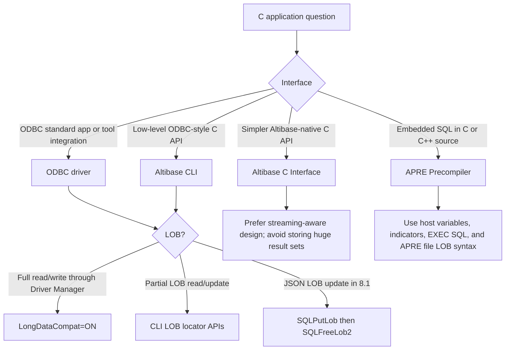
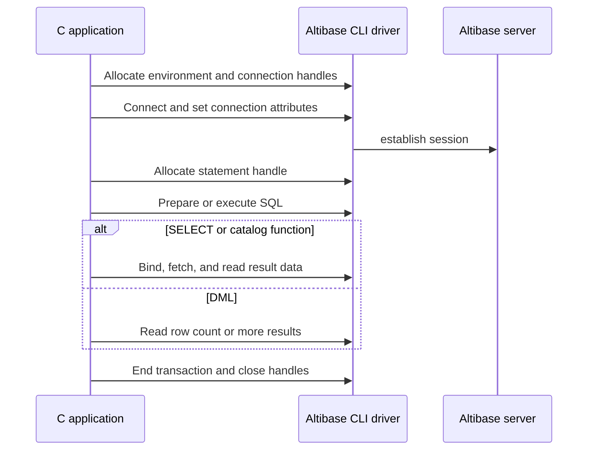
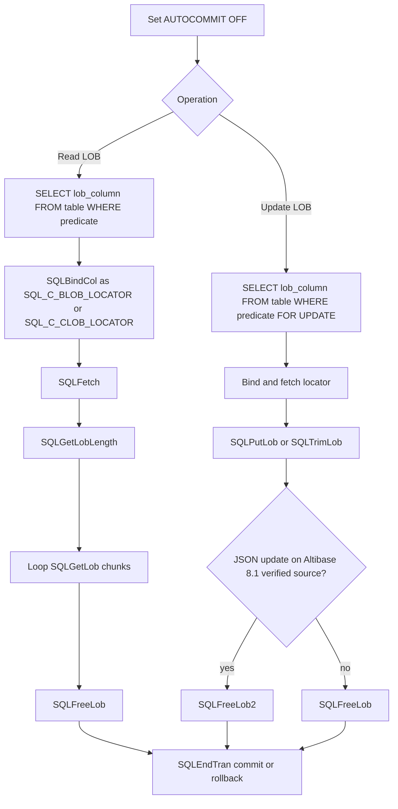
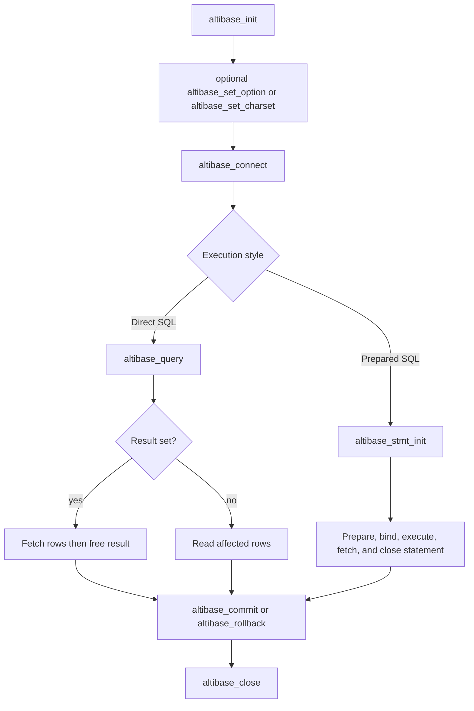
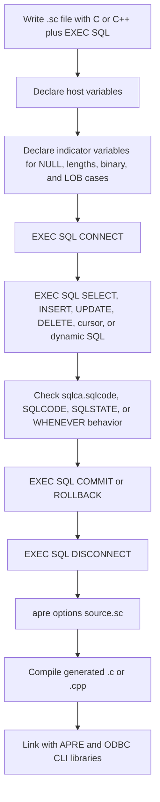

# 12. C, CLI, ODBC, Precompiler

## Applicable Versions

- 7.1: Based on Altibase 7.1 CLI, ODBC, Altibase C Interface, and Precompiler manuals.
- 7.3: Based on Altibase 7.3 CLI, ODBC, Altibase C Interface, and Precompiler manuals.
- 8.1: Based on Altibase 8.1 verified source CLI, ODBC, Altibase C Interface, and Precompiler manuals.

## Questions This File Can Answer

- Which C-facing interface should be used: CLI, ODBC, Altibase C Interface, or Precompiler?
- What is the basic API call order for connection, execution, fetch, transaction control, diagnostics, and cleanup?
- How should `SQLDriverConnect` and ODBC connection strings be written?
- Which ODBC functions are supported by the Altibase ODBC driver?
- How should `BLOB`, `CLOB`, LOB locators, file-based LOB I/O, and JSON-related LOB cleanup be handled?
- What are the core Altibase C Interface calls for direct SQL and prepared statements?
- How are APRE embedded SQL programs precompiled, connected, committed, and linked?

## Source Documents

- 7.1: Altibase 7.1 CLI User's Manual; ODBC User's Manual; Altibase C Interface Manual; Precompiler User's Manual.
- 7.3: Altibase 7.3 CLI User's Manual; ODBC User's Manual; Altibase C Interface Manual; Precompiler User's Manual.
- 8.1: Altibase 8.1 verified source CLI User's Manual; ODBC User's Manual; Altibase C Interface Manual; Precompiler User's Manual.

## Response Rules

- Answer explanatory text in the user's language.
- Keep SQL object names, C function names, ODBC constants, APRE keywords, error codes, property names, commands, and file paths literal.
- For 8.1-specific statements, say `Altibase 8.1 verified source`.
- Do not expose internal source labels, repository names, or workstation paths in customer answers.
- For production C client design, ask for Altibase version, client package version, OS, compiler, driver manager, `SQLLEN` size, connection method, character set, SSL/TLS requirement, failover requirement, autocommit mode, and expected LOB size.
- If the question is primarily SSL/TLS, use this attachment for ODBC/CLI connection keys and the SSL/TLS attachment for certificate and server setup.

## Fast Decision Map



## Interface Selection

Interface block: `Altibase CLI`

- Purpose: ODBC-style C API supplied by Altibase for handle allocation, connection, statement execution, result fetching, diagnostics, cursor control, array bind/fetch, and LOB locator operations.
- Use when: the application needs direct C access and can use ODBC-style handles and function calls.
- Core header/library: use the Altibase client development headers and client libraries that match the installed client package.
- Best fit: C applications that need fine-grained control over statements, attributes, cursors, diagnostics, and partial LOB operations.

Interface block: `ODBC`

- Purpose: standard ODBC application interface through the Altibase ODBC driver.
- Use when: the application is written for ODBC, uses an ODBC Driver Manager, or is a third-party tool that expects DSN or ODBC connection strings.
- Driver baseline: Altibase ODBC driver conforms to ODBC 3.51 specifications.
- Best fit: Windows ODBC applications, unixODBC or iODBC deployments, C# or other language runtimes using ODBC.

Interface block: `Altibase C Interface`

- Purpose: Altibase-native C API with `ALTIBASE` and `ALTIBASE_STMT` handles.
- Use when: the application wants a simpler Altibase-specific API rather than ODBC-style handles.
- Best fit: direct C applications that execute SQL strings or prepared statements and can use ACI result and bind structures.
- LOB caution: avoid `altibase_store_result()` and `altibase_stmt_store_result()` for very large result sets, LOB columns, or geometry data because they can consume excessive client memory.

Interface block: `Precompiler` / `APRE`

- Purpose: precompiles C or C++ source containing `EXEC SQL` embedded SQL into ordinary C or C++ source.
- Use when: the application style should be embedded SQL with host variables, indicator variables, `SQLCA`, and `WHENEVER`.
- Input extension: `.sc`.
- Output extension: `.c` by default or `.cpp` with `-t cpp`.
- Best fit: applications ported from embedded SQL or Oracle Pro*C-style code.

## Version Differences

Version block: 7.1

- CLI, ODBC, Altibase C Interface, and APRE flows use the same broad handle, execution, transaction, diagnostics, and cleanup model described in this attachment.
- CLI LOB locator APIs include `SQLBindFileToCol`, `SQLBindFileToParam`, `SQLGetLobLength`, `SQLGetLob`, `SQLPutLob`, `SQLTrimLob`, and `SQLFreeLob`.
- ODBC LOB access through an ODBC Driver Manager should use `LongDataCompat=ON` or `LongDataCompat=on` when `BLOB` or `CLOB` data must be exposed as standard long data types.
- Do not mention `SQLFreeLob2` for 7.1 unless the user is explicitly asking about an 8.1 verified-source behavior comparison.

Version block: 7.3

- 7.3 keeps the same CLI, ODBC, ACI, and APRE application flow as 7.1 for the topics in this attachment.
- CLI LOB locator APIs and `LongDataCompat` guidance remain the same for ordinary `BLOB` and `CLOB` handling.
- Do not mention `SQLFreeLob2` for 7.3 unless the user is explicitly asking about an 8.1 verified-source behavior comparison.

Version block: 8.1

- Use `Altibase 8.1 verified source` wording for 8.1-specific behavior.
- Ordinary `BLOB` and `CLOB` CLI LOB locator guidance remains aligned with 7.1 and 7.3.
- Altibase 8.1 verified source adds Empty LOB CLI interface support for LOB data with length 0 through `SQLEmptyLob()` and `SQLGetLobLength2()`.
- Do not apply older 7.1/7.3 zero-length LOB guidance to 8.1 Empty LOB behavior without checking the target 8.1 client package.
- Altibase 8.1 verified source adds JSON-related LOB cleanup guidance: when `SQLPutLob()` is used to update JSON data through a LOB locator, call `SQLFreeLob2(stmt, locator)` after the JSON update to release the JSON-related LOB locator resources.
- `SQLFreeLob2()` does not commit or roll back changes. Use transaction control such as `SQLEndTran()` separately.

## CLI API Flow



CLI flow checklist:

1. Allocate an environment handle with `SQLAllocHandle(SQL_HANDLE_ENV, SQL_NULL_HANDLE, &env)`.
2. Set environment attributes with `SQLSetEnvAttr()` if required.
3. Allocate a connection handle with `SQLAllocHandle(SQL_HANDLE_DBC, env, &dbc)`.
4. Connect with `SQLDriverConnect()` for a connection string or `SQLConnect()` for DSN, user, and password.
5. Set connection attributes with `SQLSetConnectAttr()`, especially `SQL_ATTR_AUTOCOMMIT` when transactions or LOB locators require non-autocommit mode.
6. Allocate a statement handle with `SQLAllocHandle(SQL_HANDLE_STMT, dbc, &stmt)` or legacy `SQLAllocStmt()`.
7. Use `SQLExecDirect()` for one-time statements, or `SQLPrepare()` plus `SQLBindParameter()` plus `SQLExecute()` for repeated or parameterized statements.
8. For result sets, call `SQLNumResultCols()`, `SQLDescribeCol()`, `SQLBindCol()`, `SQLFetch()` or `SQLFetchScroll()`, and `SQLGetData()` for long or unbound data.
9. For DML, call `SQLRowCount()`. If array execution or multiple results are involved, use `SQLMoreResults()`.
10. Commit or roll back non-autocommit work with `SQLEndTran()`.
11. Close cursors and free handles with `SQLCloseCursor()`, `SQLFreeStmt()`, `SQLFreeHandle()`, `SQLDisconnect()`, and the legacy free functions only when legacy style is used.

## CLI Function Blocks

CLI function block: `SQLAllocHandle`

- Category: environment, connection, and statement setup.
- Purpose: allocates environment, connection, statement, or descriptor handles.
- Preferred over: `SQLAllocEnv`, `SQLAllocConnect`, and `SQLAllocStmt`.
- Common order: environment handle first, connection handle second, statement handle after connection.

CLI function block: `SQLAllocEnv`

- Category: legacy environment setup.
- Purpose: allocates an environment handle.
- Guidance: use `SQLAllocHandle(SQL_HANDLE_ENV, ...)` in new code when possible.

CLI function block: `SQLAllocConnect`

- Category: legacy connection setup.
- Purpose: allocates a connection handle from an environment handle.
- Guidance: use `SQLAllocHandle(SQL_HANDLE_DBC, ...)` in new code when possible.

CLI function block: `SQLAllocStmt`

- Category: legacy statement setup.
- Purpose: allocates a statement handle and memory for statement processing.
- Guidance: use `SQLAllocHandle(SQL_HANDLE_STMT, ...)` in new code when possible.

CLI function block: `SQLDriverConnect`

- Category: connection.
- Purpose: connects using a connection string when more than DSN, user, and password are needed.
- Use for: host, port, connection type, privilege, character set, timeout, autocommit, `LongDataCompat`, and `DEFER_PREPARES`.
- Unicode variant: `SQLDriverConnectW()`.

CLI function block: `SQLConnect`

- Category: connection.
- Purpose: connects to a target database using DSN, user ID, and password.
- Use when: the DSN already contains all required connection details.

CLI function block: `SQLDisconnect`

- Category: connection cleanup.
- Purpose: closes the database connection.
- Caution: source manuals note that pending uncommitted transactions can be committed if the application explicitly calls disconnect after running in autocommit-off mode; design applications to call `SQLEndTran()` explicitly before disconnect.

CLI function block: `SQLEndTran`

- Category: transaction.
- Purpose: commits or rolls back a transaction for an environment or connection handle.
- Use with: `SQL_COMMIT` or `SQL_ROLLBACK`.
- Required for: non-autocommit transactions and LOB locator workflows.

CLI function block: `SQLTransact`

- Category: legacy transaction.
- Purpose: commits or rolls back database changes.
- Guidance: prefer `SQLEndTran()` in newer ODBC-style code.

CLI function block: `SQLSetConnectAttr`

- Category: connection attributes.
- Purpose: sets connection behavior.
- Important attributes: `SQL_ATTR_AUTOCOMMIT`, `SQL_ATTR_CONNECTION_TIMEOUT`, `SQL_ATTR_PORT`, `SQL_ATTR_TXN_ISOLATION`, `ALTIBASE_APP_INFO`, `ALTIBASE_DATE_FORMAT`, `ALTIBASE_CONN_ATTR_IPC_FILEPATH`, `ALTIBASE_SOCK_RCVBUF_BLOCK_RATIO`, `ALTIBASE_MESSAGE_CALLBACK`.

CLI function block: `SQLSetStmtAttr`

- Category: statement attributes.
- Purpose: controls cursor behavior, rowset size, array bind/fetch, prefetch, bookmarks, and Altibase-specific statement features.
- Important attributes: `SQL_ATTR_CURSOR_TYPE`, `SQL_ATTR_CURSOR_SCROLLABLE`, `SQL_ATTR_CURSOR_SENSITIVITY`, `SQL_ATTR_CONCURRENCY`, `SQL_ATTR_PARAM_BIND_TYPE`, `SQL_ATTR_PARAMSET_SIZE`, `SQL_ATTR_ROW_ARRAY_SIZE`, `SQL_ATTR_ROW_BIND_TYPE`, `SQL_ATTR_PREFETCH_ROWS`, `SQL_ATTR_CURSOR_HOLD`, `ALTIBASE_STMT_ATTR_ATOMIC_ARRAY`, `ALTIBASE_PREFETCH_ASYNC`, `ALTIBASE_PREFETCH_AUTO_TUNING`, `ALTIBASE_PREPARE_WITH_DESCRIBEPARAM`.

CLI function block: `SQLPrepare`

- Category: statement execution.
- Purpose: prepares a SQL statement for later execution.
- Use when: a statement runs repeatedly or uses parameter markers.
- With `DEFER_PREPARES=ON`: `SQLPrepare()` can return success before server-side prepare work is sent; calls that require prepare metadata force communication before `SQLExecute()`.

CLI function block: `SQLBindParameter`

- Category: parameter binding.
- Purpose: binds application variables to `?` parameter markers.
- For data-at-execution: use `SQL_DATA_AT_EXEC` or `SQL_LEN_DATA_AT_EXEC()` indicators with `SQLParamData()` and `SQLPutData()`.
- For LOB locator output: bind `SQL_C_BLOB_LOCATOR` or `SQL_C_CLOB_LOCATOR` with the matching SQL locator type when following locator-based LOB patterns.

CLI function block: `SQLExecute`

- Category: statement execution.
- Purpose: executes a prepared statement.
- After SELECT: fetch result rows.
- After INSERT, UPDATE, or DELETE: use `SQLRowCount()` or `SQLMoreResults()` as needed.

CLI function block: `SQLExecDirect`

- Category: statement execution.
- Purpose: directly executes a SQL statement without a separate prepare call.
- Best for: one-time SQL statements.

CLI function block: `SQLParamData`

- Category: data-at-execution.
- Purpose: coordinates parameter data supplied during statement execution.
- Use with: `SQLPutData()`.

CLI function block: `SQLPutData`

- Category: data-at-execution and long data.
- Purpose: supplies parameter data during execution.
- LOB note: standard long-data workflows can retrieve or update full LOB values, but partial LOB read/update requires the Altibase LOB locator APIs.

CLI function block: `SQLNumResultCols`

- Category: result metadata.
- Purpose: returns the number of columns in a result set.
- Use after: `SQLPrepare()`, `SQLExecDirect()`, or `SQLExecute()` when result metadata is needed.

CLI function block: `SQLDescribeCol`

- Category: result metadata.
- Purpose: returns column name, data type, precision, scale, and nullability.
- Use before: dynamic `SQLBindCol()` setup.

CLI function block: `SQLBindCol`

- Category: fetch.
- Purpose: binds result columns to application buffers.
- For LOB locators: bind `SQL_C_BLOB_LOCATOR` or `SQL_C_CLOB_LOCATOR`.
- For ordinary LOB buffers: use `SQL_C_BINARY` for `BLOB` and `SQL_C_CHAR` for `CLOB`.

CLI function block: `SQLFetch`

- Category: fetch.
- Purpose: fetches the next row or rowset.
- Use with: bound columns, file-bound LOB columns, or later `SQLGetData()` calls.

CLI function block: `SQLFetchScroll`

- Category: scrollable fetch.
- Purpose: fetches rows in a specified direction for scrollable cursors.
- Requires: compatible cursor attributes set before execution.

CLI function block: `SQLGetData`

- Category: fetch and long data.
- Purpose: retrieves data for a specified column and can be called repeatedly for variable-length data.
- Rules: call after one or more rows are fetched; retrieve unbound columns in ascending column order; small buffers can return `SQL_SUCCESS_WITH_INFO` and SQLSTATE `01004`.
- LOB note: useful for full or chunked read patterns through standard APIs, but locator APIs are needed for partial LOB update.

CLI function block: `SQLCloseCursor`

- Category: cursor cleanup.
- Purpose: closes the cursor and discards pending results.
- Use before: reusing a statement when all rows were not fetched.

CLI function block: `SQLRowCount`

- Category: DML result.
- Purpose: returns rows affected by INSERT, UPDATE, or DELETE.

CLI function block: `SQLMoreResults`

- Category: multiple results.
- Purpose: advances to the next result when an execution produces multiple results or array execution statuses.

CLI function block: `SQLFreeStmt`

- Category: statement cleanup.
- Purpose: closes, unbinds, resets, or drops statement resources depending on the option.
- `SQL_CLOSE`: closes the cursor; useful before re-executing a prepared SELECT if rows remain.
- `SQL_DROP`: releases the statement handle in legacy code.

CLI function block: `SQLFreeHandle`

- Category: handle cleanup.
- Purpose: releases environment, connection, statement, or descriptor handles.
- For `SQL_HANDLE_STMT`, releasing a statement handle discards suspended results.

CLI function block: `SQLGetDiagRec`

- Category: diagnostics.
- Purpose: retrieves SQLSTATE, native error code, and message text by diagnostic record number.
- Preferred for: detailed error and warning reporting.

CLI function block: `SQLGetDiagField`

- Category: diagnostics.
- Purpose: retrieves a single diagnostic field.

CLI function block: `SQLError`

- Category: legacy diagnostics.
- Purpose: checks diagnostic messages related to the most recent CLI function.
- Guidance: use `SQLGetDiagRec()` in newer code.

CLI function block: catalog and metadata functions

- `SQLTables`: table metadata.
- `SQLColumns`: column metadata.
- `SQLPrimaryKeys`: primary key metadata.
- `SQLForeignKeys`: foreign key metadata.
- `SQLProcedures`: stored procedure metadata.
- `SQLProcedureColumns`: stored procedure parameter and column metadata.
- `SQLStatistics`: index and statistics metadata.
- `SQLSpecialColumns`: special column metadata.
- `SQLTablePrivileges`: table privilege metadata.
- `SQLGetTypeInfo`: supported data type metadata.
- `SQLGetInfo`: driver and DBMS information.
- `SQLGetFunctions`: function support discovery.

## CLI Connection Strings

Connection string syntax:

```text
DSN=host_or_dsn;UID=user;PWD=password;CONNTYPE=1;NLS_USE=US7ASCII;PORT_NO=20300
```

Connection string example:

```text
DSN=127.0.0.1;UID=SYS;PWD=MANAGER;CONNTYPE=1;NLS_USE=US7ASCII;PORT_NO=20300;TIMEOUT=5;CONNECTION_TIMEOUT=10
```

Connection attribute block: `DSN`

- In CLI `SQLDriverConnect()`, `DSN` can be a host name, IPv4 address, IPv6 address, or configured DSN.
- IPv6 literal: enclose in square brackets, for example `[::1]`.

Connection attribute block: `UID`, `PWD`

- `UID`: database user ID.
- `PWD`: database password.

Connection attribute block: `CONNTYPE`

- `1`: TCP/IP.
- `2`: UNIX DOMAIN.
- `3`: IPC.
- If local connection methods are used, host and port options can be ignored depending on the connection mode.

Connection attribute block: `PRIVILEGE`

- Use `SYSDBA` only for administrative connections that require it.
- Remote `SYSDBA` access can be blocked by server configuration.
- IPC `SYSDBA` connection has administrative restrictions for shutdown commands.

Connection attribute block: `PORT_NO`

- Altibase server listener port.
- If omitted, the client can fall back to `ALTIBASE_PORT_NO` when that environment variable is set.

Connection attribute block: `NLS_USE`

- Client character set, for example `US7ASCII` or `KO16KSC5601`.
- If omitted, the client can fall back to `ALTIBASE_NLS_USE`.

Connection attribute block: `NLS_NCHAR_LITERAL_REPLACE`

- Controls NCHAR literal analysis.
- `0`: do not analyze.
- `1`: analyze NCHAR literals; can add parsing cost.

Connection attribute block: `TIMEOUT`

- Login or server connection wait time.
- Default in the CLI manual is 3 seconds.

Connection attribute block: `CONNECTION_TIMEOUT`

- Timeout for blocking that can occur in `select()` or `poll()` in unstable networks.

Connection attribute block: `DATE_FORMAT`

- Session date format for input/output.
- Default is `YYYY/MM/DD HH:MI:SS`.

Connection attribute block: `APP_INFO`

- Application identifier stored in session information.
- Can be checked through `CLIENT_APP_INFO` in session views.

Connection attribute block: `AUTOCOMMIT`

- Values: `ON` or `OFF`.
- Set `OFF` for LOB locator operations and explicit transaction control.

Connection attribute block: `LONGDATACOMPAT`

- Values: `YES`, `NO`, `ON`, or `OFF` depending on context.
- Use `ON` or `YES` when an ODBC Driver Manager or ODBC application must receive `BLOB` and `CLOB` as standard long data types.

Connection attribute block: `DEFER_PREPARES`

- Values: `ON` or `OFF`.
- Default: `OFF`.
- `ON` defers server communication for `SQLPrepare()` until `SQLExecute()` or until metadata is required by functions such as `SQLColAttribute`, `SQLDescribeCol`, `SQLDescribeParam`, `SQLNumParams`, and `SQLNumResultCols`.

Connection attribute block: `SOCK_RCVBUF_BLOCK_RATIO`

- Sets the socket receive buffer in 32 KB increments.
- Example: `2` means 64 KB.
- Can be limited by OS TCP receive buffer maximum settings.

## ODBC Driver Guide

ODBC positioning:

- The Altibase ODBC driver is built on Altibase CLI.
- For internal procedure details or function semantics, use the CLI guidance in this attachment.
- For portable ODBC applications, prefer standard ODBC functions and confirm support through `SQLGetFunctions()`.

ODBC installation notes:

- Unix-like 64-bit packages can include both 32-bit and 64-bit `SQLLEN` variants:
  - `libaltibase_odbc-64bit-ul32.so`: `SQLLEN` size is 32 bits.
  - `libaltibase_odbc-64bit-ul64.so`: `SQLLEN` size is 64 bits.
- 32-bit packages include `libaltibase_odbc.so`.
- With unixODBC, choose the Altibase ODBC driver variant that matches the `SQLLEN` size used by the Driver Manager.

ODBC DSN setup procedure:

1. Open the ODBC data source administrator or Driver Manager configuration tool.
2. Add a User DSN or System DSN.
3. Select the Altibase ODBC driver.
4. Enter the DSN name.
5. Enter host name or IP address.
6. Enter server port, commonly `20300` unless the server uses another `PORT_NO`.
7. Enter user, password, database name, and `NLS_USE`.
8. Use the connection test action if available.
9. Save the DSN and reference it from the application with `DSN=<name>`.

ODBC connection string syntax:

```text
DRIVER=ALTIBASE_HDB_ODBC_64bit;User=SYS;Password=<password>;Server=127.0.0.1;PORT=20300;NLS_USE=US7ASCII;LongDataCompat=OFF
```

ODBC LOB connection string:

```text
DSN=ALTIBASE;LongDataCompat=ON
```

```text
DRIVER=ALTIBASE_HDB_ODBC_64bit;User=SYS;Password=<password>;Server=127.0.0.1;PORT=20300;NLS_USE=US7ASCII;LongDataCompat=ON
```

ODBC connection attribute block: `DRIVER`

- ODBC driver name as registered in the ODBC Driver Manager.
- Example: `ALTIBASE_HDB_ODBC_64bit`.

ODBC connection attribute block: `User`, `Password`

- Database credentials.

ODBC connection attribute block: `Server`, `PORT`

- Altibase server host and listener port.

ODBC connection attribute block: `NLS_USE`

- Client character set.

ODBC connection attribute block: `LongDataCompat`

- Recommended value: `ON` when large `BLOB` or `CLOB` data is used through ODBC.
- Default: `OFF`.
- Effect: maps `SQL_BLOB` to `SQL_LONGVARBINARY` and `SQL_CLOB` to `SQL_LONGVARCHAR` before returning type information to ODBC applications.

ODBC BLOB procedural pattern:

1. Open the input file from an application-level path such as `<input-blob-file>`.
2. Read bytes into an application buffer.
3. Start an ODBC transaction, for example through the language runtime's ODBC transaction API.
4. Prepare `INSERT INTO T1 (C1, C2) VALUES (?, ?)`.
5. Bind integer and binary parameters.
6. Execute the statement.
7. Commit the transaction.
8. For SELECT, query `binary_length(C2), C2`, allocate a buffer with the returned length, read bytes through the ODBC API, and write to `<output-blob-file>`.

## ODBC Function Support Blocks

ODBC support status legend:

- `Supported`: Altibase ODBC supports the function.
- `Not supported`: Altibase ODBC does not support the function.
- `Future support planned`: the source conformance table marks future support.

ODBC function block: `SQLAllocHandle`

- Level: Core.
- Altibase ODBC support: Supported.

ODBC function block: `SQLBindCol`

- Level: Core.
- Altibase ODBC support: Supported.

ODBC function block: `SQLBindParameter`

- Level: Core.
- Altibase ODBC support: Supported.

ODBC function block: `SQLBrowseConnect`

- Level: Level 1.
- Altibase ODBC support: Not supported.
- Future support: Not supported.

ODBC function block: `SQLBulkOperations`

- Level: Level 1.
- Altibase ODBC support: Supported.

ODBC function block: `SQLCancel`

- Level: Core.
- Altibase ODBC support: Supported.

ODBC function block: `SQLCloseCursor`

- Level: Core.
- Altibase ODBC support: Supported.

ODBC function block: `SQLColAttribute`

- Level: Core.
- Altibase ODBC support: Supported.

ODBC function block: `SQLColumnPrivileges`

- Level: Level 2.
- Altibase ODBC support: Not supported.
- Future support: Not supported.
- Remark: column privileges are not supported by Altibase.

ODBC function block: `SQLColumns`

- Level: Core.
- Altibase ODBC support: Supported.

ODBC function block: `SQLConnect`

- Level: Core.
- Altibase ODBC support: Supported.

ODBC function block: `SQLCopyDesc`

- Level: Core.
- Altibase ODBC support: Not supported.
- Future support: Future support planned.

ODBC function block: `SQLDescribeCol`

- Level: Core.
- Altibase ODBC support: Supported.

ODBC function block: `SQLDescribeParam`

- Level: Level 2.
- Altibase ODBC support: Supported.
- Remark: not fully supported.

ODBC function block: `SQLDisconnect`

- Level: Core.
- Altibase ODBC support: Supported.

ODBC function block: `SQLDriverConnect`

- Level: Core.
- Altibase ODBC support: Supported.

ODBC function block: `SQLEndTran`

- Level: Core.
- Altibase ODBC support: Supported.

ODBC function block: `SQLExecDirect`

- Level: Core.
- Altibase ODBC support: Supported.

ODBC function block: `SQLExecute`

- Level: Core.
- Altibase ODBC support: Supported.

ODBC function block: `SQLFetch`

- Level: Core.
- Altibase ODBC support: Supported.

ODBC function block: `SQLFetchScroll`

- Level: Core.
- Altibase ODBC support: Supported.

ODBC function block: `SQLForeignKeys`

- Level: Level 2.
- Altibase ODBC support: Supported.

ODBC function block: `SQLFreeHandle`

- Level: Core.
- Altibase ODBC support: Supported.

ODBC function block: `SQLFreeStmt`

- Level: Core.
- Altibase ODBC support: Supported.

ODBC function block: `SQLGetConnectAttr`

- Level: Core.
- Altibase ODBC support: Supported.

ODBC function block: `SQLGetCursorName`

- Level: Core.
- Altibase ODBC support: Supported.

ODBC function block: `SQLGetData`

- Level: Core.
- Altibase ODBC support: Supported.

ODBC function block: `SQLGetDescField`

- Level: Core.
- Altibase ODBC support: Supported.
- Remark: ODBC 3.0.

ODBC function block: `SQLGetDescRec`

- Level: Core.
- Altibase ODBC support: Supported.
- Remark: ODBC 3.0.

ODBC function block: `SQLGetDiagField`

- Level: Core.
- Altibase ODBC support: Supported.
- Remark: ODBC 3.0.

ODBC function block: `SQLGetDiagRec`

- Level: Core.
- Altibase ODBC support: Supported.
- Remark: ODBC 3.0.

ODBC function block: `SQLGetEnvAttr`

- Level: Core.
- Altibase ODBC support: Supported.

ODBC function block: `SQLGetFunctions`

- Level: Core.
- Altibase ODBC support: Supported.

ODBC function block: `SQLGetInfo`

- Level: Core.
- Altibase ODBC support: Supported.

ODBC function block: `SQLGetStmtAttr`

- Level: Core.
- Altibase ODBC support: Supported.

ODBC function block: `SQLGetTypeInfo`

- Level: Core.
- Altibase ODBC support: Supported.

ODBC function block: `SQLMoreResults`

- Level: Level 1.
- Altibase ODBC support: Supported.

ODBC function block: `SQLNativeSql`

- Level: Core.
- Altibase ODBC support: Supported.

ODBC function block: `SQLNumParams`

- Level: Core.
- Altibase ODBC support: Supported.

ODBC function block: `SQLNumResultCols`

- Level: Core.
- Altibase ODBC support: Supported.

ODBC function block: `SQLParamData`

- Level: Core.
- Altibase ODBC support: Supported.

ODBC function block: `SQLPrepare`

- Level: Core.
- Altibase ODBC support: Supported.

ODBC function block: `SQLPrimaryKeys`

- Level: Level 1.
- Altibase ODBC support: Supported.

ODBC function block: `SQLProcedureColumns`

- Level: Level 1.
- Altibase ODBC support: Supported.

ODBC function block: `SQLProcedures`

- Level: Level 1.
- Altibase ODBC support: Supported.

ODBC function block: `SQLPutData`

- Level: Core.
- Altibase ODBC support: Supported.

ODBC function block: `SQLRowCount`

- Level: Core.
- Altibase ODBC support: Supported.

ODBC function block: `SQLSetConnectAttr`

- Level: Core.
- Altibase ODBC support: Supported.

ODBC function block: `SQLSetCursorName`

- Level: Core.
- Altibase ODBC support: Supported.

ODBC function block: `SQLSetDescField`

- Level: Core.
- Altibase ODBC support: Supported.
- Remark: ODBC 3.0.

ODBC function block: `SQLSetDescRec`

- Level: Core.
- Altibase ODBC support: Supported.
- Remark: ODBC 3.0.

ODBC function block: `SQLSetEnvAttr`

- Level: Core.
- Altibase ODBC support: Supported.

ODBC function block: `SQLSetPos`

- Level: Level 1.
- Altibase ODBC support: Supported.

ODBC function block: `SQLSetStmtAttr`

- Level: Core.
- Altibase ODBC support: Supported.

ODBC function block: `SQLSpecialColumns`

- Level: Core.
- Altibase ODBC support: Supported.

ODBC function block: `SQLStatistics`

- Level: Core.
- Altibase ODBC support: Supported.

ODBC function block: `SQLTablePrivileges`

- Level: Level 2.
- Altibase ODBC support: Supported.

ODBC function block: `SQLTables`

- Level: Core.
- Altibase ODBC support: Supported.

## LOB Guidance for CLI and ODBC

LOB SQL type block: `SQL_BLOB`

- Altibase data type: `BLOB`.
- Meaning: variable-length binary data.
- Bind ordinary application buffers as `SQL_C_BINARY`.
- Bind a LOB locator as `SQL_C_BLOB_LOCATOR`.

LOB SQL type block: `SQL_CLOB`

- Altibase data type: `CLOB`.
- Meaning: variable-length character data.
- Bind ordinary application buffers as `SQL_C_CHAR`.
- Bind a LOB locator as `SQL_C_CLOB_LOCATOR`.

LOB locator C type block: `SQL_C_BLOB_LOCATOR`

- ODBC C type: `SQLUBIGINT`.
- Meaning: a 64-bit locator handle for a `BLOB`.
- Lifetime: valid only in the transaction that created or fetched it.

LOB locator C type block: `SQL_C_CLOB_LOCATOR`

- ODBC C type: `SQLUBIGINT`.
- Meaning: a 64-bit locator handle for a `CLOB`.
- Lifetime: valid only in the transaction that created or fetched it.

LOB locator rules:

- There is no ordinary user-variable type named `SQL_C_BLOB` or `SQL_C_CLOB`.
- Use `SQL_C_BINARY` for `BLOB` data buffers.
- Use `SQL_C_CHAR` for `CLOB` data buffers.
- Use `SQL_C_BLOB_LOCATOR` or `SQL_C_CLOB_LOCATOR` only when obtaining and operating on a LOB locator.
- A LOB locator refers to LOB data at a transaction point and is bound to the transaction that created it.
- Use non-autocommit mode for LOB locator operations.
- For read locators, select the LOB column and bind or retrieve the locator.
- For write locators, use a writable locator pattern such as `SELECT lob_column FROM table_name WHERE ... FOR UPDATE` or a LOB locator output parameter pattern.
- A locator becomes invalid after transaction end.

LOB operation flow:



LOB API block: `SQLBindFileToCol`

- Type: Altibase-specific, non-standard CLI LOB function.
- Purpose: binds a file name buffer to a result column so `SQLFetch()` writes `BLOB` or `CLOB` data to a file.
- File options: `SQL_FILE_CREATE`, `SQL_FILE_OVERWRITE`, `SQL_FILE_APPEND`.
- Use for: full LOB retrieve to file.
- Not for: partial LOB update.

LOB API block: `SQLBindFileToParam`

- Type: Altibase-specific, non-standard CLI LOB function.
- Purpose: binds a file to a LOB parameter marker so `SQLExecute()` or `SQLExecDirect()` reads data from the file into the database.
- LOB SQL types: `SQL_BLOB`, `SQL_CLOB`.
- File option: `SQL_FILE_READ`.
- Use for: full LOB insert or full LOB update from file.

LOB API block: `SQLGetLobLength`

- Type: Altibase-specific, non-standard CLI LOB function.
- Purpose: gets the length of the LOB pointed to by a current transaction's LOB locator.
- Input locator types: `SQL_C_BLOB_LOCATOR`, `SQL_C_CLOB_LOCATOR`.
- NULL LOB behavior: returns `SQL_NULL_DATA` through the length buffer rather than treating NULL as an error.
- Invalid locator behavior: returns `SQL_ERROR` and does not change the output length buffer.

LOB API block: `SQLGetLob`

- Type: Altibase-specific, non-standard CLI LOB function.
- Purpose: reads part of a LOB through a locator into an application buffer.
- Read buffer types: `SQL_C_BINARY` for `BLOB`, `SQL_C_CHAR` for `CLOB`.
- `fromPosition`: byte-based start point for reading. `SQLGetLob()` `fromPosition` is documented as 1-based. If a source sample initializes a first full-read loop with offset `0`, treat that as a sample-specific convention and test against the target client patch before generating partial-read code.
- `forLength`: byte length requested.
- Truncation: if returned data is larger than `bufferSize`, returns `SQL_SUCCESS_WITH_INFO` with SQLSTATE `01004` and truncates to the buffer size.

LOB API block: `SQLPutLob`

- Type: Altibase-specific, non-standard CLI LOB function.
- Purpose: inserts, overwrites, appends, or updates LOB data through a locator.
- Source buffer types: `SQL_C_BINARY` for `BLOB`, `SQL_C_CHAR` for `CLOB`.
- `forLength`: present in the function signature, but documented as not used in the source argument table.
- `valueLength`: must be greater than 0; `SQL_NULL_DATA` is not accepted.
- Position rule: `SQLPutLob()` `fromPosition` is documented as 1-based for partial writes. Do not pass a position greater than the current target LOB length. If a source sample uses `fromPosition=0` for new or whole-value locator patterns, label it as a sample-specific full-value convention rather than the generic partial-write rule.
- Transaction rule: use non-autocommit mode and commit or roll back explicitly after the LOB operation.

LOB API block: `SQLTrimLob`

- Type: Altibase-specific, non-standard CLI LOB function.
- Purpose: deletes the portion of the LOB after a specified byte position.
- `fromPosition`: byte position at which to start deleting; source manual defines it as starting at 0.
- Invalid locator behavior: returns `SQL_ERROR`.

LOB API block: `SQLFreeLob`

- Type: Altibase-specific, non-standard CLI LOB function.
- Purpose: releases server resources related to a LOB locator opened in the current transaction.
- Does not: commit or roll back LOB changes.
- Transaction end: `SQLEndTran()` automatically releases locators, but explicit `SQLFreeLob()` is the clean resource-release pattern for ordinary `BLOB` and `CLOB` locator work.

LOB API block: `SQLEmptyLob()`

- Version: Altibase 8.1 verified source.
- Type: Empty LOB interface function.
- Purpose: supports Empty LOB handling for LOB data with length 0.
- Use when: an 8.1 CLI application must preserve Empty LOB behavior instead of treating zero-length LOB values as older 7.1/7.3 NULL-like guidance.
- Scope note: check the exact 8.1 client headers or manual for the function signature before generating compile-ready C code.

LOB API block: `SQLGetLobLength2()`

- Version: Altibase 8.1 verified source.
- Type: Empty LOB length interface function.
- Purpose: supports 8.1 Empty LOB length handling for LOB data with length 0.
- Use when: an 8.1 CLI application must distinguish Empty LOB handling from older `SQLGetLobLength` guidance.
- Scope note: older 7.1/7.3 zero-length LOB guidance should not be assumed for 8.1 Empty LOB behavior.

LOB API block: `SQLFreeLob2`

- Version: Altibase 8.1 verified source.
- Type: JSON-related LOB locator cleanup function.
- Purpose: releases resources related to a LOB locator for JSON data.
- Use when: `SQLPutLob()` was used to update JSON data.
- Required guidance: after updating JSON data with `SQLPutLob()`, call `SQLFreeLob2(stmt, locator)`.
- Does not: commit or roll back changes. Use `SQLEndTran()` for transaction completion.
- Do not apply to: 7.1 or 7.3 ordinary `BLOB` and `CLOB` answers unless explicitly comparing versions.

LOB full-read pattern:

```text
SQLSetConnectAttr(dbc, SQL_ATTR_AUTOCOMMIT, SQL_AUTOCOMMIT_OFF, 0)
SQLExecDirect(stmt, "SELECT clob_col FROM t WHERE id = ?", SQL_NTS)
SQLBindCol(stmt, 1, SQL_C_CLOB_LOCATOR, &lobLoc, 0, NULL)
SQLFetch(stmt)
SQLGetLobLength(stmt, lobLoc, SQL_C_CLOB_LOCATOR, &lobLength)
repeat SQLGetLob(stmt, SQL_C_CLOB_LOCATOR, lobLoc, offset, chunkLength, SQL_C_CHAR, buffer, bufferSize, &readLength)
SQLFreeLob(stmt, lobLoc)
SQLEndTran(SQL_HANDLE_DBC, dbc, SQL_COMMIT or SQL_ROLLBACK)
```

LOB update pattern:

```text
SQLSetConnectAttr(dbc, SQL_ATTR_AUTOCOMMIT, SQL_AUTOCOMMIT_OFF, 0)
SQLExecDirect(stmt, "SELECT clob_col FROM t WHERE id = ? FOR UPDATE", SQL_NTS)
SQLBindCol(stmt, 1, SQL_C_CLOB_LOCATOR, &lobLoc, 0, NULL)
SQLFetch(stmt)
SQLPutLob(stmt, SQL_C_CLOB_LOCATOR, lobLoc, position, reservedForLength, SQL_C_CHAR, buffer, bufferLength)
SQLFreeLob(stmt, lobLoc)
SQLEndTran(SQL_HANDLE_DBC, dbc, SQL_COMMIT or SQL_ROLLBACK)
```

JSON LOB update pattern for Altibase 8.1 verified source:

```text
SQLSetConnectAttr(dbc, SQL_ATTR_AUTOCOMMIT, SQL_AUTOCOMMIT_OFF, 0)
obtain JSON LOB locator
SQLPutLob(stmt, locatorCType, locator, position, reservedForLength, sourceCType, buffer, bufferLength)
SQLFreeLob2(stmt, locator)
SQLEndTran(SQL_HANDLE_DBC, dbc, SQL_COMMIT or SQL_ROLLBACK)
```

Empty LOB interface note for Altibase 8.1 verified source:

- For LOB data with length 0, use 8.1 Empty LOB guidance and preserve the interface literals `SQLEmptyLob()` and `SQLGetLobLength2()`.
- Do not answer 8.1 Empty LOB questions by reusing older 7.1/7.3 zero-length LOB guidance unless the target client package explicitly documents the same behavior.

ODBC Driver Manager LOB compatibility:

- If an application uses an ODBC Driver Manager and cannot recognize `SQL_BLOB` or `SQL_CLOB`, configure `LongDataCompat=ON` or `LongDataCompat=on`.
- With this setting, `SQL_BLOB` is exposed as `SQL_LONGVARBINARY` and `SQL_CLOB` is exposed as `SQL_LONGVARCHAR`.
- Use standard ODBC long-data calls for full LOB read/write. Use CLI LOB locator APIs for partial LOB read/update.

## Data Type Conversion Blocks

Conversion legend:

- Default conversion: the source matrix marks this with `#`.
- Supported conversion: the source matrix marks this with `O`.
- Unsupported conversion: not listed as supported by the matrix.
- Best practice: use default conversions when possible and use `SQLGetTypeInfo()`, `SQLDescribeCol()`, or `SQLDescribeParam()` for dynamic code.

SQL type block: character data

- SQL types: `SQL_CHAR`, `SQL_VARCHAR`.
- Altibase types: `CHAR(n)`, `VARCHAR(n)`.
- Default C target: `SQL_C_CHAR`.
- Other supported C targets include small integer-style conversions and `SQL_C_BINARY` where the conversion matrix allows them.

SQL type block: national character data

- SQL types: `SQL_WCHAR`, `SQL_WVARCHAR`.
- Altibase types: `NCHAR(n)`, `NVARCHAR(n)`.
- Default C target: `SQL_C_WCHAR`.
- Other supported C targets include small integer-style conversions and `SQL_C_BINARY` where the conversion matrix allows them.

SQL type block: exact numeric data

- SQL types: `SQL_DECIMAL`, `SQL_NUMERIC`.
- Altibase types: `DECIMAL(p,s)`, `NUMERIC(p,s)`.
- Default C targets: `SQL_C_CHAR` and `SQL_C_FLOAT` are marked default in the source matrix; choose a target that preserves precision for the application.
- Supported C targets include integer, floating, double, binary, and character targets.
- `SQL_C_BINARY` for numeric data maps through `SQL_NUMERIC_STRUCT`.

SQL type block: integer data

- SQL types: `SQL_SMALLINT`, `SQL_INTEGER`, `SQL_BIGINT`.
- Default C targets: `SQL_C_SSHORT`, `SQL_C_SLONG`, `SQL_C_SBIGINT` respectively.
- Supported C targets include compatible signed and unsigned integer targets, floating targets, double, binary, and character targets.

SQL type block: approximate numeric data

- SQL types: `SQL_REAL`, `SQL_FLOAT`, `SQL_DOUBLE`.
- Default C targets: `SQL_C_FLOAT` for `SQL_REAL` and `SQL_FLOAT`; `SQL_C_DOUBLE` for `SQL_DOUBLE`.
- Supported C targets include compatible numeric and character targets.

SQL type block: binary data

- SQL type: `SQL_BINARY`.
- Default C target: `SQL_C_BINARY`.
- Supported C target: `SQL_C_CHAR`.

SQL type block: date and time data

- SQL types: `SQL_TYPE_DATE`, `SQL_TYPE_TIME`, `SQL_TYPE_TIMESTAMP`.
- Altibase type: `DATE` can represent date, time, and timestamp fields.
- Default C targets: `SQL_C_TYPE_DATE`, `SQL_C_TYPE_TIME`, and `SQL_C_TYPE_TIMESTAMP` respectively.
- Supported C targets include `SQL_C_CHAR`, `SQL_C_BINARY`, and cross-conversion among date/time/timestamp structures where the matrix allows it.

SQL type block: interval data

- SQL type: `SQL_INTERVAL`.
- Meaning: result type of date arithmetic.
- Default C target: `SQL_C_DOUBLE`.
- Supported C targets include `SQL_C_CHAR`, `SQL_C_FLOAT`, and `SQL_C_BINARY`.

SQL type block: `SQL_BYTES`

- Altibase type: `BYTE(n)`.
- Default C target: `SQL_C_BYTES`.
- Supported C targets: `SQL_C_CHAR`, `SQL_C_BINARY`.

SQL type block: `SQL_NIBBLE`

- Altibase type: `NIBBLE(n)`.
- Default C target: `SQL_C_NIBBLE`.
- Supported C targets: `SQL_C_CHAR`, `SQL_C_BINARY`.

SQL type block: `SQL_GEOMETRY`

- Altibase type: `GEOMETRY`.
- Default C target: `SQL_C_BINARY`.
- For full spatial API guidance, use the spatial attachment.

C type block: `SQL_C_CHAR`

- Default SQL targets: `SQL_CHAR`, `SQL_VARCHAR`, `SQL_DECIMAL`, `SQL_NUMERIC`.
- Supported SQL targets include numeric, binary, date, bytes, and nibble targets where conversion is allowed.

C type block: `SQL_C_WCHAR`

- Default SQL targets: `SQL_WCHAR`, `SQL_WVARCHAR`.

C type block: integer C types

- C types: `SQL_C_BIT`, `SQL_C_STINYINT`, `SQL_C_UTINYINT`, `SQL_C_SSHORT`, `SQL_C_USHORT`, `SQL_C_SLONG`, `SQL_C_ULONG`, `SQL_C_SBIGINT`, `SQL_C_UBIGINT`.
- Supported SQL targets include character, national character, exact numeric, and compatible integer or approximate numeric targets.
- Default SQL target follows the closest signed C type where the matrix marks one, for example `SQL_C_SSHORT` to `SQL_SMALLINT`, `SQL_C_SLONG` to `SQL_INTEGER`, and `SQL_C_SBIGINT` to `SQL_BIGINT`.

C type block: floating C types

- C types: `SQL_C_FLOAT`, `SQL_C_DOUBLE`.
- Default SQL targets: `SQL_REAL` for `SQL_C_FLOAT`; `SQL_FLOAT` and `SQL_DOUBLE` are default targets for `SQL_C_DOUBLE` in the source matrix.
- Supported SQL targets include character, national character, exact numeric, and compatible approximate numeric targets.

C type block: `SQL_C_BINARY`

- Default SQL target: `SQL_BINARY`.
- Supported SQL targets include character, national character, and `SQL_GEOMETRY`.
- For `BLOB` buffers, bind with SQL type `SQL_BLOB` when using `SQLBindParameter()`.

C type block: date and timestamp C structs

- C types: `SQL_C_TYPE_DATE`, `SQL_C_TYPE_TIME`, `SQL_C_TYPE_TIMESTAMP`.
- Altibase SQL date/time storage maps through the Altibase `DATE` family as represented by ODBC date/time/timestamp identifiers.
- Use matching struct targets to avoid unnecessary conversion.

C type block: `SQL_C_BYTES`

- Default SQL target: `SQL_BYTES`.

C type block: `SQL_C_NIBBLE`

- Default SQL target: `SQL_NIBBLE`.

## Cursor and Fetch Guidance

Cursor block: cursor types

- `SQL_CURSOR_FORWARD_ONLY`: fetches only forward.
- `SQL_CURSOR_STATIC`: scrollable, read-only view of the result set as opened.
- `SQL_CURSOR_KEYSET_DRIVEN`: fixed membership and order; non-key column changes can be visible.
- Dynamic cursors are not supported.

Cursor block: cursor behavior attributes

- `SQL_ATTR_CURSOR_TYPE`: selects cursor type.
- `SQL_ATTR_CURSOR_SCROLLABLE`: controls scrollability.
- `SQL_ATTR_CURSOR_SENSITIVITY`: controls whether changes are visible.
- `SQL_ATTR_CONCURRENCY`: controls read-only or row-version concurrency.

Cursor block: rowset fetch

- `SQL_ATTR_ROW_ARRAY_SIZE`: number of rows returned per `SQLFetch()` or `SQLFetchScroll()`.
- `SQL_ATTR_ROW_BIND_TYPE`: column-wise or row-wise binding.
- `SQL_ATTR_ROW_STATUS_PTR`: row status array.
- `SQL_ATTR_ROWS_FETCHED_PTR`: fetched-row count.

Cursor block: restrictions

- For CLI driver cursors, the SELECT statement is restricted: only one table in `FROM`, and column names must be specified in `ORDER BY`.
- For positioned updates, only regular tables are allowed; the select list must contain pure columns, not expressions or functions.

## Diagnostics and Common SQLSTATE Values

Diagnostic block: return values

- `SQL_SUCCESS`: function completed successfully.
- `SQL_SUCCESS_WITH_INFO`: function completed with warning or additional information.
- `SQL_NO_DATA`: no related data is available.
- `SQL_ERROR`: function failed.
- `SQL_INVALID_HANDLE`: invalid handle.

Diagnostic block: `SQLGetDiagRec`

- Loop from record number `1` until `SQL_NO_DATA`.
- Capture SQLSTATE, native error, message text, and message length.
- Use the handle type that matches the failing call: `SQL_HANDLE_ENV`, `SQL_HANDLE_DBC`, or `SQL_HANDLE_STMT`.

SQLSTATE block: `01004`

- Meaning: data truncation.
- Common functions: `SQLDescribeCol`, `SQLFetch`, `SQLGetData`, and LOB chunk reads with a small buffer.

SQLSTATE block: `07006`

- Meaning: restricted data type attribute violation.
- Common functions: `SQLBindParameter`, `SQLExecute`, `SQLFetch`.

SQLSTATE block: `07009`

- Meaning: invalid descriptor index.
- Common functions: `SQLBindCol`, `SQLBindParameter`, `SQLColAttribute`, `SQLDescribeCol`, `SQLDescribeParam`, `SQLGetData`.

SQLSTATE block: `08001`

- Meaning: unable to establish connection.
- Common functions: `SQLConnect`, `SQLDriverConnect`.

SQLSTATE block: `08002`

- Meaning: connection already in use.
- Common functions: `SQLConnect`, `SQLDriverConnect`.

SQLSTATE block: `08003`

- Meaning: connection is not open or statement is disconnected.
- Common functions: `SQLExecDirect`, `SQLExecute`, `SQLPrepare`.

SQLSTATE block: `08S01`

- Meaning: communication channel error.
- Common functions: connection, execution, fetch, catalog, and attribute calls.

SQLSTATE block: `HY000`

- Meaning: general error.
- Can appear in many CLI and ODBC functions.

SQLSTATE block: `HY001`

- Meaning: memory allocation error.

SQLSTATE block: `HY003`

- Meaning: invalid application buffer type.
- Common functions: `SQLBindCol`, `SQLBindParameter`.

SQLSTATE block: `HY009`

- Meaning: invalid null pointer argument.

SQLSTATE block: `HY010`

- Meaning: function sequence error.
- Common functions: `SQLAllocStmt`, `SQLDescribeParam`, `SQLGetData`.

SQLSTATE block: `HY090`

- Meaning: invalid string or buffer length.

SQLSTATE block: `HYC00`

- Meaning: unsupported attribute or feature.

## Altibase C Interface Flow



ACI call order details:

1. Optional `altibase_set_option()` or `altibase_set_charset()` calls belong between `altibase_init()` and `altibase_connect()`.
2. Direct SQL with a result set uses `altibase_use_result()` or `altibase_store_result()`, then `altibase_fetch_row()` and `altibase_fetch_lengths()`, then `altibase_free_result()`.
3. Direct SQL without a result set uses `altibase_affected_rows()`.
4. Prepared SQL uses `altibase_stmt_prepare()`, `altibase_stmt_bind_param()`, `altibase_stmt_execute()`, `altibase_stmt_bind_result()` and `altibase_stmt_fetch()`, then `altibase_stmt_free_result()` and `altibase_stmt_close()`.
5. Finish transaction work with `altibase_commit()` or `altibase_rollback()` before `altibase_close()`.

ACI handle block: `ALTIBASE`

- Connection handle.
- Initialize with `altibase_init()`.
- Release with `altibase_close()`.
- Used for connection, direct SQL, transaction control, diagnostics, and option calls.

ACI handle block: `ALTIBASE_STMT`

- Prepared statement handle.
- Allocate with `altibase_stmt_init()`.
- Close with `altibase_stmt_close()`.
- Maximum statement handles per connection follows the same broad client-side limit described for C-facing statement handles.

ACI function block: `altibase_init`

- Purpose: creates and initializes an `ALTIBASE` connection handle.
- Return: connection handle or `NULL`.

ACI function block: `altibase_connect`

- Purpose: establishes a connection using a null-terminated connection string.
- Connection string uses attributes such as `DSN`, `PORT_NO`, `UID`, `PWD`, `CONNTYPE`, and `NLS_USE`.

ACI function block: `altibase_set_option`

- Purpose: sets options such as `ALTIBASE_APP_INFO` before or during connection setup as supported by the option.

ACI function block: `altibase_set_charset`

- Purpose: sets client character set for the current connection.
- Must be set before connecting.
- Priority: `altibase_set_charset()` first, connection string second, environment variable third.

ACI function block: `altibase_set_autocommit`

- Purpose: sets autocommit mode.
- Values: `ALTIBASE_AUTOCOMMIT_ON`, `ALTIBASE_AUTOCOMMIT_OFF`.
- Default: autocommit enabled.

ACI function block: `altibase_query`

- Purpose: executes a single SQL statement string.
- Multiple statements separated by semicolons are not enabled.

ACI function block: `altibase_use_result`

- Purpose: retrieves a result set row by row without first storing the entire result on the client.
- Use for: large result sets where full client buffering is undesirable.
- Requires: `altibase_free_result()` before another result-producing function is used.

ACI function block: `altibase_store_result`

- Purpose: reads the full result into a client-side result structure.
- Caution: can use excessive memory for large results, LOB columns, or geometry data.
- Use only when: the result set is small enough to buffer.

ACI function block: `altibase_fetch_row`

- Purpose: fetches the next row from an ACI result set.
- Caution: row values include length-sensitive data; use `altibase_fetch_lengths()`.

ACI function block: `altibase_fetch_lengths`

- Purpose: returns lengths of values in the current row.
- Required for: binary and length-sensitive data.

ACI function block: `altibase_free_result`

- Purpose: frees the current result set handle.
- Required before: obtaining another result set from the same connection flow.

ACI function block: `altibase_commit`

- Purpose: commits the current transaction.

ACI function block: `altibase_rollback`

- Purpose: rolls back the current transaction.

ACI function block: `altibase_close`

- Purpose: closes a connection and releases resources.
- Also aborts and releases associated statement handles.
- If a result set handle exists, call `altibase_free_result()` before `altibase_close()`.

ACI prepared statement block:

- `altibase_stmt_init`: creates an `ALTIBASE_STMT`.
- `altibase_stmt_prepare`: prepares SQL with `?` markers.
- `altibase_stmt_set_array_bind`: sets array bind size after prepare and before parameter binding.
- `altibase_stmt_bind_param`: binds input data for parameter markers.
- `altibase_stmt_execute`: executes the prepared statement; can return `ALTIBASE_NEED_DATA`.
- `altibase_stmt_affected_rows`: returns affected rows after DML.
- `altibase_stmt_bind_result`: binds output columns.
- `altibase_stmt_fetch`: fetches rows into bound output buffers.
- `altibase_stmt_fetch_column`: fetches one column from the current row.
- `altibase_stmt_free_result`: releases prepared statement result resources.
- `altibase_stmt_close`: closes the prepared statement.

ACI diagnostics block:

- Connection diagnostics: `altibase_errno()`, `altibase_error()`, `altibase_sqlstate()`.
- Statement diagnostics: `altibase_stmt_errno()`, `altibase_stmt_error()`, `altibase_stmt_sqlstate()`.
- SQLSTATE values follow X/Open SQL CAE style.

ACI LOB caution block:

- For large LOB or geometry result sets, prefer `altibase_use_result()` over `altibase_store_result()`.
- Avoid `altibase_stmt_store_result()` when LOB columns or a large number of rows can make client memory usage excessive.
- If the requirement is partial LOB read/update through locators, prefer the CLI LOB locator APIs in this attachment.
- `altibase_stmt_send_long_data()` is documented as not currently supported in the source manual; do not recommend it as a working streaming-Lob API.

## Precompiler APRE Flow



APRE concept block:

- `APRE` accepts C or C++ source containing embedded SQL.
- Input file extension: `.sc`.
- Output file extension: `.c` by default, `.cpp` with `-t cpp`.
- Embedded SQL is translated into runtime library calls that ordinary C or C++ compilers can compile.

APRE command syntax:

```sh
apre [<apre-options>] <filename>
```

APRE command examples:

```sh
apre sample1.sc
apre sample1.sc sample2.sc
apre *.sc
apre -t cpp sample1.sc
apre -I. -I/include sample1.sc
apre -parse none -t cpp sample1.sc
```

APRE option block: `-h`

- Displays help and does not precompile.

APRE option block: `-t <c|cpp>`

- Selects generated file extension.
- `c`: output `.c`.
- `cpp`: output `.cpp`.

APRE option block: `-o <output_path>`

- Sets the output directory for generated files.
- Only one output path can be specified for a precompile invocation.

APRE option block: `-mt`

- Required when precompiling a multithreaded application unless the source uses `EXEC SQL OPTION(THREADS=TRUE);`.
- If multiple source files build one executable, apply multithreaded precompile handling consistently.

APRE option block: `-I<include_path>`

- Adds include search paths for APRE.
- Can be specified multiple times.

APRE option block: `-parse <none|partial|full>`

- `none`: process macro commands and host variables only inside `EXEC SQL BEGIN DECLARE SECTION` and `EXEC SQL END DECLARE SECTION`; process embedded SQL statements.
- `partial`: default; process all macro commands, but host variables only from declare sections; header file macros are processed but header host variables are not.
- `full`: internal C parser processes all host variables and macro commands; avoid for C++ source because C++ code can cause precompile errors.

APRE option block: `-D<define_name>`

- Defines a preprocessor symbol during precompile.

APRE option block: `-v`

- Prints APRE version.

APRE option block: `-n`

- Specify when `CHAR` variables are not null-padded.

APRE option block: `-unsafe_null`

- Suppresses errors when NULL values are fetched without indicator variables.
- Use cautiously; proper indicator variables are normally safer.

APRE option block: `-nchar_var <variable_name_list>`

- Processes specified variables using the Altibase national character set.
- Do not include blanks between variable names.
- Variables inside structures cannot be specified.

APRE build block:

- Required header: `ulpLibInterface.h`.
- Include option for generated code compilation: `-I $ALTIBASE_HOME/include`.
- Required libraries: `libapre.a` and `libodbccli.a` on Unix-like systems, or `apre.lib` and `odbccli.lib` on Windows.
- Typical link options include `-L $ALTIBASE_HOME/lib`, `-lapre`, `-lodbccli`, and `-lpthread`.
- Sample APRE projects are installed under `$ALTIBASE_HOME/sample/APRE`.

APRE host variable block:

- Host variables are ordinary C or C++ variables used in embedded SQL.
- If `-parse full` is not used, host variables must be declared between:

```c
EXEC SQL BEGIN DECLARE SECTION;
/* host variables */
EXEC SQL END DECLARE SECTION;
```

- Nested structures cannot be used as host variables.
- Array host variables can only be one-dimensional, except two-dimensional `char` and `varchar` arrays.
- A character output host variable should be at least one byte larger than the corresponding character column to hold a terminator and avoid truncation.

APRE indicator variable block:

- Indicator variables are used for NULL handling and length handling.
- Syntax:

```text
<:host_variable> [INDICATOR] <:indicator_variable>
```

- `INDICATOR` can be omitted.
- Data type must be `int` or `SQLLEN`, or a structure made only from those types.
- Use indicator variables when input is NULL, when selected columns can be NULL, when managing character or binary lengths, and when host variable types include `APRE_BINARY`, `APRE_BLOB`, or `APRE_BYTES`.
- For input NULL, set the indicator to `-1` / `SQL_NULL_DATA`.

APRE connection syntax:

```text
EXEC SQL CONNECT <:user> IDENTIFIED BY <:passwd> [ USING <:conn_opt1> [ , <:conn_opt2> ] ];
```

APRE named connection syntax:

```text
EXEC SQL [ AT <conn_name | :conn_name> ]
CONNECT <:user> IDENTIFIED BY <:passwd>
[ USING <:conn_opt1> [ , <:conn_opt2> ] ];
```

APRE disconnect syntax:

```text
EXEC SQL [ AT <conn_name | :conn_name> ] DISCONNECT;
```

APRE transaction syntax:

```text
EXEC SQL [ AT <conn_name | :conn_name> ] AUTOCOMMIT { ON | OFF };
EXEC SQL [ AT <conn_name | :conn_name> ] COMMIT;
EXEC SQL [ AT <conn_name | :conn_name> ] SAVEPOINT <savepoint_name>;
EXEC SQL [ AT <conn_name | :conn_name> ] ROLLBACK [ TO SAVEPOINT <savepoint_name> ];
```

APRE SQL execution syntax:

```text
EXEC SQL [ AT <conn_name | :conn_name> ] SELECT ...;
EXEC SQL [ AT <conn_name | :conn_name> ] INSERT ...;
EXEC SQL [ AT <conn_name | :conn_name> ] UPDATE ...;
EXEC SQL [ AT <conn_name | :conn_name> ] DELETE ...;
EXEC SQL [ AT <conn_name | :conn_name> ] CREATE ...;
```

APRE cursor syntax:

```text
EXEC SQL [ AT <conn_name | :conn_name> ] DECLARE <cursor_name> CURSOR FOR ...;
EXEC SQL [ AT <conn_name | :conn_name> ] OPEN <cursor_name>;
EXEC SQL [ AT <conn_name | :conn_name> ] FETCH <cursor_name> INTO ...;
EXEC SQL [ AT <conn_name | :conn_name> ] CLOSE <cursor_name>;
```

APRE dynamic SQL syntax:

```text
EXEC SQL [ AT <conn_name | :conn_name> ] EXECUTE IMMEDIATE ...;
EXEC SQL [ AT <conn_name | :conn_name> ] PREPARE ...;
EXEC SQL [ AT <conn_name | :conn_name> ] EXECUTE ...;
```

APRE multi-connection rules:

- Each named connection must be unique within the application.
- Only one unnamed default connection can exist.
- If a connection name is reused, disconnect the existing connection first.
- Use `AT <conn_name>` or `AT :conn_name` on embedded SQL statements that should run on a named connection.
- `AT` is not used with `EXEC SQL INCLUDE`, `EXEC SQL OPTION`, or `EXEC SQL WHENEVER`.

APRE runtime error handling:

- Check `sqlca.sqlcode` after each embedded SQL statement.
- `SQL_SUCCESS_WITH_INFO` can indicate truncation.
- If UPDATE or DELETE affects no rows, `sqlca.sqlcode` is `SQL_NO_DATA`; row count is in `sqlca.sqlerrd[2]`.
- `WHENEVER` applies only from its declaration point in the file and is connection-independent.
- `WHENEVER` must appear before embedded SQL statements it should affect.
- APRE `SQLCODE` values are negative decimal integers; error message manuals often list positive hexadecimal codes, so convert the absolute SQLCODE value to hexadecimal when correlating.

APRE LOB output file syntax:

```text
BLOB_FILE <:host_variable> OPTION <:file_type> INDICATOR <:indicator>
CLOB_FILE <:host_variable> OPTION <:file_type> INDICATOR <:indicator>
```

APRE LOB output file modes:

- `APRE_FILE_CREATE`: create a new file; error if it already exists.
- `APRE_FILE_OVERWRITE`: overwrite an existing file or create one if it does not exist.
- `APRE_FILE_APPEND`: append to an existing file; error if it does not exist.

APRE LOB output example pattern:

```text
EXEC SQL SELECT *
INTO :id_value, CLOB_FILE :output_name OPTION :output_mode INDICATOR :output_indicator
FROM T_LOB;
```

APRE LOB input file syntax:

```text
BLOB_FILE <:host_variable> OPTION <:file_type> INDICATOR <:indicator>
CLOB_FILE <:host_variable> OPTION <:file_type> INDICATOR <:indicator>
```

APRE LOB input file mode:

- `APRE_FILE_READ`: open file for reading; error if the file does not exist.

APRE LOB input example pattern:

```text
EXEC SQL INSERT INTO T_LOB
VALUES(:id_value, BLOB_FILE :input_name OPTION :input_mode INDICATOR :input_indicator);
```

APRE SQLDA block:

- `SQLDA` is used in method 4 dynamic SQL.
- Internal data type codes map database data types such as `CHAR`, `VARCHAR`, `NUMERIC`, `INTEGER`, `BIGINT`, `REAL`, `FLOAT`, and `DOUBLE` to CLI types.
- External SQLDA type constants include `SQLDA_TYPE_CHAR`, `SQLDA_TYPE_VARCHAR`, integer variants, `SQLDA_TYPE_DOUBLE`, `SQLDA_TYPE_FLOAT`, `SQLDA_TYPE_DATE`, `SQLDA_TYPE_TIME`, and `SQLDA_TYPE_TIMESTAMP`.

## C Client Safety Notes

Signal handling note:

- Altibase client libraries do not handle application signals for the user.
- If a network connection is broken, an application can receive `SIGPIPE`.
- Handle `SIGPIPE` in the application.
- Do not call Altibase client library functions from inside a `SIGPIPE` signal handler; call client functions only after signal handling has completed.

Threading note:

- For multithreaded C client programs, allocate separate environment and connection state per thread where the interface requires it.
- For APRE multithreaded applications, use `-mt` or `EXEC SQL OPTION(THREADS=TRUE);`.

Transaction note:

- Do not rely on disconnect side effects for transaction completion.
- In non-autocommit mode, explicitly call `SQLEndTran()`, `altibase_commit()`, `altibase_rollback()`, `EXEC SQL COMMIT`, or `EXEC SQL ROLLBACK` as appropriate before disconnecting.

LOB memory note:

- Avoid full client-side buffering for large `BLOB`, `CLOB`, or geometry result sets.
- Use LOB locator APIs for partial CLI LOB operations.
- Use `LongDataCompat=ON` for ODBC Driver Manager compatibility with LOB type reporting.
- Use APRE file LOB syntax when embedded SQL should move complete LOB values between database columns and files.

## Attachment Cross-References

- Use `05_data_types_properties.md` for database data type limits, LOB and JSON semantics, property behavior, and type-selection decisions behind client conversions.
- Use `07_error_messages_troubleshooting.md` for SQLSTATE, Altibase error-code, LOB locator, network, and client handshake triage.
- Use `08_performance_tuning_monitoring.md` when fetch size, bind style, autocommit, cursor use, or client-side buffering affects response time or resource use.
- Use `09_replication_ha_cdc.md` when C or ODBC client code consumes Log Analyzer XLogs or handles CDC-oriented ODBC C conversion.
- Use `14_utilities_operation_tools.md` for CheckServer API, iLoader API, and utility-driven diagnostics that complement C client interfaces.
- Use `18_security_ssl_tls.md` for ODBC/CLI SSL/TLS connection properties, certificate verification, OpenSSL requirements, and handshake troubleshooting.

## Answer Templates

Template: basic CLI connection and query flow

```text
Use `SQLAllocHandle(SQL_HANDLE_ENV)`, `SQLSetEnvAttr()` if needed, `SQLAllocHandle(SQL_HANDLE_DBC)`, then connect with `SQLDriverConnect()` or `SQLConnect()`. Allocate a statement with `SQLAllocHandle(SQL_HANDLE_STMT)`. For one-time SQL use `SQLExecDirect()`. For repeated SQL use `SQLPrepare()`, `SQLBindParameter()`, and `SQLExecute()`. For SELECT, bind/fetch with `SQLBindCol()` and `SQLFetch()` or retrieve long data with `SQLGetData()`. End explicit transactions with `SQLEndTran()`, then free statement, disconnect, and free connection/environment handles.
```

Template: ODBC connection string with LOB compatibility

```text
DRIVER=ALTIBASE_HDB_ODBC_64bit;User=<user>;Password=<password>;Server=<host>;PORT=<port>;NLS_USE=<charset>;LongDataCompat=ON
```

Template: CLI LOB update

```text
Set `SQL_ATTR_AUTOCOMMIT` to `SQL_AUTOCOMMIT_OFF`, obtain a `SQL_C_BLOB_LOCATOR` or `SQL_C_CLOB_LOCATOR`, call `SQLPutLob()` or `SQLTrimLob()`, release the locator with `SQLFreeLob()`, and then commit or roll back with `SQLEndTran()`. For JSON data in Altibase 8.1 verified source, release the locator with `SQLFreeLob2()` after `SQLPutLob()`.
```

Template: APRE build

```text
Write embedded SQL in a `.sc` file, declare host variables inside `EXEC SQL BEGIN DECLARE SECTION` and `EXEC SQL END DECLARE SECTION`, use indicator variables for NULL and binary/LOB length handling, precompile with `apre`, compile the generated `.c` or `.cpp` with `-I $ALTIBASE_HOME/include`, and link with the APRE and ODBC CLI libraries from `$ALTIBASE_HOME/lib`.
```


## Additional API Interfaces
Additional API families exist, but they have version, platform, package, and unsupported-interface limits that must be checked in the API User's Manual before generating implementation code:

- **PHP & PDO**: PHP modules and PDO drivers exist for web application integration; verify the supported PHP/PDO API set and target platform before use.
- **ADO.NET**: Native Altibase ADO.NET data provider is available for .NET framework applications; verify framework/runtime version, provider package, and unsupported interfaces.
- **XA Interface (Distributed Transactions)**: Altibase supports the X/Open XA standard for distributed transaction processing, but TP monitor configuration and transaction-boundary behavior must be source-checked for the target environment.
- **CheckServer API & iLoader API**: Use these only with the API User's Manual constraints. CheckServer has local/single-process restrictions, and iLoader API behavior should not be assumed equivalent to the command-line utility without source-backed option coverage.
