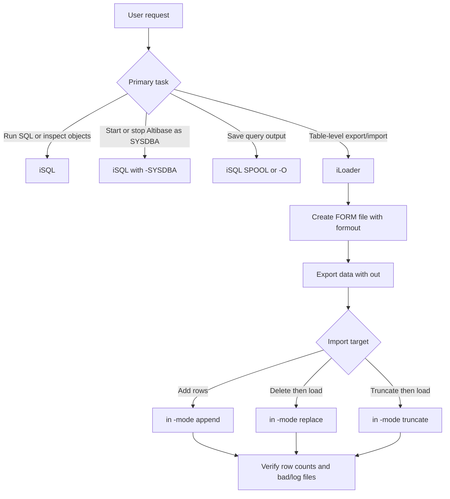
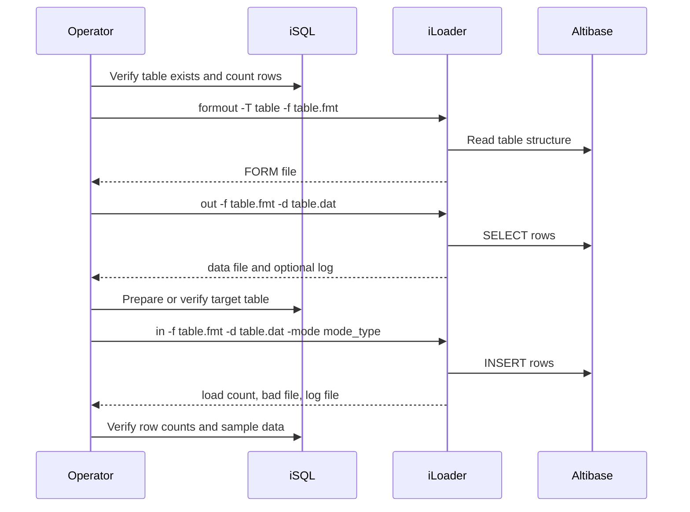

# 13. iSQL, iLoader, and Basic Tools

## Applicable Versions

- 7.1: Based on Altibase 7.1 iSQL and iLoader manuals.
- 7.3: Based on Altibase 7.3 iSQL and iLoader manuals.
- 8.1: Based on Altibase 8.1 verified source iSQL and iLoader manuals.

## Questions This File Can Answer

- How do I connect to Altibase and run SQL with iSQL?
- How do I run an iSQL script and save the output?
- Which iSQL commands are useful for object inspection, transactions, output formatting, and troubleshooting?
- How do iSQL host variables and `PREPARE` work for repeatable parameterized checks?
- How do I export table data with iLoader?
- How do I import table data with iLoader in `APPEND`, `REPLACE`, or `TRUNCATE` mode?
- How do I handle CSV, custom delimiters, character sets, LOB data, date formats, bad rows, `structout`, `-displayquery`, `-partition`, `-geom WKB`, `-replication`, and performance options?
- Which secure login and generated-file permission settings matter for iSQL and iLoader?

## Retrieval Alias Index

Use this compact index before scanning iSQL and iLoader cookbooks. It is intentionally redundant with later headings so lexical retrieval can land on the exact command option, script, host-variable, load-mode, LOB, bad-row, or result-code block.

- Aliases and customer wording: iSQL connect, iSQL script, iSQL output, host variables, PREPARE, object inspection, transaction command, iLoader export, iLoader import, load mode, CSV delimiter, FORM file, bad file, log file, errors limit, LOB file, geom WKB, replication load, secure login.
- Exact-token anchors: `isql`, `CONNECT`, `-s`, `-u`, `-p`, `-f`, `-silent`, `PREPARE`, `HOST VARIABLE`, `ALTIBASE_NLS_NCHAR_LITERAL_REPLACE`, `-NLS_NCHAR_LITERAL_REPLACE 0|1`, `NCHAR`, `NVARCHAR`, `N`, `-bad`, `-log`, `-errors`, `-KEEP_SYSDBA`, `APPEND`, `REPLACE`, `TRUNCATE`, `structout`, `-displayquery`, `-partition`, `-geom WKB`, `-replication`, `employees.dat`, `employees.fmt`, `t1.dat`, `t1.fmt`.
- Troubleshooting anchors: `ERR-`, `SQLCODE`, `0x4102E`, `0x31010`, `0x31011`, `0x31012`, `0x31013`, `0x31014`, `0x31017`, `deadlock`, `long-term lock`, `test.log`, `test.bad`.
- Focused routing anchors: iLoader table export/import questions route to `Exact block: iLoader FORM, data, and import sequence` and must keep `iLoader`, `formout`, `out`, `in`, `-T`, `-f`, `-d`, `employees.fmt`, `employees.dat`, and `-mode replace`; failed-load questions route to `Exact block: iLoader row-load error evidence` and must keep `-log`, `-bad`, `-errors`, `test.log`, and `test.bad`.
- Answer route: use this file for direct iSQL/iLoader commands; use `14_utilities_operation_tools.md` for `aexport`, `altiComp`, `dataCompJ`, dump tools, and `altierr`; use `02_administration_operations.md` for backup/recovery decisions; use `07_error_messages_troubleshooting.md` for failed-load error handling.
- Safety route: before production import, ask for version, target table, load mode, row count, character set, delimiter, LOB handling, replication impact, backup status, and retry plan.

## Source Documents

- 7.1: Altibase 7.1 iSQL User's Manual; iLoader User's Manual.
- 7.3: Altibase 7.3 iSQL User's Manual; iLoader User's Manual.
- 8.1: Altibase 8.1 verified source iSQL User's Manual; iLoader User's Manual.

## Response Rules

- Answer explanatory text in the user's language.
- Keep SQL object names, command names, option names, property names, environment variables, file paths, error codes, and example SQL literal.
- If the customer does not specify a version, answer from the Altibase 8.1 verified source baseline and say that exact option availability or messages can differ on 7.1 and 7.3 clients.
- For export/import work, ask for Altibase version, source and target host, port, user, table name, row count, character set, delimiter or CSV requirement, LOB columns, load mode, replication impact, and acceptable downtime before giving a production command.
- Do not expose internal source labels, repository paths, or workstation paths in customer answers.
- Treat iLoader as a table-level text data export/import utility. It is not a complete database backup, a complete schema export, or an Oracle binary dump importer.

## Exact iSQL And iLoader Answer Blocks

Use these compact blocks when a customer asks for iSQL or iLoader command generation,
capture, permissions, load modes, or first troubleshooting checks. Preserve the literal
options and file names shown here.

Exact block: core iSQL command-line options

- Version scope: Altibase 8.1 verified source; selected 7.1 and 7.3 iSQL sources keep the same core option model.
- Use `isql -S server_name -PORT port_no -U user_id -P password` for explicit host, port, user, and password.
- `/NOLOG` starts iSQL without logging in; use `CONNECT` later.
- `-SYSDBA` lets `SYS` use iSQL in administrator mode.
- `-KEEP_SYSDBA` keeps administrator mode after startup instead of reconnecting to a service session.
- `-F infile_name [param1 [param2] ...]` runs a script after iSQL starts.
- `-O outfile_name` writes command results to an output file.

Exact block: installation and startup iSQL validation bundle

- Version scope: 7.1, 7.3, and Altibase 8.1 verified source for the iSQL command pattern; exact startup behavior still depends on target version, patch, platform, license, and trace-log evidence.
- For first startup, run iSQL as the Altibase installation account and connect locally as `SYS` with `-SYSDBA`; a remote `SYSDBA` connection cannot start the `DBMS`.
- Manual examples use `sys` and `manager`; replace `manager` or `MANAGER` with the site-specific `SYS` password.

```bash
isql -u sys -p manager -sysdba
```

```sql
STARTUP SERVICE;
```

- For post-install PSM setup, run `catproc.sql` through iSQL after the database is created and started:

```bash
isql -s 127.0.0.1 -u SYS -p MANAGER -silent -f $ALTIBASE_HOME/packages/catproc.sql
```

- For first-run validation, connect to the expected host and port, then run version and path checks:

```bash
isql -s 127.0.0.1 -port 20300 -u sys -p manager
```

```sql
SELECT product_version,
       meta_version,
       protocol_version,
       repl_protocol_version
FROM V$VERSION;

SELECT name, value1, value2, value3
FROM V$PROPERTY
WHERE name IN ('DB_NAME', 'LOGANCHOR_DIR', 'LOG_DIR', 'SERVER_MSGLOG_DIR')
ORDER BY name;
```

- Expected state: startup reaches `SERVICE`, iSQL accepts SQL, `V$VERSION` matches the installed package and patch, and path properties match the install plan.
- Stop before diagnosing or retrying startup when the exact startup output, `$ALTIBASE_HOME/trc` log excerpt, license state, kernel/resource settings, or package/patch evidence is missing.

Exact block: iSQL `SYSDBA` startup restrictions

- Version scope: Altibase 8.1 verified source.
- Use `SYS` with `-SYSDBA` for administrator mode.
- Only one user can connect in `SYSDBA` mode at the same time.
- A remote `SYSDBA` connection is possible, but it cannot start the `DBMS`.
- Altibase startup must be run by the Unix account that installed Altibase, matching the database-creation ownership requirement.

Exact block: capture output with `SPOOL` or `-O`

- Version scope: Altibase 8.1 verified source.
- `-O outfile_name` writes iSQL command results to a file from the shell.
- If a file of the same name exists, `-O` overwrites it.
- `SPOOL filename` starts recording results from inside iSQL.
- `SPOOL OFF` stops spooling.

```sql
SPOOL filename;
SELECT * FROM TAB;
SPOOL OFF;
```

Exact block: generated-file permissions

- Version scope: Altibase 8.1 verified source.
- `ALTIBASE_UT_FILE_PERMISSION` is the common environment variable for files generated by `aexport`, `iLoader`, and `iSQL`.
- If a tool-specific variable such as `ISQL_FILE_PERMISSION`, `AEXPORT_FILE_PERMISSION`, or `ILO_FILE_PERMISSION` is set, it takes priority over `ALTIBASE_UT_FILE_PERMISSION` for that tool.
- `ISQL_FILE_PERMISSION` controls files generated by `iSQL`.
- The documented default for iSQL-generated files is `666` when `ISQL_FILE_PERMISSION` is not set.
- Use `600` when generated files should be owner-read/write only.

Exact block: iLoader `FORM`, data, and import sequence

- Version scope: Altibase 8.1 verified source.
- Create a FORM file with `formout`, export table data with `out`, and import with `in`.
- The FORM file tells `iLoader` the table and attributes to load and is similar in content to a `CREATE TABLE` statement.

```text
iLoader> formout -T employees -f employees.fmt
iLoader> out -f employees.fmt -d employees.dat
iLoader> in -f employees.fmt -d employees.dat -mode replace
```

Exact block: iLoader row-load error evidence

- Version scope: Altibase 8.1 verified source.
- Use `-log test.log` to record operation details and errors.
- Use `-bad test.bad` to record failed records.
- Use `-errors count` to control the allowed error count; default is `50`, and `-errors 0` continues regardless of error count.
- Inspect both `test.log` and `test.bad` before claiming a single root cause.

Exact block: iSQL and iLoader error-code routing

- Version scope: 7.1, 7.3, and Altibase 8.1 verified source for the referenced iSQL/iLoader commands; exact error cause/action routes through `07_error_messages_troubleshooting.md`.
- Preserve the tool command, FORM file, data file, `-log` file, `-bad` file, `ALTIBASE_NLS_USE`, `DATA_NLS_USE`, load mode, and full error line before diagnosing.
- If the failure is reported as an Altibase code, keep every supplied form such as `ERR-`, hexadecimal, decimal, negative `SQLCODE`, or ODBC-return-code text. Use `14_utilities_operation_tools.md` for `altierr` lookup forms such as `altierr 0x4102E`.
- Object-resolution errors from iSQL or iLoader SQL should route to the exact not-found family in `07_error_messages_troubleshooting.md`: `0x31010` user not found, `0x31011` table not found, `0x31012` column not found, `0x31013` sequence not found, `0x31014` index not found, and `0x31017` replication not found.
- Lock and transaction symptoms such as `deadlock`, `long-term lock`, or `ROLLBACK` require the exact error line plus current transaction and lock evidence before recommending retry, timeout, or data-load changes.
- Stop before giving production import remediation when the command uses `REPLACE`, `TRUNCATE`, `-parallel`, `-replication`, or corrective retry after partial failure unless backup status, bad-row preservation, target table impact, and rollback plan are known.

Exact block: iLoader load modes

- Version scope: Altibase 8.1 verified source.
- `-mode APPEND` inserts rows into the existing table and is the default.
- `-mode REPLACE` deletes all existing table data with `DELETE`, then loads the new data.
- `-mode TRUNCATE` removes all existing table data with `TRUNCATE`, then loads the new data.
- Because `REPLACE` and `TRUNCATE` remove existing data before loading, ask for backup status, target table, downtime window, and rollback plan before giving a production command.

## Fast Decision Map



## Version Differences

Version block: 7.1

- Core iSQL usage is the same for the topics in this attachment: command-line connection, `CONNECT`, `DISCONNECT`, `STARTUP`, `SHUTDOWN`, script execution, `SPOOL`, output formatting, object inspection, transaction control, and history.
- Core iLoader usage is the same for the standard cookbook: `formout`, `out`, `in`, `-f`, `-d`, `-T`, `-mode`, `-F`, `-L`, `-bad`, `-log`, `-errors`, `-array`, `-commit`, `-atomic`, `-direct`, `-parallel`, `-split`, `-rule csv`, and LOB handling.
- Use the installed 7.1 client documentation when using less common iLoader options because option lists vary by client package and patch level.

Version block: 7.3

- The 7.3 iSQL and iLoader workflows remain aligned with the 7.1 cookbook for ordinary connection, script, export, and import work.
- 7.3 source documents iSQL generated-file permission settings such as `ALTIBASE_UT_FILE_PERMISSION` and `ISQL_FILE_PERMISSION`, and the login-message setting `ISQL_SECURE_LOGIN_MSG`.
- For bulk loads, use the 7.3 iLoader manual option list when tuning with options such as `-lightmode`, `-async_prefetch`, or other package-specific options.

Version block: 8.1

- Use `Altibase 8.1 verified source` wording for 8.1-specific statements.
- The 8.1 verified source keeps the same practical iSQL and iLoader cookbook model: connect or run SQL with iSQL, create a FORM file with `formout`, export with `out`, import with `in`, and verify results.
- Altibase 8.1 verified source improves iLoader Empty LOB processing for LOB data with length 0, supported only when the `-lob` option uses `use_lob_file=yes`.
- Do not apply older 7.1/7.3 zero-length LOB guidance to 8.1 Empty LOB behavior without checking the target 8.1 client package.
- For SSL/TLS setup details beyond the iSQL and iLoader connection options, use the SSL/TLS attachment.

## iSQL Command-Line Syntax

Compact syntax:

```text
isql
  [-H]
  [-S server_name]
  [-PORT port_no]
  [-U user_id]
  [-P password]
  [/NOLOG]
  [-SYSDBA]
  [-KEEP_SYSDBA]
  [-UNIXDOMAIN-FILEPATH filepath]
  [-IPC-FILEPATH filepath]
  [-IPCDA-FILEPATH filepath]
  [-SILENT]
  [-F infile_name [param1 [param2] ...]]
  [-O outfile_name]
  [-NLS_USE nls_name]
  [-NLS_NCHAR_LITERAL_REPLACE 0|1]
  [-prefer_ipv6]
  [-TIME_ZONE timezone]
  [-ssl_ca CA_file_path | -ssl_capath CA_dir_path]
  [-ssl_cert certificate_file_path]
  [-ssl_key key_file_path]
  [-ssl_verify]
  [-ssl_cipher cipher_list]
```

Syntax notes:

- iSQL command-line options are case-insensitive.
- If `-S`, `-U`, or `-P` is omitted, iSQL prompts for the missing value.
- `-S` can be a host name, IPv4 address, or IPv6 address. Enclose an IPv6 address in square brackets, for example `[::1]`.
- If `ISQL_CONNECTION` is `IPC` or `UNIX` and a remote host is specified with `-S`, iSQL connects through TCP and reports that the local connection setting was ignored.
- `-PORT` uses the command-line value first, then `ALTIBASE_PORT_NO`, then `PORT_NO` in `altibase.properties`, then an input prompt.
- `/NOLOG` starts iSQL without logging in. Use `CONNECT` later.
- `-SYSDBA` is for the `SYS` user to connect in SYSDBA mode. Only one SYSDBA connection is allowed at a time.
- `-KEEP_SYSDBA` is used with `-SYSDBA` when you want iSQL to keep administrator mode after startup instead of reconnecting to a service session.
- `-F` runs a script immediately after iSQL starts. Parameters after the script name can be used as substitution values when the script uses substitution variables.
- `-O` writes iSQL command results to a file in the current directory and overwrites an existing file with the same name.

## iSQL NCHAR Literal Handling

Block: `ALTIBASE_NLS_NCHAR_LITERAL_REPLACE`

- Version scope: selected 7.1, 7.3, and Altibase 8.1 verified source iSQL manuals.
- Related command-line option: `-NLS_NCHAR_LITERAL_REPLACE 0|1`.
- Purpose: controls whether iSQL searches SQL text for literals prefixed with `N` so national-character literals can bypass client conversion to the database character set.
- Value `0`: iSQL does not check for `N` before literals and converts the whole query text to the database character set.
- Value `1`: when iSQL finds an `N`-prefixed `NCHAR` literal, the client sends that literal without converting it to the database character set; the server converts it to the national character set.
- Use case: `NCHAR` and `NVARCHAR` data when the national-character data needs an encoding different from the database character set.
- Cost caution: setting this value to `1` adds significant client-side cost because the client searches query text for `N`-prefixed literals.
- Safe setup pattern: set the environment variable deliberately before starting iSQL, keep `NLS_USE`/`ALTIBASE_NLS_USE` aligned with the real client input, and prefix national-character constants with `N`.

```sh
export ALTIBASE_NLS_NCHAR_LITERAL_REPLACE=1
```

```sql
CREATE TABLE t1 (c1 NVARCHAR(10));
INSERT INTO t1 VALUES (N'AB<national_text>');
SELECT * FROM t1;
```

Caution: do not infer this behavior from generic database rules. Ask for the exact client character set, database character set, national character set, and iSQL option/environment settings when multilingual data is at risk.

## iSQL Connection Cookbook

Cookbook: connect with explicit host and port

```bash
isql -s 127.0.0.1 -port 20300 -u sys -p manager
```

Use when: the server is already running and the client should connect directly through TCP.

Verification:

```sql
SHOW USER;
SELECT * FROM TAB;
```

Cookbook: start iSQL without connecting, then connect

```bash
isql -s 127.0.0.1 -port 20300 /NOLOG
```

```sql
CONNECT sys/manager NLS=US7ASCII;
SHOW USER;
```

Use when: the user wants iSQL open before entering credentials or wants to reconnect as a different user.

Caution: if `CONNECT` fails, the previous session is terminated and the connection is closed. Reconnect with `CONNECT userID/password [AS SYSDBA];`.

Cookbook: reconnect inside iSQL

```sql
CONNECT app_user/app_password;
SHOW USER;
DISCONNECT;
CONNECT sys/manager;
```

Use when: switching users inside one iSQL process.

Cookbook: SSL/TLS server certificate verification

```bash
export ISQL_CONNECTION=SSL
isql -s dbhost.example.com -u app_user -p app_password -ssl_verify -ssl_ca /path/to/ca-cert.pem
```

Cookbook: SSL/TLS mutual authentication

```bash
export ISQL_CONNECTION=SSL
isql -s dbhost.example.com -u app_user -p app_password \
  -ssl_verify -ssl_ca /path/to/ca-cert.pem \
  -ssl_cert /path/to/client-cert.pem \
  -ssl_key /path/to/client-key.pem
```

Use when: the server requires SSL/TLS, or the server requires client certificate authentication.

## iSQL Startup And Shutdown

Cookbook: start Altibase through iSQL

```bash
isql -u sys -p manager -sysdba
```

```sql
STARTUP SERVICE;
```

Requirements:

- Run the command with the operating system account that installed and owns Altibase.
- Connect as `SYS` with `-SYSDBA`.
- Use a local SYSDBA connection for startup. Remote `SYSDBA` may connect, but it cannot start the DBMS.
- Use the administration attachment for detailed startup phase and recovery troubleshooting.

Cookbook: shut down Altibase through iSQL

```sql
SHUTDOWN NORMAL;
```

Other shutdown modes:

- `SHUTDOWN IMMEDIATE;`
- `SHUTDOWN ABORT;`

Use `NORMAL` for planned shutdowns unless the operational situation requires a stronger mode.

## iSQL Script And Output Cookbook

Cookbook: run a script from the shell and save output

```bash
isql -s 127.0.0.1 -port 20300 -u sys -p manager -silent -f healthcheck.sql -o healthcheck.out
```

Use when: automating a repeatable check or deployment script.

Cookbook: run a script from the iSQL prompt

```sql
START schema.sql;
@ schema.sql;
```

Use `@@ child.sql;` inside another script when `child.sql` is in the same directory as the calling script.

Cookbook: pass script parameters

```sql
SET DEFINE ON;
START report.sql 2026Q1 SALES;
```

In the script, substitution variables use `&1`, `&2`, and so on. Use `SET VERIFY OFF;` if the before-and-after substitution text should not be displayed.

Cookbook: spool query output

```sql
SPOOL result.lst;
SELECT * FROM TAB;
SPOOL OFF;
```

Use when: the session is interactive but the result must be saved.

Cookbook: save and reload the last SQL statement

```sql
SAVE last_query.sql;
LOAD last_query.sql;
/
```

Use when: editing and rerunning a recent statement.

Cookbook: log DML statements

```sql
SET QUERYLOGGING ON;
UPDATE t1 SET i1 = 2 WHERE i1 = 1;
SET QUERYLOGGING OFF;
```

Output location: `$ALTIBASE_HOME/trc/isql_query.log`.

Caution: protect this file because it can contain sensitive SQL values.

## iSQL Object Inspection

Command block: performance view list

```sql
SELECT * FROM V$TAB;
```

Purpose: lists performance views available through iSQL.

Command block: table list

```sql
SELECT * FROM TAB;
```

Purpose: lists tables visible to the current user. When connected as `SYS`, more system and user objects are visible.

Command block: table structure

```sql
DESC target_table;
```

Useful settings:

```sql
SET FOREIGNKEYS ON;
SET CHKCONSTRAINTS ON;
SET PARTITIONS ON;
DESC target_table;
```

Purpose: include foreign key, CHECK constraint, and partition details in `DESC` output.

Command block: sequence information

```sql
SELECT * FROM SEQ;
```

Purpose: shows sequence information. `SYS` can see all sequences; other users see sequences generated by that user.

## iSQL Transaction Cookbook

Cookbook: manual transaction control

```sql
AUTOCOMMIT OFF;
INSERT INTO t1 VALUES (1);
SAVEPOINT sp1;
INSERT INTO t1 VALUES (2);
ROLLBACK TO SAVEPOINT sp1;
COMMIT;
AUTOCOMMIT ON;
```

Use when: grouping multiple SQL statements and controlling commit or rollback explicitly.

Command block: `AUTOCOMMIT`

- `AUTOCOMMIT ON;` commits each command at execution time.
- `AUTOCOMMIT OFF;` requires explicit `COMMIT;` or `ROLLBACK;`.

Command block: `PLANCOMMIT`

```sql
SET PLANCOMMIT ON;
SET PLANCOMMIT OFF;
SHOW PLANCOMMIT;
```

Purpose: controls whether iSQL commits preparation work that can occur for `DESC`, `SELECT * FROM TAB`, or `SELECT * FROM SEQ` when `EXPLAIN PLAN` is `ON` or `ONLY` and `AUTOCOMMIT` is `OFF`.

## iSQL Output Formatting Blocks

Block: line and page layout

```sql
SET LINESIZE 160;
SET PAGESIZE 0;
SHOW LINESIZE;
SHOW PAGESIZE;
```

- `SET LINESIZE n;` controls display line length. The documented range is 10 through 32767.
- `SET PAGESIZE 0;` outputs all result records on one page.

Block: headings and row counts

```sql
SET HEADING ON;
SET FEEDBACK ON;
SET FEEDBACK 10;
SHOW HEADING;
SHOW FEEDBACK;
```

- `SET HEADING OFF;` suppresses SELECT result headers.
- `SET FEEDBACK OFF;` suppresses row count output.
- `SET FEEDBACK n;` controls row count output threshold.

Block: character, numeric, and column display

```sql
SET COLSIZE 40;
SET NUMWIDTH 20;
SET NUMFORMAT 9.99EEEE;
COLUMN column_name FORMAT A30;
CLEAR COLUMNS;
```

Use when: output columns wrap, numeric values need a fixed display format, or a specific column needs a display width.

Block: LOB display

```sql
AUTOCOMMIT OFF;
SET LOBSIZE 4000;
SET LOBOFFSET 0;
SELECT clob_col FROM target_table;
COMMIT;
```

Caution: when querying `CLOB` column data in iSQL, set transaction mode to `AUTOCOMMIT OFF` first.

Block: timing

```sql
SET TIMING ON;
SET TIMESCALE MILSEC;
SELECT COUNT(*) FROM target_table;
SET TIMING OFF;
```

Supported `SET TIMESCALE` values: `SEC`, `MILSEC`, `MICSEC`, `NANSEC`.

Block: vertical output

```sql
SET VERTICAL ON;
SELECT * FROM target_table WHERE id = 1;
SET VERTICAL OFF;
```

Use when: a wide row is easier to inspect as name/value pairs.

Block: execution plan output

```sql
ALTER SESSION SET EXPLAIN PLAN = ON;
SELECT * FROM target_table WHERE id = 1;
ALTER SESSION SET EXPLAIN PLAN = OFF;
```

Use `ONLY` instead of `ON` when the plan should be shown without ordinary SELECT result output.

Block: show current iSQL settings

```sql
SHOW ALL;
SHOW USER;
SHOW TIMING;
SHOW TERM;
SHOW ECHO;
```

Use when: troubleshooting why a script or result format is behaving differently than expected.

## iSQL Host Variables And Prepared SQL

Block: declare host variables

```sql
VAR p1 INTEGER;
VARIABLE p2 CHAR(10);
VAR v_double DOUBLE;
VAR v_real REAL;
```

Compact syntax:

```text
VAR[IABLE] var_name [INPUT | OUTPUT | INOUTPUT] var_type
```

Supported host-variable type families include `INTEGER`, `BIGINT`, `SMALLINT`, `BYTE(n)`, `NIBBLE(n)`, `NUMBER`, `NUMERIC`, `DECIMAL`, `FLOAT`, `DOUBLE`, `REAL`, `CHAR(n)`, `VARCHAR(n)`, `NCHAR(n)`, `NVARCHAR(n)`, and `DATE`.

Block: assign and print host variables

```sql
EXECUTE :p1 := 100;
EXEC :p2 := 'abc';
PRINT VARIABLE;
PRINT p2;
```

Use when: testing procedure/function arguments or running a parameterized check repeatedly inside iSQL.

Block: run a prepared SQL statement with a host variable

```sql
VAR target_id INTEGER;
EXEC :target_id := 1;
PREPARE SELECT eno, e_firstname, e_lastname
FROM employees
WHERE eno = :target_id;
```

Meaning:

- Ordinary SQL in iSQL uses direct execution: parse, validate, optimize, and execute together.
- `PREPARE SQL_statement;` performs prepared execution and can bind iSQL host variables.
- In iSQL itself, the documented result is not faster than direct execution; use it when variable binding is the behavior being tested or demonstrated.

Cautions:

- If `ALTER SESSION SET EXPLAIN PLAN = ON` is also used, prepared execution can show graph or plan information that differs from direct execution because the plan can be displayed before and after variable values are applied.
- Host variables are an iSQL session feature. Do not describe them as database table columns or persistent SQL objects.

## iSQL History, Editing, And Shell Commands

Command block: history list

```sql
HISTORY;
H;
```

Command block: rerun commands

```sql
/;
2/;
```

- `/` reruns the most recent command in the iSQL buffer.
- `2/` runs command number 2 from the history list.

Command block: edit commands

```sql
EDIT;
EDIT existing.sql;
2 EDIT;
```

Environment variable: `ISQL_EDITOR` changes the editor used by `EDIT`.

Command block: shell command

```sql
! ls -l
```

Caution: shell command availability and behavior depend on the operating system account running iSQL.

Environment block: persistent history

```bash
export ISQL_HIST_FILE=~/.isql_history
```

Caution: protect the history file because every command entered by the user can be stored, including commands that contain passwords or sensitive values.

## iSQL Login Files And Security Settings

Block: global login file

- File: `$ALTIBASE_HOME/conf/glogin.sql`
- Purpose: site-wide iSQL initialization run when iSQL starts or first connects.

Block: user login file

- File: `login.sql` in the current working directory.
- Purpose: user-specific iSQL initialization after `glogin.sql`.
- Precedence: when both files exist, `login.sql` runs after `glogin.sql`, so settings in `login.sql` can override earlier session settings.

Security rule: `CONNECT user/password` is ignored in `glogin.sql` and `login.sql`.

```text
WARNING: CONNECT command in glogin.sql file ignored
```

Block: suppress detailed login failure reasons

```bash
export ISQL_SECURE_LOGIN_MSG=1
```

- `1`: iSQL displays `Invalid UserID or Password`.
- `0` or unset: iSQL displays the specific login failure reason.
- Use `1` for security-sensitive environments where detailed failure reasons should not be exposed.

Block: generated-file permission

```bash
export ALTIBASE_UT_FILE_PERMISSION=600
export ISQL_FILE_PERMISSION=600
```

- `ALTIBASE_UT_FILE_PERMISSION` sets the default permission for files generated by iSQL, iLoader, and aexport.
- `ISQL_FILE_PERMISSION` takes precedence for files generated by iSQL.
- Use restrictive permissions for spool files, query logs, history files, data extracts, and bad files.

## iLoader Command-Line Syntax

Compact syntax (partial; use the target-client manual or runtime help for the complete option set):

```text
iloader
  [-h]
  [-s server_name]
  [-u user_name]
  [-p password]
  [-port port_no]
  [-silent]
  [-nst]
  [-displayquery]
  [-NLS_USE nls_name]
  [-prefer_ipv6]
  [-geom WKB]
  [-ssl_ca CA_file_path | -ssl_capath CA_dir_path]
  [-ssl_cert certificate_file_path]
  [-ssl_key key_file_path]
  [-ssl_verify]
  [-ssl_cipher cipher_list]
  { in | out | formout | structout | help }
    [-d datafile_or_datafiles]
    [-f formatfile]
    [-T table_name]
    [-F firstrow]
    [-L lastrow]
    [-t field_term]
    [-r row_term]
    [-e enclosing]
    [-rule csv]
    [-mode mode_type]
    [-commit commit_unit]
    [-bad badfile]
    [-log logfile]
    [-array count]
    [-replication true|false]
    [-split number]
    [-readsize size]
    [-errors count]
    [-lob lob_option_string]
    [-atomic]
    [-parallel count]
    [-direct [log|nolog]]
    [-partition]
    [-dry-run]
    [-prefetch_rows count]
    [-async_prefetch off|on|auto]
    [-lightmode]
    [-stmt_prefix [prefix_value]]
    [-extra_col_delimiter]
    [-verbose]
```

Syntax notes:

- This compact syntax is intentionally partial. It preserves high-retrieval iLoader literals, but less common options vary by client package and patch level.
- Use exactly one direction command: `in`, `out`, `formout`, `structout`, or `help`.
- The direction command must appear before the command options that belong to the direction.
- In the iLoader source manuals, options are case-sensitive except `-S`, `-U`, and `-P`.
- If `-s`, `-u`, or `-p` is omitted, iLoader prompts for the missing value.
- `-T` is required for `formout`. For `in` and `out`, the table name is read from the FORM file, so `-T` is ignored.
- `-d` can specify up to 32 input files for `in`; files are uploaded in the listed order.
- With `out` and `-parallel`, at least as many output files as the parallel count are created.
- `-dry-run` is documented in 7.1, 7.3, and Altibase 8.1 verified source syntax.
- `-lightmode` is documented in 7.3 and Altibase 8.1 verified source syntax. Treat it as a data-load performance option and do not combine it with `-direct`.
- `-stmt_prefix [prefix_value]` is documented in 7.1 for `in` and `out`; it prefixes SQL generated by iLoader, and the documented default prefix is `NODE [META]` when no value is supplied.
- `-extra_col_delimiter` is documented in 7.1 and in the Korean 7.3 and Altibase 8.1 verified source manuals. Use it when a final column delimiter appears immediately before the row delimiter; it can be used with `-rule csv` or `-t`.

## iLoader Export Import Flow



## iLoader Standard Cookbook

Answer anchor: table-level backup versus physical backup

- Version scope: the standard iLoader workflow is shared by the selected 7.1, 7.3, and Altibase 8.1 verified source tool manuals; check the installed client manual for less common options.
- `iLoader` is a logical table-level export/import path. It is not a physical database backup and does not restore datafiles, log anchors, online logs, archive logs, tablespace state, privileges, triggers, or complete schema dependencies.
- Always create a FORM file with `formout` before export/import. The FORM file records table information such as column names and data types for iLoader mapping.
- Canonical small-table example preserving the manual-style tokens:

```text
iLoader> formout -T t1 -f t1.fmt
iLoader> out -f t1.fmt -d t1.dat
iLoader> in -f t1.fmt -d t1.dat
```

- If target records already exist during restore, choose an explicit load mode. Without an explicit overwrite behavior, existing records are kept; use `-mode replace` or `-mode truncate` only after the target-impact review is approved.

Cookbook: create a FORM file

```bash
iloader formout -s 127.0.0.1 -u sys -p manager -port 20300 -T target_table -f target_table.fmt
```

Use when: preparing any iLoader export or import for a table.

Output: `target_table.fmt`.

Caution: the FORM file describes table attributes for iLoader. It does not preserve every schema object, constraint, index, trigger, or privilege needed to recreate a production table.

Cookbook: export table data

```bash
iloader out -s 127.0.0.1 -u sys -p manager -port 20300 \
  -f target_table.fmt \
  -d target_table.dat \
  -log target_table_out.log \
  -silent
```

Use when: writing table rows to a text data file.

Verify:

```sql
SELECT COUNT(*) FROM target_table;
```

Compare the iSQL count with the iLoader `Total n record download` message and the log file.

Cookbook: import into an empty or existing table by appending

```bash
iloader in -s 127.0.0.1 -u sys -p manager -port 20300 \
  -f target_table.fmt \
  -d target_table.dat \
  -mode append \
  -bad target_table.bad \
  -log target_table_in.log \
  -errors 50
```

Use when: keeping existing target rows and adding imported rows. `APPEND` is the default mode.

Cookbook: replace target rows with imported rows

```bash
iloader in -s 127.0.0.1 -u sys -p manager -port 20300 \
  -f target_table.fmt \
  -d target_table.dat \
  -mode replace \
  -bad target_table.bad \
  -log target_table_in.log
```

Behavior: `REPLACE` uses `DELETE` to remove existing rows, then loads the new rows.

Use when: the target table must keep its table object but its rows should be replaced.

Cookbook: truncate target rows before loading

```bash
iloader in -s 127.0.0.1 -u sys -p manager -port 20300 \
  -f target_table.fmt \
  -d target_table.dat \
  -mode truncate \
  -bad target_table.bad \
  -log target_table_in.log
```

Behavior: `TRUNCATE` removes existing rows with `TRUNCATE`, then loads the new rows.

Use when: a large table should be emptied faster than `DELETE`, and truncate semantics are acceptable.

Verification after any import:

```sql
SELECT COUNT(*) FROM target_table;
SELECT * FROM target_table WHERE <primary_key_column> = <sample_value>;
```

Check:

- iLoader `Load Count`.
- iLoader result code.
- `-log` file for errors.
- `-bad` file for rejected rows.
- Application-level row counts and sample rows.

## iLoader Load Modes

Mode block: `APPEND`

- Command value: `-mode append`
- Behavior: adds imported rows to existing table rows.
- Default: yes.
- Use when: the data file contains only new rows.

Mode block: `REPLACE`

- Command value: `-mode replace`
- Behavior: deletes all existing rows with `DELETE`, then imports the data file.
- Use when: the table object should remain and `DELETE` behavior is acceptable.
- Caution: for large tables, `DELETE` can take longer than `TRUNCATE`.

Mode block: `TRUNCATE`

- Command value: `-mode truncate`
- Behavior: truncates existing rows, then imports the data file.
- Use when: fast replacement is needed and truncate behavior is acceptable.
- Caution: verify privileges, replication impact, and recovery requirements before using it in production.

## iLoader CSV And Delimiter Cookbook

Cookbook: evaluate CSV rules

Use when: character data can include commas or double quotation marks and CSV escaping is preferred.

Source conflict note: the iLoader manuals document `-rule csv`, but the same option description says `-rule csv` cannot be used with delimiter-related options including `-f`, `-t`, `-r`, and `-e`. Because ordinary iLoader `in` and `out` cookbook commands use a FORM file through `-f`, do not generate a copy-ready command that combines `-rule csv` with `-f target_table.fmt`.

Caution: before using `-rule csv`, verify the exact command form against the target iLoader client manual or a non-production runtime test. For copy-ready table loads and extracts, use the verified FORM-file workflow with explicit delimiter choices, such as the pipe-delimited examples below.

Cookbook: import a pipe-delimited file

```bash
iloader in -s 127.0.0.1 -u sys -p manager \
  -f target_table.fmt \
  -d target_table_pipe.dat \
  -t '|' \
  -bad target_table.bad \
  -log target_table_in.log
```

Use when: a source text file uses `|` as the field delimiter.

Cookbook: use a custom row terminator

```bash
iloader out -s 127.0.0.1 -u sys -p manager \
  -f target_table.fmt \
  -d target_table.dat \
  -r '^%n'
```

Meaning: `%n` represents newline, `%t` represents tab, and `%r` represents carriage return.

Delimiter cautions:

- Field delimiter `-t`, row delimiter `-r`, and enclosing delimiter `-e` must be different.
- A delimiter must not be a subset of another delimiter.
- Column data must not contain the delimiter sequence unless a target-client-verified CSV rule or a safe delimiter strategy is used.
- Avoid delimiter characters that the shell interprets, such as quotes, slash, ampersand, and redirection characters.

## iLoader Row Range And Multiple File Cookbook

Cookbook: import only selected rows from a data file

```bash
iloader in -s 127.0.0.1 -u sys -p manager \
  -f target_table.fmt \
  -d target_table.dat \
  -F 100 \
  -L 1000
```

Use when: loading rows 100 through 1000 from the data file.

Cookbook: import multiple data files in order

```bash
iloader in -s 127.0.0.1 -u sys -p manager \
  -f target_table.fmt \
  -d part01.dat part02.dat part03.dat \
  -mode append \
  -log target_table_in.log
```

Use when: a table export was split or an upstream process generated multiple compatible files.

Caution: iLoader uploads multiple `-d` input files in the listed order.

Cookbook: split an export into multiple files

```bash
iloader out -s 127.0.0.1 -u sys -p manager \
  -f target_table.fmt \
  -d target_table.dat \
  -split 1000000
```

Use when: output files need a fixed maximum number of records per file.

Output naming pattern: `target_table.dat0`, `target_table.dat1`, and so on.

## iLoader FORM File Blocks

Block: default FORM file shape

```text
table target_table
{
"ID" integer;
"NAME" varchar (100);
"CREATED_AT" date;
}
DATEFORM YYYY/MM/DD HH:MI:SS:SSSSSS
DATA_NLS_USE=US7ASCII
```

Purpose: tells iLoader which table and column attributes to use when exporting or importing.

Block: character set

```text
DATA_NLS_USE=UTF8
```

Purpose: records or controls the character set used for the data file.

Caution: when importing, the data file's actual character set must match `DATA_NLS_USE`, `-NLS_USE`, `ALTIBASE_NLS_USE`, or the effective client setting. If they differ, multilingual data can fail or become corrupted.

Block: national character data

```text
NCHAR_UTF16=YES
```

Purpose: preserves national character type data as UTF-16BE in the data file when the FORM file contains national character type columns.

Block: date format for the whole FORM file

```text
DATEFORM YYYY-MM-DD HH:MI:SS:SSSSSS
```

Purpose: controls how date values are written and read.

Caution: the format used for import must match the data file.

Block: date format for individual columns

```text
table target_table
{
"ID" integer;
"BUSINESS_DATE" date DATEFORM "YYYY-MM-DD";
"CREATED_AT" date DATEFORM "YYYY/MM/DD HH:MI:SS SSSSSS";
}
DATEFORM YYYY/MM/DD HH:MI:SS:SSSSSS
```

Precedence from highest to lowest:

- DATE format specified next to the column in the FORM file.
- `ILO_DATEFORM` environment variable.
- Top-level `DATEFORM` in the FORM file.

Block: set a date format with environment variable

```bash
export ILO_DATEFORM='YYYY-MM-DD'
```

Use when: a session-wide iLoader date format is needed.

Block: sequence values on import

```text
SEQUENCE seq1 NUM NEXTVAL
table seqTable
{
"NUM" integer;
"NAME" varchar (30);
}
DATA_NLS_USE=US7ASCII
```

Purpose: use a sequence value for the listed column when importing.

Notes:

- `NEXTVAL` is the default pseudocolumn.
- A maximum of 8 columns can be used with a sequence statement.

Block: transform imported values with a function

```text
table t2
{
"I1" integer "trim(?)";
"I2" varchar(10) "trim(?)";
"I3" varchar(10) "concat(trim(?),'value')";
}
```

Purpose: applies a SQL function expression to uploaded values.

Caution: this function mapping is not available for `DATE`, `TIMESTAMP`, or `GEOMETRY` columns.

Block: filter exported rows

```text
DOWNLOAD CONDITION "WHERE DNO IS NOT NULL"
```

Purpose: appends a condition to the export query.

Caution: quote the condition with double quotation marks. Without the quotes, iLoader can raise a parser error.

Block: filter exported rows and include a hint

```text
DOWNLOAD CONDITION "WHERE DNO IS NOT NULL" HINT "/*+ INDEX(department department_pk) */"
```

Verification:

```bash
iloader out -s 127.0.0.1 -u sys -p manager -f department.fmt -d department.dat -displayquery
```

Use `-displayquery` to inspect the query that iLoader generated from the FORM file.

## iLoader TIMESTAMP Handling In FORM Files

Use these suffixes on a `TIMESTAMP` column line when the data file and target column do not line up directly.

Block: data file has no value for the `TIMESTAMP` column

- `ADD DEFAULT`: insert the current time.
- `ADD NULL`: insert `NULL`.
- `ADD YYYYMMDD[HHMISS]`: insert the specified timestamp value.

Block: data file has a value for the `TIMESTAMP` column

- `SKIP DEFAULT`: ignore the file value and insert the current time.
- `SKIP NULL`: ignore the file value and insert `NULL`.
- `SKIP YYYYMMDD[HHMISS]`: ignore the file value and insert the specified timestamp value.

Use when: importing older files after adding a `TIMESTAMP` column or changing timestamp handling.

## iLoader LOB Cookbook

Cookbook: export LOB data to external LOB files

```bash
iloader out -s 127.0.0.1 -u sys -p manager \
  -f target_table.fmt \
  -d target_table.dat \
  -lob "use_lob_file=yes" \
  -lob "lob_file_size=1G"
```

Use when: LOB data should be stored outside the main data file.

File naming pattern: the LOB file name is based on the data file name plus a 9-digit serial number, for example `target_table_000000001.lob`.

Cookbook: export each LOB cell to a separate file

```bash
iloader out -s 127.0.0.1 -u sys -p manager \
  -f target_table.fmt \
  -d target_table.dat \
  -lob "use_lob_file=yes" \
  -lob "use_separate_files=yes"
```

Use when: each LOB value should be a separate file under table and column directories.

Cookbook: set a custom LOB indicator

```bash
iloader out -s 127.0.0.1 -u sys -p manager \
  -f target_table.fmt \
  -d target_table.dat \
  -lob "lob_indicator=%LOB%"
```

Default LOB indicator: `%%`.

LOB cautions:

- `lob_file_size` applies to `out`; it is ignored for `in`.
- If `lob_file_size` is set without `use_lob_file=yes`, iLoader infers `use_lob_file=yes`.
- `use_separate_files=yes` assumes `use_lob_file=yes`.
- `use_separate_files=yes` cannot be combined with `lob_file_size`.
- If a LOB column is imported with `use_lob_file=yes` and the LOB value does not start with the configured `lob_indicator`, the row is treated as an error.
- For LOB tables, performance options are restricted. On upload, `-array` becomes `1`, `-commit` becomes `1`, `-atomic` is ignored, `-direct` is ignored, and `-parallel` becomes `1`. On download, `-array` and `-parallel` become `1`.

Altibase 8.1 Empty LOB note:

- Altibase 8.1 verified source improves iLoader Empty LOB processing for LOB data with length 0 only when `-lob` is used with `use_lob_file=yes`.
- Preserve both literals when answering 8.1 iLoader Empty LOB questions: `-lob` and `use_lob_file=yes`.
- Older 7.1/7.3 manuals document zero-length LOB data as stored like `NULL`; do not assume that older zero-length guidance for 8.1 Empty LOB behavior.

## iLoader Performance Cookbook

Cookbook: faster ordinary import with array and commit batching

```bash
iloader in -s 127.0.0.1 -u sys -p manager \
  -f target_table.fmt \
  -d target_table.dat \
  -array 1000 \
  -commit 5000 \
  -bad target_table.bad \
  -log target_table_in.log
```

Use when: importing a large non-LOB data file and commit batching is acceptable.

Commit behavior:

- Default `-commit` is `1000`.
- `-commit 0` runs in non-autocommit mode and commits after all data has been inserted.
- `-commit 1` commits each row.
- With `-array`, commit occurs after `array_size * commit_unit` records.

Cookbook: Atomic Array INSERT

```bash
iloader in -s 127.0.0.1 -u sys -p manager \
  -f target_table.fmt \
  -d target_table.dat \
  -array 1000 \
  -commit 100 \
  -atomic
```

Use when: improving upload performance for tables without LOB columns.

Cautions:

- `-atomic` must be used with `-array`.
- Do not use `-atomic` for tables with LOB columns.
- If an Atomic Array INSERT fails for a row, iLoader falls back to Array INSERT behavior for error reporting.

Cookbook: Direct-Path INSERT in logging mode

```bash
iloader in -s 127.0.0.1 -u sys -p manager \
  -f target_table.fmt \
  -d target_table.dat \
  -array 1000 \
  -direct log
```

Use when: loading large amounts of data into a disk table that satisfies Direct-Path INSERT restrictions.

Cookbook: Direct-Path INSERT in nologging mode

```bash
iloader in -s 127.0.0.1 -u sys -p manager \
  -f target_table.fmt \
  -d target_table.dat \
  -direct nolog
```

Caution: back up the table before using `-direct nolog`. If upload fails in nologging mode, normal recovery of the affected table can be impossible.

Direct-Path INSERT restrictions:

- Target table cannot have an index or primary key.
- Target table cannot have a trigger.
- Target table cannot have a LOB column.
- Target table cannot have CHECK constraints.
- Target table cannot have referential integrity constraints.
- Target table cannot be under replication.
- Target table must exist in a disk tablespace.

Fallback: if restrictions are not satisfied, iLoader can automatically use Atomic Array INSERT instead of Direct-Path INSERT.

Cookbook: parallel export

```bash
iloader out -s 127.0.0.1 -u sys -p manager \
  -f target_table.fmt \
  -d target_table.dat \
  -array 1000 \
  -parallel 4
```

Use when: exporting a large non-LOB table.

Cautions:

- Use `-array` with `-parallel` for downloads; using `-parallel` alone can degrade repeated bind and fetch performance.
- `-parallel` maximum documented value is `32`.
- When importing with `-parallel`, iLoader creates `count + 1` server connections.
- When exporting with `-parallel`, iLoader uses two server connections.
- For IPC connections, ensure `IPC_CHANNEL_COUNT` is high enough for the connection count.

Cookbook: tune input file read size

```bash
iloader in -s 127.0.0.1 -u sys -p manager \
  -f target_table.fmt \
  -d target_table.dat \
  -readsize 4194304 \
  -bad target_table.bad \
  -log target_table_in.log
```

Use when: file read size, filesystem behavior, or client-side buffering is suspected to be a bottleneck during upload.

Cautions:

- `-readsize` applies to `in`.
- The value is bytes, must be greater than `0`, and the documented default is `1048576`.
- Validate memory use and elapsed time with the target client package before standardizing a value.

Cookbook: tune export fetch behavior

```bash
iloader out -s 127.0.0.1 -u sys -p manager \
  -f target_table.fmt \
  -d target_table.dat \
  -prefetch_rows 10000 \
  -async_prefetch auto
```

Use when: the installed client supports these options and fetch performance is the bottleneck.

Option block: asynchronous prefetch

- `-async_prefetch off`: do not use asynchronous prefetch; documented default.
- `-async_prefetch on`: use asynchronous prefetch.
- `-async_prefetch auto`: use auto tuning for asynchronous prefetch; documented as Linux-only.
- Related CLI-side settings named in the source manuals are `ALTIBASE_PREFETCH_ASYNC`, `ALTIBASE_PREFETCH_AUTO_TUNING`, and `ALTIBASE_SOCK_RCVBUF_BLOCK_RATIO`.

Option block: `-lightmode`

- Purpose: faster upload by avoiding database logging for the target load path.
- Version caution: documented in 7.3 and Altibase 8.1 verified source syntax and performance-option sections.
- Can be used with `-parallel` and multiple iLoader instances.
- Do not combine with `-direct`.
- Do not use while other transactions insert, update, or delete the target table.
- Do not use on a replication target table, and do not create replication for a table while `-lightmode` loading is in progress.
- Failure caution: because database logging is not written for this path, normal recovery can be impossible after a failure; the source recommends recreating the target table in that case.

## iLoader Low-Frequency Option Blocks

Option block: `structout`

```bash
iloader structout -s 127.0.0.1 -u sys -p manager \
  -T target_table \
  -f target_table_struct.out
```

Purpose: creates a structure file that matches the specified table, similar to `formout`, for use when writing a client program.

Caution: use `formout` for ordinary table export/import. Use `structout` only when the task is client-structure generation.

Option block: `-displayquery`

```bash
iloader out -s 127.0.0.1 -u sys -p manager \
  -f target_table.fmt \
  -d target_table.dat \
  -displayquery
```

Purpose: prints the query string generated by iLoader. Use it after FORM-file edits such as `DOWNLOAD CONDITION`, `HINT`, function mappings, or `DATEFORM` changes.

Verification: compare the displayed SQL with the intended table, selected columns, filter, and hint before using the exported data.

Option block: `-silent` and `-nst`

- `-silent`: suppresses copyright and banner display.
- `-nst`: suppresses elapsed-time display.
- Use when: automation needs compact output and separate log files capture operation details.
- Caution: do not omit `-log` and `-bad` in production merely because `-silent` makes terminal output cleaner.

Option block: `-replication true|false`

```bash
iloader in -s 127.0.0.1 -u sys -p manager \
  -f target_table.fmt \
  -d target_table.dat \
  -replication false \
  -bad target_table.bad \
  -log target_table_in.log
```

Purpose: controls whether replication is turned off while loading data. The documented default when omitted is `true`.

Caution: before using `-replication false`, confirm the table's replication role, intended replication catch-up or rebuild plan, data ownership, and rollback procedure.

Option block: `-partition`

```bash
iloader formout -s 127.0.0.1 -u sys -p manager \
  -T partitioned_table \
  -f partitioned_table.fmt \
  -partition
```

Purpose: if the table named by `-T` is partitioned, iLoader creates one FORM file per partition. The documented naming pattern is `formfile_name.partition_name`. If the table is not partitioned, one FORM file is created with the supplied form file name.

Use when: exporting or loading partition-by-partition and keeping each partition's FORM file explicit.

Option block: `-geom WKB`

```bash
iloader out -s 127.0.0.1 -u sys -p manager \
  -f spatial_table.fmt \
  -d spatial_table.dat \
  -geom WKB
```

Purpose: exports Spatial data in Well-Known Binary format. Use this for movement to a lower-version target or external tool that expects `WKB`.

Caution: without `-geom WKB`, iLoader follows the Altibase-supported Spatial object format for the installed version. Confirm `GEOMETRY` type compatibility and target import expectations before generating a migration command.

Option block: `-verbose`

- Requires: `-log logfile`.
- Purpose: when an upload error occurs and the column position can be determined, iLoader records the failed column position as `COLUMN_ORDER` in the log file.
- Use when: diagnosing bad rows where the rejected value is not enough to identify the target column.

Option block: `-dry-run`

- Source-backed scope: listed in the 7.1, 7.3, and Altibase 8.1 verified source iLoader command syntax and help.
- Selected-source limitation: the sampled selected sources do not provide a full semantic item block for `-dry-run`.
- Safe answer pattern: before relying on `-dry-run` for a production precheck, ask for the exact client package/version and verify behavior with `iloader help`, the installed client manual, or a non-production run.

Version-sensitive option block: `-stmt_prefix [prefix_value]`

- 7.1 source documents `-stmt_prefix` for `in` and `out`.
- Purpose: prefixes SQL generated by iLoader.
- Documented default when no value is supplied: `NODE [META]`.
- Example generated forms include `NODE [META] INSERT INTO ...` for upload and `NODE [DATA('NODE1')] SELECT ...` for export.
- Caution: do not use this option in 7.3 or 8.1 answers without exact installed-client proof because it was not found in the sampled Korean 7.3 or Altibase 8.1 verified source option table.

## iLoader Remote Access Cookbook

Cookbook: export from a remote server

```bash
iloader formout -s 192.168.1.71 -u sys -p manager -port 20594 -T department -f dept.fmt
iloader out     -s 192.168.1.71 -u sys -p manager -port 20594 -f dept.fmt -d dept.dat
```

Cookbook: import to a remote server

```bash
iloader in -s 192.168.1.71 -u sys -p manager -port 20594 \
  -f dept.fmt \
  -d dept.dat \
  -mode replace
```

Caution: when a remote server is specified with `-s`, local IPC or Unix domain socket settings are ignored and the connection uses TCP.

## iLoader Interactive Mode

Cookbook: start interactive iLoader with connection options

```bash
iloader -s 127.0.0.1 -u sys -p manager
```

Then run:

```text
iLoader> formout -T employees -f employees.fmt
iLoader> out -f employees.fmt -d employees.dat
iLoader> in -f employees.fmt -d employees.dat -mode replace
iLoader> exit
```

Use when: manually testing iLoader commands before converting them to batch commands.

## iLoader Error Handling And Result Codes

Result code block:

- `0`: success.
- `-1`: general error.
- `-2`: one or more upload errors occurred. The overall upload completed, but some rows failed.

Cookbook: capture bad rows and detailed log

```bash
iloader in -s 127.0.0.1 -u sys -p manager \
  -f target_table.fmt \
  -d target_table.dat \
  -bad target_table.bad \
  -log target_table_in.log \
  -verbose \
  -errors 50
```

Use when: import failure details must be preserved.

Option block: `-bad`

- Saves rows that were not uploaded.
- If set to `stdout` or `stderr`, rows are printed instead of saved to a file.

Option block: `-log`

- Records start time, end time, target row count, processed row count, error row count, and error detail.
- Required when using `-verbose`.
- If set to `stdout` or `stderr`, log text is printed instead of saved to a file.

Option block: `-errors`

- Default is `50`.
- `-errors 0` continues regardless of the number of errors.
- With `-parallel`, if one worker exceeds the error limit, all worker threads terminate.

Failed upload evidence to preserve before retry:

- Full `iloader in` command with secrets removed, including `-bad`, `-log`,
  `-errors`, `-verbose`, and `-parallel` if used.
- FORM file header and table block, especially `DATA_NLS_USE`, `DATEFORM`, LOB
  options, delimiter settings, and `DOWNLOAD CONDITION`.
- The `.bad` file rows, `.log` file summary, target row count, processed row
  count, erroneous row count, and first error detail.
- Effective character set inputs: `DATA_NLS_USE`, `-NLS_USE`, and
  `ALTIBASE_NLS_USE`. If multilingual rows fail, match these to the real data
  file character set before reloading into a clean target state.
- Target table definition, load mode, replication impact, and whether a retry
  will append, replace, or truncate rows.

Troubleshooting block: duplicate key or unique index

- Symptom: duplicate rows fail during upload.
- iLoader behavior: duplicate rows are saved to the `-bad` file while non-duplicate rows continue to load.
- Fix: remove or change duplicate records, or resolve the target constraint issue, then retry.

Troubleshooting block: delimiter appears inside data

- Symptom: rows parse into the wrong number of columns or fail.
- Fix: choose safe delimiters, use a target-client-verified `-rule csv` form where suitable, or clean/escape the data source.

Troubleshooting block: insufficient target space

- Symptom: load stops because the database or table has insufficient space.
- Fix: add or free space, compact or manage the table as appropriate, then resume from the failed point with row range options if needed.

Troubleshooting block: character data becomes `?`

- Symptom: characters cannot be represented.
- Cause: the database character set cannot express the data.
- Fix: use a compatible database character set; changing it requires recreating the database.

Troubleshooting block: only multilingual rows fail

- Symptom: ordinary rows load, multilingual rows fail or become corrupted.
- Cause: effective `ALTIBASE_NLS_USE`, `-NLS_USE`, or `DATA_NLS_USE` does not match the real data file encoding.
- Fix: set the effective character set to match the data file and retry from a clean target state.

Troubleshooting block: FORM file parsing error

- Common causes: manual syntax error, missing double quotation marks around `DOWNLOAD CONDITION`, or an iLoader reserved word used in a way the parser cannot accept.
- Fix: regenerate the FORM file with `formout`, reapply only necessary edits, quote identifiers consistently, and keep `DOWNLOAD CONDITION` inside double quotation marks.

## iLoader File Permission And Security

Cookbook: restrict iLoader output files

```bash
export ALTIBASE_UT_FILE_PERMISSION=600
```

Use when: generated data files, bad files, log files, and exported LOB files can contain sensitive data.

Notes:

- `ALTIBASE_UT_FILE_PERMISSION` is the common setting for files created by iSQL, iLoader, and aexport.
- If a tool-specific permission variable such as `ILO_FILE_PERMISSION` is set in the installed client environment, it takes precedence for iLoader files.
- Also protect shell history because commands can contain `-p password`.

## Practical Export Import Checklist

1. Confirm the Altibase version and client package version.
2. Confirm source and target character sets. Set `ALTIBASE_NLS_USE`, `-NLS_USE`, or `DATA_NLS_USE` deliberately.
3. Confirm that the target table exists and has compatible column definitions.
4. Decide load mode: `APPEND`, `REPLACE`, or `TRUNCATE`.
5. Decide delimiter strategy: target-client-verified `-rule csv` without incompatible `-f`, `-t`, `-r`, or `-e`, or FORM-file loading with explicit delimiter options.
6. Check whether the table has LOB columns. If yes, choose a LOB file strategy and avoid incompatible performance options.
7. Create or regenerate the FORM file with `formout`.
8. Edit the FORM file only for required `DATEFORM`, sequence, function, `DOWNLOAD CONDITION`, `TIMESTAMP`, LOB, or character-set behavior.
9. Export with `out` and write a log file.
10. Verify export row count against `SELECT COUNT(*)`.
11. Back up or snapshot the target before `REPLACE`, `TRUNCATE`, `-direct nolog`, or replication-impacting loads.
12. Import with `in`, always using `-bad` and `-log` for production work.
13. Check iLoader result code, load count, `-bad` file, and `-log` file.
14. Verify target row count and sample rows with iSQL.
15. Preserve the FORM file, data file, log file, bad file, and command line in the operation record.

## Common iSQL And iLoader FAQ

FAQ: Can iLoader import an Oracle `.dmp` file directly?

Answer: No. Oracle export dumps are binary files and cannot be imported directly by iLoader. Export the Oracle data to a text format that matches an Altibase target table and use iLoader with an appropriate FORM file, delimiter, and character set.

FAQ: Does iLoader create the target table?

Answer: No for the normal `in` workflow. iLoader uses the FORM file to map data into an existing table. Create the table, indexes, constraints, and privileges separately before loading.

FAQ: Is `-mode replace` the same as truncate?

Answer: No. `-mode replace` deletes existing rows with `DELETE`; `-mode truncate` uses `TRUNCATE`.

FAQ: Can iLoader sort export output by primary key?

Answer: The documented iLoader command-line options do not include a separate `ORDER BY` option. Use `DOWNLOAD CONDITION` in the FORM file for supported condition and hint behavior, and verify the generated query with `-displayquery`. If strict ordering is required for a downstream process, validate it with the target client and consider a SQL-based export approach.

FAQ: Can iLoader handle `GEOMETRY` data?

Answer: Yes. iLoader supports `GEOMETRY` data and stores it in WKB format, either through CSV formatting or through a binary format with distinguishable row and column delimiters.

FAQ: What should a GPT answer say when a user asks for a password file?

Answer: The iSQL and iLoader manuals document command-line credentials, interactive prompts, login scripts, secure login failure messages, history cautions, and generated-file permissions. This attachment does not define a dedicated iSQL or iLoader password-file feature. Recommend prompting for passwords, protecting shell history, avoiding credentials in `glogin.sql` or `login.sql`, and setting restrictive file permissions.

## Attachment Cross-References

- Use `03_sql_ddl_generation.md` for target table, index, constraint, tablespace, user, and privilege DDL before iLoader import.
- Use `05_data_types_properties.md` for data type limits, date/time formats, LOB behavior, GEOMETRY handling, and property names that affect load results.
- Use `14_utilities_operation_tools.md` for utility workflows that complement iSQL and iLoader, including `aexport`, diagnostics, and operational tools.
- Use `15_migration_oracle_compatibility.md` when iLoader is part of an Oracle or heterogeneous migration workflow.

## Residual Scope

- iSQL and iLoader syntax blocks preserve high-retrieval commands and options, but they are not a complete option catalog. For less common client switches, patch-level behavior, or generated file formats, verify with the target client manual or runtime help.
