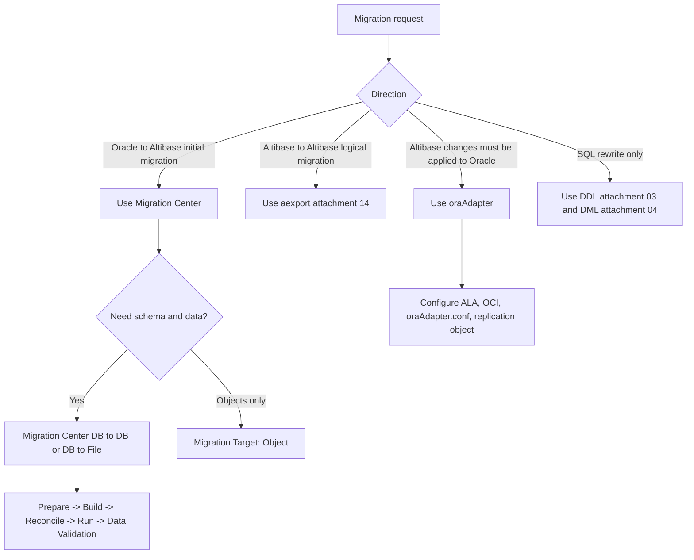
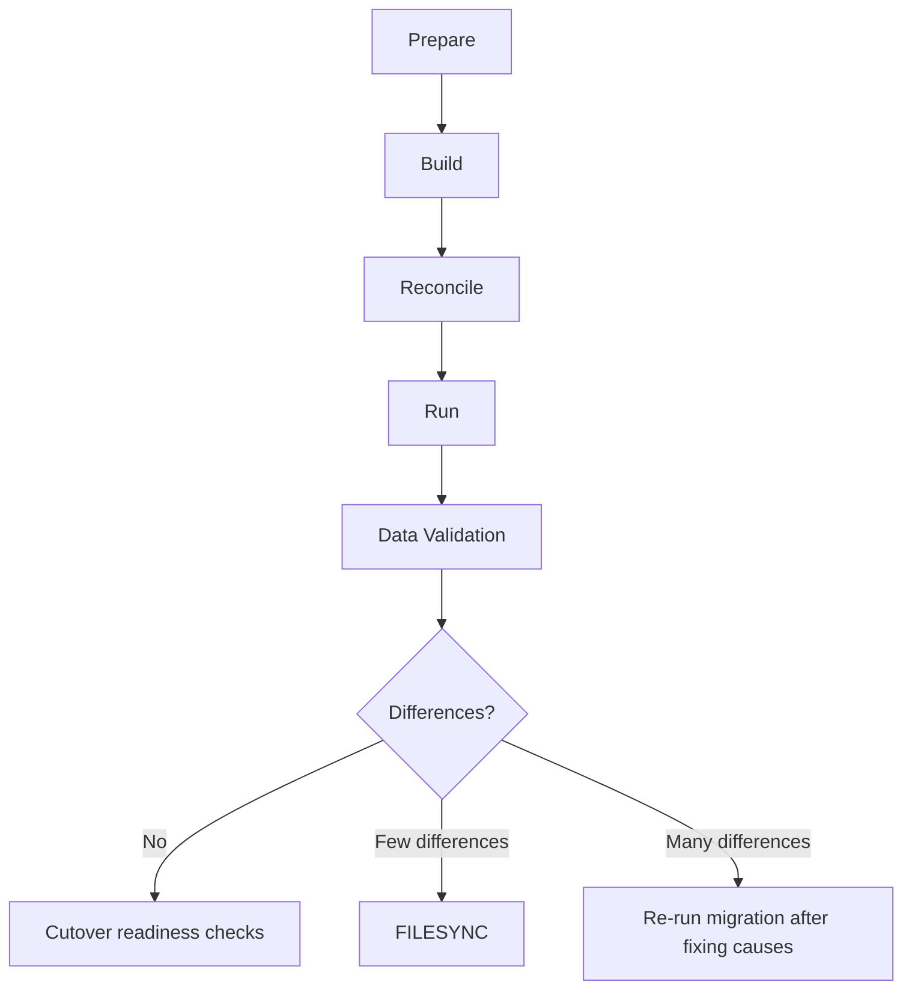
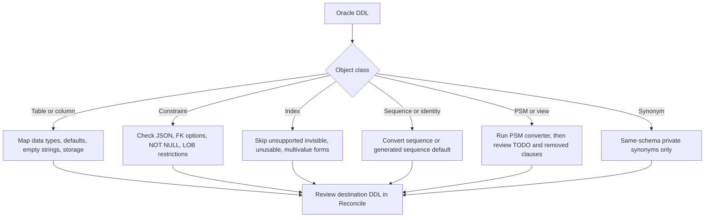
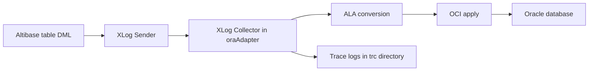

# 15. Migration and Oracle Compatibility

## Applicable Versions

- 7.1: Based on Altibase 7.1 Adapter for Oracle guidance and Migration Center guidance.
- 7.3: Based on Altibase 7.3 Adapter for Oracle guidance, Migration Center guidance, and Migration Center release-note coverage.
- 8.1: Based on Altibase 8.1 verified source Migration Center and Adapter for Oracle guidance.

## Questions This File Can Answer

- How do I plan and run an Oracle-to-Altibase migration with Migration Center?
- Which Migration Center options matter for schema, data, PSM, partition, empty string, and validation behavior?
- Which Oracle DDL and data type differences must be checked before running the migration?
- How are Oracle objects, defaults, character lengths, and JSON columns converted?
- When should `oraAdapter` be used, and how is DDL handled while it is applying Altibase changes to Oracle?

## Retrieval Alias Index

Use this compact index before scanning migration, adapter, and Oracle-difference sections. It is intentionally redundant with later headings so lexical retrieval can land on the exact Migration Center, oraAdapter, conversion, validation, or rewrite block.

- Aliases and customer wording: Oracle migration, Migration Center, schema migration, data migration, DB to DB, DB to File, Prepare, Build, Reconcile, Run, Data Validation, empty string, PSM conversion, partition conversion, oraAdapter, Adapter for Oracle, Oracle differences, Altibase to Altibase logical migration.
- Exact-token anchors: `Migration Center`, `7.9`, `7.10`, `7.11`, `7.12`, `7.13`, `7.14`, `7.15`, `7.16`, `7.17`, `7.18`, `7.19`, `BUG-47352`, `BUG-47372`, `BUG-47376`, `BUG-47381`, `BUG-47402`, `BUG-47408`, `BUG-47409`, `BUG-48340`, `BUG-48672`, `BUG-49467`, `BUG-49499`, `BUG-49579`, `BUG-49595`, `BUG-49731`, `BUG-49950`, `BUG-49951`, `BUG-50092`, `BUG-50160`, `BUG-50173`, `BUG-50180`, `BUG-50263`, `BUG-50652`, `BUG-50821`, `BUG-50827`, `BUG-51034`, `BUG-51035`, `BUG-51075`, `BUG-51076`, `BUG-51219`, `BUG-51220`, `BUG-51311`, `BUG-51319`, `BUG-51321`, `BUG-51472`, `BUG-51650`, `TASK-7433`, `Java 17`, `Java 18`, `JRE bundle`, `Prepare`, `Build`, `Reconcile`, `Run`, `Data Validation`, `Write to CSV`, `Oracle Database 10gR2`, `Oracle Database 12.2.0.1.0`, `Altibase 6.5.1`, `Altibase Log Analysis API`, `oraAdapter`, `Primary Key`, `aexport`, `DBMS_METADATA`, `JSON`.
- Answer route: use this file for migration planning and tool workflow; use `03_sql_ddl_generation.md` for converted DDL; use `04_sql_dml_oracle_compatibility.md` for SQL rewrites; use `05_data_types_properties.md` for data type and JSON limits; use `14_utilities_operation_tools.md` for `aexport`.
- Missing-input trigger: before production migration steps, ask for source Oracle version, target Altibase version, source and target character sets, storage design, object list, PSM use, downtime window, backup/rollback plan, and whether applications continue writing.

## Source Documents

- 7.1: Altibase 7.1 Adapter for Oracle User's Manual; Migration Center User's Manual.
- 7.3: Altibase 7.3 Adapter for Oracle User's Manual; Migration Center User's Manual; Migration Center 7.9 through 7.19 Release Notes; Altibase Java compatibility technical note.
- 8.1: Altibase 8.1 verified source Adapter for Oracle User's Manual; Altibase 8.1 verified source Migration Center User's Manual; Migration Center 7.9 through 7.19 Release Notes; Altibase Java compatibility technical note.

## Response Rules

- Answer explanatory text in the user's language.
- Keep SQL object names, function names, data types, error codes, property names, commands, file names, and file paths literal.
- Do not expose internal source labels, repository paths, local workstation paths, or original manual image paths in customer answers.
- If no Altibase version is specified, use the Altibase 8.1 verified source baseline and mention when behavior differs for 7.1 or 7.3.
- Treat Migration Center release numbers such as `7.19` as tool package versions, not as Altibase database server versions.
- Do not claim Oracle compatibility is complete. Classify each object or SQL construct as directly supported, converted with differences, or requiring manual redesign.
- For production migration commands, confirm source Oracle version, target Altibase version, target storage design, character sets, downtime window, backup/rollback plan, and whether applications will keep writing during migration.

## Fast Decision Map



## J017 Migration And Adapter Exact Answer Blocks

Use these blocks when a migration or Adapter for Oracle answer needs exact tool, scope,
or validation tokens.

Exact block: Migration Center 7.19 runtime and database scope

- Version scope: Migration Center `7.19` tool release; this is not an Altibase database
  server version.
- Runtime: Java 8 or later. GUI mode requires Java Swing support; CLI mode does not
  require an OS graphic library.
- Source database scope: Oracle Database 10gR2 through Oracle Database 21c.
- Target database scope: Altibase 6.5.1 or later.
- Connection model: Migration Center uses JDBC drivers for source and destination
  database connections; use an Oracle JDBC driver compatible with the source Oracle
  DBMS and the Java runtime.

Exact block: Migration Center 7.9-7.18 release-note boundary

- Version scope: Migration Center tool releases `7.9` through `7.18`; these are tool
  package versions, not Altibase database server versions.
- Customer answer rule: if a question asks whether a release-note change applies, ask
  for the installed Migration Center package version when it is missing. Do not assume
  a later-release change exists in an earlier package.
- Runtime boundary: the checked release notes for `7.9` through `7.18` require Java 8
  or later. GUI mode requires a Java Swing-capable graphics environment; CLI mode does
  not require an OS graphic library. Migration Center `7.10` additionally records
  OpenJDK 18 validation as `TASK-7433`.
- Release-note index:

| Tool release | Release date | Source-backed change boundary | BUG/TASK tokens |
| --- | --- | --- | --- |
| `7.9` | Dec. 31, 2021 | Adds Tibero 4 SP1 source support and OpenJDK 12 support; changes the minimum Migration Center runtime from JRE 1.5 to Java 8; updates the bundled JRE from 7 to 8 for Altibase 7.2 JDBC. | `BUG-47352`, `BUG-47372`, `BUG-47376`, `BUG-47381`, `BUG-47402`, `BUG-47408`, `BUG-47409`, `BUG-48340`, `BUG-48672`, `BUG-49467`, `BUG-49499` |
| `7.10` | Sept. 19, 2022 | Adds MySQL 5.6 and MySQL 5.7 as source versions, adds the `Batch LOB type` option for LOB batch processing, validates OpenJDK 18, and fixes MySQL BIT default conversion to `VARBIT`. | `BUG-49595`, `BUG-49731`, `TASK-7433`, `BUG-49579` |
| `7.11` | Oct. 21, 2022 | Adds unsupported-object SQL/report evidence during `Build` through `SrcDbObj_Create.sql` and `BuildReport4Unsupported.html`; fixes MySQL Unicode `CHAR`/`VARCHAR` conversion, including `CLOB` fallback when converted target length exceeds the target maximum. | `BUG-49950`, `BUG-49951` |
| `7.12` | Jan. 30, 2023 | Adds PostgreSQL 9.5.3 as a source database; preserves primary-key column sort order such as descending order during migration. | `BUG-50092` |
| `7.13` | March 20, 2023 | Fixes PostgreSQL migration of inherited `serial` defaults, unsupported constraint handling, and sequence `START WITH` values. | `BUG-50180`, `BUG-50173`, `BUG-50160` |
| `7.14` | Nov. 1, 2024 | Allows `Select Editing` conditions from `Reconcile` to be edited for `Run` through the UI or `TableCondition.properties`; changes Oracle/TimesTen/Tibero `BINARY_DOUBLE` mapping from `VARCHAR` to `DOUBLE` with `NaN`/`INF` data-loss caution; no longer supports Altibase-to-Oracle as a target direction; changes TimesTen `Binary` mapping from `BLOB` to `BYTE`; adds options for Empty String conversion and `Not Null & Default ''`; improves option-window scrolling and splitter resizing. | `BUG-50652`, `BUG-50263`, `BUG-50821`, `BUG-50827`, `BUG-51034`, `BUG-51035`, `BUG-51075`, `BUG-51076` |
| `7.15` | April 25, 2025 | Adds Oracle 12c, 18c, and 19c source support, Tibero 7 through 7.2.2 support, `Invisible Column Migration`, `Convert Oversized String VARCHAR To CLOB`, Oracle `Identity` migration through sequence-backed defaults, Oracle `DEFAULT ON NULL` conversion, and Oracle external-table/hybrid-partitioned-table migration as regular or partitioned Altibase tables assigned to disk tablespace. | `BUG-51219`, `BUG-51220`, `BUG-51311`, `BUG-51319` |
| `7.16` | Sept. 12, 2025 | Adds Oracle 21c source support, JSON data type migration as `JSON` when the target Altibase supports it or `CLOB` otherwise, `Correction Factor for Character Type Conversion`, option-value validation, and `orai18n.jar`; drops support for Oracle 9i, Oracle 10gR1, TimesTen 7, and Informix 11.50. | `BUG-51321`, `BUG-51472`, `BUG-51650` |
| `7.17` | Nov. 24, 2025 | Adds Altibase Windows 2026, also shown as Altibase 2.6.0, as a source and target database in the compatible database list. | No `BUG-*` token in the checked release note. |
| `7.18` | March 20, 2026 | Adds Altibase 8.1 as a source and target database in the compatible database list. | No `BUG-*` token in the checked release note. |

Exact block: Migration Center Java compatibility note

- Version scope: Altibase Java compatibility technical note, Tools table entry for
  `Migration Center 7.10`.
- Linux and Unix compatibility row: `Java 6` is unsupported, `Java 7` is unsupported,
  `Java 8` is supported with the footnote that Migration Center `7.9` changed the
  minimum Java version to Java 8, `Java 9 ~ Java 10` is supported, `Java 11` is
  supported with the footnote that Java 11 or later is supported from Migration Center
  `7.8`, `Java 12` is supported, `Java 17` is untested, and `Java 18` is tested.
- Windows boundary: Migration Center for Windows provides a `JRE bundle`; the source
  note groups it with Replication Manager as not affected by the externally installed
  Java version.
- Customer answer rule: for a `Java 17` question, do not infer support from `Java 18`.
  Say that the source table marks `Java 17` as untested, ask for OS, package version,
  GUI/CLI mode, and the actual startup error or log, then use a tested runtime or a
  staged run as the safest next check.

Exact block: CLI sequence from project setup through FILESYNC

- GUI stage names: `Prepare`, `Build`, `Reconcile`, `Run`, and `Data Validation`.
- CLI setup: `./migcenter.sh register register.xml` registers the project and database
  connections for the `Prepare` stage.
- CLI sequence:

```bash
./migcenter.sh register register.xml
./migcenter.sh build project_path
./migcenter.sh reconcile project_path
./migcenter.sh run project_path
./migcenter.sh diff project_path
./migcenter.sh filesync project_path
```

- `diff` is the CLI Data Validation step. `filesync` applies CSV differences only when
  `FILESYNC` is the chosen correction method.
- CLI `Reconcile` uses default values and does not provide the same manual tuning
  workflow as GUI Reconcile; review generated reports and SQL before `Run`.

Exact block: Data Validation after `Run`

- Data Validation can compare only tables with a `Primary Key`.
- LOB columns are excluded from comparison targets; validate LOB data separately.
- `Write to CSV` controls whether inconsistent data is written to CSV files under the
  validation directory.
- The summary report is written regardless of the `Write to CSV` option.
- Use row-count or application-specific checks for tables without a `Primary Key`.

Exact block: `oraAdapter`, ALA, and OCI boundary

- Use `oraAdapter` when Altibase is the source of DML changes and Oracle is the apply
  target. Do not use it as the initial Oracle-to-Altibase migration tool.
- Implementation pieces: `oraAdapter` uses Altibase Log Analysis API to receive and
  interpret Altibase changes, and Oracle OCI to apply converted data to Oracle.
- Required setup: configure the ALA replication object, `XLog Sender`,
  `XLog Collector`, `oraAdapter.conf`, OCI libraries, Oracle connection properties, and
  ports before starting change apply.
- Startup order: start `oraAdapter`, confirm `Altibase Adapter started.`, then start the
  Altibase XLog sender with `ALTER REPLICATION ala START`.

## Tool and Version Scope

Migration Center:

- Purpose: migrates generally compatible database objects and table data to Altibase.
- Interfaces: GUI mode and CLI mode.
- Source database scope for the 7.19 tool release includes Oracle Database `10gR2` through `21c`.
- Target database scope for the 7.19 tool release includes Altibase `6.5.1` or later.
- Runtime: Java 8 or later. GUI mode requires Java Swing support; CLI mode does not require an OS graphic library.
- Connection model: JDBC drivers are used for source and destination database connections. Use an Oracle JDBC driver compatible with the source Oracle DBMS and the Java runtime used by Migration Center.

Adapter for Oracle:

- Purpose: `oraAdapter` applies DML changes generated in Altibase to an Oracle database by using Altibase Log Analysis API and Oracle OCI.
- Use it for post-cutover synchronization, dual-write transition work, or recovery scenarios where Altibase is the source of changes and Oracle is the apply target.
- Do not use `oraAdapter` as the primary Oracle-to-Altibase migration tool. Use Migration Center for the initial Oracle-to-Altibase schema and data movement.
- The `oraAdapter` package version must match the Altibase version with which it runs.

## End-to-End Oracle-to-Altibase Migration Flow



Step block: `Prepare`

- Purpose: make source Oracle and target Altibase connections usable inside a Migration Center project.
- Required inputs: Oracle host, port, service or JDBC URL details, Oracle user/password, Oracle JDBC driver, Altibase host, port, Altibase user/password, Altibase JDBC driver, connection encoding, and optional JDBC properties.
- GUI procedure: start `migcenter.bat` on Windows or `migcenter.sh` on Unix-like systems; use `Database > Add Database Connection`; fill `DB Product`, `Connection Name`, `IP`, `Port`, `User`, `Password`, `JDBC Driver`, `Encoding`, `IP Version`, and `Property`; test the connection; then create or open a project and connect both databases.
- CLI procedure: define connection and project entries in a registration XML file, then run `./migcenter.sh register register.xml`.
- Cautions: if JDBC metadata cannot be retrieved from older Oracle versions, replace the Oracle JDBC driver with a driver compatible with the source database.

Step block: `Build`

- Purpose: collect source and target metadata, estimate data volume, and produce build reports.
- GUI procedure: choose `Migration > Build User` for all migratable objects owned by the source connection user, or `Migration > Build Table` for selected tables and dependent constraints/indexes.
- CLI command:

```bash
./migcenter.sh build project_path
```

- Counting methods: `Approximate Counting Method` is faster and uses source statistics; `Exact Counting Method` runs count queries and is slower but more accurate for progress estimation.
- Outputs: build reports, `SrcDbObj_Create.sql`, and unsupported-object reports where applicable.
- Caution: if Oracle metadata changes after Build, rerun Build, Reconcile, and Run.

Step block: `Reconcile`

- Purpose: build the actual migration plan and adjust source-to-target differences.
- GUI procedure: choose `Migration > Reconcile`, then confirm or edit data type mapping, PSM data type mapping, tablespace mapping, object-to-tablespace mapping, partitioned table conversion, SELECT statements, unacceptable names, and destination DDL.
- CLI command:

```bash
./migcenter.sh reconcile project_path
```

- Important limitation: CLI Reconcile uses default values and does not provide the same manual tuning experience as GUI mode.
- Outputs: Reconcile reports, sample `DbObj_Create.sql`, sample `DbObj_Drop.sql`, and PSM conversion reports such as `sqlconv.html`, `sqlconv_src.sql`, and `sqlconv_dest.sql`.
- Caution: if `Migration Options` are changed after Reconcile, run Reconcile again.

Step block: `Run`

- Purpose: create destination schema and copy data, or create files for later loading.
- GUI procedure: choose `Migration > Run`, confirm the warning dialog, and review the report.
- CLI command:

```bash
./migcenter.sh run project_path
```

- Internal order: `Initialization`, `PreSchema`, `Table & Data`, then `PostSchema`.
- `PreSchema`: migrates sequence objects.
- `Table & Data`: migrates table objects and data.
- `PostSchema`: migrates queues, constraints, indexes, private synonyms, and PSM-related objects depending on source DBMS and version.
- Outputs: `RunReport4Summary.html`, `RunReport4Missing.html`, `DbObj_Failed.sql`, and failed-data files under `db2db` or `db2file` depending on migration type and options.
- Caution: Run is irreversible in the sense that it changes the destination database. Confirm backups, object-drop settings, and target connection details first.

Step block: `Data Validation`

- Purpose: compare migrated table data after Run.
- GUI procedure: choose `Migration > Data Validation`.
- CLI commands:

```bash
./migcenter.sh diff project_path
./migcenter.sh filesync project_path
```

- Restrictions: Data Validation can compare only tables with a primary key. LOB columns are excluded from comparison targets.
- Outputs: Data Validation reports and, when configured, CSV files for different rows.
- Recommended action: use `FILESYNC` for small differences; fix root causes and rerun migration when differences are broad.

## Migration Center CLI Cookbook

Use CLI mode when GUI mode is unavailable, or after GUI Reconcile when the expensive Run and validation work should execute near the database server.

Compact CLI syntax:

```text
migcenter_command ::=
    ./migcenter.sh register registration_xml
  | ./migcenter.sh build project_path
  | ./migcenter.sh reconcile project_path
  | ./migcenter.sh run project_path
  | ./migcenter.sh diff project_path
  | ./migcenter.sh filesync project_path

registration_xml ::= XML file in the Migration Center installation directory
project_path     ::= registered Migration Center project directory
```

```bash
# 1. Register project and database connections.
./migcenter.sh register register.xml

# 2. Edit project options if needed.
# The options.xml file is created in the project folder.

# 3. Build metadata and reports.
./migcenter.sh build project_path

# 4. Reconcile with default CLI decisions.
./migcenter.sh reconcile project_path

# 5. Execute migration.
./migcenter.sh run project_path

# 6. Compare migrated data.
./migcenter.sh diff project_path

# 7. Apply CSV differences when FILESYNC is the chosen correction method.
./migcenter.sh filesync project_path
```

Practical pattern:

- Use GUI mode through Reconcile when DDL, tablespaces, data type mapping, PSM objects, or partition conversion need manual review.
- Use CLI mode for `run`, `diff`, and `filesync` when network distance between the GUI client and databases would slow data transfer.

## Pre-Migration Checklist

Checklist item: Source and target version

- Confirm Oracle source version and Altibase target version.
- For Altibase 8.1 answers, use the Altibase 8.1 verified source baseline.
- Treat Migration Center `7.19` as a tool release. It can target Altibase `6.5.1` or later according to its release notes.

Checklist item: Target storage design

- Decide which objects belong in memory, disk, volatile, and temporary tablespaces.
- Prepare a volatile tablespace before migrating Oracle global temporary tables because Altibase temporary tables can be created only in volatile tablespaces.
- Prepare disk tablespace access for Oracle external tables and hybrid partitioned tables, because Migration Center converts them to regular or partitioned Altibase tables and allocates them to disk.

Checklist item: Character set and string length

- Capture Oracle database character set and national character set.
- Capture Altibase database character set and national character set.
- Review character length conversion in Reconcile before Run, especially for `CHAR`, `VARCHAR2`, `NCHAR`, and `NVARCHAR2`.

Checklist item: Object selection

- Use `Build User` for schema-level migration.
- Use `Build Table` for selected tables and their dependent constraints/indexes.
- Remember that Oracle sequences, private synonyms, and PSM-family objects are not migrated by `Build Table`.

Checklist item: DDL review

- Review destination DDL in Reconcile before Run.
- Confirm data type mapping, tablespace mapping, partition behavior, identifier quoting, reserved words, default values, empty string handling, JSON mapping, and PSM conversion comments.

Checklist item: Data migration risk

- Decide whether to use batch inserts.
- Disable or tune batch LOB processing if large LOB data can cause out-of-memory risk.
- Decide how to handle rows that fail insertion and whether failed data should be logged.

Checklist item: Validation

- Ensure critical tables have primary keys if Migration Center Data Validation must compare them.
- Plan separate validation for LOB columns because Data Validation excludes LOB comparison targets.

## Key Migration Options

Option block: `Migration Type`

- `DB to DB`: Migration Center creates destination objects and copies data directly to Altibase.
- `DB to File`: Migration Center creates SQL scripts, form files, and CSV data files; use iSQL and iLoader to load them into Altibase.

Option block: `Migration Target`

- `Object & Data`: migrate schema and table data.
- `Object`: migrate database objects only.

Option block: `Foreign Key Migration`

- Controls whether foreign key constraints are included in the migration target.
- Default is `No` for DB-to-DB and DB-to-File option sets in the source guidance.
- For large migrations, creating foreign keys after loading data is usually easier to troubleshoot.

Option block: `PSM Migration`

- Controls whether procedures, functions, packages, views, materialized views, typesets, and triggers are included.
- DB-to-DB default is `Yes`.
- DB-to-File default is `Yes`.
- The default attempt to include PSM objects does not mean semantic compatibility. Review `sqlconv.html`, `sqlconv_src.sql`, and `sqlconv_dest.sql`, then compile and runtime-test converted procedures, functions, packages, views, materialized views, typesets, and triggers.

Option block: `Drop Existing Objects`

- Controls whether destination objects with the same names are dropped and recreated.
- Default is `No`.
- Treat `Yes` as destructive. Confirm backup and rollback before enabling it.

Option block: `Keep Partition Table`

- `Yes`: migrate source partitioned tables as partitioned target tables and review partition conversion during Reconcile.
- `No`: migrate partitioned source tables as non-partitioned target tables.
- Default is `No`.

Option block: `Use Double-quoted Identifier`

- Controls whether Migration Center can wrap problem schema and object names in double quotes.
- Use it when Reconcile reports object names with spaces, special characters, or other forms that violate unquoted Altibase identifier rules.
- Keep object names literal when explaining this option; quoted identifiers can affect application SQL.

Option block: `Remove FORCE from View DDL`

- Controls whether `FORCE` is removed from view creation statements.
- Altibase does not use Oracle `CREATE FORCE VIEW` semantics. Review converted views and dependencies.

Option block: `Invisible Column Migration`

- Altibase does not support Oracle invisible columns.
- `Yes`: invisible columns are converted to normal columns and migrated.
- `No`: invisible columns are excluded from migration.
- Default is `No`.

Option block: `Postfix for reserved word`

- Adds a postfix to source object names that conflict with Altibase reserved keywords.
- Default postfix is `_POC`.

Option block: `Batch Execution` and `Batch Size`

- `Batch Execution` uses JDBC batch insert for higher performance.
- Default is `Yes`; default `Batch Size` is `10000`.
- Disable batch execution when troubleshooting individual insert failures.

Option block: `Batch LOB type`

- Controls whether `BLOB` and `CLOB` are batch processed.
- Default is `No`.
- Enabling it can improve throughput but can also cause out-of-memory issues with large LOBs.

Option block: `Convert Oversized String VARCHAR To CLOB`

- Applies when a source string column maps to Altibase `VARCHAR` but exceeds the Altibase maximum of `32000` bytes.
- `Yes`: convert to `CLOB`.
- `No`: convert to `VARCHAR(32000)`, which can truncate or reject oversized values.
- Default is `Yes`.

Option block: `Correction Factor for Character Type Conversion`

- Adjusts `CHAR` and `VARCHAR` byte lengths when source and target character sets use different maximum bytes per character.
- Formula:

```text
Dest. Size = Ceil(Correction Factor * Src. Size)
Correction Factor = Dest. MaxBytes / Src. MaxBytes
```

- A value of `1` disables length expansion.
- If a character set is specified at the column level, Migration Center uses its automatic calculation for that column instead of the user-defined factor.

Option block: `Data Validation Options`

- `Operation`: `DIFF` compares data; `FILESYNC` applies CSV differences to the destination.
- `Write to CSV`: writes inconsistent data to CSV.
- `Include LOB`: controls whether LOB data is written to CSV for differences.
- `Data Sampling`: default is `Yes`; set to `No` for full validation when runtime allows.

## Oracle Object Migration Support

Object block: `Table`

- `Build User`: migratable.
- `Build Table`: migratable.
- Notes: table and column comments are migrated. Oracle global temporary tables require a volatile Altibase tablespace. Oracle external tables and hybrid partitioned tables are converted to regular or partitioned Altibase tables and need disk tablespace access. Blockchain and immutable tables are converted to regular tables.

Object block: `Primary Key Constraint`

- `Build User`: migratable.
- `Build Table`: migratable.

Object block: `Unique Constraint`

- `Build User`: migratable.
- `Build Table`: migratable.

Object block: `Check Constraint`

- `Build User`: migratable.
- `Build Table`: migratable.
- Notes: `IS JSON` check constraints are excluded from migration.

Object block: `Foreign Key Constraint`

- `Build User`: migratable.
- `Build Table`: migratable.
- Notes: inclusion depends on the `Foreign Key Migration` option.

Object block: `Index`

- `Build User`: migratable.
- `Build Table`: migratable.
- Notes: invisible indexes, unusable indexes, and multivalue indexes are not migrated.

Object block: `Sequence`

- `Build User`: migratable.
- `Build Table`: not migrated as an independent sequence object.
- Notes: scalable sequences are not migrated.

Object block: `Private Synonym`

- `Build User`: partly migratable.
- `Build Table`: not migrated.
- Notes: only synonyms that refer to objects in the same schema are migrated.

Object block: `Procedure`, `Function`, `Package`, `View`, `Materialized View`, `Trigger`

- `Build User`: partly migratable.
- `Build Table`: not migrated.
- Notes: Migration Center converts object creation statements using PSM converter rules and attempts migration. Review converted SQL, TODO comments, removed clauses, dependency order, and runtime semantics before accepting the result.

## Oracle-to-Altibase DDL Difference Map



Difference block: storage clauses and tablespaces

- Oracle tablespace assumptions do not translate directly to Altibase storage design.
- Altibase table placement must distinguish memory, disk, volatile, and temporary storage.
- If `TABLESPACE` is omitted in Altibase table DDL, Altibase uses the creating user's default tablespace; if that is not set, the system memory default tablespace can be used.
- Review each target table and index tablespace in Reconcile instead of accepting Oracle storage clauses blindly.

Difference block: temporary tables

- Oracle global temporary tables are migrated to Altibase temporary tables.
- Altibase temporary tables can only be created in volatile tablespaces.
- Create and grant access to a volatile tablespace before Reconcile if Oracle global temporary tables are in scope.

Difference block: external, hybrid partitioned, blockchain, and immutable tables

- Oracle external tables and hybrid partitioned tables are converted to regular or partitioned Altibase tables.
- These tables are often large and are automatically allocated to disk tablespace.
- Oracle blockchain and immutable tables are converted to regular Altibase tables.

Difference block: partitioned tables

- `Keep Partition Table=Yes` preserves partitioned table shape where Migration Center can convert it.
- `Keep Partition Table=No` converts partitioned source tables to non-partitioned target tables.
- Always review partitioned table conversion during Reconcile.

Difference block: identifiers

- Object names that violate unquoted Altibase identifier rules can fail creation.
- Use the Reconcile `Unacceptable Name` step to find them.
- Enable `Use Double-quoted Identifier` only when the application can tolerate quoted identifier behavior.
- Reserved-word conflicts can be handled by the configured postfix, default `_POC`.
- Altibase object names are limited to `40 bytes`.
- `double quotes` can wrap object names. If an object is created with a quoted name, later SQL must also reference that exact double-quoted name.
- Unquoted object names are case-insensitive and internally converted to `uppercase`.
- Unquoted names can contain `A-Z`, `a-z`, `0-9`, `_`, `$`, and `#`.
- The first unquoted character must be a letter or `_`.
- Unquoted names cannot begin with `V$`, `X$`, or `D$`.
- Quoted names can include punctuation or spaces, but not the `double quotes` character itself.
- Migration answer pattern: ask for the Oracle object definitions and the Migration Center `Reconcile` / `DbObj_Create.sql` output before deciding whether to quote, rename, postfix, or redesign object references.

Difference block: Oracle outer join operator `(+)`

- Altibase 7.3 documents `Cross Join`, `Inner Join`, `Outer Join`, `Semi Join`, and `Anti Join`.
- For `LEFT OUTER JOIN`, the documented Oracle-style equivalent is `A.c1 = B.c1(+)`; rows from the left table are preserved and right-side columns are `NULL` when there is no match.
- For `RIGHT OUTER JOIN`, the documented Oracle-style equivalent is `A.c1(+) = B.c1`; rows from the right table are preserved and left-side columns are `NULL` when there is no match.
- `FULL OUTER JOIN` is documented in ANSI syntax. Do not invent a `(+)` rewrite for full outer join.
- During migration, prefer explicit ANSI `LEFT OUTER JOIN`, `RIGHT OUTER JOIN`, or `FULL OUTER JOIN` in reviewed application SQL, and check that LOB columns are not used as join conditions.

Difference block: default values

- Most default values are kept as-is, but some source defaults require conversion or manual review.
- Oracle date strings such as `'97/04/21'` are emitted as comments such as `/* DEFAULT '97/04/21' */` so the user can choose the correct Altibase expression.
- Only listed standalone source functions are converted automatically. Complex expressions can remain incompatible and must be reviewed in Reconcile.

Difference block: empty strings

- Altibase treats empty strings `''` as `NULL`.
- Oracle also treats `CHAR` and `VARCHAR2` empty strings as `NULL`, but migration can still fail if a source definition combines `DEFAULT ''` with `NOT NULL`.
- Object Options can replace the default empty string, remove `NOT NULL`, or both.
- Data Options can replace empty string data in `NOT NULL` columns and optionally nullable columns.

Difference block: LOB and `NOT NULL`

- Migration Center can remove a `NOT NULL` constraint from a LOB column during migration because Altibase LOB insertion is initialized with `NULL` before the LOB value is written through a LOB locator.
- After data migration, manually validate LOB rows and add the `NOT NULL` constraint if the target design requires it.

Difference block: JSON

- For Altibase 7.3 and earlier, Oracle `JSON` columns are converted to `CLOB`.
- For Altibase 8.1 verified source and later JSON-capable targets, Oracle `JSON` columns are converted to `JSON`.
- Oracle `VARCHAR2`, `BLOB`, or `CLOB` columns with an `IS JSON` check constraint can be treated as JSON source columns, but the `IS JSON` check constraint itself is excluded from migration.
- SQL rewrite mapping: in 8.1 target SQL, use only source-listed Altibase SQL/JSON functions and predicates such as `JSON_ARRAY`, `JSON_OBJECT`, `JSON_EXISTS`, `JSON_QUERY`, `JSON_VALUE`, `JSON_VALID`, and `IS JSON`. For Oracle SQL/JSON constructs not listed in the Altibase SQL Reference, such as `JSON_TABLE` or Oracle-specific JSON dot notation, route the statement to manual Reconcile review and rewrite it with `04_sql_dml_oracle_compatibility.md`.
- Runtime cautions: native `JSON` processing uses Temporary LOB. Before accepting 8.1 JSON SQL in migrated application code, check `TEMPORARY_LOB_ENABLE`, path-expression literal forms, return types, and JSON-specific errors.

Difference block: PSM

- Oracle PL/SQL-like objects are converted by Migration Center's PSM converter, but semantic logic is not fully converted.
- Review `TODO` comments and removed-clause comments in converted PSM output.
- Use attachment `10_psm_stored_external_procedures.md` for Altibase PSM syntax and execution rules.

## Oracle-to-Altibase Data Type Mapping Blocks

Data type block: `CHAR`

- Source: `CHAR`
- Destination: `CHAR`
- Notice: Oracle character-length definitions are converted to Altibase byte-length definitions because Altibase `CHAR` is defined in bytes.

Data type block: `NCHAR`

- Source: `NCHAR`
- Destination: `NCHAR`
- Notice: explicit sizes are kept, for example `NCHAR(10)` to `NCHAR(10)`. Oracle JDBC reports national character column size in bytes, while Altibase JDBC reports the number of stored characters, so the target column can be larger than necessary.

Data type block: `VARCHAR2`

- Source: `VARCHAR2`
- Destination: `VARCHAR` or `CLOB`
- Notice: Oracle character-length definitions are converted to Altibase byte-length definitions. If the mapped length exceeds `32000` bytes, `Convert Oversized String VARCHAR To CLOB=Yes` converts to `CLOB`; `No` converts to `VARCHAR(32000)`.

Data type block: `NVARCHAR2`

- Source: `NVARCHAR2`
- Destination: `NVARCHAR`
- Notice: size differences follow the same national-character size caveat as `NCHAR`.

Data type block: `LONG`

- Source: `LONG`
- Destination: `CLOB`

Data type block: `NUMBER`

- Source: `NUMBER`
- Destination: `NUMBER`
- Notice: `NUMBER` without precision and scale remains `NUMBER` without precision and scale. Oracle and Altibase internally handle this form as floating-number style storage.

Data type block: `FLOAT`

- Source: `FLOAT`
- Destination: `FLOAT`

Data type block: `BINARY FLOAT`

- Source: `BINARY FLOAT`
- Destination: `FLOAT`

Data type block: `BINARY DOUBLE`

- Source: `BINARY DOUBLE`
- Destination: `DOUBLE`
- Notice: `NaN` and `INF` values are not supported by Altibase and are not migrated.

Data type block: `DATE`

- Source: `DATE`
- Destination: `DATE`

Data type block: `TIMESTAMP`

- Source: `TIMESTAMP`
- Destination: `DATE`
- Notice: precision can be lost. Oracle timestamp scale is nanoseconds, 9 digits; Altibase date/time fractional scale is microseconds, 6 digits.

Data type block: `RAW`

- Source: `RAW`
- Destination: `BLOB`

Data type block: `LONG RAW`

- Source: `LONG RAW`
- Destination: `BLOB`

Data type block: `BLOB`

- Source: `BLOB`
- Destination: `BLOB`

Data type block: `CLOB`

- Source: `CLOB`
- Destination: `CLOB`

Data type block: `NCLOB`

- Source: `NCLOB`
- Destination: `NVARCHAR(10666)`
- Notice: Altibase has no compatible `NCLOB` type. Data can be lost if actual precision exceeds the `NVARCHAR` maximum.

Data type block: `ROWID`

- Source: `ROWID`
- Destination: `VARCHAR(18)`
- Notice: Altibase does not support Oracle `ROWID` as a data type.

Data type block: `JSON`

- Source: `JSON`
- Destination: `CLOB` or `JSON`
- Notice: Altibase 7.3 and earlier use `CLOB`; Altibase 8.1 verified source and later JSON-capable targets use `JSON`.

Migration-risk note: Oracle SQL/JSON syntax is not automatically portable. For Altibase
8.1 target SQL, use only source-listed functions and predicates such as
`JSON_ARRAY`, `JSON_OBJECT`, `JSON_EXISTS`, `JSON_QUERY`, `JSON_VALUE`,
`JSON_VALID`, `IS JSON`, and `IS NOT JSON`. For 7.3 and earlier targets, route
JSON storage to `CLOB` or a manual design unless the customer provides exact
target-version proof.

## Default Value Conversion Blocks

Default block: character empty string

- Source pattern: `DEFAULT ''`
- Destination behavior: Altibase treats it as `DEFAULT NULL`, so the default can be removed.
- If combined with `NOT NULL`, configure empty string handling before Run.

Default block: date string literal

- Source example: `DEFAULT '97/04/21'`
- Destination example: `/* DEFAULT '97/04/21' */`
- Action: manually replace the comment with a target-safe expression such as `TO_DATE(...)` after confirming the intended format.

Default block: `DBTIMEZONE`

- Source: `DBTIMEZONE`
- Destination: `DB_TIMEZONE()`

Default block: `SYS_GUID()`

- Source: `SYS_GUID()`
- Destination: `SYS_GUID_STR()`

Default block: `UID`

- Source: `UID`
- Destination: `USER_ID()`

Default block: `USER`

- Source: `USER`
- Destination: `USER_NAME()`

Default block: identity column

- Source: Oracle identity column
- Destination pattern: `__SYS_table_name_column_name_SEQ.NEXTVAL`
- Notes: Migration Center generates a sequence-backed default for the target column.

Default block: `DEFAULT ON NULL`

- Source example: `DEFAULT ON NULL 'test'`
- Destination example: `DEFAULT 'test' NOT NULL`

Compact example:

```sql
-- Source Oracle pattern
CREATE TABLE testtbl_4_defval (
  c6 DATE DEFAULT '97/04/21',
  c8 VARCHAR2(100) DEFAULT DBTIMEZONE,
  c9 VARCHAR2(100) DEFAULT SYS_GUID(),
  c12 NUMBER GENERATED BY DEFAULT AS IDENTITY,
  c13 CHAR(5) DEFAULT ON NULL 'test'
);

-- Destination Altibase pattern after conversion and review
CREATE TABLE TESTTBL_4_DEFVAL (
  C6 DATE /* DEFAULT '97/04/21' */,
  C8 VARCHAR(100) DEFAULT DB_TIMEZONE(),
  C9 VARCHAR(100) DEFAULT SYS_GUID_STR(),
  C12 NUMBER DEFAULT __SYS_TESTTBL_4_DEFVAL_C12_SEQ.NEXTVAL NOT NULL,
  C13 CHAR(5) DEFAULT 'test' NOT NULL
);
```

## Empty String Handling Blocks

Source column pattern:

```sql
C1 CHAR(10) DEFAULT '' NOT NULL
```

Object option result block: replace default and remove `NOT NULL`

- `Replace Default Empty String=Yes`
- `Replacement Default Value=EMPTY_STRING`
- `Remove Not Null=Yes`
- Generated target column:

```sql
C1 CHAR(10) DEFAULT 'EMPTY_STRING'
```

Object option result block: replace default and keep `NOT NULL`

- `Replace Default Empty String=Yes`
- `Replacement Default Value=EMPTY_STRING`
- `Remove Not Null=No`
- Generated target column:

```sql
C1 CHAR(10) DEFAULT 'EMPTY_STRING' NOT NULL
```

Object option result block: do not replace default and remove `NOT NULL`

- `Replace Default Empty String=No`
- `Remove Not Null=Yes`
- Generated target column:

```sql
C1 CHAR(10)
```

Object option result block: do not replace default and keep `NOT NULL`

- `Replace Default Empty String=No`
- `Remove Not Null=No`
- Generated target column:

```sql
C1 CHAR(10) NOT NULL
```

Data option block: replace empty string rows

- `Replace Empty Strings in Not Null=Yes`: replace empty string data in `NOT NULL` columns.
- `Replacement String`: replacement value.
- `Apply to Nullable Columns=Yes`: also replace empty string data in nullable columns.

## Character Set and Length Blocks

Length conversion rule:

```text
Dest. Size = Ceil(Correction Factor * Src. Size)
Correction Factor = Dest. MaxBytes / Src. MaxBytes
```

Common Altibase max-byte block:

- `KO16KSC5601`: `2`
- `MS949`: `2`
- `BIG5`: `2`
- `GB231280`: `2`
- `MS936`: `2`
- `UTF8`: `3`
- `SHIFTJIS`: `2`
- `MS932`: `2`
- `EUCJP`: `3`

Common Oracle max-byte block:

- `AL16UTF16`: `4`
- `AL32UTF8`: `4`
- `UTF8`: `3`
- `JA16EUC`: `3`
- `JA16SJIS`: `2`
- `KO16KSC5601`: `2`
- `KO16MSWIN949`: `2`
- `ZHS16GBK`: `2`
- `ZHS32GB18030`: `4`
- `ZHT16BIG5`: `2`
- `US7ASCII`: `1`
- `WE8ISO8859P1`: `1`
- `WE8MSWIN1252`: `1`

Operational guidance:

- For character sets not listed by Migration Center, it treats max bytes per character as `1`.
- If the target character set has larger max bytes than the source, target `CHAR` and `VARCHAR` byte lengths can increase.
- Large tables can require much more target storage after length correction.
- Review generated DDL for columns near Altibase limits, especially before accepting conversion to `CLOB`.

## PSM and View Conversion Review

Migration Center's PSM converter is useful, but it is not a proof of behavioral compatibility.

Review block: views

- `FORCE` can be removed.
- `WITH CHECK OPTION`, inline constraints, object views, XMLType views, `BEQUEATH`, `VISIBLE`/`INVISIBLE`, and default collation clauses can be removed or marked for manual conversion depending on the source statement.
- Confirm view dependencies after Run.

Review block: triggers

- Some Oracle trigger forms require manual conversion, including `INSTEAD OF`, triggers with multiple events, non-DML triggers, nested table triggers, trigger ordering clauses, disabled triggers, and `CALL` routine clauses.
- Review references to `:NEW` and `:OLD`; converted output can remove the colon where Altibase syntax requires it.

Review block: functions and procedures

- Oracle Java call specifications, C external call specifications, `PIPELINED`, aggregate implementations, `WITH CONTEXT`, `AGENT IN`, `ACCESSIBLE BY`, `PARALLEL_ENABLE`, `RESULT_CACHE`, and some `AUTHID` or `DETERMINISTIC` clauses can be removed or marked for manual work.
- Confirm whether required built-in packages exist in Altibase before accepting converted code.

Review block: packages and libraries

- Package `AUTHID`, `ACCESSIBLE BY`, default collation, library `AGENT`, `UNTRUSTED`, and editioning clauses can be removed or require manual conversion.
- Compile package specifications and bodies in dependency order and inspect errors.

Review block: generated reports

- `sqlconv.html`: compare source and converted PSM.
- `sqlconv_src.sql`: source PSM text.
- `sqlconv_dest.sql`: converted PSM with conversion comments.
- Treat any `TODO` comment as a required manual review item.

## Selective Data Migration

Use the Reconcile `Select Editing` step or `TableCondition.properties` to filter rows.

Pattern:

```properties
DATE_TEST=WHERE C2 > DATE'2023-12-02'

[DEST]
DATE_TEST=WHERE C2 > TO_DATE('2023-12-02', 'YYYY-MM-DD')
```

Rules:

- Each `WHERE` clause must be on a single line.
- Use the source SQL syntax before `[DEST]`.
- Use Altibase-compatible syntax under `[DEST]` when source and target SQL syntax differ.
- The same condition is used when verifying migrated record counts after Run.

## Post-Run Verification Checklist

Verification item: reports

- Review `RunReport4Summary.html` for migrated object and row counts.
- Review `RunReport4Missing.html` for failed objects and data.
- Review `DbObj_Failed.sql` for SQL statements that failed and their causes.

Verification item: schema

- Compare source and target counts for tables, primary keys, unique constraints, check constraints, foreign keys, indexes, sequences, synonyms, views, materialized views, procedures, functions, packages, and triggers.
- Inspect objects created with double-quoted identifiers or reserved-word postfixes.
- Recompile invalid PSM objects.

Verification item: data

- Run Migration Center `DIFF`.
- Run row-count checks for tables without primary keys because Data Validation cannot compare them.
- Use application-specific checks for LOB data because LOB columns are excluded from Data Validation comparison targets.

Verification item: performance and storage

- Check target tablespace usage after length correction and LOB conversion.
- Check indexes, statistics, and application query plans after data load.

Verification item: application cutover

- Re-test SQL that references Oracle-only behavior, Oracle packages, Oracle `ROWID`, date format assumptions, quoted identifiers, and JSON constraints.

## Oracle-Specific Troubleshooting Blocks

Troubleshooting block: `ORA-01652`

- Symptom: unable to extend temporary segment during large Oracle query processing.
- Cause: insufficient Oracle temporary tablespace for source-side query work.
- Action: increase Oracle temporary tablespace or reduce migration query workload.

Troubleshooting block: table has `LONG` or `LONG RAW` with LOB columns

- Risk: Oracle streams `LONG` and `LONG RAW`; if other stream data types are transmitted through the same connection, data transfer can be interrupted.
- Action: do not assume Migration Center can migrate such a table successfully. Redesign extraction or split the migration path.

Troubleshooting block: Oracle global temporary table fails during Reconcile

- Cause: target Altibase user cannot access a volatile tablespace.
- Action: create a volatile tablespace, grant access, and rerun Reconcile.

Troubleshooting block: repeated Oracle fetch or bind `SQLException`

- Cause: possible out-of-memory behavior in the Oracle JDBC driver during large data migration.
- Action: test table mode for one failing table, reduce batch pressure, review LOB settings, and use a compatible Oracle JDBC driver.

Troubleshooting block: `Fail to retrieve Source DDL: java.lang.NullPointerException`

- Cause: Oracle JDBC driver compatibility issue, especially with older Oracle sources.
- Action: replace the Oracle JDBC driver file used by Migration Center with a driver compatible with the Oracle DBMS.

Troubleshooting block: LOB `NOT NULL` removed

- Cause: Altibase LOB insertion flow initializes LOB data as `NULL` before writing through the LOB locator.
- Action: complete migration, validate LOB data, then add `NOT NULL` constraints manually where required.

## Adapter for Oracle Architecture



Adapter concept:

- `XLog`: logical log converted from physical Altibase logs for DML history.
- `XLog Sender`: Altibase module that analyzes active logs and sends XLogs and metadata.
- `XLog Collector`: component inside `oraAdapter` that receives XLogs and metadata.
- `ALA`: Altibase Log Analysis API used by `oraAdapter`.
- `OCI`: Oracle Call Interface used to write converted data to Oracle.

## Adapter for Oracle Installation and Configuration

Prerequisite block:

- 7.1 Adapter for Oracle guidance: Altibase `5.5.1` or later.
- 7.3 and Altibase 8.1 verified source Adapter for Oracle guidance: Altibase `6.5.1` or later.
- Oracle target: Oracle Database `10g` or higher with compatible OCI.
- Install OCI before running `oraAdapter`.
- Use the same database and national character sets on Altibase and Oracle when possible to reduce conversion cost.

Environment block:

- `ORA_ADAPTER_HOME`: `oraAdapter` installation directory.
- `PATH`: include `$ORA_ADAPTER_HOME/bin`.
- Library path: include the Oracle OCI library path. On common Unix-like systems this is `LD_LIBRARY_PATH`; on AIX it is `LIBPATH`.
- `NLS_LANG`: must correspond to the Altibase character set because `oraAdapter` receives strings from Altibase and OCI converts them for Oracle.

OCI compatibility example:

```bash
cd $ORACLE_HOME/lib
ln -s libclntsh.so.11.1 libclntsh.so.10.1
```

`NLS_LANG` examples:

- Altibase `US7ASCII`: `NLS_LANG=.US7ASCII`, Oracle DB `US7ASCII`.
- Altibase `KO16KSC5601`: `NLS_LANG=.KO16KSC5601`, Oracle DB `KO16KSC5601`.
- Altibase `MS949`: `NLS_LANG=.KO16MSWIN949`, Oracle DB `KO16MSWIN949`.
- Altibase `SHIFT-JIS`: `NLS_LANG=.JA16SJIS`, Oracle DB `JA16SJIS`.
- Altibase `EUC-JP`: `NLS_LANG=.JA16EUC`, Oracle DB `JA16EUC`.
- Altibase `GB231280`: `NLS_LANG=.ZHS16CGB231280`, Oracle DB `ZHS16CGB231280`.
- Altibase `BIG5`: `NLS_LANG=.ZHT16BIG5`, Oracle DB `ZHT16BIG5`.
- Altibase `UTF-8`: `NLS_LANG=.UTF8`, Oracle DB `UTF8`.

Configuration file:

- File: `$ORA_ADAPTER_HOME/conf/oraAdapter.conf`
- Do not use spaces or tabs in property values.
- Use double quotes for values that include special characters.

## Adapter for Oracle Property Blocks

ALA property block:

- `ALA_SENDER_IP`: IP address of the Altibase server. Default is `127.0.0.1`.
- `ALA_SENDER_REPLICATION_PORT`: sender connection port behavior. `0` means `oraAdapter` waits for the ALA sender; nonzero means it connects directly to that sender port.
- `ALA_RECEIVER_PORT`: port where `oraAdapter` listens for XLogs. Range is `1024` to `65535`.
- `ALA_RECEIVE_XLOG_TIMEOUT`: XLog receive timeout in seconds. Default is `300`.
- `ALA_REPLICATION_NAME`: replication object name created in Altibase.
- `ALA_SOCKET_TYPE`: `TCP` or `UNIX`; `UNIX` requires Altibase and `oraAdapter` on the same server.
- `ALA_XLOG_POOL_SIZE`: XLog pool capacity. Increase it for transactions that modify many records or when it is smaller than `REPLICATION_SYNC_TUPLE_COUNT`.
- `ALA_LOGGING_ACTIVE`: `1` enables ALA trace logs; `0` disables them.

Altibase connection property block:

- `ALTIBASE_USER`: Altibase account used for checks.
- `ALTIBASE_PASSWORD`: password for `ALTIBASE_USER`.
- `ALTIBASE_IP`: Altibase server IP. Default is `127.0.0.1`.
- `ALTIBASE_PORT`: Altibase server port. Range is `1024` to `65535`.

Oracle OCI property block:

- `ORACLE_SERVER_ALIAS`: Oracle alias from `tnsnames.ora`; if omitted, the default Oracle host is used.
- `ORACLE_USER`: Oracle account used for apply.
- `ORACLE_PASSWORD`: password for `ORACLE_USER`.
- `ORACLE_ASYNCHRONOUS_COMMIT`: `1` improves speed but weakens durability; `0` waits for commit log persistence.
- `ORACLE_GROUP_COMMIT`: `1` groups commit logs for throughput; can increase individual transaction response time.
- `ORACLE_ARRAY_DML_MAX_SIZE`: groups same-kind DML statements. Default is `10`; set to `1` to disable array DML.
- `ORACLE_UPDATE_STATEMENT_CACHE_SIZE`: cache size for prepared `UPDATE` statements. `0` disables this cache.

DML behavior property block:

- `ORACLE_ERROR_RETRY_COUNT`: retries record apply errors. LOB-related XLogs are excluded from retry.
- `ORACLE_ERROR_RETRY_INTERVAL`: retry interval in seconds.
- `ORACLE_SKIP_ERROR`: controls whether to continue after errors according to include/exclude lists.
- `ORACLE_SKIP_INSERT`: `1` skips applying Altibase `INSERT` to Oracle.
- `ORACLE_SKIP_UPDATE`: `1` skips applying Altibase `UPDATE` to Oracle.
- `ORACLE_SKIP_DELETE`: `1` skips applying Altibase `DELETE` to Oracle.
- `ORACLE_SET_USER_TO_TABLE`: `1` sets the Oracle table owner from the user specified in the XLog Sender.

Other property block:

- `ADAPTER_ERROR_RESTART_COUNT`: retry count for restarting `oraAdapter` after adapter-level errors.
- `ADAPTER_ERROR_RESTART_INTERVAL`: interval between adapter restart attempts.
- `ADAPTER_LOB_TYPE_SUPPORT`: `1` enables LOB support; `0` disables it.

Property value matrix:

| Property | Default | Valid values or range | Operational note |
| --- | --- | --- | --- |
| `ALA_SENDER_IP` | `127.0.0.1` | IP address | Altibase server address used by the XLog Sender. |
| `ALA_SENDER_REPLICATION_PORT` | `0` | `0` to `65535` | `0` makes `oraAdapter` wait for the ALA sender; nonzero makes `oraAdapter` connect directly to that sender port. |
| `ALA_RECEIVER_PORT` | not source-specified | `1024` to `65535` | Listener port where the XLog Collector receives XLogs. |
| `ALA_RECEIVE_XLOG_TIMEOUT` | `300` | `1` to `4294967295` seconds | XLog receive wait time. |
| `ALA_REPLICATION_NAME` | not source-specified | replication object name | Must match the Altibase replication object created for ALA. |
| `ALA_SOCKET_TYPE` | `TCP` | `TCP`, `UNIX` | `UNIX` requires Altibase and `oraAdapter` on the same server. |
| `ALA_XLOG_POOL_SIZE` | `100000` | `1` to `2147483647` | Increase when one transaction changes many rows or when it is smaller than `REPLICATION_SYNC_TUPLE_COUNT`. |
| `ALA_LOGGING_ACTIVE` | `1` | `0`, `1` | `1` writes ALA trace logs; `0` suppresses them. |
| `ALTIBASE_USER` | not source-specified | user name | Used by `oaUtility` constraint checks. |
| `ALTIBASE_PASSWORD` | not source-specified | password | Protect the file and avoid spaces or tabs in the value. |
| `ALTIBASE_IP` | `127.0.0.1` | IP address | Altibase server address used for checks. |
| `ALTIBASE_PORT` | not source-specified | `1024` to `65535` | Altibase listener port. |
| `ORACLE_SERVER_ALIAS` | default Oracle host when omitted | alias in `tnsnames.ora` | Set it to the Oracle service alias, for example `orcl10g`. |
| `ORACLE_USER` | not source-specified | Oracle user | Oracle apply account. |
| `ORACLE_PASSWORD` | not source-specified | password | Protect the file and quote special characters if needed. |
| `ORACLE_ASYNCHRONOUS_COMMIT` | `1` | `0`, `1` | `1` improves speed but can require re-synchronization after an Oracle crash. |
| `ORACLE_GROUP_COMMIT` | `1` | `0`, `1` | `1` batches commit logs for throughput but can increase individual transaction latency. |
| `ORACLE_ARRAY_DML_MAX_SIZE` | `10` | `1` to `32767` | Affects `INSERT` and `DELETE`; set `1` to disable Array DML. LOB interface updates do not use Array DML. |
| `ORACLE_UPDATE_STATEMENT_CACHE_SIZE` | `20` | `0` to `4294967295` | Caches prepared `UPDATE` statements; `0` disables this cache. |
| `ORACLE_ERROR_RETRY_COUNT` | `0` | `0` to `65535` | Record-apply retry count; XLogs containing LOB data are excluded from retry. |
| `ORACLE_ERROR_RETRY_INTERVAL` | `0` | `0` to `65535` seconds | Retry interval; `0` means no wait between retries. |
| `ORACLE_SKIP_ERROR` | `1` | `0`, `1` | `0` terminates after an unskipped error; `1` continues after the failed record unless the error is listed in `dbms_skip_error_exclude.list`. LOB XLog errors terminate regardless. |
| `ORACLE_SKIP_INSERT` | `0` | `0`, `1` | `1` skips applying Altibase `INSERT` to Oracle. |
| `ORACLE_SKIP_UPDATE` | `0` | `0`, `1` | `1` skips applying Altibase `UPDATE` to Oracle. |
| `ORACLE_SKIP_DELETE` | `0` | `0`, `1` | `1` skips applying Altibase `DELETE` to Oracle. |
| `ORACLE_SET_USER_TO_TABLE` | `1` | `0`, `1` | `1` uses the table owner specified by the XLog Sender when applying DML to Oracle. |
| `ADAPTER_ERROR_RESTART_COUNT` | `0` | `0` to `65535` | Adapter restart retry count after adapter-level apply errors. |
| `ADAPTER_ERROR_RESTART_INTERVAL` | `0` | `0` to `65535` seconds | Restart retry interval; `0` retries without a wait. |
| `ADAPTER_LOB_TYPE_SUPPORT` | `0` | `0`, `1` | `1` enables LOB support where the Adapter and OCI version support it. |

Property file rules:

- Do not use spaces or tabs in property values.
- Use double quotes around values that include special characters.
- Treat passwords and Oracle aliases as environment-specific inputs; do not reuse sample values in production.

## Adapter for Oracle Startup and Shutdown

Startup sequence:

1. Confirm Altibase and Oracle are running.
2. Confirm `REPLICATION_PORT_NO` is set to an available replication port. If it changes, restart Altibase.
3. Create an ALA replication object.

```sql
CREATE REPLICATION ala FOR ANALYSIS WITH '127.0.0.1', 25090
  FROM sys.t1 TO scott.t2;
```

4. Start `oraAdapter`.

```bash
cd $ORA_ADAPTER_HOME/bin
./oraAdapter
```

5. Confirm startup in the trace file.

```bash
cat $ORA_ADAPTER_HOME/trc/oraAdapter.trc
```

Expected message pattern:

```text
Altibase Adapter started.
```

6. Start the Altibase XLog sender after `oraAdapter` is running.

```sql
ALTER REPLICATION ala START;
```

Expected trace message pattern:

```text
Adapter is ready to process logs.
```

Shutdown sequence:

```sql
ALTER REPLICATION ala STOP;
```

Then stop `oraAdapter` with the chosen process control method or `oaUtility`.

## `oaUtility` Blocks

Utility prerequisite:

- `oaUtility` is a Bash-based script and uses tools such as `sed`, `grep`, `ps`, `wc`, iSQL, and SQLPlus.
- Personal shell or SQL startup files such as `login.sql` or `glogin.sql` can interfere; neutralize them when diagnosing utility behavior.

Command block: start

```bash
oaUtility start
oaUtility start force
```

- Starts `oraAdapter` as a daemon.
- `force` starts without checking primary key constraints in the replication target table.

Command block: stop

```bash
oaUtility stop
```

- Forcefully terminates the Adapter for Oracle process.

Command block: status

```bash
oaUtility status
```

- Checks whether `oraAdapter` is running.

Command block: check

```bash
oaUtility check
oaUtility check alive
oaUtility check constraints
```

- `oaUtility check`: continuously watches `oraAdapter` and restarts it if it exits.
- `alive`: checks once whether `oraAdapter` is running, then exits.
- `constraints`: checks whether primary keys in tables to be ported from Altibase to Oracle are defined consistently by column name.

Command block: version

```bash
./oraAdapter -v
./oraAdapter -version
```

- Prints `oraAdapter` version information.

## Adapter for Oracle Constraints

Constraint block: table requirements

- A primary key is required in each table to be replicated.
- The primary key of a replicated table cannot be modified.
- Tables on both sides must have the same column order and primary key constraints.

Constraint block: conflicts

- If `INSERT`, `UPDATE`, or `DELETE` conflicts in Oracle, execution is canceled and logged or skipped according to configuration.
- Replication speed can be slower than service-side DML generation.

Constraint block: connection count

- The maximum number of XLog Sender and replication connections per Altibase database is controlled by `REPLICATION_MAX_COUNT`.

Constraint block: ordinary DDL

- Replication target tables generally cannot execute DDL while replication is active.
- DDL on a replication target table causes changes before the DDL to be applied, then `oraAdapter` terminates. Restart after making the table schemas identical on both sides.

Constraint block: DDL allowed regardless of XLog Sender

- `ALTER INDEX REBUILD PARTITION`
- `GRANT OBJECT`
- `REVOKE OBJECT`
- `CREATE TRIGGER`
- `DROP TRIGGER`

Constraint block: LOB

- LOB data type support is available from Adapter for Oracle `7.1.0.7.0`.
- Set `ADAPTER_LOB_TYPE_SUPPORT=1` to use LOB support.
- LOB support depends on Oracle 11g-or-later OCI compatibility.
- LOB tables are constrained by `ORACLE_ERROR_RETRY_COUNT`, `ORACLE_SKIP_ERROR`, and `ORACLE_ARRAY_DML_MAX_SIZE`.
- If LOB data is updated using `SELECT FOR UPDATE` on Altibase, commit before relying on replication.

## Adapter for Oracle Data Type Mapping

Scope: this mapping is for `Adapter for Oracle` applying Altibase-originated
changes to Oracle. It is not a general claim that every Oracle DDL or Oracle
SQL construct can run unchanged in Altibase.

Data type block: numeric

- Altibase `FLOAT`, `NUMERIC`, `BIGINT`, `INTEGER`, and `SMALLINT` apply to Oracle `NUMBER`.
- Altibase `DOUBLE` applies to Oracle `NUMBER`; Oracle `BINARY_DOUBLE` can also be used.
- Altibase `REAL` applies to Oracle `NUMBER`; Oracle `BINARY_FLOAT` can also be used.

Data type block: date

- Altibase `DATE` applies to Oracle `DATE`.

Data type block: character

- Altibase `CHAR` applies to Oracle `CHAR`.
- Altibase `VARCHAR` applies to Oracle `VARCHAR2`.
- Altibase `NCHAR` applies to Oracle `NCHAR`.
- Altibase `NVARCHAR` applies to Oracle `NVARCHAR2`.

Data type block: LOB

- Altibase `CLOB` applies to Oracle `CLOB`.
- Altibase `BLOB` applies to Oracle `BLOB`.
- For Adapter for Oracle LOB apply, also confirm `ADAPTER_LOB_TYPE_SUPPORT=1`, Oracle 11g-or-later OCI compatibility, and LOB retry/skip behavior.

Example:

```sql
-- Altibase source table
CREATE TABLE T1(
  A1 INTEGER PRIMARY KEY,
  A2 CHAR(20),
  A3 VARCHAR(20),
  A4 NCHAR(20),
  A5 NVARCHAR(20)
);

-- Corresponding Oracle apply target
CREATE TABLE T1(
  A1 NUMBER PRIMARY KEY,
  A2 CHAR(20),
  A3 VARCHAR2(20),
  A4 NCHAR(20),
  A5 NVARCHAR2(20)
);
```

## DDL Order While Using `oraAdapter`

Use this order when a replicated table needs DDL.

1. Create matching schema on both sides.

```sql
CREATE TABLE T1 (C1 INTEGER PRIMARY KEY, C2 SMALLINT);
```

2. Create the ALA replication object on the active Altibase server.

```sql
CREATE REPLICATION ala FOR ANALYSIS
  WITH 'standby_or_adapter_ip', standby_or_adapter_port
  FROM SYS.T1 TO SYS.T1;
```

3. Start `oraAdapter`.

```bash
oaUtility start
```

4. Start replication.

```sql
ALTER REPLICATION ala START;
```

5. Flush replication gaps before DDL.

```sql
ALTER REPLICATION ala FLUSH ALL;
```

6. Enable replication DDL properties on the active server.

```sql
ALTER SYSTEM SET REPLICATION_DDL_ENABLE = 1;
ALTER SYSTEM SET REPLICATION_DDL_ENABLE_LEVEL = 1;
```

7. Execute the DDL on the active server. `oraAdapter` terminates when it processes the DDL log.

8. Confirm the active sender and `oraAdapter` trace.

```sql
SELECT REP_NAME, STATUS FROM V$REPSENDER;
```

Expected trace pattern:

```text
Log Record : Meta change xlog was arrived, adapter will be finished
```

9. Execute equivalent DDL on the Oracle target or standby side so schemas match.

10. Restart `oraAdapter`.

```bash
oaUtility start
```

11. Optionally stop and restart replication.

```sql
ALTER REPLICATION ala STOP;
ALTER REPLICATION ala START;
```

12. Run DML and verify data replication.

13. Disable replication DDL properties when DDL work is complete.

```sql
ALTER SYSTEM SET REPLICATION_DDL_ENABLE = 0;
ALTER SYSTEM SET REPLICATION_DDL_ENABLE_LEVEL = 0;
```

## Adapter for Oracle Offline Option

Use the offline option when an active Altibase server fails before logs are applied to Oracle and a standby server with the same database structure can access the active server log files.

Syntax:

```sql
CREATE REPLICATION ala_replication_name FOR ANALYSIS OPTIONS META_LOGGING
  WITH 'remote_host_ip', remote_host_port_no
  FROM user_name.table_name TO user_name.table_name;

ALTER REPLICATION ala_replication_name SET OFFLINE ENABLE WITH 'log_dir';
ALTER REPLICATION ala_replication_name SET OFFLINE DISABLE;
ALTER REPLICATION ala_replication_name BUILD OFFLINE META [AT SN(sn)];
ALTER REPLICATION ala_replication_name RESET OFFLINE META;
ALTER REPLICATION ala_replication_name START WITH OFFLINE;
```

Offline option notes:

- `META_LOGGING` writes sender meta and Restart SN information into `ala_meta_files` under the log file path.
- `SET OFFLINE ENABLE WITH 'log_dir'` can be executed only while replication is stopped.
- `BUILD OFFLINE META` reads metadata from the active server log path.
- `START WITH OFFLINE` performs one-time offline replication and terminates after applying available logs.
- If DDL logs are in the gap, offline replication halts. Apply the same DDL on the server performing offline replication or Oracle target as appropriate, then restart offline replication.
- Do not run `RESET OFFLINE META` just because DDL logs caused an offline replication error; rereading the DDL logs can reproduce the same error.

Offline constraints:

- The ALA object name on the offline `oraAdapter` server must match the active server's ALA object name.
- Compressed table replication targets are not supported for offline `oraAdapter`.
- Active and standby log file sizes must match.
- Storage manager version, OS, OS bit size, and log file size must be compatible.
- Do not arbitrarily rename, copy, or delete log files or sender metadata files.

## Attachment Cross-References

- Use `03_sql_ddl_generation.md` for Altibase DDL syntax, tablespaces, table options, indexes, sequences, and replication object generation.
- Use `04_sql_dml_oracle_compatibility.md` for Oracle-compatible DML, functions, row limiting, joins, `MERGE`, and transaction syntax.
- Use `05_data_types_properties.md` for detailed Altibase data type limits and property descriptions.
- Use `10_psm_stored_external_procedures.md` for Altibase PSM syntax, package behavior, dynamic SQL, cursors, exceptions, and external procedures.
- Use `13_isql_iloader_basic_tools.md` and `14_utilities_operation_tools.md` when Migration Center `DB to File` output must be loaded with iSQL or iLoader, or when Altibase-to-Altibase logical migration is required.

## Residual Scope

- Migration rules are condensed around Oracle-to-Altibase differences and the documented migration tools. Always reconcile generated scripts, conversion reports, data counts, and application tests before treating a migration answer as complete.
