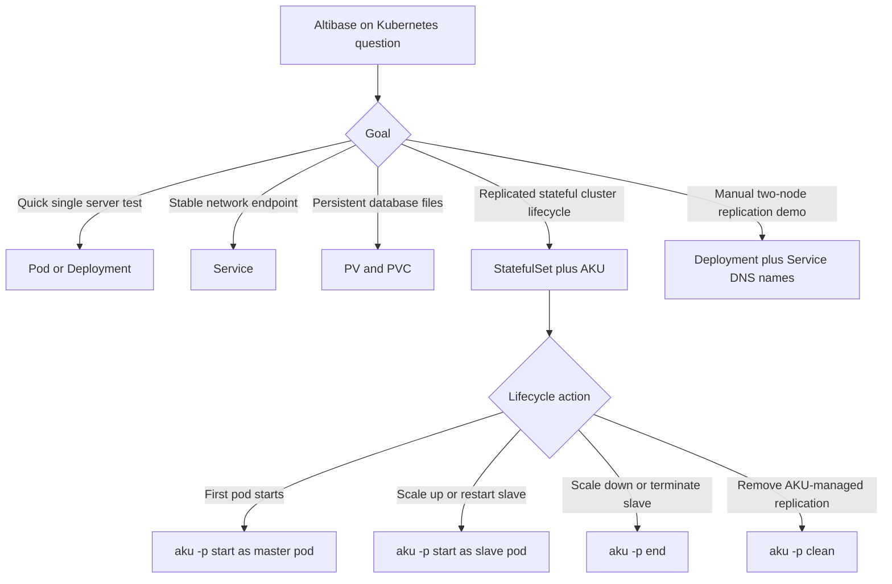
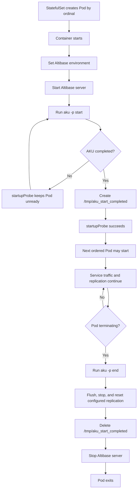
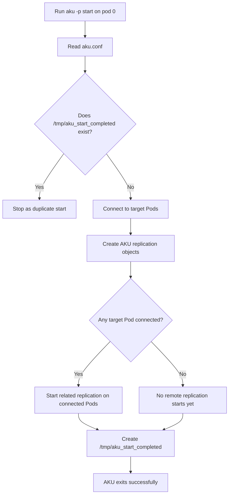
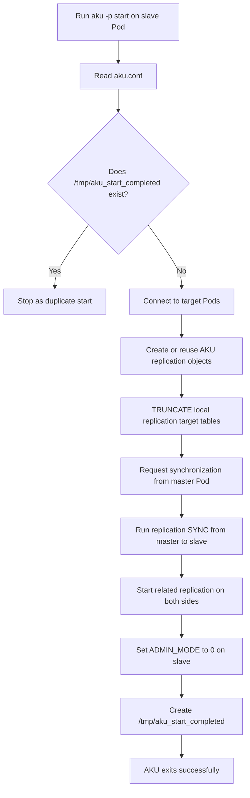
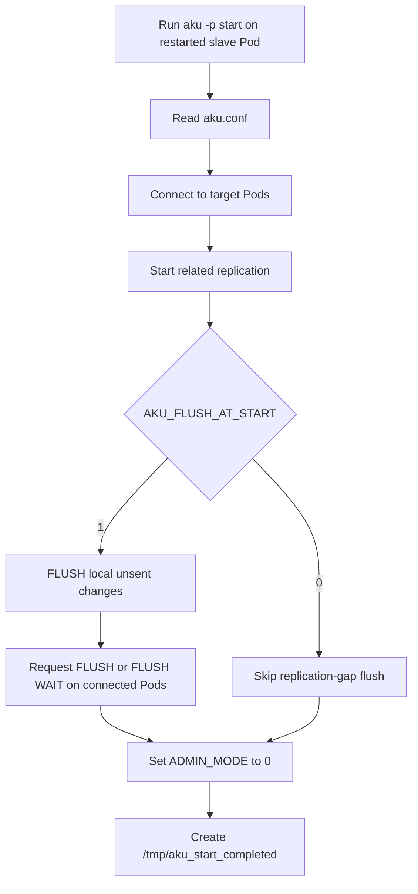
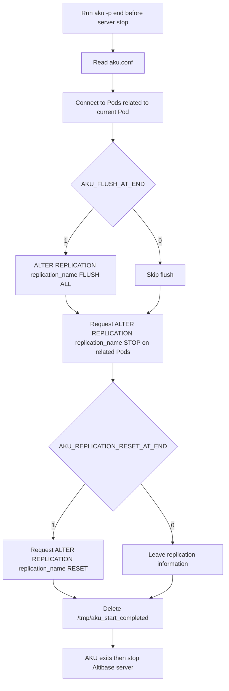

# 17. Kubernetes and AKU

## Applicable Versions

- 7.1: Based on Altibase 7.1 operations, replication, and `aku` utility guidance. AKU supports up to 4 scalable replicas in the 7.1 documentation.
- 7.3: Based on Kubernetes User's Guide for Altibase, Altibase AKU Sample Guide for Kubernetes, Altibase 7.3 utilities guidance, and Altibase 7.3 release notes. AKU supports up to 6 scalable replicas in the 7.3 documentation.
- 8.1: Based on Altibase 8.1 verified source Kubernetes, AKU, utilities, and release-note guidance. AKU supports up to 6 scalable replicas and adds multiple replication configuration support.

## Questions This File Can Answer

- How should Altibase be deployed on Kubernetes?
- When should I use a simple `Pod` or `Deployment`, and when should I use a `StatefulSet`?
- What does AKU do during Pod startup, shutdown, scale-up, and scale-down?
- Which Kubernetes objects, ports, persistent storage, probes, and services are needed for AKU?
- How should Altibase replication be configured when Pod IP addresses are dynamic?
- How can I verify that AKU synchronization and replication reset completed?
- What cautions apply to abnormal Pod termination, master Pod failure, and accumulated replication logs?

## Source Documents

- 7.1: Altibase 7.1 Installation Guide, Administrator's Manual, Replication Manual, and Utilities Manual.
- 7.3: Kubernetes User's Guide for Altibase; Altibase AKU Sample Guide for Kubernetes; Altibase 7.3 Utilities Manual; Altibase 7.3 Release Notes.
- 8.1: Altibase 8.1 verified source Kubernetes User's Guide for Altibase; Altibase AKU Sample Guide for Kubernetes; Utilities Manual; Altibase 8.1 Release Notes.

## Response Rules

- Answer explanatory text in the user's language.
- Keep SQL object names, SQL statements, property names, command names, Kubernetes object kinds, YAML keys, file names, paths, ports, and error messages literal.
- For 8.1-specific statements, say `Altibase 8.1 verified source`.
- Do not expose internal source labels, repository paths, workstation paths, original image names, or local source-file locations in customer answers.
- Treat example passwords such as `manager` and example accounts such as `SYS` as placeholders. Recommend Kubernetes `Secret` objects or equivalent protected secret handling.
- Before giving production-ready commands, ask for Altibase version, Kubernetes version, container image, storage class, PV/PVC design, license basis, replica count, replication target tables, backup status, downtime window, and recovery plan.
- For destructive operations such as `TRUNCATE`, `ALTER REPLICATION ... RESET`, `aku -p clean`, or manual master-pod recovery, require a backup and an explicit operator decision.
- Do not depend on installer or console images for this topic. Express Kubernetes and AKU guidance as YAML, commands, Mermaid lifecycle flows, field/value descriptions, and expected results.

## Fast Decision Map



## Version Differences

Version block: 7.1

- The 7.1 documentation includes `aku` for StatefulSet-based Pod lifecycle assistance.
- `AKU_SERVER_COUNT` can be set from 1 to 4 in the 7.1 documentation.
- The AKU sample guide uses an Altibase 7.1 test environment and shows a 4-Pod StatefulSet.
- Use `StatefulSet` with `podManagementPolicy: OrderedReady`, a headless `Service`, persistent storage, `startupProbe`, and `terminationGracePeriodSeconds` for AKU-based deployments.
- For simple container tests, a `Pod` or `Deployment` can run the Altibase image with `MODE=daemon`, but that pattern does not provide the AKU lifecycle model by itself.

Version block: 7.3

- Altibase 7.3 release notes identify AKU as a utility for synchronizing data or resetting synchronization information when Pods start or terminate in a StatefulSet.
- `AKU_SERVER_COUNT` can be set from 1 to 6 in the 7.3 documentation.
- The 7.3 utilities guidance keeps the same AKU lifecycle model: master pod, slave pod, `aku -p start`, `aku -p end`, `aku -p clean`, and `aku.conf`.
- The Kubernetes guide shows Pod, Deployment, Service, persistent volume, and manual replication examples. For production-style lifecycle management, prefer the AKU StatefulSet pattern.

Version block: 8.1

- Use the wording `Altibase 8.1 verified source` for 8.1-specific AKU and Kubernetes statements.
- The Altibase 8.1 verified source supports scale-up to 6 nodes.
- The Altibase 8.1 verified source supports multiple replication configurations in `REPLICATIONS` using comma-separated configuration blocks.
- The Altibase 8.1 verified source release notes mention multi-thread based parallel processing improvements and longer user, table, and partition names for replication targets.
- Encrypted passwords generated by `altiEncrypt` can be used in AKU configuration files in the Altibase 8.1 verified source.

## Kubernetes Building Blocks

Building block: `Pod`

- Purpose: smallest Kubernetes execution unit that contains the Altibase container.
- Typical use: simple test or demonstration.
- Key settings: container image, `containerPort: 20300`, and Altibase start mode such as `MODE=daemon`.
- Limitation: a Pod IP is dynamic and Pod-local storage is ephemeral unless persistent volume storage is mounted.

Building block: `Deployment`

- Purpose: create and maintain one or more Pods from a template.
- Typical use: simple Altibase container test or manual replication demonstration.
- Key settings: label selector, Pod template labels, image, exposed ports, and environment variables.
- Limitation: a Deployment does not provide stable ordinal identity like `altibase-sts-0`; use `StatefulSet` for AKU.

Building block: `Service`

- Purpose: provide a stable virtual IP or DNS name for Pods whose Pod IPs can change.
- Typical use: client connection to Altibase port `20300` and replication connection to port `20301`.
- Key settings: `ports`, `targetPort`, and `selector`.
- For StatefulSet and AKU: use a headless Service with `clusterIP: None` and `publishNotReadyAddresses: true`.

Building block: `PV` and `PVC`

- Purpose: preserve Altibase database files and log files beyond container or Pod lifetime.
- Typical use: mount persistent storage to the Altibase home, `dbs`, `logs`, or environment-specific data directories.
- Key settings: storage capacity, access mode, reclaim policy, storage class or explicit backend such as NFS.
- Caution: the sample guide uses NFS, but the production storage backend must be chosen for durability, latency, fencing, backup, and recovery requirements.

Building block: `StatefulSet`

- Purpose: manage stateful Pods with stable ordinal identities and ordered lifecycle behavior.
- Typical use: AKU-managed Altibase Pod lifecycle.
- Key settings: `serviceName`, `replicas`, `podManagementPolicy: OrderedReady`, `startupProbe`, `terminationGracePeriodSeconds`, volume mounts, and `volumeClaimTemplates`.
- Stable host names: Pods are named like `altibase-sts-0`, `altibase-sts-1`; service DNS can be used as `<pod-name>.<service-name>`.

## Minimal Kubernetes Patterns

Pattern block: simple Altibase `Deployment`

```yaml
apiVersion: apps/v1
kind: Deployment
metadata:
  name: altibase-deploy
spec:
  replicas: 1
  selector:
    matchLabels:
      app: altibase
  template:
    metadata:
      labels:
        app: altibase
    spec:
      containers:
      - name: altibase
        image: altibase/altibase
        ports:
        - containerPort: 20300
          protocol: TCP
        env:
        - name: MODE
          value: daemon
```

Verification:

```bash
kubectl create -f altibase-deploy.yaml
kubectl get pod -o wide
kubectl exec -it <pod-name> -- /bin/bash
. set_altibase.env
is
```

Pattern block: headless Service for AKU StatefulSet

```yaml
apiVersion: v1
kind: Service
metadata:
  name: altibase-svc
spec:
  type: ClusterIP
  clusterIP: None
  publishNotReadyAddresses: true
  ports:
  - name: service-port
    port: 20300
    targetPort: 20300
  - name: replication-port
    port: 20301
    targetPort: 20301
  selector:
    app: altibase-sts
```

Pattern block: StatefulSet controls that matter for AKU

```yaml
apiVersion: apps/v1
kind: StatefulSet
metadata:
  name: altibase-sts
spec:
  serviceName: altibase-svc
  replicas: 4
  podManagementPolicy: OrderedReady
  template:
    spec:
      terminationGracePeriodSeconds: 60
      containers:
      - name: altibase-sts
        startupProbe:
          exec:
            command:
            - cat
            - /tmp/aku_start_completed
          failureThreshold: 3600
          periodSeconds: 10
        ports:
        - containerPort: 20300
          protocol: TCP
        - containerPort: 20301
          protocol: TCP
```

Why these controls matter:

- `OrderedReady` prevents several Pods from starting AKU at the same time.
- `startupProbe` waits until `aku -p start` creates `/tmp/aku_start_completed`.
- `publishNotReadyAddresses: true` allows Pod DNS records to be published before all Pods are ready.
- `terminationGracePeriodSeconds` must be long enough for `aku -p end` to flush and reset replication before the Pod exits.

## AKU Overview

Purpose: `aku` is the Altibase Kubernetes Utility. It helps synchronize Altibase data when Pods start, stop, scale up, or scale down in a Kubernetes `StatefulSet`.

Important boundary: AKU supports data replication among Pods. It does not provide Altibase data scale-out.

Required pieces:

- A Kubernetes `StatefulSet`; do not use AKU as the lifecycle controller for a plain `Deployment`.
- `podManagementPolicy: OrderedReady`.
- A headless Service with `publishNotReadyAddresses: true`.
- Persistent storage for each Pod.
- Altibase server and `aku` running in the same container.
- Same `aku` version and same `aku.conf` values on all Pods.
- `$ALTIBASE_HOME` set and `$ALTIBASE_HOME/bin` in `PATH`.
- Altibase property `ADMIN_MODE` set to `1` before AKU startup work.
- Altibase property `REMOTE_SYSDBA_ENABLE` set to `1`.
- `aku -p start` executed after Altibase server startup succeeds.
- `aku -p end` executed before the Altibase server stops.

Typical container entry flow:

```bash
. /CONFIGMAP/set_linux.env
. /CONFIGMAP/set_altibase.env

trap 'aku -p end; server stop' SIGTERM TERM

server start
aku -p start

while true; do
  sleep 1
done
```

Use environment-specific paths and secret handling; the snippet only shows the lifecycle order.

## AKU Command Syntax

Compact syntax:

```text
aku
  [-h | --help]
  [-v | --version]
  [-i | --info]
  [-p start | -p end | -p clean]
  [--pod start | --pod end | --pod clean]
```

Command block: `aku -i`

- Purpose: display information read from `aku.conf`.
- Outputs: server ID, host, user, password, port, replication port, maximum server count, replication object names, and replication target items.
- Use before changing Pod count to confirm that every Pod has the expected `aku.conf`.

Command block: `aku -p start`

- Purpose: create replication objects, synchronize data when needed, start replication, and create `/tmp/aku_start_completed`.
- Run timing: after Altibase server startup succeeds.
- Master Pod: the first StatefulSet Pod, normally `<statefulset-name>-0`.
- Slave Pod: any later Pod created by scale-up or restart.

Command block: `aku -p end`

- Purpose: flush replication, stop replication, reset replication information when configured, and delete `/tmp/aku_start_completed`.
- Run timing: before stopping the Altibase server and before Pod termination.
- Kubernetes setting: `terminationGracePeriodSeconds` must allow this command to complete.

Command block: `aku -p clean`

- Purpose: delete all AKU-created Altibase replication objects on Pods and delete `/tmp/aku_start_completed`.
- Use only when synchronization between Pods is no longer needed.
- Caution: this is a cleanup operation for AKU-managed replication; require an operator decision and recovery plan.

## Pod Lifecycle Flow

Overall StatefulSet lifecycle:



`aku -p start` on the master Pod:



`aku -p start` on a new or reset slave Pod:



`aku -p start` on a slave Pod whose replication information was not reset:



`aku -p end` on Pod termination:



## `aku.conf` Essentials

Property block: Kubernetes identity

- `AKU_STS_NAME`: StatefulSet name. Maximum length is 63 bytes.
- `AKU_SVC_NAME`: Service name. Maximum length is 63 bytes.
- `AKU_SERVER_COUNT`: maximum number of Altibase servers synchronized by AKU. For 7.1 use 1 to 4. For 7.3 and Altibase 8.1 verified source use 1 to 6.

Property block: Altibase connection

- `AKU_SYS_PASSWORD`: password for the `SYS` user. Use protected secret handling; in Altibase 8.1 verified source, encrypted passwords generated by `altiEncrypt` can be used in AKU configuration files.
- `AKU_PORT_NO`: Altibase service port, default `20300`.
- `AKU_REPLICATION_PORT_NO`: Altibase replication port, default `20301`.
- `AKU_QUERY_TIMEOUT`: timeout for SQL executed by AKU.
- `AKU_QUERY_RETRY_COUNT`: retry count for failed AKU SQL.
- `AKU_QUERY_RETRY_DELAY_MSEC`: retry delay in milliseconds.

Property block: startup and shutdown behavior

- `AKU_ADDRESS_CHECK_COUNT`: number of connection attempts used to check whether the current Pod DNS address is registered and inter-Pod communication is possible.
- `AKU_FLUSH_AT_START`: when `1`, AKU removes replication gaps during `aku -p start` by using `FLUSH`; when `0`, it does not.
- `AKU_FLUSH_TIMEOUT_AT_START`: wait time for `FLUSH WAIT`; when `0`, AKU performs `FLUSH`.
- `AKU_DELAY_START_COMPLETE_TIME`: delay after slave synchronization and before changing `ADMIN_MODE` to `0`.
- `AKU_FLUSH_AT_END`: when `1`, `aku -p end` removes replication gaps with `FLUSH ALL`; when `0`, it does not.
- `AKU_REPLICATION_RESET_AT_END`: when `1`, `aku -p end` resets replication information; when `0`, it leaves replication information.

Property block: replication targets

- `REPLICATIONS/REPLICATION_NAME_PREFIX`: prefix for replication object names created by AKU. Maximum prefix length is 37 bytes.
- `REPLICATIONS/SYNC_PARALLEL_COUNT`: number of sender or receiver threads used for replication sync. Valid range is 1 to 100 in the 7.3 documentation and Altibase 8.1 verified source.
- Replication target format: `[user_name].[table_name]` or `[user_name].[table_name] PARTITION [partition_name]`.
- In Altibase 8.1 verified source, multiple `REPLICATIONS` blocks can be defined with comma-separated configuration blocks.

Example `REPLICATIONS` block:

```properties
REPLICATIONS = (
  REPLICATION_NAME_PREFIX = AKU_REP
  SYNC_PARALLEL_COUNT     = 1
  (
    SYS.T1,
    SYS.T2 PARTITION P1,
    SYS.T3
  )
)
```

Example multiple `REPLICATIONS` blocks for Altibase 8.1 verified source:

```properties
REPLICATIONS = (
  REPLICATION_NAME_PREFIX = AKU_REP1
  SYNC_PARALLEL_COUNT     = 1
  (
    SYS.T1,
    SYS.T2 PARTITION P1,
    SYS.T3
  )
),
(
  REPLICATION_NAME_PREFIX = AKU_REP2
  SYNC_PARALLEL_COUNT     = 4
  (
    SYS.T4,
    SYS.T5,
    SYS.T6
  )
)
```

Replication object naming rule:

```text
<REPLICATION_NAME_PREFIX>_<smaller Pod ordinal><larger Pod ordinal>
```

Example with `AKU_SERVER_COUNT=4` and `REPLICATION_NAME_PREFIX=AKU_REP`:

- `altibase-sts-0` has `AKU_REP_01`, `AKU_REP_02`, and `AKU_REP_03`.
- `altibase-sts-1` has `AKU_REP_01`, `AKU_REP_12`, and `AKU_REP_13`.
- `altibase-sts-2` has `AKU_REP_02`, `AKU_REP_12`, and `AKU_REP_23`.
- `altibase-sts-3` has `AKU_REP_03`, `AKU_REP_13`, and `AKU_REP_23`.

Caution: do not manually create, drop, or modify replication objects created by AKU except during an explicit recovery procedure.

## Manual Replication With Kubernetes Service Names

Use Service DNS names instead of Pod IP addresses because Pod IPs are dynamic.

Example on node 1:

```sql
CREATE TABLE t1 (c1 INTEGER PRIMARY KEY, c2 INTEGER);

CREATE REPLICATION rep1
WITH 'altibase-svc-node2', 20301
FROM sys.t1 TO sys.t1;

ALTER REPLICATION rep1 START;
```

Example on node 2:

```sql
CREATE TABLE t1 (c1 INTEGER PRIMARY KEY, c2 INTEGER);

CREATE REPLICATION rep1
WITH 'altibase-svc-node1', 20301
FROM sys.t1 TO sys.t1;

ALTER REPLICATION rep1 START;
```

Verification:

```sql
INSERT INTO t1 VALUES (1, 1);
SELECT * FROM t1;
```

For AKU-managed StatefulSets, configure replication targets in `aku.conf` and let AKU create and operate the replication objects.

## AKU StatefulSet Procedure

1. Prepare persistent storage for each Pod. The sample guide uses multiple NFS-backed `PersistentVolume` objects, but any storage type that meets persistence and performance requirements can be used.
2. Prepare a ConfigMap or image content for environment setup and an entry script. The entry script must run `aku -p end` on `SIGTERM` before `server stop`.
3. Set the Altibase environment. At minimum, configure `ALTIBASE_HOME`, `ALTIBASE_NLS_USE`, `ALTIBASE_PORT_NO`, `ALTIBASE_REPLICATION_PORT_NO`, `ALTIBASE_ADMIN_MODE=1`, `ALTIBASE_REMOTE_SYSDBA_ENABLE=1`, `PATH`, and `LD_LIBRARY_PATH` as appropriate for the image.
4. Create a headless Service with `clusterIP: None`, `publishNotReadyAddresses: true`, and ports `20300` and `20301`.
5. Create a StatefulSet with `podManagementPolicy: OrderedReady`, persistent volume claim templates, a `startupProbe` that checks `/tmp/aku_start_completed`, and sufficient `terminationGracePeriodSeconds`.
6. Install Altibase and create the database on the first Pod if the persistent Altibase home is not already initialized.
7. Create application tables that will be listed in the AKU replication targets.
8. Copy `aku.conf.sample` to `aku.conf` and configure StatefulSet name, Service name, replica count, ports, password handling, startup/shutdown behavior, and `REPLICATIONS`.
9. Start Altibase server, then run `aku -p start` on each Pod as it becomes eligible under ordered startup.
10. Confirm that every Pod reaches `READY` and that `aku -i` reports the expected server and replication information.

## Verification Cookbook

Check Kubernetes objects:

```bash
kubectl get sts -o wide
kubectl get pod -o wide
kubectl get svc -o wide
kubectl get pv,pvc -o wide
```

Check the AKU startup gate:

```bash
kubectl exec -it <pod-name> -- test -f /tmp/aku_start_completed
kubectl exec -it <pod-name> -- aku -i
```

Check Altibase access inside a Pod:

```bash
kubectl exec -it <pod-name> -- bash
. /CONFIGMAP/set_altibase.env
is
```

Check AKU-created replication state:

```sql
SELECT REPLICATION_NAME, XSN
FROM SYSTEM_.SYS_REPLICATIONS_;
```

Interpretation:

- `XSN = -1` means replication information is reset or initialized for that replication object.
- A non-`-1` `XSN` means replication information remains. This can be normal while replication is active, but after an intended scale-down reset it can indicate incomplete termination handling.

Check replicated data after scale-up:

```sql
INSERT INTO t1 VALUES (2, 2);
SELECT * FROM t1;
```

Scale operations:

```bash
kubectl scale sts altibase-sts --replicas=3
kubectl scale sts altibase-sts --replicas=4
```

After scale-down, inspect remaining Pods for replication objects related to the removed Pod and confirm that reset state matches the planned `AKU_REPLICATION_RESET_AT_END` behavior.

## Troubleshooting And Cautions

Issue block: Pod remains unready during first StatefulSet creation

- Likely cause: `startupProbe` is waiting for `/tmp/aku_start_completed`.
- Check: connect to the first Pod, source the Altibase environment, create or start the Altibase server, configure `aku.conf`, and run `aku -p start`.
- Expected result: AKU creates `/tmp/aku_start_completed`, the Pod becomes ready, and the next ordered Pod can start.

Issue block: `aku -p start` reports duplicate execution

- Likely cause: `/tmp/aku_start_completed` already exists.
- Check: verify whether AKU was already completed for this Pod and whether the Pod restart path is valid.
- Do not delete the file just to force progress unless the replication state and recovery plan are clear.

Issue block: Scale-up Pod does not receive expected data

- Check Service DNS names and ports `20300` and `20301`.
- Check that `AKU_STS_NAME`, `AKU_SVC_NAME`, `AKU_SERVER_COUNT`, and `REPLICATIONS` are identical where required.
- Check whether the slave Pod was treated as a reset/new slave or as a restart with existing replication information.
- If replication information was not reset, `TRUNCATE` and SYNC from the master are skipped; `AKU_FLUSH_AT_START` controls replication-gap flushing.

Issue block: Scale-down leaves online logs accumulating

- Likely cause: a Pod was force-terminated before `aku -p end` completed, or `AKU_REPLICATION_RESET_AT_END=0` left replication information.
- Risk: other Pods may retain online logs needed for replication to the terminated Pod, eventually exhausting disk space.
- Corrective SQL for the affected replication object:

```sql
ALTER REPLICATION replication_name STOP;
ALTER REPLICATION replication_name RESET;
```

Issue block: Master Pod failure during `aku -p start`

- Risk condition: one or more slave Pods are running, and the master Pod has lost some or all replication object information for running slave Pods.
- Recovery outline:
  1. Select one slave Pod as the recovery basis.
  2. Run `aku -p end` to terminate all other slave Pods.
  3. Synchronize data from the selected slave Pod to the master Pod.
  4. Start replication on the master Pod.
  5. Retry `aku -p start`.
- This is a high-risk recovery path. Require a backup, support plan, and explicit operator approval before issuing production commands.

Issue block: Master Pod storage corruption

- AKU does not recover data corruption caused by storage corruption in the master Pod.
- Use storage-level recovery, Altibase backup/recovery procedures, or a validated replica-based recovery plan.

## Customer Answer Templates

Template: explain AKU

```text
AKU is the Altibase Kubernetes Utility. It is used with Kubernetes StatefulSets to synchronize Altibase data when Pods start and to flush, stop, and optionally reset replication when Pods terminate. It supports replication among Pods, but it is not an Altibase data scale-out feature.
```

Template: production readiness checklist

```text
Before deploying Altibase with AKU, confirm the Altibase version, Kubernetes version, storage backend, StatefulSet replica count, hostname-based license, Service DNS design, ports 20300 and 20301, replication target tables, backup and recovery plan, and secret handling for SYS credentials.
```

Template: lifecycle order

```text
The container should start Altibase first, then run aku -p start. Kubernetes startupProbe should wait for /tmp/aku_start_completed. On termination, the container should run aku -p end before server stop, and terminationGracePeriodSeconds must be long enough for AKU to finish.
```
