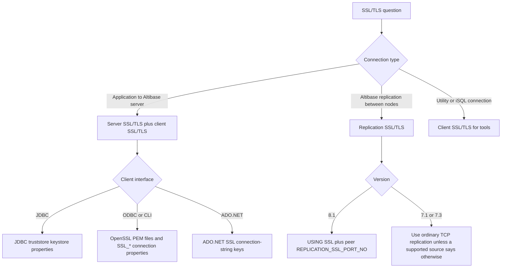
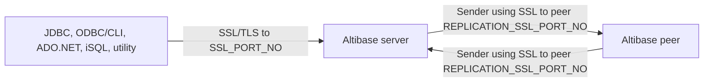

# 18. Security and SSL/TLS

## Applicable Versions

- 7.1: Based on Altibase 7.1 SSL/TLS guidance. The source software requirement scopes the server to Intel Linux.
- 7.3: Based on Altibase 7.3 SSL/TLS guidance and release notes for OpenSSL 3.0.8, TLS 1.3, and FIPS configuration.
- 8.1: Based on Altibase 8.1 verified source SSL/TLS guidance, release notes, and replication SSL guidance.

## Questions This File Can Answer

- How should an Altibase server be configured to accept SSL/TLS connections?
- How should JDBC, ODBC/CLI, ADO.NET, iSQL, and utilities connect over SSL/TLS?
- Which server and client properties control certificates, ciphers, verification, ports, and FIPS loading?
- What changed between 7.1, 7.3, and 8.1?
- How is Altibase 8.1 replication SSL configured with `USING SSL` and `REPLICATION_SSL_PORT_NO`?
- How can SSL/TLS sessions be verified, restricted, monitored, or closed?

## Source Documents

- 7.1: Altibase 7.1 SSL/TLS User's Guide; General Reference; iSQL and utility guidance where SSL ports are relevant.
- 7.3: Altibase 7.3 SSL/TLS User's Guide; General Reference; iSQL and utility guidance; Altibase 7.3 release notes.
- 8.1: Altibase 8.1 verified source SSL/TLS User's Guide; Altibase 8.1 verified source Replication Manual; Altibase 8.1 verified source General Reference where available; Altibase 8.1 release notes.

## Response Rules

- Answer explanatory text in the user's language.
- Keep SQL object names, function names, error codes, property names, commands, file paths, environment variables, connection-string keys, and view names literal.
- Separate ordinary client/server SSL/TLS from replication SSL. Do not answer them as one configuration surface.
- For 8.1-specific statements, say `Altibase 8.1 verified source`.
- Do not expose internal source labels or local source-tree paths in customer answers.
- For production SSL/TLS changes, ask for the exact Altibase version, client interface, authentication mode, certificate type, server and client OS, OpenSSL version, and target ports before giving a final procedure.
- For production JDBC or ODBC/CLI SSL/TLS recommendations, also verify the target version and platform. The Altibase SSL/TLS guide states that JDBC and ODBC SSL connections are currently supported only on Intel Linux / Intel-Linux.

## Fast Decision Map



## Core Concepts

Altibase SSL/TLS protects network communication by encrypting data, authenticating the server, and optionally authenticating the client. Altibase uses an additional SSL/TLS listening port rather than switching an existing TCP connection from non-secure to secure.

Authentication modes:

- `Server-only authentication`: the server presents its certificate and the client verifies the server.
- `Mutual authentication`: the server presents its certificate, and the server also requests a client certificate during the SSL/TLS handshake.

Connection surfaces:

- `Server SSL/TLS`: controlled mainly by `SSL_ENABLE`, `SSL_PORT_NO`, certificate properties, cipher properties, and `SSL_CLIENT_AUTHENTICATION`.
- `Client SSL/TLS`: controlled by interface-specific settings such as JDBC properties, ODBC/CLI `SSL_*` properties, ADO.NET connection-string keys, and `ALTIBASE_SSL_PORT_NO`.
- `Replication SSL/TLS`: an Altibase 8.1 replication feature using `CREATE REPLICATION ... USING SSL` and `REPLICATION_SSL_PORT_NO`.

Port and endpoint separation:

- Ordinary client/server TCP uses the ordinary service port, often configured through `ALTIBASE_PORT_NO` or client-specific connection keys.
- Ordinary client/server SSL/TLS uses the server `SSL_PORT_NO`. JDBC `port`, ODBC/CLI `PORT`, ADO.NET `Port`, iSQL `-PORT`, or `ALTIBASE_SSL_PORT_NO` must point to this port when those clients use SSL/TLS.
- Ordinary TCP replication uses the peer `REPLICATION_PORT_NO`, not `SSL_PORT_NO` and not the database service port.
- Altibase 8.1 verified source SSL replication uses the peer `REPLICATION_SSL_PORT_NO` with `USING SSL`.
- `REPLICATION_SSL_PORT_NO` is a replication Receiver port. It does not replace the server `SSL_PORT_NO` used by application clients.

Platform caveat: before production JDBC or ODBC/CLI SSL/TLS guidance, verify the exact Altibase version and platform against supported-platform information. The SSL/TLS guide states that JDBC and ODBC SSL connections are currently supported only on Intel Linux / Intel-Linux; do not extend that support to other platforms without target-version evidence.

Exact TLS and port token block:

- 7.1 precheck: `OpenSSL` toolkit `0.9.4` through `1.0.2`, `Heartbleed`, `OPENSSL_NO_HEARTBEATS`, `Intel Linux`, `SSL_ENABLE`, `SSL_PORT_NO`, `SSL_CERT`, `SSL_KEY`.
- Server TLS setup path: `$ALTIBASE_HOME/conf/altibase.properties`.
- Server TLS properties: `SSL_ENABLE`, `SSL_PORT_NO`, `SSL_MAX_LISTEN`, `SSL_CLIENT_AUTHENTICATION`, `SSL_CERT`, `SSL_KEY`, `SSL_CA`, `SSL_CAPATH`, `SSL_CIPHER_LIST`, `SSL_CIPHER_SUITES`, `SSL_LOAD_CONFIG`.
- Client TLS interfaces: `JDBC`, `ODBC/CLI`, `ADO.NET`, iSQL, and utilities use the ordinary server `SSL_PORT_NO`, not `REPLICATION_SSL_PORT_NO`.
- ODBC/CLI client TLS properties: `SSL_CA`, `SSL_CAPATH`, `SSL_CERT`, `SSL_KEY`, `SSL_VERIFY`, `SSL_CIPHER`; connect with `CONNTYPE=SSL;PORT=20443` style syntax, not a client-side `SSL_PORT_NO`.
- FIPS client loading: `ALTIBASE_SSL_LOAD_CONFIG=1` is for ODBC/CLI clients when `FIPS` module configuration must be loaded; skip it when `FIPS` is not used.
- SSL monitoring: `V$SESSION`, `COMM_NAME`, and `ALTER DATABASE database_name SESSION CLOSE session_number`.
- Altibase 8.1 verified source replication SSL: `USING SSL`, `REPLICATION_SSL_PORT_NO`, `Unsigned Integer`, `0`, `65535`, `read-only`, `single value`.



## Version Differences

Version block: 7.1

- TLS support: Altibase 7.1 SSL/TLS guidance describes TLS 1.0 through the OpenSSL library.
- OpenSSL requirement: OpenSSL toolkit `0.9.4` through `1.0.2` according to the 7.1 SSL/TLS guide.
- Platform requirement: the 7.1 SSL/TLS guide scopes the server requirement to Altibase 6.5.1 or later on Intel Linux.
- Heartbleed caution: before enabling SSL/TLS on Altibase 7.1-era systems, verify that the installed OpenSSL version is not vulnerable to Heartbleed. The 7.1 SSL/TLS guide gives `OPENSSL_NO_HEARTBEATS` as the source-provided check.
- Java guidance: JRE 1.6 or later is recommended for convenient SSL client setup; JRE 1.5 can be used but is not recommended.
- Server properties: use `SSL_ENABLE`, `SSL_PORT_NO`, `SSL_MAX_LISTEN`, `SSL_CIPHER_LIST`, `SSL_CLIENT_AUTHENTICATION`, `SSL_CERT`, `SSL_KEY`, `SSL_CA`, and `SSL_CAPATH`.
- 7.1 sources do not define `SSL_CIPHER_SUITES`, `SSL_LOAD_CONFIG`, or replication SSL.

Version block: 7.3

- TLS support: Altibase 7.3 supports TLS 1.0, TLS 1.2, and TLS 1.3 through OpenSSL.
- OpenSSL requirement: OpenSSL 3.0.8 is supported; OpenSSL 1.0.x is no longer supported.
- Java guidance: Java 1.8.0_351 or later is recommended for TLS 1.3 cipher use without extra settings. Java 1.8.0_261 or later supports TLS 1.3 when the client starts with `-Djdk.tls.client.protocols="TLSv1.3"` where needed.
- Newer SSL properties: `SSL_CIPHER_SUITES` configures TLS 1.3 cipher suites; `SSL_LOAD_CONFIG` loads the OpenSSL configuration file and is used for FIPS module configuration.
- Replication SSL is not documented as a 7.3 feature in the customer-facing sources for this attachment.

Version block: 8.1

- General SSL/TLS: use Altibase 8.1 verified source. The ordinary server and client setup follows the current SSL/TLS guide baseline.
- Replication SSL: Altibase 8.1 release notes add SSL/TLS support for replication communication.
- Replication syntax: use `CREATE REPLICATION ... WITH 'peer_host', peer_ssl_replication_port USING SSL`.
- Replication property: `REPLICATION_SSL_PORT_NO` configures the local SSL replication Receiver port. If this property is `0`, SSL replication is disabled for that node.

## Server SSL/TLS

Use this section for application-to-server SSL/TLS, not replication SSL.

Server setup checklist:

1. Confirm that the Altibase version and OpenSSL version match the target version guidance. For Altibase 7.1, verify that the installed OpenSSL is not vulnerable to Heartbleed before enabling SSL/TLS; use `OPENSSL_NO_HEARTBEATS` as the source-provided check.
2. Prepare the server certificate, server private key, and CA certificate or CA directory.
3. Set SSL/TLS server properties in `$ALTIBASE_HOME/conf/altibase.properties`.
4. Decide whether the server will use server-only authentication or mutual authentication.
5. Start the server and verify that the SSL listener is created.
6. Test one client connection over the SSL/TLS port.
7. Monitor `V$SESSION` to confirm that the session `COMM_NAME` starts with `SSL`.

Representative server property file:

```properties
SSL_ENABLE = 1
SSL_PORT_NO = 20443
SSL_MAX_LISTEN = 128
SSL_CLIENT_AUTHENTICATION = 0
SSL_CERT = ?/cert/server-cert.pem
SSL_KEY = ?/cert/server-key.pem
SSL_CA = ?/cert/ca-cert.pem
# SSL_CAPATH = /etc/ssl/certs
# SSL_CIPHER_LIST = HIGH:!aNULL
# SSL_CIPHER_SUITES = TLS_AES_256_GCM_SHA384:TLS_CHACHA20_POLY1305_SHA256
# SSL_LOAD_CONFIG = 1
```

Server property block: `SSL_ENABLE`

- Purpose: enables or disables SSL/TLS on the Altibase server.
- Values: `0` disables SSL/TLS; `1` enables SSL/TLS.
- Default: `0`.
- Use when: the server must listen for SSL/TLS client connections.

Server property block: `SSL_PORT_NO`

- Purpose: SSL/TLS listener port for client connections.
- Range: `1024` through `65535`.
- Default: `20443`.
- Caution: the SSL/TLS port must be distinct from the ordinary TCP service port.
- Boundary: this is the ordinary client/server SSL/TLS port, not `REPLICATION_SSL_PORT_NO`.

Server property block: `SSL_MAX_LISTEN`

- Purpose: maximum listen queue size for concurrent SSL/TLS connections.
- Default: `128`.
- Range: `0` through `16384`.
- Caution: larger listen capacity can require more memory.

Server property block: `SSL_CLIENT_AUTHENTICATION`

- Purpose: controls whether the server requests a client certificate.
- Values: `0` means server-only authentication; `1` means mutual authentication.
- Default: `0`.
- Use `1` only when client certificates are prepared and distributed.

Server property block: `SSL_CERT`

- Purpose: server certificate path.
- Example: `?/cert/server-cert.pem`.
- Caution: the certificate must match the private key configured by `SSL_KEY`.

Server property block: `SSL_KEY`

- Purpose: server private key path.
- Example: `?/cert/server-key.pem`.
- Caution: protect this file with OS permissions and do not share it with clients.

Server property block: `SSL_CA`

- Purpose: file path for CA certificates used to verify received certificates.
- Example: `?/cert/ca-cert.pem`.
- Use with: public CA certificates or private CA certificates.

Server property block: `SSL_CAPATH`

- Purpose: CA directory path in X.509 directory format.
- Example: `/etc/ssl/certs`.
- Use when: CA certificates are managed as a directory instead of a single CA file.

Server property block: `SSL_CIPHER_LIST`

- Purpose: cipher candidate list for negotiated SSL/TLS communication before TLS 1.3 handling.
- Format: OpenSSL cipher names separated by colons.
- Verification command:

```sh
openssl ciphers
```

Server property block: `SSL_CIPHER_SUITES`

- Version: 7.3 and 8.1 verified source.
- Purpose: TLS 1.3 cipher suite candidates.
- Format: TLS 1.3 cipher suite names separated by colons.
- Default behavior: when unset, OpenSSL allows available TLS 1.3 cipher candidates.

Server property block: `SSL_LOAD_CONFIG`

- Version: 7.3 and 8.1 verified source.
- Purpose: loads `openssl.cnf`.
- Values: `0` does not load the file; `1` loads the file.
- Use when: enabling the OpenSSL FIPS module or another OpenSSL configuration that must be loaded by Altibase.

Server start verification:

```sh
server start
```

Expected listener evidence:

```text
[CM] Listener started : TCP on port 20300 [IPV4]
[CM] Listener started : SSL on port 20443 [IPV4]
```

Server monitoring and close check:

```sql
SELECT ID, DB_USERNAME, COMM_NAME
FROM V$SESSION
WHERE COMM_NAME LIKE 'SSL%';

ALTER DATABASE database_name SESSION CLOSE session_number;
```

Monitoring rule: an SSL/TLS session should be visible in `V$SESSION.COMM_NAME` with a value that starts with `SSL`. A suspicious SSL/TLS session can be closed by `SYS` in `SYSDBA` mode with `ALTER DATABASE database_name SESSION CLOSE session_number`, then checked again in `V$SESSION`.

## Client SSL/TLS

Use this section for client-to-server SSL/TLS. This includes applications and tools. It does not configure replication SSL.

Before applying JDBC or ODBC/CLI SSL/TLS procedures in production, verify the target Altibase version and platform. The SSL/TLS guide scopes JDBC and ODBC SSL connections to Intel-Linux support.

Client certificate decision matrix:

- Private CA plus server-only authentication: import the server CA certificate into the client truststore or configure the client CA file.
- Private CA plus mutual authentication: import the server CA certificate into the truststore or client CA configuration, and configure the client certificate plus private key.
- Public CA plus server-only authentication: no private CA import is normally needed if the client runtime already trusts the issuing CA.
- Public CA plus mutual authentication: configure the client certificate plus private key.

Certificate handling checklist:

1. Identify whether the target is server-only authentication or mutual authentication.
2. For the server, keep `SSL_CERT` as the server certificate path and `SSL_KEY` as the matching server private key path.
3. Use `SSL_CA` or `SSL_CAPATH` when the server must verify a received client certificate or when a client must verify the server certificate through ODBC/CLI or ADO.NET settings.
4. For JDBC server verification with a private CA, import the server CA certificate into a truststore and configure `truststore_url` and `truststore_password`.
5. For JDBC mutual authentication, create or import a keystore that contains the client certificate and private key, then configure `keystore_url` and `keystore_password`.
6. For ODBC/CLI or ADO.NET mutual authentication, configure PEM-format client `SSL_CERT`/`ssl cert` and `SSL_KEY`/`ssl key` files that the client process can read.
7. Protect every private key file with OS permissions. Do not send server or client private keys as diagnostic evidence; ask for paths, file ownership, permissions, certificate subject/issuer/validity, and sanitized error text instead.

Certificate evidence to request:

- exact Altibase version and client interface;
- authentication mode: server-only or mutual authentication;
- server `SSL_CERT`, `SSL_KEY`, `SSL_CA`, `SSL_CAPATH`, `SSL_CLIENT_AUTHENTICATION`, `SSL_CIPHER_LIST`, `SSL_CIPHER_SUITES`, and `SSL_LOAD_CONFIG` values;
- client truststore, keystore, PEM, `SSL_VERIFY`, `verify_server_certificate`, `ssl_protocols`, and cipher settings as applicable;
- server startup listener output and `V$SESSION.COMM_NAME` evidence for successful SSL/TLS sessions;
- OpenSSL or Java runtime version and OS/platform.

JDBC setup checklist:

1. Verify that the target Altibase version and platform are supported for JDBC SSL/TLS; the SSL/TLS guide scopes JDBC and ODBC SSL connections to Intel Linux / Intel-Linux.
2. For private CA server certificates, import the server CA certificate into a truststore.
3. For mutual authentication, prepare a PKCS #12 file containing the client certificate and private key, then import it into a Java keystore.
4. Configure Java SSL properties either as JVM options, `System.setProperty(...)`, or JDBC connection properties.
5. Set `ssl_enable=true`.
6. Set `port` to the server `SSL_PORT_NO`, or set `ALTIBASE_SSL_PORT_NO` for tools and clients that use it.
7. For TLS 1.3 on 7.3 or 8.1, use a Java version that supports TLS 1.3 and set `ssl_protocols` when protocol pinning is needed.

JDBC truststore import:

```sh
keytool -import -alias alias_name -file server_certificate_file.pem -keystore truststore -storepass password
```

JDBC PKCS #12 preparation and import for mutual authentication:

```sh
openssl pkcs12 -export -in client_certificate.pem -inkey client_secretkey_file.pem > pkcs_file.p12
keytool -importkeystore -srckeystore pkcs_file.p12 -destkeystore keystore.jks -srcstoretype pkcs12
```

JDBC JVM properties:

```text
-Djavax.net.ssl.keyStore=path_to_keystore
-Djavax.net.ssl.keyStorePassword=password
-Djavax.net.ssl.trustStore=path_to_truststore
-Djavax.net.ssl.trustStorePassword=password
```

JDBC `System.setProperty(...)` form:

```java
System.setProperty("javax.net.ssl.keyStore", "path_to_keystore");
System.setProperty("javax.net.ssl.keyStorePassword", "password");
System.setProperty("javax.net.ssl.trustStore", "path_to_truststore");
System.setProperty("javax.net.ssl.trustStorePassword", "password");
```

JDBC connection property form:

```java
Properties props = new Properties();
props.put("ssl_enable", "true");
props.put("port", "20443");
props.put("keystore_url", "path_to_keystore");
props.put("keystore_password", "password");
props.put("truststore_url", "path_to_truststore");
props.put("truststore_password", "password");
```

JDBC property block: `ssl_enable`

- Purpose: chooses SSL/TLS or ordinary TCP for a JDBC connection.
- Values: `true` uses SSL/TLS; `false` uses ordinary TCP.
- Default: `false`.

JDBC property block: `port`

- Purpose: target server port.
- For SSL/TLS: set it to the server `SSL_PORT_NO`.
- Precedence when `ssl_enable=true`: JDBC `port` wins first; if `port` is absent, `ALTIBASE_SSL_PORT_NO` is used; if both are absent, use the documented default SSL port `20443`.
- Caution: do not rely on implicit defaults in production. Set `port` or `ALTIBASE_SSL_PORT_NO` explicitly.

JDBC property block: `ciphersuite_list`

- Purpose: Java cipher suite candidate list.
- Format: cipher suite names separated by colons.
- Caution: if the JRE does not support a named suite, the client can raise an `Unsupported ciphersuite` error.

JDBC property block: `ssl_protocols`

- Version: 7.3 and 8.1 verified source.
- Purpose: protocol list for SSL/TLS communication.
- Format: comma-separated values such as `TLSv1.2,TLSv1.3`.

JDBC property block: `verify_server_certificate`

- Purpose: controls server certificate verification.
- Values: `true` verifies the server certificate; `false` skips server CA verification.
- Default: `true`.
- Caution: use `false` only for controlled troubleshooting or explicitly accepted exception cases.

JDBC property block: `keystore_url`, `keystore_type`, `keystore_password`

- Purpose: client private-key and certificate container for mutual authentication.
- Common types: `JKS`, `JCEKS`, `PKCS12`.
- Default type: `JKS`.

JDBC property block: `truststore_url`, `truststore_type`, `truststore_password`

- Purpose: certificate store used to trust the server certificate issuer.
- Common types: `JKS`, `JCEKS`, `PKCS12`.

ODBC/CLI setup checklist:

1. Verify that the target Altibase version and platform are supported for ODBC/CLI SSL/TLS; the SSL/TLS guide scopes JDBC and ODBC SSL connections to Intel Linux / Intel-Linux.
2. Verify that OpenSSL libraries and the `openssl` utility are installed on the client host.
3. For mutual authentication, prepare the client certificate and private key in PEM format.
4. Configure `SSL_CA` or `SSL_CAPATH` when server certificate verification is required.
5. Configure `SSL_CERT` and `SSL_KEY` when mutual authentication is enabled.
6. Connect with SSL/TLS by selecting SSL connection type and using the server `SSL_PORT_NO`.
7. For FIPS on 7.3 or 8.1 verified source, set `ALTIBASE_SSL_LOAD_CONFIG=1` for ODBC/CLI clients and set `SSL_LOAD_CONFIG=1` on the server. For ADO.NET or other clients, use only source-documented SSL connection keys unless a matching guide explicitly documents FIPS config loading.

ODBC/CLI verification commands:

```sh
ls -al /usr/lib/libssl*
ls -al /usr/lib/libcrypto*
openssl version
```

ODBC/CLI property block: `SSL_CA`

- Purpose: CA certificate file for verifying received certificates.
- Example: `SSL_CA=/cert/ca-cert.pem`.

ODBC/CLI property block: `SSL_CAPATH`

- Purpose: CA certificate directory.
- Example: `SSL_CAPATH=/etc/ssl/certs`.

ODBC/CLI property block: `SSL_CERT`

- Purpose: client certificate path.
- Example: `SSL_CERT=/cert/client-cert.pem`.

ODBC/CLI property block: `SSL_KEY`

- Purpose: client private key path.
- Example: `SSL_KEY=/cert/client-key.pem`.

ODBC/CLI property block: `SSL_VERIFY`

- Purpose: controls server certificate verification.
- Values: `0` or `OFF` does not verify the server certificate; `1` or `ON` verifies it.
- Default in SSL/TLS guide: `0`.
- Caution: production connections should normally verify the server certificate.

ODBC/CLI property block: `SSL_CIPHER`

- Purpose: client-side cipher candidate list.
- Format: OpenSSL cipher names separated by colons.

ODBC/CLI connection note:

- On the client side, `SSL_ENABLE` and `SSL_PORT_NO` are server properties. ODBC/CLI clients select SSL/TLS with the SSL connection type and connect to the SSL/TLS port, for example `PORT=20443` or the equivalent tool-specific `PORT_NO` key.
- If a specific tool documents a numeric connection type for SSL/TLS, use that tool's documented value. Otherwise keep answers at the named setting level, such as `CONNTYPE=SSL`.
- For ODBC/CLI `FIPS` use, set the client environment variable `ALTIBASE_SSL_LOAD_CONFIG=1`; skip that step when `FIPS` is not used.

ADO.NET setup checklist:

1. Verify OpenSSL the same way as ODBC/CLI.
2. Prepare PEM files for mutual authentication when needed.
3. Use `conn type=ssl`.
4. Set `Port` to the server `SSL_PORT_NO`.
5. Add `ssl ca`, `ssl capath`, `ssl cert`, `ssl key`, `ssl verify`, and `ssl cipher` as required by the authentication mode.

ADO.NET example:

```text
Server=127.0.0.1;Port=20443;User=user;Password=pwd;conn type=ssl;ssl ca=/altibase_home/sample/CERT/ca-cert.pem;ssl cert=/altibase_home/sample/CERT/client-cert.pem;ssl key=/altibase_home/sample/CERT/client-key.pem
```

Production server-certificate verification requires `ssl verify=true` plus `ssl ca` or `ssl capath`; do not copy the manual-style example as a complete production verification pattern without that setting.

iSQL and utility port guidance:

- `ALTIBASE_SSL_PORT_NO` specifies the server SSL/TLS port for SSL/TLS client connections.
- For iSQL and several utilities, the explicit `-PORT` option has highest priority, then `ALTIBASE_SSL_PORT_NO`, then the property file value. If no port is available, the tool can prompt for a port.
- Utility-specific SSL options may include `SSL_ENABLE`, `SSL_CA`, `SSL_CAPATH`, `SSL_CERT`, `SSL_KEY`, `SSL_CIPHER`, and `SSL_VERIFY`. Check the relevant utility attachment when answering tool-specific syntax.

## Replication SSL/TLS

Use this section only for Altibase-to-Altibase replication communication.

Scope:

- Replication SSL is an Altibase 8.1 feature in the Altibase 8.1 verified source.
- It is separate from the ordinary client/server `SSL_PORT_NO`.
- It uses `REPLICATION_SSL_PORT_NO` for the local replication Receiver SSL port.
- It uses `USING SSL` in `CREATE REPLICATION` to select SSL/TLS replication communication.

Replication SSL prerequisites:

1. Confirm both nodes are Altibase 8.1 when using the verified 8.1 replication SSL guidance.
2. Complete ordinary SSL/TLS setup on each replication target server before creating SSL replication.
3. Set `REPLICATION_SSL_PORT_NO` to a nonzero local port on each node.
4. Open firewall routes for each node's `REPLICATION_SSL_PORT_NO`.
5. Create the same replication object name on both nodes, with reversed peer host and peer SSL replication port.
6. Use `USING SSL` on both replication objects.
7. Do not combine `FOR ANALYSIS` Log Analyzer replication with SSL communication. The verified source notes that Log Analyzer does not support SSL or InfiniBand communication.

Replication property block: `REPLICATION_SSL_PORT_NO`

- Version: Altibase 8.1 verified source.
- Purpose: local SSL replication Receiver port.
- Data type: `Unsigned Integer`.
- Default: `0`.
- Range: `0` through `65535`.
- Attribute: read-only; single value.
- Meaning of `0`: SSL replication cannot be connected on that node.
- Caution: this is not the ordinary client/server `SSL_PORT_NO`.

Replication SSL syntax:

```text
CREATE [LAZY | EAGER] REPLICATION replication_name
  [FOR PROPAGABLE LOGGING | FOR PROPAGATION]
  [AS MASTER | AS SLAVE]
  [OPTIONS option_name [option_name ...]]
  WITH 'remote_host_ip_or_name', remote_replication_ssl_port USING SSL
  FROM user_name.table_name [PARTITION partition_name]
  TO   user_name.table_name [PARTITION partition_name]
  [, FROM ... TO ...];
```

Replication SSL example:

```sql
-- Node A
CREATE REPLICATION rep1
WITH '192.168.1.12', 45524 USING SSL
FROM sys.employees TO sys.employees,
FROM sys.departments TO sys.departments;

-- Node B
CREATE REPLICATION rep1
WITH '192.168.1.60', 35524 USING SSL
FROM sys.employees TO sys.employees,
FROM sys.departments TO sys.departments;
```

Example interpretation:

- Node A connects to Node B at `45524`, which must be Node B's `REPLICATION_SSL_PORT_NO`.
- Node B connects to Node A at `35524`, which must be Node A's `REPLICATION_SSL_PORT_NO`.
- Both sides use the same `replication_name`, here `rep1`.
- Both sides include `USING SSL`.

Replication connection type guidance:

- Omitted `USING` clause: ordinary TCP replication.
- `USING SSL`: SSL/TLS replication, Altibase 8.1 verified source.
- `USING IB`: InfiniBand replication where supported.
- For TCP replication, the peer port is `REPLICATION_PORT_NO`.
- For SSL replication, the peer port is `REPLICATION_SSL_PORT_NO`.
- For InfiniBand replication, the peer port is `REPLICATION_IB_PORT_NO`.
- Port separation token block: `PORT_NO` is the ordinary client/server TCP port, `SSL_PORT_NO` is the ordinary client/server SSL/TLS port, `REPLICATION_PORT_NO` is the ordinary TCP replication Receiver port, and `REPLICATION_SSL_PORT_NO` is the Altibase 8.1 verified source SSL replication Receiver port.

## Managing SSL/TLS Access

Limit ordinary TCP access for a database user:

```sql
CREATE USER user_name IDENTIFIED BY password DISABLE TCP;
ALTER USER user_name DISABLE TCP;
ALTER USER user_name ENABLE TCP;
```

Check TCP access status:

```sql
SELECT user_name, disable_tcp
FROM SYSTEM_.SYS_USERS_
ORDER BY user_name;
```

Monitor SSL/TLS sessions:

```sql
SELECT id, db_username, comm_name
FROM V$SESSION
WHERE comm_name LIKE 'SSL%';
```

Close an unwanted session as `SYSDBA`:

```sql
ALTER DATABASE database_name SESSION CLOSE session_number;
```

Verify SSL/TLS and replication properties:

```sql
SELECT name, value1
FROM V$PROPERTY
WHERE name IN (
  'SSL_ENABLE',
  'SSL_PORT_NO',
  'SSL_MAX_LISTEN',
  'SSL_CLIENT_AUTHENTICATION',
  'SSL_CIPHER_LIST',
  'SSL_CIPHER_SUITES',
  'SSL_LOAD_CONFIG',
  'SSL_CERT',
  'SSL_KEY',
  'SSL_CA',
  'SSL_CAPATH',
  'REPLICATION_PORT_NO',
  'REPLICATION_SSL_PORT_NO'
)
ORDER BY name;
```

Verify port and session separation:

```sql
-- Ordinary client/server SSL/TLS sessions.
SELECT id, db_username, comm_name
FROM V$SESSION
WHERE comm_name LIKE 'SSL%';

-- Replication endpoint definitions; use 09_replication_ha_cdc.md for full replication triage.
SELECT replication_name,
       host_no,
       host_ip,
       port_no,
       conn_type
FROM system_.sys_repl_hosts_
ORDER BY replication_name, host_no;
```

## Troubleshooting Blocks

Troubleshooting block: SSL listener is not shown at startup

- Check `SSL_ENABLE=1`.
- Check that `SSL_PORT_NO` is set to a free port.
- Check OpenSSL installation and version for the Altibase version.
- Check `SSL_CERT`, `SSL_KEY`, and CA configuration.
- Check server logs for certificate load or OpenSSL load failures.

Troubleshooting block: SSL/TLS connects to the wrong port

- For application clients and tools, use the server `SSL_PORT_NO`.
- For ordinary TCP replication, use the peer `REPLICATION_PORT_NO`.
- For Altibase 8.1 verified source SSL replication, use the peer `REPLICATION_SSL_PORT_NO` and include `USING SSL`.
- Do not point JDBC, ODBC/CLI, ADO.NET, or iSQL SSL/TLS connections at `REPLICATION_SSL_PORT_NO`.
- Do not point replication `WITH 'peer', port USING SSL` at `SSL_PORT_NO`.

Troubleshooting block: certificate verification fails

- Confirm whether the failure is server certificate verification or mutual client certificate verification.
- Check that `SSL_CERT` and `SSL_KEY` belong together on the server.
- Check that the issuer of the server certificate is present in the JDBC truststore or ODBC/CLI or ADO.NET `SSL_CA`/`ssl ca` or `SSL_CAPATH`/`ssl capath` configuration.
- For mutual authentication, check that the client certificate and private key are configured and readable by the client process.
- Check certificate validity dates, subject/issuer, host naming policy, and sanitized client/server error text.
- Use `verify_server_certificate=false`, `SSL_VERIFY=0`, or `ssl verify=false` only as a controlled troubleshooting or accepted-risk exception, not as a production default.

Troubleshooting block: JDBC handshake fails

- Check `ssl_enable=true`.
- Set the SSL/TLS `port` explicitly.
- If a private CA is used, import the server CA certificate into the truststore.
- If mutual authentication is enabled, configure `keystore_url` and `keystore_password`.
- Check `verify_server_certificate`.
- Check `ssl_protocols` and `ciphersuite_list` for Java runtime compatibility.

Troubleshooting block: ODBC/CLI or ADO.NET handshake fails

- Verify OpenSSL libraries with `ls -al /usr/lib/libssl*` and `ls -al /usr/lib/libcrypto*`.
- Check `openssl version`.
- Check `SSL_CA` or `SSL_CAPATH` for server certificate verification.
- Check `SSL_CERT` and `SSL_KEY` for mutual authentication.
- Check `SSL_VERIFY` or `ssl verify`.
- Check cipher compatibility through `SSL_CIPHER`.

Troubleshooting block: TLS 1.3 cipher does not work

- For 7.3 and 8.1 verified source, configure server TLS 1.3 candidates with `SSL_CIPHER_SUITES`.
- For JDBC, use a Java runtime that supports TLS 1.3.
- On Java 1.8.0_261 or later where needed, start with `-Djdk.tls.client.protocols="TLSv1.3"`.
- On Java clients, set `ssl_protocols=TLSv1.3` only when the server and runtime both support it.

Troubleshooting block: FIPS configuration does not take effect

- Configure the OpenSSL FIPS module in `openssl.cnf`.
- Set server `SSL_LOAD_CONFIG=1`.
- Set client `ALTIBASE_SSL_LOAD_CONFIG=1` for ODBC/CLI clients that must load the OpenSSL configuration.
- Restart affected server and client processes after changing environment variables or property files.

Troubleshooting block: replication SSL does not connect

- Confirm the feature is being used on Altibase 8.1 verified source.
- Confirm ordinary SSL/TLS setup is complete on both replication target servers.
- Confirm each node's `REPLICATION_SSL_PORT_NO` is nonzero.
- In each `CREATE REPLICATION`, use the peer node's `REPLICATION_SSL_PORT_NO`.
- Include `USING SSL` on both replication objects.
- Check `SYSTEM_.SYS_REPL_HOSTS_` and verify that host, port, and connection type match the intended peer endpoint.
- Check firewall rules for both SSL replication ports.
- Do not use `FOR ANALYSIS` Log Analyzer replication with `USING SSL`.
- Use `09_replication_ha_cdc.md` for Sender/Receiver view checks, packet capture, heartbeat-test handling, and replication gap decisions.

## Attachment Cross-References

- Use `03_sql_ddl_generation.md` for user, role, grant, revoke, audit, and replication DDL that carries security or SSL/TLS implications.
- Use `05_data_types_properties.md` for exact SSL/TLS, replication port, certificate path, audit, and password-related property names.
- Use `06_data_dictionary_performance_views.md` for audit runtime state, audit options, encrypted column metadata, security module metadata, SSL/TLS session checks, and replication SSL view evidence.
- Use `07_error_messages_troubleshooting.md` for SSL/TLS error codes, SQLSTATEs, OpenSSL details, and handshake failure triage.
- Use `09_replication_ha_cdc.md` for replication mode, topology, failover, and CDC context around Altibase 8.1 replication SSL.
- Use `12_c_cli_odbc_precompiler.md` for ODBC/CLI SSL connection strings, OpenSSL client requirements, and certificate verification behavior.
- Use `14_utilities_operation_tools.md` for `altiAudit`, `altipasswd`, and operational tools that collect or change security-sensitive evidence.

## Customer Answer Templates

Template: server SSL/TLS setup

```text
Configure server SSL/TLS in `$ALTIBASE_HOME/conf/altibase.properties`: set `SSL_ENABLE=1`, choose a unique `SSL_PORT_NO`, set `SSL_CERT`, `SSL_KEY`, and `SSL_CA` or `SSL_CAPATH`, then choose `SSL_CLIENT_AUTHENTICATION=0` for server-only authentication or `1` for mutual authentication. For TLS 1.3 cipher candidates use `SSL_CIPHER_SUITES`; for FIPS or OpenSSL configuration loading use `SSL_LOAD_CONFIG=1`. Restart the server, verify startup output such as `Listener started : SSL on port ...`, then check `V$SESSION.COMM_NAME` for sessions whose `COMM_NAME` starts with `SSL`.
```

Template: JDBC SSL/TLS setup

```text
For JDBC, first verify that the target Altibase version and platform are supported for SSL/TLS; the SSL/TLS guide scopes JDBC and ODBC SSL connections to Intel-Linux. Then set `ssl_enable=true` and set `port` to the server `SSL_PORT_NO`. If the server certificate is issued by a private CA, import the CA certificate into a truststore and configure `truststore_url` and `truststore_password`. For mutual authentication, import the client certificate and private key into a keystore and configure `keystore_url` and `keystore_password`.
```

Template: ODBC/CLI SSL/TLS setup

```text
For ODBC/CLI, first verify that the target Altibase version and platform are supported for SSL/TLS; the SSL/TLS guide scopes JDBC and ODBC SSL connections to Intel-Linux. Then verify OpenSSL on the client host, connect with `CONNTYPE=SSL;PORT=20443` style syntax where `PORT` is the server `SSL_PORT_NO`, and configure `SSL_CA` or `SSL_CAPATH` for server verification. For mutual authentication, also configure `SSL_CERT` and `SSL_KEY`. Use `SSL_VERIFY=1` when the server certificate must be verified; if verification fails, SSL Handshake fails and SSL communication does not proceed. `SSL_ENABLE`, `SSL_PORT_NO`, `SSL_MAX_LISTEN`, `SSL_CLIENT_AUTHENTICATION`, and `SSL_CIPHER_LIST` are server properties, not ODBC/CLI client properties. For ODBC/CLI `FIPS` module use, set `ALTIBASE_SSL_LOAD_CONFIG=1`; skip that step when `FIPS` is not used.
```

Template: Altibase 8.1 replication SSL setup

```text
In Altibase 8.1 verified source, replication SSL is configured separately from ordinary client SSL. Set a nonzero `REPLICATION_SSL_PORT_NO` on each node, complete SSL/TLS setup on both replication target servers, then create matching replication objects with reversed peer endpoints and `USING SSL`. The port in `WITH 'peer_host', peer_port USING SSL` must be the peer node's `REPLICATION_SSL_PORT_NO`.
```

Template: monitoring SSL/TLS sessions

```text
Use `SELECT id, db_username, comm_name FROM V$SESSION WHERE comm_name LIKE 'SSL%';` to find current SSL/TLS sessions. If a session must be forcibly disconnected, connect as `SYSDBA` and run `ALTER DATABASE database_name SESSION CLOSE session_number;`.
```

## Residual Scope

- SSL/TLS guidance covers Altibase server, client, JDBC, ODBC/CLI, audit, and replication surfaces documented in the selected sources. For connector-specific TLS placement or external PKI policy, verify the connector and security documentation rather than inventing property names.
