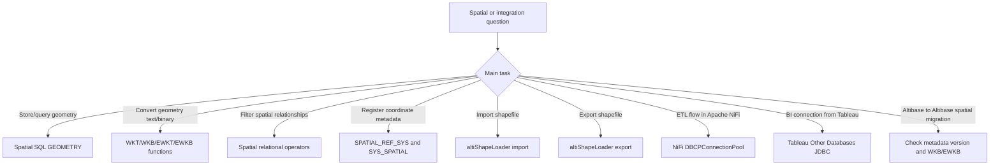
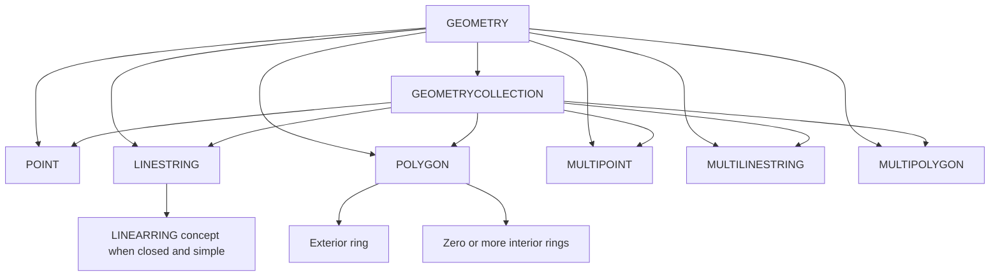

# 19. Spatial, NiFi, Tableau, and Miscellaneous Integrations

## Applicable Versions

- 7.1: Based on Altibase 7.1 Spatial SQL Reference and applicable integration guidance.
- 7.3: Based on Altibase 7.3 Spatial SQL Reference, altiShapeLoader, NiFi, and Tableau guidance.
- 8.1: Based on Altibase 8.1 verified source Spatial SQL Reference, altiShapeLoader, NiFi, and Tableau guidance.

## Questions This File Can Answer

- How are Spatial SQL, `GEOMETRY`, SRID, WKT, WKB, EWKT, and EWKB used in Altibase?
- How do I create a `GEOMETRY` column or R-Tree index?
- Which Spatial SQL functions and relational operators should I use?
- How do I register spatial reference metadata in `SPATIAL_REF_SYS`?
- How do I move Altibase `GEOMETRY` data between WKB-only and EWKB-capable Altibase databases?
- How do I import or export shapefiles with `altiShapeLoader`?
- What are the key `altiShapeLoader` options, data type mappings, and constraints?
- How do I connect Apache NiFi to Altibase through JDBC without relying on UI images?
- How do I connect Tableau Desktop to Altibase through JDBC without relying on UI images?

## Source Documents

- 7.1: Altibase 7.1 Spatial SQL Reference.
- 7.3: Altibase 7.3 Spatial SQL Reference; altiShapeLoader User's Manual; NiFi User's Guide for Altibase; Tableau User's Guide for Altibase.
- 8.1: Altibase 8.1 verified source Spatial SQL Reference; altiShapeLoader User's Manual; NiFi User's Guide for Altibase; Tableau User's Guide for Altibase.

## Response Rules

- Answer explanatory text in the user's language.
- Keep SQL object names, function names, data type names, command options, property names, Java class names, JDBC URLs, file names, and paths literal.
- For 8.1-specific statements, say `Altibase 8.1 verified source`.
- Do not expose internal source labels, repository paths, workstation paths, or source-image names in customer answers.
- Treat sample accounts such as `SYS`, `MANAGER`, and `sys/manager` as placeholders. Recommend least-privilege accounts and protected secret handling.
- For production import/export or BI/ETL connection procedures, ask for Altibase version, JDBC driver version, Java version, host, port, database name, character set, SRID, file size, and rollback or reload plan.
- Prefer procedural text over UI images. This attachment provides the NiFi and Tableau menu paths, input fields, sample values, and expected results as text.

## Fast Decision Map



## Version Differences

Version block: 7.1

- Spatial SQL supports `GEOMETRY`, the seven primary subtypes, WKT, WKB, EWKT, EWKB, SRID-aware DDL, Spatial SQL functions, R-Tree indexes, Spatial API functions, and `SPATIAL_REF_SYS` metadata procedures.
- Use `Altibase42.jar` for JDBC 4.2 based third-party integrations when using the 7.1 JDBC driver documented by the NiFi and Tableau guides.
- `altiShapeLoader` supports Altibase 7.1 or later.

Version block: 7.3

- Spatial SQL coverage is aligned with the 8.1 verified source for the function families covered here.
- `altiShapeLoader` version 1.0 is documented for importing and exporting shapefiles.
- NiFi and Tableau procedures use JDBC connection properties and should be adapted to the installed Altibase JDBC driver.

Version block: 8.1

- Use the wording `Altibase 8.1 verified source` for 8.1-specific Spatial SQL and integration answers.
- The Altibase 8.1 verified source keeps the practical Spatial SQL model documented here: `GEOMETRY`, SRID metadata, WKT/WKB/EWKT/EWKB conversion, R-Tree indexes, spatial functions, relational operators, and shapefile import/export tooling.
- Use the JDBC driver shipped with the installed 8.1 client or server package unless a certified driver package is specified by the target integration.

## Spatial Data Model

Altibase supports the `GEOMETRY` SQL data type. A `GEOMETRY` value uses X and Y coordinates and can be one of seven main subtypes. Spatial operations can also return `EMPTY` when a result exists conceptually but has no coordinates.



Subtype block: `POINT`

- Purpose: represents one coordinate pair.
- Dimension: `0`.
- Compact syntax: `POINT(x y)` or `POINT EMPTY`.
- Example: `GEOMETRY'POINT(10 10)'`.

Subtype block: `LINESTRING`

- Purpose: represents a path made from two or more points connected by straight segments.
- Dimension: `1`.
- Compact syntax: `LINESTRING(x1 y1, x2 y2 [, xn yn]...)` or `LINESTRING EMPTY`.
- Notes: a closed and simple `LINESTRING` is treated as a `LINEARRING` conceptually.
- Example: `GEOMETRY'LINESTRING(0 18, 10 21, 16 23)'`.

Subtype block: `POLYGON`

- Purpose: represents a two-dimensional surface.
- Dimension: `2`.
- Compact syntax: `POLYGON((outer_ring_points) [, (inner_ring_points)]...)` or `POLYGON EMPTY`.
- Notes: rings must be closed. Interior rings represent holes.
- Example: `GEOMETRY'POLYGON((0 0, 10 0, 10 10, 0 10, 0 0))'`.

Subtype block: `MULTIPOINT`

- Purpose: represents one or more `POINT` values.
- Dimension: `0`.
- Compact syntax: `MULTIPOINT(x1 y1 [, xn yn]...)` or `MULTIPOINT EMPTY`.
- Example: `GEOMETRY'MULTIPOINT(1 1, 2 2)'`.

Subtype block: `MULTILINESTRING`

- Purpose: represents one or more `LINESTRING` values.
- Dimension: `1`.
- Compact syntax: `MULTILINESTRING((line1_points) [, (lineN_points)]...)` or `MULTILINESTRING EMPTY`.
- Example: `GEOMETRY'MULTILINESTRING((1 1, 2 2), (3 3, 4 5))'`.

Subtype block: `MULTIPOLYGON`

- Purpose: represents one or more `POLYGON` values.
- Dimension: `2`.
- Compact syntax: `MULTIPOLYGON(((polygon1_outer) [, (polygon1_inner)]...) [, ((polygonN_outer) ...)]...)` or `MULTIPOLYGON EMPTY`.
- Example: `GEOMETRY'MULTIPOLYGON(((1 1, 2 1, 2 2, 1 2, 1 1)), ((3 3, 3 5, 5 5, 5 3, 3 3)))'`.

Subtype block: `GEOMETRYCOLLECTION`

- Purpose: represents a collection of non-`GEOMETRYCOLLECTION` spatial objects.
- Dimension: maximum dimension of its elements.
- Compact syntax: `GEOMETRYCOLLECTION(geometry1 [, geometryN]...)` or `GEOMETRYCOLLECTION EMPTY`.
- Limitation: nested `GEOMETRYCOLLECTION` values are not supported.
- Example: `GEOMFROMTEXT('GEOMETRYCOLLECTION(POINT(1 1), LINESTRING(2 2, 3 3))')`.

## Geometry Format Syntax

Compact WKT syntax:

```text
geometry_text ::=
    point_text
  | linestring_text
  | polygon_text
  | multipoint_text
  | multilinestring_text
  | multipolygon_text
  | geometrycollection_text

point_text              ::= POINT "(" x y ")" | POINT EMPTY
linestring_text         ::= LINESTRING "(" point { "," point }... ")" | LINESTRING EMPTY
polygon_text            ::= POLYGON "(" ring { "," ring }... ")" | POLYGON EMPTY
multipoint_text         ::= MULTIPOINT "(" point { "," point }... ")" | MULTIPOINT EMPTY
multilinestring_text    ::= MULTILINESTRING "(" linestring_points { "," linestring_points }... ")" | MULTILINESTRING EMPTY
multipolygon_text       ::= MULTIPOLYGON "(" polygon_rings { "," polygon_rings }... ")" | MULTIPOLYGON EMPTY
geometrycollection_text ::= GEOMETRYCOLLECTION "(" geometry_text { "," geometry_text }... ")" | GEOMETRYCOLLECTION EMPTY

point             ::= x y
ring              ::= "(" point "," point "," point { "," point }... ")"
linestring_points ::= "(" point "," point { "," point }... ")"
polygon_rings     ::= "(" ring { "," ring }... ")"
x                 ::= double precision literal
y                 ::= double precision literal
```

Format block: `WKT`

- Purpose: text representation of a geometry.
- SRID behavior: WKT itself does not carry SRID; created objects default to SRID `0` unless a function accepts an explicit SRID.
- Example: `POINT(10 10)`.

Format block: `WKB`

- Purpose: binary representation of a geometry.
- Byte order: supports XDR big endian and NDR little endian.
- Typical conversion: `ASBINARY(geom)` and `GEOMFROMWKB(wkb)`.

Format block: `EWKT`

- Purpose: WKT plus SRID prefix.
- Syntax: `SRID=<srid>;WKT`.
- Example: `SRID=4326;POINT(10 10)`.
- Note: EWKT is not an OpenGIS standard.

Format block: `EWKB`

- Purpose: WKB plus SRID value.
- Typical conversion: `ASEWKB(geom)` and `GEOMFROMEWKB(ewkb)`.
- Note: EWKB is not an OpenGIS standard.

## Altibase-to-Altibase Spatial Migration

Use this section when moving `GEOMETRY` data between Altibase databases with `iLoader` or `aexport`. It is separate from Oracle-to-Altibase Migration Center work in `15_migration_oracle_compatibility.md`.

Compatibility rule:

- The decisive source-backed value is the database metadata version in `SYSTEM_.SYS_DATABASE_`, not only the marketing version string.
- Metadata version lower than `8.8.1`: spatial data is stored and extracted in `WKB` format.
- Metadata version `8.8.1` or later: spatial data is stored and extracted in `EWKB` format.
- An EWKB-capable Altibase database can read `WKB` spatial data and convert it automatically.
- A WKB-only Altibase database cannot read `EWKB` spatial data. When moving from an EWKB-capable source to a WKB-only target, extract the source data as `WKB`.

Check the metadata version before choosing the export format:

```sql
SELECT META_MAJOR_VER,
       META_MINOR_VER,
       META_PATCH_VER
FROM SYSTEM_.SYS_DATABASE_;
```

Migration decision block:

- Source metadata version lower than `8.8.1` to target metadata version `8.8.1` or later: ordinary `iLoader` or `aexport` output is `WKB`, and the target can read it.
- Source metadata version `8.8.1` or later to target metadata version lower than `8.8.1`: force `WKB` output.
- One table with `iLoader`: add `-geom WKB` to the `iloader out` command.
- Whole or scripted migration with `aexport`: set `ILOADER_GEOM = WKB` in `aexport.properties`; generated `run_il_out.sh` adds `-geom WKB`.

Command examples:

```bash
iloader out -s source_host -port 20300 -u app_user -p source_password \
  -T SPATIAL_TABLE \
  -f spatial_table.fmt \
  -d spatial_table.dat \
  -geom WKB
```

```properties
# aexport.properties
ILOADER_GEOM = WKB
```

Validation after load:

- Compare source and target row counts for every spatial table.
- Compare the count of `NULL` values in each `GEOMETRY` column.
- Compare SRID distribution with `SRID(geometry_column)` for non-`NULL` values.
- Run representative `ASTEXT` or `ASEWKT` queries on sample rows to confirm that geometry text, SRID, and application-visible shape semantics survived the move.
- If validation fails, ask for source and target Altibase versions, both metadata versions, the exact `iLoader` or `aexport` command, the `.fmt` file, and the first failing row or error message before recommending a reload.

## Spatial DDL

DDL block: create a `GEOMETRY` column

- Purpose: store spatial data in a table.
- Compact syntax:

```sql
CREATE TABLE table_name (
  column_name GEOMETRY [(precision)] [(SRID srid)]
);
```

- `precision`: maximum bytes for the column. Allowed range is 16 bytes through 100 MB. If omitted, the default is 32,000 bytes.
- `SRID`: 4-byte integer identifying the spatial reference system. If omitted, the default is `0`.
- Example:

```sql
CREATE TABLE t1 (id INTEGER, obj GEOMETRY);
CREATE TABLE t2 (id INTEGER, obj GEOMETRY(128));
CREATE TABLE t3 (id INTEGER, obj GEOMETRY SRID 100);
```

DDL block: create an R-Tree index

- Purpose: index a `GEOMETRY` column for spatial filtering.
- Compact syntax:

```sql
CREATE INDEX index_name ON table_name (column_name) [INDEXTYPE IS RTREE];
```

- Notes: a `GEOMETRY` column uses an R-Tree index automatically. `INDEXTYPE IS BTREE` is not valid for `GEOMETRY`.
- Example:

```sql
CREATE INDEX idx_t1 ON t1(obj);
CREATE INDEX idx_t2 ON t2(obj) INDEXTYPE IS RTREE;
```

DDL limitation block: `GEOMETRY` columns

- `GEOMETRY` cannot be a primary key.
- `UNIQUE` constraints and unique indexes are not supported on `GEOMETRY`.
- Compound indexes that include a `GEOMETRY` column are not supported.
- The only supported constraint on a `GEOMETRY` column is `NOT NULL`.
- `GEOMETRY` values cannot be used as stored procedure parameters, stored function parameters, stored function return values, or local variables.
- Trigger before-images and after-images for `GEOMETRY` columns cannot be used in triggers.

SRID rule block

- A `GEOMETRY` column can have an SRID, and a geometry object can also have an SRID.
- An inserted geometry object's SRID must match the column SRID or be `0`.
- A `GEOMETRY` column SRID can be changed with `ALTER TABLE MODIFY COLUMN` only when existing stored objects have a matching SRID or SRID `0`.
- Example:

```sql
CREATE TABLE t1 (i1 GEOMETRY);
INSERT INTO t1 VALUES (GEOMETRY'POINT(1 1)');
INSERT INTO t1 VALUES (GEOMETRY'SRID=99;POINT(1 1)');

ALTER TABLE t1 MODIFY COLUMN i1 SRID 99;
```

R-Tree null and empty caution

- R-Tree index leaf nodes do not contain `NULL` or `EMPTY` values.
- A query that uses an R-Tree index can return a different count than a full scan when `NULL` or `EMPTY` values are present.
- Add `NOT NULL` when indexed spatial columns must behave consistently for index-based filtering.

## Spatial Metadata

Metadata block: `GEOMETRY_COLUMNS`

- Purpose: reference metadata for `GEOMETRY` type columns.
- Synonym: `SYSTEM_.SYS_GEOMETRY_COLUMNS_`.
- Key columns: `F_TABLE_SCHEMA`, `F_TABLE_NAME`, `F_GEOMETRY_COLUMN`, `COORD_DIMENSION`, `SRID`.
- Limitation: generic metadata table used only for reference.

Metadata block: `SPATIAL_REF_SYS`

- Purpose: manage SRID and spatial reference system metadata.
- Synonym: `SYSTEM_.USER_SRS`.
- Key columns: `SRID`, `AUTH_NAME`, `AUTH_SRID`, `SRTEXT`, `PROJ4TEXT`.
- Required for: SRID registration, shapefile import with `.prj` resolution, and SRID-based coordinate transformations.

Procedure block: `SYS_SPATIAL.ADD_SPATIAL_REF_SYS`

- Purpose: register spatial reference system metadata.
- Syntax:

```sql
SYS_SPATIAL.ADD_SPATIAL_REF_SYS(
  SRID in integer,
  AUTH_NAME in varchar(256),
  AUTH_SRID in integer,
  SRTEXT in varchar(2048),
  PROJ4TEXT in varchar(2048)
);
```

- Required privileges: the package must exist under `SYS`, and the execution user needs authority to execute the procedure.
- Example:

```sql
EXEC SYS_SPATIAL.ADD_SPATIAL_REF_SYS(
  4326,
  'EPSG',
  4326,
  'GEOGCS["WGS 84",DATUM["WGS_1984",SPHEROID["WGS 84",6378137,298.257223563]]]',
  '+proj=longlat +datum=WGS84 +no_defs'
);
```

Procedure block: `SYS_SPATIAL.DELETE_SPATIAL_REF_SYS`

- Purpose: delete registered spatial reference metadata.
- Syntax:

```sql
SYS_SPATIAL.DELETE_SPATIAL_REF_SYS(
  SRID in integer,
  AUTH_NAME in varchar(256)
);
```

- Caution: confirm no import/export or transform workflow depends on the SRID before deleting it.

## Spatial Function Reference

Compact function syntax roots:

```text
geometry_inspection_function ::=
    DIMENSION(geometry_expr)
  | GEOMETRYTYPE(geometry_expr)
  | ENVELOPE(geometry_expr)
  | ISEMPTY(geometry_expr)
  | ISSIMPLE(geometry_expr)
  | ISVALID(geometry_expr)
  | ISVALIDHEADER(geometry_expr)
  | BOUNDARY(geometry_expr)

geometry_output_function ::=
    ASTEXT(geometry_expr [, precision])
  | ASBINARY(geometry_expr)
  | ASEWKT(geometry_expr [, precision])
  | ASEWKB(geometry_expr)

geometry_creation_function ::=
    GEOMFROMTEXT(text_expr)
  | POINTFROMTEXT(text_expr)
  | LINEFROMTEXT(text_expr)
  | POLYFROMTEXT(text_expr [, srid])
  | ST_POLYGONFROMTEXT(text_expr [, srid])
  | MPOINTFROMTEXT(text_expr)
  | MLINEFROMTEXT(text_expr)
  | MPOLYFROMTEXT(text_expr)
  | GEOMCOLLFROMTEXT(text_expr)
  | GEOMFROMWKB(binary_expr)
  | POINTFROMWKB(binary_expr)
  | LINEFROMWKB(binary_expr)
  | ST_LINESTRINGFROMWKB(binary_expr [, srid])
  | POLYFROMWKB(binary_expr)
  | MPOINTFROMWKB(binary_expr)
  | MLINEFROMWKB(binary_expr)
  | MPOLYFROMWKB(binary_expr)
  | GEOMCOLLFROMWKB(binary_expr)
  | GEOMFROMEWKT(text_expr)
  | GEOMFROMEWKB(binary_expr)
  | ST_MAKEPOINT(x, y)
  | ST_MAKELINE(geometry_expr, geometry_expr)
  | ST_MAKEPOLYGON(geometry_expr)
  | ST_COLLECT(geometry_expr, geometry_expr)

spatial_predicate ::=
    EQUALS(g1, g2)
  | DISJOINT(g1, g2)
  | INTERSECTS(g1, g2)
  | TOUCHES(g1, g2)
  | CROSSES(g1, g2)
  | WITHIN(g1, g2)
  | CONTAINS(g1, g2)
  | OVERLAPS(g1, g2)
  | RELATE(g1, g2, pattern)
  | ISMBRINTERSECTS(g1, g2)
  | ISMBRWITHIN(g1, g2)
  | ISMBRCONTAINS(g1, g2)
```

The item blocks below provide the concrete function names, purpose, input shape, return type, and examples for the selected 7.1, 7.3, and Altibase 8.1 verified source Spatial SQL families.

Function block: `DIMENSION`

- Purpose: returns the minimum dimension required to represent a geometry.
- Input: `DIMENSION(GEOMETRY)`.
- Output: integer; `-1` for `EMPTY`, `0` for point types, `1` for line types, `2` for polygon types.
- Example: `SELECT DIMENSION(GEOMETRY'POINT(1 1)') FROM DUAL;`.

Function block: `GEOMETRYTYPE`

- Purpose: returns the subtype name of a `GEOMETRY`.
- Input: `GEOMETRYTYPE(GEOMETRY)`.
- Output: string such as `POINT`, `LINESTRING`, or `GEOMETRYCOLLECTION`.
- Example: `SELECT GEOMETRYTYPE(obj) FROM t1;`.

Function block: `ENVELOPE`

- Purpose: returns the minimum bounding rectangle as a `POLYGON`.
- Input: `ENVELOPE(GEOMETRY)`.
- Output: `GEOMETRY`.
- Example: `SELECT ASTEXT(ENVELOPE(obj)) FROM t1;`.

Function block: `ASTEXT`

- Purpose: converts geometry to WKT.
- Input: `ASTEXT(GEOMETRY[, precision])`.
- Output: `VARCHAR`.
- Example: `SELECT ASTEXT(obj) FROM t1;`.

Function block: `ASBINARY`

- Purpose: converts geometry to WKB.
- Input: `ASBINARY(GEOMETRY)`.
- Output: binary geometry representation.
- Example: `SELECT ASTEXT(GEOMFROMWKB(ASBINARY(obj))) FROM t1;`.

Function block: `ASEWKT`

- Purpose: converts geometry to EWKT including SRID.
- Input: `ASEWKT(GEOMETRY[, precision])`.
- Output: `VARCHAR`.
- Example: `SELECT ASEWKT(obj, 40) FROM t1;`.

Function block: `ASEWKB`

- Purpose: converts geometry to EWKB including SRID.
- Input: `ASEWKB(GEOMETRY)`.
- Output: EWKB binary representation.
- Example: `SELECT ASEWKT(GEOMFROMEWKB(ASEWKB(obj)), 40) FROM t1;`.

Function block: `ISEMPTY`

- Purpose: checks whether a geometry has no coordinates.
- Input: `ISEMPTY(GEOMETRY)`.
- Output: `1` if empty, otherwise `0`.
- Example: `SELECT ISEMPTY(GEOMETRY'POINT EMPTY') FROM DUAL;`.

Function block: `ISSIMPLE`

- Purpose: checks whether a geometry has no exceptional self-intersection or contact points.
- Input: `ISSIMPLE(GEOMETRY)`.
- Output: `1` if simple, otherwise `0`.
- Example: `SELECT ISSIMPLE(obj) FROM t1;`.

Function block: `ISVALID`

- Purpose: checks whether a geometry satisfies subtype validity rules.
- Input: `ISVALID(GEOMETRY)`.
- Output: `1` if valid, otherwise `0`.
- Example: `SELECT ISVALID(obj) FROM t1;`.

Function block: `ISVALIDHEADER`

- Purpose: checks geometry validity using only header information.
- Input: `ISVALIDHEADER(GEOMETRY)`.
- Output: `1` if header-valid, otherwise `0`.
- Example: `SELECT ISVALIDHEADER(obj) FROM t1;`.

Function block: `BOUNDARY`

- Purpose: returns the boundary of a geometry.
- Input: `BOUNDARY(GEOMETRY)`.
- Output: `GEOMETRY`.
- Example: `SELECT ASTEXT(BOUNDARY(obj)) FROM t1;`.

Function block: `X` and `COORDX`

- Purpose: returns the X coordinate of a `POINT`.
- Input: `X(GEOMETRY)` or `COORDX(GEOMETRY)`.
- Output: numeric X coordinate.
- Example: `SELECT X(GEOMETRY'POINT(10 20)') FROM DUAL;`.

Function block: `Y` and `COORDY`

- Purpose: returns the Y coordinate of a `POINT`.
- Input: `Y(GEOMETRY)` or `COORDY(GEOMETRY)`.
- Output: numeric Y coordinate.
- Example: `SELECT Y(GEOMETRY'POINT(10 20)') FROM DUAL;`.

Function block: `MINX`

- Purpose: returns the minimum X coordinate of a geometry MBR.
- Input: `MINX(GEOMETRY)`.
- Output: numeric coordinate.
- Example: `SELECT MINX(obj) FROM t1;`.

Function block: `MINY`

- Purpose: returns the minimum Y coordinate of a geometry MBR.
- Input: `MINY(GEOMETRY)`.
- Output: numeric coordinate.
- Example: `SELECT MINY(obj) FROM t1;`.

Function block: `MAXX`

- Purpose: returns the maximum X coordinate of a geometry MBR.
- Input: `MAXX(GEOMETRY)`.
- Output: numeric coordinate.
- Example: `SELECT MAXX(obj) FROM t1;`.

Function block: `MAXY`

- Purpose: returns the maximum Y coordinate of a geometry MBR.
- Input: `MAXY(GEOMETRY)`.
- Output: numeric coordinate.
- Example: `SELECT MAXY(obj) FROM t1;`.

Function block: `GEOMETRYLENGTH`

- Purpose: returns the length of a `LINESTRING` or `MULTILINESTRING`.
- Input: `GEOMETRYLENGTH(GEOMETRY)`.
- Output: numeric length.
- Example: `SELECT GEOMETRYLENGTH(obj) FROM t1 WHERE GEOMETRYTYPE(obj) = 'LINESTRING';`.

Function block: `STARTPOINT`

- Purpose: returns the first point of a `LINESTRING`.
- Input: `STARTPOINT(GEOMETRY)`.
- Output: `GEOMETRY` subtype `POINT`.
- Example: `SELECT ASTEXT(STARTPOINT(obj)) FROM t1 WHERE GEOMETRYTYPE(obj) = 'LINESTRING';`.

Function block: `ENDPOINT`

- Purpose: returns the last point of a `LINESTRING`.
- Input: `ENDPOINT(GEOMETRY)`.
- Output: `GEOMETRY` subtype `POINT`.
- Example: `SELECT ASTEXT(ENDPOINT(obj)) FROM t1 WHERE GEOMETRYTYPE(obj) = 'LINESTRING';`.

Function block: `ISCLOSED`

- Purpose: checks whether a `LINESTRING` or `MULTILINESTRING` is closed.
- Input: `ISCLOSED(GEOMETRY)`.
- Output: `1` if closed, otherwise `0`.
- Example: `SELECT ISCLOSED(GEOMETRY'LINESTRING(0 0, 1 1, 0 0)') FROM DUAL;`.

Function block: `ISRING`

- Purpose: checks whether a line geometry is both simple and closed.
- Input: `ISRING(GEOMETRY)`.
- Output: `1` if ring, otherwise `0`.
- Example: `SELECT ISRING(GEOMETRY'LINESTRING(0 0, 1 1, 0 0)') FROM DUAL;`.

Function block: `ST_ISCOLLECTION`

- Purpose: checks whether a geometry is `MULTIPOINT`, `MULTILINESTRING`, `MULTIPOLYGON`, or `GEOMETRYCOLLECTION`.
- Input: `ST_ISCOLLECTION(GEOMETRY)`.
- Output: `1` if collection type, otherwise `0`.
- Example: `SELECT ST_ISCOLLECTION(GEOMETRY'MULTIPOINT(1 1)') FROM DUAL;`.

Function block: `NUMPOINTS`

- Purpose: returns the number of points in a geometry.
- Input: `NUMPOINTS(GEOMETRY)`.
- Output: integer.
- Example: `SELECT NUMPOINTS(GEOMETRY'LINESTRING(1 1, 2 2)') FROM DUAL;`.

Function block: `POINTN`

- Purpose: returns the Nth point in a `LINESTRING`.
- Input: `POINTN(GEOMETRY, N)`.
- Output: `GEOMETRY` subtype `POINT`.
- Example: `SELECT ASTEXT(POINTN(GEOMETRY'LINESTRING(1 1, 2 2)', 2)) FROM DUAL;`.

Function block: `AREA`

- Purpose: returns area for `POLYGON` or `MULTIPOLYGON`.
- Input: `AREA(GEOMETRY)`.
- Output: numeric area.
- Example: `SELECT AREA(GEOMETRY'POLYGON((0 0, 10 0, 10 10, 0 10, 0 0))') FROM DUAL;`.

Function block: `CENTROID`

- Purpose: returns the center of gravity for polygon geometry.
- Input: `CENTROID(GEOMETRY)`.
- Output: `GEOMETRY` subtype `POINT`.
- Example: `SELECT ASTEXT(CENTROID(obj)) FROM t1 WHERE GEOMETRYTYPE(obj) = 'POLYGON';`.

Function block: `POINTONSURFACE`

- Purpose: returns a point guaranteed to be inside or on the boundary of a polygon geometry.
- Input: `POINTONSURFACE(GEOMETRY)`.
- Output: `GEOMETRY` subtype `POINT`.
- Example: `SELECT ASTEXT(POINTONSURFACE(obj)) FROM t1 WHERE GEOMETRYTYPE(obj) = 'POLYGON';`.

Function block: `EXTERIORRING`

- Purpose: returns the exterior ring of a `POLYGON`.
- Input: `EXTERIORRING(GEOMETRY)`.
- Output: `GEOMETRY` subtype `LINESTRING`.
- Example: `SELECT ASTEXT(EXTERIORRING(obj)) FROM t1 WHERE GEOMETRYTYPE(obj) = 'POLYGON';`.

Function block: `NUMINTERIORRING`

- Purpose: returns the number of interior rings in a `POLYGON`.
- Input: `NUMINTERIORRING(GEOMETRY)`.
- Output: integer.
- Example: `SELECT NUMINTERIORRING(obj) FROM t1 WHERE GEOMETRYTYPE(obj) = 'POLYGON';`.

Function block: `INTERIORRINGN`

- Purpose: returns the Nth interior ring of a `POLYGON`.
- Input: `INTERIORRINGN(GEOMETRY, N)`.
- Output: `GEOMETRY` subtype `LINESTRING`.
- Example: `SELECT ASTEXT(INTERIORRINGN(obj, 1)) FROM t1 WHERE GEOMETRYTYPE(obj) = 'POLYGON';`.

Function block: `NUMGEOMETRIES`

- Purpose: returns the number of child geometries in a `GEOMETRYCOLLECTION`.
- Input: `NUMGEOMETRIES(GEOMETRY)`.
- Output: integer.
- Example: `SELECT NUMGEOMETRIES(GEOMFROMTEXT('GEOMETRYCOLLECTION(POINT(1 1), LINESTRING(2 2, 3 3))')) FROM DUAL;`.

Function block: `GEOMETRYN`

- Purpose: returns the Nth geometry in a `GEOMETRYCOLLECTION`.
- Input: `GEOMETRYN(GEOMETRY, N)`.
- Output: `GEOMETRY`.
- Example: `SELECT ASTEXT(GEOMETRYN(GEOMFROMTEXT('GEOMETRYCOLLECTION(POINT(1 1), LINESTRING(2 2, 3 3))'), 1)) FROM DUAL;`.

Function block: `DISTANCE`

- Purpose: returns the shortest distance between two geometry objects.
- Input: `DISTANCE(GEOMETRY1, GEOMETRY2)`.
- Output: numeric distance.
- Example: `SELECT DISTANCE(GEOMETRY'POINT(1 1)', GEOMETRY'POINT(4 5)') FROM DUAL;`.

Function block: `BUFFER`

- Purpose: returns a geometry containing all points within the specified distance from the input geometry.
- Input: `BUFFER(GEOMETRY, NUMBER)`.
- Output: `GEOMETRY`.
- Example: `SELECT ASTEXT(BUFFER(GEOMETRY'POINT(1 1)', 10)) FROM DUAL;`.

Function block: `CONVEXHULL`

- Purpose: returns the smallest closed convex polygon surrounding a geometry.
- Input: `CONVEXHULL(GEOMETRY)`.
- Output: `GEOMETRY`.
- Example: `SELECT ASTEXT(CONVEXHULL(obj)) FROM t1;`.

Function block: `INTERSECTION`

- Purpose: returns the intersection of two geometries.
- Input: `INTERSECTION(GEOMETRY1, GEOMETRY2)`.
- Output: `GEOMETRY`.
- Example: `SELECT ASTEXT(INTERSECTION(a.obj, b.obj)) FROM t1 a, t2 b WHERE INTERSECTS(a.obj, b.obj);`.

Function block: `UNION`

- Purpose: returns the union of two geometries.
- Input: `UNION(GEOMETRY1, GEOMETRY2)`.
- Output: `GEOMETRY`.
- Example: `SELECT ASTEXT(UNION(a.obj, b.obj)) FROM t1 a, t2 b WHERE a.id = b.id;`.

Function block: `DIFFERENCE`

- Purpose: returns the part of `GEOMETRY1` not included in `GEOMETRY2`.
- Input: `DIFFERENCE(GEOMETRY1, GEOMETRY2)`.
- Output: `GEOMETRY`.
- Example: `SELECT ASTEXT(DIFFERENCE(a.obj, b.obj)) FROM t1 a, t2 b WHERE a.id = b.id;`.

Function block: `SYMDIFFERENCE`

- Purpose: returns both geometries excluding their intersection.
- Input: `SYMDIFFERENCE(GEOMETRY1, GEOMETRY2)`.
- Output: `GEOMETRY`.
- Example: `SELECT ASTEXT(SYMDIFFERENCE(a.obj, b.obj)) FROM t1 a, t2 b WHERE a.id = b.id;`.

Function block: `SRID`

- Purpose: returns the SRID of a geometry object.
- Input: `SRID(GEOMETRY)`.
- Output: integer.
- Example: `SELECT SRID(GEOMETRY'SRID=4326;POINT(10 10)') FROM DUAL;`.

Function block: `SETSRID`

- Purpose: changes the SRID value stored in a geometry object.
- Input: `SETSRID(GEOMETRY, INTEGER)`.
- Output: `GEOMETRY`.
- Example: `SELECT ASEWKT(SETSRID(GEOMETRY'POINT(10 10)', 4326)) FROM DUAL;`.

Function block: `GEOMFROMTEXT`

- Purpose: creates a geometry from WKT.
- Input: `GEOMFROMTEXT(WKT)`.
- Output: `GEOMETRY`.
- Example: `SELECT ASTEXT(GEOMFROMTEXT('POINT(20 20)')) FROM DUAL;`.

Function block: `POINTFROMTEXT`

- Purpose: creates a `POINT` from WKT.
- Input: `POINTFROMTEXT(WKT)`.
- Output: `GEOMETRY` subtype `POINT`.
- Example: `SELECT ASTEXT(POINTFROMTEXT('POINT(100 100)')) FROM DUAL;`.

Function block: `LINEFROMTEXT`

- Purpose: creates a `LINESTRING` from WKT.
- Input: `LINEFROMTEXT(WKT)`.
- Output: `GEOMETRY` subtype `LINESTRING`.
- Example: `SELECT ASTEXT(LINEFROMTEXT('LINESTRING(1 1, 2 2)')) FROM DUAL;`.

Function block: `POLYFROMTEXT`

- Purpose: creates a `POLYGON` from WKT, optionally with SRID.
- Input: `POLYFROMTEXT(WKT[, srid])`.
- Output: `GEOMETRY` subtype `POLYGON`.
- Example: `SELECT ASTEXT(POLYFROMTEXT('POLYGON((0 0, 1 0, 1 1, 0 0))')) FROM DUAL;`.

Function block: `ST_POLYGONFROMTEXT`

- Purpose: creates a `POLYGON` from WKT or EWKT.
- Input: `ST_POLYGONFROMTEXT(TEXT[, srid])`.
- Output: `GEOMETRY` subtype `POLYGON`; returns `NULL` when the text describes a non-polygon geometry.
- Example: `SELECT ASEWKT(ST_POLYGONFROMTEXT('SRID=100;POLYGON((10 10, 10 20, 20 20, 10 10))')) FROM DUAL;`.

Function block: `MPOINTFROMTEXT`

- Purpose: creates a `MULTIPOINT` from WKT.
- Input: `MPOINTFROMTEXT(WKT)`.
- Output: `GEOMETRY` subtype `MULTIPOINT`.
- Example: `SELECT ASTEXT(MPOINTFROMTEXT('MULTIPOINT(10 10, 20 20)')) FROM DUAL;`.

Function block: `MLINEFROMTEXT`

- Purpose: creates a `MULTILINESTRING` from WKT.
- Input: `MLINEFROMTEXT(WKT)`.
- Output: `GEOMETRY` subtype `MULTILINESTRING`.
- Example: `SELECT ASTEXT(MLINEFROMTEXT('MULTILINESTRING((10 10, 20 20), (15 15, 30 15))')) FROM DUAL;`.

Function block: `MPOLYFROMTEXT`

- Purpose: creates a `MULTIPOLYGON` from WKT.
- Input: `MPOLYFROMTEXT(WKT)`.
- Output: `GEOMETRY` subtype `MULTIPOLYGON`.
- Example: `SELECT ASTEXT(MPOLYFROMTEXT('MULTIPOLYGON(((1 1, 2 1, 2 2, 1 1)))')) FROM DUAL;`.

Function block: `GEOMCOLLFROMTEXT`

- Purpose: creates a `GEOMETRYCOLLECTION` from WKT.
- Input: `GEOMCOLLFROMTEXT(WKT)`.
- Output: `GEOMETRY` subtype `GEOMETRYCOLLECTION`.
- Example: `SELECT ASTEXT(GEOMCOLLFROMTEXT('GEOMETRYCOLLECTION(POINT(10 10), LINESTRING(15 15, 20 20))')) FROM DUAL;`.

Function block: `ST_GEOMETRY`

- Purpose: creates a geometry from WKT.
- Input: `ST_GEOMETRY(WKT)`.
- Output: `GEOMETRY`; created object SRID is `0`.
- Example: `SELECT ASTEXT(ST_GEOMETRY('MULTIPOINT(1 1, 2 2)')) FROM DUAL;`.

Function block: `GEOMFROMWKB`

- Purpose: creates a geometry from WKB.
- Input: `GEOMFROMWKB(WKB)`.
- Output: `GEOMETRY`.
- Example: `SELECT ASTEXT(GEOMFROMWKB(ASBINARY(GEOMETRY'POINT(1 1)'))) FROM DUAL;`.

Function block: `POINTFROMWKB`

- Purpose: creates a `POINT` from WKB.
- Input: `POINTFROMWKB(WKB)`.
- Output: `GEOMETRY` subtype `POINT`.
- Example: `SELECT ASTEXT(POINTFROMWKB(ASBINARY(GEOMETRY'POINT(1 1)'))) FROM DUAL;`.

Function block: `LINEFROMWKB`

- Purpose: creates a `LINESTRING` from WKB.
- Input: `LINEFROMWKB(WKB)`.
- Output: `GEOMETRY` subtype `LINESTRING`.
- Example: `SELECT ASTEXT(LINEFROMWKB(ASBINARY(GEOMETRY'LINESTRING(1 1, 2 2)'))) FROM DUAL;`.

Function block: `ST_LINESTRINGFROMWKB`

- Purpose: creates a `LINESTRING` from WKB or EWKB and optional SRID.
- Input: `ST_LINESTRINGFROMWKB(WKB[, SRID])`.
- Output: `GEOMETRY` subtype `LINESTRING`.
- Example: `SELECT ASTEXT(ST_LINESTRINGFROMWKB(ASBINARY(GEOMETRY'LINESTRING(1 1, 2 2)'), 4326)) FROM DUAL;`.

Function block: `POLYFROMWKB`

- Purpose: creates a `POLYGON` from WKB.
- Input: `POLYFROMWKB(WKB)`.
- Output: `GEOMETRY` subtype `POLYGON`.
- Example: `SELECT ASTEXT(POLYFROMWKB(ASBINARY(GEOMETRY'POLYGON((0 0, 1 0, 1 1, 0 0))'))) FROM DUAL;`.

Function block: `MPOINTFROMWKB`

- Purpose: creates a `MULTIPOINT` from WKB.
- Input: `MPOINTFROMWKB(WKB)`.
- Output: `GEOMETRY` subtype `MULTIPOINT`.
- Example: `SELECT ASTEXT(MPOINTFROMWKB(ASBINARY(GEOMETRY'MULTIPOINT(1 1, 2 2)'))) FROM DUAL;`.

Function block: `MLINEFROMWKB`

- Purpose: creates a `MULTILINESTRING` from WKB.
- Input: `MLINEFROMWKB(WKB)`.
- Output: `GEOMETRY` subtype `MULTILINESTRING`.
- Example: `SELECT ASTEXT(MLINEFROMWKB(ASBINARY(GEOMETRY'MULTILINESTRING((1 1, 2 2), (3 3, 4 4))'))) FROM DUAL;`.

Function block: `MPOLYFROMWKB`

- Purpose: creates a `MULTIPOLYGON` from WKB.
- Input: `MPOLYFROMWKB(WKB)`.
- Output: `GEOMETRY` subtype `MULTIPOLYGON`.
- Example: `SELECT ASTEXT(MPOLYFROMWKB(ASBINARY(GEOMETRY'MULTIPOLYGON(((1 1, 2 1, 2 2, 1 1)))'))) FROM DUAL;`.

Function block: `GEOMCOLLFROMWKB`

- Purpose: creates a `GEOMETRYCOLLECTION` from WKB.
- Input: `GEOMCOLLFROMWKB(WKB)`.
- Output: `GEOMETRY` subtype `GEOMETRYCOLLECTION`.
- Example: `SELECT ASTEXT(GEOMCOLLFROMWKB(ASBINARY(GEOMFROMTEXT('GEOMETRYCOLLECTION(POINT(1 1), LINESTRING(2 2, 3 3))')))) FROM DUAL;`.

Function block: `RECTFROMTEXT`

- Purpose: creates a polygon from a rectangle WKT object.
- Input: `RECTFROMTEXT(WKT)`.
- Output: `GEOMETRY` subtype `POLYGON`.
- Example: `SELECT ASTEXT(RECTFROMTEXT('RECTANGLE(1 1, 3 3)')) FROM DUAL;`.

Function block: `RECTFROMWKB`

- Purpose: creates a polygon from a rectangle WKB object.
- Input: `RECTFROMWKB(WKB)`.
- Output: `GEOMETRY` subtype `POLYGON`.
- Example: use with WKB produced from a supported rectangle geometry representation.

Function block: `GEOMFROMEWKT`

- Purpose: creates a geometry from EWKT.
- Input: `GEOMFROMEWKT(EWKT)`.
- Output: `GEOMETRY`.
- Example: `SELECT ASEWKT(GEOMFROMEWKT('SRID=101;POINT(10 10)')) FROM DUAL;`.

Function block: `GEOMFROMEWKB`

- Purpose: creates a geometry from EWKB.
- Input: `GEOMFROMEWKB(EWKB)`.
- Output: `GEOMETRY`.
- Example: `SELECT ASEWKT(GEOMFROMEWKB(ASEWKB(GEOMETRY'SRID=101;POINT(10 10)'))) FROM DUAL;`.

Function block: `ST_MAKEPOINT`

- Purpose: creates a `POINT` from X and Y values.
- Input: `ST_MAKEPOINT(x, y)`.
- Output: `GEOMETRY` subtype `POINT`.
- Example: `SELECT ASTEXT(ST_MAKEPOINT(1, 1)) FROM DUAL;`.

Function block: `ST_POINT`

- Purpose: alias-style function equivalent to `ST_MAKEPOINT`.
- Input: `ST_POINT(x, y)`.
- Output: `GEOMETRY` subtype `POINT`.
- Example: `SELECT ASTEXT(ST_POINT(1, 1)) FROM DUAL;`.

Function block: `ST_MAKELINE`

- Purpose: creates a `LINESTRING` from point, multipoint, or linestring inputs.
- Input: `ST_MAKELINE(GEOMETRY1, GEOMETRY2)`.
- Output: `GEOMETRY` subtype `LINESTRING`.
- Example: `SELECT ASTEXT(ST_MAKELINE(GEOMETRY'POINT(1 1)', GEOMETRY'POINT(2 2)')) FROM DUAL;`.

Function block: `ST_MAKEPOLYGON`

- Purpose: creates a `POLYGON` from a ring-format `LINESTRING`.
- Input: `ST_MAKEPOLYGON(GEOMETRY)`.
- Output: `GEOMETRY` subtype `POLYGON`.
- Example: `SELECT ASTEXT(ST_MAKEPOLYGON(GEOMETRY'LINESTRING(0 0, 1 1, 1 0, 0 0)')) FROM DUAL;`.

Function block: `ST_POLYGON`

- Purpose: creates a `POLYGON` from a `LINESTRING` and SRID.
- Input: `ST_POLYGON(GEOMETRY, SRID)`.
- Output: `GEOMETRY` subtype `POLYGON`.
- Example: `SELECT ASEWKT(ST_POLYGON(GEOMETRY'LINESTRING(2 2, 3 2, 3 3, 2 3, 2 2)', 4326)) FROM DUAL;`.

Function block: `ST_COLLECT`

- Purpose: combines two geometries into a collection or matching multi-geometry.
- Input: `ST_COLLECT(GEOMETRY1, GEOMETRY2)`.
- Output: `MULTIPOINT`, `MULTILINESTRING`, `MULTIPOLYGON`, or `GEOMETRYCOLLECTION`.
- Example: `SELECT ASTEXT(ST_COLLECT(GEOMETRY'POINT(1 1)', GEOMETRY'POINT(2 2)')) FROM DUAL;`.

Function block: `ST_MAKEENVELOPE`

- Purpose: creates a rectangular polygon from two corner coordinates and optional SRID.
- Input: `ST_MAKEENVELOPE(X1, Y1, X2, Y2[, SRID])`.
- Output: `GEOMETRY` subtype `POLYGON`.
- Example: `SELECT ASEWKT(ST_MAKEENVELOPE(10.9351, 49.3866, 11.201, 49.5138, 104)) FROM DUAL;`.

Function block: `ST_REVERSE`

- Purpose: reverses point order in a geometry.
- Input: `ST_REVERSE(GEOMETRY)`.
- Output: `GEOMETRY`; `POINT` returns the same object and `EMPTY` returns `NULL`.
- Example: `SELECT ASTEXT(ST_REVERSE(GEOMETRY'LINESTRING(2 2, 3 2, 2 4)')) FROM DUAL;`.

Function block: `ST_TRANSFORM`

- Purpose: transforms geometry coordinates to another coordinate system.
- Input:

```sql
ST_TRANSFORM(GEOMETRY, INTEGER to_srid)
ST_TRANSFORM(GEOMETRY, VARCHAR to_proj4text)
ST_TRANSFORM(GEOMETRY, VARCHAR from_proj4text, VARCHAR to_proj4text)
ST_TRANSFORM(GEOMETRY, VARCHAR from_proj4text, INTEGER to_srid)
```

- Output: `GEOMETRY`.
- Constraints: documented for Linux on Intel; SRID-based input/output requires matching metadata in `SPATIAL_REF_SYS`; if output is `PROJ4TEXT`, returned SRID is `0`; `EMPTY` input returns `EMPTY`.
- Example: `SELECT ASEWKT(ST_TRANSFORM(obj, 4326)) FROM spatial_table;`.

## Spatial Relational Operators

Relational operator block: `EQUALS`

- Purpose: true when two geometries are topologically identical.
- Input: `EQUALS(GEOMETRY1, GEOMETRY2)`.
- Output: `BOOLEAN`.
- Example: `SELECT a.id, b.id FROM t1 a, t1 b WHERE EQUALS(a.obj, b.obj);`.

Relational operator block: `NOTEQUALS`

- Purpose: logical opposite of `EQUALS`.
- Input: `NOTEQUALS(GEOMETRY1, GEOMETRY2)`.
- Output: `BOOLEAN`.
- Example: `SELECT a.id, b.id FROM t1 a, t1 b WHERE NOTEQUALS(a.obj, b.obj);`.

Relational operator block: `DISJOINT`

- Purpose: true when two geometries do not intersect.
- Input: `DISJOINT(GEOMETRY1, GEOMETRY2)`.
- Output: `BOOLEAN`.
- Example: `SELECT a.id, b.id FROM t1 a, t2 b WHERE DISJOINT(a.obj, b.obj);`.

Relational operator block: `INTERSECTS`

- Purpose: true when two geometries intersect.
- Input: `INTERSECTS(GEOMETRY1, GEOMETRY2)`.
- Output: `BOOLEAN`.
- Example: `SELECT a.id, b.id FROM t1 a, t2 b WHERE INTERSECTS(a.obj, b.obj);`.

Relational operator block: `TOUCHES`

- Purpose: true when two geometries contact at one or more points.
- Input: `TOUCHES(GEOMETRY1, GEOMETRY2)`.
- Output: `BOOLEAN`.
- Example: `SELECT a.id, b.id FROM t1 a, t2 b WHERE TOUCHES(a.obj, b.obj);`.

Relational operator block: `NOTTOUCHES`

- Purpose: logical opposite of `TOUCHES`.
- Input: `NOTTOUCHES(GEOMETRY1, GEOMETRY2)`.
- Output: `BOOLEAN`.
- Example: `SELECT a.id, b.id FROM t1 a, t2 b WHERE NOTTOUCHES(a.obj, b.obj);`.

Relational operator block: `CROSSES`

- Purpose: true when geometries of different dimensions cross.
- Input: `CROSSES(GEOMETRY1, GEOMETRY2)`.
- Output: `BOOLEAN`.
- Example: `SELECT a.id, b.id FROM t1 a, t2 b WHERE CROSSES(a.obj, b.obj);`.

Relational operator block: `NOTCROSSES`

- Purpose: logical opposite of `CROSSES`.
- Input: `NOTCROSSES(GEOMETRY1, GEOMETRY2)`.
- Output: `BOOLEAN`.
- Example: `SELECT a.id, b.id FROM t1 a, t2 b WHERE NOTCROSSES(a.obj, b.obj);`.

Relational operator block: `WITHIN`

- Purpose: true when the first geometry is completely inside the second.
- Input: `WITHIN(GEOMETRY1, GEOMETRY2)`.
- Output: `BOOLEAN`.
- Example: `SELECT a.id, b.id FROM t1 a, t2 b WHERE WITHIN(a.obj, b.obj);`.

Relational operator block: `NOTWITHIN`

- Purpose: logical opposite of `WITHIN`.
- Input: `NOTWITHIN(GEOMETRY1, GEOMETRY2)`.
- Output: `BOOLEAN`.
- Example: `SELECT a.id, b.id FROM t1 a, t2 b WHERE NOTWITHIN(a.obj, b.obj);`.

Relational operator block: `CONTAINS`

- Purpose: true when the first geometry completely contains the second.
- Input: `CONTAINS(GEOMETRY1, GEOMETRY2)`.
- Output: `BOOLEAN`.
- Example: `SELECT a.id, b.id FROM t1 a, t2 b WHERE CONTAINS(a.obj, b.obj);`.

Relational operator block: `NOTCONTAINS`

- Purpose: logical opposite of `CONTAINS`.
- Input: `NOTCONTAINS(GEOMETRY1, GEOMETRY2)`.
- Output: `BOOLEAN`.
- Example: `SELECT a.id, b.id FROM t1 a, t2 b WHERE NOTCONTAINS(a.obj, b.obj);`.

Relational operator block: `OVERLAPS`

- Purpose: true when two geometries partly but not completely overlap.
- Input: `OVERLAPS(GEOMETRY1, GEOMETRY2)`.
- Output: `BOOLEAN`.
- Example: `SELECT a.id, b.id FROM t1 a, t2 b WHERE OVERLAPS(a.obj, b.obj);`.

Relational operator block: `NOTOVERLAPS`

- Purpose: logical opposite of `OVERLAPS`.
- Input: `NOTOVERLAPS(GEOMETRY1, GEOMETRY2)`.
- Output: `BOOLEAN`.
- Example: `SELECT a.id, b.id FROM t1 a, t2 b WHERE NOTOVERLAPS(a.obj, b.obj);`.

Relational operator block: `RELATE`

- Purpose: true when the relationship between two geometries matches a DE-9IM pattern matrix.
- Input: `RELATE(GEOMETRY1, GEOMETRY2, patterns)`.
- Output: `BOOLEAN`.
- Example: `SELECT a.id, b.id FROM t1 a, t2 b WHERE RELATE(a.obj, b.obj, 'T********');`.

Relational operator block: `NOTRELATE`

- Purpose: logical opposite of `RELATE`.
- Input: `NOTRELATE(GEOMETRY1, GEOMETRY2, patterns)`.
- Output: `BOOLEAN`.
- Example: `SELECT a.id, b.id FROM t1 a, t2 b WHERE NOTRELATE(a.obj, b.obj, 'T********');`.

Relational operator block: `ISMBRINTERSECTS`

- Purpose: true when the minimum bounding rectangles of two geometries intersect.
- Input: `ISMBRINTERSECTS(GEOMETRY1, GEOMETRY2)`.
- Output: `BOOLEAN`.
- Example: `SELECT a.id, b.id FROM t1 a, t2 b WHERE ISMBRINTERSECTS(a.obj, b.obj);`.

Relational operator block: `ISMBRWITHIN`

- Purpose: true when the first geometry MBR is completely within the second geometry MBR.
- Input: `ISMBRWITHIN(GEOMETRY1, GEOMETRY2)`.
- Output: `BOOLEAN`.
- Example: `SELECT a.id, b.id FROM t1 a, t2 b WHERE ISMBRWITHIN(a.obj, b.obj);`.

Relational operator block: `ISMBRCONTAINS`

- Purpose: true when the first geometry MBR completely contains the second geometry MBR.
- Input: `ISMBRCONTAINS(GEOMETRY1, GEOMETRY2)`.
- Output: `BOOLEAN`.
- Example: `SELECT a.id, b.id FROM t1 a, t2 b WHERE ISMBRCONTAINS(a.obj, b.obj);`.

## Spatial API Notes

- The Spatial API is used with the ODBC CLI for C/C++ applications that need direct manipulation of Altibase internal binary geometry.
- Main setup functions: `ACSAllocEnv`, `ACSFreeEnv`, `ACSError`.
- Creation function families: `ACSCreatePoint2D`, `ACSCreateLineString2D`, `ACSCreateLinearRing2D`, `ACSCreatePolygon2D`, `ACSCreateMultiPoint2D`, `ACSCreateMultiLineString2D`, `ACSCreateMultiPolygon2D`, `ACSCreateGeomCollection2D`.
- Query function families: `ACSGetGeometryType`, `ACSGetGeometrySize`, `ACSGetGeometrySizeFromWKB`, `ACSGetNumGeometries`, `ACSGetGeometryN`, `ACSGetExteriorRing2D`, `ACSGetNumInteriorRing2D`, `ACSGetInteriorRingNPolygon2D`, `ACSGetNumPointsLineString2D`, `ACSGetPointNLineString2D`, `ACSGetPointsLineString2D`, `ACSGetNumPointsLinearRing2D`, `ACSGetPointNLinearRing2D`, `ACSGetPointsLinearRing2D`.
- Endian and SRID helpers: `ACSEndian`, `ACSAdjustByteOrder`, `ACSGetGeometrySRID`.
- Samples are installed under `$ALTIBASE_HOME/sample/SPATIAL` in the source guidance.

## altiShapeLoader Overview

`altiShapeLoader` is a Java-based tool for shapefile import and export. It uses GeoTools and supports Altibase 7.1 or later.

Import means reading spatial information from `.shp` plus attribute information from `.dbf` and inserting it into an Altibase table. Export means creating shapefile components from spatial information stored in an Altibase table.

System requirements:

- Memory: minimum 512 MB, 4 GB or more recommended.
- Disk: more than 20 MB free space for installation.
- Java: Oracle, OpenJDK, or IBM Java Runtime Environment 8 or higher.
- OS: 64-bit OS where Java can be installed and run.
- Altibase: 7.1 or higher.

Installation procedure:

1. Download `altiShapeLoader-1.0.zip` or the equivalent package from the Altibase support site.
2. Unzip the package where the tool will run.
3. Use `altiShapeLoader.sh` on Unix/Linux and `altiShapeLoader.bat` on Windows.
4. Set `JAVA_HOME`.
5. Copy `altiShapeLoader.properties.release` to `altiShapeLoader.properties`.
6. Edit `altiShapeLoader.properties` for common connection and default options.

Example:

```bash
export JAVA_HOME=/usr/java/1.8
cd altiShapeLoader
cp -p altiShapeLoader.properties.release altiShapeLoader.properties
```

Option precedence:

1. Command line options.
2. `altiShapeLoader.properties`.
3. Built-in defaults.

Property file skeleton:

```properties
DB_IP       = 127.0.0.1
DB_PORT     = 20300
DB_NAME     = mydb
DB_USER     = SYS
DB_PASSWORD = MANAGER
JDBC_PATH   = ${ALTIBASE_HOME}/lib/Altibase.jar

# CREATE_TABLE    = T
# TABLE_TBS       = SYS_TBS_DISK_DATA
# CREATE_INDEX    = F
# INDEX_TBS       = SYS_TBS_DISK_DATA
# DBF_CHAR        = EUC-KR
# ENDIAN          = B
# CASE_SENSITIVE  = F
# CREATE_BAD      = F
# PARALLEL        = 4
# COMMIT          = 1000
# ATOMIC_BATCH    = T
# OPERATION       = import
# SHAPE_FILE      = ./sample.shp
# TABLE_NAME      = T1
# GEO_COL_SIZE    = 103809024
# SRID            = 2097
```

## altiShapeLoader Options

Compact command syntax:

```text
altiShapeLoader_command ::=
    altiShapeLoader.{sh|bat}
      -o {import | export}
      -f shapefile_or_directory
      connection_options
      [table_options]
      [performance_options]
      [special_options]

connection_options ::= -s host -port port -d database_name -u user -p password -j jdbc_jar
table_options      ::= [-t table_name] [-create_table {T|F}] [-create_index {T|F}]
performance_options ::= [-parallel count] [-commit count] [-atomic_batch {T|F}]
special_options    ::= [-srid srid] [-geo_col_size bytes]
```

Option block: `-o` / `OPERATION`

- Purpose: select operation.
- Values: `import` or `export`.
- Required: yes.
- Example: `./altiShapeLoader.sh -o import -f data/subway_station.shp`.

Option block: `-f` / `SHAPE_FILE`

- Purpose: shapefile path or directory path containing shapefiles.
- Required: yes.
- Example: `-f data/subway_station.shp` or `-f data/multi2single`.
- Windows path note: use `/` instead of `\` when specifying Windows paths in the property file.

Option block: `-s` / `DB_IP`

- Purpose: Altibase server host name or IP address.
- Required: yes through command line or property file.
- Example: `-s 127.0.0.1`.

Option block: `-port` / `DB_PORT`

- Purpose: Altibase service port.
- Required: yes through command line or property file.
- Example: `-port 20300`.

Option block: `-d` / `DB_NAME`

- Purpose: database name.
- Required: yes through command line or property file.
- Example: `-d mydb`.

Option block: `-u` / `DB_USER`

- Purpose: database user.
- Required: yes through command line or property file.
- Example: `-u app_user`.

Option block: `-p` / `DB_PASSWORD`

- Purpose: database password.
- Required: yes through command line or property file.
- Caution: avoid exposing real passwords in shell history.

Option block: `-j` / `JDBC_PATH`

- Purpose: path to the Altibase JDBC driver.
- Required: yes through command line or property file.
- Example: `-j ${ALTIBASE_HOME}/lib/Altibase.jar`.

Option block: `-t` / `TABLE_NAME`

- Purpose: table name for import target or export source.
- Default: shapefile name when importing with table creation.
- Required: required for multiple shapefiles into one table; optional for single shapefile import; usually required for export clarity.

Option block: `-create_table` / `CREATE_TABLE`

- Purpose: create the target table during import.
- Values: `T` or `F`.
- Default: `T`.
- Effect: creates `FID` as first column and a sequence named like `SEQ_<table_name>_FID`.

Option block: `-table_tbs` / `TABLE_TBS`

- Purpose: tablespace for created table.
- Effective when: `CREATE_TABLE=T`.
- Default: user's default tablespace.

Option block: `-create_index` / `CREATE_INDEX`

- Purpose: create an index on the spatial column during table creation.
- Values: `T` or `F`.
- Default: `F`.
- Effective when: `CREATE_TABLE=T`.

Option block: `-index_tbs` / `INDEX_TBS`

- Purpose: tablespace for created spatial index.
- Effective when: `CREATE_INDEX=T`.
- Default: user's default tablespace.

Option block: `-dbf_char` / `DBF_CHAR`

- Purpose: character set for `.dbf` file read/write and column mapping file processing.
- Default: `EUC-KR`.

Option block: `-endian` / `ENDIAN`

- Purpose: shapefile endian type for import.
- Values: `B` for big endian, `L` for little endian.
- Default: `B`.

Option block: `-case_sensitive` / `CASE_SENSITIVE`

- Purpose: preserve case in table and column names.
- Values: `T` or `F`.
- Default: `F`, which converts names to uppercase.

Option block: `-col_map_file` / `COL_MAP_FILE`

- Purpose: map shapefile column names to database column names.
- Format: `shpColName=dbColName`.
- Default: shapefile column names.

Option block: `-create_bad` / `CREATE_BAD`

- Purpose: create `.bad` files for failed import/export records.
- Values: `T` or `F`.
- Default: `F`.
- Import note: bad file count can be up to the `PARALLEL` value.

Option block: `-parallel` / `PARALLEL`

- Purpose: number of consumer threads inserting data during import.
- Default: `4`.
- Minimum: `1`.

Option block: `-commit` / `COMMIT`

- Purpose: records per commit during import.
- Default: `1000`.
- Minimum: `1`.

Option block: `-atomic_batch` / `ATOMIC_BATCH`

- Purpose: use the Altibase JDBC Atomic Batch feature for import batching.
- Values: `T` or `F`.
- Default: `T`.

Option block: `-srid` / `SRID`

- Purpose: force an SRID when `.prj` cannot be processed.
- Default: none.
- Caution: register matching metadata in `SPATIAL_REF_SYS` first when the workflow depends on the SRID.

Option block: `-geo_col_size` / `GEO_COL_SIZE`

- Purpose: geometry column precision in bytes when creating a table.
- Default: `103809024` bytes, about 99 MB.
- Use only when larger than default geometry capacity is required.

## altiShapeLoader Import Cookbook

Prerequisite: register SRID

1. Check whether the SRID is already registered:

```sql
SELECT * FROM SPATIAL_REF_SYS;
```

2. If required, create the `SYS_SPATIAL` package as `SYS` according to the Spatial SQL Reference.
3. Grant execution authority to the user that runs `altiShapeLoader`:

```sql
GRANT EXECUTE ANY PROCEDURE TO app_user;
```

4. Register missing SRID metadata with `SYS_SPATIAL.ADD_SPATIAL_REF_SYS`.

If `SYS_SPATIAL.ADD_SPATIAL_REF_SYS` is missing, `altiShapeLoader` can fail during metadata preparation with an error indicating that target package `SYS_SPATIAL` cannot be found.

Import block: single shapefile into single table

- Required options: `-o import`, `-f <file.shp>`.
- Optional option: `-t <table_name>`.
- Behavior: if `CREATE_TABLE=T`, creates the table, creates `SEQ_<table_name>_FID`, and loads `.shp` plus `.dbf` data.
- Command:

```bash
./altiShapeLoader.sh -o import -f data/subway_station.shp
```

- Expected result: output shows metadata preparation, optional `CREATE SEQUENCE`, optional `CREATE TABLE`, import progress dots, and a `<summary>` with read/write totals, success counts, fail counts, and elapsed time.

Import block: multiple shapefiles into one table

- Required options: `-o import`, `-f <directory>`, `-t <table_name>`.
- Requirement: shapefiles in the directory must have the same schema.
- Command:

```bash
./altiShapeLoader.sh -o import -f data/multi2single -t MULTI2SINGLE
```

- Expected result: the first shapefile creates the table when `CREATE_TABLE=T`; subsequent shapefiles load into the same table.

Import block: multiple shapefiles into each table

- Required options: `-o import`, `-f <directory>`.
- Do not use: `-t`, because each table is named from each shapefile.
- Requirement: shapefiles must be in the same directory.
- Command:

```bash
./altiShapeLoader.sh -o import -f data/multi2multi
```

- Expected result: one table and one `SEQ_<table_name>_FID` sequence are created per shapefile when `CREATE_TABLE=T`.

Import SRID handling:

- Normal path: `.prj` exists, can be parsed by GeoTools or `epsg.properties`, and its SRID exists in `SPATIAL_REF_SYS`.
- Missing `.prj`: import can fail in metadata analysis unless `-srid` or `SRID` is supplied.
- Unrecognized `.prj`: add an SRID-to-WKT entry to `epsg.properties` or use `-srid`.
- `epsg.properties` format:

```properties
7846=PROJCS["PCS_ITRF2000_TM",GEOGCS["GCS_ITRF_2000",DATUM["D_ITRF_2000",SPHEROID["GRS_1980",6378137.0,298.257222101]]]]
```

- Forced SRID example:

```bash
./altiShapeLoader.sh -o import -f data/bld.shp -srid 7846
```

## altiShapeLoader Export Cookbook

Export block: table to shapefile

- Purpose: create `.shp`, `.shx`, `.dbf`, `.prj`, and related shapefile components from an Altibase table.
- Required options: `-o export`, `-f <output.shp>`.
- Recommended option: `-t <table_name>`.
- Command:

```bash
./altiShapeLoader.sh -o export -t POLICESTATION -f ./policestation2.shp
```

- Expected result: output shows file preparation, metadata analysis, export progress dots, and a `<summary>` with read/write totals, success counts, fail counts, and elapsed time.
- SRID behavior: `.prj` is created by referring to the geometry SRID and `SPATIAL_REF_SYS` metadata.
- Export note: `FID` is not exported to the shapefile.

Verification:

```bash
ls -l policestation2*
file policestation2*
```

Expected files include:

- `policestation2.dbf`: dBASE attribute file.
- `policestation2.prj`: projection metadata.
- `policestation2.shp`: feature geometry file.
- `policestation2.shx`: shape index file.
- `policestation2.fix`: auxiliary output created by the tool.

## altiShapeLoader Constraints and Type Mapping

Shapefile constraints:

- One shapefile can contain only one geometry column and one spatial data type.
- Each shapefile component is supported up to 2 GB.
- Property field names cannot exceed 10 characters.
- Maximum property field count is 255; additional fields are ignored.
- Supported property field types are `NUMBER`, `FLOAT`, `CHARACTER(255)`, and `DATE`.

Import data type mapping:

- `NUMBER` in dBASE maps to `INTEGER`, `BIGINT`, or `DOUBLE` depending on precision and scale. If scale exists, it maps to `DOUBLE`; precision 1 through 9 maps to `INTEGER`; precision 10 or higher maps to `BIGINT`.
- `CHARACTER` maps to `VARCHAR`.
- `DATE` maps to `DATE`; dBASE does not support `TIME`.
- `BOOLEAN` maps to `VARCHAR(1)`. `T` and `F` are imported as `'T'` and `'F'`; other values such as `1`, `0`, or null are processed as `NULL`.

Export data type mapping:

- `SMALLINT`, `INTEGER`, and `BIGINT` map to dBASE `NUMBER` with scale `0`.
- `REAL`, `NUMBER`, `NUMERIC`, `DOUBLE`, and `FLOAT` map to dBASE `NUMBER` with precision and scale based on the Altibase type.
- `CHAR` and `VARCHAR` map to dBASE `CHARACTER`, whose maximum value is 255.
- `NCHAR` and `NVARCHAR` are unsupported for export.
- `DATE` maps to dBASE `DATE`; dBASE does not support `TIME`.
- `BINARY`, `BIT`, `VARBIT`, `BYTE`, `VARBYTE`, `NIBBLE`, `CLOB`, and `BLOB` are unsupported for export.

Shapefile component reminder:

- `.shp`: feature geometry.
- `.shx`: index of feature positions in `.shp`.
- `.dbf`: dBASE attribute information.
- `.prj`: projection and coordinate system metadata.

## NiFi Integration

NiFi purpose: Apache NiFi can move data between systems using processors, connections, flow files, and controller services. Altibase is connected through the Altibase JDBC driver and a `DBCPConnectionPool` controller service.

NiFi requirements:

- NiFi: follow Apache NiFi system requirements for the installed version.
- Altibase JDBC driver: Altibase 7.1.0.5.6 or later for partial JDBC API Specification 4.2 support.
- CLOB support: Altibase 7.1.0.6.7 or later JDBC driver is required to use `CLOB`.
- CLOB processing limitation: use NiFi 1.12.1 or lower for `CLOB`.
- `BLOB` processing is not supported by the guide.

NiFi installation and startup procedure:

1. Download and extract the NiFi installation archive.
2. In `$NIFI_HOME/conf/nifi.properties`, set web UI properties. Do not reuse a port that is already in use.

```properties
nifi.web.http.host=
nifi.web.http.port=8000
```

3. Start NiFi on Linux:

```bash
nifi.sh start
```

4. Confirm startup in `$NIFI_HOME/logs/nifi-app.log`. The log should say that NiFi has started and show one or more UI URLs.
5. Check status when needed:

```bash
nifi.sh status
```

6. Stop NiFi on Linux:

```bash
nifi.sh stop
```

7. On Windows, run `run-nifi.bat` to start and use `Ctrl+C` to stop. Confirm actual running status in `$NIFI_HOME/logs/nifi-app.log`.

NiFi JDBC driver procedure:

1. Copy the Altibase JDBC driver to `$NIFI_HOME/lib`.
2. For Altibase 7.1, use `$ALTIBASE_HOME/lib/Altibase42.jar`.
3. For 7.3, 8.1, or other installed versions, use the JDBC driver supplied with that installed Altibase client or server package unless a certified package states otherwise.
4. Restart NiFi after copying the driver.

NiFi UI procedure: create an Altibase controller service from a processor

1. Open the NiFi Web UI.
2. Add or configure a processor that needs a database connection, such as `GenerateTableFetch`.
3. Open the processor configuration.
4. Go to the `PROPERTIES` tab.
5. Find `Database Connection Pooling Service`.
6. Open the value dropdown.
7. Select `Create new service...`.
8. In `Add Controller Service`, choose compatible controller service `DBCPConnectionPool 1.12.1` or the compatible `DBCPConnectionPool` version installed with the NiFi version.
9. Enter `Controller Service Name`. The UI example uses `Altibase_DBCPConnectionPool`.
10. Click `CREATE`.
11. Return to the controller service list.
12. Open the action/details control for the newly created service.
13. Open the service configuration.
14. Go to the `PROPERTIES` tab.
15. Fill in the Altibase connection values.
16. Click `APPLY`.
17. Enable the controller service from the service action control.
18. Confirm that the service state changes to enabled and that the processor can select this controller service.

NiFi controller service property block:

- `Database Connection URL`: `jdbc:Altibase://host_ip:port_no/database_name`.
- CLOB option for values larger than 32 KB: `jdbc:Altibase://host_ip:port_no/database_name?force_clob_bind=true`.
- `Database Driver Class Name`: `Altibase.jdbc.driver.AltibaseDriver`.
- `Database Driver Location(s)`: directory or jar path where the Altibase JDBC driver exists. For a standard NiFi layout, use `$NIFI_HOME/lib`.
- `Database User`: Altibase user account.
- `Password`: Altibase user password.
- Optional pooling fields shown in the UI include `Max Wait Time`, `Max Total Connections`, `Minimum Idle Connections`, and `Max Idle Connections`. Tune these for the flow and database capacity.

NiFi controller service example values:

```text
Controller Service Name: Altibase_DBCPConnectionPool
Database Connection URL: jdbc:Altibase://192.168.204.129:20300/mydb
Database Driver Class Name: Altibase.jdbc.driver.AltibaseDriver
Database Driver Location(s): $NIFI_HOME/lib
Max Wait Time: 500 millis
Max Total Connections: 8
Minimum Idle Connections: 0
Max Idle Connections: 8
```

NiFi verification:

- The controller service enables without validation errors.
- A processor using the service can run.
- For `GenerateTableFetch`, configure table and query properties and confirm FlowFiles are generated.
- If the driver class cannot be found, confirm the jar is under `$NIFI_HOME/lib` or in the configured `Database Driver Location(s)`, then restart NiFi.
- If connection fails, verify host, port, database name, firewall, credentials, and JDBC URL spelling.

## Tableau Integration

Tableau purpose: Tableau Desktop connects to Altibase through `Other Databases (JDBC)` using the Altibase JDBC driver.

Tableau requirements:

- Tableau Desktop with JDBC support. The guide's interoperability test used Tableau Desktop 64-bit 2021.4.4.
- JDK 1.8 64-bit or higher.
- JDBC API Specification 4.0 or higher support.
- Type-4 JDBC driver.
- Altibase Server 7.1.0.7.1 or higher in the source guide.
- Altibase JDBC driver 7.1.0.5.6 or higher for partial JDBC API Specification 4.2 support.

Altibase prerequisite procedure for Tableau:

1. In `$ALTIBASE_HOME/conf/altibase.properties`, set:

```properties
TIMESTAMP_TO_DATE = 1
```

2. Restart the Altibase server so the property is applied.
3. Connect as `SYS` or another administrative account that can create required functions.
4. Execute `mysql_date_function.sql`.

```sql
CONNECT sys/manager;
@mysql_date_function.sql
```

5. Use environment-specific credentials instead of the sample account in production.

Tableau JDBC driver procedure:

1. Install Tableau Desktop.
2. Copy the Altibase JDBC driver into the Tableau driver directory.
3. Use Tableau's `Drivers` directory for the installed desktop edition.
4. For Altibase 7.1, use `$ALTIBASE_HOME/lib/Altibase42.jar`.
5. For 7.3, 8.1, or other installed versions, use the JDBC driver supplied with that installed Altibase client or server package unless a certified package states otherwise.

Tableau UI procedure: connect to Altibase

1. Open Tableau Desktop.
2. In the left `Connect` pane, go to `To a Server`.
3. Click `More...`.
4. In the connector list, choose `Other Databases (JDBC)`.
5. In the `Other Databases (JDBC)` dialog, fill in:
   - `URL`: `jdbc:Altibase://host_ip:port_no/database_name`.
   - `Dialect`: `SQL92`.
   - `Username`: Altibase user account.
   - `Password`: Altibase user password.
   - `Properties File`: browse to the Altibase JDBC driver jar path if Tableau requests this field. For an Altibase 7.1 driver, choose `Altibase42.jar` from Tableau's `Drivers` directory.
6. Click `Sign In`.
7. After login, open the `Database` dropdown.
8. Select the target database, for example `mydb`.
9. Select or enter the target schema, such as the schema that owns the tables you want to analyze.

Tableau connection example values:

```text
Connector: Other Databases (JDBC)
URL: jdbc:Altibase://10.10.1.132:20300/mydb
Dialect: SQL92
Username: sys
Password: supplied by the operator and not displayed after entry
Properties File: Altibase42.jar in Tableau's Drivers directory
Database: mydb
```

Tableau verification:

- The connection appears in Tableau's `Connections` pane.
- The database dropdown lists the target database.
- The schema and tables can be selected.
- If sign-in fails, verify `TIMESTAMP_TO_DATE = 1`, server restart, `mysql_date_function.sql` execution, JDBC driver location, Java runtime, URL, firewall, and credentials.
- If date/time fields behave incorrectly, re-check the Altibase server property and the date compatibility functions.

## Common Troubleshooting

Spatial insert fails with SRID error:

- Check the column SRID.
- Check `SRID(geometry_value)`.
- Insert a geometry whose SRID matches the column or is `0`.
- Use `SETSRID` only when changing metadata on a geometry is logically correct.

Spatial query result differs between index scan and full scan:

- Check for `NULL` or `EMPTY` values in the indexed `GEOMETRY` column.
- Add `NOT NULL` when appropriate.
- Understand that R-Tree index leaf nodes omit `NULL` and `EMPTY`.

`altiShapeLoader` cannot resolve SRID:

- Confirm `.prj` exists.
- Confirm the SRID is registered in `SPATIAL_REF_SYS`.
- Add a mapping to `epsg.properties`, or pass `-srid`.
- Confirm the execution user can run `SYS_SPATIAL.ADD_SPATIAL_REF_SYS` if auto-registration is required.

`altiShapeLoader` import creates unexpected uppercase names:

- Set `-case_sensitive T` or `CASE_SENSITIVE=T` when exact table and column name case must be preserved.

`altiShapeLoader` import/export loses columns:

- Check shapefile field constraints: maximum field name length 10, maximum fields 255, and limited dBASE data types.
- Check unsupported export types such as `NCHAR`, `NVARCHAR`, binary, and LOB types.

NiFi cannot find `Altibase.jdbc.driver.AltibaseDriver`:

- Confirm the Altibase JDBC jar is in `$NIFI_HOME/lib` or the configured `Database Driver Location(s)`.
- Restart NiFi after copying the driver.
- Confirm the controller service uses `Altibase.jdbc.driver.AltibaseDriver`.

NiFi CLOB handling fails:

- Confirm NiFi version is 1.12.1 or lower when processing `CLOB`.
- Confirm the Altibase JDBC driver is 7.1.0.6.7 or higher for `CLOB`.
- Add `force_clob_bind=true` to the JDBC URL when processing `CLOB` larger than 32 KB.

Tableau cannot sign in:

- Confirm the JDBC jar is in Tableau's driver directory or selected in the dialog.
- Confirm Java 1.8 64-bit or higher is installed.
- Confirm the JDBC URL is `jdbc:Altibase://host_ip:port_no/database_name`.
- Confirm `TIMESTAMP_TO_DATE = 1` is set and the Altibase server was restarted.
- Confirm `mysql_date_function.sql` was executed successfully.

## Attachment Cross-References

- Use `03_sql_ddl_generation.md` for executable spatial table, R-Tree index, user, privilege, and object DDL.
- Use `05_data_types_properties.md` for `GEOMETRY`, LOB, character, datetime, and property behavior that affects spatial or integration data.
- Use `11_java_jdbc_spring.md` for JDBC driver class, URL, Java compatibility, SSL URL keys, connection attributes, and third-party JDBC troubleshooting.
- Use `16_dblink_external_connectors.md` when the question involves DB Link, external connectors, Hadoop connectors, or integration boundaries outside NiFi and Tableau.

## Residual Scope

- Spatial coverage emphasizes common geometry, SRID, altiShapeLoader, NiFi, and Tableau questions. For full GIS semantics, complete third-party UI workflows, or tool-version behavior not shown here, verify the target manuals before generating final steps.
