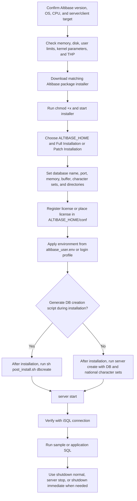
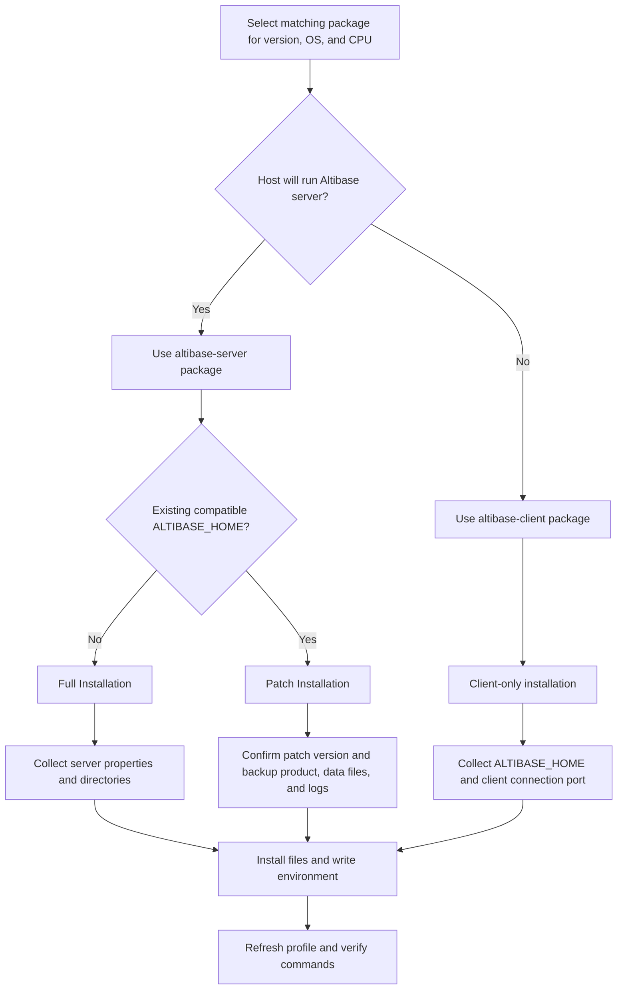

# 01. Getting Started and Installation

## Package Role
- Provides the package installation, first database creation, startup phase, first iSQL validation, shutdown, and patch rollback route.
- Use it for first-time customer setup and for coding agents that must draft guarded installation or startup runbooks.
- Escalate to administration and operations once the task changes from first start into storage, accounts, backup, recovery, or tablespace lifecycle work.

## Applicable Versions And Authority
- 7.1: Based on Altibase 7.1 Getting Started Guide, Installation Guide, release notes, and supported platform guidance.
- 7.3: Based on Altibase 7.3 Getting Started Guide, Installation Guide, release notes, and supported platform guidance.
- 8.1: Based on Altibase 8.1 release notes and Altibase 8.1 verified source Getting Started Guide and Installation Guide.

- Korean authoritative Getting Started, Installation, Administrator, General Reference, and SQL sources control version-sensitive installation and startup claims for 7.1 and 7.3.
- For 8.1 installation and startup material, preserve the Altibase 8.1 verified source wording and confirm exact package/platform support before use.
- AID-derived installation material is not selected as separate upload content in this slice; later integration must preserve source labels and limitations.

## Questions This File Can Answer
- What should be checked before installing Altibase?
- How do I install Altibase Server or Altibase Client from the package installer?
- Which files and environment variables are created during installation?
- How do I create the first database, start the server, connect with iSQL, and shut down safely?
- Which customer inputs are required before giving final platform, package, startup, or shutdown guidance?
- What version-specific installation differences matter for 7.1, 7.3, and 8.1?

## Retrieval Alias Index
Use this compact index before scanning the installation runbooks. It is intentionally redundant with later headings so lexical retrieval can land on the exact first-start, environment, startup, shutdown, or patch block.

- Aliases and customer wording: install Altibase, server package, client package, post-install, first database, create database, startup phases, ordinary users cannot connect, shutdown modes, license file, patch rollback, APatch, full uninstall, PSM catalog loading.
- Exact-token anchors: `$ALTIBASE_HOME`, `$ALTIBASE_HOME/conf/altibase_user.env`, `$ALTIBASE_HOME/conf/license`, `$ALTIBASE_HOME/install/pre_install.sh`, `$ALTIBASE_HOME/install/post_install.sh`, `post_install.sh dbcreate`, `server create`, `server start`, `server stop`, `server downgrade`, `isql`, `catproc.sql`, `ulimit`, `Stack size`, `70KB`, `core file size`, `$ALTIBASE_HOME/APatch`, `$ALTIBASE_HOME/APatch/patchinfo`, `pkg_patch_<version>.txt`, `altibase_base_install.log`, `Backup`, `uninstall-base`, `uninstall-p<patch_version>`, `rollback-p<patch_version>`, `Full Package`, `Patch Package`, `PRE-PROCESS`, `PRE_PROCESS`, `PROCESS`, `CONTROL`, `META`, `SERVICE`.
- Focused routing anchors: post-install environment, license, database creation, `server start`, and `catproc.sql` answers route to `Installation Administration Answer Anchors`; package workflow routes to `Package Installer Procedure`; first database and startup phase answers route to `First Database Creation Runbook` and `Startup and First-Run Verification Runbook`; patch rollback routes to `Patch Installation and Rollback Notes`.
- Answer route: use this file for package and first-run sequencing; use `02_administration_operations.md` when the question moves from first start into backup, recovery, storage, accounts, privileges, or tablespace operation.
- Missing-input trigger: before copy-ready installation or patch commands, ask for exact Altibase version and patch, server or client package target, OS and CPU architecture, `ALTIBASE_HOME`, port, character sets, license state, and whether installer database-creation properties were supplied.

## Source Routes
Use these source-boundary routes for source-backed synthesis. They identify the source ID and source-pack block that must be rechecked before item-level production claims.

- 7.1 installation and getting-started route: `SRC-000060/BLOCK-000529`.
- 7.3 installation and getting-started route: `SRC-000124/BLOCK-000533`.
- 8.1 installation and getting-started route: `SRC-000184/BLOCK-000537`.
- 7.1 startup and administration phase route: `SRC-000049/BLOCK-000002`.
- 7.3 startup and administration phase route: `SRC-000113/BLOCK-000004`.
- 8.1 startup and administration phase route: `SRC-000173/BLOCK-000006`.
- dictionary and validation SQL route: `SRC-000181/BLOCK-000525`.
- Platform, package, startup, patch rollback, and shutdown answers need exact target-version source blocks when copy-ready commands are requested.
- Korean-source-verified, link-validated, English-only, and source-limitation labels must be preserved when later AID material is selected.
- Internal baseline, playbook, guardrail, job, and local-path identifiers stay outside this upload Markdown.

## Task And Playbook Routing
- Installation and startup routing: collect package, platform, license, environment, database-creation, startup, and first-validation inputs before commands.
- Tools routing: use iSQL and package-tool checks only after confirming installed client or server package evidence.
- Protected-operation routing: gate `server downgrade`, patch removal, shutdown abort, and startup recovery with backup and rollback evidence.
- Version and patch routing: verify package name, supported platform, patch level, and release-specific caveats before copy-ready installation commands.
- Dedicated generated-test playbook coverage remains deferred; include validation checks, but do not claim a complete test-generation route from this file alone.

## Answer-Ready Reference
The reference below preserves the validated answer-ready content for this topic. Section headings are nested so the package-level routing sections above remain the top-level retrieval contract.

### Applicable Versions

- 7.1: Based on Altibase 7.1 Getting Started Guide, Installation Guide, release notes, and supported platform guidance.
- 7.3: Based on Altibase 7.3 Getting Started Guide, Installation Guide, release notes, and supported platform guidance.
- 8.1: Based on Altibase 8.1 release notes and Altibase 8.1 verified source Getting Started Guide and Installation Guide.

### Questions This File Can Answer

- What should be checked before installing Altibase?
- How do I install Altibase Server or Altibase Client from the package installer?
- Which files and environment variables are created during installation?
- How do I create the first database, start the server, connect with iSQL, and shut down safely?
- Which customer inputs are required before giving final platform, package, startup, or shutdown guidance?
- What version-specific installation differences matter for 7.1, 7.3, and 8.1?

### Retrieval Alias Index

Use this compact index before scanning the installation runbooks. It is intentionally redundant with later headings so lexical retrieval can land on the exact first-start, environment, startup, shutdown, or patch block.

- Aliases and customer wording: install Altibase, server package, client package, post-install, first database, create database, startup phases, ordinary users cannot connect, shutdown modes, license file, patch rollback, APatch, full uninstall, PSM catalog loading.
- Exact-token anchors: `$ALTIBASE_HOME`, `$ALTIBASE_HOME/conf/altibase_user.env`, `$ALTIBASE_HOME/conf/license`, `$ALTIBASE_HOME/install/pre_install.sh`, `$ALTIBASE_HOME/install/post_install.sh`, `post_install.sh dbcreate`, `server create`, `server start`, `server stop`, `server downgrade`, `isql`, `catproc.sql`, `ulimit`, `Stack size`, `70KB`, `core file size`, `$ALTIBASE_HOME/APatch`, `$ALTIBASE_HOME/APatch/patchinfo`, `pkg_patch_<version>.txt`, `altibase_base_install.log`, `Backup`, `uninstall-base`, `uninstall-p<patch_version>`, `rollback-p<patch_version>`, `Full Package`, `Patch Package`, `PRE-PROCESS`, `PRE_PROCESS`, `PROCESS`, `CONTROL`, `META`, `SERVICE`.
- Focused routing anchors: post-install environment, license, database creation, `server start`, and `catproc.sql` answers route to `Installation Administration Answer Anchors`; package workflow routes to `Package Installer Procedure`; first database and startup phase answers route to `First Database Creation Runbook` and `Startup and First-Run Verification Runbook`; patch rollback routes to `Patch Installation and Rollback Notes`.
- Answer route: use this file for package and first-run sequencing; use `02_administration_operations.md` when the question moves from first start into backup, recovery, storage, accounts, privileges, or tablespace operation.
- Missing-input trigger: before copy-ready installation or patch commands, ask for exact Altibase version and patch, server or client package target, OS and CPU architecture, `ALTIBASE_HOME`, port, character sets, license state, and whether installer database-creation properties were supplied.

### Source Documents

- 7.1: Altibase 7.1 Getting Started Guide; Altibase 7.1 Installation Guide; Altibase 7.1 Release Notes; Supported Platforms.
- 7.3: Altibase 7.3 Getting Started Guide; Altibase 7.3 Installation Guide; Altibase 7.3 Release Notes; Supported Platforms.
- 8.1: Altibase 8.1 Release Notes; Altibase 8.1 verified source Getting Started Guide; Altibase 8.1 verified source Installation Guide.

### Response Rules

- If the customer does not specify a version, answer from the 8.1 baseline and say that 7.1 or 7.3 package names, supported operating systems, and patch prerequisites can differ.
- Keep commands, paths, file names, property names, user names, and error codes literal even when answering in another language.
- Do not invent a package name. Ask for the exact version, operating system, and CPU architecture, or use a placeholder such as `altibase-server-<version>-<OS>-<CPU>-64bit-release.run`.
- Installation answers should follow this order: platform check, OS account and limits, package installer, properties, license, environment, database creation, startup, iSQL verification, shutdown.
- If the customer asks for copy-ready commands, first collect the exact Altibase version and patch, server or client package target, OS and CPU architecture, `ALTIBASE_HOME`, port, character sets, license state, and whether the installer generated database creation properties.
- If a platform, package, startup failure, shutdown safety, patch rollback, or log interpretation depends on the customer's exact environment, ask for that input and give the safest next check instead of guessing.

### Installation Administration Answer Anchors

Use these compact anchors when the customer asks an installation, first-start, or patch-administration question and retrieval returns only a broad runbook. They preserve exact tokens that should appear in the final answer.

Anchor: beginner-to-veteran installation and startup answer route

- Version scope: cross-version for 7.1, 7.3, and Altibase 8.1 verified source where the target-version package and platform are confirmed; use the 7.3 platform anchor below for the exact `GNU glibc 2.12 ~ 2.33` Linux range.
- Use this route when the customer needs a single first-install sequence from prerequisites through first iSQL validation, or when a coding agent must produce a guarded installation runbook.
- Required inputs before final commands: exact version and patch, server or client package, OS and CPU architecture, Linux glibc or vendor support evidence when relevant, installation account, `ALTIBASE_HOME`, license state, `DB_NAME`, service port, database and national character sets, archive-log choice, disk data directory, memory database directory, `LOG_DIR`, three `LOGANCHOR_DIR` paths, `SERVER_MSGLOG_DIR`, and the site-specific `SYS` password policy.
- Beginner-safe prerequisite checks are read-only: collect `uname -a`, `ulimit -a`, package file name, account identity with `id`, `$ALTIBASE_HOME/conf/license`, `$ALTIBASE_HOME/install/pre_install.sh`, `$ALTIBASE_HOME/install/post_install.sh`, and `$ALTIBASE_HOME/APatch/patchinfo` if the product is already installed.
- First database path: use `$ALTIBASE_HOME/install/pre_install.sh` as the kernel-setting reference, source the installation account profile, run `sh post_install.sh dbcreate` only when installer database-creation properties were supplied, otherwise use `server create [DB Character Set] [National Character Set]` after confirming character sets and license state.
- First startup path: run `server start` or connect locally with `isql -u sys -p manager -sysdba` and issue `startup`. Expected state is `SERVICE` with `TRANSITION TO PHASE : PROCESS`, `CONTROL`, `META`, and `SERVICE`, followed by `STARTUP Process SUCCESS`.
- First validation path: connect with `isql -s 127.0.0.1 -u sys -p manager`, query `V$VERSION`, query `V$PROPERTY` for `DB_NAME`, `LOGANCHOR_DIR`, `LOG_DIR`, and `SERVER_MSGLOG_DIR`, then run `catproc.sql` through iSQL if PSM setup was not run during installation.
- Veteran patch route: before `server downgrade`, confirm full product, datafile, logfile, loganchor, and configuration backups; package rollback restores only installer-managed files, uses `uninstall-p<patch_version>`, and stores backup files under `rollback-p<patch_version>`.
- If meta downgrade reaches `DOWNGRADE`, uninstall the patch before starting the patched binary again. If downgrade fails, inspect `$ALTIBASE_HOME/trc/altibase_boot.log` and `$ALTIBASE_HOME/trc/altibase_qp.log`.
- Stop rather than inventing: when platform support, patch level, package identity, license, character set, directory layout, startup output, trace logs, or rollback evidence is missing, ask for that input and provide the safest read-only next check.

Anchor: 7.3 server post-install completion

- Version scope: 7.3 source-backed; 7.1 follows the same post-install decision shape where noted below.
- The installer updates `$ALTIBASE_HOME/conf/altibase.properties`.
- Server installation creates `$ALTIBASE_HOME/conf/altibase_user.env` and adds a command to source it from the installation account profile.
- If the license was not registered in the installer, copy it as `$ALTIBASE_HOME/conf/license` before database creation and startup.
- Use `$ALTIBASE_HOME/install/pre_install.sh` as the kernel-parameter reference if those settings were not completed during installation.
- If database creation properties were entered during installation, run `$ALTIBASE_HOME/install/post_install.sh` or `sh post_install.sh dbcreate`.
- If database creation properties were not entered, run `server create [DB Character Set] [National Character Set]`; the 7.1 example is `server create utf8 utf8`.
- Start with `server start`.
- Load PSM catalog objects by running `catproc.sql` through `isql`, not as an OS shell script:

```bash
isql -s 127.0.0.1 -u SYS -p MANAGER -silent -f $ALTIBASE_HOME/packages/catproc.sql
```

`SYS` and `MANAGER` are manual example credentials. Replace `MANAGER` with the site-specific `SYS` password in real work.

Anchor: client-only installation

- Version scope: 7.3 source-backed; use target-version manuals for exact package names.
- Client installation writes environment variables directly into the login shell profile such as `.profile`; unlike server installation, it does not create `altibase_user.env`.
- To apply client variables, open a new shell, source the profile, or export `ALTIBASE_HOME`, `ALTIBASE_PORT_NO`, `PATH`, `LD_LIBRARY_PATH`, and `CLASSPATH`.
- The documented client example includes `ALTIBASE_PORT_NO=20300` and `CLASSPATH=$ALTIBASE_HOME/lib/Altibase.jar:${CLASSPATH}`.

Anchor: startup phases and ordinary-user connection boundary

- Version scope: cross-version for 7.1, 7.3, and Altibase 8.1 verified source.
- Preserve both spelling forms when useful for retrieval: `PRE-PROCESS` and `PRE_PROCESS`.
- Startup moves forward through `PRE-PROCESS` or `PRE_PROCESS`, `PROCESS`, `CONTROL`, `META`, and `SERVICE`.
- `STARTUP [PROCESS | CONTROL | META | SERVICE]` is the phase command shape.
- `PROCESS`: `CREATE DATABASE`, `DROP DATABASE`, limited performance views, property changes, and transition to `CONTROL`.
- `CONTROL`: media recovery and transition to `META`; if incomplete recovery was performed in `CONTROL`, online logs must be reset when moving to `META`.
- `META`: dictionary or metadata upgrade work and transition to `SERVICE`.
- `SERVICE`: normal service; only after `SERVICE` can ordinary users other than `SYS` connect.
- Do not tell customers that startup phases can move backward without shutdown.

Anchor: shutdown comparison

- Version scope: cross-version for 7.1, 7.3, and Altibase 8.1 verified source.
- `SHUTDOWN NORMAL` and `SHUTDOWN IMMEDIATE` can be performed only when Altibase is in `SERVICE`.
- `SHUTDOWN ABORT` can be performed in any phase, but it is emergency-only.
- `SHUTDOWN NORMAL` waits for every client to disconnect.
- `SHUTDOWN IMMEDIATE` disconnects current sessions, performs transaction `rollback` for executing work, and shuts down; `server stop` uses this immediate-style path in the manual examples.
- `SHUTDOWN ABORT` or `server kill` forcibly terminates the server and can require restart recovery on the next startup.

Anchor: 8.1 database creation file and property defaults

- Version scope: Altibase 8.1 verified source; check 7.1 or 7.3 sources before backporting exact property defaults.
- `CREATE DATABASE` creates checkpoint image files and data files under `$ALTIBASE_HOME/dbs` by default.
- Values omitted from `CREATE DATABASE` are taken from `$ALTIBASE_HOME/conf/altibase.properties`.
- Creation identity and path defaults include `DB_NAME=mydb`, `MEM_DB_DIR=$ALTIBASE_HOME/dbs`, `LOGANCHOR_DIR=$ALTIBASE_HOME/logs`, `LOG_DIR=$ALTIBASE_HOME/logs`, and `SERVER_MSGLOG_DIR=$ALTIBASE_HOME/trc`.
- Creation-time file size properties shown with `100M` defaults include `SYS_DATA_FILE_INIT_SIZE`, `SYS_TEMP_FILE_INIT_SIZE`, `SYS_UNDO_FILE_INIT_SIZE`, `USER_DATA_FILE_INIT_SIZE`, and `USER_TEMP_FILE_INIT_SIZE`.
- Ask for the exact target path, character sets, archive mode, and size policy before suggesting path or size changes because many creation-time choices become operationally expensive to change later.

Anchor: 7.3 platform and pre-install checks

- Version scope: 7.3 Installation Guide. If no exact 7.3 patch is supplied, the guide states the platform table applies to all Altibase 7.3 versions.
- Altibase 7.3 server and client are both `64-bit`.
- `Microsoft Windows` is supported only for the Altibase `client`, not the `server`, in the cited 7.3 platform table.
- For Linux x86-64, the cited 7.3 table lists `Red Hat Enterprise Linux 6` and `Red Hat Enterprise Linux 7` for server and client with `GNU glibc 2.12 ~ 2.33`.
- For RHEL minor versions or non-RHEL Linux, consult the repository supported-platform document instead of assuming every 64-bit Linux distribution is supported.
- Before blaming startup on database files, check `ulimit`, avoid unlimited `core file size`, set `RemoveIPC=no` in `/etc/systemd/logind.conf` where required, and set Transparent Huge Pages to `never`.
- User resource limits to review include `File Size`, `Data segment size`, `Max memory size`, `Open files (descriptor)`, `Stack size`, and `Virtual memory`.
- Unix-like installation guidance recommends setting the Altibase account resource limits to `unlimited` except `core file size`, because an Altibase server crash can dump the memory database into a core file and exhaust disk space.
- Altibase client products require `Stack size` of at least `70KB`.

Anchor: APatch rollback and meta downgrade

- Version scope: 7.3 Installation Guide patch-administration source; exact rollback availability can be platform-specific.
- `$ALTIBASE_HOME/APatch` stores package metadata, patch uninstall executables, and rollback backup directories for installer-managed files.
- `patchinfo` records the installed base release, patch version, operating-system, compiler, and Java build-environment information.
- `pkg_patch_<version>.txt` is generated whenever a product is patched and records the source-code revision numbers used for that patch. Example package tokens include `pkg_patch_0_0_0_0.txt` and `pkg_patch_0_0_0_10.txt`.
- `altibase_base_install.log` records all actions from the most recent base installation.
- The `Backup` directory contains separate backup directories for each patch. These backups are used for patch rollback.
- `uninstall-base` removes the base product; `uninstall-p<patch_version>` removes a patch; `rollback-p<patch_version>` stores backup files for the corresponding patch.
- Only the `latest patch` can be rolled back through this package-uninstaller path.
- Package rollback does not back up post-install data files or log files. Back up product home, data files, log files, log anchors, and configuration before patch work.
- On HP platforms, installer patch automatic backup and rollback are not supported; manually back up data and log files before patching.
- Before `server downgrade`, stop Altibase with `server stop`; if it succeeds, the output transitions through `PROCESS`, `CONTROL`, `META`, and `DOWNGRADE`.
- If meta downgrade fails, investigate `$ALTIBASE_HOME/trc/altibase_boot.log` and `$ALTIBASE_HOME/trc/altibase_qp.log`.
- After successful `server downgrade`, delete the patch before starting the server again; otherwise the patched binary can run meta upgrade again.

Anchor: 7.3 full package versus patch package steps

Use this matrix when a customer asks which installer prompts should appear during a
7.3 server or client full installation versus a patch installation. `O` means the
source matrix includes the step.

Server product:

| Installation step | Full Package | Patch Package |
| --- | --- | --- |
| Checking the Environment Before Installation | O | O |
| Starting the Altibase Package Installer | O | O |
| Checking System Parameters | O |  |
| Entering the Installation Directory | O | O |
| Checking the Patch Version |  | O |
| Setting Altibase Properties | O |  |
| Checking Configured Properties | O |  |
| Installing the Altibase Product | O | O |
| Registering the Altibase License Key | O |  |
| Previewing the Altibase Quick Setup Guide | O |  |
| Finishing Installation | O | O |

Client product:

| Installation step | Full Package | Patch Package |
| --- | --- | --- |
| Checking the Environment Before Installation | O | O |
| Starting the Altibase Package Installer | O | O |
| Entering the Installation Directory | O | O |
| Checking the Patch Version |  | O |
| Setting Altibase Properties | O |  |
| Installing the Altibase Product | O | O |
| Finishing Installation | O | O |

### Installation Flow



### Runbook Input Checklist

Use these inputs before producing a final installation, startup, shutdown, or first-run answer.

Required inputs:

- Altibase version and patch, for example `7.1.0.1.2`, `7.3.0.0.1`, or `8.1.0.0.1`.
- Component target: server package, client package, both, or a tool-only host.
- Operating system family and version, CPU architecture, 64-bit mode, and Linux glibc/libc range when platform support depends on it.
- Installation account, `ALTIBASE_HOME`, shell profile file, and whether commands are run as the Altibase installation account or `root`.
- Package file name or intended placeholder: `altibase-server-<version>-<OS>-<CPU>-64bit-release.run` or `altibase-client-<version>-<OS>-<CPU>-64bit-release.run`.
- Server settings: database name, port, maximum memory database size, disk buffer size, archive log mode, database character set, national character set, disk database directory, memory database directory, archive log directory, transaction log directory, and log anchor directories.
- License state: entered in the installer, copied later as `$ALTIBASE_HOME/conf/license`, missing, or expired.
- Database creation path: installer-generated `$ALTIBASE_HOME/install/post_install.sh` with database creation properties, or manual `server create [DB Character Set] [National Character Set]`.

Stop conditions:

- Stop before installation if the package OS, CPU architecture, 64-bit mode, server/client target, or supported-platform block does not match the host.
- Stop before startup if kernel parameters, `RemoveIPC`, Linux THP, user limits, license, or shell environment are not ready.
- Stop before giving platform support guidance when the exact 7.1 or 7.3 patch level is missing and the target platform has a patch condition.
- Stop before patch rollback or `server downgrade` unless product, data file, log file, configuration, and metadata rollback evidence is available.

### Pre-Installation Checklist

Item: target package
Use the package that matches the requested Altibase version, operating system, and CPU architecture. Altibase Server and Altibase Client are distributed as separate package installers, but the server package includes the client package.

Item: host identity check
Before choosing a package, collect the host OS and CPU identity. The Installation Guide shows `uname -a` as the pre-install OS check on Unix-like systems:

```bash
uname -a
```

If the host identity does not match the package target, the installer can stop during its pre-install environment check.

Item: 64-bit support
Altibase 7.1, 7.3, and 8.1 server and client packages are 64-bit. Windows is client-only for 7.1, 7.3, and 8.1 according to the supported platform and release-note sources.

Item: 8.1 platform baseline
Altibase 8.1.0.0.1 supports Linux x86-64 on Red Hat Enterprise Linux 7, 8, and 9 for server and client, and AIX 7.2 for server and client. Windows 2008 and Windows 10 are client-only. Altibase 8.1 requires JDK 1.8 or higher when Java components are used.

Item: memory and disk
The installation guide baseline is at least 1 GB memory on 64-bit systems, with 2 GB recommended. Reserve disk space for the software, tablespaces, transaction logs, archive logs if used, and operational growth. The guide recommends at least 12 GB free disk for smooth database operation.

Item: operating system account
Install and operate Altibase with the account that owns the Altibase installation. Startup and shutdown commands should be run by that installation account. Kernel parameters require `root`.

Item: user resource limits
Check user limits with `ulimit`. Review `File Size`, `Data segment size`, `Max memory size`, `Open files (descriptor)`, `Stack size`, and `Virtual memory`. For Unix-like systems, the manuals recommend setting the Altibase account resource limits to `unlimited`, except that `core file size` should not be set to `unlimited` because an Altibase server crash can dump the memory database into the core file and exhaust disk. Altibase client products require `Stack size` of at least `70KB`.

Item: kernel parameters
Configure shared memory, semaphore, file-cache, and related OS settings before running Altibase. The installer shows recommended values, and `$ALTIBASE_HOME/install/pre_install.sh` contains the post-installation reference for minimum kernel settings.

Item: Linux `RemoveIPC`
On Red Hat 7.2 or later, check `/etc/systemd/logind.conf` and set `RemoveIPC=no`. The default `yes` can leave Altibase short of semaphores and cause abnormal termination. Restart the OS after changing this setting.

Item: Linux THP
For Linux, set Transparent Huge Pages to `never` for optimized Altibase operation. Verify with `/sys/kernel/mm/transparent_hugepage/enabled` or `/sys/kernel/mm/redhat_transparent_hugepage/enabled`.

Item: disk layout
Place redo logs and data files on separate physical disks when possible. This reduces disk I/O contention.

Item: replication network planning
If replication will be used, plan a dedicated network line where possible. The installation requirements recommend a dedicated line for replication.

Item: license
Have the license ready during installation, or place the license file later as `$ALTIBASE_HOME/conf/license`. If the license is missing or expired, Altibase services will not start.

### Package Installer Procedure

Use this pattern for a server package:

```bash
chmod +x altibase-server-<version>-<OS>-<CPU>-64bit-release.run
./altibase-server-<version>-<OS>-<CPU>-64bit-release.run
```

Use this pattern for a client-only package:

```bash
chmod +x altibase-client-<version>-<OS>-<CPU>-64bit-release.run
./altibase-client-<version>-<OS>-<CPU>-64bit-release.run
```

The package installer runs in interactive command-line mode when `DISPLAY` is not set, and in GUI mode when `DISPLAY` is set. For remote GUI mode, set `DISPLAY` and allow X access from the display host.

Installer mode decision flow:



### Server Installation Runbook

Goal and version scope: install an Altibase server package for 7.1, 7.3, or Altibase 8.1 verified source on a supported Unix-like server platform.

Required inputs: exact Altibase version and patch, package file, OS and CPU architecture, `ALTIBASE_HOME`, `root` access for kernel settings, Altibase installation account, license file or key, database creation values, and shell profile path.

Preconditions:

- Confirm the platform and package with `00_version_release_platform.md`.
- Confirm enough memory, CPU, and disk for software, tablespaces, transaction logs, and archive logs if used.
- Confirm the account that will own and operate Altibase.
- Decide whether this is `Full Installation` or `Patch Installation`.

Steps:

1. Check the host identity:

```bash
uname -a
```

2. Make the package executable and start it:

```bash
chmod +x altibase-server-<version>-<OS>-<CPU>-64bit-release.run
./altibase-server-<version>-<OS>-<CPU>-64bit-release.run
```

3. If the installer reports an OS name, OS version, or 64-bit mode mismatch, stop and select the correct package or platform.
4. Select `ALTIBASE_HOME` and `Full Installation` for a new server install. Use `Patch Installation` only over a compatible installed base.
5. Review the kernel parameter panel. Apply required kernel settings with `root` privilege before startup. If they are deferred until after installation, use `$ALTIBASE_HOME/install/pre_install.sh` as the reference before starting Altibase.
6. Enter basic database operation values: database name, port number, maximum memory database size, disk buffer area size, and whether to create a database creation script.
7. If database creation properties are collected, enter initial database size, archive logging mode, database character set, and national character set.
8. Enter database directories: disk database directory, memory database directory, archive log directory, transaction log directory, and log anchor directories.
9. Confirm the displayed property values before proceeding. These values are written to `$ALTIBASE_HOME/conf/altibase.properties`.
10. Register the license in the installer, select a license file, or postpone license registration and later copy the file as `$ALTIBASE_HOME/conf/license`.
11. Review the quick setup guide. It identifies `$ALTIBASE_HOME/install/pre_install.sh`, `$ALTIBASE_HOME/install/post_install.sh`, `$ALTIBASE_HOME/packages/catproc.sql`, `$ALTIBASE_HOME/APatch/patchinfo`, and the startup and shutdown commands.
12. Refresh the login shell for the Altibase account:

```bash
. ~/.bash_profile
```

or:

```bash
source ~/.bash_profile
```

Validation:

- Confirm `$ALTIBASE_HOME/conf/altibase_user.env` exists for a server installation.
- Confirm the login profile sources `altibase_user.env`.
- Confirm `$ALTIBASE_HOME/conf/license` exists before startup.
- Confirm `$ALTIBASE_HOME/APatch/patchinfo` records the installed package and patch metadata.

Stop and fix:

- If the selected installation directory already contains an Altibase product, choose another directory or uninstall the product in that directory first.
- If the license is postponed, the installer does not ask the database creation question in the next step. Place the license and use the manual database creation path.
- If root-only kernel settings are not applied, do not start Altibase yet.

During server installation, collect these values:

- `ALTIBASE_HOME`: installation directory containing `bin`, `conf`, `lib`, packages, and scripts.
- Installation type: `Full Installation` for a new install, `Patch Installation` for a patch over an existing base installation.
- Database name: maps to `DB_NAME`; it defaults to `mydb`, must match the database name used at creation time, and is read-only after creation.
- Connection port number. The default example in the manuals is `20300`.
- Maximum memory database size.
- Buffer area size for disk database pages.
- Whether to create a database creation script.
- Initial database size.
- Archive logging mode: `archivelog` or `noarchivelog`.
- Database character set.
- National character set.
- Disk database directory: maps to `DEFAULT_DISK_DB_DIR`, whose documented default is `$ALTIBASE_HOME/dbs`; it must be configured even if disk database features are not used.
- Memory database directory: maps to `MEM_DB_DIR`, a read-only multi-value path property. In the documented 7.3 property block it can use one to eight paths, the default count is two, and both defaults are `$ALTIBASE_HOME/dbs`.
- Archive log directory.
- Transaction log directory: maps to `LOG_DIR`, whose documented default is `$ALTIBASE_HOME/logs`.
- Log anchor file directories: maps to `LOGANCHOR_DIR`, a read-only multi-value path property. Exactly three log anchor file paths must be specified, and by default all three use `$ALTIBASE_HOME/logs`.

After creating or starting the database, verify the identity and path properties with
`V$PROPERTY` before relying on installation notes or memory:

```sql
SELECT NAME,
       STOREDCOUNT,
       ATTR,
       MIN,
       MAX,
       VALUE1,
       VALUE2,
       VALUE3,
       VALUE4,
       VALUE5,
       VALUE6,
       VALUE7,
       VALUE8
FROM V$PROPERTY
WHERE NAME IN ('DB_NAME', 'DEFAULT_DISK_DB_DIR', 'MEM_DB_DIR',
               'LOG_DIR', 'LOGANCHOR_DIR', 'SERVER_MSGLOG_DIR')
ORDER BY NAME;
```

### Files Created or Updated by Installation

Item: `$ALTIBASE_HOME/conf/altibase.properties`
The installer writes selected property values here. To change properties after installation, edit this file and apply the operational procedure required for the changed property.

Item: `$ALTIBASE_HOME/conf/altibase_user.env`
For a server installation, the installer creates this environment file and adds a command to source it from the account profile such as `.bashrc`, `.bash_profile`, or `.profile`.

Typical server environment entries:

```bash
ALTIBASE_HOME=/path/to/altibase; export ALTIBASE_HOME
PATH=${ALTIBASE_HOME}/bin:${PATH}; export PATH
LD_LIBRARY_PATH=${ALTIBASE_HOME}/lib:${LD_LIBRARY_PATH}; export LD_LIBRARY_PATH
CLASSPATH=${ALTIBASE_HOME}/lib/Altibase.jar:${CLASSPATH}; export CLASSPATH
```

Item: login shell refresh
After installation, apply the profile change by logging out and logging in again, or by running one of these commands:

```bash
. ~/.bash_profile
source ~/.bash_profile
```

Item: client environment
For a client-only installation, `altibase_user.env` is not created. The installer adds client environment variables directly to the login shell profile. Client profiles commonly include `ALTIBASE_HOME`, `ALTIBASE_PORT_NO`, `PATH`, `LD_LIBRARY_PATH`, and `CLASSPATH`.

Item: `$ALTIBASE_HOME/install/pre_install.sh`
This file describes minimum kernel parameter settings and recommended commands. Run or apply it with the required OS privilege before starting Altibase.

Item: `$ALTIBASE_HOME/install/post_install.sh`
This file performs post-installation configuration and can create the database when database creation properties were selected during installation.

Item: `$ALTIBASE_HOME/packages/catproc.sql`
This script installs scripts required for PSM use when they were not run during installation.

Item: `$ALTIBASE_HOME/APatch`
This directory stores patch metadata, uninstall scripts, and rollback material for patch packages. Use `patchinfo` for installed base and patch metadata, `pkg_patch_<version>.txt` for patch revision information, `altibase_base_install.log` for the most recent base-install action log, `Backup` directories for per-patch rollback backups, `uninstall-base` for base-product removal, `uninstall-p<patch_version>` for patch removal, and `rollback-p<patch_version>` for backed-up patch files. Data files and log files are not backed up by the package rollback mechanism.

### First Database Creation Runbook

If database creation properties were selected during installation, create the database with:

```bash
cd "$ALTIBASE_HOME/install"
sh post_install.sh dbcreate
```

If database creation properties were not selected, create the database with the `server` script:

```bash
server create utf8 utf8
```

The general form is:

```bash
server create [DB Character Set] [National Character Set]
```

Choose the database character set before creating the database. The Getting Started Guide examples use values such as `UTF8`, `KSC5601`, and `UTF16`. The database character set affects client conversion, identifiers, stored SQL text, replication compatibility, and possible data loss from character conversion.

Required inputs: `ALTIBASE_HOME`, database character set, national character set, archive log mode decision, initial database size if using generated properties, and the license file state.

Preconditions:

- Run database creation as the Altibase installation account.
- Source the profile that sets `ALTIBASE_HOME`, `PATH`, library path, and `CLASSPATH`.
- Apply kernel parameters before creating or starting the database.
- Place the license as `$ALTIBASE_HOME/conf/license`; if the license is missing or expired, Altibase services do not start.

Validation:

- If using `post_install.sh`, confirm it came from the same installation and property selection.
- If using `server create`, record the exact database character set and national character set used.
- After creation, use the startup and first connection verification runbooks before opening the instance to applications.

Stop and fix:

- If the required character set is not known, do not create the database yet. Ask for the application language, client character set, national character set requirement, and replication compatibility requirement.
- If a database already exists under the configured directories, do not run another create command until the customer confirms the intended rebuild or migration path.

For multilingual clients, set the client character set with `ALTIBASE_NLS_USE` as needed:

```bash
export ALTIBASE_NLS_USE=UTF8
```

If NCHAR literals must be sent without client-side conversion, set:

```bash
export ALTIBASE_NLS_NCHAR_LITERAL_REPLACE=1
```

### PSM Setup

If the PSM setup was not run during installation, run `catproc.sql` after creating the database and starting the server:

```bash
isql -s 127.0.0.1 -u sys -p manager -silent -f ${ALTIBASE_HOME}/packages/catproc.sql
```

The manuals use `sys` and `manager` in examples. Replace the password with the site-specific `SYS` password if it was changed.

### Startup and First-Run Verification Runbook

Altibase can be started through iSQL in `SYSDBA` mode:

```bash
isql -u sys -p manager -sysdba
```

Then run:

```sql
startup
```

A successful startup reaches `SERVICE` phase and reports `STARTUP Process SUCCESS`.

The simpler operational command is:

```bash
server start
```

During startup, Altibase reads properties, checks system memory, initializes system data, signal handling, database memory space, the query processor, and service threads, then starts listeners such as TCP on the configured port and UNIX domain connection where supported.

Expected startup markers:

- `TRANSITION TO PHASE : PROCESS`
- `TRANSITION TO PHASE : CONTROL`
- `TRANSITION TO PHASE : META`
- `TRANSITION TO PHASE : SERVICE`
- `Listener started : TCP on port <port>`
- `--- STARTUP Process SUCCESS ---`

When using `server start`, the sample output can include `[ERR-910FB : Connected to idle instance]` before the startup transition. Do not treat that line alone as final status; validate the final startup success marker and the iSQL connection test.

Connect locally with iSQL:

```bash
isql -s 127.0.0.1 -u sys -p manager
```

The installation quick guide also shows:

```bash
isql -s localhost -u sys -p manager
```

Run a version smoke test after connecting:

```sql
SELECT product_version,
       meta_version,
       protocol_version,
       repl_protocol_version
FROM V$VERSION;
```

Compare the result with the installed package and target version before treating the instance as ready.

Treat connection success as the minimum first-run verification. For a more complete smoke test, verify these items:

- `server start` completes without license, kernel, memory, or listener errors.
- iSQL connects to the expected host and port.
- The iSQL prompt accepts SQL and `V$VERSION` returns the expected product and protocol versions.
- `$ALTIBASE_HOME/trc` does not show startup failure messages.
- Application users can connect through the required client protocol after network and firewall rules are opened.

To load the sample schema supplied with the server package:

```bash
isql -s localhost -u sys -p manager -f $ALTIBASE_HOME/sample/APRE/schema/schema.sql
```

Runbook validation checklist:

- `server start` or iSQL `startup` reaches `SERVICE`.
- `V$VERSION` returns the expected `product_version`, `meta_version`, `protocol_version`, and `repl_protocol_version`.
- `$ALTIBASE_HOME/APatch/patchinfo` matches the installed package and patch target.
- `$ALTIBASE_HOME/trc` does not contain unresolved startup errors such as license, kernel, memory, recovery, listener, or PSM script failures.
- Client tests use the expected host and port, not an unintended local default.

Stop and fix:

- Stop if `SERVICE` is not reached or `STARTUP Process SUCCESS` is absent.
- Stop if `V$VERSION` does not match the planned major and patch version.
- Ask for the exact startup output and relevant `$ALTIBASE_HOME/trc` log excerpt before diagnosing a startup failure.

### Shutdown Decision Runbook

Use normal shutdown when possible:

```sql
shutdown normal;
```

`shutdown normal` waits until clients disconnect before shutting down.

Use immediate shutdown when connected sessions must be disconnected and current transactions rolled back:

```sql
shutdown immediate
```

The server script equivalent for operational shutdown is:

```bash
server stop
```

Use abort or kill only when required for emergency termination:

```sql
shutdown abort
```

```bash
server kill
```

Abort and kill terminate the server forcibly. The next startup may need database recovery because the database may not have closed cleanly.

Shutdown mode selection:

| Mode | Command | Use when | Expected success marker |
| --- | --- | --- | --- |
| Normal | `shutdown normal;` | Planned stop and clients can disconnect cleanly. | `shutdown normal success.` |
| Immediate | `shutdown immediate` or `server stop` | Planned or operational stop where active sessions must be disconnected and current transactions rolled back. | `shutdown immediate success.` |
| Abort | `shutdown abort` | Emergency termination through iSQL when normal or immediate shutdown is not usable. | No clean close guarantee; next startup may recover. |
| Kill | `server kill` | Emergency termination through the server script. | No clean close guarantee; next startup may recover. |

Required inputs before recommending abort or kill: business impact, active transactions if known, backup/recovery state, startup recovery tolerance, and the reason `shutdown immediate` or `server stop` is not viable.

Stop and fix:

- Do not recommend `shutdown abort` or `server kill` as a routine stop method.
- After abort or kill, do not assume the database closed cleanly. Require startup output and trace logs if recovery or startup fails.

### Client-Only Installation Runbook

Use a client package when the host only needs command-line tools, libraries, JDBC, or application connectivity and will not run an Altibase server.

Client installation collects the target `ALTIBASE_HOME`, installation type, and client connection port. It updates the login shell profile with environment variables such as:

```bash
export ALTIBASE_HOME=/path/to/altibase-client
export ALTIBASE_PORT_NO=20300
export PATH=$ALTIBASE_HOME/bin:$PATH
export LD_LIBRARY_PATH=${ALTIBASE_HOME}/lib:${LD_LIBRARY_PATH}
export CLASSPATH=${ALTIBASE_HOME}/lib/Altibase.jar:${CLASSPATH}
```

After client installation, refresh the login shell and test:

```bash
isql -s <server-host> -u <user> -p <password>
```

Client validation:

- Confirm the package is `altibase-client-<version>-<OS>-<CPU>-64bit-release.run`.
- Confirm the client host platform is listed as client-supported for the target Altibase version and patch.
- Confirm `ALTIBASE_PORT_NO` matches the server port when the client relies on the profile default.
- Confirm `Altibase.jar`, shared libraries, and tool binaries are under the selected `ALTIBASE_HOME`.

Stop and fix:

- Windows is client-only in this attachment's 7.1, 7.3, and 8.1 platform guidance. Do not generate a Windows server installation procedure from these sources.
- If the application uses JDBC, CLI, ODBC, Precompiler, SSL/TLS, or a tool package, cross-check the relevant connector or security attachment before finalizing the client setup.

### Patch Installation and Rollback Notes

Use `Patch Installation` only over a compatible installed base version. The installer stores patch metadata and rollback material under `$ALTIBASE_HOME/APatch`.

Patch rollback covers files installed by the package installer. It does not back up data files or log files. Back up the product home, database data files, log files, and recovery-critical configuration separately before applying or rolling back a patch.

On HP-UX, the package uninstaller can uninstall the full product but does not support patch rollback. Back up the existing product manually before patching.

Before scheduling a patch rollback, compare the current and previous meta versions in `SYSTEM_.SYS_DATABASE_`:

```sql
SELECT META_MAJOR_VER, META_MINOR_VER, META_PATCH_VER,
       PREV_META_MAJOR_VER, PREV_META_MINOR_VER, PREV_META_PATCH_VER
  FROM SYSTEM_.SYS_DATABASE_;
```

Use this execution order when a patch rollback requires meta downgrade:

1. Confirm the product, data, log, and configuration backups are complete.
2. Shut down the server:

```bash
server stop
```

3. If the current meta version must be reverted to the previous meta version, run:

```bash
server downgrade
```

4. Immediately delete or uninstall the patch by running the matching APatch patch uninstaller. Do not start the server between `server downgrade` and this patch delete step; otherwise the patched binary can perform meta upgrade again.

```bash
cd "$ALTIBASE_HOME/APatch"
./uninstall-p<patch_version>
```

Only the most recently installed patch can be rolled back by the package uninstaller method.

5. Verify the restored binary/package version metadata. When the restored binary is started for verification, query the database meta version before returning application traffic:

```bash
cat "$ALTIBASE_HOME/APatch/patchinfo"
```

```sql
SELECT META_MAJOR_VER, META_MINOR_VER, META_PATCH_VER
  FROM SYSTEM_.SYS_DATABASE_;
```

If a meta downgrade is attempted while the server is running, the documented error text is:

```text
you must shutdown first before server downgrade
```

### Full Uninstallation Runbook

Use this only for products installed by the Altibase Package Installer. The uninstaller
can remove the installed product or patch-managed files, but in Unix environments it
does not remove Altibase environment variables from the account profile.

Required inputs:

- Exact Altibase version and patch level.
- Whether the target is a base product full uninstall or a patch rollback.
- `ALTIBASE_HOME`, installation account, and shell profile file such as `.profile`,
  `.bash_profile`, or `.bashrc`.
- Confirmation that product files, data files, log files, log anchors, configuration,
  and any required backup or recovery evidence have been preserved separately.

Base product removal:

```bash
cd "$ALTIBASE_HOME/APatch"
./uninstall-base
```

Patch removal:

```bash
cd "$ALTIBASE_HOME/APatch"
./uninstall-p<patch_version>
```

Cleanup after the uninstaller:

1. Manually delete Altibase-related environment variable lines from the account's
   shell profile because the Unix uninstaller does not remove them. In exact source
   terms, the customer must `manually delete` those Altibase environment variables.
2. Remove or refresh exported values such as `ALTIBASE_HOME`, `ALTIBASE_PORT_NO`,
   `PATH`, `LD_LIBRARY_PATH`, and `CLASSPATH` in active shells before testing another
   installation.
3. Keep database data files and log files separate from the uninstaller decision. The
   package rollback/uninstall path excludes files created after installation, including
   database data files and log files.

Stop conditions:

- Do not run `uninstall-base` when the request is only to remove the latest patch.
- Do not promise data-file or log-file rollback from `$ALTIBASE_HOME/APatch`; package
  rollback covers package-installed files only.
- Do not tell the customer the environment is clean until the account profile has been
  manually checked for Altibase variables.

### Troubleshooting First-Run Failures

Symptom: installer aborts before installation
Check that the package file matches the host operating system, 64-bit mode, and CPU architecture.

Symptom: server does not start after installation
Check that `$ALTIBASE_HOME/conf/license` exists and is valid, kernel parameters are applied, user limits are sufficient, and the Altibase account sourced the environment profile.

Symptom: semaphore shortage or abnormal termination on Red Hat 7.2 or later
Check `/etc/systemd/logind.conf` for `RemoveIPC=no`. If this value was changed from the default, restart the OS before retrying Altibase startup.

Symptom: command not found for `server` or `isql`
Source the profile that sets `ALTIBASE_HOME` and updates `PATH`, or run the command by absolute path under `$ALTIBASE_HOME/bin`.

Symptom: listener or connection failure
Confirm the configured port number, `ALTIBASE_PORT_NO` for client-only profiles, host firewall rules, and whether iSQL is connecting to `127.0.0.1`, `localhost`, or a remote host.

Symptom: Linux performance is poor immediately after startup
Verify THP is disabled and check whether data and redo logs are competing on the same physical disk.

Symptom: PSM objects are missing
Run `${ALTIBASE_HOME}/packages/catproc.sql` with iSQL after the database is created and started.

### Version Differences

7.1:
Use the 7.1 installer and supported platform matrix for OS and package selection. 7.1 supports server and client on supported Unix/Linux platforms, and client-only on supported Windows platforms. Some newer operating systems require minimum 7.1 patch levels.

7.3:
Use the 7.3 installer and supported platform matrix. 7.3 expands supported Linux distributions and architectures compared with older 7.1 baselines. Some operating systems require minimum 7.3 patch levels.

8.1:
Use Altibase 8.1 release notes for supported platform, package, and compatibility guidance, and Altibase 8.1 verified source for installation workflow. Altibase 8.1.0.0.1 supports Linux x86-64 server and client on Red Hat Enterprise Linux 7, 8, and 9, supports AIX 7.2 server and client, supports Windows 2008 and Windows 10 client-only, supports 64-bit packages only, and requires JDK 1.8 or higher for Java components.

Upgrade caution for 8.1:
Altibase 8.1 changes database binary and metadata compatibility. Databases prior to 8.1 are not binary-compatible with 8.1, and migration or metadata rebuild planning is required for upgrades. Do not present an in-place package patch as a complete 7.x to 8.1 upgrade procedure.

### Minimal First-Run Command Sequence

Use this only after OS prerequisites and license handling are complete:

```bash
chmod +x altibase-server-<version>-<OS>-<CPU>-64bit-release.run
./altibase-server-<version>-<OS>-<CPU>-64bit-release.run
. ~/.bash_profile
cd "$ALTIBASE_HOME/install"
sh post_install.sh dbcreate
server start
isql -s 127.0.0.1 -u sys -p manager
server stop
```

### Attachment Cross-References

- `00_version_release_platform.md`: supported platform, release-note, binary version, metadata version, and patch prerequisite decisions before installation or upgrade.
- `02_administration_operations.md`: ongoing startup/shutdown operation, account administration, backup, recovery, tablespace, datafile, and log-anchor work after first start.
- `03_sql_ddl_generation.md`: generated `CREATE DATABASE`, startup-phase SQL, property SQL, and administrative SQL examples when the customer asks for syntax.
- `05_data_types_properties.md`: property defaults and path settings such as `DB_NAME`, `MEM_DB_DIR`, `LOGANCHOR_DIR`, `LOG_DIR`, and `SERVER_MSGLOG_DIR`.
- `07_error_messages_troubleshooting.md`: installer, startup, listener, license, package, and first-run failure evidence handling.
- `13_isql_iloader_basic_tools.md`: iSQL connection, script execution, and output checks after installation.

### Residual Scope

- This attachment covers first installation, first database creation, startup, connection verification, and patch rollback notes. For production sizing, advanced platform hardening, or site-specific automation, use the target-version manuals and environment evidence before generating final commands.

## Required Inputs And Stop Conditions
- Exact Altibase version and patch level, package type, package file name, operating system, CPU architecture, and supported-platform evidence.
- `ALTIBASE_HOME`, installation account, shell profile, license state, port, database and national character sets, database name, archive-log choice, and database/log/loganchor directories.
- Runtime state for existing installations: current `V$VERSION`, startup phase, `patchinfo`, trace excerpts, and whether installer database-creation properties were supplied.
- Backup and rollback evidence before patch installation, patch rollback, `server downgrade`, full uninstall, `shutdown abort`, or `server kill`.
- Backup/archive-log state and destructive-operation safety checks are required before any package, startup, shutdown, or rollback step that can affect recoverability.
- Stop before final platform, package, startup failure, shutdown safety, or patch rollback commands when exact version, patch, platform, runtime state, backup state, or rollback plan is missing.

## Validation And Rollback Checks
- Verify host identity with OS and CPU checks before selecting server or client package commands.
- Validate user limits, kernel parameters, `RemoveIPC`, Transparent Huge Pages, license location, and environment variables before startup.
- After creation/startup, connect with iSQL, query `V$VERSION`, and check key properties such as `DB_NAME`, `LOG_DIR`, `LOGANCHOR_DIR`, and `SERVER_MSGLOG_DIR`.
- For shutdown, prefer documented normal or immediate paths; use abort or kill only as emergency handling with restart-recovery tolerance documented.
- For patch rollback, confirm product, data file, log file, loganchor, and configuration backups before package rollback or `server downgrade`.

## Cross-References
- `00_version_release_platform.md` for supported platform, version, patch, and protocol boundaries.
- `02_administration_operations.md` for accounts, privileges, tablespaces, backup, recovery, and protected operation runbooks.
- `06_data_dictionary_performance_views.md` for validation SQL against version, properties, users, tablespaces, and files.
- `13_isql_iloader_basic_tools.md` for iSQL and iLoader tool use after installation.
- `18_security_ssl_tls.md` for TLS, certificate, access-control, and secure connection follow-up.

## Residual Scope And Limitations
- This file does not invent package names or supported platforms. Use placeholders until exact package, platform, and patch evidence is available.
- It covers first-run and package administration. Ongoing DBA, tablespace, backup, or recovery work belongs in the administration package file.
- AID installation content is not independently selected here; later AID integration must preserve labels and remain inside the same 20-file package limit.
