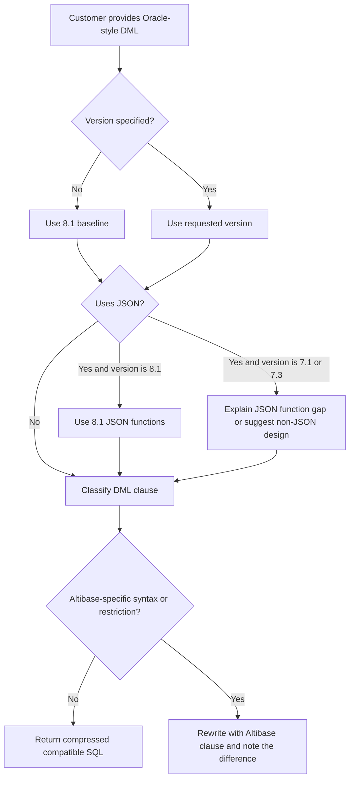

# 04. SQL DML and Oracle Compatibility
## Package Role
- Provides guarded SQL DML, expression, function, JSON, queue, transaction, and Oracle-overlap guidance.
- Use it to rewrite or generate `SELECT`, `INSERT`, `UPDATE`, `DELETE`, `MERGE`, row limiting, joins, functions, regular expressions, and 8.1 JSON SQL without assuming Oracle feature parity.
- Route DDL to `03_sql_ddl_generation.md`, data type and property limits to `05_data_types_properties.md`, and migration-tool strategy to `15_migration_oracle_compatibility.md`.
## Applicable Versions And Authority
- 7.1: Based on Korean authoritative Altibase 7.1 SQL Reference and General Reference property sources.
- 7.3: Based on Korean authoritative Altibase 7.3 SQL Reference and General Reference property sources.
- 8.1: Based on Altibase 8.1 verified source SQL Reference, General Reference, and release-note material for JSON and Temporary LOB boundaries.
- Oracle compatibility claims are Altibase-specific claims and must not be inferred from Oracle behavior alone.
## Questions This File Can Answer
- Can an Oracle-style `SELECT`, `INSERT`, `UPDATE`, `DELETE`, or `MERGE` be used in Altibase, and what should be changed?
- How should row limiting, joins, hierarchical queries, hints, `RETURN`, queues, transactions, functions, and predicates be generated?
- Which 8.1 JSON functions and `IS JSON` checks are available, and what should 7.1 or 7.3 answers do?
- When should an answer ask for object definitions, sample SQL, target version, runtime output, or exact function support instead of inventing compatibility?
## Retrieval Alias Index
- Aliases and customer wording: Oracle SQL compatibility, SQL rewrite, DML generation, function compatibility, regex, JSON SQL, queue DML, row limiting, full outer join, anti join, semi join.
- Exact-token anchors: `SELECT`, `INSERT`, `UPDATE`, `DELETE`, `MERGE`, `RETURNING`, `RETURN`, `TOP`, `LIMIT`, `NON-AUTOCOMMIT`, `multiple_update`, `multiple_delete`, `FIFO`, `LIFO`, `WAIT`, `NOWAIT`, `JSON_VALUE`, `JSON_QUERY`, `JSON_EXISTS`, `JSON_VALID`, `IS JSON`, `POSIX Basic Regular Expression`, `occurrence`, `replace_string`, `arg1`, `expr1`, `A-Z`, `a-z`, `0-9`, `D$`, `X$`.
- Route runnable DML and Oracle-difference rewrites here; route data type, JSON storage, and Temporary LOB sizing to `05_data_types_properties.md`.
## Source Routes
Use these source-boundary routes for source-backed synthesis. They identify the source ID and source-pack block that must be rechecked before item-level production claims.

- 7.1 SQL DML and function route: `SRC-000072/BLOCK-000884`.
- 7.3 SQL DML and function route: `SRC-000134/BLOCK-000886`.
- 8.1 SQL DML, function, and JSON route: `SRC-000194/BLOCK-000888`.
- 7.1 property route for regular expression and session behavior checks: `SRC-000056/BLOCK-000515`.
- 7.3 property route for regular expression and session behavior checks: `SRC-000120/BLOCK-000517`.
- 8.1 data type, property, JSON, and Temporary LOB route: `SRC-000180/BLOCK-000519`.
- Oracle adapter and migration-overlap route: `SRC-000172/BLOCK-000574`.
- 8.1 release-note route for JSON and Temporary LOB version boundaries: `SRC-000452/BLOCK-000826`.
- Exact function support, grammar, JSON behavior, and Oracle-overlap claims must be rechecked against the target-version route before final SQL is generated.
- AID-derived support is not a separate upload file; preserve Korean-source-verified, link-validated, English-only, and source-limitation labels whenever exact AID evidence is used.
- Internal baseline, playbook, guardrail, job, and local-path identifiers stay outside this upload Markdown.
## Task And Playbook Routing
- DML generation routing: require target version, SQL text, object definitions, table/view/queue/partition type, data types, privileges, sample values, transaction expectations, and expected result.
- Oracle-overlap routing: classify the request as usually compatible, Altibase-specific syntax, semantic difference, or unsupported parity before rewriting.
- JSON routing: use native `JSON`, `JSON_VALUE`, `JSON_QUERY`, `JSON_EXISTS`, `JSON_VALID`, and `IS JSON` only for Altibase 8.1 verified source unless the customer supplies support evidence.
- Generated-test playbook coverage remains deferred; include validation queries and cleanup prompts but do not claim a complete test-generation route.
## Answer-Ready Reference
The reference below preserves the validated answer-ready content for this topic. Section headings are nested so the package-level routing sections above remain the top-level retrieval contract.
### Applicable Versions

- 7.1: Based on Altibase 7.1 SQL Reference.
- 7.3: Based on Altibase 7.3 SQL Reference.
- 8.1: Based on Altibase 8.1 verified source SQL Reference, including verified 8.1 JSON function and `IS JSON` coverage.

### Questions This File Can Answer

- Can ordinary Oracle `SELECT`, `INSERT`, `UPDATE`, `DELETE`, or `MERGE` SQL run in Altibase?
- Which DML clauses need Altibase syntax instead of Oracle syntax?
- How should row limiting, joins, hierarchical queries, hints, DML `RETURN`, and transaction clauses be generated?
- Which Oracle-style functions, expressions, operators, and predicates are available, and which Altibase differences should be checked?
- How should 8.1 JSON functions such as `JSON_VALUE` and `JSON_QUERY` be used?

### Retrieval Alias Index

Use this compact index before scanning DML and function families. It is intentionally redundant with later headings so lexical retrieval can land on the exact DML, expression, queue, JSON, or Oracle-difference block.

- Aliases and customer wording: Oracle SQL compatibility, SELECT rewrite, INSERT SELECT, multiple delete, multiple update, MERGE, row limiting, queue ENQUEUE, queue DEQUEUE, regex function, JSON function, JSON path, outer join, full outer join, semi join, anti join, identifier case, quoted name.
- Exact-token anchors: `SELECT`, `INSERT`, `UPDATE`, `DELETE`, `MERGE`, `RETURNING`, `RETURN`, `TOP`, `LIMIT`, `NON-AUTOCOMMIT`, `multiple_update`, `multiple_delete`, `FIFO`, `LIFO`, `WAIT`, `NOWAIT`, `JSON_VALUE`, `JSON_QUERY`, `JSON_EXISTS`, `JSON_VALID`, `IS JSON`, `POSIX Basic Regular Expression`, `occurrence`, `replace_string`, `arg1`, `expr1`, `A-Z`, `a-z`, `0-9`, `D$`, `X$`.
- Focused routing anchors: `SELECT`, `INSERT`, `UPDATE`, `DELETE`, `MERGE`, transaction, row-limit, and DML privilege answers route to `Compact DML Syntax Patterns` and `DML Privilege Blocks`; regex, predicates, expressions, and built-in functions route to `Expression and Operator Generation`, `SQL Conditions`, and `SQL Function Compatibility`; `JSON_VALUE`, `JSON_QUERY`, `JSON_EXISTS`, `JSON_VALID`, and `IS JSON` route to `8.1 JSON Functions`; queue DML routes to `Queue DML`.
- Answer route: use this file for executable DML and Oracle-difference answers; use `03_sql_ddl_generation.md` for object creation and storage clauses; use `05_data_types_properties.md` for data type limits and JSON/Temporary LOB prerequisites; use `15_migration_oracle_compatibility.md` for tool-assisted migration.
- Version route: answer JSON SQL from the Altibase 8.1 verified source baseline, and do not generate JSON functions for 7.1 or 7.3 unless the customer provides a supported compatibility layer.

### Source Documents

- 7.1: Altibase 7.1 SQL Reference; General Reference 1 for `REGEXP_MODE`.
- 7.3: Altibase 7.3 SQL Reference; General Reference 1 for `REGEXP_MODE`.
- 8.1: Altibase 8.1 verified source SQL Reference; General Reference 1 for `REGEXP_MODE`, native `JSON`, JSON path, and Temporary LOB prerequisites.

### Response Rules

- Answer in the user's language, but keep SQL object names, function names, error codes, property names, commands, and file paths literal.
- Do not answer "Oracle SQL is fully compatible." Say that common DML is intentionally similar, then check Altibase-specific syntax, data types, functions, limits, and object privileges.
- Compress generic Oracle SQL into short guidance. Expand only clauses where Altibase behavior differs or where the SQL Reference lists restrictions.
- If no version is specified, use the 8.1 baseline and mention that JSON functions and `IS JSON` require 8.1.
- For DML on customer tables, confirm whether the target is a table, view, partition, queue table, memory table, disk table, LOB column, or JSON column when that affects syntax or restrictions.
- For function questions, distinguish a source-listed Altibase function from an Oracle-only function name. If the requested function is not listed for the customer's target version, ask for the exact Altibase version and provide the closest source-backed rewrite pattern instead of inventing parity.
- For DDL, data type definitions, properties, and migration tooling, use the companion attachments rather than repeating them here.

### Oracle Compatibility Classifier

Use this classifier before rewriting an Oracle query.

| Category | Guidance |
| --- | --- |
| Usually usable with small or no changes | Basic `SELECT`, `INSERT`, `UPDATE`, `DELETE`, ANSI joins, Oracle-style outer join `(+)`, subqueries, `GROUP BY`, `HAVING`, `ORDER BY`, `UNION`, `UNION ALL`, `INTERSECT`, `MINUS`, `DECODE`, `NVL`, `NVL2`, `COALESCE`, `NULLIF`, `CASE`, `TO_CHAR`, `TO_DATE`, `TO_NUMBER`, `SYSDATE`, sequence `NEXTVAL` and `CURRVAL`. |
| Check Altibase syntax | Row limiting (`TOP (n)` or `LIMIT`), DML `RETURN`, multi-table `DELETE`, `MERGE WHEN NO ROWS`, direct-path `INSERT /*+ APPEND */`, `LOCK TABLE`, `FOR UPDATE WAIT/NOWAIT`, `LATERAL`, `APPLY`, `PIVOT`, `UNPIVOT`, queue `ENQUEUE` and `DEQUEUE`. |
| Check semantic differences | `NVL` type compatibility, implicit type conversion, date format masks, regular expression support, LOB restrictions, partition row movement, recursive `WITH`, hierarchical query restrictions, ORDER BY placement, set operator ordering, hints, and NULL sort order. |
| Do not assume Oracle feature parity | Oracle-specific packages, unsupported Oracle hints, Oracle `ROWID` assumptions, PL/SQL-only constructs in plain SQL, and Oracle JSON syntax on 7.1 or 7.3. |

### DML Decision Flow



### Compact DML Syntax Patterns

These patterns are generation guides, not full grammar.

Syntax notation used in this attachment:

- `[ ... ]` means optional syntax.
- `{ A | B }` means choose exactly one alternative.
- `item [, item ...]` means one or more comma-separated items.
- `...` after a clause means the clause may repeat.
- Lowercase names such as `table_name`, `expr`, and `subquery` are placeholders to replace with customer objects or expressions.

#### SELECT Pattern

```text
select ::=
  [WITH query_name [(column_alias, ...)] AS (subquery) [, ...]]
  SELECT [hint] [ALL | DISTINCT] [TOP (integer_expr)] select_list
  [FROM table_reference [, table_reference ...]]
  [WHERE condition]
  [START WITH condition CONNECT BY [NOCYCLE] condition [IGNORE LOOP]]
  [GROUP BY grouping_expr [, ...] [ROLLUP | CUBE | GROUPING SETS]]
  [HAVING condition]
  [{UNION | UNION ALL | INTERSECT | MINUS} subquery ...]
  [{ORDER BY | ORDER SIBLINGS BY} expr_or_position [ASC | DESC] [NULLS FIRST | NULLS LAST] [, ...]]
  [LIMIT [row_offset,] row_count]
  [FOR UPDATE [{WAIT integer [SEC | MSEC | USEC] | NOWAIT}]]
```

Generation notes:

- `FROM` can be omitted when the select list contains only constants or expressions.
- `DUAL` is available and is used in examples for sequence and scalar-expression queries.
- A `FROM` clause can reference at most 32 tables or views. Aliases in the same `FROM` clause must be unique.
- `ORDER BY` cannot be used in a subquery. With set operators, `ORDER BY` can use only output positions or aliases.
- `LIMIT` can be used in top-level queries and subqueries. Use `TOP (n)` only when a leading row-count expression fits the request.
- `FOR UPDATE` locks selected rows so other users cannot lock or modify them until the current transaction ends.
- `FOR UPDATE` is only for the top-level `SELECT`, not subqueries. It cannot be combined with `DISTINCT`, `GROUP BY`, aggregate functions, or set operators such as `UNION`, `INTERSECT`, or `MINUS`.
- `WAIT integer [SEC | MSEC | USEC]` sets the lock wait duration; if the unit is omitted, seconds are used. `NOWAIT` returns immediately when the target row or table is already locked.

#### SELECT Subclause Syntax

##### Table Reference and Join Syntax

```text
table_reference ::=
  single_table
| joined_table
| TABLE (function_name([expr [, expr ...]]))

single_table ::=
  LATERAL (subquery)
| [owner.]table_name [PARTITION (partition_name)] [pivot_clause | unpivot_clause] [[AS] alias_name]

joined_table ::=
  table_reference [join_type] JOIN table_reference ON condition
| table_reference [apply_type] APPLY single_table

join_type ::=
  INNER | LEFT [OUTER] | RIGHT [OUTER] | FULL [OUTER]

apply_type ::=
  CROSS | OUTER
```

##### Pivot and Unpivot Syntax

```text
pivot_clause ::=
  PIVOT (aggregate_function(expr) [[AS] alias] [, aggregate_function(expr) [[AS] alias] ...]
         pivot_for_clause pivot_in_clause)

pivot_for_clause ::=
  FOR {column_name | (column_name [, column_name ...])}

pivot_in_clause ::=
  IN ({expr | (expr [, expr ...])} [[AS] alias] [, {expr | (expr [, expr ...])} [[AS] alias] ...])

unpivot_clause ::=
  UNPIVOT [{INCLUDE | EXCLUDE} NULLS]
  ({column_name | (column_name [, column_name ...])}
   pivot_for_clause unpivot_in_clause)

unpivot_in_clause ::=
  IN ({column_name | (column_name [, column_name ...])}
      [[AS] {alias_name | (alias_name [, alias_name ...])}]
      [, {column_name | (column_name [, column_name ...])}
         [[AS] {alias_name | (alias_name [, alias_name ...])}] ...])
```

##### Hierarchical and Grouping Syntax

```text
hierarchical_query_clause ::=
  CONNECT BY [NOCYCLE] condition [IGNORE LOOP] [START WITH condition]
| START WITH condition CONNECT BY [NOCYCLE] condition [IGNORE LOOP]

group_by_clause ::=
  GROUP BY {expr | ROLLUP grouping_expression_list | CUBE grouping_expression_list | grouping_sets_clause}
           [, {expr | ROLLUP grouping_expression_list | CUBE grouping_expression_list | grouping_sets_clause} ...]
  [HAVING condition]

grouping_sets_clause ::=
  GROUPING SETS ({grouping_expression_list | ROLLUP grouping_expression_list | CUBE grouping_expression_list}
                 [, {grouping_expression_list | ROLLUP grouping_expression_list | CUBE grouping_expression_list} ...])
```

Generation notes:

- `LATERAL (subquery)` lets the subquery reference preceding `FROM` items.
- `APPLY` joins a table reference to a single-table expression. Use `CROSS APPLY` for inner-apply behavior and `OUTER APPLY` when unmatched left rows must be retained.
- `APPLY` joins do not use an `ON` clause. If the rewrite needs an `ON` join condition, generate ordinary `JOIN ... ON ...` instead.
- `PIVOT` and `UNPIVOT` are not generic Oracle pass-through clauses. Preserve their Altibase syntax and test aliases, null handling, and expression lists.
- `ORDER SIBLINGS BY` is for hierarchical queries; do not use it as a replacement for top-level `ORDER BY`.

#### INSERT Pattern

```text
insert ::=
  INSERT [hint] {single_table_insert | multi_table_insert} [wait_clause]

single_table_insert ::=
  INTO [owner.]table_or_view_name [PARTITION (partition_name)]
  [(column_name [, ...])]
  {VALUES (expr [, ...]) [, (expr [, ...]) ...]
   | DEFAULT VALUES
   | subquery}
  [{RETURN | RETURNING} expr [, ...] INTO variable [, ...]]

multi_table_insert ::=
  ALL
    INTO table_name [(column_name, ...)] VALUES (expr, ...)
    [INTO table_name [(column_name, ...)] VALUES (expr, ...)] ...
  subquery

wait_clause ::=
  {WAIT integer [SEC | MSEC | USEC] | NOWAIT}
```

Generation notes:

- Column count and value count must match, and corresponding data types must be compatible.
- If omitted columns have no default, Altibase inserts `NULL`; for a `TIMESTAMP` column, the default system time is inserted.
- `DEFAULT` inserts the column default. `DEFAULT VALUES` inserts defaults for all columns.
- `INSERT SELECT` / `INSERT ... SELECT` requires the inserted column count to match the selected column count.
- `INSERT /*+ APPEND */ INTO target SELECT ...` requests direct-path insert. The target must be a disk table and cannot have LOB columns, indexes, triggers, referential constraints, replication target status, or `CHECK` constraints.
- If an expression in a multi-table insert source query must be referenced in a `VALUES` clause, give it an alias in the source `SELECT`.

#### UPDATE Pattern

```text
update ::=
  UPDATE [hint] {[owner.]table_or_view_name | view_name | (subquery)}
         [PARTITION (partition_name)] [[AS] table_alias]
  SET column_name = {expr | DEFAULT | subquery}
      [, (column_name [, ...]) = (subquery)] ...
  [WHERE condition]
  [LIMIT [row_offset,] row_count]
  [{RETURN | RETURNING} expr [, ...] INTO variable [, ...]]

multiple_update ::=
  UPDATE table_reference [, table_reference ...]
  SET column_name = expr [, column_name = expr ...]
  WHERE join_condition [AND condition ...]
```

Generation notes:

- A column cannot appear more than once in the same `SET` clause.
- A subquery in `SET` must return one row for each updated row. If it returns no row, Altibase updates the target column to `NULL`.
- Updating a partition key so the row moves to another partition requires `ENABLE ROW MOVEMENT`.
- Updating a `TIMESTAMP` column with no explicit value, or with `DEFAULT`, stores the system time.
- `multiple_update` updates rows that satisfy a join condition. It cannot use `LIMIT`, `RETURNING`, dictionary tables, or `full outer join`.
- `UPDATE` can fail on `NOT NULL` or `CHECK` constraints.

#### DELETE Pattern

```text
delete ::=
  DELETE [hint] FROM [owner.]table_or_view_name [PARTITION (partition_name)]
  [WHERE condition]
  [LIMIT [row_offset,] row_count]
  [{RETURN | RETURNING} expr [, ...] INTO variable [, ...]]

multiple_delete ::=
  DELETE table_alias [, table_alias ...]
  FROM table_reference [, table_reference ...]
  WHERE join_condition [AND condition ...]
```

Generation notes:

- Omitting `WHERE` deletes all rows from the target. Use `TRUNCATE TABLE` only when DDL semantics and non-rollback behavior are acceptable.
- `multiple_delete` / multiple-table `DELETE` can delete rows from aliases listed after `DELETE`. It cannot use `LIMIT`, cannot use `RETURN` or `RETURNING`, cannot use dictionary tables, and cannot use `full outer join`.
- `DELETE FROM table PARTITION (partition_name)` deletes only rows in the named partition.

#### MOVE Pattern

```text
move ::=
  MOVE [hint] INTO [owner.]target_table [PARTITION (partition_name)]
       [(column_name [, column_name ...])]
  FROM [owner.]source_table [(expr [, expr ...])]
  [WHERE condition]
  [LIMIT [row_offset,] row_count]
```

Generation notes:

- `MOVE` inserts selected source rows into the target table and deletes the moved rows from the source table as one statement.
- Required privileges are `INSERT` on the target table and `DELETE` on the source table.
- Column and expression counts must match. Use explicit target columns when source and target definitions differ.
- Use `WHERE` and `LIMIT` to bound the move. Omit them only when moving all rows is intentional.

#### MERGE Pattern

```text
merge ::=
  MERGE [hint] INTO [owner.]target_table [target_alias]
  USING {[owner.]source_table | [owner.]source_view | subquery} [source_alias]
  ON (match_condition)
  [WHEN MATCHED THEN UPDATE SET column = expr [, ...] [LIMIT [row_offset,] row_count]]
  [WHEN NOT MATCHED THEN INSERT [(column [, ...])] VALUES (expr [, ...]) [WHERE condition]]
  [WHEN NO ROWS THEN INSERT [(column [, ...])] VALUES (expr [, ...])]
```

Generation notes:

- `INTO` must name a table, not a view.
- The user needs `INSERT` and `UPDATE` on the target table and `SELECT` on the source.
- A column referenced in the `ON` condition cannot be updated by the `WHEN MATCHED` update clause.
- Each of `WHEN MATCHED`, `WHEN NOT MATCHED`, and `WHEN NO ROWS` can appear once and can be ordered flexibly.
- `WHEN NO ROWS` is an Altibase extension for inserting when the source has no row.
- Literal grammar names to preserve in reference answers: `matched_update_clause`, `not_matched_insert_clause`, and `no_rows_insert_clause`.
- In `matched_update_clause`, `UPDATE` is required when the clause is used. `DELETE` is optional, but if present it must follow `UPDATE`.

#### LOCK and Transaction Pattern

```text
lock_table ::=
  LOCK TABLE [owner.]table_name [PARTITION (partition_name)]
  IN {ROW SHARE | SHARE UPDATE | ROW EXCLUSIVE | SHARE ROW EXCLUSIVE | SHARE | EXCLUSIVE} MODE
  [{WAIT integer | NOWAIT}]

transaction_control ::=
  COMMIT [WORK] [FORCE global_tx_id]
  ROLLBACK [WORK] [TO SAVEPOINT savepoint_name] [FORCE global_tx_id]
  SAVEPOINT savepoint_name
  SET TRANSACTION {READ ONLY | READ WRITE | ISOLATION LEVEL {READ COMMITTED | REPEATABLE READ | SERIALIZABLE}}
```

Generation notes:

- `COMMIT`, `ROLLBACK`, `SAVEPOINT`, and `SET TRANSACTION` are for non-autocommit work. `COMMIT` and `ROLLBACK` cannot be executed in `AUTOCOMMIT` mode.
- `READ COMMITTED` is the default Altibase transaction isolation level.
- `SET TRANSACTION` cannot be used in `AUTOCOMMIT` mode and cannot be used after a transaction is already active.

### Replication DDL Literal Anchor

Use this compact anchor only when a SQL-generation question asks for
`CREATE REPLICATION` endpoint syntax or transport values. Use the replication
attachment for topology, state changes, gap handling, rebuild, CDC, TLS setup, or
operational runbooks.

```text
create_replication_endpoint ::=
  CREATE REPLICATION replication_name
  [AS {MASTER | SLAVE}]
  WITH 'replication_host_ip', replication_host_port_no
  [USING {TCP | SSL | IB} [ib_latency]]
  FROM local_user.local_table TO remote_user.remote_table
```

Reference facts:

- Only `SYS` can create a replication object with `CREATE REPLICATION`.
- `CREATE REPLICATION` creates a local-to-remote replication connection. Replication is 1:1 between tables: one local table matches only one table on the other side.
- The local and remote `replication_name` must be the same and must follow Altibase object-name rules.
- `AS MASTER` or `AS SLAVE` can be specified for the Master-Slave conflict-resolution scheme. Conflict details belong to the `Replication Manual`.
- `replication_host_ip` is the remote server IP address.
- `replication_host_port_no` is the remote receiver thread port for the selected transport.
- For `TCP`, use the remote server's `REPLICATION_PORT_NO`.
- For `SSL`, use the remote server's `REPLICATION_SSL_PORT_NO` and confirm replication SSL setup on each replication target server.
- For `IB`, use the remote server's `REPLICATION_IB_PORT_NO` and confirm InfiniBand support.
- If `using_conntype_clause` is omitted, Altibase uses `TCP`.
- `FOR ANALYSIS` and `FOR ANALYSIS PROPAGATION` for Log Analyzer do not support `IB` or `SSL` communication methods.

### DML Privilege Blocks

#### SELECT Privilege

- Required for table reads.
- Allowed for `SYS`, the table owner, users with `SELECT ANY TABLE`, and users with `SELECT` object privilege.
- Updatable view or join-view access also depends on base-table privileges.

#### INSERT Privilege

- Required for inserting into a table or updatable view.
- Allowed for `SYS`, the table owner, users with `INSERT ANY TABLE`, and users with `INSERT` object privilege.
- Multi-table `INSERT` still requires privilege on every target table.

#### UPDATE Privilege

- Required for updating a table or updatable view.
- Allowed for `SYS`, the table owner, users with `UPDATE ANY TABLE`, and users with `UPDATE` object privilege.
- `MERGE` update branches require `UPDATE` on the target table.

#### DELETE Privilege

- Required for deleting from a table or updatable view.
- Allowed for `SYS`, the table owner, users with `DELETE ANY TABLE`, and users with `DELETE` object privilege.
- `MOVE` requires `DELETE` privilege on the source table and `INSERT` privilege on the target table.

### High-Signal DML, Function, And Oracle-Difference Anchors

Use these compact blocks when an answer needs exact syntax before a runnable DML
or function first draft.

Function and expression anchors:

- `DECODE` syntax is `DECODE (expr, comparison_expr1, ret_expr1[, comparison_expr2, ret_expr2,..][, default])`. It compares `expr` with each `comparison_expr` in order, returns the matching `ret_expr`, and returns `default` or `NULL` when no comparison matches.
- `GROUP_CONCAT` syntax is `GROUP_CONCAT (expr1 [, arg1])`; `arg1` is the delimiter character. Do not mechanically rewrite it to Oracle `LISTAGG`.
- `REGEXP_REPLACE` syntax is `REGEXP_REPLACE (expr, pattern_expr [, replace_string [, start [, occurrence]]])`. If `replace_string` is omitted or `NULL`, matching text is removed.
- `REGEXP_SUBSTR` syntax is `REGEXP_SUBSTR (expr, pattern_expr [, start [, occurrence]])`.
- `REGEXP_LIKE` syntax is `[NOT] REGEXP_LIKE(source_expr, pattern_expr)`. The selected Altibase SQL Reference coverage documents `POSIX Basic Regular Expression`; also check `REGEXP_MODE` before accepting Oracle regular-expression syntax.

Runnable examples:

```sql
SELECT DECODE('O', 'O', 'OPEN', 'C', 'CLOSED', 'UNKNOWN') AS status_label
FROM dual;

SELECT GROUP_CONCAT(ename, ',') AS employee_names
FROM employees;

SELECT REGEXP_REPLACE(
         'Daerungpost-Tower II Guro-3 Dong, Guro-gu Seoul',
         'Guro',
         'Mapo',
         1,
         2
       ) AS replaced_text
FROM dual;
```

DML and Oracle-difference anchors:

- `INSERT SELECT` / `INSERT ... SELECT` requires the target column count to match the source query column count.
- `MERGE` can use `matched_update_clause`, `not_matched_insert_clause`, and `no_rows_insert_clause`; each appears at most once, and `no_rows_insert_clause` is Altibase-target syntax, not generic Oracle syntax.
- The DML `RETURN` / `RETURNING` clause is for `INSERT`, `UPDATE`, and `DELETE` on tables. Do not return aggregate expressions, LOB values, aliases, subqueries, or `sequence` expressions.
- For join rewrites, preserve `Semi Join` and `Anti Join` semantics and avoid `NOT IN` when the right side can contain `NULL`; use a null-safe `NOT EXISTS` rewrite when needed.
- For object names, unquoted names can contain `A-Z`, `a-z`, `0-9`, `_`, `$`, and `#`, the first character must be a letter or `_`, and unquoted names cannot begin with `V$`, `X$`, or `D$`.

### Expression and Operator Generation

#### Expression Item: Placement

Altibase SQL expressions can appear in `SELECT` lists, `WHERE`, `START WITH`, `CONNECT BY`, `GROUP BY`, `HAVING`, `ORDER BY`, DML value lists, `UPDATE SET`, function arguments, and supported DDL clauses. When rewriting Oracle SQL, preserve the expression only after checking data type compatibility, LOB or JSON restrictions, and whether the expression contains an Oracle-only function.

#### Expression Item: Arithmetic Operators

```text
+ number
- number
number1 + number2
number1 - number2
number1 * number2
number1 / number2
```

Generation notes:

- Arithmetic operators work on numeric values and values that can be converted to numeric values.
- `DATE + n` and `DATE - n` interpret `n` as days.
- To add hours, minutes, or seconds to a `DATE`, convert the unit to days: `hours / 24`, `minutes / (24*60)`, or `seconds / (24*60*60)`.
- `DATE - DATE` returns the interval in day units.
- Do not generate multiplication or division directly on `DATE` values.

Example:

```sql
SELECT SYSDATE + (10 / (24 * 60)) AS ten_minutes_later
FROM dual;
```

#### Expression Item: Concatenation

```text
char1 || char2
```

Use `||` or `CONCAT(expr1, expr2)` for string concatenation. Check `NULL` and empty-string behavior before assuming Oracle application output is identical; Altibase treats an empty string as `NULL`.

Example:

```sql
SELECT RTRIM(e_firstname) || ' ' || RTRIM(e_lastname) AS full_name
FROM employees;
```

#### Expression Item: CAST

```text
CAST(expr AS data_type)
```

Use `CAST` for explicit conversion. The SQL Reference supports conversion to all data types except `BLOB` and `CLOB` through this operator. For LOB conversion use source-listed conversion functions such as `TO_CLOB` or `TO_BLOB` only where the target version supports them.

Example:

```sql
SELECT CAST('3.14159265359' AS DOUBLE) AS pi
FROM dual;
```

#### Source Detail: NULL, Conversion, Literals, and Format Masks

Use this block for Oracle-overlap answers where generic Oracle conversion rules would
be unsafe.

`NULL` rules:

- `NULL` means no value exists; it is not the same as `0` or a blank string.
- Except for `NVL()` and `IS NULL` or `IS NOT NULL`, operations involving `NULL`
  produce `NULL`.
- `NULL` can appear in any data type unless the column is constrained by `NOT NULL`
  or `PRIMARY KEY`.
- For anti-joins, avoid `NOT IN` when the right side may contain `NULL`; prefer a
  null-safe `NOT EXISTS` rewrite.

`implicit data type conversion` rules:

| Case | Source-backed behavior |
| --- | --- |
| Same data type comparison | Values are compared directly. |
| Different data type comparison | One operand is converted so comparison can proceed; character data types are converted to the other operand's type, not the reverse. |
| Numeric and character comparison or arithmetic | Character data is converted to numeric data when possible. |
| Date and character comparison | Character data is converted to `DATE`; the data must match the active date format. |
| Function arguments | Arguments are converted to the data type defined for the function argument. |
| `INSERT` and `UPDATE` | Input data is converted to the target column data type. |
| Decimal-precision character or numeric to binary floating point | Value loss can occur; test significant digits instead of assuming Oracle output is identical. |
| Invalid conversion | The operation is invalidated and can raise conversion errors. |

Implicit conversion matrix coverage:

- Character family `char`, `varchar`, `nchar`, and `nvarchar` converts among the
  character family and to numeric and `date` targets where the source data satisfies
  the conversion conditions.
- `clob` is not a general implicit bridge to ordinary scalar types; do not infer
  Oracle CLOB conversion behavior without an Altibase function or exact target source.
- Numeric family `bigint`, `decimal`, `double`, `float`, `integer`, `number`,
  `numeric`, `real`, and `smallint` converts among numeric types and to character
  family targets where the matrix marks `O`.
- `date` converts to character family targets and to `date`.
- Binary family conversions are narrow: `blob` to `blob`; `byte` and `varbyte` among
  `blob`, `byte`, and `varbyte` where marked; `nibble` to `nibble`; `bit` and
  `varbit` within the bit family where marked.
- `geometry` converts to `geometry`; do not infer scalar conversion.

Explicit conversion syntax:

```sql
datatype 'string or constant literal'
datatype 'literal'
CHAR '157.27'
```

Also use SQL conversion functions and `CAST(expr AS data_type)` for explicit
`type casting`. `CAST` does not cover `BLOB` or `CLOB`; use source-listed LOB
conversion functions where supported by the target version.

String literal notation:

- Use single quotes for string literals.
- Escape a single quote by writing two single quotes. Example: `'GILDONG'''` stores
  `GILDONG'`.
- For dynamic remote SQL strings such as `REMOTE_TABLE(...)`, preserve nested
  single-quote escaping rather than replacing it with double quotes.

Numeric format elements for `TO_CHAR` and `TO_NUMBER`:

| Element | Use or boundary |
| --- | --- |
| `,`, `.`, `$`, `0`, `9` | Ordinary grouping, decimal, currency, zero, and digit placeholders. A comma cannot appear at the beginning, at the end, or to the right of the decimal point; use only one decimal point. |
| `FM`, `B`, `C`, `D`, `G`, `L` | Fill mode, blank integer part, ISO currency, decimal character, group separator, and local currency. |
| `EEEE` | Scientific notation; place at the right end, do not combine with comma, and do not use in `TO_NUMBER`. |
| `MI`, `PR`, `S` | Sign controls. `MI` and `PR` must be rightmost and cannot be combined with each other or with `S`; `S` can be at the beginning or end and cannot be combined with `MI` or `PR`. |
| `RN` | Roman numerals; input range is `1` through `3999`; do not combine with other elements or use in `TO_NUMBER`. |
| `V` | Shift decimal digits; do not use with a decimal point or in `TO_NUMBER`. |
| `XXXX` | Hex output; use without other elements, input must be greater than `0`, non-integers are rounded, and lowercase `xxxx` returns lowercase letters. |

Date format elements for `TO_CHAR` and `TO_DATE`:

| Family | Elements |
| --- | --- |
| AM/PM and century/day | `AM`, `PM`, `SCC`, `CC`, `D`, `DD`, `DDD`, `DAY`, `DY` |
| Time and fractional seconds | `HH`, `HH12`, `HH24`, `MI`, `SS`, `SSSSS`, `SSSSSS`, `SSSSSSSS`, `FF[1..6]`; catalog alias `FF [1..6]` |
| Month, quarter, and week | `MM`, `MON`, `MONTH`, `Q`, `WW`, `WW2`, `W`, `IW` |
| Gregorian year | `Y,YYY`, `SYYYY`, `YYYY`, `YYY`, `YY`, `Y`, `RR`, `RRRR` |
| ISO year | `IYYY`, `IYY`, `IY`, `I` |

Date format punctuation can include hyphen, slash, comma, period, colon, and single
quotation mark.

#### Expression Item: Operator Precedence

For logical conditions, Altibase evaluates comparison operators before `NOT`, then `AND`, then `OR`. Operators with the same precedence are processed left to right. Use parentheses when translating Oracle SQL that mixes `AND` and `OR`.

### SELECT Differences and Checks

#### SELECT Item: Row Limiting

- Oracle prompts using `ROWNUM` can often be kept because Altibase supports `ROWNUM`.
- Prefer Altibase `LIMIT row_count` or `LIMIT offset, row_count` when generating new SQL.
- `TOP (n)` appears after `SELECT` and before the select list.

Example:

```sql
SELECT e_firstname, e_lastname
FROM employees
ORDER BY eno
LIMIT 10;
```

#### SELECT Item: Joins

- Altibase supports cross join, inner join, left outer join, right outer join, full outer join, semi join, and anti join patterns.
- ANSI outer join syntax is supported.
- Oracle-style outer join marker `(+)` is also shown in the SQL Reference examples.
- LOB columns cannot be used as join conditions.
- Preserve exact join terms in migration answers: `Cross Join`, `Inner Join`, `Outer Join`, `Semi Join`, and `Anti Join`.
- For `LEFT OUTER JOIN`, all rows from the left table are returned; if the right side has no match, right-side columns are `NULL`. The Oracle-style equivalent example is `A.c1 = B.c1(+)`.
- For `RIGHT OUTER JOIN`, all rows from the right table are returned; if the left side has no match, left-side columns are `NULL`. The Oracle-style equivalent example is `A.c1(+) = B.c1`.
- `FULL OUTER JOIN` is documented as an ANSI outer join form; do not invent a `(+)` rewrite for full outer join.

Example:

```sql
SELECT d.dno, e.e_lastname
FROM departments d LEFT OUTER JOIN employees e ON d.dno = e.dno;

SELECT d.dno, e.e_lastname
FROM departments d, employees e
WHERE d.dno = e.dno(+);
```

#### SELECT Item: Object-Name Rules for Oracle Conversion

Use this block when converting quoted, mixed-case, or special-character Oracle object names to Altibase 7.3-compatible SQL.

- Maximum object-name length is `40 bytes`.
- Object names may be unquoted or wrapped in `double quotes`. If an object is created with a quoted name, later references must also use the double-quoted name.
- Unquoted names are case-insensitive and are internally converted to `uppercase`.
- Unquoted names can contain `A-Z`, `a-z`, `0-9`, `_`, `$`, and `#`.
- The first character of an unquoted name must be a letter or `_`.
- Unquoted names cannot begin with `V$`, `X$`, or `D$`.
- Reserved words cannot be used as unquoted object names, and duplicate names cannot exist in the same namespace.
- Quoted names can contain characters, punctuation, or spaces, but cannot contain the `double quotes` character itself.

#### SELECT Item: LATERAL and APPLY

- `LATERAL` allows an inline view to reference tables on its left side.
- `CROSS APPLY` behaves like an inner join between the left object and a lateral view.
- `OUTER APPLY` behaves like a left outer join between the left object and a lateral view.
- Restrictions: a lateral view cannot reference fixed tables, cannot contain `PIVOT` or `UNPIVOT`, cannot reference an object on its right side, cannot combine with right/full outer join for the referenced object, and cannot use both `LATERAL` and `APPLY` together.

Example:

```sql
SELECT d.dname, lv.sum_salary, lv.avg_salary
FROM departments d,
     LATERAL (
       SELECT SUM(salary) sum_salary, AVG(salary) avg_salary
       FROM employees e
       WHERE e.dno = d.dno
     ) lv;
```

#### SELECT Item: Hierarchical Query

- Altibase supports Oracle-style hierarchical query clauses: `START WITH`, `CONNECT BY`, `PRIOR`, `LEVEL`, `CONNECT_BY_ROOT`, `CONNECT_BY_ISLEAF`, and `ORDER SIBLINGS BY`.
- `START WITH` identifies root rows. If omitted, Altibase treats every row as a root row.
- `CONNECT BY` defines parent-child relationships. It cannot include subqueries and cannot be used with a join.
- `PRIOR` can be used only in the `SELECT` list, `WHERE` clause, or `CONNECT BY` clause of a query that includes `CONNECT BY`.
- `ROWNUM` cannot be used in `START WITH`.
- `IGNORE LOOP` removes loop-forming rows from the result instead of raising an error.
- `ORDER SIBLINGS BY` preserves the hierarchy while ordering child rows at the same level. Ordinary `ORDER BY` or `GROUP BY` can disturb the `CONNECT BY` hierarchy order.

Example:

```sql
SELECT id, parent, LEVEL
FROM hier_order
START WITH id = 0
CONNECT BY PRIOR id = parent
ORDER SIBLINGS BY id;
```

#### SELECT Item: Recursive WITH

- Only one `WITH` clause can be specified for each SQL statement.
- Recursive `WITH` requires column aliases after the query name.
- In the recursive member, aggregate functions, `DISTINCT`, and `GROUP BY` cannot be used.
- A recursive query can output up to the value of `RECURSION_LEVEL_MAXIMUM`; the default value is `1000`.

Example:

```sql
WITH q1 (id, parent, lvl) AS
(
  SELECT id, parent, 1
  FROM hier_order
  WHERE id = 0
  UNION ALL
  SELECT h.id, h.parent, q1.lvl + 1
  FROM hier_order h, q1
  WHERE h.parent = q1.id
)
SELECT *
FROM q1
LIMIT 100;
```

#### SELECT Item: Grouping Extensions

- `ROLLUP`, `CUBE`, and `GROUPING SETS` are supported.
- Only one of these extensions can be specified in a `GROUP BY` clause.
- They cannot be used with window functions.
- `CUBE` supports a maximum of 15 expressions.
- `GROUPING SETS` and nested aggregate functions cannot be used together.

#### SELECT Item: PIVOT and UNPIVOT

- `PIVOT` performs aggregation and rotates row values into columns.
- `UNPIVOT` rotates columns into rows.
- `UNPIVOT` supports `INCLUDE NULLS` and `EXCLUDE NULLS`; omission defaults to `EXCLUDE NULLS`.
- The number of columns in `PIVOT FOR` or `UNPIVOT IN` must match the number of aliases where aliases are specified.

Example:

```sql
SELECT *
FROM (
  SELECT d.dname, e.sex
  FROM departments d, employees e
  WHERE d.dno = e.dno
)
PIVOT (COUNT(*) FOR sex IN ('M', 'F'))
ORDER BY dname;
```

#### SELECT Item: Set Operators

- Supported set operators are `UNION`, `UNION ALL`, `INTERSECT`, and `MINUS`.
- Both query operands must return the same number of columns and compatible data types.
- Output column names come from the first query's select list.
- With set operators, `ORDER BY` can use only output positions or aliases.

### DML RETURN Clause

Altibase documentation describes a returning clause. Examples commonly use `RETURN`, and the SQL Reference syntax diagram also accepts `RETURNING`.

```text
return_clause ::= {RETURN | RETURNING} expr [, ...] INTO variable [, ...]
```

Use this clause when DML must return affected-row values to host variables or PSM variables.

Restrictions:

- Supported with `INSERT`, `UPDATE`, and `DELETE` on tables.
- Aggregate functions are not allowed in returned expressions.
- LOB types cannot be returned with this clause.
- Aliases, subqueries, and `sequence` expressions are not allowed in returned expressions.
- The number of variables must match the number of returned expressions unless a record type variable is used.
- In iSQL, prefix host variables with `:`.
- Multiple rows can be returned as collection variables with `BULK COLLECT` inside PSM.

Example:

```sql
VAR v_eno OUTPUT INTEGER;
VAR v_ename OUTPUT VARCHAR(30);

PREPARE UPDATE employees
SET ename = 'rachel'
WHERE eno = 3
RETURN eno, ename INTO :v_eno, :v_ename;
```

### INSERT Differences and Checks

#### INSERT Item: Multi-Row VALUES

Altibase supports multiple row value lists in one statement.

```sql
INSERT INTO goods VALUES
  ('Y111100001', 'YY-300', 'AC0001', 1000, 78000),
  ('Y111100002', 'YY-310', 'DD0001', 100, 98000);
```

#### INSERT Item: Insert From Query

```sql
INSERT INTO delayed_processing (cno, order_date)
SELECT cno, order_date
FROM orders
WHERE processing = 'D';
```

#### INSERT Item: Multi-Table INSERT

```sql
INSERT ALL
INTO sal_history VALUES (emp_id, join_date, salary)
INTO dno_history VALUES (emp_id, dept_id, SYSDATE)
SELECT eno emp_id, join_date, salary, dno dept_id
FROM employees;
```

#### INSERT Item: Partition Target

```sql
INSERT INTO t1 PARTITION (p1) VALUES (123, 456);
```

If values do not satisfy the partition condition, the insert fails.

### UPDATE Differences and Checks

#### UPDATE Item: SET Subquery

```sql
UPDATE bonuses
SET (bonus, commission) =
    (SELECT 1.1 * AVG(bonus), 1.5 * AVG(commission) FROM bonuses)
WHERE eno IN (SELECT eno FROM orders WHERE qty >= 10000);
```

If a subquery in `WHERE` returns no rows, no rows are affected. If a subquery in `SET` returns no rows, Altibase updates the target column to `NULL`.

#### UPDATE Item: DEFAULT

```sql
UPDATE employees
SET salary = DEFAULT
WHERE emp_job = 'manager';
```

For `TIMESTAMP`, `DEFAULT` means the system time.

#### UPDATE Item: Partitioned Table

```sql
UPDATE t1 PARTITION (p1)
SET i1 = 200;
```

If the update changes a partition key so the row belongs in another partition, row movement must be enabled.

### DELETE Differences and Checks

#### DELETE Item: All Rows

```sql
DELETE FROM orders;
```

This deletes rows but does not return empty pages to the database as `TRUNCATE TABLE` does. `TRUNCATE TABLE` is DDL and cannot be rolled back after successful execution.

#### DELETE Item: Partition

```sql
DELETE FROM t1 PARTITION (p2);
```

#### DELETE Item: Multi-Table DELETE

```sql
DELETE e, d
FROM employees e, departments d
WHERE e.dno = d.dno
  AND d.dname = 'MARKETING DEPT';
```

Use this only when the request really needs rows deleted from more than one target alias.

### MERGE Differences and Checks

#### MERGE Item: Basic Upsert

```sql
MERGE INTO test_merge old_t
USING (
  SELECT 1 empno, 'KANG' lastname FROM dual UNION ALL
  SELECT 7 empno, 'SON' lastname FROM dual UNION ALL
  SELECT 9 empno, 'CHEON' lastname FROM dual
) new_t
ON old_t.empno = new_t.empno
WHEN MATCHED THEN
  UPDATE SET old_t.lastname = new_t.lastname
WHEN NOT MATCHED THEN
  INSERT (old_t.empno, old_t.lastname)
  VALUES (new_t.empno, new_t.lastname);
```

#### MERGE Item: WHEN NO ROWS

```sql
MERGE INTO test_merge old_t
USING test_merge2 new_t
ON new_t.empno = old_t.empno AND new_t.empno = 10
WHEN MATCHED THEN
  UPDATE SET lastname = 'MATCHED'
WHEN NOT MATCHED THEN
  INSERT VALUES (10, 'NOTMATCHED')
WHEN NO ROWS THEN
  INSERT VALUES (10, 'NO ROWS');
```

Use `WHEN NO ROWS` only for Altibase-target SQL. It is not generic Oracle syntax.

### Hints

Altibase hints can be specified after `SELECT`, `UPDATE`, `DELETE`, and `INSERT` keywords. For `MERGE`, hints can be specified after `MERGE` and apply to the generated insert or update work.

Common hint categories:

- Access path: `FULL SCAN`, `INDEX`, `INDEX_ASC`, `INDEX_DESC`, `NO_INDEX`.
- Join order: `ORDERED`, `LEADING`.
- Join method: `USE_NL`, `USE_HASH`, `USE_SORT`, `USE_MERGE`, and semi/anti join variants such as `NL_SJ`, `HASH_AJ`.
- Optimizer and transformation: `RULE`, `COST`, `CNF`, `DNF`, `NO_MERGE`, `UNNEST`, `NO_UNNEST`.
- Result and plan behavior: `RESULT_CACHE`, `TOP_RESULT_CACHE`, `KEEP_PLAN`, `NO_PLAN_CACHE`, `PLAN_CACHE_KEEP`.
- Temporary work area: `TEMP_TBS_DISK`, `TEMP_TBS_MEMORY`.
- Direct path insert: `APPEND`.

Do not carry Oracle hints across blindly. Keep only hints listed in Altibase guidance or replace them with Altibase hint names.

### SQL Conditions

#### Condition Item: Logical Operators

Supported logical operators are `AND`, `OR`, and `NOT`. Altibase condition precedence is comparison operators, then `NOT`, then `AND`, then `OR`. Use parentheses when preserving Oracle behavior matters.

Conditions return `TRUE`, `FALSE`, or `UNKNOWN`. They can be used in `WHERE`, `START WITH`, `CONNECT BY`, `HAVING`, and in `DELETE` or `UPDATE` `WHERE` clauses.

#### Condition Item: Comparison

Altibase supports simple comparisons and group comparisons. For multi-column comparison, only equality comparison is valid, and the number of expressions on both sides must match.

Supported group comparison keywords:

- `ANY`
- `SOME`
- `ALL`

#### Condition Item: Other Conditions

Supported conditions include:

- `BETWEEN`
- `EXISTS`
- `IN`
- `INLIST`
- `IS NULL`
- `LIKE`
- `REGEXP_LIKE`
- `UNIQUE`
- `IS JSON` in 8.1

#### Condition Syntax Diagram Conversions

##### Logical and Comparison Conditions

```text
logical_condition ::=
  condition AND condition
| condition OR condition
| NOT condition
| (condition)

simple_comparison_condition ::=
  {expr | (subquery)}
  {= | != | <> | > | < | >= | <=}
  {expr | (subquery)}
| ({expr [, expr ...]} | (subquery))
  {= | != | <>}
  ({expr [, expr ...]} | (subquery))

group_comparison_condition ::=
  expr {= | != | <> | > | < | >= | <=} {ANY | SOME | ALL}
  ({expr [, expr ...]} | (subquery))
| (expr [, expr ...]) {= | != | <>} {ANY | SOME | ALL}
  ((expr [, expr ...]) [, (expr [, expr ...]) ...] | (subquery))
```

##### Range, Existence, and Membership Conditions

```text
between_condition ::=
  expr [NOT] BETWEEN expr AND expr

exists_condition ::=
  EXISTS (subquery)

in_condition ::=
  expr [NOT] IN ({expr [, expr ...]} | (subquery))
| (expr [, expr ...]) [NOT] IN
  ((expr [, expr ...]) [, (expr [, expr ...]) ...] | (subquery))

inlist_condition ::=
  [NOT] INLIST(expr, 'comma_separated_values')
```

##### Pattern, Null, and Unique Conditions

```text
is_null_condition ::=
  expr IS [NOT] NULL

like_condition ::=
  expr [NOT] LIKE expr [ESCAPE 'escape_character']

regexp_like_condition ::=
  [NOT] REGEXP_LIKE(source_expr, pattern_expr)

unique_condition ::=
  UNIQUE (subquery)

is_json_condition ::=
  expr IS [NOT] JSON
```

Generation notes:

- `BETWEEN` is logically equivalent to `expr >= low_expr AND expr <= high_expr`.
- `EXISTS (subquery)` is true when the subquery returns at least one row.
- `IN` is equivalent to `= ANY`; `NOT IN` is equivalent to `!= ALL`.
- For row-value comparison, Altibase supports only equality and inequality operators; do not generate row-value `>`, `<`, `>=`, or `<=`.
- `ANY` and `SOME` are equivalent.
- `NOT IN` and `!= ALL` can behave unexpectedly when the right side contains `NULL`; prefer `NOT EXISTS` when null-safe anti-join behavior is required.
- `INLIST` is Altibase-specific and takes a single ASCII comma-separated string, not a normal SQL list.
- `ESCAPE` in `LIKE` takes a single-character string used to escape literal `%` and `_`.
- `IS JSON` and `IS NOT JSON` are 8.1 JSON conditions. Do not use them for 7.1 or 7.3 target SQL unless the customer supplies version-specific proof.

#### Condition Item: INLIST

`INLIST (expr, 'comma,separated,values')` is Altibase-specific. Each comma-separated value must be an ASCII-only string; values are converted to the type of `expr` for comparison.

```sql
SELECT dno, e_firstname, e_lastname
FROM employees
WHERE INLIST(dno, '1003,4001');
```

#### Condition Item: LIKE and REGEXP_LIKE

- `LIKE` uses `%` for any string and `_` for a single character. Use `ESCAPE` to search literal `%` or `_`.
- `LIKE` pattern strings can be up to 4000 bytes.
- `REGEXP_LIKE` performs regular expression matching. Pattern expressions are commonly strings up to 1024 bytes.
- Default `REGEXP_MODE=0` uses Altibase regular expression mode with partial POSIX BRE/ERE support. In this mode, multibyte characters, backreferences, lookaheads, lookbehinds, and conditional regular expressions are not supported.
- `REGEXP_MODE=1` selects PCRE2-compatible mode. For Altibase 7.1, PCRE2-compatible mode requires 7.1.0.7.7 or later; for earlier or unknown 7.1 patch levels, keep default `REGEXP_MODE=0` syntax or verify the exact patch before using PCRE2-only regex. Use PCRE2-compatible mode only when the Altibase server character set is `US7ASCII` or `UTF-8`, and do not assume patterns are interchangeable with default Altibase regular expression syntax.
- To enable PCRE2-compatible mode for new system connections or the current session:

```sql
ALTER SYSTEM SET REGEXP_MODE=1;
ALTER SESSION SET REGEXP_MODE=1;
```

- For the property definition and permanent configuration path, see `05_data_types_properties.md` (`REGEXP_MODE`). For PCRE2 character-set and runtime errors, see `07_error_messages_troubleshooting.md`.

### SQL Function Compatibility

#### Function Family Index

Version scope: non-JSON function families below are source-listed in the 7.1, 7.3, and 8.1 SQL Reference families unless a note says otherwise. JSON functions are Altibase 8.1 verified source features.

Use this index for retrieval and first-pass Oracle conversion. For exact argument grammar, return type, or edge-case behavior, check the function item block or ask for the exact Altibase target version before generating production SQL.

Function category: aggregate

- `AVG`, `CORR`, `COUNT`, `COVAR_POP`, `COVAR_SAMP`, `CUME_DIST`, `FIRST`, `GROUP_CONCAT`, `LAST`, `LISTAGG`, `MAX`, `MEDIAN`, `MIN`, `PERCENTILE_CONT`, `PERCENTILE_DISC`, `PERCENT_RANK`, `RANK`, `STATS_ONE_WAY_ANOVA`, `STDDEV`, `STDDEV_POP`, `STDDEV_SAMP`, `SUM`, `VARIANCE`, `VAR_POP`, `VAR_SAMP`.
- Aggregate functions can appear in a `SELECT` list, `ORDER BY`, or `HAVING`. If a query has `GROUP BY`, non-aggregate select-list expressions must also be valid grouping expressions.

Function category: window and analytic

- Aggregate window functions: `AVG`, `CORR`, `COUNT`, `COVAR_POP`, `COVAR_SAMP`, `GROUP_CONCAT`, `LISTAGG`, `MAX`, `MEDIAN`, `MIN`, `PERCENTILE_CONT`, `PERCENTILE_DISC`, `RATIO_TO_REPORT`, `STDDEV`, `SUM`, `VARIANCE`.
- Ranking window functions: `RANK`, `DENSE_RANK`, `ROW_NUMBER`, `LAG`, `LAG_IGNORE_NULLS`, `LEAD`, `LEAD_IGNORE_NULLS`, `NTILE`, `FIRST`, `LAST`.
- Row-order window functions: `FIRST_VALUE`, `FIRST_VALUE_IGNORE_NULLS`, `LAST_VALUE`, `LAST_VALUE_IGNORE_NULLS`, `NTH_VALUE`, `NTH_VALUE_IGNORE_NULLS`.
- Window functions can appear only in a `SELECT` list or `ORDER BY`. Ranking functions require `ORDER BY` in `OVER (...)`. Do not generate window functions directly in `WHERE`.

Function category: numeric and bit

- Numeric: `ABS`, `ACOS`, `ASIN`, `ATAN`, `ATAN2`, `CEIL`, `COS`, `COSH`, `EXP`, `FLOOR`, `ISNUMERIC`, `LN`, `LOG`, `MOD`, `POWER`, `RAND`, `RANDOM`, `ROUND`, `SIGN`, `SIN`, `SINH`, `SQRT`, `TAN`, `TANH`, `TRUNC`.
- Bit and numeric helpers: `BITAND`, `BITOR`, `BITXOR`, `BITNOT`, `NUMAND`, `NUMOR`, `NUMSHIFT`, `NUMXOR`.
- Check overflow, implicit conversion, and integer versus floating behavior before treating Oracle numeric output as identical.

Function category: character and regular expression

- Character string result: `CHR`, `CHOSUNG`, `CONCAT`, `DIGITS`, `INITCAP`, `LOWER`, `LPAD`, `LTRIM`, `NCHR`, `PKCS7PAD16`, `PKCS7UNPAD16`, `RANDOM_STRING`, `REGEXP_REPLACE`, `REGEXP_SUBSTR`, `REPLICATE`, `REPLACE2`, `REVERSE_STR`, `RPAD`, `RTRIM`, `STUFF`, `SUBSTR`, `SUBSTRB`, `SUBSTRING`, `TRANSLATE`, `TRIM`, `UPPER`.
- Character or byte length and search result: `ASCII`, `CHAR_LENGTH`, `CHARACTER_LENGTH`, `DIGEST`, `INSTR`, `INSTRB`, `LENGTH`, `LENGTHB`, `OCTET_LENGTH`, `POSITION`, `REGEXP_COUNT`, `REGEXP_INSTR`, `SIZEOF`.
- Regular expression behavior depends on `REGEXP_MODE`. Do not assume Oracle regular expression extensions unless the target uses `REGEXP_MODE=1` and the source-backed character-set cautions are satisfied.

Function category: datetime

- `ADD_MONTHS`, `CONV_TIMEZONE`, `CURRENT_DATE`, `CURRENT_TIMESTAMP`, `DATEADD`, `DATEDIFF`, `DATENAME`, `DATEPART`, `DB_TIMEZONE`, `EXTRACT`, `LAST_DAY`, `MONTHS_BETWEEN`, `NEXT_DAY`, `ROUND`, `SESSION_TIMEZONE`, `SYSDATE`, `SYSTIMESTAMP`, `TRUNC`, `UNIX_DATE`, `UNIX_TIMESTAMP`.
- Check `DEFAULT_DATE_FORMAT`, session time zone behavior, and fractional-second precision before claiming Oracle-equivalent output.

Function category: conversion

- `ASCIISTR`, `BIN_TO_NUM`, `CONVERT`, `DATE_TO_UNIX`, `HEX_DECODE`, `HEX_ENCODE`, `HEX_TO_NUM`, `OCT_TO_NUM`, `RAW_TO_FLOAT`, `RAW_TO_INTEGER`, `RAW_TO_NUMERIC`, `RAW_TO_VARCHAR`, `TO_BIN`, `TO_BLOB`, `TO_CHAR`, `TO_CLOB`, `TO_DATE`, `TO_HEX`, `TO_INTERVAL`, `TO_NCHAR`, `TO_NUMBER`, `TO_OCT`, `TO_RAW`, `UNISTR`, `UNIX_TO_DATE`.
- For `TO_CHAR`, `TO_DATE`, `TO_NUMBER`, and date/time format masks, use Altibase format support and do not assume every Oracle mask is valid.

Function category: encryption

- `AESDECRYPT`, `AESENCRYPT`, `DESDECRYPT`, `DESENCRYPT`, `TDESDECRYPT`, `TDESENCRYPT`, `TRIPLE_DESDECRYPT`, `TRIPLE_DESENCRYPT`.
- Treat key handling, padding, and output encoding as application-sensitive. Ask for exact input/output expectations before rewriting production encryption SQL.

Function category: null, conditional, grouping, identity, queue, raw, and session helpers

- Conditional and null handling: `CASE WHEN`, `CASE2`, `COALESCE`, `DECODE`, `GREATEST`, `LEAST`, `LNNVL`, `NULLIF`, `NVL`, `NVL2`, `NVL_EQUAL`, `NVL_NOT_EQUAL`.
- Grouping and pseudo/session values: `GROUPING`, `GROUPING_ID`, `ROWNUM`, `SYS_CONNECT_BY_PATH`, `SYS_CONTEXT`, `SYS_GUID`, `SYS_GUID_STR`, `USER_ID`, `USER_NAME`, `SESSION_ID`, `HOST_NAME`.
- Invoke-user helpers: `INVOKE_USER_ID`, `INVOKE_USER_NAME` are listed in the 7.3 and 8.1 Korean SQL Reference. Do not state 7.1 availability unless the exact 7.1 source being used lists them.
- Queue/message helpers: `MSG_CREATE_QUEUE`, `MSG_DROP_QUEUE`, `MSG_SND_QUEUE`, `MSG_RCV_QUEUE`, `SENDMSG`.
- Raw and encoding helpers: `BASE64_DECODE`, `BASE64_DECODE_STR`, `BASE64_ENCODE`, `BASE64_ENCODE_STR`, `BINARY_LENGTH`, `DUMP`, `EMPTY_BLOB`, `EMPTY_CLOB`, `HASH`, `QUOTE_PRINTABLE_DECODE`, `QUOTE_PRINTABLE_ENCODE`, `RAW_CONCAT`, `RAW_SIZEOF`, `SUBRAW`, `USER_LOCK_REQUEST`, `USER_LOCK_RELEASE`.
- `HASH` is listed in the 7.3 and 8.1 Korean SQL Reference. Do not state 7.1 availability unless the exact 7.1 source being used lists it.

#### Function Syntax Diagram Conversions

##### Ordered-Set Distribution and Percentile Functions

```text
ordered_set_distribution ::=
  {CUME_DIST | PERCENT_RANK | RANK} (expr [, expr ...])
  WITHIN GROUP (window_order_clause)

percentile_cont_disc ::=
  {PERCENTILE_CONT | PERCENTILE_DISC}(percentile_expr)
  WITHIN GROUP (ORDER BY expr [ASC | DESC])
  [OVER (PARTITION BY expr [, expr ...])]
```

Generation note: `PERCENTILE_CONT`, `PERCENTILE_DISC`, and ordered-set distribution functions use `WITHIN GROUP`; add `OVER (...)` only when generating analytic form.

##### KEEP Dense-Rank Aggregate

```text
first_last_keep ::=
  aggregate_function KEEP
  (DENSE_RANK {FIRST | LAST}
   ORDER BY expr [ASC | DESC] [NULLS FIRST | NULLS LAST] [, ...])
  [OVER (PARTITION BY expr [, expr ...])]
```

##### Statistical Function

```text
stats_one_way_anova ::=
  STATS_ONE_WAY_ANOVA(
    expr1,
    expr2
    [, {'SIG' | 'F_RATIO' | 'MEAN_SQUARES_WITHIN' | 'MEAN_SQUARES_BETWEEN' |
        'DF_WITHIN' | 'DF_BETWEEN' | 'SUM_SQUARES_WITHIN' | 'SUM_SQUARES_BETWEEN'}]
  )
```

##### Analytic Window Syntax

```text
window_function_call ::=
  window_function([arg_expr [, arg_expr ...]]) [IGNORE NULLS]
  OVER (window_specification)

window_specification ::=
  [PARTITION BY expr [, expr ...]]
  [ORDER BY expr [ASC | DESC] [NULLS FIRST | NULLS LAST] [, ...]]
  [window_frame_clause]

window_frame_clause ::=
  {ROWS | RANGE}
  { BETWEEN frame_bound AND frame_bound
  | UNBOUNDED PRECEDING
  | CURRENT ROW
  | value PRECEDING }

frame_bound ::=
  UNBOUNDED PRECEDING
| UNBOUNDED FOLLOWING
| CURRENT ROW
| value PRECEDING
| value FOLLOWING
```

Generation notes:

- Analytic functions can appear in a `SELECT` list or `ORDER BY` clause. Do not generate them directly in `WHERE`.
- Ranking functions require `ORDER BY` in the `OVER` clause. Aggregate window functions may omit `ORDER BY`.
- If `ROWS` or `RANGE` is omitted for a window function that supports frames, the SQL Reference default is `RANGE BETWEEN UNBOUNDED PRECEDING AND CURRENT ROW`.

##### GROUP_CONCAT and LISTAGG Syntax

```text
group_concat ::=
  GROUP_CONCAT (expr1 [, arg1])
```

Generation notes:

- `GROUP_CONCAT` returns a string that concatenates non-`NULL` `expr1` values in each group.
- `arg1` is the delimiter character. If `arg1` is omitted, no delimiter is inserted.
- `GROUP_CONCAT` is source-listed as an aggregate function and an aggregate window function; do not rewrite it mechanically to `LISTAGG`.

```text
listagg ::=
  LISTAGG(expr [, 'separator'])
  WITHIN GROUP (order_by_clause)
  [OVER (PARTITION BY expr [, expr ...])]
```

Generation note: `LISTAGG` uses `WITHIN GROUP`; add `OVER (...)` only when generating analytic form.

##### Conditional Function Syntax

```text
decode ::=
  DECODE (expr, comparison_expr1, ret_expr1[, comparison_expr2, ret_expr2,..][, default])

nvl2 ::=
  NVL2 (expr1, expr2, expr3)
```

Generation notes:

- `DECODE` is equivalent to `CASE WHEN` using `simple_case_expr`: it compares `expr` to `comparison_expr` values in order using equality.
- `DECODE` returns the matching `ret_expr`; if no comparison is true, it returns `default`; if `default` is omitted, it returns `NULL`.
- `NVL2` returns `expr2` when `expr1` is not `NULL`; it returns `expr3` when `expr1` is `NULL`.
- Check implicit conversion and return-type compatibility instead of assuming every Oracle `DECODE` or `NVL2` edge case is identical.

##### Regular Expression Function Syntax

```text
regexp_replace ::=
  REGEXP_REPLACE (expr, pattern_expr [, replace_string [, start [, occurrence]]])

regexp_substr ::=
  REGEXP_SUBSTR (expr, pattern_expr [, start [, occurrence]])

regexp_like_condition ::=
  [NOT] REGEXP_LIKE(source_expr, pattern_expr)
```

Generation notes:

- `REGEXP_REPLACE` replaces matching text with `replace_string`; if `replace_string` is omitted or `NULL`, the matching text is removed.
- `REGEXP_SUBSTR` returns the substring in `expr` that matches `pattern_expr`.
- For `REGEXP_REPLACE` and `REGEXP_SUBSTR`, `pattern_expr` can be up to `1024` bytes.
- `REGEXP_LIKE` is like `LIKE` but performs regular-expression matching. In the selected 7.3 and 8.1 SQL Reference sources, the condition supports `POSIX Basic Regular Expression`.
- Also check `REGEXP_MODE` before treating Oracle regular-expression syntax as compatible.

##### NTILE and RATIO_TO_REPORT Syntax

```text
ntile ::=
  NTILE(expr)
  OVER ([PARTITION BY expr [, expr ...]] order_by_clause)

ratio_to_report ::=
  RATIO_TO_REPORT(expr)
  OVER ([PARTITION BY expr [, expr ...]])
```

##### CASE Expression Syntax

```text
case_expr ::=
  CASE {simple_case_expr | searched_case_expr} [ELSE else_expr] END

simple_case_expr ::=
  expr WHEN comparison_expr THEN return_expr
       [WHEN comparison_expr THEN return_expr ...]

searched_case_expr ::=
  WHEN condition THEN return_expr
  [WHEN condition THEN return_expr ...]
```

Generation note: In `CASE`, all `return_expr` branches should be type-compatible.

#### Function Item: Oracle-Familiar Functions

These functions are commonly useful when converting Oracle DML:

- NULL and conditional: `NVL`, `NVL2`, `NULLIF`, `COALESCE`, `DECODE`, `CASE WHEN`, `LNNVL`, `GREATEST`, `LEAST`.
- Character: `CHR`, `CONCAT`, `INITCAP`, `LOWER`, `LPAD`, `LTRIM`, `NCHR`, `REGEXP_COUNT`, `REGEXP_INSTR`, `REGEXP_REPLACE`, `REGEXP_SUBSTR`, `REPLACE2`, `RPAD`, `RTRIM`, `SUBSTR`, `SUBSTRB`, `SUBSTRING`, `TRANSLATE`, `TRIM`, `UPPER`.
- Numeric: `ABS`, `ACOS`, `ASIN`, `ATAN`, `ATAN2`, `CEIL`, `COS`, `EXP`, `FLOOR`, `LN`, `LOG`, `MOD`, `POWER`, `ROUND`, `SIGN`, `SIN`, `SQRT`, `TAN`, `TRUNC`.
- Datetime: `ADD_MONTHS`, `LAST_DAY`, `MONTHS_BETWEEN`, `NEXT_DAY`, `SYSDATE`, `SYSTIMESTAMP`, `CURRENT_DATE`, `CURRENT_TIMESTAMP`, `EXTRACT`.
- Conversion: `TO_CHAR`, `TO_DATE`, `TO_NUMBER`, `TO_NCHAR`, `TO_RAW`, `TO_INTERVAL`, `ASCIISTR`, `UNISTR`.
- Aggregate and analytic: `AVG`, `COUNT`, `MAX`, `MIN`, `SUM`, `STDDEV`, `VARIANCE`, `LISTAGG`, `RANK`, `DENSE_RANK`, `ROW_NUMBER`, `LAG`, `LEAD`, `NTILE`, `FIRST_VALUE`, `LAST_VALUE`, `NTH_VALUE`, `RATIO_TO_REPORT`.
- Hierarchical query: `SYS_CONNECT_BY_PATH`, `LEVEL`, `CONNECT_BY_ROOT`, `CONNECT_BY_ISLEAF`.

#### Function Item: Important Differences

- `NVL (expr1, expr2)` supports `DATE`, `CHAR`, and `NUMBER`; `expr2` must be the same data type as `expr1`.
- `DECODE` compares `expr` to each comparison expression in order and returns the first matching return expression; if no match and no default exist, it returns `NULL`. The SQL Reference example shows `DECODE(i, NULL, 'NULL', ...)`.
- `ROWNUM` returns a pseudo row number as `BIGINT`. Values range from `1` through the maximum `BIGINT` value. Row numbers are assigned in table or view appearance order, can be reordered by `ORDER BY`, `GROUP BY`, or `HAVING`, and are not stored key columns.
- `sequence_name.NEXTVAL` must be accessed before `sequence_name.CURRVAL` can be read for a newly created sequence.
- `CURRVAL` and `NEXTVAL` cannot be used in the `SELECT` statement that defines a view.
- Altibase attempts implicit conversion for many function arguments, but conversion edge cases should be checked rather than assuming Oracle behavior.

#### Function Item: Altibase-Specific or Non-Oracle-Exact Functions

Use these only when targeting Altibase or when replacing Oracle-specific logic:

- String aggregation and text helpers: `GROUP_CONCAT`, `DIGITS`, `RANDOM_STRING`, `REPLICATE`, `REVERSE_STR`, `STUFF`, `SIZEOF`.
- Date/time alternatives: `DATEADD`, `DATEDIFF`, `DATENAME`, `DATEPART`, `SESSION_TIMEZONE`, `DB_TIMEZONE`, `CONV_TIMEZONE`, `UNIX_DATE`, `UNIX_TIMESTAMP`, `DATE_TO_UNIX`, `UNIX_TO_DATE`.
- Bit and numeric helpers: `NUMAND`, `NUMOR`, `NUMXOR`, `NUMSHIFT`, `BITAND`, `BITOR`, `BITXOR`, `BITNOT`, `ISNUMERIC`.
- System and session helpers: `USER_ID`, `USER_NAME`, `SESSION_ID`, `SYS_CONTEXT`, `SYS_GUID_STR`, `HOST_NAME`.
- Queue/message helpers: `MSG_CREATE_QUEUE`, `MSG_DROP_QUEUE`, `MSG_SND_QUEUE`, `MSG_RCV_QUEUE`, `SENDMSG`.
- Raw and encoding helpers: `RAW_CONCAT`, `RAW_SIZEOF`, `SUBRAW`, `BASE64_ENCODE`, `BASE64_DECODE`, `QUOTE_PRINTABLE_ENCODE`, `QUOTE_PRINTABLE_DECODE`.

#### Function Item: LOB Conversion and Empty LOB

`TO_CLOB` and `TO_BLOB` are Altibase 8.1 verified source conversion functions.

```text
TO_CLOB(expr)
TO_BLOB(expr)
```

- `TO_CLOB(expr)` converts an input value to `CLOB`.
- `TO_BLOB(expr)` converts an input value to `BLOB`.
- These calls can create transaction Temporary LOBs in 8.1 workflows; check
  `TEMPORARY_LOB_ENABLE`, `MEMORY_TEMPLOB_MAX_ALLOC_SIZE`,
  `MEMORY_TEMPLOB_PIECE_SIZE`, and `V$TEMPORARY_LOBS` when LOB conversion fails or
  memory use is the issue.
- Do not use these as 7.1 or 7.3 features unless the customer provides exact
  target-version proof.

Examples:

```sql
SELECT TO_CLOB('test clob') FROM dual;
SELECT to_clob('test clob') FROM dual;

CREATE TABLE tab_blob (i1 BLOB);
INSERT INTO tab_blob VALUES (TO_BLOB(1234));
INSERT INTO tab_blob VALUES (to_blob(1234));
```

`EMPTY_BLOB()` and `EMPTY_CLOB()` are cross-version source-listed functions:

```text
EMPTY_BLOB()
EMPTY_CLOB()
```

- Use in `INSERT` or `UPDATE` to initialize a LOB column to an empty LOB state.
- The empty state is not `NULL`; a column initialized with `EMPTY_CLOB()` or
  `EMPTY_BLOB()` such as `empty_clob()` is found by `IS NOT NULL`, not by `IS NULL`.
- Use this distinction when converting Oracle code that treats empty LOB, `NULL`,
  and empty string as interchangeable.

### 8.1 JSON Functions

JSON functions are 8.1 baseline features. Do not use them for 7.1 or 7.3 unless the customer confirms an equivalent custom implementation.

#### JSON Item: Function Groups

- JSON generation: `JSON_ARRAY`, `JSON_OBJECT`.
- JSON search: `JSON_EXISTS`, `JSON_QUERY`, `JSON_VALUE`.
- JSON validation: `JSON_VALID`.
- JSON condition: `IS JSON`, `IS NOT JSON`.

#### JSON Item: Path Expression Essentials

Version scope: Altibase 8.1 verified source.

Path expressions are used by `JSON_EXISTS`, `JSON_QUERY`, and `JSON_VALUE` to find data inside a JSON document.

Common path tokens:

- `$`: root node.
- `@`: current node inside a filter.
- `.`: object key access.
- `[]`: array element access. Array brackets can use numeric positions and wildcards.
- `*`: wildcard.
- `?(logical-expr)`: filter expression.

Examples:

```text
$.customer.id
$.items[0]
$.items[*].sku
$.status?(@=="OPEN")
```

Generation notes:

- Path expressions must be supplied in string form.
- Use literal path strings in generated SQL unless the customer provides target-version proof for a different operand form.
- For filters, preserve JSON comparison punctuation literally, for example `?(@=="KOREA")`.

#### JSON Item: Native JSON Column DML Cautions

- Native `JSON` columns are 8.1 baseline features. For 7.1 or 7.3, do not generate native `JSON` column DML unless the customer provides version-specific confirmation.
- Native `JSON` type syntax is `JSON [IN ROW size]`, and the maximum document size is `2GB (2,147,483,648 bytes)`.
- The JSON document definition follows `RFC 8259`; JSON path expressions and JSON functions follow `ISO/IEC 19075-6(2021)`.
- The maximum JSON document depth is `256`.
- JSON processing uses Temporary LOB internally, so check `TEMPORARY_LOB_ENABLE` when a JSON workload fails or when memory use is being reviewed.
- Treat JSON columns as LOB-like for DML and object restrictions; check the data type guidance before assuming they can be used like ordinary scalar columns.
- Do not generate `SELECT FOR UPDATE` against `JSON` columns.
- JSON path operands for `JSON_EXISTS`, `JSON_QUERY`, and `JSON_VALUE` must be string-form path expressions. Use literal path strings in generated examples, and do not use bind variables, `NULL`, table columns, SQL functions, or user-defined functions as the path operand unless a later exact target source confirms support.
- For full JSON type, path-expression, storage, and property details, use `05_data_types_properties.md`.

#### JSON Item: DML Cookbook

Use native JSON DML only for Altibase 8.1 verified source targets.

```sql
CREATE TABLE app_event (
  event_id BIGINT,
  payload JSON
);

INSERT INTO app_event (event_id, payload)
VALUES (
  1,
  JSON_OBJECT('customerId', 1001, 'status', 'OPEN' RETURNING JSON)
);

UPDATE app_event
SET payload = JSON_OBJECT('customerId', 1001, 'status', 'CLOSED' RETURNING JSON)
WHERE event_id = 1
  AND JSON_EXISTS(payload, '$.status?(@=="OPEN")');

SELECT event_id,
       JSON_VALUE(payload, '$.customerId' RETURNING BIGINT) AS customer_id,
       JSON_QUERY(payload, '$' RETURNING JSON) AS payload_doc
FROM app_event
WHERE payload IS JSON
  AND JSON_EXISTS(payload, '$.customerId');

DELETE FROM app_event
WHERE JSON_VALUE(payload, '$.status') = 'CLOSED';
```

Generation notes:

- Use `RETURNING JSON` when the generated JSON value will be stored in a native `JSON` column.
- Use `JSON_VALUE` for scalar extraction and declare `RETURNING` when numeric comparison or output type matters.
- Use `JSON_QUERY` for JSON object or array extraction. Add `WITH WRAPPER` when the path can return multiple values.
- Use `JSON_EXISTS` in predicates and `IS JSON` or `JSON_VALID` for validation checks.
- If JSON SQL fails, check the JSON path literal, `TEMPORARY_LOB_ENABLE`, Temporary LOB memory properties, and JSON-specific errors in `07_error_messages_troubleshooting.md`.

#### JSON Item: JSON_ARRAY

Purpose: create a JSON array from JSON values, SQL scalars, `BOOLEAN`, or `NULL`.

```text
JSON_ARRAY(value [, value ...]
  [{NULL ON NULL | ABSENT ON NULL}]
  [RETURNING {CHAR[(n)] | VARCHAR[(n)] | JSON | CLOB}])
```

Defaults:

- `ABSENT ON NULL` if the null clause is omitted.
- Return type is `VARCHAR` with precision automatically calculated from input size if `RETURNING` is omitted.
- If `CHAR` or `VARCHAR` is specified without precision, precision defaults to `1`.

Example:

```sql
SELECT JSON_ARRAY(1, 'altibase', JSON_ARRAY(1, 2, 3), NULL NULL ON NULL RETURNING JSON) jarray
FROM dual;
```

#### JSON Item: JSON_OBJECT

Purpose: create a JSON object from key-value pairs. Keys must be character values and cannot be `NULL`.

```text
JSON_OBJECT(key, value [, key, value ...]
  [{NULL ON NULL | ABSENT ON NULL}]
  [RETURNING {CHAR[(n)] | VARCHAR[(n)] | JSON | CLOB}])
```

Defaults:

- `NULL ON NULL` if the null clause is omitted.
- Return type is `VARCHAR` with precision automatically calculated from input size if `RETURNING` is omitted.
- If `CHAR` or `VARCHAR` is specified without precision, precision defaults to `1`.

Example:

```sql
SELECT JSON_OBJECT('ID', 'AA000001', 'NAME', 'HONG GILDONG', 'NATION', NULL ABSENT ON NULL) j_obj
FROM dual;
```

#### JSON Item: JSON_EXISTS

Purpose: return whether a JSON path expression exists or matches in JSON data.

```text
JSON_EXISTS(json_data, json_path
  [{ERROR ON ERROR | FALSE ON ERROR | TRUE ON ERROR}]
  [{ERROR ON EMPTY | FALSE ON EMPTY | TRUE ON EMPTY}])
```

Defaults:

- `FALSE ON ERROR` if the error clause is omitted.
- `FALSE ON EMPTY` if the empty clause is omitted.

Example:

```sql
SELECT 1 AS result
FROM dual
WHERE JSON_EXISTS(
  '{"ID":"AA000001","NAME":"HONG GILDONG","NATION":"KOREA"}',
  '$.NATION?(@=="KOREA")'
);
```

#### JSON Item: JSON_QUERY

Purpose: return a JSON value found by a JSON path expression.

```text
JSON_QUERY(json_data, json_path
  [RETURNING {CHAR[(n)] | VARCHAR[(n)] | JSON | CLOB}]
  [{WITH [UNCONDITIONAL] [ARRAY] WRAPPER
    | WITH CONDITIONAL [ARRAY] WRAPPER
    | WITHOUT [ARRAY] WRAPPER}]
  [{NULL ON ERROR | ERROR ON ERROR}]
  [{NULL ON EMPTY | ERROR ON EMPTY}])
```

Defaults:

- Return type is `VARCHAR` with precision automatically calculated from input size if `RETURNING` is omitted.
- Valid `RETURNING` targets are `CHAR[(n)]`, `VARCHAR[(n)]`, `JSON`, and `CLOB`. Unsupported return types raise an error.
- If `CHAR` or `VARCHAR` is specified without precision, precision defaults to `1`.
- `WITHOUT WRAPPER` if the wrapper clause is omitted.
- `NULL ON ERROR` if the error clause is omitted.
- `NULL ON EMPTY` if the empty clause is omitted.
- If the path returns two or more values, use `WITH WRAPPER`.

Example:

```sql
SELECT JSON_QUERY(
  '{"ID":"AA000001","NAME":"HONG GILDONG","ORDER_ID":[3123,2412,5286]}',
  '$.*' WITH WRAPPER ERROR ON ERROR
) AS jdata
FROM dual;
```

#### JSON Item: JSON_VALUE

Purpose: return a scalar value found by a JSON path expression.

```text
JSON_VALUE(json_data, json_path
  [RETURNING {CHAR[(n)] | VARCHAR[(n)] | CLOB | SMALLINT | INT | BIGINT | FLOAT | DOUBLE | DECIMAL | NUMBER | NUMERIC}]
  [{NULL ON ERROR | ERROR ON ERROR | DEFAULT expr ON ERROR}]
  [{NULL ON EMPTY | ERROR ON EMPTY | DEFAULT expr ON EMPTY}])
```

Defaults:

- Return type is `VARCHAR` with precision automatically calculated from input size if `RETURNING` is omitted.
- Valid `RETURNING` targets are `CHAR[(n)]`, `VARCHAR[(n)]`, `CLOB`, `SMALLINT`, `INT`, `BIGINT`, `FLOAT`, `DOUBLE`, `DECIMAL`, `NUMBER`, and `NUMERIC`.
- If `CHAR` or `VARCHAR` is specified without precision, precision defaults to `1`.
- `NULL ON ERROR` if the error clause is omitted.
- `NULL ON EMPTY` if the empty clause is omitted.
- A `DEFAULT expr` value must fit in the declared return type and precision.

Example:

```sql
SELECT JSON_VALUE(
  '{"ID":"AA000001","NAME":"HONG GILDONG","NATION":"KOREA"}',
  '$.NAME'
) AS name
FROM dual;
```

#### JSON Item: JSON_VALID

Purpose: return `1` when input JSON text is valid JSON, otherwise `0`.

```text
JSON_VALID(json_data)
```

```sql
SELECT JSON_VALID('{"ID":"AA000001","NAME":"HONG GILDONG","NATION":"KOREA"}') AS valid
FROM dual;
```

#### JSON Item: IS JSON

Purpose: test whether an expression is valid JSON.

```text
is_json_condition ::=
  expr IS [NOT] JSON
```

```sql
SELECT 1 AS result
FROM dual
WHERE '{"ID":"AA000001","NAME":"HONG GILDONG","NATION":"KOREA"}' IS JSON;

SELECT 1 AS result
FROM dual
WHERE 'invalid_json' IS NOT JSON;
```

#### JSON Item: Oracle SQL/JSON Difference Checks

- Altibase 8.1 verified source lists `JSON_ARRAY`, `JSON_OBJECT`, `JSON_EXISTS`, `JSON_QUERY`, `JSON_VALUE`, `JSON_VALID`, `IS JSON`, and `IS NOT JSON` for SQL/JSON work.
- Do not translate Oracle JSON SQL by name alone. Oracle SQL/JSON constructs that are not in the selected Altibase SQL Reference, such as `JSON_TABLE`, `JSON_SERIALIZE`, `JSON_TRANSFORM`, `JSON_MERGEPATCH`, dot-notation shortcuts, or Oracle-specific `RETURNING` and error-clause variants, require manual redesign or exact target-version proof.
- For 7.1 or 7.3 migrations, route JSON storage questions to `15_migration_oracle_compatibility.md`: Migration Center maps Oracle JSON-capable columns to `CLOB` when the Altibase target does not support native `JSON`.
- For 8.1 migrations, review `TEMPORARY_LOB_ENABLE`, JSON path literals, JSON return types, and excluded `IS JSON` check constraints before accepting converted SQL.

### Queue DML

#### Queue Item: ENQUEUE

`ENQUEUE` inserts a message into a queue table and is similar to `INSERT`.

```text
enqueue_usage ::=
  ENQUEUE INTO [owner.]queue_name (queue_column [, queue_column ...])
  VALUES (value [, value ...])
```

```sql
ENQUEUE INTO q1(message, corrid)
VALUES ('This is a message', 237);
```

#### Queue Item: DEQUEUE

`DEQUEUE` retrieves a message that satisfies the condition and deletes it.

```text
dequeue_usage ::=
  DEQUEUE queue_column [, queue_column ...]
  FROM [owner.]queue_name
  [WHERE condition]
  [{FIFO | LIFO}]
  [{WAIT integer [{SEC | MSEC | USEC}] | NOWAIT}]
```

```sql
DEQUEUE message, corrid
FROM q1
WHERE corrid = 237
FIFO
WAIT 5 SEC;
```

Checks:

- Only one queue table can appear in the `FROM` clause of `DEQUEUE`.
- A subquery cannot be used in a `DEQUEUE` `WHERE` clause.
- `FIFO` retrieves the oldest matching message. `LIFO` retrieves the newest matching message.
- `WAIT integer` waits for a message when no matching message exists; seconds are used unless `SEC`, `MSEC`, or `USEC` is specified.
- If `WAIT` is omitted, `DEQUEUE` waits indefinitely. Use `NOWAIT` when the request must return immediately if no matching row exists.
- For queue creation, `DELETE ON|OFF`, queue tablespace placement, and `V$QUEUE_DELETE_OFF` checks, use `03_sql_ddl_generation.md`.

### Version Differences

| Version | Guidance |
| --- | --- |
| 7.1 | Treat ordinary DML, joins, set operators, hierarchical queries, DML `RETURN`, multi-table insert/delete, `MERGE`, `PIVOT`, `UNPIVOT`, `LATERAL`, and `APPLY` as available according to the 7.1 SQL Reference. Do not use 8.1 JSON functions. |
| 7.3 | Use the same core DML baseline as 7.1 and prefer 7.3 wording for generated SQL and restrictions. Do not use 8.1 JSON functions. |
| 8.1 | Use the 8.1 verified source baseline. JSON functions and `IS JSON` are available as verified 8.1 features. |

### Answer Templates

#### Template: Can This Oracle SELECT Run?

Say:

```text
This query uses ordinary Oracle-style DML that Altibase generally supports: SELECT, joins, WHERE, GROUP BY, HAVING, ORDER BY, and set operators. I would still check row limiting, functions, date formats, LOB columns, and any hints before treating it as production Altibase SQL.
```

Then provide the Altibase SQL, changing only the clauses that need Altibase syntax.

#### Template: Rewrite Oracle Row Limiting

```sql
SELECT column_list
FROM table_name
WHERE condition
ORDER BY sort_key
LIMIT 10;
```

#### Template: Rewrite Oracle Upsert

```sql
MERGE INTO target_table t
USING source_table s
ON (t.key_col = s.key_col)
WHEN MATCHED THEN
  UPDATE SET t.value_col = s.value_col
WHEN NOT MATCHED THEN
  INSERT (key_col, value_col)
  VALUES (s.key_col, s.value_col);
```

#### Template: Explain JSON Version Boundary

Say:

```text
`JSON_ARRAY`, `JSON_OBJECT`, `JSON_EXISTS`, `JSON_QUERY`, `JSON_VALUE`, `JSON_VALID`, and `IS JSON` are Altibase 8.1 features in the Altibase 8.1 verified source. For 7.1 or 7.3, do not generate these functions unless the customer has a custom compatibility layer.
```

### Attachment Cross-References

- `03_sql_ddl_generation.md`: DDL, DCL, tablespace, table, index, queue definition, user, privilege, and replication SQL syntax.
- `05_data_types_properties.md`: data type limits, LOB, JSON, Temporary LOB, property, and session-setting details.
- `06_data_dictionary_performance_views.md`: check SQL for objects, columns, queues, plan cache, and version-sensitive views or columns.
- `08_performance_tuning_monitoring.md`: plan interpretation, hints, statistics, join methods, and optimizer tuning.
- `10_psm_stored_external_procedures.md`: PSM, package, trigger, anonymous block, dynamic SQL, and external procedure syntax.
- `15_migration_oracle_compatibility.md`: Migration Center, Adapter for Oracle, and broader Oracle-to-Altibase conversion workflow.

### Residual Scope

- This attachment emphasizes Altibase-specific DML and Oracle-compatibility differences. It is not a complete Oracle SQL reference; for generic Oracle behavior, answer only after tying the behavior to an Altibase-supported construct or source-backed compatibility rule.
## Required Inputs And Stop Conditions
- Exact Altibase version and patch level, original SQL, target object definitions, column data types, index/constraint context, sample bind values when relevant, expected row counts, and transaction/autocommit expectations.
- Runtime checks: object metadata, view availability, function availability where uncertain, `V$PROPERTY` for session/property-dependent behavior, and the exact error message if a rewrite is driven by a failure.
- Stop before claiming Oracle compatibility when a requested function, hint, package, JSON feature, row limit form, or DML clause is not source-listed for the target version.
## Validation And Rollback Checks
- Validate rewritten SQL first with metadata checks and a safe sample or transaction plan before production execution.
- For DML that can update, delete, enqueue, dequeue, lock, or return rows, state transaction and rollback expectations explicitly.
- For JSON SQL, check 8.1 source support and Temporary LOB-related properties and views before diagnosing memory or parse failures.
- For failed DML or exact error-code handling, route to `07_error_messages_troubleshooting.md` with full SQL, bind values, error line, and log excerpt.
## Cross-References
- `03_sql_ddl_generation.md` for object creation, storage, privileges, and generated DDL.
- `05_data_types_properties.md` for type limits, JSON, LOB, Temporary LOB, and property behavior.
- `06_data_dictionary_performance_views.md` for object and column verification SQL.
- `15_migration_oracle_compatibility.md` for migration tooling, broader Oracle conversion strategy, and compatibility planning.
## Residual Scope And Limitations
- This file does not promise full Oracle compatibility; it provides source-backed Altibase rewrite patterns.
- Exact grammar, uncommon function support, JSON behavior, object definitions, runtime errors, and patch-specific behavior require target-version sources and customer runtime evidence.
- Error-code claims require the exact code, message, SQL text, bind values, object definitions, target version, and log excerpt.
