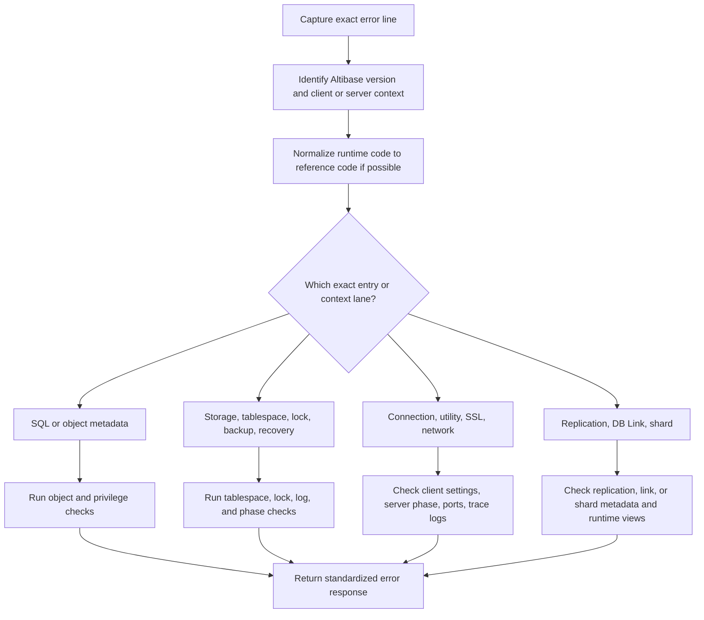

# 07. Error Messages and Troubleshooting

## Package Role

- Provides guarded exact-error response, cause/action framing, log collection, runtime evidence routing, and escalation packets for Altibase server, SQL, storage, replication, TLS, client, tool, and utility failures.
- Use it when the user supplies `ERR-xxxxx`, `0x...`, a reference symbol, a tool failure, a trace excerpt, or a symptom that must preserve exact error tokens.
- Route production recovery to `02_administration_operations.md`, SQL generation to `03_sql_ddl_generation.md`, runtime evidence SQL to `06_data_dictionary_performance_views.md`, replication actions to `09_replication_ha_cdc.md`, and TLS actions to `18_security_ssl_tls.md`.

## Applicable Versions And Authority

- 7.1: Based on Korean authoritative and English extraction-aid Error Message Reference routes plus administration and utility support routes.
- 7.3: Based on Korean authoritative Error Message Reference, iSQL, utility, and administration routes.
- 8.1: Based on Altibase 8.1 verified source Error Message Reference, SQL Reference, dictionary, and administration routes.
- Exact cause, action, severity, SQLSTATE, and escalation claims require the target version, patch level, full error line, SQL or command, runtime state, and relevant log excerpt.

## Questions This File Can Answer

- What are the safest source-backed first checks for a supplied Altibase error code, reference symbol, or message?
- How should an answer ask for logs, SQL text, object definitions, replication state, certificate files, ports, patch level, and rollback evidence before diagnosis?
- Which response format should be used for storage, recovery, SQL, lock, replication, SSL/TLS, client, APRE, utility, and Log Analyzer failures?
- When must the answer stop instead of recommending restart, recovery, object drop/rebuild, replication rebuild, certificate replacement, or property changes?

## Retrieval Alias Index

- Aliases and customer wording: error message, SQLCODE, ODBC return code, altierr lookup, trace log, startup failure, communication failure, deadlock, lock timeout, replication error, SSL error, utility error, escalation packet.
- Exact-token anchors: `altierr`, `ERR-`, `0x31010`, `0x31011`, `0x31012`, `0x31013`, `0x31014`, `0x31017`, `0x4102E`, `0x0001F`, `idERR_FATAL_idc_SVC_INET_BIND_ERROR`, `altibase_boot.log`, `altibase_rp.log`, `Unable to bind the INET socket`, `deadlock`, `long-term lock`, `ALTIBASE_SSL_PORT_NO`, `REPLICATION_SSL_PORT_NO`.
- Route uncovered exact codes here first; preserve the supplied code and ask for version, patch, full message, SQL or command, object definition, topology, and logs before adding cause/action beyond the evidence.

## Source Routes

Use these source-boundary routes for source-backed synthesis. They identify the source ID and source-pack block that must be rechecked before item-level production claims.

- 7.1 Korean Error Message Reference route: `SRC-000054/BLOCK-000509`.
- 7.1 English Error Message Reference support route: `SRC-000023/BLOCK-000508`.
- 7.3 Korean Error Message Reference route: `SRC-000118/BLOCK-000511`.
- 7.3 English Error Message Reference support route: `SRC-000087/BLOCK-000510`.
- 8.1 Error Message Reference route: `SRC-000178/BLOCK-000513`.
- 8.1 English Error Message Reference support route: `SRC-000148/BLOCK-000512`.
- 7.3 iSQL and utility troubleshooting routes: `SRC-000107/BLOCK-000542`.
- 7.3 utility troubleshooting route: `SRC-000106/BLOCK-000928`.
- 7.3 Korean iSQL route: `SRC-000138/BLOCK-000544`.
- 7.3 Korean utility route: `SRC-000137/BLOCK-000929`.
- 7.1 administration and recovery route: `SRC-000049/BLOCK-000002`.
- 7.3 administration and recovery route: `SRC-000113/BLOCK-000004`.
- 7.3 installation/startup phase route: `SRC-000124/BLOCK-000533`.
- 8.1 administration and recovery route: `SRC-000173/BLOCK-000006`.
- 8.1 dictionary/runtime validation route: `SRC-000181/BLOCK-000525`.
- 8.1 SQL syntax boundary route: `SRC-000194/BLOCK-000888`.
- Exact logs, runtime outputs, topology, certificate files, ports, private keys, patch levels, and protected-operation claims must be rechecked against the target-version source route and customer evidence.
- AID-derived support is not a separate upload file; preserve Korean-source-verified, link-validated, English-only, and source-limitation labels whenever exact AID evidence is used.
- Internal baseline, playbook, guardrail, job, and local-path identifiers stay outside this upload Markdown.

## Task And Playbook Routing

- Error-response routing: require exact error code, reference symbol or message, target version and patch, SQL or command, client/tool version, and relevant log excerpt before final diagnosis.
- Runtime-evidence routing: collect `V$VERSION`, object definitions, session/lock/transaction or replication state, certificate/port settings for TLS, and full trace context before recommending state changes.
- Protected-operation routing: stop before restart, recovery, `RESETLOGS`, `DISCARD`, object drop/rebuild, replication reset/rebuild, certificate replacement, or property changes until backup, rollback, and approval evidence is present.
- Generated-test playbook coverage remains deferred; include diagnostic checks and cleanup guidance but do not claim a complete source-backed test-generation route.

## Answer-Ready Reference

The reference below preserves the validated answer-ready content for this topic. Section headings are nested so the package-level routing sections above remain the top-level retrieval contract.

### Applicable Versions

- 7.1: Based on Altibase 7.1 Error Message Reference.
- 7.3: Based on Altibase 7.3 Error Message Reference.
- 8.1: Based on Altibase 8.1 verified source Error Message Reference.

### Questions This File Can Answer

- What are the cause and action for covered/common Altibase error codes?
- How should a GPT answer when the user provides only `ERR-xxxxx`, an error message, or a trace log excerpt?
- Which log files, SQL checks, and commands should be requested for startup, SQL execution, connection, replication, SSL, LOB, JSON, regular expression, tablespace, and lock errors?
- Which errors are version-sensitive in 7.1, 7.3, and 8.1?
- How should unresolved `stERR_*`, `sdERR_*`, overlapping `0x510xx`, or other exact-code gaps be handled without inventing a cause?
- How should an error response be formatted so the answer is consistent in any user language?

### Retrieval Alias Index

Use this compact index before scanning troubleshooting blocks. It is intentionally redundant with later headings so lexical retrieval can land on the exact error code, SQLCODE, module symbol, cause/action, or evidence-preservation block.

- Aliases and customer wording: error message, SQLCODE, ODBC return code, altierr lookup, startup failure, communication failure, lock timeout, deadlock, tablespace error, backup error, recovery error, SQL syntax error, property error, replication error, SSL error, utility error, APRE error.
- Exact-token anchors: `altierr`, `ERR-`, `0x31010`, `0x31011`, `0x31012`, `0x31013`, `0x31014`, `0x31017`, `0x4102E`, `0x0001F`, `0x0001F (31)`, `idERR_FATAL_idc_SVC_INET_BIND_ERROR`, `0x311B1`, `0x31293`, `0x4107C`, `ERR-91144`, `ERR-61186`, `mmERR_ABORT_INSUFFICIENT_PRIV`, `qpERR_ABORT_QCI_NotPermittedUser`, `qpERR_ABORT_QDP_INSUFFICIENT_PRIVILEGES`, `Unable to bind the INET socket`, `INET`, `errno`, `PORT_NO`, `altibase_boot.log`, `deadlock`, `long-term lock`.
- Focused routing anchors: exact-code normalization routes to `Error Code Normalization` and `J010 Answer-Ready Troubleshooting Index`; startup, listener, communication, memory, deadlock, lock, tablespace, backup/recovery, SQL, object, privilege, LOB, JSON, replication, SSL, DB Link, APRE, utility, Log Analyzer, and Spatial errors route to the matching `Error Block:` heading; topic-level next checks route to `Topic Response Patterns`.
- Answer route: use this file for exact-code response format, cause/action, and first checks; route generated SQL to `03_sql_ddl_generation.md`, operational recovery to `02_administration_operations.md`, driver/API detail to `11_java_jdbc_spring.md`, `12_c_cli_odbc_precompiler.md`, `13_isql_iloader_basic_tools.md`, and `14_utilities_operation_tools.md`, replication to `09_replication_ha_cdc.md`, and TLS to `18_security_ssl_tls.md`.
- Missing-input trigger: if the exact code, message, Altibase version, log excerpt, command, SQL text, or object name is missing, ask for it and give only the safest source-backed next check.

### Source Documents

- 7.1: Altibase 7.1 Error Message Reference.
- 7.3: Altibase 7.3 Error Message Reference.
- 8.1: Altibase 8.1 verified source Error Message Reference.

### Error Reference Inventory Baseline

The selected Error Message References are organized by module chapters. Use the module
family to choose a diagnostic lane, but do not infer cause, action, `SQLSTATE`, exact
version support, or severity from the prefix alone. The exact error entry and the
customer's runtime context decide the answer.

Inventory summary:

- 7.1 Error Message Reference: `2927` exact `0x...` entries across `ID`, `SM`, `MT`, `RP`, `QP`, `SD`, `ST`, `MM`, `ODBC`, `APRE`, `Utilities`, `CM`, `Database Link`, and `Log Analyzer` chapters. The Regular Expression chapter explains PCRE2 error text and routes exact-code handling back to `MT`.
- 7.3 Error Message Reference: `2899` exact `0x...` entries across `ID`, `SM`, `MT`, `RP`, `QP`, `ST`, `MM`, `ODBC`, `APRE`, `Utilities`, `CM`, `Database Link`, and `Log Analyzer` chapters. `SD Error Code` is not listed in the checked 7.3 Error Message Reference.
- Altibase 8.1 verified source: `2916` exact `0x...` entries across `ID`, `SM`, `MT`, `RP`, `QP`, `ST`, `MM`, `ODBC`, `APRE`, `Utilities`, `CM`, `Database Link`, and `Log Analyzer` chapters. `SD Error Code` is not listed in the checked Altibase 8.1 verified source.

Expanded block routing:

- Storage, backup, recovery, datafile, log, lock, and tablespace errors: use storage/recovery error blocks when present.
- SQL, DDL, data type, constraint, JSON, Temporary LOB, LOB, and regular expression errors: use SQL/data-type error blocks when present.
- Client, network, SSL/TLS, replication, utility, DB Link, Log Analyzer, APRE, and CLI/ODBC errors: use client/tool/replication error blocks when present.
- Unresolved exact-code gaps and source-drift cases: preserve the supplied code and ask for exact version, patch level, and evidence before a definitive answer.

### J010 Answer-Ready Troubleshooting Index

Use this compact index when a customer supplies an error code, tool failure, driver
message, or symptom and the answer must preserve exact code forms. Prefer the detailed
block later in this attachment for full SQL and escalation steps, but include the
literal code, symbol, message, cause/action focus, and first check from the matching row.

Tool and evidence collection rows:

| Customer symptom | Exact tokens to preserve | First answer action | Missing input to ask for |
| --- | --- | --- | --- |
| Error lookup by code, `SQLCODE`, ODBC return code, or message keyword | `altierr {-w keyword pattern | [-n] error number}`, `altierr -266286`, `altierr 266286`, `altierr 0x4102E`, `SQLCODE`, `ODBC`, `-w`, `-n` | Explain that `altierr` searches by error number or message keyword and prints error code number, code string, description, cause, and action. Keyword searches can return multiple records, so ask for the exact code when available. | Altibase version, exact error line, negative `SQLCODE` or ODBC return code, and whether the user searched by keyword or exact number. |
| Abnormal shutdown or crash trace collection | `dumptrc`, `$ALTIBASE_HOME/trc`, `dumptrc -i server -i error`, `dumptrc -e error`, `dumptrc -c -i error -i server -i sm -n 20`, `-x` | Collect readable trace and call-stack evidence. For normal call-stack conversion, the `dumptrc` version and Altibase executable version should match. Treat `-x` as a forced support diagnostic when versions differ. | Altibase version, executable path, trace directory, timestamp, abnormal-shutdown symptom, and whether call stacks need conversion. |
| Failed iLoader upload | `iLoader`, `-bad`, `-log`, `-errors`, `-verbose`, `-parallel`, `ALTIBASE_NLS_USE`, `DATA_NLS_USE` | Preserve failed rows with `-bad`, execution and error detail with `-log`; use `-verbose` only with `-log`; remember `-errors` default `50`, `-errors 0` continues regardless of count, and one parallel worker exceeding the limit terminates all workers. | Version, command, FORM file, data file character set, effective `ALTIBASE_NLS_USE` or `DATA_NLS_USE`, `-bad` and `-log` contents, load mode, and whether `-parallel` was used. |
| LOB operation fails in autocommit mode | `0x314B4`, `qpERR_ABORT_QMX_LOB_AUTOCOMMIT_MODE`, `0x5112C`, `ulERR_ABORT_LOB_AUTOCOMMIT_MODE_ERR`, `0x91101`, `utERR_ABORT_LOB_AUTOCOMMIT_MODE_ERR`, `COMMIT`, `ROLLBACK` | Keep the LOB work inside an explicit transaction with autocommit off, then `COMMIT` or `ROLLBACK` as appropriate. | SQL/API/tool command, client/tool version, autocommit state, LOB locator lifecycle, transaction boundary, and full error line. |

SQL, property, object, and data error rows:

| Runtime / reference code | Reference symbol | Exact message or family | Cause / action focus | First check |
| --- | --- | --- | --- | --- |
| `ERR-00000` / `0x910FB (594171)` | `utERR_ABORT_Connected_Idle_Instance_Error` | `Connected to idle instance` | SYSDBA utility connected to an idle instance; this is not by itself corruption. Continue the intended startup, creation, or recovery workflow, or start to the required phase. | Confirm `isql -sysdba` context and intended startup phase. |
| `ERR-91015` / `0x91015 (593941)` | `utERR_ABORT_Comm_Failure_Error` | `Communication failure.` | Communication with the DBMS server failed; source action is to connect again, after checking host, port, server phase, and trace context. | Check server process, listener port, `altibase_boot.log`, and exact command. |
| `0x0001F (31)` | `idERR_FATAL_idc_SVC_INET_BIND_ERROR` | `Unable to bind the INET socket.(<0%d>)` | `bind()` failed on the `INET` service socket because the port was already in use. Check the substituted OS error or `errno`, then close the process using the port or choose another port. | `netstat` or `lsof` on `PORT_NO`, `altibase_boot.log`, configured listener port, OS error number. |
| `0x311D6 (201174)` | `qpERR_ABORT_MEMORY_ALLOCATION` | `Insufficient memory for Query Processor` | Not enough memory was available for Query Processor allocation. Verify system memory before changing properties. | Memory pressure, query shape, concurrent workload, and memory properties. |
| `0x11041 (69697)` | `smERR_ABORT_Aborted` | `A deadlock situation has been detected.` | Deadlock resolution stopped the victim transaction; the transaction was rolled back and should be re-executed. | `V$LOCK_WAIT`, `V$LOCK_STATEMENT`, conflicting transaction pattern. |
| `0x11075 (69749)` | `smERR_ABORT_smcExceedLockTimeWait` | Transaction exceeded user-specified lock timeout. | The transaction failed to lock the object; increase the transaction lock timeout only after checking whether another transaction has a `long-term lock`. | Blocked SQL, lock holder, `DDL_LOCK_TIMEOUT`, `USER_LOCK_REQUEST_TIMEOUT`, and lock views. |
| `0x11123 (69923)` | `smERR_ABORT_NOT_ENOUGH_SPACE` | `The tablespace does not have enough free space ( TBS Name :<0%s> ).` | Not enough space in the tablespace; documented action is to add a new `data file`, but ask for tablespace type and autoextend state before generating DDL. | `V$TABLESPACES`, `V$DATAFILES`, tablespace type, backup/impact constraints. |
| `0x110EF (69871)` | `smERR_ABORT_UNABLE_TO_EXTEND_CHUNK_WHEN_AUTO_EXTEND_OFF` | Unable to extend the tablespace when `AUTOEXTEND` is off. | The `data file` cannot extend because autoextend is off. Choose between enabling `AUTOEXTEND`, adding space, or freeing space after metadata checks. | Datafile `AUTOEXTEND`, `MAXSIZE`, current size, tablespace type. |
| `0x311D8 (201176)` | `qpERR_ABORT_QDT_NOT_EXIST_TBS` | `Tablespace not found. The name of the specified tablespace was not found in the database.` | Named tablespace was not found; verify the literal tablespace name and exact DDL. | `V$TABLESPACES` and target DDL. |
| `0x311DD (201181)` | `qpERR_ABORT_QDT_OBJECT_EXIST` | `The tablespace has objects.` | Objects still exist in the tablespace; first drop or move related objects. Confirm object inventory, backup/recovery posture, and explicit intent before `INCLUDING CONTENTS`. | Tablespace object inventory and destructive-operation approval. |
| `ERR-31001` / `0x31001 (200705)` | `qpERR_ABORT_QCP_SYNTAX` | `SQL syntax error <0%s>` | Statement is not syntactically valid for Altibase; rewrite using correct Altibase syntax for the target version. | Exact SQL text and target version. |
| `0x31003 (200707)` | `qpERR_ABORT_QCP_NOT_SUPPORTED_SYNTAX` | `Unsupported syntax` | Statement uses syntax unsupported by Altibase; rewrite using Altibase-supported syntax and check version differences. | Exact SQL text, source DBMS, and target version. |
| `0x31010`, `0x31011`, `0x31012`, `0x31013`, `0x31014`, `0x31017` | `qpERR_ABORT_QCM_NOT_EXIST_USER`, `qpERR_ABORT_QCM_NOT_EXIST_TABLE`, `qpERR_ABORT_QCM_NOT_EXIST_COLUMN`, `qpERR_ABORT_QCM_NOT_EXIST_SEQUENCE`, `qpERR_ABORT_QCM_NOT_EXISTS_INDEX`, `qpERR_ABORT_QCM_REPL_NOT_FOUND` | `User not found`, `Table not found`, `Column not found`, `Sequence not found`, `Index not found`, `Replication not found` | Preserve the exact identifier and verify owner, object name, quoted-case, target database, and replication definition context. | Dictionary object checks and replication metadata checks. |
| `0x311B1 (201137)`, `0x31293 (201363)`, `0x4107C (266364)` | `qpERR_ABORT_QDP_INSUFFICIENT_PRIVILEGES`, `qpERR_ABORT_QCI_NotPermittedUser`, `mmERR_ABORT_INSUFFICIENT_PRIV` | Ordinary SQL privilege failure, unauthorized user, or SYSDBA-required operation. | Connect with the correct user, use `SYSDBA` where required, or grant the needed privilege. Do not recommend direct DML on Altibase meta tables. | Current user, intended operation, required privilege, SYSDBA context. |
| `0x11058 (69720)` | `smERR_ABORT_smnUniqueViolation` | Row already exists in a `unique index`. | Check the record with the unique key value before changing sequences or deleting duplicates. | Unique index/constraint columns and offending key value. |
| `0x2100C`, `0x21010`, `0x21011`, `0x21048` | `mtERR_ABORT_CONVERSION_NOT_APPLICABLE`, `mtERR_ABORT_VALUE_OVERFLOW`, `mtERR_ABORT_INVALID_LITERAL`, `mtERR_ABORT_OVERFLOW` | `Conversion not applicable`, `Value overflow`, `Invalid literal`, out-of-range type value. | Check source value, target data type, precision, scale, literal format, and bind type using Altibase rules, not Oracle assumptions. | Column definition, sanitized input value, SQL or bind metadata. |
| `0x2106B`, `0x2106C` | `mtERR_ABORT_PCRE2_NOT_SUPPORTED_ENCODING`, `mtERR_ABORT_PCRE2_UNEXPECTED_ERROR` | PCRE2 character-set or unexpected error when `REGEXP_MODE=1`. | Preserve `REGEXP_MODE`, server character set, pattern, SQL text, and PCRE2 detail. `0x2106B` points to unsupported PCRE2 encoding; `0x2106C` requires detail text before escalation. | `REGEXP_MODE`, server character set, pattern, input sample, detail error text. |
| `ERR-31363` / `0x31363 (201571)` | `qpERR_ABORT_QDB_TEMPORARY_TABLE_DDL_DISABLE` | `Cannot execute DDL when a temporary table is in use.` | DDL cannot execute while temporary tables based on the target table are in use. Truncate all related temporary tables and retry; do not jump to session termination. | Target table, related temporary tables, owning sessions, exact DDL. |
| `0x2106D (135277)` | `mtERR_ABORT_JSON_WITHOUT_TEMPLOB` | `JSON type cannot be used when the TEMPORARY_LOB_ENABLE property is disabled.` | Altibase 8.1 verified source JSON behavior; check whether `TEMPORARY_LOB_ENABLE` is enabled. | Version, property value, JSON SQL, and proof if target is not 8.1. |
| `0x314C5`, `0x314C8`, `0x314CA` | `qpERR_ABORT_JSON_INVALID_JSON_PATH`, `qpERR_ABORT_JSON_MULTIPLE_RESULTS`, `qpERR_ABORT_JSON_RETURNS_NON_SCALAR_VALUE` | JSON path syntax error, multiple results, or non-scalar values. | Distinguish path syntax, result cardinality, and scalar-return shape. Check JSON path expression, wrapper option, and `RETURNING` clause. | JSON data, literal JSON path, function name, `RETURNING`, wrapper option. |
| `0xE1001`, `0xE1003`, `0xE1004`, `0xE1065`, `0xE13E7` | `sdERR_*` | Altibase 7.1 sharding metadata, shard object, shard routing, shard library, and unexpected shard errors. | Use the exact 7.1 `SD Error Code` row; for 7.3 or 8.1 require installed-version evidence because the checked Korean sources do not list `SD Error Code`. | `altibase -v`, `V$VERSION`, shard metadata, failed SQL, shard node/object/key details. |
| `0xA101A`, `0xA1046`, `0xA104E`, `0xA104F`, `0xA1050`, `0xA1054` | `stERR_*` | Spatial WKT/WKB parsing, invalid geometry, SRID mismatch or lookup, `PROJ4`, `GEOS`, and geometry validation errors. | Preserve failed Spatial function/operator, geometry input, SRID, and metadata evidence; use the Spatial exact-code map before general geometry advice. | `GEOMETRY_COLUMNS`, `SPATIAL_REF_SYS`, failed Spatial SQL, sanitized WKT/WKB/EWKT/EWKB, trace or loader output. |

Replication and SSL high-risk rows:

| Runtime / reference code | Reference symbol | Exact message or family | Cause / action focus | First check |
| --- | --- | --- | --- | --- |
| `0x61003 (397315)`, `0x61004 (397316)` | `rpERR_ABORT_RP_READ_SOCKET`, `rpERR_ABORT_RP_WRITE_SOCKET` | Unable to read from or write to a socket. | Check network path, peer server status, local and remote `altibase_rp.log`, and replication runtime state before rebuild/reset/resync advice. | `altibase_rp.log`, `V$REPSENDER`, `V$REPRECEIVER`, `V$REPGAP`. |
| `0x6100D`, `0x61010`, `0x6102D` | `rpERR_ABORT_RP_SENDER_HANDSHAKE`, `rpERR_ABORT_RP_SENDER_START`, `rpERR_ABORT_LISTEN` | Sender handshake failed, sender thread failed to start, or receiver failed to listen to replication socket `(Port No:<0%d>)`. | Check network, server, replication definition, peer status, exact `IP address` and port number, and listener port ownership before changing `REPLICATION_PORT_NO`. | Peer definitions, peer server status, `altibase_rp.log`, port ownership. |
| `0x61100 (397568)` | `rpERR_ABORT_RPC_DUPLICATE_REPLICATION` | `Duplicate replication names. The replication name already exists in the database.` | Replication name, `IP address`, or port number is not unique. Use a different name after checking whether the existing object is active or intentionally part of topology. | `SYSTEM_.SYS_REPLICATIONS_`, `SYSTEM_.SYS_REPL_HOSTS_`, active status, topology owner. |
| `0x5120C`, `0x5120D`, `0x5120E`, `0x5121D`, `0x5121E` | `ulERR_ABORT_SSL_OPERATION_FAILURE`, `ulERR_ABORT_SSL_LIBRARY_ERROR`, `ulERR_ABORT_SSL_LINK_FAILURE`, `ulERR_ABORT_INVALID_ALTIBASE_SSL_PORT_NO`, `ulERR_ABORT_PORT_NO_ALTIBASE_SSL_PORT_NO_NOT_SET` | Client SSL operation/library/link failure or missing/invalid SSL port. | Check `PORT_NO`, `ALTIBASE_SSL_PORT_NO`, OpenSSL library loading, detailed client SSL text, and redact credentials while preserving keys. | Client version, connection string keys, OpenSSL library path, SSL options. |
| `0x710A0`, `0x710A3`, `0x710CB` | `cmERR_ABORT_INVALID_CERTIFICATE`, `cmERR_ABORT_SSL_HANDSHAKE`, `cmERR_ABORT_UNSUPPORTED_OPENSSL_VERSION` | Server certificate load failure, SSL handshake failure, or unsupported OpenSSL version. | Check certificate path, private key, CA configuration, `altibase_boot.log`, Altibase patch level, platform, and OpenSSL version before changing TLS files or libraries. | Server properties, file paths, log excerpt, OpenSSL version, platform. |

### Response Rules

- Answer explanations in the user's language.
- Keep SQL object names, function names, error codes, reference symbols, property names, commands, file paths, and environment variables literal.
- Preserve the exact error code and message the user provided. Do not translate or rewrite `ERR-31363`, `0x31363`, `qpERR_ABORT_QDB_TEMPORARY_TABLE_DDL_DISABLE`, `TEMPORARY_LOB_ENABLE`, `REGEXP_MODE`, `ALTIBASE_SSL_PORT_NO`, or similar tokens.
- If the user gives only an error code, ask for the full error line, Altibase version and patch level, SQL or command, and relevant trace log excerpt before making a final diagnosis.
- If the user gives a specific Altibase error code that does not match one of the consolidated error blocks, preserve the supplied code and message. Do not answer only that the code is absent from the attachments. Set cause/action beyond the user's evidence to `Unknown from the supplied message`, and ask for the Altibase version and patch level, full error line, SQL or command, object definition when relevant, and trace log excerpt. Do not infer cause, action, `SQLSTATE`, module, or severity from the prefix or code family alone.
- Runtime messages often appear as `[ERR-31363 : Cannot execute DDL when a temporary table is in use.]`. The Error Message Reference may list the same code as `0x31363 (201571)` with a reference symbol. Keep both forms when known.
- Treat placeholders such as `<0%s>`, `<1%d>`, and `<0%lu>` as values that Altibase substitutes at runtime. Do not ask users to type placeholders literally.
- If the reference action says to contact support, first collect version, exact command, SQL text, timestamp, trace log excerpts, OS error number if present, and reproduction steps.
- Do not expose internal source labels. Use `Altibase 8.1 verified source` for 8.1 material.

### Standard Error Response Format

Use this format for every customer-facing error explanation:

```text
Error Code:
Reference Symbol:
Module / Severity:
Message:
Applies To:
Symptom:
Primary Causes:
Immediate Action:
Check SQL or Command:
Required Customer Input:
Version Cautions:
Escalation:
Related Document:
```

If one field is unknown, say `Unknown from the supplied message` instead of inventing it.

QA gate before answering:

- Exact code: keep the user's literal `ERR-xxxxx`, `0x...`, symbol, and message. If a grouped block has an exact-code map, use the map row before general prose.
- Missing evidence: fill `Required Customer Input` with the exact missing version, patch level, SQL or command, object definition, topology, OS error, client/tool version, certificate path, or trace excerpt needed for a safe answer.
- Prefix safety: use prefixes such as `rpERR_*`, `stERR_*`, or `ulERR_*` only as routing hints after the exact symbol, message, component, and context are known.
- Action safety: do not recommend restart, recovery, datafile replacement, `RESETLOGS`, object drop/rebuild, replication rebuild, certificate replacement, or property changes until the required evidence supports that action.
- Gap handling: for uncovered exact codes, preserve the code, state `Unknown from the supplied message` for unsupported cause/action fields, provide the safest source-backed next check, and cross-reference the owning attachment.

Protected recovery and destructive-operation triage:

- If the error involves backup, archive logs, lost datafiles, missing checkpoint images, `RESETLOGS`, `DISCARD`, `DROP TABLESPACE`, `REUSE`, or log-anchor mismatch, preserve current files before changing anything.
- Ask for exact version and patch level, startup phase, `ARCHIVELOG` or `NOARCHIVELOG`, full error line, affected tablespace or file path, backup manifest, `loganchor*` source, archive and online log inventory, and `altibase_boot.log` or `altibase_sm.log` excerpts.
- Complete media recovery uses `ALTER DATABASE RECOVER DATABASE` in `CONTROL` when required archive logs and online logs are available. Incomplete recovery uses `UNTIL TIME` or `UNTIL CANCEL`; after that, require `ALTER DATABASE db_name META RESETLOGS` and a `full database backup`.
- For ordinary complete recovery, use the `current loganchor` files whenever possible. Use historical `loganchor*` only for source-backed cases such as accidental `DROP TABLESPACE`, planned past-time recovery, or incremental tag recovery.
- If only a `SYS_TBS_DISK_TEMP` temporary datafile is lost in a source-backed `NOARCHIVELOG` case, recreate the temporary file in `CONTROL` and return with `ALTER DATABASE dbname SERVICE`; do not generalize that exception to permanent datafiles or memory checkpoint images.
- Do not recommend `ALTER TABLESPACE ... DISCARD` unless media recovery is impossible or rejected and the customer explicitly accepts losing the damaged disk or memory data tablespace. After `DISCARD`, the tablespace is inaccessible and the only later action is `DROP TABLESPACE ... INCLUDING CONTENTS`, usually with `AND DATAFILES` when deleting files is intended.
- Do not suggest `REUSE` for an existing datafile path unless overwriting that file is explicitly approved and backed by recovery evidence.

Short answers may compress the fields, but preserve the same order:

```text
Symptom -> Cause -> Action -> Check SQL or Command -> Version Cautions -> Escalation
```

### Error Code Normalization

When a runtime message uses `ERR-xxxxx`, normalize it without changing the user's literal code:

```text
Runtime form:   ERR-31363
Reference form: 0x31363 (201571)
Symbol:         qpERR_ABORT_QDB_TEMPORARY_TABLE_DDL_DISABLE
Message:        Cannot execute DDL when a temporary table is in use.
```

Rules:

- `ERR-31363` usually corresponds to reference code `0x31363`.
- Keep leading zeroes in runtime codes such as `ERR-00000`.
- Do not convert a decimal value unless the reference entry explicitly provides it.
- Do not identify a module from a numeric code alone when families reuse the same
  `0x510xx` reference space. For example, ODBC/CLI, APRE, and Log Analyzer entries can
  share a numeric code while using different symbols and messages. Use the exact
  symbol, message text, component, and trace context before choosing `ulERR_*`,
  `ulpERR_*`, `utERR_*`, or `ulaERR_*`.
- Search by message text when a utility wraps the original server error.
- If the user supplies `SQLSTATE`, keep it in the answer, but do not infer `SQLSTATE` from an Altibase error code unless the driver reported it.

### Module and Severity Map

| Reference area | Typical prefix | Use this diagnosis lane |
| --- | --- | --- |
| ID Error Code | `idERR_*` | Infrastructure, OS calls, shared memory, semaphores, sockets, files, properties |
| SM Error Code | `smERR_*` | Storage manager, transactions, locks, log files, data files, tablespaces, backup, recovery |
| MT Error Code | `mtERR_*` | Data types, conversion, literals, date format, time zone, regular expression, JSON type support |
| RP Error Code | `rpERR_*` | Replication definition, sender, receiver, socket, handshake, sync, replication metadata |
| QP Error Code | `qpERR_*` | SQL parser, DDL, DML, metadata, objects, privileges, PSM, query execution |
| SD Error Code | `sdERR_*` | Sharding metadata, shard nodes, shard keys, shard SQL restrictions |
| ST Error Code | `stERR_*` | Spatial SQL and geometry operations |
| MM Error Code | `mmERR_*` | Main module, sessions, startup, shutdown, access mode, protocol checks |
| ODBC / CLI Error Code | `ulERR_*` | CLI, ODBC, client connection, fetch, bind, LOB, SSL client settings |
| APRE Error Code | `ulpERR_*` | Precompiler and embedded SQL |
| Utilities Error Code | `utERR_*` | `isql`, `iloader`, utilities, display, file, communication, LOB utility behavior |
| CM Error Code | `cmERR_*` | Communication module, SSL/TLS context, certificates, socket I/O |
| Database Link Error Code | `dkERR_*` | DB Link, AltiLinker, remote transaction, `dblink.conf` |
| Log Analyzer Error Code | `ulaERR_*` | Log Analyzer network and CDC-related processing |

Version note: `SD Error Code` / `sdERR_*` is confirmed in the 7.1 Error Message
Reference, but is not listed in the checked 7.3 or Altibase 8.1 verified source. If a
customer reports an `sdERR_*` or sharding error on 7.3 or 8.1, ask for the exact
product version, patch level, full error line, and installed manual/runtime evidence
before making a definitive version claim. Sharding-related errors can also appear
under other modules, so use the exact code first.

Severity handling:

| Severity | Meaning for answer |
| --- | --- |
| `FATAL` | Treat as high risk. Collect trace logs, OS error numbers, startup phase, and version. Restart or recovery guidance must be careful and state impact. |
| `ABORT` | The current operation failed. Explain the cause, corrective action, and retry conditions. |
| `RETRY` | The reference expects retry after a condition clears. Explain what condition to verify before retrying. |
| `IGNORE` | Usually informational or non-fatal. Explain when it can be ignored and when to collect logs. |

Inherited escalation default for every error block:

- Every block under `Searchable Error Blocks` inherits this `Escalation:` policy unless the block provides a narrower escalation line.
- Collect evidence before escalation: exact error code and message, Altibase version, failed SQL or command, module context, relevant dictionary query output, trace log excerpt around the timestamp, and recent corrective actions already attempted.
- Stop corrective actions and escalate when evidence conflicts with the documented cause, the same failure remains after the listed verification checks, a restart, data movement, tablespace drop, replication rebuild, certificate change, or property change would be needed, or the source action says to contact Altibase Support.

### Triage Workflow



### Evidence to Request

Ask for this information when the error cannot be answered directly:

- Altibase version: `altibase -v` output, or `V$VERSION`.
- Exact command or SQL statement that failed.
- Exact error line and any preceding error lines.
- Whether the error came from server startup, `isql`, CLI/ODBC/JDBC, replication, DB Link, utility, or application code.
- Startup phase: `PROCESS`, `CONTROL`, `META`, or `SERVICE`, if the error is operational.
- Relevant trace logs around the timestamp, especially `altibase_boot.log`, `altibase_rp.log`, utility output, and the module trace log named in the error context.

Useful OS commands:

```bash
altibase -v
ls -ltr "$ALTIBASE_HOME/trc"
tail -200 "$ALTIBASE_HOME/trc/altibase_boot.log"
tail -200 "$ALTIBASE_HOME/trc/altibase_rp.log"
```

Use `altibase_rp.log` when the reference symbol is `rpERR_*` or the message mentions replication sender, receiver, handshake, sync, or replication socket.

### Common Check SQL

Check version:

```sql
SELECT product_version,
       meta_version,
       protocol_version,
       repl_protocol_version
FROM V$VERSION;
```

Check properties used by troubleshooting answers:

```sql
SELECT name, value1, min, max
FROM V$PROPERTY
WHERE name IN (
  'PORT_NO',
  'MAX_CLIENT',
  'REPLICATION_PORT_NO',
  'REPLICATION_SSL_PORT_NO',
  'REPLICATION_RECEIVE_TIMEOUT',
  'REPLICATION_MAX_COUNT',
  'REPLICATION_MAX_LOGFILE',
  'REPLICATION_LOG_BUFFER_SIZE',
  'REPLICATION_RECOVERY_REQUEST_TIMEOUT',
  'REPLICATION_SYNC_LOG',
  'REPLICATION_DDL_ENABLE',
  'REPLICATION_DDL_SYNC',
  'DDL_LOCK_TIMEOUT',
  'USER_LOCK_REQUEST_TIMEOUT',
  'REPLICATION_LOCK_TIMEOUT',
  'REPLICATION_SYNC_LOCK_TIMEOUT',
  'SSL_ENABLE',
  'SSL_PORT_NO',
  'SSL_CERT',
  'SSL_KEY',
  'SSL_CA',
  'SSL_CAPATH',
  'QUERY_TIMEOUT',
  'REGEXP_MODE',
  'TEMPORARY_LOB_ENABLE',
  'MEMORY_TEMPLOB_MAX_ALLOC_SIZE',
  'MEMORY_TEMPLOB_PIECE_SIZE',
  'MEM_MAX_DB_SIZE',
  'VOLATILE_MAX_DB_SIZE',
  'TABLESPACE_LOCK_ENABLE'
)
ORDER BY name;
```

Check object existence:

```sql
SELECT u.user_name,
       t.table_id,
       t.table_name,
       t.table_type,
       t.tbs_name,
       t.is_partitioned,
       t.temporary,
       t.access
FROM SYSTEM_.SYS_TABLES_ t,
     SYSTEM_.SYS_USERS_ u
WHERE t.user_id = u.user_id
  AND u.user_name = '<OWNER_NAME>'
  AND t.table_name = '<OBJECT_NAME>';
```

Check columns:

```sql
SELECT c.column_order,
       c.column_name,
       c.data_type,
       c.precision,
       c.scale,
       c.is_nullable,
       c.store_type
FROM SYSTEM_.SYS_COLUMNS_ c,
     SYSTEM_.SYS_TABLES_ t,
     SYSTEM_.SYS_USERS_ u
WHERE c.user_id = t.user_id
  AND c.table_id = t.table_id
  AND t.user_id = u.user_id
  AND u.user_name = '<OWNER_NAME>'
  AND t.table_name = '<TABLE_NAME>'
ORDER BY c.column_order;
```

Check constraints:

```sql
SELECT cs.constraint_name,
       cs.constraint_type,
       cs.index_id,
       cs.column_cnt,
       cs.referenced_table_id,
       cs.delete_rule,
       cs.check_condition,
       cs.validated
FROM SYSTEM_.SYS_CONSTRAINTS_ cs,
     SYSTEM_.SYS_TABLES_ t,
     SYSTEM_.SYS_USERS_ u
WHERE cs.user_id = t.user_id
  AND cs.table_id = t.table_id
  AND t.user_id = u.user_id
  AND u.user_name = '<OWNER_NAME>'
  AND t.table_name = '<TABLE_NAME>'
ORDER BY cs.constraint_name;
```

Check tablespaces and data files:

```sql
SELECT id,
       name,
       type,
       state,
       datafile_count,
       total_page_count,
       allocated_page_count,
       page_size
FROM V$TABLESPACES
ORDER BY id;

SELECT id,
       name,
       spaceid,
       currsize,
       autoextend,
       opened,
       modified,
       state
FROM V$DATAFILES
ORDER BY spaceid, id;
```

Check locks and long-running statements:

```sql
SELECT *
FROM V$LOCK_WAIT;

SELECT session_id,
       id,
       execute_flag,
       query_start_time,
       query
FROM V$STATEMENT
WHERE execute_flag = 1
ORDER BY query_start_time;
```

Check replication:

```sql
SELECT rep_name,
       status,
       sender_ip,
       sender_port,
       peer_ip,
       peer_port,
       net_error_flag
FROM V$REPSENDER
ORDER BY rep_name;

SELECT rep_name,
       my_ip,
       my_port,
       peer_ip,
       peer_port,
       apply_xsn,
       insert_failure_count,
       update_failure_count,
       delete_failure_count
FROM V$REPRECEIVER
ORDER BY rep_name;

SELECT rep_name,
       rep_gap,
       rep_gap_size
FROM V$REPGAP
ORDER BY rep_name;
```

Check DB Link and `AltiLinker`:

```sql
SELECT *
FROM V$DBLINK_ALTILINKER_STATUS;

SELECT *
FROM V$DBLINK_DATABASE_LINK_INFO;

SELECT *
FROM V$DBLINK_GLOBAL_TRANSACTION_INFO;

SELECT *
FROM V$DBLINK_REMOTE_STATEMENT_INFO;
```

Check whether version-sensitive views exist before using them:

```sql
SELECT name, columncount
FROM V$TABLE
WHERE name IN ('V$TEMPORARY_LOBS', 'V$MEM_STABLE', 'V$LOCK_TABLE_STATS')
ORDER BY name;
```

### Searchable Error Blocks

#### Error Block: Startup Connected to Idle Instance

Error Code: `0x910FB (594171)`; runtime messages can also show `[ERR-00000 : Connected to idle instance]`.

Reference Symbol: `utERR_ABORT_Connected_Idle_Instance_Error`.

Module / Severity: Utilities / `ABORT` in the reference, but the message itself is a notification.

Message: `Connected to idle instance`.

Applies To: `isql -sysdba` connections before the server reaches service phase.

Symptom: The user connects as `SYSDBA` and sees that the instance is idle.

Primary Causes: No error occurred. The utility connected to an idle Altibase instance.

Immediate Action: Start the database to the required phase, or continue with startup, recovery, or creation work if idle state is expected.

Check SQL or Command:

```sql
STARTUP PROCESS;
STARTUP CONTROL;
STARTUP META;
STARTUP SERVICE;
```

Version Cautions: Applies across 7.1, 7.3, and 8.1.

Related Document: Administration and Operations.

#### Error Block: Communication Failure

Error Code: `ERR-91015` / `0x91015 (593941)`.

Reference Symbol: `utERR_ABORT_Comm_Failure_Error`.

Module / Severity: Utilities / `ABORT`.

Message: `Communication failure.`

Applies To: `isql`, utilities, client/server communication.

Symptom: The client loses communication with the DBMS server.

Primary Causes: The documented cause is failed communication with the DBMS
server. Common evidence to check includes a closed network connection, stopped
server, wrong server phase, wrong port, or disconnected client.

Immediate Action: The documented action is to connect again to the DBMS server.
Before choosing a single environmental root cause, check server status and
startup phase, then verify host, port, listener availability, and
`altibase_boot.log`.

Check SQL or Command:

```bash
ps -ef | grep altibase
tail -200 "$ALTIBASE_HOME/trc/altibase_boot.log"
```

```sql
SELECT product_version FROM V$VERSION;
```

Version Cautions: Applies across 7.1, 7.3, and 8.1. For SSL connections, also check the SSL-specific blocks below.

Related Document: Getting Started and Installation; Administration and Operations.

#### Error Block: INET Socket Bind Failure

Error Code: `0x0001F (31)`.

Reference Symbol: `idERR_FATAL_idc_SVC_INET_BIND_ERROR`.

Module / Severity: ID / `FATAL`.

Message: `Unable to bind the INET socket.(<0%d>)`.

Applies To: Server startup and listener binding.

Symptom: Altibase cannot bind the configured TCP listener port.

Primary Causes: The documented cause is that Altibase failed to invoke `bind()`
on the `INET` socket because the port was already in use by another process. A
wrong or not-yet-released listener port can lead to the same startup symptom.

Immediate Action: Preserve the substituted OS error value or `errno`, find the
process using the port, stop it if appropriate, or choose another valid port.
Do not change `PORT_NO` until the configured port and process owner are known.

Check SQL or Command:

```bash
netstat -an | grep '<PORT_NO>'
lsof -i :<PORT_NO>
tail -200 "$ALTIBASE_HOME/trc/altibase_boot.log"
```

Required Customer Input: exact version and patch level, configured listener
property, full error line including substituted OS error or `errno`, startup
phase, host/port, and port-ownership command output.

Version Cautions: Applies across 7.1, 7.3, and 8.1. On systems without `lsof`, use the OS-native socket inspection command.

Related Document: Getting Started and Installation; Administration and Operations.

#### Error Block: Client Session, Protocol, and Alternate Server Connection Errors

Error Codes: listed individually in the exact code map below.

Module / Severity: MM, CM, and ODBC/CLI / `ABORT`.

Exact code map:

| Runtime / reference code | Reference symbol | Exact message | First check |
| --- | --- | --- | --- |
| `ERR-4102C` / `0x4102C (266284)` | `mmERR_ABORT_IDN_MISMATCH_ERROR` | `Incompatible NLS between the client(<0%s>) and the server(<1%s>).` | Match client and server NLS settings. |
| `ERR-41033` / `0x41033 (266291)` | `mmERR_ABORT_INVALID_ERROR` | `Invalid communication protocol` | Verify client library version against server version. |
| `ERR-41059` / `0x41059 (266329)` | `mmERR_ABORT_NO_AVAILABLE_TASK` | `Task pool overflow. Check properties.` | Check `MAX_CLIENT` and current sessions. |
| `ERR-41099` / `0x41099 (266393)` | `mmERR_ABORT_TOO_MANY_SESSION` | `There are too many sessions` | Disconnect unused sessions or increase `MAX_CLIENT` after impact review. |
| `ERR-71004` / `0x71004 (462852)` | `cmERR_ABORT_INVALID_OPERATION` | `Invalid operation` | Check whether the client version is higher than the server version. |
| `ERR-71013` / `0x71013 (462867)` | `cmERR_ABORT_TIMED_OUT` | `Timed out` | Check the network path and timeout context. |
| `ERR-7101A` / `0x7101A (462874)` | `cmERR_ABORT_CONNECTION_CLOSED` | `Connection closed` | Check network failure or abnormal client termination. |
| `ERR-71096` / `0x71096 (462998)` | `cmERR_ABORT_GETADDRINFO_ERROR` | `Failed to invoke the getaddrinfo() system function: <0%s>` | Check host name and resolver configuration. |
| `ERR-71099` / `0x71099 (463001)` | `cmERR_ABORT_CONNECT_INVALIDARG` | `Invalid argument supplied for connect()` | Check IP address and host name. |
| `ERR-5108D` / `0x5108D (331917)` | `ulERR_ABORT_INVALID_CONNECTION_STR_FORM` | `Invalid connection string format: <0%d> : [<1%c>]` | Check connection string syntax and length. |
| `ERR-51191` / `0x51191 (332177)` | `ulERR_ABORT_INVALID_ALTERNATE_SERVER_HOST` | `The IP/Host value used in AlternateServers connection attribute is invalid: <0%s>` | Check `AlternateServers` host value. |
| `ERR-51192` / `0x51192 (332178)` | `ulERR_ABORT_GETADDRINFO_ERROR` | `The call to getaddrinfo() failed. The host name or service may be unknown.` | Check host name or service name. |
| `ERR-51193` / `0x51193 (332179)` | `ulERR_ABORT_CONNECT_INVALIDARG` | `Invalid connect() argument.` | Check IP and host name. |
| `ERR-51194` / `0x51194 (332180)` | `ulERR_ABORT_INVALID_ALTERNATE_SERVER_FORMAT` | `The value of AlternateServers connection attribute is invalid: <0%s>` | Check `AlternateServers` syntax. |
| `ERR-51195` / `0x51195 (332181)` | `ulERR_ABORT_INVALID_ALTERNATE_SERVER_PORT` | `The port values used in AlternateServers connection attribute are invalid: <0%s>` | Check numeric port range. |
| `ERR-51196` / `0x51196 (332182)` | `ulERR_ABORT_ALTERNATE_SERVER_NOT_SET` | `The AlternateServers is not set.` | Set `AlternateServers` or remove failover-only logic. |

Applies To: client login, ordinary client/server protocol, CLI/ODBC connection strings, failover alternate-server configuration, and server task/session capacity.

Symptom: A client cannot connect, connects with the wrong NLS, reports invalid protocol, fails over incorrectly, or is rejected because session/task capacity is exhausted.

Primary Causes: client/server NLS mismatch, client library newer than the server protocol, wrong host or port, malformed connection string, invalid `AlternateServers`, DNS/resolver failure, closed socket, network timeout, or too many active sessions.

Immediate Action: Preserve the exact client error text. Check client library version, server `V$VERSION`, `MAX_CLIENT`, host/port, NLS variables, connection string, and whether failover attributes are present and syntactically valid. Do not recommend increasing `MAX_CLIENT` until current sessions and resource capacity are known.

Check SQL or Command:

```bash
altibase -v
echo "$ALTIBASE_NLS_USE"
```

```sql
SELECT product_version, protocol_version
FROM V$VERSION;

SELECT name, value1
FROM V$PROPERTY
WHERE name IN ('MAX_CLIENT', 'PORT_NO');

SELECT COUNT(*) AS session_count
FROM V$SESSION;
```

Required Customer Input: exact Altibase server version, client library or driver version, full error line, connection string with secrets removed, host and port, NLS variables, failover `AlternateServers` value if used, and whether the failure occurs before or after authentication.

Version Cautions: The listed codes are present in the checked Korean 7.1, 7.3, and Altibase 8.1 verified source Error Message References. Exact failover behavior still depends on the client driver version and connection attributes.

Related Document: Getting Started and Installation; Java JDBC Spring; C CLI ODBC Precompiler; Security SSL TLS.

#### Error Block: Insufficient Memory for Query Processor

Error Code: `0x311D6 (201174)`.

Reference Symbol: `qpERR_ABORT_MEMORY_ALLOCATION`.

Module / Severity: QP / `ABORT`.

Message: `Insufficient memory for Query Processor`.

Applies To: SQL parsing, optimization, execution, PSM, and memory-heavy statements.

Symptom: A SQL statement fails because the query processor cannot allocate enough memory.

Primary Causes: System memory pressure, too many concurrent memory-heavy statements, or memory-related properties that are too small for the workload.

Immediate Action: Check system memory, reduce concurrent workload, simplify the query if possible, and review memory properties.

Check SQL or Command:

```sql
SELECT name, value1
FROM V$PROPERTY
WHERE name LIKE '%MEMORY%'
   OR name LIKE '%MEM%';
```

Version Cautions: Applies across 7.1, 7.3, and 8.1. Do not recommend a property change without the exact version and workload context.

Related Document: Performance Tuning and Monitoring; Data Types and Properties.

#### Error Block: Deadlock Detected

Error Code: `0x11041 (69697)`.

Reference Symbol: `smERR_ABORT_Aborted`.

Module / Severity: SM / `ABORT`.

Message: `A deadlock situation has been detected.`

Applies To: Concurrent transactions.

Symptom: One transaction is selected as the deadlock victim and rolled back.

Primary Causes: Two or more transactions lock resources in conflicting order.
The documented cause is that the deadlock victim transaction was stopped and
terminated by deadlock resolution.

Immediate Action: The transaction was rolled back; re-execute the transaction
after the conflict clears. For recurring cases, gather the conflicting
transaction pattern, standardize update order, and reduce transaction duration.

Check SQL or Command:

```sql
SELECT *
FROM V$LOCK_WAIT;

SELECT session_id,
       id AS stmt_id,
       tx_id,
       state,
       lock_item_type,
       table_oid,
       lock_desc,
       lock_cnt,
       is_grant,
       query
FROM V$LOCK_STATEMENT
ORDER BY is_grant, session_id, id;
```

Version Cautions: Applies across 7.1, 7.3, and 8.1.

Related Document: Administration and Operations; Performance Tuning and Monitoring.

#### Error Block: Lock Timeout

Error Code: `0x11075 (69749)`.

Reference Symbol: `smERR_ABORT_smcExceedLockTimeWait`.

Module / Severity: SM / `ABORT`.

Message: `The transaction has exceeded the lock timeout specified by the user.`

Applies To: SQL waiting for row, table, or tablespace locks.

Symptom: A transaction cannot acquire a lock before timeout.

Primary Causes: A transaction failed to lock the object because another
transaction holds the required lock. The source action is to increase the
transaction lock timeout value or check whether a transaction has a `long-term
lock`. For DDL, `DDL_LOCK_TIMEOUT` may be too short; for user-lock requests,
check `USER_LOCK_REQUEST_TIMEOUT`; for replication flows, check
`REPLICATION_LOCK_TIMEOUT` or `REPLICATION_SYNC_LOCK_TIMEOUT`. For
statement-level row or table locking, the relevant SQL may use `WAIT n` or
`NOWAIT` with `LOCK TABLE` or `SELECT ... FOR UPDATE`.

Immediate Action: Identify the blocking transaction and blocked SQL first.
Increase the context-specific timeout property or adjust statement-level
`WAIT n`/`NOWAIT` behavior only when it is operationally acceptable.

Check SQL or Command:

```sql
SELECT *
FROM V$LOCK_WAIT;

SELECT name, value1
FROM V$PROPERTY
WHERE name IN (
  'DDL_LOCK_TIMEOUT',
  'USER_LOCK_REQUEST_TIMEOUT',
  'REPLICATION_LOCK_TIMEOUT',
  'REPLICATION_SYNC_LOCK_TIMEOUT'
)
ORDER BY name;
```

Version Cautions: Applies across 7.1, 7.3, and 8.1.

Related Document: Administration and Operations; Data Dictionary and Performance Views.

#### Error Block: Tablespace Does Not Have Enough Free Space

Error Code: `0x11123 (69923)`.

Reference Symbol: `smERR_ABORT_NOT_ENOUGH_SPACE`.

Module / Severity: SM / `ABORT`.

Message: `The tablespace does not have enough free space ( TBS Name :<0%s> ).`

Applies To: DML, index creation, DDL, and allocation in disk or memory tablespaces.

Symptom: A statement cannot allocate space in the target tablespace.

Primary Causes: The tablespace is full, no data file can extend, `AUTOEXTEND` is off, `MAXSIZE` is reached, or memory tablespace limits are reached.

Immediate Action: Add a data file, enable or adjust autoextend where appropriate, free space, or increase the relevant maximum size property after impact review.

Check SQL or Command:

```sql
SELECT id, name, type, state, total_page_count, allocated_page_count, page_size
FROM V$TABLESPACES
ORDER BY id;

SELECT name, spaceid, currsize, autoextend, state
FROM V$DATAFILES
ORDER BY spaceid, name;
```

Version Cautions: Memory, volatile, disk, undo, and temporary tablespaces have different remedies. Ask for tablespace type before giving DDL.

Related Document: Administration and Operations; SQL DDL Generation.

#### Error Block: Tablespace Autoextend Is Off

Error Code: `0x110EF (69871)`.

Reference Symbol: `smERR_ABORT_UNABLE_TO_EXTEND_CHUNK_WHEN_AUTO_EXTEND_OFF`.

Module / Severity: SM / `ABORT`.

Message: `Unable to extend the tablespace(<0%s>) when AUTOEXTEND mode is OFF`.

Applies To: Tablespace allocation.

Symptom: The tablespace reaches its allocated size and cannot extend.

Primary Causes: `AUTOEXTEND` is disabled for the relevant data file or tablespace.

Immediate Action: Use documented `ALTER TABLESPACE ... AUTOEXTEND ON` syntax for the tablespace type, add a data file, or free space.

Check SQL or Command:

```sql
SELECT name, spaceid, currsize, autoextend, state
FROM V$DATAFILES
ORDER BY spaceid, name;
```

Version Cautions: Confirm disk versus memory or volatile tablespace before generating the exact DDL.

Related Document: Administration and Operations; SQL DDL Generation.

#### Error Block: Datafile and File-System Storage Errors

Error Codes: listed individually in the exact code map below.

Module / Severity: `ID` or `SM` / mostly `ABORT`; treat `smERR_FATAL_*` rows as high-risk storage failures.

Exact code map:

| Reference code | Reference symbol | Source message or action focus |
| --- | --- | --- |
| `0x01058 (4184)` | `idERR_ABORT_DISK_SPACE_EXHAUSTED` | Failed to create, extend, or sync a file; increase disk space or quota for the log file, memory DB file, or disk tablespace datafile. |
| `0x01059 (4185)` | `idERR_ABORT_EXCEED_FILE_SIZE_LIMIT` | Failed to increase file size; check the operating-system file size limit. |
| `0x0105A (4186)` | `idERR_ABORT_EXCEED_OPEN_FILE_LIMIT` | Failed to create a file because open-file limits were exceeded; close unused files or change system limits. |
| `0x0108B (4235)` | `idERR_ABORT_CannotShrinkFile` | Data file size cannot be shrunk; choose a valid datafile size. |
| `0x010EB (4331)` | `idERR_ABORT_NOT_SUPPORT_FALLOCATE` | Filesystem or kernel does not support the operation; source action is to set `LOG_CREATE_METHOD` to `0` and restart. |
| `0x010EC (4332)` | `idERR_ABORT_Sysfallocate` | `fallocate()` failed on the file; source action is to set `LOG_CREATE_METHOD` to `0` and restart. |
| `0x1101F (69663)` | `smERR_ABORT_InvalidAutoExtFileSize` | Datafile `MAXSIZE` is less than current size; set `MAXSIZE` correctly. |
| `0x11020 (69664)` | `smERR_ABORT_InitExceedMaxFileSize` | Datafile `INITSIZE` exceeds maximum file size; set `INITSIZE` correctly. |
| `0x11022 (69666)` | `smERR_ABORT_MaxExceedMaxFileSize` | Datafile `MAXSIZE` exceeds maximum file size; set `MAXSIZE` correctly. |
| `0x11023 (69667)` | `smERR_ABORT_InvalidFilePathABS` | Datafile path is not absolute; check `ALTIBASE_HOME` and use an absolute path. |
| `0x11024 (69668)` | `smERR_ABORT_InvalidFilePathKeyWord` | Datafile path contains reserved keywords; choose a supported path. |
| `0x11025 (69669)` | `smERR_ABORT_AlreadyExistFile` | Datafile already exists; use documented `REUSE` only when safe, or remove/choose another file. |
| `0x11027 (69671)` | `smERR_ABORT_NotExistFile` | Datafile does not exist; verify the path and file. |
| `0x11028 (69672)` | `smERR_ABORT_NoReadPermFile` | Path lacks read permission; fix filesystem permissions for the Altibase OS account. |
| `0x11029 (69673)` | `smERR_ABORT_NoWritePermFile` | Path lacks write permission; fix filesystem permissions for the Altibase OS account. |
| `0x11030 (69680)` | `smERR_ABORT_InvalidExtendFileSize` | Requested extension is larger than maximum file size; resize within the file maximum. |
| `0x11034 (69684)` | `smERR_ABORT_NotFoundDataFileNode` | Datafile node was not found; verify the datafile exists in metadata and on disk. |
| `0x1108E (69774)` | `smERR_ABORT_NotFoundDataFileNodeByID` | Datafile node ID was not found; check the datafile and tablespace metadata. |
| `0x11099 (69785)` | `smERR_ABORT_UseFileInOtherTBS` | Destination file is already in use by another tablespace; choose another destination. |
| `0x110AF (69807)` | `smERR_ABORT_OSFileSizeLimit_ERROR` | OS maximum file size is smaller than the requested database file size; increase the OS limit. |
| `0x11105 (69893)` | `smERR_ABORT_InvalidExtendFileSizeOSLimit` | Requested datafile extension exceeds the OS file limit; choose a smaller size or raise the OS limit. |
| `0x11121 (69921)` | `smERR_ABORT_CANNOT_ADD_DataFile` | Datafile count limit was reached; do not keep adding files without redesigning the tablespace. |
| `0x11122 (69922)` | `smERR_ABORT_CANT_SHRINK_BELOW_HWM` | Requested shrink size is below the used file size or HWM; choose a larger target or move/free data first. |
| `0x11124 (69924)` | `smERR_ABORT_FILE_IS_TOO_SMALL` | Initial file size cannot hold one extent; retry with a larger size. |
| `0x11128 (69928)` | `smERR_ABORT_SHRINK_SIZE_IS_TOO_SMALL` | Requested datafile size is below the minimum file size; increase the target size. |
| `0x11129 (69929)` | `smERR_ABORT_TOO_MANY_DATA_FILE` | Tablespace has too many datafiles; reduce the number to the source limit before creation. |
| `0x11137 (69943)` | `smERR_ABORT_UseFileInTheTBS` | File name is already in use by the named tablespace; choose another destination. |
| `0x1113B (69947)` | `smERR_ABORT_Datafile_Header_Read_Failure` | Datafile header could not be read; check the DB file, path, permission, and media. |
| `0x1113C (69948)` | `smERR_ABORT_Datafile_Header_Write_Failure` | Datafile header could not be written; check the DB file, filesystem, and permission. |
| `0x1113D (69949)` | `smERR_ABORT_NotFoundDataFileByPath` | Datafile was not found by path; check the file location. |
| `0x11150 (69968)` | `smERR_ABORT_InitSizeExceedMaxSize` | `INITSIZE` exceeds `MAXSIZE`; correct the datafile size clauses. |
| `0x11151 (69969)` | `smERR_ABORT_InitSizePropExceedMaxSizeProp` | Initial-size property exceeds max-size property; correct the related datafile size properties. |
| `0x11152 (69970)` | `smERR_ABORT_MaxSizePropExceedOSLimit` | Max-size property exceeds the OS file size limit; lower the property or raise OS limit. |
| `0x11153 (69971)` | `smERR_ABORT_InitSizeExceedOSLimit` | `INITSIZE` exceeds the OS file size limit; lower initial size or raise OS limit. |
| `0x11154 (69972)` | `smERR_ABORT_MaxSizeExceedOSLimit` | `MAXSIZE` exceeds the OS file size limit; lower max size or raise OS limit. |
| `0x11155 (69973)` | `smERR_ABORT_InvalidFileSizeOnLogAnchor` | Log anchor stores invalid datafile size information; collect trace logs before repair. |
| `0x11156 (69974)` | `smERR_ABORT_InvalidExtendFileSizeMaxSize` | Requested extension exceeds datafile `MAXSIZE`; choose a valid size. |
| `0x11163 (69987)` | `smERR_ABORT_TooLongFilePath` | Full file path and name are too long; choose a shorter path or file name. |
| `0x11164 (69988)` | `smERR_ABORT_AlreadyExistDBFiles` | Database files already exist; confirm `destroydb` history before recreating a database. |
| `0x111AD (70061)` | `smERR_ABORT_InvalidDatafileHeader` | Datafile header metadata does not match control/log-anchor expectations; verify the datafile and backup source. |
| `0x111AE (70062)` | `smERR_ABORT_InvalidDataFileCreateLSN` | Datafile create LSN is newer than restart redo LSN; verify that the datafile was backed up correctly. |

Applies To: datafile creation, resize, shrink, rename, backup restore, `CREATE DATABASE`, online file extension, and filesystem-backed log/datafile operations.

Symptom: Altibase cannot create, open, extend, shrink, read, write, or validate a datafile or required storage file.

Primary Causes: full filesystem, OS quota or `ulimit`, open-file limit, unsupported `fallocate`, invalid datafile size clause, invalid file path, missing file, permission error, duplicate file, file already mapped to another tablespace, invalid file header, or backup/datafile mismatch.

Immediate Action: Do not overwrite files blindly. Identify the exact file path, tablespace, operation, and startup phase; check OS free space, permissions, file limits, and `V$DATAFILES`; then apply the narrow source action for the exact code.

Check SQL or Command:

```bash
df -h '<FILESYSTEM>'
ulimit -a
ls -l '<DATAFILE_OR_DIRECTORY>'
tail -200 "$ALTIBASE_HOME/trc/altibase_boot.log"
```

```sql
SELECT d.id,
       d.name,
       d.spaceid,
       t.name AS tablespace_name,
       d.currsize,
       d.autoextend,
       d.opened,
       d.modified,
       d.state
FROM V$DATAFILES d,
     V$TABLESPACES t
WHERE d.spaceid = t.id
ORDER BY d.spaceid, d.id;
```

Required Customer Input: exact Altibase version and patch level, full error line, failed SQL or command, datafile path, tablespace name, OS error number when present, `V$DATAFILES` output, and trace log excerpt.

Version Cautions: The listed reference codes are present in the checked Korean 7.1, 7.3, and Altibase 8.1 verified source Error Message References. Exact file-size limits still depend on OS, filesystem, direct I/O, and configured properties.

Escalation: Escalate before replacing, deleting, or reusing datafiles when header, LSN, log-anchor, or backup compatibility errors appear, or when the source action says to contact Altibase Support.

Related Document: Administration and Operations; SQL DDL Generation; Data Dictionary and Performance Views.

#### Error Block: Backup, Recovery, Log, and Resetlogs Errors

Error Codes: listed individually in the exact code map below.

Module / Severity: `SM` / `FATAL`, `ABORT`, or recovery-stop condition depending on the exact entry. Treat restart-recovery, media-recovery, log-consistency, and page-corruption entries as production-risk events.

Exact code map:

| Reference code | Reference symbol | Source message or action focus |
| --- | --- | --- |
| `0x1001C (65564)` | `smERR_FATAL_PageCorrupted` | Page is corrupt; recover the tablespace that contains the corrupt page using backup and recovery utilities. |
| `0x10043 (65603)` | `smERR_FATAL_WrongLogFileSize` | Log file size is wrong; check the filesystem. |
| `0x1008D (65677)` | `smERR_FATAL_NotFoundDataFile` | Datafile containing a page does not exist; collect trace logs and support evidence. |
| `0x100BA (65722)` | `smERR_FATAL_MISMATCHED_FILENO_IN_LOGFILE` | Log file number does not match its name; check whether the logfile was renamed and restore the original name. |
| `0x1013A (65850)` | `smERR_FATAL_ErrNeedMoreLog` | Insufficient or invalid logfiles at the specified path; check required logfiles. |
| `0x11018 (69656)` | `smERR_ABORT_BACKUP_DISK_INVALID` | Backup datafile version is incompatible with the storage manager; use compatible storage manager or import/export. |
| `0x11033 (69683)` | `smERR_ABORT_forbiddenOpWhileBackup` | Operation cannot run while a tablespace backup is in progress; wait for backup completion. |
| `0x11039 (69689)` | `smERR_ABORT_InvalidLogAnchorFile` | Log anchor file is missing or invalid; check `LOGANCHOR_DIR`. |
| `0x1103E (69694)` | `smERR_ABORT_MediaRecoDataFile` | Media-recovery datafile action is allowed only in `CONTROL`; restart to `CONTROL`. |
| `0x11074 (69748)` | `smERR_ABORT_InvalidBackupFile` | Invalid table backup file; check database version and backup file. |
| `0x11079 (69753)` | `smERR_ABORT_BackupWrite` | Backup write failed because disk is full; provide additional disk space. |
| `0x1108F (69775)` | `smERR_ABORT_CanStartARCH` | Archive thread cannot start in `NOARCHIVE` mode; switch to `ARCHIVELOG` in `CONTROL`. |
| `0x11090 (69776)` | `smERR_ABORT_BackupDatafile` | Failed to back up a memory region or disk tablespace datafile; check disk and backup destination. |
| `0x11091 (69777)` | `smERR_ABORT_DontNeedBackupTempTBS` | Temporary tablespace backup is not required; do not back up `TEMP` tablespace online. |
| `0x11094 (69780)` | `smERR_ABORT_ErrArchiveLogMode` | Operation impossible in `NOARCHIVE` mode; media/restart recovery that needs logs requires `ARCHIVELOG`. |
| `0x11095 (69781)` | `smERR_ABORT_NeedMediaRecovery` | Start in `CONTROL` and execute complete media recovery. |
| `0x11098 (69784)` | `smERR_ABORT_BackupLogMode` | Operation cannot execute in `NOARCHIVELOG`; switch to `ARCHIVELOG` when source-backed and planned. |
| `0x110A1 (69793)` | `smERR_ABORT_InvalidFileHdr` | Invalid datafile header; copy a valid datafile to `MEM_DB_DIR`. |
| `0x110A2 (69794)` | `smERR_ABORT_NeedResetLogs` | Incomplete media recovery requires `RESETLOGS`; start `META RESETLOGS`. |
| `0x110A4 (69796)` | `smERR_ABORT_BACKUP_GOING` | Backup is in progress; wait for current backup before switching logfiles. |
| `0x110A5 (69797)` | `smERR_ABORT_NotBeginBackup` | Tablespace backup is not in progress; run `ALTER TABLESPACE tablespace_name BEGIN BACKUP` before manual backup steps. |
| `0x110A6 (69798)` | `smERR_ABORT_NoActiveBeginBackup` | No active backup process; begin backup before the matching backup operation. |
| `0x110A9 (69801)` | `smERR_ABORT_AlreadyBeginBackup` | Tablespace is already in `BEGIN BACKUP`; complete or end the previous backup. |
| `0x110B7 (69815)` | `smERR_ABORT_InvalidUseResetLog` | `RESETLOGS` is not needed; do not run it unnecessarily. |
| `0x110BC (69820)` | `smERR_ABORT_WaitLogFileOpen` | Unable to open log file; collect trace error number and log path. |
| `0x110C1 (69825)` | `smERR_ABORT_NotFoundDataFile` | Datafile containing a page does not exist; verify the file and restore/recover if needed. |
| `0x110D7 (69847)` | `smERR_ABORT_INVALID_STARTUP_PHASE_NOT_CONTROL` | Operation is allowed only in `CONTROL`; restart to `CONTROL` and retry. |
| `0x110ED (69869)` | `smERR_ABORT_ERROR_MEDIA_RECOVERY_TYPE` | Incomplete media recovery must run in `CONTROL`, or restart recovery is appropriate; restart normally if recovery is complete or unnecessary. |
| `0x110F9 (69881)` | `smERR_ABORT_MEDIA_RECOVERY_IS_NOT_SUPPORT_SHARED_MEMORY` | Media recovery is not supported for shared memory version; verify `SHM_DB_KEY=0`. |
| `0x11101 (69889)` | `smERR_ABORT_UNABLE_TO_BACKUP_FOR_VOLATILE_TABLESPACE` | Volatile tablespace cannot be backed up; backup is unnecessary for volatile data. |
| `0x11108 (69896)` | `smERR_ABORT_LogFileSizeNotAlignedToDirectIOPageSize` | Logfile size is not aligned to `DIRECT_IO_PAGE_SIZE`; correct logfile sizing. |
| `0x1111A (69914)` | `smERR_ABORT_Invalid_DataFile_Create_LSN` | Datafile create LSN is newer than restart redo LSN; verify the backup was taken correctly. |
| `0x1111F (69919)` | `smERR_ABORT_PageCorrupted` | Page is corrupt; recover the containing tablespace with backup and recovery utilities. |
| `0x11135 (69941)` | `smERR_ABORT_AlreadyExistLogFile` | Log file already exists; confirm `destroydb` history before database recreation. |
| `0x11136 (69942)` | `smERR_ABORT_AlreadyExistLogAnchorFile` | Log anchor file already exists; confirm `destroydb` history before database recreation. |
| `0x11140 (69952)` | `smERR_ABORT_LogSizeExceedLogFileSize` | Log record exceeds logfile size; change property to a suitable value and recreate the database. |
| `0x11147 (69959)` | `smERR_ABORT_INVALID_LOGFILE` | Invalid logfile; check the logfile. |
| `0x1114E (69966)` | `smERR_ABORT_NOT_FOUND_LOGFILE` | No logfiles found in the specified directory; check the directory. |
| `0x1114F (69967)` | `smERR_ABORT_EXIST_ACTIVE_TRANS_IN_RECOV` | Recovery failed because active transactions exist; end active transactions during `CONTROL`. |
| `0x11168 (69992)` | `smERR_ABORT_LOG_FILE_MISSING` | Non-continuous log file numbers; collect trace logs before attempting recovery. |
| `0x11169 (69993)` | `smERR_ABORT_FAILURE_DURABILITY_AT_STARTUP` | Restart recovery aborted to protect durability; collect trace logs and required logfiles. |
| `0x1116A (69994)` | `smERR_ABORT_FAILURE_DRDB_WAL_AT_STARTUP` | Restart recovery aborted due to WAL failure for disk objects; collect missing-log evidence. |
| `0x1116B (69995)` | `smERR_ABORT_FAILURE_MRDB_WAL_AT_STARTUP` | Restart recovery aborted due to WAL failure for memory objects; collect missing-log evidence. |
| `0x1116C (69996)` | `smERR_ABORT_INCONSISTENT_DB` | Access blocked to avoid worsening inconsistency; stop DML and collect trace evidence. |
| `0x1116D (69997)` | `smERR_ABORT_INCONSISTENT_PAGE` | Page is inconsistent; collect trace evidence and plan recovery/escalation. |
| `0x1116E (69998)` | `smERR_ABORT_ERR_INCONSISTENT_DB_AND_LOG_BUFFER_TYPE` | Emergency startup blocked by `LOG_BUFFER_TYPE`; source action is `LOG_BUFFER_TYPE=1`. |
| `0x1116F (69999)` | `smERR_ABORT_LOGFILE_TOO_BIG_WITH_DIRECT_IO` | Logfile exceeds direct I/O limitation; reduce logfile size or set `LOG_IO_TYPE=0`. |
| `0x11173 (70003)` | `smERR_ABORT_ErrUntilTag` | Cannot recover at the specified backup tag; restore using the correct tag. |
| `0x11174 (70004)` | `smERR_ABORT_InvalidBackupInfoFile` | `backupInfo` file is invalid; restore it from a recent backup. |
| `0x11175 (70005)` | `smERR_ABORT_InvalidRestoreTime` | No backup predates the requested restore time; restore to a more recent point. |
| `0x1119B (70043)` | `smERR_ABORT_TablespaceDoesNotExist` | Tablespace ID in create-datafile redo does not exist; restore with a valid backup file. |
| `0x111AC (70060)` | `smERR_ABORT_LogFileSizeIsZero` | OS returned log file size zero; check and remove zero-sized log file only under a validated recovery plan. |
| `0x111B0 (70064)` | `smERR_ABORT_NotFoundLog` | Cannot find the log record needed in the logfile; check required logfiles. |
| `0x111B1 (70065)` | `smERR_ABORT_InvalidLog` | Invalid log at file/offset; check the logfile. |
| `0x111B5 (70069)` | `smERR_ABORT_ERR_LOG_CONSISTENCY` | Incomplete media recovery aborted due to log consistency failure; copy valid logs or move unneeded logs out of recovery path. |
| `0x111C1 (70081)` | `smERR_ABORT_WrongLogFileSize` | Log file size changed abnormally; restore a backed-up logfile if available, otherwise escalate. |

Applies To: online backup, manual `BEGIN BACKUP`/`END BACKUP`, archive-log operation, restart recovery, media recovery, incomplete recovery, `RESETLOGS`, log anchor validation, and recovery after missing or corrupt data/log files.

Symptom: Startup, backup, restore, or recovery stops because required datafiles, logfiles, log anchors, backup files, archive mode, backup state, or recovery target do not match the requested operation.

Primary Causes: `NOARCHIVELOG` mode for an online backup or media-recovery operation, backup already active, missing `BEGIN BACKUP`, invalid backup file, incompatible datafile version, missing or renamed logfile, missing log record, invalid log anchor, corrupt/inconsistent page, active transaction during recovery, invalid `RESETLOGS` timing, or inconsistent recovery target.

Immediate Action: Preserve files before changing anything. Identify complete versus incomplete recovery, confirm `ARCHIVELOG` mode, required logs, backup source, startup phase, and affected tablespace/datafile. Run recovery commands only from the documented startup phase and do not run `RESETLOGS` unless incomplete recovery requires it.

Check SQL or Command:

```bash
tail -200 "$ALTIBASE_HOME/trc/altibase_boot.log"
grep -F "Database-Level Backup Completed [SUCCESS]" "$ALTIBASE_HOME/trc/altibase_sm.log"
ls -l "$ALTIBASE_HOME/logs"
ls -l '<BACKUP_DIRECTORY>'
```

```sql
SELECT server_status,
       archivelog_mode,
       begin_chkpt_file_no,
       begin_chkpt_file_offset,
       end_chkpt_file_no,
       end_chkpt_file_offset,
       oldest_logfile_no,
       oldest_logfile_offset
FROM V$LOG;

SELECT lfg_id,
       archive_mode,
       archive_dest,
       nextlogfile_to_arch,
       oldest_active_logfile,
       current_logfile
FROM V$ARCHIVE
ORDER BY lfg_id;

SELECT backup_type,
       backup_tag,
       begin_backup_time,
       end_backup_time,
       backup_file
FROM V$BACKUP_INFO
ORDER BY begin_backup_time, backup_file;
```

Required Customer Input: exact version and patch level, startup phase, database mode, recovery target, full error line, backup manifest, affected datafile/logfile/log anchor paths, archive destination contents, and trace log excerpt.

Version Cautions: The listed reference codes are present in the checked Korean 7.1, 7.3, and Altibase 8.1 verified source Error Message References. Recovery details still depend on exact patch, backup type, log availability, and whether the operation is complete or incomplete recovery.

Escalation: Stop and escalate before deleting logfiles, replacing log anchors, forcing `RESETLOGS`, discarding a tablespace, or continuing after durability/WAL/inconsistent-page errors without a validated recovery plan.

Related Document: Administration and Operations; SQL DDL Generation; Data Dictionary and Performance Views.

#### Error Block: Checkpoint Path, Incremental Backup, and Multiplex Directory Errors

Error Codes: listed individually in the exact code map below.

Module / Severity: `SM` / `ABORT`.

Exact code map:

| Reference code | Reference symbol | Source message or action focus |
| --- | --- | --- |
| `0x110D8 (69848)` | `smERR_ABORT_CPATH_NOT_EXIST` | Checkpoint path does not exist; verify path existence. |
| `0x110D9 (69849)` | `smERR_ABORT_CPATH_NO_READ_PERMISSION` | Checkpoint path lacks read permission; fix path permission. |
| `0x110DA (69850)` | `smERR_ABORT_CPATH_NO_WRITE_PERMISSION` | Checkpoint path lacks write permission; fix path permission. |
| `0x110DB (69851)` | `smERR_ABORT_CPATH_NO_EXEC_PERMISSION` | Checkpoint path lacks execute permission; fix path permission. |
| `0x110DC (69852)` | `smERR_ABORT_CPATH_NOT_A_DIRECTORY` | Checkpoint path is not a directory; choose a directory. |
| `0x110DD (69853)` | `smERR_ABORT_CPATH_NODE_NOT_EXIST` | Checkpoint path node does not exist; verify path metadata. |
| `0x110DE (69854)` | `smERR_ABORT_UNABLE_TO_DROP_LAST_CPATH` | A tablespace needs at least one checkpoint path; rename instead of dropping the last path. |
| `0x110DF (69855)` | `smERR_ABORT_CPATH_ALREADY_EXISTS` | Checkpoint path node already exists; do not add the same path again. |
| `0x110E5 (69861)` | `smERR_ABORT_INVALID_CIMAGE_HEADER` | Invalid checkpoint image header; copy a valid checkpoint image to `MEM_DB_DIR`. |
| `0x110E6 (69862)` | `smERR_ABORT_DefaultDBFileSizeNotAlignedToChunkSize` | `DEFAULT_MEM_DB_FILE_SIZE` must align to `EXPAND_CHUNK_PAGE_COUNT * PAGE_SIZE`. |
| `0x110EA (69866)` | `smERR_ABORT_SplitSizeNotAlignedToChunkSize` | Memory checkpoint image split size must align to expand chunk size. |
| `0x110EB (69867)` | `smERR_ABORT_INVALID_CIMAGE_FILESPEC_FORMAT` | Invalid checkpoint image filespec; check filespec format. |
| `0x110EC (69868)` | `smERR_ABORT_INPUT_UNSTABLE_CIMAGE` | Checkpoint image is not stable; check log anchor and use a stable checkpoint image. |
| `0x1114C (69964)` | `smERR_ABORT_DROP_CPATH_NOT_YET_MOVED_CIMG_IN_CPATH` | Checkpoint image remains in a checkpoint path being dropped; move it first. |
| `0x1115F (69983)` | `smERR_ABORT_CheckpointPathIsNullString` | Checkpoint path is empty; provide a valid path. |
| `0x11160 (69984)` | `smERR_ABORT_InvalidCheckpointPathABS` | Checkpoint path is not absolute; check `ALTIBASE_HOME` and use an absolute path. |
| `0x11161 (69985)` | `smERR_ABORT_InvalidCheckpointPathKeyWord` | Checkpoint path contains reserved keywords; set a supported path. |
| `0x11162 (69986)` | `smERR_ABORT_TooLongCheckpointPath` | Checkpoint path is too long; choose a path within the source limit. |
| `0x11171 (70001)` | `smERR_ABORT_InvalidChangeTrackingFile` | Change-tracking file is invalid; disable and re-enable change tracking. |
| `0x11172 (70002)` | `smERR_ABORT_ChangeTrackingState` | Unexpected change-tracking state; check change-tracking manager state. |
| `0x11176 (70006)` | `smERR_ABORT_NotDefinedIncrementalBackupPath` | No incremental backup path is defined; specify an incremental backup directory. |
| `0x11177 (70007)` | `smERR_ABORT_AlreadyExistIncrementalBackupPath` | Incremental backup path already exists; change directory or wait/retry. |
| `0x11178 (70008)` | `smERR_ABORT_BackupInfoState` | Unexpected Backup Information Manager state; check backup-info manager state. |
| `0x11179 (70009)` | `smERR_ABORT_AlreadyExistPath` | Directory already exists; delete, rename, or choose another directory. |
| `0x1117A (70010)` | `smERR_ABORT_ThereIsNoDatabaseIncrementalBackup` | No incremental database backup exists; perform one before restore. |
| `0x1117B (70011)` | `smERR_ABORT_ThereIsNoIncrementalBackup` | No incremental backup exists; perform one before restore. |
| `0x1117C (70012)` | `smERR_ABORT_FailToCreateDirectory` | Failed to create directory; check directory path and permission. |
| `0x11180 (70016)` | `smERR_ABORT_DuplicateMultiplexDirPath` | Duplicate `LOG_MULTIPLEX_DIR` or `ARCHIVE_MULTIPLEX_DIR` path; remove duplicate. |
| `0x11181 (70017)` | `smERR_ABORT_WrongLogMultiplexDirCount` | `LOG_MULTIPLEX_DIR` count differs from `LOG_MULTIPLEX_COUNT`; align values. |
| `0x11182 (70018)` | `smERR_ABORT_WrongArchMultiplexDirCount` | `ARCH_MULTIPLEX_DIR` count differs from `ARCH_MULTIPLEX_COUNT`; align values. |
| `0x11199 (70041)` | `smERR_ABORT_Cannot_Perform_Level1_Backup` | Cannot perform level 1 backup because level 0 backup does not exist; run level 0 first. |

Applies To: memory tablespace checkpoint image paths, checkpoint image files, incremental backup metadata, change tracking, `backupInfo`, and log/archive multiplex directory configuration.

Symptom: A memory checkpoint-path change, incremental backup/restore, or multiplexed log/archive configuration fails before or during backup/recovery.

Primary Causes: missing or inaccessible checkpoint path, attempt to drop the last checkpoint path, checkpoint image still present in the path, unstable checkpoint image, invalid or missing change-tracking/backup-info metadata, missing level 0 backup, duplicate or count-mismatched multiplex directories, or filesystem permission problem.

Immediate Action: Verify path existence and permission as the Altibase OS user. For incremental backup recovery, protect current `changeTracking`, `backupInfo`, log anchors, and logs before replacing metadata. Rebuild the incremental chain with a new level 0 backup after change tracking is disabled or lost.

Check SQL or Command:

```bash
ls -ld '<CHECKPOINT_OR_BACKUP_DIRECTORY>'
ls -l "$ALTIBASE_HOME/dbs/changeTracking" "$ALTIBASE_HOME/dbs/backupInfo"
tail -200 "$ALTIBASE_HOME/trc/altibase_boot.log"
```

```sql
SELECT m.space_id,
       m.space_name,
       p.checkpoint_path
FROM V$MEM_TABLESPACES m,
     V$MEM_TABLESPACE_CHECKPOINT_PATHS p
WHERE m.space_id = p.space_id
ORDER BY m.space_id, p.checkpoint_path;

SELECT backup_type,
       backup_tag,
       backup_file,
       begin_backup_time,
       end_backup_time
FROM V$BACKUP_INFO
ORDER BY begin_backup_time, backup_file;
```

Required Customer Input: exact version, failed backup/recovery/checkpoint command, checkpoint path, backup directory, whether incremental level 0 exists, `backupInfo` and `changeTracking` status, log anchor source, and trace log excerpt.

Version Cautions: The listed reference codes are present in the checked Korean 7.1, 7.3, and Altibase 8.1 verified source Error Message References. For 8.1 memory backup/recovery answers, also check any available `V$LOG.CHECKPOINT_SCALE` evidence before explaining checkpoint-image selection.

Escalation: Escalate before substituting checkpoint images, log anchors, or `backupInfo` files when file history is uncertain, when the incremental chain is inconsistent, or when trace logs show unexpected manager state after the documented corrective action.

Related Document: Administration and Operations; Data Dictionary and Performance Views; Data Types and Properties.

#### Error Block: Tablespace State, Type, and DDL Errors

Error Codes: listed individually in the exact code map below.

Module / Severity: `SM` or `QP` / `ABORT`, plus `SM / RETRY` for retryable tablespace-structure change.

Exact code map:

| Reference code | Reference symbol | Source message or action focus |
| --- | --- | --- |
| `0x1102A (69674)` | `smERR_ABORT_NotFoundTableSpaceNodeByName` | Tablespace node not found by name; verify the tablespace exists. |
| `0x1102B (69675)` | `smERR_ABORT_NotFoundTableSpaceNode` | Tablespace node not found by ID; verify the tablespace exists. |
| `0x1102C (69676)` | `smERR_ABORT_MustBeDataFileOnlineMode` | Datafile node must be online; change datafile/tablespace state appropriately. |
| `0x11031 (69681)` | `smERR_ABORT_NotEnoughTableSpaceID` | Maximum tablespace ID reached; use existing tablespace or rebuild the database. |
| `0x11032 (69682)` | `smERR_ABORT_AlreadySetAutoExtendMode` | Datafile `AUTOEXTEND` mode is already set; no action is needed. |
| `0x11035 (69685)` | `smERR_ABORT_NotEnoughFreeSpace` | Tablespace has insufficient free space; add a datafile. |
| `0x11036 (69686)` | `smERR_ABORT_CannotRemoveDataFileNode` | Datafile is in use; do not remove it while allocated. |
| `0x11037 (69687)` | `smERR_ABORT_CannotDropTableSpace` | System-related tablespaces cannot be dropped. |
| `0x110AA (69802)` | `smERR_ABORT_AlreadyExistTableSpaceName` | Duplicate tablespace name; choose/check the name. |
| `0x110E0 (69856)` | `smERR_ABORT_ALTER_TBS_AUTOEXTEND_ALREADY_SET` | Tablespace `AUTOEXTEND` is already set; no action needed. |
| `0x110E1 (69857)` | `smERR_ABORT_ALTER_TBS_NEXTSIZE_NOT_ALIGNED_TO_CHUNK_SIZE` | `NEXT` must align to `EXPAND_CHUNK_PAGE_COUNT * PAGE_SIZE`. |
| `0x110E2 (69858)` | `smERR_ABORT_ALTER_TBS_MAXSIZE_LESSTHAN_CURRENT_SIZE` | `MAXSIZE` must be greater than or equal to current tablespace size. |
| `0x110E3 (69859)` | `smERR_ABORT_ALTER_TBS_AT_DROPPED_TBS` | Cannot alter a dropped tablespace; verify it exists. |
| `0x110E4 (69860)` | `smERR_ABORT_ALTER_TBS_AT_OFFLINE_TBS` | Cannot alter an offline tablespace; bring it online if appropriate. |
| `0x110E7 (69863)` | `smERR_ABORT_CANNOT_ALTER_STATUS_OF_SYSTEM_TABLESPACE` | Cannot change system, undo, or system temp tablespace status. |
| `0x110E8 (69864)` | `smERR_ABORT_CANNOT_ALTER_AUTOEXTEND_DICTIONARY_TABLESPACE` | Cannot alter dictionary tablespace `AUTOEXTEND`. |
| `0x110E9 (69865)` | `smERR_ABORT_ALTER_TBS_ONOFF_ALLOWED_ONLY_AT_META_SERVICE_PHASE` | `ALTER TABLESPACE ONLINE/OFFLINE` is allowed only in `META` or `SERVICE`. |
| `0x110EE (69870)` | `smERR_ABORT_TBSInitSizeNotAlignedToChunkSize` | Initial memory tablespace size must align to expand chunk size. |
| `0x110EF (69871)` | `smERR_ABORT_UNABLE_TO_EXTEND_CHUNK_WHEN_AUTO_EXTEND_OFF` | Cannot extend when `AUTOEXTEND` is off; use documented `AUTOEXTEND ON`. |
| `0x110F0 (69872)` | `smERR_ABORT_UNABLE_TO_EXTEND_CHUNK_MORE_THAN_MEM_MAX_DB_SIZE` | Memory tablespace extension would exceed `MEM_MAX_DB_SIZE`; adjust capacity or remove other tablespace. |
| `0x110F1 (69873)` | `smERR_ABORT_UNABLE_TO_EXTEND_CHUNK_MORE_THAN_TBS_MAXSIZE` | Extension would exceed tablespace `MAXSIZE`; adjust `MAXSIZE` if safe. |
| `0x110F4 (69876)` | `smERR_ABORT_TABLESPACE_IS_ALREADY_ONLINE` | Tablespace is already `ONLINE`; do not repeat `ONLINE`. |
| `0x110F5 (69877)` | `smERR_ABORT_TABLESPACE_IS_ALREADY_OFFLINE` | Tablespace is already `OFFLINE`; do not repeat `OFFLINE`. |
| `0x110F8 (69880)` | `smERR_ABORT_CannotDiscardTableSpace` | Cannot discard system, undo, or system temp tablespace. |
| `0x110FB (69883)` | `smERR_ABORT_UNABLE_TO_USE_OFFLINE_TBS` | Cannot use offline tablespace; execute `ALTER TABLESPACE ... ONLINE` only after impact review. |
| `0x110FC (69884)` | `smERR_ABORT_UNABLE_TO_USE_DISCARDED_TBS` | Cannot use discarded tablespace; drop and recreate it. |
| `0x110FD (69885)` | `smERR_ABORT_TBS_ALREADY_DISCARDED` | Tablespace is already discarded; drop and recreate it. |
| `0x110FE (69886)` | `smERR_ABORT_AUTOEXT_ON_UNALLOWED_FOR_USED_UP_FILE` | Cannot switch `AUTOEXTEND` on for a used-up datafile; use current or unused file. |
| `0x11100 (69888)` | `smERR_ABORT_UNABLE_TO_EXTEND_CHUNK_MORE_THAN_VOLATILE_MAX_DB_SIZE` | Volatile extension would exceed `VOLATILE_MAX_DB_SIZE`; increase property or drop another volatile tablespace. |
| `0x11102 (69890)` | `smERR_ABORT_UNABLE_TO_ALTER_ONLINE_CUZ_MEM_MAX_DB_SIZE` | Bringing tablespace online would exceed `MEM_MAX_DB_SIZE`; increase property or offline another tablespace. |
| `0x11103 (69891)` | `smERR_ABORT_UNABLE_TO_CREATE_CUZ_MEM_MAX_DB_SIZE` | Creating tablespace would exceed `MEM_MAX_DB_SIZE`; increase property or offline/drop another tablespace. |
| `0x11115 (69909)` | `smERR_ABORT_TBS_ATTR_FLAG_ALREADY_SET` | Tablespace attribute already has the requested value; no action needed. |
| `0x11117 (69911)` | `smERR_ABORT_UNABLE_TO_COMPRESS_VOLATILE_TBS_LOG` | Log compression is not supported for volatile tablespaces. |
| `0x11123 (69923)` | `smERR_ABORT_NOT_ENOUGH_SPACE` | Tablespace does not have enough free space; add a new datafile. |
| `0x11139 (69945)` | `smERR_ABORT_CannotCreateSegInUndoTBS` | Cannot create segments in undo tablespace; use another tablespace. |
| `0x1118A (70026)` | `smERR_ABORT_TablespaceLockUse` | Tablespace locks are disabled by `TABLESPACE_LOCK_ENABLE=0`; change property only after impact review. |
| `0x13111 (78097)` | `smERR_REBUILD_smiTBSModified` | Tablespace structure was modified; rebuild the query and retry. |
| `0x311D7 (201175)` | `qpERR_ABORT_QDT_DUPLICATE_TBS_NAME` | Duplicate tablespace name; check specified name. |
| `0x311D8 (201176)` | `qpERR_ABORT_QDT_NOT_EXIST_TBS` | Specified tablespace name was not found; verify spelling and existence. |
| `0x311DA (201178)` | `qpERR_ABORT_QDT_MISMATCH_TBS_TYPE` | Tablespace type and file type differ; match the file clause to tablespace type. |
| `0x311DB (201179)` | `qpERR_ABORT_QDT_NO_DROP_SYSTEM_TBS` | `SYSTEM` tablespace cannot be dropped. |
| `0x311DD (201181)` | `qpERR_ABORT_QDT_OBJECT_EXIST` | Tablespace has objects; drop/move objects or use documented destructive form after impact review. |
| `0x311DE (201182)` | `qpERR_ABORT_QDT_NO_CREATE_IN_SYSTEM_TBS` | Cannot create objects in dictionary, undo, or temp tablespace. |
| `0x311DF (201183)` | `qpERR_ABORT_QDT_NO_ACCESS_TBS` | User cannot access the tablespace; grant/access needs review. |
| `0x311E3 (201187)` | `qpERR_ABORT_QDT_ERR_INVALID_DATA_TBS` | Specified tablespace is not a valid data tablespace. |
| `0x311E4 (201188)` | `qpERR_ABORT_QDT_ERR_INVALID_TEMP_TBS` | Specified tablespace is not a valid temporary tablespace. |
| `0x311E7 (201191)` | `qpERR_ABORT_QDT_CANNOT_ONOFFLINE` | Cannot bring specified tablespace online/offline; check tablespace type/state. |
| `0x3124F (201295)` | `qpERR_ABORT_QDT_DUPLICATE_CHECKPOINT_PATH` | Duplicate checkpoint path; check specified path. |
| `0x31250 (201296)` | `qpERR_ABORT_QDT_NO_MEM_TBS_SPLIT_FILE_SIZE` | Memory tablespace syntax lacks `SPLIT EACH`; specify it when required. |
| `0x31251 (201297)` | `qpERR_ABORT_QDT_INVALID_ALTER_ON_DISK_TBS` | `ALTER DISK TABLESPACE` used on non-disk tablespace; match statement and type. |
| `0x31252 (201298)` | `qpERR_ABORT_QDT_INVALID_ALTER_ON_MEM_TBS` | `ALTER MEMORY TABLESPACE` used on non-memory tablespace; match statement and type. |
| `0x31253 (201299)` | `qpERR_ABORT_QDT_INVALID_ALTER_ON_VOLATILE_TBS` | `ALTER VOLATILE TABLESPACE` used on non-volatile tablespace; match statement and type. |
| `0x31254 (201300)` | `qpERR_ABORT_QDT_INVALID_ALTER_ON_MEM_OR_VOL_TBS` | `ALTER TABLESPACE` clause requires memory or volatile tablespace; verify type. |
| `0x31255 (201301)` | `qpERR_ABORT_QDT_CANNOT_DISCARD` | Cannot discard specified tablespace; check type/state. |
| `0x31256 (201302)` | `qpERR_ABORT_QDT_CANNOT_ALTER_SYSTEM_TABLESPACE` | Cannot alter system tablespace; check specified tablespace. |
| `0x3128B (201355)` | `qpERR_ABORT_QDT_PART_TABLE_IN_DIFFERENT_TBS` | Partitioned table has partitions in different tablespaces; drop table before the requested statement when source action applies. |
| `0x3128C (201356)` | `qpERR_ABORT_QDT_PART_INDEX_IN_DIFFERENT_TBS` | Partitioned index has partitions in different tablespaces; drop index before the requested statement when source action applies. |
| `0x31295 (201365)` | `qpERR_ABORT_QDT_ERR_INVALID_USER_DEFAULT_TEMP_TBS` | User default temporary tablespace is invalid; check the user's temporary tablespace. |
| `0x312A0 (201376)` | `qpERR_ABORT_QDT_DUPLICATE_TBS_ATTRIBUTE` | Duplicate tablespace attribute; check attribute list. |
| `0x312A9 (201385)` | `qpERR_ABORT_QDT_UNABLE_TO_COMPRESS_VOLATILE_TBS_LOG` | Log compression is not supported for volatile tablespaces. |
| `0x312E1 (201441)` | `qpERR_ABORT_QDT_NON_ASCII_TBS_NAME` | Tablespace name contains invalid character set; use ASCII characters. |
| `0x312E6 (201446)` | `qpERR_ABORT_QDT_CANNOT_RENAME_SYS_TBS` | System tablespace cannot be renamed. |
| `0x31365 (201573)` | `qpERR_ABORT_QDT_DROP_TBS_DISABLE_BECAUSE_TEMP_TABLE` | Volatile tablespace cannot be dropped while temporary tables exist; truncate temporary tables and retry. |
| `0x31458 (201816)` | `qpERR_ABORT_QDB_CANNOT_ALTER_TABLESPACE_TEMPORARY_TABLE` | Temporary table cannot modify tablespace; do not run `ALTER TABLESPACE` syntax on a temporary table. |

Applies To: `CREATE TABLESPACE`, `ALTER TABLESPACE`, `DROP TABLESPACE`, datafile clauses, checkpoint path clauses, user default/temporary tablespace checks, tablespace locks, memory/volatile limits, and object placement.

Symptom: DDL or DML fails because the named tablespace is missing, the type is wrong, the state is offline/discarded/dropped/system, capacity limits block the operation, or the requested DDL is not valid for that tablespace family.

Primary Causes: wrong tablespace name, duplicate name, wrong disk/memory/volatile/temp type, system/dictionary/undo/temp tablespace restriction, user lacks tablespace access, existing objects block drop, replicated or temporary objects block state changes, `AUTOEXTEND`/`MAXSIZE`/`NEXT` mismatch, `MEM_MAX_DB_SIZE` or `VOLATILE_MAX_DB_SIZE` limit, or invalid checkpoint path.

Immediate Action: Query the tablespace, datafile, object, user-access, and property state before generating DDL. State destructive impact before `DROP TABLESPACE`, `INCLUDING CONTENTS`, `AND DATAFILES`, `DISCARD`, or online/offline operations.

Check SQL or Command:

```sql
SELECT id,
       name,
       type,
       state,
       datafile_count,
       total_page_count,
       allocated_page_count,
       page_size
FROM V$TABLESPACES
ORDER BY id;

SELECT d.id,
       d.name,
       d.spaceid,
       t.name AS tablespace_name,
       d.currsize,
       d.autoextend,
       d.state
FROM V$DATAFILES d,
     V$TABLESPACES t
WHERE d.spaceid = t.id
ORDER BY d.spaceid, d.id;

SELECT name, value1
FROM V$PROPERTY
WHERE name IN (
  'MEM_MAX_DB_SIZE',
  'VOLATILE_MAX_DB_SIZE',
  'EXPAND_CHUNK_PAGE_COUNT',
  'TABLESPACE_LOCK_ENABLE',
  'USER_DATA_FILE_INIT_SIZE',
  'USER_DATA_FILE_MAX_SIZE'
)
ORDER BY name;

SELECT u.user_name,
       t.table_name,
       t.table_type,
       t.tbs_name
FROM SYSTEM_.SYS_TABLES_ t,
     SYSTEM_.SYS_USERS_ u
WHERE t.user_id = u.user_id
  AND t.tbs_name = '<TABLESPACE_NAME>'
ORDER BY u.user_name, t.table_name;
```

Required Customer Input: exact version, full error line, SQL text, tablespace name, intended tablespace family, datafile/checkpoint path clauses, object owner/name, and whether the operation is planned maintenance or recovery.

Version Cautions: The listed reference codes are present in the checked Korean 7.1, 7.3, and Altibase 8.1 verified source Error Message References. The exact corrective DDL differs for disk, memory, volatile, undo, and temporary tablespaces; ask for type and phase before returning copy-ready SQL.

Escalation: Escalate or require DBA confirmation before dropping objects, dropping/discarding a tablespace, deleting datafiles, or changing memory/volatile maximum properties in production.

Related Document: Administration and Operations; SQL DDL Generation; Data Dictionary and Performance Views; Data Types and Properties.

#### Error Block: Tablespace Not Found

Error Code: `0x311D8 (201176)`.

Reference Symbol: `qpERR_ABORT_QDT_NOT_EXIST_TBS`.

Module / Severity: QP / `ABORT`.

Message: `Tablespace not found. The name of the specified tablespace was not found in the database.`

Applies To: DDL that names a tablespace.

Symptom: A DDL statement fails because the named tablespace cannot be resolved.

Primary Causes: Misspelled tablespace name, wrong owner assumptions, dropped tablespace, or version-specific DDL copied from another environment.

Immediate Action: Verify the tablespace exists and use the exact stored name.

Check SQL or Command:

```sql
SELECT id, name, type, state
FROM V$TABLESPACES
WHERE name = '<TABLESPACE_NAME>';
```

Version Cautions: Applies across 7.1, 7.3, and 8.1.

Related Document: Administration and Operations; Data Dictionary and Performance Views.

#### Error Block: Tablespace Has Objects

Error Code: `0x311DD (201181)`.

Reference Symbol: `qpERR_ABORT_QDT_OBJECT_EXIST`.

Module / Severity: QP / `ABORT`.

Message: `The tablespace has objects.`

Applies To: `DROP TABLESPACE`.

Symptom: A tablespace cannot be dropped because objects still exist in it.

Primary Causes: Tables, indexes, LOB segments, or dependent objects remain in the tablespace.

Immediate Action: Identify the related objects first. Drop or move them
explicitly, or use the documented `DROP TABLESPACE ... INCLUDING CONTENTS` form
only after confirming object inventory, backup or recovery posture, and that the
destructive intent is explicit.

Check SQL or Command:

```sql
SELECT u.user_name,
       t.table_name,
       t.table_type,
       t.tbs_name
FROM SYSTEM_.SYS_TABLES_ t,
     SYSTEM_.SYS_USERS_ u
WHERE t.user_id = u.user_id
  AND t.tbs_name = '<TABLESPACE_NAME>'
ORDER BY u.user_name, t.table_name;
```

Version Cautions: Do not drop system, undo, or temporary tablespaces. State destructive impact before providing `DROP TABLESPACE`.

Related Document: Administration and Operations.

#### Error Block: SQL Parser, Clause, and Statement-Shape Errors

Error Codes: listed individually in the exact code map below.

Module / Severity: QP / `ABORT`.

Exact code map:

| Runtime / reference code | Reference symbol | Source message or action focus |
| --- | --- | --- |
| `ERR-31001` / `0x31001 (200705)` | `qpERR_ABORT_QCP_SYNTAX` | SQL syntax error; check reserved words, delimiters, and target-version SQL grammar. |
| `ERR-31003` / `0x31003 (200707)` | `qpERR_ABORT_QCP_NOT_SUPPORTED_SYNTAX` | Unsupported syntax; rewrite using a supported Altibase form. |
| `ERR-31004` / `0x31004 (200708)` | `qpERR_ABORT_QCP_CONFLICT_NULL_CONSTRAINT` | Duplicate or conflicting `NULL` / `NOT NULL` constraints; remove the duplicate or conflict. |
| `ERR-31005` / `0x31005 (200709)` | `qpERR_ABORT_QCP_NO_HAVE_DATATYPE_IN_CRT_TBL` | `CREATE TABLE` or `ALTER TABLE ADD COLUMN` column lacks a data type; specify one. |
| `ERR-31006` / `0x31006 (200710)` | `qpERR_ABORT_QCP_HAVE_DATATYPE_IN_CRT_TBL_AS_SELECT` | `CREATE TABLE AS SELECT` column definition has a data type; remove data types from the column list. |
| `ERR-31007` / `0x31007 (200711)` | `qpERR_ABORT_QCP_DUPLICATE_COLUMN_NAME` | Duplicate column name in statement text; make column names unique. |
| `ERR-31234` / `0x31234 (201268)` | `qpERR_ABORT_QCP_DUPLICATE_CONSTRAINT_NAME` | Duplicate constraint name in statement text; make constraint names unique. |
| `ERR-31008` / `0x31008 (200712)` | `qpERR_ABORT_QCP_HAVE_NO_COLUMN` | `CREATE TABLE` or `ALTER TABLE ADD COLUMN` has no column; specify at least one column. |
| `ERR-3118B` / `0x3118B (201099)` | `qpERR_ABORT_QCP_MAX_NAME_LENGTH_OVERFLOW` | Object name length exceeds the limit; shorten the name. |
| `ERR-3121C` / `0x3121C (201244)` | `qpERR_ABORT_QCP_INVALID_LOGGING_OPTION` | Duplicate `LOGGING` / `NOLOGGING` option; keep one option. |
| `ERR-3121D` / `0x3121D (201245)` | `qpERR_ABORT_QCP_INVALID_PARALLEL_OPTION` | Duplicate `PARALLEL` / `NOPARALLEL` option; keep one option. |
| `ERR-3121E` / `0x3121E (201246)` | `qpERR_ABORT_QCP_INVALID_TABLESPACE_OPTION` | Duplicate tablespace-name clause; remove the duplicate. |
| `ERR-31242` / `0x31242 (201282)` | `qpERR_ABORT_QCP_INVALID_BUFFER_OPTION` | Duplicate `BUFFER` / `NOBUFFER` option; keep one option. |
| `ERR-312DD` / `0x312DD (201437)` | `qpERR_ABORT_QCP_INVALID_DATABASE_CHARSET` | Database character set is missing; specify `CHARACTER SET`. |
| `ERR-312DE` / `0x312DE (201438)` | `qpERR_ABORT_QCP_INVALID_NATIONAL_CHARSET` | National character set is missing; specify `NATIONAL CHARACTER SET`. |
| `ERR-31388` / `0x31388 (201608)` | `qpERR_ABORT_QCP_COLUMN_CHECK_CONSTRAINT_REFERENCE_OTHER_COLUMN` | Column-level `CHECK` references another column; revise as a table constraint or rewrite. |
| `ERR-31389` / `0x31389 (201609)` | `qpERR_ABORT_QCP_SET_USER_NAME_OR_TABLE_NAME_TO_CONSTRAINT_COLUMN` | Column constraint specified user or table name; remove owner/table qualification. |
| `ERR-3139A` / `0x3139A (201626)` | `qpERR_ABORT_QCP_CANNOT_SPECIFY_USER_NAME_OR_TABLE_NAME` | Function-based index column specified user or table name; remove the qualification. |
| `ERR-3139F` / `0x3139F (201631)` | `qpERR_ABORT_QCP_REQUIRE_OWNER_NAME_IN_DEFAULT_EXPR` | Stored function owner is required in a function-based index definition; qualify the function. |
| `ERR-313A0` / `0x313A0 (201632)` | `qpERR_ABORT_QCP_REQUIRE_OWNER_NAME_IN_CHECK_EXPR` | Stored function owner is required in a check-constraint expression; qualify the function. |

Applies To: parser and validator checks for `CREATE TABLE`, `ALTER TABLE`, `CREATE TABLE AS SELECT`, tablespace clauses, storage options, check constraints, function-based indexes, and database character-set clauses.

Symptom: Altibase rejects the statement before it can execute object changes or DML.

Primary Causes: unsupported dialect syntax, a statement shape that violates Altibase SQL Reference grammar, duplicated clauses, missing column data types, wrong `CREATE TABLE AS SELECT` column-list form, duplicate names, missing character-set clauses, or invalid check/function expression qualification.

Immediate Action: Confirm target version first, then isolate the failing clause. Rewrite from the Altibase SQL Reference for that version instead of translating Oracle or another DBMS grammar mechanically.

Check SQL or Command:

```sql
SELECT product_version,
       meta_version,
       protocol_version
FROM V$VERSION;

-- Check object and column names separately before treating every parser error as grammar.
SELECT u.user_name,
       t.table_name,
       t.table_type
FROM SYSTEM_.SYS_TABLES_ t,
     SYSTEM_.SYS_USERS_ u
WHERE t.user_id = u.user_id
  AND u.user_name = '<OWNER_NAME>'
  AND t.table_name = '<TABLE_NAME>';
```

Required Customer Input: exact version and patch level, full SQL text, object owner/name, whether the SQL was generated from another DBMS, and the full error line including the substituted parser detail.

Version Cautions: The listed parser/DDL-shape codes are present in the checked Korean 7.1, 7.3, and Altibase 8.1 verified source Error Message References. Do not apply 8.1-only syntax such as native `JSON`, `IF EXISTS`, or `IF NOT EXISTS` to 7.1 or 7.3 without exact target-source proof.

Related Document: SQL DDL Generation; SQL DML and Oracle Compatibility.

#### Error Block: Object Name Already Exists

Error Code: `ERR-31022` / `0x31022 (200738)`.

Reference Symbol: `qpERR_ABORT_QDB_EXIST_OBJECT_NAME`.

Module / Severity: QP / `ABORT`.

Message: `The name is already used by an existing object.`

Applies To: `CREATE TABLE`, `CREATE VIEW`, `CREATE SEQUENCE`, and other object creation statements.

Symptom: A DDL statement tries to create an object with a name already used by that user.

Primary Causes: Existing table, view, sequence, queue, or synonym-like object with the same name.

Immediate Action: Use a unique name, drop or rename the existing object after impact review, or generate idempotent deployment logic outside Altibase if needed.

Check SQL or Command:

```sql
SELECT u.user_name,
       t.table_name,
       t.table_type,
       t.created,
       t.last_ddl_time
FROM SYSTEM_.SYS_TABLES_ t,
     SYSTEM_.SYS_USERS_ u
WHERE t.user_id = u.user_id
  AND u.user_name = '<OWNER_NAME>'
  AND t.table_name = '<OBJECT_NAME>';
```

Version Cautions: Use exact stored case for quoted identifiers.

Related Document: SQL DDL Generation; Data Dictionary and Performance Views.

#### Error Block: Table, Column, Data Type, Temporary Table, and LOB DDL Errors

Error Codes: listed individually in the exact code map below.

Module / Severity: QP / `ABORT`.

Exact code map:

| Runtime / reference code | Reference symbol | Source message or action focus |
| --- | --- | --- |
| `ERR-31022` / `0x31022 (200738)` | `qpERR_ABORT_QDB_EXIST_OBJECT_NAME` | Object name is already used; choose a unique object name or handle the existing object. |
| `ERR-31023` / `0x31023 (200739)` | `qpERR_ABORT_QDB_DUPLICATE_COLUMN` | Duplicate column name in a table; rename one column. |
| `ERR-31025` / `0x31025 (200741)` | `qpERR_ABORT_QDB_MISMATCH_COL_COUNT` | `CREATE TABLE AS SELECT` column count differs from target-list expression count. |
| `ERR-31026` / `0x31026 (200742)` | `qpERR_ABORT_QDB_INVALID_COLUMN_COUNT` | Table has too many, too few, or zero columns after add/drop; review column count. |
| `ERR-31028` / `0x31028 (200744)` | `qpERR_ABORT_QDB_CREATE_DISABLE_DATA_TYPE` | Column cannot be created with the specified data type; verify allowed data types. |
| `ERR-31233` / `0x31233 (201267)` | `qpERR_ABORT_QDB_FIXED_PAGE_SIZE_ERROR` | Fixed record size exceeds page size; reduce fixed-length columns. |
| `ERR-31236` / `0x31236 (201270)` | `qpERR_ABORT_QDB_IN_ROW_SIZE_ERROR` | `IN ROW` size exceeds maximum; reduce the `IN ROW` size. |
| `ERR-31243` / `0x31243 (201283)` | `qpERR_ABORT_QDB_MISMATCHED_LOB_TYPE_COLUMN` | LOB type column mismatch; check `BLOB`/`CLOB` column specification. |
| `ERR-31244` / `0x31244 (201284)` | `qpERR_ABORT_QDB_NOT_FOUND_LOB_TYPE_COLUMN` | LOB type column not found; verify the target LOB column name. |
| `ERR-31257` / `0x31257 (201303)` | `qpERR_ABORT_QDB_LOB_VIOLATION_ON_VOLATILE_TABLE` | Volatile table cannot have a LOB column; remove the LOB column or change storage design. |
| `ERR-312ED` / `0x312ED (201453)` | `qpERR_ABORT_QDB_INVALID_MODIFICATION` | Invalid column modification; data-type change is restricted for types such as `CHAR`, `BLOB`, `CLOB`, `NIBBLE`, `BYTE`, `TIMESTAMP`, and `GEOMETRY`, and cannot change into `BLOB`, `CLOB`, `TIMESTAMP`, or `GEOMETRY`. |
| `ERR-312EE` / `0x312EE (201454)` | `qpERR_ABORT_QDB_INVALID_LENGTH` | Invalid length for the specified data type; check type length. |
| `ERR-3135F` / `0x3135F (201567)` | `qpERR_ABORT_QDB_CANNOT_CREATE_TEMPORARY_TABLE_IN_NONVOLATILE_TBS` | Temporary tables cannot be created in non-volatile tablespaces; use a volatile tablespace. |
| `ERR-31360` / `0x31360 (201568)` | `qpERR_ABORT_QDB_NOT_SUPPORTED_TEMPORARY_TABLE_FEATURE` | Unsupported temporary-table feature; remove unsupported table options. |
| `ERR-31363` / `0x31363 (201571)` | `qpERR_ABORT_QDB_TEMPORARY_TABLE_DDL_DISABLE` | DDL cannot execute while a related temporary table is in use; truncate related temporary tables before retry. |
| `ERR-313B6` / `0x313B6 (201654)` | `qpERR_ABORT_QDB_COMPRESSION_NOT_SUPPORTED_DATATYPE` | Unsupported data type for compression column; check column type. |
| `ERR-313B7` / `0x313B7 (201655)` | `qpERR_ABORT_QDB_COMPRESSION_NOT_SUPPORTED_TABLESPACE` | Compression column supports only memory tablespaces; check tablespace type. |
| `ERR-31458` / `0x31458 (201816)` | `qpERR_ABORT_QDB_CANNOT_ALTER_TABLESPACE_TEMPORARY_TABLE` | Temporary table cannot modify tablespace; do not use `ALTER TABLESPACE` syntax on the temporary table. |

Applies To: table creation, `ALTER TABLE`, column add/drop/modify, `IN ROW` sizing, LOB column clauses, compression columns, volatile/temporary table placement, and DDL against active temporary tables.

Symptom: DDL fails because a column shape, storage target, type change, LOB clause, temporary-table rule, or compression/storage combination is not valid for Altibase.

Primary Causes: generated DDL used an unsupported data type, a row or `IN ROW` size exceeded limits, a LOB column was placed in volatile storage, a LOB clause named a non-LOB column, a column type change crossed an unsupported boundary, a temporary table was created outside volatile storage, or a temporary table was active when DDL was attempted.

Immediate Action: Query current object, column, tablespace, and constraint metadata before rewriting DDL. For active temporary-table cases, use the source action of truncating related temporary tables; do not invent a session-kill procedure unless the target-version source provides one.

Check SQL or Command:

```sql
SELECT u.user_name,
       t.table_name,
       t.table_type,
       t.tbs_name,
       t.temporary,
       t.is_partitioned,
       t.access
FROM SYSTEM_.SYS_TABLES_ t,
     SYSTEM_.SYS_USERS_ u
WHERE t.user_id = u.user_id
  AND u.user_name = '<OWNER_NAME>'
  AND t.table_name = '<TABLE_NAME>';

SELECT c.column_order,
       c.column_name,
       c.data_type,
       c.precision,
       c.scale,
       c.is_nullable,
       c.store_type
FROM SYSTEM_.SYS_COLUMNS_ c,
     SYSTEM_.SYS_TABLES_ t,
     SYSTEM_.SYS_USERS_ u
WHERE c.user_id = t.user_id
  AND c.table_id = t.table_id
  AND t.user_id = u.user_id
  AND u.user_name = '<OWNER_NAME>'
  AND t.table_name = '<TABLE_NAME>'
ORDER BY c.column_order;

SELECT id, name, type, state
FROM V$TABLESPACES
ORDER BY id;
```

Required Customer Input: target version, full DDL, owner/table/column names, current table definition, target tablespace type, whether the object is replicated, and whether temporary tables are active.

Version Cautions: The listed non-JSON DDL codes are present in the checked Korean 7.1, 7.3, and Altibase 8.1 verified source Error Message References. Native `JSON` and Temporary LOB behavior are 8.1-specific in this attachment set; use the JSON blocks for 8.1 JSON errors.

Escalation: Escalate before dropping or rebuilding objects when metadata checks show replicated tables, hidden/compressed/encrypted columns, active temporary tables, or storage limits that cannot be resolved by a documented DDL rewrite.

Related Document: SQL DDL Generation; Data Types and Properties; Data Dictionary and Performance Views.

#### Error Block: User, Table, Column, Sequence, Index, or Replication Not Found

Error Code: `ERR-31010` / `0x31010 (200720)`, `ERR-31011` /
`0x31011 (200721)`, `ERR-31012` / `0x31012 (200722)`, `ERR-31013` /
`0x31013 (200723)`, `ERR-31014` / `0x31014 (200724)`, `ERR-31017` /
`0x31017 (200727)`.

Reference Symbol: `qpERR_ABORT_QCM_NOT_EXIST_USER`, `qpERR_ABORT_QCM_NOT_EXIST_TABLE`, `qpERR_ABORT_QCM_NOT_EXIST_COLUMN`, `qpERR_ABORT_QCM_NOT_EXIST_SEQUENCE`, `qpERR_ABORT_QCM_NOT_EXISTS_INDEX`, `qpERR_ABORT_QCM_REPL_NOT_FOUND`.

Module / Severity: QP / `ABORT`.

Exact code map:

| Runtime / reference code | Reference symbol | Exact message | Cause / action focus |
| --- | --- | --- | --- |
| `ERR-31010` / `0x31010 (200720)` | `qpERR_ABORT_QCM_NOT_EXIST_USER` | `User not found` | The user is not in the meta database; verify the user name and that the user exists. |
| `ERR-31011` / `0x31011 (200721)` | `qpERR_ABORT_QCM_NOT_EXIST_TABLE` | `Table not found` | The table is not in the meta database; verify table name, owner, and database context. |
| `ERR-31012` / `0x31012 (200722)` | `qpERR_ABORT_QCM_NOT_EXIST_COLUMN` | `Column not found` | The column is not in the meta database; verify the column name and use `DESC` or dictionary checks. |
| `ERR-31013` / `0x31013 (200723)` | `qpERR_ABORT_QCM_NOT_EXIST_SEQUENCE` | `Sequence not found` | Verify that the sequence exists. |
| `ERR-31014` / `0x31014 (200724)` | `qpERR_ABORT_QCM_NOT_EXISTS_INDEX` | `Index not found` | Verify that the index exists and check meta tables for the index name. |
| `ERR-31017` / `0x31017 (200727)` | `qpERR_ABORT_QCM_REPL_NOT_FOUND` | `Replication not found` | The specified replication has not been created yet; create it first or verify the replication name. |

Applies To: DDL, DML, replication DDL, and dictionary-dependent SQL.

Symptom: Altibase cannot resolve an object referenced by the SQL statement.

Primary Causes: Wrong owner, typo, missing user/table/column/sequence/index,
quoted identifier case mismatch, missing replication definition, or running
against the wrong database.

Immediate Action: Preserve the literal identifier supplied by the user. Verify
the owner-qualified object name, current connection user, target database, and,
for `Replication not found`, replication definition metadata instead of using
table-only checks.

Check SQL or Command:

```sql
-- User check.
SELECT user_name
FROM SYSTEM_.SYS_USERS_
WHERE user_name = '<OWNER_NAME>';

-- Table, view, queue, or sequence-style object check.
SELECT u.user_name, t.table_name, t.table_type
FROM SYSTEM_.SYS_TABLES_ t,
     SYSTEM_.SYS_USERS_ u
WHERE t.user_id = u.user_id
  AND u.user_name = '<OWNER_NAME>'
  AND t.table_name = '<OBJECT_NAME>';

-- Column check.
SELECT u.user_name, t.table_name, c.column_name
FROM SYSTEM_.SYS_USERS_ u,
     SYSTEM_.SYS_TABLES_ t,
     SYSTEM_.SYS_COLUMNS_ c
WHERE u.user_id = t.user_id
  AND t.user_id = c.user_id
  AND t.table_id = c.table_id
  AND u.user_name = '<OWNER_NAME>'
  AND t.table_name = '<TABLE_NAME>'
  AND c.column_name = '<COLUMN_NAME>';

-- Index check.
SELECT u.user_name, t.table_name, i.index_name
FROM SYSTEM_.SYS_USERS_ u,
     SYSTEM_.SYS_TABLES_ t,
     SYSTEM_.SYS_INDICES_ i
WHERE u.user_id = t.user_id
  AND t.table_id = i.table_id
  AND u.user_name = '<OWNER_NAME>'
  AND t.table_name = '<TABLE_NAME>'
  AND i.index_name = '<INDEX_NAME>';

-- Replication definition and host checks.
SELECT replication_name, is_started, repl_mode, role
FROM SYSTEM_.SYS_REPLICATIONS_
WHERE replication_name = '<REPLICATION_NAME>';

SELECT replication_name, host_ip, port_no, conn_type
FROM SYSTEM_.SYS_REPL_HOSTS_
WHERE replication_name = '<REPLICATION_NAME>';
```

Required Customer Input: exact version, full error line, full SQL or
replication command, current user, owner/object identifier exactly as typed,
quoted identifier use, and target database or replication name.

Version Cautions: Applies across 7.1, 7.3, and 8.1.

Related Document: Data Dictionary and Performance Views.

#### Error Block: Insufficient Privileges

Error Code: `0x311B1 (201137)`, `0x31293 (201363)`, `0x4107C (266364)`.

Reference Symbol: `qpERR_ABORT_QDP_INSUFFICIENT_PRIVILEGES`, `qpERR_ABORT_QCI_NotPermittedUser`, `mmERR_ABORT_INSUFFICIENT_PRIV`.

Module / Severity: QP or MM / `ABORT`.

Message: `The user must have <0%s> privilege(s) to execute this statement.`, `Unauthorized user.`, or `Insufficient privileges. The user has to connect as SYSDBA.`

Applies To: DDL, DBA operations, startup, shutdown, backup, recovery, and administrative SQL.

Symptom: The statement is rejected because the connected user lacks the required system, object, or `SYSDBA` privilege.

Primary Causes: Wrong user, missing grant, attempting `SYSDBA` work without `-sysdba`, or operation restricted to `SYS` or `SYSTEM_`.

Immediate Action: Connect with the correct user or ask a DBA to grant the required privilege. Do not suggest direct DML on meta tables.

Check SQL or Command:

```bash
isql -u sys -p '<password>' -sysdba
```

```sql
SELECT user_name
FROM SYSTEM_.SYS_USERS_
WHERE user_name = '<USER_NAME>';
```

Version Cautions: Applies across 7.1, 7.3, and 8.1. Explain least-privilege alternatives for application users.

Related Document: Administration and Operations; SQL DDL Generation.

#### Error Block: Constraint Definition, Unique Index, and Referential Errors

Error Codes: listed individually in the exact code map below.

Module / Severity: SM or QP / `ABORT`.

Exact code map:

| Runtime / reference code | Reference symbol | Source message or action focus |
| --- | --- | --- |
| `ERR-11058` / `0x11058 (69720)` | `smERR_ABORT_smnUniqueViolation` | Row already exists in a unique index; check unique/primary key values and standalone unique indexes. |
| `ERR-31042` / `0x31042 (200770)` | `qpERR_ABORT_QDN_NOT_EXISTS_CONSTRAINT` | Constraint not found; check `SYSTEM_.SYS_CONSTRAINTS_`. |
| `ERR-31043` / `0x31043 (200771)` | `qpERR_ABORT_QDN_NOT_EXISTS_UNIQUE_KEY` | `UNIQUE KEY` constraint not found; check key metadata. |
| `ERR-31044` / `0x31044 (200772)` | `qpERR_ABORT_QDN_NOT_EXISTS_PRIMARY_KEY` | `PRIMARY KEY` constraint not found; check key metadata. |
| `ERR-31045` / `0x31045 (200773)` | `qpERR_ABORT_QDN_DUPLICATE_PRIMARY_KEY` | Primary key already exists; drop the existing key before creating a new one. |
| `ERR-31046` / `0x31046 (200774)` | `qpERR_ABORT_QDN_DUPLICATE_CONSTRAINT` | Constraint name already exists; use a different constraint name. |
| `ERR-31047` / `0x31047 (200775)` | `qpERR_ABORT_QDN_MAX_KEY_COLUMN_COUNT` | Too many key columns; reduce index/key column count. |
| `ERR-31049` / `0x31049 (200777)` | `qpERR_ABORT_QDN_REFERENCED_CONSTRAINT_NOT_FOUND` | Referenced primary/unique constraint not found; create or reference a valid key. |
| `ERR-3104A` / `0x3104A (200778)` | `qpERR_ABORT_QDN_ADD_COL_NO_DEFAULT_NOTNULL` | Cannot add `NOT NULL` column without a default value; add a default or remove `NOT NULL`. |
| `ERR-3104B` / `0x3104B (200779)` | `qpERR_ABORT_QDN_DUPLICATE_CONSTRAINT_SPEC` | Column already has the same constraint; check duplicate constraint definition. |
| `ERR-31190` / `0x31190 (201104)` | `qpERR_ABORT_QDN_NOT_COMPATIBLE_TYPE` | Incompatible data types in key/constraint definition; align referencing and referenced types. |
| `ERR-31238` / `0x31238 (201272)` | `qpERR_ABORT_QDN_MISMATCHED_REFERENCING_COLUMN_COUNT` | Referencing-column count does not match referenced key count. |
| `ERR-31291` / `0x31291 (201361)` | `qpERR_ABORT_QDN_CANNOT_CREATE_LOCAL_UNIQUE_KEY_CONSTR_ON_NON_PART_TABLE` | Local unique key cannot be created on a non-partitioned table. |
| `ERR-31321` / `0x31321 (201505)` | `qpERR_ABORT_QDB_DROP_MULTI_COLUMN_CONSTRAINT_EXIST` | Cannot drop a column with multi-column constraints; drop related constraints first. |
| `ERR-31361` / `0x31361 (201569)` | `qpERR_ABORT_QDN_CANNOT_CREATE_FOREIGN_KEY_ON_TEMPORARY_TABLE` | Cannot create a foreign key on a temporary table; remove the foreign key. |
| `ERR-3138C` / `0x3138C (201612)` | `qpERR_ABORT_QDB_USE_SEQUENCE_IN_CHECK_CONSTRAINT` | Sequence cannot be used in `CHECK`; remove sequence use. |
| `ERR-3138D` / `0x3138D (201613)` | `qpERR_ABORT_QDB_USE_VARIABLE_IN_CHECK_CONSTRAINT` | Variable cannot be used in `CHECK`; remove variable use. |
| `ERR-3138E` / `0x3138E (201614)` | `qpERR_ABORT_QDB_NOT_ALLOWED_CHECK_CONSTRAINT` | `CHECK` constraint is not allowed in this statement position; remove or relocate it. |
| `ERR-31390` / `0x31390 (201616)` | `qpERR_ABORT_QDN_NOT_SUPPORT_LOB_COLUMN_IN_CHECK_CONSTRAINT` | LOB column is not supported in a `CHECK` constraint; remove LOB columns from the expression. |
| `ERR-31391` / `0x31391 (201617)` | `qpERR_ABORT_QDN_INVALID_CHECK_CONSTRAINT_EXPRESSION` | Invalid `CHECK` expression; revise expression. |
| `ERR-31392` / `0x31392 (201618)` | `qpERR_ABORT_QDN_VIOLATE_CHECK_CONSTRAINT` | Existing or incoming rows violate `CHECK`; inspect related rows. |
| `ERR-31076` / `0x31076 (200822)` | `qpERR_ABORT_QMX_CHILD_EXIST` | Child records exist; check referential constraints before parent update/delete. |
| `ERR-31077` / `0x31077 (200823)` | `qpERR_ABORT_QMX_NOT_FOUND_PARENT_ROW` | Parent row not found; insert or correct parent key before child DML. |
| `ERR-313FB` / `0x313FB (201723)` | `qpERR_ABORT_QDN_NOT_SUPPORT_CONSTRAINT_IN_COMPRESSED_COLUMN` | Primary key, unique key, or timestamp constraint is not allowed on compressed column. |
| `ERR-31415` / `0x31415 (201749)` | `qpERR_ABORT_QDN_NOT_ALLOW_MEM_TBS_PK_UK_OF_GLOBAL_INDEX` | Primary/unique key constraint must match the non-partitioned-index and disk-partitioned-table rule. |

Applies To: primary keys, unique keys, local unique keys, foreign keys, `CHECK`, `NOT NULL`, timestamp constraints, key/index column-count limits, compressed columns, DML referential checks, and unique-index enforcement.

Symptom: DDL cannot create, alter, or drop a constraint, or DML cannot insert/update/delete rows because key or referential rules are violated.

Primary Causes: duplicate key values, duplicate constraint names, missing referenced key, incompatible referencing/referenced column types, mismatched column count, adding `NOT NULL` without default or with existing nulls, using disallowed expressions in `CHECK`, referencing LOB columns in `CHECK`, defining foreign keys on temporary tables, or DML order violating parent-child relationships.

Immediate Action: Identify whether the error is definition-time or data-time. For definition-time errors, inspect constraint and column metadata before generating `ALTER TABLE`. For data-time errors, inspect the offending key values and fix DML order or data; do not drop constraints as a first response.

Check SQL or Command:

```sql
SELECT cs.constraint_name,
       cs.constraint_type,
       cs.index_id,
       cs.column_cnt,
       cs.referenced_table_id,
       cs.delete_rule,
       cs.check_condition,
       cs.validated
FROM SYSTEM_.SYS_CONSTRAINTS_ cs,
     SYSTEM_.SYS_TABLES_ t,
     SYSTEM_.SYS_USERS_ u
WHERE cs.user_id = t.user_id
  AND cs.table_id = t.table_id
  AND t.user_id = u.user_id
  AND u.user_name = '<OWNER_NAME>'
  AND t.table_name = '<TABLE_NAME>'
ORDER BY cs.constraint_name;

-- Standalone unique indexes can also raise unique violations.
SELECT i.index_name,
       i.index_id,
       i.is_unique,
       i.column_cnt,
       ic.index_col_order,
       c.column_name,
       ic.sort_order
FROM SYSTEM_.SYS_INDICES_ i,
     SYSTEM_.SYS_INDEX_COLUMNS_ ic,
     SYSTEM_.SYS_COLUMNS_ c,
     SYSTEM_.SYS_TABLES_ t,
     SYSTEM_.SYS_USERS_ u
WHERE i.user_id = ic.user_id
  AND i.index_id = ic.index_id
  AND i.table_id = ic.table_id
  AND ic.user_id = c.user_id
  AND ic.table_id = c.table_id
  AND ic.column_id = c.column_id
  AND i.user_id = t.user_id
  AND i.table_id = t.table_id
  AND t.user_id = u.user_id
  AND u.user_name = '<OWNER_NAME>'
  AND t.table_name = '<TABLE_NAME>'
  AND i.is_unique = 'T'
ORDER BY i.index_name, ic.index_col_order;
```

Required Customer Input: exact version, full error line, failed DDL or DML, owner/table/constraint/index names, key column list, sample offending key value if safe to share, and whether replication is involved.

Version Cautions: The listed codes are present in the checked Korean 7.1, 7.3, and Altibase 8.1 verified source Error Message References. Replication conflicts require replication-specific checks before changing rows or constraints.

Related Document: SQL DDL Generation; SQL DML and Oracle Compatibility; Data Dictionary and Performance Views; Replication HA CDC.

#### Error Block: Data Type, Conversion, Literal, Numeric, and Date Errors

Error Codes: listed individually in the exact code map below.

Module / Severity: MT / `ABORT`.

Exact code map:

| Runtime / reference code | Reference symbol | Source message or action focus |
| --- | --- | --- |
| `ERR-2100C` / `0x2100C (135180)` | `mtERR_ABORT_CONVERSION_NOT_APPLICABLE` | Conversion not applicable; check source and target data types. |
| `ERR-2100D` / `0x2100D (135181)` | `mtERR_ABORT_INVALID_LENGTH` | Invalid data type length; check declared length. |
| `ERR-2100E` / `0x2100E (135182)` | `mtERR_ABORT_INVALID_PRECISION` | Invalid precision; check precision limit. |
| `ERR-2100F` / `0x2100F (135183)` | `mtERR_ABORT_INVALID_SCALE` | Invalid scale; check scale relative to precision. |
| `ERR-21010` / `0x21010 (135184)` | `mtERR_ABORT_VALUE_OVERFLOW` | Value overflow; reduce value or widen target type when valid. |
| `ERR-21011` / `0x21011 (135185)` | `mtERR_ABORT_INVALID_LITERAL` | Invalid literal; check literal syntax and target type. |
| `ERR-21016` / `0x21016 (135190)` | `mtERR_ABORT_DIVIDE_BY_ZERO` | Division by zero; correct expression or input data. |
| `ERR-21017` / `0x21017 (135191)` | `mtERR_ABORT_ARGUMENT_NOT_APPLICABLE` | Function argument is not applicable; check function signature and argument type. |
| `ERR-21020` / `0x21020 (135200)` | `mtERR_ABORT_INVALID_LITERAL_AFTER_ESCAPE` | Missing or invalid literal after escape character; check escaped string. |
| `ERR-21021` / `0x21021 (135201)` | `mtERR_ABORT_INVALID_ESCAPE` | Invalid escape literal; check escape character usage. |
| `ERR-21022` / `0x21022 (135202)` | `mtERR_ABORT_INVALID_DATE` | Invalid date literal; check date value. |
| `ERR-21023` / `0x21023 (135203)` | `mtERR_ABORT_INVALID_YEAR` | Year is invalid or out of range. |
| `ERR-21024` / `0x21024 (135204)` | `mtERR_ABORT_INVALID_MONTH` | Month must be `1` through `12`. |
| `ERR-21025` / `0x21025 (135205)` | `mtERR_ABORT_INVALID_DAY` | Day of month is invalid. |
| `ERR-21026` / `0x21026 (135206)` | `mtERR_ABORT_INVALID_HOUR` | Hour must be in the supported range. |
| `ERR-21027` / `0x21027 (135207)` | `mtERR_ABORT_INVALID_MINUTE` | Minute must be `0` through `59`. |
| `ERR-21028` / `0x21028 (135208)` | `mtERR_ABORT_INVALID_SECOND` | Second must be `0` through `59`. |
| `ERR-21029` / `0x21029 (135209)` | `mtERR_ABORT_INVALID_MICROSECOND` | Microsecond must be `0` through `999999`. |
| `ERR-21032` / `0x21032 (135218)` | `mtERR_ABORT_DATE_NOT_ENOUGH_INPUT` | Input literal is too short for the date format. |
| `ERR-21033` / `0x21033 (135219)` | `mtERR_ABORT_DATE_NOT_ENOUGH_FORMAT` | Date format ends before the whole input is converted. |
| `ERR-21034` / `0x21034 (135220)` | `mtERR_ABORT_DATE_INVALID_HOUR24` | 24-hour value must be `0` through `23`. |
| `ERR-21038` / `0x21038 (135224)` | `mtERR_ABORT_DATE_LITERAL_MISMATCH` | Input literal characters do not match the format string. |
| `ERR-21039` / `0x21039 (135225)` | `mtERR_ABORT_DATE_NOT_RECOGNIZED_FORMAT` | Date format was not recognized; check format model. |
| `ERR-2103A` / `0x2103A (135226)` | `mtERR_ABORT_DATE_NON_NUMERIC_INPUT` | Non-numeric character appeared where numeric date input was expected. |
| `ERR-21047` / `0x21047 (135239)` | `mtERR_ABORT_NULL_VALUE` | `NULL` value is not allowed for the data type. |
| `ERR-21048` / `0x21048 (135240)` | `mtERR_ABORT_OVERFLOW` | Value is out of range for the supported type. |
| `ERR-21049` / `0x21049 (135241)` | `mtERR_ABORT_INVALID_NUMERIC` | String cannot be cast to `INTEGER`; check numeric text and bind type. |

Applies To: explicit casts, implicit conversions, literals, date/time format models, function arguments, arithmetic expressions, `INSERT`, `UPDATE`, client bind values, and SQL generated by tools.

Symptom: Altibase cannot convert a value to the target type, parse a literal, fit a value into target precision/scale/range, or parse a date/time input.

Primary Causes: incompatible source and target types, invalid literal syntax, value overflow, invalid precision/scale/length, invalid function argument, invalid date format model, date part out of range, or client bind metadata not matching the target column.

Immediate Action: Check the source value, target column type, precision, scale, nullability, function signature, and bind type. Reproduce with one literal or bind at a time before changing table definitions.

Check SQL or Command:

```sql
SELECT c.column_name,
       c.data_type,
       c.precision,
       c.scale,
       c.is_nullable
FROM SYSTEM_.SYS_COLUMNS_ c,
     SYSTEM_.SYS_TABLES_ t,
     SYSTEM_.SYS_USERS_ u
WHERE c.user_id = t.user_id
  AND c.table_id = t.table_id
  AND t.user_id = u.user_id
  AND u.user_name = '<OWNER_NAME>'
  AND t.table_name = '<TABLE_NAME>'
ORDER BY c.column_order;

-- Reproduce date parsing with one literal at a time.
SELECT TO_DATE('<DATE_TEXT>', '<FORMAT_MODEL>')
FROM DUAL;
```

Required Customer Input: exact version, full SQL or client bind call, target table definition, literal value or sanitized sample, client/tool name, NLS/date format assumptions, and full error line.

Version Cautions: The listed non-JSON MT codes are present in the checked Korean 7.1, 7.3, and Altibase 8.1 verified source Error Message References. JSON and Temporary LOB conversion errors are 8.1-sensitive; use the JSON blocks below for JSON-specific messages.

Related Document: Data Types and Properties; SQL DML and Oracle Compatibility; C CLI ODBC Precompiler.

#### Error Block: Regular Expression Pattern and PCRE2 Errors

Error Codes: listed individually in the exact code map below.

Module / Severity: MT / `ABORT`.

Exact code map:

| Runtime / reference code | Reference symbol | Source message or action focus |
| --- | --- | --- |
| `ERR-2104D` / `0x2104D (135245)` | `mtERR_ABORT_WRONG_PATTERN` | Invalid pattern string; check regular-expression syntax. |
| `ERR-21052` / `0x21052 (135250)` | `mtERR_ABORT_LONG_PATTERN` | Pattern string is too long; shorten pattern. |
| `ERR-21053` / `0x21053 (135251)` | `mtERR_ABORT_REGEXP_REQUIRED_PAREN` | Pattern requires parentheses, brackets, or braces. |
| `ERR-21054` / `0x21054 (135252)` | `mtERR_ABORT_REGEXP_CLASS_EMPTY` | Empty bracket class; fix character class. |
| `ERR-21055` / `0x21055 (135253)` | `mtERR_ABORT_REGEXP_CONST_OVERFLOW` | Pattern numeric range exceeds supported range; reduce numeric quantifier. |
| `ERR-21056` / `0x21056 (135254)` | `mtERR_ABORT_REGEXP_REQUIRED_NUMBER` | Quantifier requires numeric values; fix `{m}`, `{m,}`, or `{m,n}`. |
| `ERR-21057` / `0x21057 (135255)` | `mtERR_ABORT_REGEXP_REQUIRED_COMMA` | Braces or comma are required; fix quantifier syntax. |
| `ERR-21058` / `0x21058 (135256)` | `mtERR_ABORT_REGEXP_UNEXPECTED_CAHR` | Pattern contains an unexpected character; check syntax near that character. |
| `ERR-21059` / `0x21059 (135257)` | `mtERR_ABORT_REGEXP_UNFINISHED_RANGE` | Character range is unfinished; close the range. |
| `ERR-2105A` / `0x2105A (135258)` | `mtERR_ABORT_REGEXP_INVALID_RANGE` | Character range is invalid; check range bounds. |
| `ERR-2105B` / `0x2105B (135259)` | `mtERR_ABORT_REGEXP_CLASS_INVALID_CHAR` | Invalid predefined character class; use supported class syntax. |
| `ERR-2105C` / `0x2105C (135260)` | `mtERR_ABORT_REGEXP_LONG_PATTERN` | Pattern size exceeds `1024`; shorten pattern. |
| `ERR-2106B` / `0x2106B (135275)` | `mtERR_ABORT_PCRE2_NOT_SUPPORTED_ENCODING` | `REGEXP_MODE=1` uses PCRE2 and current server character set is not supported by PCRE2. |
| `ERR-2106C` / `0x2106C (135276)` | `mtERR_ABORT_PCRE2_UNEXPECTED_ERROR` | PCRE2 returned an unexpected detail error; collect detail text and context. |

Applies To: regular expression functions and pattern processing, especially when `REGEXP_MODE=1`.

Symptom: A regular expression statement fails during pattern parsing or PCRE2 execution.

Primary Causes: invalid pattern syntax, too-long pattern, invalid or unfinished character class/range, unsupported quantifier form, unsupported PCRE2 server character set, or PCRE2 runtime error.

Immediate Action: Test the smallest pattern that reproduces the failure. For `0x2106B`, check `REGEXP_MODE` and server character set before considering a property change or database recreation. For `0x2106C`, preserve the PCRE2 detail text and collect trace context before escalating.

Check SQL or Command:

```sql
SELECT name, value1
FROM V$PROPERTY
WHERE name = 'REGEXP_MODE';
```

Required Customer Input: exact version, server character set, `REGEXP_MODE`, SQL text, pattern text, input sample, and the complete error line including PCRE2 detail text.

Version Cautions: The listed regex and PCRE2 codes are present in the checked Korean 7.1, 7.3, and Altibase 8.1 verified source Error Message References. Do not recommend database recreation for character-set changes without explicit DBA approval and a migration plan.

Related Document: SQL DML and Oracle Compatibility; Data Types and Properties.

#### Error Block: DDL Blocked by Temporary Table in Use

Error Code: `ERR-31363` / `0x31363 (201571)`.

Reference Symbol: `qpERR_ABORT_QDB_TEMPORARY_TABLE_DDL_DISABLE`.

Module / Severity: QP / `ABORT`.

Message: `Cannot execute DDL when a temporary table is in use.`

Applies To: DDL on an object that has active temporary table usage.

Symptom: DDL fails while one or more related temporary tables are in use.

Primary Causes: Temporary tables based on the target table are active in a session.

Immediate Action: Identify the related temporary table usage. The primary source action is to truncate all temporary tables based on the target table and retry. Ending a session or transaction is an operational fallback only after owner/session confirmation and impact review.

Check SQL or Command:

```sql
SELECT u.user_name,
       t.table_name,
       t.temporary,
       t.tbs_name
FROM SYSTEM_.SYS_TABLES_ t,
     SYSTEM_.SYS_USERS_ u
WHERE t.user_id = u.user_id
  AND u.user_name = '<OWNER_NAME>'
  AND t.table_name = '<TABLE_NAME>';
```

Version Cautions: The same runtime code appears in 7.1, 7.3, and 8.1.

Diagnostic caution: Do not invent a session-kill query for this error unless the target version source provides a supported way to identify the temporary table and owning session.

Escalation: If the blocking session or temporary table cannot be identified from dictionary checks and trace logs, collect the exact DDL, owner and object name, active session list, and version before escalating.

Related Document: Administration and Operations; SQL DDL Generation.

#### Error Block: LOB DDL, Locator, Client, and Utility Errors

Error Codes: listed individually in the exact code map below.

Module / Severity: SM, QP, CLI/ODBC, APRE, or Utilities / `ABORT`, with noted CLI fatal locator-state entries.

Exact code map:

| Runtime / reference code | Reference symbol | Source message or action focus |
| --- | --- | --- |
| `ERR-110C4` / `0x110C4 (69828)` | `smERR_ABORT_CannotSpanTransByLobLocator` | `LobLocator` cannot span transaction; reopen locator in the current transaction. |
| `ERR-110C5` / `0x110C5 (69829)` | `smERR_ABORT_LobCursorClosed` | LOB cursor is already closed; reopen cursor before use. |
| `ERR-110C6` / `0x110C6 (69830)` | `smERR_ABORT_CanNotModifyLob` | Cannot modify LOB through a read-only LOB cursor. |
| `ERR-110C8` / `0x110C8 (69832)` | `smERR_ABORT_overflowLobCursorID` | Too many LOB cursors opened; close LOB cursors. |
| `ERR-110CB` / `0x110CB (69835)` | `smERR_ABORT_RangeError` | LOB operation range is outside target range; check offset and length. |
| `ERR-110CC` / `0x110CC (69836)` | `smERR_ABORT_LobCursorTooOld` | LOB cursor became too old after another update; reopen the LOB cursor. |
| `ERR-110CD` / `0x110CD (69837)` | `smERR_ABORT_InvalidLobStartOffset` | LOB start offset is greater than current LOB length; check offset. |
| `ERR-110D0` / `0x110D0 (69840)` | `smERR_ABORT_MaxLobErrorSize` | LOB size is bigger than maximum LOB size; verify size. |
| `ERR-110D1` / `0x110D1 (69841)` | `smERR_ABORT_INVALIDE_LOB_CURSOR_MODE` | Read-only table cursor requires read-only LOB cursor. |
| `ERR-3134C` / `0x3134C (201548)` | `qpERR_ABORT_QMV_NOT_SUPPORT_LOB_COLUMN` | LOB column is not supported in `RETURNING INTO`; remove LOB columns from `RETURNING`. |
| `ERR-31382` / `0x31382 (201602)` | `qpERR_ABORT_QMV_NOT_ALLOW_PRIOR_LOB` | `PRIOR` is not supported with LOB columns; use a non-LOB column. |
| `ERR-31390` / `0x31390 (201616)` | `qpERR_ABORT_QDN_NOT_SUPPORT_LOB_COLUMN_IN_CHECK_CONSTRAINT` | LOB columns are not supported in `CHECK` constraints; remove LOB references. |
| `ERR-3139B` / `0x3139B (201627)` | `qpERR_ABORT_QDX_NOT_SUPPORT_LOB_COLUMN` | LOB column is not supported for function-based index; remove LOB expression. |
| `ERR-3145F` / `0x3145F (201823)` | `qpERR_ABORT_QMO_NOT_ALLOWED_LOB_FILTER` | LOB filter is not supported in the documented hierarchy/`SELECT FOR UPDATE` context. |
| `ERR-314B4` / `0x314B4 (201908)` | `qpERR_ABORT_QMX_LOB_AUTOCOMMIT_MODE` | SQL LOB operation cannot run in autocommit mode; turn off autocommit. |
| `ERR-50137` / `0x50137 (327991)` | `ulERR_FATAL_LOB_NOT_OPENED` | CLI LOB locator operation was attempted when locator was not open; collect client trace. |
| `ERR-50139` / `0x50139 (327993)` | `ulERR_FATAL_LOB_INVALID_STATE` | CLI LOB function called in invalid state; collect client trace. |
| `ERR-5112C` / `0x5112C (332076)` | `ulERR_ABORT_LOB_AUTOCOMMIT_MODE_ERR` | CLI/ODBC LOB operation cannot run in autocommit mode; turn off autocommit. |
| `ERR-5112D` / `0x5112D (332077)` | `ulERR_ABORT_LOB_FILE_WRITE_ERR` | Failed to write LOB data to file; check file path and write permission. |
| `ERR-5112E` / `0x5112E (332078)` | `ulERR_ABORT_LOB_FILE_READ_ERR` | Failed to read from file; check file path and read permission. |
| `ERR-5113C` / `0x5113C (332092)` | `ulERR_ABORT_INVALID_APP_BUFFER_TYPE_LOB` | Invalid application buffer type for LOB source; check bind buffer type. |
| `ERR-51140` / `0x51140 (332096)` | `ulERR_ABORT_INVALID_LOB_RANGE` | Invalid LOB range; check offset and length. |
| `ERR-51029` / `0x51029 (331817)` | `ulpERR_ABORT_COMP_Lob_Locator_Error` | Precompiler `FREE LOB` host variable must be a LOB locator. |
| `ERR-91022` / `0x91022 (593954)` | `utERR_ABORT_UNDISPLAYABLE_DATATYPE_Error` | Utility cannot display LOB or `GEOMETRY` data in console; use an appropriate client/export method. |
| `ERR-91041` / `0x91041 (593985)` | `utERR_ABORT_LOB_Opt_Str_Error` | Missing or invalid LOB option string; check utility LOB option syntax. |
| `ERR-91045` / `0x91045 (593989)` | `utERR_ABORT_LOB_File_IO_Error` | LOB file I/O error; check path, existence, space, and permissions. |
| `ERR-91101` / `0x91101 (594177)` | `utERR_ABORT_LOB_AUTOCOMMIT_MODE_ERR` | Utility LOB operation cannot run with autocommit on; turn off autocommit. |

Applies To: ordinary `BLOB`/`CLOB` table columns, SQL LOB locators/cursors, `RETURNING INTO`, `CHECK`, function-based index expressions, CLI/ODBC LOB APIs, Precompiler `FREE LOB`, iSQL/iLoader/utility LOB file handling, and LOB display limitations.

Symptom: LOB read/write, locator use, DDL, DML, index/check expression, client API, or utility file processing fails.

Primary Causes: autocommit ended the locator transaction scope, LOB cursor was closed/old/read-only, offset or length was invalid, LOB exceeded size limits, LOB was used in an unsupported SQL construct, utility file path/permission/space failed, or client buffer/locator state was invalid.

Immediate Action: For locator/API errors, turn off autocommit and keep the whole LOB operation inside one explicit transaction. For SQL-shape errors, remove LOB columns from unsupported expressions (`CHECK`, function-based index, `RETURNING INTO`, `PRIOR`, LOB filter). For utility file errors, verify path, permission, file size, and free space.

Check SQL or Command:

```sql
AUTOCOMMIT OFF;
-- Execute LOB read or write operation here.
COMMIT;

SELECT c.column_name,
       c.data_type,
       c.precision,
       c.scale,
       c.store_type
FROM SYSTEM_.SYS_COLUMNS_ c,
     SYSTEM_.SYS_TABLES_ t,
     SYSTEM_.SYS_USERS_ u
WHERE c.user_id = t.user_id
  AND c.table_id = t.table_id
  AND t.user_id = u.user_id
  AND u.user_name = '<OWNER_NAME>'
  AND t.table_name = '<TABLE_NAME>'
ORDER BY c.column_order;
```

```bash
ls -l '<LOB_FILE_PATH>'
df -k '<LOB_FILE_DIRECTORY>'
```

Required Customer Input: exact version and client/tool version, full error line, failed SQL/API/utility command, autocommit state, transaction boundary, LOB column names and types, locator lifecycle, file path, OS error if present, and client or utility trace output.

Version Cautions: The listed non-JSON LOB codes are present in the checked Korean 7.1, 7.3, and Altibase 8.1 verified source Error Message References except `0x314B4`, which is documented in the checked Korean 7.3 and Altibase 8.1 verified source. Treat SQL-level `0x314B4` as 7.3/8.1 unless the target 7.1 runtime shows that exact code. For 8.1 JSON and Temporary LOB, also check `TEMPORARY_LOB_ENABLE`.

Escalation: Escalate CLI fatal locator-state entries such as `0x50137` or `0x50139` after collecting client version, API call sequence, locator open/free sequence, autocommit state, and trace output.

Related Document: Data Types and Properties; C CLI ODBC Precompiler; iSQL iLoader Basic Tools; Utilities Operation Tools.

#### Error Block: JSON Type Cannot Be Used Because Temporary LOB Is Disabled

Error Code: `0x2106D (135277)`.

Reference Symbol: `mtERR_ABORT_JSON_WITHOUT_TEMPLOB`.

Module / Severity: MT / `ABORT`.

Message: `JSON type cannot be used when the TEMPORARY_LOB_ENABLE property is disabled.`

Applies To: Altibase 8.1 JSON usage.

Symptom: JSON SQL or JSON type handling fails immediately.

Primary Causes: `TEMPORARY_LOB_ENABLE` is disabled.

Immediate Action: Check whether `TEMPORARY_LOB_ENABLE` is enabled and apply the documented property change procedure for the target environment.

Check SQL or Command:

```sql
SELECT name, value1, min, max
FROM V$PROPERTY
WHERE name IN (
  'TEMPORARY_LOB_ENABLE',
  'MEMORY_TEMPLOB_MAX_ALLOC_SIZE',
  'MEMORY_TEMPLOB_PIECE_SIZE'
)
ORDER BY name;
```

Version Cautions: Treat this as 8.1-specific unless the user proves the same feature exists in their target version.

Related Document: Data Types and Properties; SQL DML and Oracle Compatibility.

#### Error Block: JSON Function Return or Path Error

Error Codes: listed individually in the exact code map below.

Module / Severity: QP / `ABORT`.

Exact code map:

| Runtime / reference code | Reference symbol | Exact message | Cause / action focus |
| --- | --- | --- | --- |
| `ERR-314BC` / `0x314BC (201916)` | `qpERR_ABORT_JSON_INVALID_TYPE` | `Unsupported data type for the returned value.` | Check the JSON function `RETURNING` type. |
| `ERR-314BD` / `0x314BD (201917)` | `qpERR_ABORT_JSON_NUMBER_OVERFLOW` | `The returned number value exceeds the minimum or maximum limits.` | Check returned numeric range and `RETURNING` type. |
| `ERR-314BE` / `0x314BE (201918)` | `qpERR_ABORT_JSON_EXCEEDED_OBJECT_MAX_DEPTH` | `The JSON object exceeds the maximum depth (<0%d>).` | Check JSON data depth. |
| `ERR-314BF` / `0x314BF (201919)` | `qpERR_ABORT_JSON_EMPTY_RESULTS` | `No results were found.` | Check the JSON path expression. |
| `ERR-314C0` / `0x314C0 (201920)` | `qpERR_ABORT_JSON_WRAPPER_IS_NEEDED` | `An array wrapper is required.` | Use the array wrapper option when multiple results are possible. |
| `ERR-314C1` / `0x314C1 (201921)` | `qpERR_ABORT_JSON_DEFAULT_VALUE_TOO_LONG` | `The default value exceeds the maximum length.` | Check the default value and `RETURNING` type. |
| `ERR-314C2` / `0x314C2 (201922)` | `qpERR_ABORT_JSON_INVALID_KEY_TYPE` | `Invalid date type for key.` | Check the JSON object key value type. |
| `ERR-314C3` / `0x314C3 (201923)` | `qpERR_ABORT_JSON_OBJECT_INCOMPLETE` | `Invalid key-value pair for the JSON_OBJECT function.` | Check `JSON_OBJECT` key-value arguments. |
| `ERR-314C4` / `0x314C4 (201924)` | `qpERR_ABORT_JSON_TEXT_OVERFLOW` | `The returned text value exceeds the maximum limits.` | Check returned text length and `RETURNING` type. |
| `ERR-314C5` / `0x314C5 (201925)` | `qpERR_ABORT_JSON_INVALID_JSON_PATH` | `JSON path syntax error. <0%s>` | Check JSON path syntax. |
| `ERR-314C6` / `0x314C6 (201926)` | `qpERR_ABORT_JSON_INVALID_JSON_DATA` | `Invalid JSON data. <0%s>` | Validate the JSON data. |
| `ERR-314C7` / `0x314C7 (201927)` | `qpERR_ABORT_JSON_INAPPROPRIATE_JSON_PATH_VALUE` | `The JSON path expression cannot be null or non-literal value.` | Use a non-null literal JSON path expression. |
| `ERR-314C8` / `0x314C8 (201928)` | `qpERR_ABORT_JSON_MULTIPLE_RESULTS` | `JSON function returns multiple results.` | Check path selectivity or wrapper options. |
| `ERR-314C9` / `0x314C9 (201929)` | `qpERR_ABORT_JSON_FAILED_TO_CONVERT_NUMERIC` | `Unable to convert the value to the numeric type.` | Check numeric format and `RETURNING` type. |
| `ERR-314CA` / `0x314CA (201930)` | `qpERR_ABORT_JSON_RETURNS_NON_SCALAR_VALUE` | `JSON function returns non-scalar values.` | Check path result shape and scalar-return expectations. |

Message Summary: JSON function returned an unsupported type, overflowed, exceeded maximum object depth, found no result, required an array wrapper, received invalid JSON data, received an invalid JSON path, returned multiple results, failed numeric conversion, or returned non-scalar values.

Applies To: Altibase 8.1 JSON functions and JSON path processing.

Symptom: JSON SQL fails during return value processing, path evaluation, or JSON data validation.

Primary Causes: Invalid JSON data, invalid JSON path expression, multiple path matches without wrapper, wrong `RETURNING` type, returned value too long, numeric overflow, non-scalar result, or invalid `JSON_OBJECT` key-value arguments.

Immediate Action: Validate the JSON data, path expression, `RETURNING` clause, wrapper option, and default value. For numeric returns, verify range and format.

Check SQL or Command:

```sql
-- Keep JSON path expressions literal and test one expression at a time.
SELECT name, value1
FROM V$PROPERTY
WHERE name = 'TEMPORARY_LOB_ENABLE';
```

Version Cautions: These JSON error blocks are based on Altibase 8.1 verified source. Do not apply them to 7.1 or 7.3 unless the user confirms equivalent JSON support.

Related Document: SQL DML and Oracle Compatibility; Data Types and Properties.

#### Error Block: Replication Socket Read or Write Failure

Error Code: `0x61003 (397315)`, `0x61004 (397316)`.

Reference Symbol: `rpERR_ABORT_RP_READ_SOCKET`, `rpERR_ABORT_RP_WRITE_SOCKET`.

Module / Severity: RP / `ABORT`.

Message: `Unable to read from a socket` or `Unable to write to a socket`.

Applies To: replication sender and receiver network I/O.

Symptom: Replication disconnects or fails to transfer data.

Primary Causes: Network error, peer server down, timeout, firewall, wrong port, or remote replication process failure.

Immediate Action: Check local and remote `altibase_rp.log`, network connectivity, peer server status, replication timeout properties, and replication gap.

Check SQL or Command:

```bash
tail -200 "$ALTIBASE_HOME/trc/altibase_rp.log"
```

```sql
SELECT rep_name,
       status,
       sender_ip,
       sender_port,
       peer_ip,
       peer_port,
       net_error_flag
FROM V$REPSENDER
ORDER BY rep_name;

SELECT rep_name,
       my_ip,
       my_port,
       peer_ip,
       peer_port,
       apply_xsn,
       insert_failure_count,
       update_failure_count,
       delete_failure_count
FROM V$REPRECEIVER
ORDER BY rep_name;
```

Version Cautions: Applies across 7.1, 7.3, and 8.1. For 8.1 replication SSL, also check SSL blocks and replication SSL settings.

Related Document: Replication HA CDC; Security SSL TLS.

#### Error Block: Replication Handshake or Sender Start Failure

Error Code: `0x6100D (397325)`, `0x61010 (397328)`, `0x6102D (397357)`.

Reference Symbol: `rpERR_ABORT_RP_SENDER_HANDSHAKE`, `rpERR_ABORT_RP_SENDER_START`, `rpERR_ABORT_LISTEN`.

Module / Severity: RP / `ABORT`.

Message: `[Sender] Failed to handshake with the peer server`, `[Sender] Failed to start the sender thread`, or `[Receiver] Failed to listen to a replication socket`.

Applies To: replication startup, sender/receiver connection, and replication socket listener.

Symptom: Replication cannot start or cannot connect to the peer.

Primary Causes: Network or server error, mismatched replication definitions,
peer database down, `REPLICATION_PORT_NO` occupied, or wrong `IP address` and
port number.

Immediate Action: Verify both replication definitions, peer server status,
`REPLICATION_PORT_NO`, exact `IP address` and port number, and whether another
process uses the port before changing `REPLICATION_PORT_NO`.

Check SQL or Command:

```bash
tail -200 "$ALTIBASE_HOME/trc/altibase_rp.log"
```

```sql
SELECT name, value1
FROM V$PROPERTY
WHERE name IN ('REPLICATION_PORT_NO', 'REPLICATION_RECEIVE_TIMEOUT');

SELECT rep_name,
       status,
       sender_ip,
       sender_port,
       peer_ip,
       peer_port,
       net_error_flag
FROM V$REPSENDER
ORDER BY rep_name;
```

Required Customer Input: local and remote Altibase versions, replication name,
local and peer host/port values, ordinary or SSL replication transport, current
replication DDL, `altibase_rp.log` excerpts from both peers, and port ownership
evidence for the listener host.

Version Cautions: For SSL replication in 8.1, verify SSL configuration on both peers.

Related Document: Replication HA CDC; Security SSL TLS.

#### Error Block: Duplicate Replication Name or Endpoint

Error Code: `0x61100 (397568)`.

Reference Symbol: `rpERR_ABORT_RPC_DUPLICATE_REPLICATION`.

Module / Severity: RP / `ABORT`.

Message: `Duplicate replication names. The replication name already exists in the database.`

Applies To: `CREATE REPLICATION`.

Symptom: A replication definition cannot be created.

Primary Causes: The replication name already exists, or the IP address and port number are not unique.

Immediate Action: Use a different replication name after checking whether the
existing definition is active and intentional. Remove or change an existing
definition only after topology, data consistency, and rollback impact are known.

Check SQL or Command:

```sql
-- Primary check: replication definitions, including stopped or not-yet-started objects.
SELECT replication_name, is_started, repl_mode, role
FROM SYSTEM_.SYS_REPLICATIONS_
WHERE replication_name = '<REPLICATION_NAME>'
ORDER BY replication_name;

SELECT replication_name, host_ip, port_no, conn_type
FROM SYSTEM_.SYS_REPL_HOSTS_
WHERE replication_name = '<REPLICATION_NAME>'
   OR (host_ip = '<PEER_HOST>' AND port_no = <PEER_PORT>)
ORDER BY replication_name, host_ip, port_no;

-- Secondary runtime check after a definition is known to exist.
SELECT rep_name, status, sender_ip, sender_port, peer_ip, peer_port, net_error_flag
FROM V$REPSENDER
WHERE rep_name = '<REPLICATION_NAME>'
ORDER BY rep_name;

SELECT rep_name, rep_gap, rep_gap_size
FROM V$REPGAP
WHERE rep_name = '<REPLICATION_NAME>'
ORDER BY rep_name;
```

Required Customer Input: exact version, proposed replication name, proposed
`IP address` and port number, current replication definitions, whether the
existing object is active, topology ownership, and whether any generated
migration or `aku` script created the definition.

Version Cautions: Applies across 7.1, 7.3, and 8.1.

Related Document: Replication HA CDC; SQL DDL Generation.

#### Error Block: Replication Startup, Mode, and Object Eligibility Errors

Error Codes: listed individually in the exact code map below.

Module / Severity: RP / `ABORT`.

Exact code map:

| Runtime / reference code | Reference symbol | Exact message | First check |
| --- | --- | --- | --- |
| `ERR-61023` / `0x61023 (397347)` | `rpERR_ABORT_RP_REPLICATION_DISABLED` | `Replication is disabled` | Check whether the replication port was configured correctly at startup. |
| `ERR-61025` / `0x61025 (397349)` | `rpERR_ABORT_RP_REPLICATION_DENY` | `Replication denied (<0%s>)` | Check whether the peer server has started. |
| `ERR-61027` / `0x61027 (397351)` | `rpERR_ABORT_RP_REPLICATION_NOT_STARTED` | `Replication did not start.` | Verify the sender or receiver actually started. |
| `ERR-61028` / `0x61028 (397352)` | `rpERR_ABORT_RP_REPLICATION_SELF_REPLICATION` | `A case of self-replication has been detected. (Peer=<0%s>:<1%u>)` | Check local and peer IP/port values. |
| `ERR-6107A` / `0x6107A (397434)` | `rpERR_ABORT_NOT_HAVE_HOST` | `Invalid Host [<0%s>, <1%d>]` | Check whether the host IP and port belong to this replication. |
| `ERR-610C4` / `0x610C4 (397508)` | `rpERR_ABORT_NOT_EXIST_REPL_ITEM` | `Replication items not found.` | Check whether the table is included in the replication on both sides. |
| `ERR-610FE` / `0x610FE (397566)` | `rpERR_ABORT_RPC_REPLICATION_ALREADY_STARTED` | `Replication has already started.` | Stop the current replication before starting it again. |
| `ERR-610FF` / `0x610FF (397567)` | `rpERR_ABORT_RPC_NOT_SUPPORT_REPLICATION_DDL` | `This replication DDL is no longer supported.` | Use the supported Replication Manual syntax for the target version. |
| `ERR-61102` / `0x61102 (397570)` | `rpERR_ABORT_RPC_MAX_REPLICATION_COUNT` | `No more replications may be created. A database cannot have more than the maximum number of replications.` | Check `REPLICATION_MAX_COUNT` and existing definitions. |
| `ERR-6110B` / `0x6110B (397579)` | `rpERR_ABORT_RPC_INVALID_HOST_IP_PORT` | `The host IP address or port number is invalid.` | Validate peer endpoint syntax and port range. |
| `ERR-61112` / `0x61112 (397586)` | `rpERR_ABORT_RPC_REPLICATE_TABLE_WITH_REFERENCE` | `Replication is not allowed on tables that have referential constraints. (<0%s>.<1%s>)` | Check table constraints before adding the table. |
| `ERR-61113` / `0x61113 (397587)` | `rpERR_ABORT_RPC_NOT_EXISTS_PRIMARY_KEY` | `A replicated table must have a primary key. (<0%s>.<1%s>)` | Add or choose a table with a primary key before replication. |
| `ERR-61116` / `0x61116 (397590)` | `rpERR_ABORT_RPC_CANNOT_USE_VOLATILE_TABLE` | `Replication not allowed on volatile tables.` | Choose a supported persistent table. |
| `ERR-61117` / `0x61117 (397591)` | `rpERR_ABORT_RPC_CANNOT_USE_TEMPORARY_TABLE` | `Temporary tables cannot be replicated.` | Remove temporary tables from replication definitions. |
| `ERR-61120` / `0x61120 (397600)` | `rpERR_ABORT_RPC_NOT_SUPPORT_AT_SN_CLAUSE` | `Replication cannot start from a specific SN unless it is used with the Log Analyzer.` | Use `AT SN` only for Log Analyzer-supported syntax. |
| `ERR-61122` / `0x61122 (397602)` | `rpERR_ABORT_RPC_ROLE_NOT_SUPPORT_SYNC` | `Replication SYNC is not supported in this role.` | Check replication role before issuing `SYNC`. |

Applies To: `CREATE REPLICATION`, `ALTER REPLICATION`, `START REPLICATION`, `STOP REPLICATION`, replication item maintenance, Log Analyzer `AT SN`, and role-sensitive replication operations.

Symptom: Replication cannot be created, started, stopped, synchronized, or altered because the endpoint, role, object, mode, or table eligibility is invalid.

Primary Causes: replication feature disabled by port configuration, peer not started, self-replication endpoint, invalid host/port, maximum replication count reached, unsupported DDL, role/mode mismatch, missing primary key, referential constraint, volatile table, temporary table, or table not present in the replication item list.

Immediate Action: Query metadata before changing definitions. Confirm both nodes' versions, `REPLICATION_PORT_NO` or `REPLICATION_SSL_PORT_NO`, replication role, peer endpoints, table primary keys, referential constraints, and whether `FOR ANALYSIS` is involved. Do not advise dropping or recreating replication until the data consistency target is known.

Check SQL or Command:

```sql
SELECT name, value1
FROM V$PROPERTY
WHERE name IN ('REPLICATION_PORT_NO',
               'REPLICATION_SSL_PORT_NO',
               'REPLICATION_MAX_COUNT');

SELECT replication_name, is_started, repl_mode, role, item_count
FROM SYSTEM_.SYS_REPLICATIONS_
ORDER BY replication_name;

SELECT replication_name, host_ip, port_no, conn_type
FROM SYSTEM_.SYS_REPL_HOSTS_
ORDER BY replication_name, host_ip, port_no;

SELECT replication_name,
       local_user_name,
       local_table_name,
       remote_user_name,
       remote_table_name
FROM SYSTEM_.SYS_REPL_ITEMS_
WHERE replication_name = '<REPLICATION_NAME>'
ORDER BY local_user_name, local_table_name;
```

Required Customer Input: exact local and remote versions, replication DDL, local and remote endpoint values, ordinary or SSL replication transport, table DDL including primary keys and referential constraints, and current `SYSTEM_.SYS_REPLICATIONS_`, `SYSTEM_.SYS_REPL_HOSTS_`, and `SYSTEM_.SYS_REPL_ITEMS_` rows for the replication.

Version Cautions: The listed codes are present in the checked Korean 7.1, 7.3, and Altibase 8.1 verified source Error Message References. `REPLICATION_SSL_PORT_NO` and `USING SSL` are Altibase 8.1 verified source material; do not apply SSL replication semantics to 7.1 or 7.3 without exact vendor/source evidence.

Related Document: Replication HA CDC; SQL DDL Generation; Data Dictionary and Performance Views; Security SSL TLS.

#### Error Block: Replication Metadata Mismatch, Conflict, Timeout, and Log Buffer Errors

Error Codes: listed individually in the exact code map below.

Module / Severity: RP / `ABORT` or `IGNORE` as listed.

Exact code map:

| Runtime / reference code | Reference symbol | Severity | Exact message | First check |
| --- | --- | --- | --- | --- |
| `ERR-61035` / `0x61035 (397365)` | `rpERR_ABORT_UPDATE_CONFLICT` | `ABORT` | `[Receiver] An update conflict occurred.` | Check receiver conflict rows and conflict policy. |
| `ERR-61075` / `0x61075 (397429)` | `rpERR_ABORT_TIMEOUT_EXCEED` | `ABORT` | `Timeout exceed.` | Check replication sender/receiver communication timeout. |
| `ERR-610A6` / `0x610A6 (397478)` | `rpERR_ABORT_LOGBUFFER_ALLOC` | `ABORT` | `Replication log buffer memory allocation failed.` | Check memory and replication log-buffer settings. |
| `ERR-610C9` / `0x610C9 (397513)` | `rpERR_ABORT_RP_OVERFLOW` | `ABORT` | `Size of log record is greater than size of replication log buffer.` | Check replication delay and `REPLICATION_LOG_BUFFER_SIZE`. |
| `ERR-610CB` / `0x610CB (397515)` | `rpERR_ABORT_REPLICATION_NAME_MISMATCH` | `ABORT` | `The replication name does not match [<0%s>:<1%s>].` | Compare replication names on both sides. |
| `ERR-610CC` / `0x610CC (397516)` | `rpERR_ABORT_CONFLICT_RESOLUTION` | `ABORT` | `Master/Slave conflict resolution of the replication is not allowed [<0%d>:<1%d>].` | Check conflict-resolution mode. |
| `ERR-610CD` / `0x610CD (397517)` | `rpERR_ABORT_REPLICATION_ITEM_COUNT_MISMATCH` | `ABORT` | `The replication's item count does not match [<0%d>:<1%d>].` | Compare replication item count. |
| `ERR-610CE` / `0x610CE (397518)` | `rpERR_ABORT_ROLE_MISMATCH` | `ABORT` | `The replication's role does not match [<0%d>:<1%d>].` | Compare replication roles. |
| `ERR-610D0` / `0x610D0 (397520)` | `rpERR_ABORT_OPTION_MISMATCH` | `ABORT` | `The replication's option does not match [<0%d>:<1%d>].` | Compare replication options. |
| `ERR-610D1` / `0x610D1 (397521)` | `rpERR_ABORT_CHARACTER_SET_MISMATCH` | `ABORT` | `The character set of the database does not match. (DB=[<0%s>:<1%s>], National=[<2%s>:<3%s>]).` | Compare database and national character sets. |
| `ERR-610D2` / `0x610D2 (397522)` | `rpERR_ABORT_PRIMARY_KEY_COUNT_MISMATCH` | `ABORT` | `The primary key column count of the replicated table does not match [<0%s>(<1%d>):<2%s>(<3%d>)].` | Compare primary-key columns. |
| `ERR-610D3` / `0x610D3 (397523)` | `rpERR_ABORT_USER_NAME_MISMATCH` | `ABORT` | `The user name of the replicated table's owner does not match [<0%s>(<1%s>):<2%s>(<3%s>)].` | Compare table owners. |
| `ERR-610D4` / `0x610D4 (397524)` | `rpERR_ABORT_TABLE_NAME_MISMATCH` | `ABORT` | `The replicated table name does not match [<0%s>:<1%s>].` | Compare table names. |
| `ERR-610DA` / `0x610DA (397530)` | `rpERR_ABORT_COLUMN_TYPE_MISMATCH` | `ABORT` | `The column type of the replicated table does not match. [<0%s>.<1%s>(<2%u>):<3%s>.<4%s>(<5%u>)].` | Compare column definitions. |
| `ERR-610ED` / `0x610ED (397549)` | `rpERR_ABORT_CANCEL_COMMIT_BY_REPL` | `ABORT` | `Transaction's commit was canceled by replication conflict.` | Check standby conflict evidence before retry. |
| `ERR-620CA` / `0x620CA (401610)` | `rpERR_IGNORE_RP_NO_SPACE` | `IGNORE` | `There is not available space for replication log buffer.` | Increase `REPLICATION_LOG_BUFFER_SIZE` only after confirming delay cause. |

Applies To: replication receiver apply, sync, eager/conflict handling, table metadata comparison, character-set comparison, and replication log-buffer processing.

Symptom: Replication starts but stops, rejects commits, reports mismatch, cannot apply a row, or cannot allocate/log an XLog because the peer metadata, conflict policy, timeout, or buffer configuration is wrong.

Primary Causes: replication definitions differ between peers, table owner/name/primary-key/column metadata differs, database character set differs, unsupported conflict resolution is configured, long network or receiver delay exceeds timeout, or the log buffer is too small for the generated XLog workload.

Immediate Action: Compare both peer metadata before changing data. For conflicts, collect the exact row and key evidence if safe to share; for metadata mismatch, compare table DDL and replication item metadata; for buffer/timeout errors, check delay and receiver apply state before increasing memory or timeout settings.

Check SQL or Command:

```bash
tail -200 "$ALTIBASE_HOME/trc/altibase_rp.log"
```

```sql
SELECT rep_name, rep_gap, rep_gap_size
FROM V$REPGAP
ORDER BY rep_name;

SELECT rep_name,
       my_ip,
       my_port,
       peer_ip,
       peer_port,
       apply_xsn,
       insert_failure_count,
       update_failure_count,
       delete_failure_count
FROM V$REPRECEIVER
ORDER BY rep_name;

SELECT rep_name,
       buffer_min_sn,
       read_sn,
       buffer_max_sn
FROM V$REPLOGBUFFER
ORDER BY rep_name;

SELECT name, value1
FROM V$PROPERTY
WHERE name IN ('REPLICATION_LOG_BUFFER_SIZE',
               'REPLICATION_RECEIVE_TIMEOUT',
               'REPLICATION_MAX_LOGFILE',
               'REPLICATION_SYNC_LOG');
```

Required Customer Input: exact error line, local and remote versions, replication name, replication mode and role, local and remote table DDL, conflict-resolution setting, `altibase_rp.log` from both sides, gap/log-buffer view output, and whether an initial sync, failover, recovery, or DDL change happened recently.

Version Cautions: The listed codes are present in the checked Korean 7.1, 7.3, and Altibase 8.1 verified source Error Message References. A compatibility answer for 8.1-to-older replication or SSL replication still requires exact peer versions and source-backed confirmation.

Related Document: Replication HA CDC; Data Dictionary and Performance Views; Data Types and Properties.

#### Error Block: Client SSL Configuration Failure

Error Code: `0x5120C (332300)`, `0x5120D (332301)`, `0x5120E (332302)`, `0x5121D (332317)`, `0x5121E (332318)`.

Module / Severity: CLI/ODBC / `ABORT`.

Exact code map:

| Runtime / reference code | Reference symbol | Exact message | Action focus |
| --- | --- | --- | --- |
| `ERR-5120C` / `0x5120C (332300)` | `ulERR_ABORT_SSL_OPERATION_FAILURE` | `SSL operation failure. <0%s>` | Check the detailed SSL error text. |
| `ERR-5120D` / `0x5120D (332301)` | `ulERR_ABORT_SSL_LIBRARY_ERROR` | `Failed to load the OpenSSL library - <0%s>` | Check whether the OpenSSL library is installed and configured. |
| `ERR-5120E` / `0x5120E (332302)` | `ulERR_ABORT_SSL_LINK_FAILURE` | `SSL link failure. <0%s>` | Check the detailed SSL link error code. |
| `ERR-5121D` / `0x5121D (332317)` | `ulERR_ABORT_INVALID_ALTIBASE_SSL_PORT_NO` | `Connection string does not have PORT_NO, and environment variable ALTIBASE_SSL_PORT_NO does not have a valid value : <0%s>.` | Set `ALTIBASE_SSL_PORT_NO` correctly or specify `PORT_NO` in the connection string. |
| `ERR-5121E` / `0x5121E (332318)` | `ulERR_ABORT_PORT_NO_ALTIBASE_SSL_PORT_NO_NOT_SET` | `Neither PORT_NO in the connection string nor the ALTIBASE_SSL_PORT_NO environment variable has been set.` | Set `PORT_NO` in the connection string or set `ALTIBASE_SSL_PORT_NO`. |

Message Summary: SSL operation failure, failed to load OpenSSL library, SSL link failure, invalid `ALTIBASE_SSL_PORT_NO`, or missing SSL port.

Applies To: CLI, ODBC, and client connection strings using SSL.

Symptom: Client cannot establish SSL connection.

Primary Causes: OpenSSL library not installed or not found, SSL operation failure, SSL port omitted, invalid `ALTIBASE_SSL_PORT_NO`, or connection string missing `PORT_NO`.

Immediate Action: Set `PORT_NO` in the connection string or set `ALTIBASE_SSL_PORT_NO`, verify OpenSSL library installation, and check detailed client error text.

Check SQL or Command:

```bash
echo "$ALTIBASE_SSL_PORT_NO"
altibase -v
```

Required Customer Input: exact client interface and version, full error line, connection string with secrets removed, `PORT_NO` or `ALTIBASE_SSL_PORT_NO`, client OpenSSL/library path when relevant, SSL certificate options supplied by the client, server version, and whether mutual authentication is enabled.

Version Cautions: 7.1, 7.3, and 8.1 sources include SSL client errors. Confirm client library version matches server expectations.

Escalation: If the client library, OpenSSL library, `PORT_NO`, and `ALTIBASE_SSL_PORT_NO` are correct but the connection still fails, collect the client trace, detailed OpenSSL error text, server version, client version, and connection string with secrets removed.

Related Document: Security SSL TLS; C CLI ODBC Precompiler.

#### Error Block: Server SSL Certificate or Handshake Failure

Error Codes: listed individually in the exact code map below.

Module / Severity: CM / `ABORT`.

Exact code map:

| Runtime / reference code | Reference symbol | Exact message | Action focus |
| --- | --- | --- | --- |
| `ERR-710A0` / `0x710A0 (463008)` | `cmERR_ABORT_INVALID_CERTIFICATE` | `Failed to load a certificate. SSL error: <0%s>` | Check the certificate file and location. |
| `ERR-710A1` / `0x710A1 (463009)` | `cmERR_ABORT_INVALID_PRIVATE_KEY` | `Failed to load a private key. SSL error: <0%s>` | Check the private key file and location. |
| `ERR-710A2` / `0x710A2 (463010)` | `cmERR_ABORT_PRIVATE_KEY_VERIFICATION` | `Failed to verify the private key. SSL error: <0%s>` | Check whether the private key matches the certificate. |
| `ERR-710A3` / `0x710A3 (463011)` | `cmERR_ABORT_SSL_HANDSHAKE` | `SSL handshake failed. SSL error: <0%s>` | Check `altibase_boot.log` for the detailed handshake failure. |
| `ERR-710A4` / `0x710A4 (463012)` | `cmERR_ABORT_SSL_READ` | `SSL read failed. SSL error: <0%s>` | Check `altibase_boot.log` for detailed SSL read failure text. |
| `ERR-710A5` / `0x710A5 (463013)` | `cmERR_ABORT_SSL_WRITE` | `SSL write failed. SSL error: <0%s>` | Check `altibase_boot.log` for detailed SSL write failure text. |
| `ERR-710A6` / `0x710A6 (463014)` | `cmERR_ABORT_SSL_SHUTDOWN` | `SSL shutdown failed. SSL error: <0%s>` | Check `altibase_boot.log` for detailed SSL shutdown failure text. |
| `ERR-710A7` / `0x710A7 (463015)` | `cmERR_ABORT_INVALID_VERIFY_LOCATION` | `Failed to load trusted certificates from the specified location(s). SSL error: <0%s>` | Check `CA` and `CAPath` property values. |
| `ERR-710A8` / `0x710A8 (463016)` | `cmERR_ABORT_INVALID_CA_LIST_FILE` | `Failed to load trusted certificates from the CA file. SSL error: <0%s>` | Check whether the CA file is valid. |
| `ERR-710A9` / `0x710A9 (463017)` | `cmERR_ABORT_SSL_CONNECT` | `SSL connect failed.` | Check `altibase_boot.log` for the detailed connect failure. |
| `ERR-710AA` / `0x710AA (463018)` | `cmERR_ABORT_VERIFY_PEER_CERITIFICATE` | `Failed to verify the peer certificate. SSL error: <0%s>` | Check whether the peer has a valid certificate. |
| `ERR-710AB` / `0x710AB (463019)` | `cmERR_ABORT_SSL_OPERATION` | `SSL operation failed. SSL error: <0%s>` | Check `altibase_boot.log` for detailed SSL operation failure text. |

Message Summary: SSL certificate, private key, CA, peer certificate, handshake, read, write, connect, shutdown, or operation failure.

Applies To: server-side SSL/TLS and communication module.

Symptom: SSL listener or SSL connection fails.

Primary Causes: Invalid certificate path, invalid private key path, private key does not match certificate, invalid CA path, peer certificate verification failure, or SSL handshake failure.

Immediate Action: Verify certificate, private key, CA file, CA path, and peer
certificate. Check `altibase_boot.log` for detailed SSL error text. If the
reported code is `0x710CB` / `cmERR_ABORT_UNSUPPORTED_OPENSSL_VERSION`, switch
to the unsupported OpenSSL block below instead of treating it as a certificate
path problem.

Check SQL or Command:

```bash
tail -200 "$ALTIBASE_HOME/trc/altibase_boot.log"
```

```sql
SELECT name, value1
FROM V$PROPERTY
WHERE name IN ('SSL_ENABLE',
               'SSL_PORT_NO',
               'SSL_CERT',
               'SSL_KEY',
               'SSL_CA',
               'SSL_CAPATH');
```

Required Customer Input: exact server version and patch level, OpenSSL version, platform, `SSL_ENABLE`, `SSL_PORT_NO`, certificate path, private key path, CA file or CA path, mutual-authentication setting, full SSL error text, and `altibase_boot.log` excerpt.

Version Cautions: In 8.1 replication SSL cases, check both server SSL settings and replication SSL settings.

Related Document: Security SSL TLS; Replication HA CDC.

#### Error Block: Unsupported OpenSSL Version

Error Code: `0x710CB (463051)`.

Reference Symbol: `cmERR_ABORT_UNSUPPORTED_OPENSSL_VERSION`.

Module / Severity: CM / `ABORT`.

Message: `Unsupported OpenSSL version (<0%s>)`.

Applies To: SSL/TLS startup or connection.

Symptom: SSL initialization fails because the OpenSSL version is unsupported.

Primary Causes: OpenSSL version does not match the supported library version for the Altibase build.

Immediate Action: Check whether the installed OpenSSL version is 3.x. Collect the Altibase patch level, platform, library path, and OpenSSL version before changing libraries.

Check SQL or Command:

```bash
openssl version
altibase -v
tail -200 "$ALTIBASE_HOME/trc/altibase_boot.log"
```

Version Cautions: Use this block for 7.3 and Altibase 8.1 verified source. Do not map a 7.1 SSL symptom to `0x710CB` unless the target 7.1 runtime shows that exact code.

Related Document: Security SSL TLS; Version Release Platform.

#### Error Block: Shard Metadata, Shard Routing, and Shard Library Errors

Error Codes: listed individually in the exact code map below.

Module / Severity: `SD` / `ABORT`.

Exact code map:

| Reference code | Reference symbol | Source message or action focus |
| --- | --- | --- |
| `0xE1001 (921601)` | `sdERR_ABORT_SDM_SHARD_META_NOT_CREATED` | There is no shard meta <0%s>; action: Create shard meta. |
| `0xE1002 (921602)` | `sdERR_ABORT_SDM_SHARD_NODE_OVERFLOW` | There is overflow in the number of shard data nodes; action: Refer to the manual to verify the number of permissible shard data nodes. |
| `0xE1003 (921603)` | `sdERR_ABORT_SDM_SHARD_NODE_NOT_EXIST` | The shard data node cannot be found; action: Verify whether the name of shard data node is correct. |
| `0xE1004 (921604)` | `sdERR_ABORT_SDM_SHARD_TABLE_NOT_EXIST` | The shard object cannot be found; action: Verify whether the shard object is correct. |
| `0xE1005 (921605)` | `sdERR_ABORT_SDM_SHARD_KEY_COLUMN_NOT_EXIST` | The shard key <0%s>.<1%s>.<2%s> cannot be found; action: Verify whether the shard key is correct. |
| `0xE1006 (921606)` | `sdERR_ABORT_SDM_UNSUPPORTED_SHARD_KEY_COLUMN_TYPE` | The data type of shard key <0%s>.<1%s>.<2%s> is not supported; action: Verify whether the data type used in the shard key is correct. |
| `0xE1007 (921607)` | `sdERR_ABORT_SDM_INVALID_RANGE_FUNCTION` | The split method in the shard key does not correspond; action: Verify whether the split method is correct. |
| `0xE1008 (921608)` | `sdERR_ABORT_SDM_AREADY_EXIST_SHARD_OBJECT` | The object already exists; action: Verify the object name. |
| `0xE1009 (921609)` | `sdERR_ABORT_SDM_SYSTEM_OBJECT` | A shard object cannot be created with a meta object; action: Verify whether the object privilege is correct. |
| `0xE100A (921610)` | `sdERR_ABORT_SDM_CHECK_META_VERSION` | Confirmation of shard version failed; action: Verify the shard version with the altibase -v command to see if the version is correct. |
| `0xE100B (921611)` | `sdERR_ABORT_SDM_MISMATCH_META_VERSION` | The shard version between meta node and data node is mismatched; action: Verify the shard version with the altibase -v command to see if the version is correct. |
| `0xE100D (921613)` | `sdERR_ABORT_SDM_DUPLICATED_RANGE_VALUE` | The range value of shard key is duplicated; action: Verify whether the range value of shard key is correct. |
| `0xE100E (921614)` | `sdERR_ABORT_SDM_INVALID_META_NODE_INFO` | Invalid information of shard meta node; action: Execute function DBMS_SHARD.RESET_META_NODE_ID to correct the table SYS_SHARD.LOCAL_META_INFO_. |
| `0xE100F (921615)` | `sdERR_ABORT_SDM_SHARD_RANGE_OVERFLOW` | There is overflow in the number of shard ranges; action: Refer to the manual to verify the number of permissible shard ranges. |
| `0xE1010 (921616)` | `sdERR_ABORT_SDM_EXIST_REFERENCES_NODE` | There is an object that references a node; action: Verify the shard meta information. |
| `0xE1065 (921701)` | `sdERR_ABORT_SDA_NOT_SUPPORTED_SQLTEXT_FOR_SHARD` | The statement is not supported in Altibase sharding due to the following reason: <0%s>; action: Verify whether the statement is correct. |
| `0xE1066 (921702)` | `sdERR_ABORT_SDA_INVALID_SHARD_KEY_CONDITION` | Invalid shard key value expression was used; action: Verify whether the shard key expression is correct. |
| `0xE1067 (921703)` | `sdERR_ABORT_SDA_NOT_EXIST_SHARD_KEY_CONDITION` | The shard key value cannot be found; action: Verify whether the shard key exists. |
| `0xE1068 (921704)` | `sdERR_ABORT_SDA_DATA_NODE_NOT_FOUND` | The data node corresponding to the shard key cannot be found; action: Verify the distribution setting or shard key value. |
| `0xE10C9 (921801)` | `sdERR_ABORT_SDF_INVALID_SHARD_NODE` | Invalid shard data node was used; action: Verify the host IP and port number for shard data node. |
| `0xE10CA (921802)` | `sdERR_ABORT_SDF_AREADY_EXIST_SHARD_NODE` | The shard data node of identical IP and port already exists; action: Verify the IP and port of the shard data node. |
| `0xE10CB (921803)` | `sdERR_ABORT_SDF_SHARD_USER_NAME_TOO_LONG` | The object user name is too long; action: Verify the length of the object user name. |
| `0xE10CC (921804)` | `sdERR_ABORT_SDF_SHARD_TABLE_NAME_TOO_LONG` | The object name is too long; action: Verify the length of the object name. |
| `0xE10CD (921805)` | `sdERR_ABORT_SDF_SHARD_NODE_NAME_TOO_LONG` | The name of shard data node is too long; action: Verify the length of the shard data node name. |
| `0xE10CE (921806)` | `sdERR_ABORT_SDF_SHARD_MAX_VALUE_TOO_LONG` | The maximum value for shard split method is too large; action: Refer to the manual to verify permissible range for the shard split method. |
| `0xE10CF (921807)` | `sdERR_ABORT_SDF_SHARD_KEYCOLUMN_NAME_TOO_LONG` | The shard key name is too long; action: Verify the length of the shard key name. |
| `0xE10D0 (921808)` | `sdERR_ABORT_SDF_INVALID_SHARD_SPLIT_METHOD_NAME` | The shard split method is invalid; action: Refer to the manual to verify whether the shard split method is correct. |
| `0xE10D1 (921809)` | `sdERR_ABORT_SDF_INVALID_SHARD_TABLE` | The specified object cannot be found; action: Retry after verifying the object and user name. |
| `0xE10D2 (921810)` | `sdERR_ABORT_SDF_INVALID_RANGE_VALUE` | The permissible range of shard key <0%s> is invalid; action: Refer to the manual to verify the permissible range for the shard key. |
| `0xE10D3 (921811)` | `sdERR_ABORT_SDF_INVALID_SUB_SHARD_KEY_NAME` | Invalid sub-shard key name; action: Verify whether the name of sub-shard key is correct. |
| `0xE10D4 (921812)` | `sdERR_ABORT_SDF_UNSUPPORTED_SUB_SHARD_KEY_SPLIT_TYPE` | The split method of sub-shard key is not supported; action: Verify the split method of the sub-shard key. |
| `0xE10D5 (921813)` | `sdERR_ABORT_SDF_UNSUPPORTED_SHARD_SPLIT_METHOD_NAME` | The shard split method is not supported; action: Verify the shard split method name. |
| `0xE10D6 (921814)` | `sdERR_ABORT_SDF_UNSUPPORTED_META_CONNTYPE` | The internal (meta) connection type is not supported: <0%d>; action: Verify the internal connection type. |
| `0xE10D7 (921815)` | `sdERR_ABORT_SDF_CANNOT_DELETE_CURRENT_SMN` | The shard metadata as the current SMN cannot be deleted; action: Check the current shard meta number of SYS_SHARD.GLOBAL_META_INFO_. |
| `0xE10D8 (921816)` | `sdERR_ABORT_SDF_INVALID_META_CHANGE` | Invalid shard meta change information; action: Check the shard meta information of the object. |
| `0xE112D (921901)` | `sdERR_ABORT_SHARD_LIBRARY_ERROR` | An error occurred in the library function call when executing <1%s> for shard data node <0%s>; action: Verify the state of shard data node. |
| `0xE112E (921902)` | `sdERR_ABORT_SHARD_LIBRARY_ERROR_1` | The following error occurs when <1%s> of shard data node <0%s> is performed: <2%s>; action: Verify the state of shard data node. |
| `0xE112F (921903)` | `sdERR_ABORT_SHARD_LIBRARY_ERROR_2` | The following error occurs when <1%s> of shard data node <0%s> is performed: <2%s><3%s>; action: Verify the state of shard data node. |
| `0xE1130 (921904)` | `sdERR_ABORT_SHARD_LIBRARY_ERROR_3` | The following error occurs when <1%s> of shard data node <0%s> is performed: <2%s><3%s><4%s>; action: Verify the state of shard data node. |
| `0xE1131 (921905)` | `sdERR_ABORT_SHARD_LIBRARY_ERROR_4` | The following error occurs when <1%s> of shard data node <0%s> is performed: <2%s><3%s><4%s><5%s>; action: Verify the state of shard data node. |
| `0xE1132 (921906)` | `sdERR_ABORT_SHARD_LIBRARY_LINK_FAILURE_ERROR` | The link failed when performing <1%s> on shard data node <0%s>; action: Verify the state of link on the shard data node. |
| `0xE1133 (921907)` | `sdERR_ABORT_INIT_SDL_ODBCCLI` | The library initialization failed and the following error occurred: <0%s>; action: Verify the library of shard meta node. |
| `0xE1134 (921908)` | `sdERR_ABORT_EXECUTE_NULL_DBC` | The connection cannot be found when shard data node <0%s> is <1%s>; action: Verify the connection state. |
| `0xE1135 (921909)` | `sdERR_ABORT_EXECUTE_NULL_STMT` | The statement cannot be found when shard data node <0%s> is <1%s>; action: Verify the statement in the shard data node. |
| `0xE1136 (921910)` | `sdERR_ABORT_UNINITIALIZED_LIBRARY` | Shard data node <0%s> fails to perform <1%s> because the library was not initialized; action: Restart the server after verifying the library of shard meta node. |
| `0xE1137 (921911)` | `sdERR_ABORT_DBCLINK_ALLOC` | <1%s> on shard data node <0%s> failed; action: Verify the memory usage. |
| `0xE1138 (921912)` | `sdERR_ABORT_SHARD_XA_LIBRARY_ERROR` | An error occurred in the library function call when executing <1%s> for shard <0%s>; action: Verify the state of shard library. |
| `0xE1139 (921913)` | `sdERR_ABORT_SHARD_LIBRARY_FAILOVER_SUCCESS` | The <1%s> of server-side failover success.: <0%s> <2%s>; action: Re-execute application logic. |
| `0xE113A (921914)` | `sdERR_ABORT_INTERNAL_ALTERNATE_NODE_SETTING_IS_MISSING` | Alternate shard node <0%s> information is missing from external or internal network settings; action: Verify the alternate host IP and port number of the shard node. |
| `0xE113B (921915)` | `sdERR_ABORT_SHARD_NODE_FAILOVER_IS_NOT_AVAILABLE` | Failover is not available; action: Check the shard node status or network. |
| `0xE113C (921916)` | `sdERR_ABORT_EXECUTE_NULL_SD_STMT` | The shard statement cannot be found when performing <1%s> to shard data node <0%s>; action: Verify the statement in the shard coordinator. |
| `0xE1191 (922001)` | `sdERR_ABORT_SDPJ_SYNTAX` | JSON syntax error; action: Refer to JSON format. |
| `0xE1192 (922002)` | `sdERR_ABORT_SDPJ_ALLOC` | JSON parsing failed at <0%d>% due to insufficient memory buffer; action: Verify the memory buffer size. |
| `0xE1193 (922003)` | `sdERR_ABORT_SDPJ_CONVERT` | Failed to convert the condition to shard analyze information. (<0%s>); action: Verify the condition. |
| `0xE1321 (922401)` | `sdERR_ABORT_SDI_SHARD_LINKER_NOT_INITIALIZED` | The meta connection cannot be initialized; action: Verify the setting of shard meta and data is correct. |
| `0xE1322 (922402)` | `sdERR_ABORT_SDI_INCOMPLETE_RANGE_SET` | The shard key range of <0%s>.<1%s> is invalid; action: Verify the key range for shard split method. |
| `0xE1323 (922403)` | `sdERR_ABORT_SDI_NOT_EXIST_SHARD_ANALYSIS` | The result of shard analysis does not exist; action: Verify the distribution setting or shard key value. |
| `0xE1324 (922404)` | `sdERR_ABORT_SDI_DATA_NODE_NOT_FOUND` | The data node corresponding to the shard key cannot be found; action: Verify the distribution setting or shard key value. |
| `0xE1325 (922405)` | `sdERR_ABORT_SDI_DUPLICATED_NODE_NAME` | Duplicate node name <0%s>; action: Verify that no duplicate node names are specified. |
| `0xE1326 (922406)` | `sdERR_ABORT_SDI_INVALID_NODE_NAME` | Invalid node name <0%s>; action: Verify that the node name is valid. |
| `0xE1327 (922407)` | `sdERR_ABORT_SDI_INVALID_NODE_NAME2` | Invalid node name: <0%s>; action: Verify that the node name is valid. |
| `0xE1328 (922408)` | `sdERR_ABORT_SDI_SHARD_META_PROPAGATION_TIMEOUT` | Shard meta update propagation timeout; action: Check shard meta number and information. |
| `0xE1385 (922501)` | `sdERR_ABORT_EXIST_SHARD_TABLE_OUTSIDE_SHARD_VIEW` | The shard table is only available within the shard view: <0%s>; action: Rewrite the shard query. |
| `0xE1386 (922502)` | `sdERR_ABORT_INVALID_SHARD_QUERY` | The shard query is not supported and the following error occurs: <0%s> <1%s>; action: Rewrite the shard query. |
| `0xE1387 (922503)` | `sdERR_ABORT_UNSUPPORTED_SHARD_DATA_IN_DML` | The shard keyword is not supported in DML statements; action: Rewrite the shard query. |
| `0xE1388 (922504)` | `sdERR_ABORT_SHARD_REBUILD_ERROR` | Shard rebuild error; action: Re-connect the client program. |
| `0xE13E7 (922599)` | `sdERR_ABORT_SDC_UNEXPECTED_ERROR` | Unexpected errors have occurred.: <0%s>: <1%s>; action: Verify the error number in the trace log file and contact Altibase Support Center (http://support.altibase.com). |

Applies To: Altibase 7.1 sharding metadata, shard node definitions, shard routing analysis, server-side shard library calls, failover, and shard DML restrictions.

Symptom: Shard DDL or SQL fails because metadata, shard node, shard object, shard key, shard range, shard library state, or supported SQL shape is missing, invalid, duplicated, or unavailable.

Primary Causes: Shard metadata not initialized, wrong shard node or object name, invalid shard key/range definition, unsupported shard SQL, metadata version mismatch, shard library/ODBC initialization failure, shard link failure, or shard failover/routing state mismatch.

Immediate Action: Use the exact code row first. Verify the Altibase version and patch level, shard meta/data-node configuration, shard object name, shard key condition, and library/link state before changing metadata or rerunning shard DDL.

Check SQL or Command:

```bash
altibase -v
```

```sql
SELECT product_version, meta_version
FROM V$VERSION;
```

Required Customer Input: exact Altibase version and patch level, full error line, failed SQL or command, shard meta node and data node names, shard object name, shard key/range definition, connection or library error detail, and trace log excerpt.

Version Cautions: `sdERR_*` exact-code entries are confirmed in the checked 7.1 Korean Error Message Reference. The checked 7.3 and Altibase 8.1 verified source Korean Error Message References do not list an `SD Error Code` chapter. For 7.3 or 8.1 sharding errors, require the exact installed-version evidence before making a definitive `sdERR_*` version claim.

Related Document: SQL DDL Generation; Data Dictionary and Performance Views.

#### Error Block: Spatial Geometry, WKT/WKB, SRID, and Geometry Validation Errors

Error Codes: listed individually in the exact code map below.

Module / Severity: `ST` / `FATAL`, `ABORT`, or `IGNORE`; treat `FATAL` rows as high-risk Spatial engine or metadata failures.

Exact code map:

| Reference code | Reference symbol | Severity | Version scope | Source message or action focus |
| --- | --- | --- | --- | --- |
| `0xA0003 (655363)` | `stERR_FATAL_MEMORY_SHORTAGE` | `FATAL` | 7.1, 7.3, Altibase 8.1 verified source | Out of memory; action: Verify that the system has sufficient memory. |
| `0xA0005 (655365)` | `stERR_FATAL_INCOMPATIBLE_TYPE` | `FATAL` | 7.1, 7.3, Altibase 8.1 verified source | Incompatible data type <0%s>; action: Check the compatibility between data types. |
| `0xA0031 (655409)` | `stERR_FATAL_COLUMN_NOT_FOUND` | `FATAL` | 7.1, 7.3, Altibase 8.1 verified source | Unable to find a column; action: Verify that the column being looked for is valid. |
| `0xA1002 (659458)` | `stERR_ABORT_NOT_APPLICABLE` | `ABORT` | 7.1, 7.3, Altibase 8.1 verified source | Not applicable; action: Check the error number from the trace log and contact Altibase's Support Center (http://support.altibase.com). |
| `0xA1007 (659463)` | `stERR_ABORT_LANGUAGE_MODULE_NOT_FOUND` | `ABORT` | 7.1, 7.3, Altibase 8.1 verified source | Language module <0%s> not found; action: Check the language. |
| `0xA1008 (659464)` | `stERR_ABORT_DATATYPE_MODULE_NOT_FOUND` | `ABORT` | 7.1, 7.3, Altibase 8.1 verified source | Data type module <0%s> not found; action: Check the data type. |
| `0xA1009 (659465)` | `stERR_ABORT_CONVERSION_MODULE_NOT_FOUND` | `ABORT` | 7.1, 7.3, Altibase 8.1 verified source | Conversion module <0%s> not found; action: Check the compatibility between data types. |
| `0xA100A (659466)` | `stERR_ABORT_FUNCTION_MODULE_NOT_FOUND` | `ABORT` | 7.1, 7.3, Altibase 8.1 verified source | Function module <0%s> not found; action: Use the correct function name. |
| `0xA100B (659467)` | `stERR_ABORT_INVALID_FUNCTION_ARGUMENT` | `ABORT` | 7.1, 7.3, Altibase 8.1 verified source | Invalid number of arguments for a function; action: Check the number of arguments for the function. |
| `0xA100C (659468)` | `stERR_ABORT_CONVERSION_NOT_APPLICABLE` | `ABORT` | 7.1, 7.3, Altibase 8.1 verified source | Conversion not applicable; action: Check the compatibility between data types. |
| `0xA100D (659469)` | `stERR_ABORT_INVALID_LENGTH` | `ABORT` | 7.1, 7.3, Altibase 8.1 verified source | Invalid length of the data type; action: Check the length of the data type. |
| `0xA100E (659470)` | `stERR_ABORT_INVALID_PRECISION` | `ABORT` | 7.1, 7.3, Altibase 8.1 verified source | Invalid precision of the data type; action: Check the precision of the data type. |
| `0xA100F (659471)` | `stERR_ABORT_INVALID_SCALE` | `ABORT` | 7.1, 7.3, Altibase 8.1 verified source | Invalid scale of the data type; action: Check the scale of the data type. |
| `0xA1010 (659472)` | `stERR_ABORT_VALUE_OVERFLOW` | `ABORT` | 7.1, 7.3, Altibase 8.1 verified source | Value overflow; action: Change the value or data type. |
| `0xA1011 (659473)` | `stERR_ABORT_INVALID_LITERAL` | `ABORT` | 7.1, 7.3, Altibase 8.1 verified source | Invalid literal; action: Check the constant indicating the data type. |
| `0xA1013 (659475)` | `stERR_ABORT_STACK_OVERFLOW` | `ABORT` | 7.1, 7.3, Altibase 8.1 verified source | Calculation stack overflow; action: Alter the calculation stack size using the ALTER SESSION statement. |
| `0xA1014 (659476)` | `stERR_ABORT_NOT_AGGREGATION` | `ABORT` | 7.1, 7.3, Altibase 8.1 verified source | The function is not an aggregate function; action: Remove the ALL or DISTINCT keyword. |
| `0xA1016 (659478)` | `stERR_ABORT_DIVIDE_BY_ZERO` | `ABORT` | 7.1, 7.3, Altibase 8.1 verified source | Division by zero; action: Determine whether an attempt to divide a number by zero is being made. |
| `0xA1017 (659479)` | `stERR_ABORT_ARGUMENT_NOT_APPLICABLE` | `ABORT` | 7.1, 7.3, Altibase 8.1 verified source | The argument is not applicable; action: Change the argument so that it falls within the valid range. |
| `0xA1018 (659480)` | `stERR_ABORT_NOT_SUPPORTED_OBJECT_TYPE` | `ABORT` | 7.1, 7.3, Altibase 8.1 verified source | The specified object type is not currently supported; action: For geometry types, only the POINT type is currently supported. |
| `0xA1019 (659481)` | `stERR_ABORT_OBJECT_TYPE_NOT_APPLICABLE` | `ABORT` | 7.1, 7.3, Altibase 8.1 verified source | Inapplicable object type; action: Check the object type. |
| `0xA101A (659482)` | `stERR_ABORT_INVALID_WKT` | `ABORT` | 7.1, 7.3, Altibase 8.1 verified source | Error parsing well-known-text; action: Check the well-known-text. |
| `0xA101B (659483)` | `stERR_ABORT_TO_CHAR_MAX_PRECISION` | `ABORT` | 7.1, 7.3, Altibase 8.1 verified source | The value exceeds the maximum precision ( <0%d> ) of the format; action: Check the size of format string. |
| `0xA101C (659484)` | `stERR_ABORT_VALIDATE_INVALID_VALUE` | `ABORT` | 7.1, 7.3, Altibase 8.1 verified source | Invalid data value; action: Check the data value. |
| `0xA101D (659485)` | `stERR_ABORT_VALIDATE_INVALID_LENGTH` | `ABORT` | 7.1, 7.3, Altibase 8.1 verified source | Invalid data length; action: Check the length of the data. |
| `0xA101E (659486)` | `stERR_ABORT_CODING_INVALID_FMT` | `ABORT` | 7.1, 7.3, Altibase 8.1 verified source | Invalid coding format; action: Check the compiled format. |
| `0xA101F (659487)` | `stERR_ABORT_CODING_DATA_FMT_MISMATCH` | `ABORT` | 7.1, 7.3, Altibase 8.1 verified source | Mismatched data and format; action: Check the data string. |
| `0xA1020 (659488)` | `stERR_ABORT_INVALID_LITERAL_AFTER_ESCAPE` | `ABORT` | 7.1, 7.3, Altibase 8.1 verified source | Missing or invalid literal following the escape character; action: Check the LIKE predicate. |
| `0xA1021 (659489)` | `stERR_ABORT_INVALID_ESCAPE` | `ABORT` | 7.1, 7.3, Altibase 8.1 verified source | Invalid escape literal; action: Check the escape character in the LIKE predicate. |
| `0xA1022 (659490)` | `stERR_ABORT_INVALID_DATE` | `ABORT` | 7.1, 7.3, Altibase 8.1 verified source | Invalid date literal; action: Check the arguments for the date conversion function. |
| `0xA1023 (659491)` | `stERR_ABORT_INVALID_YEAR` | `ABORT` | 7.1, 7.3, Altibase 8.1 verified source | Invalid year; action: Check the arguments for the date conversion function. |
| `0xA1024 (659492)` | `stERR_ABORT_INVALID_MONTH` | `ABORT` | 7.1, 7.3, Altibase 8.1 verified source | Invalid month; action: Check the arguments for the date conversion function. |
| `0xA1025 (659493)` | `stERR_ABORT_INVALID_DAY` | `ABORT` | 7.1, 7.3, Altibase 8.1 verified source | Invalid day; action: Check the arguments for the date conversion function. |
| `0xA1026 (659494)` | `stERR_ABORT_INVALID_HOUR` | `ABORT` | 7.1, 7.3, Altibase 8.1 verified source | Invalid hour; action: Check the arguments for the date conversion function. |
| `0xA1027 (659495)` | `stERR_ABORT_INVALID_MINUTE` | `ABORT` | 7.1, 7.3, Altibase 8.1 verified source | Invalid minutes; action: Check the arguments for the date conversion function. |
| `0xA1028 (659496)` | `stERR_ABORT_INVALID_SECOND` | `ABORT` | 7.1, 7.3, Altibase 8.1 verified source | Invalid seconds; action: Check the arguments for the date conversion function. |
| `0xA1029 (659497)` | `stERR_ABORT_INVALID_MICROSECOND` | `ABORT` | 7.1, 7.3, Altibase 8.1 verified source | Invalid microseconds; action: Check the arguments for the date conversion function. |
| `0xA102B (659499)` | `stERR_ABORT_INVALID_DIGEST_ALGORITHM` | `ABORT` | 7.1, 7.3, Altibase 8.1 verified source | Invalid digest algorithm; action: Check the second argument on the digest function. |
| `0xA102C (659500)` | `stERR_ABORT_ARGUMENT_VALUE_OUT_OF_RANGE` | `ABORT` | 7.1, 7.3, Altibase 8.1 verified source | The argument '<0%d>' is out of range; action: Check the argument value. |
| `0xA102D (659501)` | `stERR_ABORT_DATEDIFF_OUT_OF_RANGE_IN_SECOND` | `ABORT` | 7.1, 7.3, Altibase 8.1 verified source | The interval between startdate and enddate exceeded 68 years; action: Check the values of startdate and enddate. |
| `0xA102E (659502)` | `stERR_ABORT_DATEDIFF_OUT_OF_RANGE_IN_MICROSECOND` | `ABORT` | 7.1, 7.3, Altibase 8.1 verified source | The interval between startdate and enddate exceeded 30 days; action: Check the values of startdate and enddate. |
| `0xA102F (659503)` | `stERR_ABORT_INVALID_SIZE_OF_SECOND_AND_MICROSECOND` | `ABORT` | 7.1, 7.3, Altibase 8.1 verified source | The values of SSSSSSSS must be a number of eight digits; action: Check the value of SSSSSSSS. |
| `0xA1030 (659504)` | `stERR_ABORT_INVALID_CHARACTER` | `ABORT` | 7.1, 7.3, Altibase 8.1 verified source | Invalid character use; action: Verify that every character in the input string is a valid character. |
| `0xA1032 (659506)` | `stERR_ABORT_TRAVERSE_NOT_APPLICABLE` | `ABORT` | 7.1, 7.3, Altibase 8.1 verified source | Unable to traverse; action: Verify that the traverse is valid. |
| `0xA1033 (659507)` | `stERR_ABORT_INVALID_BYTE_ORDER` | `ABORT` | 7.1, 7.3, Altibase 8.1 verified source | Invalid byte order information; action: Verify the validity of the byte order. |
| `0xA1034 (659508)` | `stERR_ABORT_INVALID_FUNCTION_PRECISION` | `ABORT` | 7.1, 7.3, Altibase 8.1 verified source | Invalid function precision; action: Verify the validity of the function precision. |
| `0xA1035 (659509)` | `stERR_ABORT_INVALID_BUFFER_DISTANCE` | `ABORT` | 7.1, 7.3, Altibase 8.1 verified source | Invalid distance value for the buffer function; action: Verify the validity of the distance value for the buffer function. |
| `0xA1036 (659510)` | `stERR_ABORT_INVALID_RELATE_PATTERN` | `ABORT` | 7.1, 7.3, Altibase 8.1 verified source | Invalid pattern of the relate function; action: Verify that values matching '\*TF012' are set, and that the pattern length is 9. |
| `0xA1037 (659511)` | `stERR_ABORT_STNMR_DUMP_EMPTY_OBJECT` | `ABORT` | 7.1, 7.3, Altibase 8.1 verified source | Empty dump object; action: Specify a dump object for the dump table. |
| `0xA1038 (659512)` | `stERR_ABORT_STNMR_INVALID_DUMP_OBJECT` | `ABORT` | 7.1, 7.3, Altibase 8.1 verified source | Invalid dump object; action: Use a valid dump object for the dump table. |
| `0xA1039 (659513)` | `stERR_ABORT_OBJECT_BUFFER_OVERFLOW` | `ABORT` | 7.1, 7.3, Altibase 8.1 verified source | Object buffer overflow; action: Use the ALTER SESSION/SYSTEM SET ST_OBJECT_BUFFER_SIZE statement or the ST_OBJECT_BUFFER_SIZE hint to increase the object buffer size. |
| `0xA103A (659514)` | `stERR_ABORT_OBJECT_INTEGRITY_VIOLATION` | `ABORT` | 7.1, 7.3, Altibase 8.1 verified source | Object integrity violation; action: Verify that a valid object is being used. |
| `0xA103B (659515)` | `stERR_ABORT_RING_POINT_COUNT_LESS_THAN_4` | `ABORT` | 7.1, 7.3, Altibase 8.1 verified source | The ring (<0%d>) has less than 4 points; action: Verify that a valid object is being used. |
| `0xA103C (659516)` | `stERR_ABORT_NOT_CLOSED_RING` | `ABORT` | 7.1, 7.3, Altibase 8.1 verified source | The ring (<0%d>) is not closed; action: Verify that a valid object is being used. |
| `0xA103D (659517)` | `stERR_ABORT_OBJECT_SIZE` | `ABORT` | 7.1, 7.3, Altibase 8.1 verified source | The size of the object is incorrect; action: Verify that a valid object is being used. |
| `0xA103E (659518)` | `stERR_ABORT_RING_BOUND_CROSS` | `ABORT` | 7.1, 7.3, Altibase 8.1 verified source | The ring <0%d> and ring <1%d> bounds cross; action: Verify that a valid object is being used. |
| `0xA103F (659519)` | `stERR_ABORT_POLYGON_HAS_MULTI_EXTERNAL_RING` | `ABORT` | 7.1, 7.3, Altibase 8.1 verified source | The external ring does not include the internal ring <0%d>; action: Verify that a valid object is being used. |
| `0xA1040 (659520)` | `stERR_ABORT_LINE_POINT_COUNT` | `ABORT` | 7.1, 7.3, Altibase 8.1 verified source | The point count of a line is less than 2; action: Verify that a valid object is being used. |
| `0xA1041 (659521)` | `stERR_ABORT_LINE_POINT_SAME` | `ABORT` | 7.1, 7.3, Altibase 8.1 verified source | A line has only two points with the same value; action: Verify that a valid object is being used. |
| `0xA1042 (659522)` | `stERR_ABORT_RING_LINE_COUNT` | `ABORT` | 7.1, 7.3, Altibase 8.1 verified source | A ring has less than three lines; action: Verify that a valid object is being used. |
| `0xA1043 (659523)` | `stERR_ABORT_RING_ZERO_AREA` | `ABORT` | 7.1, 7.3, Altibase 8.1 verified source | The area of a ring is zero; action: Verify that a valid object is being used. |
| `0xA1044 (659524)` | `stERR_ABORT_RING_LINE_CROSS` | `ABORT` | 7.1, 7.3, Altibase 8.1 verified source | A ring has crossing lines; action: Verify that a valid object is being used. |
| `0xA1045 (659525)` | `stERR_ABORT_POLYGON_INTERSECTS` | `ABORT` | 7.1, 7.3, Altibase 8.1 verified source | A multipolygon has intersecting polygons: (polygon:<0%d>, ring:<1%d>), (polygon:<2%d>, ring:<3%d>); action: Verify that a valid object is being used. |
| `0xA1046 (659526)` | `stERR_ABORT_INVALID_WKB` | `ABORT` | 7.1, 7.3, Altibase 8.1 verified source | Error parsing well-known-binary; action: Check the well-known-binary. |
| `0xA1047 (659527)` | `stERR_ABORT_INVALID_OBJECT_IN_GEOMCOLLECTION` | `ABORT` | 7.1, 7.3, Altibase 8.1 verified source | The type <0%d> of object <1%d> in the geometry collection is not valid; action: Check the well-known-binary. |
| `0xA1048 (659528)` | `stERR_ABORT_INVALID_STORED_DATA_LENGTH` | `ABORT` | 7.1, 7.3, Altibase 8.1 verified source | The data saved in the DBMS is not the expected length; action: Check the error number from the trace log and contact Altibase's Support Center (http://support.altibase.com). |
| `0xA1049 (659529)` | `stERR_ABORT_INVALID_POLYGON` | `ABORT` | 7.1, 7.3, Altibase 8.1 verified source | Invalid Polygon; action: Check the structure of the polygon and try again. |
| `0xA104A (659530)` | `stERR_ABORT_UNKNOWN_POLYGON` | `ABORT` | 7.1, 7.3, Altibase 8.1 verified source | Unverified Polygon; action: Insert the Polygon again, or perform a validity check on the polygon. |
| `0xA104B (659531)` | `stERR_ABORT_UNEXPECTED_ERROR` | `ABORT` | 7.1, 7.3, Altibase 8.1 verified source | Unexpected error: <0%s>: <1%s>; action: Check the error number from the trace log and contact Altibase's Support Center (http://support.altibase.com). |
| `0xA104C (659532)` | `stERR_ABORT_INVALID_POINTS` | `ABORT` | 7.1, 7.3, Altibase 8.1 verified source | Invalid combination of identical points; action: Ensure that the geometry object is valid. |
| `0xA104D (659533)` | `stERR_ABORT_INVALID_GEOMETRY` | `ABORT` | 7.1, 7.3, Altibase 8.1 verified source | Invalid Geometry; action: Ensure that the geometry object is valid. |
| `0xA104E (659534)` | `stERR_ABORT_INVALID_SRID` | `ABORT` | 7.1, 7.3, Altibase 8.1 verified source | The Spatial Reference ID(SRID) is incorrect; action: Verify the input Spatial Reference ID(SRID). |
| `0xA104F (659535)` | `stERR_ABORT_MIXED_SRID` | `ABORT` | 7.1, 7.3, Altibase 8.1 verified source | Operation on mixed SRID geometries. (<0%d>: <1%d>); action: Verify the input SRIDs. |
| `0xA1050 (659536)` | `stERR_ABORT_UNKNOWN_SRID` | `ABORT` | 7.1, 7.3, Altibase 8.1 verified source | Unknown Spatial Reference ID (<0%d>); action: Verify the input Spatial Reference ID(SRID). |
| `0xA1051 (659537)` | `stERR_ABORT_PROJ4_INIT_FAILED` | `ABORT` | 7.1, 7.3, Altibase 8.1 verified source | Failed to initialize PROJ4 library (<0%s>, <1%d>, <2%d>); action: Verify the input arguments. |
| `0xA1052 (659538)` | `stERR_ABORT_PROJ4_TRANSFORM_FAILED` | `ABORT` | 7.1, 7.3, Altibase 8.1 verified source | Failed to PROJ4 transform (<0%s>); action: Verify the input arguments. |
| `0xA1053 (659539)` | `stERR_ABORT_INVALID_GEOMETRY_MADEBY_GEOMFROMWKB` | `ABORT` | 7.1, 7.3, Altibase 8.1 verified source | Invalid Geometry(<0%s>); action: Check the error number from the trace log and contact Altibase's Support Center (http://support.altibase.com). |
| `0xA1054 (659540)` | `stERR_ABORT_GEOS_UNEXPECTED_ERROR` | `ABORT` | 7.3 and Altibase 8.1 verified source; not found in checked 7.1 source | <0%s>: <1%s>; action: Check the error number from the trace log and contact Altibase's Support Center (http://support.altibase.com). |
| `0xA2000 (663552)` | `stERR_IGNORE_NOERROR` | `IGNORE` | 7.1, 7.3, Altibase 8.1 verified source | Ignore this message; action: Ignore this message. |

Applies To: Spatial SQL functions and operators, `GEOMETRY` values, WKT/WKB/EWKT/EWKB parsing, SRID checks, R-Tree/spatial object validation, geometry collections, `PROJ4`, `GEOS`, and Spatial internal binary data.

Symptom: Spatial SQL, geometry loading, conversion, validation, relationship testing, buffering, transformation, or metadata-backed SRID work fails with an `stERR_*` code.

Primary Causes: invalid Spatial function arguments, unsupported geometry object type, invalid WKT/WKB or byte order, mixed or unknown SRID, invalid geometry/ring/line/polygon structure, object buffer exhaustion, corrupt or inconsistent stored geometry data, `PROJ4`/`GEOS` failures, or insufficient memory.

Immediate Action: Use the exact code row first. Preserve the failed Spatial SQL function or operator, sanitized WKT/WKB/EWKT/EWKB input when safe to share, `GEOMETRY` column definition, SRID value, and metadata evidence before suggesting DDL, data rewrite, index rebuild, or replication changes.

Check SQL or Command:

```sql
SELECT table_schema, table_name, column_name, coord_dimension, srid, geometry_type
FROM GEOMETRY_COLUMNS
WHERE table_name = '<TABLE_NAME>';

SELECT srid, auth_name, auth_srid, srtext
FROM SPATIAL_REF_SYS
WHERE srid = <SRID>;
```

Required Customer Input: exact Altibase version and patch level, full error line, failed Spatial SQL function or operator, sanitized geometry input when shareable, `GEOMETRY` column definition, SRID value, `GEOMETRY_COLUMNS` and `SPATIAL_REF_SYS` rows, loader command or source file when relevant, and trace or utility output.

Version Cautions: All listed `ST Error Code` rows are present in the checked 7.3 Korean Error Message Reference and the Altibase 8.1 verified source Korean Error Message Reference. All listed rows except `stERR_ABORT_GEOS_UNEXPECTED_ERROR` are also present in the checked 7.1 Korean Error Message Reference.

Related Document: Spatial, NiFi, Tableau, and Miscellaneous Integrations; SQL DML and Oracle Compatibility; Data Dictionary and Performance Views.

#### Error Block: DB Link Configuration, AltiLinker, Network, and Transaction Errors

Error Codes: listed individually in the exact code map below.

Module / Severity: Database Link / `ABORT`.

Exact code map:

| Runtime / reference code | Reference symbol | Exact message | First check |
| --- | --- | --- | --- |
| `ERR-C1005` / `0xC1005 (790533)` | `dkERR_ABORT_DK_PARSING_DBLINK_CONF_FAILED` | Cannot parse `dblink.conf`. | Check `dblink.conf` syntax. |
| `ERR-C1006` / `0xC1006 (790534)` | `dkERR_ABORT_DK_OPEN_DBLINK_CONF_FAILED` | Cannot open `dblink.conf`. | Check file path and permissions. |
| `ERR-C1007` / `0xC1007 (790535)` | `dkERR_ABORT_DK_NO_HOME_DIRECTORY` | `ALTIBASE_HOME` is not set. | Check `ALTIBASE_HOME`. |
| `ERR-C1009` / `0xC1009 (790537)` | `dkERR_ABORT_DKM_GTX_PREPARE_PHASE_FAILED` | Remote atomic transaction prepare phase failed. | Check remote transaction and network state. |
| `ERR-C1030` / `0xC1030 (790576)` | `dkERR_ABORT_DKT_GLOBAL_TX_NOT_PREPARED` | Global transaction is not prepared to commit. | Check global transaction state before commit. |
| `ERR-C103E` / `0xC103E (790590)` | `dkERR_ABORT_DKT_REMOTE_SERVER_DISCONNECT` | `[Network] Unable to access a remote server` | Check remote server credentials, target, and connection. |
| `ERR-C104C` / `0xC104C (790604)` | `dkERR_ABORT_DKM_START_ALTILINKER_PROCESS` | `Unable to fork AltiLinker process` | Check port, property file, Java, and OS process limits. |
| `ERR-C104D` / `0xC104D (790605)` | `dkERR_ABORT_DKM_CREATE_CTRL_SESSION_FAILED` | `Failed to create linker control session` | Check port and property file. |
| `ERR-C104E` / `0xC104E (790606)` | `dkERR_ABORT_DKM_DBLINK_PROPERTIES_LOAD_FAILED` | `Failed to load dblink.conf` | Check `dblink.conf` format and contents, then restart `AltiLinker`. |
| `ERR-C1057` / `0xC1057 (790615)` | `dkERR_ABORT_ALTILINKER_DISCONNECTED` | `[FAILURE] Altilinker process disconnected` | Verify `AltiLinker` process and connection. |
| `ERR-C105A` / `0xC105A (790618)` | `dkERR_ABORT_DKM_LINKER_DUMP_ERROR` | `Failed to dump altilinker information.` | Check `AltiLinker` status and `altibase_lk.log`. |
| `ERR-C105B` / `0xC105B (790619)` | `dkERR_ABORT_DKD_INVALID_BUFFER_SIZE` | `The buffer size is not large enough to fetch the remote query results.` | Check DB Link buffer properties. |
| `ERR-C105C` / `0xC105C (790620)` | `dkERR_ABORT_DKD_INTERNAL_BUFFER_FULL` | `Insufficient memory for the Database Link.` | Check remote query result size and memory. |
| `ERR-C105E` / `0xC105E (790622)` | `dkERR_ABORT_DKN_GET_ADDR_INFO_ERROR` | `An error occurred while receiving address information over the network.` | Check network status and name resolution. |
| `ERR-C105F` / `0xC105F (790623)` | `dkERR_ABORT_DKN_OPEN_SOCKET_ERROR` | `A network error occurred.` | Check socket creation and network. |
| `ERR-C1060` / `0xC1060 (790624)` | `dkERR_ABORT_DKN_SELECT_SOCKET_ERROR` | `A network error occurred.` | Check socket select/poll path. |
| `ERR-C1063` / `0xC1063 (790627)` | `dkERR_ABORT_DKN_SEND_SOCKET_ERROR` | `An error occurred while sending data over the network.` | Check network path to `AltiLinker` or remote server. |
| `ERR-C1064` / `0xC1064 (790628)` | `dkERR_ABORT_DKN_RECV_SOCKET_ERROR` | `An error occurred while receiving data over the network.` | Check network path to `AltiLinker` or remote server. |
| `ERR-C1065` / `0xC1065 (790629)` | `dkERR_ABORT_DKN_WRONG_HEADER_SIGN` | `The ADLP protocol header is wrong.` | Check network and product version. |
| `ERR-C1068` / `0xC1068 (790632)` | `dkERR_ABORT_XA_APPLY_FAIL` | `Fail notifier application. Result type = <0%u>, Global tx id = <1%lu>.` | Check network and remote server status. |

Applies To: DB Link startup, `AltiLinker`, `REMOTE_TABLE`, `REMOTE_EXECUTE_IMMEDIATE`, `REMOTE_*` PSM functions, remote statement fetch, remote transaction, and global transaction processing.

Symptom: DB Link cannot start `AltiLinker`, cannot load `dblink.conf`, cannot connect to the remote server, cannot fetch remote query results, or fails during remote/global transaction handling.

Primary Causes: missing `ALTIBASE_HOME`, invalid `dblink.conf`, `AltiLinker` not running or disconnected, Java/JRE or OS process problem, wrong remote target credentials or URL, DB Link buffer too small, ADLP protocol mismatch, network send/receive failure, or unsupported remote transaction state.

Immediate Action: Check local server version, `DBLINK_ENABLE`, `dblink.conf`, `ALTILINKER_ENABLE`, `ALTILINKER_PORT_NO`, Java runtime, `AltiLinker` process status, DB Link performance views, and `altibase_lk.log`. Do not advise `STOP FORCE` until current remote statements and global transactions are known.

Check SQL or Command:

```bash
echo "$ALTIBASE_HOME"
echo "$JAVA_HOME"
altibase -v
tail -200 "$ALTIBASE_HOME/trc/altibase_lk.log"
```

```sql
SELECT *
FROM V$DBLINK_ALTILINKER_STATUS;

SELECT *
FROM V$DBLINK_DATABASE_LINK_INFO;

SELECT *
FROM V$DBLINK_GLOBAL_TRANSACTION_INFO;

SELECT *
FROM V$DBLINK_REMOTE_STATEMENT_INFO;
```

Required Customer Input: exact local Altibase version, `AltiLinker` version if shown, DB Link DDL, sanitized `dblink.conf`, remote DBMS type/version, remote JDBC driver version, Java version, failed SQL or PSM function, full error line, `altibase_lk.log` excerpt, and DB Link view output.

Version Cautions: The listed codes are present in the checked Korean 7.1, 7.3, and Altibase 8.1 verified source Error Message References. DB Link runtime compatibility also depends on remote DBMS, JDBC driver, Java runtime, `AltiLinker` configuration, and transaction level.

Related Document: DB Link and External Connectors; Data Dictionary and Performance Views.

#### Error Block: iSQL, iLoader, and Utility Option or File Errors

Error Codes: listed individually in the exact code map below.

Module / Severity: Utilities / `ABORT`.

Exact code map:

| Runtime / reference code | Reference symbol | Exact message | First check |
| --- | --- | --- | --- |
| `ERR-91003` / `0x91003 (593923)` | `utERR_ABORT_env_not_exist` | `The environment (<0%s>) does not exist.` | Set the required Altibase environment variable. |
| `ERR-91010` / `0x91010 (593936)` | `utERR_ABORT_Syntax_Error` | `Syntax Error` | Check utility command syntax. |
| `ERR-91019` / `0x91019 (593945)` | `utERR_ABORT_command_buffer_Error` | `ISQL_BUFFER_SIZE must be greater than <0%d>.` | Increase `ISQL_BUFFER_SIZE`. |
| `ERR-91020` / `0x91020 (593952)` | `utERR_ABORT_Not_Connected_Error` | `No Connection State` | Connect before running the command. |
| `ERR-91126` / `0x91126 (594214)` | `utERR_ABORT_INVALID_CONN_ATTR` | `Invalid connection attribute pair: <0%s> = <1%s>` | Check the connection attribute key/value. |
| `ERR-91147` / `0x91147 (594247)` | `utERR_ABORT_Option_No_Value_Error` | `No value specified for the option (<0%s>)` | Supply the missing option value. |
| `ERR-91148` / `0x91148 (594248)` | `utERR_ABORT_Option_Invalid_Value_Error` | `Invalid option value specified (<0%s> <1%s>)` | Use a documented option value. |
| `ERR-91027` / `0x91027 (593959)` | `utERR_ABORT_Dup_Option_Error` | `Option (<0%s>) is used more than once.` | Remove duplicate options. |
| `ERR-91028` / `0x91028 (593960)` | `utERR_ABORT_Unknown_Option_Error` | `An unknown Option (<0%s>) was specified.` | Check the utility's option list for the installed version. |
| `ERR-91032` / `0x91032 (593970)` | `utERR_ABORT_Field_Terminator_Error` | `Field, Row and Enclosingchar terminators must be different.` | Use distinct terminators in iLoader form/options. |
| `ERR-9103D` / `0x9103D (593981)` | `utERR_ABORT_Parsing_Error` | `Data parsing error (Column : <0%s>)` | Check input data token and column mapping. |
| `ERR-91123` / `0x91123 (594211)` | `utERR_ABORT_Port_Omit_Error` | `No port number was specified.` | Supply the port option. |
| `ERR-91044` / `0x91044 (593988)` | `utERR_ABORT_Data_File_IO_Error` | `Error occurred during data file I/O.` | Check path, file size, free space, and permissions. |
| `ERR-91046` / `0x91046 (593990)` | `utERR_ABORT_Nls_Use_Error` | `ALTIBASE_NLS_USE does not match DATA_NLS_USE` | Match utility NLS with data/form file NLS. |
| `ERR-910FD` / `0x910FD (594173)` | `utERR_ABORT_Invalid_CSV_File_Format_Error` | `Invalid CSV file format token. Column=<0%s>, Value=<1%s>.` | Check CSV quoting, delimiter, and data value. |
| `ERR-91108` / `0x91108 (594184)` | `utERR_ABORT_UPLOAD_Error` | `Could not upload the entire data file.` | Check data file validity and utility output. |
| `ERR-91109` / `0x91109 (594185)` | `utERR_ABORT_LIB_VERSION_Error` | `An iLoader library version incompatibility error occurred.` | Check iLoader library version and client package. |

Applies To: `isql`, `iLoader`, `aexport`, `altiComp`, dump/profile tools, and other Altibase utilities that use the Utilities Error Code chapter.

Symptom: A tool command fails before or during connection, rejects an option, cannot parse input data, cannot read/write a data file, or reports iLoader library mismatch.

Primary Causes: missing environment, malformed command or option, missing port, no connection, invalid utility connection attribute, duplicate/unknown option, insufficient `ISQL_BUFFER_SIZE`, terminator conflict, data token parse error, NLS mismatch, file path/permission/space problem, invalid CSV, corrupt data file, or library/client package mismatch.

Immediate Action: Keep the exact utility command and output. Check environment variables, command options, current connection state, port, utility client package, input form/control file, data file encoding/NLS, and file permissions. When the utility wraps a server error, search by the wrapped server error text as well as the utility code.

Check SQL or Command:

```bash
altibase -v
echo "$ALTIBASE_HOME"
echo "$ALTIBASE_NLS_USE"
echo "$ISQL_BUFFER_SIZE"
ls -l '<DATA_OR_FORM_FILE>'
```

Required Customer Input: exact utility name and version, full command with secrets removed, full error output, input form/control file, data file sample if safe, `ALTIBASE_NLS_USE`, port/host, client package path, and OS error number if present.

Version Cautions: The listed codes are present in the checked Korean 7.1, 7.3, and Altibase 8.1 verified source Error Message References. Low-frequency utility options can vary by installed client package; confirm with the target tool manual or command help before giving final syntax.

Related Document: iSQL iLoader Basic Tools; Utilities Operation Tools; C CLI ODBC Precompiler.

#### Error Block: APRE Precompiler Source, Option, Connection, Statement, and Cursor Errors

Error Codes: listed individually in the exact code map below.

Module / Severity: APRE / `ABORT`.

Exact code map:

| Runtime / reference code | Reference symbol | Exact message | First check |
| --- | --- | --- | --- |
| `0x51000 (331776)` | `ulpERR_ABORT_FILE_OPEN_ERROR` | `Failed to open file: <0%s>, errno=<1%d>` | Check file path and privilege. |
| `0x51002 (331778)` | `ulpERR_ABORT_FILE_NOT_FOUND` | `File not found: <0%s>` | Check file or directory path. |
| `0x51018 (331800)` | `ulpERR_ABORT_COMP_Syntax_Error` | `Failed to compile with invalid syntax.` | Check `*.sc` syntax. |
| `0x5101F (331807)` | `ulpERR_ABORT_COMP_No_End_Declare_Section_Error` | `EXEC SQL END DECLARE SECTION does not exist.` | Add or fix declare-section terminator. |
| `0x51020 (331808)` | `ulpERR_ABORT_COMP_No_Begin_Declare_Section_Error` | `EXEC SQL BEGIN DECLARE SECTION does not exist.` | Add or fix declare-section start. |
| `0x51028 (331816)` | `ulpERR_ABORT_COMP_Unknown_Hostvar_Error` | `The host variable [<0%s>] is unknown.` | Declare the host variable. |
| `0x5102B (331819)` | `ulpERR_ABORT_COMP_Wrong_IndicatorType_Error` | `The indicator variable [<0%s>] should be of type SQLLEN or a compatible type.` | Use compatible indicator type. |
| `0x51046 (331846)` | `ulpERR_ABORT_COMP_Option_Duplicated_Error` | `<0%s> option is repeated.` | Remove duplicate precompiler option. |
| `0x51049 (331849)` | `ulpERR_ABORT_COMP_Invalid_Input_fileName_Error` | `Input file must be a form of '*.sc'.` | Use a valid `.sc` input file. |
| `0x5105A (331866)` | `ulpERR_ABORT_Conn_Not_Exist_Error` | `The connection does not exist. (Name:<0%s>)` | Check embedded SQL connection name. |
| `0x5105D (331869)` | `utERR_ABORT_Conn_First_Trial_Failed` | `Failed first connection attempt.` | Check server connection information. |
| `0x5105E (331870)` | `ulpERR_ABORT_Conn_Second_Trial_Failed` | `Failed second connection attempt.` | Check server connection information. |
| `0x51061 (331873)` | `ulpERR_ABORT_Stmt_Not_Exist_Error` | `The statement does not exist. (Name:<0%s>)` | Check statement name. |
| `0x51062 (331874)` | `ulpERR_ABORT_Stmt_Need_Prepare_4Execute_Error` | `The statement must be prepared for execution. (Name:<0%s>)` | `PREPARE` before `EXECUTE`. |
| `0x51063 (331875)` | `ulpERR_ABORT_Cursor_Not_Exist_Error` | `The cursor does not exist. (Name:<0%s>)` | Check cursor declaration. |
| `0x51064 (331876)` | `ulpERR_ABORT_Cursor_Need_Declare_4Open_Error` | `The cursor must be declared to be opened. (Name:<0%s>)` | `DECLARE` before `OPEN`. |
| `0x51067 (331879)` | `ulpERR_ABORT_Stmt_Query_Overflow` | `The query statement is too long. It must be less than 256k.` | Shorten the SQL text. |
| `0x51069 (331881)` | `ulpERR_ABORT_Invalid_User_Error` | `Invalid user.` | Check user ID. |
| `0x5106A (331882)` | `ulpERR_ABORT_Invalid_Passwd_Error` | `Invalid password.` | Check password. |
| `0x5106B (331883)` | `ulpERR_ABORT_Stmt_Need_Execute_4Fetch_Error` | `The statement must be executed to fetch rows.` | `EXECUTE` before `FETCH`. |
| `0x5106C (331884)` | `ulpERR_ABORT_Cursor_Need_Open_4Fetch_Error` | `The cursor must be opened to fetch rows.` | `OPEN` before `FETCH`. |

Applies To: Altibase Precompiler source preprocessing, embedded SQL declaration sections, host variables, indicators, precompiler options, generated C/C++ build flow, embedded connections, dynamic statements, and cursors.

Symptom: APRE fails to preprocess a `.sc` file, reports invalid embedded SQL syntax, cannot find a host variable or declare section, rejects an option, cannot connect, or rejects the statement/cursor call sequence.

Primary Causes: source file not found, wrong input extension, invalid embedded SQL syntax, missing `EXEC SQL BEGIN/END DECLARE SECTION`, undeclared host variable, incompatible indicator type, duplicate option, invalid connection name or credentials, statement not prepared/executed, cursor not declared/opened, or SQL text longer than the precompiler limit.

Immediate Action: Keep the exact APRE command and source location. Check file paths and permissions, preprocess only supported `.sc` input, inspect the nearby `EXEC SQL` section, verify host-variable declarations and indicator types, and trace the embedded SQL call sequence before changing application logic.

Check SQL or Command:

```bash
altibase -v
ls -l '<SOURCE_FILE.sc>'
```

Required Customer Input: exact APRE command, Altibase client/precompiler version, source excerpt around the failing line, generated file path if any, connection name, full error output, compiler output, and OS error number when present.

Version Cautions: The listed APRE codes are present in the checked Korean 7.1, 7.3, and Altibase 8.1 verified source Error Message References. Numeric `0x510xx` codes overlap with ODBC/CLI and Log Analyzer families, so use `ulpERR_*` symbols or APRE context before treating a code as a Precompiler error.

Related Document: C CLI ODBC Precompiler; SQL DML and Oracle Compatibility.

#### Error Block: Log Analyzer Network, Protocol, Metadata, and XLog Pool Errors

Error Codes: listed individually in the exact code map below.

Module / Severity: Log Analyzer / `ABORT`.

Exact code map:

| Runtime / reference code | Reference symbol | Exact message | First check |
| --- | --- | --- | --- |
| `0x51012 (331794)` | `ulaERR_ABORT_META_NOT_EXIST` | `The meta information does not exist.` | Check Log Analysis API call order and XLog Sender metadata. |
| `0x51015 (331797)` | `ulaERR_ABORT_NET_TIMEOUT` | `Network timeout [<0%s>]` | Check network and Log Analysis API handshake. |
| `0x51016 (331798)` | `ulaERR_ABORT_NET_READ` | `Network read failure [<0%s>, <1%u>]` | Check network and environment variables. |
| `0x51018 (331800)` | `ulaERR_ABORT_NET_UNEXPECTED_PROTOCOL` | `Unexpected network protocol [<0%s>]` | Check replication protocol version. |
| `0x5101B (331803)` | `ulaERR_ABORT_NET_WRITE` | `Network write failure [<0%s>, <1%u>]` | Check network and environment variables. |
| `0x5101C (331804)` | `ulaERR_ABORT_NET_FLUSH` | `Network flush failure [<0%s>, <1%u>]` | Check network and environment variables. |
| `0x51024 (331812)` | `ulaERR_ABORT_PROTOCOL_DIFF` | `Different protocol versions` | Check XLog Sender protocol version. |
| `0x51027 (331815)` | `ulaERR_ABORT_LINK_ALLOC` | `Failed to allocate link` | Check available system resources. |
| `0x51028 (331816)` | `ulaERR_ABORT_LINK_LISTEN` | `Failed to listen for link` | Check port status. |
| `0x51029 (331817)` | `ulaERR_ABORT_LINK_WAIT` | `Failed to wait for link` | Check network status. |
| `0x5102A (331818)` | `ulaERR_ABORT_LINK_ACCEPT` | `Failed to accept link` | Check network status. |
| `0x5103F (331839)` | `ulaERR_ABORT_TABLE_NOT_FOUND` | `Table Not Found [<0%s>, <1%lu>]` | Check XLog Collector table metadata. |
| `0x51040 (331840)` | `ulaERR_ABORT_COLUMN_NOT_FOUND` | `Column Not Found [<0%s>, <1%u>]` | Check XLog Collector column metadata. |
| `0x51042 (331842)` | `ulaERR_ABORT_NO_ENV_VARIABLE` | `Environment variable <0%s> is not set` | Set the required environment variable. |
| `0x5104B (331851)` | `ulaERR_ABORT_INSUFFICIENT_XLOG_POOL` | `ALA XLog Collector cannot receive allocable XLog because the XLog in XLog Pool is all consumed.` | Increase `ALA_XLOG_POOL_SIZE` only after checking collector pressure. |

Applies To: Log Analyzer XLog Sender and Log Analysis API collectors using `ALA_Handshake()`, `ALA_ReceiveXLog()`, `ALA_SendACK()`, `ALA_GetXLog()`, `ALA_GetReplicationInfo()`, `ALA_GetTableInfo()`, and XLog pool APIs.

Symptom: A CDC collector cannot handshake, times out, reports network read/write/flush failure, rejects protocol version, cannot find table/column metadata, or exhausts the XLog pool.

Primary Causes: wrong XLog Sender or role, replication protocol mismatch, network problem, missing environment variable, collector called APIs in the wrong order, collector metadata does not match the XLog stream, or XLog pool size/consumer speed is insufficient.

Immediate Action: Confirm the replication object was created `FOR ANALYSIS` or `FOR ANALYSIS PROPAGATION`, check the collector's API call order, compare protocol versions, verify network path and environment variables, inspect replication metadata, and check XLog pool pressure before changing pool size.

Check SQL or Command:

```sql
SELECT replication_name, role, is_started, repl_mode
FROM SYSTEM_.SYS_REPLICATIONS_
WHERE role IN (1, 4)
ORDER BY replication_name;

SELECT replication_name, host_ip, port_no, conn_type
FROM SYSTEM_.SYS_REPL_HOSTS_
WHERE replication_name = '<XLOG_SENDER_NAME>'
ORDER BY host_ip, port_no;

SELECT rep_name, status, sender_ip, sender_port, peer_ip, peer_port
FROM V$REPSENDER
WHERE rep_name = '<XLOG_SENDER_NAME>'
ORDER BY rep_name;
```

Required Customer Input: exact Log Analyzer API function that returned the error, XLog Sender name, local and collector versions, full error line and symbol if shown, collector environment variables, peer host/port, `SYSTEM_.SYS_REPLICATIONS_` and `V$REPSENDER` output, and recent collector restart or ACK history.

Version Cautions: The listed Log Analyzer codes are present in the checked Korean 7.1, 7.3, and Altibase 8.1 verified source Error Message References. Numeric `0x510xx` values overlap with ODBC/CLI and APRE; use `ulaERR_*` symbols or Log Analyzer context before choosing this block. Log Analyzer does not use SSL or InfiniBand transport in the selected source guidance.

Related Document: Replication HA CDC; Data Dictionary and Performance Views; C CLI ODBC Precompiler.

### Topic Response Patterns

#### Storage, Backup, Recovery, Datafile, Log, and Tablespace Errors

Use this order:

1. Identify the exact code, startup phase, database mode, affected file or tablespace, and whether the operation is normal DDL, online backup, restart recovery, complete media recovery, or incomplete media recovery.
2. Preserve current files before changing them. For recovery cases, do not delete logfiles, replace log anchors, run `RESETLOGS`, or discard a tablespace until the backup source and recovery target are known.
3. Check `V$LOG`, `V$ARCHIVE`, `V$TABLESPACES`, `V$DATAFILES`, `V$BACKUP_INFO`, checkpoint-path views, filesystem free space, permissions, and trace logs.
4. For `NOARCHIVELOG`, state that online backup and ordinary media recovery are not available; recovery is normally limited to offline backup restore or documented temporary-file recreation cases.
5. For incomplete recovery, state that `META RESETLOGS` and an immediate full backup are required after the recovery plan succeeds.
6. For tablespace DDL, choose the path for disk, memory, volatile, undo, temporary, or system tablespace rules before generating copy-ready SQL.

#### Startup and Shutdown Errors

Use this order:

1. Identify exact error and startup phase.
2. Check `altibase_boot.log`.
3. Confirm `ALTIBASE_HOME`, ports, shared memory, semaphore, and file permissions.
4. For `FATAL` errors, avoid destructive recovery advice until backup and phase are known.
5. Return the standardized error block.

#### SQL Execution Errors

Use this order:

1. Normalize error code.
2. Identify object names, owner, SQL type, and version.
3. Run object, column, constraint, privilege, and type checks.
4. Explain the corrected SQL or next diagnostic step.
5. Keep SQL identifiers literal in any answer language.

#### Replication Errors

Use this order:

1. Identify local and remote Altibase versions.
2. Check `altibase_rp.log` on both nodes.
3. Check sender, receiver, and gap views.
4. Verify IP, port, replication name, table definitions, constraints, and SSL settings when applicable.
5. Avoid advising rebuild or reset until the replication mode and data consistency target are known.

#### SSL Errors

Use this order:

1. Distinguish client SSL errors (`ulERR_*`) from server or communication module SSL errors (`cmERR_*`).
2. Check `PORT_NO`, `ALTIBASE_SSL_PORT_NO`, certificate paths, private key paths, CA file, CA path, and OpenSSL version.
3. For replication SSL, check both peer servers and the replication definition.
4. Include the detailed OpenSSL error text when present.

#### Client, Utility, APRE, DB Link, and Log Analyzer Errors

Use this order:

1. Identify the component first: CLI/ODBC, iSQL/iLoader/utility, APRE, DB Link/`AltiLinker`, or Log Analyzer. Do not route by numeric `0x510xx` code alone.
2. Keep the exact command, connection string, APRE source line, DB Link SQL, or Log Analyzer API function name.
3. Check environment variables, client/tool version, file paths, permissions, host, port, and relevant trace logs.
4. For DB Link, check `AltiLinker`, `dblink.conf`, Java/JDBC driver, DB Link views, and global transaction state.
5. For Log Analyzer, check `FOR ANALYSIS` metadata, `ALA_Handshake()` state, protocol version, network, and XLog pool pressure.

#### JSON, Temporary LOB, and LOB Errors

Use this order:

1. Confirm version. JSON blocks in this attachment are 8.1-specific.
2. Check `TEMPORARY_LOB_ENABLE` for JSON and Temporary LOB behavior.
3. For LOB locator errors, check autocommit and transaction boundaries.
4. For JSON path errors, validate JSON data, JSON path expression, wrapper option, and `RETURNING` clause.

#### Uncovered, Sharding, and Spatial Error Codes

Use this order:

1. Preserve the exact runtime code, reference code, symbol, and message. Do not route by numeric code alone, especially for overlapping `0x510xx` families.
2. For `sdERR_*`, use the 7.1 source-backed sharding caution and require exact installed-version evidence before making a 7.3 or 8.1 `sdERR_*` claim.
3. For `stERR_*` Spatial errors, ask for the failed Spatial SQL function or operator, `GEOMETRY` column definition, WKT/WKB/EWKT/EWKB input if safe to share, SRID value, `GEOMETRY_COLUMNS` and `SPATIAL_REF_SYS` evidence, and the exact version and patch level.
4. For Spatial SRID or replication-geometry messages under `QP` or `RP`, use the exact code first and cross-check Spatial metadata before recommending DDL or replication changes.
5. If no consolidated exact-code block exists, use `Unknown from the supplied message` for unsupported cause/action fields and route the user to the safest source-backed check in `19_spatial_nifi_tableau_misc.md` or the owning attachment.

### Version Differences

- 7.1: Use 7.1 Error Message Reference wording when the customer reports a 7.1 system. Do not assume 8.1 JSON behavior.
- 7.3: Use 7.3 Error Message Reference wording when the customer reports a 7.3 system. SSL, regular expression, replication, and LOB errors should be checked against 7.3 wording.
- 8.1: Use Altibase 8.1 verified source for JSON, Temporary LOB, replication SSL, and current SSL/TLS behavior. JSON-specific error blocks such as `mtERR_ABORT_JSON_WITHOUT_TEMPLOB` and `qpERR_ABORT_JSON_*` are 8.1-sensitive. Do not treat `sdERR_*` as verified 8.1 coverage from this attachment alone; ask for exact installed-version evidence.

### Attachment Cross-References

- Use `02_administration_operations.md` when an error requires startup, shutdown, tablespace, backup, recovery, archive log, or media recovery action.
- Use `03_sql_ddl_generation.md` when the fix is corrected SQL syntax, object DDL, user or privilege DDL, queue DDL, or replication DDL.
- Use `06_data_dictionary_performance_views.md` for confirmation queries against objects, columns, constraints, privileges, sessions, locks, properties, and replication views.
- Use `08_performance_tuning_monitoring.md` when the reported error is coupled with slow SQL, lock waits, hangs, memory pressure, or plan instability.
- Use `09_replication_ha_cdc.md` for replication state, gap, conflict, failover, and Log Analyzer CDC troubleshooting after error normalization.
- Use `12_c_cli_odbc_precompiler.md` when the normalized error is CLI/ODBC, APRE, host-variable, LOB API, or client-buffer related.
- Use `13_isql_iloader_basic_tools.md` when the normalized error is an `isql` or `iLoader` command, option, file, NLS, or data-parsing issue.
- Use `14_utilities_operation_tools.md` when the normalized error comes from `aexport`, `altiComp`, dump/profile utilities, or other operational tools.
- Use `16_dblink_external_connectors.md` when the normalized error involves DB Link, `AltiLinker`, `dblink.conf`, remote SQL, or global transactions.
- Use `18_security_ssl_tls.md` for SSL/TLS listener, certificate, cipher, FIPS, client handshake, and replication SSL configuration checks.
- Use `19_spatial_nifi_tableau_misc.md` when the normalized error involves Spatial SQL, `GEOMETRY`, SRID metadata, WKT/WKB/EWKT/EWKB conversion, R-Tree behavior, `altiShapeLoader`, NiFi, or Tableau integration checks.

### Residual Scope

- J023 expanded storage, backup, recovery, datafile, log, checkpoint, incremental backup, and tablespace exact-code maps from the selected 7.1, 7.3, and Altibase 8.1 verified source Error Message References. The maps are still grouped troubleshooting blocks, not a replacement for the complete source manuals.
- J024 expanded SQL parser, DDL, table/column/data type, constraint, regular-expression, JSON, LOB, Temporary LOB, and related client/utility LOB exact-code maps from the selected 7.1, 7.3, and Altibase 8.1 verified source Error Message References. JSON and Temporary LOB blocks remain 8.1-scoped.
- J025 expanded client connection, network, SSL/TLS, replication, utility, DB Link, Log Analyzer, APRE, and CLI/ODBC grouped exact-code maps from the selected 7.1, 7.3, and Altibase 8.1 verified source Error Message References. The maps preserve component-specific evidence prompts and avoid numeric-only routing for overlapping `0x510xx` families.
- J026 QA aligned the response format with `Required Customer Input`, tightened uncovered-code and prefix-safety wording, and recorded the then-remaining Spatial `ST Error Code` exact-code itemization gap as `GAP-J026-001`.
- FCA-J023 full coverage audit added exact-code maps for the Spatial `ST Error Code` family and the 7.1 `SD Error Code` family. The residual `sdERR_*` limit is source drift: the checked 7.3 and Altibase 8.1 verified source Korean manuals do not list `SD Error Code`, so require installed-version evidence for those targets.
- Add future error blocks only after source-backed review, and keep the standardized error format above.
- The full Error Message Reference is not yet converted into exact-code blocks. Future updates should use the inventory baseline and preserve the uncovered-code response rule for entries not yet consolidated here. Spatial `stERR_*` and 7.1 sharding `sdERR_*` entries are now consolidated as grouped exact-code maps.

## Required Inputs And Stop Conditions

- Exact Altibase version and patch level, full error line, reference symbol if present, SQL text or command, client/tool name and version, object names and definitions, symptom timeline, and the relevant trace or tool log excerpt.
- For replication or CDC errors, require topology, Sender/Receiver direction, `Replication Gap`, `REPL_MODE`, `ACT_REPL_MODE`, `START_FLAG`, `NET_ERROR_FLAG`, `STATUS`, peer host, ports, and `altibase_rp.log` excerpts.
- For SSL/TLS errors, require ordinary versus replication TLS scope, certificate and CA file paths, private-key path confirmation without exposing key contents, OpenSSL version, configured ports, authentication mode, and server/client logs.
- Stop before destructive, recovery, replication rebuild, certificate, port, or property advice when logs, runtime state, patch level, topology, object definition, or rollback/rebuild conditions are missing.

## Validation And Rollback Checks

- Use `altierr` or the exact target-version Error Message Reference route to normalize codes, but do not infer cause/action from a prefix alone.
- Use read-only SQL and logs first: `V$VERSION`, `V$SESSION`, `V$STATEMENT`, lock/wait views, `V$REPSENDER`, `V$REPRECEIVER`, `V$REPGAP`, object metadata, and relevant trace files.
- For recovery or destructive errors, preserve current files and logs before changes, verify backup/archive-log/loganchor evidence, and record rollback or rebuild conditions before production commands.
- For TLS errors, validate certificate paths, port separation, and OpenSSL/library evidence without printing private-key contents or credentials.

## Cross-References

- `02_administration_operations.md` for backup, recovery, tablespace, loganchor, and protected-operation runbooks.
- `03_sql_ddl_generation.md` for generated SQL after error evidence identifies the required operation.
- `06_data_dictionary_performance_views.md` for read-only validation SQL and view-column checks.
- `09_replication_ha_cdc.md` for replication topology, state, gap, CDC, and rebuild decisions.
- `18_security_ssl_tls.md` for ordinary TLS, certificate, private-key, port, and replication SSL boundaries.

## Residual Scope And Limitations

- The package preserves common and high-risk error maps, but exact uncovered codes still require the target-version source entry or runtime evidence before cause/action claims.
- Log, patch, runtime, topology, certificate, port, private-key, object-definition, and rollback/rebuild evidence is mandatory for protected operations.
- AID-derived troubleshooting content is not uploaded as a separate file; any exact AID support must preserve labels and remain inside the same 20-file package limit.
