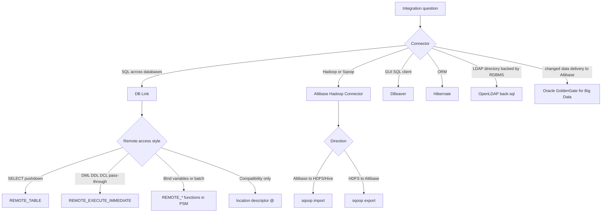
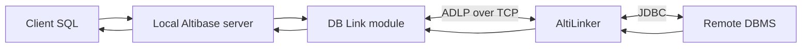
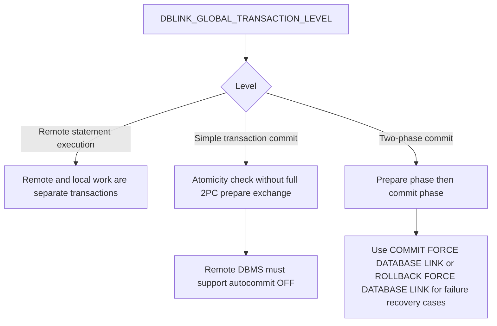
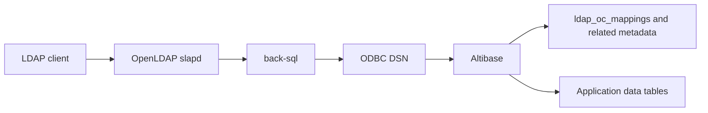

# 16. DB Link and External Connectors
## Package Role
- Provides guarded DB Link, AltiLinker, Hadoop Connector, DBeaver, Hibernate, OpenLDAP, GoldenGate JDBC Handler, CDC handoff, and external connector routes.
- Use it for remote SQL, heterogeneous link configuration, connector setup, JDBC Handler properties, Sqoop import/export, connector TLS boundaries, and third-party integration checks.
- Route generic JDBC application setup to `11_java_jdbc_spring.md`, replication and CDC operations to `09_replication_ha_cdc.md`, security and TLS certificate work to `18_security_ssl_tls.md`, and Tableau/NiFi to `19_spatial_nifi_tableau_misc.md`.
## Applicable Versions And Authority
- 7.1: Based on Korean authoritative DB Link, Hadoop Connector, SSL/TLS, replication, and third-party connector routes.
- 7.3: Based on Korean authoritative DB Link, Hadoop Connector, Log Analyzer, replication, and connector routes.
- 8.1: Based on Altibase 8.1 verified source DB Link, Hadoop Connector, JDBC, SSL/TLS, Log Analyzer, replication, and selected third-party connector routes.
- Production connector claims require exact product version, connector/tool version, driver version, Java version, remote DBMS, host and port map, transaction level, runtime output, third-party configuration, TLS mode, firewall context, and rollback or disable plan.
## Questions This File Can Answer
- How should DB Link and `AltiLinker` be configured, monitored, and used?
- Which `REMOTE_TABLE`, `REMOTE_EXECUTE_IMMEDIATE`, and PSM remote-function boundaries apply?
- How should the Altibase Hadoop Connector be installed and used with Sqoop?
- How should DBeaver, Hibernate, OpenLDAP `back-sql`, and Oracle GoldenGate for Big Data JDBC Handler connect to Altibase?
- When should a connector answer stop and route to CDC, TLS, replication, or third-party product documentation?
## Retrieval Alias Index
- Aliases and customer wording: DB Link, database link, `AltiLinker`, remote database, Hadoop Connector, Sqoop, DBeaver, Hibernate, OpenLDAP `back-sql`, GoldenGate JDBC Handler, external connector, connector TLS, CDC connector boundary.
- Exact-token anchors: `DBLINK_ENABLE`, `ALTILINKER_ENABLE`, `ALTILINKER_PORT_NO`, `V$DBLINK_ALTILINKER_STATUS`, `V$DBLINK_DATABASE_LINK_INFO`, `REMOTE_TABLE`, `REMOTE_EXECUTE_IMMEDIATE`, `binding`, `sqoop import`, `sqoop export`, `--connection-manager com.altibase.sqoop.manager.AltibaseManager`, `AltibaseDialect`, `Altibase.jdbc.driver.AltibaseDriver`, `XLog Sender`, `Log Analysis API`, `FOR ANALYSIS`, `ALA_FAILURE`, `SSL_PORT_NO`, `REPLICATION_SSL_PORT_NO`, `gg.handler.jdbcwriter.DriverClass`.
- Focused routing anchors: DB Link SQL routes to `REMOTE_TABLE`, `REMOTE_EXECUTE_IMMEDIATE`, and `REMOTE_*`; Hadoop routes to `altibase_sqoop14_connector.jar`, `sqoop import`, `sqoop export`, `BLOB`, and `CLOB`; CDC routes to Log Analyzer and replication evidence; TLS routes to ordinary client TLS versus replication SSL boundaries.
## Source Routes
Use these source-boundary routes for source-backed synthesis. Recheck the exact source ID and source-pack block before item-level production claims.

- DB Link and Hadoop Connector Korean authoritative routes: `SRC-000053/BLOCK-000494`, `SRC-000059/BLOCK-000495`, `SRC-000117/BLOCK-000498`, `SRC-000123/BLOCK-000499`, `SRC-000177/BLOCK-000502`, and `SRC-000183/BLOCK-000503`.
- DB Link and Hadoop Connector tool-manual routes: `SRC-000207/BLOCK-000507` and `SRC-000221/BLOCK-000505`.
- Third-party connector route: `SRC-000011/BLOCK-000922` for DBeaver, OpenLDAP, GoldenGate, and other selected connector guidance.
- JDBC, TLS, Log Analyzer, replication, and Replication Manager support routes: `SRC-000185/BLOCK-000561`, `SRC-000175/BLOCK-000855`, `SRC-000186/BLOCK-000568`, `SRC-000192/BLOCK-000849`, `SRC-000211/BLOCK-000843`, and `SRC-000466/BLOCK-000841`.
- Release-note and Java compatibility routes: `SRC-000452/BLOCK-000826` and `SRC-000473/BLOCK-000562`.
- Exact product version, connector/tool version, runtime output, source/target schema, cluster state, third-party configuration, patch level, and protected-operation claims must be rechecked against the target-version source route and customer evidence.
- AID-derived support is not a separate upload file; preserve Korean-source-verified, link-validated, English-only, and source-limitation labels whenever exact AID evidence is used.
- Internal baseline, playbook, guardrail, job, and local-path identifiers stay outside this upload Markdown.
## Task And Playbook Routing
- DB Link route: require local Altibase version, remote DBMS and version, `AltiLinker` host, Java runtime, remote JDBC driver, `altibase.properties`, `dblink.conf`, transaction level, privileges, and status-view output.
- Connector route: require connector/tool version, JDBC or ODBC driver version, third-party product version, classpath or library path, connection URL, credentials policy, SSL/TLS requirement, firewall context, and runtime output.
- CDC handoff route: preserve XLog Sender, XLog Collector, Log Analysis API, Replication Manager, and replication state evidence before diagnosing CDC or apply behavior.
- Third-party product boundary: provide Altibase-side properties and validation, then ask for third-party configuration and route product-specific setup to the vendor documentation when the selected sources stop.
- Generated-test coverage remains deferred; include connection validation and cleanup checks without claiming a complete customer-facing test-generation playbook.
## Answer-Ready Reference
The reference below preserves the validated answer-ready content for this topic. Section headings are nested so the package-level routing sections above remain the top-level retrieval contract.

### Applicable Versions

- 7.1: Based on Altibase 7.1 DB Link, Altibase Hadoop Connector guidance, and third-party connector guidance where the guide states an Altibase 7.1 or later baseline.
- 7.3: Based on Altibase 7.3 DB Link, Altibase Hadoop Connector, and third-party connector guidance.
- 8.1: Based on Altibase 8.1 verified source DB Link, Altibase Hadoop Connector, and third-party connector guidance.
- Property details: DB Link server properties use the Korean General Reference for 7.1, 7.3, and Altibase 8.1 verified source; `AltiLinker` properties use the Korean DB Link manuals.

### Questions This File Can Answer

- How should `DB Link` be enabled, configured, monitored, and used?
- Which `DB Link` SQL syntax, properties, performance views, and remote access methods matter?
- Which JDBC and Altibase data types are supported through `DB Link`?
- How is the Altibase Hadoop Connector installed and used with Sqoop?
- Which Altibase data types can the Hadoop Connector import or export?
- How should DBeaver connect to Altibase, and how are common DBeaver issues handled?
- How should Hibernate use `AltibaseDialect` and the Altibase JDBC driver?
- How does OpenLDAP `back-sql` connect to Altibase through ODBC metadata mapping?
- How should Oracle GoldenGate for Big Data target Altibase through its JDBC Handler?

### Retrieval Alias Index

Use this compact index before scanning DB Link and connector sections. It is intentionally redundant with later headings so lexical retrieval can land on the exact DB Link, AltiLinker, Hadoop, DBeaver, Hibernate, OpenLDAP, GoldenGate, CDC, or TLS boundary block.

- Aliases and customer wording: DB Link, database link, AltiLinker, remote database, Hadoop Connector, Sqoop, DBeaver, Hibernate, OpenLDAP back-sql, GoldenGate JDBC Handler, external connector, connector TLS, CDC connector boundary.
- Exact-token anchors: `DBLINK_ENABLE`, `ALTILINKER_ENABLE`, `ALTILINKER_PORT_NO`, `AltiLinker`, `V$DBLINK_ALTILINKER_STATUS`, `V$DBLINK_DATABASE_LINK_INFO`, `REMOTE_TABLE`, `REMOTE_EXECUTE_IMMEDIATE`, `binding`, `sqoop import`, `sqoop export`, `--connection-manager com.altibase.sqoop.manager.AltibaseManager`, `Altibase Hadoop Connector`, `Java 6`, `Java 7`, `Java 8`, `Java 9 ~ Java 10`, `Java 11`, `Java 12`, `Java 17`, `Java 18`, `AltibaseDialect`, `Altibase.jdbc.driver.AltibaseDriver`, `DB Connections`, `Replication Pairs`, `FOR ANALYSIS`, `XLog Sender`, `Log Analysis API`, `ALA_FAILURE`, `Autocommit`, `SSL_PORT_NO`, `REPLICATION_SSL_PORT_NO`, `ReplicationManager_1.4.0-win32.win32.x86.zip`, `ReplicationManager_1.4.0-linux.gtk.x86.zip`, `gg.handler.jdbcwriter.DriverClass`.
- Focused routing anchors: Hadoop Connector questions route to `Exact block: Altibase Hadoop Connector with Sqoop` and must keep `Hadoop 1.0`, `Sqoop 1.4.4`, `altibase_sqoop14_connector.jar`, `--connection-manager`, `com.altibase.sqoop.manager.AltibaseManager`, `sqoop import`, `sqoop export`, `BLOB`, and `CLOB`; DB Link character conversion questions route to the `TARGETS/NLS_BYTE_PER_CHAR` block and must keep `REMOTE_TABLE`, `REMOTE_TABLE_STORE`, `CHAR`, `VARCHAR`, and `BYTE`; DB Link parameter-marker questions route to `Exact block: REMOTE_TABLE and binding boundary` and must keep `binding`; connector CDC questions route to the `CDC and TLS boundary block`.
- Answer route: use this file for connector workflow and DB Link; use `11_java_jdbc_spring.md` for generic JDBC URL and framework properties; use `18_security_ssl_tls.md` for TLS setup; use `09_replication_ha_cdc.md` for CDC/Log Analyzer and Replication Manager operations.
- Missing-input trigger: ask for Altibase version, remote DBMS, JDBC driver version, Java version, target host and port, transaction level, connector version, SSL/TLS requirement, and firewall context before production integration commands.

### Source Documents

- 7.1: Altibase 7.1 DB Link User's Manual; Hadoop Connector User's Manual; Altibase 7.1 General Reference; Korean Altibase 3rd Party Connector Guide for 7.1-or-later and GoldenGate baseline statements.
- 7.3: Altibase 7.3 DB Link User's Manual; Hadoop Connector User's Manual; Altibase 7.3 General Reference; Altibase 3rd Party Connector Guide, including Korean GoldenGate source.
- 8.1: Altibase 8.1 verified source DB Link User's Manual; Hadoop Connector User's Manual; General Reference; Altibase 3rd Party Connector Guide, including Korean GoldenGate source and release-note `altiEncrypt` guidance.

### Response Rules

- Answer explanatory text in the user's language.
- Keep SQL object names, SQL syntax, connector names, class names, property names, command options, file names, paths, and error codes literal.
- For 8.1-specific statements, say `Altibase 8.1 verified source`.
- Do not expose internal source labels, repository paths, workstation paths, or source-image names in customer answers.
- Ask for Altibase version, remote DBMS, JDBC driver version, Java version, target host and port, transaction level, connector version, and network/firewall context before giving production-ready integration commands.
- Treat sample accounts such as `SYS` and `MANAGER` as placeholders. Advise users to use least-privilege accounts and protected secret handling.
- For SSL/TLS, truststores, certificate verification, and ciphers, use `11_java_jdbc_spring.md` and `18_security_ssl_tls.md` for Altibase JDBC/SSL parameter names. This attachment gives connector workflow context and should not invent connector-specific TLS placement unless the connector accepts the documented Altibase JDBC URL or properties.
- For CDC, XLog, Log Analyzer, or Replication Manager questions, route the operational answer to `09_replication_ha_cdc.md`. Preserve `XLog Sender`, `XLog Collector`, `Log Analysis API`, `FOR ANALYSIS`, `ALA_FAILURE`, `Replication Manager`, `DB Connections`, `Replication Pairs`, `Map`, and `Properties` as literal tokens when those tools are involved.
- For generic JDBC URL attributes, Spring Boot, and Hibernate application code, cross-reference the Java/JDBC/Spring attachment.
- GoldenGate scope is limited to Altibase as the target database through the Oracle GoldenGate for Big Data JDBC Handler. Do not provide Oracle GoldenGate or Oracle GoldenGate for Big Data installation and product-level configuration steps beyond the Altibase JDBC Handler properties shown here; the source says to use the Oracle GoldenGate product manuals for that material.
- For passwords in `dblink.conf`, use protected file permissions and secret handling. In Altibase 8.1 verified source, release notes say passwords encrypted with `altiEncrypt` can be used in `aku`, `dblink`, and Adapter configuration files; do not claim that behavior for 7.1 or 7.3 without an exact patch source.

CDC and TLS boundary block:

- `Log Analyzer` CDC is not a generic external connector setting. Create the Altibase-side XLog Sender with `CREATE REPLICATION ... FOR ANALYSIS`, start the external XLog Collector first, then use the `Log Analysis API` flow from `09_replication_ha_cdc.md`.
- If an external adapter consumes Altibase changes through Log Analyzer, the collector listen endpoint is the adapter or application port; do not substitute `SSL_PORT_NO`, `REPLICATION_SSL_PORT_NO`, or a DB Link port unless the source for that adapter says so.
- If the CDC question is about API failure or apply behavior, preserve `ALA_FAILURE`, `ALA_ErrorMgr`, `ALA_GetErrorCode`, `ALA_GetErrorLevel`, `ALA_GetErrorMessage`, and `Autocommit`, then route the operational answer to the Log Analyzer blocks in `09_replication_ha_cdc.md`.
- If the connector question is actually replication network diagnosis, preserve `v$repreceiver`, `sendq`, `recvq`, `tcpdump`, `wireshark`, and `TCP Dup ACK`, then route the evidence checklist to `09_replication_ha_cdc.md` instead of DB Link or connector setup.
- Connector TLS answers must distinguish the ordinary Altibase JDBC/ODBC/CLI TLS surface from replication SSL. Ordinary client TLS uses `SSL_PORT_NO` and client properties such as `ssl_enable`, `truststore_url`, `SSL_VERIFY`, or certificate paths; Altibase 8.1 verified source replication SSL uses `REPLICATION_SSL_PORT_NO` and `USING SSL`.
- Before combining connector, CDC, and TLS guidance, ask for the exact Altibase version, adapter/tool name and version, JDBC or ODBC/CLI driver version, host and port map, certificate mode, and whether the change stream is Log Analyzer CDC or table-to-table replication.

### J017 DB Link And Connector Exact Answer Blocks

Use these blocks when a DB Link, Hadoop Connector, or third-party connector answer needs
literal function, command, and direction tokens.

Exact block: `REMOTE_TABLE` versus `REMOTE_EXECUTE_IMMEDIATE`

- Version scope: 7.1, 7.3, and Altibase 8.1 verified source DB Link guides.
- `REMOTE_TABLE` is used in the `FROM` clause of a local `SELECT` statement and sends a
  remote `SELECT` to the remote server.
- `REMOTE_TABLE` can specify only a `SELECT` statement.
- `REMOTE_TABLE` cannot be used with SQL containing a `parameter marker` for `binding`.
- `REMOTE_EXECUTE_IMMEDIATE` executes remote SQL through a database link for supported
  `DML`, `DDL`, and `DCL` other than `SELECT`.
- `REMOTE_EXECUTE_IMMEDIATE` also cannot execute SQL with a `parameter marker` for
  `binding`.
- When `binding` is required, use the documented `REMOTE_*` functions inside PSM in the
  required call order instead of `REMOTE_TABLE` or `REMOTE_EXECUTE_IMMEDIATE`.

Exact block: Altibase Hadoop Connector with Sqoop

- Version scope: Hadoop Connector guide baseline; apply production support only after
  checking the installed connector package.
- Required baseline pieces: Hadoop 1.0, Sqoop 1.4.4 or later, the Altibase JDBC driver,
  and `altibase_sqoop14_connector.jar` copied into `$SQOOP_HOME/lib`.
- Required Sqoop option: `--connection-manager com.altibase.sqoop.manager.AltibaseManager`.
- `sqoop import` moves Altibase table data into HDFS or Hive targets.
- `sqoop export` moves HDFS data into an Altibase table.
- Direction limit: `BLOB` and `CLOB` are supported for import, but not for export, in
  the source baseline.

Exact block: Altibase Hadoop Connector Java compatibility

- Version scope: supplemental Java compatibility material for `Altibase Hadoop Connector`; use together with the connector manual's broader `JRE`/`JDK` 1.6-or-later requirement.
- Compatibility-tested Java versions: `Java 6`, `Java 7`, `Java 8`, and `Java 9 ~ Java 10`.
- Untested Java versions in the source table: `Java 11`, `Java 12`, `Java 17`, and `Java 18`.
- Answer rule: do not expand the broad `JRE` or `JDK` 1.6-or-later requirement into tested Java 11, Java 12, Java 17, or Java 18 support. Ask for the exact connector package, Sqoop version, Hadoop version, Altibase JDBC driver, `java -version`, and non-production `sqoop list-tables` or `sqoop import` output before production guidance.

### Fast Decision Map



### Version Differences

Version block: 7.1

- `DB Link` and Altibase Hadoop Connector behavior is materially the same as the 7.3 source except for documentation wording.
- `DB Link` requires `DBLINK_ENABLE=1` in `altibase.properties` and `ALTILINKER_ENABLE=1` in `dblink.conf` for heterogeneous links.
- `CREATE DATABASE LINK IF NOT EXISTS` and `DROP DATABASE LINK IF EXISTS` are not documented in the 7.1 DB Link source.
- Hadoop Connector requirements are `JRE` or `JDK` 1.6 or later, Hadoop 1.0, Sqoop 1.4.4 or later, and Altibase 5.0 or later.
- For DBeaver, the third-party connector guide states compatibility with Altibase Server 7.1.0 and later.
- For Hibernate 6.4 Spring guidance, the dedicated Spring guide uses Altibase server 7.1.0.9.3 or later and Altibase JDBC driver 7.1.0.9.0 or later. With the 7.1 JDBC driver, add `lob_null_select=off` when Hibernate LOB features are used.
- Oracle GoldenGate source guidance is based on a tested baseline of Oracle Database 12.2.0.1.0, Oracle GoldenGate 12.3.0.1.4, Oracle GoldenGate for Big Data 12.3.2.1, and Altibase 7.1.0.4.6.

Version block: 7.3

- `DB Link` and Hadoop Connector behavior is stable from 7.1 for the covered procedures.
- Third-party connector guidance covers DBeaver, OpenLDAP, and Oracle GoldenGate; the 8.1 verified source adds a concise Hibernate connector chapter.
- For Hibernate 6.4 Spring guidance, the Altibase JDBC driver is available from Maven Central starting with Altibase 7.3.0.0.2, and `lob_null_select` defaults to `off`.

Version block: 8.1

- Use the wording `Altibase 8.1 verified source` for 8.1-specific DB Link and connector statements.
- `CREATE DATABASE LINK` supports `IF NOT EXISTS` in the Altibase 8.1 verified source.
- `DROP DATABASE LINK` supports `IF EXISTS` in the Altibase 8.1 verified source.
- The Altibase 8.1 verified source release notes say `altiEncrypt`-encrypted passwords can be used in `dblink` configuration files.
- The Altibase 8.1 verified source keeps the same DB Link architecture, AltiLinker configuration model, Hadoop Connector command model, and DBeaver/OpenLDAP connector guidance unless otherwise stated.
- The Altibase 8.1 verified source third-party connector guide includes Hibernate connector guidance for `AltibaseDialect` and Oracle GoldenGate for Big Data JDBC Handler guidance for Altibase as the target database.

### Connector Block Format

Each connector block uses these fields:

- Purpose: what the connector does.
- When to Use: the practical integration scenario.
- Required Pieces: software, drivers, services, properties, or accounts.
- Setup: concise procedure or syntax.
- Cautions: support limits, version sensitivity, or common mistakes.
- Verification: how to confirm the connector is working.

### Connector Block: `DB Link`

Purpose: `DB Link` lets an Altibase local server execute SQL against a remote Altibase or heterogeneous database server through a database link object.

When to Use:

- Query remote tables or views from Altibase SQL.
- Push a whole `SELECT` to a remote server with `REMOTE_TABLE`.
- Execute remote DML, DDL, or DCL with `REMOTE_EXECUTE_IMMEDIATE`.
- Use PSM `REMOTE_*` functions when bind variables or batch execution are required.

Required Pieces:

- Local Altibase server.
- Remote database server reachable from the local server host.
- `AltiLinker` process for DB Link access in the 7.1, 7.3, and Altibase 8.1 verified source target set.
- Remote DBMS JDBC driver installed on the same host where `AltiLinker` runs.
- `JRE` compatible with `AltiLinker` and the remote JDBC driver.
- `altibase.properties` and `dblink.conf` configured.
- `CREATE DATABASE LINK` privilege for link creation; `DROP DATABASE LINK` privilege for link deletion.

DB Link Java compatibility note:

- Altibase 7.1 DB Link is listed for Java 5 through Java 17-21. Java 9 or later requires Altibase 7.1.0.2.5 or later.
- Altibase 7.3 DB Link is listed for Java 8 through Java 17-21; Java 5, Java 6, and Java 7 are not supported for DB Link.
- Altibase 8.1 verified source uses Java SE 1.8 examples for DB Link, and `AltiLinker` requires JRE 1.8 or later. Altibase 8.1 release notes state JDK 1.8 or later compatibility. Also match the remote JDBC driver's Java requirement.

DB Link architecture:



Core process:

1. The user submits SQL to the local Altibase server.
2. The local query processor parses the SQL and prepares remote work.
3. The DB Link module sends remote requests to `AltiLinker` through ADLP over TCP.
4. `AltiLinker` executes the request against the remote DBMS through JDBC.
5. The remote DBMS returns results to `AltiLinker`.
6. `AltiLinker` returns results to the local server, and the local server converts and uses the data.

Link types:

- Homogeneous Link: historical same-protocol Altibase-to-Altibase path that bypasses `AltiLinker`. Altibase 6.5.1 or later does not support Homogeneous Link, so do not plan it for Altibase 7.1, 7.3, or Altibase 8.1 verified source.
- Heterogeneous Link: documented path for the current target versions. It uses `AltiLinker` and JDBC for heterogeneous DBMSs and for Altibase remote servers, including same-version Altibase links in the 7.1, 7.3, and Altibase 8.1 verified source target set.

Setup:

1. Install a compatible `JRE` on the local server host, using the DB Link Java compatibility note above.
2. Install the remote DBMS JDBC driver on the local server host where `AltiLinker` runs.
3. Set Java environment variables, for example:

```sh
export JAVA_HOME=<jre_home>
export CLASSPATH=${JAVA_HOME}/lib:${CLASSPATH}
export PATH=${JAVA_HOME}/bin:${PATH}
```

4. In `altibase.properties`, set:

```properties
DBLINK_ENABLE = 1
```

5. In `$ALTIBASE_HOME/conf/dblink.conf`, set `ALTILINKER_ENABLE`, `ALTILINKER_PORT_NO`, and at least one `TARGETS` entry:

```properties
ALTILINKER_ENABLE = 1
ALTILINKER_PORT_NO = 23238

TARGETS = (
  (
    NAME = "alti_remote"
    JDBC_DRIVER = "$ALTIBASE_HOME/lib/Altibase.jar"
    CONNECTION_URL = "jdbc:Altibase://remote-host:20300/mydb"
    USER = "remote_user"
    PASSWORD = "remote_password"
    XADATASOURCE_CLASS_NAME = "Altibase.jdbc.driver.AltibaseXADataSource"
    XADATASOURCE_URL_SETTER_NAME = "setURL"
    NLS_BYTE_PER_CHAR = 1
  )
)
```

6. Restart the Altibase server, or start `AltiLinker` in `SYSDBA` mode:

```sql
ALTER DATABASE LINKER START;
```

7. Create a database link object:

```sql
CREATE PRIVATE DATABASE LINK link1
CONNECT TO remote_user IDENTIFIED BY remote_password
USING alti_remote;
```

Cautions:

- `AltiLinker` runs on the same server as the local Altibase server.
- The remote JDBC driver is mandatory for heterogeneous links.
- `JDBC_DRIVER` and `CONNECTION_URL` are mandatory in each `TARGETS` entry.
- `USER` and `PASSWORD` in `CREATE DATABASE LINK` take priority over `USER` and `PASSWORD` in `dblink.conf`.
- If user names or passwords are case-sensitive or contain special characters, quote them in `CREATE DATABASE LINK`.
- A database link object targets exactly one remote server.
- `PRIVATE` links are usable by the creator and `SYS`; `PUBLIC` links are usable by all users, but only the creator or `SYS` can drop them.
- Set `TARGETS/NLS_BYTE_PER_CHAR` deliberately for remote `CHAR` and `VARCHAR` columns. Default is `0`; the documented range is `0` to `3`; use `1` when the remote server is Altibase or the remote `CHAR`/`VARCHAR` length unit is `BYTE`.
- If the local character set uses two or more bytes per character, an incorrect `TARGETS/NLS_BYTE_PER_CHAR` setting can cause conversion-size errors when `REMOTE_TABLE` or `REMOTE_TABLE_STORE` reads remote `CHAR`/`VARCHAR` data, or when cursor logic inserts remote `CHAR`/`VARCHAR` data into the local server.

Verification:

```sql
SELECT * FROM V$DBLINK_ALTILINKER_STATUS;
SELECT * FROM V$DBLINK_DATABASE_LINK_INFO;
SELECT * FROM REMOTE_TABLE(link1, 'select 1 from dual');
```

### DB Link Syntax

Compact syntax for 7.1 and 7.3:

```text
CREATE [PUBLIC | PRIVATE] DATABASE LINK dblink_name
  CONNECT TO user_id IDENTIFIED BY password
  USING target_name;

DROP [PUBLIC | PRIVATE] DATABASE LINK dblink_name;
```

Compact syntax for Altibase 8.1 verified source:

```text
CREATE [PUBLIC | PRIVATE] DATABASE LINK [IF NOT EXISTS] dblink_name
  CONNECT TO user_id IDENTIFIED BY password
  USING target_name;

DROP [PUBLIC | PRIVATE] DATABASE LINK [IF EXISTS] dblink_name;
```

Common DB Link control syntax:

```text
ALTER DATABASE LINKER { START | STOP | STOP FORCE | DUMP };

ALTER SESSION CLOSE DATABASE LINK { ALL | dblink_name };

COMMIT FORCE DATABASE LINK;

ROLLBACK FORCE DATABASE LINK;
```

`ALTER DATABASE LINKER` notes:

- `START`: starts `AltiLinker` when no `AltiLinker` process is running.
- `STOP`: stops `AltiLinker` only when no transaction is using DB Link.
- `STOP FORCE`: stops `AltiLinker` even if a transaction is using DB Link.
- `DUMP`: writes current `AltiLinker` thread operations to `$ALTIBASE_HOME/trc/altibase_lk_dump.log`.
- Only `SYS` in `SYSDBA` mode can run `ALTER DATABASE LINKER`.

`ALTER SESSION CLOSE DATABASE LINK` notes:

- `ALL`: closes all linker sessions for the current Altibase server.
- `dblink_name`: closes linker sessions associated with that database link.
- All users can execute this statement.

### DB Link Remote Access Methods

Method block: `REMOTE_TABLE`

- Purpose: execute a remote `SELECT` as pass-through SQL.
- Use in: `FROM` clause of a local `SELECT`.
- Syntax:

```text
REMOTE_TABLE (
  dblink_name    IN VARCHAR,
  statement_text IN VARCHAR
)
```

- Example:

```sql
SELECT *
FROM REMOTE_TABLE(link1, 'select c1, c2 from t1 where c1 = 10');
```

- Cautions: `REMOTE_TABLE` accepts only `SELECT`; it does not bind parameter markers. A remote result fetched with `REMOTE_TABLE` is stored in a memory buffer, passed to the query processor, and then discarded; if a local query needs to repeatedly access that discarded result, the remote query may be re-executed.

Method block: `REMOTE_TABLE_STORE`

- Purpose: support repeated access to a `REMOTE_TABLE` remote query result by storing the result in a disk temporary table.
- When to Use: local joins, subqueries, or other query shapes need to read the same remote result repeatedly.
- Cautions: this behavior exists to avoid repeated remote execution for the same remote result, but it uses disk temporary table space; keep the remote `SELECT` narrow and predicate-pushed where possible.

Method block: location descriptor `@`

- Purpose: compatibility style for remote table or view access.
- Example:

```sql
SELECT * FROM t1@link1;
```

- Cautions: only tables and views are accessible with `@`; only `SELECT` is executable. Queries using `@` can retrieve all remote records to the local server before filtering, which can add network, CPU, memory, and temporary I/O cost. Prefer `REMOTE_TABLE` for remote predicate pushdown.

Method block: `REMOTE_EXECUTE_IMMEDIATE`

- Purpose: execute remote DML, DDL, or DCL except `SELECT`.
- Syntax:

```text
REMOTE_EXECUTE_IMMEDIATE (
  dblink_name    IN VARCHAR,
  statement_text IN VARCHAR
);
```

- Example:

```sql
EXEC REMOTE_EXECUTE_IMMEDIATE('link1', 'create table remote_t(c1 integer)');
EXEC REMOTE_EXECUTE_IMMEDIATE('link1', 'insert into remote_t values (10)');
```

- Cautions: `SELECT` is excluded. Parameter markers cannot be bound with this procedure.

Method block: `REMOTE_*` functions with bind variables

- Purpose: execute remote SQL with parameter markers in stored procedures or stored functions.
- SELECT call order:

```text
REMOTE_ALLOC_STATEMENT
REMOTE_BIND_VARIABLE
REMOTE_EXECUTE_STATEMENT
REMOTE_NEXT_ROW
REMOTE_GET_COLUMN_VALUE_type
REMOTE_FREE_STATEMENT
```

- DML, DDL, or DCL call order:

```text
REMOTE_ALLOC_STATEMENT
REMOTE_BIND_VARIABLE
REMOTE_EXECUTE_STATEMENT
REMOTE_FREE_STATEMENT
```

- Result access functions:

```text
REMOTE_GET_COLUMN_VALUE_CHAR
REMOTE_GET_COLUMN_VALUE_VARCHAR
REMOTE_GET_COLUMN_VALUE_FLOAT
REMOTE_GET_COLUMN_VALUE_SMALLINT
REMOTE_GET_COLUMN_VALUE_INTEGER
REMOTE_GET_COLUMN_VALUE_BIGINT
REMOTE_GET_COLUMN_VALUE_REAL
REMOTE_GET_COLUMN_VALUE_DOUBLE
REMOTE_GET_COLUMN_VALUE_DATE
```

Method block: batch `REMOTE_*` functions

- Purpose: execute remote batch operations from PSM.
- Recommended call order:

```text
REMOTE_ALLOC_STATEMENT_BATCH
REMOTE_BIND_VARIABLE_BATCH
REMOTE_ADD_BATCH
REMOTE_EXECUTE_BATCH
REMOTE_GET_RESULT_COUNT_BATCH
REMOTE_GET_RESULT_BATCH
REMOTE_FREE_STATEMENT_BATCH
```

- Helper functions: `IS_ARRAY_BOUND`, `IS_FIRST_ARRAY_BOUND`, `IS_LAST_ARRAY_BOUND`.

### DB Link Remote Object Support

Remote object block: table

- `@` support: yes.
- `REMOTE_*` support: yes.
- Typical access: `REMOTE_TABLE` for `SELECT`; `REMOTE_EXECUTE_IMMEDIATE` or binding functions for DML and DDL.

Remote object block: view

- `@` support: yes.
- `REMOTE_*` support: yes.
- Typical access: `SELECT * FROM REMOTE_TABLE(link1, 'select * from v1')`.

Remote object block: index

- `@` support: no.
- `REMOTE_*` support: yes.
- Typical access: create or drop with `REMOTE_EXECUTE_IMMEDIATE`.

Remote object block: stored procedure

- `@` support: no.
- `REMOTE_*` support: yes.
- Typical access: create or call remote procedures with pass-through SQL.
- Restriction: a local stored procedure cannot declare `ROWTYPE` variables or cursors dependent on a remote server table.

Remote object block: sequence

- `@` support: no.
- `REMOTE_*` support: yes.
- Typical access: use `REMOTE_TABLE` for sequence values in `SELECT`, or `REMOTE_EXECUTE_IMMEDIATE` when a remote DML statement references the sequence.

Remote object block: queue

- `@` support: no.
- `REMOTE_*` support: yes.
- Typical access: `REMOTE_TABLE` for queue reads and `REMOTE_EXECUTE_IMMEDIATE` for enqueue statements.

Remote object block: trigger

- `@` support: no.
- `REMOTE_*` support: yes.
- Typical access: create or drop remote triggers with pass-through DDL.

Remote object block: synonym

- `@` support: no.
- `REMOTE_*` support: yes.
- Typical access: query or modify the underlying object through pass-through SQL.

Remote object block: constraint

- `@` support: no.
- `REMOTE_*` support: yes.
- Typical access: add, drop, or set constraints with pass-through SQL.

### DB Link Transaction Levels



Level block: Remote Statement Execution

- Guarantees statement execution on the remote node, not global transaction consistency.
- Local and remote statements inside one global transaction are processed as separate transactions.
- `AltiLinker` connects to the remote server with autocommit `ON` by default for this level.

Level block: Simple Transaction Commit

- Enforces atomicity between Altibase and a heterogeneous DBMS with a simpler mechanism than full 2PC.
- Requires the remote DBMS to support autocommit `OFF`.
- `AltiLinker` connects to the remote server with autocommit `OFF` by default for this level.

Level block: Two-Phase Commit

- Set `DBLINK_GLOBAL_TRANSACTION_LEVEL` to `2`.
- Prepare phase: Altibase writes a prepare log and asks `AltiLinker` to prepare participants.
- Commit phase: Altibase writes a commit log and asks `AltiLinker` to commit participants.
- Failure before prepare log: remote transactions without log trace are canceled.
- Failure after prepare log and before commit log: Altibase recovers remote transactions toward rollback.
- Failure after commit log and before end log: Altibase keeps trying to complete commit or rollback and writes the end log after completion.

### DB Link Property Blocks

Property group: `altibase.properties`

- `AUTO_REMOTE_EXEC`: DB Link-related remote execution property listed with the DB Link property set. The sampled General Reference files do not provide the same decomposed block shape as the other `DBLINK_*` properties, so ask for the exact target version and source note before changing it in production.
- `DBLINK_ENABLE`: enables DB Link. Default `0`; range `0` to `1`; read-only, single value. Set `1` before using DB Link.
- `DBLINK_GLOBAL_TRANSACTION_LEVEL`: controls remote statement execution, simple transaction commit, or two-phase commit. Default `1`; range `0` to `2`; dynamic-change capable, single value. If set to `0`, align `DBLINK_REMOTE_STATEMENT_AUTOCOMMIT` with the remote database autocommit mode. Do not change it after a global transaction starts.
- `DBLINK_RECOVERY_MAX_LOGFILE`: maximum number of DB Link distributed-transaction recovery log files. Default `0`; positive range `1` to `2^32-1`; dynamic-change capable, single value. `0` keeps recovery logs and preserves consistency; setting a positive maximum can allow checkpoint deletion before an in-doubt distributed transaction completes.
- `DBLINK_REMOTE_STATEMENT_AUTOCOMMIT`: remote database autocommit mode used when `DBLINK_GLOBAL_TRANSACTION_LEVEL=0`. Default `0`; range `0` to `1`; dynamic-change capable, single value. `0` means autocommit off; `1` means autocommit on.
- `DBLINK_REMOTE_TABLE_BUFFER_SIZE`: memory buffer in megabytes used for `REMOTE_TABLE` result storage. Default `50`; range `0` to `2^32-1`; dynamic-change capable, single value. Increase it when one remote result record is larger than the current buffer.
- `DBLINK_DATA_BUFFER_BLOCK_SIZE`: DB Link data-buffer record block size in bytes. Default `2 MBytes`; range recorded by the Korean General Reference as `0` to `29`; read-only, single value. Use with `DBLINK_DATA_BUFFER_BLOCK_COUNT` to size the DB Link data buffer.
- `DBLINK_DATA_BUFFER_BLOCK_COUNT`: initial number of DB Link data-buffer record blocks. Default `128`; range `0` to `2^12-1`; read-only, single value. Data buffer size is `DBLINK_DATA_BUFFER_BLOCK_COUNT * DBLINK_DATA_BUFFER_BLOCK_SIZE`.
- `DBLINK_DATA_BUFFER_ALLOC_RATIO`: ratio for allocating record buffers from remaining DB Link dedicated data-buffer space. Default `50`; the Korean General Reference records range `0` to `1`; read-only, single value. Verify the exact target manual before changing this because the documented default/range shape is easy to misread.
- `DBLINK_ALTILINKER_CONNECT_TIMEOUT`: maximum wait, in seconds, for the Altibase server to connect to `AltiLinker`. Default `100`; range `0` to `2^32-1`; read-only, single value.

Property change and verification pattern:

```sql
SELECT NAME, VALUE1
FROM V$PROPERTY
WHERE NAME LIKE 'DBLINK_%' OR NAME = 'AUTO_REMOTE_EXEC';
```

- Read-only DB Link properties require configuration-file change and restart planning.
- Dynamic-change DB Link properties can be changed with the supported property mechanism for the target version, but production changes still need an exact Altibase version, current value, active DB Link transactions, and rollback plan.

Property group: `dblink.conf`

- `ALTILINKER_ENABLE`: enables `AltiLinker`. Default `0`; range `0` to `1`; set `1` for DB Link.
- `ALTILINKER_PORT_NO`: TCP listen port for `AltiLinker`. Default `0`; range `1024` to `65535`; choose a port reachable from the local Altibase server and not exposed more broadly than needed.
- `ALTILINKER_RECEIVE_TIMEOUT`: maximum wait, in seconds, after the Altibase server requests work from `AltiLinker`. Default `5`; range `0` to `2^32-1`.
- `ALTILINKER_REMOTE_NODE_RECEIVE_TIMEOUT`: maximum wait, in seconds, for remote prepare, DCL, and autocommit-setting operations other than remote `SELECT`, DML, and DDL execution. Default `30`; range `0` to `2^32-1`.
- `ALTILINKER_QUERY_TIMEOUT`: maximum remote `SELECT` execution time in seconds. Default `60`; range `0` to `2^32-1`.
- `ALTILINKER_NON_QUERY_TIMEOUT`: maximum remote DML or DDL execution time in seconds. Default `60`; range `0` to `2^32-1`.
- `ALTILINKER_THREAD_COUNT`: number of `AltiLinker` threads that execute remote SQL. Default `16`; range `2` to `2^31-1`.
- `ALTILINKER_THREAD_SLEEP_TIME`: idle wait for `AltiLinker` worker threads in microseconds. Default `200`; range `1` to `2^32-1`.
- `ALTILINKER_REMOTE_NODE_SESSION_COUNT`: maximum sessions opened to a remote server. Default `64`; range `1` to `128`; usable data sessions are this value minus one control session.
- `ALTILINKER_TRACE_LOG_DIR`: trace log directory. Default `$ALTIBASE_HOME/trc`; use a writable filesystem with log-retention controls.
- `ALTILINKER_TRACE_LOG_FILE_SIZE`: maximum trace log file size. Default `10 MBytes`; range `1MB` to `2^32-1`.
- `ALTILINKER_TRACE_LOG_FILE_COUNT`: maximum number of trace log files. Default `10`; range `1` to `100`.
- `ALTILINKER_TRACE_LOGGING_LEVEL`: trace level. Default `4`; range `0` to `6`: `0` none, `1` FATAL, `2` ERROR, `3` WARNING, `4` INFO, `5` DEBUG, `6` TRACE.
- `ALTILINKER_JVM_BIT_DATA_MODEL_VALUE`: JVM bit model for `AltiLinker`. Default `1`; range `0` to `1`; `0` means 32-bit JVM, `1` means 64-bit JVM.
- `ALTILINKER_JVM_MEMORY_POOL_INIT_SIZE`: initial JVM memory pool for `AltiLinker`. Default `128 MBytes`; range `128MB` to `4096MB`.
- `ALTILINKER_JVM_MEMORY_POOL_MAX_SIZE`: maximum JVM memory pool for `AltiLinker`. Default `4096 MBytes`; range `512MB` to `32768MB`.

Property group: `TARGETS`

- `TARGETS/NAME`: logical remote target name referenced by `CREATE DATABASE LINK ... USING target_name`.
- `TARGETS/JDBC_DRIVER`: path to the remote DBMS JDBC driver.
- `TARGETS/JDBC_DRIVER_CLASS_NAME`: JDBC driver class name; optional when the driver implements `java.sql.Driver` and can be loaded automatically.
- `TARGETS/CONNECTION_URL`: JDBC URL for the remote database.
- `TARGETS/USER`: remote database user.
- `TARGETS/PASSWORD`: remote database password. In Altibase 8.1 verified source, `altiEncrypt`-encrypted passwords can be used in `dblink` configuration files; for 7.1 and 7.3, do not assume this without a patch-specific source.
- `TARGETS/XADATASOURCE_CLASS_NAME`: XADataSource class name for two-phase commit support.
- `TARGETS/XADATASOURCE_URL_SETTER_NAME`: setter method for the XADataSource URL, commonly `setURL`.
- `TARGETS/NLS_BYTE_PER_CHAR`: remote `CHAR` and `VARCHAR` length-unit conversion setting. Default is `0`; the documented range is `0` to `3`; set `1` when the remote server is Altibase or the remote `CHAR`/`VARCHAR` length unit is `BYTE`.

Monitoring views:

- `V$DBLINK_ALTILINKER_STATUS`: `AltiLinker` process and JVM memory status.
- `V$DBLINK_DATABASE_LINK_INFO`: database link object information.
- `V$DBLINK_GLOBAL_TRANSACTION_INFO`: global transaction information.
- `V$DBLINK_LINKER_CONTROL_SESSION_INFO`: linker control session information.
- `V$DBLINK_LINKER_DATA_SESSION_INFO`: linker data session information.
- `V$DBLINK_LINKER_SESSION_INFO`: linker session information.
- `V$DBLINK_NOTIFIER_TRANSACTION_INFO`: notifier transaction information.
- `V$DBLINK_REMOTE_STATEMENT_INFO`: remote statement information.
- `V$DBLINK_REMOTE_TRANSACTION_INFO`: remote transaction information.
- `SYS_DATABASE_LINKS_`: DB Link metadata table.

### DB Link Data Type Support Blocks

DB Link type block: `java.sql.Types.CHAR`

- Altibase SQL type: `CHAR`.
- Standard SQL type: `CHAR`.
- Support: yes.
- Notes: supported through JDBC v3.0 mapping.

DB Link type block: `java.sql.Types.VARCHAR`

- Altibase SQL type: `VARCHAR`.
- Standard SQL type: `VARCHAR`.
- Support: yes.
- Notes: supported through JDBC v3.0 mapping.

DB Link type block: `java.sql.Types.LONGVARCHAR`

- Altibase SQL type: none.
- Standard SQL type: `LONGVARCHAR`.
- Support: no.
- Notes: use a supported character type where possible.

DB Link type block: `java.sql.Types.NCHAR`

- Altibase SQL type: `NCHAR`.
- Standard SQL type: `NCHAR`.
- Support: no.
- Notes: JDBC v4.0 type, not supported by DB Link data type mapping.

DB Link type block: `java.sql.Types.NVARCHAR`

- Altibase SQL type: `NVARCHAR`.
- Standard SQL type: `NVARCHAR`.
- Support: no.
- Notes: JDBC v4.0 type, not supported by DB Link data type mapping.

DB Link type block: `java.sql.Types.LONGNVARCHAR`

- Altibase SQL type: none.
- Standard SQL type: `LONGNVARCHAR`.
- Support: no.
- Notes: JDBC v4.0 type, not supported by DB Link data type mapping.

DB Link type block: `java.sql.Types.NUMERIC`

- Altibase SQL type: `NUMERIC`.
- Standard SQL type: `NUMERIC`.
- Support: yes.
- Notes: supported through JDBC v3.0 mapping.

DB Link type block: `java.sql.Types.DECIMAL`

- Altibase SQL type: `DECIMAL`.
- Standard SQL type: `DECIMAL`.
- Support: yes.
- Notes: supported through JDBC v3.0 mapping.

DB Link type block: `java.sql.Types.BIT`

- Altibase SQL type: `SMALLINT`.
- Standard SQL type: `BIT`.
- Support: yes.
- Notes: standard `BIT` is mapped to `SMALLINT` because Altibase `BIT` stores a bit set rather than only one bit.

DB Link type block: Altibase `BIT` bitset

- Altibase SQL type: `BIT`.
- Standard SQL type: none.
- Support: no.
- Notes: Altibase bitset-style `BIT` is not supported through DB Link mapping.

DB Link type block: `java.sql.Types.BOOLEAN`

- Altibase SQL type: `SMALLINT`.
- Standard SQL type: `BOOLEAN`.
- Support: yes.
- Notes: Altibase does not provide a `BOOLEAN` SQL type, so DB Link maps it to `SMALLINT`. If the remote server is Altibase, `INSERT` is not possible for this type.

DB Link type block: `java.sql.Types.TINYINT`

- Altibase SQL type: `SMALLINT`.
- Standard SQL type: `TINYINT`.
- Support: yes.
- Notes: Altibase does not provide `TINYINT`, so DB Link maps it to `SMALLINT`.

DB Link type block: `java.sql.Types.SMALLINT`

- Altibase SQL type: `SMALLINT`.
- Standard SQL type: `SMALLINT`.
- Support: yes.
- Notes: supported through JDBC v3.0 mapping.

DB Link type block: `java.sql.Types.INTEGER`

- Altibase SQL type: `INTEGER`.
- Standard SQL type: `INTEGER`.
- Support: yes.
- Notes: supported through JDBC v3.0 mapping.

DB Link type block: `java.sql.Types.BIGINT`

- Altibase SQL type: `BIGINT`.
- Standard SQL type: `BIGINT`.
- Support: yes.
- Notes: supported through JDBC v3.0 mapping.

DB Link type block: `java.sql.Types.REAL`

- Altibase SQL type: `REAL`.
- Standard SQL type: `REAL`.
- Support: yes.
- Notes: supported through JDBC v3.0 mapping.

DB Link type block: `java.sql.Types.FLOAT`

- Altibase SQL type: `FLOAT`.
- Standard SQL type: `FLOAT`.
- Support: yes.
- Notes: supported through JDBC v3.0 mapping.

DB Link type block: `java.sql.Types.DOUBLE`

- Altibase SQL type: `DOUBLE`.
- Standard SQL type: `DOUBLE`.
- Support: yes.
- Notes: supported through JDBC v3.0 mapping.

DB Link type block: `java.sql.Types.BINARY`

- Altibase SQL type: `BINARY`.
- Standard SQL type: `BINARY`.
- Support: no.
- Notes: if the remote server is Altibase, `INSERT` is not possible for this type.

DB Link type block: `java.sql.Types.VARBINARY`

- Altibase SQL type: none.
- Standard SQL type: `VARBINARY`.
- Support: no.
- Notes: not supported by DB Link data type mapping.

DB Link type block: `java.sql.Types.LONGVARBINARY`

- Altibase SQL type: none.
- Standard SQL type: `LONGVARBINARY`.
- Support: no.
- Notes: not supported by DB Link data type mapping.

DB Link type block: `java.sql.Types.DATE`

- Altibase SQL type: `DATE`.
- Standard SQL type: `DATE`.
- Support: yes.
- Notes: if the year value is B.C., Altibase processes it as `0`.

DB Link type block: `java.sql.Types.TIME`

- Altibase SQL type: `DATE`.
- Standard SQL type: `TIME`.
- Support: yes.
- Notes: remote timestamp precision finer than microseconds is converted to Altibase microsecond precision.

DB Link type block: `java.sql.Types.TIMESTAMP`

- Altibase SQL type: `DATE`.
- Standard SQL type: `TIMESTAMP`.
- Support: yes.
- Notes: remote timestamp precision finer than microseconds is converted to Altibase microsecond precision. If the year value is B.C., Altibase processes it as `0`.

DB Link type block: `java.sql.Types.CLOB`

- Altibase SQL type: `CLOB`.
- Standard SQL type: `CLOB`.
- Support: no.
- Notes: not supported by DB Link data type mapping.

DB Link type block: `java.sql.Types.NCLOB`

- Altibase SQL type: none.
- Standard SQL type: `NCLOB`.
- Support: no.
- Notes: JDBC v4.0 type, not supported by DB Link data type mapping.

DB Link type block: `java.sql.Types.BLOB`

- Altibase SQL type: `BLOB`.
- Standard SQL type: `BLOB`.
- Support: no.
- Notes: not supported by DB Link data type mapping.

DB Link type block: `java.sql.Types.ARRAY`

- Altibase SQL type: none.
- Standard SQL type: none.
- Support: no.
- Notes: not supported by DB Link data type mapping.

DB Link type block: `java.sql.Types.DISTINCT`

- Altibase SQL type: none.
- Standard SQL type: none.
- Support: no.
- Notes: not supported by DB Link data type mapping.

DB Link type block: `java.sql.Types.STRUCT`

- Altibase SQL type: none.
- Standard SQL type: none.
- Support: no.
- Notes: not supported by DB Link data type mapping.

DB Link type block: `java.sql.Types.REF`

- Altibase SQL type: none.
- Standard SQL type: none.
- Support: no.
- Notes: not supported by DB Link data type mapping.

DB Link type block: `java.sql.Types.DATALINK`

- Altibase SQL type: none.
- Standard SQL type: none.
- Support: no.
- Notes: not supported by DB Link data type mapping.

DB Link type block: `java.sql.Types.JAVA_OBJECT`

- Altibase SQL type: none.
- Standard SQL type: none.
- Support: no.
- Notes: not supported by DB Link data type mapping.

DB Link type block: Altibase `NIBBLE`

- Altibase SQL type: `NIBBLE`.
- Standard SQL type: none.
- Support: no.
- Notes: not supported by DB Link data type mapping.

DB Link type block: Altibase `VARBIT`

- Altibase SQL type: `VARBIT`.
- Standard SQL type: none.
- Support: no.
- Notes: not supported by DB Link data type mapping.

DB Link type block: Altibase `INTERVAL`

- Altibase SQL type: `INTERVAL`.
- Standard SQL type: none.
- Support: no.
- Notes: not supported by DB Link data type mapping.

### Connector Block: Altibase Hadoop Connector

Purpose: Altibase Hadoop Connector transfers data between Altibase and Hadoop through Sqoop.

When to Use:

- Import Altibase table data into HDFS as text, sequence, or Avro files.
- Import Altibase table data into Hive.
- Export HDFS data into Altibase.
- List Altibase databases or tables from a Sqoop environment.

Required Pieces:

- `JRE` or `JDK` 1.6 or later; use the Java compatibility block above before treating any Java 11 or later runtime as tested.
- Hadoop 1.0 in the source manual baseline.
- Sqoop 1.4.4 or later.
- Altibase 5.0 or later.
- Altibase JDBC driver copied to `$SQOOP_HOME/lib`.
- Altibase Hadoop Connector JAR copied to `$SQOOP_HOME/lib`.

Setup:

```sh
cp $ALTIBASE_HOME/lib/Altibase.jar $SQOOP_HOME/lib
cp altibase_sqoop14_connector.jar $SQOOP_HOME/lib
```

Connection test:

```sh
sqoop list-tables \
  --connect jdbc:Altibase://127.0.0.1:20300/mydb \
  --driver Altibase.jdbc.driver.AltibaseDriver \
  --username SYS \
  --password MANAGER \
  --connection-manager com.altibase.sqoop.manager.AltibaseManager
```

Expected success signals include log messages similar to:

```text
manager.AltibaseManager: init default option autocommit false
manager.SqlManager: Using default fetchSize of 1000
manager.AltibaseManager: Altibase manager 1.0 connector create
```

Common command syntax:

```text
sqoop <command>
  --connect jdbc:Altibase://host:port/mydb
  --driver Altibase.jdbc.driver.AltibaseDriver
  --username user
  --password password
  --connection-manager com.altibase.sqoop.manager.AltibaseManager
```

Command option block:

- `<command>`: examples covered by the source are `import`, `export`, `list-databases`, and `list-tables`.
- `--connect`: Altibase JDBC URL, for example `jdbc:Altibase://host:20300/mydb`.
- `--driver`: `Altibase.jdbc.driver.AltibaseDriver`.
- `--username`: database user.
- `--password`: database password.
- `--connection-manager`: `com.altibase.sqoop.manager.AltibaseManager`.

Import block: HDFS text file

- Purpose: import an Altibase table into an HDFS directory as text.
- Representative command:

```sh
sqoop import \
  --connect jdbc:Altibase://host:20300/mydb \
  --driver Altibase.jdbc.driver.AltibaseDriver \
  --username app_user \
  --password app_password \
  --connection-manager com.altibase.sqoop.manager.AltibaseManager \
  --table table_name \
  --split-by split_column
```

- Text delimiter options: `--enclosed-by`, `--escaped-by`, `--fields-terminated-by`, `--lines-terminated-by`, `--mysql-delimiters`, `--optionally-enclosed-by`.
- Default field separator: comma.
- Default line separator: `\n`.
- Caution: if a line separator or field separator appears in field data, enclose the field. If a quotation mark appears in field data, prefix it with an escape character.

Import block: HDFS sequence file

```sh
sqoop import \
  --connect jdbc:Altibase://host:20300/mydb \
  --driver Altibase.jdbc.driver.AltibaseDriver \
  --username app_user \
  --password app_password \
  --connection-manager com.altibase.sqoop.manager.AltibaseManager \
  --table table_name \
  --split-by split_column \
  --as-sequencefile
```

Import block: HDFS Avro file

```sh
sqoop import \
  --connect jdbc:Altibase://host:20300/mydb \
  --driver Altibase.jdbc.driver.AltibaseDriver \
  --username app_user \
  --password app_password \
  --connection-manager com.altibase.sqoop.manager.AltibaseManager \
  --table table_name \
  --split-by split_column \
  --as-avrodatafile
```

Import block: query-based import

```sh
sqoop import \
  --connect jdbc:Altibase://host:20300/mydb \
  --driver Altibase.jdbc.driver.AltibaseDriver \
  --username app_user \
  --password app_password \
  --connection-manager com.altibase.sqoop.manager.AltibaseManager \
  --table table_name \
  --split-by split_column \
  --boundary-query query_text
```

Import block: Hive

```sh
sqoop import \
  --connect jdbc:Altibase://host:20300/mydb \
  --driver Altibase.jdbc.driver.AltibaseDriver \
  --username app_user \
  --password app_password \
  --connection-manager com.altibase.sqoop.manager.AltibaseManager \
  --table table_name \
  --split-by split_column \
  --hive-import
```

Export block: insert HDFS data into Altibase

```sh
sqoop export \
  -D sqoop.export.records.per.statement=100 \
  --connect jdbc:Altibase://host:20300/mydb \
  --driver Altibase.jdbc.driver.AltibaseDriver \
  --username app_user \
  --password app_password \
  --connection-manager com.altibase.sqoop.manager.AltibaseManager \
  --table table_name \
  --export-dir hdfs_dir
```

Export block: batch insert

```sh
sqoop export \
  --connect jdbc:Altibase://host:20300/mydb \
  --driver Altibase.jdbc.driver.AltibaseDriver \
  --username app_user \
  --password app_password \
  --connection-manager com.altibase.sqoop.manager.AltibaseManager \
  --table table_name \
  --export-dir hdfs_dir \
  --batch
```

- Caution: the connector runs in batch mode and inserts 100 records by default per execute operation. To disable batch mode, set `-D sqoop.export.records.per.statement=1`.

Export block: update existing rows

```sh
sqoop export \
  --connect jdbc:Altibase://host:20300/mydb \
  --driver Altibase.jdbc.driver.AltibaseDriver \
  --username app_user \
  --password app_password \
  --connection-manager com.altibase.sqoop.manager.AltibaseManager \
  --table table_name \
  --export-dir hdfs_dir \
  --update-key key_column
```

Export block: update or insert

```sh
sqoop export \
  --connect jdbc:Altibase://host:20300/mydb \
  --driver Altibase.jdbc.driver.AltibaseDriver \
  --username app_user \
  --password app_password \
  --connection-manager com.altibase.sqoop.manager.AltibaseManager \
  --table table_name \
  --export-dir hdfs_dir \
  --update-key key_column \
  --update-mode allowinsert
```

- Caution: this uses the Altibase `MERGE` statement and requires Altibase 6.3.1 or later.

Export block: staging table

```sh
sqoop export \
  --connect jdbc:Altibase://host:20300/mydb \
  --driver Altibase.jdbc.driver.AltibaseDriver \
  --username app_user \
  --password app_password \
  --connection-manager com.altibase.sqoop.manager.AltibaseManager \
  --table table_name \
  --export-dir hdfs_dir \
  --update-key key_column \
  --staging-table staging_table_name
```

- Purpose: reduce partial-commit risk by first loading HDFS data into a staging table, then moving it to the target table.

List commands:

```sh
sqoop list-databases \
  --connect jdbc:Altibase://host:20300/mydb \
  --driver Altibase.jdbc.driver.AltibaseDriver \
  --username app_user \
  --password app_password \
  --connection-manager com.altibase.sqoop.manager.AltibaseManager

sqoop list-tables \
  --connect jdbc:Altibase://host:20300/mydb \
  --driver Altibase.jdbc.driver.AltibaseDriver \
  --username app_user \
  --password app_password \
  --connection-manager com.altibase.sqoop.manager.AltibaseManager
```

Hadoop Connector type block: `CHAR`

- Sqoop type: `String`.
- Import: yes.
- Export: yes.

Hadoop Connector type block: `VARCHAR`

- Sqoop type: `String`.
- Import: yes.
- Export: yes.

Hadoop Connector type block: `NCHAR`

- Sqoop type: `String`.
- Import: yes.
- Export: yes.

Hadoop Connector type block: `NVARCHAR`

- Sqoop type: `String`.
- Import: yes.
- Export: yes.

Hadoop Connector type block: `INTEGER`

- Sqoop type: `Integer`.
- Import: yes.
- Export: yes.

Hadoop Connector type block: `BIGINT`

- Sqoop type: `Long`.
- Import: yes.
- Export: yes.

Hadoop Connector type block: `SMALLINT`

- Sqoop type: `Integer`.
- Import: yes.
- Export: yes.

Hadoop Connector type block: `NUMBER`

- Sqoop type: `Double`.
- Import: yes.
- Export: yes.

Hadoop Connector type block: `NUMERIC`

- Sqoop type: `java.math.BigDecimal`.
- Import: yes.
- Export: yes.

Hadoop Connector type block: `DECIMAL`

- Sqoop type: `java.math.BigDecimal`.
- Import: yes.
- Export: yes.

Hadoop Connector type block: `FLOAT`

- Sqoop type: `Double`.
- Import: yes.
- Export: yes.

Hadoop Connector type block: `DOUBLE`

- Sqoop type: `Double`.
- Import: yes.
- Export: yes.

Hadoop Connector type block: `REAL`

- Sqoop type: `Float`.
- Import: yes.
- Export: yes.

Hadoop Connector type block: `DATE`

- Sqoop type: `java.sql.Timestamp`.
- Import: yes.
- Export: yes.

Hadoop Connector type block: `BLOB`

- Sqoop type: `com.cloudera.sqoop.lib.BlobRef`.
- Import: yes.
- Export: no.
- Notes: Sqoop supports `BLOB` only for import in the source baseline.

Hadoop Connector type block: `CLOB`

- Sqoop type: `com.cloudera.sqoop.lib.ClobRef`.
- Import: yes.
- Export: no.
- Notes: Sqoop supports `CLOB` only for import in the source baseline.

### Connector Block: DBeaver

Purpose: DBeaver is a GUI SQL client. The Altibase DBeaver package or DBeaver with the Altibase JDBC driver can connect to Altibase for SQL editing, object browsing, plan viewing, and data work.

When to Use:

- A user needs an interactive SQL client for Altibase.
- A user needs to browse Altibase objects, run SQL, view plans, inspect server output, or edit data from DBeaver.

Required Pieces:

- DBeaver 23.3.3 or later.
- Altibase Server 7.1.0 or later.
- Altibase JDBC driver.
- Driver class: `Altibase.jdbc.driver.AltibaseDriver`.
- JDBC URL: `jdbc:Altibase://host:port/database`.

Connection procedure:

1. Open `Database` > `New Database Connection`.
2. Select `Altibase` from `ALL` or `SQL`, then continue.
3. Enter connection fields:
   - `Host`: Altibase host name or IP address.
   - `Port`: Altibase service port, commonly `20300`.
   - `Database/Schema`: database name, commonly `mydb`.
   - `Username`: Altibase user.
   - `Password`: Altibase password.
4. If DBeaver can access the internet, let DBeaver download the Altibase JDBC driver in the driver settings window.
5. If offline or using a local driver, open `Driver Settings`, go to `Libraries`, choose `Add File`, select the Altibase JDBC driver, add it to the classpath, then apply the settings.
6. Finish the connection and double-click it in `Database Navigator`. A successful connection shows the connection as active.

DBeaver issue block: LOB data is not retrieved

- Cause: DBeaver uses `Auto-Commit` by default; Altibase LOB retrieval requires manual transaction handling.
- Fix for the current connection: use the transaction mode selector in the SQL toolbar and choose `Manual Commit`.
- Fix for a specific connection: open `Edit Connection` or press `F4`, go to `Connection settings` > `Initialization` > `Connection`, clear `Auto-commit`, save the connection, and reconnect.
- Fix for the global default: open `Window` > `Preferences` > `Connections` > `Connection Types`, clear `Auto-commit by default`, apply the setting, and reconnect.
- Caution: in `Manual Commit`, explicitly commit or roll back table modifications.

DBeaver issue block: `SYSTEM_` schema is not visible

- Cause: DBeaver does not show system objects by default.
- Fix: enable `Connection View` > `Show system objects`, then reconnect.

DBeaver issue block: DDL output is inaccurate

- Cause: DBeaver needs Altibase `DBMS_METADATA` support for accurate object DDL.
- Fix: connect as `SYS` and install the package scripts from `$ALTIBASE_HOME/packages`:

```sh
isql -f $ALTIBASE_HOME/packages/dbms_metadata.sql
isql -f $ALTIBASE_HOME/packages/dbms_metadata.plb
```

- Verification: reconnect in DBeaver and retrieve object DDL again.

DBeaver issue block: query execution plan location

- Procedure: open the connected database's `SQL Editor` > `New SQL script`, enter the query, and click `Explain Execution Plan`.
- Default: the Altibase DBeaver plugin uses `Explain Plan Only` by default.

DBeaver issue block: use `EXPLAIN_PLAN = ON`

- Procedure: open connection properties or the SQL script panel preferences, go to `Altibase settings`, enable `Datasource settings`, then choose `Explain Plan = ON`.

DBeaver issue block: PSM `PRINTLN` server output

- Procedure: open connection properties, go to `Altibase settings`, enable `Datasource settings`, and check `Enable DBMS Output`.
- Then open the SQL script window and click `Show server output`. Output appears in the output tab after executing SQL.

DBeaver issue block: Altibase `DATE` microseconds are not visible

- Cause: DBeaver timestamp display commonly shows milliseconds, while Altibase `DATE` can represent microseconds.
- Fix option 1: `Window` > `Preferences` > `Editors` > `Data Editor` > `Data Formats` > `Datasource settings`; set the timestamp value format to include six fractional second digits, for example `yyyy-MM-dd HH:mm:ss.SSSSSS`.
- Fix option 2: in the same data format settings, enable `Disable date/time formatting`.

DBeaver issue block: `"Invalid data type length"` when modifying `CHAR`

- Cause: DBeaver Data Editor can issue `INSERT`-style changes; values longer than the column size fail.
- Fix: check the modified value length before saving, especially for fixed-length character columns.

DBeaver issue block: show binary data as Hex

- Procedure: open connection properties, go to `Editors` > `Data Editor` > `Binary data`, set the binary data formatter to `Hex`, apply, and refresh the table view.

DBeaver issue block: binary data cannot be modified in Data Editor

- Fix: enter the binary value in the Data Editor `Value` field. Editing directly in the grid cell can convert the value unexpectedly.

DBeaver issue block: `BIT`, `VARBIT`, and `NIBBLE`

- DBeaver processes binary data by byte. Since `BIT`, `VARBIT`, and `NIBBLE` can be smaller than a byte, DBeaver handles them as numeric or character types.

DBeaver issue block: reset DBeaver settings and reinstall

- Purpose: remove old DBeaver workspace data before reinstalling or rebuilding a connection profile.
- Procedure: exit DBeaver, uninstall or replace the application as needed, then remove the DBeaver workspace directory for the operating system.
- Common workspace locations:
  - Windows: `%APPDATA%\DBeaverData`.
  - macOS: `~/Library/DBeaverData/`.
  - Linux: `$XDG_DATA_HOME/DBeaverData/`, or `~/.local/share/DBeaverData/` when `$XDG_DATA_HOME` is not set.
- Verification: after reinstalling, start DBeaver and confirm that old connection profiles and driver settings are no longer present.

DBeaver issue block: set SQL Editor auto-commit off by default

- Procedure: right-click the connection and choose `Edit Connection`, or select the connection and press `F4`.
- In the connection configuration, go to `Connection settings` > `Initialization` > `Connection`.
- Clear `Auto-commit`, save the connection, and reconnect before opening a new SQL editor.
- Temporary alternative: use the SQL editor transaction mode selector to switch the active editor session from `Auto-Commit` to `Manual Commit`.
- Verification: the SQL editor opens in manual transaction mode for that connection, and table changes require an explicit commit or rollback.

### Connector Block: Hibernate

Purpose: Hibernate needs an Altibase JDBC driver and `AltibaseDialect` so that Hibernate can generate Altibase-compatible SQL.

When to Use:

- Java ORM applications use Hibernate directly.
- Spring Data JPA applications use Hibernate as the JPA provider.

Required Pieces:

- Altibase JDBC driver.
- Driver class: `Altibase.jdbc.driver.AltibaseDriver`.
- JDBC URL: `jdbc:Altibase://host:port/database`.
- `AltibaseDialect` configured in Hibernate.

Hibernate 6.4 and later:

- `AltibaseDialect` is included in `hibernate-community-dialects`.
- Add a dependency similar to:

```xml
<dependency>
  <groupId>org.hibernate.orm</groupId>
  <artifactId>hibernate-community-dialects</artifactId>
  <version>6.4.1.Final</version>
</dependency>
```

- Spring Boot property example:

```properties
spring.datasource.driver-class-name=Altibase.jdbc.driver.AltibaseDriver
spring.datasource.url=jdbc:Altibase://localhost:20300/mydb
spring.datasource.username=sys
spring.datasource.password=manager
spring.jpa.properties.hibernate.jdbc.lob.non_contextual_creation=true
```

Altibase JDBC Maven examples from the Spring Hibernate 6.4 guide:

```xml
<!-- Altibase 7.3 example -->
<dependency>
  <groupId>com.altibase</groupId>
  <artifactId>altibase-jdbc</artifactId>
  <version>7.3.0.0.2</version>
</dependency>

<!-- Altibase 7.1 example -->
<dependency>
  <groupId>com.altibase</groupId>
  <artifactId>altibase-jdbc</artifactId>
  <version>7.1.0.9.2</version>
</dependency>
```

Hibernate before 6.4:

- The official Hibernate library does not include `AltibaseDialect.class`.
- Compile and port `AltibaseDialect.java`; include `AltibaseLimitHandler.java` where the target Hibernate version requires it.
- Configure Hibernate to use the resulting `AltibaseDialect.class`.

LOB cautions:

- `spring.jpa.properties.hibernate.jdbc.lob.non_contextual_creation=true` suppresses `java.sql.SQLFeatureNotSupportedException` that can occur when Hibernate checks `Connection.createNClob()`. Altibase does not support `NClob`; the check can be safely avoided this way.
- With the Altibase 7.1 JDBC driver, add `lob_null_select=off` when Hibernate LOB features are used:

```text
jdbc:Altibase://127.0.0.1:20300/mydb?lob_null_select=off
```

- Starting with Altibase 7.3, `lob_null_select` defaults to `off`.

Verification:

- Confirm the application starts without Hibernate dialect resolution errors.
- Confirm Hibernate logs show the expected Hibernate ORM version.
- Execute a simple entity DDL or query and confirm generated SQL succeeds on Altibase.

### Connector Block: OpenLDAP `back-sql`

Purpose: OpenLDAP `back-sql` can use Altibase as an RDBMS backend repository through ODBC.

When to Use:

- LDAP entries should be backed by relational tables in Altibase.
- The integration uses OpenLDAP SQL Backend, also called `back-sql`.

Required Pieces:

- OpenLDAP built with SQL backend support.
- Altibase 6.5.1 or later is recommended by the source guide.
- Altibase ODBC driver.
- ODBC DSN configuration.
- Altibase metadata tables that map LDAP `objectClass` and `attributeType` definitions to SQL tables and columns.

OpenLDAP architecture:



OpenLDAP build procedure:

```sh
tar xvfz openldap_package.tgz
./configure --prefix=<openldap_home> --enable-sql
make depend
make
make install
```

ODBC DSN example:

```ini
[ldap_altibase]
Description = ODBC for Altibase
Driver = $ALTIBASE_HOME/lib/libaltibase_odbc-64bit-ul64.so
server = 127.0.0.1
port = 20030
```

ODBC trace example:

```ini
[ODBC]
TraceFile = $ALTIBASE_HOME/trc/odbc.log
Trace = Yes
```

`slapd.conf` SQL backend essentials:

```text
database        sql
suffix          "dc=example,dc=com"
rootdn          "cn=Manager,dc=example,dc=com"
rootpw          secret
dbname          ldap_altibase
dbuser          ldap
dbpasswd        ldap
subtree_cond    "upper(ldap_entries.dn) LIKE CONCAT('%',upper(?))"
insentry_stmt   "insert into ldap_entries (id,dn,oc_map_id,parent,keyval) values (ldap_entry_ids.nextval,?,?,?,?)"
has_ldapinfo_dn_ru  no
upper_func      UPPER
```

Metadata table block: `ldap_oc_mappings`

- Purpose: maps LDAP structural `objectClass` values to Altibase tables.
- Key columns: `ID`, `NAME`, `KEYTBL`, `KEYCOL`, `CREATE_PROC`, `CREATE_KEYVAL`, `DELETE_PROC`, `EXPECT_RETURN`.
- `NAME` must match an `objectClass` loaded in the OpenLDAP schema.
- `KEYTBL` is the table mapped to the object class.
- `KEYCOL` is the primary key column of `KEYTBL`.
- `CREATE_PROC` and `DELETE_PROC` define SQL actions used when adding or deleting entries.
- If a procedure returns a value, the output binding parameter should be placed first.

Metadata table block: `ldap_attr_mappings`

- Purpose: maps LDAP `attributeType` values to SQL expressions, tables, joins, and procedures.
- Key columns: `ID`, `OC_MAP_ID`, `NAME`, `SEL_EXPR`, `FROM_TBLS`, `JOIN_WHERE`, `ADD_PROC`, `DELETE_PROC`, `PARAM_ORDER`, `EXPECT_RETURN`.
- `OC_MAP_ID` references `ldap_oc_mappings.ID`.
- `NAME` must match an `attributeType` loaded in the OpenLDAP schema.
- `SEL_EXPR`, `FROM_TBLS`, and `JOIN_WHERE` define how the attribute is selected.
- `ADD_PROC` and `DELETE_PROC` define how attribute values are inserted or deleted.
- `PARAM_ORDER` controls whether the mapped table key value appears before or after the attribute value in procedure parameters.

Metadata table block: `ldap_entries`

- Purpose: stores the LDAP distinguished name for each entry.
- Key columns: `ID`, `DN`, `OC_MAP_ID`, `PARENT`, `KEYVAL`.
- `OC_MAP_ID` references the object-class mapping.
- `PARENT` points to the parent entry; the suffix entry has `0`.
- `KEYVAL` stores the primary key value of the mapped data row.

Metadata table block: `ldap_entry_objclasses`

- Purpose: stores auxiliary object classes for an LDAP entry.
- Key columns: `ENTRY_ID`, `NAME`.
- `ENTRY_ID` references `ldap_entries.ID`.
- `NAME` must match an auxiliary `objectClass` loaded in the OpenLDAP schema.

OpenLDAP setup checklist:

1. Create an Altibase user for LDAP metadata and data.
2. Create the OpenLDAP metadata tables.
3. Create application tables for the LDAP object classes.
4. Insert rows into `ldap_oc_mappings`, `ldap_attr_mappings`, `ldap_entries`, and `ldap_entry_objclasses`.
5. Configure `.odbc.ini`, `.odbcinst.ini`, and `slapd.conf`.
6. Start OpenLDAP and test LDAP operations.

Example user creation:

```sql
CREATE USER ldap IDENTIFIED BY '<password>';
```

Do not include `DROP USER ... CASCADE` in production setup examples. If a lab reset is required, document the destructive impact, backup requirement, and explicit operator approval outside the copy-ready setup path.

Example data-build commands:

```sh
isql -s localhost -u ldap -p ldap -f backsql_create.sql
isql -s localhost -u ldap -p ldap -f testdb_create.sql
isql -s localhost -u ldap -p ldap -f testdb_metadata.sql
isql -s localhost -u ldap -p ldap -f testdb_data.sql
```

Cautions:

- OpenLDAP `back-sql` depends on the ODBC DSN, driver bitness, library path, and Altibase user privileges.
- `slapd.conf` should not be world-readable because it can include credentials.
- Mapping values must match OpenLDAP schema names exactly.
- Validate stored procedures used in mapping tables independently in Altibase before debugging LDAP operations.

Verification:

- Confirm the ODBC DSN connects to Altibase.
- Confirm the LDAP metadata tables contain mappings for the expected `objectClass` and `attributeType` values.
- Confirm `slapd` starts without SQL backend errors.
- Run LDAP search/add/delete operations and verify corresponding Altibase table rows change as expected.

### Connector Block: Oracle GoldenGate for Big Data

Purpose: Oracle GoldenGate for Big Data can deliver source database changes to Altibase through the Generic JDBC API JDBC Handler.

When to Use:

- Use this block when Altibase is the target database for changes delivered by Oracle GoldenGate for Big Data.
- Use Oracle GoldenGate product manuals for Oracle GoldenGate and Oracle GoldenGate for Big Data installation and product-level configuration.

Required Pieces:

- Source database supported by Oracle GoldenGate.
- Oracle GoldenGate for the source database.
- Oracle GoldenGate for Big Data.
- Altibase target database.
- Altibase JDBC driver JAR in the Oracle GoldenGate for Big Data Java Adapter classpath.

Source-documented layouts:

1. `[source database + Oracle GoldenGate] / [Oracle GoldenGate for Big Data] / [Altibase]`
2. `[source database + Oracle GoldenGate + Oracle GoldenGate for Big Data] / [Altibase]`

Setup:

1. Configure Oracle GoldenGate and Oracle GoldenGate for Big Data with their product manuals.
2. Configure the Replicat properties file, for example `dirprm/rjdbc.prm`, so `TARGETDB` loads `libggjava.so` and points to the Altibase JDBC handler properties file.
3. In the `MAP` clause, double-quote the Altibase target user and table names.
4. Configure the Java Adapter properties file, for example `dirprm/jdbc_altibase.props`, with the Altibase JDBC driver, JDBC URL, Altibase user, password, classpath, Java writer, logging, report interval, and boot options.

Replicat properties shape:

```bash
TARGETDB LIBFILE libggjava.so SET property=dirprm/jdbc_altibase.props
REPORTCOUNT EVERY 1 MINUTES, RATE
GROUPTRANSOPS 1000
MAP orclpdb.ogg_test.tablea, TARGET "<ALTIBASE_USER>"."<ALTIBASE_TABLE>";
```

Java Adapter properties shape:

```properties
gg.handlerlist=jdbcwriter
gg.handler.jdbcwriter.type=jdbc
gg.handler.jdbcwriter.DriverClass=Altibase.jdbc.driver.AltibaseDriver
gg.handler.jdbcwriter.connectionURL=jdbc:Altibase://<host>:<port>/<database>
gg.handler.jdbcwriter.userName=<altibase_user>
gg.handler.jdbcwriter.password=<altibase_password>
gg.classpath=<altibase_jdbc_jar_path>
goldengate.userexit.writers=javawriter
javawriter.stats.display=TRUE
javawriter.stats.full=TRUE
gg.log=log4j
gg.log.level=INFO
gg.report.time=30sec
javawriter.bootoptions=-Xmx512m -Xms32m -Djava.class.path=.:ggjava/ggjava.jar:./dirprm
```

Cautions:

- The source-tested versions are Oracle Database 12.2.0.1.0, Oracle GoldenGate 12.3.0.1.4, Oracle GoldenGate for Big Data 12.3.2.1, and Altibase 7.1.0.4.6.
- Treat GoldenGate guidance as a tested connector baseline, not a general compatibility guarantee for all Oracle GoldenGate versions or source database types.
- The source flags Oracle-to-Altibase data type compatibility as a test result. Verify character length semantics, `VARCHAR2` or `NVARCHAR2` values larger than Altibase `VARCHAR` or `NVARCHAR` limits, `TIMESTAMP` fractional-second precision, and `NCLOB` conversion to `NVARCHAR(10666)` before production use.
- Do not reuse sample accounts or passwords. Use least-privilege Altibase target users and protected secret handling.

Verification:

- Confirm Oracle GoldenGate for Big Data can load the Java Adapter properties file and the Altibase JDBC driver.
- Confirm the JDBC URL, target user, password, and classpath are correct for the Altibase target.
- Confirm replicated rows reach the quoted Altibase target table.
- Compare values for source columns that use character-length-sensitive, timestamp, LOB, or NCLOB data types before broadening the connector mapping.

### Troubleshooting Checklist

DB Link failures:

- Check `DBLINK_ENABLE=1` in `altibase.properties`.
- Check `ALTILINKER_ENABLE=1` and `ALTILINKER_PORT_NO` in `dblink.conf`.
- Confirm `AltiLinker` is running with `V$DBLINK_ALTILINKER_STATUS`.
- Confirm the remote JDBC driver exists and matches the remote DBMS and Java runtime.
- Confirm `TARGETS/NAME`, `TARGETS/JDBC_DRIVER`, `TARGETS/CONNECTION_URL`, `TARGETS/USER`, and `TARGETS/PASSWORD`.
- Confirm the database link object exists in `V$DBLINK_DATABASE_LINK_INFO`.
- Check `ALTILINKER_TRACE_LOG_DIR` and `ALTILINKER_TRACE_LOGGING_LEVEL` for trace output.
- For transaction issues, check `DBLINK_GLOBAL_TRANSACTION_LEVEL` and the remote DBMS autocommit/XA capability.

Hadoop Connector failures:

- Confirm `$ALTIBASE_HOME/lib/Altibase.jar` is in `$SQOOP_HOME/lib`.
- Confirm `altibase_sqoop14_connector.jar` is in `$SQOOP_HOME/lib`.
- Confirm the command includes `--connection-manager com.altibase.sqoop.manager.AltibaseManager`.
- Confirm the JDBC URL, driver class, user, and password.
- For export failures, verify target table structure, delimiter handling, batch settings, and whether the data type is export-supported.
- For `BLOB` and `CLOB`, remember that the source baseline supports import only.

DBeaver failures:

- Confirm DBeaver version is 23.3.3 or later.
- Confirm the driver class is `Altibase.jdbc.driver.AltibaseDriver`.
- Confirm the URL is `jdbc:Altibase://host:port/database`.
- For LOB retrieval, use `Manual Commit`.
- For hidden system objects, enable `Show system objects`.
- For inaccurate DDL, install `DBMS_METADATA`.
- For DATE microseconds, adjust data format settings.

Hibernate failures:

- Confirm `AltibaseDialect` is available through `hibernate-community-dialects` for Hibernate 6.4 or manually ported for older Hibernate.
- Confirm the Altibase JDBC driver dependency or local JAR matches the Altibase server version.
- For Altibase 7.1 LOB behavior, add `lob_null_select=off`.
- Add `spring.jpa.properties.hibernate.jdbc.lob.non_contextual_creation=true` when Hibernate checks unsupported `NClob` creation.

OpenLDAP failures:

- Confirm OpenLDAP was built with `--enable-sql`.
- Confirm the Altibase ODBC driver and DSN work before testing LDAP.
- Confirm `dbname` in `slapd.conf` matches the ODBC DSN.
- Confirm `dbuser` and `dbpasswd` are valid Altibase credentials.
- Confirm mapping metadata uses schema names loaded in OpenLDAP.
- Enable ODBC trace only while diagnosing; turn it off when done.

Oracle GoldenGate failures:

- Confirm Oracle GoldenGate for Big Data can load `libggjava.so` and the Java Adapter properties file named by `TARGETDB`.
- Confirm `gg.handler.jdbcwriter.DriverClass`, `gg.handler.jdbcwriter.connectionURL`, `gg.handler.jdbcwriter.userName`, `gg.handler.jdbcwriter.password`, and `gg.classpath`.
- Confirm the Altibase target user and table names in the `MAP` clause are double-quoted.
- For missing, truncated, or rounded values, check the source-documented Oracle-to-Altibase data type compatibility cautions before changing connector settings.

### Attachment Cross-References

- `03_sql_ddl_generation.md`: DB Link SQL and generated object/privilege SQL when syntax details are needed.
- `06_data_dictionary_performance_views.md`: DB Link, AltiLinker, connector, session, and object verification views.
- `09_replication_ha_cdc.md`: Log Analyzer CDC, XLog Sender, XLog Collector, Replication Manager, and replication network operations.
- `11_java_jdbc_spring.md`: JDBC URL, driver class, driver JAR, connection attributes, Spring, and Hibernate application settings.
- `12_c_cli_odbc_precompiler.md`: ODBC DSN, OpenLDAP ODBC mapping, and C/ODBC diagnostic details.
- `18_security_ssl_tls.md`: ordinary client/server TLS, certificates, ciphers, truststores, and port separation.

### Residual Scope

- Connector coverage is limited to Altibase-facing setup, properties, compatibility notes, and troubleshooting. For third-party product installation, clustering, security, or non-Altibase connector behavior, use that product's documentation instead of inferring from the Altibase examples.
## Required Inputs And Stop Conditions
- Ask for product version, connector/tool version, runtime output, source/target schema, Kubernetes cluster state when the connector runs in Kubernetes, and third-party configuration before production connector commands.
- For DB Link, require remote DBMS, JDBC driver, Java runtime, local and remote host/port, transaction level, database link object definition, account privileges, TLS need, and status-view output.
- Stop before production writes, remote DDL/DCL, credential file changes, TLS cutover, CDC apply, or connector restart when logs, configuration, runtime output, backup/rollback, or third-party product evidence is missing.
## Validation And Rollback Checks
- Validate DB Link with `AltiLinker` process state, DB Link properties, `V$DBLINK_ALTILINKER_STATUS`, `V$DBLINK_DATABASE_LINK_INFO`, representative read-only remote queries, and error logs.
- Validate external connectors with installed driver files, Java version, classpath/library path, connection tests, sample read-only queries, connector logs, and exact error output.
- For CDC or TLS-sensitive integrations, verify certificate settings, ordinary client TLS versus replication SSL port usage, XLog/replication state, and rollback or disable procedure before production use.
## Cross-References
- `11_java_jdbc_spring.md` for generic JDBC URLs, driver classes, and framework behavior.
- `09_replication_ha_cdc.md` for CDC, Log Analyzer, XLog, Replication Manager, and replication state.
- `18_security_ssl_tls.md` for TLS, certificates, truststores, and replication SSL boundaries.
- `19_spatial_nifi_tableau_misc.md` for NiFi, Tableau, Spatial, and loader integrations.
- `07_error_messages_troubleshooting.md` for exact connector or server error-code response.
## Residual Scope And Limitations
- This file supports guarded connector first drafts, not certification of a third-party product deployment.
- External products, third-party configuration, connector/tool versions, driver files, network state, TLS material, runtime output, source/target schema, and live environment claims are customer-environment facts and must not be invented.
- GoldenGate, OpenLDAP, DBeaver, Hadoop, Sqoop, and other third-party product behavior must stay within selected Altibase connector sources and product-vendor documentation boundaries.
